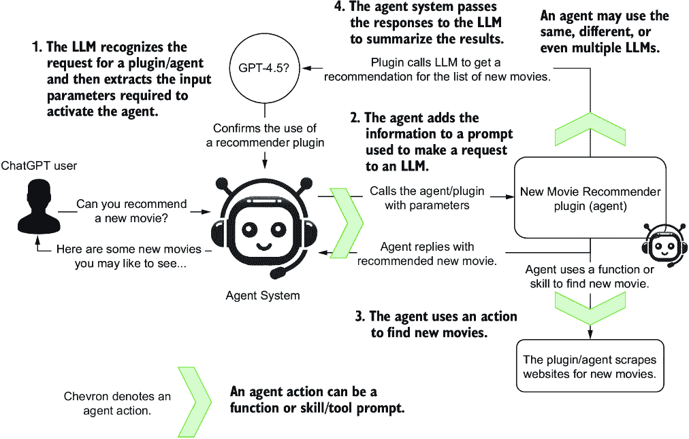
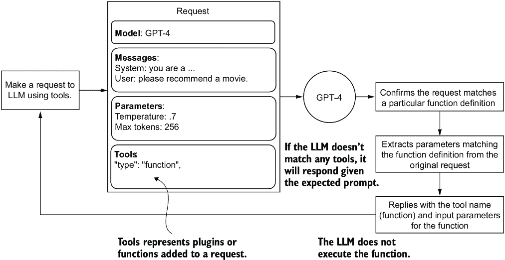
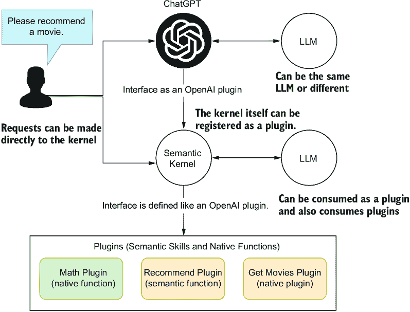
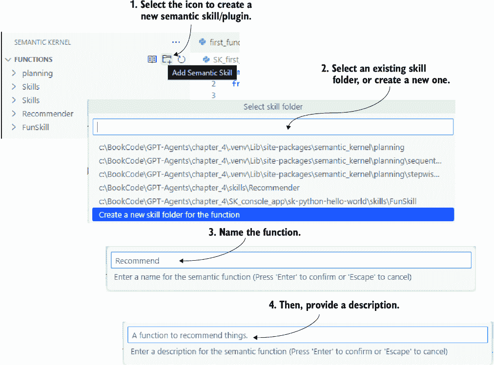
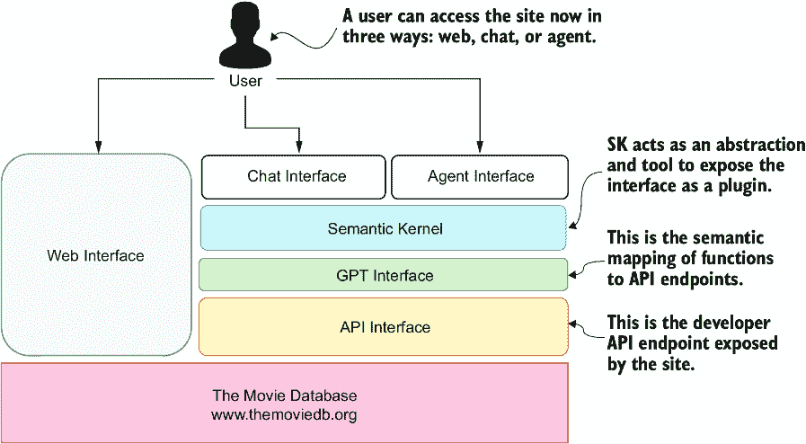

# 第五章：赋能动作代理

### 本章涵盖

+   代理如何使用动作在自身之外进行行动

+   定义和使用 OpenAI 函数

+   语义内核及其使用语义函数的方法

+   协同语义和本地函数

+   使用语义内核实例化 GPT 接口

在本章中，我们通过函数的使用来探讨动作，以及代理如何使用它们。我们将首先查看 OpenAI 函数调用，然后迅速转向微软的另一个项目，称为语义内核（SK），我们将使用它来构建和管理代理或作为代理的技能和函数。

我们将使用 SK 来完成本章，以托管我们的第一个代理系统。这将是一个包含大量注释代码示例的完整章节。

## 5.1 定义代理动作

ChatGPT 插件首次推出是为了提供具有能力、技能或工具的会话。有了插件，你可以搜索网络或创建电子表格或图表。插件为 ChatGPT 提供了扩展平台的方式。

图 5.1 展示了 ChatGPT 插件的工作方式。在这个例子中，ChatGPT 中安装了一个新的电影推荐插件。当用户要求 ChatGPT 推荐一部新电影时，大型语言模型（LLM）识别出它有一个用于管理该动作的插件。然后，它将用户请求分解为可操作的参数，并将这些参数传递给新的电影推荐器。


##### 图 5.1 ChatGPT 插件的工作方式以及插件和其他外部工具（例如，API）如何与“使用外部工具”提示工程策略相一致

推荐器随后抓取展示新电影的网站，并将该信息附加到对 LLM 的新提示请求中。有了这些信息，LLM 会回应推荐器，推荐器将此信息传递回 ChatGPT。然后 ChatGPT 对用户做出推荐请求的回应。

我们可以将插件视为动作的代理。插件通常封装了一个或多个能力，例如调用 API 或抓取网站。因此，动作是插件的扩展——它们赋予了插件能力。

AI 代理可以被视为插件和插件的消费者、工具、技能和其他代理。向代理/插件添加技能、函数和工具允许它执行定义良好的动作——图 5.2 强调了代理动作发生的位置及其与 LLM 和其他系统的交互。



##### 图 5.2 代理如何使用动作执行外部任务

代理动作是允许它使用函数、技能或工具的能力。令人困惑的是，不同的框架使用不同的术语。我们将定义动作为代理可以执行以建立一些基本定义的任何操作。

ChatGPT 插件和函数代表了 ChatGPT 或代理系统可以用来执行额外动作的可执行能力。现在让我们来检查 OpenAI 插件和函数定义的基础。

## 5.2 执行 OpenAI 函数

OpenAI 通过启用插件，引入了一种结构规范，用于定义函数/插件与 LLM 之间的接口。这个规范正在成为 LLM 系统可以遵循的标准，以提供可执行的系统。

这些相同的函数定义现在也被用来定义 ChatGPT 和其他系统的插件。接下来，我们将探讨如何直接使用 LLM 调用来使用函数。

### 5.2.1 将函数添加到 LLM API 调用中

图 5.3 展示了 LLM 如何识别和使用函数定义来将其响应作为函数调用。



##### 图 5.3 如何解释单个 LLM 请求，包括工具

列表 5.1 显示了使用工具和函数定义进行 LLM API 调用的详细信息。添加函数定义允许 LLM 回复有关函数的输入参数。这意味着 LLM 将识别正确的函数并解析用户请求的相关参数。

##### 列表 5.1 `first_function.py` (API 调用)

```py
response = client.chat.completions.create(
        model="gpt-4-1106-preview",
        messages=[{"role": "system",
                   "content": "You are a helpful assistant."},
                  {"role": "user", "content": user_message}],
        temperature=0.7,
        tools=[     #1
            {
                "type": "function",     #2
                "function": {
                    "name": "recommend",
                    "description": "Provide a … topic.",     #3
                    "parameters": {
                        "type": "object",     #4
                        "properties": {
                            "topic": {
                                "type": "string",
                                "description": 
                                   "The topic,… for.",     #5
                            },
                            "rating": {
                                "type": "string",
                                "description": 
                          "The rating … given.",    #5
                                "enum": ["good",
                                         "bad", 
                                         "terrible"]     #6
                                },
                        },
                        "required": ["topic"],
                    },
                },
                }
            ]
        )
```

#1 新参数称为 tools

#2 设置工具的类型以执行功能

#3 提供了关于函数功能的出色描述

#4 定义输入参数的类型；一个对象代表一个 JSON 文档。

#5 为每个输入参数提供出色的描述

#6 您甚至可以用枚举的方式来描述。

要了解这是如何工作的，请打开 Visual Studio Code (VS Code) 到书籍的源代码文件夹：`chapter_4/first_function.py`。在 VS Code 中打开相关章节文件夹以创建一个新的 Python 环境并安装 `requirements.txt` 文件是一个好习惯。如果您需要这方面的帮助，请参阅附录 B。

在开始之前，请正确设置 `chapter_4` 文件夹中的 `.env` 文件，并包含您的 API 凭据。函数调用是 LLM 商业服务提供的额外功能。在撰写本文时，此功能不是开源 LLM 部署的选项。

接下来，我们将查看 `first_function.py` 代码的底部，如列表 5.2 所示。这里只是使用列表 5.1 中指定的先前请求对 LLM 进行调用的两个示例。在这里，每个请求都显示了运行示例生成的输出。

##### 列表 5.2 `first_function.py` (练习 API)

```py
user = "Can you please recommend me a time travel movie?"
response = ask_chatgpt(user)     #1
print(response)

**###Output**
Function(arguments='{"topic":"time travel movie"}', 
                      name='recommend')     #2

user = "Can you please recommend me a good time travel movie?"
response = ask_chatgpt(user)     #3
print(response)

**###Output**
Function(arguments='{"topic":"time travel movie",
                     "rating":"good"}',
 name='recommend')     #4
```

#1 之前定义的函数

#2 返回要调用的函数名称和提取的输入参数

#3 之前定义的函数

#4 返回要调用的函数名称和提取的输入参数

使用调试器（F5）或终端在 VS Code 中运行 `first_function.py` Python 脚本，以查看相同的结果。在这里，LLM 解析输入请求以匹配任何已注册的工具。在这种情况下，工具是单个函数定义，即推荐的函数。LLM 从该函数中提取输入参数，并从请求中解析这些参数。然后，它以命名函数和指定的输入参数的形式回复。

备注：实际函数并未被调用。LLM 只返回建议的函数和相关的输入参数。必须提取名称和参数，并将它们传递给一个与签名匹配的函数以执行该函数。我们将在下一节中查看一个示例。

### 5.2.2 执行函数调用

现在我们已经明白 LLM 不会直接执行函数或插件，我们可以看看一个执行工具的示例。继续遵循推荐主题，我们将看看另一个添加 Python 函数以进行简单推荐的示例。

图 5.4 展示了这个简单示例的工作原理。我们将提交一个包含工具函数定义的单个请求，请求三个推荐。LLM 随后将回复三个带有输入参数的函数调用（时间旅行、食谱和礼物）。执行函数的结果随后被传递回 LLM，它将它们转换回自然语言并返回一个回复。


##### 图 5.4 一个示例请求返回三个工具函数调用，然后将结果提交回 LLM 以返回一个自然语言回复。

现在我们已经理解了这个示例，请在 VS Code 中打开`parallel_functions.py`。列表 5.3 显示了您想要调用的 Python 函数，以提供推荐。

##### 列表 5.3 `parallel_functions.py` (推荐函数)

```py
def recommend(topic, rating="good"):
    if "time travel" in topic.lower():     #1
        return json.dumps({"topic": "time travel",
                           "recommendation": "Back to the Future",
                           "rating": rating})
    elif "recipe" in topic.lower():    #1
        return json.dumps({"topic": "recipe",
                           "recommendation": "The best thing … ate.",
                           "rating": rating})
    elif "gift" in topic.lower():      #1
        return json.dumps({"topic": "gift",
                           "recommendation": "A glorious new...",
                           "rating": rating})
    else:     #2
        return json.dumps({"topic": topic,
                           "recommendation": "unknown"})     #3
```

#1 检查字符串是否包含在主题输入中

#2 如果未检测到主题，则返回默认值

#3 返回一个 JSON 对象

接下来，我们将查看名为`run_conversation`的函数，所有的工作都是从请求构建开始的。

##### 列表 5.4 `parallel_functions.py` (`run_conversation`, `request`)

```py
user = """Can you please make recommendations for the following:
1\. Time travel movies
2\. Recipes
3\. Gifts"""     #1
messages = [{"role": "user", "content": user}]     #2
tools = [     #3
    {
        "type": "function",
        "function": {
            "name": "recommend",
            "description": 
                "Provide a recommendation for any topic.",
            "parameters": {
                "type": "object",
                "properties": {
                    "topic": {
                        "type": "string",
                        "description": 
                              "The topic, … recommendation for.",
                        },
                        "rating": {
                            "type": "string",
                            "description": "The rating … was given.",
                            "enum": ["good", "bad", "terrible"]
                            },
                        },
                "required": ["topic"],
                },
            },
        }
    ]
```

#1 用户消息请求三个推荐。

#2 注意没有系统消息。

#3 将函数定义添加到请求的工具部分

列表 5.5 显示了请求的执行，我们之前已经讨论过，但有一些需要注意的事项。这个调用使用了一个较低模型，如 GPT-3.5，因为委托函数是一个更直接的任务，可以使用较旧、较便宜、不太复杂的语言模型来完成。

##### 列表 5.5 `parallel_functions.py` (`run_conversation`, API 调用)

```py
response = client.chat.completions.create(
    model="gpt-3.5-turbo-1106",     #1
    messages=messages,     #2
    tools=tools,     #2
    tool_choice="auto",   #3
)
response_message = response.choices[0].message     #4
```

#1 委托给函数的 LLM 可以是更简单的模型。

#2 添加消息和工具定义

#3 auto 是默认值。

#4 LLM 返回的消息

在这个阶段，API 调用之后，响应应该包含所需函数调用的信息。记住，我们要求 LLM 提供三个推荐，这意味着它也应该提供三个函数调用输出，如下所示。

##### 列表 5.6 `parallel_functions.py` (`run_conversation`, `tool_calls`)

```py
tool_calls = response_message.tool_calls     #1
if tool_calls:    #1
    available_functions = {
        "recommend": recommend,
    }     #2
    # Step 4: send the info for each function call and function response to 
the model
    for tool_call in tool_calls:     #3
        function_name = tool_call.function.name
        function_to_call = available_functions[function_name]
        function_args = json.loads(tool_call.function.arguments)
        function_response = function_to_call(
            topic=function_args.get("topic"),     #4
            rating=function_args.get("rating"),
        )
        messages.append(     #5
            {
                "tool_call_id": tool_call.id,
                "role": "tool",
                "name": function_name,
                "content": function_response,
            }
        )  # extend conversation with function response
    second_response = client.chat.completions.create(     #6
        model="gpt-3.5-turbo-1106",
        messages=messages,
    )
    return second_response.choices[0].message.content  #6
```

#1 如果响应包含工具调用，则执行它们。

#2 只有一个函数，但可能包含多个

#3 遍历调用并将内容回放给 LLM

#4 从提取的参数中执行推荐函数

#5 将每个函数调用的结果附加到消息集合中

#6 使用更新后的信息向 LLM 发送另一个请求，并返回消息回复

工具调用输出和推荐函数调用的结果被附加到消息中。注意现在消息还包含了第一次调用的历史。然后这些信息被传递回 LLM 以构建自然语言回复。

在 VS Code 中通过按 F5 键并打开文件来调试此示例。以下列表显示了运行`parallel_functions.py`的输出。

##### 列表 5.7 `parallel_functions.py`（输出）

```py
Here are some recommendations for you:

1\. Time travel movies: "Back to the Future"
2\. Recipes: "The best thing you ever ate."
3\. Gifts: "A glorious new..." (the recommendation was cut off, so I 
couldn't provide the full recommendation)

I hope you find these recommendations helpful! Let me know if you need 
more information.
```

这完成了这个简单的演示。对于更高级的应用，函数可以执行各种任务，从抓取网站到调用搜索引擎，甚至完成更复杂的任务。

函数是针对特定任务输出的一种优秀方式。然而，处理函数或工具以及进行二次调用的任务可以通过更干净、更高效的方式进行。下一节将揭示为代理添加动作的更稳健的系统。

## 5.3 介绍语义内核

语义内核（SK）是微软的另一个开源项目，旨在帮助构建 AI 应用，我们称之为代理。在其核心，该项目最好用于定义动作，或者平台所说的*语义插件*，它们是技能和函数的包装器。

图 5.5 展示了如何将 SK 用作插件以及 OpenAI 插件的消费者。SK 依赖于 OpenAI 插件定义来定义插件。这样，它可以消费并发布自身或其他插件到其他系统。



##### 图 5.5 语义内核如何作为一个插件集成，并且也可以消费插件

OpenAI 插件定义精确映射到列表 5.4 中的函数定义。这意味着 SK 是 API 工具调用（即插件）的协调者。这也意味着 SK 可以帮助通过聊天界面或代理组织多个插件。

注意：SK 团队最初将功能模块标记为*技能*。然而，为了与 OpenAI 保持一致，他们已经将*技能*重命名为*插件*。更令人困惑的是，代码仍然使用术语*技能*。因此，在本章中，我们将使用*技能*和*插件*来表示同一概念。

SK 是管理多个插件（代理的动作）的有用工具，正如我们稍后将会看到的，它还可以帮助记忆和规划工具。对于本章，我们将专注于动作/插件。在下一节中，我们将探讨如何开始使用 SK。

### 5.3.1 开始使用 SK 语义函数

SK 易于安装，并在 Python、Java 和 C#中工作。这是一个好消息，因为它还允许在一个语言中开发的插件在另一种语言中被消费。然而，你目前还不能在一个语言中开发原生函数并在另一个语言中使用它。

我们将继续使用 VS Code 中的`chapter_4`工作空间来处理 Python 环境。如果你想要探索和运行任何示例，请确保你已经配置了一个工作空间。

列表 5.8 展示了如何在 VS Code 的终端中安装 SK。你也可以安装 SK 的 VS Code 扩展。这个扩展可以是一个创建插件/技能的有用工具，但不是必需的。

##### 列表 5.8 安装语义内核

```py
pip uninstall semantic-kernel     #1

git clone https://github.com/microsoft/semantic-kernel.git     #2

cd semantic-kernel/python     #3

pip install -e .     #4
```

#1 卸载 SK 的任何先前安装

#2 将仓库克隆到本地文件夹

#3 对源文件夹的更改

#4 从源文件夹安装可编辑的包

安装完成后，打开`SK_connecting.py`。列表 5.9 展示了通过 SK 快速运行示例的演示。该示例使用 OpenAI 或 Azure OpenAI 创建聊天完成服务。

##### 列表 5.9 `SK_connecting.py`

```py
import semantic_kernel as sk

selected_service = "OpenAI"     #1
kernel = sk.Kernel()     #2

service_id = None
if selected_service == "OpenAI":
    from semantic_kernel.connectors.ai.open_ai import OpenAIChatCompletion

    api_key, org_id = sk.openai_settings_from_dot_env()     #3
    service_id = "oai_chat_gpt"
    kernel.add_service(
        OpenAIChatCompletion(
            service_id=service_id,
            ai_model_id="gpt-3.5-turbo-1106",
            api_key=api_key,
            org_id=org_id,
        ),
    )
elif selected_service == "AzureOpenAI":
    from semantic_kernel.connectors.ai.open_ai import AzureChatCompletion

    deployment, api_key, endpoint = 
↪ sk.azure_openai_settings_from_dot_env()   #4
    service_id = "aoai_chat_completion"
    kernel.add_service(
        AzureChatCompletion(
            service_id=service_id,
            deployment_name=deployment,
            endpoint=endpoint,
            api_key=api_key,
        ),
    )

#This function is currently broken
async def run_prompt():
    result = await kernel.invoke_prompt( 
              ↪ prompt="recommend a movie about 
↪ time travel")     #5
    print(result)

# Use asyncio.run to execute the async function
asyncio.run(run_prompt())     #6

###Output
One highly recommended time travel movie is "Back to the Future" (1985) 
directed by Robert Zemeckis. This classic film follows the adventures of 
teenager Marty McFly (Michael J. Fox)…
```

#1 设置你使用的服务（OpenAI 或 Azure OpenAI）

#2 创建内核

#3 从 .env 文件加载机密信息并将其设置在聊天服务上

#4 从 .env 文件加载机密信息并将其设置在聊天服务上

#5 调用提示

#6 异步调用函数

通过按 F5（调试）运行示例，你应该会看到一个类似于列表 5.9 的输出。这个示例演示了如何使用 SK 创建并执行语义函数。语义函数相当于提示流中的提示模板，这是另一个微软工具。在这个例子中，我们定义一个简单的提示作为一个函数。

需要注意的是，这个语义函数并不是定义为插件。然而，内核可以创建一个自包含的语义元素，该元素可以针对一个 LLM 执行。语义函数可以单独使用或注册为插件，正如你稍后将会看到的。让我们跳到下一节，我们将介绍上下文变量。

### 5.3.2 语义函数和上下文变量

在上一个示例的基础上，我们可以看看如何向语义函数添加上下文变量。这种在提示模板中添加占位符的模式是我们将反复回顾的。在这个例子中，我们查看一个具有主题、类型、格式和自定义占位符的提示模板。

在 VS Code 中打开`SK_context_variables.py`，如下一个列表所示。提示相当于设置提示的`system`和`user`部分。

##### 列表 5.10 `SK_context_variables.py`

```py
#top section omitted…
prompt = """     #1
system:

You have vast knowledge of everything and can recommend anything provided 
you are given the following criteria, the subject, genre, format and any 
other custom information.

user:
Please recommend a {{$format}} with the subject {{$subject}} and {{$genre}}.
Include the following custom information: {{$custom}}
"""

prompt_template_config = sk.PromptTemplateConfig(     #2
    template=prompt,
    name="tldr",
    template_format="semantic-kernel",
    input_variables=[
        InputVariable(
            name="format", 
            description="The format to recommend", 
            is_required=True
        ),
        InputVariable(
            name="suject", 
            description="The subject to recommend", 
            is_required=True
        ),
        InputVariable(
            name="genre", 
            description="The genre to recommend", 
            is_required=True
        ),
        InputVariable(
            name="custom",
            description="Any custom information [CA]
                       to enhance the recommendation",
            is_required=True,
        ),
    ],
    execution_settings=execution_settings,
)

recommend_function = kernel.create_function_from_prompt(     #3
    prompt_template_config=prompt_template_config,
    function_name="Recommend_Movies",
    plugin_name="Recommendation",
)

async def run_recommendation(     #4
    subject="time travel",
    format="movie", 
    genre="medieval", 
           custom="must be a comedy"
):
    recommendation = await kernel.invoke(
        recommend_function,
        sk.KernelArguments(subject=subject,
                      format=format, 
                      genre=genre, 
                      custom=custom),     #5
    )
    print(recommendation)

# Use asyncio.run to execute the async function
asyncio.run(run_recommendation())    #5

###Output
One movie that fits the criteria of being about time travel, set in a 
medieval period, and being a comedy is "The Visitors" (Les Visiteurs) 
from 1993\. This French film, directed by Jean-Marie Poiré, follows a 
knight and his squire who are transported to the modern era by a 
wizard’s spell gone wrong.…
```

#1 定义一个带有占位符的提示

#2 配置提示模板和输入变量定义

#3 从提示创建内核函数

#4 创建一个异步函数来包装函数调用

#5 设置内核函数参数

尝试调试这个示例（F5），等待输出生成。这是设置 SK 和创建及练习语义函数的基础。在下一节中，我们将继续了解如何将语义函数注册为技能/插件。

## 5.4 语义函数和本地函数的协同作用

语义函数封装了一个提示/配置文件并通过与 LLM 的交互来执行。原生函数是封装了可能从抓取网站到搜索网络的任何操作的代码。语义和原生函数都可以在 SK 内核中注册为插件/技能。

一个函数，无论是语义还是原生，都可以注册为插件，并像我们直接通过 API 调用注册早期函数一样使用。当一个函数注册为插件时，它将根据用例对聊天或代理接口变得可访问。下一节将探讨如何创建和注册语义函数与内核。

### 5.4.1 创建和注册语义技能/插件

SK 的 VS Code 扩展提供了创建插件/技能的有用工具。在本节中，我们将使用 SK 扩展创建一个插件/技能，然后编辑该扩展的组件。之后，我们将在 SK 中注册并执行该插件。

图 5.6 展示了在 VS Code 中使用 SK 扩展创建新技能的过程。（如果您需要安装此扩展，请参阅附录 B 的说明。）然后，您将获得将函数放置在技能/插件文件夹中的选项。始终将相似的功能分组在一起。创建技能后，输入您想要开发的函数的名称和描述。务必像 LLM 将要使用它一样描述该函数。



##### 图 5.6 创建新技能/插件的过程

您可以通过打开 `skills/plugin` 文件夹并查看文件来查看已完成的技能和函数。我们将遵循之前构建的示例，因此打开 `skills/Recommender/Recommend_Movies` 文件夹，如图 5.7 所示。在这个文件夹中有一个 `config.json` 文件，函数描述，以及一个名为 `skprompt.txt` 的语义函数/提示文件。


##### 图 5.7 语义函数技能/插件的文件和文件夹结构

列表 5.11 展示了语义函数定义的内容，也称为插件定义。请注意，类型被标记为 `completion` 而不是 `function` 类型，因为这是一个语义函数。我们将定义原生函数为类型函数。

##### 列表 5.11 `Recommend_Movies/config.json`

```py
{
    "schema": 1,
    "type": "completion",     #1
    "description": "A function to recommend movies based on users list of 
previously seen movies.",
    "completion": {     #2
        "max_tokens": 256,
        "temperature": 0,
        "top_p": 0,
        "presence_penalty": 0,
        "frequency_penalty": 0
    },
    "input": {
        "parameters": [
            {
                "name": "input",     #3
                "description": "The users list of previously seen movies.",
                "defaultValue": ""
            }
        ]
    },
    "default_backends": []
}
```

#1 语义函数是完成类型的函数。

#2 我们还可以设置函数调用的完成参数。

#3 定义了输入到语义函数的参数

接下来，我们可以查看语义函数提示的定义，如图表 5.12 所示。格式略有不同，但我们在这里看到的内容与之前使用模板的示例相匹配。此提示基于用户之前看过的电影列表推荐电影。

##### 列表 5.12 `Recommend_Movies/skprompt.txt`

```py
You are a wise movie recommender and you have been asked to recommend a 
movie to a user.
You are provided a list of movies that the user has watched before.
You want to recommend a movie that the user has not watched before.
[INPUT]
{{$input}}
[END INPUT]
```

现在，我们将深入探讨加载技能/插件并在简单示例中执行它的代码。在 VS Code 中打开 `SK_first_skill.py` 文件。以下列表显示了一个突出显示新部分的缩略版本。

##### 列表 5.13 SK_first_skill.py（缩略列表）

```py
kernel = sk.Kernel()

plugins_directory = "plugins"

recommender = kernel.import_plugin_from_prompt_directory(
    plugins_directory,
    "Recommender",
)     #1

recommend = recommender["Recommend_Movies"]

seen_movie_list = [     #2
    "Back to the Future",
    "The Terminator",
    "12 Monkeys",
    "Looper",
    "Groundhog Day",
    "Primer",
    "Donnie Darko",
    "Interstellar",
    "Time Bandits",
    "Doctor Strange",
]

async def run():
    result = await kernel.invoke(
        recommend,
        sk.KernelArguments(     #3
            settings=execution_settings, input=", ".join(seen_movie_list)
        ),
    )
    print(result)

asyncio.run(run())     #4

###Output
Based on the list of movies you've provided, it seems you have an 
interest in science fiction, time travel, and mind-bending narratives. 
Given that you've watched a mix of classics and modern films in this 
genre, I would recommend the following movie that you have not watched 
before:

"Edge of Tomorrow" (also known as "Live Die Repeat: Edge of Tomorrow")…
```

#1 从插件文件夹加载提示

#2 用户之前看过的电影列表

#3 将已看电影的列表设置为连接列表。

#4 函数异步执行。

代码从 `skills` 目录和 `plugin` 文件夹加载技能/插件。当一个技能被加载到内核中而不是仅仅创建时，它就成为一个已注册的插件。这意味着它可以直接执行，就像这里所做的那样，或者通过插件接口通过 LLM 聊天对话执行。

运行代码（F5），你应该会看到一个类似于列表 5.13 的输出。我们现在有一个简单的语义函数，它可以作为插件托管。然而，这个函数需要用户输入他们看过的电影完整列表。我们将在下一节介绍原生函数，以探讨如何解决这个问题。

### 5.4.2 应用原生函数

如前所述，原生函数是可以做任何事情的代码。在以下示例中，我们将介绍一个原生函数来帮助我们在之前构建的语义函数。

此原生函数将从文件中加载用户之前看过的电影列表。虽然这个函数引入了记忆的概念，但我们将在第八章讨论这个问题。将这个新的原生函数视为任何可以虚拟做任何事情的代码。

可以使用 SK 扩展创建和注册原生函数。对于这个例子，我们将直接在代码中创建原生函数，以便使示例更容易理解。

在 VS Code 中打开 `SK_native_functions.py`。我们将首先查看原生函数是如何定义的。原生函数通常在类内部定义，这简化了原生函数的管理和实例化。

##### 列表 5.14 `SK_native_functions.py` (`MySeenMovieDatabase`)

```py
class MySeenMoviesDatabase:
    """
    Description: Manages the list of users seen movies.     #1
    """
    @kernel_function(     #2
        description="Loads a list of movies … user has already seen",
        name="LoadSeenMovies",
    )
    def load_seen_movies(self) -> str:     #3
        try:
            with open("seen_movies.txt", 'r') as file:     #4
                lines = [line.strip() for line in file.readlines()]
                comma_separated_string = ', '.join(lines)
            return comma_separated_string
        except Exception as e:
            print(f"Error reading file: {e}")
            return None
```

#1 为容器类提供描述

#2 使用装饰器提供函数描述和名称

#3 实际的函数返回一个以逗号分隔的字符串形式的电影列表。

#4 从文本文件中加载已看电影

原生函数定义后，我们可以通过在文件中向下滚动查看其使用方法，如下所示列表。

##### 列表 5.15 `SK_native_functions`（剩余代码）

```py
plugins_directory = "plugins"

recommender = kernel.import_plugin_from_prompt_directory(
    plugins_directory,
    "Recommender",
)     #1

recommend = recommender["Recommend_Movies"]

seen_movies_plugin = kernel.import_plugin_from_object(
    MySeenMoviesDatabase(), "SeenMoviesPlugin"
)     #2

load_seen_movies = seen_movies_plugin["LoadSeenMovies"]     #3

async def show_seen_movies():
    seen_movie_list = await load_seen_movies(kernel)
    return seen_movie_list

seen_movie_list = asyncio.run(show_seen_movies())     #4
print(seen_movie_list)

async def run():      #5
    result = await kernel.invoke(
        recommend,
        sk.KernelArguments(
                settings=execution_settings,
                input=seen_movie_list),
    )
    print(result)

asyncio.run(run())    #5

###Output
The Matrix, The Matrix Reloaded, The Matrix Revolutions, The Matrix 
Resurrections – `*output from print statement*`
Based on your interest in the "The Matrix" series, it seems you enjoy 
science fiction films with a strong philosophical undertone and action 
elements. Given that you've watched all
```

#1 按照之前所示加载语义函数

#2 将技能导入内核并注册该函数为插件

#3 加载原生函数

#4 执行函数并将列表作为字符串返回

#5 将插件调用封装在一个异步函数中并执行

一个需要注意的重要方面是本地函数如何导入到内核中。将函数导入内核的行为将此函数注册为插件/技能。这意味着该函数可以通过其他对话或交互从内核中作为技能使用。我们将在下一节中看到如何在语义函数中嵌入本地函数。

### 5.4.3 在语义函数中嵌入本地函数

SK 中有很多强大的功能，但一个有益的功能是能够在其他语义函数中嵌入本地或语义函数。以下列表显示了如何在一个语义函数中嵌入本地函数。

##### 列表 5.16 `SK_semantic_native_functions.py` (`skprompt`)

```py
sk_prompt = """
You are a wise movie recommender and you have been asked to recommend a 
movie to a user.
You have a list of movies that the user has watched before.
You want to recommend a movie that 
the user has not watched before.     #1
Movie List: {{MySeenMoviesDatabase.LoadSeenMovies}}.     #2
"""
```

#1 与之前相同的精确指令文本

#2 通过类名和函数名引用和识别本地函数。

下一示例，`SK_semantic_native_functions.py`，使用了内联本地和语义函数。在 VS Code 中打开文件，以下列表显示了创建、注册和执行函数的代码。

##### 列表 5.17 `SK_semantic_native_functions.py`（缩略）

```py
prompt_template_config = sk.PromptTemplateConfig(
    template=sk_prompt,
    name="tldr",
    template_format="semantic-kernel",
    execution_settings=execution_settings,
)     #1

recommend_function = kernel.create_function_from_prompt(
    prompt_template_config=prompt_template_config,
    function_name="Recommend_Movies",
    plugin_name="Recommendation",
)     #2

async def run_recommendation():     #3
    recommendation = await kernel.invoke(
        recommend_function,
        sk.KernelArguments(),
    )
    print(recommendation)

# Use asyncio.run to execute the async function
asyncio.run(run_recommendation())
###Output
Based on the list provided, it seems the user is a fan of the Matrix 
franchise. Since they have watched all four existing Matrix movies, I 
would recommend a…
```

#1 为提示创建提示模板配置

#2 从提示中创建内联语义函数

#3 异步执行语义功能

运行代码，你应该会看到一个类似于列表 5.17 的输出。一个需要注意的重要方面是，本地函数已注册到内核中，但语义函数没有。这很重要，因为函数创建不会注册函数。

为了使此示例正确工作，本地函数必须使用`import_plugin`函数调用（列表 5.17 中的第一行）注册到内核中。然而，语义函数本身并没有注册。注册函数的一个简单方法是将它做成插件并导入。

这些简单的练习展示了将插件和技能集成到聊天或代理界面中的方法。在下一节中，我们将查看一个完整的示例，展示如何将代表服务或 GPT 接口的插件添加到聊天功能中。

## 5.5 语义内核作为交互式服务代理

在第一章中，我们介绍了 GPT 接口的概念——通过插件和语义层将服务和其他组件连接到 LLMs 的新范式。SK 为将任何服务转换为 GPT 接口提供了一个出色的抽象。

图 5.8 展示了一个围绕名为 The Movie Database (TMDB; [www.themoviedb.org](http://www.themoviedb.org))的 API 服务构建的 GPT 界面。TMDB 网站提供了一个免费的 API，可以公开电影和电视节目的信息。



##### 图 5.8 这层架构图显示了 GPT 接口和语义内核在聊天或代理界面中被暴露的作用。

要跟随本节的练习，您必须从 TMDB 注册一个免费账户并创建一个 API 密钥。获取 API 密钥的说明可以在 TMDB 网站上找到（[www.themoviedb.org](http://www.themoviedb.org)）或通过询问 GPT-4 turbo 或更近期的 LLM。

在接下来的几节中，我们将使用 SK 原生函数集创建一个 GPT 接口。然后，我们将使用 SK 内核测试该接口，并在本章的后面部分将其作为插件实现到聊天功能中。在下一节中，我们将探讨如何针对 TMDB API 构建 GPT 接口。

### 5.5.1 构建语义 GPT 接口

TMDB 是一个出色的服务，但它不提供语义服务或可以插入到 ChatGPT 或代理中的服务。为了做到这一点，我们必须在 TMDB 公开的 API 调用周围包装一个语义服务层。

语义服务层是一个 GPT 接口，通过自然语言公开函数。正如讨论的那样，要将函数公开给 ChatGPT 或其他如代理等接口，它们必须被定义为插件。幸运的是，SK 可以自动为我们创建插件，前提是我们正确编写我们的语义服务层。

原生插件或一组技能可以作为语义层。要创建原生插件，创建一个新的插件文件夹，并在该文件夹中放置一个包含一组原生函数的 Python 文件。目前 SK 扩展没有很好地做到这一点，所以手动创建模块效果最好。

图 5.9 展示了名为`Movies`的新插件和名为`tmdb.py`的语义服务层的结构。对于原生函数，使用父文件夹的名称（`Movies`）进行导入。


##### 图 5.9 TMDB 插件的文件夹和文件结构

在 VS Code 中打开`tmdb.py`文件，查看文件顶部，如图 5.18 所示。此文件包含一个名为`TMDbService`的类，它公开了几个映射到 API 端点调用的函数。想法是将这个语义服务层中的各种相关 API 函数调用映射出来。这将使函数作为聊天或代理接口的插件公开。

##### 列表 5.18 `tmdb.py`（文件顶部）

```py
from semantic_kernel.functions import kernel_funct
import requests
import inspect

def print_function_call():     #1
    #omitted …

class TMDbService:     #2
    def __init__(self):
        # enter your TMDb API key here
        self.api_key = "your-TMDb-api-key"

    @kernel_function(     #2
        description="Gets the movie genre ID for a given genre name",
        name="get_movie_genre_id",
        input_description="The movie genre name of the genre_id to get",
        )
    def get_movie_genre_id(self, genre_name: str) -> str:     #3
        print_function_call()
        base_url = "https://api.themoviedb.org/3"
        endpoint = f"{base_url}/genre/movie/list↪
                     ↪ ?api_key={self.api_key}&language=en-US"

        response = requests.get(endpoint)     #4
        if response.status_code == 200:    #4
            genres = response.json()['genres']
            for genre in genres:
                if genre_name.lower() in genre['name'].lower():
                    return str(genre['id'])     #5
        return None
```

#1 打印函数调用以进行调试

#2 顶级服务和装饰器用于描述函数（好的描述很重要）

#3 被语义包装器包装的函数；应返回 str

#4 调用 API 端点，如果成功（代码 200），则检查匹配的类型

#5 找到类型，返回 id

`TMDbService`的代码以及调用 TMDB 端点的函数大部分是在 GPT-4 Turbo 的帮助下编写的。然后，每个函数都被`sk_function`装饰器包装以公开其语义。

TMDB API 的一些调用已经被语义化了。列表 5.19 展示了向语义服务层公开的函数的另一个示例。这个函数可以拉取特定类型的当前最热门的 10 部电影列表。

##### 列表 5.19 `tmdb.py` (`get_top_movies_by_genre`)

```py
@kernel_function(     #1
        description="””
Gets a list of currently playing movies for a given genre””",
        name="get_top_movies_by_genre",
        input_description="The genre of the movies to get",
        )
    def get_top_movies_by_genre(self, genre: str) -> str:
        print_function_call()
        genre_id = self.get_movie_genre_id(genre)     #2
        if genre_id:
            base_url = "https://api.themoviedb.org/3
            playing_movies_endpoint = f"{base_url}/movie/now_playing?↪
↪ api_key={self.api_key}&language=en-US"
            response = requests.get(
                          playing_movies_endpoint)     #3
            if response.status_code != 200:
                return ""

            playing_movies = response.json()['results'
            for movie in playing_movies:     #4
                movie['genre_ids'] = [str(genre_id)  
                      ↪ for genre_id in movie['genre_ids']]
            filtered_movies = [movie for movie ↪
↪ in playing_movies if genre_id ↪
↪ in movie['genre_ids']][:10]     #5
            results = ", ".join([movie['title'] for movie in filtered_movies])
            return results
        else:
            return ""
```

#1 使用描述装饰函数

#2 根据给定的类型名称查找 genre id

#3 获取当前正在上映的电影列表

#4 将 genre_ids 转换为字符串

#5 检查是否 genre id 与电影类型匹配

查看其他映射为语义的 API 调用。如您所见，将 API 调用转换为语义服务的模式已经定义得很好。在我们运行完整服务之前，我们将在下一节测试每个函数。

### 5.5.2 测试语义服务

在实际应用中，您可能希望为每个语义服务函数编写一套完整的单元或集成测试。我们在这里不会这样做；相反，我们将编写一个快速的帮助脚本以测试各种函数。

在 VS Code 中打开`test_tmdb_service.py`，并查看代码，如图表 5.20 所示。您可以注释和取消注释任何函数以单独测试它们。确保一次只取消注释一个函数。

##### 列表 5.20 `test_tmdb_service.py`

```py
import semantic_kernel as sk
from plugins.Movies.tmdb import TMDbService

async def main():
    kernel = sk.Kernel()     #1

    tmdb_service = kernel.import_plugin_from_object ↪
↪ (TMDbService(), "TMDBService")     #2

    print(
        await tmdb_service"get_movie_genre_id"     #3
        )
    )     #4
    print(
        await tmdb_service"get_tv_show_genre_id"     #5
        )
    )     #6
    print(
        await tmdb_service"get_top_movies_by_genre"     #7
        )
    )     #8
    print(
        await tmdb_service"get_top_tv_shows_by_genre"    #7
        )
    )
    print(await tmdb_service"get_movie_genres"))                        #9
    print(await tmdb_service"get_tv_show_genres"))                       #9

# Run the main function
if __name__ == "__main__":
    import asyncio

    asyncio.run(main())     #10

###Output
Function name: get_top_tv_shows_by_genre     #11
Arguments:
  self = <skills.Movies.tmdb.TMDbService object at 0x00000159F52090C0>
  genre = action
Function name: get_tv_show_genre_id    #11
Arguments:
  self = <skills.Movies.tmdb.TMDbService object at 0x00000159F52090C0>
  genre_name = action
Arcane, One Piece, Rick and Morty, Avatar: The Last Airbender, Fullmetal 
Alchemist: Brotherhood, Demon Slayer: Kimetsu no Yaiba, Invincible, 
Attack on Titan, My Hero Academia, Fighting Spirit, The Owl House
```

#1 实例化内核

#2 导入插件服务

#3 在需要时将输入参数传递给函数

#4 执行并测试各种函数

#5 在需要时将输入参数传递给函数

#6 执行并测试各种函数

#7 在需要时将输入参数传递给函数

#8 执行并测试各种函数

#9 执行并测试各种函数

#10 异步执行主函数

#11 调用打印函数详细信息以通知函数正在被调用

在这个测试中展示了 SK 的真正力量。注意`TMDbService`类是如何作为一个插件导入的，但我们不需要定义除了我们之前已经做的任何插件配置？通过只写一个封装了一些 API 函数的类，我们已经以语义方式公开了 TMDB API 的一部分。现在，函数公开后，我们可以在下一节中查看它们如何作为聊天界面的插件使用。

### 5.5.3 与语义服务层的交互式聊天

当 TMDB 函数以语义方式公开时，我们可以继续将它们集成到聊天界面中。这将使我们能够在这个界面中自然地进行对话以获取各种信息，例如当前的热门电影。

在 VS Code 中打开`SK_service_chat.py`。向下滚动到创建函数的新代码部分的开始，如图表 5.21 所示。这里创建的函数现在作为插件公开，除了我们过滤掉的聊天函数，我们不希望将其作为插件公开。这里的聊天函数允许用户直接与 LLM 进行对话，不应作为插件。

##### 列表 5.21 `SK_service_chat.py`（函数设置）

```py
system_message = "You are a helpful AI assistant."

tmdb_service = kernel.import_plugin_from_object(
TMDbService(), "TMDBService")     #1

# extracted section of code
execution_settings = sk_oai.OpenAIChatPromptExecutionSettings(
        service_id=service_id,
        ai_model_id=model_id,
        max_tokens=2000,
        temperature=0.7,
        top_p=0.8,
        tool_choice="auto",
        tools=get_tool_call_object(
            kernel, {"exclude_plugin": ["ChatBot"]}),     #2
    )

prompt_config = sk.PromptTemplateConfig.from_completion_parameters(
    max_tokens=2000,
    temperature=0.7,
    top_p=0.8,
    function_call="auto",
    chat_system_prompt=system_message,
)     #3
prompt_template = OpenAIChatPromptTemplate(
    "{{$user_input}}", kernel.prompt_template_engine, prompt_config
)     #4

history = ChatHistory()

history.add_system_message("You recommend movies and TV Shows.")
history.add_user_message("Hi there, who are you?")
history.add_assistant_message(
    "I am Rudy, the recommender chat bot. I'm trying to figure out what 
people need."
)     #5

chat_function = kernel.create_function_from_prompt(
    prompt_template_config=prompt_template,
    plugin_name="ChatBot",
    function_name="Chat",
)     #6
```

#1 将 TMDbService 作为插件导入

#2 配置执行设置并添加过滤工具

#3 配置提示配置

#4 定义输入模板并接受完整的字符串作为用户输入

#5 添加聊天历史对象并填充一些历史记录

#6 创建聊天函数

接下来，我们可以继续在同一文件中滚动以审查聊天函数，如下列所示。

##### 列表 5.22 `SK_service_chat.py`（聊天函数）

```py
async def chat() -> bool:
    try:
        user_input = input("User:> ")     #1
    except KeyboardInterrupt:
        print("\n\nExiting chat...")
        return False
    except EOFError:
        print("\n\nExiting chat...")
        return False

    if user_input == "exit":     #2
        print("\n\nExiting chat...")
        return False
    arguments = sk.KernelArguments(     #3
        user_input=user_input,
        history=("\n").join(
           [f"{msg.role}: {msg.content}" for msg in history]),
    )
    result = await chat_completion_with_tool_call(     #4
        kernel=kernel,
        arguments=arguments,
        chat_plugin_name="ChatBot",
        chat_function_name="Chat",
        chat_history=history,
    )
    print(f"AI Agent:> {result}")
    return True
```

#1 输入直接来自终端/控制台。

#2 如果用户输入 exit，则退出聊天。

#3 创建传递给函数的参数

#4 使用实用函数调用函数并执行工具

最后，滚动到文件底部，并审查主函数。这是调用循环中聊天函数的代码。

##### 列表 5.23 `SK_service_chat.py`（主函数）

```py
async def main() -> None:
    chatting = True
    context = kernel.create_new_context()

    print("Welcome to your first AI Agent\     #1
\n  Type 'exit' to exit.\
\n  Ask to get a list of currently playing movies by genre."
    )
    while chatting:     #2
        chatting, context = await chat(context)     #3

if __name__ == "__main__":
    asyncio.run(main())
```

#1 对用户的介绍

#2 继续直到聊天为 False

#3 异步调用聊天函数

运行聊天界面，运行文件（F5），然后询问特定类型的电影或电视节目。示例对话会话如列表 5.24 所示。此输出显示了请求列出两个类型的电影时，聊天界面如何多次调用 `get_top_movie_by_genre` 函数。

##### 列表 5.24 `SK_service_chat.py`（示例对话）

```py
Welcome to your first AI Agent
  Type 'exit' to exit.
  Ask to get a list of currently playing movies by genre.
User:> Input: can you give me list of the current top playing movies for 
the action and comedy genres?

Function name: get_top_movies_by_genre     #1
Arguments:
  genre = action
Function name: get_movie_genre_id     #2
Arguments:
  genre_name = action
Function name: get_top_movies_by_genre    #1
Arguments:
  genre = comedy
Function name: get_movie_genre_id    #2
Arguments:
  genre_name = comedy
Agent:> Here are the current top-playing movies 
for the action and comedy genres:

**Action:**     #3
1\. The Hunger Games: The Ballad of Songbirds & Snakes
2\. Rebel Moon - Part One: A Child of Fire
3\. Aquaman and the Lost Kingdom
4\. Silent Night
5\. The Family Plan
6\. Freelance
7\. Migration
8\. Sound of Freedom
9\. Godzilla Minus One

**Comedy:**     #4
1\. The Family Plan
2\. Wonka
3\. Freelance
4\. Saltburn
5\. Chicken Run: Dawn of the Nugget
6\. Trolls Band Together
7\. There's Something in the Barn
8\. Migration

Please note that some movies may overlap in both genres, such as 
"The Family Plan" and "Freelance ."
```

#1 LLM 调用两次 get_top_movies_by_genre。

#2 内部调用以获取类型 ID

#3 当前最受欢迎的动作电影列表

#4 当前最受欢迎的喜剧电影列表

一定要探索聊天界面的边界以及你可以从 TMDB 服务中请求的内容。例如，尝试请求电影或电视节目的类型列表。这个服务是一个很好的尝试，但我们可能做得更好，正如我们将在下一节中看到的那样。

## 5.6 在编写语义服务时进行语义思考

现在我们已经看到了将 API 转换为语义服务接口的出色演示。就目前而言，这些函数返回当前正在上映的电影和电视节目的标题。然而，仅仅返回标题，我们限制了 LLM 自行解析结果的能力。

因此，我们将创建 `TMDbService` 的 v2 版本来纠正这个问题，并将结果作为 JSON 字符串返回。在 VS Code 中打开文件 `tmdb_v2.py`，并滚动到 `get_top_movies_by_genre` 函数。

##### 列表 5.25 `tmdb_v2.py` (`get_top_movies_by_genre`)

```py
def get_top_movies_by_genre(self, genre: str) -> str:
        print_function_call()
        genre_id = self.get_movie_genre_id(genre)
        if genre_id:
            #same code …

            return json.dumps(filtered_movies)     #1
        else:
            return ""
```

#1 现在返回一个过滤后的 JSON 字符串列表

现在在 VS Code 中打开 `SK_service_chat.py` 文件，注释和取消注释列表 5.26 中显示的行。这将使用 `TMDbService` 的第 2 个版本，该版本以单个字符串的形式输出完整的 JSON 文档结果。

##### 列表 5.26 `SK_service_chat.py`（修改导入）

```py
#from skills.Movies.tmdb import TMDbService     #1
from skills.Movies.tmdb_v2 import TMDbService     #2
```

#1 注释掉这一行。

#2 取消注释此行以使用服务的第 2 个版本。

在 VS Code 中重新运行 `SK_service_chat.py` 文件，并稍微修改你的查询，如下列所示。

##### 列表 5.27 `SK_service_chat.py`（`TMDb_v2` 服务输出）

```py
User:> get a list of currently playing movies for the 
action genre and only return movies about space     #1
Agent:> To find currently playing action movies that are specifically 
about space, I will need to manually filter the provided list for those 
that have space-related themes in their overview. Here's what fits that 
criteria from the list:

1\. **Rebel Moon - Part One: A Child of Fire**     #2
   - Release Date: 2023-12-15
   - Overview: When a peaceful colony on the edge of the galaxy finds 
itself threatened by the armies of the tyrannical Regent Balisarius, 
they dispatch Kora, a young woman with a mysterious past, to seek out 
warriors from neighboring planets to help them take a stand.

This is the only movie from the provided list that clearly mentions a 
space-related theme in its overview. …
```

#1 新查询要求包含额外的空间过滤器

#2 LLM 调用服务并审查匹配过滤器的返回结果。

由于语义服务函数现在以 JSON 格式返回完整的电影列表，LLM 可以应用额外的过滤。这是语义服务的真正力量，允许你通过 LLM 处理数据。我们不会仅仅通过返回标题列表来看到这种力量。

这个最后一个练习展示了在编写语义服务层时你需要做出的心态转变。通常，你通常会希望返回尽可能多的信息。返回更多信息可以利用 LLM 独立过滤、排序和转换数据的能力。在下一章中，我们将探讨使用行为树构建自主代理。

## 5.7 练习

完成以下练习以提高你对材料的了解：

+   *练习 1*—创建温度转换的基本插件

*目标*—熟悉创建简单的 OpenAI 聊天完成 API 插件。

*任务:*

+   +   开发一个在摄氏度和华氏度之间转换温度的插件。

    +   通过将其集成到简单的 OpenAI 聊天会话中测试插件，用户可以请求温度转换。

+   *练习 2*—开发天气信息插件

*目标*—学习创建执行独特任务的插件。

*任务:*

+   +   为 OpenAI 聊天完成 API 创建一个插件，从公共 API 获取天气信息。

    +   确保插件可以处理用户对不同城市当前天气状况的请求。

+   *练习 3*—制作一个创意语义功能

*目标*—探索创建语义功能。

*任务:*

+   +   开发一个基于用户输入写诗或讲述儿童故事的语义功能。

    +   在聊天会话中测试该函数，以确保它生成创意和连贯的输出。

+   *练习 4*—使用原生函数增强语义功能

*目标*—了解如何结合语义和原生函数。

*任务:*

+   +   创建一个使用原生函数增强其功能的语义功能。

    +   例如，开发一个生成餐单的语义功能，并使用原生函数获取食材的营养信息。

+   *练习 5*—使用语义内核封装现有的 Web API

*目标*—学习将现有的网络 API 封装为语义服务插件。

*任务:*

+   +   使用 SK 将新闻 API 封装并作为聊天代理中的语义服务插件公开。

    +   确保插件可以处理用户对各种主题的最新新闻文章的请求。

## 摘要

+   代理动作扩展了代理系统的功能，如 ChatGPT。这包括向 ChatGPT 和 LLM 添加插件以作为动作代理的能力。

+   OpenAI 支持在 OpenAI API 会话中定义函数和插件。这包括向 LLM API 调用中添加函数定义，并理解这些函数如何允许 LLM 执行额外的操作。

+   语义内核（SK）是微软的一个开源项目，可用于构建 AI 应用程序和代理系统。这包括语义插件在定义原生和语义函数中的作用。

+   语义函数封装了用于与 LLM 互动的提示/配置文件模板。

+   原生函数封装了使用 API 或其他接口执行或执行动作的代码。

+   语义函数可以与其他语义或原生函数结合，并在执行阶段相互层叠。

+   SK 可以在语义服务层上创建一个 GPT 接口，并在聊天或代理接口插件中暴露它们。

+   语义服务代表了 LLMs（大型语言模型）和插件之间的交互，以及这些概念在实际创建高效 AI 代理中的应用实现。
