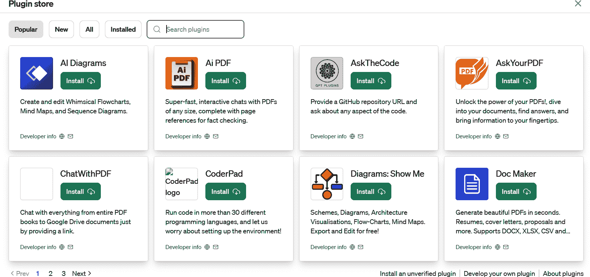
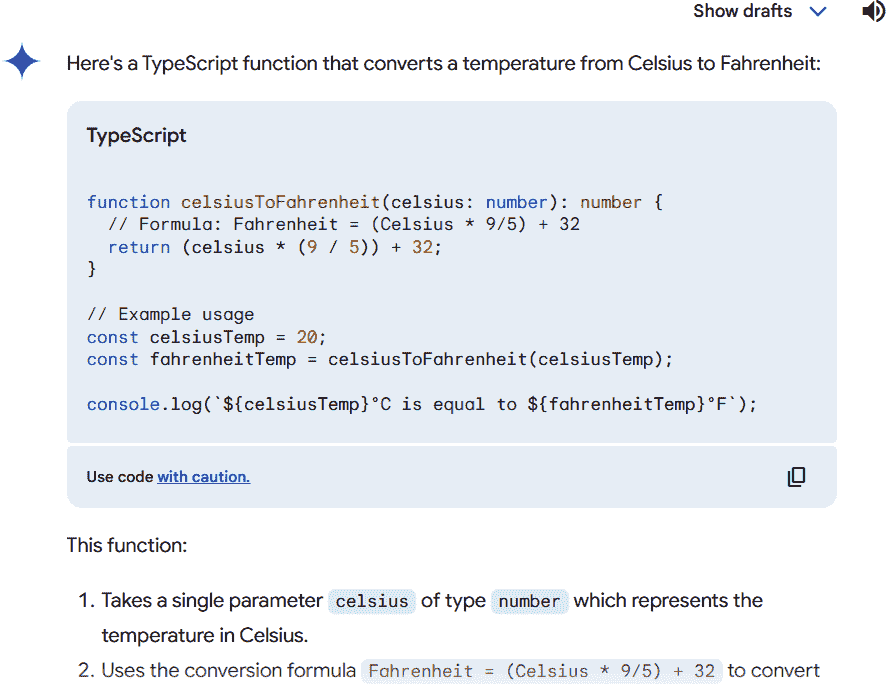
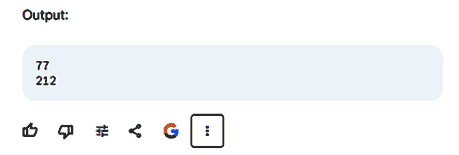
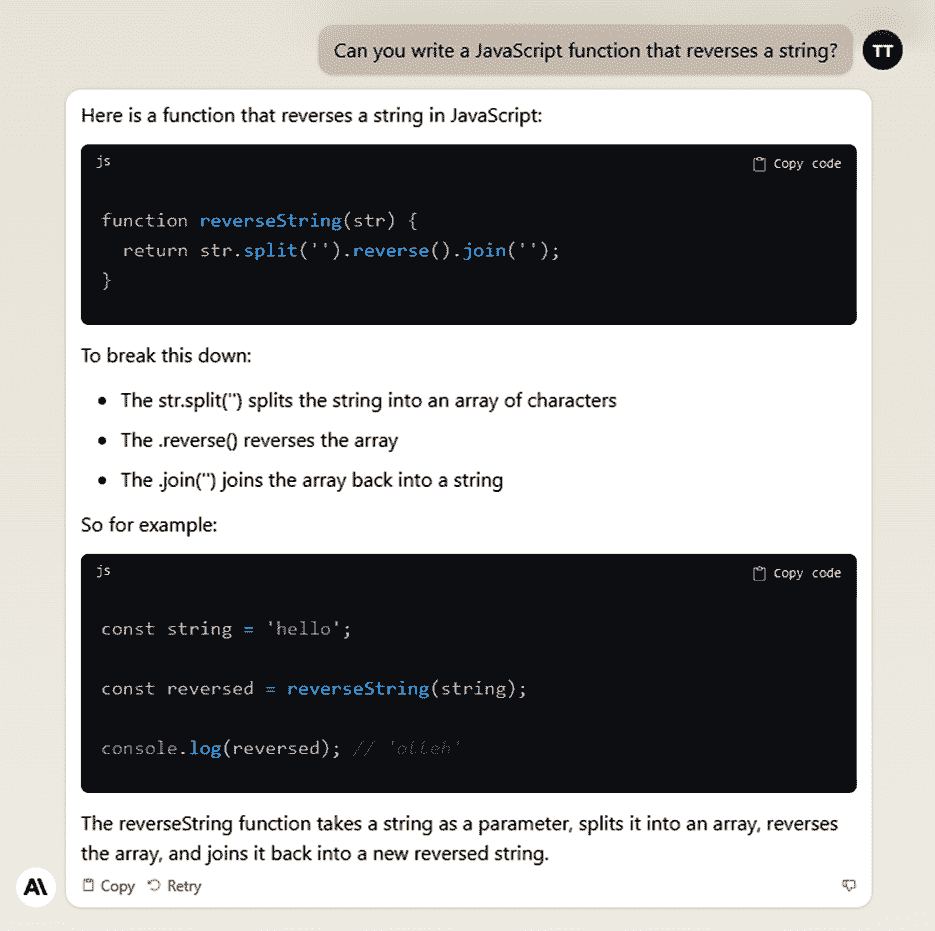

# 第六章\. ChatGPT 与其他通用型 LLM

在本章中，我们将深入研究一些广泛使用的通用型大型语言模型，它们可以生成代码。当然，它们可能没有像那些专注于编码的模型那样拥有所有功能——例如与 IDE 的集成、复杂的安保或用于训练模型的代码类型的防护措施——但它们仍然令人印象深刻。此外，它们不仅限于编码；在规划和头脑风暴方面也非常出色。

我们将探讨像 ChatGPT、Gemini 和 Claude 这样的知名聊天机器人。我将介绍如何设置它们，它们的成本，它们酷炫的功能以及如何最大限度地利用它们。

# ChatGPT

ChatGPT，即 Chat Generative Pretrained Transformer，于 2022 年 11 月 30 日一夜之间走红。作为该应用的幕后推手，OpenAI 并没有在营销上大张旗鼓。结果证明，他们其实没有必要。ChatGPT 迅速走红并迅速病毒式传播。

在短短五天内，这个应用吸引了 100 万用户，在几个月内，用户数量 [激增至 1 亿](https://oreil.ly/jgzv7)。它成为互联网历史上增长最快的平台。

帮助 OpenAI 制定政策的 Sandhini Agarwal [指出](https://oreil.ly/54fAU)，“我认为对于所有人来说，人们开始使用它的程度确实是一个惊喜。我们一直在研究这些模型，有时会忘记它们对外界来说有多么令人惊讶。”

热潮持续增长。到 9 月，ChatGPT 的访问量超过 150 亿次，[收入飙升至 12 亿美元](https://oreil.ly/Xlv3B)，与 2022 年的 2800 万美元相比，增长巨大。但这并不仅仅是 ChatGPT 本身。还有 OpenAI API 的繁荣业务。

让我们快速回顾一下 OpenAI 的背景。它成立于 2015 年，并得到了硅谷一些知名人士的支持，如埃隆·马斯克、山姆·奥特曼、格雷格·布罗克曼、伊利亚·苏茨克维、约翰·舒尔曼和沃伊切赫·扎伦巴。他们准备投入高达 10 亿美元的资金来推动项目的发展。

OpenAI 作为一个非营利组织启动，具有更多的学术氛围，主要由数据科学和 AI 的博士组成。其使命是实现通用人工智能（AGI），这项技术可以在大多数重要任务上超越人类。这个目标具有利他主义成分：利用 AGI 为大众谋福利，避免任何可能伤害人们或给予少数人过多权力的用途。

在早期，OpenAI 专注于研究和与他人分享其发现。该组织公开了其专利和代码，与其他机构携手合作。但创建尖端生成式 AI 系统的成本高昂。

为了保持其宏伟的梦想并吸引合适的人才，OpenAI 在 2019 年创建了一家“有上限”的盈利公司。这意味着他们现在可以合法地从风险投资和战略投资者那里获得现金，并给他们的员工一份收益。同年，微软投资了 10 亿美元。几轮投资后，微软总共投资了约 30 亿美元。快进到 2023 年 4 月，这家科技巨头全情投入，一次性投入了惊人的 100 亿美元。

# GPT-4

OpenAI 的 GPT-4 模型在代码生成方面表现出卓越的灵活性，这得益于其多样化的训练数据，涵盖了广泛的来源。这种广泛的训练使得 GPT-4 在多个专业和学术基准测试中达到了人类水平的表现，并且 GPT-4 在大多数编程语言中一直优于 GPT-3 和 GPT-3.5。这主要归功于其增强的自然语言复杂指令遵循能力，以及生成具有更深度的技术或创意作品的能力。另一个关键因素是 32K 的上下文窗口。

有趣的是，当在特定的代码生成基准测试中进行评估时，集成了 Reflexion 框架（一个基于 LLMs 创建复杂代理的框架）的 GPT-4 增强版在 HumanEval 上取得了令人印象深刻的[88%的通过率](https://oreil.ly/DFaDj)。这个分数显著高于 GPT-4 基础版本的 67%通过率。这表明，经过某些改进，GPT-4 可以在代码生成任务中达到最先进的性能。

当在 Codeforces 平台上的编程竞赛场景中进行比较时，[GPT-4 获得了 392 分的评级](https://oreil.ly/icUjw)，超过了 GPT-3.5 的 260 分。然而，GPT-4 在编程竞赛的世界中仍然是一个新手，这些分数位于底部 5%。尽管 GPT-4 已经取得了很大的进步，但它仍然需要在艰难的编码挑战中追赶以匹配人类的技能。

# 导航 ChatGPT

对于这一章，我将使用 ChatGPT 的高级版本，ChatGPT Plus。每月订阅费用为 20 美元。

这里是您将获得的一些酷炫功能：

总是在线

即使每个人都试图使用 ChatGPT，高级订阅用户在高峰时段也能获得优先访问权。

快速回复

使用 ChatGPT Plus，事情进展得更快。您能更快地得到答案，使聊天更加顺畅和有趣。

首先尝试新功能

如果有新的功能或升级，Plus 会员将有机会在其他人之前尝试。

最新模型

您可以访问它。

图 6-1 显示了 ChatGPT 的界面。

在屏幕左上角，您可以悬停在下拉菜单上以选择您想要的模型或访问插件商店。在屏幕左侧，您可以点击一个按钮来创建一个新的聊天会话。在底部，您将看到您的用户个人资料，在那里您可以获取有关您的 ChatGPT 计划的信息，更改您的设置，并添加自定义指令。您还可以更改 UI 的主题：选项包括系统、深色和浅色。然后在底部，有一个输入框，您可以在其中输入提示。


###### 图 6-1\. ChatGPT 系统的界面允许您选择您想要的 GPT 模型并输入提示

让我们尝试一些功能。假设您想创建代码。您可以将以下内容输入到 ChatGPT 中：

> *提示:* 编写一个计算数字阶乘的 Python 代码片段。

图 6-2 显示了响应。

假设您想看看是否有其他创建代码的方法。您可以询问：

> *提示:* 有没有其他方法可以创建这个代码？

ChatGPT 提供了另一种代码建议，称为迭代方法。但如果您不知道这是什么？再次，您可以继续您的聊天。您这样做时，聊天会话将被记录在屏幕左上角，正如您在图 6-3 中看到的那样。ChatGPT 将聊天标记为“Python 中的阶乘计算”。如果您愿意，可以通过点击旁边的图标来重命名它。还有一个删除图标。


###### 图 6-2\. ChatGPT 根据提示创建了一个 Python 代码片段


###### 图 6-3\. ChatGPT 在屏幕左上角记录聊天会话

想要创建一个新的会话？点击顶部的铅笔图标。您将得到一个空白屏幕。

请记住，每个会话都是独立的。所以如果您在后续会话中询问 ChatGPT 为阶乘计算创建的代码，它将不知道您指的是什么。

另一个需要考虑的是聊天会话的上下文窗口。这很重要，因为它决定了模型可以“记住”并用于生成连贯且上下文相关的响应的前一个对话或文本的多少。对于 GPT-3.5，上下文窗口是 16K，但对于 GPT-4，它是 32K。

###### 注意

如果您想删除所有聊天线程，请点击屏幕左下角的个人资料，并选择设置和 Beta。然后点击清除按钮。

当您选择个人资料并然后设置和 Beta 时，您会发现其他 ChatGPT 数据的选项：

关闭聊天历史记录和模型训练

如果您关闭聊天历史记录，新的聊天将不会被用于 AI 训练，也不会在侧面板的历史记录中显示。但 OpenAI 仍然会保留所有聊天 30 天，然后才会永久删除，主要是出于法律目的。

分享聊天

有一个有趣的线程吗？您可以将其转换为链接并与他人分享。

下载您的聊天数据

选择这个选项，你将收到包含所有 ChatGPT 对话的电子邮件。

###### 注意

有时，ChatGPT 可能在生成文本的过程中突然停止。当这种情况发生时，通常你会看到一个继续按钮弹出。点击该按钮以继续生成文本。如果没有按钮，只需在提示中输入“继续输出”。如果它没有给你想要的结果，只需点击停止生成按钮来暂停它。

## 移动应用

ChatGPT 在 iOS 和 Android 设备上都能为你提供支持。这些应用与网页版相当相似，尽管至少目前，它们还没有插件等特性。

你可以在手机上与 ChatGPT 进行语音聊天。如果你不喜欢在小型屏幕上打字，这将非常方便。只需前往设置中的新功能部分，选择加入以开始使用。一旦你开启了此功能，点击主屏幕右上角的耳机图标即可开始与 ChatGPT 交谈。你可以从五个不同的声音中选择，让 ChatGPT 进行回复。这个声音系统得益于一个名为 Whisper 的生成式 AI 文本到语音模型。

ChatGPT 的移动版通过允许你与助手分享图片，让聊天变得更加有趣。你可以拍摄任何东西的照片，比如物体、地标，甚至是代码，然后与 ChatGPT 就它进行聊天。应用中还有一个巧妙的绘图工具，所以当你谈论图片时，你可以突出显示图片的特定部分。

## 自定义指令

在 ChatGPT 中使用自定义指令，你可以调整回复的方式以适应你的需求。这个功能可以节省你的时间，因为你不需要每次与机器人聊天时都不断微调回复或想出新提示。你可以在个人资料中开启自定义指令。

当你设置自定义指令时，你需要回答以下两个问题：

> *ChatGPT:* 你希望 ChatGPT 了解哪些关于你的信息，以便提供更好的回答？
> 
> *ChatGPT:* 你希望 ChatGPT 如何回答？

让我们举一个例子：

> *ChatGPT:* 你希望 ChatGPT 了解哪些关于你的信息，以便提供更好的回答？
> 
> *开发者:* 我是一名程序员，与一个遵循 PEP 8 风格指南的 Python 代码团队一起工作。我们重视代码的整洁和可读性，并坚持最佳实践。我通常从事数据处理和分析任务，并且经常需要帮助编写高效且结构良好的代码。
> 
> *ChatGPT:* 你希望 ChatGPT 如何回答？
> 
> *开发者:* 我希望 ChatGPT 提供遵循 PEP 8 风格指南的 Python 代码片段。它应该优先考虑可读性和编码的最佳实践。在提出解决方案时，我更喜欢解释为什么建议特定的方法以及它如何与 PEP 8 标准相一致。如果 ChatGPT 能指出与当前任务相关的任何常见陷阱或错误，并提供避免它们的技巧，我将不胜感激。

# 使用 Bing 浏览

ChatGPT 的训练截止于 2023 年 4 月。这对开发者来说可能是个问题。随着库、框架和工具变化如此之快，自那时起可能已经出现了许多新功能或能力，而 ChatGPT 可能无法跟上这些更新。

但 ChatGPT 还有一招：使用 Bing 进行浏览。这让你可以进行实时网络搜索以得出答案。

假设你正在检查一个新的框架，比如 LangChain。它自 2022 年底以来一直存在，并且已经发展了很多。它还旨在使使用 LLM 进行应用开发更加顺畅，所以你可能想使用它。

要激活 Bing 浏览并增强 ChatGPT 对 LangChain 当前状态的了解，请在你的提示中添加类似“使用互联网作为此回答”的内容。以下是一些旨在获取有关 LangChain 的一般信息的提示示例：

> *提示:* 告诉我关于 LangChain 框架及其主要特性的信息。使用互联网作为回答。
> 
> *提示:* 在互联网上查找有关如何开始使用 LangChain 的入门资源或文档。
> 
> *提示:* 在互联网上查找使用 LangChain 框架构建的应用程序示例。
> 
> *提示:* 查找与 LangChain 框架相关的任何最新更新或发布。使用互联网作为回答。

当响应这些提示时，ChatGPT 确实提供了相当有用的答案。例如，对于第一个提示，ChatGPT 提出了 LangChain 的五个主要特性，你可以在图 6-4 中看到。

你还可以更改此内容的格式。尝试这个提示：

> *提示:* 将此内容转换为表格。

图 6-5 显示了结果。


###### 图 6-4\. 使用 Bing 浏览功能帮助 ChatGPT 研究 LangChain 框架的主要特性


###### 图 6-5\. 当被要求这样做时，ChatGPT 可以将其输出放入表格

当你使用 Bing 浏览时，ChatGPT 可能需要几秒钟或甚至一分钟以上才能回答。有时 ChatGPT 可能会卡住并抛出错误。你可能需要尝试几次才能得到答案。ChatGPT 有时可能会情绪化。

当你使用 Bing 浏览时，输出通常会包含指向信息来源的网页链接。点击它验证内容是个好主意。毕竟，你必须对 ChatGPT 生成的所有内容持保留态度。有时响应可能来自社交媒体帖子，例如，这并不总是最可靠的信息来源。

幸运的是，你可以指导 ChatGPT 专注于某些类型的来源。表 6-1 提供了一些建议。

表 6-1\. 指导 ChatGPT 使用特定信息来源的方法

| 方法 | 描述 |
| --- | --- |
| 域限制 | 使用站点操作符将搜索限制在像*.edu*或*.gov*或特定可信赖的组织等可信赖的域。 |
| 学术关键词的使用 | 包括*同行评审*、*期刊*、*研究*和*研究*等例子。 |
| 使用出版日期过滤器 | 通过最近出版日期过滤搜索，以获取最新和相关的信息。 |
| 专业或学术协会 | 指定专业或学术协会，以寻求权威的出版物或报告。 |

那么，ChatGPT 在为 LangChain 创建代码方面做得怎么样呢？让我们看看。这是一个简单程序的提示：

> *提示*：我想写一个使用 LangChain 框架的 Python 程序。它将具有以下功能：
> 
> 1. 从用户那里获取关于主题的输入。
> 
> 2. 选择要创建的内容类型：博客或社交媒体帖子。
> 
> 3. 使用 LangChain 访问 OpenAI API，根据主题创建博客或社交媒体帖子。

当我在 ChatGPT 中尝试这个功能时，结果，嗯，一般。当然，它准确地掌握了用户输入的基本 Python 代码结构——这并不令人惊讶，因为 ChatGPT 在 Python 方面很敏锐。但是，对于 LangChain 代码？完全偏离了轨道。它搞错了 LangChain 库的导入，还遗漏了一些其他的东西。此外，它对如何调用 OpenAI API 一无所知。

总结来说：使用 Bing 进行浏览主要适用于你日常的一般性问题——至少目前是这样。

# 繁琐的任务

软件开发很容易变得复杂，有很多步骤。你有很多事情要做，比如规划、编码和测试。其中真正令人沮丧的部分是重复的编码。它很无聊，而且浪费了很多时间。开发者经常陷入编写相同的例行代码、修复错误和检查代码的困境。诚然，这些都是重要的，但这并不是制作软件的有趣、创造性的部分。此外，试图跟上新的编程语言、框架和工具可能会让人感到不知所措。

类似于 ChatGPT 的人工智能工具可以减轻软件开发中那些无聊的部分。在接下来的几节中，我们将深入探讨这些领域。

## 正则表达式

*正则表达式*，或*regex*，是处理文本的一个很棒的工具。想象一下，它们就像一个强大的查找和替换功能，可以在字符字符串中找到模式。但是，这里的关键是：正则表达式就像学习一门全新的符号和命令语言。它可能是一个脑力激荡！试图记住所有那些奇怪的转义字符、点、方括号和其他未知符号的组合，足以让你头晕目眩。有时，感觉你需要一个秘密解码器才能理解这一切。

例如，考虑以下正则表达式模式：

> `^(?=.*[a-z])(?=.*[A-Z])(?=.*\d)(?=.*[@$!%*?&])[A-Za-z\d@$!%*?&]{8,}$`

这将用于验证强密码，确保它至少包含八个字符，包括一个大写字母、一个小写字母、一个数字和一个特殊字符。

你可能不会喜欢编写这些，但 ChatGPT 可以创建正则表达式。以下是一些常见示例：

> *提示:* 创建一个验证标准电子邮件地址的正则表达式模式。电子邮件应该以字母数字字符开头，后面可以跟有可选的点、连字符或下划线。然后是一个“@”符号，接着是更多的字母数字字符，一个点，最后是一个 2 到 6 个字符长的域名。
> 
> *正则表达式模式:* ^[a-zA-Z0-9._-]+@[a-zA-Z0-9.-]+\.[a-zA-Z]{2,6}$
> 
> *提示:* 给我提供一个验证 URL 的正则表达式模式。URL 可以以“http”或“https”开头，然后是“://”，接着是一个域名，该域名可以包含字母数字字符和点。在域名之后，可以有一个可选的路径，以“/”开头，可以包含字母数字字符、斜杠、点或连字符。URL 可以以可选的“/”结尾。
> 
> *正则表达式模式:* ^(?:https?:\/\/)?([\da-z.-]+)\.([a-z.]{2,6})([\/\w .-]*)*\/?$
> 
> *提示:* 创建一个验证 MM/DD/YYYY 格式的日期的正则表达式模式。月份应该在 01 到 12 之间，日期应该在 01 到 31 之间，年份应该在 1900 年代或 2000 年代。
> 
> *正则表达式模式:* ^((0[1-9]|1[0-2])\/(0[1-9]|[12][0-9]|3[01])\/(19|20)\d\d)$
> 
> *提示:* 我在寻找一个验证 IPv4 地址的正则表达式模式。每个八位字节应该是一个介于 0 和 255 之间的数字，并且八位字节应该由点分隔。为这个创建一个正则表达式模式。
> 
> *正则表达式模式:* ^((25[0-5]|2[0-4]\d|[0-1]?\d\d?)\.){3}(25[0-5]|2[0-4]\d|[0-1]?\d\d?)$

ChatGPT 也可以帮助你解析正则表达式模式。以下是一个示例提示：

> *提示:* 这个正则表达式是什么？^(\(\d{3}\)\s?|\d{3}[-.])\d{3}[-.]\d{4}$

响应是，这个正则表达式是为了匹配北美电话号码格式设计的。

## 起始代码

*起始代码* 是初始代码片段或模板，为你提供一个起点。毫无疑问，它可以节省大量时间。但起始代码也可以是一个学习工具。如果你是编程新手，浏览一些起始代码可以帮助你了解事物是如何工作的。更重要的是，起始代码有助于保持一致性，尤其是在大型团队中，每个人都需要保持一致。

这里有一个示例：

```py
const express = require('express');
const app = express();
const port = 3000;
app.get('/', (req, res) => {
 res.send('Hello, World!');
});
app.listen(port, () => {
 console.log(`Server running at http://localhost:${port}`);
});
```

这提供了一个简洁明了的示例，展示了使用 Express.js 创建的基本 Web 服务器，Express.js 是 Node.js 的一个流行的 Web 框架。由于其简单性和核心元素的使用，它是一个很好的起始代码。表 6-2 显示了一些起始代码的提示。

表 6-2. 起始代码提示

| 编程语言/框架 | 提示 |
| --- | --- |
| Node.js/Express.js | “提供一个基本的 Express.js 服务器的示例。” |
| React (JavaScript) | “我该如何创建一个简单的 React 组件？” |
| JavaScript | “你能给我展示如何在 JavaScript 中定义一个简单的函数吗？” |
| Android (Java) | “Java 中基本 Android Activity 的起始代码是什么？” |
| Python/Flask | “你能给我一个基本的 Flask 应用的示例吗？” |
| Vue.js (JavaScript) | “展示如何设置基本的 Vue 实例。” |
| Django (Python) | “我如何使用简单视图开始一个新的 Django 项目？” |
| Swift (iOS) | “Swift 中简单 UIViewController 的入门代码是什么？” |

## GitHub README

GitHub *README 文件* 实质上是仓库的欢迎页。在这里，您可以了解项目的所有信息——其目的、功能以及如何使用它。通常称为 *README.md*，它使用 Markdown 编写，用于使内容看起来更美观且易于阅读。您将在仓库的主页上看到 README。

一个写得好的 README 很重要，因为它可以让任何检查您项目的人的工作变得更顺畅。它设定了基调，并有助于使项目更清晰，无论用户是想使用项目还是想为其做出贡献。README 还将制定规则和预期。

编写 README 并不总是一件轻松的事情。您需要在提供所有详细信息的同时保持简洁。专注于编码的开发者可能会跳过重要部分，而没有意识到对他们来说显而易见的事情对其他人来说并不明显。

要编写一个好的 README，您确实需要一些写作技巧。但这并不一定是开发者的强项。此外，随着项目的增长和变化，保持 README 更新是一项单独的任务。是的，这可能是一项需要多任务处理的任务。

但有了 ChatGPT 的帮助，编写 README 可以变得轻而易举，内容应该相当扎实。让我们举一个例子。假设您刚刚开发了一个用于挖掘食谱的酷炫应用。以下是启动项目的提示：

> *提示:* 为名为“Recipe Finder”的项目编写 GitHub README。该项目使用 Vue.js 开发，帮助用户根据他们拥有的食材找到食谱。用户需要输入他们拥有的食材，应用将返回他们可以用这些食材烹饪的食谱列表。要启动，只需克隆仓库，运行 npm install，将您的 API 密钥插入到.env 文件中，然后执行 npm start 以启动应用。

ChatGPT 会创建项目的介绍，然后包括功能、入门、使用、贡献、许可证和致谢等部分。

对于 README 的一些部分，ChatGPT 做出了假设。例如，它指定该项目使用 MIT 许可证。但您可以继续提示 ChatGPT 提供更多关于项目的详细信息。

###### 注意

如果您不知道要使用什么开源许可证，请查看选择许可证（[*https://choosealicense.com*](https://choosealicense.com)），它提供了这方面的帮助。

# 跨浏览器兼容性

*跨浏览器兼容性* 指的是确保您的网站或 Web 应用在不同浏览器上都能正常工作。这很重要，因为您的用户可能使用各种浏览器（如 Chrome、Firefox、Safari 和 Edge）访问您的网站或应用，而这些浏览器都有不同的版本。

让我们看看 ChatGPT 如何帮助你应对这个挑战。表 6-3 展示了一些有用的提示。

表 6-3\. 浏览器兼容性提示

| 类别 | 提示 |
| --- | --- |
| HTML5 和 CSS3 功能 | “我想在我的输入字段中使用占位符属性，但在旧版本的 Internet Explorer 中不起作用。我该如何创建一个回退方案？” |
| CSS 前缀 | “我想在我的 CSS 中使用 transition 属性，但我想确保它在所有浏览器中都兼容。我该如何编写它？” |
| JavaScript 功能 | “我正在使用 JavaScript 中的 fetch 函数进行 HTTP 请求，但在 Internet Explorer 中不受支持。我该怎么办？” |

# Bash Commands

你输入到终端以与计算机系统交互的指令被称为*bash 命令*。它们让你能够执行许多任务，比如在文件中移动，监控计算机的运行情况，以及操作文件。

熟练掌握 bash 命令可能有些困难，尤其是如果你是 Unix/Linux 世界的初学者。一些命令的编写方式可能一开始看起来很晦涩难懂。真正精通它需要相当的时间和练习。此外，有很多命令，每个命令都有自己的一堆选项和变化。当然，互联网上有资源可以帮助你。即使是专业人士也可能很难记住不常用或最近才学到的命令。

然而，你可以将 ChatGPT 用作你的虚拟助手，以处理 bash 命令。以下是一些示例提示：

> *提示:* 我如何使用 bash 命令按修改时间列出目录中的所有文件？
> 
> *提示:* 什么 bash 命令可以用来计算文件中的行数？
> 
> *提示:* 我如何使用单个命令创建目录并进入它？
> 
> *提示:* 我如何将命令的输出重定向到文件？
> 
> *提示:* 什么命令可以搜索我系统上正在运行的具体进程？
> 
> *提示:* 我如何使用 bash 将目录压缩成 ZIP 文件？
> 
> *提示:* 我应该使用什么命令来更改 bash 中文件的权限？

# GitHub Actions

GitHub Actions 是一个集成到 GitHub 中的持续集成和持续部署（CI/CD）工具。它允许开发者直接在他们的仓库中设置、自定义和运行他们的软件开发工作流程。基本上，一个 GitHub Actions 工作流程是一组您在流程文件中定义的自动化过程。这些过程由作业组成，每个作业执行不同的任务，如运行命令、设置进程或运行操作。它们使用 YAML 语法编写，并在某些操作发生时启动，例如推送代码、创建新问题或安排时间。使用 GitHub Actions，开发者可以直接从 GitHub 构建测试和部署他们的代码，使他们的软件开发过程更加流畅和自动化。您可以共享、重用或甚至调整其他开发者的操作，这对于团队合作和在世界范围内分享自动化软件开发知识非常有用。

ChatGPT 可以帮助您创建 GitHub Actions。以下是一些提示：

> *提示:* 创建一个使用 Hugo 构建和部署静态网站的 GitHub Actions 工作流程模板，并将部署到 GitHub Pages。
> 
> *提示:* 为使用 Maven 的 Java 项目生成一个 GitHub Actions 工作流程模板，包括编译代码、运行测试和打包应用的步骤。
> 
> *提示:* 为 Docker 化的应用程序创建一个 GitHub Actions 工作流程模板，包括构建 Docker 镜像、将其推送到 Docker Hub 以及将其部署到 Kubernetes 集群的步骤。
> 
> *提示:* 为 React Native 移动应用程序生成一个 GitHub Actions 工作流程模板，包括安装依赖项、构建应用和将 APK 上传到指定的 Google Drive 文件夹的步骤。

# 插件

ChatGPT 插件是使用 OpenAI LLM 力量的迷你应用。它们打开了使用外部数据库和应用程序的大门。这就像拥有自己的小应用商店，类似于 iOS 或 Google Play。 

要使用插件，您首先需要确保您已激活该功能。前往您的个人资料，选择设置，然后选择测试功能。

您可以通过悬停在屏幕顶部的 GPT-4 图标上找到插件——然后选择插件。点击此按钮，您将看到图 6-6 所示的屏幕。

在顶部，您可以导航插件。您可以按热门、新、全部和已安装应用进行筛选。还有一个搜索框。



###### 图 6-6\. ChatGPT 插件商店为您提供了访问使用 OpenAI LLM 力量的迷你应用。

## Codecademy 插件

让我们尝试 Codecademy 的插件。首先，点击安装按钮。要激活它，请将鼠标移至屏幕顶部并点击向下箭头。然后点击 Codecademy 图标。

此插件有两个主要功能。一个是允许用户根据他们的目标和经验水平找到特定的课程或路径。例如，对 AI 和 ChatGPT 感兴趣的用户可以向插件请求课程推荐，它将提供一系列相关课程，包括课程描述以及课程是否免费或付费的信息。

接下来，该插件作为技术文档的快速参考工具，提供指向包含更详细信息的文档和文章的链接。

我们将测试这一部分：

> *提示：* 解释 JavaScript 数组最佳文档或文章是什么？

ChatGPT 提供了图 6-7 中所示的反应。

在顶部，一个图标显示系统正在访问 Codecademy 插件。下面是表明该主题有大量可用资源的文本。然而，该插件通过提供指向三份文档的链接来缩小范围。


###### 图 6-7。Codecademy 插件响应关于 JavaScript 数组的资源请求

## AskYourDatabase 插件

尼尤·谢尔登提出了这个插件想法，因为他经常使用 ChatGPT 编写 SQL 语句，这很麻烦。他每次都必须解释整个数据库模式，然后是一大堆复制粘贴输出到终端运行的操作。他想，“嘿，如果 ChatGPT 可以直接与数据库聊天会怎么样？”就这样，他开始着手创建 AskYourDatabase。

使用这个工具，你可以轻松地使用 ChatGPT 原型化数据库模式。然后，查询数据变得易如反掌。更好的是，你可以跳过那些通常需要大量设置的传统的商业智能（BI）工具。

## 重组 AI 插件

马克·扎姆是一位开发者，他创办了自己的 AI 咨询公司。他创建了重组 AI 插件，以使与 GitHub 和 Gitlab 仓库一起工作的开发者生活更加便捷。这个工具让 ChatGPT 能够理解整个程序，并筛选出细节。这样，用户可以牢固地掌握自己的代码，这在调整、分析或将自己的想法融入软件时非常有帮助。马克称之为“会话式 IDE”，这是一个相当不错的说法。

这里有一些它的应用：

+   执行传统任务，如存储代码片段或提示

+   使用项目和文件系统创建复杂任务列表和思维链提示

+   保存有关最新编程库的重要信息

# GPTs

你可以创建自己的定制 ChatGPT。它被称为 GPT，并且很容易组合——通常只需要几分钟。

让我们看看一个例子。我们将创建一个用于软件开发风格指南的 GPT。它包含了很多实用的指南，比如如何命名变量以便让每个人都能理解，正确的缩进代码的方式，以及团队遵循的具体编程模式或实践。这是你代码的着装规范。

目标是使一切统一整洁。这使得每个人都能更容易地阅读和理解代码库，这在大型项目中可能是一个救命稻草。

但这里有个问题：如果您是新手，可能会感到有些不知所措。您可能已经习惯了某种编程方式，突然您得适应新的标准。

这就是 GPT 可以帮助的地方。那么让我们创建一个。首先，在 ChatGPT 的主页面上——左上角——选择探索，然后选择创建 GPT。您将看到一个带有两个面板的屏幕，正如您在 图 6-8 中所看到的。

左侧面板是您构建 GPT 的位置，右侧是一个预览区域。为了使其与开发风格指南一起工作，您的提示将如下所示：

> *提示:* 创建一个强制执行软件开发风格指南的系统。


###### 图 6-8\. GPT 构建器让您创建自定义 GPT

ChatGPT 将开始为 GPT 创建指令。这个提示有些模糊，但 ChatGPT 将提出一些问题以获取更多信息。它首先会建议一个 GPT 的名称——建议“代码风格师”。

它将使用 DALL·E 3 为 GPT 创建一个个人资料图片。但您也可以上传自己的图片。

接下来，它将询问一些详细信息，如语言或语言、实践、指南、规则、应避免的内容等。假设您告诉它语言是 Python，并给它一些其他要求。

然后，在面板顶部，选择配置选项卡。您然后可以上传您的风格指南。

然后，您可以前往右侧面板来尝试使用 GPT。如果您要求它编写代码，它将自动使用 Python 并遵守您的规则。

您可以通过点击右上角的图标保存此 GPT。然后它将出现在您的主屏幕上。要使用它，只需点击 GPT 图标。

OpenAI 还为 GPT 创建了一个应用商店。您可以通过在 ChatGPT 屏幕左上角选择探索 GPT 来导航到此。

其中一个类别是编程。以下是一些可用的 GPT 示例：

+   GPTavern 是一个创新的平台，通过一种独特的“提示编程”方法来教授编码。它提供了超过 20 个热键以简化编码过程，并为学习代码提供了 75 个入门项目。该平台是交互式的，允许用户提问、上传照片，并访问命令菜单和 README 以获取指导。

+   DesignerGPT 由 Pietro Schirano 创建，专注于创建和托管美观的网站。

+   Screenshot To Code GPT，由 godofprompt.ai 提供，提供了一种功能，允许用户上传网站的截图，然后将其转换为干净的 HTML、Tailwind 和 JavaScript 代码。

+   pyxl.ai 提供的 Mindmap/Diagram/Chart—PRO BUILDER 帮助可视化代码和数据库。它允许用户通过用户友好的拖放编辑器创建流程图、图表和序列，有助于理解和组织复杂的数据结构。

+   Code Guru 由 Ryan J. Topps 开发，提供包括代码审查、编写拉取请求、生成和优化函数、编写测试以及评论现有代码等一系列服务。

###### 注意

你可以在你的 GPT 中包含第三方 API。你可以通过选择“操作”来实现这一点。

# Gemini

当 ChatGPT 出现时，它让 Google 意料之外。尽管 Google 在 AI 方面做出了早期举措和大量投资，但它并没有准备好迎接生成式 AI 的浪潮。Google 对跳入这种新技术的想法持谨慎态度——担心其准确性及其对公司有利可图的广告业务的影响。但后来，2023 年初，Google 的股价下跌，这引起了动荡。公司决定采取行动，推出了 Bard，这是其对生成式 AI 的看法，可以说是对 ChatGPT 的一种回应。Bard 在一开始遇到了一些挫折，但后来变得更好，找到了进入不同 Google 应用程序的道路，并帮助公司股价反弹。

2024 年 2 月，Google 将 Bard 平台重命名为 Gemini。除了免费版本外，现在还有一个高级版本 Gemini Advanced，前两个月免费，之后每月收费 19.99 美元。它使用 Google 最先进的 LLM，称为 Ultra 1.0。根据 [Google](https://oreil.ly/WYs67) 的说法：“它可以帮助你处理更高级的编码场景，作为想法的回声板，并帮助你评估不同的编码方法。”

Google 还为 Android 和 iOS 推出了 Gemini 的移动版本。使用此应用程序，你可以键入、说话或使用图像与 LLM 交互。图 6-9 显示了 Gemini 的界面。


###### 图 6-9。Gemini 的用户界面允许你管理聊天会话并输入文本提示、图像和语音到文本输入。

就像 ChatGPT 一样，在屏幕左侧，你可以看到你的聊天会话列表。如果你想隐藏列表，只需点击上面的汉堡图标。对于任何聊天，你都可以点击右侧的小图标来更改其名称或删除它。然后还有这个酷炫的功能：你可以将你想要随时使用的聊天固定。

如果你想要清除所有或部分项目——根据它们发生的时间——请转到左下角并点击“活动”。在这里，你也可以告诉 Gemini 你是否希望它保留你的提示或只是让它们消失。

在屏幕中间，你可以找到一些关于如何使用 Gemini 的有用提示，以及一些安全提示。在底部是输入你的提示的地方。而在右侧是你的上传图像的位置。Gemini 可以提取文本，识别物体和场景，回答有关图片的问题，甚至可以制作一些创意文本格式。

输入框的右侧还有一个麦克风图标。这允许你使用语音到文本来为双子座生成文本。

那么，插件呢？双子座有自己的版本吗？是的，它们被称为扩展。目前，它们仅适用于 Google 应用程序，如航班、酒店、地图、工作空间和 YouTube；没有第三方扩展。

最后，双子座可以实时访问互联网。它的回答将包括引用，以便你可以验证来源。

## 应用程序

生产力应用程序，如 Excel 和 Google Sheets，不仅仅用于电子表格。它们有自己的编程语言来增强它们的功能。以 Excel 为例。它拥有应用程序的视觉基本（VBA），这是一个强大的编程系统，允许你编写自己的脚本和程序。它非常适合自动化重复的任务，创建特殊功能，以及分析你的数据。Excel 还内置了许多现成的功能，如数据透视表和 Power Query，并且与 Power BI 兼容良好，提供一些顶级的数据可视化和分析功能。

另一方面，Google Sheets 使用的是 Google Apps Script，类似于 JavaScript 的表亲。它允许你执行与 Excel 类似的功能。但除此之外，它还与 Google 应用程序（如 Drive 和 Gmail）有顺畅的集成。Google Sheets 也内置了自己的现成功能集，你可以通过 Google Workspace 市场中的不同插件来增强它。由于其完全基于云，这使得它非常适合与他人协作，并且对于网络应用程序和团队项目来说是一个不错的选择。

那么，双子座能帮忙吗？当然可以。例如，你可以用它来解释一个公式。毫无疑问，公式可能会变得相当复杂。这里有一个例子：

> *提示:* 解释以下 Excel 公式：=SUM(OFFSET(A1,1,0,COUNT(A:A),1))

对于双子座来说，理解这一点没有任何问题。

另一个用例是创建 VBA 脚本。以下是一些示例提示：

> *提示:* 我该如何使用 VBA 在 Excel 中创建一个自定义表单来输入用户登录详细信息？
> 
> *提示:* 你能帮我写一个用于 Excel 的 VBA 脚本来用密码保护特定数据吗？
> 
> *提示:* 我需要 VBA 代码来验证 Excel 用户登录表中的电子邮件地址和日期格式。你能帮忙吗？
> 
> *提示:* 是否可以使用 VBA 从 Excel 发送自动电子邮件通知，以获取有关用户登录信息更新的通知？

虽然这一切都很棒，但在处理电子表格时，了解数据、公式和脚本之间的关系非常重要。了解它们如何共同工作有助于你构建强大且不会出错的模式。毕竟，如果你更改了数据中的某个部分，这种变化可能会通过公式传播并影响脚本输出的结果，在你意识到之前，最终结果可能已经完全改变。

但 Gemini 可以加载和分析 Excel 电子表格。然后你可以就它们提出问题，例如获取逐步理解或突出显示你的数据或逻辑的某个区域。

让我们举一个例子。假设你有一个包含书籍销售数据的 Excel 电子表格。以下是一些示例提示：

> *提示*：你能展示如何在 Excel 中找到作者获得的最大版税金额吗？
> 
> *提示*：我想在 Excel 中计算每本书的库存周转率。我应该使用什么公式？
> 
> *提示*：如何在 Excel 中创建库存短缺警报，指示何时根据重新订购水平订购更多？
> 
> *提示*：如何在 Excel 中计算书籍的正面评论（评分 4 或更高）的百分比？

## Gemini for Coding

Gemini 理解超过 20 种计算机编程语言。所以让我们用这个提示来试用系统：

> *提示*：生成一个将摄氏度温度转换为华氏度的 TypeScript 函数。

图 6-10 展示了 Gemini 的响应。

在右上角，有一个显示草稿选项。如果你点击这个选项，你会找到 Gemini 的三个响应版本。这可以是一种为你的编码任务获得更好想法的方法。

与 ChatGPT 一样，响应包括代码列表，你可以复制。Gemini 还提供了解释。



###### 图 6-10。Gemini 对创建 TypeScript 函数的请求做出响应

图 6-11 展示了与响应一起工作的几种方式。



###### 图 6-11。点击底部的图标以选择不同的选项来对 Gemini 的响应采取行动

你的选项包括：

评估

你可以点击点赞或踩脚来提供关于响应的反馈。

修改此响应

你可以点击过滤器图标来访问选项，使响应更短、更长、更简单、更随意或更专业。

分享

你可以将响应作为公开链接分享。你还可以将其导出到 Google Docs 或 Gmail 草稿。

仔细检查响应

当你点击 Google 标志时，Gemini 将审查响应的准确性。它可能会提供支持链接。

# Claude

回到 2021 年，达里奥和丹妮拉·阿莫代伊这对兄妹团队启动了自己的创业公司，名为 Anthropic。他们曾是 OpenAI 的大人物，但他们有了一个创建不同类型的生成式 AI 平台的想法。他们的愿景是专注于使 AI 更安全，例如通过最小化偏见。这被称为*宪法 AI*。

Anthropic LLM 具有强大的编码技能。它在[ Codex HumanEval](https://oreil.ly/Rj-sM)上获得了 71.2%的分数，这是一个针对 Python 的编码测试。

Claude 的一个主要优点是其上下文窗口，为 100,000 个标记。这意味着它可以处理大量的代码列表。你还可以上传文件，如 PDF。

图 6-12 展示了 Claude 的初始屏幕。


###### 图 6-12\. Claude 聊天机器人的主屏幕列出了你的先前活动，并允许你输入提示和上传文件

在顶部，你可以输入你的提示，以及上传最多五个文件。以下是你的先前活动列表，按活动发生的天数分组。

假设我们输入以下内容：

> *提示:* 你能写一个反转字符串的 JavaScript 函数吗？

图 6-13 展示了 Claude 的响应。

与 ChatGPT 一样，Claude 提供了免费层。但你也可以每月支付 20 美元来升级至高级版本。升级后，你将获得五倍的用量容量，高峰时段的优先访问权，以及新功能的早期访问权。



###### 图 6-13\. Claude 对请求 JavaScript 函数的响应

# 结论

在本章中，我们游览了一些大型 LLM，如 ChatGPT、Gemini 和 Claude。我们检查了它们的酷炫功能——比如代码生成、插件、实时上网，以及处理大量信息。当然，它们可能不如专门的编码工具，但当你想要加快软件开发速度时，它们仍然有很多可提供之处。而且随着这些 LLM 不断改进，它们正准备带来更多令人惊叹的 AI 驱动的编程突破。
