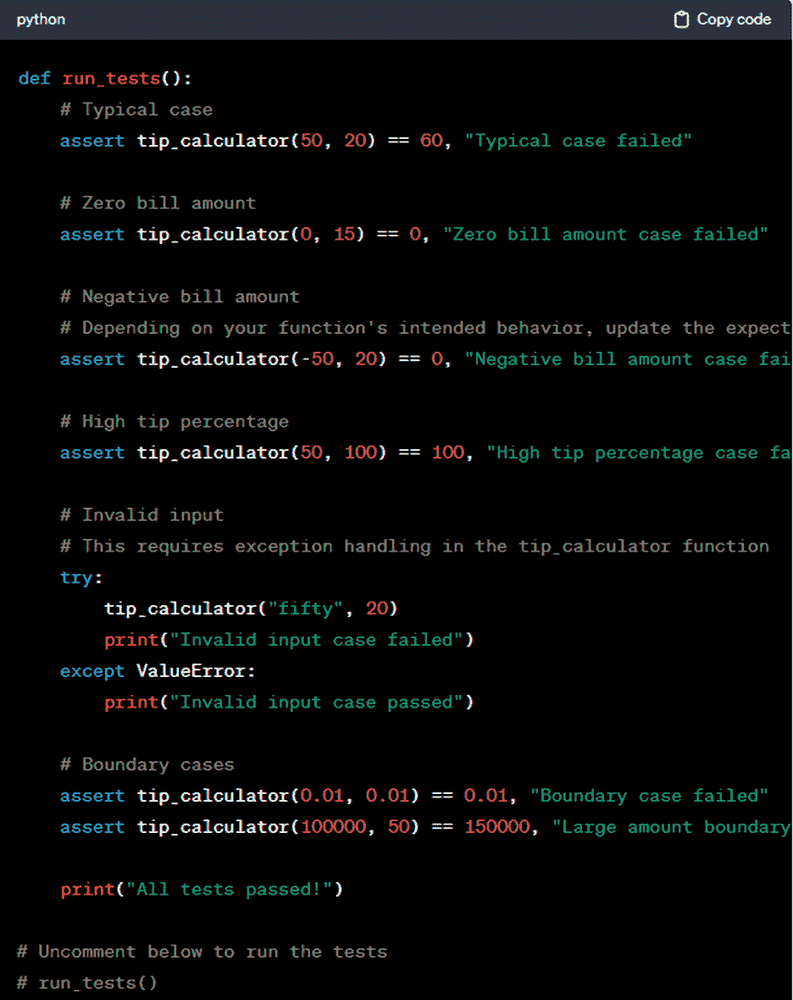
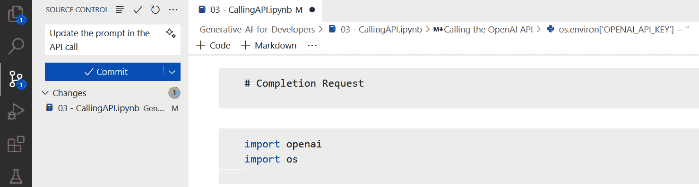

# 第九章：调试、测试和部署

本章讨论的是软件开发中通常没有得到足够关注的方面：调试、测试和部署。这是一本指南，涵盖了从发现不同的错误，到编写人们可以真正理解的文档，再到确保你的代码按预期工作的一切。我们还将深入了解如何无障碍地合并更改，让你的软件运行顺畅和安全，吸收用户的反馈，甚至在你发布时如何引起轰动。

# 调试

当编写代码时，开发者大约会花费[35%到 50%的时间在调试上](https://oreil.ly/vci4A)。这不仅是一个时间陷阱，还消耗了软件项目中很大一部分预算。

有两种主要的错误类型。首先，是*语法错误*。这些错误出现在你的代码没有遵循语言结构的规则时。这可以简单到忘记在`for`循环的末尾添加冒号。像 VS Code 这样的现代 IDE 应该能够检测并修复许多这类错误。

接下来是*逻辑错误*。这些错误更难处理，因为它们发生在你的逻辑中某个部分出错的时候。例如，假设你创建了一个程序，根据用户的年龄从列表中过滤掉成年用户。唯一的问题是，你的代码错误地排除了 18 岁以下的用户，而不是 18 岁以上的用户。因此，你最终得到的是一个充满成年人的列表，而不是青少年。这种混淆是逻辑错误的典型例子。你的代码正在做你本意相反的事情。找出为什么它标记了 18 岁以下的群体，而不是 18 岁以上的群体，可能是一个相当复杂的谜题。修复可能从快速调整年龄条件到必须重新思考整个逻辑。

无论怎样，在调试时开始使用 AI 辅助编程工具并不是你应该做的事情。通常，传统方法就足够了。VS Code 提供了强大的调试功能，可以检测和解决问题。毕竟，你可以轻松设置断点来检查变量值，逐行遍历代码，并查看确切发生了什么。这些功能是救命稻草，尤其是在大型程序中。

当然，有些错误可能真的让人头疼。现代软件通常是一个复杂的拼图，包含许多层和必须协同工作的部分。有时，错误的出现是因为这些部分以意想不到的方式相互作用，找出真正的问题所在可能是一项真正的挑战。然后还有文档问题——或者说是缺乏文档。当软件没有提供清晰的说明或解释时，理解它应该如何工作变得很困难，这使得查找和修复错误变得更加困难。你的软件通常会依赖外部库或服务，如果那里出现问题，你的软件中的错误可能会让人抓狂。

所以这就是你可以转向 AI 的地方。例如，一种情况是解读晦涩或长的错误信息。这些可能是堆栈跟踪，例如，它们是程序在一切混乱时的快照。你也可能得到关于各种框架和库之间交互的详细信息。

你可以做的就是将错误信息复制粘贴到提示中，并包括一些简单的内容，例如：

> *提示:* 这是什么意思？ {error message}

或者，假设你有代码，并且存在逻辑错误。程序简单地不会做你想要它做的事情。在这种情况下，你可以将代码复制粘贴到提示中。然后包括这个：

> *提示:* 这个程序本应允许用户上传照片并在画廊中显示它们。然而，当它执行时，照片并没有出现。这个程序有什么问题？ {code}

如果 ChatGPT 发现了问题，它通常会建议一个解决方案。但如果它没有，你可以在提示中添加这个指令。

# 文档

文档是防止一切崩溃的粘合剂，但遗憾的是，它通常被推到了次要位置。我们都见过——在没有指南的情况下工作代码就像在迷宫中徘徊，这很痛苦，尤其是对于新手或试图弄清楚事情的人来说。

好的文档有助于防止猜测游戏，并使每个人都处于同一页面上。Stack Overflow 的一项调查显示，[68%的开发者](https://oreil.ly/tWiy4)每周都会遇到这些知识障碍。此外，GitHub 2021 年的报告显示，在文档中分享信息可以使团队的生产力提高[55%](https://oreil.ly/q6QO8)。

但这不仅仅是让开发者生活更轻松的问题。好的文档是顺畅开发过程的骨架。它就像一张地图，告诉你去哪里，要注意什么。没有它，你往往是在盲目飞行，这时就会发生代价高昂的错误。

使用 ChatGPT，你可以创建任何类型的文档，例如：

+   用户手册

+   README 文件

+   API 文档

+   常见问题解答

+   故障排除指南

在开发创建有效文档的提示时，以下是一些需要考虑的因素：

了解你的受众

考虑谁会使用你的文档。他们是寻找快速入门指南的新手，还是需要 API 文档和代码片段等细节的技术高手？了解你的读者需要什么对于准确命中你的内容至关重要。

保持简单

没有人喜欢费力去理解那些需要解码器的术语或技术语言。让你的语言直接明了，直截了当。如果你的祖父母都理解不了，那你可能还没达到那个水平。

坚持计划

让你的文档看起来熟悉。使用相同的风格、标题、字体……你名字叫什么。一致性是你的朋友。就像一首歌中有好的节奏一样。它只是更流畅。

展示，而不仅仅是告诉

当人们看到实际操作时，他们理解事物会更快。所以，加入一些现实生活中的例子或场景。如果你是在和程序员交谈，一些代码示例是金子。对于其他人来说，截图或逐步说明可能是有帮助的。

一图胜千言

有时候，文字表达可能不够。使用图表、截图甚至视频来传达你的观点，尤其是在处理复杂内容时尤为重要。

原因和做法同样重要

不要只是列出步骤。告诉你的读者他们为什么要这样做。

考虑到所有这些，你可以使用以下这样的提示：

> *提示:* 你能建议我如何向非技术受众解释 Git 中的版本控制概念吗？我需要保持简单，避免使用技术术语。还要解释版本控制的重要性，并提出任何视觉或图表。

###### 注意

ChatGPT 在语言翻译方面具有强大的能力。你当然可以利用这一点来处理你的文档或其他任何内容。

微软正在开发一个名为 GitHub Copilot for Docs 的系统，这是企业版。它不是普通的文档挖掘工具。例如，搜索结果和响应基于用户的编码背景和经验。它还根据 GitHub 仓库的最新内容进行更新。它甚至允许你添加私有文档。本质上，这是一个高度复杂的知识库，可以极大地提高你的编码能力。

# 代码审查

将代码审查视为你的代码在代码库中提出拉取请求之前的试驾。你确保一切运行顺畅，恰到好处，不会在未来的路上出现问题。

但这个过程不仅仅是寻找笨拙的部分或故障。大家聚在一起，互相交流想法，互相学习是有帮助的。你会看到不同的解决问题的方法，并更好地掌握整个项目。

同时，代码审查可以帮助加强组织的编码风格和指南。然后还有安全检查。你看，自动化工具并不总是能捕捉到所有问题。有时，需要一双人类的眼睛来发现那些狡猾的安全风险。

对于 ChatGPT 来说，它可以是这个过程的关键部分。以下是一个示例提示：

> *提示:* 为下面的代码编写代码审查。重点关注代码的可维护性、潜在的安全问题和性能缺陷。{code}

我故意给 ChatGPT 提供了一个编写得不好的函数，但 ChatGPT 在审查方面做得很好。它提出了许多改进建议，例如该函数可以从不使用硬编码的数据库连接中受益。ChatGPT 还检测到由于在 SQL 查询中直接连接用户 ID 以及缺乏用户输入验证，存在 SQL 注入的潜在风险。然后它发现了 SQL 构造中的性能问题。

## 单元测试

从某种意义上说，单元测试是你代码部分的小型评估，比如几个函数或方法。开发者经常自己使用像 JUnit（Java）、NUnit（.NET）或 pytest（Python）这样的酷工具进行测试。这些工具帮助编写和运行测试，并告诉你结果。它们通常与其他你使用的软件工具配合得很好。

进行单元测试是有帮助的，因为它可以使你的软件变得更好，减少讨厌的 bug，并使以后调整和修复问题变得更加容易。每个测试都只关注一件事，所以如果出了问题，你知道 exactly where to look。这些测试通常是自动化的，这意味着它们可以快速运行，并且经常运行。这对于保持一切顺利和最新非常重要。

单元测试通常很容易编写。由于它们关注代码的小部分，所以它们不应该太复杂。此外，它们就像是你软件的指南。通过查看单元测试，其他开发者可以了解某些部分应该如何工作。如果你更改了代码，单元测试可以确保你没有破坏之前运行良好的东西。

让我们看看一个例子。假设你创建了一个像这样的小费计算器程序：

```py
def tip_calculator(bill_amount, tip_percentage):
    tip_amount = bill_amount * (tip_percentage / 100)
    total_amount = bill_amount + tip_amount
    return total_amount

bill_amount = float(input("Enter the bill amount: "))
tip_percentage = float(input("Enter the tip percentage (e.g., 20 for 20%): "))
total_amount = tip_calculator(bill_amount, tip_percentage)
print(f"Total amount including tip: {total_amount:.2f}")
```

这个函数计算包括小费在内的总账单金额，并接受两个参数，`bill_amount`和`tip_percentage`。该函数将找到`total_amount`的值。

对于这样的代码，单元测试会检查各种场景。例如，它们可以帮助验证函数是否正确地计算了包括小费在内的总金额，对于一系列输入。这很重要，因为即使是微小的错误也可能导致显著的差异。单元测试可以覆盖典型情况，例如标准账单金额和小费百分比，以及边缘情况，如零或负账单金额或异常高的小费百分比。它们还有助于确保函数能够优雅地处理怪异输入，例如非数字或空值。

这里有一个示例提示：

> *提示：* 对于这个程序，建议正确的单元测试来计算总金额，检查典型和边缘情况，如零和负账单金额以及高小费值。还要检查无效输入。对于单元测试，你可以有控制台日志。

图 9-1 显示了 ChatGPT 为单元测试创建的代码。

如果你想要使用测试框架，以允许更结构化和全面的方法，你可以向 ChatGPT 询问这个：

> *提示：* 创建使用测试框架的单元测试。

ChatGPT 建议使用 unittest。它展示了如何设置它，开发了测试，并演示了如何运行单元测试。

或者，如果你已经有了一个包含单元测试的文件，你可以评估它们。这里有一个提示：

> *提示：* 下面是一个程序的单元测试文件，<*解释它做什么或指向代码*>。我还应该有其他测试吗？这里缺少了什么？

虽然 ChatGPT 或 AI 辅助编程工具在创建这些描述时可能很有用，但这些工具远非万无一失。对于更高级的使用案例或更大的代码库，结果可能会出错。

考虑以下来自大卫·李的建议，他是一位创始人、高级工程师和 AWS 认证解决方案架构师：

> 然而，当处理涉及真实数据库交互和 Docker 的测试时，情况会显著变化。这成为了一个 ChatGPT 4.0 可能无法完全理解的更高级的复杂性，你可能需要先手动编写一些测试，特别是数据库连接部分，这样它才能学会如何编写其他部分。



###### 图 9-1. ChatGPT 为小费计算器程序创建了单元测试代码

## 拉取请求

一个*拉取请求*，简称 PR，在编码世界中就像是一张金票，尤其是在与他人合作时。你将你的代码打包，推送到 GitHub 或 GitLab 等地方，并发送一个 PR。这不仅仅是一个“请添加我的代码”的请求，它还向你的队友们暗示去查看你所做的工作，给予点赞，或者可能提供一些改进的建议。这一切都是为了确保当你的代码加入项目时，它是最好的。更重要的是，PR 是跟踪谁做了什么以及何时做的整洁方式，这在大型项目中当然很有帮助。

毫无疑问，写出一个坚实的 PR 描述真的会大有不同。你想要阐述你的更改的什么、为什么和如何。从快速概述你正在解决的问题开始。然后深入探讨你的更改是如何解决这个问题的。不要忘记包括哪些文件得到了改进或你运行了哪些测试的细节。如果你对某些具体内容不确定或需要第二意见，也请提及。

一个有效的 PR 描述是审查者的救命稻草。它加快了整个过程，并确保每个人都处于同一页面上。此外，详细的 PR 描述就像是未来信息宝库。

是的，ChatGPT 可以作为你的助手，帮你写出那些 PR 描述。需要启动一个草稿吗？告诉 ChatGPT 你做了什么，它将帮助你将其结构化成清晰且简洁的内容。如果你已经写好了描述，ChatGPT 可以检查其清晰度和语法，并提出使其更好的建议。ChatGPT 还可以帮助你确定最佳的 PR 布局方式，比如先写一个总结，然后深入细节。如果有需要简化的技术细节，它也能帮助你使 PR 对团队中的每个人来说都更容易理解。

让我们看看一些有用的提示：

> *提示:* 我为应用程序添加了一个新的搜索功能，该功能根据用户输入过滤结果。你能帮我写一个关于这个功能的 PR 描述吗？
> 
> *提示:* 我修复了一个 bug，当用户在文本字段中输入特殊字符时，应用会崩溃。我该如何在 PR 中描述这个问题？
> 
> *提示:* 我重构了认证模块以提高性能和可读性。我应该将哪些内容包含在 PR 描述中？
> 
> *提示:* 我更新了用户界面，使其导航更直观，并添加了新的图标。你能帮我起草一个 PR 描述吗？
> 
> *提示:* 在 PR 描述中如何措辞比较好？
> 
> *提示:* 我为支付处理模块添加了新的单元测试。你能帮我写一个突出这些更改的 PR 描述吗？
> 
> *提示:* 我解决了由于主分支最近的变化而引起的合并冲突。在 PR 描述中我应该提到什么？

请记住，Microsoft 在 Copilot 中添加了一个功能，允许创建 PR 描述。它被称为“生成提交消息”。要使用它，你需要确保你与 GitHub 上的仓库有连接。然后你只需点击左面板中的闪亮按钮，如图 9-2 所示。图 9-2。



###### 图 9-2\. 协作者可以根据加载到项目中的仓库创建 PR 描述

然后，Copilot 将编写一个有用的 PR 描述。

最后，有许多初创公司正在基于 LLM 技术创建自己的系统。其中一个叫做[What The Diff](https://oreil.ly/LriIB)。根据公司的联合创始人兼首席执行官 Sebastian Schlein 的说法：

> What The Diff 有两个主要功能：1) 通过将它们总结成简单的英语，使拉取请求更容易审查，并为审阅者提供关于 PR 中更改的易于理解的概述。2) WTD 还可以编写完全非技术性的摘要，并将其发送给其他利益相关者，如没有 GitHub 访问权限的产品经理。这使得他们能够轻松地查看拉取请求中的更改是否确实符合他们的规格。

# 部署

你一直在努力开发软件，现在到了关键时刻——大规模推出。这是一个激动人心的时刻。你将看到真实的人们使用你的软件，告诉你哪些地方做得好，哪些地方需要调整甚至更多。这种反馈？对于一个开发者来说是无价的。

如果你从事的是销售软件的业务，这就是你一直在等待的时刻——当现金开始滚滚而来。成功推出可以真正改变你的银行账户。

但让我们面对现实：部署软件就像屏住呼吸，希望一切顺利。总有一种偷偷的感觉，事情可能不会按计划进行。

你知道在你的测试设置中事情看起来多么完美，但在现实世界中，它们会变得有点摇晃？可能是不同的硬件，一些古怪的网络安全系统，或者只是奇怪的设置搞砸了。

安全也是一个大问题。一旦上线，你必须保持警惕，防止坏人入侵，并遵守隐私规则。

此外，你的软件必须足够强大，能够应对大量用户。无论有多少人加入，或者你的业务规模有多大，它都必须保持快速和流畅。

然后还有整个 CI/CD 的事情。这全部都是为了使部署变得顺畅和自动化，以避免错误。听起来不错，但要让它启动并保持这种状态，还是有点麻烦的。

那接下来该做什么呢？你绝对可以试试 ChatGPT。以下是一些可以考虑的提示词：

> *提示词:* 你能指导我为我团队创建一个部署清单吗？
> 
> *提示词:* 有哪些好的学习资源可以帮助我入门使用 Docker 进行部署？
> 
> *提示词:* 你能提供关于在 Web 应用程序中实现零停机部署的最佳实践吗？
> 
> *提示词:* 在部署过程中，我遇到了“服务器超时”错误。有哪些常见的原因和解决方案？
> 
> *提示词:* 你能帮我写一个 bash 脚本来自动化部署我的 Python Web 应用程序吗？
> 
> *提示词:* 在生产环境中部署应用程序之前，我应该检查哪些基本配置设置？
> 
> *提示词:* 我该如何为云环境中的失败部署制定回滚策略？
> 
> *提示词:* 在部署金融应用程序时，我应该考虑哪些安全措施？
> 
> *提示词:* 我该如何优化已部署的 Node.js 应用程序的性能？

虽然不是完美的，ChatGPT 在处理复杂的 DevOps 方面可以提供帮助。以下是来自 Titus Capilnean 的一些想法，他是 Private Market Labs 的联合创始人兼首席产品官：

> 云日志并不是最容易处理的事情，尤其是我并不是 DevOps 工程师，但鉴于我们定期在 AWS 和 Google Cloud 上运行进程，我们不得不处理它们。
> 
> 有一回，我必须根据大规模函数部署的输出设置 SQS + Lambda 流程的跟踪。我的函数基本上是在日志中打印状态，我计划使用这个状态来生成该流程的报告——在我们的案例中，是交易活跃度。我要求 ChatGPT 提供 AWS CloudWatch 查询脚本，并将其调整到只需在每个流程结束时运行即可获得结果的程度。完成这项任务可能需要详细阅读文档 5-6 个小时，所以我通过 GPT 路线节省了大量时间。
> 
> 类似地，我不得不在 Google Cloud 中设置一些警报，并与 ChatGPT 合作创建了一个查询，排除了我们实际上并不负责的一些系统级错误，这些错误也不是面向用户的。这为我节省了几个小时阅读和工作的时间，并为我提供了我需要设置一个有用的警报系统所需的定制指标。

## 用户反馈

用户反馈对于使你的软件出色至关重要。当你的用户看到你在倾听并根据他们的想法进行更改时，他们更有可能留下来，面带微笑。更明智的做法是尽早通过他们的帮助消除瑕疵，而不是在大量（越来越不高兴）的人使用你的应用程序时试图清理一大堆混乱。

即使经过所有测试，一些错误仍然很狡猾，只有在你的软件进入现实世界时才会露出真面目。你的用户就像你自己的私人侦探，发现那些可能被你忽略的东西。

有时你的用户会对你的软件进行非常创新的使用，以你从未想过的方式使用它。他们的疯狂想法可以激发新功能或甚至全新的产品的火花。

当然，有一个完整的工具箱可以提升客户服务。其中一些工具包括 Zendesk、Freshdesk、Drift 和 Salesforce。它们从实时聊天让你能够与客户实时交谈到收集用户想法的反馈表，无所不能。自动工单系统跟踪客户问题，确保没有任何问题被遗漏。别忘了客户关系管理（CRM）系统，它将所有客户互动集中在一个地方。这些工具真的可以在提供高效、响应迅速的客户服务方面产生重大影响。

生成式 AI 确实可以在所有这些基础上增加价值。它在处理大量非结构化数据，如用户反馈方面特别出色。

例如，假设你有一个包含大量用户电子邮件、即时消息和联系表信息的文件。然后你可以去 ChatGPT 并使用以下提示：

> *提示:* 识别常见的主题和类别，例如可用性、性能、功能、错误和客户服务。同时，对这份文件进行情感分析。根据提到的问题的频率和严重程度，帮助优先处理哪些错误需要修复或哪些功能需要考虑添加。有了所有这些，创建一份包含图表的报告。

ChatGPT 还可以通过响应草稿来帮助。如果你在处理客户反馈，它可以帮助你写出更好的回复，例如通过为常见问题创建答案模板。这样，在与用户或客户聊天时，你总是准确且专业。

或者，你可以使用 ChatGPT 来提供更个性化的回复。你可以复制粘贴用户电子邮件并使用如下提示：

> *提示:* 回复用户电子邮件，注意保持冷静和理解的语气。确保回复友好，并帮助缓解任何担忧，而不会升级情况。{电子邮件}

在某些情况下，你可以创建自己的基于 LLM 的应用程序来处理用户反馈。这就是 Warp 所做的事情。该公司让一位开发者花费不到一周的时间——以半工半读的方式——来创建这个应用程序。它是使用 OpenAI API 构建的。

“这个应用带来了巨大的变化，”Warp 的产品经理 Noah Zweben 说。“以前，很难对收到的反馈进行分类和优先排序。但生成式 AI 能够做到这一点非常出色。”

## 发布

在 ChatGPT 成为大事件之前几年，生成式 AI 已经在销售和营销等重要活动中产生了影响。先驱者是 Jasper。该公司以惊人的速度增长。然而，生成式 AI 非常适合快速制作吸引人和富有创意的内容。

但您不需要 Jasper 来帮助您的软件发布。ChatGPT 应该也能很好地完成任务。首先，您可以用它来制定一个杀手级的营销计划。以下是一个示例提示：

> *提示*：您创建了一个帮助人们规划健康餐点的应用。它根据饮食偏好、健康目标和营养需求创建定制餐单。它还可以生成购物清单、提供食谱建议并跟踪营养摄入。对于这个应用，制定一个营销计划。该公司是一个早期阶段的初创公司，没有太多的营销预算。

ChatGPT 首先建议您确定目标受众。它建议主要用户是“注重健康的人、健身爱好者、有特定饮食需求的人（例如，无麸质、纯素食者）、忙碌的专业人士等。”然后它涵盖了各种策略，如利用社交媒体、内容营销、社区参与、电子邮件营销和合作伙伴关系。

这里还有一些其他有用的 ChatGPT 提示：

> *提示*：为宣布新健康规划应用发布的博客文章撰写一个引人入胜的简介，突出其独特功能和优势。
> 
> *提示*：为宣布我们的新健康规划应用制定一系列社交媒体帖子，重点关注其用户友好的界面以及它如何帮助管理健康目标。
> 
> *提示*：为我们的健康规划应用撰写一封强调其跟踪和改善用户健康习惯能力的产品公告电子邮件。
> 
> *提示*：创建一封针对健身房教练和健康教练的具有说服力的销售电子邮件，推广我们的健康规划应用作为他们客户的工具。
> 
> *提示*：为新的健康规划应用生成一系列吸引人且相关的名字，传达出健康和组织的概念。
> 
> *提示*：为 Facebook 和 Instagram 广告制定推广我们的健康规划应用的广告文案，突出其易用性和个性化选项。
> 
> *提示*：制定一个模板，用于向我们的健康规划应用早期用户请求推荐信，以便用于营销材料。
> 
> *提示*：为我们的健康规划应用虚拟发布活动创建邀请函，详细说明议程和特别嘉宾。

# 结论

本章就像是对软件开发中那些并不总是受到关注的事情的幕后观察。当然，创建新的软件令人兴奋，但真正让应用程序成功或失败的是那些不那么耀眼的任务，比如调试、测试和文档编写。我们已经讨论了如何使用 AI 工具，如 ChatGPT，可以让这些工作变得更加顺畅。这些 AI 伙伴并不是魔法解决方案，但它们在筛选大量数据、提供建议、生成内容、发现问题以及加快整个流程方面非常出色。这意味着开发者可以专注于真正棘手的事情。通过将生成式 AI 和一些智能策略引入每个步骤，从消除 bug 到发布，开发者可以构建真正满足用户需求且速度更快的软件。
