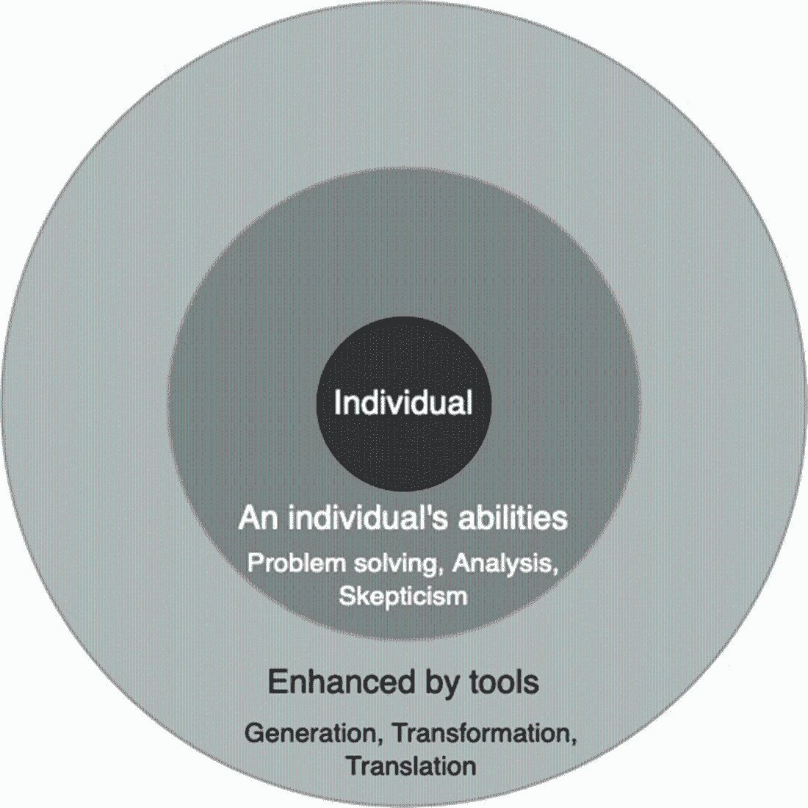

# 第一章：使用大型语言模型增强测试

### 本章包括

+   探索大型语言模型如何帮助测试

+   定义与大型语言模型合作的思维方式

在这本书中，我们将使用大型语言模型来增强和加速我们的测试活动——介绍我们自己使用这项技术的最好方式之一就是要求其中一个创建这本书的介绍：

+   你好！我是 ChatGPT，一个由 OpenAI 设计的语言模型，用于协助各种任务和回答各种问题。

+   关于书籍《如何利用人工智能帮助支持各种软件测试活动》，我推荐 Julian Harty 和 Mahesh Sharma 的《AI 驱动测试：为您的软件测试实践增加智能》。

+   本书探讨了人工智能（AI）技术在软件测试中的应用，以及如何帮助提高测试流程的效率和效果。作者涵盖了与 AI 驱动测试相关的各种主题，包括机器学习、自然语言处理和计算机视觉等。

+   此外，该书包括案例研究、实际示例和在不同情境中实施 AI 驱动测试的最佳实践。对于软件测试人员、开发人员以及任何希望利用人工智能提高软件产品质量的人来说，这是一个宝贵的资源。

这个看起来像是人类可能写的人工生成的回答是通过向大型语言模型或 LLM 发送一个被称为*提示*的一句话指令而创建的：

```py
ChatGPT, please introduce yourself and a book about how AI can be used to help support various software testing activities.
```

定义 LLM 的功能和潜力既简单又困难，而从这些工具中获得最大利益则是在两者之间找到平衡。表面上看，LLM 只是简单地接受用户的指令，并用自然语言回答。但这个简单的解释并不能充分说明 LLM 能为我们的测试带来的潜力，也不能解释我们必须克服的挑战，以从中获得最大利益。因此，在我们开始 LLM 和测试的旅程之前，让我们了解一下 LLM 如何帮助我们以及我们需要注意什么才能成功使用它们。

## 1.1 认识 AI 工具对测试和开发的影响

在过去，想要利用 AI 的个人需要具备开发、训练和部署 AI 模型的技能，或者可以访问一个可以为他们做这些事情的专家团队，所有这些都使得在日常活动中使用 AI 成为一项昂贵且独家的事业。但随着人工智能的最新进展，特别是大型语言模型，我们现在开始受益于一些人称之为 AI“民主化”的东西。

将人工智能整合到我们日常工作中的障碍已经大大降低。社交媒体经理现在可以使用 LLMs 生成引人注目且吸引人的文字，分析人员可以将非结构化数据总结为清晰简洁的报告，客户支持代理可以通过简单的提示快速为客户生成定制回复。LLMs 的潜力不仅供数据科学家和人工智能学者利用，对于我们这些从事测试和软件开发工作的人来说也是如此。

良好测试的价值在于它有助于挑战假设，并教育我们的团队，让我们真正了解我们的产品在特定情况下的表现。我们测试得越多，我们就能学到更多。但是，正如大多数专业测试人员所证明的那样，我们永远没有足够的时间来测试我们想要测试的所有内容。因此，为了帮助我们更有效地测试，我们寻求从自动化到左移测试的工具和技术。LLMs 为我们提供了另一种潜在途径，帮助我们增强和加速测试，以便我们能够发现和分享更多信息，进而帮助我们的团队进一步提高质量。

使 LLMs 如此有用的是，它们以易于人类理解的方式总结、转换、生成和翻译信息，而我们，作为负责测试的个人，可以将其用于我们的测试需求——所有这些都可以通过简单的聊天界面或 API 获得。从帮助我们快速创建测试自动化到在我们自己进行测试时提供支持，如果我们掌握了识别 LLMs 何时可以帮助我们，并明智地使用它们，那么我们就可以开始更快、更远、更有效地进行测试。为了帮助说明这一概念，并让我们对我们将在本书中学到的内容有所了解，让我们看一些快速的例子。

#### 数据生成

创建和管理测试数据可能是测试中最复杂的方面之一。创建逼真、有用和匿名化的数据可能决定测试的成败，而要有效地进行此操作可能会耗费大量资源。LLMs 提供了快速生成和转换数据的能力，加速了测试数据管理过程。通过将现有数据转换为新格式，或者使用它来生成新的合成数据，我们可以利用 LLMs 来帮助我们满足测试数据需求，并为我们提供更多时间推动测试进程。

#### 自动化测试构建

类似地，LLMs 生成和转换的能力可以在创建和维护自动化过程中使用。虽然我不建议完全让 LLMs 为我们创建自动化测试，但它们可以以有针对性的方式帮助我们快速创建页面对象、样板类、辅助方法、框架等。结合我们对产品的知识和测试设计技能，我们可以确定自动化过程中算法性和结构性部分，并使用 LLMs 加速自动化过程的这些部分。

#### 测试设计

也许一个不太常被讨论的话题是 LLM 如何在识别和设计测试过程中帮助我们。与自动化测试类似，LLM 的价值不在于完全替代我们的测试设计能力，而在于增强它们。我们可以利用 LLM 来克服偏见和盲点，通过利用它们来扩展和建议基于我们可能已有的当前测试设计思想的想法。我们还能够以更易理解的方式总结和描述复杂的想法，以便我们从中获得测试想法的跳板。

这些示例等将在本书中探讨，以帮助我们更好地理解 LLM 何时何地可以使用，以及如何以加速我们的测试的方式来使用它们，而不是阻碍它们。我们将探讨如何建立提示来帮助我们构建高质量的生产和自动化代码，快速创建测试数据，并增强我们的脚本和探索性测试的测试设计。我们还将探讨如何调整我们自己的 LLM，使其作为我们测试的助手，消化领域知识并将其用于帮助我们构建更高质量的产品。

## 1.2 利用 LLM 提供价值

测试是一个协作过程，团队的所有成员都对测试负责。我们如何为测试过程做出贡献取决于我们的角色和经验，但我们都参与其中。因此，在整本书中，我们将以批判的心态来使用 LLM，探索我们可以利用 LLM 来帮助增强我们所做各种类型的测试的不同方式。我们的意图是给你提供技能，让你能够识别和利用 LLM 来增强和加速你的测试，无论你是在专业测试角色还是作为为测试过程做出贡献的开发人员，我们都可以通过建立一些规则来规范我们与想要使用的 LLM 之间的关系。

### 1.2.1 发挥人类和人工智能能力的优势

在整本书中，我们不仅将学习如何使用 LLM，还将学习如何建立一个工作实践，使我们的测试既能从我们的能力中受益，也能从 LLM 中受益。任何工具的价值，无论是基于人工智能还是不是，都不是来自其固有特性，而是来自用户与工具之间的关系。我们可以将这种关系视为一种区域效应模型，如图 1.1 所示。

##### 图 1.1 工具如何增强和扩展测试的范围的概要



这张图表所展示的是，为了增加我们的影响力，我们需要与专注于扩展和增强我们核心能力的工具建立健康的关系。没有这种平衡，我们会过度依赖工具或自己。我们当然可以依靠我们的能力，但我们的影响范围将更小，受到时间、注意力和偏见等约束的限制。基本上，没有工具，我们只能做到这么多。但同样地，我们不能把所有工作都推给工具。没有一个个体作为核心，工具就缺乏方向。是的，工具可以自主运行，但如果它们没有向人类提供反馈，那么它们就没有价值。影响范围缺少中心。*协同作用* 和 *共生* 这两个词可能同样具有人工智能那样的负载，但这本书的目的就是要帮助你理解这一点。

为了帮助我们更好地理解这种关系，让我们考虑一个例子，我们想为文件上传功能创建测试。首先，我们收到了一个用户故事，就像这样：

```py
As a paralegal
In order to store and share legal documents
I want to be able to securely upload documents

Acceptance criteria:
  * Upload should support the following common file formats: PDF, DOC, DOCX, TXT
  * The maximum file size should be 20MB
  * When a document is uploaded it should give a progress update to the user
  * Once uploaded, the document must initially be only accessible to the person who has uploaded it
  * A report of the upload and whether it was successful or not will be stored in the auditing feature
```

由此，我们决定简单地依赖 LLM 来为我们生成工作，例如，发送这样一个提示：

```py
Create tests for a file upload feature
```

将此提示发送给像 ChatGPT 这样的 LLM 可能会返回类似于以下内容：

```py
1\. Test for File Upload Functionality:

    Test Case 1.1: Upload a Valid File
        Input: Choose a file with a valid format (e.g., .jpg, .pdf).
        Expected Outcome: The file is successfully uploaded, and a confirmation message is displayed.

    Test Case 1.2: Attempt to Upload an Invalid File
        Input: Choose a file with an invalid format (e.g., .exe, .html).
        Expected Outcome: An error message is displayed, indicating that the file format is not supported.

2\. Test for File Size Limit:

    Test Case 2.1: Upload a File Below the Size Limit
        Input: Choose a file smaller than the maximum allowed size.
        Expected Outcome: The file is successfully uploaded, and a confirmation message is displayed.

    Test Case 2.2: Attempt to Upload a File Exceeding the Size Limit
        Input: Choose a file larger than the maximum allowed size.
        Expected Outcome: An error message is displayed, indicating that the file exceeds the maximum size limit.

3\. Test for File Overwrite Protection:

    Test Case 3.1: Upload a File with the Same Name as an Existing File
        Input: Upload a file with a name that matches an existing file in the system.
        Expected Outcome: An error message is displayed, indicating that a file with the same name already exists.

4\. Security Tests:

    Test Case 4.1: Attempt to Upload a Malicious File (e.g., virus)
        Input: Upload a known malicious file.
        Expected Outcome: The system should detect the malicious file and prevent its upload, displaying a security warning.

5\. UI and User Experience Tests:

    Test Case 5.1: Check for a User-Friendly Interface
        Input: Use the file upload feature and evaluate the user interface for clarity and ease of use.
        Expected Outcome: The interface should be intuitive, with clear instructions and feedback for users.

    Test Case 5.2: Check for Proper Error Messages
        Input: Attempt various erroneous actions during the file upload process.
        Expected Outcome: Error messages should be descriptive, helping users understand and resolve issues.

6\. Integration Tests:

    Test Case 6.1: Check File Upload with Other Features
        Input: Test file uploads in conjunction with other features that depend on uploaded files (e.g., image processing, document storage).
        Expected Outcome: Ensure the uploaded files are correctly processed and integrated with other system components.

7\. Performance Tests:

    Test Case 7.1: Upload a Large Number of Files Concurrently
        Input: Simulate multiple users uploading a large number of files simultaneously.
        Expected Outcome: The system should handle concurrent uploads without significant performance degradation or crashes.

8\. Stress Tests:

    Test Case 8.1: Upload Files Continuously for an Extended Period
        Input: Continuously upload files for an extended period to assess system stability.
        Expected Outcome: The system should not experience memory leaks, crashes, or performance degradation during this stress test.
```

乍一看，回答似乎令人印象深刻。LLM 为我们提供了一系列不同的考虑测试，这给了我们开始测试的印象。然而，如果我们开始仔细考虑这个回答，我们开始注意到问题：

+   测试用例 1.1 建议使用有效格式进行测试，但提供了我们用户故事不支持的格式示例。

+   从第 4 点开始的建议太肤浅了。例如，`安全测试` 提供了一个插入恶意文件的测试，但其他什么也没有。肯定还有其他需要考虑的安全问题吧？

+   期望结果对于每个测试用例也是非常宽泛的。例如，这句话是什么意思：`Error messages should be descriptive, helping users understand and resolve issues.`

LLM 设计的方式是给出一个回应，不管它被要求做什么，虽然这听起来可能很有用，但当它接收到的指令模糊时，这就成为了问题。我们所看到的例子并不是用来批评 LLM 的能力，而是为了帮助我们认识到 LLM 的响应将像它收到的提示一样详细或通用。这意味着我们从 LLM 收到的回应是宽泛而模糊的，因为我们的提示也是模糊的。通过不去思考我们想要让 LLM 做什么，提示中缺乏任何上下文或细节意味着返回的内容相当无用——这是经典的垃圾输入，垃圾输出的例子。

这就是我们领域效应试图定义的内容。要从 LLMs 中获得价值，我们需要设计清晰、上下文相关且具体的提示，以便我们可以从 LLMs 中提取更多的价值。与其将所有责任都交给一个工具来创建我们所期望的响应，我们更应该欣赏我们对于上下文的理解和将这种理解转化为清晰指令的能力是需要的，这样才能创建出一个可以最大限度地从 LLM 中获得响应的提示，从而导致写作更好的提示，例如：

```py
Act as a professional software tester and suggest test ideas for the feature delimited by three hashes. All test ideas should be focused on discovering issues that impact the quality characteristics: Functionality, Data Integrity and Security

###
As a paralegal
In order to store and share legal documents
I want to be able to securely upload documents

Acceptance criteria:
  * Upload should support the following common file formats: PDF, DOC, DOCX, TXT
  * The maximum file size should be 20MB
  * When a document is uploaded it should give a progress update to the user
  * Once uploaded, the document must initially be only accessible to the person who has uploaded it
  * A report of the upload and whether it was successful or not will be stored in the auditing feature
###
```

当发送给 LLM 时，返回一个代码示例如下：

```py
Functionality:
    Format Compatibility Testing:
        Verify that the upload feature supports the following file formats: PDF, DOC, DOCX, and TXT.
        Attempt to upload files in various formats and ensure that the system handles them correctly.

    File Size Limitation Testing:
        Test whether the system enforces a maximum file size limit of 20MB during the upload process.
        Attempt to upload files larger and smaller than 20MB to validate the system's handling of these cases.

    Progress Update Testing:
        Check that users receive real-time progress updates while a document is being uploaded.
        Verify that these updates are clear and provide meaningful information to the user.

Data Integrity:
    Document Content Verification:

    Upload files with known content and compare the content of the uploaded document with the original.
    Ensure that the content remains intact and no data corruption occurs during the upload process.

    Document Privacy:
        Test that uploaded documents are initially only accessible to the person who uploaded them.
        Attempt to access the uploaded documents using another user's account to ensure that access control is enforced.

    Data Auditing Verification:
        Confirm that the system accurately records all uploads in the auditing feature.
        Verify that the audit logs include information such as the timestamp, uploader, document name, and whether the upload was successful.

Security:
    File Type Security Testing:

    Attempt to upload files with malicious content, such as scripts or malware, and ensure that the system detects and rejects them.

    Access Control Testing:
        Validate that the system properly enforces access control by ensuring that other users cannot access the documents uploaded by someone else.

    Secure Data Transmission:
        Ensure that the document upload process uses secure communication protocols (e.g., HTTPS) to protect data during transmission.

    User Authentication and Authorization:
        Verify that the system correctly authenticates and authorizes users before allowing them to upload or access documents.

    Secure Data Storage:
        Assess how the system stores uploaded documents to ensure that they are encrypted or adequately protected against unauthorized access or data breaches.

    Session Management:
        Test how the system manages user sessions, ensuring that sessions are terminated after a period of inactivity to prevent unauthorized access.
```

通过创建更加专注和上下文的提示，我们创造了一个提供更丰富建议范围的响应，用于我们的测试。这不是单靠 LLM 就能实现的，而是通过我们的技能与 LLM 的协同作用，将我们的上下文转化为 LLM 可以接受并快速扩展的指令。

#### 活动

尝试一下本章探讨过的示例提示，看看你收到了什么响应。要设置 LLM，请阅读附录 A，其中介绍了如何设置并向 ChatGPT 发送提示。

### 1.2.2 对 LLMs 持怀疑态度

尽管 LLMs 的潜力可以说很大，但我们应该警惕地对待它们的能力。例如，考虑一下 ChatGPT 给我们推荐这本书的介绍。它自信地向我们推荐，让我们阅读*AI-Driven Testing: Adding Intelligence to Your Software Testing Practice.* 问题在于，这本书根本不存在，也从未由 Julian Harty 和 Mahesh Sharma 编写过。LLM 只是凭空捏造了这个标题。

LLMs 提供了很大的潜力，但它们并不是每个问题的解决方案，也不是唯一的真理之源。我们将在第二章进一步探讨 LLMs 如何使用概率来确定响应，但现在重要的是要明确 LLM 如何得出解决方案并不与我们人类的方式相同，这突显了我们领域效应模型的第二个方面。我们必须运用怀疑精神来确定 LLM 响应中哪些内容有价值，哪些没有价值。

盲目接受 LLM 输出的内容，充其量是将我们置于事实上减慢我们工作速度的风险中，而不是加速工作——最坏的情况下，它会影响我们进行可能对产品质量产生不利影响的测试。我们必须提醒自己，我们而不是 LLMs，是引领解决问题活动的人。有时候与以一种感觉上非常人性化的方式进行沟通的工具一起工作会很困难，但这样做会使我们暴露于上述风险之中。这就是为什么在我们的领域效应模型中，我们利用我们的能力来挑选和选择 LLM 响应中对我们有益的元素，并拒绝并重新评估当 LLM 以一种不令人满意的方式响应时我们如何指示 LLM。

随着我们在书中的进展，了解更多关于 LLM 以及它们如何对测试有所贡献的知识，我们会牢记我们的影响范围模型，这样你，读者，将能够以一种冷静、考虑周到且对你和你的团队有价值的方式使用 LLM 进行测试。

## 1.3 总结

+   LLM 通过接受我们编写的提示来工作，并返回一个回应。

+   LLM 的流行之处在于它们提供了访问强大 AI 算法的简易方式。

+   LLM 已经帮助了许多不同角色的人，也可以帮助我们进行测试。

+   我们可以使用 LLM 来辅助我们进行从测试设计到自动化等广泛范围的测试活动。

+   我们要避免过度使用 LLM，并始终对它们的工作方式持批判态度。

+   成功使用 LLM 来自于我们欣赏自己在使用它们的过程中带来的技能和能力。

+   如果我们对 LLM 的提示浅显而普通，我们得到的回应也会是一样的。

+   相反，我们应该运用我们的技能来理解和界定问题，并利用这一点促使 LLM 以最有价值的方式作出回应。

+   我们还必须对从 LLM 获得的回应持怀疑态度，以确保我们从 LLM 那里得到的回应对我们有价值。
