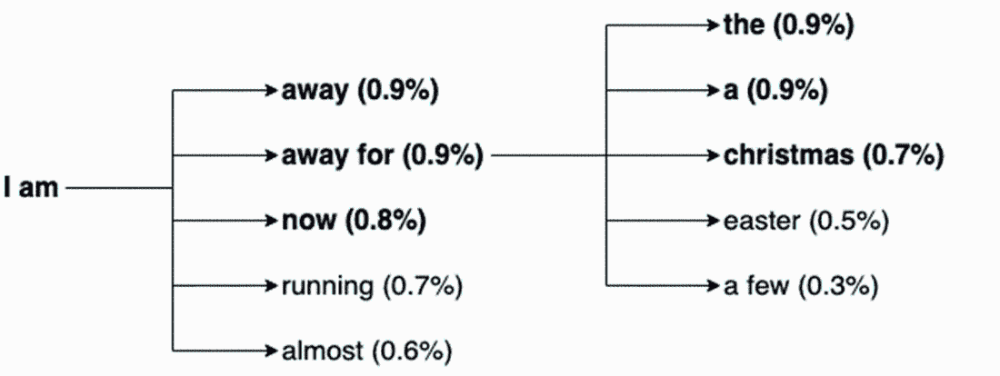

# 第二章：大型语言模型和提示工程

### 本章包括

+   概述大型语言模型的基本工作原理

+   了解使用大型语言模型的风险

+   定义提示工程

+   通过提示工程进行实验以返回各种输出

+   用提示工程解决问题

在上一章中，我们学到了花时间熟悉新工具很重要，而且这种心态我们将在本章中采用。在整本书中，我们将探讨如何专门使用生成式 AI 工具，例如 Open AI 的 ChatGPT 和 GitHub Copilot，它们是构建在大型语言模型或 LLMs 上的。虽然 AI 在测试中有许多用途，但 LLMs 之所以如此有趣，是因为它们适应不同情况的能力，因此它们越来越受欢迎。因此，在我们看如何将 LLM 工具应用到我们的日常测试之前，让我们先了解一下 LLMs 是什么，它们是如何工作的，以及通过学习提示工程的概念，如何从中获得最大的好处。

什么使得像 ChatGPT 这样的 LLM 主导了 2023 年的技术头条？考虑一下我与 ChatGPT 的这次互动：

```py
Mark: Hello ChatGPT, can you introduce yourself briefly?

ChatGPT: Of course! I'm ChatGPT, an AI language model developed by OpenAI. I'm based on the GPT-3.5 architecture, which means I'm designed to understand and generate human-like text based on the prompts I receive. I've been trained on a diverse range of data sources, including books, articles, websites, and other text documents, up until September 2021\. I can assist you with a wide array of topics, including answering questions, providing explanations, creative writing, and much more. Just let me know how I can help you!

Mark: Nice to meet you.

ChatGPT: Nice to meet you too! I'm here to assist you with any questions or tasks you have. How may I help you today?

Mark: I'm just getting to know you.

ChatGPT: That's perfectly fine! Feel free to ask me anything you'd like to know, whether it's about my capabilities, how I work, or anything else you're curious about. I'm here to provide information and help you out to the best of my abilities. Fire away with your questions!
```

基于这次快速的“对话”，我们可以看出：

+   我可以用自然语言与 ChatGPT 进行交互。要从 ChatGPT 获取结果并不需要传统的编程经验。

+   ChatGPT 的输出也是用自然语言。它易于理解和回应。

LLM 的倡导者庆祝这些类型的人工智能工具已经使 AI 的使用实现了民主化，允许任何人使用它们来获取结果。然而，这种民主化是一把双刃剑。我们与 LLMs 互动的方式可能会让我们产生错觉，认为我们正在和一个像我们人类一样推理的机器对话。但是做出这样的假设可能会影响我们充分利用 LLM 的能力。因此，为了更好地利用诸如 ChatGPT 之类的工具，了解它们的工作方式（至少在外行人的看法下）有助于更好地理解它们如何适应我们的测试活动，并如何从中获得最大价值。

## 2.1 大型语言模型，解释

一个相对缺乏构建 AI 系统经验的人如何解释复杂的 LLM 系统的工作方式？幸运的是，在 Computerphile 视频“AI Language Models & Transformers”（www.youtube.com/watch?v=rURRYI66E54），Rob Miles 提供了一个示例，可以帮助我们基本了解 LLMs 的工作原理。（我强烈推荐观看他关于 AI 的所有视频。）

拿出你的手机并打开一个消息应用程序，或任何导致键盘出现的其他应用程序。在键盘上方，你可能会看到一系列建议插入到消息中的单词。例如，我的键盘为我提供了这些建议：*I*、*I am* 和 *The*。选择其中一个选项，例如 *I am*，会导致建议更新。对我来说，它提供了 *away*、*away for* 和 *now* 的选项。再次选择 *away for* 选项将更新可供选择的选项。那么键盘是如何知道应该显示哪些选项以及不显示哪些选项呢？

在你的键盘中是一个与 LLM 类似的 AI 模型。这种描述是简化的，但在其核心上，你手机上的键盘正使用与 LLM 相同的机器学习方法，通过利用概率。语言是一套复杂且流动的规则，这意味着试图明确规定关系几乎是不可能的。因此，模型被训练在大规模数据集上，以隐含地学习语言中的关系，并创建一个概率分布，用来预测下一个单词可能是什么。这可以通过可视化键盘示例中提供的选项最好的描述，如图 2.1 所示。

##### 图 2.1 行动中的概率分布



正如我们在选择术语 *I am* 时所见，键盘中的模型已经被训练为对大量单词进行概率分配。其中一些在 “I am” 之后有很高的概率，比如 “away”，而一些则概率较低，比如 “sandalwood”。如前所述，这些概率来自已经完成训练过程的模型，称为无监督学习，其中大量数据被发送给一个算法进行处理。正是通过这个训练过程，一个模型被创建，其中包含复杂的权重和平衡，使模型具有预测能力。

##### 监督学习和无监督学习

在训练 AI 时，使用的两个主要技术是监督学习和无监督学习。使用哪种学习方法将决定数据如何被结构化并发送给算法。*监督*学习使用已被组织、标记并与输出配对的数据。例如，一个医学数据集可能包含标记的数据，包括 BMI、年龄和性别，例如，这与标记的结果配对，例如他们是否患有特定疾病，例如心脏病或中风。*无监督*学习，另一方面，使用未标记且没有输出数据的数据。其思想是，当算法在这种类型的数据上进行训练时，它会学习数据中的隐含模式。

如果你在键盘上玩弄预测功能，很可能输出与我的不同，即使我们使用的是相同的手机和操作系统。这是因为一旦模型被训练并在我们的手机中使用，它仍然会受到我们在手机上输入的内容的微调影响。我出差工作，所以我必须让人们知道我何时离开和何时可用。（这也许是对我工作与生活的平衡的一种谴责！）因此，“我是”和“离开”这样的术语具有增加的概率，因为它们是我更经常使用的词汇。这被称为人类反馈强化学习，或 RLHF。

再次，将手机上的预测消息与大型语言模型进行比较是一个过于简化的比较，但这种比较是成立的。大型语言模型还使用非监督学习和 RLHF。然而，不同之处在于，虽然手机上的 AI 模型可以查看可能是最近输入的五个词来预测下一个词，但大型语言模型使用了尖端技术，例如：

+   *生成预训练变换器*（这是 *ChatGPT* 中 GPT 缩写的含义）

+   使用数千台服务器的强大硬件基础设施

+   在规模上训练数据将使我们的简单键盘模型所接触到的培训数据相形见绌

我们需要了解这些要点的复杂性吗？实际上不需要，但这有助于我们欣赏大型语言模型的一个关键方面。大型语言模型的输出，无论多么强大，都是概率性的。大型语言模型不是信息的存储库，其中没有像我们在更广泛的互联网上看到的结构化知识。这意味着它做出结论的方式不同于人类做出结论的方式（概率而不是经验），这就是它们如此强大但如果我们对如何使用它们不加警惕的话也是有风险的原因。

## 2.2 避免使用大型语言模型的风险

有一个 AI 预测接下来的一个词并不是一件容易的事情，尽管当前的大型语言模型的能力有了爆炸性的增长，但我们需要意识到其中的风险。让我们来看看其中的一些。

### 2.2.1 幻觉

文本预测的挑战在于确保大型语言模型的输出是合乎逻辑并且根植于现实。例如，在第一章中，当我要求 ChatGPT 为这本书写个介绍时，它分享了以下内容：

```py
Regarding the book, “How AI can be used to help support various software testing activities,” I would recommend “AI-Driven Testing: Adding Intelligence to Your Software Testing Practice" by Julian Harty and Mahesh Sharma.
```

最初，在开发大型语言模型时，它们的输出并不合乎逻辑。文本可以读懂，但缺乏结构或语法上的意义。如果我们阅读这个例子，它解析得非常好，而且有意义。然而，正如我所提到的，ChatGPT 描述的这本书并不存在。在大型语言模型的上下文中，这被称为*幻觉*。大型语言模型能够清晰地输出一个陈述，从而赋予它一些权威性，但所写的是错误的。

为什么 LLM 会产生幻觉并不完全清楚。与 LLM 合作的一个挑战是它们的行为就像一个黑匣子。很难监控 LLM 是如何得出特定结论的，这又加剧了它的不确定性。仅仅因为我得到了一个包含幻觉的输出，并不意味着其他人将来也会得到相同的结果。（这就是强化学习与人类反馈（RLHF）帮助对抗幻觉的地方：我们可以告知模型其输出是否是错误的，它将从中学习）。

**幻觉的风险**意味着我们在解释 LLM 输出时必须始终保持一种怀疑的态度。我们需要注意，LLM 返回的内容是具有预测性质的，并不总是正确的。我们不能因为一个工具表现出模仿人类行为的方式就关闭我们的批判性思维。

### **2.2.2 数据来源**

对于大多数 LLM 用户来说，对于模型确切工作方式的不了解对我们来说并不是唯一的黑匣子，还有它所训练的数据。自 ChatGPT 爆红以来，围绕数据所有权和版权的讨论日益加剧。公司如 X（前身为 Twitter）和 Reddit 指责 OpenAI 大规模盗用了他们的数据，并且在撰写本文时，一群作者已经对 OpenAI 提起了集体诉讼，指控该公司通过训练模型侵犯了他们的版权（www.theguardian.com/books/2023/jul/05/authors-file-a-lawsuit-against-openai-for-unlawfully-ingesting-their-books）。

这些争论的结果尚未见分晓，但如果我们把这个话题带回软件开发的世界，我们必须注意 LLM 已经训练过的材料。例如，ChatGPT 曾经在发送特定短语时返回荒谬的回复，这完全是因为它曾经受过来自 r/counting 子论坛的数据训练，该数据在表面上看起来似乎也是毫无意义的。您可以在 Computerphile 了解更多关于这种怪异行为的信息（www.youtube.com/watch?v=WO2X3oZEJOA）。如果 LLM 受到垃圾数据的训练，它将输出垃圾。

当我们考虑到像 GitHub Copilot 这样的工具时，就变得非常重要了。例如，Copilot 使用了 ChatGPT 使用的相同的 GPT 模型，通过使用 GitHub 存储的数十亿行代码来进行微调，以便在我们开发代码库时充当助手并提供建议代码片段。我们将在后续章节中探讨如何充分利用 Copilot，但我们应该对其建议持批判态度，不能盲目接受它提供的一切建议。为什么呢？问问自己，你对过去所创造的代码满意吗？你相信别人所创造的所有代码吗？如果有大量的工程师往往采用不好的编程模式，那么这就是 Copilot 所训练的。这个观点有些夸张，因为有很多优秀的开发人员和测试人员在做出很好的工作，而 Copilot 的训练也基于这些好的工作。但这是一个值得思考的思维实验，以确保我们记住在使用 LLMs 构建应用程序时，驾驶座位上的是谁。

### 2.2.3 数据隐私

我们需要关注 LLM 的输出内容，同样也需要考虑我们输入给它们的内容。面临问题时，与 LLMs 分享材料以寻找答案的冲动会很大。但我们必须问问自己，我们发送的数据存储在哪里？如前所述，LLM 持续通过 RLFH 反馈进行调整。OpenAI 和 GitHub 等公司将获取我们分享的信息，存储并用于未来的模型训练（GitHub 虽然提供一些隐私控制机制来限制其可以存储的内容）。

对于那些希望保持其知识产权私有的公司（或我们自己），这可能会引起问题。以三星为例，其员工通过使用 ChatGPT 意外泄露了机密材料，TechRadar 对此进行了描述：

> 公司允许其半导体部门的工程师使用 AI 编写器来帮助修复源代码中的问题。但在此过程中，工作人员输入了机密数据，如新程序的源代码本身和与其硬件有关的内部会议笔记数据。

你可以在 www.techradar.com/news/samsung-workers-leaked-company-secrets-by-using-chatgpt 上阅读相关详情。

随着组织对 LLM 的采用不断增加，我们可能会看到一些限制我们可以和不能使用 LLM 的政策的增加。有些组织可能禁止使用第三方 LLM，而有些组织则选择培训和部署自己的内部 LLM 供内部使用（这是本书第三部分要讨论的话题）。这些决策的结果将高度依赖上下文，但它们将影响我们使用何种类型的 LLM 以及什么数据可以发送和不能发送，这也强调了我们需要注意发送给 LLM 的内容。

还要重视客户隐私，因为我们有责任不仅对我们工作的公司（特别是那些签署了保密协议的公司）负责，还对我们的用户负责。我们有法律和道德义务保护用户数据不被传播到无法监督的地方。

总之，虽然 LLM 提供了丰富的机会，但我们必须避免将它们拟人化的陷阱。将 LLM 视为像我们人类一样得出结论的方式是错误的。这可能会使我们对输出产生一种危险的信任，并且可能意味着我们没有充分利用它们。但是，如果我们学会利用 LLM 在指导它们时的概率性质，我们可以增加创建能够帮助我们提高效率的输出的机会，而这正是提示工程可以帮助我们的地方。

## 2.3 使用提示工程改进结果

我们正在使用自然语言提示 LLM 返回所需的结果，但由于它们是概率性的，我们可以以与与人类正常交流不同的方式与它们交流。随着 LLM 的发展，出现了一个新的工程领域，被称为*提示工程*，其中包含一系列我们可以使用的模式和技术，以增加我们从 LLM 获得所需输出的可能性。

##### 什么是提示？

在本书中，我们将经常使用术语*提示*，因为这将是我们与 LLM 进行通信的主要方式。当我们使用术语提示时，我们只是指发送给 LLM 的自然语言输入。例如，在本章的第一个示例中，我发送了以下提示：

```py
Hello ChatGPT, can you introduce yourself briefly?
```

这促使 LLM 向我返回了一个响应。

在接下来的章节中，我们将大量使用提示工程来触发 LLM 为各种测试活动提供一系列有用的内容。但在我们开始之前，值得学习提示工程的基础知识，以便我们可以看到如何构建提示以最大化 LLM 的输出。

为了帮助我们更好地理解什么是提示工程，考虑发送给 LLM 的这两个提示。第一个是一个普通的问题：

```py
What risks should I test for when testing a Contact Us form?
```

第二个是一个更详细的提示：

```py
Assume the role of a professional software tester and suggest a list of risks for a Contact Us form using the following constraints:

# Focus on the quality characteristics of accessibility, compliance and usability
# Number each risk
# Provide which quality characteristic the risk relates to
# Use no more than 30 words to describe each risk

For example:

1\. Semantic structure - Accessibility  - The HTML structure of the form should follow WCAG A standards
```

比较两者，我们可以看到第二个示例更加详细，具有明确的请求和示例来概述我们可能期望 LLM 返回的内容。尽管意图相似，但每个的输出却截然不同。

比较第一个示例的输出：

```py
Validation and Error Handling: Verify that the form correctly validates user input, such as email addresses, phone numbers, and required fields. Test for appropriate error messages when users submit incorrect or incomplete information.

Security: Ensure that the contact form is secure and protected against common vulnerabilities such as cross-site scripting (XSS) and SQL injection attacks. Validate that the form sanitizes or escapes user input to prevent malicious code execution.

Usability: Test the form's usability by evaluating factors such as the clarity of form fields, user instructions, and overall user experience. Make sure the form is intuitive, easy to navigate, and visually appealing.
```

对第二个示例进行对比：

```py
1\. Keyboard accessibility - Accessibility - Ensure the form can be easily navigated and filled out using only a keyboard.

...

6\. Consistent design - Usability - Verify that the form follows a consistent design pattern and matches the overall website design.

...

13\. Consent checkboxes - Compliance - Ensure any consent checkboxes or privacy policy links are clearly presented and function correctly.
```

想象一下，我们想要使用每个示例中提出的风险来指导我们的测试。第一个示例输出的建议模糊而抽象。我们仍然需要做大量工作来分解大主题，例如安全风险，而对于第二个示例，我们有具体的可操作风险，可以轻松使用。而使用 LLM 等工具的目标是*减少*工作量，而不是增加。

我们的第二个提示产生了更好的结果，因为它给出的指示经过了考虑，而且是详细和清晰的，这正是提示工程的核心所在。尽管两个提示都使用自然语言，但是在提示工程中，我们清楚地了解了 LLM 的工作原理以及我们希望它返回什么，从而仔细思考如何编写提示以最大程度地实现预期结果。在使用提示工程时，我们意识到，虽然 LLM 以简单的语言进行沟通，但它处理我们的请求的方式与人类可能不同，这意味着我们可以采用特定的技术来引导 LLM 朝着我们希望的方向发展。

## 2.4 探究提示工程的原则

随着 LLM 的发展，提示工程的模式和技术也在不断发展。许多课程和博客文章围绕提示工程编写，但是一个值得注意的原则集合是由 Isa Fulford 和 Andrew Ng 及其各自的团队创建的，我们稍后将进行探讨。OpenAI 的 LLM 知识与 Deeplearning.ai 的教学平台的合作创建了一个名为 ChatGPT Prompt Engineering for Developers 的课程，其中包含一系列可以用于提示中以充分利用 LLM 的原则和策略。如果你有时间，我建议你参加`www.deeplearning.ai/short-courses/chatgpt-prompt-engineering-for-developers`的短期课程。（`www.promptingguide.ai/`也是一个有用的参考。）尽管该课程特指 ChatGPT，但其中教授的原则可以应用于许多 LLM。所以让我们探究这些原则和策略，以便熟悉提示 LLM。

### 2.4.1 原则 1：编写清晰明确的指示

乍一看，这个第一个原则似乎很明显——为他人提供清晰明确的指示总是明智的。但这个原则实际上建议我们要编写*针对 LLM 清晰明确的提示*。这将意味着与对人类清晰明确的提示有所不同。为了实现这个概念，Fulford 和 Ng 教授了四种策略来实现清晰明确的提示：使用分隔符，要求结构化输出，检查假设以及少次提示。在接下来的几节中，让我们更详细地研究每一种策略。

### 2.4.2 策略 1：使用分隔符

在撰写提示时，我们可能需要提供不同的内容和数据来满足不同的目的。例如，我们的提示开头可能包括关于我们希望 LLM 产生什么的说明，而提示的最后可能包括我们希望处理的原始数据。LLMs 能够猜测我们对提示不同部分的意图，但由于我们的目标是尽可能清晰明了，我们可以通过使用*分隔符*来帮助这个过程，分隔符是用于分隔字符串的字符，以在提示的不同部分表明我们的意图。以这个提示为例：

```py
#A

You are a SQL data generator. Generate five rows of SQL for a MySQL database. 

#B

* The table name is identified with a # sign. 
* Each table column is identified with a % sign
* Each column is described in order of name, data type and data options using the | sign
* If a column data option says random. Randomize data based on the suggested format and column name

#C

Here are the instructions:

# rooms
% room_name | string | random
% type | string |  'single' or 'double'
% beds | integer | 1 to 6
% accessible | boolean | true or false
% image | string | random url
% description | string | random max 20 characters
% features | array[string] | 'Wifi', 'TV' or 'Safe'
% roomPrice |  integer | 100 to 200
```

运行此提示在 ChatGPT 中，我收到以下输出：

```py
INSERT INTO rooms (room_name, type, beds, accessible, image, description, features, roomPrice) VALUES
    ('Room 1', 'single', 3, true, 'https://example.com/image1.jpg', 'Lorem ipsum dolor', '["Wifi", "TV"]', 150),
    ('Room 2', 'double', 2, false, 'https://example.com/image2.jpg', 'Lorem ipsum dolor', '["TV", "Safe"]', 180),
    ('Room 3', 'double', 4, true, 'https://example.com/image3.jpg', 'Lorem ipsum dolor', '["Wifi", "Safe"]', 160),
    ('Room 4', 'single', 1, true, 'https://example.com/image4.jpg', 'Lorem ipsum dolor', '["Wifi", "TV"]', 120),
    ('Room 5', 'double', 3, false, 'https://example.com/image5.jpg', 'Lorem ipsum dolor', '["TV"]', 170);
```

如我们所见，通过使用分隔符，正确的表名`rooms`已经被添加，并且列名、格式和范围已经被正确地随机化。这是通过在提示中通过各种分隔符来明确设定我们所设定的期望和规则而实现的。

分隔符有助于使提示更清晰，但也使其易于修改。例如，如果我们想重新配置生成的数据，我们可以输入另一行，如：

```py
% room_size | string | 20m2 to 50m2
```

因此，在撰写包含大量随上下文变化的数据的提示时，我们可以使用分隔符清楚地表示在特定点的提示中提供了什么。

#### 活动

使用分隔符提示示例，创建新的指令-这次是针对包括预订人、联系方式、入住和退房日期信息的预订。

### 2.4.3 策略 2：要求结构化输出

LLM 的一个有用的方面是它们具有以结构化格式提供输出的能力。在阅读本书时，我们将探索这种能力的有用性，但是作为一条规则，我们必须始终记住，我们需要在提示中清楚地说明我们想要看到使用的结构化格式。以这个提示为例：

```py
Create a JSON object with random data that contains the following fields: firstname, lastname, totalprice, deposit paid. Also, include an object called booking dates that contains checkin and checkout dates.
```

我们首先明确说明我们想要以 JSON 格式查看我们的对象，然后开始概述对象的结构。当我将此提示发送给 ChatGPT 时，返回了以下结果：

```py
{
  "firstname": "John",
  "lastname": "Doe",
  "totalprice": 150.50,
  "deposit_paid": true,
  "booking_dates": {
    "checkin": "2023-08-01",
    "checkout": "2023-08-10"
  }
}
```

如提示中明确说明的，预期格式和结构是两个不同的指令，这意味着我们可以通过发送附加的提示来修改指令，从而快速更改格式结构，例如：

```py
Create this in a YAML format
```

将此提示发送给 ChatGPT 返回以下输出：

```py
firstname: John
lastname: Doe
totalprice: 150.50
deposit_paid: true
booking_dates:
  checkin: 2023-08-01
  checkout: 2023-08-10
```

注意结构是相同的（以及随机化的数据）。通过明确说明我们想要的格式，我们可以指示 LLM 在特定时间以及轻松地交替格式。

#### 活动

尝试创建一个包含不同数据类型和不同格式的多个参数的对象。尝试提示一个 LLM 将你的对象从一种格式转换为另一种格式，例如从 JSON 转换为 XML。

### 2.4.4 策略 3：检查假设

正如我们之前学到的那样，LLM 可能会产生幻觉，生成包含不正确或脱离现实的信息的输出。不用说，我们希望减少产生幻觉的风险，这就是我们的第三种策略，检查假设，可以帮助的地方。如果向 LLM 提供了围绕我们想要解决的问题的边缘情况的提示，那么 LLM 更有可能产生幻觉。如果 LLM 没有得到适当的指示，它更有可能对答案进行猜测，而不是直接告诉我们它无法提供有用的答案。因此，如果我们想避免猜测，我们需要在提示中提供指示，让 LLM 在无法执行我们的请求时退出。考虑这个例子：

```py
#A
You will be provided with a JSON object delimited by three hashes. Extract all emails that end with .com and write them out as a list.

#B
If no email addresses with a .com email address exist, simply write "No .com emails found"

#C
###
[{
  "firstname": "Bret",
  "lastname": "Averay",
  "email": "baveray0@apple.com"
}, {
  "firstname": "Annabel",
  "lastname": "Biswell",
  "email": "abiswell2@nsw.gov.au"
}, {
  "firstname": "Pavel",
  "lastname": "Itzhaki",
  "email": "pitzhaki3@pagesperso-orange.fr"
}, {
  "firstname": "Pail",
  "lastname": "Yandell",
  "email": "pyandell4@ning.com"
}, {
  "firstname": "Glennis",
  "lastname": "Pentecost",
  "email": "gpentecost6@yelp.com"
}]
###
```

使用可以提取的电子邮件地址集运行此提示返回以下输出：

```py
Here are the email addresses that end with ".com":

* baveray0@apple.com
* pyandell4@ning.com
* gpentecost6@yelp.com
```

但是当我再次运行提示而不包含电子邮件地址时会发生什么：

```py
You will be provided with a JSON object delimited by three hashes. Extract all emails that end with .com and write them out as a list.

If no email addresses with a .com email address exist, simply write "No .com emails found"

###
[{
  "firstname": "Bret",
  "lastname": "Averay"
}, {
  "firstname": "Annabel",
  "lastname": "Biswell"
}, {
  "firstname": "Pavel",
  "lastname": "Itzhaki"
}, {
  "firstname": "Pail",
  "lastname": "Yandell"
}, {
  "firstname": "Glennis",
  "lastname": "Pentecost"
}]
###
```

然后我收到了以下内容：

```py
Here is the list of email addresses that end with .com extracted from the provided JSON object:

No .com emails found
```

LLM 的这个响应直接参考了提示的这一部分：

```py
If no email addresses with a .com email address exist, simply write "No .com emails found
```

这阻止了 LLM 提供不正确输出。例如，当我没有进行假设检查运行提示时，返回以下内容：

```py
Sure! I can help you with that. Here are the email addresses that end with ".com" from the provided JSON object:

`
["bret@example.com", "annabel@example.com", "pavel@example.com", "pail@example.com", "glennis@example.com"]
`

Please note that I have used example.com as a placeholder domain for all the email addresses. Replace it with the appropriate domain if you have the actual email addresses.
```

这是 LLM 幻觉的一个很好的例子。我们提供的对象不包含电子邮件地址，因此 LLM 使用猜测，并基于现有数据错误地开始生成新的电子邮件地址。然而，有了假设检查，我们防止了幻觉的发生。

#### 活动

创建一个过滤掉原始数据列表中特定数据并输出结果的提示（例如，在不同食物列表中过滤水果）。然后修改数据以包含一个边缘情况（例如，不正确或缺失的数据）。观察 LLM 输出的内容，然后尝试通过向提示添加跟随检查假设提示的指令来更正输出。

### 2.4.5 策略 4：Few-shot prompting

随着我们在本章中的进展和对 LLM 和提示的新概念的学习，通过示例澄清了关键点。它们是不仅仅是教学，而且是相互交流的重要工具。对于 LLM 来说也是如此。 *Few-shot prompting* 基本上意味着提供明确的示例来澄清说明（在这种情况下，*few* 这个词指示你分享了多少示例。一个没有示例的提示将是 *zero-shot prompt*）。看一个使用示例的提示的例子：

```py
#A
You are an expert exploratory tester. Create three test charters for a booking system that focus on the risks around booking dates. The format should follow: Explore <Target> using <Resource> to discover <Information>

#B
For example:
* Explore user permissions using different users to discover permission issues
* Explore browser animations using different devices to discover how animations render
```

将此提示发送给 ChatGPT 返回以下输出：

```py
Explore date validation using various date formats to discover potential input errors.

Explore time zone handling using different geographical locations to discover discrepancies in booking times.

Explore booking conflicts using overlapping reservation requests to discover potential double-booking issues.
```

考虑格式`使用<Resource>探索<Target>以发现<Information>`。它是基于规则的，但它在使用自然语言来传达规则时有很大倾向（不像依赖显式分隔符规则的 JSON 或 XML 结构）。通过在我们的提示中提供示例，我们可以帮助界定我们所指的`<Target>`、`<Resource>`和`<Information>`，并减少 LLM 猜测它们含义的风险。

#### 活动

创建一个使用 few-shot 策略的提示。在您的提示中，提供您期望 LLM 遵循的说明，然后至少添加两个示例以帮助指导它提供所需的结果。

### 2.4.6 原则 2：给模型一些“思考”的时间

考虑到我们一直将 LLMs 视为概率机器而不是可以思考的实体，看到一个鼓励我们给模型一些“思考”时间的原则似乎有点不寻常。毕竟，使用 LLMs 的价值在于它们能够比我们人类更快地回答复杂问题吗？

然而，原则 2 的重点不在于 LLM 如何思考，而在于我们如何向概率引擎呈现复杂任务。在稍早提到的针对开发者的 ChatGPT 提示工程课程中，富尔福德在介绍这个原则时给出了一个有用的类比：

> “如果你给一个模型一个在短时间内无法完成的任务……它可能会做出一个可能是错误的猜测。”

她解释说，如果人类被要求在有限的时间内完成复杂任务，同样的情况也会发生。我们将依赖于有根据的猜测，并且可能得出一个不太满意的答案。因此，原则 2 提供了策略来帮助我们编写提示，将任务拆分，并鼓励 LLMs 评估输出，以再次最大化产生所需响应的可能性。

### 2.4.7 策略 1：指定完成任务的步骤

第一种策略相对直接，一旦我们对原则 1（编写清晰明确的说明）的策略有信心，就可以轻松掌握。通过使用分隔符，我们可以将复杂的任务分解为单个步骤，供 LLM 执行以解决更大的任务。看看这个提示：

```py
#A
You are going to be given a list of instructions to follow.

#B
1 - Identify functional risks that might impact the text delimited by three hashes
2 - Convert the risks into test charters
3 - Format each charter into a Discover <feature> using <resource> to discover <information> format

#C
###
As a user
I want to be able to calculate my tax
So I know what tax I have to pay
###
```

当发送给 ChatGPT 时，它返回了这个结果：

```py
Functional risks:

    Calculation accuracy: There is a risk that the tax calculation may be inaccurate, leading to incorrect tax amounts being calculated.

Test charters based on the identified risks:

    Test Charter 1: Validate the accuracy of tax calculations by inputting different test scenarios with known tax amounts and verifying that the calculated tax matches the expected values.

Formatting the charters into a "Discover <feature> using <resource> to discover <information>" format:

    Discover tax calculation accuracy using test scenarios with known tax amounts to validate the accuracy of the calculated tax.
```

这是我收到的输出片段。它创建了许多风险和章程，但每个部分的第一个示例都演示了 LLM 逐个回应每个子任务以创建输出。

#### 活动

创建一个需要执行复杂任务的提示。尝试将复杂任务拆分为 LLM 可以执行的多个子任务。

### 2.4.8 策略 2：指导模型先解决自己的方案

我们最后的策略不是关注创建输出的过程，而是关注评估输出本身。类似于检查假设，要求 LLM 评估输出以确认其与其被指示产生的内容是否一致。让我们看一个示例，以更好地理解这将如何运作。首先，让我们看一个不要求 LLM 首先解决其解决方案的提示：

```py
#A
You are a software developer in test that is experienced in writing Java. Create a unit test for the following method:

#B
public class AuthService {

   public HttpStatus deleteToken(Token token) throws SQLException {
        Boolean successfulDeletion = authDB.deleteToken(token);

        if(successfulDeletion){
            return HttpStatus.OK;
        } else {
            return HttpStatus.NOT_FOUND;
        }
    }

}
```

将此发送到 ChatGPT，返回以下结果：

```py
import org.junit.jupiter.api.Test;
import static org.junit.jupiter.api.Assertions.*;

class TokenManagerTest {

    @Test
    void deleteToken_SuccessfulDeletion_ReturnsOK() throws SQLException {
        // Arrange
        TokenManager tokenManager = new TokenManager();
        Token token = new Token();

        // Act
        HttpStatus result = tokenManager.deleteToken(token);

        // Assert
        assertEquals(HttpStatus.OK, result);
    }
}
```

这看起来像一个合理的 Java 代码用于单元测试，但如果这被添加到一组单元检查中，它会失败。这会失败，因为在提供的生产代码中，方法`authDB.deleteToken`没有被正确处理。具体来说，如果我们希望此单元检查工作，我们需要模拟`authDB.deleteToken`。

现在，如果我们再次运行提示，但这次在输出最终答案之前让它评估其解决方案，我们会得到不同的结果。所以首先我们将提示更改为以下内容：

```py
#A
You are software developer in test that is experienced in writing Java. Create a unit test for the following method that will be shared. Before outputting the unit tests, check to see that the assertion of each unit check will return a deterministic result.

#B
public class AuthService {

   public HttpStatus deleteToken(Token token) throws SQLException {
        Boolean successfulDeletion = authDB.deleteToken(token);

        if(successfulDeletion){
            return HttpStatus.OK;
        } else {
            return HttpStatus.NOT_FOUND;
        }
    }

}
```

将此发送到 ChatGPT 返回以下结果：

```py
import org.junit.jupiter.api.Assertions;
import org.junit.jupiter.api.Test;
import org.mockito.Mockito;

import java.sql.SQLException;

public class TokenDeletionTest {

    @Mock
    private AuthDB authDB;

    @Test
    public void testDeleteToken_SuccessfulDeletion() throws SQLException {
        // Mocking the behavior of authDB.deleteToken() to return true
        Token token = new Token();
        Mockito.when(authDB.deleteToken(token)).thenReturn(true);

        AuthService authService = new AuthService(authDB);
        HttpStatus result = authService.deleteToken(token);

        // Assertion: The method should return HttpStatus.OK
        Assertions.assertEquals(HttpStatus.OK, result);
    }
}
```

这一次，我们可以看到因为我们要求 LLM 在返回结果之前评估其解决方案，输出的单元检查使用了`Mockito`来模拟`authDB.deleteToken`。因此，如果我们观察到 LLMs 输出错误的解决方案或它们开始产生幻觉，我们可以添加一条指令首先评估解决方案，以最小化幻觉的发生。

#### 活动

创建一个提示，需要 LLM 解决问题的解决方案。观察其输出，并查看所产生的解决方案是否正确。然后添加指令，让 LLM 评估解决方案。会发生什么？解决方案会改变吗？是不是有所改善？

## 2.5 使用不同的 LLM

到目前为止，我们在广义上讨论了 LLMs，同时在之前的示例中使用 OpenAI 的 ChatGPT 来演示它们的工作原理。然而，ChatGPT 只是我们可以使用的众多不同 LLMs 中的一个。因此，在我们结束本章之前，让我们熟悉 LLMs 之间的差异，并了解一些当前流行的模型和社区，以增加我们找到适合工作的正确 LLM 的机会。

### 2.5.1 比较大型语言模型

什么使得一个 LLM 优秀？我们如何确定一个模型是否值得使用？这些都不是容易回答的问题。LLM 的复杂性质以及它们的训练方式和使用的数据使得这些系统难以进行深入分析，并构成了一些研究人员试图改进或阐明的领域。然而，这并不意味着我们不应该了解 LLM 的一些关键方面以及它们如何影响它们。我们可能并不都是尝试探索 LLM 深层内部运作的人工智能研究人员，但我们是或将成为它们的用户，我们会想知道我们投入资源的东西是否给了我们价值。因此，为了帮助我们分解一些术语并为我们提供一些关于 LLM 如何相互区别的基础知识，让我们来看看 LLM 领域讨论的一些关键属性：

#### 参数数量

看看不同的 LLM，你可能会看到关于 LLM 拥有“1750 亿”或“1 万亿”参数数量的说法。有时候这可能听起来像是营销说辞，但参数数量确实会影响 LLM 的表现。参数数量本质上与模型内部存在的统计权重量有关。每个单独的权重都提供了组成 LLM 的统计谜题的一部分。因此，粗略地说，LLM 拥有的参数越多，其性能就越好。参数数量也可以让我们了解成本。参数数量越高，运行成本就越高，这种成本可能在一定程度上转嫁给用户。

#### 训练数据

LLM 需要大量的数据进行训练，因此数据的规模和质量对 LLM 的质量会产生影响。如果我们希望 LLM 在回应请求时准确无误，仅仅提供尽可能多的数据是不够的。需要的是能够以合理方式影响模型概率的数据。例如，我们在本章前面探讨过的 Reddit 示例，其中使用 subreddit r/counting 来训练 ChatGPT 导致它产生奇怪的幻觉，表明更多不一定就是更好。然而，与参数数量类似，LLM 训练过的高质量数据越多，其性能可能就越好。挑战在于了解 LLM 训练过的数据是什么——这是 AI 企业创造者们极力保守秘密的一件事情。

#### 可扩展性和整合性

与任何其他工具一样，如果 LLM 能够提供除核心功能之外的其他功能，如整合到现有系统中或进一步为我们的特定需求训练模型，那么它的价值可以进一步提高。LLM 可以整合和扩展的功能主要取决于谁负责对它们进行训练。

例如，OpenAI 提供付费 API 访问其模型。但除了一项指令功能可以通过简单提示来调整输出外，没有能力进一步调整并部署其中一个他们的 GPT 模型供私人使用。相比之下，Meta 的 LlaMa 模型是开源的，允许 AI 社区下载并根据自己的要求进一步训练，尽管他们必须构建自己的基础设施来部署该模型。

随着 LLM 平台的发展，我们将看到它们不仅在回应提示方面取得进步，而且在周围的功能和访问方面也会有所提升。因此，在评估要使用的内容时，记住这些功能是必要的。

#### 回应质量

有人认为，考虑 LLM 是否提供易读、有用和尽可能免费（或接近免费）幻觉的回复是最重要的因素之一。尽管参数数量和训练数据等标准是 LLM 性能的有用指标，但我们需要明确我们想要使用 LLM 做什么，然后确定每个 LLM 对我们的提示作出怎样的响应，并在解决我们具体问题时提供怎样的帮助。我们面临的挑战并不都需要市场上最大、最昂贵的 LLM。因此，我们要花时间尝试不同的模型，比较它们的输出，然后自行判断。例如，OpenAI 的 GPT 模型在处理代码示例方面表现更好，而 Google Bard 则不然。这些细节是通过实验和观察发现的。

我们探讨的这些标准绝不是一个穷尽列表，但再次表明，一旦我们克服了它们如何回应的初始魅力，就会发现关于 LLMs 还有更多要考虑的东西。不同的 LLM 以不同的方式执行，帮助我们解决不同的挑战。因此，让我们来看看当前可用的一些更受欢迎的模型和平台。

### 2.5.2 检查流行的大型语言模型

自从 OpenAI 推出 ChatGPT 以来，各种组织发布的大型语言模型（LLMs）数量激增。这并不是说在 ChatGPT 推出之前没有这些模型和相关工作，但公众关注度确实加强了，越来越多的营销和发布公告聚焦在公司发布的 LLM 产品上。以下是自 2022 年底以来发布的一些更常见/流行的 LLMs。

##### 跟上 LLMs

值得注意的是，LLMs 的推出及其相关功能的情况非常复杂，发展速度相当快。因此，我们所探讨的一些内容可能与撰写时（2023 年中期）到你阅读本书时有所不同。然而，这个列表展示了 LLM 领域中一些值得探索的大型名字。

#### OpenAI

在撰写本文时，OpenAI 是提供 LLM 供使用的组织中最普遍的。虽然 OpenAI 已经在 LLM 模型上工作了相当长的时间，他们在 2020 年发布了他们的 GPT-3 模型，但是他们在 2022 年 11 月发布的 ChatGPT 才引发了广泛的兴趣和 LLM 的使用浪潮。

OpenAI 提供了一系列不同的 LLM 模型，但最突出的两个是 GPT-3.5-Turbo 和 GPT-4，您可以在他们的文档中了解更多信息：`platform.openai.com/docs/models/overview`。这两个模型被用作*基础*模型，或者说可以进一步针对特定目的进行训练的模型，用于一系列产品，如 ChatGPT、GitHub Copilot 和 Microsoft Bing AI。

除了他们的模型外，OpenAI 还提供了一系列功能，如直接访问他们的 GPT-3.5-Turbo 和 GPT-4 模型的 API，以及一系列与 ChatGPT 集成的应用程序（如果您订阅了他们的 plus 会员）。这是迄今为止最受欢迎的 LLM（目前为止）并已启动了一个与组织竞争发布他们自己的 LLM 的竞赛。

虽然我们已经尝试过一些与 ChatGPT 相关的提示，但您随时可以访问并尝试 ChatGPT，网址是`chat.openai.com/`。

##### 坚持使用 OpenAI

尽管有许多不同的大型语言模型，我鼓励您使用，但为了保持一致，我们将坚持使用 ChatGPT-3.5-Turbo。这不一定是目前最强大的 LLM，但它是最普遍的，而且是免费的。也就是说，如果您想尝试其他 LLM 模型的这些提示，可以随意尝试。但请注意，它们的响应可能与本书中分享的内容不同。

#### PaLM

一旦 OpenAI 发布了 ChatGPT，Google 很快就会发布他们自己的 LLM 与聊天服务，他们于 2023 年 3 月发布了。基于他们的 PaLM 2 LLM，一个拥有 5400 亿参数的模型，Google 试图与 ChatGPT 竞争，并提供了类似的基于聊天的体验，称为 Bard。

与 OpenAI 类似，Google 通过他们的 Google Cloud 平台提供了对 PaLM 2 的访问（网址为`developers.generativeai.google/`），并最近开始提供与 OpenAI 的 ChatGPT 应用类似的应用程序，同时还可以集成到其他 Google Suite 工具中，如 Google Drive 和 Gmail。

您可以访问并尝试 Bard，网址是`bard.google.com/chat`。

#### LLaMa

LLaMa 是 Meta 在 2023 年 7 月首次发布的一个模型集合的名称。LLaMa 与 OpenAI 的 GPT 模型和谷歌的 PaLM 有所不同之处在于，LLaMa 是开源的。除了开源许可证外，LLaMa 还有多种规模：分别是 70 亿、13 亿和 7 亿个参数。这些规模和它们的可访问性的结合使得 LLaMa 已成为 AI 社区中一个受欢迎的基础模型。然而，这种可访问性的另一面是，Meta 并不提供公共平台来训练和运行 LLaMa 的版本。因此，必须个人获取数据集和基础设施才能使用它。

更多关于 LLaMa 的详细信息可以在以下链接中找到：

+   `www.llama2.ai/`

+   `llama-2.ai/download/`

#### Huggingface

与列表中的其他条目不同，Huggingface 并没有提供专有模型，而是促进了一个包含各种不同模型的 AI 社区，其中大多数模型都是开源的。查看他们的模型索引页面，位于 `huggingface.co/models`，我们可以看到来自不同公司和研究实验室的数十万个经过不同训练的模型。Huggingface 还提供了用于训练、应用程序和文档的数据集，使读者能够深入了解模型的构建方式。所有这些资源都可用于 AI 社区访问预训练模型，对其进行微调，并针对特定用途进行进一步训练，这是我们将在本书第三部分进一步探讨的内容。

在短时间内，LLMs 的市场规模在商业和开源方面都有了显著增长，与软件开发的其他领域类似，积极主动地了解新的 LLMs 出现可能是有益的。然而，尝试一直跟上一切可能是令人不知所措的，也不一定可行。因此，与其试图紧跟 AI 社区的一切动态，我们可以选择在想要使用 LLMs 解决特定问题时探索它们。拥有问题可以帮助我们构建关于哪些工具最适合我们以及哪些不适合的标准。

#### 活动

从本章选择一个早期提示，或者创建一个你自己的提示，并将其提交给不同的 LLMs。注意每个 LLM 的响应和比较。有些是否感觉更像是对话？它们如何处理接收或发送代码示例？在你的观点中，哪个提供了最佳响应？

## 2.6 创建提示库

提示的一个好处是一旦创建，它们就可以被重复使用。因此，出现了很多在线共享的不同角色和任务的提示集合。例如，这里是最近我看到的一些集合：

+   令人惊叹的 ChatGPT 提示，GitHub: `github.com/f/awesome-chatgpt-prompts`

+   50 ChatGPT Developers 提示，Dev.to: `dev.to/mursalfk/50-chatgpt-prompts-for-developers-4bp6`

+   ChatGPT Cheat Sheet, Hackr.io: `hackr.io/blog/chatgpt-cheat-sheet-for-developer`

此列表并不全面，示例集合也不一定与测试相关，但是浏览这些示例集合是值得的，以了解其他人是如何创建提示的，同时也给我们一个机会来确定哪些提示实际上会有效，哪些不会。

尽管公开分享的提示集可能很有用，但我们很可能最终会创建用于特定情境的提示。所以，养成把证明有用的提示存储在某种仓库中的习惯是值得的，这样我们和其他人就可以快速使用它们。你存储它们的位置将取决于它们用于什么以及谁来使用它们。如果它们是用于公共使用，那么分享提示仓库或添加到现有集合可能会很有价值。如果我们在开发公司产品时创建和使用它们，那么我们需要像对待生产代码一样对待它们，并将它们存储在某个私密位置，以免违反有关知识产权的任何政策。最后，我们还可以考虑版本控制，这样我们就可以在学习更多关于与 LLMs 合作以及 LLMs 自身发展的过程中调整和跟踪提示。

无论它们存储在何处，想法都是创建一个可以快速轻松访问的提示仓库，以便一旦为特定活动创建了提示，它就可以被多次快速重复使用，以便我们可以从中获得尽可能多的价值来提高我们的生产力。

#### 活动

创建一个空间，您和您的团队可以存储未来的提示以供使用。

##### 使用本书中的提示

为了存储未来使用的提示并帮助您，读者，在尝试本书中的提示示例时，您可以在以下 GitHub 仓库中找到每个提示示例：

`github.com/mwinteringham/llm-prompts-for-testing`

这将使您能够在我们完成每章时快速复制并粘贴提示到您选择的 LLM 中。这样，您就不必手动键入整个提示。在某些提示的部分中，您将需要添加您自己的自定义内容或上下文来使用它们。为了使它们清晰，对于需要添加到提示中的内容的说明将在提示中找到，并将以全大写字母和方括号内的形式进行格式化。

## 2.7 通过提示解决问题

本章学到的策略和工具能够帮助我们框架使用 LLM 并为特定的测试活动设计特定的提示。然而，我们要注意，尽管这些策略能够提高我们获得所需结果的几率，但它们并不是百分之百可靠的。例如，当我们要求 LLM 评估其输出时，LLM 实际上并不像传统应用程序那样评估其输出。它只是将预测的指针移向与我们需求相符的输出。

因此，我们有必要培养写提示的技能，以便在解决问题时既能有效，又不会消耗使用 LLM 带来的时间（例如，我们不想花几小时调整提示）。

##### 单个提示与多个提示的对比

在本章中，我们探索了如何使用原则和策略创建个别提示，以尽可能有效地从 LLM 中获得期望的输出。然而，像 ChatGPT、Bard 和 Claude 这样的工具允许我们与 LLM 进行“对话”，其中对话的历史会影响未来回复的输出。这就引出了一个问题，是否在对话中尝试多个提示以调整输出会更容易？虽然这可能有效，但我们也面临着一个风险，即随着对话的进行，幻觉发生的风险越高，因为 LLM 试图过度适应我们的请求。这就是为什么像 BingAI 这样的工具在给定对话中给出回复的数量是有限的原因。然而，更重要的是，多并不意味着更好。垃圾进，垃圾出的规则适用于单个和多个提示。在一次对话中依赖多个提示意味着我们在请求方面变得更加模糊和不精确，这会增加延迟并增加幻觉的发生，从而抵消了使用 LLM 的价值。总之，无论我们是想发送一个单独的提示来获取我们想要的结果，还是发送多个提示，采用 Isa Fulford 和 Andrew Ng 所创建的原则和策略将提高我们使用 LLM 的生产力。

这意味着我们需要能够确定 LLM 能够帮助解决的特定问题，并通过提示工程的方式最大化从 LLM 中提取有价值信息的机会。这将是我们在本书剩余部分要探索的内容：何时以及如何使用 LLM。

随着我们的进展，我们还将学到提示有各种各样的形式和大小。在本章中，我们看了人工编写的提示。但是，我们会了解到，像 GitHub Copilot 这样的工具会在我们编写代码时自动生成提示。这并不意味着我们不能将原则和策略融入到我们的工作方式中，但这需要时间、意识和实践来培养。

#### 活动

在继续阅读本书并了解不同类型的提示用于不同的测试活动之前，请使用第一章和第二章的知识，并考虑你所做的特定测试任务，并尝试构建一个提示，可以帮助你的工作。

## 2.8 总结

+   LLMs 使用复杂的算法对大量数据进行训练，以分析我们的请求并预测输出。

+   LLMs 的预测性质使它们非常适应，但也意味着它们存在一些风险。

+   LLMs 有时会输出*幻觉*，或者听起来权威和正确的文本，实际上完全是错误的。

+   LLMs 所训练的数据可能存在错误、空白和假设，我们在使用它们时必须注意这一点。

+   我们也要注意与 LLMs 分享数据，以免造成未经授权的商业或用户信息泄漏。

+   提示工程是我们可以使用的一系列原则和策略，以最大化 LLM 返回期望输出的机会。

+   我们可以利用 LLMs 具有预测性质的知识，并通过提示工程来利用它。

+   使用界定符可以帮助我们在提示中澄清指示和参数。

+   LLM 可以在各种格式中输出数据，但需要我们明确指出我们在提示中需要哪种结构格式。

+   我们可以通过使用检查假设的策略来减少 LLMs 的幻觉。

+   在提示中提供例子可以帮助确保 LLM 以期望的格式或上下文提供输出。

+   在提示中指定特定的子任务可以帮助 LLM 成功处理复杂的任务。

+   要求 LLMs 评估问题的解决方案也可以减少错误并最大化成果。

+   知道何时使用 LLMs 并发展提示工程技能是成功的关键，无论我们使用什么工具。
