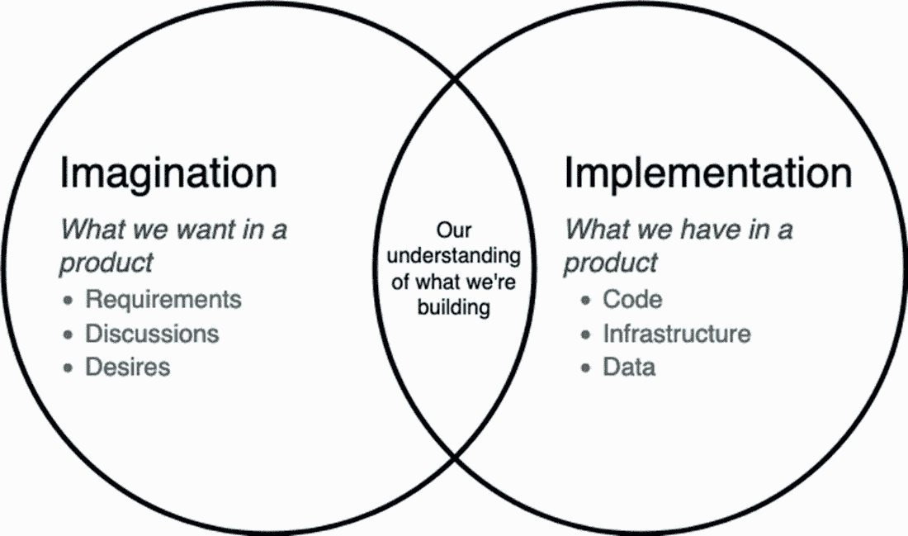
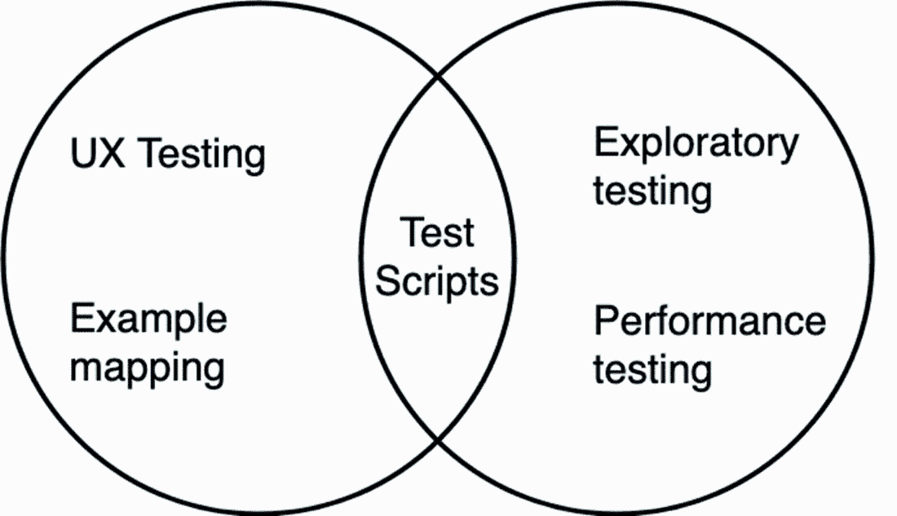
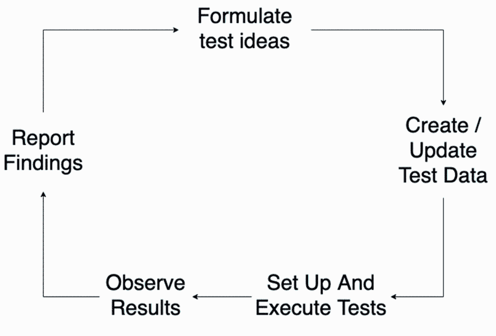
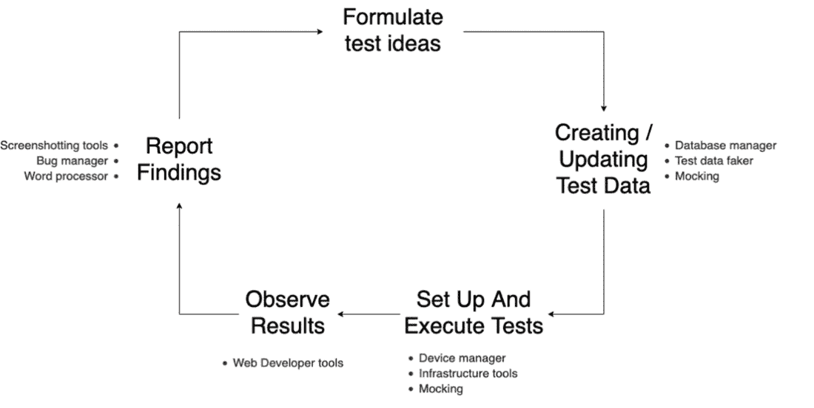
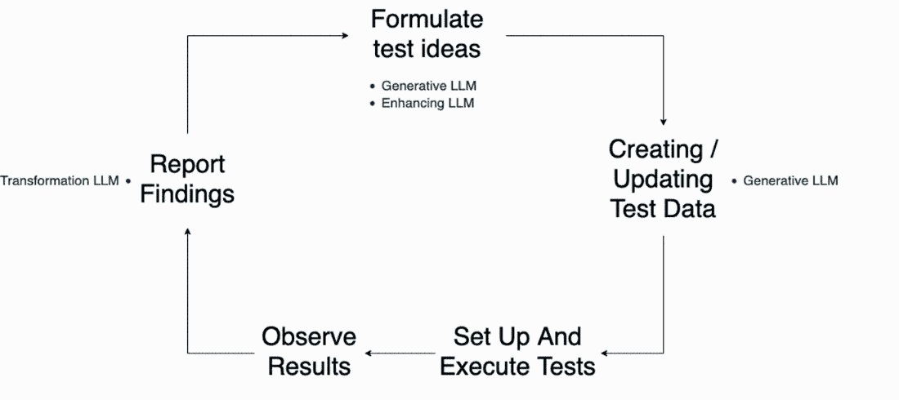

# 第三章：AI，自动化和测试

### 本章包括

+   概述良好测试的价值

+   欣赏工具在测试中的帮助

+   确定何时可以使用 AI 工具进行测试

在我们开始探索在测试中使用 LLMs 之前，我们需要稍微跳出来回答以下问题：

+   测试的目的和价值是什么？

+   工具如何帮助我们实现这个目标？

+   何时适用于使用 AI 工具？

对于有些人来说，提出这些基本问题可能感觉是一种不必要的活动。但是，如果你是那种仅将测试视为一种确认性的练习的人，比如执行测试用例以确认需求是否正确，那么你对后续章节的理解可能会有限。了解测试的价值和性能对于确定如何有效地使用工具至关重要。因此，在本章中，我们将探讨为什么对测试有更深入的理解可以帮助我们有效地利用工具。也就是说，如果你已经对测试有了深入的了解，可以跳过本章继续阅读。对于我们其他人来说，让我们回到最初的问题，为什么要测试？

## 3.1 测试的价值

为了帮助我们充分认识到为什么我们需要软件开发中的测试的重要基础，让我们回到常见的观点，即测试是一种确认性的练习。这意味着测试被视为一种用于确认以下条件的操作：

+   符合书面需求。

+   所有关键路径在系统中都已覆盖。

+   系统没有漏洞。

持有这种观点的团队往往过度依赖包含明确指令的测试用例/脚本，这些指令是为了让人或机器按照要求执行并确认预期结果是否已经满足。这种心态和方法的问题并不在于使用测试脚本，而是仅仅使用测试脚本而没有其他。过度依赖测试脚本会带来许多偏见，但是如果我们将其回归到测试中使用 LLMs 的情况，那么它会限制我们对这些工具如何帮助我们的认识。当像 ChatGPT 这样的工具日渐流行时，围绕在测试中使用 LLMs 的演示和讨论主要集中在一个方面：测试脚本。人们会演示 LLMs 如何生成测试脚本，这些脚本可以由人或测试自动化工具手动执行。

虽然最初这些可能有些用途，但是关于如何利用 LLMs 在测试中做其他事情的选择开始减少。乍一看，这似乎是工具的局限性，但实际上，真正的问题是对测试的限定概念以及其如何帮助。所以，如果我们要扩大在测试中使用 LLMs 的范围，我们首先必须扩展对测试的理解和工作原理。

### 3.1.1 关于测试的不同思考方式

为了帮助我们建立更深入的理解，让我们探讨我用来定义我认为测试是为了什么以及它如何帮助的测试模型，如图 3.1 所示。

##### 图 3.1 测试模型，用于描述测试的价值和目的



这个模型是基于詹姆斯·林赛在他的论文“探索与战略”中创建的一个模型`www.workroom-productions.com/why-exploration-has-a-place-in-any-strategy`，由两个圆组成。左圈代表想象力，或者我们在产品中*想要*的东西，右圈代表实现，或者我们在产品中*拥有*的东西。测试的目的是通过执行测试活动尽可能多地了解这两个圈中发生的事情。我们在这两个圈中进行的测试越多，我们学到的东西就越多。然后我们可以：

1.  发现可能影响质量的潜在问题。

1.  重叠这两个信息圈，确保我们理解并有信心我们正在构建我们想要构建的产品或服务。

为了更详细地描述这一点，让我们看一个例子，团队正在交付一个我们希望确保质量达到高水平的假想搜索功能。

#### 想象力

想象力圈代表我们从产品中想要的东西，其中包括明确和隐含的期望。因此，在这个圈子里，我们的测试集中在尽可能多地了解这些明确和隐含的期望上。通过这样做，我们不仅了解了书面或口头共享的明确要求，而且深入挖掘细节，并消除了术语和想法的模糊性。假设业务代表或用户，如产品负责人，已将此要求与他们的团队共享：

```py
'Search results are to be ordered by relevance.'
```

这里共享的明确信息告诉我们，产品所有者希望按相关性排序的搜索结果。然而，可以通过测试所要求的想法和概念来发现许多隐含信息。这可能以我们可以提出的一系列问题的形式出现，例如：

+   “相关结果”是什么意思？

+   与谁相关？

+   共享哪些信息？

+   我们如何按相关性排序？

+   我们应该使用什么数据？

通过提出这些问题，我们形成了更全面的图片，消除了团队思维中的任何误解，并识别了可能影响这些期望的潜在风险。如果我们更多地了解我们被要求构建的内容，那么我们第一次就更有可能构建正确的东西。

#### 实现

通过测试想象力，我们更清楚地了解被要求构建的东西。但是，仅仅因为我们可能知道要构建什么并不意味着我们最终会得到符合这些期望的产品。这就是为什么我们还要测试实现来了解：

+   产品是否符合我们的期望

+   产品可能不符合我们的期望的方式

这两个目标的重要性相等。我们希望确保我们构建的是正确的东西，但总会有一些副作用，比如意外行为、漏洞、未达预期的情况以及产品中可能出现的奇怪现象。以我们的搜索结果示例为例，我们不仅可以测试该功能按相关顺序提供结果，还可以问产品以下问题：

+   如果我使用不同的搜索词会怎样？

+   如果相关结果与其他搜索工具的行为不匹配怎么办？

+   如果我搜索时部分服务停止了怎么办？

+   如果我在 5 秒内请求 1000 次结果怎么办？

+   如果没有结果会怎样？

通过超越我们的期望进行探索，我们更加了解我们产品内发生的情况，不管是好事还是坏事。这确保我们不会对我们产品的行为产生错误的假设，并发布一个质量差的产品。这也意味着如果我们发现了意外行为，我们可以选择尝试去除或调整我们的期望。

### 3.1.2 测试的整体方法

想象和实现测试模型表明，测试超越了简单确认期望的程度，提出了一个更全面的测试方法。通过实施专注于想象和实现空间的不同活动，我们通过执行测试学到了更多关于我们想要构建和已经构建的内容。我们在这两个领域学到的越多，它们之间的一致性就越高。而一致性越高，我们对质量的感知就越准确。

一个对自己的工作有充分了解的团队更清楚他们产品的质量。我们也就更有能力决定采取什么步骤来改进质量。这使我们能够决定将注意力集中在特定的风险上，对产品进行更改以与用户的期望相一致，或者确定我们想要花时间来修复哪些问题以及哪些问题我们打算放弃。这就是好的测试的价值，帮助团队做出这些明智的决策，并对他们所采取的开发高质量产品的步骤感到自信。

为了更好地理解这个模型，让我们考虑一个需要测试的示例背景。以我们的示例为例，我们负责交付一个快餐订购系统。用户登录，找到他们想要订餐的餐馆，下订单（订单将发送给餐馆），然后在产品内跟踪订单的送货情况。像这样的产品需要易于使用、高度可用和安全。因此，为了交付高质量的产品，我们可能需要利用不同的测试活动来关注不同类型的风险，如图 3.2 所示。

##### 图 3.2 想象和实现模型，并显示其中的示例活动



在这个模型中，我们可以看到一系列不同的活动，它们被放置在特定的区域，因为它们专注于特定类型的风险。例如，在想象力方面，我们可能会关注影响网站可用性的风险。因此，我们采用侧重于用户体验测试和协作设计的测试活动。在实现方面，我们希望确保产品稳定，并尽量减少可能影响产品可用性和使用性的风险。因此，我们采用探索性测试和性能测试等活动。最后，请注意，在重叠的区域中，我们添加了测试脚本。这对我们很有用，因为它们减轻了产品在其随着时间的推移而变化和变形时出现意外变化的风险，这表明测试脚本和自动化检查是有用的，但只是整体的一部分。

每一个活动都有不同的实现方式、不同的挑战以及工具能够帮助的不同方式。但是如果我们没有对测试是信息收集和知识分享的一种练习有所了解，我们就无法轻松地识别这些用法。有了这个模型，以及对我们的工作面临的许多不同风险以及帮助我们减轻这些风险的测试活动的认识，我们可以开始更深入地了解工具在测试中的作用。

## 3.2 工具如何帮助测试

你可能会听到一个测试人员说（或者甚至你自己曾经说过），没有足够的时间来测试所有的东西。这本书中可能会重复几次。团队总是受到时间、预算、会议、人员配置和其他因素的限制，因此，为了实施和执行有效的现代化测试，我们必须依靠工具来帮助我们。工具对于测试至关重要，但它们也带来了我们下一个关于测试的误解——即工具或机器能够像人一样测试。

### 3.2.1 自动化偏见

为了了解机器和人类在测试方面的不同之处，让我们考虑一个例子，其中两者都用于测试网站上的一个功能。该功能是电子商务网站的全宽横幅，带有一个图片和一些突出当日优惠的文字。最初，我们以手动方式或人为导向的方式测试它，并观察到该功能正常工作：图片显示出来，与之相关的所有文本都是正确的。然后，我们决定使用工具来自动化这个测试。我们编写代码，将打开浏览器并断言元素 A 存在，元素 A 是加载当日优惠的位置。我们运行自动化测试，它通过了。然后有一天，在另一个成功的发布之后，我们所有的自动化测试都通过了，一个最终用户提出了一个 bug，并告诉我们他们看不到当日优惠。他们只看到页面顶部的一个空白白色框。

发生了什么事？在创建自动化测试的过程中，我们已经转移了我们的知识，这些知识是根据心理启发和预言建立起来的隐含信息。我们已经将我们对特性的复杂理解简化为一个指令：网页上应该存在元素 A。所以当我们的产品的最新版本出现了无法检索每日特惠的故障功能，或者 CSS 不正确或损坏时，自动化测试仍然通过，因为元素 A 仍然存在。然而，人类只需要几秒钟就可以看出问题出在哪。

这个故事的寓意并不是工具是坏的或不必要的，而是它们经常被误用或被解释不正确。这种行为是*自动化偏见*，潜入了我们对工具价值的看法，即我们为工具的输出赋予的价值往往超过了它向我们传达的内容。也就是说，当我们设计我们的自动化测试来寻找元素 A 时，我们假设我们人类所做的只是寻找元素 A。但即使我们没有有意识地这么做，我们还考虑了许多其他因素。

如果我们陷入自动化偏见，我们就会冒险选择和实施我们认为可以像人类一样揭示和报告信息的工具——而实际上它们不会，这会导致我们对所提供的产品产生错误的过分自信，或者产生一种使工具模仿人类行为的工作量水平，这对于一个现代项目是不可持续的。工具不能取代测试活动，而认同这种观点最终会导致质量问题，并增加项目的风险。因此，我们必须更多地转向如何利用工具来支持我们的测试。

### 3.2.2 选择使用工具

**成功的工具使用**源自于我们在解决问题时对问题进行了一些思考，以及潜在可以帮助的工具。为了更好地理解这一点，让我们回到我们的每日特惠功能，并更仔细地看一看当人们测试这样的功能时在做什么。

首先，我们考虑不同的测试功能的方法。我们利用我们对所述功能的当前理解来形成测试想法，并选择首先要测试的内容。接下来，我们需要设置我们的测试。这可能包括设置环境或创建/更新必要的测试数据。（我们可能需要创建一个每日特惠以供观察，以及测试用户以进行和查看交易。) 当一切都准备好了，我们就需要执行我们的测试，加载浏览器，或者可能是多个浏览器，以验证交易正确地呈现出来。然后，一旦我们观察到结果，我们就会做笔记或向团队报告我们的发现，所有这些都会更新我们对特性的理解，准备好让我们再次开始这个过程。这个流程可以用类似于图 3.3 所示的可视化来总结。

##### 图 3.3 测试每日特惠功能过程的可视化



这个循环可能会迅速发生——例如，在一次探索性测试会话中。或者可能是以较长的形式进行，比如性能测试，其中每一步都有许多细节需要考虑。无论是哪种类型的活动，要成功地执行这个循环，我们都需要工具来完成这个过程。我们可能需要使用诸如数据库客户端、测试数据管理器或基础设施工具来设置状态管理。我们会使用笔记工具、截图应用程序和项目管理工具来报告所学内容。我们可以通过更新我们的初始可视化来总结这些测试工具的用途，如图 3.4 所示。

##### 图 3.4 测试过程的可视化，这次添加了工具



这个可视化演示了现代测试如何利用各种工具来执行测试中发生的各种任务——而不是试图将整个测试性能都包装到一个工具的使用中。这是因为，正如可视化所展示的那样，当进行测试时，有许多不同的活动在进行，通常成功的工具是那些能够很好地完成一项工作的工具，而不是那些能够很差地完成许多事情的工具。

这种思考之所以如此有趣，是因为当我们花时间考虑它时，它对我们来说似乎是显而易见的。我们都使用工具来帮助我们完成构成较大活动的不同任务。然而，大多数人在没有意识到或故意思考的情况下就这样做了。虽然我们知道在特定任务中使用工具是明智的，但我们需要培养选择并有意识地使用工具的技能。这意味着熟悉工具，并更加关注我们在测试中每天所做的事情，以便我们可以选择正确的工具，或者在 LLMs 的情况下，选择正确的提示或增强功能。本书的其余部分将专注于这一点，为我们提供需要的技能，以便知道 LLMs 何时可以帮助完成特定任务。

## 3.3 知道何时在测试中使用 LLMs

现在我们已经了解了测试中有效利用工具是关于寻求增强测试中的任务而不是复制广泛的测试活动。但是 LLMs 如何适应这一点呢？考虑到它们的广泛应用，让我们看看目前 LLMs 被普遍使用的一些方式，以及如何每种方式都可以用于支持测试。

### 3.3.1 生成能力

生成 AI 的标签被应用到 LLMs 上，因为它们提供了生成新的自然语言输出的能力。这意味着如果我们要求 LLM 生成一首关于软件测试奇迹的诗，它会生成，尽管可能会重复它训练过的材料——而且可能是一首糟糕的诗。但是暂且不谈质量，LLMs 基于其模型和所给的提示生成新输出的能力是吸引了很多关注的。

然而，我们必须提醒自己，LLM 生成输出的方式是基于复杂的概率模型。这意味着它将以与我们人类生成思想不同的方式生成材料。一个很好的例子是使用 LLMs 生成测试用例。如果你回忆一下第一章，我们探讨了向 LLM 发送以下提示时的概念：

```py
Create tests for a file upload feature
```

它可能会以类似于以下的方式做出响应（为了简洁起见进行了缩短）：

```py
1\. Test for File Upload Functionality:

    Test Case 1.1: Upload a Valid File
        Input: Choose a file with a valid format (e.g., .jpg, .pdf).
        Expected Outcome: The file is successfully uploaded, and a confirmation message is displayed.

    Test Case 1.2: Attempt to Upload an Invalid File
        Input: Choose a file with an invalid format (e.g., .exe, .html).
        Expected Outcome: An error message is displayed, indicating that the file format is not supported.

2\. Test for File Size Limit:

    Test Case 2.1: Upload a File Below the Size Limit
        Input: Choose a file smaller than the maximum allowed size.
        Expected Outcome: The file is successfully uploaded, and a confirmation message is displayed.

    Test Case 2.2: Attempt to Upload a File Exceeding the Size Limit
        Input: Choose a file larger than the maximum allowed size.
        Expected Outcome: An error message is displayed, indicating that the file exceeds the maximum size limit.
```

LLM 生成这些测试用例的方式令人印象深刻，但它们缺乏与我们正在测试的特性或产品相关的上下文和特定性。因此，当与 LLMs 一起工作时，我们需要确保我们如何提示它们或扩展它们提供足够的上下文，以便生成有价值的输出。

确保我们提供足够的上下文的结果是，使用 LLMs 更容易生成非常具体和有针对性的任务输出。另一种方法是我们必须提供大量的输入数据，这将导致一个昂贵且难以维护的提示。例如，想象一下你需要为 LLM 提供多少上下文才能得到一个与我们的工作背景相关的测试策略。

相反，如果我们专注于使用 LLMs 来帮助执行这些任务，我们就可以从它们那里获得更多的价值：

+   **测试数据生成** - 当给定数据集的明确规则时，LLMs 可以用于生成一系列用于各种测试活动的数据，从探索性测试到性能测试。

+   **风险和测试点的建议** - 我们应该始终避免让 LLMs 的输出成为测试与否的唯一裁决者。我们可以用它们来提出测试点和风险，作为新想法的出发点或纳入我们现有的工作。

+   **代码片段** - 类似于之前的测试用例示例，如果我们让它们生成完整的自动化测试或框架，我们将从 LLMs 中获得很少的价值。然而，使用它们来生成自动化的较小部分或用于支持测试活动的脚本，如探索性测试，可能是有利的。

### 3.3.2 变换能力

LLMs 提供的另一个好处是能够将自然语言从一种结构转换为另一种结构。LLM 转换的常见示例是语言翻译。假设我们向 LLM 发送了类似于以下的内容： 

```py
Convert the following text delimited by three hashes into French:

###
Hello, my name is Mark
###
```

然后它会返回类似于以下的响应：

```py
Bonjour, je m'appelle Mark
```

这是一个说明 LLM 如何转换数据的有用方式，但我们不应仅限于口语。LLM 能够将所有类型的数据从一种抽象转换为另一种。以下是一些可帮助测试的示例：

+   **转换测试数据** - 使用 LLM 迅速将数据从一种结构转换为另一种结构可以加快测试速度。例如，我们可以要求 LLM 将纯文本测试数据转换为 SQL 语句，或者将 SQL 语句转换为在测试自动化中调用的帮助函数。

+   **转换代码** - LLM 可以将函数、类和其他数据转换为新的代码。重要的是，LLM 可以将代码转换为不同的语言，但仍然保持原始代码的逻辑和流程在新的翻译输出中（尽管我们应该始终测试以确保正确）。

+   **总结笔记** - 虽然不像将代码片段从一种语言转换为另一种语言那样直接转换数据，但我们可以使用 LLM 同时进行转换和总结。我们可以使用 LLM 将来自测试活动（如探索性测试或左移测试会议）的原始测试笔记转换为摘要笔记与他人共享。

### 3.3.3 增强能力

最后，我们可以使用 LLM 来增强和扩展现有材料。这通常意味着向 LLM 提供一小段数据片段，并提示 LLM 扩展该段落。这与生成能力有一些重叠，因为我们要求 LLM 生成一定程度的新输出，但在这种情况下，我们提供了更多的上下文信息，并指导其关注现有材料，而不是提示 LLM 生成完全不同的内容。这意味着我们可以利用这种能力来帮助我们完成以下测试任务：

+   **代码审查** - 并非所有从事测试工作的人都是自信的编码人员，即使是那些习惯阅读代码的人有时也会在分析或测试所需的代码时感到困惑。LLM 可以通过获取代码片段并提供自然语言的代码分解来增进我们的理解，这对于风险分析、测试设计等方面都有帮助。

+   **描述性代码** - 类似于审查代码，我们可以使用 LLM 来帮助提高代码的描述性 - 例如，快速创建易于创建和维护的代码注释。对于自动化测试特别有用，在自动化代码要进行维护的情况下，交流我们的自动化代码正在做什么很重要。

+   **扩展分析** - 我们还可以使用 LLM 来扩展我们的分析活动，如风险分析和左移测试（在构建功能之前，我们提前提出需求问题）。通过提供当前的分析数据，我们可以要求 LLM 进行审查和扩展，提出新的想法，我们可以将其纳入我们的分析中或忽略。

### 3.3.4 在测试中使用 LLM

为了将 LLMs 的这些不同能力置于上下文中，让我们回到我们在图 3.5 中展示的带有工具支持的测试的可视化中。

##### 图 3.5 测试过程的可视化，这次增加了 LLMs 的内容。



通过查看此更新后的可视化，我们可以看到 LLMs 如何被插入到更广泛的测试生命周期中的不同和特定任务中。这让我们回到了我们在第一章中涵盖的影响范围模型。与其尝试使用 LLMs 来复制生命周期中存在的所有测试活动，我们更优先考虑人类的最佳能力和我们为测试带来的价值。然后我们选择在选择性的领域中添加 LLMs 以扩展我们的工作，以便我们能够更快地移动，学到更多，并确保我们的团队得到更好的信息，以便他们能够构建更高质量的产品。

## 3.4 总结

+   如果我们对测试的理解有限，那么使用工具的范围也将受限。

+   测试不是一项确认性的练习，而是一系列不同的活动，帮助那些想要了解产品想象力和实施的人。

+   想象力与我们对所要构建的东西的理解有关。

+   实施与我们对所构建的东西的理解有关。

+   随着我们对两个方面的理解增加，它们会相互一致，帮助我们交付更高质量的产品。

+   我们运行许多不同类型的测试活动，以便专注于不同类型的风险以及它们对想象力和实施的影响。

+   工具是成功测试的重要组成部分。

+   LLMs 可以用于生成、转换和增强输出。

+   使用 LLMs 进行较小，具体的任务，以生成提供价值的输出。

+   LLMs 可以为我们生成内容，这些内容可以帮助完成特定任务或创建建议的内容。

+   LLMs 可以将数据转换为有用的格式或对其进行总结。

+   LLMs 还可以增强现有材料，添加新的建议或扩展细节。

+   我们可以将 LLMs 插入到许多不同且具体的测试任务中，这反映了我们在第一章学到的影响范围模型。
