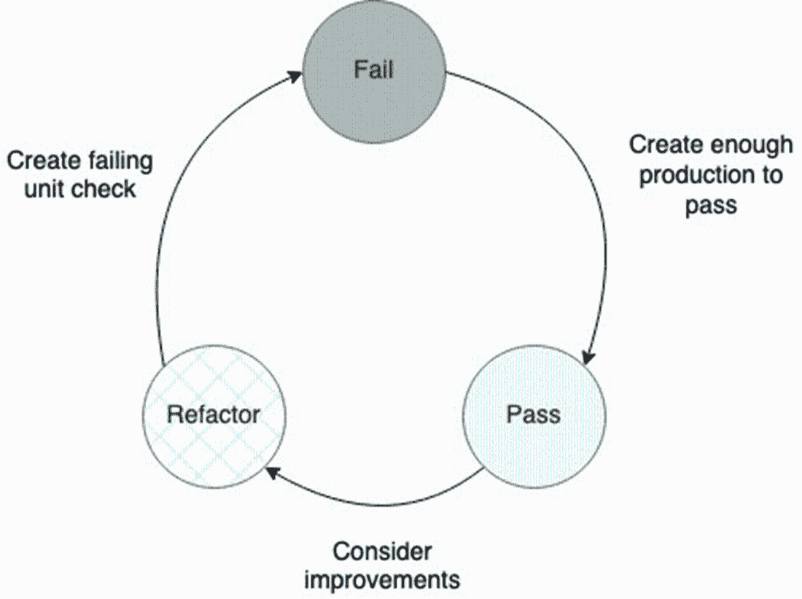
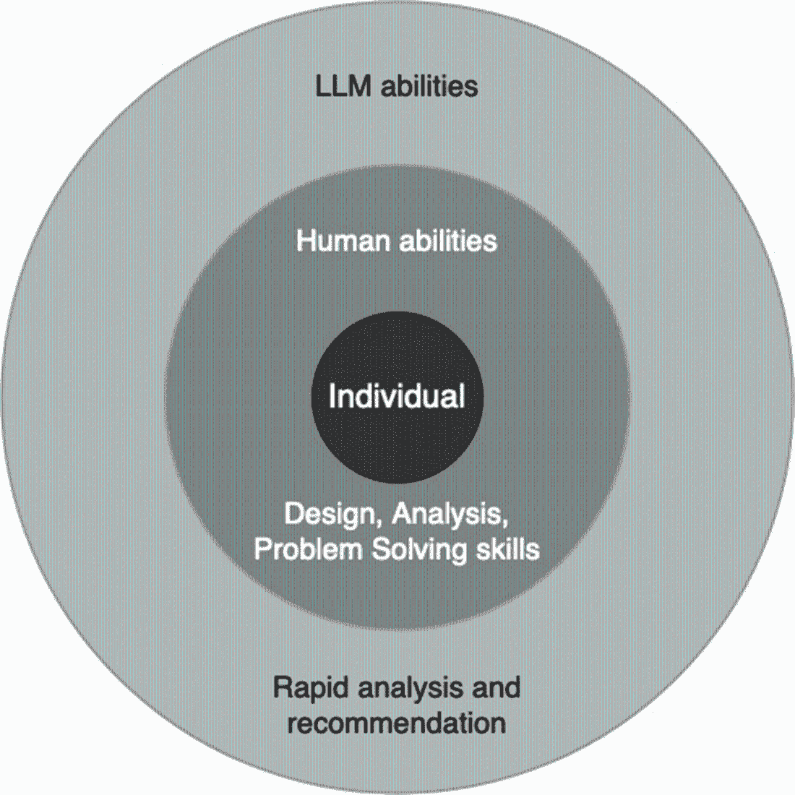

# 第四章：AI 辅助开发者测试

### 本章内容包括

+   使用 GitHub Copilot 开发单元测试和生产代码

+   使用 ChatGPT 开发单元测试和生产代码

根据 JetBrains 于 2022 年进行的开发生态系统调查显示，81%的受访者的开发人员与 QA 的比例大于 1：1。其中 40%报告称他们的开发人员中“不到 10 名开发人员中有 1 名 QA”，只有 1%的受访者报告称他们拥有“比开发人员更多的 QA”。（该调查可在 www.jetbrains.com/lp/devecosystem-2022/testing 找到。）

理解和建立质量至关重要，以向我们的用户提供价值，然而，开发和测试之间的比例几乎总是不平衡的，原因有很多。一些组织领导选择通过质量教练的支持来教育开发人员建立质量，而其他人则简单地不愿意投资于提倡测试和质量的角色。无论哪种情况，这种情况都给团队的每个人带来了交付高质量应用程序的压力。那么，AI 工具如何帮助减轻这种压力呢？

在本章中，我们将专注于如何借助大型语言模型（LLM）AI，如 GitHub Copilot 和 ChatGPT，帮助我们开发人员将质量融入我们的工作中。我们不应将这些 AI 工具视为开发人员和测试人员的替代品，而应学习它们如何指导我们在开发过程中进行质量建设的活动，以及如何利用 AI 工具引导改进质量并在测试资源有限时识别风险。

## 4.1 探究自动化开发者的兴起

2023 年 4 月，市场竞争分析公司 Similarweb 报告称，Stack Overflow 在前一个月的流量下降了 14%。根据 Similarweb 的说法，原因是开发人员从 Stack Overflow 转向 GitHub 的 Copilot 和 ChatGPT 等工具。 （您可以在 www.similarweb.com/blog/insights/ai-news/stack-overflow-chatgpt 阅读该文章。）无论这是否是开发人员跳槽的持续趋势，还是最终会达到平衡的异常情况，像这样的报道都显示了基于 LLMs 的 AI 工具（LLMs）对开发人员角色引入的巨大变化。

作为测试人员，见证这种变化是很有趣的。多年来，随着测试自动化工具的不断发展，我会与开发人员讨论是否可以通过自动化测试工具来替代测试工作。现在，随着针对来自公共和私人存储库的数十亿行代码进行训练的 LLMs 的出现，谈论的话题已经转向是否可以自动化开发人员的角色。例如，像 ChatGPT 这样的工具可以发送这样的提示：

```py
Write me some Java code that sends an HTTP request to a booking API
```

然后，它将利用其数十亿个训练权重和平衡来返回一个工作代码示例，就像这样：

```py
import java.io.BufferedReader;
import java.io.IOException;
import java.io.InputStreamReader;
import java.net.HttpURLConnection;
import java.net.URL;

public class BookingAPIClient {
    public static void main(String[] args) {
        String apiUrl = "https://api.booking.com/endpoint"; // Replace with the actual API endpoint URL

        try {
            URL url = new URL(apiUrl);
            HttpURLConnection connection = (HttpURLConnection) url.openConnection();

            // Set the request method (GET, POST, etc.)
            connection.setRequestMethod("GET");

            // Set request headers if required
            connection.setRequestProperty("Content-Type", "application/json");
            connection.setRequestProperty("Authorization", "Bearer YOUR_ACCESS_TOKEN");

            // Get the response code
            int responseCode = connection.getResponseCode();
            System.out.println("Response Code: " + responseCode);

            // Read the response
            BufferedReader reader = new BufferedReader(new InputStreamReader(connection.getInputStream()));
            String line;
            StringBuilder response = new StringBuilder();
            while ((line = reader.readLine()) != null) {
                response.append(line);
            }
            reader.close();

            // Print the response
            System.out.println("Response: " + response.toString());

            // Close the connection
            connection.disconnect();

        } catch (IOException e) {
            e.printStackTrace();
        }
    }
}
```

从一个基本提示我们可以使用 LLM 来创建可用的代码（将 `apiUrl` 更新为真实的 API 返回了积极的结果）。因此，出现了结合提示尝试自动化开发工作的工具并不奇怪。出现了像 AutoGPT 和 MetaGPT 这样的工具，它们作为自治代理工作，根据最初的问题生成自己的提示来解决复杂的问题。尽管这些工具还处于萌芽阶段，但很明显可以理解为什么开发人员被自动化出他们的角色的夸张说法所困扰。

作为一个大部分职业生涯都在解释为什么测试自动化不能作为合适替代品的人，很容易享受看到开发人员以同样的方式捍卫他们的角色的快感，但相反，从测试人员的经验和自动化的话题中学习更有价值。正如测试人员的角色不能完全自动化一样，开发人员的角色也不能。开发角色不仅仅是所产生的代码。开发人员创建的解决方案是分析技能、问题解决和设计思维的产物。这些是 LLM 工具给人的印象能够做到的技能，但目前它们还不能。

相反，开发人员通过使用 LLM 工具来增强他们自己的能力而取得成功，使用像 Copilot 这样的工具快速有效地创建他们想要构建的代码，或者向 ChatGPT 寻求解决问题或学习新的 API。这些原则也可以应用于提高开发人员构建应用程序质量的能力。通过将诸如测试驱动设计（TDD）或与 LLM 强大的配对技术相结合，开发人员可以提高生产力，同时确保他们的分析和设计技能发挥主导作用。为了帮助证明这种共生关系，让我们探讨两个例子：

+   使用 Copilot 快速生成 TDD 循环的单元检查和生产代码

+   通过 ChatGPT 的模拟开发人员模拟配对

通过这些示例，我们将学习设置和使用这些 LLM 工具，并欣赏我们可以在 AI 的力量和开发人员的能力之间取得的平衡。

##### 经验可能有所不同

鉴于 Copilot 依赖于经常在新添加的代码和更新的 API/库上进行训练的预测算法，值得强调的是，遵循即将出现的示例时您所拥有的输出和体验可能与已记录的内容不同。请记住，本章的目标不是完全复制本章中的示例，而是让我们舒适地使用 LLM 工具来协助我们的工作，从而帮助我们提高质量。

## 4.2 与 LLM 的配对

我们已经花了时间了解到 LLM 具有概率性质，因此认为它们输出的是角色的模拟，而不是具体的角色。LLM 对于自己是软件测试员还是餐厅经营者并不更加清楚。但是通过提示工程，我们可以创建提示，将 LLM 的概率输出框架化为模拟角色，帮助我们创建与之交互的橡皮鸭。当测试资源在可用性或能力上有限时，这在开发方面可能很有用。因此，让我们看看我们可以使用的几个示例提示，这些提示可以帮助我们改进我们的工作和产品的质量。

##### 等等，什么——橡皮鸭？

面对无解的问题时，向他人口头表达问题可能有助于找到答案。通过向他人表达问题，我们有时会发现解决方案呈现在我们面前。然而，并不总是有机会与同事交流；因此，一些开发人员会向橡皮鸭（或其他物品）表达他们的问题。尽管我们把挑战分享给了一个无生命的物体，但体验是相同的：口头表达我们的挑战会让我们的大脑找到解决方案。

### 4.2.1 分析思想

我们的第一个提示灵感来自于一些团队应用的左移思维，旨在尽早将测试分析引入开发过程中，理想情况下是在讨论想法和澄清细节的时候。左移意味着将测试分析尽早引入开发过程中，理想情况下是在讨论想法和澄清细节的时候。这个过程会引发许多问题，这些问题有助于我们更早地识别问题、交付有价值的功能并提高产品的质量。左移活动对于提高质量非常重要，应该鼓励，无论在开发过程中是否使用 AI。但这并不意味着我们不能使用提示来生成可能揭示假设或误解的问题，或者我们可以简单地忽略的问题。

让我们来看一个可以用来迅速生成可能有用的问题的示例提示：

```py
#A
You are a software testing expert. Analyse the text delimited by triple hashes and generate questions that will clarify ambiguities in the text.

#B
* Questions will be generated by using the What, Where, Why, When, Who and How heuristic
* Multiple questions can be identified for each quality characteristic
* The quality characteristics we care about are: Accuracy, Security and Accessibility
* Output questions in the format of Question - Explanation

#C
Example:
What does relevant mean?
The acceptance criteria says relevant search results, but how do we determine what is relevant and what isn't?

#D
###
As a B&B owner
I want to be able to manage user access
So that I can allow different levels of access to multiple users

Features:

- DB is configured with an Admin user
- Guests are asked to create an account to make a booking
- Admin can see the accounts created on the platform and can delete them
###
```

提示概述了一个用于分析用户故事和验收标准的 LLM 的指令，并返回一个我们要考虑的问题列表。请注意，我们还在质量特征指令中提供了上下文。如果我们想要关注不同的特征，我们也可以更新这些特征。

将此提示输入 ChatGPT 返回了以下结果：

```py
Accuracy:
1\. What criteria are used to determine the accuracy of user access management?
Explanation: The text mentions managing user access, but it doesn't specify how accuracy is ensured in granting different levels of access to multiple users.

2\. How is the system ensuring that the right access levels are assigned to users?
Explanation: The text refers to allowing different levels of access to multiple users, but it doesn't explain the mechanism for guaranteeing the accuracy of access permissions.

Security:
1\. Who has access to the database configured with an Admin user?
Explanation: The text mentions configuring the database with an Admin user, but it doesn't specify who has access to this Admin account and how its security is maintained.

2\. How is the platform protecting user account information and data?
Explanation: The text talks about guests creating accounts for bookings, but it lacks details about the security measures implemented to safeguard user data.

3\. What security measures are in place to prevent unauthorized access to user accounts?
Explanation: The text mentions that Admin can see and delete accounts, but it doesn't explain how unauthorized access to such account management functionalities is prevented.

Accessibility:
1\. What levels of accessibility are provided to different types of users?
Explanation: The text mentions managing user access with different levels, but it doesn't clarify what those levels are and how they vary based on user types.

2\. How are guests guided to create accounts for booking, and is the process accessible to all users?
Explanation: The text states that guests are asked to create accounts, but it doesn't specify how this process is carried out and if it meets accessibility standards.

3\. What measures are taken to ensure the platform's accessibility for users with disabilities?
Explanation: The text doesn't provide information on how accessibility is addressed for users with disabilities, and it's essential to understand the measures taken to accommodate their needs.

4\. Where can we find information about the platform's accessibility features?
Explanation: The text mentions nothing about the platform's accessibility features, so it would be helpful to know where this information is available.
```

通过阅读响应，我们可以看到有一个有趣的问题集合，质量参差不齐。例如，考虑这个问题：

```py
How are guests guided to create accounts for booking, and is the process accessible to all users?
Explanation: The text states that guests are asked to create accounts, but it doesn't specify how this process is carried out and if it meets accessibility standards.
```

这是一个有帮助的问题，鼓励我们更详细地考虑`Guests are asked to create an account to make a booking`这一陈述，在我们的用户故事中发现。我们可以考虑这个问题，思考一下我们将如何设计预订流程，使其对所有类型的用户都可以访问。

然而，其他问题可能并不太好。例如：

```py
What criteria are used to determine the accuracy of user access management?
Explanation: The text mentions managing user access, but it doesn't specify how accuracy is ensured in granting different levels of access to multiple users.
```

使这个问题变得棘手的是它对`accuracy`质量特征的引用。通常，准确性更侧重于处理或存储的数据的准确性（想想银行利率计算）。相反，“用户访问的准确性”这个短语感觉像是描述用户和他们可以访问的内容的规则集的奇怪方式。最终，我们需要评估每个问题的适用性和使用情况。一些问题可以鼓励我们构建更符合用户需求的产品，并帮助我们避免错误——而其他生成的问题要么没有意义，要么涵盖了已经考虑过的主题。

我们将回到这个提示，以及我们在开发功能期间如何使用它，但首先让我们看看我们如何重新利用这个提示来审查我们的代码。

### 4.2.2 分析代码

就像我们可以促使一个 LLM 分析书面的想法一样，我们也可以让它审查代码，并帮助我们识别风险。使用这个提示类似于模拟与你合作的开发人员或测试人员的角色，让他们在你开发时分析你的工作并提出建议供考虑。让我们看看一个可能对这种类型的活动有用的提示：

```py
#A
You are a software testing expert. Analyze the code delimited by triple hashes and identify risks that might impact the code. If no code is provided, respond with "No risks could be found"

#B
* Risks must be related to the quality characteristics: Performance, security and interoperability
* Multiple risks can be identified for each quality characteristic
* Output identified risks in the format of Risk - Quality Characteristic - Explanation

#C
Example:
Overflow - Security - Adding in large integers as parameters might cause the method to trigger a buffer overflow.

#D
###
public BookingResult createBooking(Booking bookingToCreate) throws SQLException {
    if(dateCheckValidator.isValid(bookingToCreate.getBookingDates())) {
        if (bookingDB.checkForBookingConflict(bookingToCreate)) {
            return new BookingResult(HttpStatus.CONFLICT);
        } else {
            CreatedBooking createdBooking = bookingDB.create(bookingToCreate);

            if(bookingToCreate.getEmail() != null && bookingToCreate.getPhone() != null){
                MessageBuilder messageBuilder = new MessageBuilder();
                Message message = messageBuilder.build(bookingToCreate);

                messageRequests.postMessage(message);
            }

            return new BookingResult(createdBooking, HttpStatus.CREATED);
        }
    } else {
        return new BookingResult(HttpStatus.CONFLICT);
    }
}
###
```

在我向 ChatGPT 发送了包含示例代码和质量特征的提示后，返回了以下输出：

```py
Based on the provided code snippet, let's analyze the potential risks that might impact the quality characteristics of Performance, Security, and Interoperability:

    Performance - Nested Validation:
    Risk: The nested validation checks (dateCheckValidator.isValid and bookingDB.checkForBookingConflict) may lead to performance issues, especially when dealing with a large number of bookings.
    Explanation: If the system has to process a substantial amount of bookings, the nested validation can result in increased execution time and resource consumption.

    Performance - Message Posting:
    Risk: The message posting (messageRequests.postMessage) might introduce performance bottlenecks, affecting the overall system responsiveness.
    Explanation: If the message posting process involves network communication or I/O operations, it could slow down the execution of the createBooking method.

    Security - SQL Injection:
    Risk: The code is susceptible to SQL injection attacks as it directly uses the bookingToCreate object in the database queries.
    Explanation: Malicious input in the bookingToCreate object could manipulate the SQL queries and compromise the integrity and security of the database.

    Security - Inadequate Authorization:
    Risk: The code does not perform explicit authorization checks before creating bookings, potentially allowing unauthorized users to create bookings.
    Explanation: Lack of proper authorization checks can lead to unauthorized access and misuse of the system's booking creation functionality.

    Interoperability - Platform Dependencies:
    Risk: The code might have dependencies on specific platforms or libraries, limiting its interoperability with other systems or environments.
    Explanation: If the MessageBuilder or messageRequests rely on platform-specific features or external libraries, it could cause issues when running the code in different environments.

    Interoperability - Error Codes:
    Risk: The code returns HTTP status codes directly, which may not be compatible with other systems that expect different error code formats.
    Explanation: If external systems expect error codes in a different format (e.g., JSON or XML), using HTTP status codes may hinder interoperability.
```

与前一个提示类似，它围绕书面需求产生了问题，这些不同风险的质量也不同。例如，风险`Performance - Message Posting`感觉相当抽象，正如我们在其解释中看到的那样：

```py
If the message posting process involves network communication or I/O operations, it could slow down the execution of the createBooking method.
```

围绕网络通信或 I/O 操作提出风险建议感觉模糊，因为它可能涉及一系列实现，其中一些可能与我们的工作有关，而另一些可能不相关。

然而，其他风险更具体，可能更有用，例如，`Security - Inadequate Authorization`，其中它强调了：

```py
The code does not perform explicit authorization checks before creating bookings, potentially allowing unauthorized users to create bookings.
```

这个风险感觉更具体，因为它涉及到我们方法中执行的操作，以及其中缺少的可能重要的检查。当然，我们可能会在其他地方进行授权检查，但使用它所提供的信息，它强调了一个明确的活动，我们可能需要进一步讨论以改进我们的预订功能的安全性。

##### 生成更多的想法

到目前为止，我们已经查看了发送给 LLM 的单个提示，这使我们有用的反馈进行了审查。但是如果我们想要索取更多的问题和风险怎么办？我们只需提交额外的提示，例如“生成更多问题”或“识别更多风险”。但要小心，因为这会有递减的回报。LLM 将尝试满足我们的要求，从而增加幻觉的风险。因此，随着选项开始枯竭，我们可能会看到更多与我们最初希望反馈的想法和代码不相关的建议。

### 4.2.3 认识到模拟总比什么都没有好

当讨论测试时，重点通常集中在测试用例的制作和执行上。但是，一个经过高度培训和经验丰富的测试人员通过使用其批判性和横向思维技能提供价值，并提出有助于我们以新的方式查看解决方案并揭示潜在问题的问题。我们看过的提示可以提供该过程的模拟。但重要的是要记住，LLMs 没有这些批判性和横向思维技能，而生成的问题和风险来自我们提示的指示。相反，这些类型的提示可以提供一种轻量级的方式来模拟与测试人员或其他开发人员配对的经验，当无法配对时。关键是培养一种识别生成问题的眼光，以确定哪些是有用的，哪些是没有用的。

## 4.3 利用 AI 辅助构建质量

到目前为止，我们已经将提示视为单一活动，但现在让我们将注意力转向我们最近学到的提示以及其他 LLM 辅助工具如何与 TDD 结合使用，帮助我们构建质量。

尽管 TDD 与其他测试活动相比并不严格是一种测试活动，但正确执行的 TDD 可以帮助开发人员将质量融入我们的产品中。简而言之，TDD 的过程是使用单元检查工具首先创建失败的检查，然后创建足够的生产代码使检查*通过*（并修复可能失败的任何其他检查）。一旦我们的所有检查都通过了，我们可以在确保所有检查都是绿色的同时重构我们的生产代码。完成后，我们重新开始循环，直到工作完成，如图 4.1 所示。

##### 图 4.1 红绿重构 TDD 循环



##### 所有这些检查是什么意思？

在我们的测试自动化培训中，Richard Bradshaw 和我区分了人工测试和工具测试。我们称后者为*自动化检查*，因为工具只能断言我们编码到自动化中的显式操作或数据。这种区别帮助我们更好地理解，像单元检查框架这样的自动化工具非常擅长快速检查产品中的小型、具体的变化，但不能告诉我们有关系统的更多信息。然而，人类在测试中更慢且不确定性更大，尽管我们在识别同时发生的许多事件时效率更高。因此，这就是为什么工具检查而人类测试。一个并不比另一个更好，希望这本书能证明当我们结合两者时，我们能取得最好的成功。

这种方法使我们能够设计出高度可测试的产品，同时确保我们提供了业务或最终用户所期望的内容。

尽管它的好处多多，但一些开发人员发现很难采用 TDD 方法，因为有些人认为它会减慢开发速度，因为我们为系统中添加的每个特定的生产代码部分创建单元检查。然而，通过使用像 Copilot 这样的工具，我们可以学会如何建立一个平衡，在这个平衡中，工具使我们能够快速创建单元检查并构建质量。

## 4.4 使用 LLMs 创建我们的第一个 TDD 循环

为了演示，让我们来完成为示例工时管理器的一部分功能的过程，该功能如下所述：

```py
As a timesheet user
I want to be able to track time against specific projects
So that I can keep a history of how much time I have spent working on individual projects

Features:

- Time is tracked in half hour units
- To complete a timesheet a project and amount of time must be entered
- I should only be able to see my tracked time
```

您可以在以下 GitHub 存储库中查看作为示例一部分创建的测试和生产代码：`github.com/mwinteringham/ai-assisted-testing/tree/main/chapter-4`。

##### 设置 Copilot

这一章假设您已经在您的集成开发环境中安装并配置了 Copilot 插件。如果您尚未完成设置过程，您可以在附录中找到安装说明。

### 4.4.1 准备工作

在开始创建我的工时管理器功能之前，我想先考虑一下如何构建它。为了帮助我进行这个过程，并鼓励我从各个角度考虑解决方案，我将本章前面探索的第一个提示输入到其中。具体来说，我：

+   将质量特性更改为准确性和一致性

+   将用户故事添加到提示底部的分隔部分中

```py
You are a software testing expert. Analyze the text delimited by triple hashes and generate questions that will clarify ambiguities in the text.

* Questions will be generated by using the What, Where, Why, When, Who and How heuristic
* Multiple questions can be identified for each quality characteristic
* The quality characteristics we care about are: Accuracy and Consistency
* Output questions in the format of Question - Explanation

Example:
What does relevant mean?
The acceptance criteria says relevant search results, but how do we determine what is relevant and what isn't?

###
As a timesheet user
I want to be able to track time against specific projects
So that I can keep a history of how much time I have spent working on individual projects

Features:

- Time is tracked in half hour units
- To complete a timesheet a project and amount of time must be entered
- I should only be able to see my tracked time
###
```

将此提示发送给 ChatGPT 返回了以下响应：

```py
Accuracy:

    What is the required precision for tracking time in half-hour units? - The text mentions that time is tracked in half-hour units. It's important to know the level of accuracy required for this tracking.

    How will the system handle invalid time entries? - Since time must be entered to complete a timesheet, what measures are in place to ensure that only valid time entries are accepted?

    What validation mechanisms are in place to prevent users from entering incorrect time data? - To maintain accuracy, it's essential to know how the system will validate and handle potential data entry errors.

    How will the system handle time zone differences for users in different locations? - This is important to ensure that the tracked time is consistent and accurate for users in various time zones.

Consistency:

    Where will the history of tracked time be stored and accessed? - To ensure consistency, it's important to know where the data will be stored and how users can access it.

    What are the rules for displaying and formatting tracked time information? - Consistency in displaying the tracked time across the system is crucial for a seamless user experience.

    Who is responsible for verifying and maintaining the consistency of tracked time data? - It's essential to assign responsibility for data integrity and consistency to avoid discrepancies.

    When and how often will the timesheet data be synchronized or updated? - Ensuring consistency in real-time updates or scheduled syncs is vital to avoid discrepancies between users' data.

    How will the system handle potential conflicts if multiple users try to update the same project's timesheet simultaneously? - Maintaining consistency in data updates when multiple users are involved is critical to prevent data loss or inaccuracies.

    What security measures are in place to protect the data and ensure its integrity? - Consistency also involves safeguarding the data from unauthorized access or tampering.
```

##### 什么是质量特性？

质量对不同的人意味着完全不同的事情，是一个多方面的概念。因此，当试图理解质量对利益相关者或最终用户意味着什么时，我们将其思考方式分解成不同的特征。例如，质量特征可能包括外观和感觉、可用性、合规性等等。不同的项目将有不同的质量特征，我们要优先考虑哪些质量特征是我们和我们的用户的重点，这取决于我们作为团队的选择。

从这里开始，我阅读了每个发送给我的问题，并注意到那些引起我注意的问题，因为它们提出了我没有考虑过的观点：

```py
How will the system handle invalid time entries? / What validation mechanisms are in place to prevent users from entering incorrect time data?
```

对我来说，这两者感觉非常相似，但它们强调了在某个时候，我需要将日期时间处理加入代码中，以防止无效输入引起的问题。

```py
How will the system handle time zone differences for users in different locations?
```

这是一个很好的问题，但与这项工作无关，因为我打算只跟踪执行的时间，而不是执行的时间点（至少目前是这样）。

```py
What are the rules for displaying and formatting tracked time information?
```

与前一个问题相关联，我选择简单地跟踪经过的时间，而不是具体时间点——这意味着信息的显示相对简单。

```py
How will the system handle potential conflicts if multiple users try to update the same project's timesheet simultaneously?
```

目前还没有多用户功能，尽管它可能稍后会被引入，所以我做个记录，以便未来的迭代考虑。

还有许多问题可以提出和解决，但这个过程所展示的是，通过生成不同的问题，我被要求思考该功能设计的各个方面。有些问题我可以选择排除，或者暂时搁置以后的讨论，有些问题则帮助我提高功能的质量，提高我对验证和日期时间格式化的认识。

### 4.4.2 循环 1：保存时间表条目

在我脑海中有来自前一个提示的问题后，我开始我的第一个循环，通过在我的 IDE 中创建一个空的 Maven 项目，然后前往 `pom.xml` 添加所需的依赖项。我需要 JUnit 5 来构建我的单元检查，所以我输入了注释：

```py
<!--    Junit jupiter engine-->
```

从 Copilot 返回建议的代码块：

```py
<dependencies>
    <dependency>
        <groupId>org.junit.jupiter</groupId>
        <artifactId>junit-jupiter-engine</artifactId>
        <version>5.8.2</version>
        <scope>test</scope>
    </dependency>
</dependencies>
```

在撰写时，`junit-jupiter-engine` 的建议版本是旧版本，所以我更新到 `5.9.2`，如下所示：

```py
<dependencies>
    <dependency>
        <groupId>org.junit.jupiter</groupId>
        <artifactId>junit-jupiter-engine</artifactId>
        <version>5.9.2</version>
        <scope>test</scope>
    </dependency>
</dependencies>
```

这次必要的更新是数据来源如何影响建议的一个很好的例子。 Copilot 虽然不断地在 GitHub 上推送的代码上进行训练，但存在落后于最新版本库和 API 的风险。因此，在通过 AI 代码助手添加依赖项时，我们需要保持警惕，以确保它们提供的是我们想要的版本。

此外，这里演示了 Copilot IDE 插件将我编写的代码（或在本例中是代码注释），添加到提示中，然后发送给 Copilot LLM 进行处理。LLM 然后向 IDE 插件发送一个建议，提示我输入下一个内容。然后我可以选择通过按 Tab 键接受建议，或继续编写自己的代码。

像其他 LLMs 一样，Copilot 是通过提示触发的。但与基于聊天的 LLM（如 ChatGPT）不同，Copilot 被调整为处理基于代码而不是文本的提示。这个区别很重要，因为它突显了为不同类型的活动调优 LLMs 的不同类型的好处，以及编写适用于不同类型提示的必要性。这就是为什么 TDD 和 AI 助手是一个有趣的组合来共同使用的原因。我们创建的单元检查不仅构成了我们工作的设计框架，还作为提示来告知我们如何实现功能。

例如，对于我们的第一个检查，我提示 Copilot 为我创建第一个单元检查，方法是将以下注释添加到一个名为`TimesheetTest`的新类中，该类位于`src/test/java`中：

```py
// Test that when a timesheet is submitted with a project name and hours it returns true

This triggers Copilot to suggest the following unit check:

@Test
public void testSubmitTimesheetWithProjectNameAndHours() {
    Timesheet timesheet = new Timesheet();
    boolean result = timesheet.submitTimesheet("Project 1", 8);
    assertEquals(true, result);
}
```

查看这个建议的检查，我们看到它具备我们需要的必要细节。它为我打算构建的类起了一个合理的名字`Timesheet`，并建议了正确的参数项目名称和工时的方法`submitTimesheet`。这个检查足够提示，当我在`src/main/java`创建一个新的类`Timesheet`时，Copilot 建议：

```py
public boolean submitTimesheet(String projectName, int duration) {
    return true;
}
```

单元检查作为提示，促使 Copilot 创建我的生产代码，虽然产生的东西并不是非常激动人心，但检查已经完成。我们还可以看到 Copilot 通过建立提示来获取我们想要的。首先，我创建了一个形式为代码注释的提示，以帮助 Copilot 建议单元检查的代码，然后该单元检查作为建议生产代码的提示。随着单元检查的增加，Copilot 的提示和指导将增加。现在让我们看看我如何使用这个过程来完善`submitTimesheet`方法。

### 4.4.3 循环 2：检索时间表条目

通过第一个循环，我创建了项目的骨架，但目前实际的生产代码几乎没有成果。因此，在第二个循环中，我试图添加更多功能到`Timesheet`类以帮助完善`submitTimesheet`方法。同样，我首先在`TimesheetTest`中添加了一个新的注释提示：

```py
// Test that when timesheets are added they can be retrieved as a list
```

在创建新行时，Copilot 返回了以下检查作为建议：

```py
@Test
public void testAddTimesheetsToList() {
    Timesheet timesheet = new Timesheet();
    timesheet.submitTimesheet("Project 1", 8);
    timesheet.submitTimesheet("Project 2", 8);
    timesheet.submitTimesheet("Project 3", 8);
    assertEquals(3, timesheet.getTimesheets().size());
}
```

这次，创建的检查是使用`submitTimesheet`方法创建一些数据，然后我可以使用新创建的`getTimesheets`方法进行检查。所以，转到`Timesheet`类，我使用 Copilot 生成必要的`getTimesheets`方法，它返回以下内容：

```py
public Collection<Timesheet> getTimesheets() {
    return null;
}
```

虽然它为我创建了方法签名，但方法的内部并不那么有用。然而，然后我在类的顶部添加了以下内容：

```py
private HashMap<String, Integer> timesheets = new HashMap<>();
```

然后返回`submitTimesheet`方法，并从方法内部删除`return true`。当我将关键字`if`输入到语句中时，Copilot 返回以下结果：

```py
public boolean submitTimesheet(String projectName, int duration) {
    if (projectName != null && duration > 0) {
        timesheets.put(projectName, duration);
        return true;
    } else {
        return false;
    }
}
```

这是一个有用的演示，说明了当使用 Copilot 时，项目需要一定的预热时间，LLM 才能返回更准确的建议。返回`submitTimesheet`方法，清空其内容，然后等待 Copilot 的响应，我得到了来自 Copilot 的基于我提供的新详细信息的更新响应。就像对话 LLM 需要明确和明确的详细信息提示一样，Copilot 也是如此。最初从 Copilot 返回的标准方法可能是因为缺乏要处理的上下文。基本上，发送给 Copilot 的提示缺乏信息。但是随着我创建新的单元检查和额外的代码来展示我们在代码中的意图，建议变得更加有用。

当我完全删除`getTimesheets`方法时，这也得到了证实。随着添加到类中的新`HashMap`，我的更新代码促使 Copilot 返回方法的更新版本：

```py
public Collection<Integer> getTimesheets() {
    return timesheets.values();
}
```

在这个循环之后运行我的两个单元检查，我可以看到两个检查都通过了，现在我有了一个比我开始循环时更丰富一些的工作代码。

### 4.4.4 循环 3：计算项目的时间

对于最后一个循环，我回到了 ChatGPT 返回的问题，并考虑了这个问题：

```py
How will the system handle potential conflicts if multiple users try to update the same project's timesheet simultaneously?
```

虽然目前项目中没有多用户功能，但 ChatGPT 的问题让我思考如何处理对同一项目的多次工时提交。因此，我创建了第三个单元检查来处理这种情况，再次创建代码注释以提示 Copilot 进行另一个单元检查：

```py
// Test that the total hours worked can be calculated from a list of timesheets from one project
```

返回给我的是以下单元检查：

```py
@Test
public void testCalculateTotalHoursWorked() {
    Timesheet timesheet = new Timesheet();
    timesheet.submitTimesheet("Project 1", 8);
    timesheet.submitTimesheet("Project 1", 8);
    timesheet.submitTimesheet("Project 1", 8);
    assertEquals(24, timesheet.getTimesheets().stream().mapToInt(Integer::intValue).sum());
}
```

这一次，建议的检查接近，但我希望`Timesheet`类返回一个总数，而不是在单元检查本身中处理总数。因此，我选择更新检查，明确说明有一个方法可以获取总工时：

```py
@Test
public void testCalculateTotalHoursWorked() {
    Timesheet timesheet = new Timesheet();
    timesheet.submitTimesheet("Project 1", 8);
    timesheet.submitTimesheet("Project 1", 8);
    timesheet.submitTimesheet("Project 1", 8);

    int total = timesheet.getTotalTimesheetHours("Project 1");

    assertEquals(24, total);
}
```

返回到`Timesheet`并等待 Copilot，LLM 返回以下代码：

```py
public int getTotalTimesheetHours(String projectName) {
    return timesheets.get(projectName);
}
```

这使得代码可以编译，但我的新单元检查失败了，因为项目计数没有被更新。相反，因为我使用了`HashMap`，计数被覆盖了。我需要更新`submitTimesheet`以处理重复的项目，我在`submitTimesheet`中刚开始的 if 语句之后添加了以下注释：

```py
// Check to see if project already exists

Dropping in the code comment returns me the following suggested code:

if (timesheets.containsKey(projectName)) {
    // If it does, add the new duration to the existing total
    duration += timesheets.get(projectName);
}
```

在`submitTimesheet`的上下文中，更新它以增加工时表中现有项目的持续时间：

```py
public boolean submitTimesheet(String projectName, int duration) {
    if (projectName != null && duration > 0) {
        // Check to see if project already exists
        if (timesheets.containsKey(projectName)) {
            // If it does, add the new duration to the existing total
            duration += timesheets.get(projectName);
        }
        timesheets.put(projectName, duration);
        return true;
    } else {
        return false;
    }
}
```

我的三个单元测试的最后一次运行确认它们都通过了，我在`Timesheet`类中拥有了我想要的所有功能。然而，代码开始变得更加复杂，所以我把注意力转向了使用 ChatGPT 来重构我的代码。

### 4.4.5 重构代码

与他人合作的一个好处是合作伙伴能够看到我们可能没有看到的潜在问题和风险。然而，在没有合作伙伴的情况下，我选择使用本章早些时候探讨过的第二个提示——具体地分析代码并返回建议的提示。将之前的提示与我的代码和质量特征的准确性和一致性相结合，我将这个提示发送给 ChatGPT：

```py
#A
You are a software testing expert. Analyze the Java code delimited by triple hashes and identify risks that might impact the code. If no code is provided, respond with "No risks could be found"

#B
* Risks must be related to the quality characteristics: Accuracy and Consistency
* Multiple risks can be identified for each quality characteristic
* Output identified risks in the format of Risk - Quality Characteristic - Explanation

#C
Example:
Overflow - Security - Adding in large integers as parameters might cause the method to trigger a buffer overflow.

#D
###
public class Timesheet {

    private HashMap<String, Integer> timesheets = new HashMap<>();

    public boolean submitTimesheet(String projectName, int duration) {
        if (projectName != null && duration > 0) {
            // Check to see if project already exists
            if (timesheets.containsKey(projectName)) {
                // If it does, add the new duration to the existing total
                duration += timesheets.get(projectName);
            }
            timesheets.put(projectName, duration);
            return true;
        } else {
            return false;
        }
    }

    public Collection<Integer> getTimesheets() {
        return timesheets.values();
    }

    public int getTotalTimesheetHours(String projectName) {
        return timesheets.get(projectName);
    }
}
###
```

发送提示返回了以下我可能想考虑的风险：

```py
Risk 1 - Accuracy - submitTimesheet method can overwrite existing duration:
The submitTimesheet method allows adding a new duration to an existing project's total if the project already exists in the timesheets. However, this approach may not always ensure accuracy. If the user intends to submit a correction or update the duration for a specific project, this method will not provide accurate results. It merely adds the new duration to the existing one without considering the possibility of editing or deleting a previous entry.

Risk 2 - Consistency - Null key in timesheets HashMap:
The timesheets HashMap allows null keys. This might lead to inconsistency issues when querying for timesheet information by project name. If a project with a null name is mistakenly added to the timesheets, it may cause issues in subsequent operations, leading to unexpected behavior.

Risk 3 - Consistency - Lack of validation for project names:
The submitTimesheet method does not validate the project name before adding it to the timesheets HashMap. This lack of validation might result in inconsistent data, such as duplicate or improperly formatted project names. For example, if two different variations of the same project name (e.g., "ProjectA" and "projecta") are added, the system might treat them as separate projects, leading to inconsistencies in reporting or querying.

Risk 4 - Accuracy - getTotalTimesheetHours method may throw NullPointerException:
The getTotalTimesheetHours method directly calls timesheets.get(projectName), which may throw a NullPointerException if the given projectName is not present in the timesheets HashMap. This can lead to inaccurate results if the method is used without checking for the existence of the project name in the timesheets before calling this method.

Risk 5 - Accuracy - Return type of getTotalTimesheetHours method:
The getTotalTimesheetHours method returns an int data type, which might lead to accuracy issues if the actual total timesheet hours for a project exceed the maximum value that an int can hold. This can result in data loss due to overflow if the sum of durations for a project exceeds Integer.MAX_VALUE.

Risk 6 - Consistency - Lack of synchronization in a multi-threaded environment:
If this Timesheet class is used in a multi-threaded environment, there is a risk of inconsistent behavior since the methods of this class are not synchronized. This can lead to data corruption or incorrect calculations if multiple threads concurrently access and modify the timesheets HashMap.
```

与问题提示不同，这个回复似乎指出了我的代码的具体项目，并说明了事情可能出错的原因。有了这个回复，我有以下几个选择：

1.  逐个检查每个风险，然后减轻我认为重要的风险并忽略其他风险。

1.  完全忽略所提出的风险，或者也许发送另一个提示给 ChatGPT，看看是否还有更多的风险。

1.  将 ChatGPT 的回复本身作为提示，帮助我重构代码。

为了演示的目的，我选择了第三个选项，并向 ChatGPT 发送了一个额外的提示：

```py
Refactor the code to mitigate the risks suggested. Check to see that each risk has been mitigated before outputting the solution.
```

注意我是如何运用思考时间原则来让 LLM 检查每个风险是否确实被它建议的重构代码所减轻的。这有助于增加返回的代码实际上会有用的可能性。将此提示发送给 ChatGPT 返回了以下代码：

```py
import java.util.Collection;
import java.util.concurrent.ConcurrentHashMap;

public class Timesheet {

#A
    private ConcurrentHashMap<String, Long> timesheets = new ConcurrentHashMap<>();

    public boolean submitTimesheet(String projectName, long duration) {
        if (projectName != null && duration > 0) {
            // Perform validation on project name by converting it to lowercase
#B
            projectName = projectName.toLowerCase();

            // Check to see if project already exists
            timesheets.put(projectName, timesheets.getOrDefault(projectName, 0L) + duration);
            return true;
        } else {
            return false;
        }
    }

#C
    public Collection<Long> getTimesheets() {
        return timesheets.values();
    }

    public long getTotalTimesheetHours(String projectName) {
        return timesheets.getOrDefault(projectName.toLowerCase(), 0L);
    }
}
```

为了检查这些修改是否有效，我将建议的代码复制到`Timesheet`中，修改`TimesheetTest`中的`testCalculateTotalHoursWorked`以接受一个`long`而不是`int`，并发现我的检查仍然通过了，我已经重构了我的代码。

然而，这实际上改进了我的代码吗？为了确认，我再次用我的更新后的代码运行原始代码分析提示，这一次收到了新的风险：

```py
Risk - Accuracy - Case Sensitivity Issue:
Explanation: The method submitTimesheet converts the projectName to lowercase before using it as a key in the timesheets map. This conversion might lead to inaccurate data retrieval if there are projects with the same name but different letter cases (e.g., "ProjectA" and "projecta" will be considered the same project).

Risk - Consistency - Inconsistent Data Entry:
Explanation: The submitTimesheet method does not enforce consistent data entry for projectName values. If different users enter project names in various formats (e.g., "Project A", "project-A", "project_A"), it could lead to multiple entries for what should be the same project in the timesheets map.

Risk - Accuracy - Missing Validation for Duration:
Explanation: Although the method submitTimesheet checks for a positive duration, it does not handle cases where the duration is 0 or negative. This could lead to incorrect data being recorded in the timesheets map.

Risk - Consistency - Lack of Input Sanitization:
Explanation: The submitTimesheet method does not sanitize the projectName input, which could lead to inconsistent data due to invalid characters or unexpected inputs.

Risk - Accuracy - Potential Data Loss:
Explanation: The method submitTimesheet returns a boolean value, but it does not provide any feedback or error handling mechanism if the submission fails. This lack of feedback could lead to data loss if the submission fails silently, and the user is not aware of the issue.
```

这个回应中有趣的是，我可以确认一些风险已经得到了减轻，比如：

```py
Risk 5 - Accuracy - Return type of getTotalTimesheetHours method:
The getTotalTimesheetHours method returns an int data type, which might lead to accuracy issues if the actual total timesheet hours for a project exceed the maximum value that an int can hold. This can result in data loss due to overflow if the sum of durations for a project exceeds Integer.MAX_VALUE.
```

但似乎仍然有一些风险还没有被减轻。例如，在我收到的第一个风险清单中，我收到了以下风险：

```py
Risk 3 - Consistency - Lack of validation for project names:
The submitTimesheet method does not validate the project name before adding it to the timesheets HashMap. This lack of validation might result in inconsistent data, such as duplicate or improperly formatted project names. For example, if two different variations of the same project name (e.g., "ProjectA" and "projecta") are added, the system might treat them as separate projects, leading to inconsistencies in reporting or querying.
```

ChatGPT 通过实现一个`lowerCase`方法来帮助清理项目名称来处理这个风险。然而，在第二次分析中，我收到了以下内容：

```py
Risk - Consistency - Inconsistent Data Entry:
Explanation: The submitTimesheet method does not enforce consistent data entry for projectName values. If different users enter project names in various formats (e.g., "Project A", "project-A", "project_A"), it could lead to multiple entries for what should be the same project in the timesheets map.
```

这个风险与原始的、据称已经减轻的风险非常相似。感觉这个关于不一致数据输入的额外风险应该在我的代码重构时得到妥善处理。我可以再次要求 LLM 为我重构代码，但考虑到与 LLM 打转的潜力，对我来说更明智的做法是自己主导并修复问题。这是一个重要的技能要发展，何时依赖于 LLM，何时主导。

选择重要的原因可以通过第二轮分析提出的其他建议风险之一来突出显示。具体地说：

```py
Risk - Accuracy - Missing Validation for Duration:
Explanation: Although the method submitTimesheet checks for a positive duration, it does not handle cases where the duration is 0 or negative. This could lead to incorrect data being recorded in the timesheets map.
```

这听起来像是一个令人信服的风险，但这只是一种幻觉的示范。就目前的代码而言，如果持续时间为 0 或更少，则该方法只需返回 false 并退出时间表存储：

```py
if (projectName != null && duration > 0)
```

有时，LLMs 可能会存在偏见，优先考虑提供答案，而不考虑其质量。这意味着我们越多次要求 LLM 分析我们的代码，它就越有可能开始产生幻觉，以给出它正在产生有用结果的印象，而不是返回一个没有有用信息可分享的响应。这就是为什么我们必须仔细掌握何时使用 LLM 何时不使用的原因。

在这一点上，我选择停止使用案例，因为我们所涵盖的内容展示了不同类型的 LLMs 如何在不同方面帮助我。Copilot 提供了快速生成代码的能力，但它需要基于代码的提示来帮助它提出建议。项目越新，我们越有可能在 Copilot 中看到命中和未命中，但我们可以通过单元检查来帮助这个过程。这不仅有助于指导 Copilot 构建我们的代码，而且给我们带来了 TDD 的好处，包括良好设计的可测试代码。

通过 ChatGPT，我们已经证明了它可以是一个有用的分析工具，当正确提示时。构建可以分析思想和代码并提出风险和改进建议的提示可以迅速为我们提供不同的考虑角度，然后我们可以采取行动或拒绝。利用 LLM 作为倡导质量角色的模拟可以帮助我们改进工作。

## 4.5 改进与 LLMs 的文档和沟通

尽管看起来可能不是那么重要，但通过代码注释和发布说明来传达我们所做工作的方式对产品质量的贡献可能很大。通过分享新的发展和对代码库的更改，我们可以帮助其他开发人员了解我们的工作如何影响他们的工作，指导测试人员在测试我们的工作时应该关注什么，甚至帮助用户了解我们的产品（例如，Slack 早期的发布说明通过其清晰的沟通和幽默帮助市场推广他们的工具）。

尽管存在这些好处，文档和发布说明有时会被放置在开发周期的最后阶段，或者完全被忽略。考虑到编写和维护有用和相关的代码注释和发布说明所需的时间，尤其是当有时间压力不断交付新功能时，这是有道理的。然而，通过使用 LLMs，我们可以减少这种时间开销，同时确保我们创建有用的文档，为未来的读者创造价值。所以让我们看一些可以迅速为我们生成文档的有用提示。

### 4.5.1 生成代码注释

尽管我们应该始终努力创建以流畅易读的方式排列的代码，无论对于代码库的经验如何，代码注释可以提供额外的细节，以防止代码的误用并加快开发速度。如果我们发布的 API 将被他人使用，这一点尤为重要。（我曾多次因为 API 文档记录不足而浪费时间，试图理解一个库的工作原理。）挑战在于在代码注释中取得正确的平衡：太少了，读你代码的人将不得不自行解决；太多了，我们将为自己增加更多的工作量，以确保代码和注释保持一致。

因此，让我们看一个可以为我们处理注释工作的提示：

```py
#A
You are a Java Developer. Update the code delimited by three hashes and add in code comments to explain how the code works. Check that no parts of the code have been changed before outputting the completed code commented code.

#B
###
import java.util.*;
import java.util.concurrent.ConcurrentHashMap;

public class Timesheet {

    private ConcurrentHashMap<String, Long> timesheets = new ConcurrentHashMap<>();

    public boolean submitTimesheet(String projectName, long duration) {
        if (projectName != null && duration > 0) {
                    projectName = projectName.toLowerCase();

            timesheets.put(projectName, timesheets.getOrDefault(projectName, 0L) + duration);
            return true;
        } else {
            return false;
        }
    }

    public Collection<Long> getTimesheets() {
        return timesheets.values();
    }

    public long getTotalTimesheetHours(String projectName) {
        return timesheets.getOrDefault(projectName.toLowerCase(), 0L);
    }

}
###
```

在这个提示中，我们使用通常的分隔符策略提供我们希望看到注释的代码，但我们也希望确保 LLM 不会改变我们的代码，以使其与它创建的注释保持一致。所以我们在提示中也明确表示，在输出完成的注释代码之前，检查代码的任何部分是否已更改。将此提示与我们之前的示例代码发送到 ChatGPT 返回了以下注释代码：

```py
import java.util.*;
import java.util.concurrent.ConcurrentHashMap;

public class Timesheet {

    // ConcurrentHashMap to store project timesheets where the key is the project name (in lowercase) and the value is the total duration.
    private ConcurrentHashMap<String, Long> timesheets = new ConcurrentHashMap<>();

    // Method to submit a timesheet entry for a project.
    public boolean submitTimesheet(String projectName, long duration) {
        if (projectName != null && duration > 0) {
            // Normalize the project name to lowercase to ensure case-insensitive matching.
            projectName = projectName.toLowerCase();

            // Update the timesheet entry for the project by adding the submitted duration.
            timesheets.put(projectName, timesheets.getOrDefault(projectName, 0L) + duration);
            return true; // Submission successful
        } else {
            return false; // Invalid input, submission failed
        }
    }

    // Method to retrieve all timesheet durations.
    public Collection<Long> getTimesheets() {
        return timesheets.values();
    }

    // Method to get the total hours for a specific project.
    public long getTotalTimesheetHours(String projectName) {
        // Retrieve the total duration for the specified project (case-insensitive) or return 0 if not found.
        return timesheets.getOrDefault(projectName.toLowerCase(), 0L);
    }
}
```

正如我们所见，现在方法和其中的代码段都已经被注释以提供更多细节。最引人注目的是诸如：

```py
// ConcurrentHashMap to store project timesheets where the key is the project name (in lowercase) and the value is the total duration.
private ConcurrentHashMap<String, Long> timesheets = new ConcurrentHashMap<>();
```

提供的注释不仅提到了`ConcurrentHashMap`的用途，还强调了所有项目名称将以小写形式存储，这是对`submitTimesheet`内部代码的一个参考，与此相比，像这样的注释感觉有点多余：

```py
// Method to submit a timesheet entry for a project.
public boolean submitTimesheet(String projectName, long duration)
```

再次，我们可以自行选择使用什么，不使用什么。虽然我们使用的提示已经为我们提供了注释，但我们观察到有些可能比其他更有用。因此，我们的角色从注释的作者变为编辑，选择并调整看起来最有用的注释。

##### 使用提示维护代码注释

这个过程如此有用的原因在于，当我们不可避免地遇到代码变化和我们的注释需要更新的时候，我们只需简单地运行带有我们更新代码的提示，以重新生成我们的注释，以整合我们的变化。

最后的观察是，尽管注释对于直接阅读我们的代码的人可能很有用，但如果我们想以结构化文档的形式（例如 Javadoc）提供更多的文档怎么办？在那种情况下，我们可以修改提示，并使用结构化数据策略来创建一个如下所示的提示：

```py
#A
You are a Java Developer. Update the code delimited by three hashes and add in code comments in a JavaDoc format to explain how the code works. Check that no parts of the code have been changed before outputting the completed code commented code.

#B
###
import java.util.*;
import java.util.concurrent.ConcurrentHashMap;

public class Timesheet {

    private ConcurrentHashMap<String, Long> timesheets = new ConcurrentHashMap<>();

    public boolean submitTimesheet(String projectName, long duration) {
        if (projectName != null && duration > 0) {
                    projectName = projectName.toLowerCase();

            timesheets.put(projectName, timesheets.getOrDefault(projectName, 0L) + duration);
            return true;
        } else {
            return false;
        }
    }

    public Collection<Long> getTimesheets() {
        return timesheets.values();
    }

    public long getTotalTimesheetHours(String projectName) {
        return timesheets.getOrDefault(projectName.toLowerCase(), 0L);
    }

}
###
```

将此提示与我们的示例代码一起发送给 ChatGPT 产生以下结果：

```py
import java.util.*;
import java.util.concurrent.ConcurrentHashMap;

/**
 * Represents a timesheet management system for tracking hours spent on different projects.
 */
public class Timesheet {

    // A concurrent hash map to store project names and their corresponding total hours
    private ConcurrentHashMap<String, Long> timesheets = new ConcurrentHashMap<>();

    /**
     * Submits a timesheet entry for a project.
     *
     * @param projectName The name of the project.
     * @param duration    The duration in hours to be submitted.
     * @return true if the submission was successful, false otherwise.
     */
    public boolean submitTimesheet(String projectName, long duration) {
        if (projectName != null && duration > 0) {
            // Normalize the project name to lowercase for consistency
            projectName = projectName.toLowerCase();

            // Update the total hours for the project or add a new entry if it doesn't exist
            timesheets.put(projectName, timesheets.getOrDefault(projectName, 0L) + duration);
            return true;
        } else {
            return false;
        }
    }

    /**
     * Retrieves a collection of all total timesheet hours for all projects.
     *
     * @return A collection of total hours for all projects.
     */
    public Collection<Long> getTimesheets() {
        return timesheets.values();
    }

    /**
     * Retrieves the total timesheet hours for a specific project.
     *
     * @param projectName The name of the project.
     * @return The total hours spent on the specified project, or 0 if the project is not found.
     */
    public long getTotalTimesheetHours(String projectName) {
        // Normalize the project name to lowercase for consistency and retrieve the total hours
        return timesheets.getOrDefault(projectName.toLowerCase(), 0L);
    }
}
```

使用这个提示，我们改进了一些注释的质量，并创建了可以用于为外部用户文档化我们的代码的 JavaDoc 友好的注释。我们需要做的就是在适当的地方进行微调和编辑。

### 4.5.2 生成发布说明

正如我们可以使用 LLM 修改我们的代码以添加注释一样，我们也可以使用 LLM 将我们的代码库转换为可以由团队和更广泛的人员消费的发布说明。为此，我们创建一个具有以下详细信息的新提示：

```py
  #A
You are a Java Developer. Convert the code delimited by three hashes into a bullet-pointed set of release notes that describes how the code works. Check that the release notes can be read by someone who has no experience with the code created before outputting it. 

#B
* Only output the release notes.

#C
###
import java.util.*;
import java.util.concurrent.ConcurrentHashMap;

public class Timesheet {

    private ConcurrentHashMap<String, Long> timesheets = new ConcurrentHashMap<>();

    public boolean submitTimesheet(String projectName, long duration) {
        if (projectName != null && duration > 0) {
                    projectName = projectName.toLowerCase();

            timesheets.put(projectName, timesheets.getOrDefault(projectName, 0L) + duration);
            return true;
        } else {
            return false;
        }
    }

    public Collection<Long> getTimesheets() {
        return timesheets.values();
    }

    public long getTotalTimesheetHours(String projectName) {
        return timesheets.getOrDefault(projectName.toLowerCase(), 0L);
    }

}
###
```

这个提示遵循了与以前的代码注释为重点的提示类似的模式，但这次我们不是要求它将注释注入我们的代码，而是要求将代码转换为自然语言发布说明。例如，将带有示例代码的提示发送给 ChatGPT 返回了以下结果：

```py
Release Notes:

    * The code defines a Java class named Timesheet that is used to manage timesheet data.
    * It uses a ConcurrentHashMap to store timesheet entries, where project names (in lowercase) are associated with their respective durations (in hours).
    * The submitTimesheet method allows users to submit timesheet entries. It requires a project name and a positive duration as parameters. If these conditions are met, it stores the duration associated with the project name in the map. If not, it returns false.
    * The getTimesheets method returns a collection of all recorded timesheet durations.
    * The getTotalTimesheetHours method allows users to retrieve the total duration for a specific project name (case-insensitive). If the project name is not found, it returns 0.

Note: Ensure that project names are provided in lowercase when using the submitTimesheet method to avoid case sensitivity issues when retrieving total timesheet hours.
```

我们得到的结果是完全不同于我们原始代码的格式，试图详细说明我们的代码库做了什么。回顾输出，它确实感觉非常技术化，这是有道理的，因为我们要求对少量代码进行详细说明。然而，即使是这些发布说明也可以派上用场，因为我们可以修改先前的提示以建议分析发布说明的风险：

```py
#A
You are a software testing expert. Analyze the release notes delimited by triple hashes and identify risks that might impact the code. If no code is provided, respond with "No risks could be found"

#B
* Risks must be related to the quality characteristics: Performance, security and interoperability
* Multiple risks can be identified for each quality characteristic
* Output identified risks in the format of Risk - Quality Characteristic - Explanation

#C
Example:
Overflow - Security - Adding in large integers as parameters might cause the method to trigger a buffer overflow.

#D
###
Release Notes:

    * The code defines a Java class named Timesheet that is used to manage timesheet data.
    * It uses a ConcurrentHashMap to store timesheet entries, where project names (in lowercase) are associated with their respective durations (in hours).
    * The submitTimesheet method allows users to submit timesheet entries. It requires a project name and a positive duration as parameters. If these conditions are met, it stores the duration associated with the project name in the map. If not, it returns false.
    * The getTimesheets method returns a collection of all recorded timesheet durations.
    * The getTotalTimesheetHours method allows users to retrieve the total duration for a specific project name (case-insensitive). If the project name is not found, it returns 0.

Note: Ensure that project names are provided in lowercase when using the submitTimesheet method to avoid case sensitivity issues when retrieving total timesheet hours.
###
```

使用这个提示在 ChatGPT 中返回了以下建议的风险：

```py
Concurrent Modification - Performance - The use of ConcurrentHashMap may not be suitable for high concurrent access, leading to performance bottlenecks if there are frequent modifications to the timesheet entries by multiple users simultaneously.

Lack of Input Validation - Security - The submitTimesheet method lacks proper input validation. It only checks for positive durations but does not validate the project name, making it vulnerable to injection attacks or other malicious input.

Case Sensitivity - Interoperability - The requirement to provide project names in lowercase may lead to interoperability issues when integrating with systems that expect case-insensitive input or have different naming conventions.

No Authentication/Authorization - Security - The release notes do not mention any authentication or authorization mechanisms, which can pose security risks if unauthorized users can submit or access timesheet data.

Data Exposure - Security - The getTimesheets method provides access to all recorded timesheet durations, which might expose sensitive information if not properly restricted or authenticated.
```

当然，如果我们可以直接要求 LLM 根据代码直接提出风险，这可能是一个不必要的步骤，但它确实展示了 LLM 将数据从一种格式转换为另一种格式的能力。

## 4.6 与代码助手保持平衡

对于像 Copilot 和 ChatGPT 这样的工具所提供的价值观取决于个人。对于一些人来说，这意味着开发的自动化和许多角色的流失，对于其他人来说，它只是一个随机选择建议代码的先进工具。本章展示的持续主题是它们的价值和用处在这两个极端之间。

这些模型是在大量来自 Stack Overflow 和 GitHub 存储库的数据上进行训练的，它们对于生产和测试代码提出了非常复杂的建议。但是它们仍然需要我们人类的指导 - 这种指导是由我们与利益相关者沟通的能力、分析需求和设计实施所引导的。我们能够多好地使用 AI 工具来进行开发取决于我们如何完善我们的辅助技能，这可以通过使用图 4.2 所示的区域效应模型进行总结。

##### 图 4.2 一个区域效应模型，更新以展示人类技能和代码助手工具的能力



平衡的方法可以帮助我们更快地交付功能，但仍然确保我们建立质量。因此，我们的目标是在需要依赖我们自己的能力或代码助手工具的情况下保持平衡。有时，代码助手无法提供正确的实现建议，我们需要掌控。这可以给我们更多的控制，但会牺牲速度。在其他时候，我们可以依赖代码助手工具参考大量数据来通过单元测试或对话来提出新的设计理念。但我们希望确保我们的 TDD 循环专注于设计，而不是测试覆盖率。过多的单元测试会使我们失去设计的视野，最终陷入一个钩钩检查的活动中。

## 4.7 总结

+   目前市场上大多数的人工智能工具都依赖于从互联网上采集的大量数据进行训练的大型语言模型。

+   LLM 是一种先进的算法，通过对我们的请求应用统计分析来确定应该回应的输出内容。

+   Copilot 是一个使用 OpenAI GPT-4 并训练于存储在 GitHub 上的代码的编码助手工具。

+   Copilot 在 IDE 中工作，通过读取您的代码作为提示来建议添加到测试代码和生产代码中的内容。

+   像 Copilot 这样的工具可以很好地与 TDD 红/绿/重构循环配合使用，帮助我们快速创建单元测试和生产代码。

+   为了帮助 Copilot 返回有价值的代码，我们需要通过提示对其进行引导。

+   成功地使用人工智能代码助手取决于我们对自己的能力以及代码助手工具的功能的了解。

+   我们的主导程度与工具主导设计之间存在一种推拉关系。

+   当平衡从人类主导转变为工具主导时，我们必须意识到其中的权衡。
