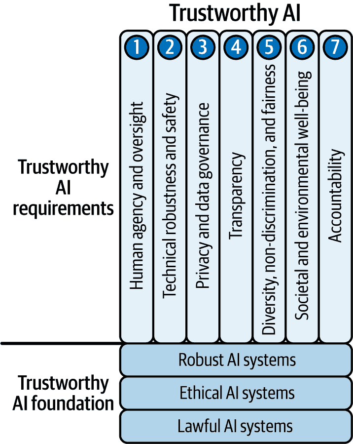
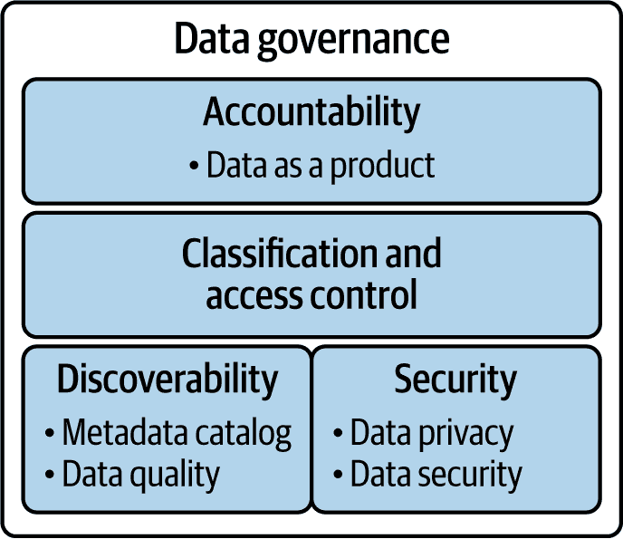
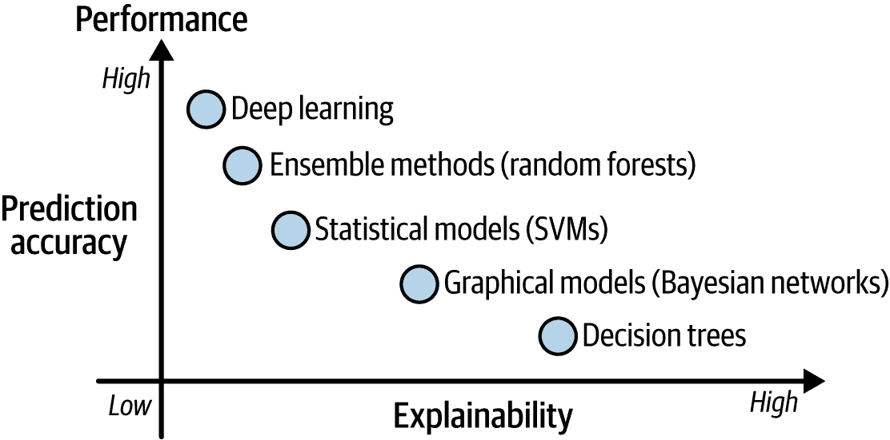
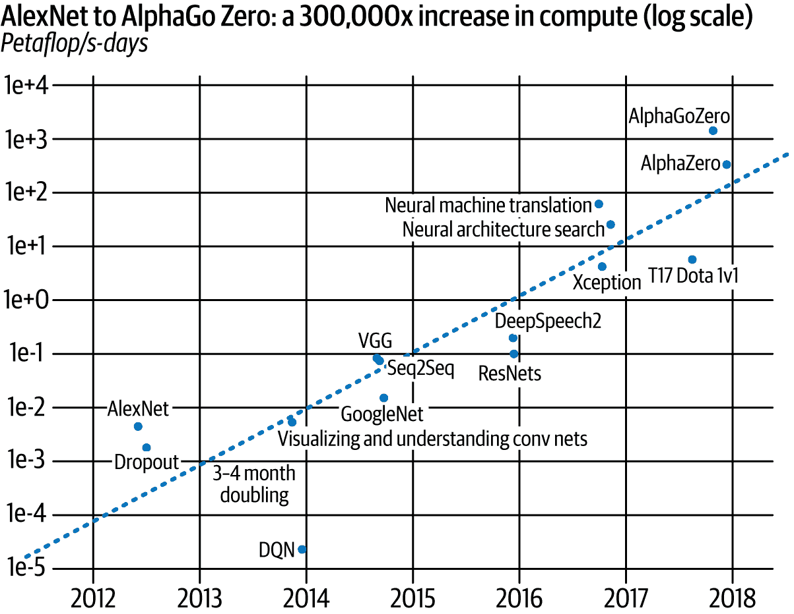
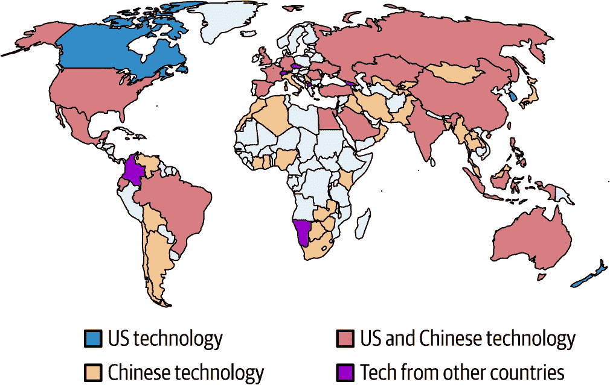
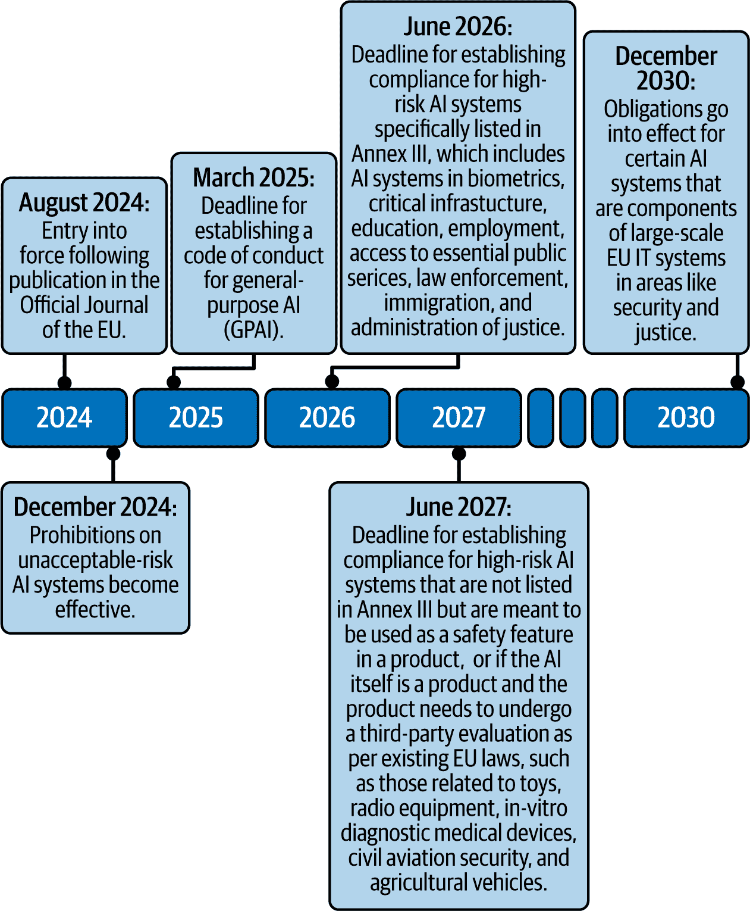

# 第一章：理解人工智能法规

随着人们、组织以及公共部门越来越依赖人工智能来驱动决策，这项技术必须值得信赖。《欧盟人工智能法案》（[EU AI Act](https://oreil.ly/-8wI7)）旨在为在欧洲联盟内开发、部署和使用人工智能技术提供一个法律框架，强调安全性、透明度和伦理考量。这是一个涵盖欧盟内不同风险类别人工智能系统的具体要求的人工智能监管框架。本书专注于理解和实施欧盟人工智能立法设定的监管要求。请注意，本书提供的指导不旨在替代获取专业法律建议。

本章首先概述了欧盟人工智能法案背后的动机，强调“可信赖的人工智能”这一理念，并确定了确保人工智能值得信赖的基本要求。然后，它描述了欧盟人工智能法案的结构，包括其定义、关键利益相关者、风险分类（禁止的、高风险、有限风险和低风险）以及实施时间表。最后，它简要比较了欧盟人工智能法案与其他与人工智能相关的国际法规和标准。

###### 警告

作者并非律师，本书不提供法律建议。法律与人工智能的交叉是一个复杂的主题，需要超越人工智能、数据科学和机器学习范畴的专业知识。围绕人工智能系统的法律考量可能非常复杂且影响深远。如果您对正在开发的人工智能系统有任何法律方面的疑问，请寻求该领域合格专家的专业法律建议。

# 欧盟人工智能法案的动机：可信赖的人工智能

随着人工智能与我们的日常生活日益紧密相连，我们面临的一个挑战是学会应对随之而来的不确定性。这种不确定性是人工智能固有的。长期以来，人工智能模型的预测准确性一直被视为构建人工智能系统时的核心评估标准。然而，随着人工智能在人力资源、交通、金融、医疗和安全等关键领域的广泛应用，对这些系统建立信任的需求日益增长——仅仅依靠传统的预测准确性是不足以构建可信赖的人工智能应用的。

为了更好地理解可信人工智能，让我们从其定义开始。*可信人工智能*是一个总称，指的是设计和发展时考虑到公平、隐私和非歧视等原则的人工智能系统，并具有确保可靠性、安全性和弹性的强大机制。在人工智能社区中，这个术语与*负责任的人工智能*、*伦理人工智能*、*可靠人工智能*和*价值观驱动的人工智能*等术语互换使用。可信人工智能系统必须能够适应多样化和不断变化的环境，并能够抵御各种类型的干扰，包括网络威胁、数据变异和运营变化。它们应透明地运行，并受到问责，进行持续监测和评估，以尊重人权，包括隐私和免于歧视的权利，并确保遵守民主价值观。

可信的人工智能是一个复杂的术语，它包含了一系列的概念和原则，这些概念和原则在图 1-1 中得到了展示。这些概念为理解欧盟人工智能法案奠定了基础。

人工智能的可信性建立在*合法性*、*伦理*和*鲁棒性*三个支柱之上。首先，人工智能系统应该是合法的，这意味着它们必须遵守所有相关法规，以确保公平的市场、促进经济效益和保护公民权利。其次，它们必须建立在伦理原则和价值之上，吸收所有利益相关者的意见，并建立适当的反馈机制。最后，它们必须具有鲁棒性，考虑到潜在的风险，并在开发和部署的每个阶段确保安全性。

###### 图 1-1\. 可信人工智能的基础和七个要求

建立在三个支柱之上的七个关键要求是人工智能系统必须实施的，以便被认为是可信的：

1.  人类代理和监督

1.  技术鲁棒性和安全性

1.  隐私和数据治理

1.  透明度

1.  多样性、非歧视和公平

1.  社会和环境保护

1.  责任制

这些要求直接来源于欧洲委员会人工智能高级专家小组（AI HLEG）制定的[可信人工智能伦理指南](https://oreil.ly/nBhE6)。在接下来的章节中，我将解释每个要求。

## 人类代理和监督

人类代理和监督在开发和运营人工智能系统中至关重要。*人类代理*指的是个人做出知情决策并保持控制的能力。人工智能系统应通过提供透明度、可解释性和控制与干预机制来支持这一点，这些机制使人类能够理解和影响系统的决策和行为。

*人类监督* 涉及建立治理流程和机制，允许人类对 AI 系统的运行进行监控、评估和干预。这包括确保基于 AI 模型产生的结果的系统决策过程的透明度和可解释性。此外，AI 系统应提供人类控制机制（例如，在必要时能够覆盖、调整或关闭系统的能力）。如图 图 1-2 所示，我区分了四种不同的人类监督模式：

人类指挥

这种模式代表了人类控制的最高水平，人类保持对 AI 系统的最终权威和责任。人类必须明确授权任何 AI 系统的操作。他们是决策过程的核心，并且总是做出最终决策。在这种模式下，人类监督 AI 系统的整体活动，并可以决定在特定情况下何时以及如何使用系统。例如，[“AI 驾驶舱”概念](https://oreil.ly/HFlbo) 通过提供一个中央用户界面来展示人类指挥方法，使操作员能够监控 AI 系统对不同用户群体的影响，根据技术和伦理标准评估结果，并在必要时行使关闭系统的权力。

环境中人类

AI 系统在决策过程中的关键点需要人类交互，以增加人类经验和情境理解，这是 AI 目前所缺乏的。通常，这种参与包括根据 AI 生成的预测来引导决策方向。干预和控制程度可能取决于系统的风险水平。例如，医疗 AI 应用通常需要比不那么关键的 AI 应用更密集的人类干预和控制。

环境中人类

人类扮演观察者的角色，监控 AI 系统的行为，并在必要时进行干预。

环境外人类

AI 系统独立运行，没有人类干预或实时监督。当基于系统的预测的决策可以程序化实施时，这种情况是可能的。通常，这种模式应用于需要快速数据处理的应用程序，例如交易应用，其中人类监督不切实际。

###### 图 1-2\. 人工智能中人类监督的不同层级

这里描述的模式适用于不同的 AI 应用场景。无论使用哪一种，正确实施人类代理和监督要求对于设计和开发能够从 AI 的优势中获益同时减轻潜在风险的道德 AI 系统至关重要。

## 技术稳健性和安全性

要成为值得信赖的，人工智能系统需要准确、可靠，并且能够重复其结果。它们还应该有一个“备用计划”，以防万一出现问题。在计算机科学中，“鲁棒性”意味着系统即使在出现错误、异常输入或意外情况时也能保持正确运行。对于人工智能来说，鲁棒性意味着机器学习（ML）模型能够在面对不同的条件、棘手的输入或其看到的数据类型变化时，仍然能够持续做出良好、可靠的预测。

简而言之，一个鲁棒的机器学习模型即使在接收到的信息有些嘈杂、混乱，或来自模型最初训练的不同来源时，仍然可以给出正确的答案。如果这些差异导致其性能突然下降，那么它就不再被认为是鲁棒的。实现鲁棒性对于在人工智能中建立信任至关重要——特别是在自动驾驶汽车、网络安全系统和医疗保健等领域，在这些领域，一个错误可能会产生严重的后果。

人工智能系统有三个核心层：它所训练的数据、它所使用的算法以及将其付诸使用的软件。相应地，有三个级别的鲁棒性：

+   *数据鲁棒性*需要训练系统处理广泛的数据类型和场景。这允许模型“学习”如何处理不同的情况，并确保它在面对新的或意外的情况时不太可能失败。例如，自动驾驶汽车的 AI 应该接受来自不同天气条件的数据训练，以处理雨、雪和雾。在网络安全中，入侵检测系统应该从许多不同类型的网络流量和攻击方法中学习，以便能够捕捉到新出现的威胁。

+   *算法鲁棒性*关注于防御试图欺骗 AI 模型的攻击。一些攻击发生在决策时刻，通过轻微改变输入来混淆模型。其他攻击则在训练阶段通过引入“有毒”数据执行，这些数据会导致模型后来做出错误的预测。一个鲁棒的算法应该能够处理嘈杂或改变后的输入、数据类型的变化，甚至故意设计的旨在欺骗它的输入。例如，一个鲁棒的语言模型可以处理拼写错误、俚语或奇怪的语法，而不会失去准确性。

+   *系统级鲁棒性*着眼于更大的图景——AI 产品的整个生命周期，从数据收集到模型构建、测试，最后在现实世界中的应用。通过检查每个步骤，我们可以在它们导致严重问题之前发现风险。这种整体方法确保整个 AI 管道及其与其他系统的交互保持稳定和安全。

在研究中，我们通常区分两种鲁棒性：

非对抗性鲁棒性

模型能否处理日常挑战，如嘈杂的输入或环境中的微小变化，而不会失去准确性？

对抗性鲁棒性

模型能否抵抗攻击者故意使用的“诡计”，例如精心修改的输入，以产生错误答案？

为了衡量人工智能模型的鲁棒性，实践者和研究人员会查看各种测量指标：

准确率

模型预测正确的次数。

错误率

模型做出的错误预测次数。

敏感性（召回率）

模型正确识别具有给定条件的项目（真阳性）的能力。例如，如果我们正在实施二元分类器，在所有应标记为“正”的案例中，有多少被正确识别？

灵敏度（召回率）

模型正确识别不具有给定条件的项目（真阴性）的能力。例如，在所有应标记为“负”的案例中，有多少被正确拒绝？

鲁棒性曲线

图表显示当引入挑战时（如更多噪声、缺失信息或异常输入），模型性能如何变化。

所有这些测量都可以帮助我们了解模型的优势和劣势。然而，通常测量鲁棒性的最佳方式取决于特定问题和人工智能系统的要求。

## 隐私和数据治理

可信人工智能系统的第二个要求是，它们必须确保充分尊重隐私和个人数据保护，符合《欧洲联盟基本权利宪章》第 7 条和第 8 条的规定。[欧洲联盟基本权利宪章](https://oreil.ly/nPDrM)。

许多人工智能系统，如推荐系统和提供个性化预测的系统，需要一定量的个人可识别信息（PII）。PII 的处理受欧盟和美国法规的约束，根据通用数据保护条例（GDPR）和加利福尼亚消费者隐私法案（CCPA）。

通过检查人工智能系统如何收集、存储、处理和共享个人或敏感数据，*隐私影响评估*（PIAs）帮助组织发现隐私可能存在风险的区域，并指导它们修改系统、实施安全措施，并遵守相关的隐私法律和法规。PIAs 理想情况下应在设计过程的早期进行，以主动识别、评估和减轻潜在的隐私风险。这是一个*隐私设计*的例子，这是一种工程哲学，它涉及将隐私保护嵌入人工智能系统生命周期的每个阶段——从数据收集和预处理到模型训练、部署和维护。这确保了隐私不仅仅被视为法律上的事后考虑或开发过程结束时的合规步骤，而是一个基本的设计原则，有助于组织维护用户信任并满足监管要求。

设计中的隐私将隐私考虑纳入 AI 系统的基本组件。对于 AI 工程师来说，这可能包括使用最小数据收集、去标识化、匿名化（加密、差分隐私、其他在信息甚至到达模型之前保护敏感信息的方法）；调整模型架构选择（例如，使用联邦学习）；以及持续评估和监控。相关的概念*数据治理*确保在结构化的组织框架内持续应用、维护和改进隐私原则。

数据治理是一个数据管理功能，它保证了组织收集和使用的数据的可用性、可用性、完整性和安全性。其关键要素在图 1-3 中得到了可视化。

###### 图 1-3. 数据治理的关键要素（改编自 Evren Eryurek 等人的《数据治理： definitive guide》（https://oreil.ly/4hIZp）[O’Reilly]）

随着数据量的增加、组织变得更加数据驱动以及数据访问的扩展，数据治理变得越来越重要。数据治理的最终目标是提高数据的可信度，这是可信 AI 的基础。这有三个关键方面：可发现性、安全性和问责制。

*可发现性* 指的是数据集元数据、数据来源（血缘）和领域实体词汇表的可用性。这对于确保用户和 AI 系统可以轻松访问他们所需的数据至关重要。数据治理建立程序，确保组织内适当的人员可以访问正确的数据，并确定 AI 系统可以访问哪些数据。*数据质量* 是一个相关的概念，在建立数据信任方面至关重要：数据应该是正确的、完整的、及时的、整体的。

在 AI 工程背景下，*数据安全* 指的是保护用于训练、验证和运行模型的从未经授权的访问、盗窃、篡改或丢失中。与隐私一起，数据安全是保护数据并确保遵守 GDPR（或 CCPA）等法规的一个基本方面。

数据治理的第三个方面是*问责制*，它涉及确保与 AI 系统相关的每个人，从数据供应商到模型开发者和操作者，都知道他们的角色，可以解释他们的选择，并且可以因系统在道德、法律和安全方面的工作而承担责任。

AI 开发应在 AI 应用生命周期的所有环节尊重隐私的基本权利，包括数据收集、处理和存储以及模型设计、开发和部署。AI 系统的各个方面都可能引发隐私问题，例如，使用 AI 分析用户行为和偏好的社交媒体平台可能通过定向广告或数据泄露无意中泄露敏感信息，或者当 AI 用于增强监控系统功能时，可能导致监控活动的过度扩展。这可能导致匿名性和自由的丧失，因为每个动作都可能被监视和记录。例如，在公共场所使用面部识别技术的政府机构可以在未经个人同意的情况下追踪个人，可能导致权力滥用和隐私侵犯。

AI 系统还可以放大其训练数据中存在的偏见。当这些偏见影响数据的收集、处理或使用时，它们可能不成比例地影响某些群体的隐私。例如，由 AI 驱动的信用评分模型可能使用具有歧视性的数据，针对某些种族或性别群体，引发关于财务数据公平性和隐私的担忧。

定义和跟踪隐私和数据治理的示例指标和机制包括：

数据加密级别

这些决定了数据在传输和静止状态下的保护程度。

访问控制

这些是管理和控制谁可以访问或更改数据的政策和工具。

数据保留和删除政策

这些确保符合数据最小化原则和法规。

## 透明度

数据、包含人工智能组件的 AI 模型和软件系统必须透明并提供可追溯性。无论行业或用例如何，透明度是现有 AI 指南中[最常引用的伦理原则](https://oreil.ly/_pir3)。

AI 系统中的透明度指的是理解 AI 系统内部工作方式和做出决策的能力。它为用户、开发者、监管者等利益相关者提供了关于 AI 系统组件、算法、决策过程和整体运作的易懂解释。AI 透明度的关键维度包括：

可解释性

能够用人类可理解的语言清楚地阐述人工智能系统（包括其数据来源、模型组件和决策过程）如何以及为什么针对特定案例得出特定的输出或决策。这对于建立信任和问责制很重要。如图 1-4 所示，可解释人工智能（XAI）模型可能不是最精确的模型，因此根据用例要求，工程师可能会选择一个可解释但不太精确的人工智能算法。XAI 的技术被用于人工智能生命周期的每个阶段，包括分析数据以进行模型开发、将可解释性纳入系统架构以及产生系统行为的后验解释。（^(1))

###### 图 1-4。在人工智能系统中平衡可解释性和准确性是一个常见的挑战

数据透明度

关于用于构建人工智能模型的训练数据的开放性，包括其来源、特征以及潜在的偏差或局限性。

算法透明度

了解人工智能算法及其如何处理输入数据以生成输出或决策。这包括理解模型使用的特征、权重和逻辑。

治理透明度

记录人工智能系统开发过程中做出的关键决策，建立明确的协议和责任，并确保组织监督。这一方面尤其与遵守欧盟人工智能法案相关。

通信透明度

及时、清晰、易于访问地与相关利益相关者分享关于人工智能系统目的、能力和局限性的信息。

人工智能透明度旨在打开代表人工智能系统内部操作的“黑盒”，这些系统通常复杂且不透明。这使人类能够理解系统的内部运作，并对其错误或偏差进行审计，从而促进对其使用的信任。

定义和跟踪人工智能系统透明度的指标示例包括以下内容：

可解释性指数

系统决策如何容易地向用户解释。这取决于系统生命周期中解释的可用性、提供的解释类型（例如，特征重要性、反事实示例、视觉辅助）以及解释的范围（它们是否解决全局模型行为或局部、个别预测）。

文档完整性

人工智能系统目的、功能、局限性、模型训练细节和特征工程过程的文档的可用性和清晰度。

算法可审计性

审计人工智能算法以符合规范和性能的简便性。

## 多样性、非歧视和公平性

在过去十年中，关于机器学习中的偏见和公平性的讨论已成为热门话题。由于收集数据的方式不平等，且由非多元化的团队处理，可能会造成潜在的危害，因此在整个人工智能系统生命周期中融入多样性和包容性是建立可信人工智能的明确要求。这包括可访问性，一种以用户为中心的方法，确保人工智能系统的可用性考虑到了所有人，特别是残疾人士。

[包容性工程](https://oreil.ly/n3qlT)被定义为“确保工程产品和服务的可访问性和包容性，对所有用户一视同仁，并在其整个生命周期中尽可能减少歧视和偏见的过程。”这种方法在人工智能系统的开发中至关重要，它不仅超越了技术工程，还涵盖了更广泛的社会考量。

应在人工智能系统开发的每个阶段识别和解决潜在的偏见。建立一套明确的策略或程序来减轻偏见并促进公平，无论是在收集和使用输入数据时，还是在算法设计中，都是至关重要的。在这本书中，我专注于[CRISP-ML(Q)](https://oreil.ly/srSRa)开发流程模型，以指定一个公平且有效的人工智能系统开发策略。该模型要求在所有开发阶段建立测试和监控潜在偏见的流程，以及检测数据非代表性的流程。

评估完整的端到端人工智能开发工作流程的公平性对于构建成功的人工智能系统至关重要。提高人工智能系统中的多样性和代表性是符合欧盟人工智能法案并为所有系统用户创造价值的一步。建立一种强大的机制来标记与偏见、歧视或性能不佳相关的问题——例如通过偏见检测工具、分类报告系统以及为受影响个人提供的明确报告指南——有助于开发人员和最终用户意识到并解决这些问题。

组织数据文化的一个常被低估且不太技术性的方面是关于人工智能中的偏见和公平性的教育和意识倡议。这些倡议旨在帮助人工智能产品经理、设计师和工程师在设计和发展人工智能系统时更加意识到可能引入的偏见。

欧盟人工智能法案确保人工智能系统价值链上的每个实体，从生产者到部署者，都有责任为用户提供公平和道德的体验。使用多种指标来评估人工智能系统的公平性，并且可以在建模（预处理）之前、建模点（处理中）或建模之后（后处理）应用公平性改进和偏见缓解的技术方法，如图图 1-5 所示。

###### 图 1-5\. 在建模过程的各个阶段可以实施不同的指标和方法，以确保公平的结果并减少偏见（来源：[*https://oreil.ly/CGjLK*](https://oreil.ly/CGjLK)*)*

表 1-1 列出了一些常用于评估公平性和非歧视的指标。这些指标量化了人工智能模型在不同人口群体预测中的潜在偏见或差异。

表 1-1\. 预处理、内处理和后处理公平性度量

| 度量类别/名称 | 定义 |
| --- | --- |
| 预处理 |
| 统计/人口统计均衡 | 确保在各个群体中被分类为正标签的概率相等 |
| 差异影响 | 衡量无特权群体和特权群体之间正分类率的比率 |
| 个人公平性 | 确保相似的个人受到相似对待 |
| 内处理 |
| 平等机会 | 确保不同群体之间具有相等的真正阳性率 |
| 平等机会 | 要求在受保护群体中具有相等的真正阳性率和假阳性率 |
| 总体准确度平等 | 比较不同群体之间的相对准确率 |
| 处理平等 | 考虑假阴性率与假阳性率的比率 |
| 后处理 |
| 测试公平性/校准 | 确保在特定分数下，各个群体获得正结果的概率相等 |
| 良好校准 | 需要预测概率在各个群体中与实际概率相匹配 |
| 正负类平衡 | 确保在各个群体中正类和负类的预期分数相等 |
| 广义熵指数 | 衡量分类结果对个人层面的公平性影响 |

## 社会和环境福祉

人工智能的使用方式决定了它可能产生积极或消极的影响。欧盟人工智能法案关注了可信人工智能的社会和环境影响。

人工智能技术已被证明对环境有负面影响。与人工智能相关的首要环境问题包括能源消耗、碳足迹、电子废物和间接的环境影响。人工智能和机器学习模型，尤其是大型模型，需要大量的计算能力（如图 1-6 所示）。因此，容纳这些处理器的数据中心需要消耗大量的能源来运行和冷却，这意味着大规模人工智能系统具有显著的碳足迹。为了减轻这一担忧，正在努力使用可再生能源为数据中心供电。人工智能硬件的生产还需要贵重金属和稀土元素，这可能会对环境造成损害（在提取、资源耗竭和回收挑战方面）。此外，硬件很快就会过时，导致电子废物。

###### 图 1-6\. 用于训练深度学习模型的计算资源量在 2012 年至 2018 年之间增加了 300,000 倍（来源：[*https://oreil.ly/WJOOw*](https://oreil.ly/WJOOw)）

根据其应用，人工智能也可能对环境产生间接影响。例如，人工智能驱动的自动化可能导致生产能力增加和资源消耗增加。相反，人工智能可以优化系统以更节能、减少浪费或提高资源管理，从而可能产生积极影响。

除了模型准确性之外，提出的[“绿色人工智能”方法](https://oreil.ly/jGAsk)还考虑了*效率*，作为关键评估标准，即生成结果所需的浮点运算次数（flops）。金融操作（FinOps），一种帮助组织有效管理其云支出的云财务管理实践，也可以被利用来应对人工智能的环境和财务影响。

关于社会方面，人工智能正在以三种关键方式改变我们的工作方式：通过自动化任务、重塑工作流程以及影响所需的工作技能。工作替代是一个重要的担忧，因为人工智能有潜力自动化许多角色——特别是那些涉及[重复性任务](https://oreil.ly/7Pdjg)的。同时，人工智能技术有潜力创造[新的工作角色](https://oreil.ly/zFqNJ)，这些角色需要高级技术和分析技能，例如机器学习工程师、数据科学家和人工智能伦理专家。此外，人工智能可以推动创新产品和服务的开发，为人工智能驱动的数字助手和智能设备等新兴行业开辟新的职业机会。

相关的担忧是，人工智能的兴起正在导致[工作两极化](https://oreil.ly/hW0gZ)加剧，对高技能劳动力的需求增长，而低技能职位面临淘汰。这加剧了收入不平等，并为那些无法获得教育和培训的人创造了挑战。因此，由于对失业的恐惧和对未来的不确定性，工作场所的人工智能可能导致压力、焦虑和就业不安全感增加。

人工智能系统还有可能通过虚假信息对整个社会产生负面影响。人工智能——尤其是生成式人工智能——可以大规模地产生虚假信息和错误信息。这可能会通过在选举中造成虚假信息、传播宣传和影响选民行为来损害民主。像 ChatGPT、pi.ai 和 perplexity.ai 这样的工具可以轻松创建逼真的但虚假的内容，这些内容可以用来传播虚假信息。人工智能生成的“深度伪造”（令人信服但虚假的视频和图像）可以用来操纵公众舆论，而人工智能驱动的内容个性化可以创建“信息泡沫”，其中个人只能接触到加强他们现有信念的信息，从而导致两极化和社会分裂加剧。

使用人工智能进行监控也是社会福祉和隐私方面值得关注的一个领域。研究表明，至少有 75 个国家积极利用人工智能技术进行监控（见图 1-6)*.* 这可能导致未经授权的数据收集、隐私侵犯以及敏感数据的未经授权访问，以及个人信息潜在的滥用。此外，在执法领域使用人工智能，例如用于预测警务，可能导致偏见结果和对某些人口群体的歧视。

###### 图 1-7\. 人工智能监控技术被越来越多的国家采用，其速度比专家通常认为的要快（来源：[*https://oreil.ly/9_iB7*](https://oreil.ly/9_iB7))

解决这些挑战需要强有力的伦理指南、透明的监管框架以及持续的公众对话，以确保人工智能的开发和部署支持民主价值观和社会福祉。

## 问责制

人工智能系统必须负责任地开发和运营。*人工智能问责制*涉及在整个开发周期内建立机制，以确保人工智能系统的开发者和使用者对其影响负责。

问责制意味着系统目的、设计、数据和处理过程的信息对内部和外部审计员是可用的。例如，我们可以参考谷歌的负责任生成式人工智能工具包，它涵盖了风险和缓解技术，以解决安全性、隐私、公平性和问责制（见图 1-8)。这包括维护详细的开发过程、决策和结果记录，以实现可追溯性。日志记录和记录保存对于问责制至关重要。此外，问责制还要求人工智能系统能够解释或证明其决策。最后，问责制确保有机制和流程来减少或纠正由人工智能系统造成的负面影响或不公平结果。人工智能系统应提供适当的反馈机会、相关解释和定义的程序，以升级关注的问题。

###### 图 1-8\. 谷歌的负责任生成式人工智能工具包采用了一种全面的责任方法（来源：[*https://oreil.ly/maEI5*](https://oreil.ly/maEI5))

在可信赖的人工智能的背景下，应实施以下关键机制以创建问责制：

明确的责任指南和流程

为人工智能系统生命周期中涉及的各方建立指南和明确的责任，包括开发者、部署者和用户。

透明度和可解释性

维护 AI 开发过程、训练数据、使用的算法和决策标准的详细文档，以实现可追溯性。确保 AI 系统对其能力、局限性和决策过程透明。对基于 AI 预测做出的决策提供清晰的解释。

人类监督和干预

实施人类检查和监督，特别是在需要时能够覆盖 AI 决策的高风险情况下。

审计和评估

定期进行内部和第三方审计，以识别和消除偏见，确保符合法规和伦理标准。通过系统地使用 CRISP-ML(Q)过程模型对 AI 系统进行审计，组织可以评估系统的质量、可靠性和可信度。审计深度和重点领域可以根据用例的风险和关键性进行调整。

补救和投诉机制

建立用户友好的渠道，用于提交投诉、反馈或请求对 AI 决策的解释。为受影响个人提供明确的流程，以挑战决策并寻求补救。

可信 AI 是欧盟 AI 法案立法背后的基础概念。你现在应该对可信 AI 系统的七个关键要求有一个一般性的了解。接下来，我们将看看该法案本身的架构。

# 欧盟 AI 法案概览

欧盟 AI 法案 侧重于促进以人为本且值得信赖的人工智能。其主要目标是促进创新，同时确保健康、安全和基本权利的高水平保护，这些权利在宪章中概述——包括民主、法治和环境保护——并减轻欧盟使用中的 AI 系统的潜在有害影响。要全面理解欧盟 AI 法案，必须掌握其范围、适用对象以及符合 AI 系统要求的时间表。本节提供了欧盟 AI 法案的高级概述。我将在本书的后面部分解释不同风险类别的详细要求。

根据[一般规定](https://oreil.ly/6MMz1)，该法案确立了：

1.  “在联盟内投放市场、投入使用和使用 AI 系统的统一规则；

1.  禁止某些 AI 实践；

1.  对高风险 AI 系统的具体要求以及此类系统运营商的义务；

1.  某些 AI 系统的统一透明度规则；

1.  对通用 AI 模型投放市场的统一规则；

1.  市场监控、市场监管、治理和执法规则；

1.  支持创新的措施，特别是关注[中小企业]，包括初创企业。”

该法案结构如下：

章节

该法案分为 13 章，涵盖了不同的方面，如一般规定、禁止的人工智能实践、高风险人工智能系统的要求、治理等。

文章

每章包含一个或多个文章，阐述了具体的规则和义务。文章在法案中按顺序编号，并且可以在每个章节内分组。例如，第三章第一节下的第 6 条涵盖了“高风险人工智能系统的分类规则。”

附件

该法案包含 13 个附件，提供了补充信息，如列表、定义和程序。您可以通过编号或标题导航到特定的附件，例如“附件 III”或“第 6(2)条中提到的“高风险人工智能系统”。”

理由部分

理由部分是编号段落，解释了法案条款背后的理由和背景。它们可以帮助读者解释文章，但并非具有约束力。

## 定义

欧盟人工智能法案第一章第三条为立法中使用的术语提供了一套定义。也许对于本书的目的来说最重要的是，它将*人工智能系统*定义为：

> 一种基于机器的系统，旨在以不同的自主程度运行，并在部署后可能表现出适应性，并且，为了明确或隐含的目标，从它接收的输入中推断出如何生成输出，如预测、内容、推荐或决策，这些输出可以影响物理或虚拟环境。

然而，鉴于技术和人工智能发展的快速节奏和不可预测性，这个定义并非完全静止，法案中已经整合了一个动态监管工具，以便其能够随着时间的推移而适应。

该定义涵盖了广泛的人工智能技术和方法，包括：

+   机器学习方法（例如监督学习、无监督学习和半监督学习）

+   深度学习方法

+   强化学习

+   基于逻辑和知识的方法（例如逻辑编程、专家系统、推理和演绎引擎、推理引擎）

+   统计方法

+   贝叶斯方法

+   搜索和优化方法

近年来，预训练生成模型如 BERT、DALL·E、Claude、Mistral 和 GPT 变得越来越受欢迎。它们是通过在大量数据集上进行大规模自监督学习开发的，并且可以调整以适应各种下游任务。这些通常被称为*通用人工智能（GPAI）模型**，法案如下定义：

> 一个使用大量数据通过大规模自监督训练的 AI 模型，显示出显著的泛化能力，并且能够胜任各种不同的任务，无论该模型如何投放市场，并且可以集成到各种下游系统或应用中，但前提是这些 AI 模型在投放市场之前用于研究、开发或原型制作活动

欧盟人工智能法案旨在确保之前提到的用于数字和物理产品、服务或系统中的技术是安全的，并尊重现有的关于基本权利和欧盟价值观的法律。

## 从创建到市场运营的关键参与者

欧盟人工智能法案是欧盟开发、分销和使用人工智能的法律框架。这一监管框架适用于在欧盟制造、引进或分销人工智能系统或通用人工智能模型的公司和个人，即使这些实体位于欧盟以外的国家。图 1-9 展示了在整个人工智能系统生命周期中受欧盟人工智能法案影响的关键参与者。

###### 图 1-9. 关键参与者

第三条如下定义了这些角色：

+   一个 *提供者* 是指开发人工智能系统或通用人工智能模型（或由其开发）并将其投放市场或使用的自然人或法人（公司、组织或其他实体），无论是有偿还是免费，以自己的名义或品牌。

+   一个 *进口商* 是指在欧盟内的自然人或法人，该实体将带有非欧盟国家实体名称或商标的人工智能系统投放市场。

+   一个 *分销商* 是指供应链中的自然人或法人，除了提供者或进口商之外，使人工智能系统在欧盟市场上可用。

+   一个 *授权代表* 是指在欧盟内，由人工智能系统或通用人工智能模型提供者书面授权的自然人或法人，代表其执行法案中概述的职责和程序。

+   一个 *部署者* 是指使用人工智能系统进行专业活动的自然人或法人。

一个 *用户* 被认为是任何使用或受人工智能系统影响的自然人或人员群体。

## 人工智能系统按风险等级分类

欧盟人工智能法案的另一个重要方面是其基于风险的方法。根据该法规的分类系统，人工智能系统被分为四个风险等级：

1.  禁止

1.  高风险

1.  有限风险

1.  极小风险

还需要注意的是，通用人工智能模型（GPAI）受到特别监管和分类，并纳入本法案。在第七章中，我将阐述理解符合该法案对 GPAI 模型要求的基础，以及它们与目前流行的生成式人工智能的关系。

欧盟 AI 法案禁止某些被认为存在不可接受风险的 AI 系统。这些禁令针对的是可能严重影响或伤害人们决策或侵犯他们权利的 AI 系统。具体来说，法案禁止使用操纵性潜意识技术、基于年龄、残疾或社会状况的漏洞利用，以及在没有足够人类监督的情况下，基于个人资料或预测特征进行高风险评估的 AI 实践。该法规还禁止在公共场合未经监管使用“实时”生物识别识别，除非在执法目的相关的重要公共安全担忧的严格条件下。（更多信息请参见[第二章，第五条](https://oreil.ly/0KGOH)。）

图 1-10 展示了风险类别及其预期分布。预计所有 AI 系统中大约有 20%将被归类为高风险。

###### 图 1-10\. AI 系统风险类别

根据欧盟 AI 法案定义，高风险 AI 系统要么是作为产品安全组件的预期用途，要么本身就是产品（参见[第三章](https://oreil.ly/_o2pw)）。这些 AI 系统受特定法规的约束，并需要第三方合格评定。此外，指定清单（附件 III）中列出的高风险 AI 系统由于可能对个人健康、安全或基本权利产生影响，因此受到严格的合规要求。这些包括生物识别、关键基础设施、教育等领域。

与在欧洲经济区（EEA）扩展单一市场上交易的大多数产品一样，被归类为高风险的 AI 系统必须在欧盟内获得 CE 标志(图 1-11)以获得认证。此标志表明在 EEA 销售的产品的安全、健康和环境保护要求已得到评估。

###### 图 1-11\. CE 标志

低风险 AI 系统带来的风险较低，主要表现为操纵、欺骗或模仿。这一类别包括聊天机器人和能够生成深度伪造的生成式 AI 系统。对于低风险 AI 系统，主要义务是透明度——提供商必须披露输出是 AI 生成的，并且用户必须意识到他们正在与 AI 系统互动。还需要明确标记深度伪造。

最后一个类别是最小风险 AI 系统。根据欧盟 AI 法案，这些系统对人们的安全、基本权利或隐私几乎或没有风险。它们包括视频游戏、垃圾邮件过滤器或执行有限任务且决策能力有限的简单图像编辑工具等 AI 应用。

重要的是要理解，欧盟人工智能法案对用例（人工智能系统和 GPAI 模型）进行分类，而不是对人工智能/机器学习技术或算法本身进行分类。正确的分类会影响对人工智能系统要求的估计，因为不同的风险类别意味着不同的治理和 MLOps 架构决策和义务。然而，确定人工智能系统的风险水平可能具有挑战性，因为它依赖于各种因素，并涉及如何对非确定性系统的能力进行分类，以及这些能力将如何影响未来可能与之交互的用户和系统。在第四章中，我概述了一个人工智能系统风险分类框架。

注意，人工智能的科学研究和军事应用不在欧盟人工智能法案的范围内。然而，所谓的“双重用途”技术——既可用于民用也可用于军事目的的系统——如果在民用环境中使用，可能仍然受该法案的约束。

## 执法和实施

欧盟人工智能法案的实施遵循一个结构化的时间表。以下是关键里程碑和截止日期：

欧盟人工智能法案生效（2024 年 8 月）

该法案自公布于欧盟官方期刊之日起 20 天后生效。

自生效之日起六个月后（2024 年第四季度至 2025 年第一季度）

对不可接受风险的人工智能系统禁令生效。

自生效之日起九个月后（2025 年第一季度）

GPAI 模型的行为准则必须最终确定。

自生效之日起十二个月后（2025 年第二季度至第三季度）

GPAI 模型提供者的义务开始适用。

自生效之日起十八个月后（2025 年第四季度至 2026 年第一季度）

委员会实施针对高风险人工智能系统的上市后监测法规。

自生效之日起二十四个月后（2026 年第二季度至第三季度）

附件 III 中列出的高风险人工智能系统义务开始适用。成员国必须实施处罚规则并建立人工智能监管沙盒。

自生效之日起三十六个月后（2026 年第四季度至 2027 年第一季度）

未在附件 III 中规定但受现有欧盟产品安全法约束的高风险人工智能系统义务生效。

到 2030 年底

在安全和司法等领域的欧盟大型 IT 系统中的特定人工智能系统义务开始适用。

此时间线，如图图 1-12 所示，意味着今天创建高风险人工智能系统的组织有一个宽限期来准备其内部流程。它们有责任在宽限期结束前（2026 年 6 月）完全遵守法案的规定。

###### 图 1-12\. 概述欧盟人工智能法案实施关键里程碑和截止日期的时间线

## 遵守的全面图景

许多使用并将人工智能技术嵌入其产品的组织都在问同样的问题：“欧盟人工智能法案对我们意味着什么？”该法案旨在确保所有包含人工智能的数字和物理产品——无论作为功能还是核心功能——都安全且合乎道德地使用，符合欧盟的基本权利。为此，法案将人工智能系统视为受监管的产品。与欧盟市场上的其他产品一样，被认为高风险的人工智能系统必须按照前面所述进行 CE 标志以表明合规，否则不得使用。表 1-2 简要概述了满足欧盟人工智能法案对这类人工智能系统要求的必要步骤。

###### 警告

再次强调，作者不是律师。本书不提供法律建议。

表 1-2. 欧盟人工智能法案端到端合规流程

| 欧盟人工智能法案合规步骤 | 指导问题 |
| --- | --- |
| 人工智能系统清单和风险分类 |

+   已经部署或计划投入生产的人工智能系统有多少？

+   这些人工智能系统分别属于哪些风险类别？

+   它们是否使用了被归类为系统性风险 GPAI 模型的模型？

|

| 合规要求识别 |
| --- |

+   我们需要满足哪些要求？

|

| 合规实施 |
| --- |

+   需要建立哪些流程、结构、工程实践和角色才能符合法案？

|

| 市场前合规验证 |
| --- |

+   在将人工智能系统投放市场并投入使用之前，需要做些什么？

+   需要进行哪些内部和外部一致性评估以进行合规验证？

+   我们如何为我们的 AI 系统进行 CE 标志？

+   我们的人工智能系统应该在何处注册？

|

| 市场后持续合规 |
| --- |

+   在人工智能系统投入使用后，需要做些什么来确保合规？

|

让我们更仔细地看看人工智能系统提供者和部署者必须遵循的这些基本步骤，以确保符合欧盟人工智能法案：

1. 人工智能系统清单和风险分类

在建立实现合规的技术和组织流程之前，您必须确定合规措施所需的范围。从当前使用或正在开发的所有人工智能系统清单开始。然后，为每个系统分配风险等级（我在第四章中详细讨论了人工智能系统的风险分类）。任何属于禁止类别的 AI 用例都必须停止使用。

2. 合规要求识别

将要实施的合规措施将取决于风险分类的结果。区分人工智能系统的义务和用于这些系统的 GPAI 模型的义务很重要，这些模型可能受到透明度义务或系统性风险要求的约束。法案为这两类都规定了具体要求。

3. 合规实施

确定合规要求使您能够定义符合欧盟人工智能法案所需的技术和组织流程的范围。这包括建立治理结构、工程实践和明确定义的角色。法案概述了具体的义务，例如实施风险管理措施、维护技术文档、确保人工监督以及保证人工智能系统的准确性、鲁棒性和安全性。本书的重点阶段还涉及建立一个涵盖测试、事件报告、数据治理、记录保留和日志记录的质量管理体系。

4. 市场前合规验证

下一步是通过内部和必要时外部的一致性评估来证明合规性。一旦这些评估完成，人工智能系统必须获得 CE 标志并在欧盟数据库中注册。在系统可以投放市场或投入使用之前，这些步骤是强制性的。

5. 市场后持续合规

最后阶段的重点是确保人工智能系统在其整个生命周期内继续满足法案的要求。这涉及通过持续监控系统性能和解决出现的任何问题来证明持续遵守合规标准，以保持与监管要求的对齐。

## 欧盟人工智能法案违规罚款

欧盟人工智能法案对违反其规则和要求的公司引入了重大罚款。表 1-3 提供了概述。

表 1-3. 违反欧盟人工智能法案条款的罚款

| 违规行为 | 罚款 |
| --- | --- |
| 禁止的人工智能实践（如第 5 条中列出的人工智能实践，例如利用漏洞、社会评分、公共场所实时生物识别等） | 行政罚款最高可达 3500 万欧元或前一年度全球年度总营业额的 7%，以较高者为准 |
| 第 10 条关于高风险人工智能系统合规要求不符合 | 行政罚款最高可达 3000 万欧元或全球年度总营业额的 6%，以较高者为准 |
| 不符合其他义务（除第 5 条和第 10 条外） | 行政罚款最高可达 2000 万欧元或全球年度总营业额的 4%，以较高者为准 |
| 向当局提供不正确、不完整或误导性信息 | 行政罚款最高可达 1000 万欧元或全球年度总营业额的 2%，以较高者为准 |

# 现有人工智能法规和标准

欧盟人工智能法案为非欧盟国家提供了一个全面的监管模型，强调了创新与可信人工智能之间的平衡。其对生物识别系统和高风险人工智能应用的严格规定，为全球人工智能治理设定了高标准。让我们简要回顾一下现有的人工智能监管格局：

联合国教科文组织人工智能伦理建议

《关于人工智能伦理的建议》（[`oreil.ly/Qr8eM`](https://oreil.ly/Qr8eM)），由联合国教科文组织 193 个成员国于 2021 年 11 月通过，为伦理人工智能发展提供了一个框架。它概述了伦理人工智能开发和部署的核心价值观和原则，包括尊重人权、包容性和多样性、公平和非歧视、透明度和可解释性、问责制、安全性和可持续性。该建议旨在影响全球的伦理人工智能实践，并包括将伦理原则转化为实践的创新工具和方法。

美国关于可信人工智能的行政命令

《关于人工智能安全、可靠和可信发展及使用的行政命令》（[`oreil.ly/zRfHi`](https://oreil.ly/zRfHi)），于 2023 年 10 月发布，强调了人工智能的潜在利益和风险。它突出了负责任的人工智能治理对于解决社会问题以及防止欺诈、偏见和国家安全威胁等负面后果的重要性。该命令强调了政府、行业、学术界和民间社会之间合作的需求，以确保人工智能的安全和负责任的发展与应用。

中国生成式人工智能服务法

《生成式人工智能服务管理暂行办法》（[`oreil.ly/Axc-r`](https://oreil.ly/Axc-r)），由中国国家互联网信息办公室（CAC）和六个其他政府部门于 2023 年 7 月联合发布，标志着中国对生成式人工智能服务（包括生成文本、图形、音频和视频的模型和相关技术）监管的积极态度。该法规适用于向中国普通民众提供这些服务的所有实体。《暂行办法》承认外国投资的可能性，同时也促进创新和研究。预计未来的人工智能法律将扩大该法规的适用范围，超越生成式人工智能。鉴于在中国运营的不合规服务可能面临处罚或关闭的风险，确保合规至关重要。

国家标准与技术研究院（NIST）人工智能风险管理框架

美国国家标准与技术研究院（NIST）发布的《人工智能风险管理框架：生成式人工智能配置文件》（[`oreil.ly/sISXu`](https://oreil.ly/sISXu)），于 2024 年 7 月发布，确定了 12 个与生成式人工智能技术独特相关或加剧的关键风险，组织应小心识别和缓解这些风险。这些风险包括与化学、生物、辐射或核信息相关的风险，危险或暴力的建议，数据隐私，环境影响，信息完整性和安全性，以及知识产权。该框架提出了组织可以采取的 400 多项行动来管理这些风险。

电气和电子工程师协会标准协会（IEEE SA）推荐实践

IEEE 的[《人工智能组织治理推荐实践》](https://oreil.ly/Pd2qj)概述了组织内部 AI 开发和使用的治理标准，包括安全性、透明度、问责制、责任和偏见最小化。它还提供了实施、审计、培训和合规的步骤。该文件旨在通过将内部治理结构与外部 AI 治理工具相结合，促进负责任的 AI 实践。

这些法律和框架共同旨在以促进创新的同时确保安全、透明度和尊重人权的方式规范 AI，类似于欧盟 AI 法案的目标。

# 结论

欧盟 AI 法案侧重于促进以人为本和值得信赖的人工智能的开发和使用，以保障欧盟内的健康、安全、基本权利、民主、法治和环境保护。在本章的第一部分，我们探讨了 AI 中的可信度概念，该概念基于三个支柱：合法性、伦理和稳健性。我概述了可信 AI 系统的七个关键要求，包括人类代理和监督；技术稳健性和安全性；隐私和数据治理；透明度；多样性、非歧视和公平；社会和环境福祉；以及问责制。

理解该法案需要了解其范围、适用对象以及 AI 系统合规的既定时间表。欧盟 AI 法案是一个基于风险的全面法律框架，为 AI 系统和 GPAI 模型的开发、分销和使用制定了规则。它适用于欧盟内外企业和个人，包括 AI 系统提供商、进口商、分销商、授权代表、部署者和用户。

该法案根据风险将 AI 系统分为四个类别，并建立相应的义务。它禁止存在不可接受风险的 AI 系统，对高风险系统提出严格的要求，并要求对低风险系统进行透明度和标签化。该法案还针对 GPAI 模型制定了具体的义务，对被认为可能造成系统性风险的模型制定了额外规则。这些规定不仅适用于 AI 系统本身，还适用于所有参与其开发和部署在 AI 价值链上的组织。

对您组织中使用的 AI 系统进行分类并确定相应的合规要求，将有助于确定所需数据和 AI 治理措施的范围，以及必要的 AI 工程实践。在下一章中，我将讨论 CRISP-ML(Q)结构化 AI 系统开发流程和 MLOps，这些提供了 AI 系统运营化的技术和组织最佳实践。

# 进一步阅读

Ali, Sajid, Tamer Abuhmed, Shaker El-Sappagh, Khan Muhammad, José M. Alonso-Moral, Roberto Confalonieri, Riccardo Guidotti, et al. “可解释人工智能（XAI）：我们所知与实现可信赖人工智能所剩无几。” *信息融合* 99 (November 2023): 101805\. [*https://oreil.ly/WERsh*](https://oreil.ly/WERsh).

Braiek, Houssem Ben, and Foutse Khomh. “机器学习鲁棒性：入门指南。” arXiv 预印本 arXiv:2404.00897，2024 年 5 月\. [*https://oreil.ly/6iJoo*](https://oreil.ly/6iJoo).

Caton, Simon, and Christian Haas. “机器学习中的公平性：综述。” *ACM 计算调查* 56, no. 7 (2024): 166\. [*https://oreil.ly/ykP9I*](https://oreil.ly/ykP9I).

高级人工智能专家小组（AI HLEG）。*可信赖人工智能评估清单（ALTAI）自我评估指南*。欧洲委员会，2020 年 7 月\. [*https://oreil.ly/QNzCW*](https://oreil.ly/QNzCW).

Li, Bo, Peng Qi, Bo Liu, Shuai Di, Jingen Liu, Jiquan Pei, Jinfeng Yi, and Bowen Zhou. “可信赖人工智能：从原则到实践。” *ACM 计算调查* 55, no. 9 (2023): 177\. [*https://oreil.ly/sAQ99*](https://oreil.ly/sAQ99).

Malhotra, Tanya. “顶级人工智能（AI）治理法律和框架。” *Marktechpost*，2024 年 5 月 2 日\. [*https://oreil.ly/OvYAI*](https://oreil.ly/OvYAI).

Monteith, Scott, Tasha Glenn, John R. Geddes, Peter C. Whybrow, Eric Achtyes, and Micheal Bauer. “人工智能与虚假信息的增加。” *英国精神病学杂志* 224, no. 2 (2024): 33–35\. [*https://oreil.ly/KgesS*](https://oreil.ly/KgesS).

Novelli, Claudio, Mariarosaria Taddeo, and Luciano Floridi. “人工智能中的问责制：它是什么以及它是如何运作的。” *人工智能与社会* 39 (2023): 1871–82. [*https://oreil.ly/yEJ1b*](https://oreil.ly/yEJ1b).

Radclyffe, Charless, Mafalda Ribeiro, and Robert H. Wortham. “可信赖人工智能评估清单：综述和建议。” *人工智能前沿* 6 (2023): 1020592\. [*https://oreil.ly/bmSIN*](https://oreil.ly/bmSIN).

Reinsel, David, John Gantz, and John Rydning. *数据时代 2025：数据向生命关键性的演变*。希捷，2017 年 4 月\. [*https://oreil.ly/PYxM2*](https://oreil.ly/PYxM2).

Repetto, Marco. “培养鲁棒人工智能：理解其重要性并导航欧盟人工智能法案。” CertX，2023 年 6 月 12 日\. [*https://oreil.ly/U2WUK*](https://oreil.ly/U2WUK).

Schwartz, Roy, Jesse Dodge, Noah A. Smith, and Oren Etzioni. “绿色人工智能。” *ACM 通讯* 63, no. 12 (2020): 54–63\. [*https://oreil.ly/S7AJT*](https://oreil.ly/S7AJT).

Studer, Stefan, Thanh Binh Bui, Christian Drescher, Alexander Hanuschkin, Ludwig Winkler, Steven Peters, and Klaus-Robert Mueller. “迈向 CRISP-ML(Q)：一个带有质量保证方法的机器学习流程模型。” arXiv 预印本 arXiv:2003.05155，2021 年 2 月\. [*https://oreil.ly/srSRa*](https://oreil.ly/srSRa).

Turri, Violet. “什么是可解释人工智能？” *SEI 博客* (卡内基梅隆大学软件工程研究所), 2022 年 1 月 17 日\. [*https://oreil.ly/pciy_*](https://oreil.ly/pciy_).

Wu, Carole-Jean, Ramya Raghavendra, Udit Gupta, Bilge Acun, Newsha Ardalani, Kiwan Maeng, Gloria Chang, 等人. “可持续人工智能：环境影响、挑战与机遇。” arXiv 预印本 arXiv:2111.00364, 2022 年 1 月\. [*https://oreil.ly/vplRJ*](https://oreil.ly/vplRJ).

^(1) 关于本章介绍的其他主题的进一步阅读，请参阅章节末尾的参考文献列表。
