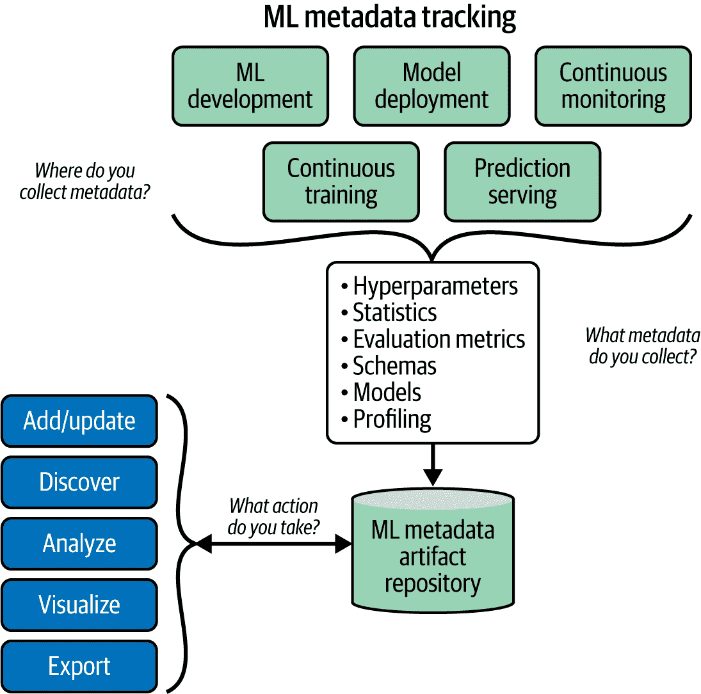
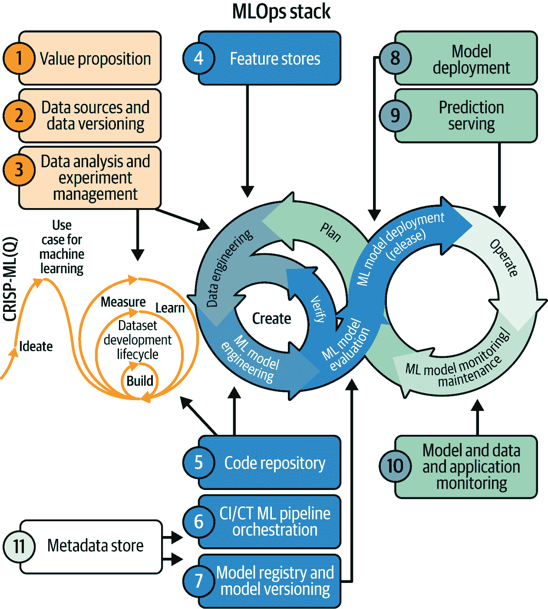

# 第二章\. 人工智能工程：主动合规催化剂

人工智能工程可以通过推广适当的工具和实践，支持公司遵守欧盟人工智能法案。这其中的关键部分是机器学习操作（MLOps），它专注于机器学习模型的运营化。这些学科共同提供了设计、开发、部署和维护人工智能系统所需的技术组件和可重复的过程，以确保以可靠和合规的方式运营。

实施自动化、版本控制、测试、可重复性、部署和监控等工程实践，有助于确保人工智能系统满足欧盟人工智能法案对高质量、安全和可信人工智能的要求。本章介绍了一些实用的框架，您可以使用这些框架来设计和构建符合规定的人工智能系统（尽管这些并非唯一的选择）。例如，机器学习画布和 MLOps 堆栈画布旨在解决风险管理、技术文档、透明度、鲁棒性和上市后监控等关键要求。我们还将讨论 CRISP-ML(Q)，这是一种内置质量保证的机器学习流程模型，强调在整个人工智能生命周期中进行风险评估、质量保证、全面文档和持续监控。CRISP-ML(Q)与人工智能工程的协同作用使组织能够主动将合规性融入人工智能生命周期，确保人工智能系统以符合欧盟人工智能法案的方式开发和部署。

# 使用 CRISP-ML(Q)结构化人工智能系统开发流程

在本节中，我们将探讨开发*人工智能应用*，这些是嵌入机器学习模型作为一项或多项功能的技术解决方案的软件应用。我们将重点关注 CRISP-ML(Q)，即跨行业标准流程，用于具有质量保证方法的机器学习应用开发。CRISP-ML(Q)提供了一种系统性和以质量为导向的方法，用于开发人工智能系统，有助于在不同风险级别上符合欧盟人工智能法案。

###### 注意

附录 A 介绍了设计人工智能应用的原则，强调将人工智能倡议与业务目标和用户需求相一致。正如附录中所述，“逆向思维”方法和机器学习画布提供了有效的规划和执行人工智能项目的实用框架。

机器学习画布强调了全面视角的重要性，该视角结合了价值主张、监控以及在大型的软件系统中整合预测和训练组件。此外，它还突出了数据管理、特征工程中的伦理影响以及构建成功人工智能产品的协作性质。有关更多详细信息，请参阅附录 A。

如论文[“迈向 CRISP-ML(Q)：一个包含质量保证方法论的机器学习流程模型”](https://oreil.ly/srSRa)所述，CRISP-ML(Q)建立在已建立的 CRISP-DM 框架（见图 2-1）之上。扩展 CRISP-DM 的动机有两个：它侧重于数据挖掘，而不是长期部署的机器学习模型，并且缺乏质量保证的指导。CRISP-ML(Q)更好地满足了设计和实施机器学习产品的需求和挑战，特别强调质量保证。

###### 图 2-1\. CRISP-ML(Q)框架的阶段

## 风险缓解、质量保证与欧盟人工智能法案的契合

使用 CRISP-ML(Q)将帮助您将欧盟人工智能法案对高风险和有限风险人工智能系统的要求纳入您的开发流程。该框架强调在整个机器学习开发过程中的持续风险评估，从理解业务需求到部署和监控。这种方法与欧盟人工智能法案对持续质量评估和风险管理的需求相一致。

如您在第一章中学到的，欧盟人工智能法案定义了人工智能系统的四个风险等级：不可接受、高风险、有限风险和最小或无风险。CRISP-ML(Q)可以通过相应调整其质量保证方法来适应这些不同的分类。例如，高风险人工智能系统将需要比有限风险或最小风险系统更广泛的测试、文档和人工监督。

对于每个机器学习开发阶段，CRISP-ML(Q)定义了特定的要求和约束，以应对可能影响机器学习系统成功风险（如偏差、过拟合或缺乏可重复性）。实施适当的质量保证方法，例如交叉验证和详尽的文档流程，以减轻这些风险。这支持符合欧盟人工智能法案的要求，即服务提供商建立稳健的风险管理系统，以识别、评估和减轻风险。

CRISP-ML(Q)还规定，在部署之前必须对人工智能系统进行彻底测试，以确保它们能够持续地为其预期目的执行，并符合要求。测试是在定义的指标和阈值下进行的。这符合欧盟人工智能法案对高风险人工智能系统进行上市前合格评定要求。此外，CRISP-ML(Q)还纳入了持续部署后的监控，以检测性能下降或偏差。严重事件必须报告。欧盟人工智能法案对高风险人工智能的市场监督、人类监督以及提供商和用户的事件报告也有类似的要求。

最后，CRISP-ML(Q)要求记录整个机器学习开发过程，包括风险管理措施。这很重要，因为欧盟人工智能法案引入了技术文档和透明度义务，以确保人类在与人工智能系统互动时得到适当的告知。

总结来说，该框架的质量保证方法和在整个机器学习生命周期中强调持续风险管理的重点与欧盟人工智能法案规定的基于风险的方法相一致。采用 CRISP-ML(Q)可以帮助组织主动识别和缓解人工智能系统的风险，以确保更安全、更值得信赖的人工智能。

## CRISP-ML(Q)的六个阶段

如前所述，CRISP-ML(Q)的一个关键原则是将质量保证实践整合到人工智能开发生命周期的每个阶段。这包括定义需求、识别风险以及根据既定最佳实践应用风险缓解方法。因此，CRISP-ML(Q)提供了一种全面的方法，用于开发符合定义的业务目标且适用于现实世界部署的高质量、可持续的人工智能系统。

CRISP-ML(Q)定义了机器学习开发过程中的六个关键阶段：

1.  业务与数据理解

1.  数据准备

1.  建模

1.  评估

1.  部署

1.  监控和维护

每个阶段都涉及特定的任务，并产生特定的输出。重要的是，尽管 CRISP-ML(Q)通常被描绘为一种顺序过程，但实际上它是迭代的，并允许有多个反向轨迹——后期阶段获得的见解通常需要回顾早期步骤。

让我们简要地详细考察每个阶段。

### 业务与数据理解

初始阶段侧重于定义机器学习应用的业务目标和成功标准。关键任务包括：

+   确定业务目标

+   识别数据来源

+   收集初始数据

+   描述数据

+   探索数据

+   验证数据质量

商业利益相关者与数据科学团队之间的紧密合作对于确保业务一致性至关重要。主要输出包括项目目标、成功标准以及数据质量和项目可行性的初步评估。

### 数据准备

在定义并传达组织内的业务目标后，您就准备好为建模准备数据。数据准备任务包括：

+   选择数据

+   清洗数据

+   构建数据

+   整合数据

+   格式化数据

此阶段涉及特征工程、处理缺失值和归一化数据。输出包括用于建模的最终数据集（s）以及它们是如何构建的文档。

### 模型工程

核心机器学习工作发生在这一第三阶段，也称为*建模*阶段。这里的关键任务包括：

+   选择建模技术

+   生成测试设计

+   构建模型

+   评估模型

您应该使用适当的评估指标和交叉验证技术构建和比较多个模型。可以将领域知识纳入以提高结果。此阶段通过选择表现最佳的模型（s）结束。

### 模型评估

在部署模型之前，您必须从数据科学和业务角度彻底评估它。模型评估任务包括：

+   评估预测结果

+   审查流程

+   决定下一步行动

模型在独立数据上测试以验证其实际性能。您还应该检查模型的可解释性和鲁棒性，并且业务利益相关者应验证模型是否符合定义的成功标准。输出是最终模型批准和部署计划。

### 模型部署

将模型部署到生产环境涉及以下任务：

+   计划部署

+   规划监控和维护

+   生成最终报告

+   审查项目

部署可以从生成简单的报告到将模型持久化存储在模型仓库或嵌入到复杂的生产系统中。创建监控和维护计划以确保模型在长时间内表现良好。

### 模型监控和维护

如果不主动监控和更新，机器学习模型可能会降低性能。此最终阶段涉及以下任务：

+   监控模型

+   评估模型

+   根据需要重新训练/更新模型

持续跟踪数据输入、模型预测和业务结果以识别问题。在新的数据上重新训练模型以防止漂移。根据不断变化的业务需求维护和增强机器学习应用。

CRISP-ML(Q)提供了一个强大的框架，用于开发机器学习应用。通过实施系统化流程并将风险识别与质量保证相结合，组织可以提高其机器学习项目的成功率和企业影响力，同时确保符合欧盟人工智能法案。

# 理解 MLOps

在本节中，我们将关注*MLOps*，这是一套旨在确保人工智能系统持续、可靠地开发、部署和维护的过程和技术组件。通过理解和实施 MLOps，您建立了遵守欧盟人工智能法案的技术基础，因为许多要求都依赖于 MLOps 实践。

MLOps 实践与特定的语言、框架、平台或基础设施无关。然而，在生产环境中部署机器学习涉及各种相互关联的组件。图 2-2 展示了机器学习系统的典型架构。在下一节中，我们将探讨一个应用和行业中立的 MLOps Stack Canvas 框架，该框架可用于指定适当的组件。

###### 图 2-2\. 机器学习系统的典型架构

机器学习/人工智能技术在各种应用中目前被广泛使用。因此，软件系统通常将机器学习/人工智能组件作为标准实践。然而，随着组织寻求通过机器学习增强其产品或流程，许多机器学习模型仍然处于实验阶段或未能超越概念验证（PoC）阶段。为了提高成功的机会，在设计机器学习系统时，明确定义接口、算法、数据、基础设施和硬件，以确保它们满足软件系统的特定要求。

MLOps 已成为一门旨在自动化机器学习模型开发和部署的学科。其核心价值在于通过支持技术堆栈和基础设施，通过提高机器学习工作流程的效率、可靠性和可扩展性来优化业务成果。MLOps 还专注于自动化和简化开发生命周期，促进新开发的机器学习模型的生产部署。为了确保模型质量和适应性，代码、训练数据或模型中的任何更改都应自动触发机器学习开发管道中的构建过程。

表 2-1 总结了 MLOps 的核心原则：自动化、版本控制、严格测试、可重复性、简化部署和持续监控。本书后面将探讨欧盟 AI 法案的相关要求以及 MLOps 工程原则如何满足这些要求。

表 2-1\. MLOps 核心原则

| MLOps 原则 | 关键方面 | 为什么它很重要？ |
| --- | --- | --- |

| *自动化* 专注于将实验性机器学习模型过渡到完全运营的生产系统。目标是自动化数据准备、模型训练、评估、部署和监控等领域的重复性任务。 | 考虑自动化：

+   数据管道用于数据摄取、清洗和特征工程

+   模型训练和超参数调整

+   模型的测试和验证

+   模型部署到生产环境

+   模型的监控和再训练

+   模型审计

| 自动化可以提高开发者的效率和生产力，减少人工错误。它还使迭代和实验更快，更容易扩展机器学习工作流程。可以使用 DVC、Airflow、Kubeflow 和 MLflow 等工具构建自动化的机器学习管道。 |
| --- |

| *版本控制*对于跟踪和管理机器学习生命周期中的变化至关重要。| 应该进行版本控制的内容：

+   数据：跟踪用于训练和评估的不同数据集版本

+   代码：机器学习代码、脚本和笔记本的版本控制

+   模型：对训练模型工件和相关元数据进行版本控制

+   配置：跟踪超参数、环境配置等

| 正确的版本控制对于实验和结果的可重现性至关重要，它允许你在出现任何问题时回滚到先前版本。它还促进了团队成员之间的协作，并为审计和符合行业标准提供了可追溯性。Git、DVC 和 MLflow 等工具可用于版本控制不同的机器学习资产。 |
| --- |

| 详尽的*测试*对于构建健壮和可靠的机器学习系统至关重要。| 关键测试类型包括：

+   单元测试以测试单个组件和函数

+   集成测试以测试组件之间的交互

+   数据测试以验证数据质量和完整性

+   模型测试以评估性能和行为（公平性、非歧视、偏差、鲁棒性）

| 自动化测试并将其集成到持续集成/持续交付（CI/CD）管道中，有助于在开发早期阶段捕捉问题。全面测试的好处包括提高模型质量和可靠性、加快调试和问题解决，以及增加对模型行为的信心。pytest、Great Expectations 和 Deepchecks 等工具可用于机器学习测试。 |
| --- |

| *可重现性*确保机器学习实验和结果可以可靠地重新创建。这对于调试、审计和科学严谨性至关重要。| 保证可重现性的工程流程包括：

+   代码、数据和模型的版本控制

+   跟踪随机种子和配置

+   记录模型开发、依赖和环境的文档

+   机器学习工作流程的容器化

| 可重现性的好处包括简化调试和故障排除、允许他人验证结果，并支持合规性。在提高机器学习实验的可重现性方面，Docker 等容器化工具以及工作流程管理和元数据管理工具发挥着重要作用。 |
| --- |

| 自动化*部署*侧重于可靠且高效地将机器学习模型从开发转移到生产。| 考虑因素包括：

+   模型打包和容器化

+   部署策略（例如，金丝雀部署、蓝绿部署）

+   缩放和负载均衡

+   监控和日志记录

+   安全性和访问控制

| 自动化部署实践允许机器学习模型更快地投入生产，无需人工干预，并确保模型服务可靠和可扩展。如果出现问题，部署过程应允许轻松回滚。Kubernetes、TensorFlow Serving 和云机器学习平台等工具可以帮助简化模型部署过程。 |
| --- |

| *监控* 确保机器学习模型在生产中按预期运行。 | 需要监控的关键元素包括：

+   模型性能指标

+   数据漂移和概念漂移

+   系统健康和资源利用率

+   预测延迟和吞吐量

+   业务验证指标

+   AI 产品健康指标

| 有效的监控使团队能够快速检测并响应问题，了解模型在生产中的行为，并在何时重新训练模型时做出数据驱动的决策。可以使用 Prometheus、Grafana 和专门的机器学习监控平台来实现全面的监控。 |
| --- |

通常，MLOps 解决的是在持续、可靠运行中维护包含机器学习/人工智能组件的软件产品的挑战。MLOps 的具体活动和技术组件取决于系统的预期运行寿命和性能要求。

# 使用 MLOps 堆栈画布定义技术组件

本节概述了定义人工智能项目基础设施的结构化方法。它使用 MLOps 堆栈画布框架来识别和组织 MLOps 堆栈所需的流程、架构和基础设施组件。

在规划实施过程中，确保机器学习模型能够带来可衡量的商业价值非常重要。这涉及到对 MLOps 堆栈中基础设施组件的成本以及在整个生命周期内编排和维护机器学习系统成本的计算。关键考虑因素包括持续集成、训练和交付机器学习资产；监控以确保系统满足业务目标；以及警报机制以检测和处理模型故障。

机器学习系统还应设计为确保可重复性（通过版本控制、特征存储和管道）、可靠性（通过最小化故障并启用安全故障转移）和效率（通过确保模型预测快速且成本效益高）。

###### 图 2-3\. 用于指定机器学习操作架构和基础设施堆栈的应用和行业中立 MLOps 堆栈画布框架

如图 2-3 所示，MLOps 堆栈画布分为三个主要区域：数据和代码管理、模型管理和元数据管理，每个区域都有其构建块。在接下来的章节中，我们将逐一介绍每个区域的内容。请注意，关于构建机器学习项目基础设施的一般讨论应包括对 MLOps 的各种组织方面的考虑，如工具、平台和所需技能。在画布的 MLOps 困境部分应记录识别出的问题。

## 价值主张

我们将从价值主张（MLOps Stack Canvas 上的第 1 项）开始。该框架强调价值主张是构建 MLOps 架构背后的关键要素，因为它旨在提高人们对所解决痛点的认识。以下是一个假设的“MLOps 平台”的价值主张示例：

+   **针对**数据科学和机器学习团队

+   **需要**高效构建、训练和部署大规模机器学习模型的人。

+   **MLOps** **平台** 是一个端到端机器学习平台

+   **这**使团队能够快速开发和运营机器学习解决方案，以推动业务价值。

+   **与**其他需要复杂设置且缺乏可观察性和监控等关键功能的机器学习平台不同

+   **我们**的 **MLOps** **平台** 提供了一个全托管、直观的界面，具有自动化工作流程、内置实验跟踪、强大的 AutoML 功能以及无缝部署，以加速从原型到生产的机器学习生命周期。

这使您能够识别关键要素，例如：

目标客户

数据科学和机器学习团队

需求

高效构建和部署大规模机器学习模型

产品名称和类别

MLOps 平台，一个端到端机器学习平台

关键利益

快速开发和运营机器学习以推动业务价值

竞争

其他复杂且缺乏可观察性和监控等功能的机器学习平台

区别化

全托管、直观、自动化，具备实验跟踪、AutoML 和无缝部署功能，以加速整个机器学习生命周期

确定正确的目标客户及其需求对于构建一个规模合适的 MLOps 平台且不包含不必要的复杂技术至关重要。

回答以下问题将帮助您自信地阐述您的价值主张：

+   我们试图为最终用户（们）做些什么？

+   问题是什么？

+   为什么这是一个重要的问题？

+   我们的客户画像是谁？（机器学习工程师、数据科学家、运营/业务用户）

+   谁拥有生产中的模型（们）？

您可以在 附录 A 中了解更多关于构建价值主张的信息。

## 数据和代码管理

MLOps Stack Canvas 的数据与代码管理块包括管理数据和代码所需的技术组件——这两个是每个机器学习系统的基本要素。让我们来检查画布的下一个构建块，即数据源和数据版本控制、数据分析与实验管理、特征存储和工作流程以及基础。

### 数据源和数据版本控制

数据是任何机器学习系统的骨架。在阐述价值主张中的商业问题之后，下一步是数据源和数据版本控制。这里的目的是估计 CRISP-ML(Q)框架的商业和数据理解以及数据准备阶段的数据获取、存储和处理成本。数据集开发和为 ML 算法进行的进一步处理可能成本高昂。数据版本控制对于使用新数据分析模型性能至关重要，可能也是监管要求。

这里有一些关于数据源和数据版本控制构建块的考虑因素：

+   数据版本控制是可选的还是必需的？例如，这是否是监管要求？

+   可用的数据源有哪些（例如，自有的、公共的、购买的）？

+   那些数据存储在哪里（例如，在数据湖或数据仓库中）？

+   是否需要手动标记？我们是否有人力资源来做？

+   我们如何为每个训练模型进行数据版本控制？

+   有哪些工具可用于数据管道/工作流程？

你也可以使用[数据景观画布](https://oreil.ly/hsXsZ)来盘点你组织为机器学习项目可用的、可访问的和必需的数据源。

### 数据分析和实验管理

根据 CRISP-ML(Q)框架，项目的初始阶段包括运行实验和实施概念验证。数据分析和实验管理块侧重于 ML 技术对特定商业目标和数据准备的适用性。在这里，你需要回答以下关于工具的问题：

+   你将使用哪种编程语言进行数据分析（例如，R、Python、Scala、Julia、SQL）？

+   需要计算哪些 ML 特定和业务评估指标？

+   为了可重复性（数据集、超参数等），关于机器学习实验收集了哪些元数据？

+   团队中有什么 ML 框架的专业知识？

### 特征存储和工作流程

*特征工程*是将原始输入数据转换为特征的过程，这是一种适合机器学习算法的数值表示。特征存储是 MLOps 堆栈中的一个技术组件，用于在 ML 项目和数据科学团队之间管理、重现、发现和重用特征。它将特征工程与 ML 模型开发分离，并加快了过程。然而，由于这是一个高级组件，使用特征存储可能会增加复杂性，因此你需要考虑它是否适合当前项目。以下是一些需要提出的问题：

+   特征存储是可选的还是必需的？我们是否有数据治理流程，要求特征工程可重复？

+   训练和预测阶段是如何计算特征（工作流程）的？

+   特征工程的基础设施需求是什么？

+   我们是购买还是自己构建特征存储？

+   哪些数据库涉及特征存储？

+   我们是否为特征工程设计 API？

### 基础（反思 DevOps）

DevOps 是一套实践和工具，它将软件开发和 IT 运维集成在一起，以自动化、简化和加速软件应用程序的构建、测试和部署，重点关注可靠性和可扩展性。

在 MLOps Stack Canvas 的下一步中，您将评估可用的 DevOps 基础设施，并在 ML 项目中提高对当前 DevOps 原则的认识。这有助于将 DevOps 最佳实践外推到 MLOps 活动中。如果传统 DevOps 实践中存在差距，那么在转向更复杂的活动，如模型和数据版本控制、持续模型训练或实施功能存储之前，解决这些差距是至关重要的。

遵循 DORA [“加速 DevOps 状态报告”](https://oreil.ly/YzySM)中的指南，并通过回答以下问题来执行您软件交付性能的自我评估：

+   我们如何维护代码？使用了什么源版本控制系统？

+   我们如何监控系统性能？

+   我们是否需要对笔记本进行版本控制？

+   是否使用了基于主干的开发方法？

+   代码库的 CI/CD 管道是什么？使用了哪些工具？

+   我们是否跟踪诸如部署频率、变更的领先时间、平均恢复时间和变更失败率等指标？

遵循 DevOps 原则直接影响到软件交付的性能。MLOps 建立在 DevOps 之上，因此为软件项目建立一个稳定的 DevOps 文化对于 ML 项目的成功至关重要。

## 模型管理

模型管理包括一套用于在整个生命周期中高效跟踪、版本控制、部署和监控机器学习模型的实践、流程和工具，确保一致性、可重复性和可扩展性，同时满足业务需求。MLOps Stack Canvas 这一领域的构建块包括 CI/CD/CT：ML 管道编排、模型注册和模型版本控制、模型部署、预测服务和模型、数据和应用监控。

### CI/CT/CD：ML 管道编排

在上一个块中，您已审查了软件交付的现有 CI/CD 管道。在本块中，您将检查 ML 模型发布的 CI/CD 常规流程。您还将介绍持续训练（CT）。虽然持续集成涉及数据管道和模型管道的构建、测试和打包，但持续训练专注于自动重新训练 ML 模型。您将使用管道模式，该模式包括数据验证、特征和数据选择、数据清洗、特征工程和模型训练等步骤。

管道被构建为一个有向无环图（DAG），表示整体工作流程。这是表示依赖关系和执行顺序的常见方法。根据成熟度水平，您可以自动化数据和模型训练管道工作流程以使模型投入运营。每当有新数据可用或管道的源代码发生变化时，您应该触发数据准备和模型训练管道。

在 MLOps Stack Canvas 的这个块中，您应该通过回答以下问题来明确 CRISP-ML(Q)模型工程阶段 CI/CT 的过程和工具链：

+   预期模型多久重新训练一次？这个触发因素是什么（计划内、基于事件或临时）？

+   这发生在哪里（本地或云端）？

+   机器学习管道的正式工作流程是什么？使用了哪些技术栈？

+   是否需要分布式模型训练？我们是否有必要的分布式训练基础设施？

+   CI 管道的工作流程是什么？使用了哪些工具？

+   机器学习模型的非功能性需求（效率、公平性、鲁棒性、可解释性等）是什么？它们是如何测试的？这些测试是否集成到 CI/CT 工作流程中？

### 模型注册和模型版本化

MLOps Stack Canvas 的下一部分关注的是机器学习模型注册和版本化组件，这是 CRISP-ML(Q)流程中模型评估阶段的关键元素。机器学习模型，连同数据和软件代码，是一项基本资产。与传统软件工程中的代码版本控制一样，建立模型和数据版本控制实践是机器学习可重复性的基础。

根据您的用例，代码或数据的更改可能需要重新训练模型。模型也可能需要更新，因为“模型退化”，即模型在时间推移和新数据下性能下降。在医疗保健、金融和军事等监管行业，所有机器学习模型都应该进行版本控制和详细记录。同时，确保向后兼容性也很重要，可以通过回滚到先前构建的模型来实现。通过跟踪多个版本的机器学习模型，可以实现不同的部署策略，例如“金丝雀”或“影子”部署（用于以受控方式逐步推出更改以降低风险并评估新训练模型的性能的方法）。

在 MLOps Stack Canvas 的这个部分，您应该回答以下问题：

+   使用模型注册和模型版本化是可选的还是强制性的？如果您有多个模型在生产中并且需要跟踪它们，可能需要模型注册。如果您有可重复性的要求，可能需要模型版本化。

+   新的机器学习模型应该存储和跟踪在哪里？

+   使用了哪些版本控制标准（例如，语义版本控制）？

注意，在机器学习项目的后期阶段，实现版本控制和机器学习模型注册可能更为合适。

### 模型部署

在模型训练和评估完成后，你将进入 CRISP-ML(Q)流程的下一阶段，并部署机器学习模型。部署机器学习模型意味着使其在目标环境中可用，以接收预测请求。在本节 MLOps 堆栈画布中，你将通过回答以下问题来定义你的模型暴露策略和持续部署的基础设施方面（基于预定的评估指标将机器学习模型自动部署到目标环境）：

+   模型的交付格式是什么？

+   变更的预期时间是多少（从提交到生产的耗时）？

+   服务的目标环境是什么？

+   我们的模型发布策略是什么？是否需要 A/B 测试或多臂老虎机测试（例如，用于衡量新模型对业务指标的有效性并决定在生产环境中应推广哪个模型）？

+   我们的部署策略是什么？例如，是否需要影子或金丝雀部署？

### 预测服务

本节 MLOps 堆栈画布涵盖了将机器学习模型应用于新输入数据的过程，通常称为模型服务。有两种主要的服务模式：在线和批量。机器学习模型可以使用五种不同的模式进行部署：模型即服务、模型即依赖项、预计算、按需模型和混合服务。每种模式都需要不同的基础设施设置。例如，模型即服务涉及通过 REST API 将模型作为服务分发以处理输入请求，并使用按需模式进行预测响应。另一方面，预计算模式使用批量预测模式，模型预测预先计算并存储在关系数据库中。

为了确定模型服务的环境，你应该回答以下问题：

+   服务的模式是批量还是在线？

+   是否需要分布式模型服务？

+   是否需要多模型预测服务？

+   是否实现了输入数据的预断言？

+   对于不充分的模型输出（断言后）实现了哪种回退方法？（我们是否有启发式基准？）

+   我们是否需要机器学习推理加速器（如 Tensor Processing Units 等专用硬件）？

+   每月（或每小时/每天）预期的预测目标量是多少？

### 模型、数据和应用程序监控

一旦机器学习模型投入使用，就必须持续监控以确保其质量保持不变，并继续提供准确的结果。本节 MLOps 堆栈画布解决了在生产环境中操作 ML 系统的监控方面。它对应于 CRISP-ML(Q)过程的第六阶段，即模型部署和监控。以下是一些需要回答的问题：

+   持续监控是可选的还是强制性的？例如，您需要在预测服务期间评估模型的有效性吗？您需要监控模型以检测性能下降并在其表现不佳时触发警报吗？模型重训练是否由特定事件（如数据漂移或概念漂移）自动触发？

+   收集哪些机器学习指标？

+   收集哪些特定领域的指标？

+   如何检测模型性能衰减？

+   如何检测数据倾斜？

+   需要监控哪些操作方面（例如，模型预测延迟、CPU/RAM 使用情况）？

+   警报策略是什么（例如，阈值）？

+   模型重训练由什么触发？是临时的、基于事件的还是计划的？

## 元数据管理

机器学习系统的元数据管理是一个收集、组织、存储和利用有关 ML 生命周期各个组件和阶段的全面过程。这包括跟踪与数据集、模型、实验、部署和性能指标相关的信息，以确保在整个 ML 管道中的可重复性、可比性和可追溯性（见图 2-4）。

###### 图 2-4\. 元数据管理

元数据存储是一个横切组件，支持 MLOps 基础设施堆栈的所有元素。实施机器学习模型治理流程（这取决于您的组织要求和法规要求）高度依赖于元数据，使元数据存储成为一个基本组件。

在 MLOps Stack Canvas 的最后一个块中，您将回答以下问题：

+   需要收集哪些与代码、数据和模型管理相关的元数据（例如，管道运行 ID、触发器、执行步骤、开始/结束时间戳、训练/测试数据集拆分、超参数、模型对象、各种统计数据等）？

+   MLOps 生命周期中是否包含任何机器学习治理流程？需要哪些元数据？

+   文档策略是什么？我们将文档视为代码吗？

+   需要收集哪些操作指标（例如，恢复时间、变更失败百分比）？

## MLOps 的额外考虑因素

MLOps 平台由自助 API、工具、服务、知识和支持组成，作为一个产品组织（有关此概念更多内容，请参阅团队拓扑视频“WTF Is Platform as Product?”[https://oreil.ly/2IZ7x]）。平台旨在使多个自主交付团队能够更快地发布产品功能，减少团队之间的依赖和协调。在更广泛的关于构建 AI 项目基础设施的讨论中，还应考虑 AI 工程的组织方面。例如：

工具

我们是购买、使用现有的开源工具还是为每个 MLOps 组件开发内部工具？每个决策的风险、权衡和影响是什么？

平台

我们应该标准化一个单独的 MLOps 平台还是创建一个混合解决方案？这个决策的风险、权衡和影响是什么？^(1)

技能

与雇佣或培训我们自己的机器学习工程技术人才相关的成本是多少？

使用 MLOps Stack Canvas 可以帮助您识别 AI 项目的流程、架构和基础设施组件，并在每个阶段为您的 AI 项目制定良好的成本估算。

# CRISP-ML(Q)和 MLOps

MLOps 和 CRISP-ML(Q)是互补的方法，它们可以协同工作以支持并改进机器学习模型的开发和部署。虽然 CRISP-ML(Q)提供了一个结构化的流程框架，但 MLOps 提供了实施和运营 ML 项目的技术和组织最佳实践。图 2-5 展示了两者之间的协同作用。

###### 图 2-5\. MLOps 和 CRISP-ML(Q)的协同作用

这两种方法可以整合起来，将 ML 开发过程与技术实施绑定。特别是，CRISP-ML(Q)建议一个高级、结构化的机器学习项目流程，将开发工作流程分为六个主要阶段：业务和数据理解、数据准备、建模、评估、部署以及监控和维护。MLOps 提供了实施这些阶段的有效技术基础设施和最佳实践。例如，在 CRISP-ML(Q)的数据工程阶段，可以应用 MLOps 实践来自动化数据管道、确保数据版本控制并维护数据质量。

CRISP-ML(Q)的主要优势，以及它成为欧盟 AI 法案实施合适的 ML 流程模型的原因，在于其将质量保证和风险意识整合到机器学习生命周期的各个阶段。MLOps 通过提供持续集成、持续交付和自动化测试的工具和实践来补充这一点，这对于维护生产环境中的质量至关重要。

机器学习开发本质上具有迭代性，CRISP-ML(Q)和 MLOps 都支持这一点。CRISP-ML(Q)提供了一个框架，用于迭代机器学习开发的各个阶段，而 MLOps 则提供了快速实验、版本控制和自动化重新训练机器学习模型的技术解决方案。此外，MLOps 通过采用持续监控、日志记录和自动化模型更新等实践，促进了模型重新训练。DORA 的研究[Research by DORA](https://oreil.ly/YzySM)表明，采用持续交付（因此是 MLOps）实践可以显著提高组织的技

作为以质量为导向的，CRISP-ML(Q)强调了记录业务决策、数据、机器学习模型开发过程以及模型和实验本身的重要性。MLOps 通过提供代码、数据和模型的版本控制来补充这一方法，从而确保结果的可重复性。它还引入了技术组件，如元数据、模型和特征存储，以支持这些功能。

CRISP-ML(Q)的迭代特性与 MLOps 对持续改进的重视相吻合。MLOps 实践可用于实施 CRISP-ML(Q)建议的反馈循环，从而允许对模型和流程进行持续优化。MLOps 还提供了技术解决方案，以扩展机器学习操作，包括自动化的模型训练、评估和部署管道。

在实践中，组织可以使用 CRISP-ML(Q)作为构建其机器学习项目的高级框架，同时在每个阶段应用 MLOps 的最佳实践和工具。这种组合确保了项目遵循一个定义良好的流程，同时受益于现代、高效和可扩展的技术实现。

# 结论

本章介绍了 CRISP-ML(Q)和 MLOps，并展示了这一组合如何为满足欧盟人工智能法案的合规要求提供了一个稳健的框架：CRISP-ML(Q)提供了流程蓝图，而 MLOps 则提供了将此流程以合规方式实施所需工具和实践。共同作用，它们使组织能够主动地将欧盟人工智能法案的合规性嵌入到机器学习生命周期中，从数据收集到监控，而不是将其视为事后之想。

在接下来的章节中，为了完善合规工程的全景图，你将学习关于数据治理的知识，这是一个包括政策、流程和责任框架，确保数据在整个人工智能开发生命周期中的质量、安全性、合规性和道德使用。你还将了解人工智能治理如何确保人工智能系统以负责任、道德、安全和合规的方式被开发、部署和监控。

^(1) Thoughtworks 提供了一个理解 MLOps 平台景观的[优秀指南](https://oreil.ly/nE93Z)。
