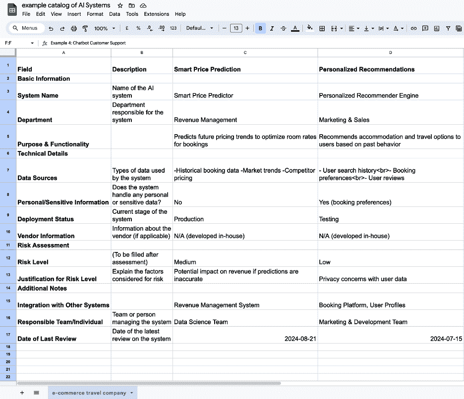
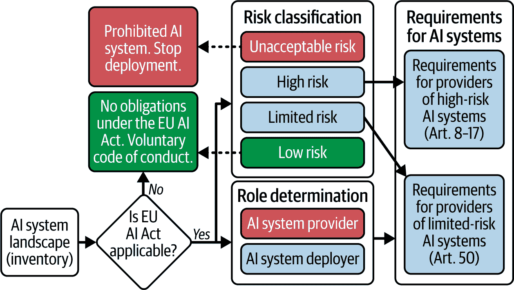
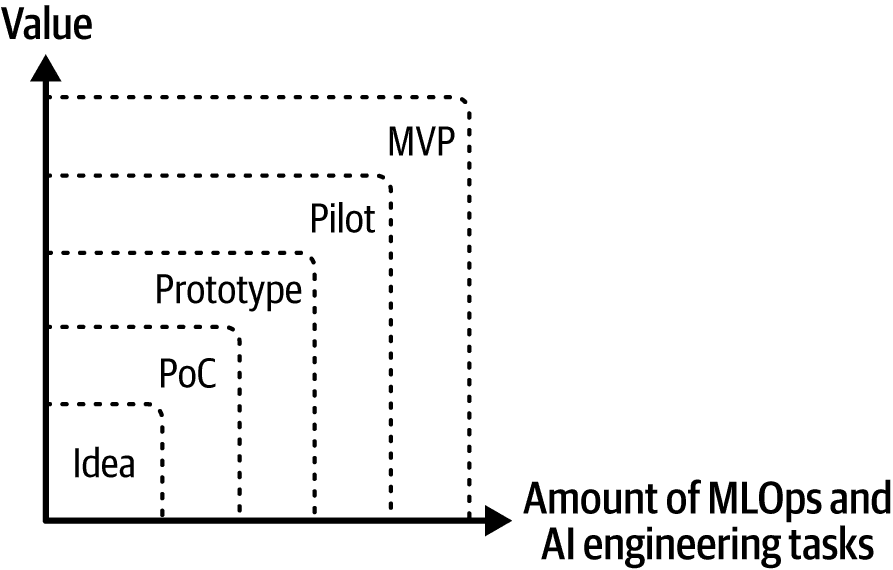

# 第四章. AI 系统评估和针对不同风险级别的 AI 工程定制

本章的主要学习目标是理解如何实际分类不同的 AI 系统风险级别，以及如何为每个风险级别设计 AI 工程流程（参见图 4-1 以了解迈向符合欧盟 AI 法案的步骤）。我们将探讨欧盟 AI 法案的风险分类框架和责任映射阶段。对于高风险和有限风险的 AI 系统，精心规划数据治理、AI 治理和 MLOps 流程对于确保符合该法案至关重要。

###### 图 4-1. 本章重点在于创建组织中的 AI 系统景观并对风险类型进行分类。参见第一章了解迈向符合欧盟 AI 法案的端到端过程步骤。

本章将帮助您回答以下问题：

+   目前有多少 AI 系统正在运行或计划投入生产？

+   这些 AI 系统属于哪些风险类别？

+   如何明确每个 AI 模型提供者或部署者的角色？

在关于欧盟 AI 法案的讨论中，人们经常使用“AI 合规性”、“AI 治理”和“风险管理”等术语。虽然它们密切相关且相互补充，但这些都是不同的概念。让我们首先明确每个概念的含义。

# AI 合规性、治理和风险管理

我们在前面章节探讨了 AI 合规性和治理。作为提醒，*AI 合规性*侧重于遵守法律、法规和政策标准，确保道德行为，并通过严格的过程、指标和利益相关者参与来促进透明度。*AI 治理*建立了一个道德和负责任的 AI 开发框架，强调透明度、利益相关者参与以及平衡创新与道德考虑。*AI 风险管理*涉及识别和解决与 AI 系统相关的风险，重点关注稳健的评估实践、有效的缓解策略，并促进一种意识和主动行动的文化。

表 4-1 从多个维度比较和对比了 AI 合规性、治理和风险管理框架，包括目标、涉及的人员和流程、工程考虑因素、文化实践等。

表 4-1. 在欧盟 AI 法案背景下比较 AI 合规性、治理和风险管理

|   | AI 合规性 | AI 治理 | AI 风险管理 |
| --- | --- | --- | --- |
| 目标 | 确保 AI 系统遵守欧盟 AI 法案中规定的需求和义务，包括风险管理、数据治理、人工监督、透明度、准确性、鲁棒性和网络安全。 | 建立符合欧盟 AI 法案、组织价值观和伦理原则的 AI 开发、部署和使用监督框架。 | 在 AI 系统的整个生命周期中，根据欧盟 AI 法案的风险方法，识别、评估和缓解与 AI 系统相关的风险。 |
| 人员 | 合规官员、法律团队、数据保护官员、AI 伦理委员会 | AI 伦理委员会、首席 AI 官、AI 伦理官、跨职能 AI 指导委员会、AI 项目经理 | 风险管理团队、数据科学家、AI 工程师、网络安全专家 |
| 流程 |

+   实施风险评估程序以分类 AI 系统。

+   为高风险 AI 系统建立文档实践。

+   开发事件报告和管理协议。

+   创建符合性评估和 CE 标志的程序。

|

+   开发与欧盟 AI 法案一致的 AI 政策和指南。

+   为高风险 AI 系统实施审查和批准流程。

+   建立 AI 系统持续监控和审计的机制。

+   为 AI 相关问题和决策创建升级程序。

|

+   定期进行 AI 风险评估。

+   进行 AI 故障的情景规划。

+   确保持续监控 AI 系统性能。

+   创建事件响应和恢复计划。

+   定义定期风险报告和审查的流程。

|

| 指标和 KPIs |
| --- |

+   违规合规的数量

+   解决合规问题的时间

+   通过合规性检查的 AI 项目百分比

+   拥有适当文档的 AI 系统百分比

+   合规性审计的频率

|

+   由治理委员会审查和批准的 AI 项目数量

+   遵守既定治理政策的 AI 系统百分比

+   AI 系统审计的频率和结果

+   进行伦理审查的数量

|

+   识别、评估和缓解的风险数量

+   随时间推移 AI 相关事件的减少

+   解决已识别风险的时间

+   已完成风险评估的高风险 AI 系统百分比

|

| 利益相关者参与 |
| --- |

+   内部：法律、技术和运营团队之间的协作

+   外部：与监管机构、合规机构和行业标准组织互动

|

+   内部：跨部门协作，包容性决策流程

+   外部：与外部顾问、行业论坛和监管机构接触

|

+   向高管层传达风险信息

+   与客户合作，确定风险容忍度

+   与保险公司就 AI 相关保险进行接触

+   与行业合作伙伴合作，共同制定风险管理最佳实践

|

| 工程实践 |
| --- |

+   实施隐私设计和安全设计原则。

+   开发用于偏差检测和缓解的测试程序。

+   建立数据、代码和人工智能模型版本控制。

+   定期进行代码审查，确保遵守伦理准则和可追溯性。

|

+   实施标准化的 AI 开发方法论。

+   在人工智能生命周期关键阶段建立治理检查点。

+   集成包括治理考虑在内的代码审查实践。

+   将治理要求纳入 DevOps 实践。

|

+   将风险考虑纳入人工智能架构设计。

+   对人工智能系统实施稳健的测试程序，包括对抗性测试。

+   开发安全机制并确保高风险人工智能系统的优雅降级。

+   建立部署的人工智能系统中早期风险检测的监控系统。

|

| 技术和基础设施 |
| --- |

+   合规管理软件

+   自动化审计工具

+   解释性人工智能

+   数据保护技术

+   安全数据存储

+   强健的日志系统

+   合规跟踪系统

|

+   人工智能模型注册库

+   集中式人工智能治理平台

+   数据溯源跟踪系统

+   人工智能性能监控工具

+   伦理人工智能框架

|

+   人工智能风险监控和警报系统

+   风险测试的模拟环境

+   自动化风险评估工具

+   为人工智能测试提供安全沙盒

+   安全数据环境

+   弹性系统架构

|

| 培训和教育 |
| --- |

+   定期对人工智能开发者进行合规培训

+   举办关于新兴人工智能法规的研讨会

+   人工智能合规认证计划

|

+   对所有参与人工智能项目的员工进行治理培训

+   人工智能伦理和负责任 AI 开发的专业课程

+   举办关于解释和应用欧盟人工智能法案要求的研讨会

|

+   专门针对人工智能技术的风险管理培训

+   教育开发者识别和减轻人工智能特定风险

|

| 变革管理 |
| --- |

+   制定现有人工智能系统过渡至符合该法案的路线图。

+   建立关于合规更新的明确沟通渠道。

+   创建反馈机制以持续改进合规流程。

|

+   制定推广新治理政策的沟通策略。

+   制定适应现有人工智能系统新治理要求的过渡计划。

+   建立反馈循环以持续改进治理实践。

|

+   制定将风险管理整合到现有人工智能工作流程中的策略。

+   定期更新风险管理政策。

+   与利益相关者沟通风险状况。

|

| 文化考量 |
| --- |

+   营造伦理人工智能开发和负责任创新的氛围。

+   促进人工智能决策过程中的透明度和问责制。

+   促进跨职能协作以应对合规挑战。

|

+   营造负责任的人工智能创新和伦理决策的文化。

+   鼓励就人工智能风险和治理挑战进行开放讨论。

+   认可并奖励遵守人工智能治理原则。

|

+   营造主动识别和减轻风险的文化。

+   允许无恐惧地公开报告潜在风险（创建一个“安全空间”）。

+   推广创新和风险管理之间的平衡方法。

|

人工智能的合规性、治理和风险管理密切相关。合规性主要具有反应性，为治理设定了基本要求，而有效的治理则是主动的，指导人工智能的负责任开发和利用。风险管理通过及时识别和应对潜在威胁，补充并告知合规性和治理工作。当整体实施并嵌入日常运营时，这三个支柱为遵守欧盟人工智能法案提供了基本支持。

# 创建人工智能系统清单

为了导航欧盟人工智能法案并了解其对您组织的影响，您应首先概述您现有的人工智能系统和潜在的 AI 用例，以评估它们是否受该法规的约束。

注意，作为内部研究项目开发的人工智能用例通常不包括在合规义务中。

在本章的后面部分，我将概述人工智能项目的不同成熟度水平，并指定欧盟人工智能法案的要求必须满足的时间。目前，请注意，该法案根据人工智能系统的风险水平和预期用途影响人工智能系统，而不是其开发阶段。

如第一章所述，欧盟人工智能法案适用于：

+   将人工智能系统投放欧盟市场或投入使用的提供者

+   位于欧盟内部的人工智能系统用户

+   如果人工智能系统的输出在欧盟内使用，则欧盟外的提供者和用户

为了帮助您在清单工作中，我建议按照以下步骤创建*人工智能系统清单*：

1.  识别所有部门的 AI 应用。

1.  包括自定义开发和第三方人工智能解决方案。

1.  记录关键细节，如部门、目的、使用的数据、部署状态和风险类别。

###### 备注

作为提醒，欧盟人工智能法案的第 3 条将人工智能系统定义为“一种基于机器的系统，旨在以不同的自主程度运行，并在部署后可能表现出适应性，并且为了明确或隐含的目标，从它接收的输入中推断出如何生成输出，如预测、内容、推荐或决策，这些输出可以影响物理或虚拟环境。”

您需要创建一个全面的清单模板，以记录您组织内部使用或开发的所有人工智能系统，并捕获每个系统的关键属性。图 4-2 展示了这可能看起来像什么。

###### 图 4-2\. 人工智能系统目录条目应包含基本识别信息、技术细节、风险评估和附加相关备注

根据您组织的需要，您可以使用 Microsoft Excel、Google Sheets（如图 4-3 所示）、Airtable 或更复杂的数据库管理系统等工具创建此模板。知识管理平台如 Confluence 或 Notion 也有助于创建人工智能系统目录，以及 watsonx.ai、Dataiku 或 Domino Data Lab 等专门的 AI 管理工具。

###### 图 4-3\. 一个假设的电子商务公司现有人工智能系统目录的例子

在创建组织人工智能系统的完整和详细清单之后，你接下来想要回答的问题是欧盟人工智能法案是否适用于这些系统。

# 欧盟人工智能法案的适用性

欧盟人工智能法案对特定人工智能系统的适用性取决于几个因素，包括该系统是否在法案的范围内以及人工智能的定义，它是否已经投放市场或投入使用，以及法案生效和应用的时机。

###### 小贴士

欧盟人工智能法案的相关条款是：

+   [第 2 条：范围](https://oreil.ly/eBlrf)

+   [第 3 条：定义](https://oreil.ly/ogId3) 和 [序言 12](https://oreil.ly/5h0Su)

+   [第 111 条：已投放市场或投入使用的人工智能系统和已投放市场的一般用途人工智能模型](https://oreil.ly/d8_kg)

+   [第 113 条：生效和适用](https://oreil.ly/s_NYt)

遵守欧盟人工智能法案涉及一个复杂的过程流程，有许多条件，如图 4-4 所示。在明确法案是否适用于特定系统之后，您需要确定您的组织角色（如提供商或部署者）并分类系统的风险级别。这两个因素决定了您的组织必须履行的具体义务集合。

###### 图 4-4\. 确定欧盟人工智能法案适用于人工智能系统和其风险分类的过程（改编自[*https://oreil.ly/LUZWC*](https://oreil.ly/LUZWC) [CC BY 4.0]，由 appliedAI Europe gGmbH 提供）

我们将在本章后面更详细地探讨确定适用性、风险级别和组织角色的过程。首先，让我们检查欧盟人工智能法案禁止的使用案例。

# 不可接受的风险——禁止的人工智能实践

隐私、完整性、社会正义、透明度和多样性等人类价值观是欧盟法律的核心，随着人工智能技术的日益普及，它们在软件和人工智能开发中的重要性也在不断增加。为确保人工智能的安全性，与其对技术本身进行监管，不如对其应用进行监管更有效。

技术本身既不是天生的好，也不是天生的坏，但它可以被用于善良或有害的方式。为了强调这一观点，表 4-2 给出了相同技术的有用和有害应用的例子。这很重要，因为人工智能技术是通用的，开发者——例如那些发布开放重量和开源基础模型的人——无法完全控制其他人可能如何使用它。以一个具体的例子来说，虚假评论在生成式人工智能广泛采用之前就已经是许多网站的问题，需要公司投入大量资源来检测和删除它们。传统的虚假评论通常使用相似的语言，这使得它们更容易被发现。然而，GenAI 工具自动重新措辞或重写文本的能力使得检测虚假评论变得越来越具有挑战性。在这种情况下，解决方案不是限制技术的使用；相反，当人工智能以有害的方式使用时，应该解决的是那个具体的应用，如果必要的话，可以对其进行限制或停止。

表 4-2\. 通用技术的有用和有害应用

| 通用技术 | 应用 |
| --- | --- |
|   | 有用 | 有害 |
| --- | --- | --- |
| 核技术 |

+   电力生成

+   从海水中生产淡水的大型海水淡化厂

+   医学成像（X 射线、CT 扫描）

+   如放射治疗之类的癌症治疗

|

+   核武器

+   核废料（作为副产品）

+   核设施（潜在的堆芯熔毁和放射性污染）

|

| 人工智能 |
| --- |

+   自动化重复性任务和简化流程

+   分析大量数据以提供更明智的商业决策见解

+   启用个性化的推荐和体验

|

+   自主武器系统

+   传播虚假信息或操纵公众舆论

+   政治深度伪造

|

## 禁止使用的 AI 用例

欧盟人工智能法案旨在通过禁止与欧盟核心价值观和权利不相符的人工智能应用来保护基本权利、民主和法治。一般来说，该法案禁止人工智能系统：

+   使用潜意识、操纵性或欺骗性技术来误解行为并防止做出明智的决定，造成重大伤害

+   利用与年龄、残疾或社会经济状况相关的漏洞来扭曲行为，造成重大伤害

+   利用生物识别分类系统推断敏感属性，如种族、政治观点、宗教信仰和性取向

+   进行社会评分（即根据社会行为或个人特质评估个人），可能导致歧视性对待

+   通过从互联网或监控录像中无目标地抓取面部图像来创建或扩展面部识别数据库

+   在工作场所或教育机构中推断情绪，除非出于医疗或安全原因

所有被禁止的人工智能系统都必须在法案生效后六个月内，即 2025 年 2 月之前从欧盟市场移除（有关实施时间表的详细信息，请参阅第一章）。正确识别和分类这些系统以确保它们被从运营中移除，这是非常重要的。

让我们更详细地看看一些被禁止的具体类型的人工智能系统：

通过潜意识技巧操纵人们的系统

这些系统使用隐藏的技巧，如声音或图像，在不让人们意识到的情况下影响他们——例如，一个在商店播放几乎听不到的音乐的人工智能系统，以影响人们购买更多东西。

使用面部识别根据敏感特征对人们进行分类的系统

这意味着使用面部识别技术根据人们的种族、宗教、性取向或其他个人特征将人们分类的系统。这些系统被禁止，以保护人们免受基于这些特征的歧视。

社会评分系统

这些系统根据个人的在线行为或其他个人信息为个人创建评分。这个评分可能随后被用来拒绝人们的工作、住房或其他机会。（有关社会评分的示例，请参阅“深入探讨：社会评分”）

公共场所的执法面部识别（除特定情况外）

这意味着警察和其他执法机构通常不能在公共场所使用面部识别技术扫描人们。尽管如此，也有一些例外，例如在寻找失踪人员、试图预防恐怖主义或试图抓捕犯罪分子时。

预测犯罪的人工智能系统

这些系统使用人工智能来尝试猜测某人未来是否可能犯罪。这是不允许的，因为这可能导致人们因未犯的罪行而受到惩罚。

在未经人们许可的情况下建立面部识别数据库的系统

这意味着公司和组织不能未经人们许可收集大量的人脸数据库。这是为了保护人们的隐私。

工作或学校中的情感识别系统（除特殊情况外）

这些系统使用人工智能来尝试猜测人们的情绪。在职场或学校中，这通常是不允许的，但也有一些例外。例如，如果人工智能系统被用于帮助自闭症人士学习理解情绪，那么可能允许这样做。

###### 小贴士

[欧盟人工智能法案第二章第五条](https://oreil.ly/I-18Z) 包含 19 项序言——编号 3 和 28 至 45——您可以查阅这些序言以更深入地了解禁止的人工智能使用案例。

## 深入探讨：社会评分

一些形式的社会评分已经存在于我们的日常生活中。例如，金融机构可能会使用考虑过去财务行为和社交媒体数据的信用评分系统。同样，一些保险公司会根据从健身追踪器收集的数据调整费率。根据欧盟人工智能法案，[序言 31](https://oreil.ly/cWYg4)，由于以下关键问题，社会评分系统被禁止：

歧视性结果

社会评分系统可能导致歧视性结果和某些群体的排斥。

侵犯基本权利

这些系统可能违反尊严权、非歧视权、平等权和正义权。还有关于 AI 工具的担忧，这些工具通过收集未经同意的敏感数据来侵犯用户隐私。

不公平评估

社会评分系统根据个人在各个环境中社会行为的多个数据点进行评估或分类，或根据已知、推断或预测的个人特征随时间进行评估。评分机制通常缺乏透明度、公平性和问责制。

有害处理

从这些系统中获得的社会评分可能导致在与社会数据最初生成或收集无关的社会环境中对个人或群体进行负面处理。

极端后果

社会评分可能导致与个人社会行为的严重性不成比例的有害处理。

广泛影响

这些系统可能影响个人获得服务、就业或其他机会。

欧盟人工智能法案旨在通过禁止社会评分 AI 系统来减轻这些风险。这项禁令适用于使用 AI 进行社会评分的公共和私人行为者。

# 确定欧盟人工智能法案义务

为了确定您在欧盟人工智能法案下的义务，在评估您的 AI 系统时，您需要采取两个基本步骤：

1.  通过回答以下问题来确定法案是否适用于您的库存中的任何 AI 系统，并明确您的义务范围：

    +   它们是否符合法案中“人工智能系统”的定义？（有关更多信息，请参阅以下侧边栏。）

    +   如果适用，它们是否在根据其预期用途和风险分类的法案范围内？那些低风险的系统可以豁免。

    +   它们是否被认为是高风险？

    +   透明度义务是否适用？

1.  确定贵组织在每个系统中的角色。它是作为提供者还是部署者？

一旦确定了哪些 AI 系统符合法案的定义，下一步就是确定它们的危险级别。您的具体义务将根据这一分类而有所不同。

## 按风险水平对人工智能系统进行分类的框架

已经讨论了不可接受的风险类别，现在我们将考虑剩余的三个类别：高风险、有限风险和低风险。让我们首先回顾确定一个系统是否被归类为高风险的标准。

### 高风险

欧盟 AI 法案第 6 条概述的高风险 AI 系统分类规则旨在识别可能对健康、安全或基本权利构成重大风险的系统。分类考虑了 AI 系统的预期用途以及它被使用的具体环境和条件。关键考虑因素包括：

+   AI 系统无论作为独立产品还是作为其他产品的组成部分投放市场或投入使用，都被归类为高风险。对于作为产品安全组件使用的 AI 系统，其分类与欧盟的新立法框架保持一致，确保与更广泛的产品安全法规保持一致。

+   意图用作受[欧盟协调立法](https://oreil.ly/d5LQd)覆盖的产品安全组件的 AI 系统自动归类为高风险。

+   列于[附件 III](https://oreil.ly/9-WO8)中的 AI 系统被归类为高风险。这些系统旨在用于以下领域：

    +   自然人的生物识别和分类（例如，用于公共场所远程生物识别的 AI 系统）

    +   关键基础设施的管理和运营（例如，作为供水、天然气、供暖或电力供应安全组件的 AI 系统）

    +   教育和职业培训（例如，用于评估学生或评估教育机构的 AI 系统）

    +   就业、工人管理和自营职业的获取（例如，用于招聘、晋升和终止决策的 AI 系统）

    +   获取和使用关键私人服务以及公共服务和福利（例如，用于评估信用或建立信用评分的 AI 系统）

    +   执法（例如，执法部门使用的 AI 系统用于预测犯罪或评估再犯风险）

    +   移民、庇护和边境管控管理（例如，用于处理庇护、签证和居留许可申请的 AI 系统）

    +   司法行政和民主程序（例如，在司法程序中协助法官的 AI 系统）

某些系统即使可能符合条件，也被免于高风险分类。这些包括：

+   仅用于辅助目的的 AI 系统（例如，执行狭窄的程序性任务，改善先前完成的人类活动的结果，或执行预备性任务）

+   专门用于科学研究与开发的 AI 系统

+   用于军事应用的 AI 系统

#### 欧盟 AI 法案高风险系统问卷

将 AI 应用归类为高风险意味着它们将受到欧盟 AI 法案中关于风险管理程序、数据治理措施、技术文档、记录保存、透明度、人工监督、准确性和网络安全控制等方面的更严格要求。

阅读和理解欧盟 AI 法案可能会感到困难。为了帮助确定 AI 系统是否根据该法案属于高风险，我准备了一份简单的问卷调查，分为四个主要部分：

1.  应用领域

1.  具体用例

1.  影响评估

1.  技术特性

问卷调查以表 4-3 的形式呈现。从第一部分开始，依次完成每个部分。你肯定的回答越多，尤其是在第一部分和第二部分，你的 AI 系统被认为是高风险的可能性就越大。

###### 警告

有信心地对 AI 系统进行分类可能会很具挑战性。在其白皮书[“AI 法案：从实用角度对 AI 系统进行风险分类”](https://oreil.ly/a_oMu)中，应用 AI 研究所检查了来自不同企业职能（营销、生产、采购等）的 100 多个 AI 系统，并确定其中 18%属于高风险类别，42%属于低风险，其余 40%不清楚它们是否属于高风险类别。因此，这个样本中高风险系统的百分比可能在 18%到 58%之间。

研究发现，由于在不同领域定义标准时的模糊性，是导致 AI 系统风险分类不明确的主要原因。例如，在许多情况下，系统是否作为“安全组件”运行并不明确。

表 4-3. 欧盟 AI 法案高风险系统问卷调查

| 问题 | 是 | 否 |
| --- | --- | --- |
| 1\. 应用领域 |
| AI 系统打算用于以下任何领域吗？ |

|

+   对自然人的生物识别和分类

| [    ] | [    ] |
| --- | --- |

|

+   关键基础设施（例如，交通、能源、供水）

| [    ] | [    ] |
| --- | --- |

|

+   教育或职业培训

| [    ] | [    ] |
| --- | --- |

|

+   雇佣、工人管理或自雇权访问

| [    ] | [    ] |
| --- | --- |

|

+   享受基本私人服务和公共服务和福利

| [    ] | [    ] |
| --- | --- |

|

+   执法

| [    ] | [    ] |
| --- | --- |

|

+   移民、庇护和边境管控

| [    ] | [    ] |
| --- | --- |

|

+   司法行政和民主程序

| [    ] | [    ] |
| --- | --- |
| 如果你在第一部分中勾选了任何选项，请进入第二部分。如果没有，你的系统可能不被视为高风险。 |
| 2\. 具体用例 |
| 在所选领域内，你的 AI 系统是否属于以下具体用例之一？ |

|

+   作为产品安全组件使用的 AI 系统

| [    ] | [    ] |
| --- | --- |

|

+   用于管理或运营关键基础设施的 AI 系统

| [    ] | [    ] |
| --- | --- |

|

+   用于确定进入教育机构或分配人员到此类机构的 AI 系统

| [    ] | [    ] |
| --- | --- |

|

+   用于招聘、评估、晋升或终止与工作相关的合同关系的 AI 系统

| [    ] | [    ] |
| --- | --- |

|

+   用于评估信用度或建立信用评分的 AI 系统

| [    ] | [    ] |
| --- | --- |

|

+   用于派遣紧急救援服务的 AI 系统

| [    ] | [    ] |
| --- | --- |

|

+   用于执法目的的 AI 系统（例如，预测犯罪、个人画像）

| [    ] | [    ] |
| --- | --- |

|

+   用于移民、庇护和边境管控的 AI 系统（例如，验证旅行文件）

| [    ] | [    ] |
| --- | --- |

|

+   AI 系统协助司法当局研究和解释事实和法律

| [    ] | [    ] |
| --- | --- |
| 如果你在第二部分中勾选了任何选项，你的 AI 系统很可能被视为高风险。如果没有，请继续到第三部分。 |
| 3. 影响评估 |
| 你的 AI 系统是否有以下潜在能力： |

|

+   是否对个人的健康、安全或基本权利造成重大损害？

| [    ] | [    ] |
| --- | --- |

|

+   是否对大量欧盟居民的生活产生重大影响？

| [    ] | [    ] |
| --- | --- |

|

+   是否难以让个人退出或避免？

| [    ] | [    ] |
| --- | --- |
| AI 系统是否打算以可能导致以下情况的方式使用： |

|

+   是否对受保护群体进行歧视？

| [    ] | [    ] |
| --- | --- |

|

+   是否操纵人类行为？

| [    ] | [    ] |
| --- | --- |

|

+   是否利用特定群体的漏洞？

| [    ] | [    ] |
| --- | --- |
| 如果你在第三部分中勾选了任何选项，你的 AI 系统可能被视为高风险，具体取决于情境和潜在影响。 |
| 4. 技术特性 |
| 你的 AI 系统： | [    ] | [    ] |

|

+   是否使用大量数据集进行训练或操作？

| [    ] | [    ] |
| --- | --- |

|

+   是否使用复杂算法或机器学习技术？

| [    ] | [    ] |
| --- | --- |

|

+   在决策方面具有高度自主性？

| [    ] | [    ] |
| --- | --- |

|

+   是否以不完全透明或不可解释的方式运行？

| [    ] | [    ] |
| --- | --- |
| 如果你在第四部分中勾选了多个选项，并结合前几节的肯定回答，你的系统更有可能被视为高风险。 |

#### 释义指南

如果你在第一部分和第二部分中或第一部分与第三部分和第四部分中的多个肯定回答，你的 AI 系统可能根据欧盟 AI 法案被视为高风险。然而，最终决定可能取决于系统的具体情境、实施和潜在影响。

###### 警告

重要的是要注意，随着技术的发展，欧洲委员会可以根据第 7 条中概述的标准调整附件 III 并添加新的高风险 AI 系统。这使得法规能够对新兴的 AI 应用和风险保持响应。

为了进行最终评估，建议咨询法律专家并关注欧盟当局的最新指导。

### 有限风险（透明度义务）

为了明确起见，欧盟 AI 法案没有正式定义“低风险”AI 系统的类别。相反，它侧重于三个主要类别：不可接受风险类别下的禁止 AI 实践（第 5 条）、高风险 AI 系统（第 6 条）和具有特定透明度义务的 AI 系统（第 50 条）。

然而，为了清晰起见，我使用“有限风险”一词来指代那些虽未明确禁止或属于高风险但仍受[第 50 条](https://oreil.ly/cc73j)中规定的透明度义务约束的 AI 系统。这包括：

1.  旨在与自然人互动的 AI 系统

1.  情感识别系统和生物识别分类系统

1.  生成或操纵图像、音频、文本或视频内容（包括深度伪造）的 AI 系统

关于高风险系统，我创建了一个问卷，您可以使用它来确定您的 AI 系统是否具有特定的透明度义务。我将在第六章中讨论这些义务。

#### 欧盟 AI 法案有限风险系统问卷

回答表 4-4 中的问题，以帮助确定您的 AI 系统是否可能被归类为欧盟 AI 法案下的有限风险系统。

表 4-4. 欧盟 AI 法案有限风险系统问卷

| 问题 | 是 | 否 |
| --- | --- | --- |
| 1. 您的 AI 系统是否旨在与人类互动？ | [    ] | [    ] |
| 2. 您的 AI 系统是否属于以下任何类别？ |

|

+   聊天机器人

| [    ] | [    ] |
| --- | --- |

|

+   情感识别系统

| [    ] | [    ] |
| --- | --- |

|

+   生物识别分类系统

| [    ] | [    ] |
| --- | --- |

|

+   用于生成或操纵图像、音频或视频内容（“深度伪造”）的 AI 系统

| [    ] | [    ] |
| --- | --- |
| 3. 您的 AI 系统是否因以下任何原因被特别排除在有限风险类别之外？ |

|

+   它被归类为欧盟 AI 法案下的高风险 AI 系统。

| [    ] | [    ] |
| --- | --- |

|

+   它被用于通用 AI，但没有明确定义的预期用途。

| [    ] | [    ] |
| --- | --- |

|

+   它被用于禁止的 AI 实践（例如，社会评分、某些类型的生物识别识别）。

| [    ] | [    ] |
| --- | --- |
| 4. 您的 AI 系统是否有影响人类行为或决策的潜力？ | [    ] | [    ] |
| 5. 您的 AI 系统是否设计为对其 AI 本质保持透明？ | [    ] | [    ] |
| 6. 用户是否可以轻松理解他们正在与 AI 系统互动？ | [    ] | [    ] |
| 7. 您的系统是否提供了关于其限制和潜在风险的明确免责声明？ | [    ] | [    ] |
| 8. 对于生成合成内容（或操纵图像、音频或视频内容）的系统，您是否有措施确保 AI 生成的内容被明确标记为此类内容？ | [    ] | [    ] |
| 9. 对于生物识别分类或情感识别系统，您是否向用户告知系统的目的、功能以及限制？ | [    ] | [    ] |
| 10. 您是否有处理用户对 AI 系统投诉或担忧的程序？ | [    ] | [    ] |

#### 解释指南

您可以如下解释您的答案：

+   如果您对问题 1 和问题 2 中的任何一项回答“是”，则您的系统可能被视为有限风险 AI 系统。

+   如果您对第三题中的任何一项回答“是”，则您的系统可能不是有限风险系统（可能是高风险或被禁止）。

+   第四题至第十题涉及有限风险系统的透明度和用户保护要求。对这些问题的任何一项回答“否”可能表明您的系统需要改进，以符合欧盟人工智能法案的要求。

###### 警告

请注意，这份问卷旨在作为一般指南。为了进行最终评估，建议咨询法律专家并关注欧盟当局的最新指导。

### 低风险

尽管欧盟人工智能法案更侧重于高风险人工智能系统，但仍然重要的是要关注“低风险”人工智能系统，因为目前在欧盟广泛使用的大多数人工智能都属于这一类别，其中一些系统（如聊天机器人和情绪识别工具）可能仍然需要遵守透明度要求。

该法案没有明确定义“低风险”类别。然而，通过排除法，可以理解为低风险人工智能系统是指那些：

1.  不涉及第五条禁止的实践

1.  根据第六条不属于高风险类别

1.  根据第五十条的规定，不承担透明度义务

这些系统通常对基本权利或公共安全的风险很小，通常用于行政或运营目的，而不是用于做出具有严重后果的决定。

低风险人工智能系统的例子包括：

+   邮件过滤器（帮助识别和过滤垃圾邮件的人工智能系统）

+   推荐系统（基于用户偏好建议产品、电影或其他内容的系统）

+   提供客户服务的聊天机器人（能够回答简单问题并提供基本帮助的系统）

+   人工智能游戏（能够生成挑战或适应玩家行为的系统）

由于欧盟人工智能法案主要侧重于监管高风险人工智能系统并禁止某些人工智能实践，因此没有为低风险人工智能系统定义特定的义务作为独立类别。

###### 警告

注意，人工智能系统的分类可能取决于其具体环境和预期用途。即使是看似低风险的人工智能系统，如果以可能伤害个人或社会的方式使用，也可能成为高风险。

例如，考虑面部识别技术，它可以用于从解锁个人设备到监控的各种目的：

+   解锁个人设备被视为低风险，因为它涉及同意的个人在私下使用这项技术，对更广泛的社会几乎没有或没有风险。

+   另一方面，执法部门的监控因其对基本权利和自由（如隐私侵犯和误识别风险）的潜在影响而被归类为高风险。

如果您想了解更多关于这个复杂主题的信息，请参阅 Himly Hanif 等人撰写的“使用决策树方法导航欧盟人工智能法案迷宫”——[“Navigating the EU AI Act Maze Using a Decision-Tree Approach”](https://oreil.ly/Zmit2)。

## 部署者或提供者

如前所述，根据欧盟人工智能法案，组织的义务取决于两个关键因素：人工智能系统的风险类别以及它是否作为系统的部署者或提供者。让我们回顾这两个角色的定义。

根据欧盟人工智能法案的规定，*提供者*是指任何个人、公司、公共当局、机构或其他实体，该实体：

1.  开发人工智能系统或模型，或由他人开发

1.  将系统或模型投放市场或投入使用，无论是收费还是免费

1.  以自己的名义或商标进行

提供者的例子包括像谷歌这样的科技公司，它们开发和发布大型语言模型，如 Gemini，以及开发预测股市趋势的人工智能算法并将其作为服务的初创公司。

欧盟人工智能法案将*部署者*定义为任何个人、公司、公共当局、机构或其他实体，该实体：

1.  在其权限或控制下使用人工智能系统

1.  在专业或商业环境中进行（个人、非专业使用除外）

此定义适用于部署者是否位于欧盟内部，只要人工智能系统的输出在欧盟内使用。

部署者的例子包括使用人工智能系统进行医疗诊断或治疗计划的医院，使用人工智能招聘工具筛选求职者的公司，或利用人工智能系统进行信用评分或贷款批准的银行。

一个重要的区别是，提供者以自己的名义或商标开发、投放市场或投入使用人工智能系统，而部署者在其专业活动中使用人工智能系统，但并不自行开发或营销系统。一家为自身使用开发人工智能系统的公司可以同时作为提供者和部署者。此外，如果部署者对人工智能系统进行实质性修改或用于原始提供者未打算使用的目的，他们可能成为提供者。

在表 4-5 中，我提供了一个实用的框架，以帮助确定贵组织在人工智能系统中的角色，并识别所有可能作为部署者或提供者的相关参与者。第一步是分析机器学习生命周期中涉及的每个当事人，以 CRISP-ML(Q)阶段作为指导。对于每个参与者，概述他们的具体活动，确定他们的位置，并确定谁设定或重新定义人工智能系统的预期目的。同时考虑受其使用影响的个人或团体。基于这些信息，您可以准确地为每个识别的组织分配适当的角色。

表 4-5。机器学习（ML）生命周期中涉及的组织的分析

| CRISP-ML(Q)阶段 | 谁在实施和执行此阶段？ | 正在做什么？ | 组织位于何处？ |
| --- | --- | --- | --- |
| 业务和数据理解 |   |   |   |
| 数据准备 |   |   |   |
| 开发 |   |   |   |
| 评估 |   |   |   |
| 部署 |   |   |   |
| 监控和维护 |   |   |   |

现在您已经确定该法案适用于您的 AI 系统，并明确了您组织在每个系统中的角色，您就可以识别监管影响。

# 在 AI 开发生命周期中整合欧盟 AI 法案工程

除了前几节中提到的要求和义务之外，欧盟 AI 法案（以及其他关于 AI 系统的法规）引入了额外的合规考虑因素，特别是关于透明度、风险管理以及数据治理。将 AI 工程努力融入 AI 产品生命周期的每个阶段至关重要，尤其是在开发高风险 AI 系统时。如图 4-5 图 4-5 所示，随着项目从构思和概念验证阶段发展到最小可行产品（MVP）阶段，工程参与度和合规努力的水平往往会增加，这会影响开发时间、成本和风险管理。通过在开发早期阶段整合这些努力——即采用“左移”理念——团队可以降低风险，并确保最终产品在技术上稳健且符合不断发展的 AI 法规。

###### 图 4-5. PoC、原型、试点和 MVP 之间的通常交付顺序和关系

表 4-6 概述了 AI 开发的各个阶段，展示了从最初的想法到市场成熟产品的进展。除了范围、成本和预期开发时间等核心标准之外，它还突出了相关的 AI 工程任务（既包括一般任务，也包括旨在满足欧盟 AI 法案合规要求的特定任务）。

表 4-6. AI 开发阶段和相关 AI 工程任务

|   | 灵感 | PoC | 原型 | 试点 | MVP |
| --- | --- | --- | --- | --- | --- |
| 目的 | 生成和探索创新的 AI 想法。 | 验证技术可行性和潜在价值。 | 创建一个工作模型以展示核心功能。 | 在真实世界环境中测试 AI 解决方案。 | 发布基本版本以收集用户反馈并验证市场适应性。 |
| AI 产品范围 | 广泛，探索多种可能性 | 窄，专注于关键技术挑战 | 有限，但包括核心功能和用户交互 | 比原型更广泛，但仍然限于特定用例或用户群体 | 包括解决核心问题的基本功能 |
| 用户参与 | 有限，主要涉及内部利益相关者 | 最小，可能包括一些专家用户 | 有限，通常是内部测试人员或焦点小组 | 中等，涉及一组真实用户 | 重大，吸引早期采用者并收集广泛反馈 |
| 开发时间（典型） | 天到周 | 周到几个月 | 1-3 个月 | 3-6 个月 | 6-12 个月 |
| 成本 | 低 | 低到中等 | 中等 | 中等到高 | 高 |
| 风险 | 非常低 | 低 | 中等 | 中等到高 | 高 |
| AI 工程任务（一般） |

+   定义初始数据需求。

+   绘制基本模型架构。

+   概述潜在的部署场景。

|

+   设置基本开发环境。

+   执行初始数据收集和预处理。

+   开发简单模型（s）。

+   执行基本模型评估。

|

+   实施数据管道。

+   开发更复杂的模型。

+   设置基本模型版本控制。

+   实施基本模型服务。

|

+   精炼数据管道。

+   实施模型监控。

+   为模型部署设置 CI/CD。

+   实施基本的 A/B 测试。

|

+   优化数据和模型管道。

+   实施高级监控和警报。

+   设置自动化重新训练。

+   实施高级 A/B 测试和实验。

|

| 欧盟 AI 法案合规的 AI 工程任务 |
| --- |

+   进行初始风险评估。

+   识别潜在高风险 AI 系统。

|

+   起草系统架构的初步文档。

+   制定初始数据治理策略。

|

+   实施基本数据质量措施。

+   设计初始日志机制。

+   起草初步技术文档。

|

+   实施更稳健的数据治理。

+   增强日志记录和可追溯性。

+   开发初始风险管理系统。

+   开始实施人工监督。

|

+   实施全面数据治理。

+   建立完整的日志记录和可追溯性。

+   实施完整的风险管理系统。

+   确定人工监督机制。

+   准备符合性评估。

|

| 结果 |
| --- |

+   潜在 AI 解决方案列表

+   对可行性和价值的初始评估

|

+   技术验证报告

+   是否继续开发的决定

|

+   工作中的 AI 模型

+   用户界面原型

+   初始用户反馈

|

+   实际条件下的性能指标

+   用户采用和满意度数据

+   确定改进领域

|

+   功能性 AI 产品

+   初始用户基础

+   为未来迭代提供全面反馈

+   市场验证

|

欧盟 AI 法案的引入对 AI 系统开发产生了各种影响：

1.  随着项目从构思到 MVP 的进展，AI 工程和合规任务变得更加复杂。随着系统的成熟，对稳健的 MLOps 流程和治理的需求增加。许多 AI 工程任务，如实施稳健的数据管道和模型监控，直接有助于通过确保数据质量和系统可靠性来满足欧盟 AI 法案的合规要求。

1.  数据治理在后期阶段变得越来越重要，有助于确保数据质量和法规遵从性。

1.  人工监督机制在后期阶段变得更加复杂，符合欧盟 AI 法案对高风险 AI 系统监督的要求。

1.  风险评估和管理从早期阶段的高级考虑转变为后期阶段的全面、持续和自动化流程。

1.  随着项目的进展，对自动化流程和确保可扩展性的重视程度更高，尤其是在 MLOps 任务中。

1.  在最小可行产品（MVP）阶段，重点转向准备审计和合规性评估，反映了欧盟人工智能法案下高风险人工智能系统的监管要求。

# 欧盟人工智能法案合规的组织中新兴角色

如前所述，欧盟人工智能法案合规的实施发生在两个层面：组织层面和人工智能系统层面。我在附录 D 中重点介绍了前者，但我想在这里也简要提及这个话题。

随着人工智能的快速采用，组织内部出现了几个新的角色，以帮助确保符合欧盟人工智能法案。其中一些角色应纳入机器学习团队，以确保伦理和合规方面完全融入人工智能开发过程。采用团队拓扑视角提供了一个具体的框架，以满足法案的合规性要求，确保适当的数据治理贯穿于机器学习开发生命周期。有关新兴角色和欧盟人工智能法案合规性对机器学习团队影响的进一步讨论，请参阅附录 D。

# 结论

本章探讨了创建人工智能系统景观和根据实现欧盟人工智能法案合规性对人工智能系统进行分类的初步步骤。为了确定您组织的具体要求，您需要识别目前部署并计划投入生产的人工智能系统，并根据风险水平对每个系统进行分类。您还需要确定组织是否作为这些人工智能系统的提供者或部署者，因为根据角色不同，义务也有所不同。

在下一章中，我将介绍欧盟人工智能法案对高风险人工智能系统的要求以及如何实施它们。关键主题将包括需要高质量数据集、全面的文档和记录保存、透明度、鲁棒性和准确性、安全性、风险管理系统、人工监督、解决伦理问题和偏见缓解、生产中的监控、上市前合规性验证以及保持高风险人工智能系统的持续合规性。
