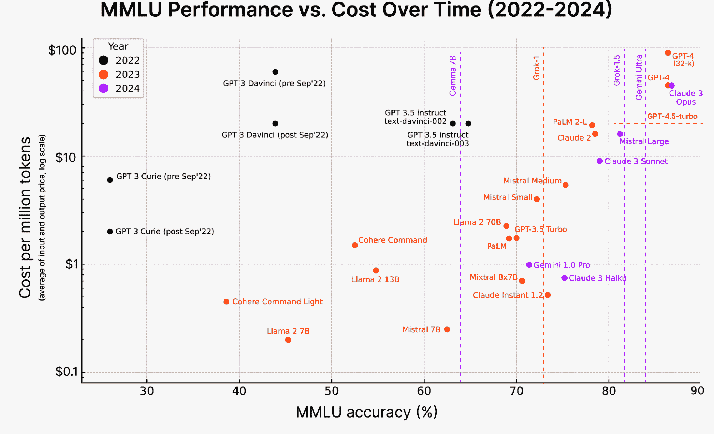
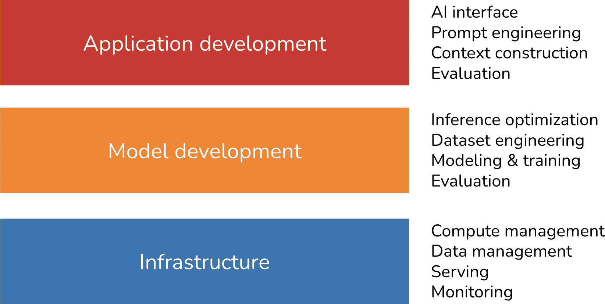

# 第一章\. 基础模型构建人工智能应用的介绍

如果我可以用一个词来描述 2020 年后的 AI，那将是*规模*。ChatGPT、谷歌的 Gemini 和 Midjourney 等应用背后的 AI 模型规模如此之大，以至于它们正在消耗世界上相当一部分的电力，我们面临[用尽公开可用的互联网数据](https://arxiv.org/abs/2211.04325)来训练它们的危险。

AI 模型规模的扩大有两个主要后果。首先，AI 模型变得更加强大，能够执行更多任务，从而启用更多应用。更多的人和团队利用 AI 来提高生产力、创造经济价值，并改善生活质量。

其次，训练大型语言模型（LLMs）需要数据、计算资源和专门人才，只有少数组织能够负担得起。这导致了*模型即服务*的出现：这些少数组织开发的模型现在可供其他人作为服务使用。任何希望利用 AI 来构建应用的人现在都可以使用这些模型来这样做，而无需在构建模型上预先进行投资。

简而言之，对 AI 应用的需求增加了，而构建 AI 应用的门槛降低了。这使得*AI 工程*——在现成模型上构建应用的过程——成为增长最快的工程学科之一。

在机器学习（ML）模型上构建应用并不是什么新鲜事。在 LLM 变得突出之前很久，AI 就已经在推动许多应用，包括产品推荐、欺诈检测和流失预测。尽管许多将 AI 应用投入生产的原理保持不变，但新一代的大规模、现成模型带来了新的可能性和新的挑战，这正是本书的重点。

本章首先概述了基础模型，这是 AI 工程爆炸式增长的关键催化剂。然后，我将讨论一系列成功的 AI 应用案例，每个案例都说明了 AI 擅长什么以及还不擅长什么。随着 AI 能力的每日扩展，预测其未来的可能性变得越来越具有挑战性。然而，现有的应用模式可以帮助揭示今天的机遇，并为我们提供关于 AI 未来可能如何继续被使用的线索。

为了结束这一章，我将提供一个关于新人工智能堆栈的概述，包括基础模型的变化、保持不变的内容，以及今天的 AI 工程师与传统机器学习工程师角色的不同.^(1)

# 人工智能工程的兴起

基础模型是从大型语言模型中产生的，而大型语言模型又起源于语言模型。尽管 ChatGPT 和 GitHub 的 Copilot 等应用似乎突然出现，但它们是几十年技术进步的结晶，最早的语言模型出现在 20 世纪 50 年代。本节追溯了从语言模型到 AI 工程演变的关键突破。

## 从语言模型到大型语言模型

尽管语言模型已经存在了一段时间，但它们只有在**自监督**的帮助下才能发展到今天这样的规模。本节简要概述了语言模型和自监督的含义。如果你已经熟悉这些概念，可以自由跳过本节。

### 语言模型

一个**语言模型**编码了关于一种或多种语言的统计信息。直观地说，这些信息告诉我们一个单词在特定上下文中出现的可能性。例如，给定上下文“我最喜欢的颜色是 __”，一个编码英语的语言模型应该比预测“car”更频繁地预测“blue”。

语言统计性质在几个世纪前就被发现了。在 1905 年的故事《“跳舞男子的冒险”》中，福尔摩斯利用英语的简单统计信息来解码一系列神秘的棍状人形。由于英语中最常见的字母是*E*，福尔摩斯推断最常见的棍状人形必须代表*E*。

之后，克劳德·香农在第二次世界大战期间使用了更复杂的统计方法来破解敌人的信息。他在 1951 年的里程碑式论文《“印刷英语的预测与熵”》中发表了关于如何建模英语的工作。这篇论文中介绍的概念，包括熵，至今仍被用于语言建模。

在早期，语言模型仅涉及一种语言。然而，如今，语言模型可以涉及多种语言。

语言模型的基本单位是**标记**。标记可以是字符、单词或单词的一部分（如-tion），具体取决于模型.^(2) 例如，ChatGPT 背后的模型 GPT-4 将短语“我迫不及待地想构建 AI 应用”分解成九个标记，如图图 1-1 所示。注意，在这个例子中，单词“can’t”被分解成两个标记，*can*和*’t*。你可以在[OpenAI 网站](https://oreil.ly/0QI91)上看到不同 OpenAI 模型如何标记文本。


###### 图 1-1\. GPT-4 如何标记短语的一个示例。

将原始文本分解成标记的过程称为**标记化**。对于 GPT-4 来说，平均标记的长度大约是单词长度的[¾](https://oreil.ly/EYccr)。因此，100 个标记大约相当于 75 个单词。

模型可以处理的全部标记集合是模型的*词汇表*。你可以使用少量标记来构建大量不同的单词，类似于你如何使用字母表中的几个字母来构建许多单词。Mixtral 8x7B 模型有 32,000 个词汇量。GPT-4 的词汇量是[100,256](https://github.com/openai/tiktoken/blob/main/tiktoken/model.py)。标记化方法和词汇量由模型开发者决定。

###### 注意

为什么语言模型使用*标记*作为它们的单位而不是*单词*或*字符*？有三个主要原因：

1.  与字符相比，标记允许模型将单词分解成有意义的组成部分。例如，“cooking”可以被分解成“cook”和“ing”，这两个组成部分都承载着原始单词的一些意义。

1.  因为独特的标记比独特的单词少，这减少了模型的词汇量，使模型更高效（如第二章理解基础模型中讨论的）。

1.  标记还有助于模型处理未知单词。例如，一个虚构的词如“chatgpting”可以被分成“chatgpt”和“ing”，帮助模型理解其结构。标记在比单词更少的单元数和比单个字符更多的意义之间取得平衡。

语言模型主要有两种类型：*掩码语言模型*和*自回归语言模型*。它们根据可以用来预测标记的信息不同而有所区别：

掩码语言模型

掩码语言模型被训练来预测序列中任何位置的缺失标记，*使用缺失标记前后文的信息*。本质上，掩码语言模型被训练来能够填补空白。例如，给定上下文“我的最喜欢的 __ 是蓝色”，掩码语言模型应该预测空白处可能是“颜色”。一个著名的掩码语言模型例子是来自转换器的双向编码器表示，或称为 BERT ([Devlin et al., 2018](https://arxiv.org/abs/1810.04805))。

到目前为止，掩码语言模型通常用于非生成性任务，如情感分析和文本分类。它们对于需要理解整体上下文的任务也很有用，例如代码调试，其中模型需要理解前后代码以识别错误。

自回归语言模型

自回归语言模型被训练来预测序列中的下一个标记，*仅使用前面的标记*。它预测“我的最喜欢的颜色是 __*.*”中的下一个内容^(3)。自回归模型可以不断地生成一个标记接着另一个标记。如今，自回归语言模型是文本生成的首选模型，因此，它们比掩码语言模型更受欢迎.^(4)

图 1-2 展示了这两种类型的语言模型。


###### 图 1-2\. 自回归语言模型和掩码语言模型。

###### 注意

在这本书中，除非明确说明，*语言模型*将指自回归模型。

语言模型的输出是开放式的。语言模型可以使用其固定、有限的词汇构造无限可能的输出。能够生成开放式输出的模型被称为*生成型*，因此有*生成式 AI*这个术语。

你可以将语言模型想象成一个*补全机器*：给定一段文本（提示），它试图完成这段文本。以下是一个例子：

```py
*Prompt (from user)*: "To be or not to be"
*Completion (from language model)*: ", that is the question."

```

需要注意的是，补全是基于概率的预测，并不保证一定是正确的。语言模型的这种概率性质使得它们在使用时既令人兴奋又令人沮丧。我们将在第二章中进一步探讨这一点。

虽然听起来很简单，但补全功能非常强大。许多任务，包括翻译、摘要、编码和解决数学问题，都可以被看作是补全任务。例如，给定提示：“你用法语怎么说……”，语言模型可能能够通过以下方式完成它：“Comment ça va”，从而实现从一种语言到另一种语言的翻译。

作为另一个例子，给定提示：

```py
Question: Is this email likely spam? Here’s the email: <email content>
Answer: 

```

语言模型可能能够通过以下方式完成它：“可能是垃圾邮件”，这使得这个语言模型变成了一个垃圾邮件分类器。

虽然补全功能强大，但补全并不等同于参与对话。例如，如果你向补全机器提问，它可以通过添加另一个问题来补全你所说的话，而不是回答问题。“训练后”讨论了如何使模型能够适当地响应用户的请求。

### 自监督

语言建模只是许多机器学习算法之一。还有用于目标检测、主题建模、推荐系统、天气预报、股票价格预测等的模型。是什么特别之处使得语言模型成为了导致 ChatGPT 时刻的扩展方法的中心？

答案是，语言模型可以使用*自监督*进行训练，而许多其他模型则需要*监督*。监督是指使用标记数据训练机器学习算法的过程，这可能既昂贵又耗时。自监督有助于克服数据标注瓶颈，为模型提供更大的数据集进行学习，从而有效地允许模型扩展。下面是如何做到这一点。

在监督学习中，你标注示例以展示你希望模型学习的行为，然后在这些示例上训练模型。一旦训练完成，模型就可以应用于新数据。例如，为了训练一个欺诈检测模型，你使用标注为“欺诈”或“非欺诈”的交易示例。一旦模型从这些示例中学习，你就可以使用这个模型来预测交易是否欺诈。

2010 年代人工智能模型的成功在于监督学习。启动深度学习革命的模型 AlexNet ([Krizhevsky et al., 2012](https://oreil.ly/WEQFj)) 是经过监督训练的。它被训练来学习如何对数据集 ImageNet 中的超过一百万张图片进行分类。它将每张图片分类到 1,000 个类别之一，例如“汽车”、“气球”或“猴子”。

监督学习的一个缺点是数据标注既昂贵又耗时。如果一个人标注一张图片需要 5 美分，那么为 ImageNet 标注一百万张图片将花费 50,000 美元.^(5) 如果你想让两个人分别标注每张图片——以便交叉检查标注质量——那么成本将是两倍。因为世界上包含的对象远远超过 1,000 个，为了扩展模型以处理更多对象，你需要添加更多类别的标签。要将类别扩展到 1,000 万个，仅标签成本就会增加到 5,000 万美元。

标注日常物体是大多数人无需事先训练就能做到的事情。因此，这可以相对便宜地完成。然而，并非所有标注任务都那么简单。为英语到拉丁语的模型生成拉丁语翻译会更昂贵。判断 CT 扫描是否显示癌症迹象的成本将是天文数字。

自监督学习有助于克服数据标注瓶颈。在自监督学习中，不需要显式标签，模型可以从输入数据中推断标签。语言模型是自监督的，因为每个输入序列都提供了标签（要预测的标记）和模型可以用来预测这些标签的上下文。例如，句子 “I love street food.” 提供了六个训练样本，如 表 1-1 所示。

表 1-1\. 来自句子 “I love street food.” 的语言模型训练样本。

| 输入（上下文） | 输出（下一个标记） |
| --- | --- |
| `<BOS>` | `I` |
| `<BOS>, I` | `love` |
| `<BOS>, I, love` | `street` |
| `<BOS>, I, love, street` | `food` |
| `<BOS>, I, love, street, food` | `.` |
| `<BOS>, I, love, street, food, .` | `<EOS>` |

在 表 1-1 中，<BOS> 和 <EOS> 标记序列的开始和结束。这些标记对于语言模型与多个序列一起工作来说是必要的。每个标记通常被模型视为一个特殊的标记。序列结束标记尤为重要，因为它帮助语言模型知道何时结束其响应.^(6)

###### 备注

自监督学习与无监督学习不同。在自监督学习中，标签是从输入数据中推断出来的。在无监督学习中，你根本不需要标签。

自监督学习意味着语言模型可以在不进行任何标记的情况下从文本序列中学习。因为文本序列无处不在——在书籍、博客文章、文章和 Reddit 评论中——因此可以构建大量的训练数据，使语言模型能够扩展成为 LLM。

然而，LLM 并不是一个科学的术语。一个语言模型需要多大才能被认为是“大”的？今天被认为是大的，明天可能就被视为微小。模型的大小通常通过其参数数量来衡量。*参数*是机器学习模型中的一个变量，它通过训练过程进行更新。7 在一般情况下，尽管这并不总是正确的，但一个模型拥有的参数越多，其学习所需行为的能力就越强。

当 OpenAI 的首个生成式预训练转换器（GPT）模型于 2018 年 6 月发布时，它拥有 1170 万个参数，这被认为是个很大的数字。到了 2019 年 2 月，当 OpenAI 推出拥有 15 亿个参数的 GPT-2 时，1170 万个参数被降级为较小的规模。截至本书撰写时，一个拥有 1000 亿个参数的模型被认为是大的。或许有一天，这个规模将被视为较小。

在我们进入下一节之前，我想提及一个通常被理所当然的问题：*为什么更大的模型需要更多的数据？* 更大的模型有更大的学习能力，因此需要更多的训练数据来最大化其性能。8 你也可以在小型数据集上训练一个大型模型，但这将是计算资源的浪费。你本可以用较小的模型在这个数据集上实现相似或更好的结果。

## 从大型语言模型到基础模型

尽管语言模型能够执行令人难以置信的任务，但它们局限于文本。作为人类，我们不仅通过语言，还通过视觉、听觉、触觉等方式感知世界。对于人工智能在现实世界中的运作来说，能够处理文本之外的数据至关重要。

因此，语言模型正在扩展以包含更多的数据模态。GPT-4V 和 Claude 3 可以理解图像和文本。一些模型甚至可以理解视频、3D 资产、蛋白质结构等等。将更多数据模态纳入语言模型使它们变得更加强大。OpenAI 在 2023 年的 GPT-4V 系统卡片[noted in their GPT-4V system card](https://oreil.ly/NoGX7)中指出，“将额外的模态（如图像输入）纳入 LLM 被一些人视为人工智能研究和开发的关键前沿。”

尽管许多人仍然将 Gemini 和 GPT-4V 称为大型语言模型（LLM），但它们更准确地被描述为[*基础模型*](https://arxiv.org/abs/2108.07258)。单词“基础”既表明了这些模型在人工智能应用中的重要性，也说明了它们可以根据不同的需求进行构建。

基础模型标志着从传统人工智能研究结构中的突破。长期以来，人工智能研究被数据模态所分割。自然语言处理 (NLP) 只处理文本。计算机视觉只处理视觉。仅文本的模型可用于翻译和垃圾邮件检测等任务。仅图像的模型可用于目标检测和图像分类。仅音频的模型可以处理语音识别（语音到文本，或 STT）和语音合成（文本到语音，或 TTS）。

能够处理多个数据模态的模型也称为 *多模态模型*。生成型多模态模型也称为大型多模态模型 (LMM)。如果一个语言模型在仅基于文本标记的条件下生成下一个标记，那么多模态模型将在基于文本和图像标记的条件下生成下一个标记，或者模型支持的任何模态，如图 1-3 所示 图 1-3。


###### 图 1-3\. 多模态模型可以使用来自文本和视觉标记的信息生成下一个标记。

就像语言模型一样，多模态模型也需要数据来扩展规模。自监督对于多模态模型也适用。例如，OpenAI 使用了一种名为 *自然语言监督* 的自监督变体来训练他们的语言-图像模型 [CLIP (OpenAI, 2021)](https://oreil.ly/zcqdu)。他们不是手动为每张图片生成标签，而是在互联网上找到了同时出现的 (图像，文本) 对。他们能够生成包含 4 亿个 (图像，文本) 对的数据集，这个数据集比 ImageNet 大 400 倍，而且没有手动标注的成本。这个数据集使得 CLIP 成为第一个能够泛化到多个图像分类任务而无需额外训练的模型。

###### 注意

本书使用“基础模型”一词来指代大型语言模型和大型多模态模型。

注意到 CLIP 不是一个生成模型——它没有被训练来生成开放式的输出。CLIP 是一个 *嵌入模型*，被训练来产生文本和图像的联合嵌入。“嵌入简介” 详细讨论了嵌入。现在，你可以将嵌入视为旨在捕捉原始数据含义的向量。像 CLIP 这样的多模态嵌入模型是生成型多模态模型（如 Flamingo、LLaVA 和 Gemini（以前称为 Bard））的骨干。

基础模型也标志着从特定任务模型向通用模型的转变。以前，模型通常是为特定任务开发的，例如情感分析或翻译。为情感分析训练的模型无法进行翻译，反之亦然。

*基础模型，得益于其规模和训练方式，能够执行广泛的任务。开箱即用的通用模型在很多任务上可以相对很好地工作。一个大型语言模型可以执行情感分析和翻译。然而，你通常可以调整通用模型以最大化其在特定任务上的性能。*

图 1-4 展示了 Super-NaturalInstructions 基准测试所使用的任务，用于评估基础模型（[王等，2022](https://arxiv.org/abs/2204.07705)），提供了基础模型可以执行的任务类型的一个概念。

想象你正在与一家零售商合作，构建一个用于生成其网站产品描述的应用程序。一个开箱即用的模型可能能够生成准确的产品描述，但可能无法捕捉品牌的语气或突出品牌的宣传信息。生成的描述甚至可能充满了营销话语和陈词滥调。


###### 图 1-4\. Super-NaturalInstructions 基准测试中的任务范围（王等，2022）。

你可以使用多种技术来让模型生成你想要的内容。例如，你可以编写详细的带有期望产品描述示例的指令。这种方法被称为*提示工程*。你可以将模型连接到客户评论数据库，模型可以利用这个数据库生成更好的描述。使用数据库来补充指令被称为*检索增强生成*（RAG）。你还可以对模型进行*微调*——在高质量产品描述数据集上进一步训练模型。

提示工程、RAG（检索增强生成）和微调是三种非常常见的 AI 工程技术，你可以使用它们来调整模型以满足你的需求。本书的其余部分将详细讨论所有这些技术。

将现有的强大模型调整到你的任务上通常比从头开始构建模型要容易得多——例如，十个例子和一个周末与一百万个例子和六个月相比。基础模型使得开发 AI 应用的成本更低，并缩短了上市时间。需要多少数据来调整模型取决于你使用的技术。本书在讨论每种技术时也会涉及这个问题。然而，特定任务的模型仍然有许多好处，例如，它们可能要小得多，这使得它们更快、更便宜。

是构建自己的模型还是利用现有的模型是一个经典的“买或建”问题，团队将不得不自己回答。本书中的讨论可以帮助你做出这个决定。

## 从基础模型到 AI 工程

*AI 工程*指的是在基础模型之上构建应用程序的过程。人们已经构建 AI 应用超过十年——这个过程通常被称为机器学习工程或 MLOps（即机器学习操作）。我们为什么现在谈论 AI 工程？

如果传统的机器学习工程涉及开发机器学习模型，那么 AI 工程则利用现有的模型。强大基础模型的可用性和可访问性导致三个因素，这三个因素共同创造了 AI 工程作为一门学科快速增长的理想条件：

因素 1：通用 AI 能力

基础模型之所以强大，不仅是因为它们能更好地完成现有任务，还因为它们能完成更多任务。以前认为不可能的应用现在成为可能，以前未曾考虑过的应用正在出现。甚至今天认为不可能的应用明天也可能成为可能。这使得 AI 在生活的更多方面变得更有用，极大地增加了用户基础和对 AI 应用的需求。

例如，由于 AI 现在可以像人类一样写作，有时甚至写得更好，AI 可以自动化或部分自动化几乎所有需要沟通的任务，这几乎涵盖了所有事情。AI 被用来撰写电子邮件、回应客户请求和解释复杂的合同。任何拥有电脑的人都可以访问能够即时生成定制、高质量图像和视频的工具，以帮助创建营销材料、编辑专业肖像、可视化艺术概念、插图书籍等等。AI 甚至可以用来合成训练数据、开发算法和编写代码，所有这些都将有助于未来训练更强大的模型。

因素 2：增加的 AI 投资

ChatGPT 的成功促使风险投资家和企业在 AI 领域的投资急剧增加。随着 AI 应用的建设成本降低和上市速度加快，AI 的投资回报变得更加吸引人。公司纷纷将 AI 融入他们的产品和流程中。Scribd 应用研究高级经理 Matt Ross 告诉我，他使用案例的 AI 成本从 2022 年 4 月到 2023 年 4 月下降了两个数量级。

[高盛研究](https://oreil.ly/okMw6)估计，到 2025 年，美国 AI 投资可能达到 1000 亿美元，全球达到 2000 亿美元。9 AI 经常被提及为竞争优势。[FactSet](https://oreil.ly/tgm-a)发现，在 2023 年第二季度财报电话会议中提到 AI 的 S&P 500 公司中，有三分之一，是去年同期的三倍。图 1-5 显示了从 2018 年到 2023 年 S&P 500 公司在财报电话会议中提到 AI 的公司数量。


###### 图 1-5。在 2023 年，提及 AI 的 S&P 500 公司数量达到了历史新高。数据来自 FactSet。

根据 WallStreetZen 的数据，在收益电话中提及 AI 的公司在股价上涨方面超过了那些没有提及的公司：[平均上涨 4.6%，而未提及的公司平均上涨 2.4%](https://oreil.ly/fK5uh)。不清楚这是因果关系（AI 使这些公司更成功）还是相关性（公司之所以成功，是因为它们迅速适应了新技术）。

因素 3：构建 AI 应用的低门槛

由 OpenAI 和其他模型提供商推广的“模型即服务”方法使得利用 AI 构建应用变得更加容易。在这种方法中，模型通过 API 向用户提供查询并返回模型输出。没有这些 API，使用 AI 模型需要基础设施来托管和提供该模型。这些 API 通过单个 API 调用即可访问强大的模型。

不仅如此，AI 还使得用最少的编码就能构建应用成为可能。首先，AI 可以为您编写代码，使那些没有软件工程背景的人能够快速将他们的想法转化为代码，并将其展示给用户。其次，您可以使用这些模型用普通英语而不是编程语言进行工作。*任何人，我是说任何人，现在都可以开发 AI 应用程序*。

由于开发基础模型所需的资源，这个过程仅适用于大型企业（谷歌、Meta、微软、百度、腾讯）、政府（[日本](https://oreil.ly/r86Qz)、[阿联酋](https://oreil.ly/IUcVg)）和雄心勃勃、资金充足的初创公司（OpenAI、Anthropic、Mistral）。在 2022 年 9 月的一次采访中，[OpenAI 首席执行官 Sam Altman](https://oreil.ly/D9QBM) 表示，对于绝大多数人来说，最大的机会将是将这些模型应用于特定应用。

世界迅速拥抱了这个机会。AI 工程迅速成为最快增长，甚至可能是增长最快的工程学科之一。AI 工程工具的吸引力增长速度比以往任何软件工程工具都要快。仅仅两年内，四个开源 AI 工程工具（AutoGPT、Stable Diffusion eb UI、LangChain、Ollama）已经在 GitHub 上的星标数量超过了比特币。它们有望在星标数量上超越最流行的 Web 开发框架，包括 React 和 Vue。图 1-6 展示了与比特币、Vue 和 React 相比，AI 工程工具在 GitHub 上的星标增长情况。

2023 年 8 月的一项 LinkedIn 调查显示，将“生成式 AI”、“ChatGPT”、“提示工程”和“提示制作”等术语添加到其个人资料中的专业人士数量平均每月增加 75%[每月平均增加 75%](https://oreil.ly/m8SvB)。[*《计算机世界》*](https://oreil.ly/47sGE) 宣称，“教 AI 表现是增长最快的职业技能”。


###### 图 1-6\. 根据 GitHub 星数，开源 AI 工程工具的增长速度比任何其他软件工程工具都要快。

人工智能工程师的快速增长的社区展示了令人瞩目的创造力，以及一系列令人兴奋的应用。下一节将探讨一些最常见的应用模式。

# 基础模型用例

如果你还没有开始构建 AI 应用，我希望前面的部分已经说服你现在是做这件事的绝佳时机。如果你已经有了应用的想法，你可能想跳转到“规划 AI 应用”。如果你在寻找灵感，本节涵盖了广泛的行业验证和有前景的用例。

你可以用基础模型构建的潜在应用数量似乎是无限的。无论你想到什么用例，可能都有一个 AI 与之对应.^(10) 列出 AI 的所有潜在用例是不可能的。

对这些用例进行分类本身就具有挑战性，因为不同的调查使用了不同的分类方法。例如，[亚马逊网络服务（AWS）](https://oreil.ly/-k_QX) 将企业生成式 AI 用例分为三个类别：客户体验、员工生产力和流程优化。2024 年 O'Reilly 的调查将用例分为八个类别：编程、数据分析、客户支持、营销文案、其他文案、研究、网页设计和艺术。

一些组织，如[德勤](https://oreil.ly/T272_)，根据价值获取对用例进行了分类，例如成本降低、流程效率、增长和加速创新。对于价值获取，[高德纳](https://oreil.ly/OyIUP) 有一个关于*业务连续性*的类别，这意味着如果组织不采用生成式 AI，它可能会倒闭。在 2023 年高德纳调查的 2500 名高管中，7%的人将业务连续性作为采用生成式 AI 的动机。

[Eloundou 等人（2023）](https://arxiv.org/abs/2303.10130) 对不同职业暴露于 AI 的程度进行了优秀的研究。他们将任务定义为暴露，如果 AI 和 AI 驱动的软件可以至少减少完成此任务所需的时间的 50%。80%暴露的职业意味着该职业的 80%的任务是暴露的。根据这项研究，100%或接近 100%暴露的职业包括口译员和翻译员、税务筹划师、网页设计师和作家。其中一些在表 1-2 中展示。不出所料，没有暴露于 AI 的职业包括厨师、石匠和运动员。这项研究很好地说明了 AI 适合哪些用例。

表 1-2\. 人类标注的最易受 AI 影响的职业。$alpha$ 指的是直接接触 AI 模型，而 $beta$ 和 $zeta$ 指的是接触 AI 软件的影响。表来自 Eloundou 等人（2023）。

| 团队 | 最易受影响的工作 | % 暴露率 |
| --- | --- | --- |

| 人 $alpha$ | 口译员和翻译员 调查研究人员

诗人，歌词作者和创意作家

动物科学家

公关专员 | 76.5 75.0

68.8

66.7

66.7 |

| 人 $beta$ | 调查研究人员 写作人和作者

口译员和翻译员

公关专员

动物科学家 | 84.4 82.5

82.4

80.6

77.8 |

| 人 $zeta$ | 数学家 纳税申报员

金融量化分析师

写作人和作者

网页和数字界面设计师

*人类将 15 个职业标记为“完全暴露”.* | 100.0 100.0

100.0

100.0

100.0 |

在分析应用场景时，我既考虑了企业应用，也考虑了消费者应用。为了了解企业应用场景，我采访了 50 家公司关于他们的 AI 策略，并阅读了超过 100 个案例研究。为了了解消费者应用，我检查了 GitHub 上至少有 500 个星标的 205 个开源 AI 应用.^(11) 我将应用分为八个组，如表 1-3 所示。这里有限的列表最好作为参考。当你从第二章中了解更多关于如何构建基础模型以及如何在第三章中评估它们时，你也将能够更好地了解基础模型可以和应该用于哪些应用场景。

表 1-3\. 消费者和企业应用中常见的生成式 AI 应用场景。

| 类别 | 消费者应用场景示例 | 企业应用场景示例 |
| --- | --- | --- |
| 编码 | 编码 | 编码 |
| 图像和视频制作 | 照片和视频编辑 设计 | 演示文稿 广告生成 |
| 写作 | 电子邮件 社交媒体和博客文章 | 复写，搜索引擎优化（SEO） 报告，备忘录，设计文档 |
| 教育 | 家庭教师 作业评分 | 员工入职 员工技能提升培训 |
| 对话式机器人 | 通用聊天机器人 AI 伴侣 | 客户支持 产品共同飞行员 |
| 信息聚合 | 摘要 文档咨询 | 摘要 市场研究 |
| 数据组织 | 图像搜索 [Memex](https://en.wikipedia.org/wiki/Memex) | 知识管理 文档处理 |
| 工作流程自动化 | 旅行计划 活动策划 | 数据提取，输入和标注 领导生成 |

因为基础模型是通用的，建立在它们之上的应用可以解决许多问题。这意味着一个应用可以属于多个类别。例如，一个机器人可以提供陪伴和聚合信息。一个应用可以帮助您从 PDF 中提取结构化数据并回答有关该 PDF 的问题。

图 1-7 显示了这些用例在 205 个开源应用程序中的分布情况。请注意，教育和数据组织以及写作用例所占的百分比很小，并不意味着这些用例不受欢迎。这仅仅意味着这些应用程序不是开源的。这些应用程序的构建者可能会发现它们更适合企业用例。

)显示，公司部署面向内部的应用程序（内部知识管理）比部署面向外部应用程序（客户支持聊天机器人）要快，如图图 1-8 所示。内部应用程序有助于公司发展其 AI 工程专业知识，同时最大限度地降低与数据隐私、合规性和潜在灾难性故障相关的风险。同样，虽然基础模型是开放式的，可以用于任何任务，但许多建立在它们之上的应用程序仍然是封闭式的，例如分类。分类任务更容易评估，这使得其风险更容易估计。

。截至本文撰写时，AI 驱动的编码初创公司已经筹集了数亿美元，其中[Magic 筹集了 3.2 亿美元](https://oreil.ly/t0xDf)和[Anysphere 筹集了 6000 万美元](https://oreil.ly/BW5Hk)，两者均在 2024 年 8 月。开源编码工具如[gpt-engineer](https://github.com/gpt-engineer-org/gpt-engineer)和[screenshot-to-code](https://github.com/abi/screenshot-to-code)在 GitHub 上一年内都获得了 50,000 颗星，还有更多正在迅速推出。

除了帮助一般编码的工具外，许多工具专门用于某些编码任务。以下是一些这些任务的例子：

+   从网页和 PDF 中提取结构化数据 ([AgentGPT](https://github.com/reworkd/AgentGPT))

+   将英语转换为代码 ([DB-GPT](https://github.com/eosphoros-ai/DB-GPT), [SQL Chat](https://github.com/sqlchat/sqlchat), [PandasAI](https://github.com/Sinaptik-AI/pandas-ai))

+   给定一个设计或截图，生成将渲染成类似给定图像（截图转代码，[draw-a-ui](https://github.com/sawyerhood/draw-a-ui)）的网站上的代码

+   将一种编程语言或框架翻译成另一种 ([GPT-Migrate](https://github.com/joshpxyne/gpt-migrate), [AI Code Translator](https://github.com/mckaywrigley/ai-code-translator))

+   编写文档 ([Autodoc](https://github.com/context-labs/autodoc))

+   创建测试 ([PentestGPT](https://github.com/GreyDGL/PentestGPT))

+   生成提交信息 ([AI Commits](https://github.com/Nutlope/aicommits))

很明显，人工智能可以完成许多软件工程任务。问题是人工智能是否可以完全自动化软件工程。在光谱的一端，[英伟达(NVIDIA)首席执行官黄仁勋](https://oreil.ly/zUpGu)预测，人工智能将取代人类软件工程师，我们应该停止说孩子们应该学习编程。在一篇泄露的录音中，[AWS 首席执行官马特·加曼](https://oreil.ly/Hz_3i)表示，在不久的将来，大多数开发者将停止编码。他并不是说软件开发者会消失；只是他们的工作会发生变化。

在另一端，许多软件工程师坚信他们永远不会被人工智能取代，无论是从技术还是情感上（人们不喜欢承认自己可以被取代）。

软件工程包括许多任务。人工智能在某些任务上比其他任务做得更好。麦肯锡([McKinsey](https://oreil.ly/aqUmX))的研究人员发现，人工智能可以帮助开发者将文档的效率提高一倍，在代码生成和代码重构方面提高 25-50% 的效率。对于高度复杂的任务，观察到的最小生产力提升，如图 1-9(Figure 1-9) 所示。在与人工智能编码工具的开发者交谈中，许多人告诉我，他们注意到人工智能在前端开发方面比后端开发做得更好。


###### 图 1-9\. 人工智能可以帮助开发者显著提高生产力，尤其是在简单任务上，但对于高度复杂的任务，这种效果就不那么明显了。数据来源：麦肯锡。

无论人工智能是否会取代软件工程师，人工智能肯定可以使他们更加高效。这意味着公司现在可以用更少的工程师完成更多的工作。人工智能还可以颠覆外包行业，因为外包的任务往往是公司核心业务之外更简单的任务。

## 图像和视频制作

由于其概率性质，AI 非常适合创意任务。一些最成功的 AI 初创公司是创意应用，例如 Midjourney 用于图像生成、Adobe Firefly 用于照片编辑，以及 Runway、Pika Labs 和 Sora 用于视频生成。到 2023 年底，Midjourney 成立不到一年半，已经创造了 2 亿美元的年度经常性收入。截至 2023 年 12 月，在苹果 App Store 图形与设计类前 10 名免费应用中，有一半在其名称中包含 AI。我怀疑不久的将来，图形和设计应用将默认集成 AI，它们的名字将不再需要包含“AI”这个词。第二章更详细地讨论了 AI 的概率性质。

现在在社交媒体上使用 AI 生成个人头像已经变得很常见，从 LinkedIn 到 TikTok。许多求职者认为，AI 生成的头像可以帮助他们展示最好的自己，并[增加找到工作的机会](https://oreil.ly/fZLVg)。人们对 AI 生成头像的看法已经发生了显著变化。2019 年，[Facebook](https://oreil.ly/WNqUw)出于安全考虑禁止使用 AI 生成的头像的账户。到了 2023 年，许多社交媒体应用提供了让用户使用 AI 生成头像的工具。

对于企业来说，广告和营销迅速地采用了 AI。^([12)] AI 可以直接生成促销图像和视频。它可以帮助头脑风暴想法或为人类专家生成初步草案进行迭代。你可以使用 AI 生成多个广告并测试哪个最适合受众。AI 可以根据季节和地点生成你广告的变体。例如，你可以在秋天使用 AI 改变树叶颜色，或在冬天给地面添加雪。

## 写作

AI 长期以来一直被用来辅助写作。如果你使用智能手机，你可能熟悉自动纠错和自动完成，这两者都是由 AI 驱动的。写作是 AI 的理想应用，因为我们经常这样做，它可能相当枯燥，而且我们对错误有很高的容忍度。如果一个模型建议了你不喜欢的东西，你只需忽略它即可。

考虑到 LLMs 是为了文本补全而训练的，它们擅长写作也就不足为奇了。为了研究 ChatGPT 对写作的影响，麻省理工学院的一项研究（[Noy 和 Zhang，2023](https://oreil.ly/IzQ6F)）将特定职业的写作任务分配给 453 名受过大学教育的专业人士，并将其中一半人随机暴露于 ChatGPT。他们的结果显示，在接触 ChatGPT 的人中，平均用时减少了 40%，输出质量提高了 18%。ChatGPT 有助于缩小工人之间输出质量的差距，这意味着它对写作倾向较弱的人更有帮助。在实验中接触 ChatGPT 的工人，在实验两周后报告在真实工作中使用 ChatGPT 的可能性是未接触者的两倍，两个月后是 1.6 倍。

对于消费者来说，使用案例很明显。许多人使用 AI 来帮助他们更好地沟通。你可以在电子邮件中表达愤怒，并让 AI 使其变得愉快。你可以给出要点，然后得到完整的段落。有几个人声称他们现在在发送重要邮件之前，都会先让 AI 进行改进。

学生正在使用 AI 来撰写论文。作家正在使用 AI 来创作书籍.^(13) 许多初创公司已经使用 AI 来生成儿童、同人小说、浪漫和奇幻书籍。与传统的书籍不同，AI 生成的书籍可以互动，因为一本书的情节可以根据读者的偏好而改变。这意味着读者可以积极参与创造他们正在阅读的故事。一个儿童阅读应用会识别孩子有困难的地方，并围绕这些单词生成故事。

记笔记和电子邮件应用，如 Google Docs、Notion 和 Gmail，都使用 AI 帮助用户提升写作能力。[Grammarly](https://arxiv.org/abs/2305.09857)，一款写作助手应用，通过微调模型使用户的写作更加流畅、连贯和清晰。

AI 的写作能力也可能被滥用。2023 年，[《纽约时报》](https://oreil.ly/LB72P) 报道称，亚马逊充斥着质量低劣的 AI 生成的旅行指南书籍，每本书都配有作者简介、网站和好评，这些都是 AI 生成的。

对于企业来说，AI 写作在销售、营销和团队沟通中很常见。许多经理告诉我，他们一直在使用 AI 帮助他们撰写绩效报告。AI 可以帮助撰写有效的冷邮件、广告文案和产品描述。客户关系管理（CRM）应用如 HubSpot 和 Salesforce 也为企业用户提供生成网页内容和外联邮件的工具。

自动生成的描述](assets/aien_0110.png)

## 教育

每当 ChatGPT 出现故障时，OpenAI 的 Discord 服务器就会被学生抱怨无法完成作业的投诉所淹没。包括纽约市公立学校和洛杉矶联合学区在内的几个教育委员会迅速[禁止 ChatGPT](https://oreil.ly/pqI5z)，担心学生会用它来作弊，但几个月后[撤销了他们的决定](https://oreil.ly/nxtzw)。

学校与其禁止人工智能，不如将其融入教学中以帮助学生更快地学习。人工智能可以总结教科书并为每个学生生成个性化的讲义。我发现广告个性化很奇怪，因为我们知道每个人都是不同的，但教育不是。人工智能可以帮助调整材料，使其最适合每个学生。听觉学习者可以让人工智能大声朗读材料。喜欢动物的学生可以使用人工智能来调整可视化，使其包含更多动物。那些觉得阅读代码比数学方程式更容易的人可以让人工智能将数学方程式翻译成代码。

自动生成的描述](assets/aien_0110.png)

人工智能似乎特别擅长 SEO，这可能是因为许多人工智能模型都是用来自互联网的数据进行训练的，而互联网上充满了 SEO 优化的文本。人工智能在 SEO 方面做得如此之好，以至于它已经催生了一代新的内容农场。这些农场建立垃圾网站，并用人工智能生成的内容填充它们，以便在 Google 上获得高排名，从而吸引流量。然后他们通过广告交易所出售广告位。2023 年 6 月，[NewsGuard](https://oreil.ly/mZKjr)识别出 141 个流行品牌在垃圾人工智能生成网站上发布的近 400 条广告。其中一家垃圾网站每天产生 1,200 篇文章。除非采取措施遏制这种情况，否则互联网内容的未来将是人工智能生成的，而且前景会很暗淡。14

人工智能在语言学习方面特别有用，你可以要求人工智能进行不同场景的模拟练习。[Pajak 和 Bicknell（Duolingo，2022）](https://oreil.ly/C8kmI)发现，在课程创建的四个阶段中，课程个性化是能够从人工智能中获得最大益处的阶段，如图 1-10 所示。

###### 图 1-10\. 在 Duolingo 的整个四个课程创建阶段中都可以使用人工智能，但在个性化阶段最为有用。图片来自 Pajak 和 Bicknell（Duolingo，2022）。

人工智能可以生成测验，包括多项选择和开放式问题，并评估答案。人工智能可以成为辩论伙伴，因为它在呈现同一主题的不同观点方面比普通人要好得多。例如，[可汗学院](https://oreil.ly/tC7-g)为学生提供[人工智能辅助](https://oreil.ly/_N1JR)的教学助理，为教师提供课程助理。我看到的一种创新教学方法是，教师布置人工智能生成的论文让学生去寻找和纠正错误。

当许多教育公司拥抱 AI 来构建更好的产品时，许多公司发现他们的午餐被 AI 抢走了。例如，帮助学生的 Chegg 公司，在 ChatGPT 于 2022 年 11 月推出时，股价从 28 美元暴跌至 2024 年 9 月的 2 美元，因为[学生已经开始转向 AI 寻求帮助](https://oreil.ly/Y-hBW)。

如果风险是 AI 可以取代许多技能，那么机会是 AI 可以用作导师来学习任何技能。对于许多技能，AI 可以帮助某人快速掌握，然后继续自学，以超越 AI。

## 对话机器人

对话机器人是多才多艺的。它们可以帮助我们找到信息，解释概念，激发想法。AI 可以成为你的伴侣和治疗师。它可以模仿个性，让你与任何你喜欢的人的数字副本交谈。数字男女朋友在极短的时间内变得异常流行。许多人已经花更多的时间与机器人交谈，而不是与人交谈（参见[这里](https://oreil.ly/dZbym)和[这里](https://oreil.ly/svWj8)的讨论）。有些人担心 AI 会[破坏](https://oreil.ly/SNme7)[约会](https://oreil.ly/Jbt4R)。

在研究中，人们还发现他们可以使用一组对话机器人来模拟一个社会，使他们能够对社会动态进行研究 ([Park et al., 2023](https://arxiv.org/abs/2304.03442))。

对于企业来说，最受欢迎的机器人是客户支持机器人。它们可以帮助公司节省成本，同时提高客户体验，因为它们可以比人类代理更快地响应用户。AI 还可以作为产品副驾驶，引导客户完成痛苦和令人困惑的任务，例如提交保险索赔、做税务或查找公司政策。

ChatGPT 的成功引发了一波基于文本的对话机器人的热潮。然而，文本并不是对话代理的唯一界面。像 Google Assistant、Siri 和 Alexa 这样的语音助手已经存在多年。15 3D 对话机器人已经在游戏领域变得很常见，并在零售和营销领域获得了势头。

AI 驱动的 3D 角色的一种用途是智能 NPC，非玩家角色（参见 NVIDIA 的[Inworld](https://oreil.ly/yn-DN)和[Convai](https://oreil.ly/zAHwz)演示）。16 NPC 对于推进许多游戏的故事情节至关重要。没有 AI，NPC 通常被编写成执行简单的动作，对话范围有限。AI 可以使这些 NPC 变得更加智能。智能机器人可以改变现有游戏如*模拟人生*和*天际*的动态，以及使以前从未可能的新游戏成为可能。

## 信息聚合

许多人认为我们的成功取决于我们过滤和消化有用信息的能力。然而，跟上电子邮件、Slack 消息和新闻有时可能会感到压倒性。幸运的是，人工智能及时出现。人工智能已被证明能够聚合信息并总结信息。根据[Salesforce 的 2023 年生成式 AI 快照研究](https://oreil.ly/74soT)，74%的生成式 AI 用户使用它来提炼复杂思想和总结信息。

对于消费者来说，许多应用程序可以处理您的文档——合同、披露、论文——并以对话的方式让您检索信息。这种用例也被称为*与文档对话*。人工智能可以帮助您总结网站、研究和创建关于您选择主题的报告。在撰写这本书的过程中，我发现人工智能在总结和比较论文方面非常有帮助。

信息聚合和提炼对企业运营至关重要。更有效的信息聚合和提炼可以帮助组织变得更加精简，因为它减轻了中层管理的负担。当[Instacart](https://oreil.ly/Qq5-g)推出内部提示市场时，它发现最受欢迎的提示模板之一是“快速分解”。这个模板要求人工智能用事实、开放问题和行动项来总结会议记录、电子邮件和 Slack 对话。然后，这些行动项可以自动插入到项目跟踪工具中，并分配给正确的负责人。

人工智能可以帮助您揭示有关潜在客户的关键信息，并对您的竞争对手进行分析。

您收集的信息越多，组织它们的重要性就越大。信息聚合与数据组织相辅相成。

## 数据组织

关于未来的一件事是，我们将继续产生越来越多的数据。智能手机用户将继续拍照和录像。公司将继续记录有关其产品、员工和客户的一切。每年都会创建数十亿份合同。照片、视频、日志和 PDF 都是非结构化或半结构化数据。将所有这些数据组织成可以稍后搜索的方式至关重要。

人工智能可以在这方面提供帮助。人工智能可以自动生成关于图像和视频的文本描述，或帮助匹配与查询匹配的视觉内容。像 Google Photos 这样的服务已经使用人工智能来揭示与搜索查询匹配的图像。17 Google 图像搜索更进一步：如果不存在与用户需求匹配的现有图像，它可以生成一些。

人工智能在数据分析方面非常出色。它可以编写程序生成数据可视化、识别异常值和进行预测，如收入预测。18

企业可以使用人工智能从非结构化数据中提取结构化信息，这些信息可以用来组织数据并帮助搜索。简单的用例包括从信用卡、驾照、收据、票务、电子邮件页脚中的联系信息等自动提取信息。更复杂的用例包括从合同、报告、图表等中提取数据。据估计，智能数据处理（IDP）行业将在 2030 年达到[128.1 亿美元](https://oreil.ly/vnDNK)，每年增长 32.9%。

## 工作流程自动化

最终，人工智能应该尽可能地自动化。对于终端用户来说，自动化可以帮助处理一些无聊的日常任务，如预订餐厅、请求退款、规划旅行和填写表格。

对于企业来说，人工智能可以自动化重复性任务，如潜在客户管理、发票、报销、管理客户请求、数据录入等。一个特别令人兴奋的用例是使用人工智能模型合成数据，然后可以用这些数据来改进模型本身。你可以使用人工智能为你的数据创建标签，并引入人类来改进这些标签。我们在第八章中讨论了数据合成。

完成许多任务需要访问外部工具。为了预订餐厅，一个应用程序可能需要权限打开搜索引擎查找餐厅的电话号码，使用你的手机打电话，并将预约添加到你的日历中。能够规划和使用工具的人工智能被称为*代理*。人们对代理的兴趣几乎到了痴迷的地步，但这并非毫无根据。人工智能代理有潜力使每个人的生产力大幅提高，并产生巨大的经济价值。代理是第六章中的一个中心主题。

探索不同的人工智能应用非常有趣。我最喜欢幻想的事情之一是我可以构建的不同应用。然而，并不是所有的应用都应该被构建。下一节将讨论在构建人工智能应用之前我们应该考虑什么。

# 计划人工智能应用

鉴于人工智能看似无限的潜力，人们可能会迫不及待地开始构建应用程序。如果你只是想学习和娱乐，那就直接开始吧。构建是学习最好的方式之一。在基础模型早期，几位人工智能负责人告诉我，他们鼓励他们的团队尝试人工智能应用程序以提高技能。

然而，如果你以此为生，可能值得退一步思考你为什么要构建这个，以及你应该如何着手。使用基础模型构建一个酷炫的演示很容易。但要创造一个有利可图的产物则很难。

## 用例评估

首先要问的问题是为什么你想开发这个应用程序。像许多商业决策一样，构建人工智能应用程序通常是对风险和机遇的回应。以下是一些不同层次的风险示例，按从高到低的顺序排列：

1.  *如果你不这样做，拥有人工智能的竞争对手可能会使你过时。* 如果人工智能对你的业务构成重大的生存威胁，那么将人工智能纳入优先考虑范围是必须的。在 2023 年 [Gartner 研究报告](https://oreil.ly/gqi3d)中，7% 的受访者将业务连续性作为他们采用人工智能的原因。这在涉及文档处理和信息聚合的业务中更为常见，例如财务分析、保险和数据处理。这在广告、网页设计和图像制作等创意工作中也很常见。你可以参考 2023 年 OpenAI 的研究，“GPTs are GPTs” ([Eloundou 等人，2023](https://arxiv.org/abs/2303.10130))，以了解各行业在人工智能暴露度方面的排名。

1.  *如果你不这样做，你将错失提升利润和生产力的机会。* 大多数公司都拥抱人工智能带来的机遇。人工智能可以帮助大多数，如果不是所有业务运营。人工智能可以通过制作更有效的文案、产品描述和促销视觉内容来降低用户获取成本。人工智能可以通过改善客户支持和定制用户体验来提高用户保留率。人工智能还可以帮助销售线索生成、内部沟通、市场研究和竞争对手跟踪。

1.  *你还不确定人工智能将如何融入你的业务，但你不想落后。* 虽然公司不应该追逐每一个炒作的潮流，但许多公司因为等待太久才采取行动而失败（提示：柯达、百老汇和黑莓）。如果你负担得起，投资资源去理解一种新的、变革性的技术如何影响你的业务并不是一个坏主意。在更大的公司中，这可能是研发部门的一部分.^(19)

一旦你找到了开发这个用例的好理由，你可能需要考虑是否必须自己构建它。如果你的业务面临生存威胁，你可能希望内部进行人工智能开发而不是外包给竞争对手。然而，如果你正在使用人工智能来提高利润和生产率，你可能有很多购买选择，这些选择可以为你节省时间和金钱，同时提供更好的性能。

### 人工智能和人类在应用中的作用

人工智能在人工智能产品中的作用会影响应用程序的开发及其需求。[苹果](https://oreil.ly/Dz1HE) 有一个很好的文档，解释了人工智能在产品中可以以不同的方式使用。以下是当前讨论相关的三个关键点：

临界或补充

如果一个应用没有人工智能仍然可以工作，那么人工智能就是应用的补充。例如，没有人工智能驱动的面部识别，Face ID 就无法工作，而 Gmail 没有智能草稿功能仍然可以工作。

AI 对应用程序越重要，AI 部分的准确性和可靠性就必须越高。当 AI 不是应用程序的核心时，人们更愿意接受错误。

反应性或主动性

反应性功能会在用户请求或特定动作的反应中展示其响应，而主动性功能会在有机会时展示其响应。例如，聊天机器人是反应性的，而谷歌地图上的交通警报是主动性的。

由于反应性功能是对事件做出的响应，它们通常需要快速发生，但并非总是如此。另一方面，主动性功能可以预先计算并在机会出现时展示，因此延迟不那么重要。

由于用户不会要求主动性功能，如果质量低，他们可能会将其视为侵扰或令人讨厌。因此，主动预测和生成通常有更高的质量标准。

动态或静态

动态功能会根据用户反馈不断更新，而静态功能会定期更新。例如，面部识别需要根据人们随时间变化的面部进行更新。然而，谷歌照片中的对象检测可能只有在谷歌照片升级时才会更新。

在人工智能的情况下，动态功能可能意味着每个用户都有自己的模型，他们的数据会不断微调，或者有其他个性化机制，例如 ChatGPT 的记忆功能，允许 ChatGPT 记住每个用户的偏好。然而，静态功能可能为用户组使用一个模型。如果是这样，这些功能仅在共享模型更新时才会更新。

也很重要的是要明确人类在应用程序中的作用。AI 是否会为人类提供背景支持，直接做出决策，或者两者兼而有之？例如，对于客户支持聊天机器人，AI 响应可以以不同的方式使用：

+   AI 展示出几个响应，供人类代理参考以更快地撰写响应。

+   AI 只响应简单请求，并将更复杂的请求路由给人类。

+   AI 直接响应所有请求，无需人类参与。

将人类纳入人工智能的决策过程中被称为*人机交互*。

微软（2023）提出了一种框架，用于逐步增加产品中的 AI 自动化，他们称之为[Crawl-Walk-Run](https://oreil.ly/JW4_A)：

1.  “爬行”意味着人类参与是强制性的。

1.  “步行”意味着 AI 可以直接与内部员工互动。

1.  “奔跑”意味着自动化程度提高，可能包括直接与外部用户进行 AI 交互。

随着人工智能系统质量的提高，人类的作用可能会随时间而改变。例如，在开始时，当你还在评估人工智能能力时，你可能会用它来为人类代理生成建议。如果人类代理的接受率很高，例如，95%的 AI 建议对简单请求的响应被人类代理直接使用，你可以让客户直接与 AI 进行这些简单请求的交互。

### 人工智能产品防御性

如果你将人工智能应用作为独立产品销售，考虑其防御性是非常重要的。低门槛既是祝福也是诅咒。如果你能轻易地构建某个产品，你的竞争对手也能轻易地做到。你有什么护城河来保护你的产品？

从某种意义上说，在基础模型之上构建应用程序意味着在这些模型之上提供一层。这也意味着，如果底层模型在能力上扩展，你提供的层可能会被模型所吸收，使你的应用程序过时。想象一下，基于 ChatGPT 无法很好地解析 PDF 或无法大规模解析 PDF 的假设，在 ChatGPT 之上构建 PDF 解析应用程序。如果这个假设不再成立，你的竞争力将减弱。然而，即使在这种情况下，如果 PDF 解析应用程序是基于开源模型构建的，面向那些希望内部托管模型的用户，它可能仍然是有意义的。

一家主要风险投资公司的一位普通合伙人告诉我，她见过许多初创公司的整个产品本可以是 Google Docs 或 Microsoft Office 的功能。如果他们的产品起飞，什么能阻止 Google 或 Microsoft 在两周内分配三名工程师来复制这些产品？

在人工智能领域，通常有三种类型的竞争优势：技术、数据和分发——将你的产品展示给用户的能力。随着基础模型的出现，大多数公司的核心技术将相似。分销优势可能属于大公司。

数据优势更为复杂。大公司可能拥有更多现有数据。然而，如果一家初创公司能先进入市场并收集足够的用户数据以不断改进其产品，数据将成为其护城河。即使在用户数据不能直接用于训练模型的情况下，使用信息也能提供关于用户行为和产品不足的宝贵见解，这些见解可用于指导数据收集和训练过程.^(21)

已有许多成功公司，其原始产品本可以是更大产品的一部分。Calendly 本可以是 Google 日历的一部分。Mailchimp 本可以是 Gmail 的一部分。Photoroom 本可以是 Google 照片的一部分.^(22) 许多初创公司最终超越了更大的竞争对手，开始时是构建这些大公司忽视的功能。也许你的公司可以成为下一个。

## 设定期望

一旦你决定需要自己构建这个令人惊叹的人工智能应用，下一步就是弄清楚成功是什么样子：你将如何衡量成功？最重要的指标是这将如何影响你的业务。例如，如果是一个客户支持聊天机器人，业务指标可以包括以下内容：

+   你希望聊天机器人自动化多少比例的客户消息？

+   聊天机器人应该允许你处理多少条消息？

+   使用聊天机器人你能有多快地做出回应？

+   聊天机器人能为你节省多少人力？

聊天机器人可以回答更多消息，但这并不意味着它会使用户感到高兴，因此跟踪客户满意度和一般客户反馈非常重要。“用户反馈”讨论了如何设计反馈系统。

为了确保产品在准备就绪之前不会出现在客户面前，你需要对其有用性门槛有明确预期：它必须有多好才能变得有用。有用性门槛可能包括以下指标组：

+   质量指标用于衡量聊天机器人响应的质量。

+   延迟指标包括 TTFT（首次标记时间）、TPOT（每输出标记时间）和总延迟。可接受的延迟取决于你的用例。如果你的所有客户请求目前都由人工处理，平均响应时间为一小时，那么任何比这更快的速度可能就足够好了。

+   成本指标：每推理请求的成本。

+   其他指标，如可解释性和公平性。

如果你还没有确定想要使用哪些指标，不要担心。本书的其余部分将涵盖许多这些指标。

## 里程碑规划

一旦你设定了可衡量的目标，你需要一个计划来实现这些目标。如何达到目标取决于你的起点。评估现有模型以了解其能力。现成的模型越强大，你需要做的努力就越少。例如，如果你的目标是自动化 60%的客户支持工单，而你想要使用的现成模型已经可以自动化 30%的工单，那么你需要付出的努力可能比它完全不能自动化工单的情况要少。

评估之后，你的目标很可能会发生变化。例如，评估后，你可能意识到将应用提升到有用性门槛所需的资源可能会超过其潜在回报，因此，你可能不再想继续追求它。

计划人工智能产品需要考虑其最后一英里挑战。在基础模型上的初步成功可能会误导人。因为基础模型的基本能力已经相当令人印象深刻，所以构建一个有趣的演示可能不需要太多时间。然而，一个好的初始演示并不能保证最终产品的质量。构建一个演示可能只需要一个周末，但构建一个产品可能需要数月甚至数年。

在论文 UltraChat 中，[Ding 等人 (2023)](https://arxiv.org/abs/2305.14233) 分享了“从 0 到 60 的旅程很容易，而从 60 到 100 的进步变得极其困难。” [LinkedIn (2024)](https://www.linkedin.com/blog/engineering/generative-ai/musings-on-building-a-generative-ai-product) 也表达了同样的观点。他们花了一个月时间实现了他们想要的 80% 的体验。这种初步的成功使他们大大低估了改进产品所需的时间。他们发现，要最终超过 95%，他们还需要再花四个月时间。他们在产品的小问题和工作上的幻觉处理上花费了大量时间。每次获得后续 1% 的进步速度缓慢，这令人沮丧。

## 维护

产品规划不仅仅是为了实现目标。你需要考虑这个产品随着时间的推移可能会如何变化，以及它应该如何维护。维护人工智能产品面临的额外挑战是人工智能快速变化的速度。在过去十年中，人工智能领域发展非常迅速。它可能会在接下来的十年中继续快速发展。在今天建立在基础模型之上意味着承诺乘坐这趟子弹列车。

许多变化都是好的。例如，许多模型的局限性正在得到解决。上下文长度正在变长。模型输出正在变得更好。模型 *推理*，即给定输入计算输出的过程，正在变得更快、更便宜。图 1-11 展示了在 2022 年至 2024 年间，在流行的基础模型基准 Massive Multitask Language Understanding (MMLU) ([Hendrycks et al., 2020](https://arxiv.org/abs/2009.03300)) 上的推理成本和模型性能的演变。



###### 图 1-11\. 人工智能推理的成本随时间迅速下降。图片来自 [Katrina Nguyen](https://oreil.ly/UyL8r) (2024)。

然而，即使是这些良好的变化也可能在你的工作流程中引起摩擦。你必须时刻保持警惕，并对每一项技术投资进行成本效益分析。今天可能是最佳选择，但明天可能变成最差选择。你可能会决定内部构建模型，因为它看起来比支付模型提供商的费用更便宜，但三个月后发现模型提供商将价格降了一半，使得内部模型变得昂贵。你可能会投资第三方解决方案，并围绕它调整你的基础设施，但提供商可能因为未能获得资金而倒闭。

一些变化更容易适应。例如，随着模型提供商趋向于相同的 API，用一个模型 API 替换另一个模型 API 变得越来越容易。然而，由于每个模型都有其独特的特点、优势和劣势，与新型模型一起工作的开发者需要调整他们的工作流程、提示和数据以适应这个新模型。如果没有适当的版本管理和评估基础设施，这个过程可能会引起很多麻烦。

一些变化更难适应，尤其是那些与法规相关的变化。对于许多国家来说，围绕人工智能的技术被视为国家安全问题，这意味着人工智能的资源，包括计算、人才和数据，都受到严格的监管。例如，欧洲通用数据保护条例（GDPR）的实施，据估计将使企业花费[90 亿美元](https://oreil.ly/eDfB8)来达到合规标准。计算资源的可用性可能会一夜之间发生变化，因为新的法律对谁可以购买和销售计算资源施加了更多限制（参见[美国 2023 年 10 月行政命令](https://oreil.ly/eYTmr)）。如果你的 GPU 供应商突然被禁止向你的国家销售 GPU，那你就有麻烦了。

一些变化甚至可能是致命的。例如，关于知识产权（IP）和人工智能使用的法规仍在不断发展。如果你在其他人训练的模型之上构建你的产品，你能确定你的产品的 IP 将始终属于你吗？我交谈过的许多知识产权密集型公司，如游戏工作室，都犹豫不决地使用人工智能，因为他们担心以后会失去他们的知识产权。

一旦你决定构建人工智能产品，让我们来看看构建这些应用程序所需的工程堆栈。

# 人工智能工程堆栈

人工智能工程领域的快速发展也引发了大量的炒作和 FOMO（错失恐惧）。每天推出的新工具、技术、模型和应用数量可能令人难以承受。与其试图跟上不断变化的沙子，不如让我们来看看人工智能工程的基本构建块。

要理解人工智能工程，重要的是要认识到人工智能工程是从机器学习工程演变而来的。当一家公司开始尝试使用基础模型时，其现有的机器学习团队领导这项工作是很自然的。一些公司将人工智能工程视为与机器学习工程相同，如图 1-12 所示。


###### 图 1-13\. 一些公司为 AI 工程有单独的职位描述，如 2023 年 12 月 17 日在 LinkedIn 上的职位标题所示。

## 人工智能堆栈的三个层次

任何 AI 应用程序堆栈都有三个层次：应用程序开发、模型开发和基础设施。在开发 AI 应用程序时，你可能会从顶层开始，根据需要向下移动：

应用程序开发

由于模型随时可用，任何人都可以使用它们来开发应用程序。这是在过去两年中活动最频繁的层次，并且仍在快速发展。应用程序开发涉及为模型提供良好的提示和必要的上下文。这一层需要严格的评估。好的应用程序也要求良好的接口。

模型开发

这一层为模型开发提供工具，包括建模、训练、微调和推理优化的框架。由于数据是模型开发的核心，这一层还包含数据集工程。模型开发也需要严格的评估。

基础设施

在底层是基础设施，包括模型服务、数据管理和计算监控的工具。

这三个层次以及每个层次的责任示例显示在图 1-14 中。



###### 图 1-14\. AI 工程堆栈的三个层次。

为了了解基础模型如何推动这一领域的发展，我在 2024 年 3 月搜索了 GitHub 上所有至少有 500 个星标的 AI 相关存储库。鉴于 GitHub 的普及，我相信这些数据是理解生态系统的良好代理。在我的分析中，我还包括了应用程序和模型的存储库，它们分别是应用程序开发和模型开发层次的产物。我总共找到了 920 个存储库。图 1-15 显示了每个月每个类别的存储库累计数量。


###### 图 1-15\. 随时间推移按类别划分的存储库累计数量。

数据显示，在引入 Stable Diffusion 和 ChatGPT 之后，2023 年 AI 工具的数量大幅增加。2023 年，增长最快的类别是应用和应用开发。基础设施层也有所增长，但远低于其他层的增长。这是预期的。尽管模型和应用已经改变，但核心基础设施需求——资源管理、服务、监控等——仍然相同。

这引出了下一个观点。虽然围绕基础模型的兴奋和创造力是前所未有的，但构建 AI 应用的原则仍然相同。对于企业用例，AI 应用仍然需要解决业务问题，因此，将业务指标映射到机器学习指标以及反之亦然仍然至关重要。您仍然需要进行系统性的实验。在传统的机器学习工程中，您通过不同的超参数进行实验。在基础模型中，您通过不同的模型、提示、检索算法、采样变量等进行实验。（采样变量将在第二章中讨论。）我们仍然希望使模型运行得更快、更便宜。设置反馈循环仍然很重要，这样我们就可以使用生产数据迭代地改进我们的应用。

这意味着过去十年中机器学习工程师所学习和分享的许多内容仍然适用。这种集体经验使得每个人开始构建 AI 应用变得更加容易。然而，在这些持久的原则之上，还有许多独特的 AI 工程创新，我们将在本书中探讨。

## AI 工程与机器学习工程的比较

虽然部署 AI 应用的不可变原则令人安心，但了解事情是如何改变的也很重要。这对希望为新的 AI 用例调整现有平台和希望在新市场中保持竞争力的开发者来说很有帮助。

在高层次上，今天使用基础模型构建应用与传统机器学习工程在三个方面有所不同：

1.  没有基础模型，您必须为您的应用训练自己的模型。使用 AI 工程，您使用的是别人为您训练的模型。这意味着 AI 工程更少关注建模和训练，而更多关注模型适配。

1.  AI 工程使用的是比传统机器学习工程更大的模型，消耗更多的计算资源，并且产生更高的延迟。这意味着对高效训练和推理优化的压力更大。计算密集型模型的一个推论是，许多公司现在需要更多的 GPU，并与比以前更大的计算集群合作，这意味着对了解如何与 GPU 和大集群合作工程师的需求更大.^(23)

1.  人工智能工程与能够产生开放性输出的模型一起工作。开放性输出使模型能够用于更多任务，但它们也更难评估。这使得评估在人工智能工程中成为一个更大的问题。

简而言之，人工智能工程与机器学习工程的不同之处在于，它更少关注模型开发，更多关注适应和评估模型。我在本章中多次提到了模型适应，所以在我们继续之前，我想确保我们对模型适应的含义有相同的理解。一般来说，模型适应技术可以根据它们是否需要更新模型权重分为两类。

*基于提示的技术，包括提示工程，可以在不更新模型权重的情况下适应模型。* 通过提供指令和上下文而不是改变模型本身来适应模型。提示工程更容易上手，并且需要的数据更少。许多成功应用仅使用提示工程就构建而成。其易用性允许你尝试更多模型，这增加了你找到适合你应用的意外好模型的几率。然而，对于复杂任务或对性能要求严格的 应用，提示工程可能不足以满足需求。

相反，*微调* 需要更新模型权重。通过改变模型本身来适应模型。一般来说，微调技术更复杂，需要更多数据，但它们可以显著提高模型的质量、延迟和成本。许多事情在没有改变模型权重的情况下是不可能的，例如将模型适应于训练期间未接触过的新任务。

现在，让我们聚焦于应用开发和模型开发层，看看它们如何随着人工智能工程的发展而变化，首先从现有的机器学习工程师更熟悉的内容开始。本节概述了开发人工智能应用涉及的不同过程。这些过程是如何工作的将在本书的后续章节中讨论。

### 模型开发

*模型开发* 是与传统的机器学习工程最常相关联的层。它有三个主要职责：建模和训练、数据集工程和推理优化。评估也是必需的，但由于大多数人将在应用开发层首次遇到它，我将在下一节讨论评估。

#### 建模和训练

*建模和训练* 指的是提出模型架构、训练它并微调的过程。这个类别中的工具示例包括谷歌的 TensorFlow、Hugging Face 的 Transformers 和 Meta 的 PyTorch。

开发机器学习模型需要专门的机器学习知识。这需要了解不同类型的机器学习算法（如聚类、逻辑回归、决策树和协同过滤）以及神经网络架构（如前馈、循环、卷积和变换器）。还需要了解模型是如何学习的，包括梯度下降、损失函数、正则化等概念。

随着基础模型的出现，机器学习知识不再是构建人工智能应用的必需品。我遇到过许多优秀且成功的 AI 应用构建者，他们对学习梯度下降并不感兴趣。然而，机器学习知识仍然极其宝贵，因为它扩展了你可用的工具集，并在模型不符合预期时帮助解决问题。

#### 数据集工程

*数据集工程*指的是整理、生成和标注用于训练和调整人工智能模型所需的数据。

在传统的机器学习工程中，大多数用例都是封闭式的——模型的输出只能是在预定义值中。例如，只有两个可能输出的垃圾邮件分类（“垃圾邮件”和“非垃圾邮件”）是封闭式的。然而，基础模型是开放式的。标注开放式查询比标注封闭式查询要困难得多——判断一封电子邮件是否为垃圾邮件比写一篇文章要容易。因此，数据标注对人工智能工程来说是一个更大的挑战。

另一个区别是，传统的机器学习工程更多地与表格数据打交道，而基础模型则处理非结构化数据。在人工智能工程中，数据处理更多地涉及去重、分词、上下文检索和质量控制，包括移除敏感信息和有害数据。数据集工程是第八章的重点。

许多人认为，由于模型现在是商品，数据将成为主要的差异化因素，使得数据集工程比以往任何时候都更重要。你需要多少数据取决于你使用的适配技术。从头开始训练一个模型通常需要比微调更多的数据，而微调又需要比提示工程更多的数据。

无论你需要多少数据，在检查模型时，数据方面的专业知识都是有用的，因为其训练数据为该模型的优势和劣势提供了重要线索。

#### 推理优化

*推理优化*意味着使模型更快、更便宜。推理优化一直是机器学习工程中的重要部分。用户总是欢迎更快模型的，而公司也能从更便宜的推理中获益。然而，随着基础模型规模的扩大，导致更高的推理成本和延迟，推理优化变得更加重要。

基础模型的一个挑战是它们通常是 *自回归* 的——标记是按顺序生成的。如果模型生成一个标记需要 10 毫秒，那么生成 100 个标记的输出将需要一秒钟，更长的输出则需要更多时间。由于用户越来越没有耐心，将人工智能应用程序的延迟降低到典型互联网应用程序预期的 [100 毫秒延迟](https://oreil.ly/gGXZ-) 是一个巨大的挑战。推理优化已成为工业和学术界的一个活跃的子领域。

在 表 1-4 中展示了随着人工智能工程的发展，不同类别模型开发的重要性如何变化。

表 1-4\. 基础模型出现后，模型开发的职责如何发生变化。

| 类别 | 使用传统机器学习构建 | 使用基础模型构建 |
| --- | --- | --- |
| 建模和训练 | 从头开始训练模型需要机器学习知识 | 机器学习知识是可取的，但不是必需的^(a) |
| 数据集工程 | 更多关于特征工程，尤其是在表格数据中 | 更少关于特征工程，更多关于数据去重、标记化、上下文检索和质量控制 |
| 推理优化 | 重要 | 更加重要 |
| ^(a) 许多人会对此观点提出异议，认为机器学习知识是必不可少的。 |

第七章 量化 到第九章 推理优化 讨论了推理优化技术，包括量化、蒸馏和并行化。

### 应用程序开发

使用传统的机器学习工程，团队使用他们自己的模型来构建应用程序，模型质量是区分度。而在使用基础模型的场景中，许多团队使用相同的模型，区分度必须通过应用程序开发过程来获得。

应用程序开发层包括以下职责：评估、提示工程和人工智能界面。

#### 评估

*评估* 是关于降低风险和发现机会。在整个模型适应过程中，评估都是必要的。评估用于选择模型、基准测试进度、确定应用程序是否准备就绪用于部署，以及检测生产中的问题和改进机会。

虽然评估在机器学习工程中始终很重要，但在基础模型中，它的重要性更是如此，原因有很多。评估基础模型的挑战在第三章中进行了讨论。总结来说，这些挑战主要源于基础模型的开放性和扩展能力。例如，在像欺诈检测这样的封闭式机器学习任务中，通常有预期的真实情况可以与你的模型输出进行比较。如果一个模型的输出与预期输出不同，你就知道模型是错误的。然而，对于像聊天机器人这样的任务，每个提示都有如此多的可能响应，以至于不可能编制一个详尽的真实情况列表来比较模型响应。

存在如此多的适应技术也使得评估变得更加困难。一个技术在某方面表现不佳的系统，可能在使用另一种技术时表现得更好。当谷歌在 2023 年 12 月推出 Gemini 时，他们声称 Gemini 在 MMLU 基准测试中优于 ChatGPT ([Hendrycks 等人，2020](https://arxiv.org/abs/2009.03300))。谷歌使用一种名为[CoT@32](https://oreil.ly/VDwaR)的提示工程技术对 Gemini 进行了评估。在这种技术中，Gemini 展示了 32 个示例，而 ChatGPT 只展示了 5 个示例。当两者都展示了五个示例时，ChatGPT 的表现更好，如表 1-5 所示。

表 1-5。不同的提示可能导致模型表现差异很大，正如 Gemini 的技术报告（2023 年 12 月）中所示。

|  | Gemini Ultra | Gemini Pro | GPT-4 | GPT-3.5 | PaLM 2-L | Claude 2 | Inflection-2 | Grok 1 | Llama-2 |
| --- | --- | --- | --- | --- | --- | --- | --- | --- | --- |

| MMLU 性能 | 90.04% CoT@32 | 79.13% CoT@8 | 87.29% CoT@32

(via API) | 70% 5-shot | 78.4% 5-shot | 78.5% 5-shot CoT | 79.6% 5-shot | 73.0% 5-shot | 68.0% |

| 83.7% 5-shot | 71.8% 5-shot | 86.4% 5-shot (报告) |  |  |  |  |  |  |
| --- | --- | --- | --- | --- | --- | --- | --- | --- |

#### 提示工程和上下文构建

*提示工程*是指让 AI 模型仅从输入中表达出期望的行为，而不改变模型权重。Gemini 的评估故事突出了提示工程对模型性能的影响。通过使用不同的提示工程技术，Gemini Ultra 在 MMLU 上的性能从 83.7%提升到了 90.04%。

只需提示，就可以让模型完成令人惊叹的事情。正确的指令可以让模型以你选择的格式执行你想要的任务。提示工程不仅仅是告诉模型要做什么。它还涉及到为模型提供完成任务所需的必要背景和工具。对于需要长时间背景的复杂任务，你可能还需要为模型提供一个内存管理系统，以便模型可以跟踪其历史。第五章讨论了提示工程，第六章讨论了上下文构建。

#### AI 界面

*AI 界面*意味着为最终用户创建一个与您的 AI 应用交互的界面。在基础模型出现之前，只有拥有足够资源开发 AI 模型的组织才能开发 AI 应用。这些应用通常嵌入到组织的现有产品中。例如，欺诈检测被嵌入到 Stripe、Venmo 和 PayPal 中。推荐系统是社交网络和媒体应用如 Netflix、TikTok 和 Spotify 的一部分。

基于基础模型，任何人都可以构建 AI 应用。你可以将你的 AI 应用作为独立产品提供服务，或者将它们嵌入到其他产品中，包括其他人开发的产品。例如，ChatGPT 和 Perplexity 是独立产品，而 GitHub 的 Copilot 通常用作 VSCode 的插件，Grammarly 则通常用作 Google Docs 的浏览器扩展。Midjourney 可以通过其独立的 Web 应用使用，也可以通过其在 Discord 中的集成使用。

需要提供工具，为独立 AI 应用提供接口或使 AI 集成到现有产品变得容易。以下是一些正在流行起来的 AI 应用接口：

+   独立 Web、桌面和移动应用.^(26)

+   浏览器扩展，允许用户在浏览时快速查询 AI 模型。

+   集成到 Slack、Discord、微信和 WhatsApp 等聊天应用中的聊天机器人。

+   许多产品，包括 VSCode、Shopify 和 Microsoft 365，都提供了 API，允许开发者将 AI 集成到他们的产品中作为插件和附加组件。这些 API 还可以被 AI 代理用来与世界交互，如第六章中讨论的。

虽然聊天界面是最常用的，但 AI 界面也可以基于语音（如语音助手）或具身（如在增强和虚拟现实中）。

这些新的 AI 界面也意味着收集和提取用户反馈的新方法。对话界面使得用户以自然语言给出反馈变得容易得多，但这种反馈提取起来更困难。用户反馈设计在第十章中讨论。

表 1-6 展示了随着人工智能工程的发展，不同类别应用开发的重要性如何变化。

表 1-6\. 人工智能工程和机器学习工程中不同类别在应用开发中的重要性。

| 分类 | 使用传统机器学习构建 | 使用基础模型构建 |
| --- | --- | --- |
| 人工智能界面 | 不太重要 | 重要 |
| 提示工程 | 不适用 | 重要 |
| 评估 | 重要 | 更重要 |

## 人工智能工程与全栈工程

对应用开发，尤其是界面的重视，使人工智能工程更接近全栈开发。27  界面日益重要导致 AI 工具设计方向的转变，以吸引更多前端工程师。传统上，机器学习工程以 Python 为中心。在基础模型出现之前，最受欢迎的机器学习框架主要支持 Python API。今天，Python 仍然很受欢迎，但 JavaScript API 的支持也在增加，包括[LangChain.js](https://github.com/langchain-ai/langchainjs)，[Transformers.js](https://github.com/huggingface/transformers.js)，[OpenAI 的 Node 库](https://github.com/openai/openai-node)，以及[Vercel 的 AI SDK](https://github.com/vercel/ai)。

虽然许多人工智能工程师来自传统的机器学习背景，但越来越多的人来自 Web 开发或全栈背景。全栈工程师相对于传统机器学习工程师的优势在于他们能够快速将想法转化为演示，获取反馈，并进行迭代。

使用传统的机器学习工程，你通常从收集数据和训练模型开始。构建产品是最后一步。然而，随着今天可用的 AI 模型，可以首先从构建产品开始，一旦产品显示出希望，再投资于数据和模型，如图图 1-16 所示。


###### 图 1-16\. 新的人工智能工程工作流程奖励那些能够快速迭代的人。图片来自“人工智能工程师的崛起”([肖恩·王，2023](https://oreil.ly/OOZK-))。

在传统的机器学习工程中，模型开发和产品开发通常是分离的过程，许多组织的机器学习工程师很少参与产品决策。然而，随着基础模型的出现，人工智能工程师在构建产品方面往往更加参与。

# 摘要

我希望这一章能起到两个作用。一是解释人工智能工程作为一门学科的兴起，归功于基础模型的出现。二是概述在这些模型之上构建应用程序所需的过程。我希望这一章达到了这个目标。作为概述章节，它只是轻触了许多概念。这些概念将在本书的其余部分进一步探讨。

本章讨论了近年来人工智能的快速演变。它回顾了一些最显著的转变，从语言模型到大型语言模型的过渡，这得益于一种称为自监督的训练方法。然后追溯了语言模型如何通过纳入其他数据模式成为基础模型，以及基础模型如何催生了人工智能工程。

人工智能工程的快速增长是由基础模型新兴能力所启用的众多应用所推动的。本章讨论了一些最成功的应用模式，包括消费者和企业。尽管已经有许多人工智能应用投入生产，但我们仍然处于人工智能工程的早期阶段，还有无数的创新等待构建。

在构建应用程序之前，一个重要但又常常被忽视的问题是你是否应该构建它。本章讨论了这个问题，以及构建人工智能应用程序的主要考虑因素。

虽然人工智能工程是一个新术语，但它是从机器学习工程演变而来的，机器学习工程是涉及使用所有机器学习模型构建应用程序的总体学科。许多机器学习工程的原则仍然适用于人工智能工程。然而，人工智能工程也带来了新的挑战和解决方案。本章的最后部分讨论了人工智能工程栈，包括它如何从机器学习工程中演变而来。

人工智能工程的一个特别难以用文字描述的方面是社区带来的巨大集体能量、创造力和工程才能。这种集体热情常常令人难以承受，因为很难跟上不断出现的新技术、发现和工程壮举。

一个安慰是，由于人工智能擅长信息聚合，它可以帮助我们聚合和总结所有这些新更新。但工具只能帮助到一定程度。一个领域越令人难以承受，就越需要一个框架来帮助我们导航。本书旨在提供这样一个框架。

本书余下的部分将逐步探索这个框架，从人工智能工程的基本构建块开始：使许多令人惊叹的应用成为可能的基础模型。

^(1) 在本书中，我使用 *传统机器学习* 来指代基础模型之前的所有机器学习。

^(2) 对于非英语语言，一个单一的 Unicode 字符有时可以表示为多个标记。

^(3) 自回归语言模型有时被称为 [因果语言模型](https://oreil.ly/h0Y8x)。

^(4) 技术上，如果你真的努力，像 BERT 这样的掩码语言模型也可以用于文本生成。

^(5) 实际的数据标注成本取决于多个因素，包括任务的复杂度、规模（较大的数据集通常会导致每样本成本降低），以及标注服务提供商。例如，截至 2024 年 9 月，[Amazon SageMaker Ground Truth](https://oreil.ly/EVXJl)对标注少于 50,000 张图片的费用为每张 8 美分，但对标注超过 1 百万张图片的费用仅为每张 2 美分。

^(6) 这与人类知道何时停止说话一样重要。

^(7) 在学校，我被教导模型参数包括模型权重和模型偏差。然而，今天，我们通常用模型权重来指代所有参数。

^(8) 似乎反直觉的是，更大的模型需要更多的训练数据。如果一个模型更强大，难道不应该需要更少的例子来学习吗？然而，我们并不是试图让一个大模型使用相同的数据来匹配小模型的表现。我们试图最大化模型性能。

^(9) 作为比较，美国公共小学和中学的总支出约为 9 万亿美元，仅是美国 AI 投资的九倍。

^(10) 有趣的事实：截至 2024 年 9 月 16 日，网站[*theresanaiforthat.com*](https://theresanaiforthat.com/)列出了 16,814 个 AI，用于 14,688 个任务和 4,803 个职位。

^(11) 探索不同的 AI 应用可能是我在撰写这本书时最喜欢的事情之一。看到人们正在构建什么非常有趣。您可以找到我跟踪的[开源 AI 应用列表](https://huyenchip.com/llama-police)。该列表每 12 小时更新一次。

^(12) 由于企业通常在广告和营销上花费大量资金，因此自动化可以带来巨大的节省。平均而言，公司的 11%的预算用于营销。参见[“Marketing Budgets Vary by Industry”](https://oreil.ly/D0-yA)（Christine Moorman，*WSJ*，2017）。

^(13) 我发现 AI 在撰写这本书的过程中非常有帮助，并且可以看出 AI 将能够自动化写作过程的许多部分。在撰写小说时，我经常让 AI 构思它认为接下来会发生什么或一个角色可能如何对某种情况进行反应的想法。我仍在评估哪些类型的写作可以自动化，哪些类型的写作不能。

^(14) 我的假设是，我们将对互联网上的内容产生如此大的不信任，以至于我们只会阅读我们信任的人或品牌生成的内容。

^(15) 苹果和亚马逊将生成式 AI 的进步融入 Siri 和 Alexa 的速度让我感到惊讶。一位朋友认为这可能是因为这些公司可能对质量和合规性有更高的标准，开发语音界面的时间比聊天界面长。

^(16) 声明：我是 Convai 的顾问。

^(17) 我目前在 Google Photos 中拥有超过 40,000 张照片和视频。没有 AI，我几乎不可能在我需要的时候找到我想要的图片。

^(18) 个人而言，我也发现 AI 擅长解释数据和图表。当遇到信息过多的复杂图表时，我会让 ChatGPT 为我分解它。

^(19) 然而，较小的初创公司可能必须优先考虑产品重点，而且无法承担连一个人“四处看看”的代价。

^(20) 在生成式 AI 的早期，有一个流行的笑话是，AI 初创公司只是 OpenAI 或 Claude 的包装。

^(21) 在撰写这本书的过程中，我几乎和任何 AI 初创公司交谈都不会听到“数据飞轮”这个词。

^(22) 声明：我是 Photoroom 的投资者。

^(23) 一家财富 500 强公司的 AI 负责人告诉我：他的团队知道如何使用 10 个 GPU，但他们不知道如何使用 1,000 个 GPU。

^(24) 他们提供的[令人难以置信的薪酬方案](https://oreil.ly/AhANP)。

^(25) 如果你觉得“预训练”和“后训练”这两个术语缺乏想象力，你并不孤单。AI 研究社区在很多方面都很出色，但命名并不是其中之一。我们已经讨论过，“大型语言模型”这个术语几乎不是一个科学的术语，因为“大”这个词的模糊性。我真的希望人们停止发表标题为“X 是你所需要的”的论文。

^(26) Streamlit、Gradio 和 Plotly Dash 是构建 AI 网络应用的常见工具。

^(27) 安东·巴卡告诉我，“AI 工程只是将 AI 模型加入软件工程堆栈中。”
