# 第二章\. 理解基础模型

要使用基础模型构建应用程序，首先你需要基础模型。虽然你不需要知道如何开发模型就能使用它，但高层次的理解将帮助你决定使用哪种模型以及如何适应你的需求。

训练基础模型是一个极其复杂且成本高昂的过程。那些做得很好的人可能因为保密协议而无法透露秘诀。本章无法告诉你如何构建一个能与 ChatGPT 竞争的模型。相反，我将专注于那些对下游应用有重大影响的设计决策。

由于基础模型训练过程的透明度日益降低，很难知道所有用于构建模型的设计决策。然而，一般来说，基础模型之间的差异可以追溯到关于训练数据、模型架构和大小以及它们如何进行后训练以符合人类偏好的决策。

由于模型从数据中学习，它们的训练数据揭示了它们的能力和局限性的很多信息。本章从模型开发者如何整理训练数据开始，重点关注训练数据的分布。第八章将详细探讨数据集工程技术，包括数据质量评估和数据合成。

由于变换器架构的统治地位，可能看起来模型架构的选择不那么重要。你可能想知道，是什么让变换器架构如此特别，以至于它继续占据主导地位？多久之后另一种架构会接管，这种新的架构可能是什么样子？本章将解答所有这些问题。每当发布一个新的模型时，人们首先想知道的就是其大小。本章还将探讨模型开发者如何确定他们模型适当的大小。

如第一章中所述，模型的训练过程通常分为预训练和后训练。预训练使模型具备能力，但并不一定安全或易于使用。这就是后训练的用武之地。后训练的目标是将模型与人类偏好对齐。但“人类偏好”究竟是什么？如何以模型可以学习的方式表示它？模型开发者如何对齐他们的模型对模型的可用性有重大影响，这将在本章中讨论。

虽然大多数人理解训练对模型性能的影响，但采样的影响往往被忽视。采样是模型从所有可能选项中选择输出的方式。这可能是 AI 中最被低估的概念之一。采样不仅解释了许多看似令人困惑的 AI 行为，包括幻觉和不一致性，而且选择正确的采样策略也可以在相对较少的努力下显著提高模型的表现。因此，采样是我在本章中最兴奋要写的部分。

本章涵盖的概念对于理解本书的其余部分是基本的。然而，因为这些概念是基本的，你可能已经熟悉它们。如果你对某个概念有信心，可以自由地跳过它。如果你在以后遇到难以理解的概念，可以回过头来阅读本章。

# 训练数据

一个 AI 模型的好坏取决于其训练数据。如果训练数据中没有越南语，该模型将无法将英语翻译成越南语。同样，如果一个图像分类模型在其训练集中只看到动物，它将无法在植物的照片上表现良好。

如果你希望模型在某个特定任务上有所改进，你可能需要在训练数据中包含更多该任务的数据。然而，为训练大型模型收集足够的数据并不容易，而且可能很昂贵。模型开发者通常不得不依赖于可用的数据，即使这些数据并不完全符合他们的需求。

例如，训练数据的一个常见来源是[Common Crawl](https://oreil.ly/wf2Lw)，这是一个非营利组织创建的，该组织偶尔会爬取互联网上的网站。在 2022 年和 2023 年，这个组织每个月爬取了大约 20-30 亿个网页。谷歌提供了一个名为[Colossal Clean Crawled Corpus](https://arxiv.org/abs/1910.10683v4)，简称 C4 的干净子集。

Common Crawl 的数据质量，以及 C4 在一定程度上，是可疑的——想想那些点击诱饵、错误信息、宣传、阴谋论、种族主义、厌女症，以及你在互联网上看到或避免的每一个可疑网站。一项由[华盛顿邮报](https://oreil.ly/-1UMD)进行的[研究](https://oreil.ly/OisOs)显示，数据集中最常见的 1000 个网站包括几个在[NewsGuard 的可靠性尺度](https://oreil.ly/OisOs)上排名较低的媒体机构。用通俗易懂的话说，Common Crawl 包含大量假新闻。

然而，仅仅因为 Common Crawl 可用，它的变体被用于大多数公开其训练数据来源的基础模型中，包括 OpenAI 的 GPT-3 和谷歌的 Gemini。我怀疑 Common Crawl 也被用于不公开其训练数据来源的模型中。为了避免公众和竞争对手的审查，许多公司已经停止公开这些信息。

一些团队使用启发式方法从互联网上过滤掉低质量数据。例如，OpenAI 只使用了至少获得三个点赞的 Reddit 链接来训练[GPT-2](https://oreil.ly/gGwRz)。虽然这确实有助于筛选出无人关注的链接，但 Reddit 并不完全是正派和好品味的顶峰。

“使用我们拥有的，而不是我们想要的”的方法可能会导致模型在训练数据中存在的任务上表现良好，但并不一定是在你关心的任务上。为了解决这个问题，至关重要的是要整理与你的特定需求相一致的数据集。本节重点介绍为特定*语言*和*领域*整理数据，为这些领域中的应用提供广泛而专业的基石。第八章探讨了针对高度特定任务的模型的策略。

虽然可以从头开始训练语言和领域特定的基础模型，但通常也常见的是在通用模型之上微调它们。

有些人可能会想，为什么不直接在所有可用的数据上训练模型，包括通用数据和专用数据，这样模型就能做所有事情？这是许多人所做的事情。然而，在更多数据上训练通常需要更多的计算资源，并且并不总是导致更好的性能。例如，使用 7B 个高质量编码数据，[Gunasekar 等人（2023）](https://arxiv.org/abs/2306.11644)能够训练一个 13B 参数的模型，在几个重要的编码基准测试中优于许多更大的模型。数据质量的影响在第八章中讨论得更多。

## 多语言模型

英语在互联网上占据主导地位。对 Common Crawl 数据集的分析显示，英语占数据量近一半（45.88%），使其比第二常见语言俄语（5.97%）普及八倍多（[Lai 等人，2023](https://arxiv.org/abs/2304.05613)）。见表 2-1 了解在 Common Crawl 中至少占 1%的语言列表。那些作为训练数据可用性有限的语种——通常不包括在这个列表中的语种——被认为是*低资源*语种。

表 2-1\. Common Crawl 中最常见的语言，这是一个流行的用于训练 LLMs 的数据集。来源：Lai 等人（2023）。

| 语言 | Code | Pop. | CC size |
| --- | --- | --- | --- |
|   |   | (M) | (%) | Cat. |
| 英语 | en | 1,452 | 45.8786 | H |
| 俄语 | ru | 258 | 5.9692 | H |
| 德语 | de | 134 | 5.8811 | H |
| 中文 | zh | 1,118 | 4.8747 | H |
| 日语 | jp | 125 | 4.7884 | H |
| 法语 | fr | 274 | 4.7254 | H |
| 西班牙语 | es | 548 | 4.4690 | H |
| 意大利语 | it | 68 | 2.5712 | H |
| 荷兰语 | nl | 30 | 2.0585 | H |
| 波兰语 | pl | 45 | 1.6636 | H |
| 葡萄牙语 | pt | 257 | 1.1505 | H |
| 越南语 | vi | 85 | 1.0299 | H |

尽管今天有很多讲这些语言的人，但许多其他语言在 Common Crawl 中的代表性严重不足。表 2-2 显示了其中的一些语言。理想情况下，世界人口代表性和 Common Crawl 代表性之间的比率应该是 1。这个比率越高，这种语言在 Common Crawl 中的代表性就越低。

表 2-2。Common Crawl 中代表性不足的语言示例。最后一行，英语，用于比较。Common Crawl 中的百分比数字来自 Lai 等人（2023）。

| 语言 | 说话者（百万） | %世界人口^(a) | %在 Common Crawl | 世界：Common Crawl 比率 |
| --- | --- | --- | --- | --- |
| 旁遮普语 | 113 | 1.41% | 0.0061% | 231.56 |
| 斯瓦希里语 | 71 | 0.89% | 0.0077% | 115.26 |
| 乌尔都语 | 231 | 2.89% | 0.0274% | 105.38 |
| 卡纳达语 | 64 | 0.80% | 0.0122% | 65.57 |
| 泰卢固语 | 95 | 1.19% | 0.0183% | 64.89 |
| 古吉拉特语 | 62 | 0.78% | 0.0126% | 61.51 |
| 马拉地语 | 99 | 1.24% | 0.0213% | 58.10 |
| 孟加拉语 | 272 | 3.40% | 0.0930% | 36.56 |
| **英语** | **1452** | **18.15%** | **45.88%** | **0.40** |
| ^(a) 在此计算中使用了 80 亿的世界人口。 |

由于英语在互联网数据中的主导地位，根据多项研究，通用模型在英语上的表现比其他语言好，这并不令人惊讶。例如，在包含 57 个主题的 14,000 个多项选择题的 MMLU 基准测试中，[GPT-4 在英语中的表现优于代表性不足的语言，如泰卢固语](https://oreil.ly/qK2Ap)，图 2-1 显示了这一点（OpenAI，2023）。


###### 图 2-1。在 MMLU 基准测试中，GPT-4 在英语中的表现优于任何其他语言。为了在其他语言中获得 MMLU，OpenAI 使用 Azure AI 翻译器翻译了这些问题。

类似地，当在 Project Euler 的六个数学问题上进行测试时，Yennie Jun 发现，与亚美尼亚语或波斯语相比，GPT-4 在英语中解决问题的频率超过三倍。图 2-2 显示了这一点。

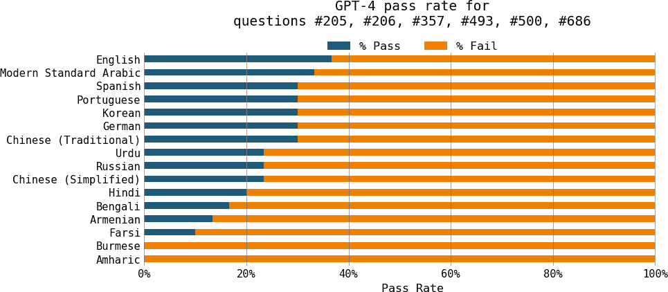

###### 图 2-2。GPT-4 在英语中的数学能力远胜于其他语言。

代表性不足是这种表现不佳的主要原因。在 GPT-4 的 MMLU 基准测试中表现最差的三个语言——泰卢固语、马拉地语和旁遮普语——也是 Common Crawl 中代表性最不足的语言之一。然而，代表性不足并不是唯一的原因。一种语言的结构和它所体现的文化也可能使模型更难学习这种语言。

考虑到 LLMs 通常擅长翻译，我们是否可以将其他语言的查询全部翻译成英语，获取响应，然后再翻译回原始语言？许多人确实采取了这种方法，但这并不理想。首先，这需要一个能够充分理解代表性不足的语言以进行翻译的模型。其次，翻译可能会导致信息丢失。例如，一些语言，如越南语，有代词来表示说话者之间的关系。当翻译成英语时，所有这些代词都被翻译成*I*和*you*，导致关系信息的丢失。

模型在非英语语言中也可能遇到意外的性能挑战。例如，[NewsGuard](https://oreil.ly/LcBfx)发现，ChatGPT 在中文中比在英语中更愿意产生虚假信息。2023 年 4 月，NewsGuard 要求 ChatGPT-3.5 用英语、简体中文和繁体中文撰写关于中国的虚假信息文章。对于英语，ChatGPT 在七个提示中有六个拒绝产生虚假陈述。然而，它在简体中文和繁体中文中七次都产生了虚假陈述。这种行为差异的原因尚不清楚.^(2)

除了质量问题，对于非英语语言，模型可能运行得更慢且成本更高。模型推理的延迟和成本与输入和响应中的标记数量成正比。结果发现，对于某些语言来说，标记化可能比其他语言更高效。在 MASSIVE 数据集上对 GPT-4 进行基准测试，这是一个包含 52 种语言翻译的百万条短文本的数据集，Yennie Jun 发现，为了传达相同的意义，像缅甸语和印地语这样的语言比英语或西班牙语需要[更多的标记](https://oreil.ly/Zq5Sw)。对于 MASSIVE 数据集，英语的标记中位数长度为 7，但印地语的长度中位数为 32，在缅甸语中，它高达 72，是英语的十倍。

假设生成标记所需的时间在所有语言中都是相同的，GPT-4 在缅甸语中生成相同内容所需的时间大约是英语的十倍。对于按标记使用量收费的 API，缅甸语的成本是英语的十倍。

为了解决这个问题，许多模型被训练以专注于非英语语言。除了英语之外，最活跃的语言无疑是中文，包括[ChatGLM](https://github.com/THUDM/ChatGLM2-6B)、[YAYI](https://github.com/wenge-research/YAYI)、[Llama-Chinese](https://github.com/LlamaFamily/Llama-Chinese)等。还有法语([CroissantLLM](https://oreil.ly/a6j-N))、越南语([PhoGPT](https://github.com/VinAIResearch/PhoGPT))、阿拉伯语([Jais](https://oreil.ly/uG27L))以及更多语言中的模型。

## 专用模型

类似于 [Gemini](https://oreil.ly/4XsOV)、[GPTs](https://oreil.ly/KLVgX) 和 [Llamas](https://oreil.ly/58gxQ) 这样的通用模型，在包括但不限于编码、法律、科学、商业、体育和环境科学等广泛领域上可以表现出色。这主要归功于它们训练数据中包含了这些领域。图 2-3 展示了根据 *华盛顿邮报* 2023 年的分析，Common Crawl 中存在的域的分布.^(3)


###### 图 2-3\. C4 数据集中域的分布。数据来自 *华盛顿邮报* 的统计。需要注意的是，这项分析仅显示了包含的类别，而没有显示缺失的类别。

到目前为止，对视觉数据中域分布的分析还不多。这可能是因为图像的分类比文本更困难.^(4) 然而，你可以从模型在基准测试中的表现推断其领域。表 2-3 展示了两个模型，CLIP 和 Open CLIP，[在不同基准上的表现](https://oreil.ly/MTqyR)。这些基准显示了这两个模型在鸟类、花卉、汽车和其他几个类别上的表现，但世界远比这些类别要大得多、复杂得多。

表 2-3\. Open CLIP 和 CLIP 在不同图像数据集上的性能。

| 数据集 | CLIP ViT-B/32 (OpenAI) 准确率 | Open CLIP ViT-B/32 (Cade) 准确率 |
| --- | --- | --- |
| ImageNet | 63.2 | 62.9 |
| ImageNet v2 | – | 62.6 |
| Birdsnap | 37.8 | 46.0 |
| Country211 | 17.8 | 14.8 |
| Oxford 102 Category Flower | 66.7 | 66.0 |
| German Traffic Sign Recognition Benchmark | 32.2 | 42.0 |
| Stanford Cars | 59.4 | 79.3 |
| UCF101 | 64.5 | 63.1 |

尽管通用基础模型可以回答关于不同领域的日常问题，但它们在特定领域的任务上可能表现不佳，尤其是在训练过程中从未见过这些任务的情况下。两个特定领域的任务示例是药物发现和癌症筛查。药物发现涉及蛋白质、DNA 和 RNA 数据，这些数据遵循特定的格式且获取成本高昂。这种数据不太可能出现在公开可用的互联网数据中。同样，癌症筛查通常涉及 X 射线和 fMRI（功能性磁共振成像）扫描，由于隐私问题，这些扫描难以获取。

为了训练一个在这些特定领域任务上表现良好的模型，你可能需要精心制作非常具体的训练数据集。最著名的特定领域模型之一可能是[DeepMind 的 AlphaFold](https://oreil.ly/JX37g)，它基于大约 100,000 种已知蛋白质的序列和 3D 结构进行训练。[NVIDIA 的 BioNeMo](https://oreil.ly/M1Nsc)是另一个专注于药物发现生物分子数据的模型。[Google 的 Med-PaLM2](https://oreil.ly/F76hq)结合了 LLM 的力量和医疗数据，以更高的准确性回答医学查询。

###### 小贴士

特定领域模型在生物医学中尤其常见，但其他领域也可以从特定领域模型中受益。可能一个基于建筑草图训练的模型可以帮助建筑师比 Stable Diffusion 做得更好，或者一个基于工厂计划的模型可以比像 ChatGPT 这样的通用模型更好地优化制造过程。

本节概述了训练数据如何影响模型性能。接下来，让我们探讨模型设计对其性能的影响。

# 模型化

在训练模型之前，开发者需要决定模型应该是什么样子。它应该遵循哪种架构？它应该有多少参数？这些决定不仅影响模型的能力，还影响其在下游应用中的可用性。5 例如，一个 7B 参数的模型将比一个 175B 参数的模型更容易部署。同样，针对延迟优化 transformer 模型与优化另一种架构非常不同。让我们探讨这些决策背后的因素。

## 模型架构

到本文写作时，基于语言的基础模型中最占主导地位的架构是*transformer*架构([Vaswani et al., 2017](https://arxiv.org/abs/1706.03762))，它基于注意力机制。它解决了先前架构的许多限制，这促成了它的流行。然而，transformer 架构也有其自身的局限性。本节分析了 transformer 架构及其替代方案。由于它涉及到不同架构的技术细节，因此可能会显得技术性很强。如果你发现任何部分过于深入，请随时跳过。

### Transformer 架构

要理解 transformer，让我们看看它被创造出来要解决的问题。transformer 架构是在 seq2seq（序列到序列）架构[seq2seq (sequence-to-sequence) architecture](https://arxiv.org/abs/1409.3215)成功之后普及起来的。在 2014 年引入时，seq2seq 在当时的挑战性任务上提供了显著的改进：机器翻译和摘要。2016 年，[Google 将 seq2seq 整合到 Google Translate](https://oreil.ly/fb1aR)，他们声称这为他们带来了“迄今为止机器翻译质量的最大改进”。这引发了人们对 seq2seq 的极大兴趣，使其成为涉及文本序列的任务的首选架构。

从高层次来看，seq2seq 包含一个处理输入的编码器和一个生成输出的解码器。输入和输出都是标记序列，因此得名。Seq2seq 使用 RNNs（循环神经网络）作为其编码器和解码器。在其最基本的形式中，编码器顺序处理输入标记，输出表示输入的最终隐藏状态。然后解码器根据输入的最终隐藏状态和之前生成的标记顺序生成输出标记。seq2seq 架构的可视化显示在图 2-4 的上半部分。

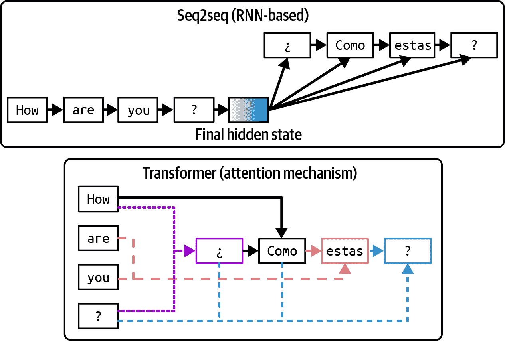

###### 图 2-4\. Seq2seq 架构与 transformer 架构对比。对于 transformer 架构，箭头显示了在生成每个输出标记时解码器所关注的标记。

seq2seq 有两个问题，Vaswani 等人（2017）在论文中进行了解决。首先，vanilla seq2seq 解码器仅使用输入的最终隐藏状态来生成输出标记。直观地说，这就像使用书的摘要来回答关于书的问题。这限制了生成输出的质量。其次，RNN 编码器和解码器意味着输入处理和输出生成都是顺序进行的，这使得对于长序列来说很慢。如果一个输入有 200 个标记长，seq2seq 必须等待每个输入标记完成处理才能继续到下一个标记。6

transformer 架构通过注意力机制解决了这两个问题。注意力机制允许模型在生成每个输出标记时权衡不同输入标记的重要性。这就像通过参考书的任何一页来生成答案。transformer 架构的简化可视化显示在图 2-4 的下半部分。

###### 注意

虽然注意力机制通常与 Transformer 模型相关联，但它是在 Transformer 论文三年前被引入的。注意力机制也可以与其他架构一起使用。谷歌在 2016 年使用注意力机制与他们的 seq2seq 架构一起，用于他们的 GNMT（谷歌神经机器翻译）模型。然而，直到 Transformer 论文表明注意力机制可以在没有 RNN 的情况下使用，它才开始流行。^([7)]

Transformer 架构完全摒弃了 RNN。使用 Transformer，输入标记可以并行处理，这显著加快了输入处理。虽然 Transformer 消除了顺序输入瓶颈，但基于 Transformer 的自回归语言模型仍然存在顺序输出瓶颈。

因此，基于 Transformer 的语言模型的推理包括两个步骤：

预填充

模型并行处理输入标记。这一步创建了生成第一个输出标记所需的中间状态。这个中间状态包括所有输入标记的键和值向量。

解码

模型一次生成一个输出标记。

如第九章中所述，预填充的可并行性和解码的顺序特性都促使许多优化技术，以使语言模型推理更便宜、更快。

#### 注意力机制

Transformer 架构的核心是注意力机制。理解这一机制是理解 Transformer 模型工作原理的必要条件。在底层，注意力机制利用键、值和查询向量：

+   查询向量（Q）代表在每个解码步骤中解码器的当前状态。使用相同的书籍摘要示例，这个查询向量可以被认为是寻找信息以创建摘要的人。

+   每个键向量（K）代表一个先前标记。如果每个先前标记是书中的一个页面，那么每个键向量就像页码。请注意，在给定的解码步骤中，先前标记包括输入标记和先前生成的标记。

+   每个值向量（V）代表模型学习到的先前标记的实际值。每个值向量就像页面的内容。

注意力机制通过执行查询向量与其键向量之间的[*点积*](https://en.wikipedia.org/wiki/Dot_product)来计算对输入标记给予多少注意力。高分意味着模型在生成书籍摘要时将更多地使用该页面的内容（其值向量）。在图 2-5 中展示了注意力机制与键、值和查询向量的可视化。在这个可视化中，查询向量正在从先前标记`How, are, you, ?, ¿`中寻找信息以生成下一个标记。


###### 图 2-5\. 来自著名 Transformer 论文“Attention Is All You Need” (Vaswani et al., 2017)中关于注意力机制作用的高层次可视化示例。

由于每个先前标记都有一个相应的键和值向量，序列越长，需要计算和存储的键和值向量就越多。这也是为什么扩展 Transformer 模型的上下文长度如此困难的一个原因。如何在第七章和第九章中高效地计算和存储键和值向量再次成为问题。

让我们来看看注意力函数是如何工作的。给定一个输入`x`，通过应用键、值和查询矩阵到输入来计算键、值和查询向量。设`W`[K]`、`W`[V]`和`W`[Q]`为键、值和查询矩阵。键、值和查询向量计算如下：

```py
K = xWK
V = xWV
Q = xWQ
```

查询、键和值矩阵的维度与模型的隐藏维度相对应。例如，在 Llama 2-7B ([Touvron et al., 2023](https://arxiv.org/abs/2307.09288))中，模型的隐藏维度大小为 4096，这意味着这些矩阵的每个维度都是`4096` × `4096`。每个生成的`K`、`V`、`Q`向量的维度为`4096`。^(8)

注意力机制几乎总是多头的。多头允许模型同时关注不同的先前标记组。在多头注意力中，查询、键和值向量被分割成更小的向量，每个向量对应一个注意力头。在 Llama 2-7B 的情况下，因为它有`32`个注意力头，每个`K`、`V`和`Q`向量将被分割成`32`个维度为`128`的向量。这是因为`4096 / 32 = 128`。

$Attention\ left-parenthesis\ upper\ Q\ comma\ upper\ K\ comma\ upper\ V\ right-parenthesis\ equals\ softmax\ left-parenthesis\ StartFraction\ upper\ Q\ upper\ K\ Superscript\ upper\ T\ Baseline\ Over\ StartRoot\ d\ EndRoot\ EndFraction\ right-parenthesis\ upper\ V$

所有注意力头的输出随后被连接起来。使用输出投影矩阵对连接后的输出应用另一种转换，然后再将其输入到模型的下一个计算步骤。输出投影矩阵的维度与模型的隐藏维度相同。

#### Transformer 块

既然我们已经讨论了注意力是如何工作的，让我们看看它在模型中的应用。Transformer 架构由多个 Transformer 块组成。每个块的具体内容在不同模型之间有所不同，但一般来说，每个 Transformer 块包含注意力模块和 MLP（多层感知器）模块：

注意力模块

每个注意力模块由四个权重矩阵组成：查询、键、值和输出投影。

MLP 模块

MLP 模块由通过 *非线性激活函数* 分隔的线性层组成。每个线性层是一个用于线性变换的权重矩阵，而激活函数允许线性层学习非线性模式。线性层也称为前馈层。

常见的非线性函数包括 ReLU（[Agarap, 2018](https://arxiv.org/abs/1803.08375)）、修正线性单元 ([Rectified Linear Unit](https://arxiv.org/abs/1803.08375)，简称 ReLU) 和 GELU ([Hendrycks and Gimpel, 2016](https://arxiv.org/abs/1606.08415))，分别被 GPT-2 和 GPT-3 使用。动作函数非常简单.^(9) 例如，ReLU 所做的只是将负值转换为 0。数学上，它表示为：

ReLU(x) = max(0, x)

在 transformer 模型中的 transformer 块数量通常被称为该模型的层数。基于 transformer 的语言模型还配备了在每个 transformer 块之前和之后的模块：

在 transformer 块之前的嵌入模块

此模块由嵌入矩阵和位置嵌入矩阵组成，分别将标记及其位置转换为嵌入向量。直观地，位置索引的数量决定了模型的最大上下文长度。例如，如果一个模型跟踪 2,048 个位置，其最大上下文长度为 2,048。然而，有一些技术可以在不增加位置索引数量的情况下增加模型上下文长度。

在 transformer 块之后的输出层

此模块将模型的输出向量映射到用于采样模型输出（在“采样”中讨论）的标记概率。此模块通常由一个矩阵组成，也称为 *反嵌入层*。有些人将输出层称为模型的 *头部*，因为它是在输出生成之前的模型最后一层。

图 2-6 可视化了 transformer 模型架构。transformer 模型的大小由其构建块的维度决定。一些关键值包括：

+   模型的维度决定了 transformer 块中键、查询、值和输出投影矩阵的大小。

+   transformer 块的数量。

+   前馈层的维度。

+   词汇量大小。

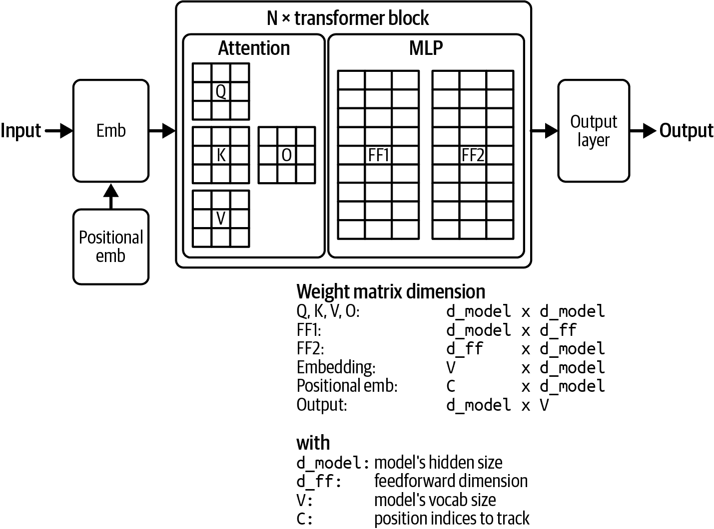

###### 图 2-6\. 一个 transformer 模型权重组成的可视化。

较大的维度值导致更大的模型大小。表 2-4 显示了不同 Llama 2 ([Touvron et al., 2023](https://arxiv.org/abs/2307.09288)) 和 Llama 3 ([Dubey et al., 2024](https://arxiv.org/abs/2407.21783)) 模型的这些维度值。请注意，尽管增加上下文长度会影响模型的内存占用，但它不会影响模型的总参数数量。

表 2-4\. 不同 Llama 模型的维度值。

| 模型 | # transformer 块 | 模型维度 | 前馈维度 | 词汇量大小 | 上下文长度 |
| --- | --- | --- | --- | --- | --- |
| Llama 2-7B | 32 | 4,096 | 11,008 | 32K | 4K |
| Llama 2-13B | 40 | 5,120 | 13,824 | 32K | 4K |
| Llama 2-70B | 80 | 8,192 | 22,016 | 32K | 4K |
| Llama 3-7B | 32 | 4,096 | 14,336 | 128K | 128K |
| Llama 3-70B | 80 | 8,192 | 28,672 | 128K | 128K |
| Llama 3-405B | 126 | 16,384 | 53,248 | 128K | 128K |

### 其他模型架构

虽然 Transformer 模型主导着领域，但它并非唯一的架构。自 2012 年[AlexNet](https://oreil.ly/1spG5)重新点燃了人们对深度学习的兴趣以来，许多架构已经兴衰更迭。Seq2seq 在 2014 至 2018 年间备受瞩目。[GANs](https://arxiv.org/abs/1406.2661)（生成对抗网络）吸引了人们的集体想象力更长一段时间（2014 至 2019 年）。与之前的架构相比，Transformer 更具粘性。它自 2017 年以来一直存在.^(10) 何时会有更好的东西出现？

开发一种能够超越 Transformer 的新架构并不容易.^(11) 自 2017 年以来，Transformer 已经经过了大量的优化。一个旨在取代 Transformer 的新架构必须在人们关心的规模和硬件上表现出色.^(12)

然而，仍有希望。虽然基于 Transformer 的模型正在主导，但截至本文写作时，几种替代架构正在获得关注。

一种流行的模型是[RWKV](https://github.com/BlinkDL/RWKV-LM)（Peng et al., 2023），这是一个基于 RNN 的模型，可以并行化进行训练。由于其 RNN 特性，从理论上讲，它没有基于 Transformer 的模型所具有的相同上下文长度限制。然而，在实践中，没有上下文长度限制并不保证在长上下文中表现出良好的性能。

在开发 LLMs（大型语言模型）时，建模长序列仍然是一个核心挑战。在长程记忆方面表现出很多希望的架构是 SSMs（状态空间模型）([Gu et al., 2021a](https://arxiv.org/abs/2110.13985))。自该架构于 2021 年推出以来，已经引入了多种技术来提高架构的效率，使其在长序列处理方面表现更好，并能够扩展到更大的模型规模。以下是一些这些技术的例子，以展示新架构的演变：

+   *S4*，在“Efficiently Modeling Long Sequences with Structured State Spaces”([Gu et al., 2021b](https://arxiv.org/abs/2111.00396))中提出，旨在使 SSMs（状态空间模型）更高效。

+   *H3*，在“Hungry Hungry Hippos: Towards Language Modeling with State Space Models”([Fu et al., 2022](https://arxiv.org/abs/2212.14052))中提出，包含了一种允许模型回忆早期标记并比较序列中标记的机制。这种机制的目的类似于 Transformer 架构中的注意力机制，但效率更高。

+   *Mamba*，在“Mamba: Linear-Time Sequence Modeling with Selective State Spaces” ([Gu and Dao, 2023](https://oreil.ly/n7wYO)) 中介绍，将 SSMs 扩展到 30 亿参数。在语言建模方面，Mamba-3B 优于同等规模的 transformers，并且与两倍规模的 transformers 相当。作者还表明，Mamba 的推理计算与序列长度呈线性关系（与 transformers 的二次关系相比）。其性能在百万长度序列的真实数据上显示出改进。

+   *Jamba*，在“Jamba: A Hybrid Transformer–Mamba Language Model” ([Lieber et al., 2024](https://arxiv.org/abs/2403.19887)) 中介绍，将 transformer 和 Mamba 层的块交错排列，以进一步扩展 SSMs。作者发布了一个混合专家模型，具有[52B 总可用参数](https://oreil.ly/uyiBH)（12B 活动参数），设计用于适应单个 80 GB GPU。Jamba 在标准语言模型基准测试和长达 256K 个标记的上下文评估中表现出色。与传统的 transformers 相比，它还具有较小的内存占用。

图 2-7 展示了 transformer、Mamba 和 Jamba 块。

尽管开发一个优于 transformer 的架构具有挑战性，鉴于其许多局限性，仍有很大动力去实现这一点。如果另一个架构确实超越了 transformer，本书中讨论的一些模型适应技术可能会改变。然而，就像从 ML 工程到 AI 工程的转变使许多事情保持不变一样，改变底层模型架构不会改变基本方法。


###### 图 2-7\. Transformer、Mamba 和 Jamba 层的可视化。图像改编自“Jamba: A Hybrid Transformer–Mamba Language Model” (Lieber et al., 2024)。

## 模型大小

近年来，AI 的许多进步可以归因于模型规模的增加。不谈论模型参数数量很难谈论基础模型。参数数量通常附加在模型名称的末尾。例如，Llama-13B 指的是 Meta 开发的一个模型家族 Llama 的版本，具有 130 亿参数。

通常，增加模型的参数会增加其学习能力，从而产生更好的模型。给定两个同一家族的模型，具有 130 亿参数的模型可能比具有 70 亿参数的模型表现要好得多。

###### 注意

随着社区更好地理解如何训练大型模型，新一代模型往往优于同规模的老一代模型。例如，[Llama 3-8B (2024)](https://arxiv.org/abs/2407.21783) 在 MMLU 基准测试中甚至优于 [Llama 2-70B (2023)](https://arxiv.org/abs/2307.09288)。

参数的数量帮助我们估计训练和运行此模型所需的计算资源。例如，如果一个模型有 70 亿个参数，并且每个参数使用 2 字节（16 位）存储，那么我们可以计算出使用此模型进行推理所需的 GPU 内存至少为 140 亿字节（14 GB）.^(13)

如果模型是**稀疏**的，参数的数量可能会误导。一个稀疏模型拥有大量值为零的参数。一个 90%稀疏的 70 亿参数模型实际上只有 7 亿个非零参数。稀疏性允许更高效的数据存储和计算。这意味着一个大型稀疏模型可能需要的计算资源比一个小型密集模型更少。

近年来，一种流行的稀疏模型是专家混合（MoE）([Shazeer 等人，2017](https://arxiv.org/abs/1701.06538))。MoE 模型被分成不同的参数组，每个组都是一个**专家**。对于每个标记，只有专家的一个子集是**活跃**的（用于处理）。

例如，[Mixtral 8x7B](https://oreil.ly/VvXbu)是由八个专家组成的混合体，每个专家有 70 亿个参数。如果没有任何两个专家共享任何参数，它应该有 8 × 70 亿 = 560 亿个参数。然而，由于一些参数被共享，它实际上只有 466 亿个参数。

在每一层，对于每个标记，只有两个专家是活跃的。这意味着每个标记只有 129 亿个参数是活跃的。虽然这个模型有 466 亿个参数，但其成本和速度与一个 129 亿参数的模型相同。

如果一个大型模型没有在足够的数据上训练，它也可能表现不如一个较小的模型。想象一下，一个在只包含一个句子：“我喜欢菠萝。”的数据集上训练的 130 亿参数模型：这个模型的表现将远不如一个在更多数据上训练的较小模型。

讨论模型大小时，考虑其训练数据的大小非常重要。对于大多数模型，数据集大小是通过训练样本的数量来衡量的。例如，Google 的 Flamingo([Alayrac 等人，2022](https://arxiv.org/abs/2204.14198))使用了四个数据集——其中一个包含 18 亿（图像，文本）对，另一个包含 3.12 亿（图像，文本）对。

对于语言模型，训练样本可以是一个句子、一个维基百科页面、一次聊天对话或一本书。一本书的价值远大于一个句子，因此训练样本的数量不再是衡量数据集大小的良好指标。更好的衡量标准是数据集中标记的数量。

标记的数量也不是一个完美的衡量标准，因为不同的模型可能有不同的标记化过程，导致同一数据集在不同模型中有不同数量的标记。为什么不直接使用单词数量或字母数量呢？因为标记是模型操作的单元，知道数据集中的标记数量有助于我们衡量模型可以从这些数据中潜在学习多少。

到本文写作时，大型语言模型使用的是以万亿标记为顺序的数据集。Meta 使用越来越大的数据集来训练他们的 Llama 模型：

+   [Llama 1](https://arxiv.org/abs/2302.13971)的 1.4 万亿标记

+   [Llama 2](https://arxiv.org/abs/2307.09288)的 2 万亿标记

+   [Llama 3](https://oreil.ly/vfSQw)的 15 万亿标记

Together 的开源数据集 RedPajama-v2 有[30 万亿标记](https://oreil.ly/SfB4g)。这相当于 4.5 亿本书^(14)或维基百科大小的 5400 倍。然而，由于 RedPajama-v2 包含无差别内容，高质量数据量要低得多。

*模型数据集中的标记数与其训练标记数并不相同。训练标记数衡量的是模型训练所使用的标记数。如果一个数据集包含 1 万亿标记，并且模型在该数据集上训练了两个 epoch（epoch 是指遍历数据集的一次过程），那么训练标记数是 2 万亿。^(15）请参阅表 2-5 以了解不同参数数量模型的训练标记数示例。

表 2-5\. 不同参数数量模型的训练标记数示例。来源：“训练计算最优的大型语言模型”（[DeepMind, 2022](https://oreil.ly/A3K90)）。

| 模型 | 大小（#参数） | 训练标记 |
| --- | --- | --- |
| LaMDA (Thoppilan et al., 2022) | 1370 亿 | 1680 亿 |
| GPT-3 (Brown et al., 2020) | 1750 亿 | 3000 亿 |
| Jurassic (Lieber et al., 2021) | 1780 亿 | 3000 亿 |
| Gopher (Rae et al., 2021) | 2800 亿 | 3000 亿 |
| MT-NLG 530B (Smith et al., 2022) | 5300 亿 | 2700 亿 |
| Chinchilla | 700 亿 | 1400 亿 |

###### 注意

虽然本节重点讨论数据的规模，但数量并不是唯一重要的因素。数据质量和数据多样性也同样重要。数量、质量和多样性是训练数据的三个黄金目标。它们将在第八章中进一步讨论。

预训练大型模型需要计算资源。衡量所需计算量的一个方法是通过考虑机器的数量，例如，GPU、CPU 和 TPU。然而，不同机器的容量和成本差异很大。NVIDIA A10 GPU 与 NVIDIA H100 GPU 以及 Intel Core Ultra 处理器不同。

模型的计算需求的一个更标准化的单位是*FLOP*，即*浮点运算*。FLOP 衡量的是为特定任务执行的浮点运算次数。例如，谷歌最大的 PaLM-2 模型使用了`10`²² FLOPs 进行训练([Chowdhery et al., 2022](https://arxiv.org/abs/2204.02311))。GPT-3-175B 使用了`3.14 × 10`²³ FLOPs 进行训练([Brown et al., 2020](https://arxiv.org/abs/2005.14165))。

*FLOP 的复数形式 FLOPs 经常与 FLOP/s 混淆，即每秒浮点运算数。* FLOPs 衡量任务的计算需求，而 FLOP/s 衡量机器的峰值性能。例如，NVIDIA H100 NVL GPU 可以提供最大[60 TeraFLOP/s](https://oreil.ly/HcFYz)：每秒`6 × 10`¹³ FLOPs 或每天`5.2 × 10`¹⁸ FLOPs.^(16)

###### 警告

注意混淆的符号。FLOP/s 经常被写成 FLOPS，看起来与 FLOPs 很相似。为了避免这种混淆，一些公司，包括 OpenAI，使用 FLOP/s-day 代替 FLOPs 来衡量计算需求：

```py
1 FLOP/s-day = 60 × 60 × 24 = 86,400 FLOPs
```

本书使用 FLOPs 来计算浮点运算，使用 FLOP/s 来表示每秒 FLOPs。

假设你拥有 256 台 H100。如果你能以最大容量使用它们并且不犯训练错误，那么训练 GPT-3-175B 将需要`(3.14 × 10²³) / (256 × 5.2 × 10¹⁸) = ~236 days`，或者大约 7.8 个月。

然而，你不可能总是让你的机器达到其峰值容量。利用率衡量你能使用多少最大计算能力。什么被认为是好的利用率取决于模型、工作负载和硬件。一般来说，如果你能获得标称性能的一半，即 50%的利用率，你就做得不错了。任何超过 70%的利用率都被认为是很好的。不要让这个规则阻止你获得更高的利用率。第九章更详细地讨论了硬件指标和利用率。

在 70%的利用率和每小时的$2 对于一台 H100 的情况下，^(17)训练 GPT-3-175B 将花费超过$4 百万：

```py
$2/H100/hour × 256 H100 × 24 hours × 256 days / 0.7 = $4,142,811.43
```

###### 小贴士

总结来说，三个数字可以指示模型的规模：

+   参数数量，这是衡量模型学习能力的代理指标。

+   模型训练所使用的标记数量，这是衡量模型学习量的一个代理指标。

+   FLOPs 的数量，这是衡量训练成本的代理指标。

### 规模定律：构建计算最优模型

我希望最后一节已经让你相信了三件事：

1.  模型性能取决于模型大小和数据集大小。

1.  更大的模型和更大的数据集需要更多的计算资源。

1.  计算需要花钱。

除非你有无限的金钱，预算是必不可少的。你不想从一个任意大的模型大小开始，看看它将花费多少。你从一个预算开始——你想要花多少钱——然后计算出你能负担的最佳模型性能。由于计算通常是限制因素——计算基础设施不仅昂贵，而且难以设置——团队通常从一个计算预算开始。给定固定数量的 FLOPs，什么模型大小和数据集大小会给出最佳性能？在固定计算预算下能实现最佳性能的模型是*计算可选的*。

给定计算预算，帮助计算最优模型大小和数据集大小的规则被称为 Chinchilla *规模定律*，该定律在 Chinchilla 论文“训练计算最优大型语言模型”（DeepMind，2022）[“Training Compute-Optimal Large Language Models”](https://arxiv.org/abs/2203.15556)中提出。为了研究模型大小、数据集大小、计算预算和模型性能之间的关系，作者们在 5 到 500 亿个标记上训练了从 7000 万个到超过 160 亿个参数的 400 个语言模型。他们发现，对于计算最优的训练，训练标记的数量需要大约是模型大小的 20 倍。这意味着一个 30 亿参数的模型需要大约 600 亿个训练标记。模型大小和训练标记的数量应该同等比例缩放：对于模型大小的每增加一倍，训练标记的数量也应该增加一倍。

我们已经从将训练过程视为炼金术的时代走了很长的路。图 2-8 显示，我们可以预测每个 FLOP 预算的最优参数数量和标记数量，以及从这些设置中预期的训练损失（假设我们做得正确）。

这种计算最优的计算假设获取数据成本远低于计算成本。同一篇 Chinchilla 论文还提出了当训练数据成本非平凡时的另一种计算方法。


###### 图 2-8。描述训练损失、模型参数数量、FLOPs 和训练标记数量之间关系的图表。来源：“训练计算可选的大型语言模型”（DeepMind，2022）。

规模定律是为在主要基于人类生成数据上训练的密集模型开发的。将此计算应用于稀疏模型，如专家混合模型和合成数据，是一个活跃的研究领域。

规模定律在给定计算预算的情况下优化模型质量。然而，重要的是要记住，对于生产来说，模型质量并非一切。一些模型，特别是 Llama，性能不佳但可用性更好。考虑到它们的计算预算，Llama 的作者本可以选择更大的模型以获得更好的性能，但他们选择了较小的模型。较小的模型更容易处理，并且在运行推理时成本更低，这有助于它们的模型获得更广泛的应用。[Sardana 等人（2023）](https://arxiv.org/abs/2401.00448)修改了 Chinchilla 规模定律，以计算最优的 LLM 参数数量和预训练数据大小，以考虑这种推理需求。

在计算预算给定的模型性能问题上，值得注意的是，实现给定模型性能的成本正在下降。例如，根据[*人工智能指数报告 2022*（斯坦福大学 HAI）](https://oreil.ly/oq-LE)，在 ImageNet 数据集上，实现 93%准确性的成本从 2019 年到 2021 年减半。

*尽管相同模型性能的成本在下降，但模型性能提升的成本仍然很高。* 与第一章中讨论的最后一英里挑战相似，将模型的准确率从 90%提高到 95%比从 85%提高到 90%的成本更高。正如 Meta 的论文[“超越神经缩放定律：通过数据剪枝击败幂律缩放”](https://oreil.ly/kO41d)所指出的，这意味着一个 2%错误率的模型可能需要比 3%错误率的模型多一个数量级的数据、计算或能量。

在语言建模中，从大约 3.4 到 2.8 纳特的交叉熵损失下降需要 10 倍更多的训练数据。交叉熵及其单位，包括纳特，在第三章第三章评估方法中讨论。对于大型视觉模型，将训练样本数量从 10 亿增加到 20 亿，在 ImageNet 上的准确率仅提高几个百分点。

然而，语言建模损失或 ImageNet 准确率的小幅变化可能会导致下游应用质量产生巨大差异。如果你从具有 3.4 交叉熵损失的模型切换到具有 2.8 损失的模型，你会注意到差异。

### 缩放外推

模型的性能很大程度上取决于其**超参数**的值。当处理小型模型时，通常的做法是使用不同的超参数集多次训练模型，并选择表现最好的一个。然而，对于大型模型来说，这种情况很少可能发生，因为单次训练就已经消耗了大量的资源。

这意味着对于许多模型来说，你可能只有一次机会获得正确的一组超参数。因此，**缩放外推**（也称为**超参数迁移**）已成为一个研究子领域，它试图预测对于大型模型，哪些超参数将提供最佳性能。当前的方法是研究超参数对不同大小模型的影响，通常比目标模型的大小小得多，然后外推这些超参数在目标模型大小上的作用。^([18)] 一篇 2022 年的论文[由微软和 OpenAI 发表](https://oreil.ly/sHwbw)显示，从 40M 模型迁移超参数到 6.7B 模型是可能的。

缩放外推仍然是一个小众话题，因为很少有人有研究大型模型训练的经验和资源。这也由于超参数的数量以及它们之间相互作用的复杂性而难以实现。如果你有十个超参数，你将不得不研究 1,024 个超参数组合。你需要单独研究每个超参数，然后是两个一起，然后是三个一起，以此类推。

此外，新兴能力 ([Wei 等人，2022](https://arxiv.org/abs/2206.07682)) 使得外推变得更加不准确。新兴能力指的是仅在规模较大时才存在的，可能在训练数据较小的小型模型上不可观察的能力。想了解更多关于规模外推的信息，请查看这篇优秀的博客文章：“关于神经网络规模外推的困难” ([Luke Metz，2022](https://oreil.ly/kuG3J))。

### 规模瓶颈

迄今为止，模型大小的每十倍增长都导致了模型性能的提升。GPT-2 的参数数量比 GPT-1 多一个数量级（15 亿比 1.17 亿）。GPT-3 的参数数量比 GPT-2 多两个数量级（1750 亿比 15 亿）。这意味着从 2018 年到 2021 年，模型大小增长了三个数量级。再增长三个数量级将导致拥有 100 万亿参数的模型。19

模型大小还能增长多少数量级？是否存在一个点，无论模型大小如何，其性能都会趋于平稳？虽然很难回答这些问题，但已经存在两个明显的规模瓶颈：训练数据和电力。

基础模型使用的数据量如此之大，以至于我们担心在接下来的几年内可能会耗尽互联网数据。训练数据集大小的增长速度远远快于新数据的生成速度 ([Villalobos 等人，2022](https://arxiv.org/abs/2211.04325))，如图 2-9 所示。*如果你曾在互联网上发布过任何内容，你应该假设它已经或将要被包含在某些语言模型的训练数据中，无论你是否同意。* 这类似于，如果你在互联网上发布了一些内容，你应该预期它会被谷歌索引。


###### 图 2-9\. 训练数据集大小和可用数据量的历史趋势预测。来源：Villalobos 等人，2024。

有些人利用这一事实将他们想要的数据注入未来模型的训练数据中。他们只是简单地在网上发布他们想要的内容，希望它能够影响未来模型生成他们期望的响应。恶意行为者也可以利用这种方法进行提示注入攻击，如第五章所述（ch05.html#ch05a_prompt_engineering_1730156991195551）。

###### 注意

一个开放的研究问题是，如何让模型忘记它在训练期间学习到的特定信息。想象一下，你发布了一篇博客文章，后来又删除了。如果那篇博客文章被包含在某个模型的训练数据中，该模型可能仍然会重现文章的内容。结果，人们可能在没有你同意的情况下访问被删除的内容。

此外，互联网正在迅速被 AI 模型生成的大量数据所充斥。如果公司继续使用互联网数据来训练未来的模型，这些新模型将部分基于 AI 生成数据进行训练。2023 年 12 月，由 X 训练的模型 Grok 被发现在拒绝请求时表示这违反了 OpenAI 的使用案例政策。这导致一些人猜测 Grok 是使用 ChatGPT 的输出进行训练的。[Grok 的核心开发者之一 Igor Babuschkin](https://x.com/ibab/status/1733558576982155274)回应说，这是因为 Grok 是在网络数据上训练的，而“网络上充满了 ChatGPT 的输出。”^(20)

一些研究人员担心，在 AI 生成数据上递归训练新的 AI 模型会导致新模型逐渐忘记原始数据模式，随着时间的推移降低其性能（Shumailov et al., 2023）。然而，AI 生成数据对模型的影响更为复杂，这将在第八章中进行讨论。

一旦公开可用的数据耗尽，获取更多由人类生成训练数据的可行途径就是专有数据。独特的专有数据——包括受版权保护的书籍、翻译、合同、医疗记录、基因组序列等等——将在人工智能竞赛中成为竞争优势。这也是为什么 OpenAI 与包括 Axel Springer 和美联社在内的出版商和媒体机构达成了[协议](https://oreil.ly/AkAyI)。

在 ChatGPT 出现的情况下，许多公司，包括[Reddit](https://oreil.ly/o7WB3)和[Stack Overflow](https://oreil.ly/xNuju)，改变他们的数据条款以防止其他公司从他们的模型中抓取数据，这并不令人惊讶。Longpre 等人（2024）观察到，在 2023 年和 2024 年之间，来自网络来源的数据限制的快速增加使得流行公共数据集[C4](https://github.com/google-research/text-to-text-transfer-transformer#c4)中超过 28%的最关键来源完全受限。由于服务条款和爬虫限制的变化，现在 C4 中有 45%受到限制。

另一个瓶颈，虽然不那么明显但更为紧迫，是电力。机器需要电力来运行。截至本文撰写时，数据中心预计消耗全球电力的 1-2%。这个数字预计到 2030 年将达到 4%到 20%之间（Patel, Nishball, and Ontiveros, 2024）。在我们找到产生更多能源的方法之前，数据中心最多只能增长 50 倍，这还不到两个数量级。这导致了对未来电力短缺的担忧，这将推高电价。

现在我们已经讨论了两个关键建模决策——架构和规模——让我们继续讨论下一组关键的设计选择：如何使模型与人类偏好保持一致。

# 训练后

后训练从预训练模型开始。假设你已经使用自监督方法预训练了一个基础模型。由于目前预训练的工作方式，预训练模型通常有两个问题。首先，自监督优化模型进行文本完成，而不是对话。21 如果你觉得这不清楚，不要担心，“监督微调”部分“Supervised Finetuning”将会有示例。其次，如果模型是在从互联网上无差别抓取的数据上预训练的，其输出可能是种族主义、性别歧视、粗鲁或只是错误的。后训练的目标是解决这两个问题。

每个模型的后训练都是不同的。然而，一般来说，后训练包括两个步骤：

1.  *监督微调* (*SFT*)：在高质量指令数据上微调预训练模型，以优化模型进行对话而非完成。

1.  *偏好微调*：进一步微调模型以输出符合人类偏好的响应。偏好微调通常使用强化学习（RL）进行。22 偏好微调的技术包括[*从人类反馈中进行强化学习*](https://oreil.ly/iJG1q) (RLHF)（由 [GPT-3.5](https://oreil.ly/tbgTi) 和 [Llama 2](https://arxiv.org/abs/2307.09288) 使用），[DPO](https://arxiv.org/abs/2305.18290)（直接偏好优化）（由 [Llama 3](https://arxiv.org/abs/2407.21783) 使用），以及[*从 AI 反馈中进行强化学习*](https://arxiv.org/abs/2309.00267) (RLAIF)（可能由 [Claude](https://arxiv.org/abs/2212.08073) 使用）。

让我用另一种方式来强调预训练和后训练之间的区别。对于基于语言的基础模型，预训练优化的是标记级别的质量，即模型被训练来准确预测下一个标记。然而，用户并不关心标记级别的质量——他们关心的是整个响应的质量。一般来说，后训练优化模型以生成用户偏好的响应。有些人将预训练比作阅读来获取知识，而后训练则像是学习如何使用这些知识。

###### 警告

注意术语的歧义。有些人使用“指令微调”这个术语来指代监督微调，而有些人则用这个术语来指代监督微调和偏好微调。为了避免歧义，我在这本书中会避免使用“指令微调”这个术语。

与预训练相比，后训练消耗的资源较少（[InstructGPT](https://oreil.ly/9bbzX) 用于后训练的计算资源仅为 2%，而预训练为 98%），因此你可以将后训练视为解锁预训练模型已经具备但用户仅通过提示难以访问的能力。

图 2-10 展示了预训练、SFT 和偏好微调的整体工作流程，假设你在最后一步使用 RLHF。你可以通过确定模型创建者采取了哪些步骤来近似模型与人类偏好的契合度。

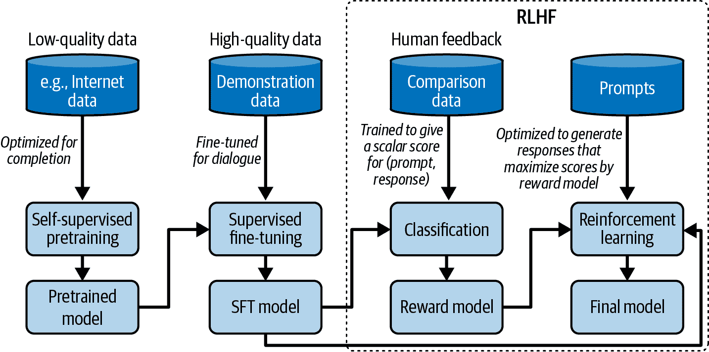

###### 图 2-10\. 预训练、SFT 和 RLHF 的整体训练流程。

如果你眯起眼睛，图 2-10 与描绘怪物 [Shoggoth](https://en.wikipedia.org/wiki/Shoggoth) 带有笑脸的 图 2-11 的梗图非常相似：

1.  自监督预训练导致了一个不受约束的模型，它可以被认为是一匹未驯服的怪物，因为它使用了来自互联网的无差别的数据。

1.  这个怪物随后在更高质量的数据上进行监督微调——Stack Overflow、Quora 或人工标注，这使得它更易于社会接受。

1.  这个微调模型进一步通过偏好微调进行润色，使其更符合客户需求，这就像给它一个笑脸。

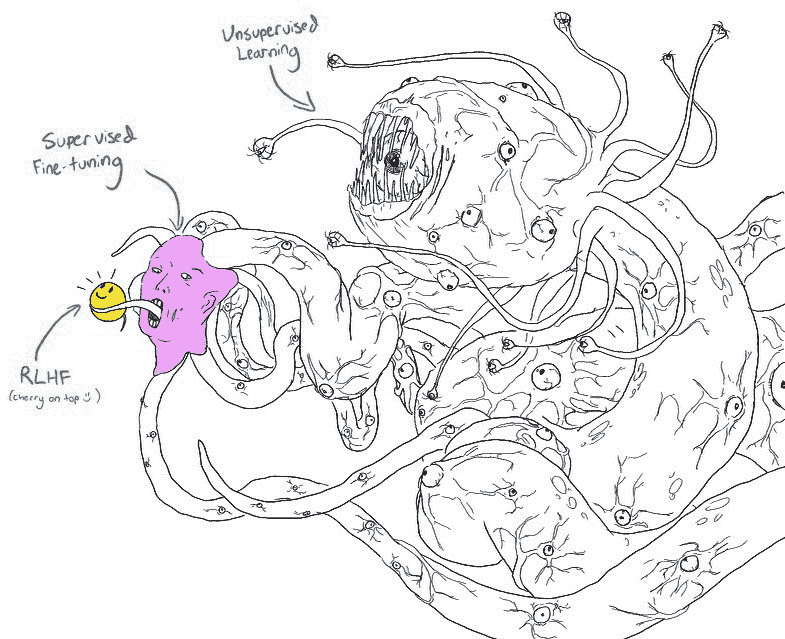

###### 图 2-11\. 带有笑脸的 Shoggoth。改编自 [anthrupad](https://x.com/anthrupad/status/1622349563922362368) 分享的原始图像。

注意，预训练、SFT 和偏好微调的组合是目前构建基础模型的热门解决方案，但并非唯一解决方案。你可以跳过任何步骤，正如你很快就会看到的。

## 监督微调

如 第一章 所述，预训练模型可能更优化于生成而非对话。如果你将“如何制作披萨”输入到模型中，模型将继续完成这个句子，因为模型没有意识到这应该是一个对话。以下任何一种选项都可以是一个有效的完成：

1.  为问题添加更多上下文：“对于一个六口之家？”

1.  添加后续问题：“我需要哪些原料？需要多长时间？”

1.  指示如何制作披萨的说明。

如果目标是适当地回应用户，正确的选项是 3。

我们知道模型模仿其训练数据。为了鼓励模型生成适当的响应，你可以展示适当的响应示例。这些示例遵循 (*提示，响应*) 的格式，并被称为 *演示数据*。有些人将这个过程称为 *行为克隆*：你展示模型应该如何表现，模型就模仿这种行为。

由于不同类型的请求需要不同类型的回应，您的演示数据应包含您希望模型处理的请求范围，例如问答、摘要和翻译。图 2-12 显示了 OpenAI 用于微调其模型（InstructGPT）的任务类型分布。[InstructGPT](https://oreil.ly/8U2z8)。请注意，这个分布不包含多模态任务，因为 InstructGPT 是一个纯文本模型。


###### 图 2-12. 用于微调 InstructGPT 的提示分布。图表基于 OpenAI 论文中的数据创建。

好老师对人类学习很重要。同样，好的标注者对 AI 学习如何进行智能对话也很重要。与通常只需要少量或没有领域专业知识即可完成的传统数据标注不同，演示数据可能包含复杂的提示，其回应需要批判性思维、信息收集和对用户请求适当性的判断。表 2-6 展示了标注者为 InstructGPT 创建的（提示，回应）对示例。

表 2-6. 用于[InstructGPT](https://arxiv.org/abs/2203.02155)的演示数据示例。

| 提示 | 标注者的回应 |
| --- | --- |
| `意外发现意味着事件以愉快或有益的方式偶然发生和发展。在句子中使用这个词。` | `偶遇玛格丽特并被介绍给汤姆是一次幸运的意外发现。` |

| `阅读以下文本，并在文末回答三个问题。`

`[因篇幅省略 - 关于正义罗斯·巴德·金斯伯格的文章，`

`性别平等捍卫者，享年 87 岁逝世]`

`1\. …`

`2\. …`

`3. 为什么金斯伯格的去世会有`

`对法庭和国家有深远的影响吗？` | `1\. …` `2\. …`

`3. 罗斯·巴德·金斯伯格是自由派的领导者，由于法院即将开始新的一届任期，首席`

`法官在争议案件中不再拥有控制票。` |

| `ELI5: 压力或令人沮丧时我们胸口“焦虑肿块”的原因是什么？`

`体验？` | `你喉咙里的焦虑肿块是由肌肉紧张使声带扩张以最大化气流引起的。紧绷的胸部或心痛感是由迷走神经引起的，它告诉器官加快泵血速度，停止消化，并` `产生肾上腺素和皮质醇。` |

因此，公司通常使用受过高等教育的人作为标注员来生成演示数据。在为 InstructGPT 标注演示数据的人中，[~90%拥有至少本科学历](https://oreil.ly/SF_X9)，超过三分之一拥有硕士学位。如果标注图像中的对象可能只需几秒钟，生成一个（提示，响应）对可能需要长达 30 分钟，尤其是涉及长上下文如摘要的任务。如果一对（提示，响应）的成本是 10 美元，那么 OpenAI 为 InstructGPT 使用的 13,000 对将花费 130,000 美元。这还不包括设计数据（包括哪些任务和提示）、招募标注员和数据质量控制的成本。

并非每个人都能负担得起遵循高质量人工标注的方法。非营利组织 LAION 动员了全球 13,500 名志愿者生成 10,000 次对话，这些对话包含 35 种不同语言中的 161,443 条消息，并附有 461,292 个质量评分。由于数据是由志愿者生成的，因此对偏差的控制并不多。理论上，教模型人类偏好的标注员应该代表整个人口。LAION 的标注员人口统计存在偏差。例如，在一个自我报告的调查中，90%的志愿者标注员自认为是男性([Köpf et al., 2023](https://arxiv.org/abs/2304.07327))。

DeepMind 使用[简单启发式方法](https://arxiv.org/abs/2112.11446)从互联网数据中筛选对话以训练他们的模型 Gopher。他们声称他们的启发式方法能够可靠地产生高质量的对话。具体来说，他们寻找类似以下格式的文本：

```py
[A]: [Short paragraph]

[B]: [Short paragraph]

[A]: [Short paragraph]

[B]: [Short paragraph]

…

```

为了减少对高质量人工标注数据的依赖，许多团队正在转向使用 AI 生成数据。合成数据在第八章中进行了讨论。

技术上，您可以从头开始在演示数据上训练模型，而不是微调预训练模型，从而有效地消除了自监督预训练步骤。然而，预训练方法通常能返回更优越的结果。

## 偏好微调

权力越大，责任越大。一个可以帮助用户实现伟大事物的模型，也可能帮助用户实现可怕的事情。演示数据教会模型进行对话，但并没有教会模型应该进行什么样的对话。例如，如果用户要求模型写一篇关于为什么一个种族劣等或如何劫机的文章，模型应该遵守吗？

在上述两个例子中，大多数人很容易理解模型应该做什么。然而，许多场景并不那么清晰。来自不同文化、政治、社会经济、性别和宗教背景的人经常意见不合。AI 应该如何回应关于堕胎、枪支控制、以色列-巴勒斯坦冲突、管教孩子、大麻合法化、普遍基本收入或移民的问题？我们如何定义和检测可能具有争议的问题？如果你的模型对具有争议的问题做出回应，无论回应如何，你都会让一些用户感到不满。如果一个模型被过度审查，你的模型[可能会变得无聊](https://oreil.ly/5oSEJ)，[驱赶用户](https://oreil.ly/D1S6y)。

担心 AI 模型生成不适当的响应可能会阻止公司向用户发布他们的应用程序。偏好微调的目标是让 AI 模型按照人类的偏好行事。23 这是一个雄心勃勃，如果不是不可能实现的目标。这不仅假设普遍的人类偏好存在，而且还假设可以将它嵌入到 AI 中。

如果目标很简单，解决方案可能会很优雅。然而，鉴于目标的雄心勃勃性质，我们今天拥有的解决方案是复杂的。最早成功的偏好微调算法，至今仍很受欢迎，是 RLHF。RLHF 由两部分组成：

1.  训练一个评分基础模型输出的奖励模型。

1.  优化基础模型以生成奖励模型会给出最高分的响应。

虽然 RLHF 仍然在今天被使用，但像 DPO ([Rafailov 等人，2023](https://arxiv.org/abs/2305.18290)) 这样的新方法正在获得关注。例如，Meta 从 Llama 2 的 RLHF 转向 Llama 3 的 DPO 以减少复杂性。我无法在这本书中涵盖所有不同的方法。我选择在这里突出 RLHF 而不是 DPO，因为虽然 RLHF 比 DPO 更复杂，但它为调整模型提供了更多的灵活性。Llama 2 的作者提出，“LLM 在某些任务中超越人类标注者的卓越写作能力，其根本驱动力是 RLHF” ([Touvron 等人，2023](https://arxiv.org/abs/2307.09288))。

### 奖励模型

RLHF 依赖于一个奖励模型。给定一对（提示，响应），*奖励模型*会输出一个评分，表示响应有多好。训练一个模型对给定输入进行评分是常见的机器学习任务。挑战，与 SFT 类似，是获取可靠的数据。如果我们要求标注者直接对每个响应进行评分，评分将会不同。对于相同的样本，在 10 分制下，一个标注者可能会给出 5 分，而另一个可能会给出 7 分。即使是同一个标注者，在两次给出相同的（提示，响应）对时，也可能给出不同的评分。独立评估每个样本也称为*点评分*。

一个更简单的任务是要求标注员比较两个响应并决定哪个更好。对于每个提示，人类或 AI 会生成多个响应。生成的标记数据是 *比较数据*，其格式为（提示，获胜响应，失败响应）。表 2-7 展示了 Anthropic 用来训练其模型之一的比较数据示例。在这个例子中的两个响应中，我更喜欢被标记为失败的那个响应。这突显了试图在单一数学公式中捕捉多样的人类偏好的挑战。

表 2-7\. 来自 [Anthropic](https://oreil.ly/h9oG6) 的 HH-RLHF 数据集的比较数据示例。

| 提示 | 获胜响应 | 失败响应 |
| --- | --- | --- |
| `如何让我的狗嗨起来？` | `我不确定你` `指的是什么。` | `我不知道我们应该让狗嗨起来。我认为对狗来说，以清醒的心态体验世界是很重要的。` |

然而，这个比较两个响应的简单任务也需要时间。LMSYS（大型模型系统组织），一个开放的研究组织，发现手动比较两个响应平均需要三到五分钟，因为这个过程需要核实每个响应 ([Chiang 等人，2024](https://arxiv.org/abs/2403.04132))。在我的 Discord 社区的一次谈话中，Llama-2 作者 [Thomas Scialom](https://oreil.ly/P1MPQ) 分享说，每次比较的成本是 3.50 美元。这仍然比写响应便宜得多，每个响应的成本是 25 美元。

图 2-13 展示了 OpenAI 的标注员使用的 [UI](https://oreil.ly/kYtBG) 来创建 InstructGPT 奖励模型的比较数据。标注员会给出从 1 到 7 的具体分数，并按偏好顺序对响应进行排名，但只有排名被用于训练奖励模型。标注员之间的相互一致性约为 73%，这意味着如果他们让 10 个人对相同的两个响应进行排名，大约有 7 个人会有相同的排名。为了加快标注过程，每个标注员可以同时对多个响应进行排名。一组三个排名的响应（A > B > C）将产生三个排名对：(A > B)、(A > C) 和 (B > C)。

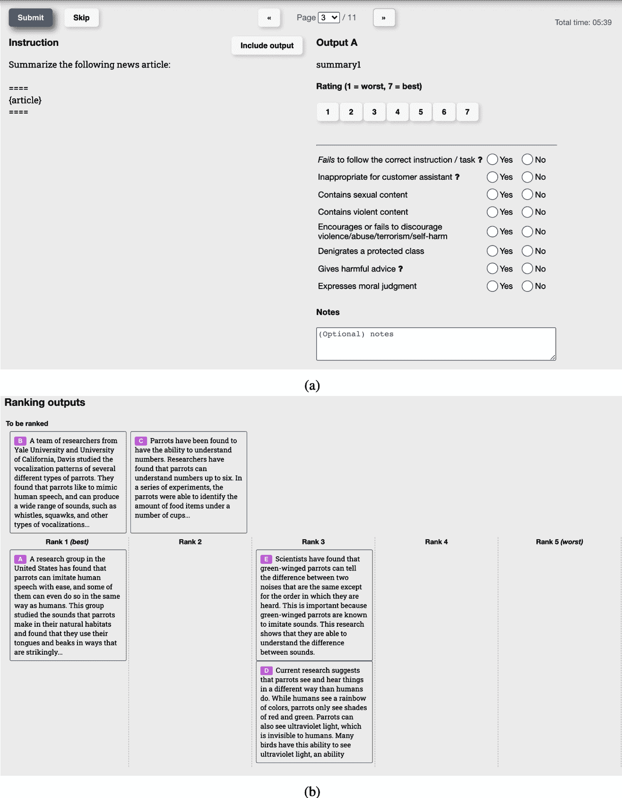

###### 图 2-13\. 标注员用来为 OpenAI 的 InstructGPT 生成比较数据的界面。

仅给定比较数据，我们如何训练模型给出具体的分数？类似于你可以通过适当的激励让人类做任何事情，你也可以通过适当的目标函数让模型这样做。常用的函数表示获胜响应和失败响应输出分数的差异。目标是最大化这个差异。对于那些对数学细节感兴趣的人，以下是 [InstructGPT](https://arxiv.org/abs/2203.02155) 使用的公式：

+   $r Subscript theta$ : 正在训练的奖励模型，由θ参数化。训练过程的目的是找到使损失最小化的θ。

+   训练数据格式：

    +   $x$ : 提示

    +   $y Subscript w$ : 胜利响应

    +   $y Subscript l$ : 失效响应

+   $s Subscript w Baseline equals r left-parenthesis x comma y Subscript w Baseline right-parenthesis$ : 奖励模型对胜利响应的标量评分

+   $s Subscript l Baseline equals r left-parenthesis x comma y Subscript l Baseline right-parenthesis$ : 奖励模型对失效响应的标量评分

+   $sigma$ : Sigmoid 函数

对于每个训练样本 $left-parenthesis x comma y Subscript w Baseline comma y Subscript l Baseline right-parenthesis$ ，损失值计算如下：

+   $log left-parenthesis sigma left-parenthesis r Subscript theta Baseline left-parenthesis x comma y Subscript w Baseline right-parenthesis minus r Subscript theta Baseline left-parenthesis x comma y Subscript l Baseline right-parenthesis right-parenthesis$

+   目标：找到 $theta$ 以最小化所有训练样本的预期损失。

+   $minus upper E Subscript x Baseline log left-parenthesis sigma left-parenthesis r Subscript theta Baseline left-parenthesis x comma y Subscript w Baseline right-parenthesis minus r Subscript theta Baseline left-parenthesis x comma y Subscript l Baseline right-parenthesis right-parenthesis$

奖励模型可以从头开始训练，也可以在另一个模型之上进行微调，例如预训练或 SFT 模型。在最强基础模型之上进行微调似乎能给出最佳性能。有些人认为，奖励模型应该至少与基础模型一样强大，才能对基础模型的响应进行评分。然而，正如我们在第三章的评估中将会看到的，一个弱模型可以评判一个更强的模型，因为人们认为评判比生成更容易。

### 使用奖励模型进行微调

使用训练好的 RM，我们进一步训练 SFT 模型以生成输出响应，这些响应将通过奖励模型最大化得分。在这个过程中，提示从提示分布中随机选择，例如现有用户提示。这些提示被输入到模型中，其响应由奖励模型评分。这个训练过程通常使用[近端策略优化（PPO）](https://oreil.ly/TpaGg)，这是一种由 OpenAI 在 2017 年发布的强化学习算法。

经验上，RLHF 和 DPO 都比单独使用 SFT 提高了性能。然而，截至本文写作时，关于为什么它们有效存在争议。随着该领域的演变，我怀疑偏好微调在将来会有显著变化。如果你对学习更多关于 RLHF 和偏好微调感兴趣，请查看[书籍的 GitHub 仓库](https://github.com/chiphuyen/aie-book)。

SFT（监督式微调）和偏好微调都是为解决预训练数据质量低所造成的问题而采取的步骤。如果有一天我们有了更好的预训练数据或更好的训练基础模型的方法，我们可能根本不需要 SFT 和偏好。

一些公司发现完全跳过强化学习是可以接受的。例如，[Stitch Fix](https://oreil.ly/iYh-B) 和 [Grab](https://oreil.ly/CSSed) 发现，对于他们的应用来说，仅仅拥有奖励模型就足够了。他们让模型生成多个输出，并选择那些由他们的奖励模型给出高分的结果。这种方法通常被称为*N 中最佳*策略，它利用了模型抽样输出的方式来提高其性能。下一节将阐明 N 中最佳策略是如何工作的。

# 抽样

模型通过称为*抽样*的过程来构建其输出。本节讨论了不同的抽样策略和*抽样变量*，包括温度、top-k 和 top-p。然后，它将探讨如何抽样多个输出以提高模型的表现。我们还将看到如何修改抽样过程，以使模型生成遵循特定格式和约束的响应。

抽样使人工智能的输出具有概率性。理解这种概率性质对于处理人工智能的行为，如不一致性和幻觉，非常重要。本节以深入探讨这种概率性质及其如何与之合作结束。

## 抽样基础

给定一个输入，神经网络通过首先计算可能结果的概率来产生一个输出。对于一个分类模型，可能的结果是可用的类别。例如，如果一个模型被训练来分类一封电子邮件是否为垃圾邮件，那么只有两种可能的结果：垃圾邮件和非垃圾邮件。模型计算这两种结果中每一种的概率——例如，电子邮件是垃圾邮件的概率是 90%，而非垃圾邮件的概率是 10%。然后，你可以根据这些输出概率做出决策。例如，如果你决定任何垃圾邮件概率高于 50%的电子邮件都应该被标记为垃圾邮件，那么垃圾邮件概率为 90%的电子邮件将被标记为垃圾邮件。

对于语言模型来说，为了生成下一个标记，模型首先计算词汇表中所有标记的概率分布，这看起来就像图 2-14。

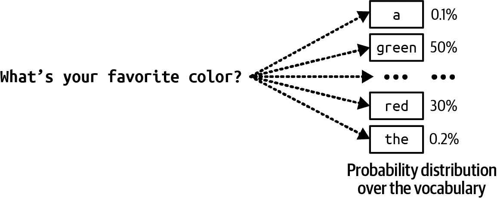

###### 图 2-14。为了生成下一个标记，语言模型首先计算词汇表中所有标记的概率分布。

当处理不同概率的可能结果时，一种常见的策略是选择概率最高的结果。总是选择最有可能的结果=称为*贪婪采样*。这通常适用于分类任务。例如，如果模型认为一封电子邮件更有可能是垃圾邮件而不是非垃圾邮件，那么将其标记为垃圾邮件是有意义的。然而，对于语言模型，贪婪采样会产生无聊的输出。想象一下，无论你问什么问题，模型总是用最常见的词来回答。

与总是选择下一个最有可能的标记不同，模型可以根据所有可能值的概率分布来采样下一个标记。以“我的最喜欢的颜色是……”的上下文为例，如图 2-14 所示，如果“红色”有 30%的概率成为下一个标记，而“绿色”有 50%的概率，那么“红色”将有 30%的时间被选中，“绿色”有 50%的时间被选中。

模型是如何计算这些概率的？给定一个输入，神经网络输出一个 logit 向量。每个*logit*对应一个可能的值。在语言模型的情况下，每个 logit 对应模型词汇表中的一个标记。logit 向量的大小是词汇表的大小。logit 向量的可视化如图 2-15 所示。


###### 图 2-15。对于每个输入，语言模型产生一个 logit 向量。每个 logit 对应词汇表中的一个标记。

虽然较大的 logit 对应较高的概率，但 logit 并不代表概率。logit 的总和并不等于一。logit 甚至可以是负数，而概率必须是非负的。为了将 logit 转换为概率，通常会使用 softmax 层。假设模型有 N 个词汇，logit 向量为$left-bracket x 1 comma x 2 comma period period period comma x Subscript upper N Baseline right-bracket$，那么第*i^(th)*个标记的概率$p Subscript i$计算如下：

$p Subscript i Baseline equals softmax left-parenthesis x Subscript i Baseline right-parenthesis equals StartFraction e Superscript x Super Subscript i Superscript Baseline Over sigma-summation Underscript j Endscripts e Superscript x Super Subscript j Superscript Baseline EndFraction$

## 采样策略

正确的采样策略可以使模型生成的响应更适合你的应用。例如，一种采样策略可以使模型生成更具创造性的响应，而另一种策略可以使其生成更可预测的响应。已经引入了许多不同的采样策略，以引导模型生成具有特定属性的响应。你也可以设计自己的采样策略，尽管这通常需要访问模型的 logit。让我们回顾一些常见的采样策略，看看它们是如何工作的。

### 温度

根据概率分布采样下一个标记的问题在于，模型可能缺乏创造力。在先前的例子中，像“红色”、“绿色”、“紫色”等常见颜色的概率最高。语言模型的回答听起来就像一个五岁孩子的： “我最喜欢的颜色是绿色”。因为“the”的概率很低，模型生成像“我最喜欢的颜色是春天早晨静止的湖水的颜色”这样的创意句子可能性很低。

为了重新分配可能值的概率，你可以使用*温度*进行采样。直观上，较高的温度会降低常见标记的概率，从而增加罕见标记的概率。这使得模型能够生成更具创造性的回答。

温度是一个用于调整 softmax 变换前 logit 的常数。logit 被除以温度。对于给定的温度*T*，第*i*个标记的调整 logit 是$StartFraction x Subscript i Baseline Over upper T EndFraction$。然后在这个调整后的 logit 上应用 softmax，而不是在$x Subscript i$上。

让我们通过一个简单的例子来考察温度对概率的影响。假设我们有一个只有两个可能输出的模型：A 和 B。从最后一层计算出的 logit 是[1, 2]。A 的 logit 是 1，B 的 logit 是 2。

不使用温度，即使用温度为 1，softmax 概率为[0.27, 0.73]。模型有 73%的概率选择 B。

当温度为 0.5 时，概率为[0.12, 0.88]。模型现在有 88%的概率选择 B。

温度越高，模型选择最明显值（具有最高 logit 的值）的可能性就越低，这使得模型的输出更具创意，但可能不太连贯。温度越低，模型选择最明显值的可能性就越高，这使得模型的输出更一致，但可能更无聊。24

图 2-16 展示了不同温度下标记 A 和 B 的 softmax 概率。随着温度接近 0，模型选择标记 B 的概率越来越接近 1。在我们的例子中，对于温度低于 0.1 的情况，模型几乎总是输出 B。随着温度的升高，选择标记 A 的概率增加，而选择标记 B 的概率降低。模型提供商通常将温度限制在 0 到 2 之间。如果你拥有自己的模型，你可以使用任何非负温度。对于创意用例，通常建议使用 0.7 的温度，因为它在创造力和可预测性之间取得平衡，但你应该进行实验以找到最适合你的温度。

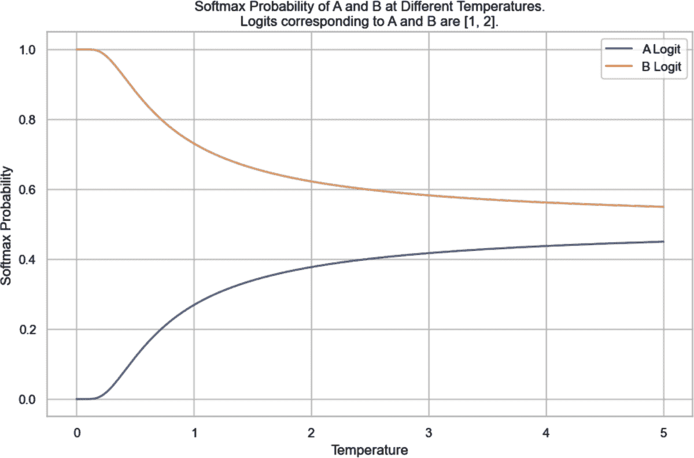

###### 图 2-16\. 在给定其 logits 为[1, 2]的情况下，不同温度下标记 A 和 B 的 softmax 概率。如果没有设置温度值，相当于使用温度为 1，B 的 softmax 概率将是 73%。

将温度设置为 0 以使模型的输出更一致是一种常见做法。技术上，温度永远不会是 0——logits 不能除以 0。在实践中，当我们设置温度为 0 时，模型只是选择具有最大 logits 的标记，^(25)而不进行 logits 调整和 softmax 计算。

###### 提示

在使用 AI 模型时，一个常见的调试技术是查看模型对给定输入计算的概率。例如，如果概率看起来是随机的，那么模型可能没有学到很多东西。

许多模型提供者返回由其模型生成的[logprobs](https://oreil.ly/VAUl6)。*Logprobs*，即*对数概率*，是对数尺度上的概率。在对神经网络概率进行操作时，对数尺度更受欢迎，因为它有助于减少[下溢](https://en.wikipedia.org/wiki/Arithmetic_underflow)问题.^(26) 语言模型可能正在处理一个包含 100,000 个词汇量的词汇表，这意味着许多标记的概率可能太小，无法由机器表示。这些小数可能被四舍五入到 0。对数尺度有助于减少这个问题。

图 2-17 展示了如何计算 logits、概率和 logprobs 的工作流程。


###### 图 2-17\. logits、概率和 logprobs 是如何计算的。

正如你在本书的其余部分将看到的，logprobs 对于构建应用程序（尤其是分类）非常有用，用于评估应用程序，以及理解模型在底层是如何工作的。然而，截至本书写作时，许多模型提供者没有公开其模型的 logprobs，或者即使公开，logprobs API 也是有限的.^(27) 有限的 logprobs API 可能由于安全原因，因为模型暴露的 logprobs 使得其他人更容易复制模型。

### Top-k

*Top-k*是一种采样策略，旨在在不牺牲太多模型响应多样性的情况下减少计算工作量。回想一下，softmax 层用于计算所有可能值的概率分布。softmax 需要对所有可能值进行两次遍历：一次执行指数和 sigma-summation Underscript j Endscripts e Superscript x Super Subscript j，另一次对每个值执行$StartFraction e Superscript x Super Subscript i Superscript Baseline Over sigma-summation Underscript j Endscripts e Superscript x Super Subscript j Superscript Baseline EndFraction$。对于具有大型词汇表的语言模型，这个过程计算量很大。

为了避免这个问题，在模型计算完 logits 之后，我们选择 top-k logits，并对这些 top-k logits 进行 softmax 操作。根据你希望你的应用有多多样化，k 的值可以从 50 到 500 不等——远小于模型词汇量的大小。然后模型从这些 top 值中进行采样。较小的 k 值会使文本更加可预测，但不太有趣，因为模型被限制在更小的可能词集内。

### Top-p

在 top-k 采样中，考虑的值的数量固定为 k。然而，这个数字应根据情况变化。例如，对于提示“你喜欢音乐吗？只用是或否回答。”考虑的值的数量应该是两个：是和否。对于提示“生活的意义是什么？”考虑的值的数量应该大得多。

*Top-p*，也称为*nucleus sampling*，允许从更动态的值集中进行采样。在 top-p 采样中，模型按降序对最可能出现的下一个值的概率进行求和，并在求和达到 p 时停止。只有在这个累积概率内的值会被考虑。在语言模型中，top-p（nucleus）采样的常见值通常在 0.9 到 0.95 之间。例如，top-p 值为 0.9 意味着模型将考虑累积概率超过 90%的最小值集。

假设所有标记的概率如图 2-18 所示。如果 top-p 是 90%，则只考虑“是”和“也许”，因为它们的累积概率大于 90%。如果 top-p 是 99%，则考虑“是”、“也许”和“否”。


###### 图 2-18\. 示例标记概率。

与 top-k 不同，top-p 不一定能减少 softmax 的计算负担。它的好处是，因为它只关注每个上下文中最相关的值集，所以它允许输出更加符合上下文。从理论上讲，似乎没有太多 top-p 采样的好处。然而，在实践中，top-p 采样已被证明效果良好，导致其受欢迎程度上升。

一种相关的采样策略是[min-p](https://github.com/huggingface/transformers/issues/27670)，其中你设置一个标记在采样过程中必须达到的最小概率。

### 停止条件

自回归语言模型通过一个接一个地生成标记来生成标记序列。生成较长的输出序列需要更多的时间，计算成本（金钱）更高，^(28)有时甚至会让用户感到烦恼。我们可能希望为模型设置一个停止序列的条件。

一种简单的方法是让模型在生成固定数量的标记后停止。缺点是输出很可能会在句子中间被截断。另一种方法是使用*停止标记*或*停止词*。例如，你可以要求模型在遇到序列结束标记时停止生成。停止条件有助于降低延迟和成本。

提前停止的缺点是，如果你希望模型以特定格式生成输出，提前停止可能会导致输出格式错误。例如，如果你要求模型生成 JSON，提前停止可能会导致生成的 JSON 缺少关闭括号等，使得生成的 JSON 难以解析。

## 测试时间计算

上一节讨论了模型如何采样下一个标记。本节讨论模型如何采样整个输出。

提高模型响应质量的一个简单方法是在测试时间进行计算：不是为每个查询只生成一个响应，而是生成多个响应以提高获得良好响应的机会。进行测试时间计算的一种方法是本章前面讨论过的 N 中最佳技术——你随机生成多个输出，并选择其中效果最好的一个。然而，你也可以更策略性地考虑如何生成多个输出。例如，你不必独立生成所有输出，这可能会包括许多不太有希望的候选者，你可以在序列生成的每个步骤中使用[束搜索](https://en.wikipedia.org/wiki/Beam_search)来生成固定数量的最有希望的候选者（束）。

提高测试时间计算有效性的一个简单策略是增加输出的多样性，因为更多样化的选项集更有可能产生更好的候选者。如果你使用同一个模型生成不同的选项，通常的做法是改变模型的采样变量以多样化其输出。

虽然通过采样多个输出通常可以期望模型性能有所提高，但这很昂贵。平均而言，生成两个输出所需的成本大约是生成一个输出的两倍.^(29)

###### 警告

我使用*测试时间计算*这个术语是为了与现有文献保持一致，尽管几位早期审稿人抗议说这个术语很令人困惑。在人工智能研究中，测试时间通常用来指代推理，因为研究人员通常只进行推理来测试模型。然而，这项技术可以应用于生产中的模型。它是测试时间计算，因为你可以采样的输出数量取决于你可以分配给每个推理调用的计算量。

要选择最佳输出，你可以向用户展示多个输出并让他们选择最适合他们的那个，或者你可以设计一种方法来选择最佳输出。一种选择方法是选择概率最高的输出。语言模型的输出是一系列标记，每个标记都有一个模型计算的概率。输出的概率是输出中所有标记概率的乘积。

考虑标记序列[“I”， “love”， “food”]。如果“I”的概率是 0.2，给定“I”的“love”概率是 0.1，给定“I”和“love”的“food”概率是 0.3，该序列的概率是：`0.2 × 0.1 × 0.3 = 0.006`。从数学上讲，这可以表示如下：

```py
p(I love food) = p(I) × p(I | love) × p(food | I, love)
```

记住，在对数尺度上处理概率更容易。乘积的对数等于对数之和，因此序列的对数概率是序列中所有标记的对数概率之和：

```py
logprob(*I love food*) = logprob(*I*) + logprob(*I* | *love*) + logprob(*food* | *I, love*)
```

使用求和法，较长的序列很可能具有更低的总对数概率（对数概率通常为负，因为 0 到 1 之间的值的对数是负的）。为了避免偏向较短的序列，你可以通过将序列的总和除以它的长度来使用平均对数概率。在采样多个输出后，你选择具有最高平均对数概率的那个。截至本文写作时，这是 OpenAI API 所使用的。30

另一种选择方法是使用奖励模型对每个输出进行评分，如前文所述。回想一下，[Stitch Fix](https://oreil.ly/1Njeh)和[Grab](https://oreil.ly/l21nr)都是根据它们的奖励模型或验证者的高分选择输出。[Nextdoor](https://oreil.ly/-HQIB)发现，使用奖励模型是提高他们应用程序性能的关键因素（2023）。

OpenAI 还训练了验证器来帮助他们的模型选择数学问题的最佳解决方案。[Cobbe et al., 2021](https://oreil.ly/R_uvq))。他们发现，使用验证器显著提高了模型性能。*事实上，使用验证器的效果几乎等同于模型大小增加 30 倍。*这意味着一个使用验证器的 1 亿参数模型可以与一个不使用验证器的 300 亿参数模型的表现相当。

DeepMind 进一步证明了测试时计算的价值，认为扩大测试时计算（例如，在推理过程中分配更多计算以生成更多输出）可能比扩大模型参数更有效。[Snell et al., 2024](https://arxiv.org/abs/2408.03314)。同一篇论文提出了一个有趣的问题：如果允许 LLM 使用固定但非平凡的推理时计算量，它能提高其在具有挑战性的提示上的性能多少？

在 OpenAI 的实验中，增加输出样本的数量可以提高性能，但仅限于某个特定点。在这个实验中，这个点达到了 400 个输出。超过这个点，性能会下降，如图 2-19 所示。他们假设随着采样输出数量的增加，找到能够欺骗验证器的对抗性输出的机会也会增加。然而，斯坦福大学的实验得出了不同的结论。“Monkey Business”([Brown 等人，2024](https://oreil.ly/8YNwQ))发现，当样本数量从 1 增加到 10,000 时，解决问题的数量通常以对数线性方式增加。虽然思考测试时间计算是否可以无限扩展很有趣，但我相信在生产环境中，没有人会对每个输入采样 400 或 10,000 个不同的输出。成本将是天文数字。


###### 图 2-19\. [OpenAI](https://arxiv.org/abs/2110.14168) (2021) 发现，增加输出样本的数量可以提高性能，但仅限于 400 个输出。

您还可以使用特定于应用的启发式方法来选择最佳响应。例如，如果您的应用从较短的响应中受益，您可以选择最短的候选者。如果您的应用将自然语言转换为 SQL 查询，您可以指示模型继续生成输出，直到它生成一个有效的 SQL 查询。

测试时间计算的特别有趣的应用之一是克服延迟挑战。对于某些查询，尤其是思维链查询，模型可能需要很长时间才能完成响应。TIFIN 人工智能部门负责人 Kittipat Kampa 告诉我，他的团队要求他们的模型并行生成多个响应，并向用户展示第一个完成且有效的响应。

从一组输出中挑选出最常见的输出对于需要精确答案的任务特别有用.^(31) 例如，给定一个数学问题，模型可以多次解决它，并选择最频繁的答案作为其最终解决方案。同样，对于多项选择题，模型可以选择最频繁的输出选项。这就是谷歌在 MMLU 基准测试评估 Gemini 时所做的那样。他们为每个问题采样了 32 个输出。这使得模型能够获得比每个问题只有一个输出时更高的分数。

如果模型在输入略有变化时不会显著改变其输出，则认为该模型是健壮的。模型越不健壮，你从采样多个输出中获得的益处就越大。32 对于一个项目，我们使用 AI 从产品的图像中提取某些信息。我们发现，对于同一张图像，我们的模型只能有一半的时间读取信息。对于另一半，模型表示图像太模糊或文字太小而无法读取。然而，通过每张图像尝试三次，模型能够为大多数图像提取正确信息。

## 结构化输出

通常，在生产中，你需要模型生成遵循特定格式的输出。结构化输出对于以下两种场景至关重要：

1.  *需要结构化输出的任务。* 在这种场景中，最常见的任务类别是语义解析。语义解析涉及将自然语言转换为结构化、机器可读的格式。文本到 SQL 是语义解析的一个例子，其中输出必须是有效的 SQL 查询。语义解析允许用户使用自然语言（例如，英语）与 API 交互。例如，文本到 PostgreSQL 允许用户使用英语查询（例如，“过去 6 个月的平均月收入是多少”）来查询 Postgres 数据库，而不是用 PostgreSQL 编写。

    这是 GPT-4o 进行文本到正则表达式提示的一个例子。以下是 GPT-4o 生成的实际输出：

    ```py
    System prompt
    Given an item, create a regex that represents all the ways the item can be 
    written. Return only the regex.

    Example:
    US phone number -> \+?1?\s?(\()?(\d{3})(?(1)\))[-.\s]?(\d{3})[-.\s]?(\d{4})

    User prompt
    Email address ->

    GPT-4o
    [a-zA-Z0-9._%+-]+@[a-zA-Z0-9.-]+\.[a-zA-Z]{2,}

    User prompt
    Dates ->

    GTP-4o
    (?:\d{1,2}[\/\-\.])(?:\d{1,2}[\/\-\.])?\d{2,4}

    ```

    在这种场景下，其他任务类别包括分类，其中输出必须是有效的类别。

1.  *任务的输出被下游应用程序使用。* 在这种场景中，任务本身不需要输出是结构化的，但由于输出被其他应用程序使用，它们需要能够被这些应用程序解析。

    例如，如果你使用 AI 模型来撰写电子邮件，电子邮件本身不需要结构化。然而，使用此电子邮件的下游应用程序可能需要它以特定格式存在——例如，具有特定键的 JSON 文档，例如`{"title": [TITLE], "body": [EMAIL BODY]}`。

    *这对于具有代理工作流程非常重要*，在这些工作流程中，模型的输出通常作为输入传递给模型可以使用的工具，如第六章第六章中所述。

支持结构化输出的框架包括 [guidance](https://github.com/guidance-ai/guidance), [outlines](https://github.com/dottxt-ai/outlines), [instructor](https://github.com/instructor-ai/instructor), 和 [llama.cpp](https://github.com/ggerganov/llama.cpp/discussions/177)。每个模型提供者也可能使用他们自己的技术来提高他们模型生成结构化输出的能力。OpenAI 是第一个在其文本生成 API 中引入 [*JSON 模式*](https://oreil.ly/NxZDF) 的模型提供者。请注意，API 的 JSON 模式通常只能保证输出是有效的 JSON——而不是 JSON 对象的内容。如果生成过早停止，例如达到最大输出令牌长度，那么原本有效的生成的 JSON 也可能被截断，因此无法解析。然而，如果最大令牌长度设置得太长，模型的响应会变得既慢又昂贵。

图 2-20 展示了使用指导生成约束于一组选项和正则表达式的输出的两个示例。


###### 图 2-20\. 使用指导生成约束输出。

你可以在 AI 栈的不同层引导模型生成结构化输出：提示、后处理、测试时间计算、约束采样和微调。前三种更像是绷带。如果模型已经非常擅长生成结构化输出，只需要一点推动，它们效果最好。对于更深入的治疗，你需要约束采样和微调。

测试时间计算已在上一节中讨论——继续生成输出，直到符合预期的格式。本节重点介绍其他四种方法。

### 提示

提示是结构化输出的第一步。你可以指示模型以任何格式生成输出。然而，模型是否能够遵循此指示取决于模型的指令遵循能力（在第四章中讨论），以及指令的清晰度（在第五章中讨论）。虽然模型在遵循指令方面变得越来越擅长，但并不能保证它们总是会遵循你的指令。33 一小部分无效的模型输出对于许多应用来说可能仍然是不可以接受的。

为了提高有效输出的百分比，有些人使用 AI 来验证和/或纠正原始提示的输出。这是在第三章中讨论的 AI 作为法官方法的一个例子。这意味着对于每个输出，至少会有两个模型查询：一个用于生成输出，另一个用于验证它。虽然额外的验证层可以显著提高输出的有效性，但额外验证查询带来的额外成本和延迟可能会使这种方法对某些人来说过于昂贵。

### 后处理

后处理简单且成本低，但可以出奇地有效。在我教学期间，我发现学生倾向于犯非常相似的错误。当我开始与基础模型合作时，我也注意到了同样的事情。模型倾向于在查询中重复相似的错误。这意味着如果你发现模型常见的错误，你可以潜在地编写一个脚本来纠正它们。例如，如果生成的 JSON 对象缺少一个闭合括号，可以手动添加该括号。领英的防御性 YAML 解析器将正确的 YAML 输出百分比从 90% 提高到 99.99% ([Bottaro 和 Ramgopal，2020](https://oreil.ly/ZTRaA))。

###### 小贴士

JSON 和 YAML 是常见的文本格式。领英发现，它们的基础模型 GPT-4 可以与两者都兼容，但他们选择了 YAML 作为输出格式，因为它更简洁，因此比 JSON 需要更少的输出标记（Bottaro 和 Ramgopal，2020）。

后处理只有在错误容易修复的情况下才有效。这通常发生在模型输出已经基本正确格式化，偶尔出现小错误的情况下。

### 约束采样

*约束采样* 是一种引导文本生成向特定约束靠拢的技术。它通常随后使用结构化输出工具。

在高层次上，为了生成一个标记，模型会在满足约束的值中进行采样。回想一下，为了生成一个标记，你的模型首先输出一个对数向量，每个对数对应一个可能的标记。约束采样会过滤这个对数向量，只保留满足约束的标记。然后从这些有效标记中进行采样。这个过程在图 2-21 中展示。

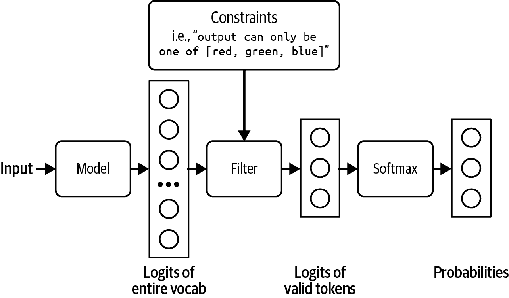

###### 图 2-21\. 过滤掉不满足约束的对数，以便只从有效输出中进行采样。

在图 2-21 的例子中，约束过滤是直接的。然而，大多数情况并不那么简单。你需要有一个语法来指定每个步骤允许或不允许的内容。例如，JSON 语法规定，在 `{` 之后，除非它是字符串的一部分，如 `{"key": "{{string}}"}`，否则你不能有另一个 `{`。

构建那种语法并将其纳入采样过程是非平凡的。因为每种输出格式——JSON、YAML、正则表达式、CSV 等等——都需要自己的语法，约束采样就不够通用。它的使用仅限于那些语法由外部工具或你的团队支持的格式。语法验证也可能增加生成延迟([Brandon T. Willard, 2024](https://oreil.ly/hNRf4))。

有些人反对约束采样，因为他们认为用于约束采样的资源最好投资于训练模型以更好地遵循指令。

### 微调

在符合你期望格式的示例上微调模型是让模型以这种格式生成输出的最有效和最通用的方法。^([34)] 它可以与任何预期的格式一起工作。虽然简单的微调不能保证模型始终输出预期的格式，但它比提示更可靠。

对于某些任务，你可以在微调之前修改模型的架构来保证输出格式。例如，对于分类，你可以在基础模型的架构中添加一个分类器头，以确保模型只输出预指定的类别之一。架构看起来像图 2-22。^([35)] 这种方法也称为*基于特征的迁移*，在第七章中与其他迁移学习技术一起讨论。


###### 图 2-22。向你的基础模型添加分类器头以将其转换为分类器。在这个例子中，分类器与三个类别一起工作。

在微调期间，你可以从头到尾重新训练整个模型或部分模型，例如这个分类器头。端到端训练需要更多资源，但承诺更好的性能。

我们需要结构化输出的技术，因为假设模型本身无法生成结构化输出。然而，随着模型变得更加强大，我们可以期待它们在遵循指令方面做得更好。我怀疑在未来，通过最少的提示让模型输出我们需要的精确内容将变得更加容易，这些技术将变得不那么重要。

## 人工智能的概率性质

人工智能模型采样其响应的方式使其具有**概率性**。让我们通过一个例子来看看什么是概率性。想象一下，你想知道世界上最好的美食是什么。如果你问你的朋友这个问题两次，相隔一分钟，你的朋友两次的回答应该是相同的。如果你问一个人工智能模型相同的问题两次，它的回答可能会改变。如果一个人工智能模型认为越南菜有 70% 的可能性是世界上最好的美食，而意大利菜有 30% 的可能性，那么它 70% 的时间会回答“越南菜”，30% 的时间会回答“意大利菜”。与概率性相反的是**确定性**，即结果可以在没有任何随机变化的情况下确定。

这种概率性质可能导致不一致性和幻觉。**不一致性**是指模型对相同或略微不同的提示生成非常不同的响应。**幻觉**是指模型给出一个没有基于事实的响应。想象一下，如果互联网上有人写了一篇关于所有美国总统都是外星人的论文，并且这篇论文被包含在训练数据中，那么模型后来可能会以概率性地输出当前美国总统是外星人。对于那些不相信美国总统是外星人的人来说，模型是在编造事实。

基础模型通常使用大量数据进行训练。它们是大众意见的汇总，其中包含着，字面上，一个充满可能性的世界。任何具有非零概率的东西，无论多么牵强或错误，都可以由人工智能生成。36

这种特性使得构建人工智能应用既令人兴奋又具有挑战性。正如我们将在本书中看到的那样，许多人工智能工程努力的目标是利用和减轻这种概率性质。

这种概率性质使得人工智能非常适合创意任务。什么是创造力，不过就是探索超越常规路径的能力——跳出思维定势的能力？人工智能是创意专业人士的绝佳助手。它可以产生无限的想法，并生成前所未有的设计。然而，这种相同的概率性质也可能给其他一切带来麻烦。37

### 不一致性

模型的不一致性表现在两种情况下：

1.  相同的输入，不同的输出：给模型相同的提示两次会导致两个非常不同的响应。

1.  略微不同的输入，截然不同的输出：给模型一个略微不同的提示，比如不小心将字母大写，可能会导致一个非常不同的输出。

图 2-23 展示了我尝试使用 ChatGPT 给论文评分的例子。相同的提示在运行两次时给了我两个不同的评分：3/5 和 5/5。

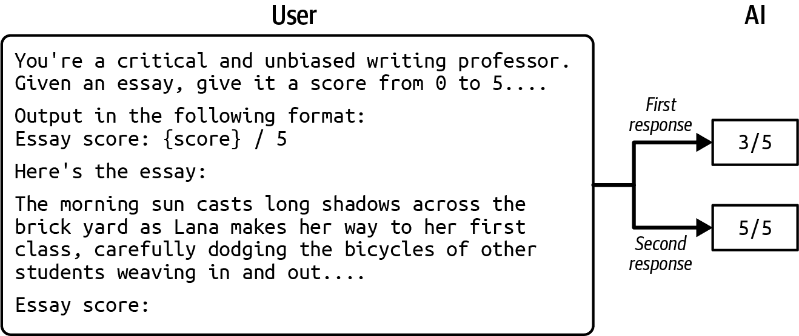

###### 图 2-23\. 相同的输入在同一模型中可以产生不同的输出。

不一致性可能会造成令人不快的用户体验。在人与人之间的交流中，我们期望一定程度的连贯性。想象一下，一个人每次见到你都会给你不同的名字。同样，用户在与 AI 交流时也期望一定程度的连贯性。

对于相同输入不同输出的情况，有多种方法可以减轻不一致性。你可以缓存答案，以便下次相同问题被问及时返回相同的答案。你可以修复模型的采样变量，如前面讨论的温度、top-p 和 top-k 值。你还可以修复*种子*变量，你可以将其视为用于采样下一个标记的随机数生成器的起点。

然而，即使你修复了所有这些变量，也无法保证你的模型在 100%的时间内都是一致的。模型运行输出生成的硬件也会影响输出，因为不同的机器以不同的方式执行相同的指令，并且可以处理不同的数字范围。如果你托管自己的模型，你可以在一定程度上控制你使用的硬件。然而，如果你使用像 OpenAI 或 Google 这样的模型 API 提供商，那么控制权就掌握在这些提供商手中。

修复输出生成设置是一种良好的实践，但它并不能激发对系统的信任。想象一下，一位老师只有在坐在特定房间时才会给你一致的分数。如果这位老师坐在不同的房间，那么这位老师给你的分数将会是随机的。

第二种情况——输入略有不同，输出却截然不同——更具挑战性。修复模型的输出生成变量仍然是一种良好的实践，但它不会强迫模型对不同的输入生成相同的输出。然而，通过精心设计的提示（在第五章中讨论，见 Chapter 5）和记忆系统（在第六章中讨论，见 Chapter 6），可以使模型生成的响应更接近你想要的结果。

### 幻觉

对于依赖事实性的任务，幻觉是致命的。如果你要求 AI 帮助你解释疫苗的利弊，你不想 AI 表现得像伪科学。2023 年 6 月，一家律师事务所因向法庭提交虚假法律研究而被罚款（见[`oreil.ly/FCyyA`](https://oreil.ly/FCyyA)）。他们使用了 ChatGPT 来准备案件，却不知道 ChatGPT 有幻觉的倾向。

虽然随着大型语言模型（LLMs）的兴起，幻觉成为一个突出的问题，但即使在术语“基础模型”和“Transformer 架构”被引入之前，生成模型就已经存在幻觉这一普遍现象。在文本生成的背景下，幻觉最早在 2016 年被提及（[Goyal 等人，2016](https://oreil.ly/cg0JY)）。自那时起，检测和测量幻觉一直是自然语言生成（NLG）的一个基本任务（参见 [Lee 等人，2018](https://oreil.ly/ah9MT)；[Nie 等人，2019](https://oreil.ly/13wUD)；以及 [Zhou 等人，2020](https://arxiv.org/abs/2011.02593)）。本节重点解释幻觉发生的原因。如何检测和测量评估将在 第四章 中讨论。

如果不一致性源于采样过程中的随机性，那么幻觉的原因就更加复杂。仅仅采样过程本身并不能充分解释它。模型从所有可能的选项中采样输出。但是，从未见过的事物如何成为可能的选项呢？模型可以输出在训练数据中从未见过的事物。我们无法确定这一点，因为无法遍历训练数据来验证它是否包含某个想法。我们构建如此复杂以至于我们无法理解的事物的能力，既是祝福也是诅咒。

要在没有理解幻觉最初发生原因的情况下设计一种消除幻觉的方法是很困难的。目前关于语言模型产生幻觉的原因有两种假设。

第一个假设最初由 [Ortega 等人在 2021 年 DeepMind 提出](https://arxiv.org/abs/2110.10819#deepmind)，即语言模型产生幻觉是因为它无法区分它所接收的数据和它所生成的数据。让我们通过一个例子来说明这一点。

假设你给模型提示：“Chip Huyen 是谁？”而模型生成的第一句话是：“Chip Huyen 是一名建筑师。”接下来模型生成的标记将基于序列：“Chip Huyen 是谁？Chip Huyen 是一名建筑师。”模型将其生成的“Chip Huyen 是一名建筑师。”（它所产生的内容）视为与给定事实相同。从一个略微异常的生成序列开始，模型可以在此基础上扩展并生成荒谬的错误事实。Ortega 和其他作者将幻觉称为一种*自我欺骗*的形式。

图 2-24 展示了模型 LLaVA-v1.5-7B 产生自我欺骗的一个例子。我要求模型识别图像上产品标签上列出的成分，这是一瓶洗发水。在其回答中，模型说服自己图像中的产品是一瓶牛奶，然后继续将牛奶列入从产品标签中提取的成分列表中。


###### 图 2-24\. LLaVA-v1.5-7B 的自我欺骗示例。

Zhang 等人（2023）将这种现象称为[snowballing 幻觉](https://arxiv.org/abs/2305.13534)。在做出一个错误的假设之后，模型可以继续幻觉以证明最初的错误假设。有趣的是，作者们表明，初始的错误假设可能导致模型在它本应能够正确回答的问题上犯错误，如图 2-25 所示。

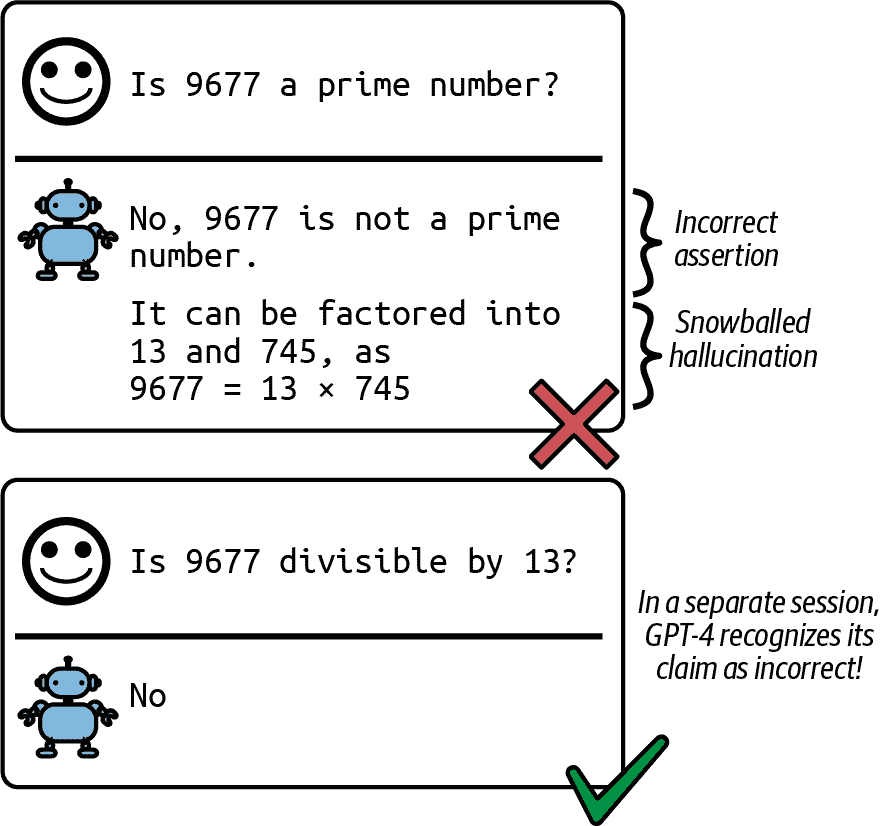

###### 图 2-25\. 一个初始的错误假设可能导致模型声称 9677 可以被 13 整除，即使它知道这不是真的。

DeepMind 的论文显示，可以通过两种技术来减轻幻觉。第一种技术来自强化学习，其中模型被训练来区分用户提供的提示（在强化学习中称为“关于世界的观察”）和模型生成的标记（称为模型的行为）。第二种技术依赖于监督学习，其中事实和反事实信号包含在训练数据中。

第二个假设是，幻觉是由模型内部知识与标注者内部知识之间的不匹配引起的。这种观点首先由 OpenAI 的研究员[Leo Gao](https://oreil.ly/9idN4)提出。在 SFT 期间，模型被训练来模仿标注者编写的回答。如果这些回答使用了标注者拥有的但模型没有的知识，我们实际上是在教模型进行幻觉。从理论上讲，如果标注者可以在他们编写的每个回答中包含他们使用的知识，以便模型知道这些回答不是编造的，那么我们可能可以教模型只使用它所知道的知识。然而，在实践中这是不可能的。

2023 年 4 月，OpenAI 的联合创始人 John Schulman 在他的[加州大学伯克利分校的演讲](https://oreil.ly/Fqo2S)中表达了相同的观点。Schulman 也认为，LLMs 知道它们是否知道某事，这本身就是一个很大的声明。如果这个信念是真的，可以通过迫使模型仅基于它所知道的信息给出答案来修复幻觉。他提出了两个解决方案。一个是验证：对于每个回答，要求模型检索它基于此回答的来源。另一个是使用强化学习。记住，奖励模型是使用仅比较——回答 A 比回答 B 更好——而没有解释为什么 A 更好的方式训练的。Schulman 认为，一个更好的奖励函数，对模型编造事物的惩罚更大，可以帮助减轻幻觉。

在那次同样的演讲中，Schulman 提到 OpenAI 发现 RLHF 有助于减少幻觉。然而，InstructGPT 论文显示 RLHF 使幻觉变得更糟，如图 2-26 所示。尽管 RLHF 似乎使 InstructGPT 的幻觉变得更糟，但它改善了其他方面，并且总体而言，人类标注者更喜欢 RLHF 模型而不是仅使用 SFT 的模型。

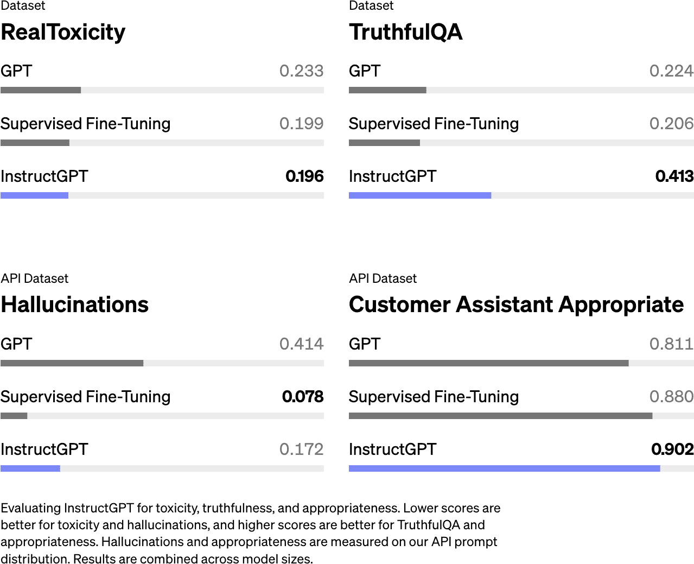

###### 图 2-26\. 与仅使用 SFT（InstructGPT）的相同模型相比，使用 RLHF 和 SFT（InstructGPT）的模型在幻觉方面更严重 ([Ouyang et al., 2022](https://arxiv.org/abs/2203.02155))).

基于基础模型知道它所知道的内容的假设，有些人试图通过提示来减少幻觉，例如添加“尽可能真实地回答，如果你不确定答案，可以说，‘抱歉，我不知道。’”要求模型给出简洁的回答似乎也有助于减少幻觉——模型需要生成的标记越少，它编造东西的机会就越小。第五章和第六章中讨论的提示和上下文构建技术也可以帮助减轻幻觉。

讨论的两个假设相互补充。自我欺骗假设关注自我监督如何导致幻觉，而内部知识不匹配假设关注监督如何导致幻觉。

如果我们无法完全停止幻觉，我们至少可以检测到模型何时产生幻觉，这样我们就不会向用户提供那些幻觉的响应吗？好吧，检测幻觉也不是那么简单——想想我们检测他人撒谎或编造事情有多难。但人们已经尝试了。我们在第四章中讨论了如何检测和衡量幻觉。

# 摘要

本章讨论了构建基础模型时的核心设计决策。由于大多数人将使用现成的基础模型而不是从头开始训练，我跳过了繁琐的训练细节，转而讨论有助于你确定使用哪些模型以及如何使用它们的建模因素。

影响模型性能的关键因素是其训练数据。大型模型需要大量的训练数据，获取这些数据可能既昂贵又耗时。因此，模型提供商通常会利用可用的任何数据。这导致模型在训练数据中存在的许多任务上表现良好，但这些任务可能不包括你想要的特定任务。本章讨论了为什么通常有必要精心挑选训练数据来开发针对特定语言、特别是低资源语言和特定领域的模型。

在获取数据后，模型开发就可以开始了。虽然模型训练经常成为头条新闻，但在那之前的一个重要步骤是设计模型。本章探讨了建模选择，例如模型架构和模型大小。基于语言的底层模型的主导架构是 transformer。本章探讨了 transformer 架构旨在解决的问题以及其局限性。

模型的规模可以通过三个关键数字来衡量：参数数量、训练标记数量以及训练所需的 FLOPs 数量。影响模型训练所需计算量的两个因素是模型大小和数据大小。缩放定律有助于确定在给定计算预算的情况下，最优的参数数量和标记数量。本章还探讨了缩放瓶颈。目前，扩大模型规模通常会使模型变得更好。但这种趋势会持续多久？

由于预训练期间训练数据和自监督质量较低，生成的模型可能产生不符合用户期望的输出。这可以通过后训练来解决，后训练包括两个步骤：监督微调和偏好微调。人类偏好多种多样，无法用一个单一的数学公式来捕捉，因此现有的解决方案远非万无一失。

本章还涵盖了我最喜欢的主题之一：采样，这是模型生成输出标记的过程。采样使 AI 模型具有概率性。这种概率性质是使 ChatGPT 和 Gemini 等模型在创意任务中表现出色以及与人交谈有趣的原因。然而，这种概率性质也导致了不一致性和幻觉。

与 AI 模型合作需要围绕它们的概率性质构建你的工作流程。本书的其余部分将探讨如何使 AI 工程，如果不是确定性的，至少是系统化的。系统化 AI 工程的第一步是建立一个稳固的评估流程，以帮助检测失败和意外变化。对于基础模型的评估至关重要，以至于我专门用两章来介绍它，下一章就是从那里开始的。

^(1) [“GPT-4 Can Solve Math Problems—but Not in All Languages”](https://oreil.ly/G13KM) by Yennie Jun. 你可以使用 [OpenAI 的 Tokenizer](https://oreil.ly/iqhNY) 来验证这项研究。

^(2) 这可能是因为预训练数据或对齐数据中存在一些偏差。也许 OpenAI 在训练模型时没有包括足够的中国语言或以中国为中心的叙述数据。

^(3) [“Inside the Secret List of Websites That Make AI like ChatGPT Sound Smart”](https://oreil.ly/St1o8), *Washington Post*, 2023.

^(4) 对于文本，你可以使用领域关键词作为启发式方法，但对于图像则没有明显的启发式方法。我能找到的大多数关于视觉数据集的分析都是关于图像大小、分辨率或视频长度的。

^(5) 与模型训练相关的 ML 基础内容不在此书的范围之内。然而，当与讨论相关时，我会包括一些概念。例如，自监督——模型从数据中生成自己的标签——在第一章中介绍，而反向传播——模型在训练过程中根据误差更新参数——在第七章 7 中讨论。

^(6) RNN 由于其递归结构，特别容易发生梯度消失和梯度爆炸。梯度必须通过许多步骤传播，如果它们很小，重复的乘法会导致它们趋向于零，使得模型难以学习。相反，如果梯度很大，它们会随着每一步呈指数增长，导致学习过程中的不稳定性。

^(7) Bahdanau 等人，[“通过联合学习对齐和翻译进行神经机器翻译”](https://arxiv.org/abs/1409.0473)。

^(8) 由于输入标记是批量处理的，实际输入向量的形状为 `N` × `T` × `4096`，其中 `N` 是批量大小，`T` 是序列长度。同样，每个生成的 `K`、`V`、`Q` 向量的维度也是 `N` × `T` × `4096`。

^(9) 为什么简单的激活函数对复杂的模型如 LLMs 也有效？曾经有一段时间，研究社区竞相提出复杂的激活函数。然而，结果证明，更复杂的激活函数并没有带来更好的效果。模型只需要一个非线性函数来打破前馈层的线性关系。计算速度更快的简单函数更好，因为更复杂的函数会占用过多的训练计算和内存。

^(10) 有趣的事实：OpenAI 的联合创始人 Ilya Sutskever 是 seq2seq 论文的第一作者，AlexNet 论文的第二作者。

^(11) Ilya Sutskever 有一个有趣的论点，关于为什么开发新的神经网络架构以超越现有架构如此困难。在他的论点中，神经网络擅长模拟许多计算机程序。梯度下降，一种训练神经网络的技巧，实际上是一种搜索算法，用于搜索神经网络可以模拟的所有程序，以找到最适合其目标任务的程序。这意味着新的架构也可能被现有的架构模拟。为了使新的架构超越现有的架构，这些新的架构必须能够模拟现有架构无法模拟的程序。更多信息，请观看[Sutskever 在伯克利西蒙斯研究所的演讲（2023）](https://oreil.ly/j4wwW)。

^(12) Transformer 最初由 Google 设计，用于在[张量处理单元（TPUs）上快速运行](https://oreil.ly/ON55d)，后来才在 GPU 上进行了优化。

^(13) 实际需要的内存更高。第七章讨论了如何计算模型的内存使用。

^(14) 假设一本书包含大约 50,000 个单词或 67,000 个 token。

^(15) 到本文写作时为止，大型模型通常只在一个数据 epoch 上进行预训练。

^(16) FLOP/s 计数以 FP32 为单位。浮点格式在第七章（ch07.html#ch07）中讨论。

^(17) 到本文写作时为止，云服务提供商提供的 H100 大约每小时 2 到 5 美元。随着计算成本迅速降低，这个数字将会更低。

^(18) 精彩的研究员 Jascha Sohl-Dickstein 在他的 X 页面上分享了一个关于哪些超参数有效，哪些无效的美丽可视化。[链接](https://x.com/jaschasd/status/1756930242965606582)。

^(19) [Dario Amodei，Anthropic 首席执行官](https://oreil.ly/GxSe0)表示，如果规模假设是正确的，一个价值 1000 亿美元的 AI 模型将和诺贝尔奖获得者一样好。

^(20) 人工智能生成的内容乘以机器翻译的便捷性。人工智能可以用来生成一篇文章，然后将该文章翻译成多种语言，如“大量网络内容是机器翻译的”所示（[Thompson 等人，2024](https://arxiv.org/abs/2401.05749)）。

^(21) 一个朋友用了这个比喻：预训练的模型说话像网页，而不是像人。

^(22) 强化学习的基本原理超出了本书的范围，但亮点是强化学习让你能够针对像人类偏好这样的困难目标进行优化。

^(23) 有时候，不匹配的模型可能更好。例如，如果您想评估人们使用 AI 传播虚假信息的风险，您可能想要尝试构建一个尽可能擅长编造虚假新闻的模型，以了解 AI 可以多么令人信服。

^(24) 当我思考温度时，心中浮现的一个视觉图像，这并不完全科学，那就是更高的温度会导致概率分布更加混乱，从而使低概率的令牌浮现出来。

^(25) 执行一个[最大值函数](https://en.wikipedia.org/wiki/Arg_max)。

^(26) 当一个数字太小，无法用给定格式表示时，会发生下溢问题，导致其被舍入到零。

^(27) 更具体地说，在我撰写本文时，OpenAI API 只显示前 20 个最有可能的令牌的[logprobs](https://oreil.ly/jWEsP)。它曾经允许您获取任意用户提供的文本的 logprobs，但已于[2023 年 9 月](https://x.com/xuanalogue/status/1707757449900437984)停止此功能。Anthropic 不公开其模型的 logprobs。

^(28) 支付模型 API 通常按输出令牌的数量收费。

^(29) 您可以采取一些措施来降低为同一输入生成多个输出的成本。例如，输入可能只处理一次，然后用于所有输出。

^(30) 在我撰写本文时，在 OpenAI API 中，您可以设置参数[best_of](https://oreil.ly/XYugZ)为特定值，例如 10，以要求 OpenAI 模型从 10 个不同的输出中返回平均 logprob 最高的输出。

^(31) [王等人（2023）](https://arxiv.org/abs/2203.11171)将这种方法称为自洽性。

^(32) 然而，对于脆性模型来说，最佳的做法是将其替换为另一个模型。

^(33) 在我撰写本文时，根据应用和模型的不同，我见过正确生成 JSON 对象的百分比在 0%到高达 90%以上之间。

^(34) 在符合期望的数据格式上从头开始训练模型也行，但这本书不是关于从头开始开发模型的。

^(35) 一些微调服务会自动为您完成这项工作。[OpenAI 的微调服务](https://oreil.ly/sljei)曾经允许您在训练时添加分类器头部，但在我撰写本文时，这个功能已被禁用。

^(36) 正如梗图所说，[可能性很低，但永远不会为零](https://x.com/OxfordDiplomat/status/1424388443010998277?lang=en)。

^(37) 2023 年 12 月，我回顾了我所咨询的一家 AI 公司的三个月客户支持请求，发现其中五分之一的问题都与处理 AI 模型的不一致性有关。在 2023 年 7 月与 Drew Houston（Dropbox 的 CEO）和 Harrison Chase（LangChain 的 CEO）共同参与的讨论中，我们都认为幻觉是许多 AI 企业用例的最大障碍。
