# 第七章。微调

微调是通过进一步训练整个模型或模型的一部分来适应特定任务的过程。第五章和第六章讨论了基于提示的方法，这些方法通过提供指令、上下文和工具来调整模型。微调通过调整其权重来调整模型。

微调可以增强模型的各个方面。它可以提高模型在特定领域的功能，例如编码或医学问答，也可以加强其安全性。然而，它最常用于提高模型的指令遵循能力，尤其是确保它遵循特定的输出样式和格式。

虽然微调可以帮助创建更符合您需求的模型，但它也要求更多的前期投资。我经常听到的一个问题是何时进行微调以及何时进行 RAG。在概述微调之后，本章将讨论微调的原因以及不微调的原因，以及一个关于在微调和替代方法之间进行选择的简单框架。

与基于提示的方法相比，微调的内存占用要大得多。在当今基础模型的规模上，简单的微调通常需要的内存比单个 GPU 上可用的内存还要多。这使得微调变得昂贵且具有挑战性。正如本章所讨论的，降低内存需求是许多微调技术的首要动机。本章专门用一节概述了导致模型内存占用大小的因素，这对于理解这些技术很重要。

在微调领域已成为主流的一种内存高效方法是 PEFT（参数高效微调）。本章探讨了 PEFT 以及它与传统微调的不同之处；本章还概述了其演变的技术。我将特别关注一个引人入胜的类别：基于适配器的技术。

在基于提示的方法中，了解 ML 模型在底层如何运行的知识是推荐的，但并非绝对必要。然而，微调将您带入模型训练的领域，在那里需要 ML 知识。ML 基础知识超出了本书的范围。如果您想快速复习，本书的[GitHub 仓库](https://github.com/chiphuyen/aie-book)提供了指向有用资源的链接。在本章中，我将立即介绍与讨论直接相关的几个核心概念。

这章对我来说是写作中最具技术挑战性的章节，不是因为概念本身的复杂性，而是因为这些概念覆盖的范围很广。我怀疑它可能对阅读来说也可能具有技术挑战性。如果您在任何时候感觉您正在深入研究与您的工作无关的细节，请随时跳过。

有很多要讨论的内容。让我们深入探讨吧！

# 微调概述

要进行微调，你从一个具有所需部分能力但并非全部能力的基础模型开始。微调的目标是使该模型在特定任务上表现良好。

微调是进行迁移学习的一种方式，这一概念最早由[Bozinovski 和 Fulgosi](https://oreil.ly/Udw0Z)在 1976 年提出。迁移学习关注的是如何将从一个任务中获得的知识转移到加速新相关任务的学习。这在概念上类似于人类技能的迁移：例如，知道如何弹钢琴可以使得学习另一种乐器更容易。

转移学习早期的一个大规模成功案例是谷歌的多语言翻译系统([Johnson et. al, 2016](https://arxiv.org/abs/1611.04558))。该模型将葡萄牙语-英语和英语-西班牙语的翻译知识转移到直接将葡萄牙语翻译成西班牙语，尽管训练数据中没有葡萄牙语-西班牙语的例子。

自从深度学习的早期以来，迁移学习为数据有限或昂贵的任务提供了一种解决方案。通过在数据丰富的任务上训练基础模型，然后将这些知识转移到目标任务。

对于大型语言模型（LLMs）来说，从文本补全（一个数据量丰富的任务）中预训练获得的知识被转移到更多专业化的任务，如法律问答或文本到 SQL，这些任务通常可用的数据较少。这种迁移学习的能力使得基础模型特别有价值。

迁移学习提高了样本效率，允许模型用更少的示例学习相同的行为。一个样本高效的模型可以从更少的样本中有效地学习。例如，从头开始训练法律问答模型可能需要数百万个示例，而微调一个优秀的基模型可能只需要几百个。

理想情况下，模型需要学习的大部分内容已经存在于基础模型中，微调只是对模型行为的优化。OpenAI 的[InstructGPT 论文](https://oreil.ly/5-5lw)（2022）建议将微调视为解锁模型已经具备但用户仅通过提示难以访问的能力。

###### 注意

微调并不是进行迁移学习的唯一方式。另一种方法是基于特征的迁移。在这种方法中，模型被训练来从数据中提取特征，通常作为嵌入向量，然后这些特征被另一个模型使用。我在第二章中简要提到了基于特征的迁移，当时讨论了如何通过添加分类器头部，将基础模型的一部分用于分类任务。

基于特征的学习迁移在计算机视觉中非常常见。例如，在 2010 年代后半期，许多人使用在 ImageNet 数据集上训练的模型从图像中提取特征，并将这些特征用于其他计算机视觉任务，如目标检测或图像分割。

微调是模型训练过程的一部分。它是模型预训练的扩展。因为预训练之后发生的任何训练都是微调，所以微调可以采取多种不同的形式。第二章已经讨论了两种微调类型：监督微调和偏好微调。让我们快速回顾这些方法以及您作为应用程序开发者如何利用它们。

记住，一个模型的训练过程从*预训练*开始，这通常是通过自监督完成的。自监督使模型能够从大量未标记的数据中学习。对于语言模型，自监督数据通常是*文本序列*，不需要标注。

在使用昂贵的特定任务数据微调此预训练模型之前，您可以使用廉价的与任务相关的数据进行自监督微调。例如，为了微调一个用于法律问答的模型，在微调昂贵的标注（问题，答案）数据之前，您可以在原始法律文件上对其进行微调。同样，为了微调一个用于越南语书籍摘要的模型，您可以先在大量的越南语文本集合上对其进行微调。*自监督微调*也被称为*持续预训练*。

如第一章所述，语言模型可以是自回归的或掩码的。自回归模型使用前一个标记作为上下文来预测序列中的下一个标记。掩码模型使用其前后标记来填充空白。同样，在监督微调中，您也可以微调模型以预测下一个标记或填充空白。后者也称为*填充微调*，对于文本编辑和代码调试等任务特别有用。即使模型是自回归预训练的，您也可以为填充微调微调模型。

模型在自监督学习期间可以学习的大量数据为模型提供了对世界的丰富理解，但用户可能难以提取这些知识用于他们的任务，或者模型的行为可能与人类偏好不一致。监督微调使用高质量的标注数据来细化模型，使其与人类使用和偏好保持一致。

在*监督微调*期间，模型使用（输入，输出）对进行训练：输入可以是指令，输出可以是响应。响应可以是开放式的，例如用于书籍摘要任务。响应也可以是封闭式的，例如用于分类任务。高质量的指令数据可能难以创建且成本高昂，特别是对于需要事实一致性、领域专业知识或政治正确的指令。 第八章 讨论了如何获取指令数据。

模型还可以通过强化学习进行调优，以生成最大化人类偏好的响应。偏好调优需要比较数据，通常遵循以下格式（指令，获胜响应，失败响应）。

有可能通过调优来扩展模型上下文的长度。*长上下文调优*通常需要修改模型的架构，例如调整位置嵌入。长序列意味着有更多可能的标记位置，位置嵌入应该能够处理它们。与其他调优技术相比，长上下文调优更难实现。结果模型在较短序列上也可能退化。

图 7-1 展示了不同 Code Llama 模型的制作过程（Rozière 等人，2024 年[https://arxiv.org/abs/2308.12950]），从基础模型 Llama 2 开始，使用不同的调优技术。通过使用长上下文调优，他们能够将模型的最大上下文长度从 4,096 个标记增加到 16,384 个标记，以适应更长的代码文件。在图像中，指令调优指的是监督调优。

调优可以由模型开发者和应用开发者共同完成。模型开发者通常在发布模型之前，使用不同的调优技术对模型进行后训练。模型开发者还可能发布不同版本的模型，每个版本都根据不同的程度进行调优，以便应用开发者可以选择最适合他们的版本。

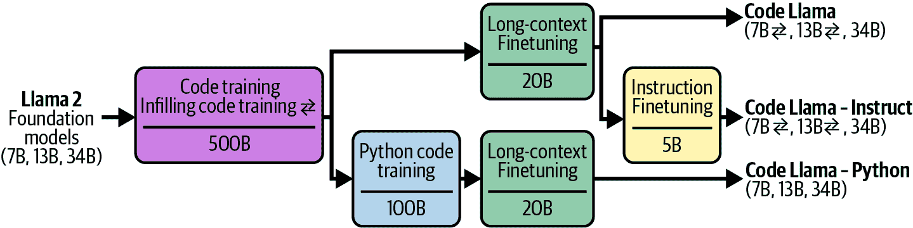

###### 图 7-1\. 制作不同 Code Llama 模型所使用的不同调优技术。图片来自 Rozière 等人（2024 年）。改编自原始图片，许可协议为 CC BY 4.0。

作为一名应用开发者，你可能会对预训练模型进行调优，但更有可能的是，你会对已经过后训练的模型进行调优。模型越精细，其知识与你任务的相关性越强，你适应它所需的工作就越少。

# 何时进行调优

在深入研究不同的调优技术之前，考虑是否调优是你正确的选择是必要的。与基于提示的方法相比，调优需要显著更多的资源，不仅包括数据和硬件，还包括机器学习人才。因此，调优通常是在对基于提示的方法进行广泛实验之后尝试的。然而，调优和提示并不是相互排斥的。现实世界的问题通常需要这两种方法。

## 调优的理由

调优的主要原因是提高模型的质量，无论是从一般能力还是特定任务能力来看。调优通常用于提高模型生成遵循特定结构输出的能力，例如 JSON 或 YAML 格式。

一个通用模型在广泛的基准测试中表现良好，但可能不会在你特定的任务上表现良好。如果你想要使用的模型在任务上训练不足，使用你的数据进行微调可能特别有用。

例如，一个开箱即用的模型可能在将文本转换为标准 SQL 方言方面做得很好，但可能无法处理较少见的 SQL 方言。在这种情况下，在包含这种 SQL 方言的数据上微调该模型将有所帮助。同样，如果模型在标准 SQL 上对常见查询表现良好，但经常在客户特定查询上失败，那么在客户特定查询上微调模型可能有所帮助。

微调的一个特别有趣的用例是偏差缓解。其想法是，如果基模型在其训练数据中持续存在某些偏差，那么在微调期间暴露于精心挑选的数据可以抵消这些偏差([王和 Russakovsky，2023](https://oreil.ly/iPwB_))。例如，如果一个模型始终将 CEO 分配给听起来像男性的名字，那么在包含许多女性 CEO 的数据集上微调它可以缓解这种偏差。[Garimella 等人(2022)](https://oreil.ly/RoPL4)发现，在由女性撰写的文本上微调 BERT 类语言模型可以减少这些模型的性别偏差，而在非洲作者撰写的文本上微调可以减少种族偏差。

你可以微调一个大模型以使其变得更好，但微调较小的模型更为常见。较小的模型需要的内存更少，因此更容易微调。它们在生产中也更便宜、更快。

一种常见的方法是使用由大型模型生成的数据来微调一个小型模型，以模仿大型模型的行为。因为这种方法将大型模型的知识提炼到小型模型中，所以被称为*蒸馏*。这在与其他数据合成技术一起在第八章(ch08.html#ch08_dataset_engineering_1730130932019888)中进行了讨论。

一个在特定任务上微调的小型模型可能在那个任务上优于一个更大的开箱即用的模型。例如，Grammarly 发现他们的微调 Flan-T5 模型([Chung 等人，2022](https://arxiv.org/abs/2210.11416))在广泛的写作助手任务上优于一个专门用于文本编辑的 GPT-3 变种，尽管它只有 60 分之一的大小。微调过程只使用了 82,000 对(指令，输出)，这比从头开始训练一个文本编辑模型所需的数据要少。

在基础模型早期，当最强的模型是商业化的且微调访问有限时，可用于微调的竞争性模型并不多。然而，随着开源社区中各种大小的高质量模型增多，这些模型针对广泛的领域定制，微调变得更多可行和吸引人。

## 不进行微调的原因

虽然微调可以从许多方面改善模型，但这些改进在一定程度上也可以在不进行微调的情况下实现。微调可以提高模型的表现，但精心设计的提示和上下文也可以做到这一点。微调可以帮助生成结构化输出，但正如在第二章 2 中讨论的，许多其他技术也可以做到这一点。

首先，虽然为特定任务微调模型可以改善其在该任务上的性能，但它可能会降低其在其他任务上的性能。1 这在你打算将此模型应用于期望多样化提示的应用时可能会令人沮丧。

假设你需要一个模型来处理三种类型的查询：产品推荐、更改订单和一般反馈。最初，该模型在产品推荐和一般反馈方面表现良好，但在更改订单方面表现不佳。为了解决这个问题，你需要在关于更改订单的（查询，响应）对数据集上微调模型。微调后的模型可能确实能更好地处理这类查询，但在其他两个任务上表现可能更差。

在这种情况下，你该怎么办？你可以对所有你关心的查询进行微调，而不仅仅是更改订单。如果你似乎无法使模型在所有任务上都表现良好，考虑为不同的任务使用不同的模型。如果你希望将这些单独的模型合并为一个以简化服务，你也可以考虑将它们合并在一起，正如本章后面所讨论的。

如果你刚开始尝试一个项目，微调通常不是你应该尝试的第一件事。微调需要大量的前期投资和持续的维护。首先，你需要数据。手动获取标注数据可能既慢又贵，尤其是对于需要批判性思维和领域专业知识的工作。开源数据和 AI 生成数据可以减轻成本，但它们的有效性差异很大。

其次，微调需要了解如何训练模型。你需要评估基础模型以选择一个进行微调。根据你的需求和资源，选项可能有限。虽然微调框架和 API 可以自动化微调过程中的许多步骤，但你仍然需要了解你可以调整的不同训练旋钮，监控学习过程，并在出现问题时代码调试。例如，你需要了解优化器是如何工作的，应该使用什么学习率，需要多少训练数据，如何处理过拟合/欠拟合，以及如何在整个过程中评估你的模型。

第三，一旦你有了微调模型，你需要弄清楚如何提供服务。你会自己托管它还是使用 API 服务？正如第九章中讨论的 Chapter 9，大型模型（尤其是 LLM）的推理优化并不简单。如果你已经在内部托管模型并且熟悉如何操作模型，微调需要的技术飞跃就会小得多。

更重要的是，你需要制定监控、维护和更新你的模型的政策和预算。随着你对微调模型进行迭代，新的基础模型正在以快速的速度开发。这些基础模型可能比你能增强你的微调模型的速度更快。如果一个新基础模型在你的特定任务上优于你的微调模型，那么在切换到新基础模型之前，性能改进需要有多显著？如果一个新的基础模型在微调后没有立即优于你的现有模型，但有可能做到，你会对其进行实验吗？

在许多情况下，切换到更好的模型只会带来微小的增量改进，你的任务可能比具有更大回报的项目（如启用新用例）的优先级低。2

AI 工程实验应该从提示开始，遵循第六章中讨论的最佳实践。Chapter 6。只有当单独使用提示不足以解决问题时，才探索更高级的解决方案。确保你已经彻底测试了各种提示，因为模型在不同提示下的性能可能会有很大差异。

我与许多从业者交谈过，他们分享了一个类似的故事。有人抱怨提示无效，并坚持微调。经过调查，发现提示实验很少且缺乏系统性。指令不明确，示例没有代表实际数据，指标定义不明确。在完善提示实验流程后，提示质量得到了足够的提升，足以满足他们的应用需求。3

微调和提示实验都需要系统化的流程。进行提示实验可以使开发者构建评估流程、数据标注指南和实验跟踪实践，这些将成为微调的垫脚石。

在提示缓存引入之前，微调的一个好处是它可以帮助优化令牌使用。你添加到提示中的示例越多，模型将使用的输入令牌就越多，这会增加延迟和成本。你不必在每个提示中包含你的示例，而可以在这些示例上微调模型。这样，你可以使用更短的提示与微调后的模型一起使用，如图图 7-2 所示。

使用提示缓存，其中重复的提示段可以缓存以供重用，这不再是强大的优势。提示缓存将在第九章中进一步讨论。第九章。然而，你可以使用提示的示例数量仍然受最大上下文长度的限制。使用微调，你可以使用示例的数量没有限制。

表明，对于需要最新信息的任务，如关于当前事件的问题，RAG 优于微调模型。不仅如此，使用基础模型的 RAG 优于使用微调模型的 RAG，如表 7-2 所示。这一发现表明，*虽然微调可以提高模型在特定任务上的性能，但它也可能导致其他领域的性能下降*。

表 7-2。在 Ovadia 等人（2024）编纂的关于当前事件的问答任务中，RAG 优于微调。FT-reg 和 FT-par 指的是作者使用的两种不同的微调方法。

|  | 基础模型 | 基础模型 + RAG | FT-reg | FT-par | FT-reg + RAG | FT-par + RAG |
| --- | --- | --- | --- | --- | --- | --- |
| Mistral-7B | 0.481 | 0.875 | 0.504 | 0.588 | 0.810 | 0.830 |
| Llama 2-7B | 0.353 | 0.585 | 0.219 | 0.392 | 0.326 | 0.520 |
| Orca 2-7B | 0.456 | 0.876 | 0.511 | 0.566 | 0.820 | 0.826 |

另一方面，*如果模型存在行为问题，微调可能有所帮助*。一个行为问题是当模型的输出在事实上是正确的，但与任务无关。例如，你要求模型为软件项目生成技术规范以供工程团队使用。虽然准确，但生成的规范缺少团队需要的细节。使用定义良好的技术规范微调模型可以使输出更加相关。

另一个问题是没有遵循预期的输出格式。例如，如果你要求模型编写 HTML 代码，但生成的代码无法编译，可能是因为模型在训练数据中没有充分接触 HTML。你可以在微调期间通过让模型接触更多 HTML 代码来纠正这一点。

语义解析是一类任务，其成功取决于模型生成预期格式的输出的能力，因此通常需要微调。语义解析在第二章 2 和第六章 6 中简要讨论。提醒一下，语义解析意味着将自然语言转换为结构化格式，如 JSON。现成的强大模型通常适用于常见的、较简单的语法，如 JSON、YAML 和 regex。然而，它们可能不适合互联网上可用示例较少的语法，例如不太受欢迎的工具的特定领域语言或复杂的语法。

*简而言之，微调是为了形式，而 RAG 是为了事实*。RAG 系统为你的模型提供外部知识，以构建更准确和更有信息量的答案。RAG 系统可以帮助减轻模型的幻觉。另一方面，微调有助于模型理解和遵循语法和风格。5 虽然微调在足够高质量的数据下可能有助于减少幻觉，但如果数据质量低，也可能加剧幻觉。

如果你的模型既有信息问题又有行为问题，可以从 RAG 开始。RAG 通常更容易，因为你不必担心整理训练数据或托管微调模型。在进行 RAG 时，从简单的基于术语的解决方案开始，例如 BM25，而不是直接跳入需要向量数据库的东西。

RAG 还可以比微调带来更显著的性能提升。Ovadia 等人（2024）表明，在[MMLU 基准](https://arxiv.org/abs/2009.03300)的几乎所有问题类别中，对于 Mistral 7B、Llama 2-7B 和 Orca 2-7B 这三种不同的模型，RAG 都优于微调。

然而，RAG 和微调并不是相互排斥的。它们有时可以一起使用以最大化您应用程序的性能。在相同的实验中，[Ovadia 等人（2024）](https://oreil.ly/t9HTH) 展示了在微调模型之上结合 RAG 可以提高其在 MMLU 基准测试上的性能 43%的时间。重要的是要注意，在这个实验中，与单独使用 RAG 相比，使用 RAG 与微调模型并不总是提高性能 57%。

没有适用于所有应用程序的通用工作流程。图 7-3 显示了应用程序开发过程可能随时间遵循的一些路径。箭头指示您可能尝试的下一步。这个图是受[OpenAI](https://oreil.ly/Ny1WI)（2023）展示的示例工作流程启发的。

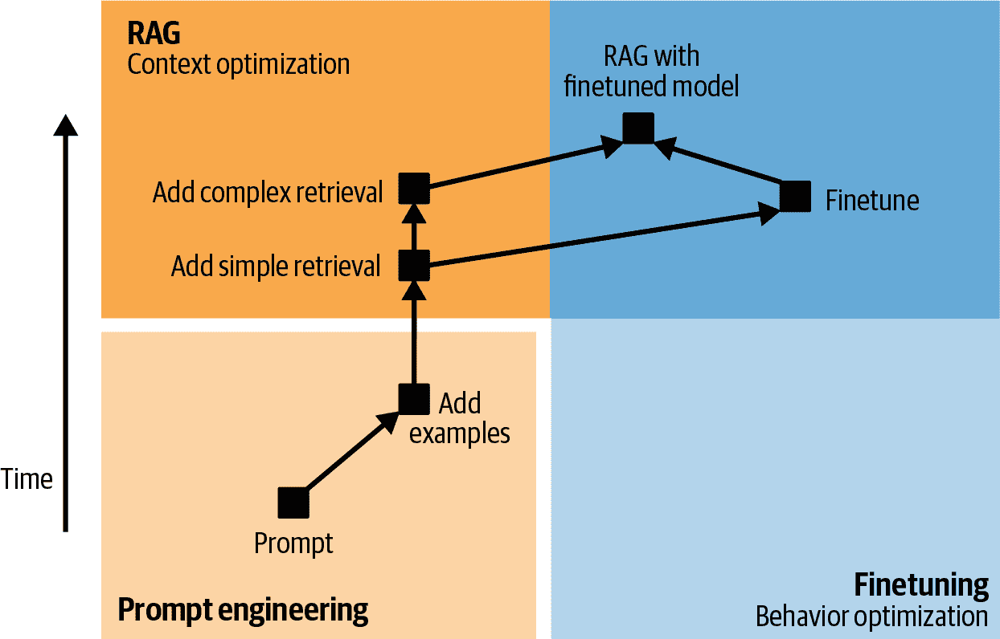

###### 图 7-3。示例应用程序开发流程。在简单的检索（如基于术语的检索）之后，是否尝试更复杂的检索（如混合搜索）或微调取决于每个应用程序及其失败模式。

因此，将模型适应特定任务的流程可能如下所示。请注意，在执行任何适应步骤之前，您应该定义您的评估标准并设计您的评估流程，如第四章 中所述。这个评估流程是您在开发应用程序时用来衡量您进度的方式。评估不仅仅发生在开始时，它应该贯穿整个过程的每一步：

1.  尝试仅通过提示来让模型执行您的任务。使用第五章 中涵盖的提示工程最佳实践，包括系统地版本化您的提示。

1.  在提示中添加更多示例。根据用例，所需的示例数量可能在 1 到 50 之间。

1.  如果您的模型经常由于信息缺失而失败，将其连接到可以提供相关信息的数据源。在开始使用 RAG 时，首先使用基本的检索方法，如基于术语的搜索。即使使用简单的检索，添加相关和准确的知识也应该导致您模型性能的某些改进。

1.  根据您模型的失败模式，您可能想要探索以下这些下一步：

    1.  如果模型继续出现基于信息失败的，您可能想要尝试更先进的 RAG 方法，例如基于嵌入的检索。

    1.  如果模型继续出现行为问题，例如持续生成无关、格式错误或不安全的响应，您可以选择微调。基于嵌入的检索通过在流程中引入额外的组件来增加推理复杂性，而微调则增加了模型开发的复杂性，但保持了推理不变。

1.  结合 RAG 和微调以获得更多的性能提升。

在考虑了微调和其他替代技术的利弊之后，如果你决定微调你的模型，本章的其余部分就是为你准备的。首先，让我们来看看微调的首要挑战：其内存瓶颈。

# 内存瓶颈

由于微调对内存需求较高，许多微调技术旨在最小化它们的内存占用。了解导致这种内存瓶颈的原因对于理解为什么以及如何使用这些技术是必要的。这种理解反过来可以帮助你选择最适合你的微调方法。

除了解释微调的内存瓶颈外，本节还介绍了计算每个模型内存使用的便签公式。这种计算对于估计你需要什么硬件来服务或微调模型非常有用。

由于内存计算需要对低级机器学习和计算概念进行分解，因此本节在技术上较为密集。如果你已经熟悉这些概念，请随意跳过它们。

## 反向传播和可训练参数

决定模型在微调期间内存占用大小的关键因素是其*可训练参数*的数量。可训练参数是在微调期间可以更新的参数。在预训练期间，所有模型参数都会更新。在推理期间，没有模型参数会更新。在微调期间，某些或所有模型参数可能会更新。保持不变的参数被称为*冻结参数*。

每个可训练参数所需的内存源于模型训练的方式。截至本文写作时，神经网络通常使用称为*反向传播*的机制进行训练。^(6) 使用反向传播，每个训练步骤由两个阶段组成：

1.  前向传递：从输入计算输出的过程。

1.  反向传递：使用前向传递的聚合信号更新模型权重的过程。

在推理过程中，只执行前向传递。在训练过程中，执行两个传递。从高层次来看，反向传递的工作原理如下：

1.  将前向传递计算出的输出与预期输出（真实值）进行比较。如果它们不同，模型犯了错误，参数需要调整。计算输出与预期输出之间的差异被称为*损失*。

1.  计算每个可训练参数对错误的贡献程度。这个值被称为*梯度*。从数学上讲，梯度是通过计算损失相对于每个可训练参数的导数来计算的。每个可训练参数都有一个梯度值。^(7) 如果一个参数的梯度值较高，它对损失有显著贡献，应该进行更多调整。

1.  使用它们对应的梯度来调整可训练参数的值。给定每个参数的梯度值，每个参数应该调整多少，由**优化器**决定。常见的优化器包括 SGD（随机梯度下降）和 Adam。对于基于 transformer 的模型，Adam 到目前为止是最广泛使用的优化器。

对于具有三个参数和一个非线性激活函数的假设神经网络的前向和反向传播过程在图 7-4 中进行了可视化。我使用这个虚拟神经网络来简化可视化。

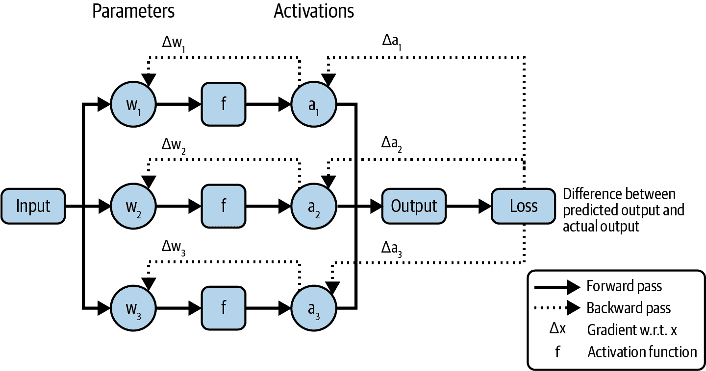

###### 图 7-4\. 简单神经网络的正向和反向传播。

在反向传播过程中，每个可训练参数都带有额外的值，其梯度及其优化器状态。因此，可训练参数越多，存储这些额外值所需的内存就越多。

## 内存数学

了解模型需要多少内存是有用的，这样你就可以为它使用合适的硬件。通常，你可能已经拥有了硬件，需要计算你是否能够运行某个模型。如果一个模型需要 30 GB 的内存来进行推理，那么一个 24 GB 内存的芯片将不足以满足需求。

模型的内存占用取决于模型本身以及工作负载和用于减少其内存使用的不同优化技术。由于无法考虑所有优化技术和工作负载，在本节中，我将仅概述近似计算的公式，这应该能给你一个大致的了解，你需要多少内存来操作模型，无论是推理还是训练。

###### 注意

推理和训练具有不同的内存配置文件是训练和推理芯片差异的原因之一，如第九章第九章中所述。

### 推理所需的内存

在推理过程中，只执行前向传播。前向传播需要模型的权重内存。设 N 为模型的参数数量，M 为每个参数所需的内存；加载模型参数所需的内存为：

```py
N × M
```

前向传播还需要激活值的内存。Transformer 模型需要内存来存储注意力机制中的键值向量。激活值和键值向量的内存随着序列长度和批量大小的增加而线性增长。

对于许多应用，激活和键值向量的内存可以假设是模型权重内存的 20%。如果你的应用使用更长的上下文或更大的批量大小，实际需要的内存将更高。这个假设将模型的内存占用降低到：

```py
N × M × 1.2
```

考虑一个 13B 参数的模型。如果每个参数需要 2 字节，模型的权重将需要 13B × 2 字节 = 26 GB。推理的总内存将是 26 GB × 1.2 = 31.2 GB。

模型的内存占用随着其大小的增加而迅速增长。随着模型变得更大，内存成为操作它们的瓶颈。8 一个 70B 参数的模型，每个参数占用 2 字节，仅其权重就需要高达 140GB 的内存。9)

### 训练所需内存

要训练一个模型，你需要为模型的权重和激活存储内存，这已经在前面讨论过。此外，你还需要为梯度优化器状态存储内存，这会随着可训练参数数量的增加而增加。

总体而言，训练所需的内存计算如下：

+   训练内存 = 模型权重 + 激活 + 梯度 + 优化器状态

###### 小贴士

在反向传播过程中，每个可训练参数需要一个梯度值以及根据优化器需要零到两个优化器状态值。

+   纯 SGD 优化器没有状态。

+   动量优化器为每个可训练参数存储一个值。

+   Adam 优化器为每个可训练参数存储两个值。

想象一下你正在使用 Adam 优化器更新一个 13B 参数模型的所有参数。因为每个可训练参数有三个梯度值和优化器状态值，如果每个值占用两个字节存储，那么梯度优化器状态所需的内存将是：

```py
13 billion × 3 × 2 bytes = 78 GB
```

然而，如果你只有 1B 个可训练参数，梯度优化器状态所需的内存将仅为：

```py
1 billion × 3 × 2 bytes = 6 GB
```

需要注意的一个重要事项是，在前面的公式中，我假设激活所需的内存小于模型权重所需的内存。然而，在现实中，激活内存可能要大得多。如果激活被存储用于梯度计算，激活所需的内存可能会远大于模型权重所需的内存。图 7-5 展示了根据 Korthikanti 等人（2022 年）的论文“Reducing Activation Recomputation in Large Transformer Models”，在不同规模的不同 Megatron 模型中，激活所需的内存与模型权重所需的内存的比较。[链接](https://arxiv.org/abs/2205.05198)。

减少激活所需内存的一种方法是不存储它们。不是存储激活以供重用，而是在需要时重新计算激活。这种技术称为*梯度检查点*或*激活重新计算*。虽然这减少了内存需求，但由于重新计算，它增加了训练所需的时间。10)

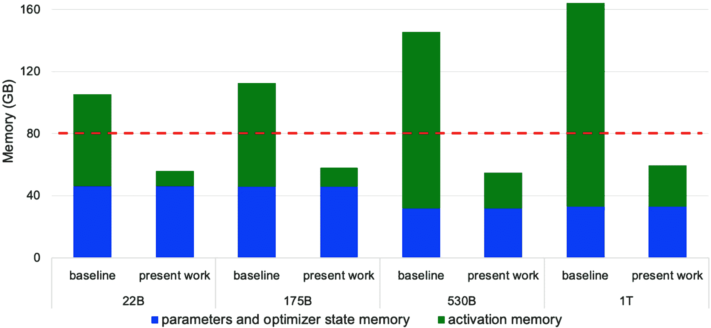

###### 图 7-5. 激活所需的内存可能远大于模型权重的内存需求。图片来自 Korthikanti 等人，2022 年。

## 数值表示

在迄今为止的内存计算中，我假设每个值占用两个字节的内存。表示模型中每个值的内存需求直接影响到模型的总体内存占用。如果你将每个值所需的内存减半，模型权重的内存需求也将减半。

在讨论如何减少每个值所需的内存之前，了解数值表示是有用的。神经网络中的数值传统上表示为[浮点数](https://en.wikipedia.org/wiki/Floating-point_arithmetic)。最常用的浮点格式家族是 FP 家族，它遵循电气和电子工程师协会（IEEE）的浮点算术标准（[IEEE 754](https://en.wikipedia.org/wiki/IEEE_754)）：

+   FP32 使用 32 位（4 字节）来表示浮点数。这种格式称为单精度。

+   FP64 使用 64 位（8 字节）并称为双精度。

+   FP16 使用 16 位（2 字节）并称为半精度。

虽然 FP64 在许多计算中仍然被使用——截至本文撰写时，FP64 是 NumPy 和 pandas 的默认格式——但由于其内存占用，它很少在神经网络中使用。FP32 和 FP16 更常见。在人工智能工作负载中，其他流行的浮点格式包括 *BF16*（BFloat16）和 *TF32*（TensorFloat-32）。BF16 是由 Google 设计的，用于优化 [TPUs](https://oreil.ly/BGXtn) 上的 AI 性能，而 TF32 是由 NVIDIA 为 [GPUs](https://oreil.ly/0pZgw) 设计的.^(11)

数字也可以表示为整数。尽管目前不如浮点格式常见，但整数表示正在变得越来越流行。常见的整数格式是 INT8（8 位整数）和 INT4（4 位整数).^(12)

每个浮点格式通常有 1 位用于表示数字的符号，即负数或正数。其余位在 *范围* 和 *精度* 之间分配:^(13)

范围

范围位数的数量决定了该格式可以表示的值的范围。位数越多，范围越广。这类似于拥有更多数字可以表示更广泛的数字范围。

精度

精度位的数量决定了数字可以表示的精确程度。减少精度位会使数字的精确度降低。例如，如果你将 10.1234 转换为只能支持两位小数的格式，这个值变为 10.12，这比原始值精确度低。

图 7-6 显示了不同的浮点格式及其范围和精度位.^(14)


###### 图 7-6\. 带有范围和精度位的不同数值格式。

位数更多的格式被认为是*高精度*。将具有高精度格式的数字转换为低精度格式（例如，从 FP32 转换为 FP16）意味着*降低其精度*。降低精度可能会导致数值变化或产生错误。表 7-3 展示了如何将 FP32 值转换为 FP16、BF16 和 TF32，并显示结果的不准确性。

表 7-3\. 将 FP32 值转换为低精度格式。结果的不准确性以斜体显示。

| FP32 | FP16 | BF16 | TF32 |
| --- | --- | --- | --- |
| 0.0123456789 | 0.01234*43603515625* | 0.0123*291* | 0.01234*43603515625* |
| 0.123456789 | 0.1234*7412109375* | 0.123*535* | 0.1234*130859375* |
| 1.23456789 | 1.234*375* | 1.234*38* | 1.234*375* |
| 12.3456789 | 12.34*375* | 12.3*75* | 12.34*375* |
| 123.456789 | 123.4*375* | 123.*5* | 123.4*375* |
| 1234.56789 | 123*5.0* | 123*2.0* | 1234.*0* |
| 12345.6789 | 1234*4.0* | 123*52.0* | 1234*4.0* |
| 123456.789 | *INF*^(a) | 123*392.0* | 123456.*0* |
| 1234567.89 | *INF* | 123*6990.0* | 123*3920.0* |
| ^(a) FP16 格式中的数值超出范围时将被四舍五入到无穷大。 |

注意表 7-3 中，尽管 BF16 和 FP16 具有相同的位数，但 BF16 在范围上有更多的位数，而在精度上有更少的位数。这使得 BF16 可以表示 FP16 范围之外的较大值。然而，这也使得 BF16 比 FP16 精度更低。例如，1234.56789 在 FP16 中为 1235.0（0.035%的数值变化），但在 BF16 中为 1232.0（0.208%的数值变化）。

###### 警告

当使用模型时，请确保以模型预期格式加载模型。将模型加载到错误的数值格式可能会导致模型发生显著变化。例如，Llama 2 在发布时其权重设置为 BF16。然而，许多团队将模型加载为 FP16，随后失望地发现模型的质量远低于宣传的。¹⁵ 这种误解浪费了很多人时间，但好处是迫使很多人学习关于数值表示的知识。

适合您的格式取决于您的工作负载的数值分布（例如，您需要的值的范围），以及您的工作负载对微小数值变化的敏感度，以及底层硬件。¹⁶

## 量化

需要的位数越少来表示模型值，模型的内存占用就越低。一个 10B 参数的模型在 32 位格式下需要 40GB 的权重，但在 16 位格式下只需要 20GB。降低精度，也称为量化，是一种成本低廉且极为有效的减少模型内存占用的方法。它操作简单，并且可以泛化到各种任务和架构。在机器学习（ML）的上下文中，低精度通常指任何位数少于标准 FP32 的格式。

要进行量化，您需要决定量化什么以及何时量化：

量化内容

理想情况下，你希望量化消耗你大部分内存的任何内容，但这同时也取决于你可以在不太多损害性能的情况下进行量化的内容。正如在“内存数学”中讨论的那样，模型在推理过程中的内存占用主要贡献者是模型的权重和激活。17 权重量化比激活量化更为常见，因为权重激活通常对性能的影响更为稳定，且精度损失较小。

何时进行量化

量化可以在训练期间或训练后进行。训练后量化（PTQ）意味着在模型完全训练后对其进行量化。PTQ 到目前为止是最常见的。它也与通常不训练模型的 AI 应用开发者更为相关。

### 推理量化

在深度学习的早期，使用 32 位 FP32 训练和提供服务是标准做法。自 2010 年代末以来，以 16 位甚至更低精度提供服务变得越来越普遍。例如，[Dettmers et al. (2022)](https://arxiv.org/abs/2208.07339)使用 LLM.int8()将 LLM 量化到 8 位，使用 QLoRA([Dettmers et al., 2023](https://arxiv.org/abs/2305.14314))将 LLM 量化到 4 位，他们做了出色的工作。

模型也可以以*混合精度*提供服务，其中在可能的情况下降低精度，在必要时保持更高精度。为了在设备上提供服务，[苹果](https://oreil.ly/lqLfv)（2024）利用了一种混合 2 位和 4 位格式的量化方案，平均每位权重 3.5 位。同样在 2024 年，为了应对 4 位神经网络，英伟达宣布了其新的 GPU 架构[Blackwell](https://oreil.ly/FIP9V)，该架构支持 4 位浮点数模型推理。

一旦达到 8 位以下，数值表示就会变得更加复杂。你可以使用[小浮点](https://en.wikipedia.org/wiki/Minifloat)格式之一，如 FP8（8 位）和 FP4（4 位），将参数值保持为浮点数。18 然而，更常见的是将参数值转换为整数格式，例如 INT8 或 INT4。

量化是有效的，但它有一个极限。每个值不能少于 1 位，有些人尝试了 1 位表示，例如 BinaryConnect([Courbariaux et al., 2015](https://arxiv.org/abs/1511.00363))、Xnor-Net([Rastegari et al., 2016](https://arxiv.org/abs/1603.05279))和 BitNet([Wang et al., 2023](https://arxiv.org/abs/2310.11453))。19

在 2024 年，微软研究人员([Ma et al.](https://arxiv.org/abs/2402.17764))通过引入 BitNet b1.58，一个基于 Transformer 的语言模型，该模型每参数仅需 1.58 位，其性能与 16 位 Llama 2([Touvron et al., 2023](https://arxiv.org/abs/2307.09288))相当，参数量高达 3.9B，如表 7-4 所示。

表 7-4\. BitNet b1.58 在不同基准和不同模型大小（高达 3.9B 参数）上的性能与 Llama 2 16 位的比较。结果来自 Ma 等人（2024 年）。

| Model | Size | ARCe | ARCc | HS | BQ | OQ | PQ | WGe | Avg. |
| --- | --- | --- | --- | --- | --- | --- | --- | --- | --- |
| Llama LLM | 700M | 54.7 | 23.0 | 37.0 | 60.0 | 20.2 | 68.9 | 54.8 | 45.5 |
| BitNet b1.58 | 700M | 51.8 | 21.4 | 35.1 | 58.2 | 20.0 | 68.1 | 55.2 | 44.3 |
| Llama LLM | 1.3B | 56.9 | 23.5 | 38.5 | 59.1 | 21.6 | 70.0 | 53.9 | 46.2 |
| BitNet b1.58 | 1.3B | 54.9 | 24.2 | 37.7 | 56.7 | 19.6 | 68.8 | 55.8 | 45.4 |
| Llama LLM | 3B | 62.1 | 25.6 | 43.3 | 61.8 | 24.6 | 72.1 | 58.2 | 49.7 |
| BitNet b1.58 | 3B | 61.4 | 28.3 | 42.9 | 61.5 | 26.6 | 71.5 | 59.3 | 50.2 |
| BitNet b1.58 | 3.9B | 64.2 | 28.7 | 44.2 | 63.5 | 24.2 | 73.2 | 60.5 | 51.2 |

降低精度不仅减少了内存占用，而且通常还提高了计算速度。首先，它允许更大的批量大小，使模型能够并行处理更多的输入。其次，降低精度加快了计算速度，这进一步减少了推理延迟和训练时间。为了说明这一点，考虑两个数的加法。如果我们逐位进行加法，并且每次加法需要*t*纳秒，那么 32 位需要*32t*纳秒，而 16 位只需要*16t*纳秒。然而，由于格式转换所需的额外计算，降低精度并不总是减少延迟。

降低精度也有一些缺点。每次转换通常会导致小数值的变化，许多小的变化可能导致性能的大幅变化。如果一个值超出了降低精度格式可以表示的范围，它可能被转换为无穷大或任意值，从而进一步降低模型的质量。如何以最小的模型性能影响来降低精度是一个活跃的研究领域，由模型开发者、硬件制造商和应用开发者共同追求。

在低精度下的推理已经成为标准。模型使用高精度格式进行训练以最大化性能，然后在推理时降低其精度。包括 PyTorch、TensorFlow 和 Hugging Face 的 transformers 在内的主要机器学习框架，只需几行代码即可免费提供 PTQ。

一些边缘设备只支持量化推理。因此，用于设备上推理的框架，如 TensorFlow Lite 和 PyTorch Mobile，也提供了 PTQ。

### 训练量化

训练过程中的量化还不像 PTQ 那样普遍，但它正在获得关注。训练量化有两个不同的目标：

1.  为了生成一个在推理过程中能够良好表现的低精度模型。这是为了解决模型在训练后量化过程中质量可能下降的挑战。

1.  为了减少训练时间和成本。量化减少了模型的内存占用，使得模型可以在更便宜的硬件上训练，或者允许在相同的硬件上训练更大的模型。量化还加快了计算速度，从而进一步降低了成本。

量化技术可能有助于实现一个或两个这些目标。

量化感知训练（QAT）旨在创建一个在低精度下具有高质量推理的模型。使用 QAT，模型在训练期间模拟低精度（例如，8 位）的行为，这使得模型能够学会在低精度下产生高质量的输出。然而，QAT 不会减少模型的训练时间，因为其计算仍然以高精度执行。QAT 甚至可能由于模拟低精度行为的额外工作而增加训练时间。

另一方面，直接在较低精度下训练模型可以帮助实现这两个目标。人们早在 2016 年就尝试在降低精度下训练模型；参见 [Hubara et al. (2016)](https://oreil.ly/D-wIG) 和 [Jacob et al. (2017)](https://arxiv.org/abs/1712.05877)。[Character.AI (2024)](https://oreil.ly/J7kVB) 分享说，他们能够完全在 INT8 下训练他们的模型，这有助于消除训练/服务精度不匹配，同时也显著提高了训练效率。然而，在较低精度下训练更难实现，因为反向传播对较低精度更敏感。^(20)

较低精度的训练通常在[*混合精度*](https://oreil.ly/pBaQM)下进行，其中权重的一个副本保留在高精度，但其他值，如梯度和激活，则保留在较低精度。^(21) 你还可以在较低精度下计算对权重值更敏感的值，而在较高精度下计算对权重值更敏感的值。例如，LLM-QAT ([Liu et al., 2023](https://arxiv.org/abs/2305.17888)) 将权重和激活量化为 4 位，但将嵌入保留在 16 位。

模型中应该使用较低精度的部分可以通过许多机器学习框架提供的[*自动混合精度*](https://oreil.ly/JZRsd) (AMP)功能自动设置。

在不同的精度级别中，也可以有不同的训练阶段。例如，一个模型可以在更高的精度下进行训练，但在较低的精度下进行微调。这在基础模型中尤为常见，因为从头开始训练模型的团队可能拥有足够的计算能力来进行高精度训练。一旦模型发布，计算能力较低的开发者可以在较低的精度下微调该模型。

# 微调技术

我希望前一部分已经清楚地说明了为什么微调大规模模型如此内存密集。微调所需的内存越多，能够负担得起的人就越少。减少模型内存占用的技术使得微调更加容易获得，允许更多的人将模型适应到他们的应用中。本节重点介绍内存高效的微调技术，这主要集中在参数高效的微调上。

我还会介绍模型合并，这是一种创建自定义模型令人兴奋但更具实验性的方法。虽然模型合并通常不被视为微调，但我将其包含在本节中，因为它与微调互补。微调是根据特定需求定制模型。模型合并将多个模型（通常是微调过的模型）结合在一起，以实现相同的目的。

虽然结合多个模型并不是一个新概念，但新型模型和微调技术激发了众多创造性的模型合并技术，使得本节特别有趣来撰写。

## 参数高效微调

在微调的早期阶段，模型足够小，以至于人们可以微调整个模型。这种方法被称为*完全微调*。在完全微调中，可训练参数的数量与参数的数量完全相同。

完全微调看起来可能和训练相似。主要区别在于训练是从随机初始化的模型权重开始的，而微调则是从先前训练过的模型权重开始的。

如在“记忆数学”中讨论的那样，可训练参数越多，所需的内存就越多。考虑一个 70 亿参数的模型：

+   如果你使用 16 位格式如 FP16，仅加载模型的权重就需要 14 GB 的内存。

+   使用 Adam 优化器完全微调此模型，并且也在 16 位格式下，需要额外的 7B × 3 × 2 字节= 42 GB 的内存。

+   因此，模型权重、梯度和优化器状态所需的总内存是 14 GB + 42 GB = 56 GB。

56 GB 超出了大多数消费级 GPU 的内存容量，这些 GPU 通常配备 12-24 GB 的内存，高端 GPU 提供高达 48 GB。而且这个内存估计还没有考虑到激活所需的内存。

###### 注意

要在给定的硬件上适配模型，你可以要么减少模型的内存占用，要么找到更有效地使用硬件内存的方法。量化（quantization）和 PEFT（Parameter Efficient Fine-tuning）等技术有助于最小化总内存占用。专注于更好地利用硬件内存的技术包括*CPU 卸载*。你不必试图将整个模型放在 GPU 上，可以将多余的内存卸载到 CPU 上，正如 DeepSpeed（[Rasley 等人，2020](https://oreil.ly/Np1Hn)）所展示的那样。

我们还没有提到这样一个事实：全量微调，尤其是监督微调和偏好微调，通常需要大量高质量标注数据，而这对于大多数人来说是无法负担的。由于全量微调对内存和数据的高要求，人们开始进行**部分微调**。在部分微调中，只有模型的一些参数被更新。例如，如果一个模型有十层，你可能冻结前九层，只微调最后一层，^(22)将可训练参数的数量减少到全量微调的 10%。

虽然部分微调可以减少内存占用，但它**参数效率低**。部分微调需要许多可训练参数才能达到接近全量微调的性能。Houlsby 等人（2019）的研究表明，使用 BERT 大模型([Devlin 等人，2018](https://arxiv.org/abs/1810.04805))，你需要更新大约 25%的参数才能在 GLUE 基准测试([Wang 等人，2018](https://arxiv.org/abs/1804.07461))上达到与全量微调相当的性能。图 7-7 显示了不同数量可训练参数的部分微调性能曲线。

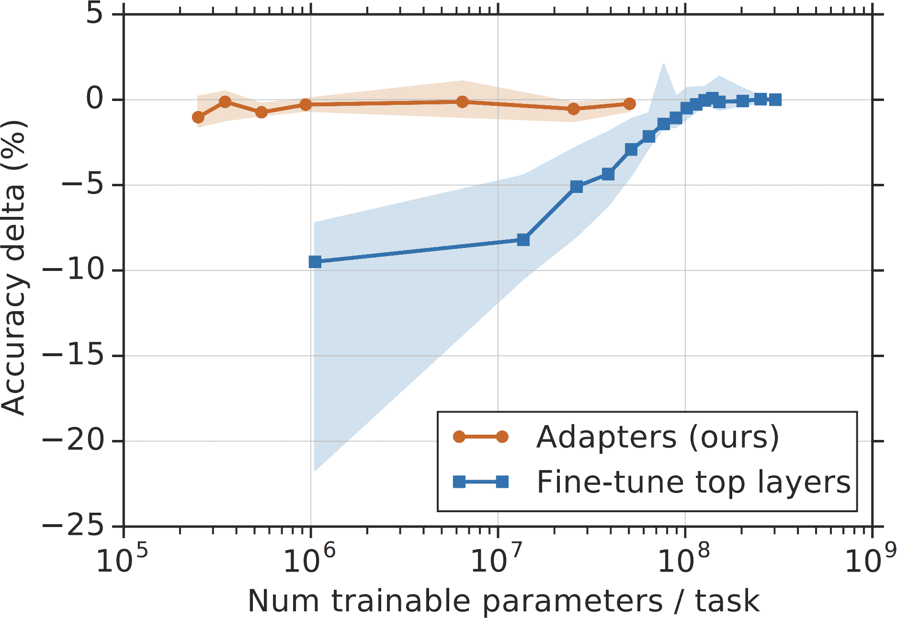

自动生成，中等置信度](assets/aien_0707.png)

###### 图 7-7。蓝色线显示，部分微调需要许多可训练参数才能达到与全量微调相当的性能。图片来自 Houlsby 等人（2019）。

这引发了一个问题：如何在显著减少可训练参数数量的同时，实现接近全量微调的性能？由此产生的微调技术是参数高效的。没有明确的阈值来衡量一个微调方法是否被认为是参数高效的。然而，一般来说，如果一个技术能够在使用几个数量级更少的可训练参数的情况下实现接近全量微调的性能，那么它被认为是参数高效的。

PEFT（参数高效微调）的概念由 Houlsby 等人（2019）提出。作者展示了通过在模型中适当位置插入额外的参数，可以使用少量可训练参数实现强大的微调性能。他们在一个 BERT 模型的每个 Transformer 块中插入两个适配器模块，如图图 7-8 所示。


自动生成的描述](assets/aien_0708.png)

###### 图 7-8。通过在每个 BERT 模型的 Transformer 层中插入两个适配器模块，并只更新适配器，Houlsby 等人（2019）能够使用少量可训练参数实现强大的微调性能。

在微调过程中，他们保持了模型原始参数不变，只更新了适配器。可训练参数的数量是适配器中参数的数量。在 GLUE 基准测试中，他们仅使用 3%的可训练参数数量就实现了与全微调相差 0.4%的性能。图 7-7 中橙色线显示了全微调和使用不同适配器大小微调之间的性能差异。

然而，这种方法的缺点是它增加了微调模型的推理延迟。适配器引入了额外的层，这增加了正向传递的计算步骤，从而减慢了推理。

PEFT 使微调更易于在更经济的硬件上实现，使更多开发者能够访问。PEFT 方法通常不仅参数高效，而且样本高效。虽然全微调可能需要成千上万甚至数百万个示例才能实现显著的质量改进，但一些 PEFT 方法只需几千个示例就能提供强大的性能。

由于 PEFT 的明显吸引力，PEFT 技术正在迅速发展。下一节将概述这些技术，然后再深入探讨最常见的 PEFT 技术：LoRA。

### PEFT 技术

现有的 PEFT 丰富世界通常分为两大类：*基于适配器的方 法*和*基于软提示的方 法*。然而，未来可能还会引入新的类别。

*基于适配器的方 法*指的是所有涉及向模型权重添加额外模块的方法，例如 Houlsby 等人（2019 年）开发的方法。[Houlsby 等人（2019 年）](https://arxiv.org/abs/1902.00751)。由于基于适配器的方 法涉及添加参数，因此它们也被称为*加性方法*。

到目前为止，LoRA([Hu 等人，2021 年](https://arxiv.org/abs/2106.09685))是最受欢迎的基于适配器的方 法，它将是下一节的主题。其他基于适配器的方 法包括 BitFit([Zaken 等人，2021 年](https://arxiv.org/abs/2106.10199))，它与 LoRA 同时出现。较新的适配器方法包括 IA3([Liu 等人，2022 年](https://oreil.ly/avDPk))，它具有高效的混合任务批处理策略，使其特别适用于多任务微调。它已被证明在某些情况下优于 LoRA 甚至全微调。LongLoRA([Chen 等人，2023 年](https://arxiv.org/abs/2309.12307))是 LoRA 的一个变体，它结合了注意力修改技术来扩展上下文长度。

如果基于适配器的方 法向模型架构中添加可训练参数，则基于软提示的方法通过引入特殊的可训练标记来修改模型处理输入的方式。这些额外的标记与输入标记一起输入到模型中。它们被称为*软提示*，因为，像输入（硬提示）一样，软提示也指导模型的行为。然而，软提示与硬提示在两个方面有所不同：

+   硬提示是可读的。它们通常包含*离散*标记，如“我”、“写”、“一个”和“很多”。相比之下，软提示是连续的向量，类似于嵌入向量，并且不可读。

+   硬提示是静态的，不可训练，而软提示可以在调优过程中通过反向传播进行优化，这使得它们可以根据特定任务进行调整。

有些人将软提示描述为提示工程和微调之间的交叉。图 7-9 展示了你如何结合使用软提示和硬提示来引导模型的行为。


###### 图 7-9。硬提示和软提示可以结合使用，以改变模型的行为。

作为子领域，软提示调优以一系列听起来相似但可能令人困惑的技术为特征，例如前缀调优([Li 和 Liang, 2021](https://arxiv.org/abs/2101.00190))、P-Tuning([Liu 等，2021](https://arxiv.org/abs/2103.10385))和提示调优([Lester 等，2021](https://arxiv.org/abs/2104.08691))^(23)。它们的主要区别在于软提示插入的位置。例如，前缀调优在每个 Transformer 层将软提示标记添加到输入之前，而提示调优只将软提示标记添加到嵌入输入之前。如果你想使用其中任何一种，许多 PEFT 框架都会为你实现它们。

为了了解正在使用哪些 PEFT 方法，我在 2024 年 10 月分析了 GitHub 仓库[huggingface/peft](https://github.com/huggingface/peft)上的 1000 多个公开 issue。假设如果有人使用一种技术，他们更有可能报告有关该技术的问题或提出相关问题。图 7-10 显示了结果。对于“P-Tuning”，我搜索了“p_tuning”和“p tuning”关键词，以考虑到不同的拼写。

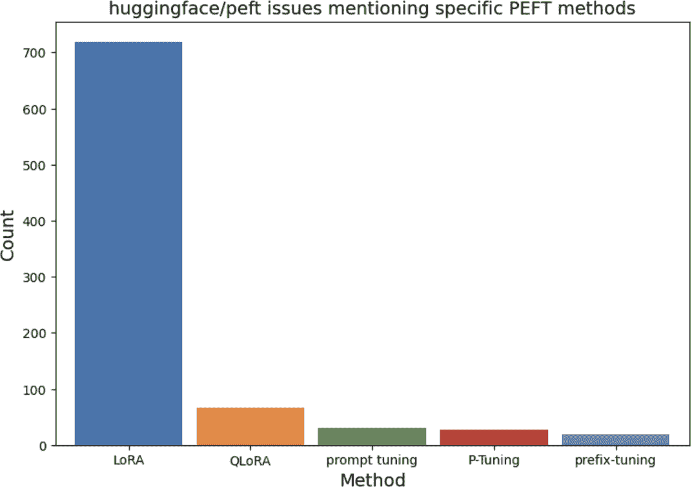

###### 图 7-10。GitHub 仓库 huggingface/peft 中对应不同微调技术的 issue 数量。这是估计每种技术流行度的代理。

从这次分析中可以看出，LoRA 占据主导地位。软提示不太常见，但似乎越来越多的人对那些想要比提示工程提供的更多定制化，但又不想投资微调的人越来越感兴趣。

由于 LoRA 的流行，下一节将重点介绍 LoRA 的工作原理以及它是如何解决早期基于适配器方法的挑战。即使你不使用 LoRA，这次深入探讨也应该为你提供一个框架，让你探索其他微调方法。

### LoRA

与[Houlsby 等人（2019）](https://arxiv.org/abs/1902.00751)的原始适配器方法不同，LoRA（低秩适配）([Hu 等人，2021](https://arxiv.org/abs/2106.09685))以不增加额外推理延迟的方式引入了额外的参数。LoRA 不是向基础模型引入额外的层，而是使用可以合并回原始层的模块。

您可以将 LoRA 应用于单个权重矩阵。给定一个权重矩阵，LoRA 将其分解为两个较小矩阵的乘积，然后更新这两个较小的矩阵，最后将它们合并回原始矩阵。

考虑维度为*n* × *m*的权重矩阵*W*。LoRA 的工作原理如下：

1.  首先，选择较小矩阵的维度。设*r*为所选值。构建两个矩阵：*A*（维度*n* × *r*）和*B*（维度*r* × *m*）。它们的乘积是*W*[*AB*]，其维度与*W*相同。*r*是 LoRA 的*秩*。

1.  将*W*[*AB*]添加到原始权重矩阵*W*中，创建一个新的权重矩阵*W*ʹ。将*W*ʹ作为模型的一部分替代*W*。您可以使用超参数ɑ来确定*W*[*AB*]应在新矩阵中占多少贡献：$upper W prime equals upper W plus StartFraction alpha Over r EndFraction upper W Subscript upper A upper B$

1.  在微调期间，仅更新*A*和*B*中的参数。*W*保持不变。

图 7-11 展示了此过程。


###### 图 7-11\. 要将 LoRA 应用于权重矩阵 W，将其分解为两个矩阵 A 和 B 的乘积。在微调期间，仅更新 A 和 B。W 保持不变。

###### 注意

LoRA（低秩适配）建立在*低秩分解*的概念之上，这是一种长期存在的降维技术。关键思想是你可以将一个大矩阵分解为两个较小矩阵的乘积以减少参数数量，这反过来又减少了计算和内存需求。例如，一个`9 × 9`的矩阵可以被分解为两个矩阵的乘积，其维度为`9 × 1`和`1 × 9`。原始矩阵有 81 个参数，但两个乘积矩阵的总参数只有 18 个。

第一个因子分解矩阵的列数和第二个因子分解矩阵的列数对应于因子分解的秩。原始矩阵是*满秩*的，而两个较小的矩阵代表低秩近似。

虽然因子分解可以显著减少参数数量，但它是有损的，因为它仅近似原始矩阵。秩越高，因子分解可以保留的原始矩阵信息越多。

与原始的适配器方法一样，LoRA 在参数效率和样本效率方面都很高。分解使得 LoRA 可以使用更少的可训练参数。LoRA 论文显示，对于 GPT-3，LoRA 在几个任务上实现了与全微调相当或更好的性能，同时只使用了大约 4.7M 个可训练参数，占全微调的 0.0027%。

#### LoRA 为什么有效？

类似于 LoRA 这样的参数高效方法已经变得如此流行，以至于许多人认为这是理所当然的。*但参数效率为什么可能呢？* 如果一个模型在预训练期间需要大量参数来学习某些行为，那么在微调期间改变其行为时，它是否也应该需要大量参数？

对于数据，也可以提出同样的问题。如果一个模型需要大量数据来学习某种行为，那么它是否也应该需要大量数据来有意义地改变这种行为？为什么你需要数百万或数十亿个示例来预训练一个模型，但只需要几百或几千个示例来微调它？

许多论文都认为，尽管 LLMs 有很多参数，但它们的内在维度非常低；参见[Li 等（2018）](https://arxiv.org/abs/1804.08838)；[Aghajanyan 等（2020）](https://arxiv.org/abs/2012.13255)；以及[Hu 等（2021）](https://arxiv.org/abs/2106.09685)。他们展示了*预训练隐式地最小化了模型的内在维度*。令人惊讶的是，在预训练后，较大的模型往往具有更低的内在维度。这表明预训练充当了下游任务的压缩框架。换句话说，LLM 训练得越好，使用少量可训练参数和少量数据微调模型就越容易。

你可能会想，如果低秩分解效果如此之好，*为什么不也用 LoRA 进行预训练呢？* 我们是否可以从一开始就分解模型以进行预训练，而不是在微调期间仅对大模型进行低秩分解？低秩预训练可以显著减少模型参数数量，从而显著减少模型的预训练时间和成本。

在 2010 年代，许多人尝试训练低秩神经网络，例如在“用于具有高维输出目标的深度神经网络训练的低秩矩阵分解”（[Sainath 等，2013](https://oreil.ly/xzdiG)）、“用于深度神经网络的半正交低秩矩阵分解”（[Povey 等，2018](https://oreil.ly/LHLNz)）和“使用低秩扩展加速卷积神经网络”（[Jaderberg 等，2014](https://oreil.ly/BR63I)）等研究中。 

低秩分解在较小规模上已被证明是有效的。例如，通过应用各种分解策略，包括用 1×1 卷积替换 3×3 卷积，SqueezeNet ([Iandola 等，2016](https://arxiv.org/abs/1602.07360)) 在 ImageNet 上实现了 AlexNet 级别的准确率，同时参数数量减少了 50 倍。

更近期的尝试训练低秩 LLM 包括 ReLoRA ([Lialin 等人，2023](https://arxiv.org/abs/2307.05695)) 和 GaLore ([Zhao 等人，2024](https://arxiv.org/abs/2403.03507))。ReLoRA 适用于参数量高达 1.3B 的基于 transformer 的模型。GaLore 在 1B 参数时实现了与全秩模型相当的性能，在 7B 参数时表现出有希望的性能。

有可能在未来不久的某一天，研究人员将开发一种方法来扩展低秩预训练到数百亿参数。然而，如果 [Aghajanyan 等人的论点](https://arxiv.org/abs/2012.13255)是正确的——即预训练隐式压缩了模型的内禀维度——那么全秩预训练仍然是必要的，以充分减少模型的内禀维度到低秩分解可以工作的程度。研究在切换到低秩训练之前需要多少全秩训练将是有趣的。

#### LoRA 配置

要应用 LoRA，您需要决定应用于哪些权重矩阵以及每个因子的秩。本节将讨论这些决策的考虑因素。

LoRA 可以应用于每个单独的权重矩阵。因此，LoRA 的效率不仅取决于应用于哪些矩阵，还取决于模型的架构，因为不同的架构有不同的权重矩阵。

尽管有其他架构（如卷积神经网络）使用 LoRA 的例子，例如 [Dutt 等人，2023](https://arxiv.org/abs/2305.08252)；[Zhong 等人，2024](https://arxiv.org/abs/2401.17868)；[Aleem 等人，2024](https://arxiv.org/abs/2402.04964)），LoRA 主要用于 transformer 模型。24 LoRA 最常应用于注意力模块中的四个权重矩阵：查询 (*W*[*q*])、键 (*W*[*k*])、值 (*W*[*v*]) 和输出投影 (*W*[*o*]) 矩阵。

通常，LoRA 会统一应用于模型中同一类型的所有矩阵。例如，将 LoRA 应用于查询矩阵意味着将 LoRA 应用于模型中的所有查询矩阵。

简单来说，您可以将 LoRA 应用于所有这些注意力矩阵。然而，通常您会受到硬件内存的限制，只能容纳固定数量的可训练参数。在固定的可训练参数预算下，您应该将 LoRA 应用于哪些矩阵以最大化性能？

在微调 GPT-3 175B 时，Hu 等人（2021）将他们的可训练参数预算设置为 18M，这是模型总参数数量的 0.01%。这个预算允许他们将 LoRA 应用于以下内容：

1.  一个秩为 8 的矩阵

1.  两个秩为 4 的矩阵

1.  所有四个矩阵的秩为 2

###### 备注

GPT-3 175B 拥有 96 层 transformer，模型维度为 12,288。将 LoRA（秩 = 2）应用于所有四个矩阵将产生 (12,288 × 2 × 2) × 4 = 196,608 个可训练参数每层，或者整个模型有 18,874,368 个可训练参数。

他们发现，将 LoRA 应用于所有四个秩为 2 的矩阵在 WikiSQL ([Zhong 等人，2017](https://arxiv.org/abs/1709.00103)) 和 MultiNLI（多类型自然语言推理）基准测试 ([Williams 等人，2017](https://oreil.ly/mqHMU)) 上表现最佳。表 7-5 显示了他们的结果。然而，作者建议，如果您只能选择两个注意力矩阵，查询矩阵和值矩阵通常会产生最佳结果。

表 7-5\. 在 18M 可训练参数预算下的 LoRA 性能。来自 LoRA（Hu 等人，2021）的结果。

|  | 可训练参数数量 = 18M |
| --- | --- |
| 重量类型 | W[q] | W[k] | W[v] | W[o] | W[q], W[k] | W[q], W[v] | W[q], W[k], W[v], W[o] |
| Rank r | 8 | 8 | 8 | 8 | 4 | 4 | 2 |
| WikiSQL (± 0.5%) | 70.4 | 70.0 | 73.0 | 73.2 | 71.4 | **73.7** | **73.7** |
| MultiNLI (± 0.1%) | 91.0 | 90.8 | 91.0 | 91.3 | 91.3 | 91.3 | **91.7** |

经验观察表明，将 LoRA 应用于更多的权重矩阵，包括前馈矩阵，可以获得更好的结果。例如，Databricks 展示了他们通过将 LoRA 应用于所有前馈层获得的最大性能提升（[Sooriyarachchi, 2023](https://oreil.ly/zzREV)）。[Fomenko 等人（2024）](https://arxiv.org/html/2404.05086v1)指出，基于前馈的 LoRA 可以与基于注意力的 LoRA 互补，尽管在内存限制内，基于注意力的 LoRA 通常提供更大的功效。

LoRA 的美丽之处在于，尽管其性能取决于其秩，但研究表明，*较小的 r，例如 4 到 64 之间，通常对许多用例来说就足够了*。较小的*r*意味着更少的 LoRA 参数，这转化为更低的内存占用。

LoRA 的作者观察到，令他们惊讶的是，增加*r*的值并不会提高微调性能。这一观察结果与 Databricks 的报告一致，即“将*r*增加到一定值以上可能不会在模型输出质量上产生任何可察觉的提高”（Sooriyarachchi，2023).^(25)有些人认为，更高的*r*甚至可能有害，因为它可能导致过拟合。然而，在某些情况下，更高的秩可能是必要的。[Raschka（2023）](https://oreil.ly/A-d5f)发现，*r* = 256 在他的任务上实现了最佳性能。

您可以配置的另一个 LoRA 超参数是确定产品*W*[*AB*]在合并期间应贡献多少到新矩阵的值$alpha$：$upper W prime equals upper W plus StartFraction alpha Over r EndFraction upper W Subscript upper A upper B$。在实践中，我经常看到ɑ被选择，使得$alpha colon r$的比率通常在 1:8 和 8:1 之间，但最佳比率各不相同。例如，如果*r*较小，您可能希望$alpha$更大，如果*r*较大，您可能希望$alpha$更小。需要实验来确定最适合您用例的最佳$r, alpha$组合。

#### 部署 LoRA 适配器

LoRA 不仅让您可以使用更少的内存和数据微调模型，而且由于其模块化，它还简化了多个模型的部署。为了理解这一好处，让我们看看如何部署一个经过 LoRA 微调的模型。

通常，有两种方式来部署经过 LoRA 微调的模型：

1.  在部署微调后的模型之前，将 LoRA 权重 *A* 和 *B* 合并到原始模型中，创建新的矩阵 Wʹ。由于推理过程中没有进行额外的计算，因此不会增加额外的延迟。

1.  在部署过程中，将 *W*，*A* 和 *B* 保持分离。将 *A* 和 *B* 合并回 *W* 的过程发生在推理过程中，这会增加额外的延迟。

如果您只有一个 LoRA 模型需要部署，第一种选项通常更好，而第二种选项对于 *多 LoRA 部署*（部署多个共享相同基模型的 LoRA 模型）通常更好。图 7-12 展示了在保持 LoRA 适配器分离的情况下多 LoRA 部署的情况。

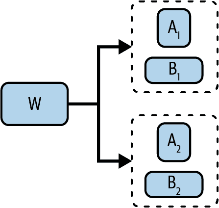

###### 图 7-12\. 在多 LoRA 部署中保持 LoRA 适配器分离，允许重用相同的满秩矩阵 *W*。

对于多 LoRA 部署，虽然选项 2 会增加延迟开销，但它显著减少了所需的存储空间。考虑这样一个场景：您使用 LoRA 为每位客户微调一个模型。如果有 100 位客户，您将拥有 100 个微调模型，它们都共享相同的基模型。在选项 1 中，您必须存储 100 个满秩矩阵 *W*ʹ。在选项 2 中，您只需要存储一个满秩矩阵 *W*，以及 100 组较小的矩阵（*A*，*B*）。

为了更清楚地说明这一点，让我们假设原始矩阵 *W* 的维度为 `4096 × 4096`（16.8M 个参数）。如果 LoRA 的秩为 8，那么 *A* 和 *B* 中的参数数量为 `4096 × 8 × 2 = 65,536`：

+   在选项 1 中，100 个满秩矩阵 *W*ʹ 总计 `16.8M × 100 = 1.68B` 个参数。

+   在选项 2 中，一个满秩矩阵 *W* 和 100 组小矩阵（*A*，*B*）总共：`16.8M + 65,536 × 100 = 23.3M` 个参数。

选项 2 还可以加快任务之间的切换速度。假设您目前正在使用这位客户的模型为客户 *X* 提供服务。要切换到为客户 *Y* 提供服务，您只需要加载 Y 的 LoRA 适配器，而不是加载这位客户的完整权重矩阵，这可以显著减少加载时间。虽然保持 *A* 和 *B* 分离会增加额外的延迟，但有一些优化技术可以最小化增加的延迟。[本书的 GitHub 仓库](https://github.com/chiphuyen/aie-book) 包含了如何做到这一点的教程。

多 LoRA 服务使得结合多个专用模型变得容易。你不需要有一个用于多个任务的大而强大的模型，而是可以为每个任务有一个 LoRA 适配器。例如，苹果公司使用了多个[LoRA 适配器](https://oreil.ly/vfXqE)来适应相同的 300 亿参数基础模型，以适应不同的 iPhone 功能（2024）。他们利用量化技术进一步减少了基础模型和适配器的内存占用，使得它们都可以在设备上提供服务。

LoRA 适配器的模块化意味着 LoRA 适配器可以被共享和重用。你可以像使用预训练模型一样使用公开可用的微调 LoRA 适配器。你可以在[Hugging Face](https://oreil.ly/T08JJ)^(26)或类似的项目[AdapterHub](https://adapterhub.ml)上找到它们。

你可能会想：“LoRA 听起来很棒，但有什么缺点吗？”LoRA 的主要缺点是它提供的性能不如全微调。由于它涉及修改模型的实现，这需要理解模型的架构和编程技能，因此它比全微调更具挑战性。然而，这通常只适用于不太受欢迎的基础模型。PEFT 框架，如[Hugging Face 的 PEFT](https://github.com/huggingface/peft)、[Axolotl](https://github.com/axolotl-ai-cloud/axolotl)、[unsloth](https://github.com/unslothai/unsloth)和[LitGPT](https://github.com/Lightning-AI/litgpt)，可能直接支持流行基础模型的 LoRA。

#### 量化 LoRA

LoRA 的快速崛起导致了众多 LoRA 变体的开发。其中一些旨在进一步减少可训练参数的数量。然而，如表 7-6 所示，与模型权重的内存相比，LoRA 适配器的内存最小。减少 LoRA 参数的数量只能将整体内存占用减少一小部分。

表 7-6\. 与模型权重所需的内存相比，LoRA 权重所需的内存。

|  | 模型权重内存（16 位） | LoRA 可训练参数（r=2，查询与键矩阵） | LoRA 适配器内存（16 位） |
| --- | --- | --- | --- |
| Llama 2 (13B) | 26 GB | 3.28M | 6.55 MB |
| GPT-3 (175B) | 350 GB | 18.87M | 37.7 MB |

而不是试图减少 LoRA 的参数数量，你可以在微调期间通过量化模型的权重、激活和/或梯度来更有效地减少内存使用。LoRA 的一个早期有希望的量化版本是 QLoRA ([Dettmers et al., 2023](https://arxiv.org/abs/2305.14314)).^(27) 在原始的 LoRA 论文中，在微调期间，模型的权重使用 16 位存储。QLoRA 将模型的权重存储在 4 位，但在计算前向和反向传递时将它们反量化（转换）回 BF16。

QLoRA 使用的 4 位格式是 NF4（NormalFloat-4），它根据预训练权重通常遵循以零为均值的正态分布的见解来量化值。在 4 位量化之上，QLoRA 还使用分页优化器，当 GPU 内存不足时自动在 CPU 和 GPU 之间传输数据，特别是对于长序列长度。这些技术使得一个 65B 参数的模型可以在单个 48 GB GPU 上进行微调。

作者在 4 位模式下微调了各种模型，包括从 Llama 7B 到 65B。这个被称为 Guanaco 的模型系列在公共基准测试和比较评估中均表现出竞争力。表 7-7 显示了 2023 年 5 月 Guanaco 模型、GPT-4 和 ChatGPT 的 Elo 评分，由 GPT-4 评判。虽然 Guanaco 65B 没有超过 GPT-4，但它通常比 ChatGPT 更受欢迎。

表 7-7\. 使用 GPT-4 作为评判者，与 2023 年 5 月流行的模型相比，Guanaco 模型的 Elo 评分。实验来自 QLoRA（Dettmers 等人，2023 年）。

| 模型 | 大小 | Elo |
| --- | --- | --- |
| GPT-4 | - | 1348 ± 1 |
| Guanaco 65B | 41 GB | 1022 ± 1 |
| Guanaco 33B | 21 GB | 992 ± 1 |
| Vicuna 13B | 26 GB | 974 ± 1 |
| ChatGPT | - | 966 ± 1 |
| Guanaco 13B | 10 GB | 916 ± 1 |
| Bard | - | 902 ± 1 |
| Guanaco 7B | 6 GB | 879 ± 1 |

QLoRA 的主要限制是 NF4 量化成本高昂。虽然 QLoRA 可以减少内存占用，但由于量化和解量化步骤所需额外时间，它可能会增加训练时间。

由于其节省内存的承诺，量化 LoRA 是一个活跃的研究领域。除了 QLoRA 之外，其他量化 LoRA 的工作包括 QA-LoRA（[Xu 等人，2023](https://arxiv.org/abs/2309.14717)）、ModuLoRA（[Yin 等人，2023](https://arxiv.org/abs/2309.16119)）和 IR-QLoRA（[Qin 等人，2024](https://arxiv.org/abs/2402.05445)）。

## 模型合并和多任务微调

如果微调允许您通过改变单个模型来创建自定义模型，那么模型合并允许您通过组合多个模型来创建自定义模型。模型合并比单独的微调提供了更大的灵活性。您可以将两个可用的模型合并在一起，以创建一个新模型，希望它更有用。您还可以在合并之前对构成模型中的任何一个或所有模型进行微调。

虽然您不需要进一步微调合并的模型，但通过微调通常可以提高其性能。不进行微调，可以在没有 GPU 的情况下进行模型合并，这使得合并对没有大量计算能力的独立模型开发者特别有吸引力。

模型合并的目标是创建一个单一模型，其提供的价值大于单独使用所有组成模型。增加的价值可以来自性能的提升。例如，如果你有两个在相同任务上擅长不同事物的模型，你可以将它们合并成一个在该任务上比两者都好的单一模型。想象一下，一个模型可以回答前 60%的问题，另一个模型可以回答最后 60%的问题。结合在一起，它们可能可以回答 80%的问题。

增加的价值也可以来自减少的内存占用，这导致成本降低。例如，如果你有两个可以执行不同任务的模型，它们可以被合并成一个既能执行这两个任务但参数更少的模型。这对于基于适配器的模型尤其有吸引力。给定两个在相同基础模型上微调的模型，你可以将它们的适配器合并成一个单一的适配器。

模型合并的一个重要用例是多任务微调。如果没有模型合并，如果你想为多个任务微调一个模型，你通常必须遵循以下方法之一：

同时微调

你创建一个包含所有任务示例的数据集，并在该数据集上微调模型，使模型能够同时学习所有任务。然而，由于同时学习多项技能通常更困难，这种方法通常需要更多的数据和更多的训练。

顺序微调

你可以在每个任务上分别但顺序地微调模型。在训练完任务 A 的模型后，再在任务 B 上训练，依此类推。假设模型一次学习一个任务更容易。不幸的是，神经网络容易发生灾难性遗忘（[Kirkpatrick et al., 2016](https://arxiv.org/abs/1612.00796)）。当模型在新的任务上训练时，可能会忘记如何执行旧任务，导致早期任务性能显著下降。

模型合并为多任务微调提供了另一种方法。你可以在不同的任务上分别但并行地微调模型。一旦完成，这些不同的模型就会被合并在一起。分别对每个任务进行微调允许模型更好地学习该任务。因为没有顺序学习，所以发生灾难性遗忘的风险更小。

当你必须将模型部署到手机、笔记本电脑、汽车、智能手表和仓库机器人等设备上时，模型合并也很吸引人。由于设备上的内存容量有限，设备上的部署通常具有挑战性。与其将多个用于不同任务的模型压缩到设备上，不如将这些模型合并成一个可以执行多个任务但所需内存更少的单一模型。

在设备上部署对于数据不能离开设备的使用案例是必要的（通常由于隐私原因），或者当存在有限或不稳定的互联网接入时。设备上的部署还可以显着降低推理成本。您可以将更多计算卸载到用户设备上，那么您需要支付给数据中心的钱就越少。28

模型合并是进行**联邦学习**的一种方法([McMahan et al., 2016](https://arxiv.org/abs/1602.05629))，其中多个设备使用不同的数据训练相同的模型。例如，如果您将模型 X 部署到多个设备上，X 的每个副本都可以从设备上的数据继续单独学习。过了一段时间，您就有了 X 的多个副本，它们都在不同的数据上进行了训练。您可以将这些副本合并成一个新基础模型，该模型包含所有构成模型的训练。

将模型组合起来以获得更好的性能的想法始于**模型集成方法**。根据[Wikipedia](https://en.wikipedia.org/wiki/Ensemble_learning)，集成结合了“多个学习算法，以获得比任何单个构成学习算法单独获得的更好的预测性能。”如果模型合并通常涉及混合构成模型的参数，那么集成通常仅结合模型输出，同时保持每个构成模型完整。

例如，在集成中，给定一个查询，您可能会使用三个模型生成三个不同的答案。然后，基于这三个答案生成一个最终答案，使用简单的多数投票或另一个可训练的机器学习模块。29 而集成通常可以提高性能，但由于它需要每个请求进行多次推理调用，因此具有更高的推理成本。

图 7-13 比较了集成和模型合并。就像模型集成曾经主导排行榜一样，[Hugging Face 的 Open LLM 排行榜](https://oreil.ly/hRV9P)上的许多模型都是合并模型。

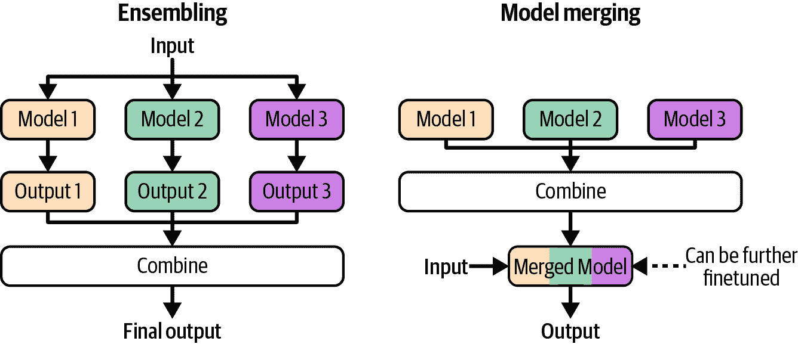

###### 图 7-13\. 集成和模型合并的工作方式。

许多模型合并技术是实验性的，并且随着社区对底层理论的更好理解，可能会变得过时。因此，我将专注于高级合并方法，而不是任何个别技术。

模型合并方法在如何组合构成参数方面有所不同。这里涵盖的三种方法是相加、层堆叠和连接。图 7-14 显示了它们的高级差异。


###### 图 7-14\. 模型合并的三个主要方法：相加、层堆叠和连接。

在合并模型时，您可以混合这些方法，例如，将一些层相加，将其他层堆叠。让我们探索这些方法中的每一个。

### 相加

这种方法涉及将构成模型的权重值相加。我将讨论两种求和方法：线性组合和球面线性插值。如果两个模型的参数处于不同的尺度上，例如，一个模型的参数值比另一个大得多，您可以在求和之前重新缩放模型，以便它们的参数值处于相同的范围内。

#### 线性组合

线性组合包括平均和加权平均。给定两个模型 A 和 B，它们的加权平均是：

$Merge\ left-parenthesis\ upper A\ comma\ upper B\ right-parenthesis\ equals\ StartFraction\ upper W Subscript upper A Baseline\ upper A plus\ upper W Subscript upper B Baseline\ upper B\ Over\ upper W Subscript upper A Baseline\ plus\ upper W Subscript upper B Baseline\ EndFraction$

图 7-15 展示了当*w*[*A*] = *w*[*B*] = 1 时如何线性组合两个层。

![黄色圆圈带数字的图]

自动生成的描述](assets/aien_0715.png)

###### 图 7-15. 通过平均合并参数。

线性组合非常简单，但效果惊人.^(30)早在 20 世纪 90 年代初，就研究了多个模型可以线性组合以创建更好的模型的想法([Perrone，1993](https://oreil.ly/eXC02))。线性组合在联邦学习中经常被使用([Wang 等人，2020](https://oreil.ly/ZKRPR))。

您可以线性组合整个模型或模型的部分。模型汤([Wortsman 等人，2022](https://arxiv.org/abs/2203.05482))展示了通过平均多个微调模型的全部权重可以提高准确度，而不会增加推理时间。然而，更常见的是通过线性组合特定的组件来合并模型，例如它们的适配器。

虽然您可以线性组合任何一组模型，但*线性组合对于在相同基础模型上微调的模型最为有效*。在这种情况下，线性组合可以通过*任务向量*的概念来理解。想法是，一旦您为特定任务微调了一个模型，从其中减去基础模型应该会得到一个捕捉任务本质的向量。任务向量也称为*delta 参数*。如果您使用 LoRA 进行微调，您可以从 LoRA 权重中构建任务向量。

任务向量使我们能够进行*任务算术*([Ilharco 等人，2022](https://arxiv.org/abs/2212.04089))，例如将两个任务向量相加以组合任务能力或减去一个任务向量以减少特定能力。任务减法可以用于移除不希望出现的模型行为，例如面部识别等侵入性能力或预训练期间获得的偏差。

当要合并的组件具有相同的架构和大小的时候，线性组合是直接的。然而，它也可以适用于不共享相同架构或大小的模型。例如，如果一个模型的层比另一个模型大，你可以将一个或两个层投影到相同的维度。

有些人提出在平均之前对齐模型，以确保功能相关的参数被一起平均，例如在“通过最优传输进行模型融合”（[Singh 和 Jaggi，2020](https://arxiv.org/abs/1910.05653)），“Git Re-Basin：模态重基：模态合并模态对称性”（[Ainsworth 等人，2022](https://arxiv.org/abs/2209.04836)）和“在任务参数子空间中通过匹配模型进行合并”（[Tam 等人，2023](https://arxiv.org/abs/2312.04339)）中。虽然结合对齐参数是有意义的，但参数对齐可能具有挑战性，因此这种方法在简单的线性组合中不太常见。

#### 球面线性插值（SLERP）

另一种常见的模型求和方法是 SLERP，它基于同名的数学运算符，即球面线性插值。

###### 注意

插值意味着根据已知值估计未知值。在模型合并的情况下，未知值是合并后的模型，已知值是构成模型。线性组合是一种插值技术。SLERP 是另一种。

因为 SLERP 的公式很数学，而且模型合并工具通常为你实现它，所以我不会在这里详细介绍。直观上，你可以将每个要合并的组件（向量）想象成一个球面上的点。要合并两个向量，你首先在球面上画出这两个点之间的最短路径。这类似于在地球表面上画出两个城市之间的最短路径。这两个向量的合并向量是它们最短路径上的一个点。这个点在路径上的确切位置取决于插值因子，你可以将其设置为介于 0 和 1 之间。小于 0.5 的因子值将合并向量更靠近第一个向量，这意味着第一个任务向量将对结果贡献更多。0.5 的因子意味着你选择一个正好在中间的点。这个中间点就是图 7-16 中的蓝色点。

作为一种数学运算，SLERP（球面线性插值）仅使用两个向量定义，这意味着你一次只能合并两个向量。如果你想合并超过两个向量，你可以按顺序进行 SLERP，即先合并 A 和 B，然后将结果与 C 合并。

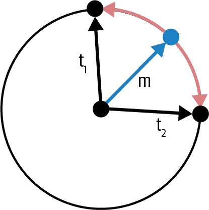

###### 图 7-16\. SLERP 如何作用于两个向量 t1 和 t2。红色线是它们在球面上的最短路径。根据插值，合并向量可以是这条路径上的任何一点。蓝色向量是当插值因子为 0.5 时的结果合并向量。

#### 剪枝冗余任务特定参数

在微调过程中，许多模型的参数都会进行调整。然而，这些调整中的大多数都是微小的，并且不会对模型在任务上的性能产生显著贡献。31 对模型性能没有贡献的调整被认为是*冗余*的。

在论文“TIES-Merging: Resolving Interference When Merging Models”中，[Yadav et al. (2023)](https://arxiv.org/abs/2306.01708)展示了你可以通过最小化性能下降来重置大量任务向量参数，如图图 7-17 所示。重置意味着将微调参数更改为其在基础模型中的原始值，有效地将相应的任务向量参数设置为零。（回想一下，任务向量可以通过从微调模型中减去基础模型来获得。）

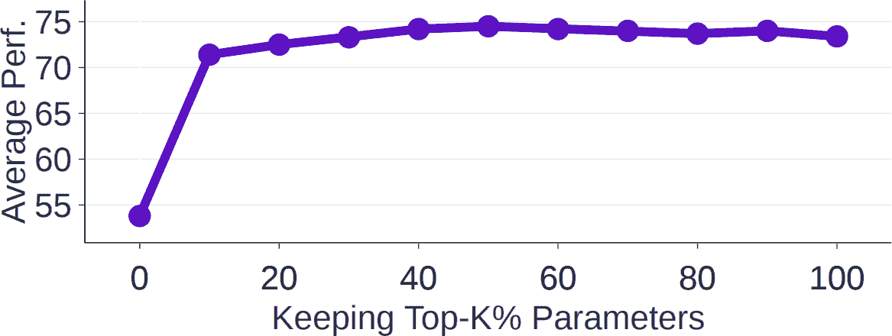

###### 图 7-17\. 在 Yadav et al.的实验中，保留任务向量参数的前 20%与保留 100%的参数具有可比的性能。

这些冗余参数，虽然对单个模型没有害处，但可能对合并模型有害。例如，TIES（Yadav et al., 2023）和 DARE（[Yu et al., 2023](https://arxiv.org/abs/2311.03099)）等合并技术首先从任务向量中剪枝冗余参数，然后再进行合并。32 两篇论文都表明，这种做法可以显著提高最终合并模型的质量。要合并的模型越多，剪枝就越重要，因为一个任务中的冗余参数有更多机会干扰其他任务。33

### 层堆叠

在这种方法中，你从一个或多个模型中取出不同的层并将它们堆叠在一起。例如，你可能从模型 1 中取出第一层，从模型 2 中取出第二层。这种方法也被称为*透传*或*弗兰肯斯坦合并*。它可以创建具有独特架构和参数数量的模型。与通过求和合并的方法不同，通过层堆叠得到的合并模型通常需要进一步微调以达到良好的性能。

弗兰肯斯坦合并的一个早期成功是[Goliath-120B](https://oreil.ly/IM0Jc)（alpindale，2023），它是由两个微调后的 Llama 2-70B 模型[Xwin](https://oreil.ly/URfbk)和[Euryale](https://oreil.ly/Ftnxd)合并而成的。它从每个模型中取出了 72 层中的 80 层并将它们合并在一起。

层堆叠可用于训练混合专家（MoE）模型，如“稀疏升级：从密集检查点训练混合专家”（Komatsuzaki 等人，2022 年）中所述（[Komatsuzaki 等人，2022](https://arxiv.org/abs/2212.05055)）。与其从头开始训练一个 MoE 模型，你取一个预训练模型并复制某些层或模块。然后添加一个路由器，将每个输入发送到最合适的副本。然后进一步训练合并的模型以及路由器，以提升它们的性能。图 7-18 展示了这个过程。

Komatsuzaki 等人表明，层堆叠可以产生优于从头开始训练的 MoE 模型的模型。使用这种方法，Together AI 将六个较弱的开源模型混合在一起，创建了混合代理模型，在某些基准测试中达到了与 OpenAI 的 GPT-4o 相当的性能（[王等人，2024](https://arxiv.org/abs/2406.04692)）。


###### 图 7-18。您可以从预训练模型创建一个 MoE 模型。图像改编自 Komatsuzaki 等人（2022 年）。

层堆叠的一个有趣用例是*模型升级*。模型升级是研究如何使用更少的资源创建更大模型的研究。有时，你可能需要一个比你已有的更大的模型，可能是因为更大的模型能提供更好的性能。例如，你的团队最初训练了一个模型以适应 40 GB 的 GPU。然而，你获得了一台新的机器，拥有 80 GB 的内存，这允许你服务一个更大的模型。而不是从头开始训练新模型，你可以使用层堆叠从现有模型创建一个更大的模型。

层升级的一种方法是*深度缩放*。[Kim 等人（2023）](https://arxiv.org/abs/2312.15166)使用这种技术从具有 32 层的 7B 参数模型创建 SOLAR 10.7B。该过程如下：

1.  复制原始预训练模型。

1.  通过相加某些层（相加两层并合并成一层）和堆叠其余部分来合并这两个副本。要相加的层被仔细选择以匹配目标模型大小。对于 SOLAR 10.7B，相加了 16 层，最终模型有 32 × 2 - 16 = 48 层。

1.  进一步训练这个升级后的模型以实现目标性能。

图 7-19 展示了这个过程。


###### 图 7-19。使用深度缩放从 32 层模型创建 48 层模型。此图像根据 CC BY 4.0 许可发布，并稍作修改以提高可读性。

### 连接

除了以不同方式将构成模型的参数相加外，你还可以将它们连接起来。合并组件的参数数量将是所有构成组件参数数量的总和。如果你合并秩为 *r*[1] 和 *r*[2] 的两个 LoRA 适配器，合并适配器的秩将是 *r*[1] + *r*[2]，如图 7-20 所示。

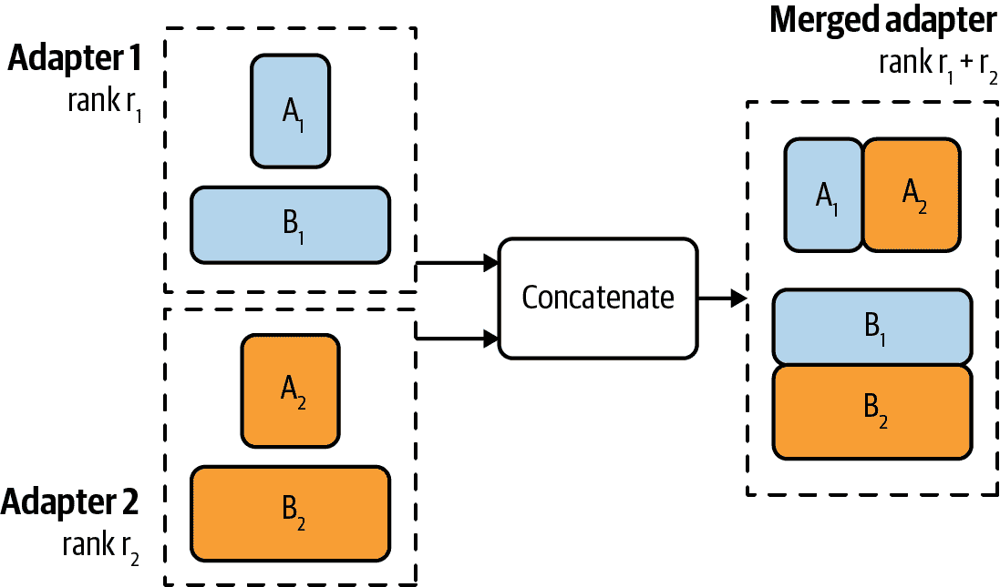

###### 图 7-20\. 如果你使用连接合并两个 LoRA 适配器，合并适配器的秩将是两个适配器秩的总和。

连接不建议使用，因为它与分别提供不同模型相比，并不会减少内存占用。连接可能会提供更好的性能，但增量性能可能不值得增加的额外参数数量.^(34)

## 微调策略

本章讨论了多种微调方法，它们解决的问题以及它们的工作原理。在本节的最后，我将关注更实用的微调策略。

### 微调框架和基础模型

尽管微调周围的许多事情——决定是否微调、获取数据和维护微调模型——都很困难，但实际的微调过程更为直接。你需要选择三件事：一个基础模型、一个微调方法和一个微调框架。

#### 基础模型

第四章 已经讨论了可以应用于基于提示方法和微调的模型选择标准。讨论的一些标准包括模型大小、许可证和基准性能。在 AI 项目开始时，当你仍在探索任务可行性时，从你负担得起的最高性能模型开始是有用的。如果这个模型难以产生好的结果，较弱的模型可能表现得更差。如果最强模型满足你的需求，然后你可以探索较弱的模型，将初始模型作为比较的基准。

对于微调，起始模型因不同项目而异。[OpenAI 的微调最佳实践文档](https://oreil.ly/7I6Ch)提供了两种开发路径的示例：进展路径和蒸馏路径。

进展路径看起来是这样的：

1.  使用最便宜、最快的模型测试你的微调代码，以确保代码按预期工作.^(35)

1.  通过微调一个中等模型来测试你的数据。如果增加数据后训练损失没有下降，可能存在问题。

1.  使用最佳模型进行更多实验，看看你能将性能提升到什么程度。

1.  一旦你得到好的结果，对所有模型进行一次训练运行，以绘制价格/性能前沿，并选择对你用例最有意义的模型。

蒸馏路径可能如下所示：

1.  从一个小数据集和你可以负担的最强大的模型开始。使用这个小数据集训练出最好的模型。因为基础模型已经很强，所以需要更少的数据来实现良好的性能。

1.  使用这个微调模型来生成更多的训练数据。

1.  使用这个新数据集来训练一个更便宜的模型。

由于微调通常在提示工程实验之后进行，当你开始微调时，理想情况下，你应该对不同模型的特性有相当好的理解。你应该根据这种理解来规划你的微调开发路径。

#### 微调方法

记住，像 LoRA 这样的适配器技术虽然成本效益高，但通常无法提供与全量微调相同水平的性能。如果你是微调的初学者，可以尝试 LoRA 这样的方法，稍后再尝试全量微调。

使用的微调方法也取决于你的数据量。根据基础模型和任务的不同，全量微调通常至少需要数千个示例，有时甚至更多。然而，PEFT 方法却可以在更小的数据集上展现出良好的性能。如果你有一个小数据集，比如几百个示例，全量微调可能不会优于 LoRA。

在决定微调方法时，考虑到你需要多少个微调模型以及你希望如何提供服务。基于适配器的 LoRA 等方法允许你更有效地服务多个共享相同基础模型的模型。使用 LoRA，你只需要服务一个完整的模型，而全量微调则需要服务多个完整的模型。

#### 微调框架

最简单的微调方式是使用微调 API，你可以上传数据，选择基础模型，然后获取一个微调模型。像模型推理 API 一样，微调 API 可以由模型提供商、云服务提供商和第三方提供商提供。这种方法的局限性在于，你受限于 API 支持的基模型。另一个局限性是，API 可能不会暴露出所有你可以用来实现最佳微调性能的控件。微调 API 适合那些想要快速简单的人，但对于那些想要更多定制的人来说可能会令人沮丧。

你也可以使用许多优秀的微调框架之一来进行微调，例如[LLaMA-Factory](https://github.com/hiyouga/LLaMA-Factory)、[unsloth](https://github.com/unslothai/unsloth)、[PEFT](https://github.com/huggingface/peft)、[Axolotl](https://github.com/axolotl-ai-cloud/axolotl)和[LitGPT](https://github.com/Lightning-AI/litgpt)。它们支持广泛的微调方法，特别是基于适配器的技术。如果你想要进行全量微调，许多基础模型在 GitHub 上提供了开源的训练代码，你可以克隆并使用自己的数据进行训练。[Llama Police](https://huyenchip.com/llama-police)有一个更全面和更新的微调框架和模型仓库列表。

进行自己的微调给你更多的灵活性，但你需要提供必要的计算资源。如果你只使用基于适配器的技术，中端 GPU 可能对大多数模型就足够了。如果你需要更多的计算资源，你可以选择一个与你的云提供商无缝集成的框架。

要使用多台机器微调模型，你需要一个帮助你进行分布式训练的框架，例如[DeepSpeed](https://github.com/microsoft/DeepSpeed)、[PyTorch Distributed](https://oreil.ly/hxUAk)和[ColossalAI](https://github.com/microsoft/DeepSpeed)。

### 微调超参数

根据基础模型和微调方法，有许多超参数你可以调整以提高微调效率。对于你用例的具体超参数，请查看你使用的基模型或微调框架的文档。在这里，我将介绍一些经常出现的重要超参数。

#### 学习率

学习率决定了模型参数在每次学习步骤中应该变化多快。如果你把学习看作是寻找通往目标路径的过程，那么学习率就是步长。如果步长太小，可能需要太长时间才能达到目标。如果步长太大，你可能会超过目标，因此模型可能永远不会收敛。

并不存在通用的最优学习率。你需要对不同学习率进行实验，通常在 1e-7 到 1e-3 的范围内，以确定哪个效果最好。常见的做法是在预训练阶段的末尾取学习率，并将其乘以 0.1 到 1 之间的常数。

损失曲线可以给你关于学习率的提示。如果损失曲线波动很大，那么很可能是学习率太大。如果损失曲线稳定但下降时间过长，那么学习率可能太小。提高学习率直到损失曲线保持稳定。

你可以在训练过程中调整学习率。你可以在开始时使用较大的学习率，在接近结束时使用较小的学习率。决定学习率在整个训练过程中如何变化的算法称为学习率调度。

#### 批大小

批大小决定了模型在每一步中从多少个示例中学习以更新其权重。批大小太小，例如少于八个，可能导致训练不稳定。36 批大小越大，有助于汇总不同示例的信号，从而实现更稳定和可靠的更新。

通常情况下，批大小越大，模型通过训练示例的速度越快。然而，批大小越大，运行你的模型所需的内存就越多。因此，批大小受你所使用的硬件限制。

这是你看到成本与效率权衡的地方。更昂贵的计算资源允许更快的微调。

到目前为止，计算仍然是调优的瓶颈。通常，模型很大，内存受限，只能使用小批量大小。这可能导致模型权重更新不稳定。为了解决这个问题，你可以在积累足够可靠的梯度后，而不是在每次批量更新模型权重，可以在几个批量之间累积梯度，然后更新模型权重。这种技术称为*梯度累积*^(37)。

当计算成本不是最重要的因素时，你可以尝试不同的批量大小，看看哪个能给出最佳模型性能。

#### Epoch 数量

一个 epoch 是对训练数据的遍历。epoch 的数量决定了每个训练示例被训练的次数。

小数据集可能需要比大数据集更多的 epoch。对于有数百万个示例的数据集，1-2 个 epoch 可能就足够了。对于有数千个示例的数据集，在 4-10 个 epoch 后可能仍然看到性能提升。

训练损失和验证损失之间的差异可以给你关于 epoch 的提示。如果训练损失和验证损失仍然稳步下降，模型可以从更多的 epoch（和更多数据）中受益。如果训练损失仍然下降，但验证损失增加，这意味着模型对训练数据过拟合，你可能需要尝试减少 epoch 的数量。

#### 提示损失权重

对于指令调优，每个示例都由一个提示和一个响应组成，这两个都可以在训练期间对模型的损失做出贡献。然而，在推理期间，提示通常由用户提供，模型只需要生成响应。因此，响应标记在训练期间对模型损失的贡献应该比提示标记更多。

提示模型权重决定了提示相对于响应对损失贡献的程度。如果这个权重是 100%，提示对损失的贡献与响应一样多，这意味着模型从两者中学习得同样多。如果这个权重是 0%，模型只从响应中学习。通常，这个权重默认设置为 10%，这意味着模型应该从提示中学习一些，但主要从响应中学习。

# 摘要

在评估章节之外，调优一直是写作最具挑战性的章节。它涉及了广泛的概念，既有旧的（迁移学习）也有新的（PEFT），既有基础的（低秩分解）也有实验性的（模型合并），既有数学的（内存计算）也有策略性的（超参数调整）。在保持它们易于理解的同时，将这些不同的方面安排成一个连贯的结构是困难的。

调优过程本身并不难。许多调优框架会为你处理训练过程。这些框架甚至可以建议一些常见的调优方法，并带有合理的默认超参数。

然而，微调的背景是复杂的。它始于你是否应该甚至微调一个模型。本章从微调的原因和不应微调的原因开始。它还讨论了一个我经常被问到的问题：何时微调，何时进行 RAG。

在微调的早期，微调与预训练类似——两者都涉及更新模型的全部权重。然而，随着模型规模的增加，对于大多数从业者来说，完全微调变得不切实际。微调时需要更新的参数越多，微调所需的内存就越多。大多数从业者没有足够的资源（硬件、时间和数据）来使用基础模型进行完全微调。

许多微调技术都是出于相同的动机：在最小的内存占用下实现强大的性能。例如，PEFT 通过减少可训练参数的数量来降低微调的内存需求。另一方面，量化训练通过减少表示每个值所需的位数来缓解这个内存瓶颈。

在概述了 PEFT 之后，本章聚焦于 LoRA——为什么以及它是如何工作的。LoRA 具有许多使它在从业者中受欢迎的特性。除了参数高效和数据高效之外，它还具有模块化特性，这使得服务和使用多个 LoRA 模型变得更加容易。

将微调模型结合起来的想法将本章引向了模型合并；其目标是合并多个模型，使其比单独使用这些模型表现得更好。本章讨论了模型合并的许多用例，从设备上部署到模型升级，以及模型合并的一般方法。

我经常听到从业者的一个评论是，微调很容易，但获取微调数据却很困难。获取高质量的标注数据，尤其是指令数据，是一项挑战。下一章将深入探讨这些挑战。

^(1) 有些人称这种现象为对齐税([Bai et al., 2020](https://arxiv.org/abs/2204.05862))，但这个术语可能会与针对人类偏好对齐的惩罚相混淆。

^(2) 许多企业抵制改变他们认为“足够好”的技术。如果所有公司都迅速采用更优的解决方案，传真机现在可能已经过时了。

^(3) 我还注意到一些情况，当工程师知道微调并非绝对必要，但仍然坚持这样做，因为他们想学习如何微调。作为一个喜欢学习新技能的工程师，我欣赏这种心态。然而，如果你处于领导职位，区分微调是必需的还是想要的可能会很困难。

^(4) 0314 代表这个 GPT-4 版本发布的日期，2024 年 3 月 14 日。具体的日期戳很重要，因为不同版本的性能差异很大。

^(5) 一些人士，例如 Llama 3.1 论文的作者（Dubey 等人，2024 年[1](https://arxiv.org/abs/2407.21783)），坚持“训练后应使模型与‘知道它知道什么’对齐，而不是添加知识”的原则。

^(6) 除了反向传播之外，训练神经网络的一个有前景的方法是进化策略。一个例子，由 Maheswaranathan 等人描述，结合了随机搜索和代理梯度，而不是使用真实梯度来更新模型权重。另一种有趣的方法是直接反馈对齐（Arild Nøkland，2016 年[4](https://arxiv.org/abs/1609.01596)）。

^(7) 如果一个参数不可训练，则不需要更新它，因此不需要计算其梯度。

^(8) 有些人可能会说，直到你看到“RuntimeError: CUDA out of memory”错误，你才算真正在做 AI。

^(9) 想了解更多关于推理内存计算的信息，请查看 Carol Chen 的“Transformer Inference Arithmetic”（[3](https://oreil.ly/u7wYx)），kipply 的博客（2022 年 3 月）。

^(10) 想了解更多关于训练内存计算的信息，请查看 EleutherAI 的“Transformer Math 101”（Anthony 等人，2023 年 4 月[2](https://oreil.ly/Xe7h6)）。

^(11) Google 推出了 BFloat16，将其称为“在 Cloud TPUs 上实现高性能的秘密”。

^(12) 整数格式也被称为*定点*格式。

^(13) 范围位被称为*指数*。精度位被称为*尾数*。

^(14) 注意，通常格式名称末尾的数字表示它占用多少位，但 TF32 实际上有 19 位，而不是 32 位。我相信它之所以被命名为 TF32，而不是 TF19，是为了暗示它与 FP32 的功能兼容性。但说实话，为什么叫 TF32 而不是 TF19 让我整夜辗转反侧。一位前同事在 NVIDIA 自愿提出了他的猜想，认为人们可能对奇怪的格式（19 位）持怀疑态度，因此将此格式命名为 TF32 使其看起来更友好。

^(15) FP16 和 BF16 的混淆在 Llama 3.1 中继续存在。参见 X 和 Threads 讨论：[1](https://en.wikipedia.org/wiki/IEEE_754)；[2](https://x.com/abacaj/status/1695334296792264792?s=20)，[3](https://oreil.ly/U8L4d)，[4](https://oreil.ly/8ush1)；以及 llama.cpp 在 BF16 和 FP16 之间的[基准测试](https://github.com/ggerganov/llama.cpp/pull/7150)，[Bloke 的总结](https://oreil.ly/0vuze)，和[Raschka 的总结](https://oreil.ly/WK_zT)。

^(16) 设计数值格式是一门迷人的学科。能够创建一个不降低系统质量且精度较低的格式，可以使该系统更加便宜和快速，从而启用新的用例。

^(17) 另一个对基于 transformer 的模型内存占用有重大贡献的因素是 KV 缓存，这在第九章中有讨论。

^(18) 符合所有 IEEE 原则的最小浮点数大小是 4 位。

^(19) Xnor-Net 论文的作者成立了 Xnor.ai，一家专注于模型压缩的初创公司。[在 2020 年初，它以 2 亿美元的价格被苹果公司收购](https://oreil.ly/V4pma)。

^(20) 在训练过程中，模型的权重通过多个步骤进行更新。小的舍入变化在训练过程中可能会累积，使得模型难以达到期望的性能。此外，损失值需要精确计算。损失值的小变化可能会将参数更新指向错误的方向。

^(21) 个人轶事：我在 NVIDIA 团队的大部分工作都集中在混合精度训练上。参见[“使用 OpenSeq2Seq 进行 NLP 和语音识别的混合精度训练”](https://oreil.ly/QL2gL)（Huyen 等人，NVIDIA 开发者技术博客，2018 年 10 月）。

^(22) 在部分微调中，通常会对靠近输出层的层进行微调，因为这些层通常更具有任务特定性，而早期层则倾向于捕获更通用的特征。

^(23) 我从未遇到过能立即向我解释这些技术之间差异的人。

^(24) 要有效地使用 LoRA 来训练模型，有必要了解该模型的架构。第二章已经涵盖了某些基于 transformer 的模型的权重组成。对于模型的精确权重组成，请参阅其论文。

^(25) 在撰写本文时，一些微调框架如[Fireworks](https://oreil.ly/82-jJ)仅允许最大 LoRA 秩为 32。然而，这种限制不太可能是由于性能问题，而更有可能是由于他们硬件的内存限制。

^(26) 通过标签“适配器”、“peft”或“LoRA”搜索这些适配器。

^(27) QLoRA 并不是唯一的量化 LoRA 工作。许多研究实验室都在进行量化 LoRA 的研究，但没有公开讨论。

^(28) 我的书[*设计机器学习系统*](https://oreil.ly/u_cVP)中有一个关于“云和边缘上的机器学习”的部分。

^(29) 你可以在我的书[*设计机器学习系统*](https://www.oreilly.com/library/view/designing-machine-learning/9781098107956/)中了解更多关于集成方法的内容。

^(30) 平均化不仅适用于权重，也适用于嵌入。例如，给定一个句子，你可以使用一个词嵌入算法为句子中的每个单词生成一个嵌入向量，然后将所有这些词嵌入平均成一个句子嵌入。当我刚开始机器学习时，我简直不敢相信平均化似乎总是有效。当简单的组件被正确使用时，可以创造出如此美妙而令人困惑的东西，就像 AI 一样，这真是神奇。

^(31) 假设，在微调过程中发生最大变化的参数是对于目标任务最重要的参数。

^(32) TIES 是从“TrIm, Elect Sign, and merge”缩写而来，而 DARE 是从“Drop And REscale”缩写而来。我知道，这些缩写也让我感到痛苦。

^(33) 当任务向量被剪枝时，它们变得更加稀疏，但微调后的模型不是。在这种情况下，剪枝不是为了减少内存占用或推理延迟，而是为了提高性能。

^(34) 我长时间争论是否应该将连接技术包含在这本书中，并最终决定为了完整性而包含它。

^(35) 在大学时，我犯了一个痛苦的错误，让我的模型整夜训练，结果在八小时后崩溃，因为我试图在一个不存在的文件夹中保存检查点。所有的进步都丢失了。

^(36) 虽然普遍认为小批量大小会导致训练不稳定，但我无法找到关于这种情况的良好解释。如果你有这方面的参考资料，请随时发送给我。

^(37) 我试图找到介绍梯度累积的第一篇论文，但未能找到。它在 2016 年的[“Ako: Decentralised Deep Learning with Partial Gradient Exchange”](https://oreil.ly/GFeC7)（Watcharapichat 等人，《第七届 ACM 云计算研讨会论文集》，2016）中被提及，其使用在深度学习中的应用最早可以追溯到 2016 年。这个概念似乎来自分布式训练，其中不同机器上计算的梯度需要累积并用于更新模型的权重。
