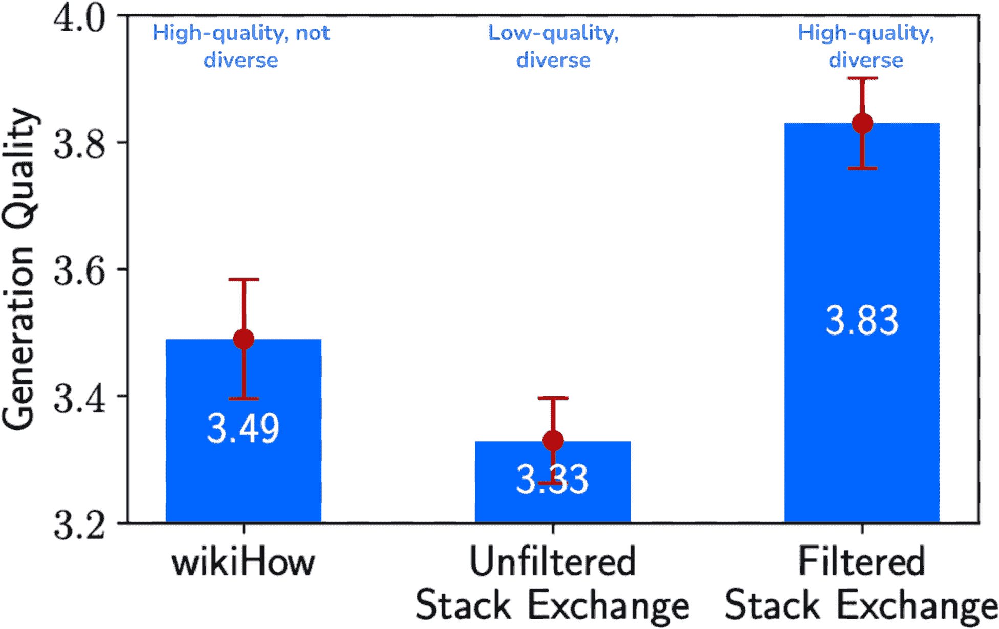
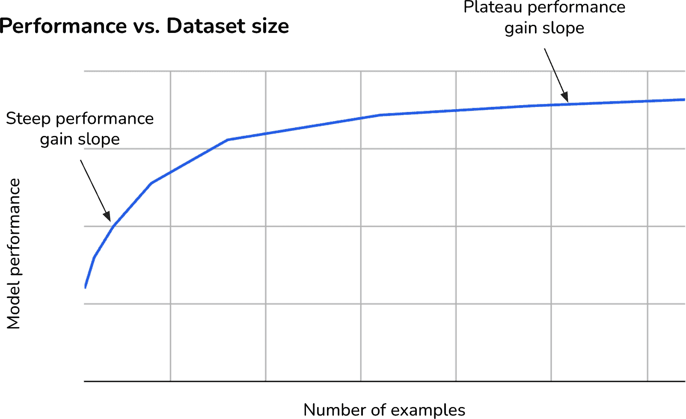

# 第八章：数据集工程

模型的质量取决于其训练数据的质量。即使拥有无限计算能力的世界上最好的机器学习团队也无法帮助你微调一个好的模型，如果你没有数据。数据集工程的目标是创建一个数据集，让你能够训练出最好的模型，理想情况下在分配的预算内。

由于越来越少的公司能够负担得起从头开始开发模型，越来越多的公司正在转向数据来区分其人工智能性能。随着模型对数据的需求增加，数据处理变得更加具有挑战性，并需要更多的人才和基础设施投资。1

数据操作已经从人们在有时间时处理的一些辅助任务发展成为专门的职位。许多人工智能公司现在雇佣数据标注员、数据集创建者和数据质量工程师，他们要么与核心工程团队集成，要么在其旁边工作。

如果模型领域已经足够复杂，有众多产品，那么数据领域则更加复杂，因为不断有越来越多的数据集和技术被引入。本章为您提供了数据领域的概述以及构建自己的数据集时应考虑的因素。

这一切始于数据整理，解决诸如你需要什么数据？需要多少？高质量数据意味着什么等问题。然后讨论数据合成和处理的技巧。数据整理、生成和处理并不遵循线性路径。你可能会在不同的步骤之间来回走动。

对于同一个模型，不同的训练阶段旨在教会模型不同的能力，因此需要具有不同属性的数据集。例如，预训练的数据量通常以标记的数量来衡量，而监督微调的数据量通常以示例的数量来衡量。然而，从高层次来看，它们的整理过程遵循相同的原理。本章重点介绍训练后的数据，因为这与应用开发者更相关。然而，当这些经验教训对训练后具有洞察力时，我也会包括预训练数据的经验教训。

你可以遵循最佳实践并使用工具来自动化过程的部分。然而，数据大部分只是辛勤的劳作、眼泪和汗水。

# 数据整理

虽然并非所有人工智能模型的问题都可以通过数据来解决，但数据通常是解决方案的关键部分。正确的数据可以使模型更强大、更安全，并能处理更长的上下文。相反，差的数据会导致模型增加偏差和幻觉。数据错误会损害模型并浪费资源。

数据整理是一门需要理解模型如何学习和有哪些资源可以帮助它学习的科学。数据集构建者应与应用程序和模型开发者紧密合作。在一个小团队中，他们可能就是同一个人——负责训练模型的人也负责获取数据。然而，对数据需求高的组织通常雇佣专门的职位。2

你需要的数据取决于你的任务以及你想要教给模型什么。对于自监督微调，你需要数据序列。对于指令微调，你需要（指令，响应）格式的数据。对于偏好微调，你需要（指令，获胜响应，失败响应）格式的数据。为了训练奖励模型，你可以使用与偏好微调相同的数据格式，或者使用带有每个示例的（指令，响应），分数）格式的数据。

训练数据应表现出你希望模型学习的那些行为。获取高质量的数据标注始终具有挑战性，但如果你想要教模型复杂的行为，如思维链（CoT）推理和工具使用，那就更具挑战性。让我们回顾这两个例子，了解为什么：

思维链

如第五章讨论的，思维链提示会引导模型在给出最终答案之前逐步解决问题。为了教会模型生成逐步响应，其训练数据应包括思维链响应。“扩展指令微调语言模型”([Chun 等人，2024](https://oreil.ly/imdhy))表明，在微调数据中包含逐步响应可以显著提高各种规模模型在思维链任务上的性能，某些任务的准确率几乎翻倍。

生成多步响应可能会很繁琐且耗时——逐步解释如何解决数学问题比仅仅给出最终答案要更具挑战性。为了说明这一点，这里有两个例子，一个只有最终答案，另一个有 CoT。这两个例子都来自 Chun 等人（2024 年）：

```py
Instruction: Please answer the following question. What is the boiling point 
of Nitrogen?
Response (without CoT): -320.4F

CoT instruction: Answer the following question by reasoning step-by-step. 
The cafeteria had 23 apples. If they used 20 for lunch and bought 6 more, 
how many apples do they have?
Response (with CoT): The cafeteria had 23 apples originally. They used 20 
to make lunch. So they had 23 - 20 = 3\. They bought 6 more apples, so they 
have 3 + 6 = 9.

```

因此，与其它指令数据集相比，思维链数据集较少见。

工具使用

考虑到模型在预训练期间获取的大量知识，许多模型可能直观地知道如何使用某些工具。然而，通过展示工具使用示例，可以提高模型使用工具的能力。通常，使用领域专家来创建工具使用数据，其中每个提示都是一个需要使用工具的任务，其响应是执行该任务所需的动作。例如，如果您想获取微调模型以充当个人助理的数据，您可能会询问专业个人助理他们通常执行哪些任务，他们如何执行这些任务，以及他们需要哪些工具。如果您要求人类专家解释他们是如何做事的，他们可能会遗漏某些步骤，要么是因为记忆错误，要么是因为他们认为这些步骤不重要。通常，观察人类执行这些任务以确保准确性是必要的。

然而，对人类有效的方法可能对 AI 无效，反之亦然。因此，人类标注可能不适合 AI 代理。例如，人类可能更喜欢 Web 界面，而使用 API 对模型来说更容易。为了搜索某物，人类可能会首先打开浏览器，将查询复制粘贴到搜索栏中，然后点击每个结果。与此同时，模型只需发送一个带有查询的请求到搜索 API，并一次性处理所有结果。因此，许多人依赖于模拟和其他合成技术来生成工具使用数据，如本章后面所探讨的。

工具使用数据可能还需要特殊的格式。在典型的对话数据中，用户和 AI 轮流发言，每个回合包含一条消息。然而，对于工具使用，AI 可能需要在每个回合生成多条消息，每条消息发送到不同的位置。例如，它可能向代码解释器发送一条消息，向用户（例如，通知用户它在做什么）发送一条消息。为了支持这一点，Llama 3 的作者（[Dubey 等人，2024](https://arxiv.org/abs/2407.21783)）设计了一种多消息聊天格式，该格式由指定每条消息来源和目的地的消息头以及用于指定人类和 AI 回合开始的特殊终止令牌组成。

当为具有对话界面的应用整理数据时，您需要考虑您是否需要单轮数据、多轮数据，或者两者都需要。单轮数据有助于训练模型响应单个指令。另一方面，多轮数据则教导模型如何解决问题——许多现实世界的问题涉及来回交流。例如，当接收到一个查询时，模型可能需要首先澄清用户的意图，然后再处理任务。在模型响应之后，用户可能会提供纠正或额外信息以供下一步使用。

单轮数据更简单，因此更容易获取。多轮数据通常需要专门构建的场景或更复杂的交互来捕捉。

数据整理不仅仅是创建新数据以帮助模型学习新行为，还涉及移除现有数据以帮助模型消除不良行为。想象一下，你正在开发一个类似于 ChatGPT 的聊天机器人，你听到用户投诉说聊天机器人有点傲慢，让用户感到烦恼，浪费了他们的代币。例如，当用户要求它验证一个陈述是否在事实上正确时，聊天机器人会这样回应：“这个陈述是正确的，但它的风格可以改进以更好。”然后它继续产生对陈述的非请求重写。

你调查后发现，在训练数据中，有几个带有非请求建议的注释示例。你提出请求，要求从训练数据中移除这些示例，并要求获取新的示例，以展示不带非请求重写的核实事实。

每个应用可能需要不同特征的数据。不同的训练阶段也要求不同的数据组合。然而，从高层次来看，数据整理遵循三个标准：数据质量、数据覆盖度和数据数量。

为了对这些术语有一个直观的理解，如果你将模型训练比作烹饪，那么输入到模型中的数据就是原料。数据质量等同于原料的质量——如果你的原料已经变质，你就无法做出好的食物。数据覆盖度等同于拥有合适的原料搭配（例如，你不应该放太多或太少糖）。数据数量关乎你应该有多少原料。让我们详细探讨这些术语。

## 数据质量

一小部分高质量数据可以超越大量噪声数据，例如无关或不一致的数据。Yi 模型系列的创造者发现，10K 精心设计的指令优于数十万噪声指令 ([Young et al., 2024](https://arxiv.org/abs/2403.04652))。

类似地，“LIMA: Less Is More for Alignment” ([Zhou et al., 2023](https://arxiv.org/abs/2305.11206))表明，一个 65B 参数的 Llama 模型，通过 1,000 精心挑选的提示和响应进行微调，在 43%的情况下，根据人类注释者的判断，其生成的答案要么与 GPT-4 相当，要么更受青睐。然而，数据示例过少的缺点是 LIMA 不如产品级模型稳健。

[Llama 3 团队](https://arxiv.org/abs/2407.21783)也得出了相同的结论。值得注意的是，他们发现人类生成数据更容易出现错误和不一致，尤其是在细微的安全政策方面。这促使他们开发 AI 辅助注释工具，以确保高质量的数据。

大多数人理解数据质量的重要性，但高质量数据意味着什么？简短的答案是，如果数据能帮助你高效可靠地完成工作，则被视为高质量数据。然而，不同的人对长答案的理解可能不同.^(3) 通常，如果数据具有以下六个特征，则可以被认为是高质量的：相关、符合任务要求、一致、格式正确、独特和合规。某些特定用例可能还有其他要求：

相关性

训练示例应与你要训练模型执行的任务相关。例如，如果任务是回答今天的法律问题，那么 19 世纪的法学数据集可能就不相关。然而，如果任务是关于 19 世纪的司法体系，这个数据集就非常相关。

符合任务要求

标注应与任务要求相一致。例如，如果任务要求事实一致性，标注应事实正确。如果任务要求创造力，标注应具有创造性。如果任务不仅要求评分，还要求对评分进行解释，标注应包括评分和解释。但如果任务要求简洁的回答，标注应简洁。

我使用“符合”而不是“准确”或“正确”，因为根据任务的不同，准确或正确的回答可能不是用户想要的。

一致性

标注应跨示例和标注者保持一致。如果你要求两位标注者对同一示例进行标注，他们的标注不应过于不同。如果任务是给论文评分从 1 到 5，那么得分相同的两篇论文质量是否相同？不一致的标注可能会使模型困惑，使得模型更难学习。

拥有一个良好的标注指南对于确保标注既符合任务要求又保持一致至关重要。

格式正确

所有示例都应遵循模型期望的格式。冗余的格式标记可能会干扰模型的学习，因此应将其删除。例如，如果你从网站上抓取产品评论，应删除 HTML 标签。注意尾随空格、换行、不一致的大小写和数字格式.^(4)

足够独特

这指的是数据中的独特示例.^(5) 在模型训练的背景下，重复可能会引入偏差并导致数据污染。我使用“足够独特”是因为特定用例可以容忍不同水平的重复。

合规

数据应符合所有相关内部和外部政策（包括法律和法规）。例如，如果你不允许使用 PII 数据来训练你的模型，你的数据不应包含任何 PII 数据。

在着手创建数据之前，重要的是要考虑这些特征对你意味着什么。本节讨论的技术旨在产生具有这些特征的数据。

## 数据覆盖范围

模型的训练数据应该涵盖你期望它解决的问题范围。现实世界的用户往往有广泛的问题，他们表达问题的方式可能差异很大。拥有捕捉你应用程序多样化使用模式的数据对于模型表现良好至关重要。覆盖范围需要足够的数据多样性，这就是为什么许多人将此属性称为数据多样性。

例如，如果一些用户构建了包含丰富参考的详细指令，而另一些用户则更喜欢简短的指令，你的微调数据应包括详细和简短的指令。如果用户查询通常有拼写错误，你应该包括带有拼写错误的示例。如果你的应用程序与多种编程语言一起工作，你的训练数据应包括用户关心的编程语言。

不同的应用程序有不同的多样性维度。例如，一个从法语到英语的工具不需要语言多样性，但可能从主题、长度和说话风格的多样性中受益。另一方面，为全球客户提供产品推荐的聊天机器人可能不需要领域多样性，但语言和文化多样性将很重要。

对于像聊天机器人这样的通用用途场景，微调数据应该是多样化的，代表广泛的主题和说话方式。[Ding 等人，(2023)](https://arxiv.org/abs/2305.14233) 认为进一步提高聊天语言模型性能的最直接方法是在训练过程中增加数据的质量和多样性。为了开发 Nemotron ([Adler 等人，2024](https://arxiv.org/abs/2406.11704))，NVIDIA 研究人员专注于创建一个具有任务多样性、主题多样性和指令多样性的数据集，这包括不同输出格式的指令、不同输出长度的指令以及开放性问题以及是或否问题的指令。“数据添加困境” ([Shen 等人，2024](https://www.arxiv.org/abs/2408.04154)) 证明了在某些情况下，添加更多异构数据可能会导致性能下降。

Meta 表示[Llama 3](https://arxiv.org/abs/2407.21783)在模型架构方面与较老的 Llama 版本没有显著差异。Llama 3 的性能提升“主要是由数据质量和多样性的改进以及训练规模的增加驱动的。”Llama 3 论文详细介绍了数据覆盖范围，涵盖了训练的所有三个阶段：预训练、监督微调和偏好微调。虽然本章重点介绍训练后的数据，但查看同一模型在不同训练阶段的数据组合对于比较和突出每个阶段考虑因素是有用的。

在所有三个阶段都保持一致的多样性轴是领域多样性，尽管“多样性”的确切含义有所不同，如表 8-1 所示。此表仅显示高级领域，不包括更细粒度的主题，如“几何”，这是数学的一个子类别。训练后的数据也有不同的多样性轴，这些轴在表中没有显示，例如，标记的数量（包括上下文和响应）以及轮数。Llama 3 使用合成数据用于训练后，因此另一个维度是人工生成数据与 AI 生成数据的比率。

表 8-1。对于 Llama 3，不同的训练阶段有不同的最佳领域组合。

|  | 预训练 | 监督微调 | 偏好微调 |
| --- | --- | --- | --- |
| 通用知识（英语） | 50% | 52.66% | 81.99% |
| 数学与推理 | 25% | 21.19% | 5.89% |
| 编程 | 17% | 14.89% | 6.93% |
| 多语言 | 8% | 3.01% | 5.19% |
| 考试类型 | X | 8.14% | X |
| 长文本上下文 | X | 0.11% | X |

有趣的是，在预训练和监督微调期间，数学、推理和代码标记的总数几乎占训练数据的一半。虽然我不知道互联网数据中数学和代码的确切百分比是多少，但我相信它远低于 50%。Llama 3 的作者分享说，在少量高质量的代码和数学数据上“退火”模型（使用越来越小的学习率，同时使用越来越多的代码和数学数据进行训练）可以提高他们在关键基准上的模型性能。这证实了一个普遍的看法，即高质量的代码和数学数据在提升模型推理能力方面比自然语言文本更有效。

在偏好微调期间，代码和数学数据的百分比要小得多（合计 12.82%），这很可能是由于目标是反映用户偏好的真实分布。

这引发了一个问题：我们如何决定合适的数据混合比例？一个简单的方法是选择一个能够准确反映现实世界应用使用情况的数据混合比例。你也可以通过实验来找到最佳的数据混合比例。例如，Meta 进行了类似于在“扩展外推”中讨论的扩展定律实验。对于每个候选数据混合比例，他们在数据混合上训练了几个小型模型，并使用这些模型来预测大型模型在该混合上的性能。最终的模型混合是从实验结果中得出的最佳猜测混合。

为了评估数据多样性和质量的影响，[周等（2023）](https://arxiv.org/abs/2305.11206)进行了一个有趣的实验，他们在三个大小相同但特征不同的数据集上训练了一个 70 亿参数的语言模型——每个数据集有 2,000 个示例。第一个是高质量但不多样化。第二个是多样化但低质量。第三个是既多样化又高质量。图 8-1 显示了三个结果模型的生成质量。



###### 图 8-1\. 在一个高质量且多样化的数据集上微调的 70 亿参数模型，其性能优于在多样化或高质量数据集上微调的同一模型。图片来自周等（2023 年）。此图片根据 CC BY 4.0 许可。

## 数据量

询问你需要多少数据就像询问你需要多少钱一样。答案因情况而异。在一端，[杰里米·霍华德和乔纳森·惠特克](https://oreil.ly/mUEJO)进行了一个有趣的实验，以展示 LLMs 可以从单个示例中学习。在另一端，一些团队使用数百万个示例微调模型。

虽然数百万个示例听起来很多，但与从头开始训练基础模型所需的数据量相比，这仍然很小。以参考为例，Llama 2 和 Llama 3 分别使用了 2 万亿和 16 万亿个标记进行训练。如果每个示例是 2,000 个标记，那么它相当于 10 亿和 150 亿个示例。

###### 注意

你可能会想：如果我有很多示例，难道我不应该从头开始训练一个模型吗？你可以也应该评估从头开始训练模型是否会提高你的性能。虽然基于预训练模型进行微调通常比从头开始训练更高效，但在某些情况下，微调可能会更差，尤其是在你有大量训练数据时。这是由于一种称为*僵化*的现象，其中预训练可能会*僵化*（即，冻结）模型权重，使得它们不能很好地适应微调数据（[Hernandez 等，2021](https://arxiv.org/abs/2102.01293)）。较小的模型比较大的模型更容易受到僵化的影响。

除了数据质量和数据多样性之外，还有三个其他因素会影响你需要多少数据：

微调技术

全量微调承诺提供最佳性能，但它需要比 LoRA 等 PEFT 方法多几个数量级的数据。如果你有数千到数百万（指令，响应）对，你可能想尝试全量微调。如果你只有几百或几千个示例，PEFT 可能效果最佳。

任务复杂性

一个简单的任务，例如判断产品评论是正面还是负面，将需要比一个复杂任务（例如，关于财务报告的问答）更少的数据。

基础模型性能

基础模型越接近期望的性能，所需的示例就越少。假设更大的基础模型更好，你可能需要更少的示例来微调大型模型。这与预训练相反，更大的模型需要更多的训练数据。

[OpenAI 的微调指南](https://oreil.ly/-R3Wd)显示，如果你有更少的示例（100 个），更先进的模型会提供更好的微调性能。这很可能是由于更先进的模型在开箱即用的情况下已经表现更好。然而，在大量示例（550,000 个）上进行微调后，实验中的所有五个模型的表现相似，如图图 8-2 所示。


###### 图 8-2。使用 100 个示例，更先进的模型在微调后提供了更好的性能。使用 550,000 个示例，所有模型在微调后都提供了相似的性能。由斯坦福自然语言推理（SNLI）语料库进行的实验。

简而言之，如果你只有少量数据，你可能想在更先进的模型上使用 PEFT 方法。如果你有大量数据，使用较小模型的全量微调。

在投资创建大型数据集之前，你可能想从一个小型、精心制作的数据集（例如，50 个示例）开始，看看微调是否可以提高模型性能。如果这个小型数据集足以实现你期望的性能，那就太好了。明显的改进表明，更多的数据将进一步提高性能。如果没有观察到小数据集的改进，更大的数据集很少能起到作用。

然而，在得出使用小数据集微调不会提高模型性能的结论之前要小心。除了数据之外，许多其他因素都可能影响微调的结果，例如超参数的选择（例如，学习率过高或过低）、数据质量、制作不佳的提示等。*在绝大多数情况下，使用 50-100 个示例进行微调后，你应该看到改进。*

###### 小贴士

通过首先使用低质量或不太相关的数据进行微调，可以减少所需高质量数据量。以下是这种方法的三个示例：

自监督 → 监督学习

你希望微调一个模型以回答法律问题。你的（问题，答案）集很小，但你有很多法律文件。你可以首先以自监督的方式在法律文件上微调你的模型，然后进一步在（问题，答案）对上微调模型。

不太相关的数据 → 相关数据

你希望微调一个模型以对产品评论进行情感分类，但你只有很少的产品情感数据，而有很多推文情感数据。你可以首先微调你的模型以分类推文情感，然后进一步微调它以分类产品情感。

合成数据 → 真实数据

你希望微调一个模型以从医疗报告中预测医疗状况。由于这项任务的敏感性，你的数据有限。你可以使用 AI 模型合成大量数据以首先微调你的模型，然后进一步在你的真实数据上微调。这种方法更难正确实施，因为你将不得不同时进行两次不同的微调工作，并协调它们之间的过渡。如果你不知道自己在做什么，你可能会使用更多的计算资源，结果却得到一个比仅使用高质量数据进行微调更差的模型。⁶

在小数据集上进行实验可以帮助你估计你需要多少额外数据。你可以在当前数据集的子集上微调模型——例如，25%，50%，100%——并绘制性能随数据集大小变化的曲线。随着数据集大小的增加，陡峭的性能提升斜率意味着你可以预期通过加倍数据量实现显著的性能提升。平台斜率意味着加倍数据量只会带来小幅度的改进。图 8-3 展示了这种曲线的一个例子。



###### 图 8-3\. 不同数据集大小下的性能提升曲线可以帮助你估计额外训练示例对模型性能的影响。

图 8-3 所示的性能提升曲线相当典型。在大多数情况下，额外的训练示例会产生递减的回报：随着数据集的增长，相同数量的示例通常只能带来较低的性能提升。例如，前 1000 个示例可能会将模型的准确率提高十个百分点，但接下来的 1000 个示例可能只能提高五个。

虽然更多的微调示例通常可以提高模型性能，但示例的多样性也同样重要。论文“扩展指令微调语言模型”（[Chung 等，2022](https://arxiv.org/abs/2210.11416)）显示，当微调任务的数量从 9 增加到 282 时，模型性能显著提高。超过 282 个任务后，性能提升开始趋于平稳，尽管在 1,836 个任务时仍有正面的但渐进的改进，如图图 8-4 所示。这表明模型在微调期间接触到多样化的任务时受益匪浅。

数据的多样性可以反映在任务类型（如摘要和问答）、主题多样性（如时尚、金融和技术）以及预期的输出格式（如 JSON 输出或是与否的答案）。


###### 图 8-4\. 通过任务数量衡量的微调数量多样性可能会影响模型性能。图片来自“扩展指令微调语言模型”（Chung 等，2022 年）。此图片根据 CC BY 4.0 许可。

用于微调的数据量不仅取决于您需要什么，还取决于您能负担什么。如果您为数据标注预算了 10,000 美元，每个示例标注成本为 2 美元，您最多可以有 5,000 个示例。您可能还需要平衡数据和计算预算。在数据上花费更多资金会减少您用于计算的资金，反之亦然。

## 数据获取和标注

数据获取的目标是生产一个足够大的数据集，该数据集具有您所需的质量和多样性，同时确保您的数据实践尊重用户隐私并符合法规。数据获取涉及通过诸如获取公共数据、购买专有数据、标注数据和合成数据等方法收集数据。在*数据获取策略*领域有一个利基但正在增长的研究领域：如何在预算限制下最佳地获取满足特定要求的数据集。

然而，最重要的数据来源通常是来自您自己的应用程序的数据。如果您能想出一种方法来创建一个利用用户生成数据不断改进您产品的*数据飞轮*，您将获得显著的优势。7 应用数据是理想的，因为它与您的任务完美相关且一致。换句话说，它匹配了您关心的数据分布，而用其他数据源实现这一点极其困难。用户生成数据可以是用户内容、用户使用产生的系统数据或用户反馈。如何设计您的用户反馈系统将在第十章中讨论。

在投资创建自己的数据之前，首先检查可用的数据集。数据市场非常庞大，提供开源和专有数据。如果你很幸运，其中一些可能正是你所需要的。然而，通常需要混合匹配。数据集可以通过多个获取渠道从多个数据源开发。例如，创建一个（指令，响应）数据集的过程可能如下所示：

1.  寻找具有所需特性的可用数据集。你可能会找到一个包含 10,000 个示例的有前景的数据集。

1.  移除低质量的指令。比如说这让你剩下 9,000 个示例。

1.  将低质量的指令留出。比如说你找到了 3,000 个这样的示例。这让你剩下 6,000 个高质量的指令和高质量的响应。

1.  为 3,000 个高质量的指令手动编写响应。现在你的数据集总共有 9,000 个高质量的示例。

1.  认识到对于主题 X 来说数据不足，手动创建一组关于 X 的 100 个指令模板。使用 AI 模型使用这 10 个模板合成 2,000 个指令。

1.  手动标注这 2,000 个合成指令。现在你的数据集总共有 11,000 个示例。

这当然是对实际数据集整理过程的过度简化，因为大多数步骤都被隐藏起来以节省纸张并避免让读者感到厌烦。例如，可能会有几个步骤，你意识到许多标注没有帮助，因此你必须更新标注指南并重新标注你的数据。更糟糕的是，你可能会发现其中一些实际上是错误的，因此你必须雇佣另一组标注员来核实你的原始标注。或者你可能会发现每个模板有 100 个合成指令会损害你数据的多样性，因此你必须创建更多的模板并减少每个模板生成的指令数量。等等。

通常，你可能需要为自己的数据标注以进行微调。标注不仅因为标注过程具有挑战性，还因为创建清晰的标注指南的复杂性。例如，你需要明确说明一个好的响应是什么样的，以及是什么让它变得好。一个响应可以是正确的但无用的吗？3 分和 4 分的响应之间有什么区别？需要为手动和 AI 辅助标注提供标注指南。

一些团队，包括[LinkedIn](https://www.linkedin.com/blog/engineering/generative-ai/musings-on-building-a-generative-ai-product?_l=en_US)，报告称标注指南是他们 AI 工程流程中最具挑战性的部分之一。人们因所需的时间和精力而经常在标注过程中半途而废，希望模型能自行找出正确的响应。许多模型足够强大，有时可以成功，但依赖模型自行找出这些可能对许多应用来说风险太大。

好消息是，这些指南与第四章中讨论的评估数据指南相同。这是为什么你应该花更多时间精心制作评估指南和数据的原因之一。如果你幸运的话，你的评估示例可以被增强或用作种子示例来合成新数据。在下一节中，我们将讨论如何做到这一点。

# 数据增强与合成

与计算和人才一样，数据是 AI 最艰巨的挑战。整个行业长期的目标是能够以编程方式生成数据。常用的两种过程是*数据增强*和*数据合成*：

+   数据增强是从现有数据（真实的）中创建新数据。例如，给定一张真实的猫的图片，你可以翻转它来创建同一只猫的新图片.^(8)

+   数据合成生成数据以模拟真实数据的特性。例如，你可以模拟鼠标在网页中移动的方式，以生成模拟机器人运动的数据。

换句话说，增强数据是从真实数据中派生出来的，而合成数据则不是真实的。然而，由于增强和合成的目标都是自动化数据创建，有时这两个术语会被互换使用。在本章中，我经常使用数据合成来指代两者。

人工生成数据在软件工程中有着悠久的历史。最初，它被用于生成用于测试目的的假数据。例如，像[*Faker*](https://github.com/joke2k/faker)和[*Chance*](https://chancejs.com)这样的库允许你以简单的格式（如姓名、地址、电话号码和电子邮件地址）生成数据以进行测试。假设你已经构建了一个解析运输地址的程序。你可以使用假数据生成器生成不同国家、不同格式的地址，以确保你的程序可以解析所有这些地址。

由于 AI 能够生成与人类生成数据无法区分的数据，因此可以合成更复杂的数据，例如医生的笔记、合同、财务报表、产品描述、图像、视频广告等。这使得生成数据更加容易，并使得更多合成数据用例成为可能。

虽然合成数据承诺可以显著减少对人类生成数据的压力，但它并不能完全取代人类数据。在许多用例中，如“AI 生成数据的局限性”（#ch08_limitations_to_ai_generated_data_1730130932021346）中讨论的那样，混合人类和 AI 生成数据通常会产生最佳价值。

## 为什么需要数据合成

合成数据因其许多原因而具有吸引力。您可以通过合成数据来提升黄金数据三要素：数量、覆盖范围和质量。您还可以通过合成数据来缓解隐私问题并提炼模型：

为了增加数据数量

数据合成的最大原因是它允许您大规模地生成数据，承诺为训练和测试 AI 模型提供充足的数据供应。理论上，更多的数据有助于模型泛化到更广泛的任务。这在现实世界数据稀缺或难以获取的情况下特别有帮助，例如罕见天气条件的数据、深海探索的数据或涉及自动驾驶汽车事故的数据。

为了增加数据覆盖范围

您可以生成具有针对性特征的数据来提高模型性能或使模型表达特定的行为。例如，您可以生成非常短或非常长的文本。您可以创建包含有害语句的对话，用于有害检测模型。反之，如果现实世界的数据是有害的，您可以合成安全数据。使用 AI 合成对抗性示例尤为常见。也有可能为罕见类别生成数据，以解决类别不平衡的挑战。正如“TrueTeacher”中描述的，[Gekhman 等人（2022）](https://arxiv.org/abs/2305.11171)使用 LLM 生成事实不一致的摘要，然后使用这些摘要来训练检测事实不一致性的模型。

在他们的论文“使用模型编写的评估发现语言模型行为”（[Perez 等人，2022](https://arxiv.org/abs/2212.09251)）中，Anthropic 讨论了各种数据合成技术，以生成可以测试 154 种不同 AI 行为的特定数据集，包括性格特征、政治观点、伦理立场和社会偏见。他们发现，在与 LM（语言模型）生成数据和人类生成数据集的面对面比较中，“LM 编写的数据集接近人类编写的质量，有时甚至超过它们。”

换句话说，您可以使用合成数据来增加数据覆盖范围：生成针对性数据以覆盖现有数据不足的领域。

为了提高数据质量

尽管普遍认为合成数据的质量通常低于人类生成数据，但有时情况可能相反。*有时，人类可能存在根本性的局限性，导致人类生成数据的质量低于 AI 生成数据。* 一个例子是之前讨论过的工具使用数据——人类和 AI 在操作模式和工具偏好上有根本性的不同。另一个例子是在生成复杂数学问题方面——AI 可以生成比普通人类专家可能想象的要复杂得多的题目。9

一些团队也更倾向于使用 AI 来生成偏好数据。虽然每个人在偏好上可能有一定的连贯性，但不同人之间的表现往往差异很大，不仅受个人偏好的影响，还受情绪和动机的影响。相比之下，AI 生成的偏好评分可以更加一致和可靠。

为了缓解隐私担忧

合成数据通常是唯一的选择，在这些用例中，由于隐私问题无法使用人类生成数据。例如，在医疗保健领域，由于立法使得使用真实患者记录来训练模型变得困难，甚至不可能，你可以生成不包含任何敏感信息的合成患者记录。在保险领域，你可以使用合成索赔而不是使用包含敏感个人和财务信息的真实索赔。

为了精炼模型

有时候，你可能想要训练一个模型来模仿另一个模型的行为。目标通常是创建一个更便宜且/或更快的模型（即精炼模型），其性能与原始模型相当。这是通过使用原始模型生成数据来训练精炼模型实现的。

这些只是人们转向数据合成的许多原因中的五个。由于其不可否认的吸引力，越来越多的模型正在使用合成数据进行训练，并且正在开发更多数据合成技术。

## 传统的数据合成技术

数据合成并非仅限于 AI。它在软件测试、游戏和机器人技术中有着悠久的历史。使用算法生成数据也被称为*程序生成*，与*手动生成*相对。程序生成在游戏中被广泛用于即时生成内容，如关卡、地图、物品和角色。10 这些行业中使用的多数数据生成技术都可以应用于 AI。

传统上，数据合成和增强的两种方法是基于规则和模拟。一种由先进 AI 模型使可能的新方法是使用 AI 本身来合成数据。本节简要概述了这两种传统技术，然后再介绍下一节中基于 AI 的数据合成。

### 基于规则的规则数据合成

生成数据的最简单方法是使用预定义的规则和模板。例如，要创建一张信用卡交易，从一个交易模板开始，并使用像 Faker 这样的随机生成器来填充这个模板中的每个字段：

```py
An example of a transaction template. 
Transaction ID: [Unique Identifier]
Date: [MM/DD/YYYY]
Time: [HH:MM:SS]
Amount: [Transaction Amount]
Merchant Name: [Merchant/Store Name]
Merchant Category: [Category Code]
Location: [City, State, Country]
Payment Method: [Credit Card/Debit Card/Cash/Online Payment]
Transaction Status: [Completed/Pending/Failed]
Description: [Transaction Description]
```

由于交易数据的敏感性，许多欺诈检测模型首先在由这种模板生成的合成交易数据上训练，以证明其可行性，然后再获得访问真实数据的机会。

使用模板生成遵循特定结构的文档是很常见的，例如发票、简历、税务表格、银行对账单、活动议程、产品目录、合同、配置文件等。模板也可以用来生成遵循特定语法和语法的数据，例如正则表达式和数学方程式。你可以使用模板为 AI 模型生成数学方程式。DeepMind 使用 1 亿个合成示例训练了一个奥林匹克级别的几何模型，AlphaGeometry([Trinh 等人，2024](https://oreil.ly/skn8z))。

你可以通过应用简单的转换从现有数据中程序化地生成新数据。对于图像，你可以随机旋转、裁剪、缩放或擦除图像的一部分。一只猫的翻转图像仍然是一只猫。一场足球比赛的轻微裁剪图像仍然是一场足球比赛。[Krizhevsky 等人（2012）](https://oreil.ly/ez6Iw)在他们著名的 AlexNet 论文中通过使用它来增强 ImageNet 数据集([Deng 等人，2009](https://oreil.ly/i7hpS))展示了这种技术的有用性。

对于文本，你可以随机用一个类似词替换一个词，假设这种替换不会改变句子的意义或情感。例如，原始句子“她是一位 *出色的* 护士”可以生成一个新的例子：“她是一位 *优秀的* 护士”。

这种方法可以用来减轻你数据中的潜在偏差。如果你担心你的数据中存在性别偏差，例如，“护士”这个词与女性相关联，而“医生”这个词与男性相关联，你可以用它们的对立词替换通常具有性别特征的词，例如用“她”替换“他”，正如表 8-2 中所示。

表 8-2\. 数据增强可以帮助减轻你数据中的某些偏差。

| 原始数据 | 增强数据 |
| --- | --- |
| 她是一位出色的护士。 | *他* 是一位出色的护士。她是一位出色的 *医生*。 |
| 公司的 CEO，亚历克斯·王先生，… | 公司的 CEO，*亚历克萨·王女士*，… |
| 今天，我妈妈为晚餐做了一道烤菜。 | 今天，我的 *爸爸* 为晚餐做了一道烤菜。 |
| 埃米莉一直喜欢小提琴。 | *穆罕默德* 一直喜欢小提琴。 |

可以通过同义词词典或者找到在词嵌入空间中彼此接近的词语来找到类似的表达。你可以通过让 AI 重写或翻译一个例子来超越简单的词语替换，正如我们稍后将要讨论的。

一个有趣的转换是扰动：向现有数据添加噪声以生成新数据。最初，研究人员发现对数据样本进行轻微扰动可以欺骗模型将其错误分类。例如，向一艘船的图片添加白噪声可以使模型将其错误分类为汽车。论文“用于欺骗深度神经网络的单一像素攻击”（[Su 等人，2017](https://arxiv.org/abs/1710.08864)）显示，Kaggle CIFAR-10 测试数据集中的自然图像中有 67.97%和 ImageNet 测试图像中的 16.04%可以通过仅更改一个像素而被错误分类。如果被利用，这会带来严重风险。攻击者可能会欺骗 AI 模型将其误识别为授权员工，或者使自动驾驶汽车将隔离带误认为是车道，从而导致事故。

您可以在扰动的数据上训练您的模型。扰动不仅可以提高模型的表现，还可以使其对攻击更加鲁棒；参见[Goodfellow 等人，2013](https://arxiv.org/abs/1302.4389)和[Moosavi-Dezfooli 等人，2015](https://arxiv.org/abs/1511.04599)）。2019 年，Hendrycks 和 Dietterich 通过应用 15 种常见的视觉破坏（如改变亮度、添加雪、改变对比度和向 ImageNet 图像添加噪声）创建了[ImageNet-C 和 ImageNet-P](https://arxiv.org/abs/1903.12261)。

扰动也可以用于文本。例如，为了训练 BERT，作者将 1.5%的标记替换为随机单词（[Devlin 等人，2018](https://arxiv.org/abs/1810.04805)）。他们发现这种扰动导致性能略有提升。

可以使用更复杂的算法对视觉数据进行增强。[Snap (2022)](https://oreil.ly/1YFbA)有一个很好的案例研究，说明了他们如何增强他们的资产以创建未代表的边缘情况并减轻数据中的隐含偏见。给定一个角色，他们合成具有不同肤色、体型、发型、衣服甚至面部表情的相似角色。这些增强资产随后用于训练 AI 模型。

### 模拟

与在现实世界中运行实验以收集数据相比，这些实验可能既昂贵又危险，您可以在虚拟环境中模拟这些实验。例如，为了测试自动驾驶汽车在高速公路上遇到马时的反应，在高速公路上释放真正的马是危险的。相反，您可以在虚拟环境中模拟这种情况。自动驾驶模拟引擎的例子包括 CARLA ([Dosovitskiy 等人，2017](https://arxiv.org/abs/1711.03938))、[Waymo 的 SimulationCity](https://oreil.ly/xbyXd)和[Tesla 的旧金山模拟](https://oreil.ly/YnbiK)。

类似地，在虚拟环境中模拟机器人训练数据非常常见。比如说，你想训练一个机器人倒咖啡，但你不知道每个关节应该如何移动才能使动作成功。你可以模拟多种不同的关节运动场景，并仅使用成功倒出咖啡的场景来训练机器人。

模拟允许你在最小成本的情况下运行多个实验，同时避免事故和物理损坏。在模拟中工作的机器人可能在现实世界中不起作用，但如果它在模拟中失败，它很可能在现实世界中也会失败。然而，无论你的模拟多么复杂，它们都是对现实世界的简化。Sim2Real 是一个子领域，专注于将已在模拟中训练的算法适应到现实世界。

模拟常用于生成数据以教授模型使用工具。如前所述，人类生成的动作可能并不总是对 AI 代理最有效。模拟可能有助于揭示人类忽视的动作。给定一个查询，你可以模拟不同的动作序列，执行这些序列，并验证它们的成果。然后，最有效的动作序列被用作查询的标注响应。

模拟对于生成罕见事件的数据尤其有价值。例如，在金融领域，研究人员可以模拟公司成功上市或重大破产等场景，以了解它们的市场影响。制造商可以模拟材料或组件的缺陷，以生成数据来训练异常检测和质量控制模型。同样，通过模拟地球系统，气候学家可以创建温度变化、降水模式和极端天气情景的变体。然后，这些合成数据被输入到 AI 模型中，使它们能够从更广泛的可能未来中学习。

基于规则和基于模拟的技术在许多用例中都很有用，但直到 AI 能够生成逼真且高质量的数据，数据合成才真正起飞。让我们接下来看看那些方法。

## AI 驱动的数据合成

正如人类生成数据有几乎无限种方式一样，AI 也可以以多种方式做到这一点。这里讨论的技术并不全面，但它们应该能给你一个良好的概述。

*强大的 AI 模型为模拟开辟了许多新的可能性*。AI 可以模拟任意程序的输出。例如，“StableToolBench”([Guo 等人，2024](https://arxiv.org/abs/2403.07714))展示了如何使用 AI 模拟 API 而无需调用它们。想象一下，你想训练一个模型与一组 API 交互。与其进行实际的 API 调用——这可能是成本高昂或缓慢的——你还可以使用 AI 模型来模拟这些调用的预期结果。

AI 可以模拟人类。例如，想象一下您想要训练一个机器人下棋。由人类进行的游戏可能需要太长时间。与 AI 玩家的比赛会快得多。为了训练其 Dota 2 机器人，OpenAI 使用了一个模拟器，使机器人每天可以玩大约 180 年的游戏。机器人通过自我博弈学习，这是一种称为*自我博弈*的方法，帮助它在一段时间内发展和完善策略([OpenAI, 2019](https://oreil.ly/rX6oc))。同样，DeepMind 使用自我博弈从数百万场围棋游戏中收集数据来训练 AlphaGo([Silver 等人，2016](https://oreil.ly/prIw9))。

自我博弈不仅对游戏机器人有用，对通用智能体也有用。您可以让 AI 使用不同的策略相互博弈，以查看哪种策略更有效。您可以有一个模型版本扮演有问题的客户角色，另一个扮演客户支持代表。

*AI 的释义和翻译能力可以用来增强现有数据集。* 例如，给定查询“如何重置我的密码？”，AI 可以将其释义为创建三个新的查询：

1.  “我忘记了我的密码。”

1.  “我该如何更改我的密码？”

1.  “重置密码的步骤。”

[Yu 等人（2023）](https://arxiv.org/abs/2309.12284)以不同的方式重写了 MATH 和 GSM-8K 中的 15,000 个示例，创建了 MetaMath，这是一个包含近 40 万个示例的新数据集。他们展示了在新的数据集上训练的模型在相关的数学基准测试中优于更大的模型。

使用 AI 将资源丰富的语言（在线上更易获得）的数据翻译成资源匮乏的语言（以帮助训练资源匮乏语言中的模型）是很常见的。这对于训练一个专门针对资源匮乏语言（如克丘亚语或老挝语）的小型模型很有用。

您可以通过*回译*来验证翻译的质量。比如说，原始的英语句子是*X*，翻译成老挝语的句子是*Y*。您可以使用另一个模型将翻译回译成原始语言，即*X*ʹ，然后比较*X*ʹ与原始句子 X。如果它们非常不同，那么翻译*Y*很可能是错误的。

AI 不仅可以翻译自然语言，还可以翻译编程语言。您可以使用 AI 将一种语言的代码翻译成另一种语言。[Llama 3 的作者](https://arxiv.org/abs/2407.21783)使用更广泛编程语言的代码翻译他们的 SFT 数据集。实际上，Llama 3 的训练很大程度上依赖于合成数据，作者们使用了许多创造性的技术来生成有用的数据。

例如，他们使用回译来生成代码解释和文档。从代码片段开始，他们使用 AI 生成解释和文档。然后他们再次使用 AI 从解释和文档中生成代码片段。只有当生成的代码被认为忠实于原始代码时，解释和文档才会被用来微调模型。

AI 可以为预训练和训练后生成数据，尽管在训练后比在预训练中更频繁地包含合成数据。一个可能的解释是，预训练的目标是增加模型的知识，虽然 AI 可以以不同格式合成现有知识，但合成新知识更困难。

然而，随着互联网上充斥着 AI 生成的内容，依赖于互联网数据的模型可能已经预先在合成数据上进行了训练。还有一些合成数据集，例如[Cosmopedia](https://oreil.ly/0ymnI)（Allal 等，2024 年），这是一个包含 25 亿个标记的合成教科书、博客文章、故事、帖子以及 WikiHow 文章的集合，由[Mixtral-8x7B-Instruct-v0.1](https://oreil.ly/FyHwn)（江等，2024 年）生成。

针对训练后数据的数据合成也更为常见，因为训练后数据，包括指令数据和偏好数据，通常需要最多的努力来生成。使用 AI 从多个响应中选择更好的响应更为直接——其中许多内容已在第三章中介绍。主要挑战是考虑到模型的偏差，例如首位置偏差，模型更有可能偏好第一个选项。为了避免这种情况，NVIDIA 研究人员让 AI 评判员两次进行评判，一次是响应顺序颠倒。只有当 AI 评判员两次都选择了相同的获胜者时，他们才选择一个有效的（提示、获胜、失败）三元组([NVIDIA, 2024](https://oreil.ly/f8LPj))。

下一节将重点介绍如何使用 AI 来合成用于监督微调的指令数据。

### 指令数据合成

在指令微调过程中，每个示例都包含一个指令和一个响应。可以使用 AI 来合成指令、响应或两者。例如，你可以使用 AI 生成指令，由人类编写响应。你也可以由人类编写指令，由 AI 生成响应：

+   对于指令生成，为了确保你生成的指令足够覆盖你的用例，你可以从一个包含你想要在数据集中包含的主题、关键词和/或指令类型的列表开始。然后，为列表中的每个项目生成一定数量的指令。你也可以从一个模板集合开始，并为每个模板生成一定数量的示例。请注意，主题列表和模板都可以由 AI 生成。

+   对于响应生成，你可以为每个指令生成一个或多个响应。

例如，为了创建 UltraChat ([Ding et al., 2023](https://arxiv.org/abs/2305.14233))，一个多轮对话数据集，作者首先让 ChatGPT 生成关于我们日常生活各个方面（如技术、食品和饮料、时尚、自然、教育、金融、旅行等）的 30 个主题。对于每个主题，他们让 ChatGPT 生成 30 到 50 个子主题。然后，作者使用相同的模型为这些子主题生成指令和相应的响应。

类似地，为了训练 Alpaca ([Taori et al., 2023](https://oreil.ly/u9ghd))，斯坦福研究人员从 Self-Instruct 种子数据集的 175 个（指令，响应）示例开始([Wang et al., 2022](https://arxiv.org/abs/2212.10560))。这些示例最初是为了涵盖各种多样和有趣的使用范围。Alpaca 的作者随后使用了一个 GPT-3 模型，*text-davinci-003*，生成了 52,000 个（指令，响应）对，这些对与种子示例相匹配，如图 8-5 所示。


###### 图 8-5\. 用于训练 Alpaca 的种子任务和生成任务。

同样，有许多创造性的方法可以合成具有特定特征的指令数据。例如，正如人类写长内容比写短内容更难一样，AI 生成高质量的长响应比短指令更难。响应越长，AI 产生幻觉的机会就越多。如果我们使用人类生成的响应与 AI 生成的指令结合会怎样？一些研究人员，如[Köksal et al. (2023)](https://arxiv.org/abs/2304.08460)，[Li et al. (2023)](https://arxiv.org/abs/2308.06259)，和[Chen et al. (2023)](https://arxiv.org/abs/2309.05447)，遵循*反向指令*方法：取现有的长篇、高质量内容，如故事、书籍和维基百科文章，并使用 AI 生成能够引发此类内容的提示。这产生了更高质量的指令数据，避免了 AI 在响应中产生的幻觉。

可以使用反向指令在不添加手动标注数据的情况下开发越来越强大的模型。11 李等（2023）展示了这是如何工作的：

1.  从少量种子示例开始训练一个弱模型。

1.  使用这个弱模型为现有高质量内容生成指令，以创建高质量指令数据。

1.  使用这个新的高质量指令数据微调弱模型。

1.  重复，直到达到期望的性能。

一种创造性的方法是使用合成数据微调一个模型以理解更长的上下文。例如，如果你的当前模型最多处理 8K 个标记，但你希望它处理 128K 个标记，长上下文微调过程可能看起来像这样：

+   将长文档拆分成较短的片段（例如，低于 8K 个标记）。

+   对于每个短片段，生成几个（问题，答案）对。

+   对于每个（问题，答案）对，使用原始的长文档作为上下文，该文档可能超过 8K 个标记，但短于你的目标长度，以训练模型使用扩展上下文来回答问题。

Llama 3 论文（[Dubey 等人，2024](https://arxiv.org/abs/2407.21783)）中的细节水平使其成为指令数据合成的优秀案例研究。我已经提到了 Llama 3 合成数据的方式：代码翻译和代码回译。这两种方法都能从现有的代码片段中生成更多数据。然而，作者们还使用了 AI 从头开始合成编码指令数据，采用以下工作流程：

1.  使用 AI 生成大量涵盖广泛主题的编程问题描述。

1.  给定一个问题描述和编程语言，生成一个解决方案。Dubey 等人发现，包括良好的编程规则和 CoT 推理有助于提高响应质量。

为了确保生成数据的质量，他们采用了严格的正确性分析和错误纠正流程：

1.  运行生成的代码通过解析器和 linters 来捕捉语法错误，如缺少导入和未初始化的变量。

1.  使用单元测试来捕捉运行时执行错误。有趣的是，他们使用了 AI 来生成这些单元测试。

1.  当解决方案在任何步骤失败时，提示模型修改代码。提示包括原始问题描述、有缺陷的解决方案以及来自解析器、linters 和单元测试的反馈。只有通过所有检查的示例才包含在最终的监督微调数据集中.^(12)

将三种方法结合起来——代码翻译、代码回译和代码生成——Llama 3 的数据合成工作流程相当令人印象深刻。为了总结，以下是这三个方法如何协同工作：

1.  使用 AI 生成问题描述。

1.  使用 AI 为每个问题生成不同编程语言的解决方案。

1.  使用 AI 生成单元测试以测试生成的代码。

1.  指示 AI 修复合成代码中的错误。

1.  使用 AI 将生成的代码翻译成不同的编程语言。过滤掉未通过测试的翻译代码。

1.  使用 AI 生成关于代码的对话，包括代码解释和添加文档。过滤掉未通过回译验证的生成解释和文档。

使用这个流程，Dubey 等人能够为 Llama 3.1 的监督微调生成超过 270 万个合成编码相关示例。

### 数据验证

由于数据质量对模型性能的重要性，我们必须有一种方法来验证数据质量。AI 生成数据的质量可以通过与评估其他 AI 输出相同的方式进行衡量——通过功能正确性和 AI 评判。

虽然本节重点介绍合成数据，但大多数技术也可以用来评估训练数据的一般质量。

回想一下第四章中提到的评估驱动开发的概念，其中公司更有可能创建他们可以评估的应用程序。同样，人们倾向于合成他们可以验证的数据。编码是最受欢迎的基础模型用例之一，因为它可以进行功能评估，同样地，与编码相关的示例也是最常见的合成数据之一。用于训练 Llama 3 的大多数合成数据都与编码相关。作者用来合成数据的所有三种方法都产生了可以通过代码执行和回译进行程序验证的数据，即 x。

对于无法通过功能正确性验证的合成数据，通常使用 AI 验证器。AI 验证器可以是一般用途的 AI 裁判或专门的评分员。有许多方法可以构建验证问题。在 simplest form，AI 验证器可以为每个生成的示例分配 1 到 5 的分数，或者将每个示例分类为好或坏。你也可以向基础模型描述质量要求，并指示模型确定数据示例是否满足这些要求。

如果你关心数据的真实性一致性，你可以使用在第四章中讨论的真实性不一致检测技术来过滤掉可能包含幻觉的示例。

根据用例和生成数据，你也可以有创意。例如，如果你想合成的数据模仿真实数据，其质量可以通过区分这两者的难度来衡量。你可以训练一个 AI 内容检测器来识别 AI 生成的数据——如果区分真实和合成数据很容易，那么合成数据就不太好。或者，如果你想合成的数据类似于高质量的学术作品，你可以训练一个分类器来预测生成的论文是否会被 NeurIPS（神经信息处理系统会议和研讨会）等著名会议接受，并丢弃任何被预测为明显拒绝的论文。

你可以有一个模型来检测每个生成的示例的主题，然后移除与你的任务无关的主题的示例。如果你期望所有数据都遵循类似的模式，你也可以使用异常检测来识别异常值——异常示例可能是低质量的。

正如真实数据一样，合成数据也可以使用启发式方法进行过滤。一般来说，你可能想要移除对于你的应用来说为空或太短的例子。如果例子太长，你可能想要截断或移除它。你可以通过关键词、用户/作者、创建日期、元数据或来源来过滤数据。例如，Self-Instruct 的作者（[王等，2022](https://arxiv.org/abs/2212.10560)）使用以下启发式方法过滤了生成的例子：

+   重复的例子

+   过长或过短的指令

+   指令相同但响应不同的例子

+   输出是输入重复的例子

尽管有许多技术可以评估合成数据，但评估仍然具有挑战性。与其他 AI 应用一样，AI 生成数据的最终质量测试是其现实世界的表现——是否能够提高模型的表现——而合成数据已经通过了许多模型的这一测试。

### AI 生成数据的局限性

考虑到合成数据日益增加的有用性，想象不再需要担心人工标注数据是令人兴奋的。然而，尽管合成数据在未来的重要性肯定会继续增长，但 AI 生成的数据可能永远不会完全取代人工生成的数据。有许多原因可以解释这一点，但其中四个主要原因是质量差异、模仿的局限性、潜在模型崩溃以及 AI 生成数据模糊其血统的方式。

#### 质量控制

AI 生成的数据可能质量低下，正如人们常说的，“垃圾输入，垃圾输出。”如前所述，如果人们无法验证其质量，他们可能会犹豫使用合成数据。能够开发可靠的方法和指标来评估数据，对于使合成数据更有用将是至关重要的。

#### 表面的模仿

如“模仿专有 LLMs 的虚假承诺”一文（[Gudibande 等，2023](https://arxiv.org/abs/2305.15717)）所警告，通过模仿获得的可感知性能可能只是表面的。这项研究显示，模仿模型擅长模仿教师模型的风貌，但可能在事实准确性和泛化到训练数据之外的任务上遇到困难。

更糟糕的是，模仿可能会迫使学生模型产生幻觉。想象一下，如果教师模型能够回答复杂的数学问题，那么它的回答就是解决方案。在这些问题上训练学生模型实际上是在教它产生看起来像解决方案的答案，即使学生模型本身无法解决这些问题。13 Gudibande 等（2023）建议，为了提高推理能力，我们需要专注于提高基础模型的质量。

#### 潜在模型崩溃

也不清楚模型可以训练多少 AI 生成的数据。一些研究表明，*递归地*使用 AI 生成的数据进行训练会导致结果模型中不可逆的缺陷，随着时间的推移降低其性能。在“递归的诅咒：在生成数据上训练使模型忘记” ([Shumailov 等人, 2023](https://arxiv.org/abs/2305.17493)) 中，该现象被命名为*模型崩溃*，并在包括变分自编码器、高斯混合模型和 LLMs 在内的模型中展示了其发生。模型崩溃可以在预训练和后训练期间发生。14

一种可能的解释是，AI 模型更有可能生成可能的事件（例如，没有癌症），而不太可能生成不可能的事件（例如，有癌症）。在多次迭代中，可能的事件变得过度代表，而不可能的事件在生成数据中变得代表性不足。这导致模型随着时间的推移输出更多常见的事件，而忘记罕见的事件。

在“模型崩溃是否不可避免？” ([Gerstgrasser 等人, 2024](https://arxiv.org/abs/2404.01413)) 中，作者认为，如果整个训练数据集是合成的，模型崩溃是不可避免的，但可以通过混合合成数据和真实数据来避免。 [Bertrand 等人, 2023](https://arxiv.org/abs/2310.00429) 和 [Dohmatob 等人, 2024](https://arxiv.org/abs/2402.07043) 展示了类似的结果。然而，这些论文中没有任何一篇对合成数据与真实数据比例有明确的推荐。

有些人能够通过使用大量合成数据来提高模型性能。例如，“常见的 7B 语言模型已经拥有强大的数学能力” ([Li 等人, 2024](https://arxiv.org/abs/2403.04706)) 证明了合成数据在微调 Llama 2-7B 模型解决数学问题时几乎与真实数据一样有效。在他们的实验中，当扩展到大约一百万个样本时，合成数据没有显示出明显的饱和。同样，[Nemotron-4 340B-Instruct](https://oreil.ly/IUA3j) (NVIDIA, 2024) 在其指令微调和偏好微调阶段使用了 98%的合成数据。然而，这些实验仅针对一个模型迭代进行了。

AI 生成的数据也可能 perpetuate biases. “数据反馈循环：数据集偏差的模型驱动放大” ([Taori 和 Hashimoto, 2023](https://oreil.ly/OZxiz)) 证明了当模型在包含先前模型输出的数据集上训练时，模型中存在的任何偏差都可能被放大。作者发现，模型的输出越忠实于原始训练分布的特征，反馈循环就越稳定，从而最小化偏差放大的风险。

#### 数据血缘不明确

人工智能生成数据的这种限制更为微妙。人工智能生成会模糊数据来源。人工智能模型会受到其训练数据的影响，有时会在用户不知情的情况下重复它。这会带来风险。假设你使用模型 X 生成数据来训练你的模型。如果模型 X 是在侵犯版权的数据上训练的，那么你的模型也可能侵犯版权。

或者想象你随后使用基准 B 来评估你的模型，它显示出强大的性能。然而，如果模型 X 也接受了基准 B 的训练，那么你在 B 上的结果就会受到污染。没有明确的数据来源，很难评估模型的市场可行性或信任其性能。

我们已经讨论了如何使用人工智能生成数据以及如何评估生成数据及其局限性。在下一节中，让我们转换话题，讨论数据合成的特殊用例，其中人工智能生成的数据不仅仅是补充，而是必需的：模型蒸馏。

## 模型蒸馏

*模型蒸馏*（也称为*知识蒸馏*）是一种方法，其中一个小型模型（学生）被训练来模仿一个更大的模型（教师）([Hinton 等人，2015](https://arxiv.org/abs/1503.02531))。大模型的知识被蒸馏到小模型中，因此得名蒸馏。

传统上，模型蒸馏的目标是生成更小的模型以供部署。部署大型模型可能需要大量资源。蒸馏可以生成一个更小、更快的学生模型，同时保持与教师模型相当的性能。例如，从 BERT 蒸馏出的 DistilBERT 模型将 BERT 模型的尺寸减少了 40%，同时保留了 97% 的语言理解能力，并且速度提高了 60% ([Sanh 等人，2019](https://arxiv.org/abs/1910.01108))。

学生模型可以从头开始训练，如 DistilBERT，或者从预训练模型如 [Alpaca](https://github.com/tatsu-lab/stanford_alpaca) 进行微调。在 2023 年，Taori 等人对 Llama-7B 进行了微调，这是 Llama 的 70 亿参数版本，使用的是由 1750 亿参数模型 *text-davinci-003* 生成的示例。生成的模型 Alpaca 的行为与 *text-davinci-003* 类似，但其大小仅为教师模型的 4%。

###### 注意

并非所有模型都可以进行蒸馏。许多模型许可证禁止使用其输出训练其他模型，尤其是训练竞争模型。

合成指令数据通常与基于适配器的技术（如 LoRA）一起使用。例如，[BuzzFeed](https://oreil.ly/U7gfm) 使用 LoRA 和 OpenAI 的 *text-davinci-003* 生成的示例微调了一个 Flan-T5 模型。生成的模型将他们的推理成本降低了 80%，尽管不清楚该模型的表现如何（2023）。

注意，并非所有使用合成数据的训练都是模型蒸馏。模型蒸馏意味着教师模型的表现是学生模型的金标准。然而，使用合成数据训练一个比教师模型更大、更强大的学生模型是可能的。

在前一小节中讨论的模型自举反向指令([Li 等人，2023](https://arxiv.org/abs/2308.06259))是一个例子。另一个例子是 NVIDIA 的 Nemotron-4。NVIDIA 研究团队首先预训练了一个 340B 参数的基础模型。然后，该基础模型使用由 [Mixtral-8x7B-Instruct-v0.1](https://oreil.ly/-Vd_q) (Jiang 等人，2024) 生成的指令和偏好数据进行微调，这是一个 560 亿参数的专家混合模型.^(15) 结果生成的学生模型，Nemotron-4-340B-Instruct，在各种任务上优于教师模型([NVIDIA，2024](https://oreil.ly/iGToR))。

Llama 3 论文指出，虽然使用更胜任的模型生成数据训练可以显著提高模型性能，但无差别地使用自生成数据并不能提高模型性能，甚至可能降低性能。然而，通过引入验证合成数据质量的机制，并仅使用经过验证的合成数据，他们能够不断使用其生成数据来提高模型。

# 数据处理

数据需要根据每个用例的要求进行处理。本节讨论了一些数据处理的步骤以供参考。

我发现阅读公开其数据集详细信息的模型论文很有帮助，因为它们通常包含关于研究人员如何整理、生成和处理数据的宝贵建议。

###### 小贴士

在处理大量数据时，每个处理步骤可能需要数小时，甚至数天。以下是一些在处理过程中提高效率的建议：

+   您可以根据节省时间和计算资源的方式执行这些数据处理步骤。例如，如果清理每个示例所需的时间比去重数据所需的时间更长，您可能希望先删除重复的示例，然后再进行清理。但如果去重所需的时间比过滤低质量数据所需的时间更长，则应先过滤低质量数据。

+   在将脚本应用于所有数据之前，始终进行试运行以验证您的处理脚本是否按预期工作。

+   避免就地更改数据。考虑保留原始数据的副本，原因如下：

    +   您或另一个团队可能需要以不同的方式处理数据以适应其他应用。

    +   您脚本中的错误可能会损坏您的数据。

## 检查数据

假设您在整理公共和内部数据后，已经收集到了原始数据集。首先要做的是检查数据，以了解其质量。获取数据的信息和统计数据。数据来自哪里？它是如何被处理的？它还被用于其他什么目的？

绘制标记的分布（以查看哪些标记是常见的），输入长度，响应长度等。数据是否使用了任何特殊标记？您能否获取数据中主题和语言的分布？这些主题和语言与您的任务的相关性如何？

你可以在统计数据上发挥创意，以理解你的数据。例如，[一组微软研究人员（2023）](https://arxiv.org/abs/2304.03277) 使用了（动词，直接宾语，名词）对和响应长度的分布来比较 GPT-3 和 GPT-4 在同一组指令下的生成差异，如图 8-6 和图 8-7 所示。这种分析不仅有助于评估数据，也有助于评估模型。


###### 图 8-6。你可以使用的一个统计是数据中（动词，直接宾语，名词）的分布。图片来自“使用 GPT-4 进行指令调整”（Peng 等人，2023）。


###### 图 8-7。GPT-4 和 GPT-3 的响应长度分布。图片来自“使用 GPT-4 进行指令调整”（Peng 等人，2023）。

GPT-4 似乎有更广泛和更多样化的动词-名词搭配，并且倾向于生成更长的响应。

通过数据源、时间、标注者等来绘制这些分布。你是否注意到某些问题模式倾向于得到更长/更短的响应或更高/更低的评分？是否有异常值？这些异常值可能的原因是什么？如何处理它们？

如果评分应该遵循正态分布，所有标注者的评分是否都遵循正态分布？你可能会注意到一些标注者倾向于给出非常短的响应或偏向于更高的评分，而决定如何处理他们的标注取决于你。

如果每个示例有多个标注，计算标注者之间的不一致性。检查有冲突标注的示例并解决冲突。

有许多数据探索工具你应该使用，但它们不能替代手动数据检查。在我参与的每一个项目中，*仅仅盯着数据* *15 分钟通常就能让我获得一些可以节省我数小时头痛的见解*。[OpenAI 联合创始人 Greg Brockman](https://x.com/gdb/status/1622683988736479232) 推特说：“数据的手动检查可能是机器学习中最有价值且声望最高的活动。”

查看你的数据，看看示例是否合理。如果是标注数据，挑选几个查询并尝试自己标注它们，看看你的标注是否与给定的标注相符。这将让你对标注的可靠性有一个感觉。核实响应。示例的独特性如何？是否有相同查询但响应不同的示例？是否有相同响应但查询不同的示例？

## 去重数据

重复数据可能会扭曲数据分布，并将偏差引入你的模型。想象一个看起来像表 8-3 的数据集。重复的条目可能导致模型得出错误的结论，即所有红色物品都应该是昂贵的。重复可能导致测试集污染。当将重复数据分割成训练集和测试集时，一个示例可能在训练集中，而其重复项在测试集中。

表 8-3. 一个包含灰色单元格中重复示例的玩具数据集。

|  | 输入（产品描述） | 输出（价格） |
| --- | --- | --- |
| 1 | `{item: pencil, color: red}` | `$20` |
| 2 | `{item: compass, color: green}` | `$2` |
| 3 | `{item: pencil, color: red}` | `$20` |
| 4 | `{item: pencil, color: red}` | `$20` |
| 5 | `{item: pencil, color: green}` | `$1` |

多项研究表明，训练数据重复对模型性能的负面影响；参见[Lee 等人（2021）](https://arxiv.org/abs/2107.06499)和[Tirumala 等人（2023）](https://arxiv.org/abs/2308.12284)。一项 Anthropic 研究显示，将 0.1%的数据重复 100 次可以使一个 800M 参数模型的性能下降到 400M 参数模型的水平，尽管其他 90%的训练标记仍然是唯一的([Hernandez 等人，2022](https://arxiv.org/abs/2205.10487))。即使重复不会损害你的模型性能，它们也可能浪费你的时间和计算资源。

根据数据的不同，重复的形式有很多种，其中一些比较难以检测。例如，以下是一个文档数据集中几种重复的类型：

+   整个文档重复：相同的文档出现多次。

+   文档内重复：例如，一个文档中相同的段落出现两次。

+   跨文档重复：例如，相同的流行引语出现在多个文档中。

可以被认为是重复的内容也取决于你的定义。例如，你希望在文档级别、段落级别、句子级别还是标记级别处理重复？两个文本是否必须完全匹配才能被认为是重复的，或者 80%的重叠就足够了？如果两个列表有相同的条目但顺序不同，它们是否被认为是重复的？

去重任务可以利用用于相似度测量的相同技术（第三章中讨论）（ch03.html#ch03a_evaluation_methodology_1730150757064067）进行。数据去重也用于身份解析，确定两个身份（例如，两个社交媒体档案）是否相同。以下是一些具体的数据去重方法：

配对比较

使用精确匹配、n-gram 匹配、模糊匹配或语义相似度得分来计算数据集中每个示例与其他每个示例的相似度得分，如第三章中所述（ch03.html#ch03a_evaluation_methodology_1730150757064067）。然而，这种方法在大数据集中可能会很昂贵。

哈希

将示例哈希到不同的桶中，并只检查落入同一桶的示例。与哈希相关的去重方法包括[MinHash](https://en.wikipedia.org/wiki/MinHash)和[Bloom filter](https://en.wikipedia.org/wiki/Bloom_filter)。

维度降低

使用维度降低技术首先降低数据的维度，然后进行成对比较。正如在第六章中讨论的用于向量搜索的许多技术可以用于此。

快速搜索将返回许多帮助进行去重（deduplication）的库。其中一些是[dupeGuru](https://github.com/arsenetar/dupeguru)、[Dedupe](https://github.com/dedupeio/dedupe)、[datasketch](https://github.com/ekzhu/datasketch)、[TextDistance](https://github.com/life4/textdistance)、[TheFuzz](https://github.com/seatgeek/thefuzz)和[duplicate-text-datasets](https://github.com/google-research/deduplicate-text-datasets)^(16)。

## 清理和过滤数据

数据需要被清理以确保模型的表现力和安全性。

首先，你可能想要移除额外的格式化标记。由于许多公共数据集是从互联网上抓取的，额外的 HTML 标签相当常见。除非你想要在 HTML 标签上训练你的模型，否则请移除它们。[Databricks](https://oreil.ly/Gbu2T)发现，移除额外的 Markdown 和 HTML 标记将他们的模型准确率提高了 20%，同时将输入标记长度减少了 60%。

你需要清理不符合你政策的数据，例如 PII、敏感数据、受版权保护的数据或被认为是有毒的数据。第四章中讨论的技术可以帮助。移除所有不允许使用的字段，例如邮政编码、姓名和性别。

你还可能想要移除低质量数据，使用在第八章“数据验证”中讨论的技术来检测低质量数据。

在这一步中，手动检查数据尤为重要。盯着数据可能有助于你注意到可以用作启发式方法来检测低质量数据的模式。检测低质量数据的启发式方法可能并不明显。例如，[Kern 等人（2024）](https://arxiv.org/html/2311.14212v2)发现，在标注会话的后半段所做的标注质量较低，这可能是由于标注者无聊或疲劳造成的。

如果你需要或能够使用的数据量超过你的预算（例如，由于你的计算预算），你可以进一步过滤你的数据。例如，你可以使用*主动学习*技术来选择对模型学习最有帮助的示例。你也可以使用[重要性抽样](https://oreil.ly/Tb4-W)来找到对你任务最重要的示例。它们的效率取决于你是否有一个好的方法来评估每个训练示例的重要性。Meta 研究人员在其关于数据剪枝的论文中([Sorscher 等人，2022](https://arxiv.org/abs/2206.14486))得出结论，发现好的数据剪枝指标可以显著降低现代深度学习的资源成本。

## 格式数据

一旦你去除了重复并清理了你的数据，你需要将其转换为模型微调所期望的正确格式。每个模型都使用特定的分词器，并期望数据以特定的聊天模板格式呈现，如第五章中讨论的第五章。将数据放入错误的聊天模板可能导致模型中出现奇怪的错误。

如果你正在进行监督式微调，你的数据最可能是以下格式（指令，响应）。指令可以进一步分解为（系统提示，用户提示）。如果你已经从提示工程过渡到微调，用于微调的指令可能与提示工程期间使用的指令不同。在微调过程中，通常不需要任务描述或示例。如果你有足够的训练示例，模型可以直接从示例中学习任务的预期行为。

例如，假设你一直在使用这个三步指令与基础模型进行食品分类任务：

```py
Label the following item as either edible or inedible.

Item: burger
Label: edible

Item: car
Label: inedible

Item: mushroom
Label: edible

Item: {INPUT}
Label: 

```

对于微调，3 次提示中包含的所有示例都可以转换为训练示例。微调的训练数据将类似于表 8-4。

表 8-4\. 用于食品分类任务的示例训练数据。

| 示例 ID | 输入 | 输出 |
| --- | --- | --- |
| 1 | `burger -->` | `edible` |
| 2 | `car -->` | `inedible` |
| 3 | `mushroom -->` | `edible` |
| … | … | … |

一旦模型完成微调，你可以使用一个像这样简单的提示：

```py
  {INPUT} -->
```

这比与基础模型一起使用的提示要短得多。因此，如果你担心指令的输入标记，微调可以是一种帮助管理成本的方法。

不同的微调数据格式可能影响微调模型的性能。确定最适合你的最佳格式的实验可能是有帮助的。

当你使用微调后的模型时，请确保你使用的提示与微调数据的格式相匹配。例如，如果训练数据使用“burger -->”格式的提示，以下任何提示都可能导致问题：

+   “burger”：缺少结束箭头

+   “Item: burger -->”：附加了额外前缀

+   “burger --> ”：附加了额外空格

# 摘要

尽管创建训练数据的实际过程极其复杂，但创建数据集的原则却出奇地简单。为了构建一个用于训练模型的数据库，你首先需要思考你希望模型学习的行为，然后设计一个数据集来展示这些行为。由于数据的重要性，团队正在引入专门的数据角色，负责获取适当的数据库，同时确保隐私和合规性。

你需要的数据不仅取决于你的用例，还取决于训练阶段。预训练需要与指令微调和偏好微调不同的数据。然而，训练阶段之间的数据集设计共享相同的三个核心标准：质量、覆盖面和数量。

虽然模型训练所使用的数据量常常成为焦点，但拥有高质量且覆盖面足够的数据同样重要。少量高质量的数据可以超越大量噪声数据的表现。同样，许多团队发现，增加数据集的多样性是提高模型性能的关键。

由于获取高质量数据的挑战，许多团队转向使用合成数据。虽然程序化生成数据长期以来一直是目标，但直到 AI 能够创建真实、复杂的数据，合成数据才成为更多用例的实用解决方案。本章讨论了数据合成的不同技术，并深入探讨了用于微调的指令数据合成。

正如真实数据一样，合成数据在使用于训练模型之前必须经过评估以确保其质量。评估 AI 生成数据与评估其他 AI 输出一样棘手，人们更倾向于使用他们可以可靠评估的生成数据。

数据具有挑战性，因为数据集创建中的许多步骤并不容易自动化。标注数据很困难，但创建标注指南更难。自动化数据生成很困难，但自动化验证它更难。虽然数据合成有助于生成更多数据，但你不能自动化思考你想要的数据。你不能轻易自动化标注指南。你不能自动化关注细节。

然而，挑战性的问题会导致创造性的解决方案。在进行本章研究时，让我印象深刻的一点是数据集设计中的创造性。人们构建和评估数据的方式有很多。我希望本章讨论的数据合成和验证技术的范围能够给你在设计数据集时提供灵感。

假设你已经整理了一个优秀的数据集，可以用来训练一个出色的模型。你应该如何部署这个模型？下一章将讨论如何优化推理以降低延迟和成本。

^(1) 数据日益重要的趋势反映在从 GPT-3 到 GPT-4 的数据努力变化上。在 GPT-3 的贡献列表中([OpenAI, 2020](https://oreil.ly/R4-VI))，只有两个人被归功于数据收集、过滤、去重以及在对训练数据进行重叠分析。三年后，这一情况发生了戏剧性的变化。对于 GPT-4([OpenAI, 2023](https://oreil.ly/F9Fyc))，有八十人被归功于参与不同的数据处理过程。这份名单尚未包括 OpenAI 通过数据提供商签订的数据标注员。对于听起来如此简单的 ChatML 格式，就有十一个人参与，其中许多人都是资深研究员。回到他们 2016 年的 AMA(问我任何问题)帖子([OpenAI, 2023](https://oreil.ly/h-lAl))，OpenAI 的联合创始人之一 Wojciech Zaremba 表示，他们打算使用公开可用的数据集进行大部分研究。

^(2) 如果你使用大量数据，确保数据合规性本身就可以是一项全职工作。

^(3) 虽然我喜欢写作，但我绝对不喜欢尝试将每个人的观点压缩成一个单一的定义。[IBM](https://oreil.ly/3d_EG)从七个维度定义了数据质量：完整性、唯一性、有效性、及时性、准确性、一致性和适用性。[维基百科](https://en.wikipedia.org/wiki/Data_quality)增加了可访问性、可比性、可信度、灵活性和合理性。许多这些定义都关注于广泛使用场景中的数据质量。在这里，我想专注于微调中的数据质量。

^(4) 我仍然记得的一个痛苦的错误是，当我的数据中的一个浮点列错误地存储为整数时，这些值被四舍五入，导致令人困惑的行为。

^(5) 虽然这并不涉及你数据的唯一性，但拥有别人没有的数据可以极其有价值。

^(6) 在[*设计机器学习系统*](https://www.oreilly.com/library/view/designing-machine-learning/9781098107956/)中，我还介绍了其他减少对标注数据需求的技术，包括弱监督、半监督和主动学习。

^(7) 我听到许多公司在他们的提案中谈论数据飞轮，以至于我相信不提及数据飞轮就无法合法地启动一个 AI 初创公司。

^(8) 我的书[*设计机器学习系统*](https://learning.oreilly.com/library/view/designing-machine-learning/9781098107956/ch04.html#perturbation)在第四章讨论了数据增强。

^(9) 我在正文文本中没有包括的一个明显例子是，当你想要训练一个模型来检测 AI 生成的内容时。你需要 AI 生成的内容作为训练示例。

^(10) 许多令人惊叹的游戏之所以成为可能，仅仅是因为程序生成。像*Minecraft*和*No Man’s Sky*这样的游戏使用噪声函数和分形算法来创建广阔、沉浸式的世界。在*Dungeons & Dragons*中，程序生成可以用来创建随机的地下城、任务和遭遇，通过增加不可预测性和无限可能性的元素，使游戏更具吸引力。

^(11) 这意味着，从理论上讲，训练一个能够不断自我改进的模型是可能的。然而，在实践中是否可行则是另一回事。

^(12) 他们“观察到大约 20%的解决方案最初是错误的，但自我纠正了，这表明模型从执行反馈中学习并提高了其性能。”

^(13) 同样的问题也可能出现在人工标注中。如果人工标注者使用了他们所拥有的知识，但模型没有用来回答问题，那么他们实际上是在教模型产生幻觉。

^(14) 这个概念后来也被同一作者在[“AI Models Collapse When Trained on Recursively Generated Data”](https://oreil.ly/hJhTF)（*自然*, 2024 年 7 月）一文中解释过。

^(15) 将专家混合模型（如 Mixtral）与密集模型（如 Nemotron-4）的参数数量进行比较并不公平，但教师模型（Mixtral）比学生模型（Nemotron-4）更小的观点仍然成立。

^(16) 我的一个开源库[lazyNLP](https://github.com/chiphuyen/lazynlp)也支持使用 Bloom 过滤器进行重叠估计和去重。
