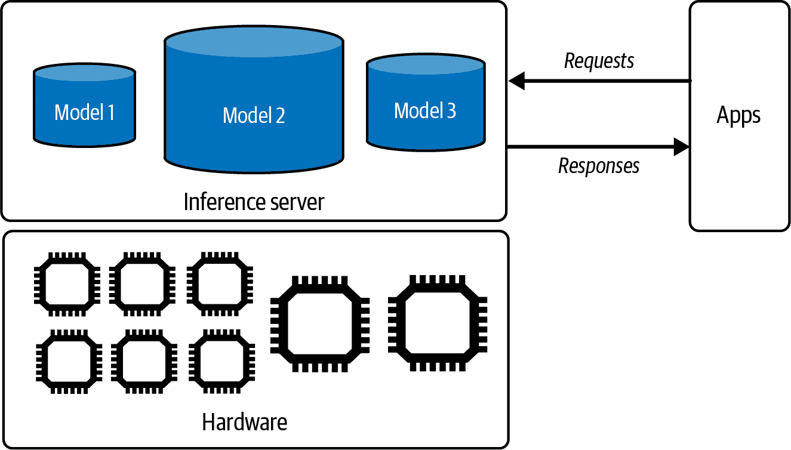
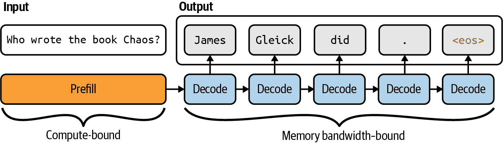
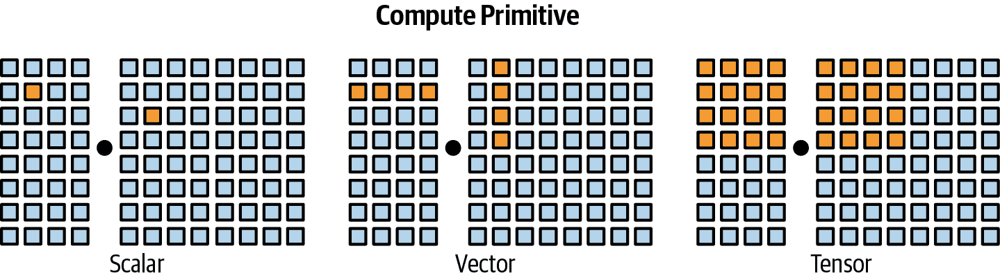
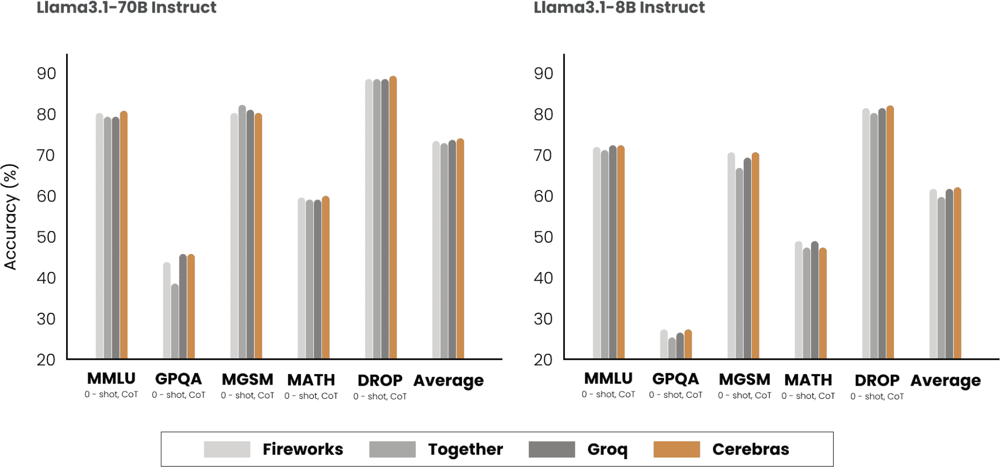
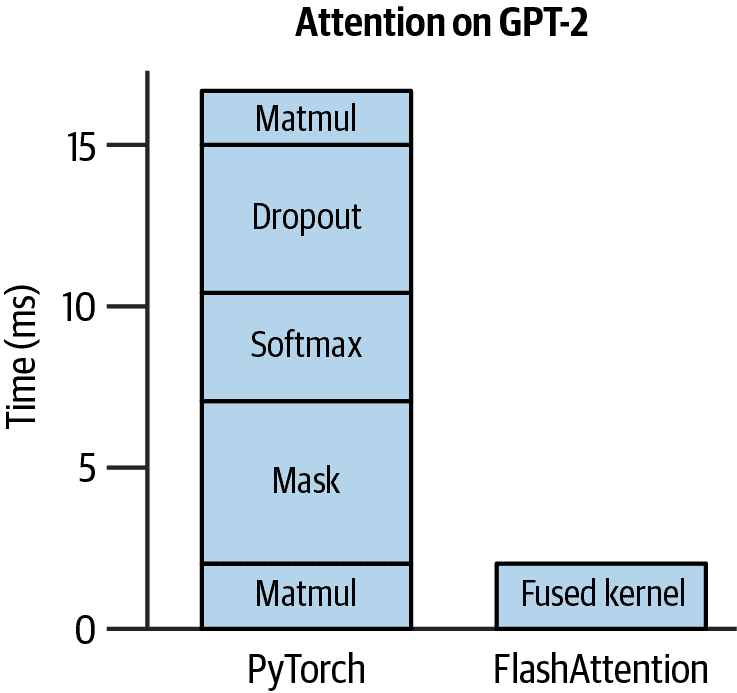
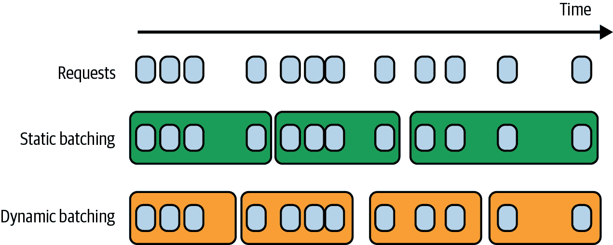
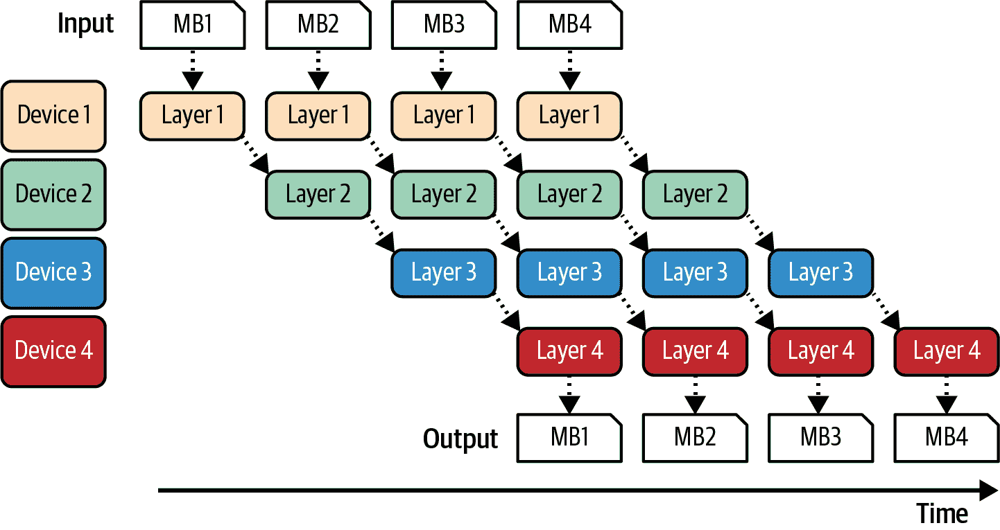

# 第九章。推理优化

新模型层出不穷，但有一点始终相关：使它们更好、更便宜、更快。到目前为止，本书已经讨论了各种使模型更好的技术。这一章专注于使它们更快、更便宜。

无论你的模型有多好，如果它太慢，用户可能会失去耐心，或者更糟，其预测可能变得毫无价值——想象一下一个需要两天时间来计算每个结果的次日股票价格预测模型。如果你的模型成本太高，其投资回报率可能不值得。

推理优化可以在模型、硬件和服务层面进行。在模型层面，你可以减小训练模型的尺寸或开发更高效的架构，例如没有在 Transformer 模型中常用注意力机制中的计算瓶颈的架构。在硬件层面，你可以设计更强大的硬件。

推理服务在给定的硬件上运行模型以适应用户请求。它可以采用针对特定硬件优化的模型技术。它还需要考虑使用和流量模式，以有效地分配资源以减少延迟和成本。

由于这个原因，推理优化是一个跨学科的领域，通常涉及模型研究人员、应用开发者、系统工程师、编译器设计人员、硬件架构师甚至数据中心运营商之间的合作。

本章讨论了 AI 推理的瓶颈和克服这些瓶颈的技术。它将主要关注模型和服务层面的优化，并对 AI 加速器进行概述。

本章还涵盖了性能指标和权衡。有时，加快模型的技术也可以降低其成本。例如，降低模型的精度使其更小、更快。但通常，优化需要权衡。例如，最好的硬件可能会使你的模型运行得更快，但成本更高。

随着开源模型的日益可用，越来越多的团队正在构建自己的推理服务。然而，即使你没有实现这些推理优化技术，了解这些技术也会帮助你评估推理服务和框架。如果你的应用的延迟和成本正在困扰你，请继续阅读。这一章可能有助于你诊断原因和潜在解决方案。

# 理解推理优化

AI 模型的生命周期有两个不同的阶段：训练和推理。训练是指构建模型的过程。推理是指使用模型为给定输入计算输出的过程。1 除非你训练或微调模型，否则你主要需要关注推理。2

本节从推理概述开始，引入一个共享词汇来讨论本章的其余部分。如果你已经熟悉这些概念，请随意跳到感兴趣的章节。

## 推理概述

在生产中，运行模型推理的组件被称为推理服务器。它托管可用的模型，并有权访问必要的硬件。基于来自应用程序（例如，用户提示）的请求，它分配资源以执行适当的模型，并将响应返回给用户。推理服务器是更广泛推理服务的一部分，该服务还负责在请求到达推理服务器之前接收、路由和可能预处理请求。一个简单的推理服务的可视化如图 图 9-1 所示。

。



###### 图 9-1\. 一个简单的推理服务。

模型 API，如 OpenAI 和 Google 提供的，是推理服务。如果你使用这些服务之一，你将不会实现本章讨论的大多数技术。然而，如果你自己托管模型，你将负责构建、优化和维护其推理服务。

### 计算瓶颈

优化是关于识别瓶颈并解决它们。例如，为了优化交通，城市规划者可能会识别拥堵点并采取措施缓解拥堵。同样，推理服务器应该被设计来解决其服务的推理工作负载的计算瓶颈。主要有两个计算瓶颈，*计算密集型* 和 *内存带宽限制型*：

计算密集型

这指的是完成时间由任务所需的计算量决定的任务。例如，密码解密通常由于破解加密算法所需的密集数学计算而成为计算密集型。

内存带宽限制型

这些任务受系统内部数据传输速率的限制，例如数据在内存和处理器之间移动的速度。例如，如果你将数据存储在 CPU 内存中并在 GPU 上训练模型，你必须将数据从 CPU 移动到 GPU，这可能需要很长时间。这可以缩短为带宽限制型。在文献中，内存带宽限制型通常被称为内存限制型。

计算密集型或内存带宽限制的概念在论文“Roofline”中提出（[威廉姆斯等人，2009](https://oreil.ly/M_aGR)）。^(4) 从数学上讲，一个操作可以根据其[*算术强度*](https://oreil.ly/K3j6t)被分类为计算密集型或内存带宽限制型，这是每字节内存访问的算术操作数。NVIDIA Nsight 等分析工具会显示一个屋顶线图，告诉你你的工作负载是计算密集型还是内存带宽限制型，如图 图 9-2 所示。这个图表被称为 *屋顶线* 图，因为它看起来像屋顶。屋顶线图在硬件性能分析中很常见。

不同的优化技术旨在缓解不同的瓶颈。例如，计算密集型工作负载可以通过将工作负载分散到更多芯片或利用计算能力更强的芯片（例如，更高的 FLOP/s 数值）来加速。内存带宽受限的工作负载可以通过利用带宽更高的芯片来加速。


###### 图 9-2\. 屋顶线图可以帮助您可视化操作是计算密集型还是内存带宽受限。此图是按对数刻度绘制的。

不同的模型架构和工作负载导致不同的计算瓶颈。例如，Stable Diffusion 等图像生成器的推理通常是计算密集型的，而自回归语言模型的推理通常是内存带宽受限的。

作为说明，让我们看看语言模型推理。回想一下第二章中提到的，基于 Transformer 的语言模型的推理包括两个步骤：预填充和解码：

预填充

模型并行处理输入标记。^(5)一次可以处理多少个标记受限于硬件在给定时间内可以执行的操作数量。因此，预填充是*计算密集型*的。

解码

模型一次生成一个输出标记。在较高层次上，这一步骤通常涉及将大型矩阵（例如，模型权重）加载到 GPU 中，这受限于硬件将数据加载到内存中的速度。因此，解码是*内存带宽受限*的。

图 9-3 展示了预填充和解码。



###### 图 9-3\. 自回归语言模型在推理时遵循两个步骤：预填充和解码。`<eos>`表示序列结束标记。

由于预填充和解码具有不同的计算特征，它们在生产中通常使用不同的机器解耦。这种技术将在“推理服务优化”中讨论“Inference Service Optimization”。

影响 LLM 推理服务器中预填充和解码计算量以及其瓶颈的因素包括上下文长度、输出长度和请求批处理策略。长上下文通常会导致内存带宽受限的工作负载，但像本章后面讨论的巧妙优化技术可以消除这个瓶颈。

到目前为止，由于 Transformer 架构的普及和现有加速技术的限制，许多 AI 和数据工作负载是内存带宽受限的。然而，未来的软件和硬件进步将能够使 AI 和数据工作负载成为计算密集型。

### 在线批处理推理 API

许多提供商提供两种类型的推理 API，在线和批量：

+   在线 API 优化延迟。请求一到就处理。

+   批量 API 优化成本。如果你的应用程序没有严格的延迟要求，你可以将它们发送到批量 API 以进行更有效的处理。更高的延迟允许更广泛的最优化技术，包括将请求一起批处理和使用更便宜的硬件。例如，截至本文撰写时，Google Gemini 和 OpenAI 都提供批量 API，成本降低 50%，周转时间显著提高，即以小时而不是秒或分钟为单位.^(6)

在线 API 可能仍然将请求批处理在一起，只要它不会显著影响延迟，正如在“批处理”中讨论的那样。“批处理”。唯一的真正区别是，在线 API 专注于更低的延迟，而批量 API 专注于更高的吞吐量。

面向客户的用例，例如聊天机器人和代码生成，通常需要更低的延迟，因此倾向于使用在线 API。对于对延迟要求不那么严格的用例，包括以下内容，它们是批量 API 的理想选择：

+   生成合成数据

+   定期报告，例如总结 Slack 消息、社交媒体上品牌提及的情感分析以及分析客户支持工单

+   为需要处理所有上传文档的新客户办理入职手续

+   迁移到需要重新处理所有数据的新模型

+   为大量客户群生成个性化推荐或新闻通讯

+   通过重新索引组织的数据来更新知识库

API 默认情况下通常会返回完整的响应。然而，对于自回归解码，模型完成响应可能需要很长时间，而用户则缺乏耐心。许多在线 API 提供了 *流式模式*，在生成每个标记时返回。这减少了用户等待第一个标记的时间。这种方法的缺点是，在向用户展示之前，你无法对响应进行评分，这增加了用户看到不良响应的风险。然而，一旦检测到风险，你仍然可以立即回溯更新或删除响应。

###### 警告

基础模型的批量 API 与传统机器学习的批量推理不同。在传统机器学习中：

+   在请求到达后进行在线推理，意味着预测是在请求到达后计算的 *之后*。

+   批量推理意味着预测是在请求到达之前预先计算的 *之前*。

对于具有有限和可预测输入的用例，例如推荐系统，其中可以预先为所有用户生成推荐，预计算是可能的。当请求到达时，例如当用户访问网站时，会检索这些预计算的预测。然而，对于输入开放的底层模型用例，很难预测所有用户提示.^(7)

## 推理性能指标

在着手优化之前，了解要优化的指标非常重要。从用户的角度来看，核心轴是延迟（响应质量是模型本身的属性，而不是推理服务的属性）。然而，应用开发者也必须在确定其应用成本时考虑吞吐量和利用率。

### 延迟、TTFT 和 TPOT

延迟衡量用户发送查询到收到完整响应的时间。对于自回归生成，尤其是在流式模式下，整体延迟可以分解为几个指标：

第一个标记的时间

TTFT 衡量用户发送查询后第一个标记生成的速度。它对应于预填充步骤的持续时间，并取决于输入的长度。用户对不同应用对 TTFT 可能有不同的期望。例如，对于对话聊天机器人，TTFT 应该是瞬间的。8 然而，用户可能愿意等待更长的时间来总结长文档。

每个输出标记的时间

TPOT 衡量第一个标记之后每个输出标记生成的速度。如果每个标记需要 100 ms，那么 1,000 个标记的响应将需要 100 秒。

在流式模式下，用户读取每个生成的标记，TPOT 应该比人类阅读速度快，但不必快得多。一个阅读速度非常快的人可以以 120 ms/标记的速度阅读，因此大约 120 ms，或每秒 6-8 个标记的 TPOT 对于大多数用例来说就足够了。

标记间时间和 i 标记延迟

这个指标的变体包括*标记间时间（TBT）*和*i 标记延迟（ITL）*。9 这两个指标都衡量输出标记之间的时间。

总延迟将等于`TTFT + TPOT` × `(输出标记数量)`。

两个具有相同总延迟的应用可以通过不同的 TTFT 和 TPOT 提供不同的用户体验。用户更愿意在标记之间有更长的等待时间以获得即时的第一个标记，还是更愿意等待稍微长一点的时间以获得第一个标记，然后享受更快的标记生成？需要进行用户研究以确定最佳用户体验。通过将更多的计算实例从解码转移到预填充，并反之亦然，可以在牺牲更高的 TPOT 的情况下降低 TTFT。10

重要的是要注意，用户观察到的 TTFT 和 TPOT 值可能与模型观察到的值不同，尤其是在涉及 CoT（思维链）或代理查询的场景中，模型生成不显示给用户的中间步骤。一些团队使用*发布时间*这个指标来明确表示它衡量的是用户看到第一个标记的时间。

考虑以下场景：在用户发送查询后，模型执行以下步骤：

1.  生成一个包含一系列操作的计划。这个计划不会显示给用户。

1.  执行操作并记录它们的输出。这些输出不会显示给用户。

1.  基于这些输出，生成一个最终响应以向用户展示。

从模型的角度来看，第一个令牌是在步骤 1 中生成的。这是模型开始其令牌生成过程的内部时刻。然而，用户只能看到在步骤 3 中生成的最终输出的第一个令牌。因此，从他们的角度来看，TTFT 要长得多。

因为延迟是一个分布，平均数可能会误导。想象一下，你有 10 个请求，其 TTFT 值分别是 100 毫秒、102 毫秒、100 毫秒、100 毫秒、99 毫秒、104 毫秒、110 毫秒、90 毫秒、3,000 毫秒、95 毫秒。平均 TTFT 值是 390 毫秒，这使得你的推理服务看起来比实际要慢。可能有一个网络错误导致一个请求变慢，或者一个特别长的提示需要更长的时间来预填充。无论如何，你应该进行调查。在大量请求的情况下，导致平均延迟偏斜的异常值几乎是不可避免的。

观察百分位数中的延迟更有帮助，因为它们能告诉你关于你请求中一定百分比的某些信息。最常见的百分位数是第 50 百分位数，简称为 p50（中位数）。如果中位数是 100 毫秒，那么有一半的请求生成第一个令牌的时间超过 100 毫秒，另一半则少于 100 毫秒。百分位数还有助于你发现异常值，这些异常值可能是某些问题的症状。通常，你想要查看的百分位数是 p90、p95 和 p99。将 TTFT 值与输入长度绘制成图表也有帮助。

### 吞吐量和有效吞吐量

吞吐量衡量的是推理服务在所有用户和请求中每秒可以生成的输出令牌数量。

一些团队在吞吐量计算中同时计算输入和输出令牌。然而，由于处理输入令牌（预填充）和生成输出令牌（解码）有不同的计算瓶颈，并且在现代推理服务器中通常解耦，因此输入和输出吞吐量应单独计算。当吞吐量没有使用任何修饰符时，通常指的是输出令牌。

吞吐量通常以每秒令牌数（TPS）来衡量。如果你为多个用户提供服务，每用户每秒令牌数（TPS/user）也用于评估系统如何随着用户数量的增加而扩展。

吞吐量也可以衡量为给定时间内完成的请求数量。许多应用程序使用每秒请求数（RPS）。然而，对于建立在基础模型之上的应用程序，一个请求可能需要几秒钟才能完成，因此许多人使用每分钟完成的请求数（RPM）来代替。跟踪这个指标有助于了解推理服务如何处理并发请求。一些提供商可能会在同时发送过多的并发请求时限制你的服务。

吞吐量直接关联到计算成本。更高的吞吐量通常意味着更低的成本。如果你的系统计算成本为每小时$2，其吞吐量为每秒 100 个令牌，那么每 1M 输出令牌的成本约为$5.556。如果每个请求平均生成 200 个输出令牌，解码 1K 请求的成本将是$1.11。

预填充成本可以类似地计算。如果你的硬件每小时成本为$2，并且它可以每分钟预填充 100 个请求，那么预填充 1K 请求的成本将是$0.33。

每个请求的总成本是预填充和解码成本的总和。在这个例子中，1K 请求的总成本将是$1.11 + $0.33 = $1.44。

被认为是良好吞吐量的标准取决于模型、硬件和工作负载。较小的模型和高端芯片通常会产生更高的吞吐量。具有一致输入和输出长度的负载比具有可变长度的负载更容易优化。

即使对于大小相似的模型、硬件和工作负载，直接的吞吐量比较可能也仅是近似，因为令牌计数取决于什么构成一个令牌，不同的模型有不同的分词器。更好的做法是使用每请求成本等指标来比较推理服务器的效率。

就像大多数其他软件应用一样，AI 应用也有延迟/吞吐量权衡。批处理等技术可以提高吞吐量但降低延迟。根据 LinkedIn AI 团队在部署生成式 AI 产品一年后的反思（[LinkedIn, 2024](https://www.linkedin.com/blog/engineering/generative-ai/musings-on-building-a-generative-ai-product?_l=en_US)），如果你愿意牺牲 TTFT 和 TPOT，吞吐量通常会翻倍或翻三倍。

由于这种权衡，仅仅基于吞吐量和成本来关注推理服务可能会导致糟糕的用户体验。相反，一些团队专注于[*良好吞吐量*](https://en.wikipedia.org/wiki/Goodput)，这是一个从网络中适应 LLM 应用的指标。良好吞吐量衡量每秒满足 SLO 的请求数量，即软件级目标。

假设你的应用有以下目标：TTFT 不超过 200 毫秒，TPOT 不超过 100 毫秒。假设你的推理服务每分钟可以完成 100 个请求。然而，在这 100 个请求中，只有 30 个满足 SLO。那么，该服务的良好吞吐量为每分钟 30 个请求。这种可视化的展示如图图 9-4 所示。


###### 图 9-4\. 如果一个推理服务可以完成 10 RPS，但只有 3 个满足 SLO，那么其良好吞吐量为 3 RPS。

### 利用率、MFU 和 MBU

利用率指标衡量资源被使用的效率。它通常量化了资源被积极使用部分与总可用容量的比例。

一个常见但经常被误解的指标是*GPU 利用率*，NVIDIA 在这方面部分应承担责任。官方 NVIDIA 监控 GPU 使用的工具是[`nvidia-smi`](https://oreil.ly/ludJ2)——SMI 代表系统管理接口。该工具显示的一个指标是 GPU 利用率，它表示 GPU 在积极处理任务的时间百分比。例如，如果你在一个 GPU 集群上运行推理 10 小时，其中 5 小时 GPU 正在积极处理任务，那么你的 GPU 利用率将是 50%。

然而，积极处理任务并不意味着这样做是高效的。为了简单起见，考虑一个每秒能执行 100 个操作的微型 GPU。在`nvidia-smi`对利用率的定义中，即使这个 GPU 每秒只执行一个操作，它也可以报告 100%的利用率。

如果你支付了一台可以执行 100 个操作的机器，但只使用了 1 个操作，你就是在浪费钱。因此，`nvidia-smi`的 GPU 优化指标并不是非常有用。你可能关心的利用率指标之一，是机器在给定时间内能够执行的操作数量。这个指标被称为*MFU（模型 FLOP/s 利用率）*，它将其与 NVIDIA 的 GPU 利用率指标区分开来。

MFU 是观察到的吞吐量（token/s）与系统在峰值 FLOP/s 下运行的理论最大吞吐量之比。如果芯片制造商宣传的峰值 FLOP/s 是 100 tokens/s，但当你用于推理服务时，只能生成 20 tokens/s，那么你的 MFU 是 20%。^(11)

同样，由于内存带宽很昂贵，你也可能想知道你的硬件带宽的利用率有多高。*MBU（模型带宽利用率）*衡量的是可达到的内存带宽使用的百分比。如果芯片的峰值带宽是 1 TB/s，而你的推理只使用了 500 GB/s，那么你的 MBU 是 50%。

计算用于 LLM 推理的内存带宽是直接的：

```py
parameter count × bytes/param × tokens/s
```

MBU 的计算方法如下：

```py
(parameter count × bytes/param × tokens/s) / (theoretical bandwidth)
```

例如，如果你使用一个 7B 参数的 FP16 模型（每个参数两个字节）并且达到 100 个 token/s，使用的带宽是：

```py
7B × 2 × 100 = 700 GB/s
```

这强调了量化（在第七章中讨论）的重要性。每个参数的字节数越少，你的模型消耗的宝贵带宽就越少。

如果在一个理论内存带宽为 2 TB/s 的 A100-80GB GPU 上这样做，MBU 是：

```py
(700 GB/s) / (2 TB/s) = 70%
```

吞吐量（token/s）与 MBU 和 MFU 之间的关系是线性的，因此有些人可能会用吞吐量来指代 MBU 和 MFU。

良好的 MFU 和 MBU 取决于模型、硬件和工作负载。计算密集型工作负载通常具有更高的 MFU 和较低的 MBU，而带宽密集型工作负载通常显示较低的 MFU 和较高的 MBU。

由于训练可以从更有效的优化（例如，更好的批处理）中受益，这得益于更可预测的工作负载，因此训练的 MFU 通常高于推理的 MFU。对于推理，由于预填充是计算限制的，而解码是内存带宽限制的，因此预填充期间的 MFU 通常高于解码期间的 MFU。对于模型训练，截至本文撰写时，一般认为 MFU 超过 50%是好的，但在特定硬件上可能难以实现。表 9-1 展示了几个模型和加速器的 MFU。

表 9-1\. 来自“PaLM：通过路径扩展语言模型”（Chowdhery 等，2022 年）的 MFU 示例。

| 模型 | 参数数量（以十亿计） | 加速器芯片 | 模型 FLOP/s 利用率 |
| --- | --- | --- | --- |
| GPT-3 | 175B | V100 | 21.3% |
| Gopher | 280B | 4096 TPU v3 | 32.5% |
| Megatron-Turing NLG | 530B | 2240 A100 | 30.2% |
| PaLM | 540B | 6144 TPU v4 | 46.2% |

图 9-5 展示了使用 Llama 2-70B 在 FP16 模式下在不同硬件上进行的推理过程的 MBU。下降可能是由于每秒更高的计算负载，随着用户数量的增加，将工作负载从带宽限制转变为计算限制。


###### 图 9-5\. Llama 2-70B 在 FP16 模式下跨三个不同芯片的带宽利用率显示，随着并发用户数量的增加，MBU 有所下降。图片来自“使用 Intel Gaudi 2 AI 加速器进行 LLM 训练和推理”（[Databricks，2024](https://oreil.ly/tOOOD)）。

利用率指标有助于跟踪您系统的效率。在相同硬件上对类似工作负载的更高利用率通常意味着您的服务变得更加高效。然而，*目标不是获得利用率最高的芯片*。您真正关心的是如何更快、更便宜地完成任务。如果成本和延迟都增加，更高的利用率就没有意义了。

## 人工智能加速器

软件运行速度快和便宜取决于它运行的硬件。虽然有一些适用于所有硬件的优化技术，但了解硬件可以允许进行更深入的优化。本节从推理的角度来看硬件，但也适用于训练。

人工智能模型和硬件的发展始终是相互交织的。缺乏足够强大的计算机是 20 世纪 70 年代第一次人工智能冬天的一个促成因素。13

2012 年对深度学习的兴趣复苏也与计算紧密相关。公认的一个原因是 AlexNet（[Krizhevsky 等人，2012](https://oreil.ly/Yv4V7)）的流行，它是第一篇成功使用[GPU](https://en.wikipedia.org/wiki/Graphics_processing_unit)，即图形处理单元，来训练神经网络的论文。14 在 GPU 出现之前，如果你想要训练与 AlexNet 规模相当的模型，你将不得不使用数千个 CPU，就像谷歌在 AlexNet 发布前几个月发布的那个一样。[Google released just a few months before AlexNet](https://oreil.ly/Xpwco)。与数千个 CPU 相比，几块 GPU 对博士研究生和研究人员来说要容易获取得多，从而引发了深度学习研究的繁荣。

### 加速器是什么？

加速器是一种专为加速特定类型的计算工作负载而设计的芯片。人工智能加速器是为人工智能工作负载设计的。在 2020 年代初人工智能繁荣期间，最大的经济推动力无疑是 NVIDIA。

CPU 和 GPU 之间的主要区别在于，CPU 是为通用用途设计的，而 GPU 是为并行处理设计的：

+   CPU 拥有几个强大的核心，通常高端消费级机器可达 64 个核心。虽然许多 CPU 核心可以有效地处理多线程工作负载，但它们在需要高单线程性能的任务上表现出色，例如运行操作系统、管理 I/O（输入/输出）操作或处理复杂、顺序的过程。

+   GPU 拥有数千个较小、性能较弱的内核，这些内核针对可以将任务分解成许多较小、独立的计算的任务进行了优化，例如图形渲染和机器学习。构成大多数机器学习工作负载的操作是矩阵乘法，这是一种高度可并行化的操作。15

虽然追求高效的并行处理增加了计算能力，但它对内存设计和功耗提出了挑战。

NVIDIA GPU 的成功激励了许多旨在加速人工智能工作负载的加速器，包括[高级微设备公司（AMD）的新一代 GPU](https://en.wikipedia.org/wiki/List_of_AMD_graphics_processing_units)、谷歌的 TPU（[Tensor Processing Unit](https://en.wikipedia.org/wiki/Tensor_Processing_Unit)）、[英特尔的海巴纳·高迪](https://oreil.ly/oDQOk)、[Graphcore 的智能处理单元](https://oreil.ly/6ySTY)（IPU）、[Groq 的语言处理单元](https://oreil.ly/R7gXn)（LPU）、[Cerebras 的晶圆级](https://oreil.ly/ACIty) [量子处理单元](https://en.wikipedia.org/wiki/List_of_quantum_processors)（QPU）以及许多其他正在推出的产品。

虽然许多芯片可以处理训练和推理，但一个明显的趋势是针对推理的专用芯片。Desislavov 等人（2023）的一项调查表明，在常用系统中，推理的成本可能超过训练成本，并且推理占到了部署的 AI 系统机器学习成本的 90%以上。

如第七章所述，由于反向传播，训练需要更多的内存，通常在低精度下执行也更为困难。此外，训练通常强调吞吐量，而推理的目标是尽量减少延迟。

因此，针对推理设计的芯片通常优化为低精度和更快的内存访问，而不是大容量内存。这类芯片的例子包括苹果的[Neural Engine](https://en.wikipedia.org/wiki/Neural_Engine)、[AWS Inferentia](https://oreil.ly/42LSB)和[MTIA](https://oreil.ly/XH2bh)（Meta Training and Inference Accelerator）。针对边缘计算的芯片，如[Google 的 Edge TPU](https://oreil.ly/m8daG)和[NVIDIA Jetson Xavier](https://oreil.ly/PRZSQ)，通常也针对推理进行优化。

还有针对不同模型架构的专用芯片，例如针对 transformer 的专用芯片。16。许多芯片是为数据中心设计的，而越来越多的芯片是为消费设备（如手机和笔记本电脑）设计的。

不同的硬件架构有不同的内存布局和随时间演变的专用计算单元。这些单元针对特定的数据类型进行了优化，例如标量、向量或 tensor，如图图 9-6 所示。



###### 图 9-6\. 不同的计算原语。图像灵感来自[Chen 等人（2018）](https://arxiv.org/abs/1802.04799)。

一块芯片可能包含多种不同类型的计算单元，这些单元针对不同的数据类型进行了优化。例如，GPU 传统上支持向量运算，但许多现代 GPU 现在包括针对矩阵和 tensor 计算的 tensor 核心。另一方面，TPU 的设计以 tensor 运算为其主要的计算原语。为了在硬件架构上高效地运行模型，需要考虑其内存布局和计算原语。

芯片的规格包含许多在评估每个特定用例时可能有用的细节。然而，跨越不同用例的主要特性是计算能力、内存大小和带宽以及功耗。我将使用 GPU 作为例子来说明这些特性。

### 计算能力

计算能力通常通过芯片在给定时间内可以执行的操作数量来衡量。最常用的指标是 *FLOP/s*，通常写作 FLOPS，它衡量每秒的峰值浮点运算次数。然而，实际上，应用程序达到这个峰值 FLOP/s 的可能性非常低。实际 FLOP/s 与理论 FLOP/s 之间的比率是一个 *利用率* 指标。

芯片每秒可以执行的操作数量取决于数值精度——精度越高，芯片可以执行的操作就越少。想想看，加两个 32 位数字通常需要是加两个 16 位数字计算量的两倍。芯片在给定时间内可以执行的 32 位操作数量并不正好是 16 位操作数量的一半，因为不同芯片的优化不同。关于数值精度的概述，请回顾“数值表示”部分“数值表示”。

表 9-2 显示了[NVIDIA H100 SXM 芯片](https://oreil.ly/bNAOG)不同精度格式的 FLOP/s 规格。

表 9-2\. NVIDIA H100 SXM 芯片的 FLOP/s 规格。

| 数值精度 | 带稀疏性的 teraFLOP/s（万亿 FLOP/s） |
| --- | --- |
| TF32 Tensor Core^(a) | 989 |
| BFLOAT16 Tensor Core | 1,979 |
| FP16 Tensor Core | 1,979 |
| FP8 Tensor Core | 3,958 |
| ^(a) 回想一下第七章，TF32 是一种 19 位格式，而不是 32 位格式。 |

### 内存大小和带宽

由于 GPU 有许多并行工作的核心，数据通常需要从内存移动到这些核心，因此数据传输速度很重要。当处理涉及大型权重矩阵和训练数据的 AI 模型时，数据传输至关重要。这些大量数据需要快速移动，以保持核心的高效占用。因此，GPU 内存需要比 CPU 内存具有更高的带宽和更低的延迟，因此 GPU 内存需要更先进的内存技术。这是使 GPU 内存比 CPU 内存更昂贵的一个因素。

更具体地说，CPU 通常使用[DDR SDRAM](https://en.wikipedia.org/wiki/DDR_SDRAM)（双数据速率同步动态随机存取存储器），它具有二维结构。特别是高端 GPU，通常使用[HBM](https://en.wikipedia.org/wiki/High_Bandwidth_Memory)（高带宽内存），它具有三维堆叠结构.^(17)

加速器的内存通过其 *大小和带宽* 来衡量。这些数字需要在加速器所属的系统中进行评估。一个加速器，如 GPU，通常与三个级别的内存交互，如图 9-7 所示：

CPU 内存（DRAM）

加速器通常与 CPU 一起部署，从而可以访问 CPU 内存（也称为系统内存、主机内存，或简称 CPU DRAM）。

CPU 内存通常在这些内存类型中具有最低的带宽，数据传输速度从 25 GB/s 到 50 GB/s 不等。CPU 内存的大小也各不相同。平均笔记本电脑可能拥有大约 16–64 GB，而高端工作站可能拥有 1 TB 或更多。

GPU 高带宽内存（HBM）

这是专门为 GPU 分配的内存，它位于 GPU 附近，以便比 CPU 内存更快地访问。

HBM 提供了显著更高的带宽，数据传输速度通常在 256 GB/s 到超过 1.5 TB/s 之间。这种速度对于高效处理大量数据传输和高吞吐量任务至关重要。消费级 GPU 大约有 24–80 GB 的 HBM。

GPU 片上 SRAM

直接集成到芯片中的这种内存用于存储频繁访问的数据和指令，以便几乎瞬间访问。它包括由 SRAM 制成的 L1 和 L2 缓存，在某些架构中还包括 L3 缓存。这些缓存是更广泛的片上内存的一部分，还包括其他组件，如寄存器文件和共享内存。

RAM 具有极高的数据传输速度，通常超过 10 TB/s。GPU SRAM 的大小较小，通常为 40 MB 或更少。


###### 图 9-7。AI 加速器的内存层次结构。数字仅供参考。实际数字因芯片而异。

许多 GPU 优化都是关于如何最大限度地利用这个内存层次结构。然而，截至本文撰写时，流行的框架如 PyTorch 和 TensorFlow 还无法实现对内存访问的精细控制。这导致许多 AI 研究人员和工程师对 GPU 编程语言产生了兴趣，例如[CUDA](https://en.wikipedia.org/wiki/CUDA)（最初是 Compute Unified Device Architecture）、[OpenAI 的 Triton](https://github.com/triton-lang/triton)和[ROCm](https://github.com/ROCm/ROCm)（Radeon Open Compute）。后者是 AMD 对 NVIDIA 专有 CUDA 的开源替代品。

### 功耗

芯片依赖于晶体管来执行计算。每一次计算都是由晶体管的开和关来完成的，这需要能量。一个 GPU 可以拥有数十亿个晶体管——NVIDIA A100 有[540 亿个](https://oreil.ly/5vRsP)晶体管，而 NVIDIA H100 则有[800 亿个](https://en.wikipedia.org/wiki/Hopper_(microarchitecture))。当加速器被高效使用时，数十亿个晶体管会快速切换状态，消耗大量的能量并产生相当数量的热量。这些热量需要冷却系统，而冷却系统本身也会消耗电力，从而增加了数据中心的总能耗。

芯片能耗可能会对[环境](https://oreil.ly/RqY-3)产生惊人的影响，增加公司投资绿色数据中心技术的压力。NVIDIA H100 以峰值运行一年大约消耗约 7,000 千瓦时。相比之下，美国普通家庭的年度电力消耗为 10,000 千瓦时。这就是为什么电力是计算扩展的瓶颈。¹⁸

加速器通常会在*最大功耗*或代理指标*热设计功耗（TDP）*下指定其功耗：

+   最大功耗表示芯片在满载情况下可能消耗的峰值功率。

+   *TDP*代表芯片在典型工作负载下运行时，冷却系统需要散发的最大热量。虽然它不是功率消耗的精确度量，但它是对预期功耗的指示。对于 CPU 和 GPU，最大功耗可以大致为 TDP 的 1.1 到 1.5 倍，但具体关系取决于特定的架构和工作负载。

如果你选择云服务提供商，你就不必担心冷却或电力问题。然而，这些数字仍然可以用来了解加速器对环境以及总体电力需求的影响。

# 推理优化

推理优化可以在模型、硬件或服务级别进行。为了说明它们之间的差异，可以考虑射箭。模型级别的优化就像制作更好的箭。硬件级别的优化就像训练一个更强更好的射手。服务级别的优化就像完善整个射击过程，包括弓和瞄准条件。

理想情况下，为了速度和成本优化模型，不应改变模型的质量。然而，许多技术可能会引起模型退化。图 9-8 显示了同一 Llama 模型在不同基准测试中的性能，由不同的推理服务提供商提供。



###### 图 9-8\. 推理服务提供商可能会使用可以改变模型行为的优化技术，导致不同提供商的模型质量略有差异。该实验由[Cerebras (2024)](https://oreil.ly/5hFSF)进行。

由于硬件设计超出了本书的范围，我将讨论模型和服务级别的技术。虽然技术是分别讨论的，但请记住，在生产中，优化通常涉及多个级别的技术。

## 模型优化

模型级优化旨在使模型更高效，通常通过修改模型本身来实现，这可能会改变其行为。截至本文撰写时，许多基础模型遵循 Transformer 架构，并包括一个自回归语言模型组件。这些模型有三个特性使得推理资源密集：模型大小、自回归解码和注意力机制。让我们讨论解决这些挑战的方法。

### 模型压缩

模型压缩涉及减少模型大小的技术。使模型更小也可以使其更快。本书已经讨论了两种模型压缩技术：量化蒸馏。量化，通过降低模型的精度来减少其内存占用并提高其吞吐量，在第七章中讨论。模型蒸馏，训练一个小的模型来模仿大型模型的行为，在第八章中讨论。

模型蒸馏表明，使用更少的参数可以捕捉到大型模型的行为。在大型模型中，是否存在一个参数子集能够捕捉整个模型的行为？这就是剪枝背后的核心概念。

在神经网络语境中，剪枝有两个含义。一个是指移除神经网络中的整个节点，这意味着改变其架构并减少其参数数量。另一个是指找到对预测最无用的参数并将它们设置为 0。在这种情况下，剪枝不会减少参数的总数，只会减少非零参数的数量。这使得模型更加稀疏，从而减少了模型的存储空间并加快了计算速度。

剪枝后的模型可以直接使用，或者进一步微调以调整剩余的参数并恢复剪枝过程中造成的任何性能下降。剪枝有助于发现有潜力的模型架构([刘等人，2018](https://arxiv.org/abs/1810.05270))。这些剪枝架构比预剪枝架构更小，也可以从头开始训练([朱等人，2017](https://arxiv.org/abs/1710.01878))。

在文献中，已经有许多令人鼓舞的剪枝结果。例如，[Frankle 和 Carbin (2019)](https://oreil.ly/qwlHE)表明，剪枝技术可以将某些训练网络的非零参数数量减少超过 90%，减少内存占用并提高速度，而不会影响准确性。然而，在实践中，截至本文撰写时，剪枝并不常见。它更难实现，因为它需要理解原始模型的架构，并且它带来的性能提升通常远低于其他方法。剪枝还会导致模型稀疏化，并且并非所有硬件架构都旨在利用由此产生的稀疏性。

*权重量化是迄今为止最受欢迎的方法，因为它易于使用，对于许多模型来说开箱即用，并且非常有效。*将模型的精度从 32 位降低到 16 位可以将内存占用减半。然而，我们接近量化的极限——我们无法低于每个值 1 位。蒸馏也很常见，因为它可以产生一个更小的模型，其行为与一个更大的模型相比，对于你的需求来说是可以比较的。

### 克服自回归解码瓶颈

如同在第二章中讨论的那样，自回归语言模型是逐个生成标记的。如果生成一个标记需要 100 毫秒，那么生成 100 个标记的响应将需要 10 秒。19 这个过程不仅慢，而且成本高昂。在模型 API 提供商之间，输出标记的成本大约是输入标记的两到四倍。在一个实验中，Anyscale 发现单个输出标记对延迟的影响可以与 100 个输入标记相当([Kadous 等人，2023](https://oreil.ly/QYdG8))。通过提高自回归生成过程的小幅百分比可以显著改善用户体验。

由于空间正在迅速发展，新的技术正在被开发以克服这个看似不可能的瓶颈。也许有一天，会出现没有这种瓶颈的架构。这里介绍的技术是为了说明解决方案可能的样子，但这些技术仍在不断发展。

#### 投机解码

投机解码（也称为投机采样）使用一个更快但功能较弱的模型来生成一系列标记，然后由目标模型进行验证。目标模型是你想要使用的模型。较快的模型被称为草稿或提案模型，因为它提出了草稿输出。

假设输入标记是*x*[1]，*x*[2]，…，*x*[*t*]：

1.  草稿模型生成*K*个标记的序列：*x*[*t* + 1]，*x*[*t* + 2]，…，*x*[*t* + *K*]。

1.  目标模型并行验证这些*K*个生成的标记。

1.  目标模型*接受*从左到右的最长草稿标记子序列，这是目标模型同意使用的。

1.  假设目标模型接受*j*个草稿标记，*x*[*t* + 1]，*x*[*t* + 2]，…，*x*[*t* + *j*]。然后目标模型再生成一个额外的标记，*x*[*t* + *j* + 1]。

过程回到步骤 1，草稿模型在*x*[1]，*x*[2]，…，*x*[*t*]，*x*[*t* + 1]，*x*[*t* + 2]，…，*x*[*t* + *j*]的条件下生成*K*个标记。这个过程在图 9-9 中进行了可视化。

如果没有草稿标记被接受，这个循环只产生目标模型生成的一个标记。如果所有草稿标记都被接受，这个循环将产生*K* + 1 个标记，其中*K*个由草稿模型生成，一个由目标模型生成。


###### 图 9-9。草稿模型生成 K 个标记的序列，主模型接受它同意的最长子序列。该图像来自“Blockwise Parallel Decoding for Deep Autoregressive Models”（[Stern et al., 2018](https://arxiv.org/abs/1811.03115)）。

如果所有草稿序列都被拒绝，目标模型必须生成整个响应并进行验证，这可能导致延迟增加。然而，可以通过以下三个见解来避免这种情况：

1.  目标模型验证一个标记序列所需的时间少于生成它所需的时间，因为验证是可并行的，而生成是顺序的。推测解码有效地将解码的计算特征转变为预填充的计算特征。

1.  在输出标记序列中，有些标记比其他标记更容易预测。可以找到一个能力较弱的草稿模型，能够正确预测这些容易预测的标记，从而提高草稿标记的接受率。

1.  解码受内存带宽限制，这意味着在编码过程中，通常有可以免费用于验证的空闲 FLOPs。^(20)

接受率取决于领域。对于遵循特定结构（如代码）的文本，接受率通常更高。较大的*K*值意味着目标模型需要更少的验证调用，但草稿标记的接受率较低。草稿模型可以是任何架构，尽管理想情况下它应该与目标模型共享相同的词汇表和分词器。您可以训练一个定制的草稿模型或使用现有的较弱模型。

例如，为了加快 Chinchilla-70B 的解码过程，DeepMind 训练了一个相同架构的 4B 参数草稿模型（[Chen et al., 2023](https://arxiv.org/abs/2302.01318)）。草稿模型可以比目标模型快八倍生成标记（1.8 ms/token 与 14.1 ms/token 相比）。这在不影响响应质量的情况下将整体响应延迟减少了超过一半。T5-XXL 也实现了类似的加速效果（[Laviathan et al., 2022](https://arxiv.org/abs/2211.17192)）。

这种方法之所以受到青睐，是因为它相对容易实现，并且不会改变模型的质量。例如，在 PyTorch 中，可以在[50 行代码](https://oreil.ly/IaPOB)内实现。它已被纳入流行的推理框架，如[vLLM](https://oreil.ly/uzg1s)、[TensorRT-LLM](https://github.com/NVIDIA/TensorRT-LLM)和[llama.cpp](https://github.com/ggerganov/llama.cpp/pull/2926)。

#### 基于参考的推理

通常，一个响应需要引用输入中的标记。例如，如果你向你的模型提出有关附件文档的问题，模型可能会从文档中逐字重复一段文本。另一个例子是，如果你要求模型修复代码中的错误，模型可能会对原始代码进行少量修改后重用大部分代码。而不是让模型生成这些重复的标记，我们为什么不从输入中复制这些标记来加速生成呢？这就是带有参考的推理背后的核心思想。

带有参考的推理类似于推测性解码，但它不是使用模型生成草稿标记，而是从输入中选择草稿标记。关键挑战是开发一个算法，在每个解码步骤中识别与上下文最相关的文本跨度。最简单的方法是找到一个与当前标记匹配的文本跨度。

与推测性解码不同，带有参考的推理不需要额外的模型。然而，它仅在存在显著重叠的上下文和输出场景中才有用，例如在检索系统、编码或多轮对话中。在“带有参考的推理：大型语言模型的无损加速”（[杨等人，2023](https://arxiv.org/abs/2304.04487)）中，这项技术帮助在这些用例中实现了两倍的生产速度提升。

带有参考的推理的工作示例显示在图 9-10 中。


###### 图 9-10. 两个带有参考的推理示例。成功从输入复制的文本跨度用红色和绿色表示。图片来自杨等人（2023 年）。图片许可协议为 CC BY 4.0。

#### 并行解码

与使用草稿标记使自回归生成更快不同，一些技术旨在打破序列依赖性。给定一个标记序列 *x*[1]，*x*[2]，…，*x*[*t*]，这些技术试图同时生成 *x*[*t* + 1]，*x*[*t* + 2]，…，*x*[*t* + *k*]。这意味着模型在知道它前面的标记是 *x*[*t* + 1] 之前就生成 *x*[*t* + 2]。

这之所以可行，是因为现有序列的知识通常足以预测接下来的几个标记。例如，给定“the cat sits”，即使不知道下一个标记是“on”、“under”还是“behind”，你仍然可以预测它后面的词是“the”。

并行标记可以由相同的解码器生成，如 Lookahead 解码([Fu et al., 2024](https://arxiv.org/abs/2402.02057))，或者由不同的解码头生成，如 Medusa([Cai et al., 2024](https://arxiv.org/abs/2401.10774))。在 Medusa 中，原始模型扩展了多个解码头，每个头都是一个小的神经网络层，然后训练以预测特定位置的未来标记。如果原始模型被训练来预测下一个标记*x*[*t* + 1]，则*k*^(*th*)个头将预测标记*x*[*t* + *k* + 1]。这些头与原始模型一起训练，但原始模型被冻结。NVIDIA 声称 Medusa 帮助在他们的 HGX H200 GPU 上提高了 Llama 3.1 标记生成的速度，最高可达 1.9 倍([Eassa et al., 2024](https://oreil.ly/FWYf5))。

然而，因为这些标记不是按顺序生成的，所以需要验证以确保它们可以组合在一起。并行解码的一个关键部分是验证和整合。Lookahead 解码使用[Jacobi 方法](https://en.wikipedia.org/wiki/Jacobi_method)^(21)来验证生成的标记，其工作原理如下：

1.  并行生成 K 个未来标记。

1.  这些*K*个标记被验证以确保它们与上下文的一致性和连贯性。

1.  如果一个或多个标记验证失败，模型将不会聚合所有*K*个未来标记，而是仅重新生成或调整这些失败的标记。

模型不断优化生成的标记，直到它们全部通过验证并整合到最终输出中。这一系列并行解码算法也被称为 Jacobi 解码。

另一方面，Medusa 使用基于树的注意力机制来验证和整合标记。每个 Medusa 头为每个位置生成几个选项。然后，这些选项被组织成树状结构以选择最有希望的组合。该过程在图 9-11 中进行了可视化。


###### 图 9-11\. 在 Medusa（Cai et al., 2024）中，每个头为标记位置预测几个选项。从这些选项中选择最有希望的序列。图像改编自论文，该论文受 CC BY 4.0 许可。

虽然能够绕过序列依赖性的观点很有吸引力，但并行解码并不直观，一些技术，如 Medusa，可能难以实现。

### 注意力机制优化

从第二章回顾，生成下一个标记需要所有先前标记的关键和值向量。这意味着以下适用：

+   生成标记*x*[*t*]需要标记*x*[1]、*x*[2]、…、*x*[*t* – 1]的关键和值向量。

+   生成标记*x*[*t* + 1]需要标记*x*[1]、*x*[2]、…、*x*[*t* – 1]、*x*[*t*]的关键和值向量。

在生成标记 *x*[*t* + 1] 时，而不是再次计算标记 *x*[1]、*x*[2]、…、*x*[*t* – 1] 的键和值向量，你可以从上一步重新使用这些向量。这意味着你只需要计算最近标记 *x*[*t*] 的键和值向量。用于存储可重复使用键和值向量的缓存称为 KV 缓存。然后，新计算出的键和值向量被添加到 KV 缓存中，这在 图 9-12 中进行了可视化。


###### 图 9-12\. 为了避免在每次解码步骤中重新计算键和值向量，使用 KV 缓存来存储这些向量以供重复使用。

###### 注意

KV 缓存仅在推理期间使用，不在训练期间使用。在训练期间，由于序列中的所有标记都是预先已知的，因此可以一次性计算下一个标记的生成，而不是像推理期间那样按顺序计算。因此，不需要 KV 缓存。

由于生成一个标记需要计算所有先前标记的注意力分数，因此注意力计算的数量会随着序列长度的增加而呈指数增长.^(22) 相反，KV 缓存的大小会随着序列长度的增加而线性增长。

KV 缓存的大小也会随着批量大小的增加而增长。一篇谷歌论文计算得出，对于一个具有多头注意力的 500B+ 模型，批大小为 512，上下文长度为 2048，KV 缓存总量为 3TB [(Pope 等人，2022)](https://arxiv.org/abs/2211.05102)。这是该模型权重大小的三倍。

KV 缓存的大小最终受可用硬件存储的限制，这为运行具有长上下文的应用程序创造了瓶颈。大缓存大小也需要时间加载到内存中，这对于具有严格延迟要求的应用程序可能是一个问题。

注意力机制的计算和内存需求是难以实现更长上下文的原因之一。

已经开发了许多技术来使注意力机制更加高效。总的来说，它们可以分为三个类别：重新设计注意力机制、优化 KV 缓存和为注意力计算编写内核。

#### 重新设计注意力机制

这些技术涉及改变注意力机制的工作方式。尽管这些技术有助于优化推理，但由于它们直接改变了模型的架构，因此只能在训练或微调期间应用。

例如，在生成新标记时，不是关注所有先前标记，而是 *局部窗口注意力* 只关注固定大小的附近标记 ([Beltagy 等人，2020](https://arxiv.org/abs/2004.05150v2))。这将有效序列长度减少到固定大小的窗口，从而减少了 KV 缓存和注意力计算。如果平均序列长度为 10,000 个标记，关注 1,000 个标记的窗口大小可以将 KV 缓存大小减少 10 倍。

局部窗口注意力可以与全局注意力交错，局部注意力捕捉附近的上下文；全局注意力捕捉文档中的任务特定信息。

*跨层注意力* ([Brandon 等人，2024](https://arxiv.org/abs/2405.12981?ref=research.character.ai)) 和 *多查询注意力* ([Shazeer，2019](https://arxiv.org/abs/1911.02150?ref=research.character.ai)) 通过减少键值对的数量来降低 KV 缓存的内存占用。跨层注意力在相邻层之间共享键和值向量。三层共享相同的键值向量意味着将 KV 缓存减少了三次。另一方面，多查询注意力在查询头之间共享键值向量。

*分组查询注意力* ([Ainslie 等人，2023](https://arxiv.org/abs/2305.13245)) 是多查询注意力的一种推广。它不是为所有查询头使用一组键值对，而是将查询头放入更小的组中，并且只在同一组内的查询头之间共享键值对。这允许在查询头的数量和键值对的数量之间实现更灵活的平衡。

AI 聊天机器人应用 Character.AI 表示，他们的平均对话历史有 [180 条消息](https://oreil.ly/nLt6A)（2024）。鉴于通常较长的序列，推理吞吐量的主要瓶颈是 KV 缓存大小。三种注意力机制设计——多查询注意力、交错局部和全局注意力以及跨层注意力——帮助他们 *将 KV 缓存减少了超过 20 倍*。更重要的是，这种显著的 KV 缓存减少意味着对于服务大型批量数据，内存不再是他们的瓶颈。

#### 优化 KV 缓存大小

管理 KV 缓存的方式对于缓解推理过程中的内存瓶颈和实现更大的批量大小至关重要，特别是对于具有长上下文的应用。许多技术正在积极开发中，以减少和管理 KV 缓存。

最快增长的推理框架之一 [vLLM](https://github.com/vllm-project/vllm) 因引入 PagedAttention 而受到欢迎，它通过将 KV 缓存划分为非连续块来优化内存管理，减少碎片，并实现灵活的内存共享，从而提高 LLM 服务效率 ([Kwon 等人，2023](https://arxiv.org/abs/2309.06180))。

其他技术包括 KV 缓存量化 ([Hooper 等人，2024](https://arxiv.org/abs/2401.18079)；[Kang 等人，2024](https://arxiv.org/abs/2403.05527))、自适应 KV 缓存压缩 ([Ge 等人，2023](https://arxiv.org/abs/2310.01801)) 和选择性 KV 缓存 ([Liu 等人，2024](https://oreil.ly/ixtBl))。

#### 编写注意力计算内核

而不是改变机制设计或优化存储，这种方法研究了注意力分数是如何计算的，并找到了使这种计算更有效的方法。当考虑到执行计算的硬件时，这种方法是最有效的。针对特定芯片优化的代码称为内核。内核编写将在下一节中进一步讨论。

最著名的针对注意力计算优化的内核之一是[FlashAttention](https://github.com/Dao-AILab/flash-attention)（Dao 等人，2022 年）。这个内核将许多在基于 transformer 的模型中常用的操作融合在一起，以使它们运行得更快，如图图 9-13 所示。



###### 图 9-13。FlashAttention 是一个将多个常见操作融合在一起的内核。改编自 BSD 3-Clause 许可的原始图像。

### 内核和编译器

内核是针对特定硬件加速器（如 GPU 或 TPU）优化的专用代码片段。它们通常被编写来执行需要重复执行的计算密集型例程，通常在并行执行，以最大化这些加速器的性能。

常见的 AI 操作，包括矩阵乘法、注意力计算和卷积操作，都有专门的内核来使它们在不同硬件上的计算更高效。23]

编写内核需要深入了解底层硬件架构。这包括对内存层次结构如何构建（例如缓存、全局内存、共享内存和寄存器）以及数据如何在这些不同级别之间访问和移动的知识。

此外，内核通常用 CUDA（用于 NVIDIA GPU）、Triton（OpenAI 开发用于编写自定义内核的语言）和 ROCm（用于 AMD GPU）等低级编程语言编写。这些语言允许对线程管理和内存访问进行细粒度控制，但与大多数 AI 工程师熟悉的语言（如 Python）相比，它们也更难学习。

由于这个入门门槛，编写内核曾经是一种只有少数人实践的秘密艺术。芯片制造商如 NVIDIA 和 AMD 雇佣优化工程师来编写内核，以使他们的硬件对 AI 工作负载更高效，而像 PyTorch 和 TensorFlow 这样的 AI 框架则雇佣内核工程师来优化它们在不同加速器上的框架。

然而，随着推理优化需求的增加和加速器的普遍存在，越来越多的 AI 工程师开始对编写内核感兴趣。有许多关于内核编写的优秀在线教程。在这里，我将介绍四种常用于加速计算的技术：

向量化

给定一个循环或嵌套循环，而不是一次处理一个数据元素，同时执行内存中连续的多个数据元素。通过最小化数据 I/O 操作来减少延迟。

并行化

将输入数组（或 n 维数组）划分为可以在不同核心或线程上同时处理的独立块，从而加快计算速度。

循环展平

优化循环中的数据访问顺序以适应硬件的内存布局和缓存。这种优化是硬件相关的。一个高效的 CPU 展平模式可能在 GPU 上效果不佳。

算子融合

将多个算子组合成单个遍历，以避免冗余的内存访问。例如，如果两个循环操作相同的数组，它们可以融合成一个，减少数据读取和写入的次数。

虽然向量化、并行化和循环展平可以在不同的模型中广泛应用，但算子融合需要更深入地理解模型的具体算子和架构。因此，算子融合需要优化工程师更多的关注。

内核是针对硬件架构进行优化的。这意味着每当引入新的硬件架构时，就需要开发新的内核。例如，[FlashAttention](https://github.com/Dao-AILab/flash-attention)（Dao 等人，2022 年）最初主要是为 NVIDIA A100 GPU 开发的。后来，为了 H100 GPU，引入了 FlashAttention-3（[Shah 等人，2024](https://arxiv.org/abs/2407.08608)）。

模型脚本指定了一系列需要执行的操作以运行该模型。要在如 GPU 这样的硬件上运行此代码，必须将其转换为与该硬件兼容的语言。这个过程称为*降低*。可以将代码降低到特定硬件以运行的工具称为编译器。编译器连接机器学习模型和它们运行的硬件。在降低过程中，尽可能将这些操作转换为针对目标硬件优化的专用内核，以加快运行速度。

编译器可以是独立的工具，如[Apache TVM](https://github.com/apache/tvm)和[MLIR](https://mlir.llvm.org)（多级中间表示）或集成到机器学习和推理框架中，如 PyTorch 中的[`torch.compile`](https://oreil.ly/6bjVM)（一个功能），[XLA](https://en.wikipedia.org/wiki/Accelerated_Linear_Algebra)（加速线性代数，最初由 TensorFlow 开发，开源版本称为[OpenXLA](https://github.com/openxla/xla)），以及内置在[TensorRT](https://github.com/NVIDIA/TensorRT)中的编译器，它针对 NVIDIA GPU 进行了优化。AI 公司可能有他们自己的编译器，其专有内核旨在加速他们自己的工作负载。24

## 推理服务优化

大多数服务级优化技术都集中在资源管理上。在给定固定数量的资源（计算和内存）和动态工作负载（用户的推理请求，可能涉及不同的模型）的情况下，目标是高效地分配资源给这些工作负载，以优化延迟和成本。与许多模型级技术不同，服务级技术不会修改模型，也不应该改变输出质量。

### 批处理

降低成本的最简单方法之一是批处理。在生产中，你的推理服务可能会同时接收到多个请求。而不是单独处理每个请求，将同时到达的请求一起批处理可以显著降低服务的吞吐量。如果单独处理每个请求就像每个人都开着自己的车，那么批处理就像把他们一起放在公交车上。公交车可以运送更多的人，但也会使每个人的旅程更长。然而，如果你做得明智，对延迟的影响可以最小化。

批处理的主要技术有三种：静态批处理、动态批处理和连续批处理。

最简单的批处理技术是*静态批处理*。服务将固定数量的输入组合在一起形成一个批次。这就像一辆公交车，在所有座位都填满之前不会出发。静态批处理的缺点是所有请求都必须等到批次填满才能执行。因此，批次中的第一个请求会延迟，直到批次的最后一个请求到达，无论最后一个请求到达得多晚。

另一方面，*动态批处理*为每个批次设定一个最大时间窗口。如果批次大小为四个，窗口为 100 毫秒，服务器将在有四个请求或 100 毫秒过去时处理批次，以先到者为准。这就像一辆按照固定时间表出发或满载时出发的公交车。这种方法可以控制延迟，因此早期的请求不会被后来的请求所阻碍。缺点是处理时批次可能不会总是满载，可能导致计算资源的浪费。静态批处理和动态批处理在图 9-15 中进行了可视化。



###### 图 9-15。动态批处理可以保持延迟在可控范围内，但可能计算效率较低。

在简单的批处理实现中，所有批处理请求都必须完成，才能返回它们的响应。对于 LLMs，一些请求可能比其他请求耗时更长。如果一个批次的请求只生成 10 个响应令牌，而另一个请求生成 1,000 个响应令牌，那么短响应必须等待长响应完成才能返回给用户。这导致短请求出现不必要的延迟。

*连续批处理*允许批处理中的响应在完成时立即返回给用户。它通过选择性地批处理不会导致一个响应的生成阻碍另一个响应的操作来实现，如论文 Orca ([Yu 等人，2022](https://oreil.ly/SJ7Mb)) 中所述。在批处理中的请求完成并返回其响应后，服务可以在其位置添加另一个请求，使批处理连续。这就像一辆公交车，在放下一位乘客后，可以立即接载另一位乘客以最大化其载客率。连续批处理，也称为[*飞行批处理*](https://oreil.ly/DlIPs)，在图 9-16 中进行了可视化。


自动生成的描述](assets/aien_0916.png)

###### 图 9-16。在连续批处理中，完成的响应可以立即返回给用户，并可以处理新的请求。

### 解耦预填充和解码

LLM 推理包括两个步骤：预填充和解码。因为预填充是计算密集型的，而解码是内存带宽密集型的，所以使用同一台机器执行这两个操作可能会导致它们低效地竞争资源，并显著降低 TTFT 和 TPOT。想象一下，一个 GPU 已经接近其计算能力的峰值来处理预填充和解码。它可能能够处理另一个低计算量的工作，如解码。然而，向这个 GPU 添加新的查询意味着引入一个预填充工作以及一个解码工作。这个预填充工作可能会从现有的解码工作中消耗计算资源，从而降低这些请求的 TPOT。

对于推理服务器的一种常见优化技术是将预填充和解码分解。 “DistServe” ([Zhong 等人，2024](https://arxiv.org/html/2401.09670v1)) 和 “无干扰推理” ([Hu 等人，2024](https://arxiv.org/abs/2401.11181)) 表明，对于各种流行的 LLM 和应用程序，将预填充和解码操作分配给不同的实例（例如，不同的 GPU）可以显著提高处理请求的量，同时满足延迟要求。尽管解耦需要将中间状态从预填充实例传输到解码实例，但论文显示，在现代具有高带宽连接的 GPU 集群中（例如节点内的[NVLink](https://en.wikipedia.org/wiki/NVLink)），通信开销并不大。

预填充实例与解码实例的比例取决于许多因素，例如工作负载特征（例如，较长的输入长度需要更多的预填充计算）和延迟要求（例如，您是否希望降低 TTFT 或 TPOT）。例如，如果输入序列通常较长且您希望优先考虑 TTFT，则此比例可以是 2:1 到 4:1。如果输入序列较短且您希望优先考虑 TPOT，则此比例可以是 1:2 到 1:1。25

### 提示缓存

应用程序中的许多提示都有重叠的文本段。提示缓存存储这些重叠段以供重用，因此你只需要处理一次。不同提示中常见的重叠文本段是系统提示。没有提示缓存，你的模型需要每次查询都处理系统提示。有了提示缓存，系统提示只需要在第一次查询时处理一次。

提示缓存对于涉及长文档的查询非常有用。例如，如果你的许多用户查询都与同一长文档（如书籍或代码库）相关，则可以将该长文档缓存以跨查询重用。它对于长对话也很有用，当早期消息的处理可以缓存并在预测未来消息时重用时。

提示缓存在图 9-17 中进行了可视化。它也被称为上下文缓存或前缀缓存。


###### 图 9-17\. 使用提示缓存时，不同提示中的重叠段可以缓存和重用。

对于需要长系统提示的应用，提示缓存可以显著降低延迟和成本。如果你的系统提示是 1,000 个 token，并且你的应用每天生成一百万次模型 API 调用，提示缓存将为你节省每天处理大约十亿个重复输入 token！然而，这并不是完全免费的。就像 KV 缓存一样，提示缓存的大小可以相当大，并占用内存空间。除非你使用具有此功能的模型 API，否则实现提示缓存可能需要大量的工程努力。

自 2023 年 11 月由 Gim 等人[介绍](https://oreil.ly/Pd6Pk)以来，提示缓存已迅速集成到模型 API 中。截至本文撰写时，Google Gemini 提供此[功能](https://oreil.ly/pIHkL)，缓存输入 token 比常规输入 token 便宜 75%，但你需要额外支付缓存存储费用（截至撰写本文时，每小时 1.00 美元/一百万个 token）。Anthropic 提供[提示缓存](https://oreil.ly/8rtsF)，承诺最高 90%的成本节省（缓存的上下文越长，节省越多）和最高 75%的延迟降低。提示缓存对不同场景的成本和延迟的影响在表 9-3 中显示。26

表 9-3\. 通过提示缓存降低成本和延迟。信息来自 Anthropic（2024）。

| 用例 | 无缓存延迟（第一个 token 的时间） | 有缓存延迟（第一个 token 的时间） | 成本降低 |
| --- | --- | --- | --- |
| 与书籍聊天（100,000 个 token 缓存的提示） | 11.5 秒 | 2.4 秒（–79%） | –90% |
| 多次提示（10,000 个 token 提示） | 1.6 秒 | 1.1 秒（–31%） | –86% |
| 多轮对话（10 轮长系统提示对话） | ~10 秒 | ~2.5 秒（–75%） | –53% |

### 并行处理

加速器是为并行处理而设计的，并行策略是高性能计算的核心。许多新的并行化策略正在被开发。本节仅介绍其中的一些，供参考。适用于所有模型的两种并行化策略是数据并行和模型并行。专门用于 LLM 的策略是上下文和序列并行。一种优化技术可能涉及多种并行化策略。

*副本并行*是实现策略中最直接的方法。它只是简单地创建了你要服务的模型的多个副本。27 更多副本允许你同时处理更多请求，但可能会以使用更多芯片为代价。试图将不同大小的模型放入不同的芯片上是一个装箱问题，随着模型、副本和芯片数量的增加，这个问题可能会变得更加复杂。

假设你拥有不同大小的模型混合体（例如，8B、13B、34B 和 70B 参数）以及不同内存容量的 GPU（例如，24 GB、40 GB、48 GB 和 80 GB）。为了简化，假设所有模型都是相同的精度，8 位：

+   如果你拥有固定数量的芯片，你需要决定为每个模型创建多少副本，以及为每个副本使用哪种 GPU 以最大化你的指标。例如，你应该将三个 13B 模型放置在 40 GB GPU 上，还是应该为单个 34B 模型保留这个 GPU？

+   如果你拥有固定数量的模型副本，你需要决定购买哪些芯片以最小化成本。然而，这种情况很少发生。

通常，你的模型太大，无法放入一台机器中。*模型并行*指的是将相同的模型分布在多台机器上的做法。在模型并行的情况下，将模型适配到芯片上可能成为一个更加复杂的问题。

有几种方法可以分割一个模型。对于推理来说，最常见的方法是*张量并行*，也称为*操作内并行*。推理涉及一系列多维张量上的操作，例如矩阵乘法。在这种方法中，参与操作的张量被分割到多个设备上，有效地将这个操作分解成更小的部分以并行执行，从而加快计算速度。例如，当乘以两个矩阵时，你可以按列分割其中一个矩阵，如图图 9-18 所示。

张量并行提供了两个好处。首先，它使得能够服务那些无法在单个机器上运行的的大型模型。其次，它减少了延迟。然而，由于额外的通信开销，延迟的好处可能会降低。


描述自动生成，置信度中等](assets/aien_0918.png)

###### 图 9-18\. 矩阵乘法的张量并行。

另一种分割模型的方法是 *管道并行化*，它涉及将模型计算划分为不同的阶段，并将每个阶段分配给不同的设备。当数据通过模型流动时，每个阶段处理一部分，而其他阶段处理后续部分，从而实现计算重叠。图 9-19 展示了在四台机器上管道并行化的样子。



###### 图 9-19\. 管道并行化使得模型分割可以并行执行。

图 9-19 展示了一个批次可以被分割成更小的微批次。在一个微批次在一台机器上被处理后，其输出会被传递到下一台机器上的模型下一部分。

虽然管道并行化使得在多台机器上服务大型模型成为可能，但由于管道阶段之间的额外通信，它增加了每个请求的总延迟。因此，对于对延迟要求严格的应用，通常避免使用管道并行化，而选择副本并行化。然而，由于它可以帮助提高吞吐量，管道并行化在训练中通常被广泛使用。

有两种不太常见但可能值得简要提及的技术，以展示技术的多样性，它们是 *上下文并行化* 和 *序列并行化*。它们都是为了使长输入序列处理更高效而开发的，包括上下文并行化和序列并行化。

在 [*上下文并行化*](https://oreil.ly/On2-B) 中，输入序列本身被分散到不同的设备上分别处理。例如，输入的前半部分在机器 1 上处理，后半部分在机器 2 上处理。

在 *序列并行化* 中，整个输入所需的操作被分散到多台机器上。例如，如果输入需要注意力和前馈计算，注意力可能在机器 1 上处理，而前馈可能在机器 2 上处理。

# 摘要

模型的可用性在很大程度上取决于其推理成本和延迟。更便宜的推理使得人工智能驱动的决策更加经济实惠，而更快的推理使得人工智能能够集成到更多应用中。鉴于推理优化的巨大潜在影响，它吸引了众多有才华的个人，他们不断提出创新的方法。 

在我们开始提高效率之前，我们需要了解效率是如何衡量的。本章从延迟、吞吐量和利用率等常见的效率指标开始。对于基于语言模型的推理，延迟可以分解为第一个标记的时间（TTFT），这受预填充阶段的影响，以及每个输出标记的时间（TPOT），这受解码阶段的影响。吞吐量指标与成本直接相关。在延迟和吞吐量之间存在权衡。如果你可以接受增加延迟，那么你可能会降低成本，而降低延迟通常涉及增加成本。

模型运行效率取决于其运行的硬件。因此，本章还提供了一个关于 AI 硬件的快速概述，以及在不同加速器上优化模型所需的内容。

本章接着介绍了推理优化的不同技术。鉴于模型 API 的可用性，大多数应用开发者将使用这些 API 内置的优化，而不是自己实现这些技术。虽然这些技术可能并不适用于所有应用开发者，但我相信了解可能的技术可以帮助评估模型 API 的效率。

本章还专注于模型级别和推理服务级别的优化。模型级别的优化通常需要改变模型本身，这可能导致模型行为的改变。另一方面，推理服务级别的优化通常保持模型不变，只改变其服务方式。

模型级别的技术包括模型无关的技术，如量化蒸馏。不同的模型架构需要自己的优化。例如，由于转换器模型的关键瓶颈在于注意力机制，许多优化技术都涉及使注意力更高效，包括 KV 缓存管理和编写注意力内核。自回归语言模型的一个大瓶颈在于其自回归解码过程，因此也开发了许多针对这一问题的技术。

推理服务级别的技术包括各种批处理和并行策略。还有专门为自回归语言模型开发的技巧，包括预填充/解码解耦和提示缓存。

优化技术的选择取决于你的工作负载。例如，对于具有长上下文的工作负载，KV 缓存比那些具有短上下文的工作负载重要得多。另一方面，对于涉及长、重叠提示段或多轮对话的工作负载，提示缓存至关重要。选择还取决于你的性能要求。例如，如果低延迟比成本更重要，你可能希望增加副本并行度。虽然更多的副本需要额外的机器，但每台机器处理的请求数量更少，这使得它可以为每个请求分配更多资源，从而提高响应时间。

然而，在各个用例中，最具影响力的技术通常是量化（通常在所有模型中都表现良好）、张量并行（它既减少了延迟，又能够服务更大的模型）、副本并行（相对容易实现）和注意力机制优化（可以显著加速变压器模型）。

推理优化是本书中涵盖的模型适应技术列表的结尾。下一章将探讨如何将这些技术整合成一个统一的系统。

^(1) 如第七章所述，推理涉及正向传递，而训练涉及正向和反向传递。

^(2) 一个朋友，马克·萨拉菲姆（Mark Saroufim），向我指出了一个有趣的模型训练成本与推理成本之间的关系。想象一下，你是一个模型提供商。设 *T* 为总训练成本，*p* 为每次推理的收费，*N* 为你可以销售的推理调用次数。只有当你可以从推理中收回的模型收入超过其训练成本时，开发模型才有意义，即 *T* <= *p* × *N*。模型在生产中使用得越多，模型提供商可以降低推理成本。然而，这并不适用于在开源模型之上销售推理调用的第三方 API 提供商。

^(3) 根据个人经验，我发现来自系统背景（例如，优化工程师和 GPU 工程师）的人使用 *memory-bound* 来指代 *bandwidth-bound*，而来自 AI 背景（例如，ML 和 AI 工程师）的人则使用 memory-bound 来指代 memory capacity-bound。

^(4) Roofline 论文使用术语 memory-bound 来指代 memory-bandwidth bound。

^(5) 预填充有效地填充了变压器模型的初始 KV 缓存。

^(6) 如果你运行推理服务，将你的推理 API 分为在线和批量可以帮助你在最需要延迟的地方优先处理请求。假设你的推理服务器在没有延迟退化的情况下只能服务 X 个请求/秒，你必须服务 Y 个请求/秒，而 Y 大于 X。在理想情况下，对紧急请求较少的用户可以将他们的请求发送到批量 API，这样你的服务就可以首先专注于处理在线 API 请求。

^(7) 如在“提示缓存”中讨论的那样，通常可以提前知道应用程序的系统提示。只是确切的用户查询很难预测。

^(8) 在聊天机器人早期，有些人抱怨聊天机器人响应太快，这看起来不自然。参见[“汉莎航空延迟聊天机器人的响应以使其更具‘人性’”](https://oreil.ly/jD5Pj)（Ry Crozier，iTnews，2017 年 5 月）。然而，随着人们对聊天机器人的熟悉，这种情况已经不再存在。

^(9) [LinkedIn](https://www.linkedin.com/blog/engineering/generative-ai/musings-on-building-a-generative-ai-product?_l=en_US) 使用标记间时间（TBT），而[NVIDIA](https://oreil.ly/zHsb8)使用标记间延迟（ITL）。

^(10) Anyscale 的一项实验表明，100 个输入标记对整体延迟的影响与单个输出标记大致相同。

^(11) 人们长期以来一直关注 FLOP/s 利用率，但 MFU 这个术语是在 PaLM 论文([Chowdhery 等人，2022](https://arxiv.org/abs/2204.02311))中引入的。

^(12) 芯片制造商可能也在进行我所说的*峰值 FLOP/s 黑客攻击*。这可能在某些条件下进行实验，例如使用具有特定形状的稀疏矩阵，以提高其峰值 FLOP/s。更高的峰值 FLOP/s 数值使他们的芯片更具吸引力，但用户实现高 MFU 可能更困难。

^(13) 在 20 世纪 60 年代，计算机只能运行单层神经网络，其功能非常有限。在他们的著名 1969 年书籍[*感知器：计算几何导论*](https://en.wikipedia.org/wiki/Perceptrons_(book))（麻省理工学院出版社）中，两位 AI 先驱，Marvin Minsky 和 Seymour Papert，认为具有隐藏层的神经网络仍然只能做很少的事情。他们的确切说法是：“关于这种后一种机器的计算能力几乎一无所知。我们相信它所做的不会比低阶感知器多多少*。”当时没有足够的计算能力来反驳他们的论点，这个论点后来被许多人引用为 20 世纪 70 年代 AI 资金枯竭的关键原因。

^(14) 有关是否要[重命名 GPU](https://oreil.ly/mRNCP)的讨论已经展开，因为 GPU 的应用远不止图形（Jon Peddie，“Chasing Pixels”，2018 年 7 月）。NVIDIA 首席执行官黄仁勋在一次[采访](https://oreil.ly/iK0tN)（*Stratechery*，2022 年 3 月）中表示，一旦 GPU 起飞并且他们为其添加了更多功能，他们考虑将其重命名为更通用的名称，如 GPGPU（通用型 GPU）或 XGU。他们决定不重命名，因为他们认为购买 GPU 的人足够聪明，足以知道 GPU 除了名称之外还有什么用途。

^(15) 根据 Ivanov 等人发表的论文“Data Movement Is All You Need: A Case Study on Optimizing Transformers”（https://arxiv.org/abs/2007.00072）（*arXiv*，v3，2021 年 11 月）和 Zhu 等人发表的论文“Scalable MatMul-free Language Modeling”（https://arxiv.org/abs/1802.04799）（*arXiv*，2024 年 6 月），矩阵乘法（亲切地称为 matmul）据估计占神经网络中所有浮点运算的 90%以上。

^(16) 虽然可以开发出运行单一模型架构的芯片，但也可以开发出充分利用芯片的模型架构。例如，Transformer 最初是由谷歌设计用于在 TPU 上[快速运行](https://oreil.ly/y45q6)，后来才在 GPU 上进行了优化。

^(17) 中低端到中端 GPU 可能会使用[GDDR](https://en.wikipedia.org/wiki/GDDR_SDRAM)（图形双数据速率）内存。

^(18) 在建设拥有数万个 GPU 的数据中心时，一个主要挑战是找到一个可以保证所需电力的地点。建设大规模数据中心需要考虑电力供应、速度和地缘政治限制。例如，偏远地区可能提供更便宜的电力，但会增加网络延迟，使得数据中心对于具有严格延迟要求的用例（如推理）不那么有吸引力。

^(19) 每个令牌生成步骤都需要将整个模型的参数从加速器的宽带内存传输到其计算单元。这使得该操作带宽密集。由于模型一次只能生成一个令牌，因此该过程仅消耗少量 FLOP/s，导致计算效率低下。

^(20) 这也意味着，如果你的 MFU 已经达到最大容量，推测性解码就不再有意义。

^(21) 约翰逊-诺伊曼方法是一种迭代算法，其中多个解决方案的部分可以同时独立更新。

^(22) 对于自回归模型，注意力计算的次数是*O*(*n*²)。

^(23) 卷积操作常用于图像生成模型，如 Stable Diffusion。

^(24) 许多公司认为他们的内核是他们的商业机密。拥有能够比竞争对手更快、更便宜地运行模型的内核是一种竞争优势。

^(25) 提到预填充到解码实例比率的讨论包括 [“Llama Inference at Meta”](https://oreil.ly/eMQ_P)（Meta，2024）。

^(26) 虽然 llama.cpp 也实现了 [prompt caching](https://github.com/ggerganov/llama.cpp/blob/master/examples/main/README.md#prompt-caching)，但根据目前的写作，它似乎只缓存整个提示，并且只适用于同一聊天会话中的查询。它的文档有限，但根据阅读代码的猜测，在长时间对话中，它会缓存之前的消息，并且只处理最新的消息。

^(27) 在训练过程中，这种相同的技巧被称为数据并行。
