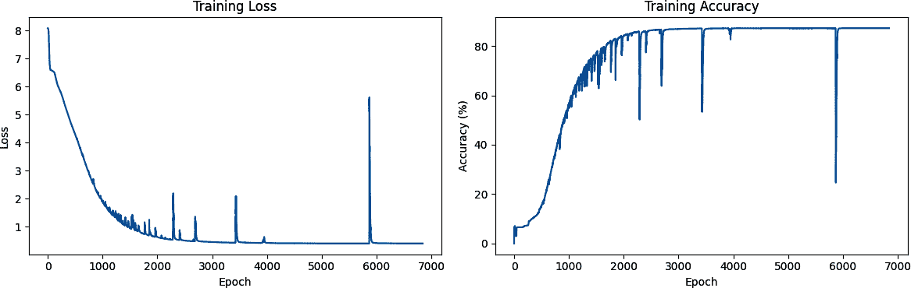

# 第八章\. 使用机器学习创建文本

随着 2022 年 ChatGPT 的发布，*生成式 AI*这个词进入了公众的词汇表。这个简单的应用允许你与基于云的 AI 进行聊天，它以几乎神奇的方式回答你的查询，几乎涵盖了人类经验的各个方面。它是通过使用比上一章中看到的循环神经网络更高级的进化，通过使用一种称为*变换器*的技术来工作的。

一个*变换器*学习将一段文本转换成另一段文本的模式。有了足够大的变换器架构和足够大的学习文本集，GPT 模型（GPT 代表生成式预训练变换器）可以预测跟随一段文本的下一个标记。当 GPT 被包裹在一个使其更用户友好的应用程序中时，一个全新的行业就诞生了。

虽然使用变换器创建模型超出了本书的范围，但我们将详细探讨其架构，见第十五章。

使用变换器训练模型涉及的原则可以用较小的、更简单的架构如 RNN 或 LSTM 来复制。我们将在本章中探讨这一点，并使用一个更小的文本语料库——传统的爱尔兰歌曲。

例如，考虑以下来自著名电视剧的文本行：

> 你什么都不知道，琼·斯诺。

一个使用 RNN 创建的下一个标记预测模型产生了以下歌词作为回应：

+   你什么都不知道，琼·斯诺

+   他驻足的地方

+   不论是科克还是在蓝鸟之子

+   帆船驶向夏日

+   旧日的甜蜜、长久和快乐的声音

+   因此，我将等待那野性的科琳死去

这段文本是由一个非常简单的模型生成的，该模型在一个小型语料库上进行了训练。我稍微增强了一下，添加了行断和标点符号，但除了第一行之外，所有歌词都是由你将在本章中学习如何构建的模型生成的。它提到一个*野性的科琳死去*，如果你看过琼·斯诺来自的电视剧，你就会明白为什么了！

在过去的几章中，你看到了如何使用 PyTorch 处理基于文本的数据——首先将其标记化为数字和序列，这些可以被神经网络处理，然后使用嵌入来模拟情感，最后使用深度和循环神经网络来分类文本。我们使用了讽刺数据集，一个小型且简单的数据集，来展示这一切是如何工作的。

在本章中，我们将转换方向：不再是分类现有文本，而是创建一个能够*预测*文本并因此*生成*文本的神经网络。

给定一个文本语料库，网络将尝试学习和理解文本中单词的*模式*，以便在给定一个称为*种子*的新文本时，可以预测下一个单词。一旦网络有了这个，种子和预测的单词就变成了新的种子，它可以预测下一个单词。因此，当在一个文本语料库上训练时，一个神经网络可以尝试以类似风格编写新的文本。为了创建前面的诗歌，我收集了多首传统爱尔兰歌曲的歌词，用它们训练了一个神经网络，并使用它来预测单词。

我们将从一个简单的例子开始，使用少量文本来说明如何构建一个预测模型，然后我们将通过创建一个包含更多文本的完整模型来结束。之后，你可以尝试它，看看它能创造出什么样的诗歌！

要开始，你将不得不稍微改变一下迄今为止对待文本的方式。在前面的章节中，你将句子转换为序列，然后根据其中标记的嵌入进行分类。但是，当涉及到创建可以用于训练此类预测模型的数据时，你需要一个额外的步骤，在这个步骤中，你需要将序列转换为*输入序列*和*标签*，其中输入序列是一组单词，标签是句子中的下一个单词。然后，你可以训练一个模型来匹配输入序列和它们的标签，以便未来的预测可以选择一个与输入序列相近的标签。

# 将序列转换为输入序列

当预测文本时，你需要训练一个神经网络，其输入序列（特征）与一个关联的标签相关联。将序列与标签匹配是预测文本的关键。在这种情况下，你不会像分类时那样有明确的标签，而是将句子分割，对于一组*n*个单词，句子中的下一个单词将是标签。

例如，如果你的语料库中有句子“今天有一个美丽的蓝天”，那么你可以将其拆分为“今天有一个美丽的蓝天”作为特征，“sky”作为标签。然后，如果你要对文本“今天有一个美丽的蓝天”进行预测，它很可能是“sky”。如果在训练数据中，你也有“昨天有一个美丽的蓝天”，你将以相同的方式拆分它，如果你要对文本“明天将会有一个美丽的蓝天”进行预测，那么下一个单词很可能是“sky”。

如果你用一个包含许多句子的网络进行训练，去掉最后一个单词并将其作为标签，你可以快速构建一个预测模型，其中可以从现有的文本中预测句子中最可能的下一个单词。

我们将从一个非常小的文本语料库开始——一首 19 世纪 60 年代的传统爱尔兰歌曲的摘录，其中的一些歌词如下：

+   在 Ath 城镇，有一个叫杰里米·兰尼根的人

+   破碎到他没有一磅。

+   他的父亲去世，使他再次成为一个男人

+   留给他一个农场和十英亩的土地。

+   他为朋友和亲戚举办了一场盛大的聚会

+   当他来到墙边时，谁会忘记他，

+   如果你愿意听，我会让你的眼睛闪闪发光

+   兰吉安之球的行进和动荡。

+   我自己确信得到了免费的邀请，

+   对于所有漂亮的小姑娘和男孩，我可能会问，

+   只需一分钟，朋友和亲戚们

+   他们像蜜蜂围绕酒桶一样快乐地跳舞。

+   朱迪·奥达利，那位可爱的小帽匠，

+   她向我眨了眨眼，让我给她打电话，

+   我很快就和佩吉·麦基根一起到了

+   正好赶上兰吉安之球。

您希望创建一个包含所有文本的单个字符串，并将其设置为您的数据。使用\n 作为换行符。然后，这个语料库可以轻松加载和分词。首先，分词函数将文本拆分为单个单词，然后`create_word_dictionary`将为文本中的每个单词创建一个索引的字典：

```py
def tokenize(text):
    tokens = text.lower().split()
    return tokens

def create_word_dictionary(word_list):
    # Create an empty dictionary
    word_dict = {}
    word_dict["UNK"] = 0
    # Counter for unique values
    counter = 1

    # Iterate through the list and assign numbers to unique words
    for word in word_list:
        if word not in word_dict:
            word_dict[word] = counter
            counter += 1

    return word_dict

```

注意，这是一个非常简单的学习方法，目的是学习这些方法的工作原理。在生产系统中，您可能会使用现成的、为规模而构建的组件，或者极大地增强它们以实现规模和异常检查。

使用这些函数，您可以为简单的语料库创建一个`word_index`，如下所示：

```py
data="In the town of Athy one Jeremy Lanigan \n 
      Battered away til he hadnt a pound. ..."

tokens = tokenize(data)
word_index = create_word_dictionary(tokens)

total_words = len(tokenizer.word_index) + 1

```

这个过程的目的是用它们的标记值替换单词（见图 8-1）。


###### 图 8-1\. 分词一个句子

为了训练一个预测模型，我们在这里需要采取进一步步骤：将句子拆分为多个更小的序列，例如，我们可以有一个由前两个标记组成的序列，另一个由前三个标记组成，等等。然后，我们将这些序列填充到与输入序列相同的长度，通过在前面添加零（见图 8-2）。


###### 图 8-2\. 将序列转换为多个输入序列

要做到这一点，您需要遍历语料库中的每一行，将其转换为标记列表，使用函数将文本单词转换为单词字典中的查找值数组，然后创建子序列的填充版本。为了帮助您完成这项任务，我提供了这些函数：`text_to_sequence`和`pad_sequence`。

```py
def text_to_sequence(sentence, word_dict):
    # Convert sentence to lowercase and split into words
    words = sentence.lower().strip().split()

    # Convert each word to its corresponding number
    number_sequence = [word_dict[word] for word in words]

    return number_sequence

def pad_sequences(sequences, max_length=None):
    # If max_length is not specified, find the length of the longest sequence
    if max_length is None:
        max_length = max(len(seq) for seq in sequences)

    # Pad each sequence with zeros at the beginning
    padded_sequences = []
    for seq in sequences:
        # Calculate number of zeros needed
        num_zeros = max_length – len(seq)
        # Create padded sequence
        padded_seq = [0] * num_zeros + list(seq)
        padded_sequences.append(padded_seq)

    return padded_sequences
```

然后，您可以使用这些辅助函数创建输入序列，如下所示：

```py
corpus = data.lower().split("\n")

input_sequences = []
for line in corpus:
    token_list = text_to_sequence(line, word_index)
    for i in range(1, len(token_list)):
        n_gram_sequence = token_list[:i+1]
        input_sequences.append(n_gram_sequence)

max_sequence_len = max([len(x) for x in input_sequences])
input_sequences = pad_sequences(input_sequences, max_sequence_len)
```

最后，一旦你有一组填充输入序列，你可以将它们分成特征和标签，其中每个标签只是每个输入序列中的最后一个标记（见图 8-3）。


###### 图 8-3\. 将填充序列转换为特征（x）和标签（y）

当您训练神经网络时，您将匹配每个特征与其对应的标签。例如，对于[0 0 0 0 0 0 1]，标签将是[2]。

这里是您用来将标签从输入序列中分离的代码：

```py
def split_sequences(sequences):
    # Create xs by removing the last element from each sequence
    xs = [seq[:–1] for seq in sequences]

    # Create labels by taking just the last element from each sequence
    labels = [seq[–1:] for seq in sequences]  
    # Using [–1:] to keep it as a single-element list
    # Alternative if you want labels as single numbers instead of lists:
    # labels = [seq[–1] for seq in sequences]

    return xs, labels
xs, labels = split_sequences(input_sequences)
```

接下来，你需要对标签进行编码。目前，它们只是标记——例如，图 8-3 顶部的数字 2 就是一个标记。但如果你想在分类器中将标记用作标签，你必须将其映射到一个输出神经元上。因此，如果你要分类*n*个单词，每个单词都是一个类别，你需要有*n*个神经元。这里控制词汇表的大小就变得很重要了，因为单词越多，你需要的类别就越多。回想一下第二章和 3 章，当你使用 Fashion MNIST 数据集对时尚物品进行分类，你有 10 种服装类型时？这需要你在输出层有 10 个神经元——但在这个情况下，如果你想要预测多达 10,000 个词汇词呢？你需要一个有 10,000 个神经元的输出层！

此外，你还需要将你的标签进行独热编码，以便它们与神经网络期望的输出相匹配。再次考虑图 8-3。如果一个神经网络被输入*x*，它由一系列 0 后面跟着一个 1 组成，你希望预测结果是 2——但网络如何实现这一点是通过有一个`vocabulary_size`个神经元的输出层，其中第二个神经元的概率最高。

将你的标签编码成一组可以用来训练的*Y*，你可以使用以下代码：

```py
def one_hot_encode_with_checks(value, corpus_size):
    # Check if value is within valid range
    if not 0 <= value < corpus_size:
        raise ValueError(f"Value {value} is out of range for corpus size 
                                 {corpus_size}")
    # Create and return one-hot encoded list
    encoded = [0] * corpus_size
    encoded[value] = 1
    return encoded
```

注意，有许多库和辅助函数可以为你完成这项工作，所以请随意使用它们而不是本章中的简单代码。但我想要在这里介绍这些方法，这样你可以看到它们是如何在底层工作的。

你可以在图 8-4 中直观地看到这一点。


###### 图 8-4\. 独热编码标签

这是一个非常稀疏的表示，如果你有很多训练数据和潜在的单词，它会迅速消耗内存！假设你有 100,000 个训练句子，词汇量为 10,000 个单词——你只需要 1,000,000,000 字节来存储标签！但如果我们想要对单词进行分类和预测，我们必须这样设计我们的网络。

# 创建模型

现在我们创建一个简单的模型，它可以使用这些输入数据进行训练。它将只包含一个嵌入层，然后是一个 LSTM 层，最后是一个密集层。

对于嵌入，你需要每个单词一个向量，所以参数将是单词的总数和你要嵌入的维度数。在这种情况下，我们没有很多单词，所以八个维度应该足够了。

你可以使 LSTM 双向的，步数可以是序列的长度，即我们的最大长度减 1（因为我们从末尾移除了一个标记来制作标签）。

最后，输出层将是一个具有总单词数作为参数的密集层，通过 Softmax 激活。这个层中的每个神经元都将代表下一个单词匹配该索引值的概率：

```py
class LSTMPredictor(nn.Module):
    def __init__(self, total_words, embedding_dim=8, hidden_dim=None):
        super(LSTMPredictor, self).__init__()

        # If hidden_dim not specified, use max_sequence_len-1 as in TF version
        if hidden_dim is None:
            hidden_dim = max_sequence_len–1

        # Embedding layer
        self.embedding = nn.Embedding(total_words, embedding_dim)

        # Bidirectional LSTM
        self.lstm = nn.LSTM(
            input_size=embedding_dim,
            hidden_size=hidden_dim,
            bidirectional=True,
            batch_first=True
        )

        # Final dense layer (accounting for bidirectional LSTM)
        self.fc = nn.Linear(hidden_dim * 2, total_words)

        # Softmax activation
        self.softmax = nn.Softmax(dim=1)

    def forward(self, x):
        # Embedding layer
        x = self.embedding(x)

        # LSTM layer
        lstm_out, _ = self.lstm(x)

        # Take the output from the last time step
        lstm_out = lstm_out[:, –1, :]

        # Dense layer
        out = self.fc(lstm_out)

        # Softmax activation
        out = self.softmax(out)

        return out
```

接下来，你使用分类损失函数（如分类交叉熵）和优化器（如 Adam）编译模型。你也可以指定你想要捕获指标：

```py
# Training setup
total_words = len(word_index)
model = LSTMPredictor(total_words)
criterion = nn.CrossEntropyLoss()
optimizer = torch.optim.Adam(model.parameters())
```

这是一个非常简单的模型，数据量不大，训练速度快。这里展示了大约 15,000 个 epoch 的训练结果，这可能需要大约 10 分钟。在现实世界中，你可能会使用更多的数据进行训练，因此需要更多的时间，所以你必须考虑我们在第七章中看到的某些技术，以确保更高的准确率，并可能减少训练时间。

你会看到它已经达到了非常高的准确率，并且可能还有提升的空间（见图 8-5）。


###### 图 8-5\. 训练损失和准确率

当模型达到 80%以上的准确率时，我们可以确信，如果我们有一个它已经看到的文本字符串，它将大约 80%的时间准确预测下一个单词。

然而，需要注意的是，在生成文本时，它将不断看到它之前没有见过的单词，因此尽管这个数字很好，但你最终会发现网络会迅速生成无意义的文本。我们将在下一节中探讨这个问题。

# 生成文本

现在你已经训练了一个能够预测序列中下一个单词的网络，下一步就是给它一个文本序列，并让它预测下一个单词。让我们看看如何做到这一点。

## 预测下一个单词

你将首先创建一个名为*种子文本*的短语。这是网络将基于其生成所有内容的初始表达式，它将通过预测下一个单词来实现这一点。

从网络已经*看到*的短语开始，例如“在 Athy 镇”：

```py
input_text = "In the town of Athy"
```

接下来，你需要对这个短语进行分词，并将其转换为与训练中使用的相同长度的标记序列：

```py
# Convert text to lowercase and split into words
words = input_text.lower().strip().split()

# Convert words to numbers using the word dictionary, use 0 for unknown words
number_sequence = [word_dict.get(word, 0) for word in words]

# Pad the sequence
padded_sequence = [0] * (sequence_length – len(number_sequence)) 
                      + number_sequence

```

然后，你需要将这个序列填充，使其与用于训练的数据具有相同的形状，通过将其转换为张量：

```py
input_tensor = torch.LongTensor([padded_sequence])
```

现在，你可以通过将这个输入张量传递给模型来预测这个标记列表的下一个单词。这将是一个包含字典中每个单词的概率以及它将是下一个标记的似然性的张量。

```py
# Get prediction
with torch.no_grad():  # No need to track gradients for prediction
    output = model(input_tensor)
```

这将返回语料库中每个单词的概率，因此你应该将结果传递给`torch.argmax`以获取最有可能的一个：

```py
# Get the predicted word index (highest probability)
predicted_idx = torch.argmax(output[0]).item()

```

这应该会给出值`6`。如果你查看单词索引，你会看到它是单词“one”：

```py
{'UNK': 0, 'in': 1, 'the': 2, 'town': 3, 'of': 4, 'Athy': 5, 
 `'``one``'``:` `6``,` 'Jeremy': 7, 'Lanigan': 8,

```

你也可以通过在单词索引项中搜索直到找到预测的单词并打印出来，在代码中查找它。你可以通过创建一个反向字典（将值映射到单词，而不是相反）来完成此操作：

```py
# Create reverse dictionary to convert number back to word
reverse_dict = {v: k for k, v in word_dict.items()}

# Convert predicted index to word
predicted_word = reverse_dict[predicted_idx]

```

因此，从文本“in the town of Athy”开始，网络预测下一个词应该是“one”——如果你查看训练数据，这是正确的，因为这首歌以这句开始：

+   *在 Ath 镇的城镇*一个 Jeremy Lanigan

+   Battered away til he hadn’t a pound

事实上，如果你查看基于索引值的前五个预测，你会得到类似这样的结果：

```py
Top 5 predictions:
one: 0.9999
youll: 0.0000
didnt: 0.0000
creature: 0.0000
nelly: 0.0000
```

现在你已经确认模型可以正常工作，你可以发挥创意并使用不同的种子文本。例如，当我使用种子文本“sweet Jeremy saw Dublin”时，它预测的下一个词是“his”。

```py
Top 5 predictions:
his: 0.7782
go: 0.1393
bellows,: 0.0605
accident: 0.0090
til: 0.0048
```

这段文本被选中是因为所有这些单词都在语料库中。在这种情况下，你应该期待预测结果更准确，至少在开始时是这样。

## 通过复合预测生成文本

在上一节中，你看到了如何使用模型根据种子文本预测下一个单词。现在，为了让神经网络创建新的文本，你只需重复预测，每次添加新单词。

例如，早些时候，当我使用短语“sweet Jeremy saw Dublin”时，它预测下一个词将是“his”。你可以通过将“his”附加到种子文本中，得到“sweet Jeremy saw Dublin his”，并获取另一个预测。重复这个过程将给出一个由 AI 创建的文本字符串。

这里是上一节更新的代码，它根据`num_words`参数设置的数量执行这个循环：

```py
def generate_sequence(model, initial_text, word_dict, 
                      sequence_length, num_words=10):
    # Set model to evaluation mode
    model.eval()

    # Start with the initial text
    current_text = initial_text
    generated_sequence = initial_text

    # Create reverse dictionary for converting numbers back to words
    reverse_dict = {v: k for k, v in word_dict.items()}

    print(f"Initial text: {initial_text}")

    for i in range(num_words):
        # Convert current text to lowercase and split into words
        words = current_text.lower().strip().split()

        # Take the last 'sequence_length' words if we exceed it
        if len(words) > sequence_length:
            words = words[-sequence_length:]

        # Convert words to numbers using the word dictionary, use 0 for unknown
        number_sequence = [word_dict.get(word, 0) for word in words]

        # Pad the sequence
        padded_sequence = [0] * (sequence_length – len(number_sequence)) 
                                                 + number_sequence

        # Convert to PyTorch tensor and add batch dimension
        input_tensor = torch.LongTensor([padded_sequence])

        # Get prediction
        with torch.no_grad():
            output = model(input_tensor)

        # Get the predicted word index (highest probability)
        predicted_idx = torch.argmax(output[0]).item()

        # Convert predicted index to word
        predicted_word = reverse_dict[predicted_idx]

        # Add the predicted word to the sequence
        generated_sequence += " " + predicted_word

        # Update current text for next prediction
        current_text = generated_sequence

        # Print progress
        print(f"Generated word {i+1}: {predicted_word}")

        # Optionally print top 5 predictions for each step
        _, top_indices = torch.topk(output[0], 5)
        print(f"\nTop 5 predictions for step {i+1}:")
        for idx in top_indices:
            word = reverse_dict[idx.item()]
            probability = output[0][idx].item()
            print(f"{word}: {probability:.4f}")
        print("\n" + "-"*50 + "\n")

    return generated_sequence

# Example usage:
initial_text = "sweet Jeremy saw Dublin"
generated_text = generate_sequence(
    model=model,
    initial_text=initial_text,
    word_dict=word_index,
    sequence_length=max_sequence_len,
    num_words=10
)

print("\nFinal generated sequence:")
print(generated_text)

```

这将最终创建一个类似这样的字符串：

```py
sweet jeremy saw dublin his right leg acres of the nolans, dolans, daughter, of

```

它迅速陷入胡言乱语。为什么？第一个原因是训练文本的主体真的很小，所以它几乎没有上下文可以工作。第二个原因是序列中下一个单词的预测依赖于序列中的前一个单词，如果前一个匹配不佳，即使是最好的“下一个”匹配也将有很低的准确率。当你将这个添加到序列中并预测下一个单词后，它具有低准确率的可能性甚至更高——因此，预测的单词看起来像是半随机生成的。

例如，虽然短语“sweet Jeremy saw Dublin”中的所有单词都在语料库中，但它们从未以这种顺序存在。当模型进行第一次预测时，它选择了“his”作为最有可能的候选词，并且它有相当高的准确率（78%）：

```py
Initial text: sweet Jeremy saw Dublin
Generated word 1: his

Top 5 predictions for step 1:
his: 0.7782
go: 0.1393
bellows,: 0.0605
accident: 0.0090
til: 0.0048
```

当模型将这个词添加到种子文本中，得到“sweet Jeremy saw Dublin his”时，我们得到了一个在训练数据中未出现的新短语，因此预测给出了最高概率的单词“right”，概率为 44%：

```py
Generated word 2: right

Top 5 predictions for step 2:
right: 0.7678
pipes,: 0.1376
creature: 0.0458
didnt: 0.0136
youll: 0.0113
```

虽然偶尔会有很高的确定性，一个词紧跟着另一个词（比如“leg”跟着“right”），但随着时间的推移，你会发现继续向句子中添加单词会降低在训练数据中匹配的可能性，因此预测准确性会受到影响——导致预测的词语有更多的随机性。

这导致 AI 生成的内容随着时间的推移变得越来越不合逻辑。

例如，查看优秀的科幻短片[*Sunspring*](https://oreil.ly/hTBtJ)，它完全由一个基于 LSTM 的网络（就像你在这里构建的）编写，该网络在科幻电影剧本上进行了训练。模型被提供了种子内容，并要求生成一个新的剧本。结果非常有趣，你会看到虽然初始内容是有意义的，但随着电影的进行，它变得越来越难以理解。

这也是 LLM 中*幻觉*的基础，这是一种常见的现象，会降低人们对它们的信任。

# 扩展数据集

你可以轻松地将用于硬编码数据集的相同模式扩展到使用文本文件。我已经托管了一个包含约 1700 行文本的文本文件，这些文本是从多首歌曲中收集的，你可以用它进行实验。稍作修改后，你可以用这个代替单个硬编码的歌曲。

要在 Colab 中下载数据，请使用以下代码：

```py
!wget --no-check-certificate \
    https://storage.googleapis.com/learning-datasets/ \
    irish-lyrics-eof.txt-O /tmp/irish-lyrics-eof.txt
```

然后，你可以简单地像这样将文本加载到你的语料库中：

```py
data = open('/tmp/irish-lyrics-eof.txt').read()
corpus = data.lower().split("\n")
```

接下来，你的代码将几乎不需要修改就能运行！

训练这个模型 50,000 个 epoch——在 T4 Colab 实例上大约需要 30 分钟——可以将你的准确性提高到大约 30%，曲线趋于平坦（见图 8-6）。


###### 图 8-6\. 在更大的数据集上训练

###### 注意

当使用 Google Colab 时，你可以在后端选择各种加速器，这可以使你的训练速度大大提高。在这种情况下，正如所注，我使用了 T4。要自己这样做，当你在 Colab 中时，在“连接”菜单下，你会看到一个“更改运行时类型”选项。选择它，你将看到可供你使用的加速器。

再次尝试短语“in the town of Athy”，这次预测结果是“one”，但概率略高于 83%：

```py
Initial text: in the town of Athy
Using device: cuda
Generated word 1: one

Top 5 predictions for step 1:
one: 0.8318
is: 0.1648
she: 0.0016
thee: 0.0013
that: 0.0003

--------------------------------------------------

Generated word 2: my

Top 5 predictions for step 2:
my: 0.9377
of: 0.0622
is: 0.0001
that: 0.0000
one: 0.0000
```

运行几个更多的标记，我们可以看到以下输出。它开始创作歌曲，尽管很快就会陷入胡言乱语！

```py
in the town of athy one my heart
was they were the a reflections
on me all the frivolity;
of me and me and me and the
there was my heart was
on the a over the frivolity;
```

对于“sweet Jeremy saw Dublin”，预测的下一个词是“she”，概率为 80%。预测接下来的几个词得到以下结果：

```py
sweet jeremy saw dublin she of his on the frivolity; of a heart is the ground

```

看起来好多了！但我们还能进一步改进吗？

# 改进模型架构

您可以通过改变模型架构，使用多个堆叠的 LSTM 和一些其他优化技术来提高模型。鉴于对于这样的数据集来说，没有明确的准确度基准——既没有正确的分类，也没有目标回归——很难确定模型是好是坏。因此，准确度结果可能非常主观。

话虽如此，它们仍然是一个很好的衡量标准，因此在本节中，我将探讨一些可以添加到架构中以改进准确度指标的方法。

## 嵌入维度

在第六章中，我们讨论了嵌入的最佳维度是单词数量的四次方根。在这种情况下，词汇表有 3,259 个单词，其四次方根约为 8。另一个经验法则是这个数字的对数——log(3259)略大于 32。因此，如果网络学习缓慢，您可以选择这两个值之间的一个数字。这为您提供了足够的“空间”来捕捉单词之间的关系。

## 初始化 LSTM

通常，神经网络中的参数初始化为零。您可以通过将不同层初始化为各种研究结果支持的不同类型来给学习一点启动。我们将在以下小节中简要介绍这些类型的层。

### 嵌入层

嵌入层可以用正态分布初始化，标准差按`1/sqrt(embedding_dim)`缩放，以获得更好的梯度流动。这与`word2vec`风格的初始化类似。

### LSTM 层

LSTM 有四种内部神经网络类型——输入、遗忘、细胞和输出——它们的权重矩阵是这些类型的堆叠。不同类型受益于不同的初始化。两篇讨论这一点的优秀论文是 Rafal Jozefowicz 等人撰写的“[对循环网络架构的经验探索]”(https://oreil.ly/UuvQO)和 Razvan Pascanu 等人撰写的“[训练循环神经网络的困难]”(https://oreil.ly/Ttvll)。LSTM 的具体内容超出了本章的范围，但可以查看相关代码以了解初始化它们的一种方法。

### 最终线性层

在他们 2015 年的论文“[深入探究 ReLU](https://oreil.ly/_MM6A)”中，Kaiming He 等人探讨了线性层的初始化，并提出了“Kaiming”初始化（也称为“He”初始化）。关于这一点的详细解释超出了本书的范围，但代码可以在[GitHub 仓库](https://github.com/lmoroney/PyTorch-Book-FIles)中的笔记本中找到。

## 可变学习率

在我们迄今为止看到的每个例子中，我们都探讨了不同的学习率及其对网络的影响——但实际上，你可以 *调整* 网络学习过程中的学习率。在早期 epoch 中效果好的值可能在后期 epoch 中效果不佳，因此创建一个按 epoch 调整这个学习率的调度器可以帮助你创建更有效的学习网络。

对于此，PyTorch 提供了一个 `torch.optim.lr_scheduler`，你可以编程在训练过程中改变它：

```py
scheduler = torch.optim.lr_scheduler.OneCycleLR(
    optimizer,
    max_lr=0.01,              # Peak learning rate
    epochs=20000,             # Total epochs
    steps_per_epoch=1,        # Steps per epoch 
    pct_start=0.1,           # Percentage of training spent increasing lr
    div_factor=10.0,         # Initial lr = max_lr/10
    final_div_factor=1000.0  # Final lr = initial_lr/1000
)
```

在第七章中，我们探讨了 *学习率*（LR）的概念，它是一个超参数，如果设置得太大，会导致网络过度学习，如果设置得太小，将阻止网络有效地学习。这个好处是你可以将其设置为可变的学习率，我们在这里就是这样做的。在早期 epoch 中，我们希望网络快速学习，所以我们有一个大的 LR——而在后期 epoch 中，我们不想让它过度拟合，所以我们逐渐降低 LR。

`pct_start` 参数定义了一个预热期，即训练的前 10%，在此期间，学习率逐渐增加到最大值（在这种情况下，0.01），然后降低到初始学习率的 1/1000（由 `final_div_factor` 确定）。

你可以在图 8-7 中看到这对接训的影响，它在 6,800 个 epoch 之前达到了 ~90% 的准确率，然后触发了提前停止。



###### 图 8-7\. 添加第二个 LSTM 层

这次，当使用与之前相同的短语进行测试时，我在“在 Athy 镇”之后以 26% 的概率得到了“little”，在“甜 Jeremy 看到了都柏林”之后以 32% 的概率得到了“one”。再次，当预测更多单词时，输出迅速变成了乱码。

这里有一些例子：

```py
sweet jeremy saw dublin one evening two white ever we once to raise you, 
tis young i was told my heart as found has

you know nothing jon snow you should laugh all the while at me curious style, 
twould set your heart a bubblin will lámh. you that

in the town of athy one jeremy lanigan do lámh. pretty generation her soul, 
fell on the stony ground red we were feeble was down

```

###### 注意

单词 `lámh` 出现在这篇文本中，它是盖尔语中的 *手*。而 `do lámh` 意味着 *你的手*。

如果你得到不同的结果，请不要担心——你没有做错任何事情，但神经元的随机初始化会影响最终得分。

# 改进数据

有一个技巧你可以用来自扩展数据集的大小，而不需要添加任何新的歌曲。这被称为 *窗口化* 数据。目前，每首歌的每一行都被读作单独的一行，然后转换成输入序列，就像你在图 8-2 中看到的那样。虽然人类一行一行地读歌曲以听押韵和韵律，但模型不必这样做，尤其是在使用双向 LSTM 时。

因此，我们不必处理“在 Ath 城镇，有一个杰里米·兰尼根”这一行，然后移动到下一行（“被打得体无完肤，直到没有一磅”）并处理它，我们可以将所有行视为一个长而连续的文本。然后我们可以创建一个包含 *n* 个单词的“窗口”来处理这个文本，然后移动窗口一个单词以获取下一个输入序列（见图 8-8）。

在这种情况下，可以通过增加输入序列的数量来产生更多的训练数据。将窗口在整个文本语料库上移动将给我们提供 ((*number_of_words* – *window_size*) × *window_size*) 个输入序列，我们可以用这些序列进行训练。


###### 图 8-8\. 移动单词窗口

代码相当简单——在加载数据时，我们不需要将每首歌的行分割成“句子”，而是可以从语料库中的单词动态创建它们：

```py
window_size=10
sentences=[]
alltext=[]
data = open('/tmp/irish-lyrics-eof.txt').read()
corpus = data.lower()
words = corpus.split(" ")
range_size = len(words)-max_sequence_len
for i in range(0, range_size):
    thissentence=""
    for word in range(0, window_size-1):
        word = words[i+word]
        thissentence = thissentence + word
        thissentence = thissentence + " "
    sentences.append(thissentence)
```

在这种情况下，因为我们不再有句子，我们正在创建与移动窗口大小相同的序列，所以 `max_sequence_len` 是窗口的大小。整个文件被读取，转换为小写，并使用字符串分割将其拆分为单词数组。然后代码遍历单词，并从当前索引到当前索引加上窗口大小创建每个单词的句子，将这些新构建的句子添加到句子数组中。

###### 注意

要训练这个，你可能需要一个更高内存的 GPU。我在 Colab 上使用了 40Gb 的 A100。

在训练过程中，你会注意到额外的数据使得每个 epoch 的训练速度变慢，但结果得到了极大的改善，生成的文本陷入胡言乱语的速度也慢得多。

这里有一个让我眼前一亮例子——尤其是最后一行：

```py
you know nothing jon snow
tell the loved ones and the friends
we would neer see again.
and the way of their guff again
and high tower might ask,
not see night unseen
```

有许多超参数你可以尝试调整。改变窗口大小将改变训练数据量——较小的窗口大小可以产生更多的数据，但提供给标签的单词会更少，所以如果你设置得太小，最终你会得到毫无意义的诗歌。你还可以改变嵌入维度、LSTMs 的数量或用于训练的词汇表大小。鉴于百分比准确率并不是最好的衡量标准——你将想要对诗歌的“意义”进行更主观的评估——没有硬性规则可以遵循来确定你的模型是否“好”。当然，你*会*受到你所拥有的数据量和可用计算的限制——模型越大，你需要的力量就越多。

最终，重要的是要实验并享受乐趣！

# 基于字符的编码

在最后几章中，我们一直在使用基于词的编码来研究 NLP。我发现这更容易开始，但当你生成文本时，你也可能想考虑使用*字符编码*，因为语料库中独特的*字符*数量通常比独特的*单词*数量少得多。如果你使用这种方法，你可以在输出层中拥有更少的神经元，并且你的输出预测可以分散到更少的概率上。例如，如果你查看[莎士比亚全集](https://oreil.ly/XW_ab)的数据集，你会发现整个集合中只有 65 个独特的字符。基本上，莎士比亚只真正使用了大写和小写字母以及一些标点符号来给出一个独特的 65 个字符的集合！

因此，当你使用这个数据集进行预测时，你只需查看 65 个单词的概率，而不是像爱尔兰歌曲数据集中那样查看 2,700 个单词的概率。这使得你的模型变得稍微简单一些！

字符编码的优点还包括，标点符号字符也被包括在内，因此可以预测行中断等。例如，当我使用在莎士比亚语料库上训练的 RNN 来预测我喜欢的《权力的游戏》台词之后的文本时，我得到了以下结果：

+   YGRITTE：

    +   你什么都不知道，琼·雪诺。

    +   晚安，我们将证明那些身体的仆人。

    +   *叛徒是我的：*

    +   *所以他希望在这个复苏中恢复身体，*

    +   我无法判断其吸引力。

+   梅内尼乌斯：

    +   哎呀，这是虚荣。

+   国王理查二世：

    +   我想她是在想我；

    +   她不会：忍受你的束缚：

    +   我祈祷上帝，他怎么啦，

    +   你的爱情不会带来任何名声，你将结束

她把他识别为叛徒并想把他绑起来（“diswarl his body”），这很酷，但我不知道“resceins”是什么意思！如果你看过这部剧，这是剧情的一部分，所以也许莎士比亚没有意识到这一点！

当然，我认为当我们使用像莎士比亚的文本作为训练数据时，我们往往更宽容一些，因为语言已经有些不熟悉了。

就像爱尔兰歌曲模型一样，莎士比亚数据集的输出很快就会退化成无意义的文本，但仍然很有趣来玩。要自己尝试，你可以查看[Colab](https://oreil.ly/cbz9c)。这个 Colab 是基于 TensorFlow 的，而不是基于 PyTorch 的。[查看 GitHub 仓库](https://oreil.ly/kQ7aa)以获取一个类似但基于 PyTorch 的示例，它给出了不同的结果。

# 摘要

在本章中，我们探讨了如何使用训练好的基于 LSTM 的模型进行基本的文本生成。你学习了如何通过使用单词作为标签来将文本分割成训练特征和标签，你还学习了如何创建一个模型，当给定种子文本时，可以预测下一个可能的单词。然后，你通过探索传统爱尔兰歌曲的数据集来迭代改进模型，以获得更好的结果。希望这对你来说是一个有趣的入门，了解机器学习模型如何合成文本，同时也为你提供了理解生成式人工智能基础原理所需的知识。这种方法通过 Transformer 架构得到了极大的改进，正是 LLM 模型如 GPT 和 Gemini 工作的基础！
