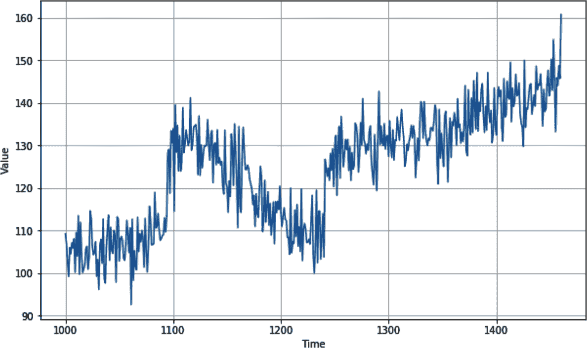
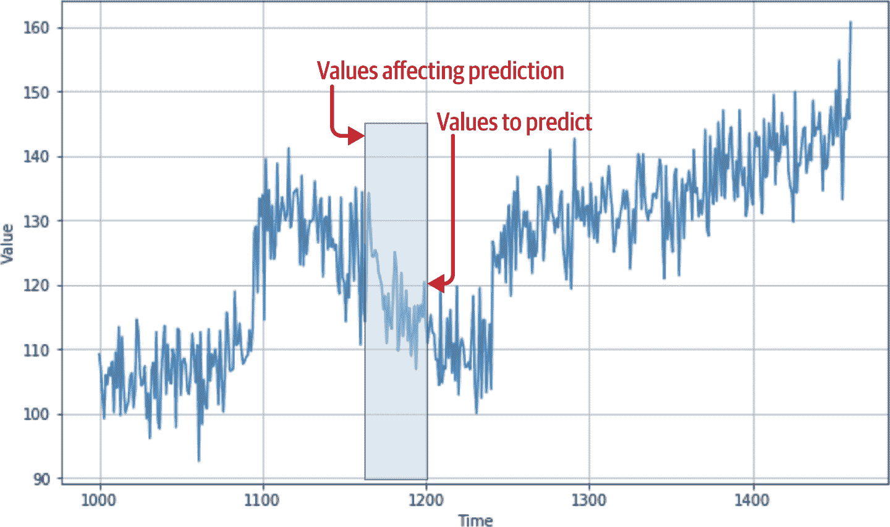
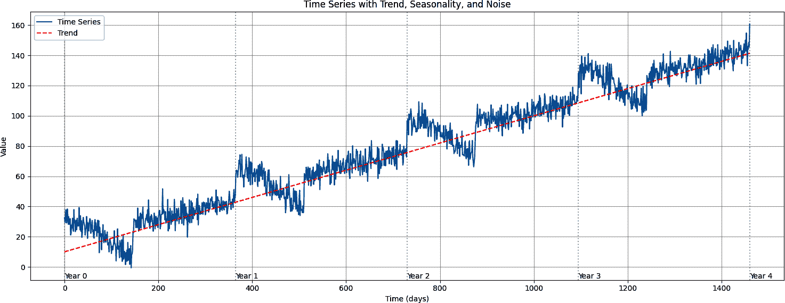
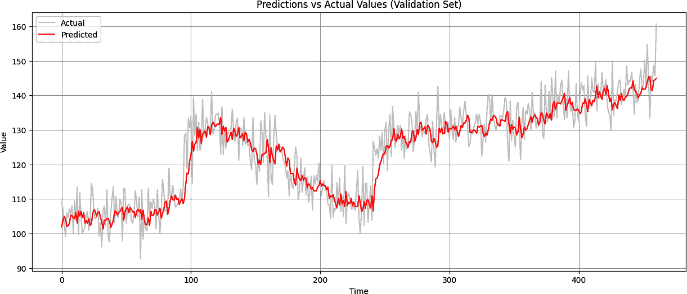

# 第十章\. 创建用于预测序列的机器学习模型

第九章介绍了序列数据和时间序列的属性，包括季节性、趋势、自相关和噪声。你创建了一个用于预测的合成序列，并探讨了如何进行基本的统计预测。

在接下来的几章中，你将学习如何使用机器学习进行预测。但在开始创建模型之前，你需要了解如何通过创建我们称之为*窗口数据集*的方式来构建时间序列数据，以便为预测模型进行训练。

为了理解为什么你需要这样做，考虑你在第九章中创建的时间序列。你可以在图 10-1 中看到它的一个图。

如果在任何时候你想预测时间*t*的值，你将希望将其作为时间*t*之前值的函数进行预测。例如，假设你想将时间序列在第 1,200 步的值作为其前 30 个值的函数进行预测。在这种情况下，时间步 1,170 到 1,199 的值将决定时间步 1,200 的值（参见图 10-2）。



###### 图 10-1\. 合成时间序列



###### 图 10-2\. 影响预测的前期值

现在，这开始看起来熟悉了：你可以将 1,170 到 1,199 的值视为你的*特征*，而 1,200 的值视为你的*标签*。如果你能将你的数据集整理到有特定数量的值作为特征，而后续的值作为标签的状态，并且如果你对数据集中的每个已知值都这样做，那么你最终将得到一组相当不错的特征和标签，你可以用它们来训练一个模型。

在对第九章中的时间序列数据集进行此操作之前，让我们创建一个非常简单的数据集，它具有所有相同的属性，但数据量要小得多。

# 创建窗口数据集

PyTorch 有很多用于操作数据的 API。例如，你可以使用`torch.arange(10)`来创建一个包含数字 0-9 的基本数据集，从而模拟一个时间序列。然后你可以将这个数据集转换为窗口数据集的开始。以下是代码：

```py
import torch

def create_sliding_windows(data, window_size, shift=1):
    # Convert input to tensor if it isn't already
    if not isinstance(data, torch.Tensor):
        data = torch.tensor(data)

    # Calculate number of valid windows
    n = len(data)
    num_windows = max(0, (n – window_size) // shift + 1)

    # Create strided view of data
    windows = data.unfold(0, window_size, shift)

    return windows

# Example usage:
data = torch.arange(10)
windows = create_sliding_windows(data, window_size=5, shift=1)

# Print each window
for window in windows:
    print(window.numpy())

```

首先，它通过使用范围来创建数据集，这仅仅使数据集包含从 0 到*n* - 1 的值，其中*n*在这个例子中是 10。

接下来，调用`create_sliding_windows`并传递参数`5`指定网络应将数据集分割成五个项目的窗口。指定`shift=1`会导致每个窗口相对于前一个窗口移动一个位置：第一个窗口将包含从 0 开始的五个项目，下一个窗口将包含从 1 开始的五个项目，等等。

运行此代码将给出以下结果：

```py
[0 1 2 3 4]
[1 2 3 4 5]
[2 3 4 5 6]
[3 4 5 6 7]
[4 5 6 7 8]
[5 6 7 8 9]

```

之前，您看到我们想要将此数据转换为训练数据，其中*n*个值定义了一个特征，并且有一个随后的值给出标签。您可以通过一些简单的 Python 列表切片来实现这一点，将每个窗口分成两部分：最后一个值之前的所有内容以及最后一个值本身。

这在张量数据上使用`unfold`技术，它创建了一个滑动窗口，将数据转换为之前概述的集合。

它还包含三个参数：

维度（在这种情况下为 0）

这是展开的维度。

window_size

这是每个滑动窗口的大小。

shift

这是窗口之间的步长/步长大小。

这个过程给我们一个`*x*`和`*y*`数据集，如下所示：

```py
import torch

def create_sliding_windows_with_target(data, window_size, shift=1):
    # Convert input to tensor if it isn't already
    if not isinstance(data, torch.Tensor):
        data = torch.tensor(data, dtype=torch.float32)

    # Create windows using unfold
    windows = data.unfold(0, window_size, shift)

    # Split each window into features
    features = windows[:, :–1]  # All elements except the last
    targets = windows[:, –1:]   # Just the last element

    return features, targets

# Example usage:
data = torch.arange(10)
features, targets = create_sliding_windows_with_target(data, window_size=5, 
                                                             shift=1)

# Print each window's features and target
for x, y in zip(features, targets):
    print(f"Features: {x.numpy()}, Target: {y.numpy()}")

```

现在的结果与您预期的相符。窗口中的前四个值可以被视为特征，随后的值是标签：

```py
[0 1 2 3] [4]
[1 2 3 4] [5]
[2 3 4 5] [6]
[3 4 5 6] [7]
[4 5 6 7] [8]
[5 6 7 8] [9]
```

现在，使用 PyTorch 的 TensorDataset 类型，您可以将其转换为数据集，并执行诸如洗牌和批处理等原生操作。

注意，在洗牌数据时，确保首先将验证集和测试集分开是一个好的做法。在时间序列数据中，在分割之前洗牌可能会导致训练集的信息泄露到测试集中，这会损害评估过程。

这里，它已经被洗牌并批量处理，批大小为 2：

```py
from torch.utils.data import TensorDataset, DataLoader

# Create dataset
data = torch.arange(10)
features, targets = create_sliding_windows_with_target(data, window_size=5, 
                                                             shift=1)

# Combine features and targets into a dataset
dataset = TensorDataset(features, targets)

# Create DataLoader with shuffling and batching
batch_size = 2
dataloader = DataLoader(dataset, batch_size=batch_size, shuffle=True)

# Example iteration
for batch_features, batch_targets in dataloader:
    print(f"Batch features shape: {batch_features.shape}")
    print(f"Features:\n{batch_features}")
    print(f"Targets:\n{batch_targets}\n")

```

结果显示，第一个批次有两个`*x*`集合（分别从 5 和 0 开始）及其标签，第二个批次有两个`*x*`集合（分别从 1 和 3 开始）及其标签，依此类推：

```py
tensor([[5, 6, 7, 8],
        [0, 1, 2, 3]])
Targets:
tensor([[9],
        [4]])

Features:
tensor([[1, 2, 3, 4],
        [3, 4, 5, 6]])
Targets:
tensor([[5],
        [7]])

Features:
tensor([[4, 5, 6, 7],
        [2, 3, 4, 5]])
Targets:
tensor([[8],
        [6]])

```

使用这种技术，您现在可以将任何时间序列数据集转换为神经网络的一组训练数据。在下一节中，您将探索如何从第九章中的合成数据创建训练集。从那里，您将转向创建一个简单的 DNN，该 DNN 在数据上训练，并可用于预测未来值。

## 创建时间序列数据集的窗口版本

回顾一下，这是我们之前章节中用来创建合成时间序列数据集的代码：

```py
import numpy as np
def trend(time, slope=0):
    return slope * time

def seasonal_pattern(season_time):
    return np.where(season_time < 0.4,
                    np.cos(season_time * 2 * np.pi),
                    1 / np.exp(3 * season_time))

def seasonality(time, period, amplitude=1, phase=0):
    season_time = ((time + phase) % period) / period
    return amplitude * seasonal_pattern(season_time)

def noise(time, noise_level=1, seed=None):
    rnd = np.random.RandomState(seed)
    return rnd.randn(len(time)) * noise_level

time = np.arange(4 * 365 + 1, dtype="float32")
series = trend(time, 0.1)
baseline = 10
amplitude = 20
slope = 0.09
noise_level = 5

series = baseline + trend(time, slope)
series += seasonality(time, period=365, amplitude=amplitude)
series += noise(time, noise_level, seed=42)

```

这将创建一个看起来像图 10-3 中的时间序列。如果您想修改它，请随意调整各种常数的值。



###### 图 10-3。绘制具有趋势、季节性和噪声的时间序列

一旦您有了序列，您就可以使用与上一节中类似的代码将其转换为窗口数据集：

```py
import torch
from torch.utils.data import TensorDataset, DataLoader

# Convert the numpy series to a PyTorch tensor
series_tensor = torch.tensor(series, dtype=torch.float32)

# Create windowed dataset with 30-day windows (predicting next day)
window_size = 30
features, targets = create_sliding_windows_with_target(
    series_tensor, window_size=window_size, shift=1)

# Create PyTorch Dataset and DataLoader
dataset = TensorDataset(features, targets)
batch_size = 32
train_loader = DataLoader(dataset, batch_size=batch_size, shuffle=True)

# Print some information about the dataset
print(f"Series length: {len(series)}")
print(f"Number of windows: {len(features)}")
print(f"Feature shape: {features.shape}")  # Should be (num_windows, 
                                                        window_size-1)
print(f"Target shape: {targets.shape}")    # Should be (num_windows, 1)

# Show a few examples
print("\nFirst few windows:")
for i in range(3):
    print(f"\nWindow {i+1}:")
    print(f"Features (previous {window_size-1} days): {features[i].numpy()}")
    print(f"Target (next day): {targets[i].item():.2f}")
```

您可以在这里看到输出：

```py
Series length: 1461
Number of windows: 1432
Feature shape: torch.Size([1432, 29])
Target shape: torch.Size([1432, 1])

First few windows:

Window 1:
Features (previous 29 days): [32.48357  29.395714 33.40659  37.858486 
 29.14184  29.20528  38.32948  34.322147 28.183279 33.283253 28.287313 
 28.303862 31.864614 21.104889 22.057411 27.875519 25.622026 32.25094  
 26.127428 23.588236 37.95459  29.468477 30.900469 23.39905  27.755371 
 30.980967 24.615065 32.186863 27.23822 ]
Target (next day): 28.71

Window 2:
Features (previous 29 days): [29.395714 33.40659  37.858486 29.14184  
 29.20528  38.32948  34.322147 28.183279 33.283253 28.287313 28.303862 
 31.864614 21.104889 22.057411 27.875519 25.622026 32.25094  26.127428 
 23.588236 37.95459  29.468477 30.900469 23.39905  27.755371 30.980967 
 24.615065 32.186863 27.23822  28.710733]
Target (next day): 27.08

Window 3:
Features (previous 29 days): [33.40659  37.858486 29.14184  29.20528  
 38.32948  34.322147 28.183279 33.283253 28.287313 28.303862 31.864614 
 21.104889 22.057411 27.875519 25.622026 32.25094  26.127428 23.588236 
 37.95459  29.468477 30.900469 23.39905  27.755371 30.980967 24.615065 
 32.186863 27.23822  28.710733 27.083256]
Target (next day): 39.27
```

要使用这些数据训练模型，您将把序列分成训练集和验证集。在这种情况下，我们将通过分割列表并将其转换为`train_dataset`和`val_dataset`子集来训练 1,000 条记录。这使用了`torch.utils.data`中的`Subset`类。

然后，你可以使用`DataLoader`加载这些数据，就像我们在第三章中看到的那样：

```py
train_size = 1000 
total_windows = len(full_dataset)
train_indices = list(range(train_size))
val_indices = list(range(train_size, total_windows))

# Create training and validation datasets using Subset
train_dataset = Subset(full_dataset, train_indices)
val_dataset = Subset(full_dataset, val_indices)

# Create DataLoaders
batch_size = 32
train_loader = DataLoader(train_dataset, batch_size=batch_size, shuffle=True)
val_loader = DataLoader(val_dataset, batch_size=batch_size, shuffle=False)
```

现在要记住的重要事情是，你的数据是一个数据集，因此你可以轻松地在模型训练中使用它，而无需进一步编写代码。

如果你想检查数据看起来像什么，你可以用这样的代码来做：

```py
features, target = train_dataset[0]
print("First window:")
print(f"Features shape: {features.shape}")
print(f"Features: {features.numpy()}")
print(f"Target: {target.item()}\n")

```

在这里，`batch_size`设置为`1`，只是为了使结果更易于阅读。因此，你最终会得到这样的输出，其中单个数据集在批次中：

```py
First window:
Features shape: torch.Size([29])
Features: [32.48357  29.395714 33.40659  37.858486 29.14184  29.20528  38.32948
 34.322147 28.183279 33.283253 28.287313 28.303862 31.864614 21.104889
 22.057411 27.875519 25.622026 32.25094  26.127428 23.588236 37.95459
 29.468477 30.900469 23.39905  27.755371 30.980967 24.615065 32.186863
 27.23822 ]
Target: 28.71073341369629

```

第一批数字是特征。我们将窗口大小设置为 30，因此它是一个 1 × 30 的张量。第二个数字是标签（在这个例子中是 28.710），模型将尝试将特征拟合到这个标签。你将在下一节中看到它是如何工作的。

# 创建和训练一个 DNN 以适应序列数据

现在你有了数据，创建一个神经网络模型变得非常简单。让我们首先探索一个简单的 DNN。以下是模型定义：

```py
# Define the model
class TimeSeriesModel(nn.Module):
    def __init__(self, window_size):
        super(TimeSeriesModel, self).__init__()
        # window_size-1 because our features are window_size-1
        self.network = nn.Sequential(
            nn.Linear(window_size-1, 10),  
            nn.ReLU(),
            nn.Linear(10, 10),
            nn.ReLU(),
            nn.Linear(10, 1)
        )

    def forward(self, x):
        return self.network(x)

```

这是一个超级简单的模型，包含三个线性层，第一个层接受`window_size`的输入形状，然后是一个包含 10 个神经元的隐藏层，最后是一个包含预测值的输出层。

模型初始化时使用损失函数和优化器，就像之前一样：

```py
# Initialize model, loss function, and optimizer
model = TimeSeriesModel(window_size)
criterion = nn.MSELoss()
optimizer = optim.Adam(model.parameters())
```

在这种情况下，损失函数指定为`MSELoss`，代表“均方误差”，在回归问题中常用（这正是最终归结为的问题）。对于优化器，`Adam`是一个很好的选择。在这本书中，我不会详细介绍这些类型的函数，但任何好的机器学习资源都会教你关于它们的知识——Coursera 上 Andrew Ng 的开创性课程“[深度学习专项](https://oreil.ly/A8QzN)”是一个很好的起点。

训练过程相当标准。它由从训练加载器中加载批次并使用它们进行正向传递，然后进行带有优化的反向传递组成：

```py
for batch_features, batch_targets in train_loader:
    batch_features = batch_features.to(device)
    batch_targets = batch_targets.to(device)

    # Forward pass
    outputs = model(batch_features)
    loss = criterion(outputs, batch_targets)

    # Backward pass and optimize
    optimizer.zero_grad()
    loss.backward()
    optimizer.step()

    train_loss += loss.item()
```

由于我们还有一个验证数据集，我们也可以为每个 epoch 执行验证遍历：

```py
# Validation phase
model.eval()
val_loss = 0
with torch.no_grad():
    for batch_features, batch_targets in val_loader:
        batch_features = batch_features.to(device)
        batch_targets = batch_targets.to(device)

        outputs = model(batch_features)
        val_loss += criterion(outputs, batch_targets).item()

# Calculate average losses
train_loss /= len(train_loader)
val_loss /= len(val_loader)

train_losses.append(train_loss)
val_losses.append(val_loss)
```

在训练过程中，你会看到损失函数报告的数字将开始很高，但会稳步下降。图 10-4 显示了 100 个 epoch 的损失。


###### 图 10-4. 模型损失随时间变化的 DNN 预测器，针对时间序列数据

# 评估 DNN 的结果

一旦你有一个训练好的 DNN，你就可以开始用它进行预测。但请记住，你有一个窗口数据集，因此给定点的预测是基于它之前的一定数量的时间步长的值。

此外，由于数据集是分批的，我们可以轻松地使用加载器来访问批次并探索预测它们的样子。

下面是代码。我们遍历加载器中的每个批次，获取特征和目标，然后我们可以通过将批次发送到模型来获取批次的预测：

```py
for batch_features, batch_targets in val_loader:
    batch_features = batch_features.to(device)
    predictions = model(batch_features)
    val_predictions.extend(predictions.cpu().numpy())
    val_targets.extend(batch_targets.numpy())
```

然后将预测值从 PyTorch 张量转换为 NumPy 数组使用`.numpy()`，然后使用`extend()`调用将批次转换为单个列表。

你可能也注意到了代码中的`.cpu()`。PyTorch 允许你指定代码运行的*位置*，如果你有一个 GPU 或其他加速器可用，你可以将 ML 的密集计算推送到它。你还可以使用 CPU 来做其他事情，比如处理和预处理数据以节省加速器时间。此代码允许你明确地表达这一点。

因此，你可以很容易地比较你的预测值与实际值。以下是使用 matplotlib 绘制预测值与实际值对比的代码：

```py
# Make predictions
model.eval()
with torch.no_grad():
    # Get predictions for validation set
    val_predictions = []
    val_targets = []
    for batch_features, batch_targets in val_loader:
        batch_features = batch_features.to(device)
        outputs = model(batch_features)
        val_predictions.extend(outputs.cpu().numpy())
        val_targets.extend(batch_targets.numpy())

# Plot predictions vs actual for validation set
plt.figure(figsize=(15, 6))
plt.plot(val_targets, label='Actual', color="lightgrey")
plt.plot(val_predictions, label='Predicted', color="red")
plt.title('Predictions vs Actual Values (Validation Set)')
plt.xlabel('Time')
plt.ylabel('Value')
plt.legend()
plt.grid(True)
plt.show()
```

你可以在图 10-5 中看到这个结果。预测值的线（红色）与原始数据的大致模式非常吻合，但它更不嘈杂，方差更小。



###### 图 10-5. 验证集中的预测值与实际值

从快速视觉检查中，你可以看到预测结果并不差，因为它总体上遵循了原始数据的曲线。当数据有快速变化时，预测需要一点时间来赶上，但总体来说，它并不差。

然而，当用眼睛观察曲线时很难做到精确。最好有一个好的指标，在第九章中你学到了一个——MAE。现在你有了有效数据和结果，你可以使用`torch.mean`和`torch.abs`来测量 MAE：

```py
val_predictions_tensor = torch.tensor(val_predictions)
val_targets_tensor = torch.tensor(val_targets)
mae_torch = torch.mean(torch.abs(
                       val_predictions_tensor – val_targets_tensor))
print(f"Validation MAE (PyTorch): {mae_torch:.4f}")

```

数据中已经引入了随机性，所以你的结果可能会有所不同，但当我尝试时，我得到了 4.57 作为 MAE 的值。

你也可以争论说，到这一点，获取准确预测的过程已经变成了最小化 MAE 的过程。你可以使用一些技术来完成这个任务，包括显然的改变窗口大小。我将让你去实验这个，但在下一节中，你将对优化器进行一些基本的超参数调整，以改善你的神经网络学习，并看看这将对 MAE 产生什么影响。

# 调整学习率

在前面的例子中，你可能记得你使用了一个看起来像这样的优化器编译了模型：

```py
optimizer = optim.Adam(model.parameters())
```

在那种情况下，你没有指定学习率，所以模型使用了默认的学习率 1 × 10^–³。但这似乎是一个相当随机的数字。如果你改变了它，你应该如何改变它？找到最佳速率需要大量的实验。

一种实验这个的方法是使用`torch.optim.lr_scheduler`，它可以在模型训练的每个 epoch 中动态地改变学习率（LR）。

一个好的做法是开始时使用较高的学习率（LR），然后在网络学习的过程中逐渐降低它。以下是一个例子：

```py
optimizer = optim.Adam(model.parameters(), lr=0.01) 
```

在这个情况下，你将 LR（学习率）从 1e – 2 开始，这实际上是很高的。然而，你可以设置一个调度器，每经过*n*个 epoch，将 LR 率乘以一个“gamma”值。例如，以下代码会在每 30 个 epoch 时改变它。我们开始时是 0.01，然后在第三个 epoch 之后，将 LR 乘以 0.1 得到 0.001。在 60 个 epoch 之后，它将是 0.0001，等等：

```py
scheduler = lr_scheduler.StepLR(optimizer, step_size=30, gamma=0.1)
```

当我们这样运行调度器时，性能略有提高——给出 MAE 为 4.36。

你可以通过调整 LR 以及窗口大小继续这样探索——用 30 天的数据预测 1 天可能不够，所以你可能想尝试一个 40 天的窗口。此外，尝试进行更多的 epoch 训练。通过一些实验，你可能会得到接近 4 的 MAE（平均绝对误差），这并不坏。

# 摘要

在本章中，你从第九章的时间序列统计分析中应用机器学习，试图提高预测的准确性。机器学习实际上就是模式匹配，正如预期的那样，你能够快速创建一个深度神经网络来发现低误差的模式，在探索一些超参数调整以进一步提高准确性之前。

在第十一章中，你将超越简单的 DNN，并检查使用 RNN 预测序列值的影响。
