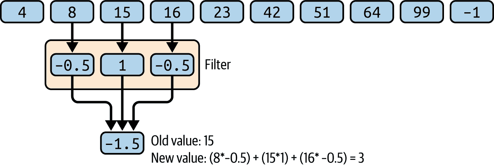
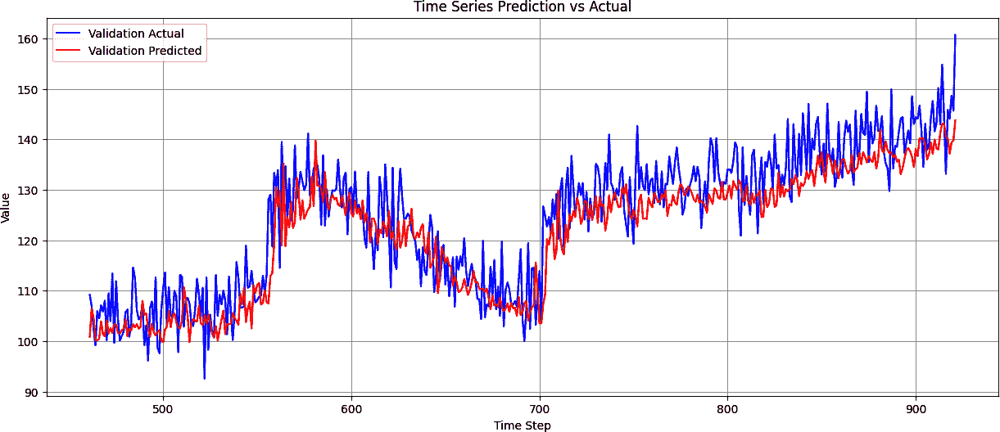
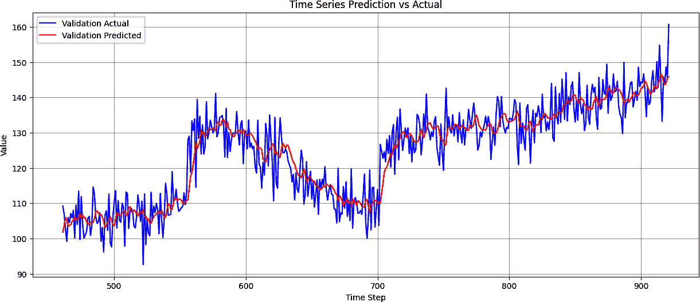
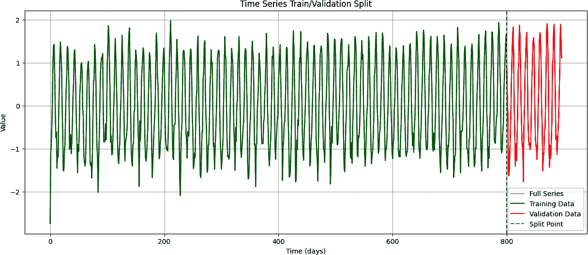
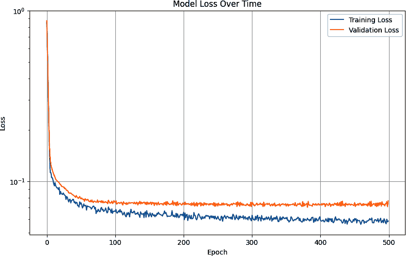
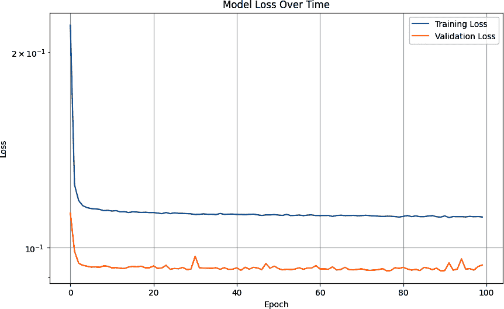
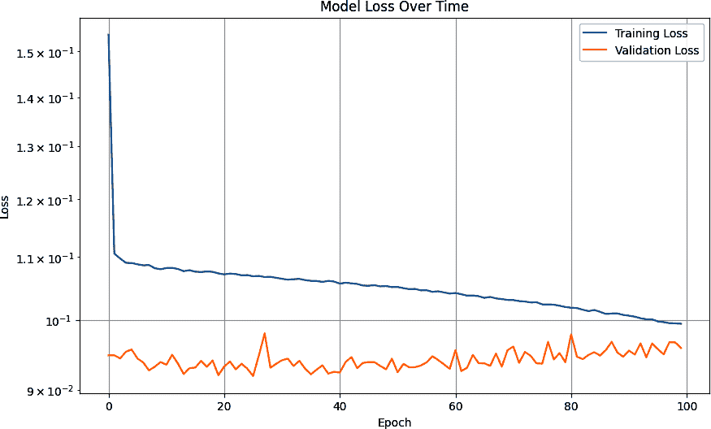
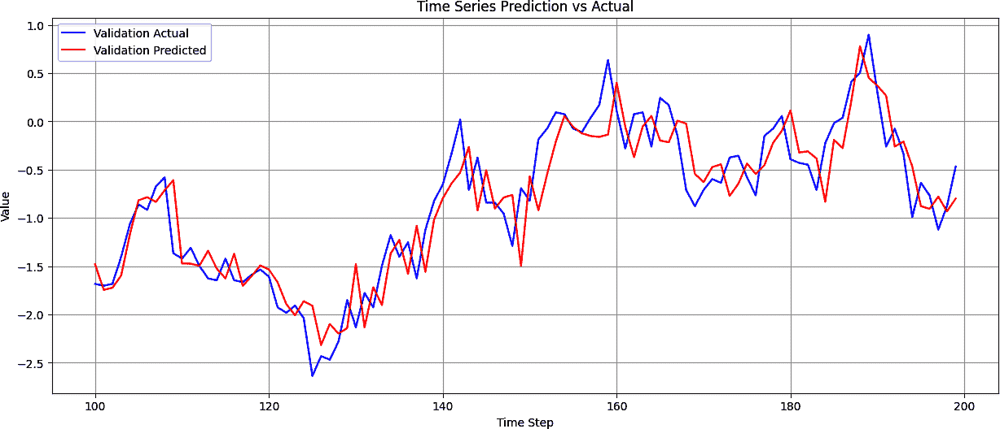

# 第十一章\. 使用卷积和循环方法对序列模型进行处理

前几章向您介绍了序列数据。您了解了如何预测它，首先是通过使用统计方法，然后是通过使用基本的机器学习方法和深度神经网络。您还探讨了如何调整模型的超参数以获得更好的性能。

在本章中，您将了解一些可能进一步增强您使用卷积神经网络以及循环神经网络预测序列数据能力的额外技术。

# 序列数据的卷积

在第三章中，您被介绍到一种卷积，其中二维（2D）滤波器在图像上通过以修改它并可能提取特征。随着时间的推移，神经网络学会了哪些滤波器值在匹配对像素所做的修改及其标签方面是有效的，从而有效地从图像中提取特征。相同的技巧可以应用于数值时间序列数据，但有一个修改：卷积将是一维（1D）而不是二维。

例如，考虑图 11-1 中的数字序列。


###### 图 11-1\. 一系列数字

一维卷积可以按以下方式操作。考虑一个 1 × 3 的滤波器，滤波器值分别为-0.5、1 和-0.5。在这种情况下，序列中的第一个值将丢失，第二个值将从 8 转换为-1.5（见图 11-2）。


###### 图 11-2\. 使用数字序列进行卷积

然后滤波器将跨过这些值，在移动过程中计算新的值。例如，在下一个步长中，15 将转换为 3（见图 11-3）。



###### 图 11-3\. 1D 卷积的额外步长

使用这种方法，可以提取值之间的模式并学习成功提取它们的滤波器，这与在图像像素上进行的卷积提取特征的方式非常相似。在这种情况下，没有标签，但可以学习最小化总体损失的卷积。

## 编写卷积

在编写卷积代码之前，您需要使用*滑动窗口*技术来创建数据集，如第十章中所示。代码可在本书的 GitHub 页面[上找到](https://oreil.ly/pytorch_ch11)。

一旦有了这个数据集，您可以在之前使用的密集层之前添加一个卷积层。以下是代码，我们将逐行查看：

```py
class CNN1D(nn.Module):
    def __init__(self, input_size):
        super(CNN1D, self).__init__()
        self.conv1 = nn.Conv1d(in_channels=1,
                              out_channels=128,
                              kernel_size=3,
                              padding=1)

        conv_output_size = input_size  # Same padding maintains input size

        self.relu = nn.ReLU()
        self.flatten = nn.Flatten()
        self.dense1 = nn.Linear(128 * conv_output_size, 28)
        self.dense2 = nn.Linear(28, 10)
        self.dense3 = nn.Linear(10, 1)

    def forward(self, x):
        # Transpose input from [batch_size, sequence_length] 
        # to [batch_size, 1, sequence_length]
        if len(x.shape) == 2:
            x = x.unsqueeze(1)
        elif len(x.shape) == 3 and x.shape[1] != 1:
            x = x.transpose(1, 2)

        x = self.relu(self.conv1(x))
        x = self.flatten(x)
        x = self.relu(self.dense1(x))
        x = self.relu(self.dense2(x))
        x = self.dense3(x)
        return x
```

首先，注意定义 1D 卷积层的新行：

```py
        self.conv1 = nn.Conv1d(in_channels=1,
                              out_channels=128,
                              kernel_size=3,
                              padding=1)
```

`in_channels` 参数定义了输入数据的维度。由于我们有一个包含每个数据点单个值的单个数字序列，这是`1`。如果我们每一步使用多个特征，例如可能是 RGB 颜色值，这将会是`3`。

`out_channels` 参数是网络将学习的过滤器（也称为卷积）的数量。

`kernel_size` 参数决定了卷积的大小（即卷积将过滤的数据点的数量）。请参考图 11-2 和图 11-3，你会在那里看到一个卷积，其核大小为 3。

`padding` 参数会在你的数据列表的开始和末尾添加元素。例如，图 11-1 中的数字列表是[4 8 15 16 23 42 51 64 99 –1]。当核大小为 3 的过滤器查看这个列表时，它从[4 8 15]开始，*4*永远不会成为“中间”的数字。过滤器实际上忽略了列表的开始和结束处的数字。使用填充，将在列表的前后添加一个 0，使其变为[0 4 8 15 16 23 42 51 64 99 –1 0]，你现在可以看到过滤器首先会查看[0 4 8]。

接下来，我们看到一行看起来像这样：

```py
conv_output_size = input_size  # Same padding maintains input size
```

这有助于我们知道卷积层输出的尺寸，以便通知序列中的“下一层”。

你可能会想知道为什么是输入大小。这是从设置`padding=1`参数而来的“same padding”概念。

如果你考虑如果将一个大小为 3 的核在如图 11-2 和 11-3 所示的值列表上滑动会发生什么，你会看到一个奇怪的效果。因为核的左侧与列表的第一个值对齐，其中心在第二个值上，并且因为它滑到列表的末尾，核的中心将对齐到倒数第二个值，所以与列表中的值的计算结果将给我们 n – 2 个答案，其中*n*是列表的长度。但是，如果我们用`padding=1`填充列表，那么核在列表上滑动将给我们*n*个答案，因此层的输出大小将与输入大小相同。

因此，现在，在 ReLU 和展平结果之后，我们可以看到下一行：

```py
        self.dense1 = nn.Linear(128 * conv_output_size, 28)

```

这个输入将是一系列值：列表的大小乘以 128，其中 128 是核的数量。然后它将输出 28 个值，这些值将被输入到下一个线性层。

现在，当你到达前向函数时，它从这一行开始：

```py
        if len(x.shape) == 2:
            x = x.unsqueeze(1)
        elif len(x.shape) == 3 and x.shape[1] != 1:
            x = x.transpose(1, 2)
```

这看起来相当不寻常，但这是处理卷积所必需的。首先，考虑卷积的输入应该是什么样子。将有批次的它们被输入，每个批次将有一个维度，批次中的每个项目将包含一定数量的项。如果我们正在从 20 个项目的序列中学习，例如，如果我们一次批量处理 32 个，那么输入到神经网络的维度将是[32, 1, 20]。

但如果我们的数据集没有给我们这个——例如，如果只有两个维度[32, 20]——那么我们想要使用 unsqueeze 来插入另一个维度。当我们向其中传递一个`1`时，它将被放置在位置`1`，因此我们将得到所需的[32, 1, 20]。

另一种情况可能是如果我们没有正确放置我们的维度并在末尾添加它，比如在[32, 20, 1]中，那么`x = x.transpose(1, 2)`将翻转这些维度并再次使维度变为[32, 1, 20]。

现在，这是我为它们硬编码的两个特定案例。你可能还会遇到其他情况，所以当将数据输入神经网络时，请注意数据可能出现的问题。这可能是你可以修复它们的地方。

前向传播的其余部分相当直接；它只是将数据通过不同的层。

损失函数和优化器也将相当直接，使用均方误差损失和 Adam 优化器：

```py
criterion = nn.MSELoss()
optimizer = optim.Adam(model.parameters(), lr=learning_rate)
```

使用这个进行训练将给出与之前相同的模型，要从模型中获取预测，你可以像训练模型时一样使用相同的加载器。例如，你可以这样做：

```py
# Create DataLoaders
batch_size = 32
train_loader = DataLoader(train_dataset, batch_size=batch_size, 
                          shuffle=True)
val_loader = DataLoader(val_dataset, batch_size=batch_size, shuffle=False)
```

这里有一个辅助函数可以逐批预测整个序列：

```py
def predict(model, loader):
    device = torch.device("cuda" if torch.cuda.is_available() else "cpu")
    model.eval()
    predictions = []

    with torch.no_grad():
        for inputs, _ in loader:
            inputs = inputs.to(device)
            batch_predictions = model(inputs)
            predictions.append(batch_predictions.cpu().numpy())

    return np.concatenate(predictions)

```

你可以像这样获取完整的预测集：

```py
# Make predictions
train_predictions = predict(model, train_loader)
val_predictions = predict(model, val_loader)
```

同样，如果你想绘制它们，可以在此基础上扩展一点，传入一个加载器，并获取预测和目标以及分析，如 MAE：

```py
def evaluate_predictions(model, loader):
    """Generate predictions and calculate metrics"""
    model.eval()
    device = torch.device("cuda" if torch.cuda.is_available() else "cpu")

    all_predictions = []
    all_targets = []

    with torch.no_grad():
        for inputs, targets in loader:
            inputs = inputs.to(device)
            outputs = model(inputs)
            all_predictions.extend(outputs.cpu().numpy())
            all_targets.extend(targets.cpu().numpy())

    predictions = np.array(all_predictions)
    targets = np.array(all_targets)

    # Calculate metrics
    mae = mean_absolute_error(targets, predictions)

    return predictions, targets, mae
```

然后，你会调用这个来获取多个响应，如下所示：

```py
# Generate predictions
val_predictions, val_targets, val_mae 
             = evaluate_predictions(model, val_loader)
```

现在绘制它既简单又容易：

```py
def plot_predictions(val_pred, val_true):
    """Plot the predictions against actual values"""
    plt.figure(figsize=(15, 6))
    # Plot validation data
    offset = len(val_true)
    plt.plot(range(offset, offset + len(val_true)), 
                   val_true, 'b-', label='Validation Actual')
    plt.plot(range(offset, offset + len(val_pred)), 
                   val_pred, 'r-', label='Validation Predicted')
    plt.title('Time Series Prediction vs Actual')
    plt.xlabel('Time Step')
    plt.ylabel('Value')
    plt.legend()
    plt.grid(True)
    plt.show()
```

结果与序列的对比图在图 11-4 中。

在这种情况下，MAE 为 5.33，略低于前一次预测。这可能是因为我们没有适当地调整卷积层，或者可能是卷积本身没有帮助。这是你需要对你自己的数据进行实验的类型。

请注意，这个数据中有一个随机元素，所以值会在会话之间变化。如果你使用第十章中的代码然后单独运行此代码，你当然会看到数据以及你的 MAE 受到随机波动的影响。



###### 图 11-4\. 基于时间序列数据的卷积神经网络预测与实际值

但在使用卷积时，总是会有问题。为什么选择我们选择的参数？为什么是 128 个过滤器？为什么是 3 × 1 的大小？好消息是你可以轻松地实验这些事情来探索不同的结果。

## 尝试 Conv1D 超参数

在上一节中，你看到了一个硬编码了参数（如过滤器数量、内核大小、步长数量等）的 1D 卷积。当你用这个参数训练神经网络时，MAE 略有上升，所以你没有从使用`Conv1D`中获得任何好处。这并不总是这种情况，这取决于你的数据，但可能是由于次优的超参数。所以，在本节中，你将看到如何进行神经架构搜索以找到最佳结果。

PyTorch 在定义神经网络和正向传递方面非常详尽，特别是这一点，使得更改你使用的参数变得相当直接。神经架构搜索的思路是提出一组不同的参数来尝试，然后通过短时间训练并找到那些能给出最佳结果的方法来探索它们对结果的影响。

例如，在这里，我们使用了一个单一的`Conv1D`层。但如果更多呢？同样，我们硬编码了通道数和内核大小，我们也硬编码了密集层的大小和优化器的 LR。但如果，我们不是硬编码它们，而是创建一组像这样的选项呢？

```py
# Define the search space
num_conv_layers_options = [1, 2]  # Reduced for initial testing
conv_channels_options = [
    [32],
    [64],
    [32, 16],
    [64, 32],
]
kernel_sizes = [3, 5]
dense_sizes_options = [
    [16],
    [32, 16],
    [64, 32],
]
learning_rates = [0.001, 0.0001]
```

对于`conv`层有 4 个选项，对于内核大小有 2 个选项，对于密集维度有 3 个选项，对于 LR 有 2 个选项，我们总共有 4 × 2 × 3 × 2 个选项，即 48 种组合。这被称为*搜索空间*。

注意，在这种情况下，你可能认为应该是 96，因为有 2 个层选项和 4 个通道选项。但在定义搜索空间的代码中，你将看到，我只允许与层数匹配的`conv`通道选项，所以`conv`层总共有 4 个选项。

这些选项将被加载到一个配置数组中，为参数设置名称-值对，如下所示：

```py
# Generate valid configurations
configurations = []
for num_conv_layers in num_conv_layers_options:
    for channels in conv_channels_options:
        # Only use channel configs that match layer count
        if len(channels) == num_conv_layers:  
            for kernel_size in kernel_sizes:
                for dense_sizes in dense_sizes_options:
                    for lr in learning_rates:
                        configurations.append({
                            'num_conv_layers': num_conv_layers,
                            'conv_channels': channels,
                            'kernel_size': kernel_size,
                            'dense_sizes': dense_sizes,
                            'learning_rate': lr
                        })
```

因此现在，我们可以遍历这些配置，并使用它们来设置我们的`CNN1D`模型，如下所示。注意`config[]`数组的使用：

```py
for idx, config in enumerate(configurations):
    print(f"\nTrying configuration {idx + 1}/{len(configurations)}:")
    print(config)

    try:
        model = CNN1D(
            input_size=input_size,
            num_conv_layers=config['num_conv_layers'],
            conv_channels=config['conv_channels'],
            kernel_size=config['kernel_size'],
            dense_sizes=config['dense_sizes']
        ).to(device)

        criterion = nn.MSELoss()
        optimizer = torch.optim.Adam(model.parameters(), 
                                     lr=config['learning_rate'])
```

训练 48 种组合的完整集数（比如 100 个 epoch）将非常耗时，所以我们引入了*早期停止*的概念。首先，让我们用从配置中加载的参数和新的参数`early stopping patience`来训练模型：

```py
trained_model, val_loss = train_model(
    model, train_loader, val_loader, criterion, optimizer,
    epochs=100, device=device, early_stopping_patience=10
)
```

然后，在训练循环中，我们可以实现一个早期停止，如下所示：

```py
# Early stopping check
if val_loss < best_val_loss:
    best_val_loss = val_loss
    best_model = deepcopy(model)
    patience_counter = 0
else:
    patience_counter += 1

if patience_counter >= early_stopping_patience:
    print(f'Early stopping triggered after {epoch} epochs')
    break
```

这跟踪了最佳模型的损失，并将当前模型与最佳模型进行比较。如果当前模型“输”的次数比我们的耐心参数（在这种情况下，10）多，那么我们将丢弃它并移动到下一个。如果它“赢”，那么我们将保持当前模型作为最佳模型。

从这段代码开始，你可以尝试调整过滤器的数量、核的大小和步长的大小等超参数，同时保持其他参数不变。

经过一些实验，我发现使用 2 个卷积层，分别有 64 和 32 个过滤器（分别），核大小为 5，两个 64 和 32 的密集层，以及学习率 LR 为.0001，在验证集上给出了最佳的 MAE，最终结果为 4.4439 MAE。

经过这次训练后，模型与之前创建的朴素 CNN 和原始 DNN 相比，准确率有所提高，结果如图 11-5 所示（#ch11_figure_5_1748549734749203）。



###### 图 11-5. 优化的 CNN 时间序列预测与实际值

进一步实验 CNN 超参数可能可以进一步提高性能。

除了卷积之外，我们在关于 NLP 和 RNNs（包括 LSTMs）的章节中探索的技术，在处理序列数据时可能非常强大。由于它们的本质，RNNs 被设计用来保持上下文，因此前面的值可以影响后面的值。你将探索使用 RNNs 进行序列建模。但首先，让我们从合成数据集转向真实数据。在这种情况下，我们将考虑天气数据。

# 使用 NASA 天气数据

一个关于时间序列天气数据的好资源是[NASA 戈达德太空研究所（GISS）地表温度分析](https://oreil.ly/6IixP)。如果你点击页面右侧的[站数据链接](https://oreil.ly/F9Hmw)，你可以选择一个气象站来获取数据。例如，我选择了西雅图塔科马（SeaTac）机场，并被带到了图 11-6 所示的页面。


###### 图 11-6. GISS 的地表温度数据

你也可以在页面底部看到下载月度数据的 CSV 链接。如果你选择此链接，一个名为*station.csv*的文件将被下载到你的设备上，如果你打开它，你会看到它是一个数据网格，每年一行，每月一列（见图 11-7）。


###### 图 11-7. 探索数据

由于这是 CSV 数据，在 Python 中处理起来相当容易，但就像任何数据集一样，请注意其格式。在读取 CSV 时，你通常会逐行读取，并且通常每行有一个你感兴趣的数据点。在这种情况下，每行至少有 12 个感兴趣的数据点，因此在读取数据时你必须考虑这一点。

## 在 Python 中读取 GISS 数据

读取 GISS 数据的代码如下所示：

```py
def get_data():
    data_file = "station.csv"
    f = open(data_file)
    data = f.read()
    f.close()
    lines = data.split('\n')
    header = lines[0].split(',')
    lines = lines[1:]
    temperatures=[]
    for line in lines:
        if line:
            linedata = line.split(',')
            linedata = linedata[1:13]
            for item in linedata:
                if item:
                    temperatures.append(float(item))

    series = np.asarray(temperatures)
    time = np.arange(len(temperatures), dtype="float32")
    return time, series
```

这将打开指定路径的文件（当然，你的路径会有所不同）并将整个文件作为由换行符（`\n`）分隔的行集读取。然后，它将遍历每一行，忽略第一行，并将它们按逗号分隔符拆分到一个名为`linedata`的新数组中。这个数组中的第 1 到 13 项将表示 1 月到 2 月的值，作为字符串，然后这些值将被转换为浮点数并添加到名为`temperatures`的数组中。一旦完成，它将被转换为一个名为`series`的 NumPy 数组，并创建另一个与`series`大小相同的 NumPy 数组`time`。由于它是使用`np.arange`创建的，第一个元素将是 1，第二个将是 2，依此类推。因此，这个函数将以从 1 到数据点数量的步骤返回`time`，并以该时间的数据返回`series`。

我注意到，在有些列中经常会出现“未填写”的数据，这些数据用值 999.9 来表示。这当然会歪曲你想要创建的任何预测结果。但幸运的是，999.9 的值通常位于数据集的**末尾**，因此它们可以很容易地被裁剪。这里有一个辅助函数，可以在裁剪掉 999.9 值的同时对序列进行归一化：

```py
import numpy as np

def normalize_series(data, missing_value=999.9):
    # Convert to numpy array if not already
    data = np.array(data, dtype=np.float64)

    # Create mask for valid values (not NaN and not missing_value)
    valid_mask = (data != missing_value) & (~np.isnan(data))

    # Keep only valid values
    clean_data = data[valid_mask]

    # Normalize using only valid values
    mean = np.mean(clean_data)
    std = np.std(clean_data)
    normalized = (clean_data - mean) / std

    return normalized

time, series = get_data()
series_normalized = normalize_series(series)
```

现在，你可以将其加载到`torch.tensor`中，并将其转换为具有目标值的滑动窗口集，就像之前讨论的那样。我们已经在第十章中讨论了辅助函数：

```py
series_tensor = torch.tensor(series_normalized, dtype=torch.float32)
window_size = 48
features, targets = create_sliding_windows_with_target(series_tensor, 
                    window_size=window_size, shift=1)
```

一旦我们有了这些，我们就可以将其转换为`TensorDataset`，并将其拆分为用于训练和验证的子集：

```py
split_location = 800
# Create the full dataset
full_dataset = TensorDataset(features, targets)

# Calculate split indices
# Note: Since we're using windows, we need to account for the overlap
train_size = 800 - window_size + 1  # Adjust for window overlap
total_windows = len(full_dataset)
train_indices = list(range(train_size))
val_indices = list(range(train_size, total_windows))

# Create training and validation datasets using Subset
train_dataset = Subset(full_dataset, train_indices)
val_dataset = Subset(full_dataset, val_indices)
```

现在我们有了作为数据集的拆分，我们可以为它们创建加载器，神经网络将使用这些加载器：

```py
batch_size = 32
train_loader = DataLoader(train_dataset, batch_size=batch_size, 
                          shuffle=True)
val_loader = DataLoader(val_dataset, batch_size=batch_size, shuffle=False)
```

现在，我们准备好使用这些数据进行训练。我们可以通过图表检查拆分，并且我们可以通过图 11-8 中的训练/验证拆分来看到这一点。



###### 图 11-8. 时间序列训练/验证拆分

在下一节中，我们将探索创建一个简单的基于 RNN 的神经网络，看看我们是否可以预测序列中的下一个值。

# 使用 RNN 进行序列建模

现在你已经将 NASA CSV 数据从窗口数据集中提取出来，创建一个用于训练预测器的模型相对容易。（然而，训练一个**好的**模型要困难一些！）让我们从一个简单的、基于 RNN 的模型开始。以下是代码：

```py
class SimpleRNNModel(nn.Module):
    def __init__(self, input_size=1, hidden_size=100, 
                       output_size=1, dropout_rate=0.3):
        super(SimpleRNNModel, self).__init__()

        self.rnn1 = nn.RNN(input_size=input_size,
                          hidden_size=hidden_size,
                          batch_first=True,
                          dropout=dropout_rate)  # Add dropout to RNN

        self.rnn2 = nn.RNN(input_size=hidden_size,
                          hidden_size=hidden_size,
                          batch_first=True,
                          dropout=dropout_rate)  # Add dropout to RNN

        self.dropout = nn.Dropout(dropout_rate)  # Additional dropout layer
        self.linear = nn.Linear(hidden_size, output_size)

    def forward(self, x):
        out1, _ = self.rnn1(x)
        out2, _ = self.rnn2(out1)
        last_out = out2[:, –1, :]
        last_out = self.dropout(last_out)  # Add dropout before final layer
        output = self.linear(last_out)
        return output
```

在这种情况下，如您所见，我们使用了一个基本的 RNN。RNN 是一类神经网络，对于探索序列模型非常强大，您第一次在 第七章 中看到它们，当时您正在研究自然语言处理。这里我不会详细介绍它们是如何工作的，但如果您对此感兴趣并且跳过了那一章，现在可以回头看看。值得注意的是，RNN 有一个内部循环，它遍历序列的时间步长，同时保持到目前为止看到的时间步长的内部状态。

在训练过程中，您可以使用这样的损失函数和优化器：

```py
criterion = nn.MSELoss()
optimizer = torch.optim.Adam(model.parameters(), lr=learning_rate)
```

完整的代码可以在本书的 [GitHub 仓库](https://oreil.ly/pytorch_ch11) 中找到。即使训练一百轮也足以了解模型如何预测值。图 11-9 展示了结果。


###### 图 11-9\. SimpleRNN 时间序列预测结果与实际值对比

如您所见，结果相当不错。在峰值和模式意外变化时（如时间步长 160-170），可能有些偏差，但总体来说，并不差。现在，让我们看看如果我们训练它 1,500 轮会发生什么（参见 图 11-10）。


###### 图 11-10\. 经过 1,500 轮训练的 RNN 时间序列预测与实际值对比

没有太大的区别，只是一些峰值被平滑了。如果您查看验证集和训练集上的损失历史，看起来像 图 11-11。



###### 图 11-11\. SimpleRNN 随时间变化的训练和验证模型损失

如您所见，训练损失和验证损失之间存在良好的匹配，但随着训练轮数的增加，模型开始对训练集产生过拟合。可能更好的轮数是大约五百轮。

这种情况的一个原因可能是数据本身是月度气象数据，具有很强的季节性。另一个原因是训练集非常大，而验证集相对较小。

接下来，我们将探索使用更大的气候数据集。

## 探索更大的数据集

[KNMI 气候探索器](https://oreil.ly/J8CP0) 允许您探索来自世界各地许多地点的细粒度气候数据。[我下载了一个数据集](https://oreil.ly/Ci9DI)，它包含从 1772 年到 2020 年英格兰中心的每日温度读数。这些数据结构与 GISS 数据不同，日期以字符串形式出现，后面跟着若干空格，然后是读数。回到 第四章 检查处理和管理大数据集的详细信息。

我已经准备好了数据，去除了标题并移除了多余的空格，这样日期和读数之间就只有一个空格。这样，使用像这样的代码就很容易阅读：

```py
import numpy as np
def get_data():
    data_file = "tdaily_cet.dat.txt"
    f = open(data_file)
    data = f.read()
    f.close()
    lines = data.split('\n')
    temperatures=[]
    for line in lines:
        if line:
            linedata = line.split(' ')
            temperatures.append(float(linedata[1]))

    series = np.asarray(temperatures)
    time = np.arange(len(temperatures), dtype="float32")
    return time, series

```

这个数据集包含 91,502 个数据点，所以在训练你的模型之前，务必适当地分割它。我使用了 80,000 个时间点的分割，留下 10,663 条记录用于验证：

```py
split_location = 80000

features = features.unsqueeze(1)
# Create the full dataset
full_dataset = TensorDataset(features, targets)

# Calculate split indices
# Note: Since we're using windows, we need to account for the overlap
train_size = split_location - window_size + 1  # Adjust for window overlap
total_windows = len(full_dataset)
train_indices = list(range(train_size))
val_indices = list(range(train_size, total_windows))

# Create training and validation datasets using Subset
train_dataset = Subset(full_dataset, train_indices)
val_dataset = Subset(full_dataset, val_indices)

```

所有的其他内容都可以保持不变。正如你在图 11-12 中看到的那样，经过一百个 epoch 的训练后，预测值与验证集的对比图看起来相当不错。


###### 图 11-12。预测值与实际数据的对比图

这里有大量的数据，所以让我们放大查看最后一百天的数据（见图 11-13）。


###### 图 11-13。针对一百天数据的时间序列预测与实际值对比结果

虽然图表总体上遵循数据的曲线，并且大致正确地捕捉到了趋势，但它与实际数据相差甚远，尤其是在极端端点，因此还有改进的空间。

还重要的是要记住，我们已对数据进行归一化，因此虽然我们的损失和 MAE 看起来很低，但这是因为它们是基于归一化值的损失和 MAE，这些值的方差远低于实际值。正如图 11-14 所示，微小的损失可能会让你产生错误的安心感。



###### 图 11-14。大型数据集的训练和验证模型损失随时间的变化

要反归一化数据，你可以进行归一化的逆操作：首先乘以标准差，然后加上均值。到那时，如果你愿意，你可以像之前那样计算预测集的真实 MAE。

# 使用其他循环方法

除了`RNN`之外，PyTorch 还有其他循环层类型，如门控循环单元（GRUs）和长短期记忆层（LSTMs），这些我们在第七章中讨论过。如果你想要实验，直接插入这些 RNN 类型相对简单。

例如，如果你考虑的是之前创建的简单、直观的 RNN，用`nn.GRU`替换它就像使用内联代码一样简单：

```py
class SimpleRNNModel(nn.Module):
    def __init__(self, input_size=1, hidden_size=100, 
                       output_size=1, dropout_rate=0.3):
        super(SimpleRNNModel, self).__init__()

        self.rnn1 = nn.GRU(input_size=input_size,
                          hidden_size=hidden_size,
                          batch_first=True,
                          dropout=dropout_rate)  

        self.rnn2 = nn.GRU(input_size=hidden_size,
                          hidden_size=hidden_size,
                          batch_first=True,
                          dropout=dropout_rate)  

        self.dropout = nn.Dropout(dropout_rate)  
        self.linear = nn.Linear(hidden_size, output_size)

```

使用 LSTM，情况类似：

```py
# LSTM Optional Architecture
import torch.nn as nn

class SimpleLSTMModel(nn.Module):
    def __init__(self, input_size=1, hidden_size=100, 
                       output_size=1, dropout_rate=0.3):
        super(SimpleLSTMModel, self).__init__()

        self.lstm1 = nn.LSTM(input_size=input_size,
                            hidden_size=hidden_size,
                            batch_first=True,
                            dropout=dropout_rate)  # Add dropout to LSTM

        self.lstm2 = nn.LSTM(input_size=hidden_size,
                            hidden_size=hidden_size,
                            batch_first=True,
                            dropout=dropout_rate)  # Add dropout to LSTM

        # Add more layers before final output
        self.fc1 = nn.Linear(hidden_size, hidden_size)
        self.relu = nn.ReLU()
        self.linear = nn.Linear(hidden_size, output_size)

    def forward(self, x):
        out1, _ = self.lstm1(x)  # LSTM returns (output, (h_n, c_n))
        out2, _ = self.lstm2(out1) # We ignore both hidden and cell states with _
        last_out = out2[:, –1, :]
        output = self.linear(last_out)
        return output

```

值得尝试这些层类型以及不同的超参数、损失函数和优化器。没有一种适合所有情况的解决方案，所以任何特定情况下最适合你的方法将取决于你的数据和预测这些数据时的需求。

# 使用 Dropout

如果你遇到模型过拟合的情况，即训练数据的 MAE 或损失比验证数据好得多，你可以使用 dropout。如前几章所述，使用 dropout 时，在训练过程中会随机丢弃（忽略）相邻的神经元，以避免熟悉度偏差。当你使用 RNN 时，还有一个可用的 *循环 dropout* 参数。

有什么区别？回想一下，当使用 RNN 时，你通常有一个输入值，神经元计算一个输出值和一个传递到下一个时间步的值。Dropout 会随机丢弃输入值，而循环 dropout 会随机丢弃传递到下一个步骤的循环值。

例如，考虑 图 11-15 中显示的基本 RNN 架构。


###### 图 11-15\. 一个循环神经网络

在这里，你可以看到不同时间步长中层的输入 (*x*)。当前时间是 *t*，显示的步骤是 *t* – 2 到 *t* + 1。同一时间步长的相关输出 (*y*) 也显示出来，不同时间步长之间传递的循环值由虚线和标签 *r* 表示。

使用 *dropout* 会随机丢弃 *x* 输入，而使用 *循环 dropout* 会随机丢弃传递到下一个步骤的 *r* 循环值。

你可以从 Yarin Gal 和 Zoubin Ghahramani 的论文 [“A Theoretically Grounded Application of Dropout in Recurrent Neural Networks”](https://oreil.ly/MqqRR) 中更深入地了解循环 dropout 的工作原理。当使用循环 dropout 时，还有另一件事需要考虑，Gal 在其关于 [深度学习中的不确定性](https://oreil.ly/3v8IB) 的研究中讨论了这一点，他证明了在每个时间步长应该应用相同的 dropout 单元模式，并且在每个时间步长也应该应用一个类似的常数 dropout 掩码。

要添加 dropout 和循环 dropout，你需要在你的层上使用相关参数。例如，将它们添加到之前提到的基本 GRU 中，就像在循环层中使用一个参数并在 RNN 和线性层之间添加另一个层一样简单：

```py
class SimpleRNNModel(nn.Module):
    def __init__(self, input_size=1, hidden_size=100, 
                       output_size=1, dropout_rate=0.1):
        super(SimpleRNNModel, self).__init__()

        self.rnn1 = nn.GRU(input_size=input_size,
                          hidden_size=hidden_size,
                          batch_first=True,
                          `dropout``=``dropout_rate``)`  

        self.rnn2 = nn.GRU(input_size=hidden_size,
                          hidden_size=hidden_size,
                          batch_first=True,
                          `dropout``=``dropout_rate``)`  

        self.dropout = nn.Dropout(dropout_rate)  
        self.linear = nn.Linear(hidden_size, output_size)
```

每个参数都取一个介于 0 和 1 之间的值，表示要丢弃的值的比例。例如，0.1 的值将丢弃所需值的 10%。

使用这种 dropout 训练模型会显示出更陡峭的学习曲线，在 100 个周期时仍然呈下降趋势。验证结果相当平稳，表明可能需要更大的验证集。它也非常嘈杂，使用 dropout 时你经常会看到这样的损失噪声。这是一个迹象，表明你可能需要调整 dropout 的数量以及损失函数和优化器的参数，例如学习率 LR。你可以在 图 11-16 中看到这一点。



###### 图 11-16\. 使用带有 dropout 的 GRU 随时间变化的训练和验证损失

正如你在本章中看到的，使用神经网络预测时间序列数据是一个困难的任务，但调整它们的超参数可以是一种强大的方法来改进你的模型及其随后的预测。

# 使用双向 RNN

在对序列进行分类时，另一个要考虑的技术是使用双向训练。一开始这可能看起来有些反直觉，因为你可能会想知道未来的值如何影响过去的值。但回想一下，时间序列值可能包含季节性，即值随时间重复，而当使用神经网络进行预测时，我们只是在进行复杂的模式匹配。鉴于数据重复，数据可以重复的信号可能存在于未来的值中——当使用双向训练时，我们可以训练网络尝试从时间 *t* 到时间 *t* + *x* 以及从时间 *t* + *x* 到时间 *t* 的模式。

幸运的是，编写这个代码很简单。例如，考虑上一节中的 GRU。为了使其双向，你只需添加一个`bidirectional`参数。这将有效地在每一步训练两次——一次是按原始顺序的序列数据，一次是按相反顺序的数据。然后结果在进入下一步之前被合并。

这里有一个例子：

```py
class BidirectionalGRUModel(nn.Module):
    def __init__(self, input_size=1, hidden_size=100, 
                       output_size=1, dropout_rate=0.1):
        super(BidirectionalGRUModel, self).__init__()

        self.gru1 = nn.GRU(input_size=input_size,
                          hidden_size=hidden_size,
                          batch_first=True,
                          dropout=dropout_rate,
                          bidirectional=True)

        self.gru2 = nn.GRU(input_size=hidden_size * 2,
                          hidden_size=hidden_size,
                          batch_first=True,
                          dropout=dropout_rate,
                          bidirectional=True)

        # Additional layers
        self.fc1 = nn.Linear(hidden_size * 2, hidden_size)
        self.relu = nn.ReLU()
        self.dropout = nn.Dropout(dropout_rate)
        self.linear = nn.Linear(hidden_size, output_size)

    def forward(self, x):
        out1, _ = self.gru1(x)
        out2, _ = self.gru2(out1)
        last_out = out2[:, –1, :]

        # Additional processing
        x = self.fc1(last_out)
        x = self.relu(x)
        x = self.dropout(x)
        output = self.linear(x)
        return output

```

在时间序列上使用带有 dropout 的双向 GRU 的训练结果如图 11-17 所示。图 11-17。虽然平均绝对误差（MAE）略有改善，但更大的影响是预测曲线与单方向版本相比失去了“滞后”。

此外，调整训练参数——特别是`window_size`，以获取多个季节——可以产生相当大的影响。



###### 图 11-17\. 使用双向 GRU 进行时间序列预测训练

如你所见，你可以尝试不同的网络架构和不同的超参数来改善你的整体预测。理想的选择很大程度上取决于数据，所以本章中你学到的技能将帮助你处理特定的数据集！

# 摘要

在本章中，你探索了不同的网络类型来构建预测时间序列数据的模型。你基于第十章中的简单 DNN（第十章），添加了卷积，并尝试了诸如简单 RNN、GRU 和 LSTM 等循环网络类型。你还学习了如何调整超参数和网络架构以提高模型的准确性，并练习了使用一些真实世界的数据集，包括一个包含数百年温度读数的巨大数据集。

现在，你已经准备好开始为各种数据集构建网络，并且你对优化它们所需了解的内容有了很好的理解！
