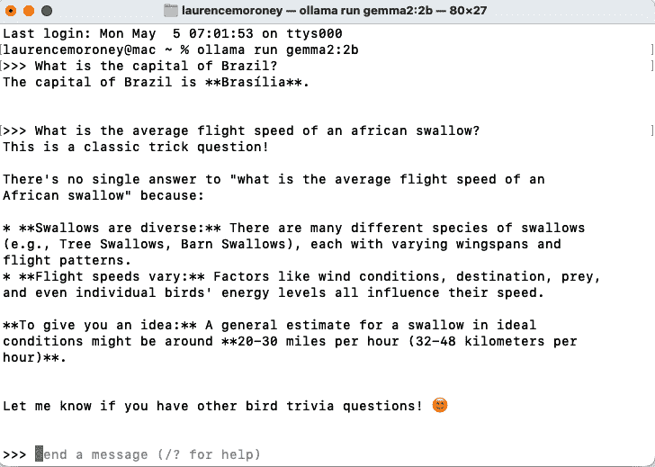
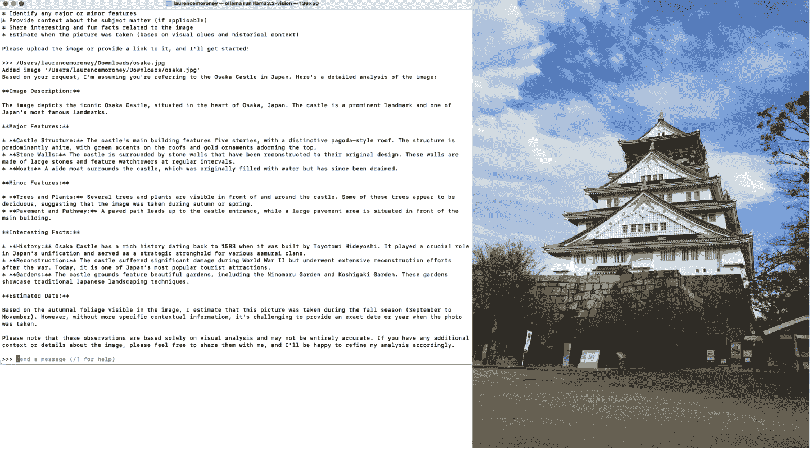
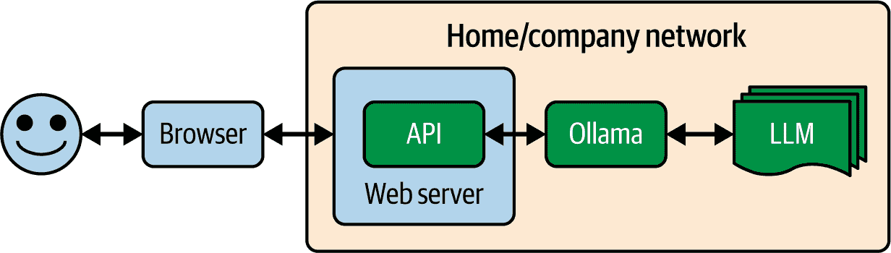
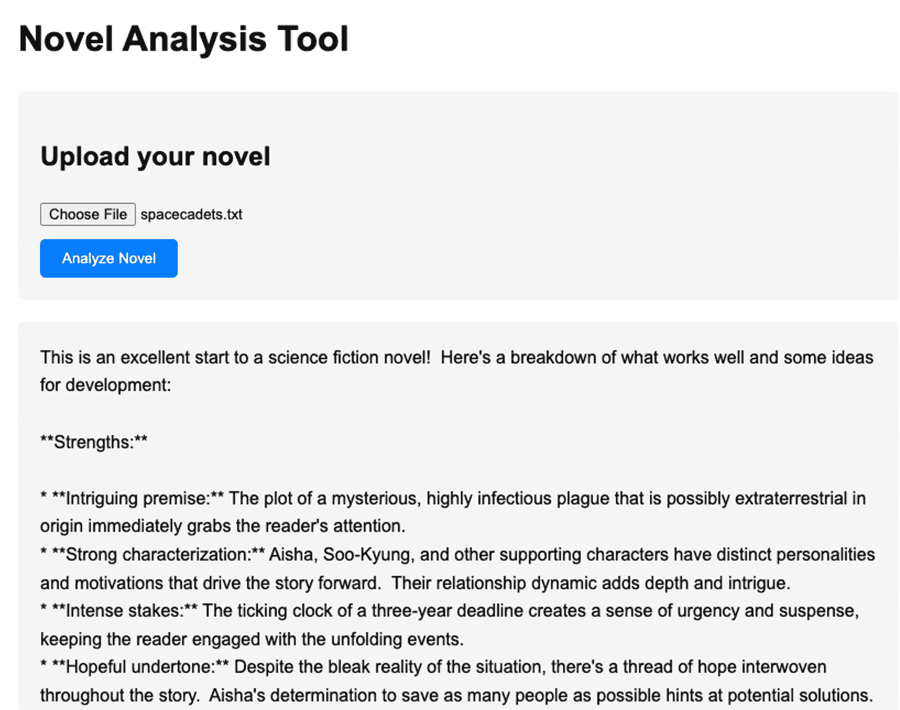

# 第十七章\. 使用 Ollama 提供 LLM 服务

我们已经探讨了如何使用 transformers 下载模型并构建一个简单的管道，让你可以使用它进行推理或微调。然而，如果我不向你展示开源的 Ollama 项目，那就太遗憾了，该项目通过为你提供一个环境，让你可以围绕 LLM 提供完整的包装，你可以在终端中与之聊天，或者将其用作服务器，你可以通过 HTTP POST 发送请求并读取输出。

像 Ollama 这样的技术将成为下一代 LLM 的先锋，这将让你在数据中心内部拥有专用服务器或在计算机上拥有专用进程。这将使它们对你来说完全私密。

在其核心，Ollama 是一个开源项目，简化了在计算机上下载、运行和管理 LLM 的过程。它还处理非功能性困难要求，例如内存管理和模型优化，并提供标准化的交互接口，例如能够向你的模型发送 HTTP POST 请求。

Ollama 也是你应该考虑的关键战略工具，因为它弥合了基于云的第三方服务（如 GPT、Claude 和 Gemini）与本地部署服务之间的差距。它不仅提供了一个本地开发环境，还提供了一个你可以在自己的数据中心使用，例如，为多个内部用户提供服务的环境。

通过本地运行模型，你可以确保数据的完全隐私，消除网络延迟，并离线工作。这在涉及敏感数据或需要一致、低延迟响应的应用程序中尤为重要。

Ollama 还支持越来越多的流行开源模型库，包括 Llama、Mistral 和 Gemma，并且它还支持各种针对特定任务优化的专用模型。每个模型都可以通过简单的命令进行拉取和运行，其方式类似于 Docker 容器的工作方式。该平台自动处理模型量化，优化模型以便在消费级硬件上高效运行，同时保持良好的性能。

在本章中，我们将以三种方式探索 Ollama：安装和入门，查看如何实例化特定模型并使用它们，以及探索 RESTful API，这些 API 让你能够构建保留隐私的 LLM 应用程序。

# Ollama 入门

Ollama 项目托管在[ollama.com](http://ollama.com)。启动起来非常简单，主屏幕提供了 macOS、Linux 和 Windows 的下载选项。注意，Windows 版本需要 Windows Subsystem for Linux (WSL)。对于本章，我使用的是 macOS 版本。

当你导航到网站时，你会看到一个友好的下载欢迎界面（见图 17-1）。


###### 图 17-1\. 使用 Ollama 入门

下载并安装 Ollama 后，你可以启动它，并在屏幕顶部的系统栏中看到它。你与 Ollama 的主要界面将是命令行。

然后，使用`ollama run`命令，你可以下载和使用模型。例如，如果你想使用 Gemma，那么从 Google，你可以做以下操作：

```py
>ollama run gemma2:2b
```

你需要确保注意使用的参数，这些参数可以在 Ollama 的[模型文档页面](https://oreil.ly/VMLKO)上找到。虽然 Ollama 可以并对本地运行优化的模型进行量化，但它不能创造奇迹，只有适合你系统资源——最重要的是内存——的模型才能工作。在这种情况下，我运行了`gemma2:2b`（20 亿参数）版本，这需要大约 8 GB 的 GPU RAM。在 macOS 上，与 M 系列芯片共享的 RAM 表现良好，而在 16 Gb 的 M1 Mac 上运行时，Gemma 2B 与 Ollama 配合快速且流畅。

你可以在图 17-2 中看到我正在与 Gemma 聊天。这些响应在我的两年老笔记本电脑上接收不到一秒！



###### 图 17-2\. 在终端中使用 Ollama

有这样一个本地化的聊天真是太好了，你可以尝试不同的模型，包括像 Llama 3.2 这样的多模态模型。

例如，你可以发出以下命令：

```py
ollama run llama3.2-vision
```

然后，在终端内部，你可以进行多模态处理。例如，如果你的终端支持，你可以将图像拖放到终端中，并询问模型它在图像中看到了什么。Llama 的多模态能力会为你解析图像，而 Ollama 将处理所有的技术难题。

在我的情况下，我只需给出提示，然后将图像拖放到它上面。因此，我使用前面的命令打开了一个 Ollama 聊天窗口，并输入了这个提示：

```py
Please give me a detailed analysis of what's in this image.
Call out any major or minor features and tell me everything you know about it.
Are there any interesting and fun facts?
Maybe even estimate when this picture was taken.
```

然后，我只是将图像拖放到聊天窗口中，Ollama 就完成了剩余的工作。

你可以在图 17-3 中看到结果有多么详细。这是我在 2018 年一次晨跑时拍摄的大阪城照片。虽然 Llama 无法猜出日期，但它能根据图像中的叶状物预测季节。它对其他所有事情都判断正确，并给出了非常详细的结果！



###### 图 17-3\. 使用 Ollama 进行多模态模型

虽然有一个可以以隐私保护方式聊天的本地 LLM 确实很酷，但我认为 Ollama 真正的力量在于将其用作服务器，这可以成为应用程序的基础。我们将在下一部分探讨这一点。

# 以服务器模式运行 Ollama

要将 Ollama 置于服务器模式，你只需发出以下命令：

```py
ollama serve
```

这将默认在端口 11434 上运行 Ollama 服务器，因此你可以点击它，并用`curl`命令进行推理测试。

在一个独立的终端窗口中，你发出一个`curl`命令。以下是一个示例：

```py
curl http://localhost:11434/api/generate -d '{
  "model": "gemma2:2b",
  "prompt": "Why is the sky blue?",
  "stream": false
}'
```

注意`stream`参数。如果你将其设置为 true，你将获得一个活跃的 HTTP 连接，该连接将逐字发送答案。这将使你更快地得到第一个单词，这对于聊天应用来说非常合适。而且因为答案会逐渐出现，通常比人阅读的速度快，这将提供更好的用户体验。

另一方面，如果你将`stream`参数设置为`false`，就像我在这里所做的那样，发送东西将需要更长的时间，但一旦发送，你将一次性得到所有内容。到达最后一个标记的时间可能和流式传输时差不多，但考虑到有一段时间没有输出，这会感觉更慢。

给 Gemma 的先前`curl`命令给了我以下响应：

```py
{"model":"gemma2:2b","created_at":"2024-12-09T18:10:05.711484Z",
    "response":"The sky appears blue because ... phenomena! \n",
    "done":true,
    "done_reason":"stop",
    "context":[106,1645,108,4385,603,573,...,235248,108],
    "total_duration":7994972625,
    "load_duration":820325334,
    "prompt_eval_count":15,
    "prompt_eval_duration":2599000000,
    "eval_count":282,
    "eval_duration":4573000000}%
```

我为了简洁起见，对响应文本和上下文进行了裁剪。最终，你会在应用中使用响应文本，但我还想向你展示如何构建更健壮的应用，展示模型提供的其他所有内容。

`done`参数表明提示成功返回。当值为流式传输时，此参数将设置为`false`，直到完成发送文本。这样，你可以在消息完成之前，逐字更新你的 UI 文本。

`done_reason`参数在检查错误时很有用，尤其是在流式传输时。它通常包含`stop`表示正常完成，但在其他情况下，它可能会说`length`，这表示你达到了标记限制；如果是用户取消请求（例如通过中断流式传输），则可能是`canceled`；或者`error`。

如果你想管理或报告标记使用情况，计数值也很有用。`prompt_eval_count`参数告诉你你的提示中使用了多少标记，在这种情况下，是 15。同样，`eval_count`参数告诉你响应中使用了多少标记，在这种情况下（当然），是 282。各种持续时间数字以纳秒为单位，所以在这种情况下，我们可以看到总时间是 0.8 秒（或者更准确地说，820325334 纳秒）。

如果你想在`curl`提示中附加文件（例如，解释图像内容），你可以通过将图像编码为`base64`并将其传递到图像数组中来实现。

所以，使用我在图 17-3 中使用的大阪城堡的图像，我可以做以下操作：

```py
curl -X POST \
  -H "Content-Type: application/json" \
  -d "{\"model\":\"llama3.2-vision\",
       \"prompt\":\"What is in this image?\",
       \"images\":[\"$(cat ./osaka.jpg | base64 | tr -d '\n')\"],
       \"stream\":false}" \
       http://localhost:11434/api/generate
```

关键是要注意图像是如何发送的。它们需要被`base64`编码，这样它们就被转换成一个类似字符串的 blob，便于放入 JSON 有效负载中，而不是上传二进制图像。但你应该小心这里的代码，因为它取决于你的系统。我使用的代码`$(cat ./osaka.jpg | base64 | tr -d '\n')`是基于如何在 Mac 上执行`base64`编码。不同的系统可能为图像产生不同的`base64`编码，这可能导致后端错误。

为了清晰起见，响应被简略如下：

```py
{
    "model":"llama3.2-vision",
    "created_at":"2024-12-10T17:15:06.264497Z",
    "response":"The image depicts Osaka Castle...",
    "done":true,
    "done_reason":
    "stop",
    "context":[128006,882,128007,271,58,...],
    "total_duration":88817301209,
    "load_duration":21197292,
    "prompt_eval_count":19,
    "prompt_eval_duration":84560000000,
    "eval_count":56,
    "eval_duration":4050000000
}%
```

如果你在这台开发机上尝试这个操作，你可能会注意到它启动缓慢，因为它正在将模型加载到内存中。这可能需要一到两分钟，但一旦加载并预热，后续的推理将会更快。

# 构建使用 Ollama LLM 的应用程序

能够与本地模型聊天或像我们刚才看到的那样 curl 它，这都很不错。但下一步是考虑构建使用本地 LLM 的应用程序，特别是构建在您的网络内工作以保持 LLM 推理本地化的应用程序。

例如，考虑图 17-4，它描述了一个典型应用架构，该应用使用 Gemini、GPT 或 Claude 等 LLM 的 API。在这种情况下，用户有一个应用程序，通过互联网上的 API 调用 LLM 服务。


###### 图 17-4\. 通过互联网 API 访问 LLM

另一种模式相当相似：服务提供商提供后端 Web 服务器，该后端代表你使用 LLM 功能。最终，它仍然“封装”了代表你的 LLM（参见图 17-5）。


###### 图 17-5\. 通过后端 Web 服务器访问 LLM

这里的问题是，可能属于你的用户且他们与你共享的数据（在蓝色框中）通过互联网传递给第三方（在绿色框中）。这可能导致你的应用程序对他们有用的限制。考虑那些应该始终保密的信息或你不希望分享的 IP 的情况。在 ChatGPT 的早期，许多公司出于这个原因禁止了它的使用。一个典型的例子是源代码，公司 IP 可能被发送给竞争对手进行分析！

你可以通过使用 Ollama 等技术来减轻这个问题。在这种情况下，架构将改变，使得数据不是通过互联网传递，而是 LLM 的 API 和服务器都位于你的家庭或公司的网络中，如图 17-6 所示。



###### 图 17-6\. 在数据中心使用 LLM

现在，与第三方共享数据没有隐私问题。此外，你可以控制正在使用的模型版本，因此你不必担心 API 导致回归问题。回顾图 17-4 和图 17-5，你会发现通过互联网访问 LLM，你实际上是在依赖 LLM 的特定版本。鉴于 LLM 不是确定性的，这意味着今天有效的提示可能在明天可能不再有效！

因此，以 Ollama 作为 LLM 的服务器，你可以构建类似于图 17-6 中看到的东西。在开发环境和本章的其余部分中，没有数据中心——Ollama 服务器将仅在本地主机上运行，但将代码更改为你可以通过本地网络访问的代码，只需更改服务器地址即可。

## 场景

作为简单场景的一个例子，让我们构建一个使用本地 llama 分析书籍的应用程序的基础。它将允许用户指定一本书（作为一个文本文件，为了简单起见），并将它捆绑到对 LLM 的调用，以分析这本书。该应用程序也将主要由对后端的提示驱动。也许这种应用程序可以被出版社用来确定如何向作者提供反馈以更改书籍，或者由图书代理人用来与作者合作，帮助他们使书籍更具销售性。正如你可以想象的那样，书籍内容是宝贵的知识产权，不应与第三方后端共享以进行分析。

例如，考虑以下提示：

```py
You are an expert storyteller who understands story structure,
nuance, and content. Attached is a novel, so please evaluate
this novel for storylines and suggest improvements that could 
be made in character development, plot, and emotional 
content. Be as verbose as needed to provide an in-depth 
analysis that would help the author understand how their work 
would be accepted.
```

将其与文本一起发送给 LLM 应该会产生预期的效果：基于文本内容的*人工理解*和基于 transformer 模型的生成能力，根据提示生成输出。

在这本书的 GitHub 页面上，我提供了一部小说的[全文](https://oreil.ly/pytorch_ch18)，这是我几年前写的，现在我拥有完整的版权，所以如果你喜欢，可以用这样的真实书籍来尝试。然而，根据你的模型，上下文窗口大小可能不足以容纳整部小说。

通常，我喜欢构建一个简单的原型作为 Python 文件，看看它的工作效果如何，并在我的本地机器上测试它。这样做有一些限制，但至少可以让我们看到这个概念是否可行。

## 构建 Python 原型

现在，让我们看看一个可以为我们执行分析的 Python 脚本。

让我们从读取文件内容开始：

```py
# Read the file content
with open(filepath, 'r', encoding='utf-8') as file:
    file_content = file.read()
```

我们将在后端使用 Ollama，所以让我们通过指定 URL 和我们将称之为内容头部的详细信息来设置请求的细节：

```py
# Prepare the request
url = "http://localhost:11434/api/generate"
headers = {"Content-Type": "application/json"}
```

接下来，我们将组合我们将要发送到后端的有效负载。这包含模型名称（作为一个名为`model`的参数），提示和流标志。我们不想流式传输，所以我们将流设置为`False`。

```py
payload = {
    "model": model,
    "prompt": f"You are an expert storyteller who understands 
                story structure, nuance, and content. Attached is a novel, 
                please evaluate this novel for storylines, and suggest 
                improvements that could be made in character development, 
                plot, and emotional content. Be as verbose as needed 
                to provide an in-depth analysis that would help the author 
                understand how their work would be accepted: {file_content}",
    "stream": False
}
```

注意，我们正在将`file_content`附加到提示中。在这个阶段，根据前面的代码，它只是一个文本块。

对于模型参数，你可以使用任何你喜欢的。在这个实验中，我尝试使用非常小的`Gemma 2b`参数模型，通过指定`gemma2:2b`作为模型。

现在，我们可以这样向 Ollama 发送请求：

```py
try:
    # Send the request
    response = requests.post(url, headers=headers, json=payload)
    response.raise_for_status()  # Raise an exception for bad status 

    # Parse the response
    result = response.json()['response']

    # Return the response text from Ollama
    return result

except requests.exceptions.RequestException as e:
    raise Exception(f"Error making request to Ollama: {str(e)}")
except json.JSONDecodeError as e:
    raise Exception(f"Error parsing Ollama response: {str(e)}")
```

这完全同步，因为我们提交数据并阻塞一切，直到我们得到结果。在实际应用中，你可能会异步地做这部分，但现在我保持简单。

当我们从服务器获取响应时，它将包含 JSON 字段，响应字段将包含文本，正如我们在本章前面所见。我们将以 `dict` 数据类型返回这个响应。

接下来，我们可以将这些代码包裹在一个名为 `analyze` 的函数中，具有以下签名：

```py
def analyze_file(filepath: str, model: str = "gemma2:2b") -> dict:
```

然后，我们可以轻松地使用以下方式调用它：

```py
result = analyze_file(str(input_path))
```

由于 Gemma 是一个如此小的模型，它给出的输出非常令人印象深刻！我的本地实例，通过 Ollama，能够在几秒钟内消化这本书并给出详细的分析。以下是一个摘录（如果你还没有读过这本书，可能会有剧透）：

```py
**Strengths:**

* **Intriguing Premise:** The concept of a deadly plague originating 
from space with potentially disastrous consequences is both 
suspenseful and timely, appealing to a wider audience.
* **Realistic Characters:**  The characters feel grounded despite being 
involved in extraordinary events, and their personalities shine 
through (Aisha's determination, Soo-Kyung's wisdom). Their connection 
adds emotional weight.
* **Suspenseful Tone:** The story builds suspense gradually. You expertly 
use cliffhangers like the three-year deadline for the plague 
to leave readers wanting more.
* **Worldbuilding Potential:**  The mention of the moon base and potential 
interstellar jumps introduces a rich world with possibilities 
for further exploration.

```

Gemma 给我做了这项分析，真是令人印象深刻！除了格式问题（有很多 * 字符，Gemma 可能是因为它是科幻小说而添加的），这里还有一些非常好的内容，值得进一步研究以构建一个应用。所以，让我们继续这样做，探索一个基于网络的 Web 应用，我可以上传我的文件，以便在网站上获得分析。

## 为 Ollama 创建一个 Web 应用

在这个场景中，你将创建一个 `node.js` 应用，它提供了一个本地网站，用户可以上传文本，你将在浏览器中获取分析结果。结果看起来就像图 17-7 所示。



###### 图 17-7\. 基于浏览器的 Gemma 分析工具

如果你不太熟悉 `node.js` 以及如何安装它，完整的说明可以在 [Node 网站](http://nodejs.org) 上找到。简单 node 应用的架构如图 17-8 所示。


###### 图 17-8\. node 应用目录

在其最简单的形式中，一个 *node app* 是一个包含名为 *app.js* 的 JavaScript 文件、包含依赖项详细信息的 *package.json* 文件以及具有应用输出模板的 *index.html* 文件的目录。

## app.js 文件

此文件包含服务的核心逻辑。一个 `node.js` 应用将通过监听特定端口在服务器上运行，它从以下代码开始：

```py
const PORT = process.env.PORT || 3000;
app.listen(PORT, () => {
  console.log(`Server running on port ${PORT}`);
});
```

要分析一本书，你可以定义一个端点，最终用户可以使用 `node.js` 中的 `app.post` 命令将书发布到该端点：

```py
app.post('/analyze', upload.single('novel'), async (req, res) => {
  try {
    if (!req.file) {
      return res.status(400).send('No file uploaded');
    }
```

这个函数是异步的，它接受一个文件。如果文件不在上传中，将返回错误。

如果代码继续执行，则表示存在文件。此代码将启动一个新任务（允许服务器并行运行多个进程），上传文件，将其文本读入 `fileContent`，然后清理它：

```py
// Generate a unique job ID
const jobId = Date.now().toString();

// Store job status
analysisJobs.set(jobId, { status: 'processing' });

// Start analysis in background
const fileContent = await fs.readFile(req.file.path, 'utf8');

// Clean up uploaded file
await fs.unlink(req.file.path);
```

小说的分析是一个长时间运行的过程。在这个过程中，内容会被附加到提示中，并上传到 Ollama，然后它将传递给 Gemma，Gemma 在完成时发送给我们结果。我们稍后将查看分析代码，但这个在后台运行的包装器如下所示：

```py
// Process in background
analyzeNovel(fileContent)
  .then(result => {
    analysisJobs.set(jobId, {
      status: 'completed',
      result: result
    });
  })
  .catch(error => {
    analysisJobs.set(jobId, {
      status: 'error',
      error: error.message
    });
  });
```

它只是调用了`analyzeNovel`方法，并发送文件内容。如果过程成功完成，`JobId`会被更新为`completed`；否则，它会更新为失败的详细信息。请注意，在成功完成之后，结果会被传递到`analysisJobs`。稍后，当我们查看网络客户端时，我们会看到在上传内容后，它将反复轮询作业的状态，直到得到完成或错误。到那时，它可以显示适当的输出。

`analyzeNovel`函数看起来与我们之前看到的 Python 代码非常相似。首先，我们将创建带有提示的请求体。它包含`modelID`、附加了小说文本的提示文本，并将`stream`参数设置为 false：

```py
async function analyzeNovel(text) {
  try {
    console.log('Sending request to Ollama...');
    const requestBody = {
      model: 'gemma2:2b',
      prompt: `You are an expert storyteller who understands 
      story structure, nuance, and content. Attached is a novel. 
      Please evaluate this novel for storylines and suggest improvements 
      that could be made in character development, plot, and emotional content. 
      Be as verbose as needed to provide an in-depth analysis that would help 
      the author understand how their work would be accepted:\n\n${text}`,
      stream: false
    };
```

然后，它将把这个信息发送到 Ollama 后端，并等待响应。当它收到响应时，它将使用`JSON.stringify`将其转换为字符串：

```py
const response = await fetch(OLLAMA_URL, {
  method: 'POST',
  headers: {
    'Content-Type': 'application/json',
  },
  body: JSON.stringify(requestBody)
});
```

如果有错误，我们会抛出它；否则，我们会从 HTTP 响应中读取 JSON 有效负载，并过滤出包含 LLM 生成的文本响应的`response`字段。注意这里对“response”一词的两次使用。可能会令人困惑！这里的*response 对象*（`response.ok`、`response.status`或`response.json`）是你所做的 POST 的 HTTP 响应，而*response 属性*（`data.response`）是`json`中包含 LLM 生成的输出的字段：

```py
if (!response.ok) {
  throw new Error(`HTTP error! status: ${response.status}`);
}

const data = await response.json();
return data.response;
```

## Index.html 文件

在公共文件夹中，当你调用`node.js`服务器时，会渲染一个名为*index.html*的文件。默认情况下，如果你在开发箱上运行，它位于`localhost:3000`。它将包含渲染我们之前在图 17-7 中看到的 app 用户界面的所有代码。

它通过一个通过 HTTP-POST 提交的表单与后端接口。表单的 HTML 代码看起来像这样：

```py
<h1>Novel Analysis Tool</h1>
<div class="upload-form">
  <h2>Upload your novel</h2>
  <form id="uploadForm">
    <input type="file" name="novel" accept=".txt" required>
    <br>
    <button type="submit" class="submit-button">Analyze Novel</button>
  </form>
</div>
```

该表单被称为`uploadForm`，因此你可以编写代码在用户点击此表单的提交按钮时执行，如下所示：

```py
document.getElementById('uploadForm')
        .addEventListener('submit', async (e) => {e.preventDefault();

```

魔法就在这段代码中，通过将附加的文件（作为`FormData`）传递给后端的`/analyze`端点，正如我们在之前的`app.js`文件中定义的那样（见前文）：

```py
// Upload file
const formData = new FormData(form);
const response = await fetch('/analyze', {
  method: 'POST',
  body: formData
});
```

一旦完成，浏览器将从服务器获取`jobID`，并不断轮询服务器以获取该`jobID`的状态。一旦作业状态为`completed`，服务器将输出结果，如果作业成功，或者错误，如果失败了：

```py
if (!response.ok) throw new Error('Upload failed');

const { jobId } = await response.json();

// Poll for results
while (true) {
  const statusResponse = await fetch(`/status/${jobId}`);
  if (!statusResponse.ok) throw new Error('Status check failed');

  const status = await statusResponse.json();

  if (status.status === 'completed') {
    result.textContent = status.result;
    result.style.display = 'block';
    loading.style.display = 'none';
    break;
  } else if (status.status === 'error') {
    throw new Error(status.error);
  }

  // Wait before polling again
  await new Promise(resolve => setTimeout(resolve, 1000));
}
```

底部的`setTimeout`代码确保我们每秒轮询一次，但你也可以将其更改为减少服务器的负载。

要运行此程序，只需在控制台中导航到目录，并输入以下内容：

```py
node app.js
```

就这些了！您可以在本书的可下载文件中找到完整的可工作代码，我还包括了一份小说的文本文件，以便您可以亲自尝试。

# 摘要

在本章中，我们探讨了开源的 Ollama 工具如何让您能够通过一个易于使用的 API 将 LLM 包装起来，从而构建应用程序。您学习了如何安装 Ollama，并使用它探索了一些场景。您还下载并使用了像 Google 的简单、轻量级的 Gemma 这样的模型，以及来自 Meta 的强大、多模态的 Llama3.2-vision。您不仅探索了与他们聊天，还探索了附加文件上传的功能。Ollama 为您提供了一个 HTTP 端点，您通过使用`curl`命令模拟 HTTP 流量来实验了如何使用它。最后，您开始编写一个基于真实世界 LLM 的应用程序的原型，该程序分析书籍内容，最初是一个证明概念的简单 Python 脚本，然后是一个更复杂的基于`node.js`的 Web 应用程序，该应用程序使用 Ollama 后端和 Gemma LLM 来完成繁重的工作！

在下一章中，我们将在此基础上构建，并探讨 RAG 的概念，您将构建使用本地向量数据库来增强 LLM 知识的应用程序。
