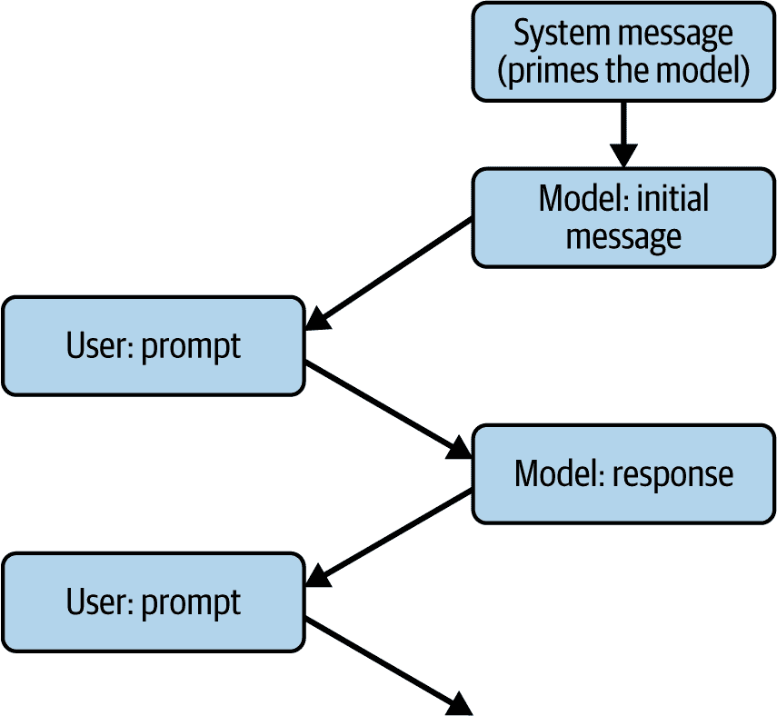

# 第十八章. RAG 简介

记得你第一次与像 ChatGPT 这样的 LLM（大型语言模型）聊天，以及它对你意想不到的事情有多么深刻的见解吗？在 ChatGPT 发布之前，我就已经与 LLM 合作过，并在一些突出 LLM 能力的项目上工作过，但我仍然对他们能做什么感到惊讶。记得谷歌在舞台上进行的著名演示吗？CEO 与冥王星进行了对话？这是我们仍在探索的 AI 可能性中的基本思维转变之一，随着 AI 的持续发展，我们仍在探索。

但是，尽管有所有这些辉煌，仍然存在局限性，我和其他人越是用 LLM 工作，就越会遇到它们。我们在第十五章（ch15.html#ch15_transformers_and_transformers_1748549808974580）中讨论的基于 transformer 的架构在抓取文本数据、从中创建 QKV 映射以及学习如何人工理解文本的语义方面非常出色。但尽管用于构建这些映射的文本量很大，仍然存在——并且始终存在的一个盲点：私人数据。特别是，如果你想要使用模型未训练过的数据，你面临的主要风险是胡编乱造！

获得帮助减轻这种盲点的技能可能是在作为软件开发者你能做的最有价值的事情。

对于这一章，我希望你以不同的方式思考 AI 模型，特别是像 LLM 这样的大型生成模型。停止将它们视为聪明和有知识的，开始将它们视为*工具*，帮助你更好地解析数据。将它们所学到的一切不是作为一个知识库本身，而是它们通过广泛阅读而获得的语言泛化理解的方式。

我称之为*人工理解*，作为 AI 的补充技术。

然后，一旦你将你最喜欢的 LLM 视为人工理解的一个引擎，你就可以开始让它理解你的私人文本——那些不在其训练集中的内容——并通过这种理解，以新的和有趣的方式处理你的文本。

让我们通过一个场景来探讨这一点。想象你正在与一个 AI 模型讨论你最喜欢的科幻小说。你想要询问关于角色、情节、主题等内容，但模型在具体细节上挣扎，只能提供一般性的回答——或者更糟糕的是，胡编乱造。例如，看看图 18-1，它展示了我在与 ChatGPT 讨论一本名为*太空战士*的小说中的角色时得到的结果。


###### 图 18-1. 与 GPT 讨论一个角色

这一切都非常有趣——除了它是错误的。首先，这个角色来自*朝鲜*，而不是*韩国*。

GPT 正在自信地犯错。为什么？因为这个小说不在训练集中！我是在 2014 年写的，它由一家小型出版社出版，几个月后就倒闭了。因此，它相对较为冷门，是我们用来探索 RAG 的完美素材。到本章结束时，你将使用你的 PyTorch 技能创建一个能够更智能地理解这部小说以及所讨论角色的应用程序。而且，你将拥有整部小说来工作！

一个小插曲：当我第一次使用 LLM 来完成这类任务时，我感到震惊。它能够 *人工理解* 我自己的写作内容和上下文，就像身边有一个伙伴来批评我的作品，并帮助我深入挖掘角色和主题。这本书以悬念结束，我从未回来写任何续集。与 LLM 讨论角色弧线等问题，为我提供了关于它可能走向的全新智慧源泉。

当然，你不仅限于文学作品。几乎每个企业都有大量内部智力资源被锁在文档中，这些文档需要人类花费大量时间阅读、索引、交叉关联和理解，才能回答查询——因此，LLM 能够人工理解这些文档以帮助您挖掘知识的能力是无与伦比的。

正因如此，我对 RAG 感到兴奋。希望你在完成本章后也会如此。

# 什么是 RAG？

缩写 *RAG* 代表 *retrieval augmented generation*，其目的是弥合 LLM 训练时所依据的知识与您拥有的、LLM 没有映射的私有数据之间的差距。在查询时间以及像“告诉我关于这个角色的……”这样的提示下，我们还会向其提供来自本地数据存储的信息片段。例如，如果我们正在查询小说中的一个角色，本地数据可能包括她的家乡、她最喜欢的食物、她的价值观以及她的说话方式。当我们把 *这些* 数据与查询一起传递时，其中很多都是 LLM 训练集中的，因此 LLM 可以对她的了解更加深入。至少，LLM 在 图 18-1 中犯的错误可以得到缓解——当 LLM 被提供她的家乡时，它至少可以正确地确定她的国籍！

图 18-2 展示了向 LLM 发起典型查询的流程。它相当基础：你传递一个提示，然后变压器通过遍历 LLM 学到的知识来产生 QKV 值，从而生成一个响应。


###### 图 18-2\. 向 LLM 发起查询的典型流程

正如我们所展示的，如果 LLM 对具体知识了解不多，它会填补这些空白——而且它做得相当不错。例如，尽管它在 图 18-1 中展示的例子中错误地推断出她的国籍，但它至少能够推断出她的名字是韩国式的！

使用 RAG，我们改变了这个流程，通过添加我们捆绑的额外信息来增强查询（参见图 18-3）。我们通过拥有一个包含书籍内容的本地数据库来实现这一点，然后在该数据库中搜索与查询相似的内容。你很快就会看到它是如何工作的细节。


###### 图 18-3\. 使用 LLM 的 RAG 查询的典型流程

这里的目标是增强初始提示，添加大量额外的上下文。因此，书中的场景可能会提到她的家乡、家族历史、最喜欢的食物、她为什么喜欢人或事物等。当这些内容与查询一起传递给 LLM 时，LLM 有更多的工作内容——包括它已经学习到的东西，因此其对角色的解读变得更加智能。因此，它能够*人为地理解*内容得更好。

当然，这一切的关键在于能够检索出最佳信息，并将其与提示结合，以充分利用 LLM（大型语言模型）。你可以通过将源材料（在这种情况下，是书籍）的内容以允许你进行语义相关事物搜索的方式存储来实现这一点。为此，你将使用一个向量存储库。我们将在下一节中探讨这一点。

# RAG 入门

要开始，让我们首先探索如何创建一个向量数据库。为此，你需要使用支持向量和相似性搜索的数据库引擎。

这些方法基于将文本存储为表示它的向量的想法。我们在第六章中看到了这些方法的应用。为了简单起见，你将首先使用 OpenAI 提供的预构建、预学习的嵌入集，并通过 LangChain 提供的 API 来使用它们。这些嵌入将与一个名为 Chroma 的向量存储数据库相结合，该数据库是免费且开源的。

让我们包含以下导入：

```py
from langchain_community.document_loaders import PyPDFLoader
from langchain.text_splitter import RecursiveCharacterTextSplitter
from langchain_community.embeddings import OpenAIEmbeddings
from langchain_community.vectorstores import Chroma
```

如其名所示，`PyPDFLoader`用于在 Python 中管理 PDF 文件。我提供这本书作为 PDF 格式，因此我们需要这个工具。

`RecursiveCharacterTextSplitter`是一个非常有用的类，可以将书籍分割成文本块。它提供了对块大小和块之间重叠的灵活性。我们将在稍后详细探讨这一点。

`OpenAIEmbeddings`类为我们提供了访问 OpenAI 在训练 GPT 时学习的嵌入的能力，并且这是一个让我们更快完成工作的便捷途径。对于这个应用，我们不需要学习自己的嵌入——只要我们的文本被编码在一系列嵌入中，并且我们的提示使用相同的嵌入，我们就可以用于相似性搜索。有很多这样的选项，Hugging Face 是一个很好的仓库，你可以在这里找到最新和最好的资源。

最后，`Chroma`数据库为我们提供了基于相似性存储和搜索文本的能力。

## 理解相似性

我们已经多次提到了相似度，了解它在您哪里有用是很重要的。回想一下，在 第六章，我们讨论了如何使用嵌入将单词转换为向量。这种简单表示如图 18-4 所示。


###### 图 18-4\. 作为向量的单词

在这里，我们根据它们学习到的向量绘制了单词 *Awesome*、*Great* 和 *Terrible*。在二维空间中这是一个过于简化的表示，但希望这足以演示这个概念。在这种情况下，我们可以可视化 *Awesome* 和 *Great* 是相似的，因为它们彼此很近，但我们可以通过观察它们之间向量的角度来量化这一点。通过取该角度的函数，如其 *余弦值*，我们可以得到一个很好的指示，说明这两个向量有多接近。同样，如果我们观察单词 *Terrible*，*Awesome* 和 *Terrible* 之间的角度非常大，这表明这两个单词不相似。

这个过程被称为 *余弦相似度*，我们将在创建我们的 RAG 时使用它。我们将把书籍分割成块，计算这些块的嵌入，并将它们存储在数据库中。然后，通过使用提供基于余弦相似度搜索的存储（在这种情况下是 ChromaDB），我们将拥有我们 RAG 的关键。

有许多不同的方法可以计算相似度，余弦相似度是其中之一。值得研究这些其他方法以微调您的 RAG 解决方案，但在这章的其余部分，我将使用余弦相似度，因为它简单易用。

## 创建数据库

要创建向量存储，我们将通过加载 PDF 文件、将其分割成块、计算块的嵌入以及然后存储它们的过程来完成。让我们一步步来看。

首先，我们将使用 `PyPDFLoader` 加载 PDF 文件：

```py
# Load the PDF file
loader = PyPDFLoader(pdf_path)
documents = loader.load()
```

接下来，我们将设置一个文本分割器，它将读取我们将用于分割文本的内容。您应用程序的一个重要部分将是确定合适的块大小：

```py
# Split the documents into chunks
text_splitter = RecursiveCharacterTextSplitter(
    chunk_size=1000,
    chunk_overlap=200,
    length_function=len,
    add_start_index=True,
)
```

在这种情况下，代码将文本分割成一千个字符的块。但它使用递归策略来计算分割，其中它试图在文本的自然边界上执行分割，而不是在正好一千个字符处进行硬切割。它首先尝试在新行上分割，然后是句子、标点符号，然后是空格。作为最后的手段，它将在单词的中间进行分割。

重叠意味着下一个块不会从下一个字符立即开始，而是在大约两百个字符之前开始。如果我们有这些重叠，一些文本会在数据中出现两次——这是可以的。这意味着我们不会在句子中间分割时丢失内容。你应该根据你的场景探索块的大小和重叠。像这样的较大块将更快地搜索，因为块的数量将比它们更小，但这也降低了如果提示比块大小短，块与提示非常相似的可能性。

分割器提供了让你指定自己的长度函数的能力，如果你想要以不同的方式测量长度。在这种情况下，我只是在使用 Python 的默认 `len` 函数。通常，对于像这样的 RAG，你可能不需要覆盖 `len` 函数，但这个想法是不同的模型和编码器可能以不同的方式计算标记。例如，GPT 3.5 将 `lol` 这样的短语识别为一个单独的标记，但一个表情符号可以是四个标记。

`add_start_index` 参数为每个块添加元数据，指示它在原始文本中的位置。这对于调试很有用，你可以回溯每个块来自哪里，或者提供类似引用的东西。

一旦你指定了文本，你可以用它来将 PDF 分割成多个文本：

```py
texts = text_splitter.split_documents(documents)
```

现在你有了文本，你可以使用 `OpenAIEmbeddings` 类将它们转换为嵌入，你也可以通过传递文档来指定你想要使用 Chroma 的向量存储：

```py
# Initialize OpenAI embeddings
# Make sure to set your OPENAI_API_KEY environment variable
embeddings = OpenAIEmbeddings()

# Create and persist the vector store
vectorstore = Chroma.from_documents(
    documents=texts,
    embedding=embeddings,
    persist_directory=persist_directory
)
```

如所示，你只需简单地传递你指定的文本和嵌入以及存储嵌入的目录。然后使用以下命令将向量存储保存到磁盘：

```py
# Persist the vector store
vectorstore.persist()
```

###### 注意

`OpenAIEmbeddings` 需要一个 `OPENAI_API_KEY` 环境变量。你可以在 [Open AIPlatform 网站](https://oreil.ly/41hwI) 上获取一个，然后根据你的操作系统设置一个，确保你将其命名为显示的确切名称。

基础数据库是一个 SQLite3 数据库（见图 18-5）。


###### 图 18-5\. 包含 ChromaDB 内容的目录

这使你能够使用任何与 SQLite 兼容的工具浏览和检查数据库。例如，你可以使用免费的 [DB Browser for SQLite](https://sqlitebrowser.org) 访问数据（见图 18-6）。


###### 图 18-6\. 在 SQLite 浏览器中浏览数据

现在我们有了向量存储，让我们来看看当我们想要搜索相似文本时会发生什么。

## 执行相似性搜索

一旦你设置了向量存储，搜索它就变得很容易了。

这是一个你可以用来使用向量存储执行相似性搜索的函数：

```py
def search_vectorstore(vectorstore, query, k=3):
    results = vectorstore.similarity_search(query, k=k)
    return results
```

如你所见，这很简单！如果你喜欢，可以使用可选参数覆盖或扩展一些功能，包括以下内容：

搜索类型

默认为`similarity`，但也可以是`mmr`，代表*最大边际相关性*（MMR），在构建生产系统时值得尝试。MMR 在你想避免冗余结果时特别有用。

距离度量

默认为`cosine`，正如我们之前看到的，但也可以是`l2`，代表*距离*——实际上是嵌入空间中两个向量之间的直线距离。或者，它可以是`ip`，代表*内积*，这提供了一个非常快速的计算，但代价是精度较低。

Lambda_mult

这是一个介于 0 和 1 之间的可选值，你用它来控制距离测量的严格性。1.0 的值将给出高度相关的分数，而 0.0 的值将给出更多样化的分数。

随着你构建系统，我建议你尝试多种方法，看看哪种最适合你的场景。

## 将所有内容整合在一起

现在，你可以使用以下代码来处理你的 PDF 文件，将其切割并存储为库中的向量，并对它进行查询：

```py
# Path to your PDF file
pdf_path = "space-cadets-2020-master.pdf"

# Create the vector store
vectorstore = create_vectorstore(pdf_path)

# Example search
query = "Give me some details about Soo-Kyung Kim. 
         Where is she from, what does she like, tell me all about her?"
results = search_vectorstore(vectorstore, query, 5)
```

在运行此操作时，我得到了关于她性格的详细信息。以下是一些片段：

```py
“I think we are going to be good friends,” said Soo-Kyung. “I like how
you are straightforward. I am too, but that intimidates some people.”
“So where are you from?”
“I am from a small village called Sijungho,” continued Soo -
Kyung. “There’s not much to see there.”
“Sounds Korean,” said Aisha. “You from South Korea?”
“North Korea,” corrected Soo -Kyung. “I’ve never even been to
South Korea.”

```

因此，当我们向 LLM 查询角色时，我们还有所有这些额外内容。我们将在下一节探讨这一点。

# 使用 LLM 与 RAG 内容结合使用

现在你已经创建了一个向量存储并将书籍存储在其中，让我们探讨如何从存储中读取片段，将其添加到提示中，并获取数据。我们将使用本地 Ollama 服务器以保持简单。有关 Ollama 的更多信息，请参阅第十七章。

首先，让我们加载我们在上一步创建的向量存储：

```py
def load_vectorstore(persist_directory="./chroma_db"):
    embeddings = OpenAIEmbeddings()

    # Load existing vector store
    vectorstore = Chroma(
        persist_directory=persist_directory,
        embedding_function=embeddings
    )

    return vectorstore
```

你*必须*使用与你在创建向量存储时使用的相同嵌入。否则，当你尝试编码提示并搜索类似内容时，将出现不匹配。

在这个例子中，我使用的是 OpenAIEmbeddings，但如何处理完全取决于你。Hugging Face 上有很多开源的嵌入，或者你可以使用我们在第六章中探讨的 GLoVE 嵌入。

ChromaDB 将嵌入持久化存储在特定目录的 SQLite 数据库中。确保你嵌入它，然后你只需要传递这个和你的嵌入函数到 Chroma，以获取你的数据库引用。

要搜索向量存储，你将使用与之前相同的代码：

```py
def search_vectorstore(vectorstore, query, k=3):
    results = vectorstore.similarity_search(query, k=k)
    return results
```

接下来，输入一个查询。例如，输入以下内容：

```py
query = "Please tell me all about Soo-Kyung Kim."
```

到目前为止，你已经拥有了进行 RAG 查询所需的所有组件，你可以这样操作：

```py
# Example query
query = "Please tell me all about Soo-Kyung Kim."

# Perform RAG query
answer, sources = rag_query(vectorstore, query, num_contexts=10)
```

在这里，你创建一个辅助函数，该函数将传递查询和向量存储，你还有一个参数，用于指定在向量存储中要查找的项目数量。应用将返回答案（来自 LLM）以及它用于增强查询的数据源列表。

让我们深入探讨这个函数：

```py
def rag_query(vectorstore, query, num_contexts=3):
    # Retrieve relevant documents
    relevant_docs = search_vectorstore(vectorstore, query, k=num_contexts)

    # Combine context from retrieved documents
    context = "\n\n".join([doc.page_content for doc in relevant_docs])

    # Generate response using Ollama
    response = query_ollama(query, context)

    return response, relevant_docs
```

你将首先使用之前提供的代码在向量存储中进行搜索。这将给出从数据存储中解码的块作为字符串，你应该将这些称为`relevant_docs`。

然后，通过使用一些新行字符将块连接起来创建上下文字符串，以分隔它们。就这么简单。

现在，查询和上下文将被用于对 Ollama 的调用中。让我们看看这将如何工作。

首先定义函数：

```py
def query_ollama(prompt, context, model="llama3.1:latest", temperature=0.7):

    ollama_url = "http://localhost:11434/api/chat"
```

在这里，你可以设置函数以接受提示和上下文。我已经添加了一些可选参数，如果未设置，将使用默认值。第一个是模型。要获取服务器上可用的模型列表，你只需在命令提示符中使用“ollama list”。`temperature`参数表示你的响应将有多大的确定性：数字越小，答案越确定，数字越大，答案越有创意。我将其设置为默认值 0.7，这给模型提供了一些灵活性，使其听起来自然同时保持相关性。但当你使用 Ollama 中的较小模型（如`llama3.1`，如图所示）时，确实会使幻觉的可能性增加。

你还想要指定`ollama_url`端点，如第十七章中所示。

接下来，创建用于与模型交互的消息。

与模型对话的结构通常看起来像图 18-7 中的那样。模型可以选择性地通过一个系统消息来引导，该消息给出它如何行为的指示。然后，它将向用户发出一个初始消息，例如，“欢迎来到聊天。我能帮什么忙？”用户将随后用一个提示来要求模型做某事，模型将做出回应，依此类推。



###### 图 18-7\. 与模型对话的解剖结构

对话的*记忆*将是一个带有每个角色前缀的`role`值的 JSON 文档。初始消息将具有`system`角色，模型消息将具有`model`角色，用户消息将具有`user`角色。

因此，对于我们正在创建的简单 RAG 应用，我们可以创建一个这样的对话实例——传递系统消息和用户消息，这些消息将由提示和上下文组成，如下所示：

```py
    messages = [
        {
            "role": "system",
            "content": "You are a helpful AI assistant. 
                        Use the provided context to answer questions. 
                        If you cannot find the answer in the context, say so. 
                        Only use information from the provided context."
        },
        {
            "role": "user",
            "content": f"Context:\n{context}\n\nQuestion: {prompt}"
        }
    ]
```

根据你如何设置系统角色，你会得到非常不同的行为。在这种情况下，我使用了一个提示，使其高度关注提供的上下文。你*不需要*这样做，通过使用这个提示，你可能会得到更好的结果。

在用户角色中，这就像创建一个包含`Context:`和`Question:`内容的字符串，你将上下文和提示粘贴进去一样简单。

从这个例子中，你现在可以创建一个 JSON 负载，将其传递给 Ollama，其中包含所需的模型、消息、温度和流（如果你想要得到单个答案，必须将流设置为`False`）：

```py
    payload = {
        "model": model,
        "messages": messages,
        "stream": False,
        "temperature": temperature
    }
```

注意，所需的模型必须安装到 Ollama 中，否则你会得到一个错误，所以查看第十七章以了解如何将模型添加到 Ollama。

然后，你只需使用 HTTP POST 到 Ollama URL，传递它负载。当你得到响应时，你可以查询返回的消息——其中现在将添加由模型生成的新内容。这个内容将包含你的答案！

```py
    try:
        response = requests.post(ollama_url, json=payload)
        response.raise_for_status()
        return response.json()["message"]["content"]
    except requests.exceptions.RequestException as e:
        return f"Error querying Ollama: {str(e)}"
```

在这个例子中，我使用了 Llama 3.1 并得到了一些出色的答案。以下是一个例子：

```py
Based on the provided context, here's what can be gathered about Soo-Kyung Kim:

1. She is from North Korea.
2. She has been trained in various skills, including science, technology, 
martial arts, languages, piloting, and strategy.
3. Her family name "Kim" is significant, as it is the name of the ruling family 
   of the Democratic People's Republic of Korea (North Korea).
4. Soo-Kyung's presence on the space academy may be related to her exceptional 
   abilities, but there is also a suggestion that she was chosen for other 
   reasons.
…
```

你的结果将根据温度、块切片大小以及各种其他因素而有所不同。

有一个需要注意的事情是，你也可以使用一个非常小的模型如 Gemma2b，并且仍然可以得到非常好的结果。然而，如此小的模型的上下文窗口在检索和增强你的查询时可能会出现问题。正如你在这章前面看到的，我们使用了一千字符的块，并检索了与提示最接近的 10 个。这已经是 10 k 字符的顺序，根据分词策略，这可能会超过 10 k 个标记。鉴于该模型的上下文窗口仅为 2 k 个标记，你可能会遇到问题。注意这一点！

## 扩展到托管模型

在我们刚刚演示的例子中，我们使用了像 Llama 和 Gemma 这样的较小模型在本地 Ollama 服务器上执行 RAG 操作。如果你想使用像 GPT 这样的大型托管模型，过程完全相同。不过，我会做的一个改变是关于系统提示。鉴于这些模型具有大量参数并且学到了很多知识，最好稍微放松一下，不要期望它们仅限于提供的上下文！

例如，对于 GPT，你可以这样导入支持 OpenAI GPT 模型的类：

```py
from langchain_openai import ChatOpenAI
```

你可以像这样实例化这个类：

```py
chat = ChatOpenAI(
    model=model,
    temperature=temperature
)
```

模型值是一个包含你想要使用的模型名称的字符串。例如，你可以使用`gpt-3.5-turbo`或`gpt-4`。检查你阅读此内容时的[OpenAI API 文档中的模型版本](https://oreil.ly/SVBXr)。

然后，你可以非常简单地创建提示。首先，创建一个提示模板来保存系统和用户提示：

```py
# Create prompt template
prompt_template = ChatPromptTemplate.from_messages([
    ("system", "You are a helpful AI assistant. 
                Use the following context to answer questions. "
               "Please provide as much detail as possible in a comprehensive 
               answer."),
    ("system", "Context:\n{context}"),
    ("user", "{question}")
])
```

然后，你可以使用上下文和提示的详细信息来制作格式化的提示：

```py
# Format the prompt with the context and question
formatted_prompt = prompt_template.format(
    context=context,
    question=prompt
)

```

最后，你可以使用格式化的提示调用 GPT 聊天并获取响应：

```py
# Get the response
response = chat.invoke(formatted_prompt)
return response.content
```

现在，只要确保你有一个之前讨论过的`OPENAI_API_KEY`环境变量，你就是在使用 GPT 进行 RAG 操作！请注意 OpenAI 使用可用模型的定价。

# 摘要

在本章中，你尝试了 RAG 的领域，在那里你学习了一种强大的技术，通过结合 LLMs 的一般理解技能与本地、私有数据来增强其能力。你通过创建包含一本书内容的向量数据库来了解 RAG 的工作原理，然后你搜索了这个数据库以找到与你的给定提示相关的信息。

我们还探索了查询书中的人物以了解更多关于她的信息——尽管 Llama 和 GPT 等模型并未在关于她的内容上进行训练，但它们能够人为地理解文本并提供出色的信息和分析。

你还探索了像 ChromaDB（用于向量存储）和预训练嵌入（如 OpenAIs 用于文本的向量编码，允许进行相似度搜索）这样的工具。你也探索了可以通过使用 RAG 增强的各种模型，包括小型和本地模型（如 Llama 和 Gemma 与 Ollama）以及大型托管模型（如通过 OpenAI API 的 GPT）。这个过程涵盖了从端到端：切片文本，编码它，存储它，基于相似度进行搜索，以及将提示与模型捆绑以执行 RAG。

在下一章中，我们将稍微转换一下方向，探讨 AI 的另一个令人兴奋的方面：生成图像模型。我们将探索提供图像的多种不同模型，这些模型来自文本提示，并且我们将深入探讨它们的工作原理。
