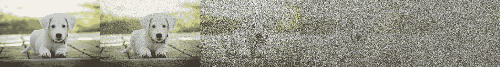
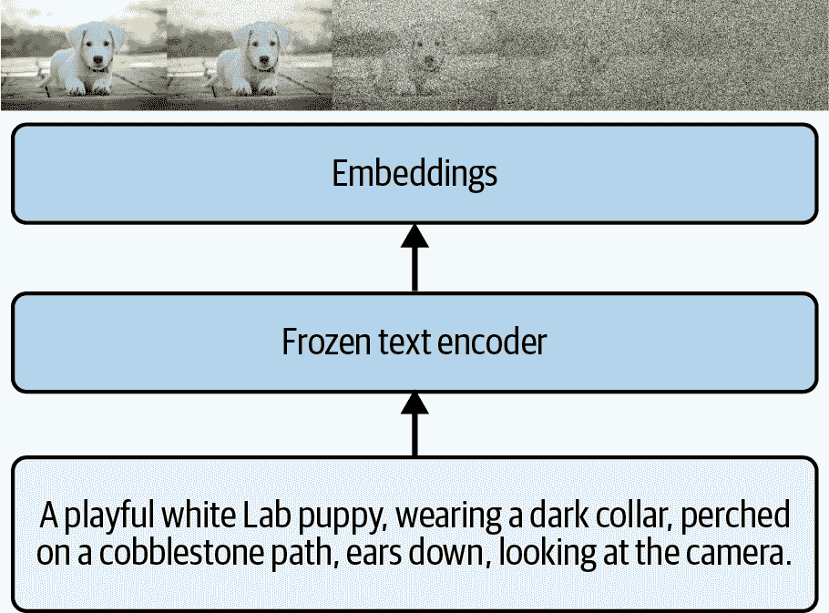
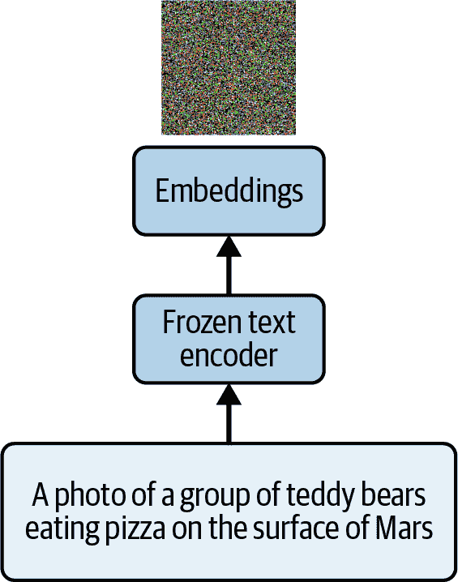
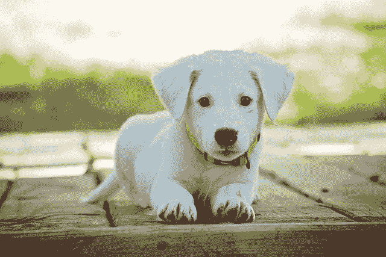
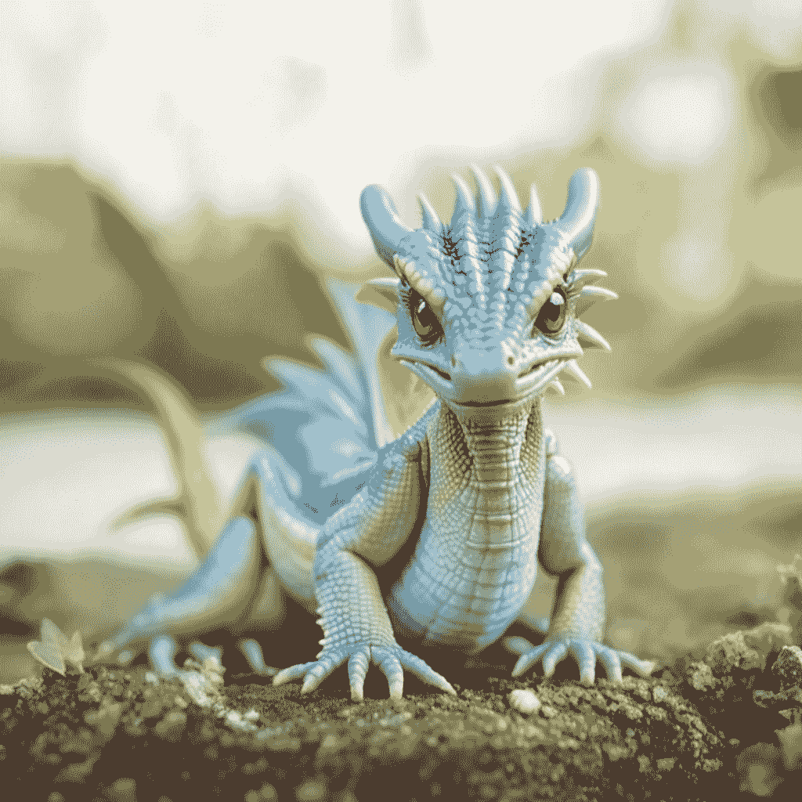
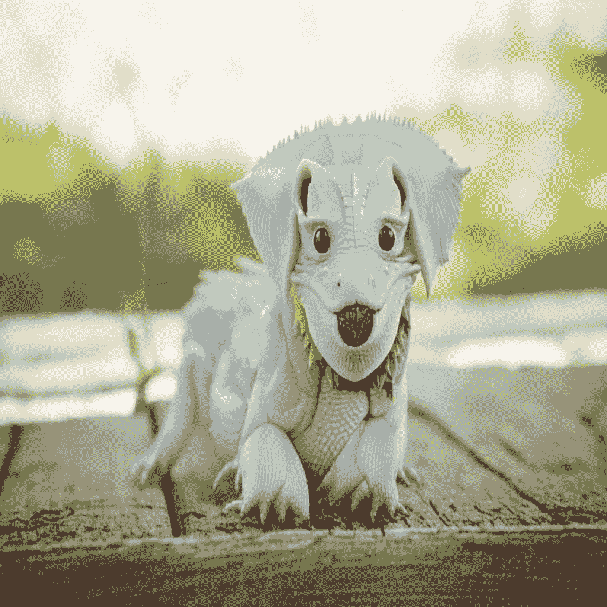
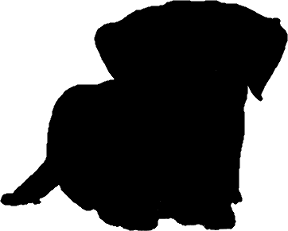

# 第十九章\. 使用 Hugging Face Diffusers 进行生成模型

在过去的几章中，我们一直在研究生成模型的推理，主要使用 LLMs（即文本到文本模型）来探索不同的场景。然而，生成 AI 并不仅限于基于文本的模型，另一个重要的创新当然是图像生成（即文本到图像）。今天的大多数图像生成模型都是基于一个称为*扩散*的过程，这启发了 Hugging Face API 中用于从文本提示创建图像的*扩散器*这个名字。在本章中，我们将探讨扩散模型的工作原理以及如何让你的应用程序生成图像。

# 什么是扩散模型？

到目前为止，我们大多数人可能都见过 AI 创建的图像，并且我们可能对它们如何从抽象、粗糙的表示迅速发展到我们通过提示请求的几乎逼真的表示感到惊讶。因为模型允许更长的提示，包含更多细节，并且随着训练集的增长，我们看到了 AI 图像生成所能做到的事情的几乎无尽的改进。

但这一切是如何工作的呢？它始于扩散的想法。

你可以通过创建一个包含图像及其相关噪声的数据集来开始这个过程。考虑图 19-1（见图 19-1）。



###### 图 19-1\. 对图像进行噪声处理

然后，一旦你有一组这样的噪声图像，你可以训练一个模型，该模型学习如何去噪，将图像恢复到原始状态。将噪声视为数据，原始图像视为标签。因此，在图 19-1 的情况下，右侧的噪声可以视为数据，小狗的图像可以视为标签。在那个阶段，你可以训练一个模型，当它看到噪声时，可以找出如何将噪声转换成图像。逻辑上的延伸是，你然后可以*生成*噪声，模型将找出如何将噪声转换成看起来有点像训练集中那些图像的图像。

但是，如果你回到创建噪声图像的步骤，并用一个非常冗长的描述添加文本呢？那么，你的噪声图像将会有一个文本标签（以嵌入的形式表示）附加在其上（见图 19-2）！



###### 图 19-2\. 将文本编码添加到扩散过程中

现在，噪声图像已经附加了描述它的嵌入。简单来说，噪声片段通过描述它的嵌入得到增强，因此将此图像去噪回原始小狗图像的过程有了额外的数据来指导它如何去噪。因此，如果你用噪声加上嵌入作为数据，原始图像作为标签来训练一个模型，那么模型现在可以更有效地学习如何将噪声加上嵌入转换成图片。

你可能已经看到了这个趋势。一旦该模型训练完成，那么在未来，如果有人给它一个包含提示的文本，该文本可以被编码成嵌入，生成一组随机噪声，模型将尝试找出如何将随机噪声与文本结合，将其去噪成图像。从所有目的来看，它将创建一个全新的图像（参见图 19-3）。



###### 图 19-3. 开始去噪图像的过程

在这里，我们可以从完全随机的噪声和一个提示开始。这个提示很可能不在训练集中——除了 AI 生成的图像之外，没有已知在火星表面有泰迪熊吃披萨的图像。

因此，模型可以在多个步骤中逐步去噪。正如你可以想象的那样，第一步将是随机噪声，第二步将是模型试图使噪声与提示相匹配，第三步会使其更接近，依此类推。

这在图 19-4 中有描述，你可以看到使用流行的*稳定扩散*模型时图像的样子。


###### 图 19-4. 基于提示逐渐去噪图像

在这个例子中，我使用了一个扩散模型，其提示来自图 19-3 中关于泰迪熊吃披萨的内容。你将在本章稍后看到这段代码。

在步骤 0 中，你可以看到我们只有纯噪声。在步骤 1 中，模型已经开始吸收提示中的一些较强特征——火星表面——并给图像赋予非常红的色调。到步骤 10 时，我们有了泰迪熊和披萨，到步骤 40 时，泰迪熊实际上正在吃披萨，光线也发生了变化——可能是为了晚餐时间！

图像的*大小*取决于模型。许多早期的模型，或者那些设计用于在消费级硬件上运行的模型，将生成较小的图像，然后将其放大以得到所需的输出。我这里展示的图像是用 Stable Diffusion 3.5 创建的，默认创建 1024 × 1024 的图像。

###### 注意

尽管本章将重点介绍扩散模型，但使用它们并不是生成图像的唯一方式。还有*自回归模型*，这些模型学习图像描述中的文本标记与代表图像视觉内容的标记之间的映射。有了这些映射的大量示例，你可以在它们上训练一个模型。然后，你可以给模型一段文本，它将能够预测该文本的标记并将它们重新组合成图像。

# 使用 Hugging Face Diffusers

就像 Hugging Face 提供了 transformers 库（如我们在第十五章中解释的那样），它还提供了一个 diffusers 库，以便更容易地使用扩散模型。Diffusers 将使用各种模型的复杂性抽象成一个易于使用的 API。

要开始使用扩散器，你只需像这样安装它们：

```py
pip install -U diffusers
```

diffusers 库以与我们在早期章节中用 transformers 体验的相同方式管理模型推理的管道化。根据提示渲染图像涉及许多步骤：编码提示、制作嵌入、将嵌入和所需的任何超参数传递给模型、获取输出张量，并将它们转换为图像。但 diffusers 为你封装了这些步骤到管道中，并且有许多开源管道适用于许多不同的模型。

例如，在火星上的泰迪熊图像中，我使用了 Stable Diffusion 3.5 Medium，你可以在[Hugging Face 网站](https://oreil.ly/liUY-)找到它。

此模型访问权限有限，因此你将在 Hugging Face 页面的顶部看到一个表单，你需要填写以获得权限。你还需要在 Colab 中配置你的 Hugging Face 密钥（如果你使用的是 Colab），我们之前在第十四章演示了如何操作。

如果你没有使用 Colab，你的代码将需要使用他们的 API 登录到 Hugging Face。你可以使用以下代码来完成：

```py
from huggingface_hub import login

login(token="<YOUR TOKEN HERE>")
```

一旦你登录（或者如果你使用的是不需要登录的模型），生成图像的过程如下：

1.  创建一个生成器对象，允许你指定种子。

1.  为所需的模型创建适当的管道实例。

1.  将该管道发送到适当的加速器。

1.  使用管道生成图像，并给出适当的参数。

让我们一步步来看。

首先，你使用`torch.Generator`指定生成器，其中你将指定生成器的加速器并设置种子。你使用种子值以确定性水平创建初始噪声。如果你想能够*复制*生成的图像，尽管噪声是随机的，你可以通过用种子引导噪声来实现。换句话说，当使用种子值生成噪声时，随后的相同种子将生成相同的噪声。因此，噪声将是伪随机的，因为将有一个确定性的种子在起作用。另一方面，如果你没有指定种子，你将得到一个随机值。以下是一个示例：

```py
# Set your seed value
seed = 123456  # You can use any integer value you want

# Create a generator with the seed
generator = torch.Generator("cuda").manual_seed(seed)
```

接下来，你将指定管道并使用模型实例化它：

```py
pipe = StableDiffusion3Pipeline.from_pretrained(
           "stabilityai/stable-diffusion-3.5-medium", 
           torch_dtype=torch.bfloat16)
pipe = pipe.to("cuda")
```

在这里，我们使用 Stable Diffusion 3.5，它使用`StableDiffusion3Pipeline`类。diffusers API 是开源的，并且不断添加新的管道。你可以在[GitHub](https://oreil.ly/uYGnJ)上检查它们。

你还可以在[Hugging Face 网站](https://oreil.ly/R4dKT)上浏览不同的模型。通常，它们的着陆页将包括有关使用哪个管道的源代码以及模型的地址。

一旦你有了管道，你就可以通过指定提示和一些其他模型相关的参数来使用它创建一个图像，这些参数你可以在模型文档中找到。例如，对于稳定扩散，你将指定推理步骤的数量和之前指定的生成器。你还应该指定管道要执行的*位置*——（在这种情况下，它是`cuda`，如前述代码所示，它使用了 Colab 中的 GPU 加速器）： 

```py
image = pipe(
    "A photo of a group of teddy bears eating pizza on the surface of mars",
    num_inference_steps=40,
    generator=generator  # Add the generator here
).images
image[0].save("teddies.png")
```

我发现，探索管道的源代码并查看它支持的参数是实验这个功能最好的方法。例如，使用 Stable Diffusion 3 管道，有一个*负提示*，它规定了你不希望在图像中看到的事情。通常，你可以使用这个来使图像变得更好。例如，你可能听说过图像生成器，尤其是早期的，在绘制手部方面非常糟糕。你可以使用负提示来让图像生成器通过在提示中说“变形的手”或类似的话来避免这个问题。

你也可以指定你不想在图像中看到的一些更简单的事情！例如，我画的每个图像实例中都有泰迪熊在吃*辣味披萨*。我可以用这段代码从这个图像中移除辣味：

```py
image = pipe(
    "A photo of a group of teddy bears eating pizza on the surface of mars",
    negative_prompt="pepperoni",
    num_inference_steps=40,
    generator=generator  # Add the generator here
).images
```

结果图像显示在图 19-5 中。

左边的泰迪熊看起来对此不太满意，但其他的似乎更满意！

在这种情况下，我们使用了文本到图像来创建这些图像——但是扩散模型通过添加*图像到图像*的插件而变得更加先进。有了这样的插件，我们不再从随机噪声开始，而是可以从现有的图像开始，然后执行*修复*，其中我们可以让模型在现有图像中填充新的细节。我们将在下一部分探讨这一点。


###### 图 19-5\. 不喜欢辣味的泰迪熊

## 使用扩散器进行图像到图像

当检查管道的源代码时，你可能发现了其中其他类，例如这个：`StableDiffusion3Img2ImgPipeline.`

如其名所示，这个类允许你从一个图像开始创建另一个图像。你可以以与初始化文本到图像管道非常相似的方式初始化它：

```py
from diffusers import StableDiffusion3Img2ImgPipeline

# Set your seed value
seed = 123456

# Create a generator with the seed
generator = torch.Generator("cuda").manual_seed(seed)

# Load the model
pipe = StableDiffusion3Img2ImgPipeline.from_pretrained(
    "stabilityai/stable-diffusion-3.5-medium", 
     torch_dtype=torch.bfloat16)

pipe = pipe.to("cuda")
```

然后，你将指定一个用作源图像的图像：

```py
from PIL import Image
# Load and preprocess the initial image
init_image = Image.open("puppy1.jpg").convert("RGB")
```

我从一只小狗的图像开始（见图 19-6 图 19-6）。



###### 图 19-6\. 狗崽的源图像

我们将使用以下代码作为图像到图像管道的初始化图像。注意，提示指定了一个高度详细的婴儿*龙*的照片：

```py
# Generate the image
image = pipe(
    prompt="A highly detailed photograph of a baby dragon",
    image=init_image,
    strength=0.7,
    num_inference_steps=100,
    generator=generator
).images
```

强度参数指定生成的图像应如何紧密地遵循输入图像。在 0.0 时，模型不会做任何事情，输出将是输入图像。在 1.0 时，它将有效地*忽略*输入图像，并仅作为文本到图像模型运行。

在底层，它是通过以下过程实现的。

由于代码指定了 0.7 的强度，模型将向图像添加噪声，直到图像有 70%的像素被噪声替换（因此只有 30%的图像是原始值）。

然后，模型将运行 70 次去噪步骤（100 次中指定的 70%），这将得到像图 19-7 那样的图像。

通常，如果你使用 0.2 到 0.4 的强度，你会得到风格迁移和其他小修改。在 0.5 到 0.7 时，你会保持基本构图，但主要元素的变化，如小狗到龙，将会出现。超过 0.8，你会看到几乎完全的再生，但可能会保留一些原始的影响。



###### 图 19-7\. 使用图像到图像将小狗变成龙

你可以看到基本姿势得到了保持，但计算机想象了一个龙来替换小狗，以满足要求。还有新的前景和背景，因为我们没有指定它们，但它们与原始图像非常接近。

作为不同强度级别的例子，图 19-8 显示了 0.4 的强度。我们还可以看到，小狗的基本形状得到了保持，但它变得更加像龙，有鳞片皮肤和爪子的开始！



###### 图 19-8\. 狗到龙图像到图像的强度级别为 0.4

这种技术在帮助你从现有图像开始创建新图像时非常有用。我见过它在电影制作等场景中使用——一个人可以从在基本、便宜的地方拍摄的现有视频开始，然后逐帧使用图像到图像技术来获得不同的结果。这是一种通过添加特效来降低后期制作成本的方法！

## 使用扩散器进行修复

另一个涉及使用扩散器且一些模型（包括稳定扩散模型）支持的场景是*修复*的想法，其中你可以使用 AI 生成的内容替换图像的一部分。例如，考虑图 19-6 中的小狗，以及你如何改变图像，让小狗在月球上，就像图 19-9 中那样。


###### 图 19-9\. 使用修复将我们的小狗放在月球上

你可以通过使用与之前类似的模式来完成此操作。首先，你需要设置修复的管道：

```py
from diffusers import StableDiffusion3InpaintPipeline

# Load the inpainting pipeline
pipe = StableDiffusion3InpaintPipeline.from_pretrained(
    "stabilityai/stable-diffusion-3.5-medium",
    torch_dtype=torch.bfloat16
)
pipe = pipe.to("cuda")
```

初始化它的参数与之前相同。接下来，你需要生成器：

```py
# Set seed for reproducibility
generator = torch.Generator("cuda").manual_seed(42)
```

然后，你将指定源图像，在这个例子中是狗的原图像：

```py
# Load the original image and mask
original_image = Image.open("puppy.jpg").convert("RGB")
```

复杂的步骤是下一步，其中你需要指定图像的*掩码*：

```py
mask_image = Image.open("puppymask.png").convert("L")  
```

一个*掩码*简单地是一个与原始图像相对应的图像，其中要*替换*的部分是白色，而要*保留*的部分是黑色。图 19-10 显示了用于小狗的掩码图像。我喜欢把它想象成电影制作中使用的绿幕过程。图像的白色部分是屏幕，黑色的是屏幕前面的东西！然后模型会用你提示的内容替换白色部分。



###### 图 19-10. 图像的掩码

有很多种创建掩码的方法。对于这个，我使用了 Mac 上的 Acorn 8 工具。这个工具让你能够移除背景并将所有东西都涂成白色，然后，对于剩下的部分，它让你用魔法棒选择像素并将它们全部涂成黑色。每个工具的做法都不同，所以请确保查看适当的文档。

一旦你有了图像和掩码，你就可以轻松地使用管道让模型填充掩码白色部分对应的区域。鉴于小狗已经存在，我没有在提示中提到它，只是用了“在月球表面”来获取图 19-9 中的图像：

```py
# Generate the inpainted image
image = pipe(
    prompt="on the surface of the moon",
    image=original_image,
    mask_image=mask_image,
    num_inference_steps=50,
    generator=generator,
    strength=0.99  # How much to inpaint the masked area
).images[0]
```

如你所见，diffusers API 为你提供了一个非常一致的方法来管理图像创建，无论是直接从文本提示开始，还是从源图像开始，或者修复特定区域。

# 摘要

在本章中，你通过使用 Hugging Face diffusers 库探索了如何使用生成模型进行图像创建。你首先查看了一些基本的概念，了解了通过去噪创建新内容的思想。

你还研究了使用 diffusers API 进行图像生成的实际代码实现，并专注于三种主要方法：

1.  你通过使用 Stable Diffusion 3.5 模型将文本提示直接转换为图像，探索了文本到图像的转换。你还研究了如何通过参数如种子值和推理步骤数来控制这个过程。

1.  你通过从一个现有的图像开始，并使用提示来变换它，探索了图像到图像的转换。特别是，你看到了`strength`超参数如何控制整体变换

1.  你通过使用掩码保留原始图像的部分，探索了修复技术，这允许进行有针对性的修改，同时保留一些元素。

你还探索了这些方法的实际代码示例，展示了如何进行管道设置、生成器初始化和基本参数调整。你还看到了*负面*提示如何帮助你得到更接近你真正想要的图像。
