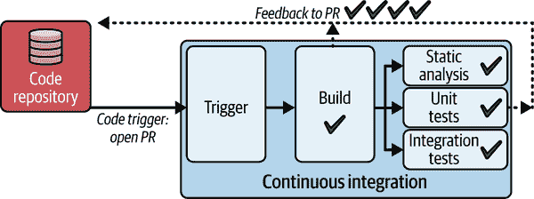

# 第三章\. 持续集成的构建和预部署测试步骤

简而言之，我们现代的软件交付实践提供了一种结构，帮助我们规划、编写、构建、测试和部署软件。在第二章中，我们探讨了 SCM 系统如何帮助我们跟踪和管理代码编写过程中的变更。

在本章中，我们将关注持续集成。展示了我们将很快查看并将在第四章和第八章中再次讨论的 CI/CD 管道。

###### 图 3-1\. CI/CD 管道

我们将探索持续集成管道，重点关注构建过程和预部署测试（静态扫描、单元测试和集成测试）。我们将展示如何通过通用人工智能（GenAI）、代理人工智能（agentic AI）和开放标准，如 MCP 实现，来加速 CI。这些技术使自动化流程、预测优化、标准化上下文管理和智能测试策略在构建、缓存和测试阶段成为可能。

除了关键持续集成步骤之外，我们还将回顾持续集成工具，并讨论在选择时需要考虑的因素。你将了解如何提高构建管道的效率、质量和安全性。

# 软件构建和测试的简史

这是一个熟悉的故事。1947 年，在哈佛马克 II 计算机上工作时，一组工程师发现一只蛾被困在继电器中，导致机器出现故障。他们移除了蛾，并将其贴在日志簿上，注明“首次发现实际虫子案例”，从而巩固了“虫子”与软件错误的联系。在软件开发初期发现机器中的虫子准确地描述了测试。开发者会独立编写代码并集成它们。测试通常是手动和临时的。团队专注于寻找虫子，当发现错误时，从机器中清除“蛾子”。虫子通常在生产中发现，导致延误和不稳定的软件。

随着软件开发的发展，测试变得更加规范和严格，重点是尝试“破坏”软件以发现缺陷。正式的测试方法和标准开始出现，例如 1983 年的 IEEE 829 软件和系统测试文档标准。

## 结构化软件开发和瀑布方法

瀑布式方法引入了一种结构化的软件开发方法，其中测试成为了一个独立的阶段。在需求收集期间定义的验收标准，概述了软件必须满足的条件。然后在开发结束时开发并执行测试用例来验证这些标准。缺陷被记录并解决，直到软件满足所有要求。然而，这种方法通常会在编码和测试之间产生相当大的延迟，使得早期问题检测和解决变得困难，并最终导致新产品和功能的上市时间变慢。

## 敏捷和测试驱动开发

在第一章中，我们讨论了敏捷方法在软件开发中的出现，这是由于瀑布式开发的低效和局限性所驱动的。敏捷方法更灵活、响应更快的开发模型强调了频繁的反馈和迭代开发，这需要新的测试方法来跟上快速的开发周期。这导致了新的测试方法的出现。

极限编程（XP）是由 Kent Beck、Ward Cunningham 和 Ron Jeffries 开发的，是一种由一系列最佳实践定义的特定敏捷方法。极限编程的一个基本实践是测试驱动开发（TDD）。在 TDD 中，你先编写测试然后用代码实现它们。Beck 有影响力的书籍《极限编程解释》（Addison-Wesley），首次出版于 1999 年，将 TDD 推广给了更广泛的受众，而早期的工具如 JUnit（用于 Java）和 NUnit（用于.NET）为开发者提供了框架，使他们能够轻松地在编写相应代码之前编写这些类型的测试。

在编写代码之前编写测试鼓励开发者深入思考期望的代码行为，从而带来更好的设计和更少的缺陷。虽然这个概念之前就存在，但测试驱动开发（TDD）的具体方法——先编写失败的测试然后用代码通过它们——与敏捷对短期周期和频繁交付工作软件的重视非常吻合。这种实践重新定义了完整性的概念：*一个特性不是在代码工作时就完成了，而是在自动测试完成并通过时才算完成*。

在 TDD 期间创建的自动测试提供了一个安全网，让开发者可以自信地重构代码，因为他们知道任何回归都会被测试迅速捕捉。这使迭代更快，发布更频繁，从而允许从客户和利益相关者那里更快地获得反馈。测试本身也充当了一种文档形式，清楚地阐述了系统的预期行为。

## 持续集成登场

正如我们在第一章中介绍的，CI 是将多个贡献者的代码变更自动集成到共享存储库的实践，频繁触发自动构建和测试以确保软件保持工作状态。这补充了 TDD。

[CI 的根源](https://oreil.ly/neqmf)可以追溯到 20 世纪 90 年代。格雷迪·博奇（Grady Booch）于 1991 年首次提出了“持续集成”这个术语，但真正将其付诸实践的是肯特·贝克（Kent Beck）和罗恩·杰弗里斯（Ron Jeffries），他们在 1997 年合作进行一个项目时做到了这一点。他们的目标是解决由不频繁的代码合并引起的“集成地狱”，在那里冲突和错误会累积并变得越来越难以解决。

早期的 CI 系统通常是定制构建并针对特定项目定制的。一个值得注意的例子是 ThoughtWorks 于 2001 年创建的 CruiseControl。它是第一个开源 CI 服务器之一，允许团队在每次代码提交时自动构建和测试软件。然而，它缺乏用户友好的界面和灵活的作业调度，这导致了 2005 年由川口浩（Kohsuke Kawaguchi）开发的 Hudson。Hudson 因其易用性和强大的功能而迅速获得了人气。

2011 年，与 Oracle 的争议导致了[Hudson 被分叉成 Jenkins](https://oreil.ly/MF9WD)，这已经成为持续集成、持续交付和部署中最广泛使用的工具之一。Jenkins 的流行可以归因于其灵活性、可扩展性和庞大的插件生态系统，使其能够与各种工具集成并适应不同的工作流程。

## 当前的持续集成

持续集成已成为现代软件开发的基础实践，CI/CD 系统是任何交付管道的支柱。通过持续集成代码变更，团队已经依赖于以下优势：

减少集成问题

CI 通过确保开发者频繁合并他们的代码变更，最小化冲突并使它们更容易解决，消除了可怕的“集成地狱”。

更快的反馈

CI 的自动构建和测试过程为开发者提供了对其代码变更的快速反馈，使他们能够快速捕捉和修复错误，从而保持一个稳定且可部署的代码库。

提高效率和可靠性

通过自动化构建和测试过程，CI 消除了手动错误和不一致性，从而导致了更可靠和可预测的构建。

提高透明度

CI 仪表板和通知提供了对构建和测试状态的实时可见性，使团队中的每个人都能跟踪进度、识别潜在问题，并更有效地协作。

加速发布

通过简化并自动化构建、测试和集成流程，持续集成（CI）使得更快、更频繁的发布成为可能，使企业能够更快地响应客户反馈和市场变化。

在“CI/CD 流水线中的持续集成”中，我们将探讨 CI 在交付流水线中的作用，并探索 CI 工具的格局。

# CI/CD 流水线中的持续集成

在第二章中，我们介绍了 CI/CD 流水线，重点关注代码仓库与代码集成之间的关系。让我们回到这个流水线，并专注于持续集成，即构建步骤和执行预部署测试类型的步骤，包括静态分析、单元测试和集成测试。

图 3-2 中的流水线显示了典型的 CI 过程。

###### 图 3-2. 由 Git PR 触发的 CI 流水线

此示例在开发者打开拉取请求时触发。此流水线的目标是验证 PR 中提出的更改，在更改合并到主分支之前。让我们看一下步骤：

1. 代码触发

开发者或 AI 代理在托管仓库（例如，GitHub、GitLab、Bitbucket）上打开拉取请求，这会触发流水线。

2. 检出

流水线从 PR 中指定的分支检出源代码。

3. 构建

代码（如果需要）被编译并构建成一个可执行或可部署的工件。

4. 静态分析

类似于 linters 和代码分析器这样的工具会扫描代码以查找样式违规、潜在错误和安全问题。

5. 单元测试

执行自动测试以验证单个代码单元的功能。

6. 集成测试

可以运行相对较快的测试以验证代码不同组件之间的交互。

7. 反馈

流水线向开发者提供有关 PR 状态（成功/失败）和任何发现的问题的反馈。此反馈直接显示在托管仓库上的 PR 中。

此流水线检测并通知开发者代码中存在的任何问题。构建步骤确定代码更改是否破坏了构建。测试步骤回答以下问题：此代码是否按预期工作？此代码是否包含安全漏洞、不安全操作、潜在错误、不良实践、已弃用功能，甚至不一致的格式？

代码流水线通过在打开或更新拉取请求时检测问题并运行快速测试，为开发者提供近乎实时的反馈。它回答关于代码功能、安全和质量的关键问题。然后，开发者可以快速解决问题、完善 PR，或者在所有检查通过时自信地合并它，从而加速开发并确保代码库的健壮性。

（在第四章 Chapter 4 中，我们将探讨当 PR 合并时触发的辅助 CI 管道。此管道将新代码部署到测试环境并执行长时间运行的测试套件。）

注意，虽然我们的示例管道使用代码更改触发器，但 CI/CD 系统通常提供其他触发选项，如计划触发和手动触发，以提供更多灵活性。

## 重要的构建步骤

构建步骤涉及将代码打包成可部署的工件。可部署的工件示例包括容器镜像（用于在 Kubernetes/serverless 环境中部署）、特定语言的包（如 JAR、npm、NuGet 等）和移动应用包（如 APK 或 IPA）等。例如，用编译语言编写的代码，如 C++，首先编译然后链接以创建机器代码。解释型语言通常需要一个构建步骤来将代码打包成中间格式，如 Java 归档（JAR）文件，以便在运行时编译。其他解释型语言，包括 JavaScript，可以通过转译或压缩来优化执行。

根据代码类型，此步骤或一系列步骤依赖于构建自动化工具、任务运行器或构建脚本。

构建自动化工具协调整个构建过程。以下是一些流行的自动化工具示例：

Make 和 CMake

Make 是最古老和最基础的构建工具之一。它使用 Makefile 来定义文件之间的依赖关系和构建它们所需的命令。CMake 是一个较新的跨平台构建系统生成器，可以生成 Makefile、Visual Studio 项目和其他构建脚本。它被广泛用于 C 和 C++项目。

Ant

早期基于 Java 的构建工具，使用 XML 来描述构建过程。它以其灵活性和跨平台兼容性而闻名。

Maven

另一种流行的 Java 构建工具，它不仅限于编译。它管理依赖项、构建、测试和打包项目。

Gradle

一种较新的构建工具，它结合了 Ant 和 Maven 的优点。它使用基于 Groovy 的 DSL 来定义构建，并提供更灵活和简洁的语法。

Bazel

由 Google 开发，Bazel 是一个为大型项目设计的强大构建系统。它以其速度、可扩展性和对多种语言的支持而闻名。

MSBuild

一种常用的构建自动化平台，通常与.NET 框架和 C#、Visual Basic .NET、F#等语言一起使用。

Cargo

Cargo 是 Rust 编程语言的包管理器，用于构建、编译和管理 Rust 项目。

任务运行器自动化开发工作流程中的重复性任务，如压缩、连接和转译。以下是一些广泛使用的 JavaScript 任务运行器：

npm 脚本

Node 包管理器（npm）的一部分，npm 脚本是在*package.json*文件中定义的简单脚本，可以自动化常见任务，如启动开发服务器、运行测试和构建生产版本。

Gulp

使用 JavaScript 代码定义任务的流式构建系统。它以其处理文件的快速和高效而闻名。

Grunt

另一个 JavaScript 项目的任务运行器，Grunt 使用配置文件来定义任务。它以其庞大的插件生态系统而闻名。

Webpack

主要用于 JavaScript 应用程序的模块打包器。它可以将 JavaScript、CSS 和其他资源打包成用于生产的优化文件。

Rollup

另一个以生成比 Webpack 更小、更高效的包而闻名的模块打包器。

最后，构建脚本通常是自定义脚本（通常用 Bash、Python 或其他脚本语言编写），用于定义构建项目所需的特定步骤和命令。这些可以与构建自动化工具或任务运行器一起使用。

## 通过静态分析优先考虑质量和安全性

在我们构建代码后立即运行静态分析工具，这些工具可能包括代码检查器。代码检查器是一种特定的静态分析工具，用于检查编码风格（例如，确保一致的格式化和命名模式）；对于 JavaScript 这样的解释型语言，代码检查器检查拼写错误、缺少分号或语言使用不当。这些工具在执行代码之前检查源代码，类似于在发布文档之前校对文档。它们有助于在开发早期阶段识别潜在问题。静态代码分析包括一系列技术，用于评估代码：

潜在的 bug

识别常见的编程错误，如空指针解引用、资源泄露或逻辑错误

安全漏洞

检测可能导致 SQL 注入、跨站脚本（XSS）或其他利用的不安全编码实践

代码异味

标记可维护性问题，如重复代码、过度复杂或未使用变量，建议重构区域

遵守标准

强制执行特定的编码指南和最佳实践，有时是针对特定语言或项目的，确保一致性和可读性

通过将这些静态分析工具集成到开发早期阶段，我们不仅确保代码质量，还实施了一种称为左移安全性的最佳实践。左移安全性指的是在开发最早阶段实施安全实践的战略。我们将在第五章（Chapter 5）中深入了解左移安全性，并探讨 AI 如何帮助快速修复安全问题。

## 自动化测试：尽早测试，经常测试

自动化测试是 CI/CD 管道的基本组成部分。在我们的示例管道运行静态分析检查后，它将针对新代码执行单元和集成测试。让我们看看这些测试类型：

单元测试

这些测试验证了最小的隔离代码片段（单元），例如函数或方法，以验证它们在隔离状态下是否按预期行为。想象一个简单的天气应用程序，它从外部 API 获取天气数据，处理它，并将其显示给用户。单元测试可能会测试处理原始天气数据的函数，验证它们是否正确地将数据转换为所需的格式。这些测试仅验证转换逻辑。

集成测试

这些测试专注于验证软件模块之间的交互，确保适当的通信和数据交换。集成测试相对较快，通常在单元测试之后进行，并且，像单元测试一样，有助于早期发现问题。对于同一个天气应用，集成测试可能关注数据获取和处理模块之间的交互。这些测试可以验证应用是否正确地从 API 检索和处理天气数据，包括错误场景，使用部分模拟来模拟真实的 API 响应。与单元测试不同，单元测试是隔离组件的，而集成测试评估多个组件如何协同工作。在管道早期使用的集成测试，例如在我们的示例管道中，应避免像访问数据库、文件系统或其他外部系统这样的慢操作。

单元和集成测试框架众多，且因语言而异，例如：

Java

JUnit 5 和 TestNG 是单元测试的框架。Mockito 和 Spring 用于 Java 的集成测试。

JavaScript

Jest 和 Mocha 用于 JavaScript 的单元测试，Jest 也支持集成测试。

Python

pyTest 和 pyUnit（UnitTest）是单元和集成测试的选项。

.NET

NUnit 和 xUnit 用于.NET 的单元测试，而 Moq 和 NSubstitute 通常用于集成测试。

Ruby

RSpec 支持 Ruby 的单元和集成测试。

移动（iOS/Android）

XCTest 用于 iOS 和 Espresso 用于 Android 是移动单元和集成测试的标准标杆。

单元和集成测试作为第一道防线，提醒开发者他们的代码中可能存在的潜在错误或回归。这些快速、自动化的检查只是我们测试策略的开始。在第四章中，我们将探讨当 PR 关闭并合并时触发的后续管道。

详尽地测试每一行代码，包括所有可能的场景，结果是一个庞大但至关重要的测试套件——即使是看似简单的代码。然而，由于单元测试是隔离的，并且不依赖于外部资源，它们执行得很快。

我们的管道优先考虑这些快速的单元测试作为基础，然后是验证不同组件如何协同工作的集成测试，最后是数量较少的综合端到端测试，这些测试模拟真实世界的使用。

在“测试金字塔”中，我们将探讨测试金字塔框架，它说明了如何平衡不同测试类型以实现最佳软件质量。

## 测试金字塔

测试金字塔提供了一个战略性地构建测试的模型，根据测试的范畴和速度优先考虑不同类型。虽然测试金字塔有时会以每层特定的测试类型来表示，但我们更倾向于将包含广泛测试类别的层概念化，如图 3-3 图所示。

###### 图 3-3. 大量快速测试构成了测试金字塔的基础；较小且较慢的测试集形成了金字塔的较高层

我们金字塔的基础是预部署测试，包括单元测试、集成测试和静态扫描等类型。这些测试都是小型的，执行速度快。集成测试可以指代一系列测试策略。不与外部系统（如数据库和网络服务）交互的集成测试速度快，并包含在这一层级。金字塔宽阔的底部反映了这些测试类型套件应该很大，理想情况下覆盖整个代码库。测试应该设计成能够为开发者提供快速反馈。

随着金字塔的上升，我们将中间层描述为包括任何针对预生产测试环境中的已部署代码执行的测试类型。通常，这些测试比上面提到的测试慢，但提供了关于系统整体功能的宝贵见解。

在金字塔的顶端，我们发现手动测试。这些测试缓慢且劳动密集，发生在代码经过自动化测试层审核之后。

采用金字塔方法可以使团队在测试工作中平衡速度、成本和有效性。通过专注于小型且快速的测试基础，并辅以对已部署代码的战略性测试，我们可以在最小化所需时间和资源的同时，实现全面的测试覆盖。

有效的测试策略是简化流程、加速高质量发布的关键。在“持续集成工具”中，我们将探讨 CI 工具选择如何优先考虑这一因素。

# 持续集成工具

有效的 CI 流程对于现代开发团队至关重要。在本节中，我们将探讨传统 CI 工具和现代工具的特征性功能。

一家主要的国家零售商——我们的客户——预计数字需求将激增，发现自己处于十字路口。其传统的 CI/CD 工具，包括 Jenkins，在客户端的网页、移动和后端服务团队中是分散的，导致构建时间过长，每年为公司浪费了高达 50 万美元的开发者闲置时间。这些工具不仅抑制了创新，还带来了重大的安全风险，而每年 80 万美元的维护和定制脚本费用进一步加剧了这一风险。这笔巨额投资将资源从提升客户体验中转移开来。面对日益严峻的挑战和不断上升的成本，零售商寻求一个统一的 CI/CD 平台，以简化操作、加速创新并加强安全性。

公司所面临的复合挑战揭示了 Jenkins 内在局限性的本质，尤其是在组织规模扩大和数字需求加剧的情况下。让我们来看看其中的一些局限性。

## 考虑 Jenkins

Jenkins 应该得到认可，因为它将持续集成引入了主流。作为一个开源自动化服务器，Jenkins 利用庞大的插件生态系统来扩展其功能和特性，并使用户能够无限定制他们的管道。Jenkins 插件市场是一个中央仓库，用户可以在这里找到并安装数千个这些社区开发的插件。Jenkins 社区规模庞大，其文档内容广泛。它是一个适应性强、适用于各种开发环境的解决方案。

尽管 Jenkins 由于其专业的插件（例如，大型机）对遗留系统仍然有价值，但现代 CI 管道需要更多。今天的开发环境需要能够提供速度、安全性、协作工作流程以及与多个提供商的云技术、Kubernetes 调度和容器化应用程序的本地集成的 CI 工具。以下部分将探讨一些使 Jenkins 对于这些现代需求不太适合的具体挑战。

### 插件复杂性

Jenkins 的灵活性和广泛的插件生态系统往往会导致复杂且分散的架构，阻碍了可维护性并增加了开发者的工作量。对 Groovy 脚本进行管道定制的依赖性可能会使故障排除和更新变得繁琐，尤其是在管道数量和复杂性增加的情况下。

此外，现代的 CI/CD 解决方案通常采用“代码化流水线”范式，使用如 YAML 这样的声明性语言来定义流水线。这种方法通常被认为比 Jenkins 脚本密集型方法更直接、更易于维护。基于 YAML 的流水线通常比 Groovy 脚本更易于阅读和维护（可能有例外），因为随着流水线规模和复杂性的增加，Groovy 脚本可能会变得复杂且难以调试。将流水线定义为代码允许它们与应用程序代码一起存储在版本控制系统中。这确保了流水线更改可被跟踪、审查和审计，从而在团队成员之间实现更好的协作。因此，代码化流水线方法允许更好的版本控制、协作和更易于故障排除。

最后，管理大量具有各自配置的插件，引入了维护开销。团队成员发现自己花费宝贵的时间在解决插件冲突、更新依赖项和解读晦涩的错误信息等日常任务上。这分散了对创新和核心开发的关注，减缓了创新并影响了功能的交付。

### 可扩展性挑战

Jenkins 的架构主要是为单服务器设置设计的，当作业、流水线和用户数量增加时，往往难以高效扩展。这可能导致性能瓶颈、较慢的构建时间和整体系统不稳定。虽然 Jenkins 提供了分布式构建和集群选项，但设置和维护这些解决方案可能很复杂且资源密集，需要专业知识和大量开销。因此，为了满足大型组织或高吞吐量 CI/CD 工作流程的需求，[水平扩展 Jenkins](https://oreil.ly/6qFLO)通常成为一个主要挑战。

### 安全问题

虽然 Jenkins 插件提供了可扩展性，但它们也引入了潜在的安全漏洞。每个插件，都有其自己的代码库和依赖项，扩大了 Jenkins 实例的攻击面。监控这些插件以发现漏洞并确保及时更新成为管理员持续的工作负担。此外，配置 Jenkins 安全，包括用户权限、访问控制和网络配置，可能非常复杂。配置错误可能会使系统面临未经授权的访问或恶意活动。插件生态系统的动态性和配置错误的可能性意味着您必须对 Jenkins 环境中的风险保持警惕，并主动减轻风险。

### 资源使用和效率问题

Jenkins 的资源消耗可能是一个重大的缺点，特别是随着作业和插件的增加。基于 Java 的架构（JVM 的运行时要求、垃圾回收行为和框架抽象）通常会导致高内存使用，管理大量并发构建可能会对 CPU 和磁盘资源造成压力。这可能导致构建时间变慢、基础设施成本增加以及潜在的性能问题。在更大的环境中，水平扩展 Jenkins 可能变得复杂且资源密集，需要额外的硬件和仔细的配置。

此外，在 CI 流程中构建 Docker 镜像可能会迅速变得资源密集和昂贵，尤其是在处理大型代码库或频繁提交触发大量并行构建的情况下。每个镜像都需要计算资源、存储空间和网络带宽——这些成本在环境和分支之间成倍增加。同样，虽然全面的可观察性提供了有价值的系统洞察，但过度实施日志记录可能会产生其自身的问题：存储成本激增，信噪比降低，处理开销增加。在全面覆盖和资源效率之间找到正确的平衡仍然是一个关键挑战。

## 超越 Jenkins

由于 Jenkins 的局限性，像我们这样的国家零售商通常会超出其能力范围，并寻求现代、全面管理的解决方案，这些解决方案提供：

内置、全面支持的构建块

现代 CI/CD 工具提供了丰富的内置、全面支持的构建块库，这些构建块简化了流程设置。这消除了对社区维护的插件的依赖，确保了可靠性和稳定性。然而，认识到定制化的需求，大多数解决方案仍然支持通过自定义插件进行扩展。这赋予了团队自动化独特工作流程并定制 CI/CD 环境以满足其特定需求的能力。

声明性定义流程

现代 CI/CD 工具使用如 YAML 这样的声明性代码简化了流程定义，这使得它们比 Jenkins 的 Groovy 脚本更易于访问和维护。这加快了设置速度，并最小化了与手动脚本相关的错误。

对容器化和编排的原生支持

Jenkins 诞生于 Docker 和 Kubernetes 的广泛应用之前，虽然 Jenkins 流程可以使用插件来处理和编排容器，但缺乏原生支持通常会导致配置繁琐。相比之下，新工具无缝地结合了容器化和编排功能，简化了在容器化环境中的应用部署和管理。

在接下来的章节中，我们将探讨比 Jenkins 更新的工具提供的其他现代功能。在我们转向这些功能之前，让我们考虑在考虑 CI/CD 工具时一个基本问题：是自己托管和管理工具，还是选择完全托管的解决方案。这个决定将影响从开发速度和成本效益到维护要求的一切。鉴于移动设备的重要性，选择一个能够处理构建和部署移动应用程序复杂性的 CI/CD 设置至关重要，我们将探讨特定于移动应用程序开发的考虑因素。

### 托管选项

组织在为其 CI/CD 系统选择基础设施时，有三个主要选项：自托管本地、自托管云和供应商托管（云）。每个选项都提供了独特的优势和劣势，这些都应该仔细考虑：

自托管、本地解决方案

在本地自托管 CI/CD 系统提供了对其基础设施和数据的完全控制和所有权。这种方法允许最大程度的定制，能够根据特定的安全协议和组织需求进行定制。此外，一些组织可能更喜欢与本地解决方案相关的单次付款模式。然而，这种方法有几个缺点。它需要大量前期投资于硬件和软件，以及维护和更新的时间和精力。持续维护的需求和潜在的扩展挑战可能会对资源造成压力，尤其是对小型组织而言。

自托管、云解决方案

自管理的云托管模型在控制性和可扩展性之间取得了平衡。组织对其 CI/CD 软件保持控制权，同时利用云的灵活性和可扩展性。这种方法减少了物理硬件的需求，与本地解决方案相比，简化了扩展。

云托管的应用程序在称为虚拟机的虚拟环境中运行，在考虑云托管时，您选择的虚拟机类型将影响简单性和性能。需要了解的两种虚拟机类型是：

类型 1 硬件裸机虚拟机

这些直接在硬件上运行，提供卓越的性能和隔离性，但需要专用硬件。

类型 2，嵌入式虚拟机

这些在操作系统之上运行，提供更简单的设置和灵活性，但可能性能较低。

硬件裸机可能更适合要求高、安全性高的设置，而嵌入式可能适合需求较低和预算有限的情况。

任何云托管的工具集都将需要持续维护和更新，并且您的组织将负责管理云基础设施。这可能导致与本地解决方案类似的问题，尽管可能降低了前期成本。

完全托管、供应商托管解决方案

供应商托管的 CI/CD 解决方案提供完全管理服务，其中供应商负责基础设施、维护和更新。您的组织专注于开发而不是基础设施管理。这些解决方案具有高度的可扩展性、易于使用，并且通常遵循按使用付费的模式，使其具有成本效益。然而，它们可能提供的定制化程度不如自托管选项，并可能限制您组织根据特定需求定制系统的能力。此外，使用这种方法可能会出现关于数据安全和潜在供应商锁定的问题。

### 移动应用程序开发特定挑战

拥有一个强大且高效的 CI/CD 解决方案对于跟上快速发布周期和移动用户期望的高质量应用程序至关重要。为移动设备开发带来了独特的挑战：您的过程和 CI/CD 工具必须能够管理设备碎片化和频繁的移动操作系统更新。

在选择自托管和完全管理 CI/CD 解决方案之间时，请考虑自托管解决方案虽然提供控制和定制，但可能导致物理硬件限制等挑战。此外，您的团队将负责构建环境的持续维护和更新。这些复杂性可能导致意外的成本。iOS 开发工具如 Xcode 的频繁发布周期需要定期硬件更新，这可能对任何团队都是一个重大的时间和资源消耗。

完全管理的 CI/CD 解决方案，另一方面，通过提供构建环境的自动更新和可预测的成本来缓解这些痛点。这使得您的团队能够专注于构建功能和改进他们的应用程序，而不是管理基础设施。此外，专门针对移动开发进行优化的完全管理 CI/CD 解决方案提供特定的移动集成和功能，从而简化了开发过程。许多这些平台完全管理移动开发的挑战，例如设备碎片化和操作系统更新。

## 现代功能以加速软件构建

回到我们的零售商：它研究了新的选项，并决定从 Jenkins 以及与之一起工作的插件和工具组合中退出。公司选择了一个统一的平台，简化了其工具集，同时提供了所需的可扩展性和成本节约。它能够将服务、客户端网页和移动团队的 CI/CD 流程整合到这个单一平台上。新的平台消除了大量脚本的需求，节省了开发者的时间，并使他们能够专注于创新。它还利用 AI/ML 进行测试，从而进一步节约成本并加快构建速度。此外，统一的平台通过在管道早期支持安全测试来提高安全性，从而加快了漏洞的检测和修复。新平台的高效性、安全性和可靠性使零售商能够轻松应对其数字增长。

在接下来的几节中，我们将探讨现代系统中使管道更快、更经济高效且更安全的特性。

### 使用缓存加速构建

现代构建环境是短暂的，通过提供隔离的、成本效益高且可扩展的设置来增强敏捷性，这些设置可以加速开发周期，同时在 CI/CD 管道的各个阶段保持一致性。然而，短暂的构建环境需要每次从头开始设置整个构建过程，包括下载依赖项、编译代码和生成工件。这非常耗时。

缓存是 CI/CD 中用于存储和重用构建工件、依赖项、Docker 层和中间结果的技巧。通过避免冗余操作并专注于仅构建已更改的内容，这显著减少了构建时间，不仅加快了开发周期，还节省了计算资源和能源。现代 CI/CD 系统智能地管理此缓存过程，无需人工干预即可优化构建。缓存可以在不同的阶段进行——缓存软件依赖项、缓存 Docker 层以及缓存 Bazel、Gradle 和 Maven 等工具的构建输出。

### 使用 AI 简化构建、缓存和测试

一个 AI 原生 CI 解决方案将无缝集成 GenAI、代理 AI 和 MCP，以增强构建软件、缓存所需组件和测试每个构建。让我们更详细地看看这些增强功能。

#### 构建阶段增强

GenAI 可以自动化重复性任务的样板代码创建（例如，Dockerfile 模板、CI 配置文件），从而减少人工工作量。它还可以分析历史构建数据以预测依赖项冲突并建议最佳版本，从而最小化构建失败。GenAI 的另一个有趣用例是根据项目结构生成优化的 CI 管道 YAML 配置，从而减少试错设置。

代理 AI 可以检测构建失败（例如，缺少依赖项），然后可以自动使用修正的配置重新尝试，并记录根本原因。它还可以根据工作负载需求动态扩展构建资源（例如，云实例），平衡速度和成本，并且可以动态地将单体构建拆分为可并行化的任务，从而减少执行时间。

MCP 可以在分布式团队之间标准化环境变量、构建标志和工具链版本，确保一致性，并通过 MCP 的集中式缓存共享预构建工件，如编译库，从而避免冗余构建。

#### 缓存阶段增强

生成式人工智能（GenAI）可以用来使缓存技术更加智能。它可以根据代码更改预测需要哪些依赖项（例如，*node_modules*、*.m2*工件），并在构建开始前预先缓存它们。机器学习模型可以通过分析代码差异模式来识别过时的缓存，确保只保留相关的工件。代理式人工智能可以实时标记并清除受污染的缓存（例如，损坏的工件），防止构建失败。

在可扩展的基础设施中使用 MCP（多容器平台）有许多优势，包括通过标准化 API 实现跨 CI 管道的安全、低延迟缓存共享，以及通过在 CI 运行之间缓存中间构建输出（例如，Docker 层）来减少冗余数据传输。MCP 可以通过标准化 API 在并行 CI 作业之间启用安全的缓存共享，消除单仓库架构中的冗余构建。

#### 测试阶段增强

考虑这样一个场景：一个开发者在一个大型应用程序中修改了一个很少使用的组件中的一行代码。我们拥有大量且健壮的单元测试，代码覆盖率很高；这些是测试策略的基础，也是测试金字塔的基石。然而，当代码变化很小的时候，执行整个测试套件会导致漫长的、资源密集型且非常低效的测试周期。

现代工具可以通过使用人工智能工具来缓解这些问题，这些工具可以智能地选择和执行仅与修改的代码直接相关的测试。这种方法显著减少了测试所需的时间和资源，从而加快了反馈循环并提高了开发过程的效率。

[利用测试智能（TI）](https://oreil.ly/_-jPi)是这种方法的例子。让我们看看 TI 在底层是如何工作的。三个组件协同工作以启用 Harness TI：

TI 服务

此服务使用人工智能并理解您的仓库、Git 提交和单元测试，并使用这些数据动态构建一个图，映射代码方法和它们对应的单元测试之间的关系。此图会持续更新以反映代码库中的变化。

测试运行代理

此组件与服务通信并执行测试。

测试步骤

这是您添加到持续集成（CI）管道中的步骤，以将测试智能（TI）集成到工作流程中。

测试智能（TI）工作流程从开发者发起拉取请求并触发管道开始。TI 服务分析代码更改并将其与自己的图进行比较，以确定需要执行的测试。它不仅考虑代码修改，还包括对测试本身进行的任何更改或添加。这确保了代码库的所有相关方面都得到了彻底的测试，同时避免了冗余的测试运行。

因此，通过关注受影响的测试，智能测试方法可以显著减少测试时间，尤其是在具有广泛测试套件的大型项目中。这转化为更快的构建和更快的开发者反馈，使他们能够更快地识别和解决问题。

### AI 驱动的构建和测试洞察

现代 CI/CD 工具还利用 GenAI 自动化繁琐的任务，并在出现问题时提供洞察。例如，一个工具可以自动生成您的管道，分析代码以查找潜在问题，并在实时中解决构建和部署失败。如果 CI 构建失败，GenAI 可以分析日志文件，定位错误，甚至提出可能的修复方案。这节省了您的时间，减少了停机时间，并加速了软件交付过程。

代理 AI 还可以用于根据您组织的黄金标准提出优化现有管道的建议。这个功能将非常有价值，因为组织往往更倾向于优化现有管道而不是创建新管道。

GenAI 的另一个优秀用例是编写基于意图的测试。测试，尤其是 UI 测试，如果 UI 发生变化，可能会非常手动且不可靠。通过使用 GenAI，开发人员和 QA 工程师可以简单地陈述测试的意图，让 GenAI 找出步骤。我们将在第四章中详细讨论基于意图的测试。

最后，AI 还可以用于以道德和负责任的方式生成测试数据。一些例子包括在使用生产数据训练模型时确保符合 GDPR 和其他法规，在整个数据生成过程中维护数据隐私和安全，以及使用适当的算法生成合成数据。

### 将 CI/CD 指标与企业可观察性统一

现代 CI/CD 解决方案应该是一个团队玩家，与您企业生态系统中其他关键平台协同工作，尤其是您组织依赖的用于理解系统行为、识别性能瓶颈、并在影响用户或业务运营之前主动检测和解决问题的可观察性平台。可观察性平台包括 Elastic 与 Logstash 和 Kibana，一个流行的开源平台，以及 Datadog 和 Splunk，知名的商业选项。

现代持续集成工具通过实现开源框架 OpenTelemetry 向这些平台提供遥测数据。这引入了 CI/CD 指标，以实现可观察性和仪表板，这些仪表板可以帮助您了解正在发生的事情，并提高构建性能和可靠性。

### 对 monorepos 的现代 CI/CD 支持

当在多个仓库中管理复杂的代码库时，版本控制和依赖管理变得极具挑战性。Monorepos 是包含一个项目或组织所有代码的单个仓库，提供了一种集中式管理复杂代码库的方法。单个仓库通过保留任何共享库或组件的单个副本来简化依赖管理，并简化了不同项目之间的代码共享和复用。虽然 monorepos 增加了合并冲突的风险，并需要谨慎设计以避免代码紧密耦合，但许多大型公司已成功采用它们来管理庞大的代码库，证明了有效管理的 monorepo 可以提供非常可扩展的方法。

在采用 monorepo 策略时，了解 monorepos 对代码仓库和 CI 工具的独特要求非常重要。在可能数百名开发者向大型 monorepo 贡献时，高效管理变更和拉取请求变得至关重要。团队必须能够定义适当的子目录访问权限，部分是为了确保每个变更只通知相关的审阅者。仓库应支持特定子目录的所有权。

Monorepos 需要能够选择性地构建和测试已更改组件的 CI 系统，并支持高级依赖管理、缓存和并行执行。像 Harness CI 这样的工具通过诸如基于路径的触发器等特性来支持这些需求，这些触发器仅在仓库中的特定目录更改时运行管道（例如，触发服务 A 的管道以更改 *serviceA/*），以及稀疏检出，它克隆子目录而不是整个仓库。这优化了资源使用并加快了反馈循环，同时保持依赖完整性。

# 摘要

CI 已成为不可或缺的实践，减少了集成问题，提供了更快的反馈，并提高了整体效率。在本章中，我们探讨了现代、完全管理的 CI/CD 工具的功能，对比了自托管的开销和挑战。我们探讨了优先考虑更快、更小的单元测试以获得快速反馈的重要性，然后是更慢的测试类型以实现全面覆盖。我们探讨的持续集成管道体现了这一实践：在打开 PR 的上下文中，我们构建、完成静态扫描，然后运行快速测试以确保我们的代码按预期工作且不会引入回归。我们还探讨了 AI 原生 CI 工具如何利用 GenAI、代理 AI 和 MCP 来增强 CI 的构建、缓存和测试阶段。

在第四章中，我们将继续探讨 CI/CD，重点关注部署到测试环境和执行评估系统性能、弹性和端到端行为的较慢测试。
