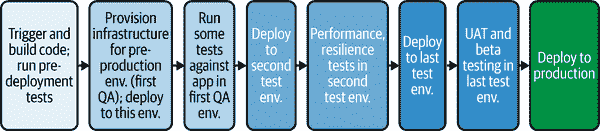
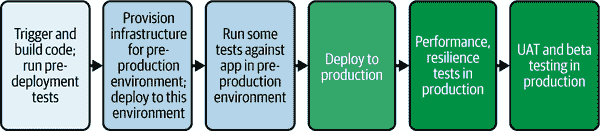

# 第四章\. 部署到测试环境

在第三章中，我们探讨了持续集成的原理，重点关注 CI/CD 管道的早期步骤：主要是构建和预部署测试。我们通过一个示例管道进行了说明，该管道在打开 PR 时触发，如图图 4-1 所示。

###### 图 4-1\. CI 管道

此管道构建和打包了代码，进行了静态代码分析，并执行了早期快速测试，包括单元和轻量级集成测试，为 PR 提供构建和测试反馈。这些步骤确保了 PR 中的代码是可合并的，提供了信心，即合并的代码将按预期运行，不会引入任何回归。假设 PR 中的代码更改已证明就绪，开发者可以合并 PR。

在将新代码合并后，下一步是准备生产，通过部署到测试环境并运行一系列测试。人工智能和机器学习工具正在集成到部署过程中。这些工具帮助团队做出更好的部署决策，主动识别潜在问题，并简化验证过程。实施良好的 AI 实际上减少了开发者的认知负荷，同时提高了部署的可靠性。

在 CI 步骤和生产发布之间，我们主要关注测试。我们想了解发布是否适合我们的用户。如果发布是安全的，我们希望快速将其提供给用户，以增强用户体验，并可能推动客户参与度和忠诚度的提升。如果我们的软件存在问题，我们需要快速检测并解决它。这种动态是发布有价值更新的障碍，缺陷引入和将其反馈给开发团队之间的时间越长，涉及的开发者对工作的记忆就越不清晰。他们需要花费更多的时间和精力熟悉这些代码部分，使得修复成本更高。如果一个开发者已经深入到他们的下一个任务中，那么这个任务可能会被打断，完成成本也会更高。

当发布准备就绪时，我们将发布版本部署到一或多个环境中，以便我们可以对运行中的代码进行测试。在这些预生产环境中，我们弥合了开发和实际使用之间的差距，确保我们的软件不仅功能正确，而且为实际场景做好了准备。

图 4-2 展示了我们整个交付过程的高级概述。越来越多地，人工智能被嵌入到整个管道中，以加强测试和部署决策。

###### 图 4-2\. 高级交付过程

在本章中，我们将探讨提供基础设施、部署到一个或多个预生产环境以及针对软件进行测试的步骤。此外，我们还将涵盖以下关键最佳实践：

+   使用 IaC 创建与生产环境一致但规模较小的底层环境

+   使用“类似生产”的部署来一致地移动你的应用程序

+   将测试与部署管道连接

+   选择在部署中应用 AI 的地方以及需要保持谨慎的地方

在管道的这个阶段是一个关键点，开发与运维的关切在此交汇。通过理解和实施这些最佳实践，你将准备好确定适合你特定项目需求的最优测试环境数量和类型，无论项目大小或复杂度如何。你将了解如何平衡开发速度和运营稳定性，确保你的软件经过彻底测试且准备好发布。

# 建立统一的部署流程

在我们继续在通往生产的交付管道中导航时，我们需要考虑必要的部署步骤和部署环境。对于一个可预测和可靠的交付流程，我们需要可预测和可靠的部署步骤和环境。

在本节中，我们将介绍最佳实践，以提供我们从测试到生产所追求的可预测性和可靠性。在第八章中，我们将更详细地介绍生产发布和生产环境。

## 对每个环境进行一致的部署

自动化是 DevOps 的基础，我们交付管道的关键功能之一就是自动化我们预生产环境的设置以及向这些环境部署。正如我们需要在将软件发布到野外之前验证我们的软件一样，我们需要有措施来验证我们部署软件的方式。

我们通过始终如一地使用与部署到生产环境相同的方法来部署到预生产环境，来实现这一点。这种一致性测试了我们的部署方法，并最小化了在重复这些步骤将我们的软件部署到生产环境时出现意外问题的风险。

以下最佳实践有助于提供我们追求的可预测性。

### 使用一致的工具

对于开发者使用简单的工具启动自己的轻量级部署流程，将应用程序部署到测试环境，而运维团队则专注于使用企业工具针对生产部署的过程，这种情况并不罕见。这种流程之间的不一致性导致更改以“有问题时”为基础进行沟通，开发者将更新他们的流程，但直到出现问题才会忘记通知运维团队。

应该避免这种方法，因为它限制了非生产环境中测试的有效性，并导致自动化脚本的重复工作。相反，为所有部署采用统一的工具集。

鼓励一致性的一个方法是为开发者提供简单、预制的模板管道，称为“黄金管道”或“铺路”。我们将在第十章中更详细地探讨这一点。至少，你的开发和运维团队需要就执行部署的常用工具达成共识。

### 使用一致的管道步骤和部署策略

不论你是在使用 CI/CD 工具还是自定义部署脚本，动作的顺序应该在各个环境中保持一致。像金丝雀或蓝绿部署这样的高级部署策略通常是基于降低生产部署的风险来选择的。如果你的生产环境使用这些策略，请在你的预生产环境中复制它们。同样，如果你打算在生产环境中使用功能标志来发布单个功能，请使用功能标志在测试环境中推出这些功能。这种一致性最小化了在部署过程中引入差异或疏忽的可能性。

我们将在第七章和第八章中更详细地介绍生产部署和这些渐进式部署策略。目前请注意，你使用的步骤和策略应该在每一级都得到复制。虽然测试环境可能因为成本或资源限制而较小，但部署时应该像对待生产环境一样。例如，在生产环境中，滚动部署可能会一次部署两个节点到 10 个目标，而在测试环境中，你可能一次只部署一个节点到 3 个目标。这种方法确保了你的生产部署步骤和策略在每次部署到测试环境时都得到了彻底的测试。

在第七章中，我们将深入探讨如何使用 AI 技术验证部署在其新环境中不会引起问题。这些相同的方法应该在下级环境中使用，以验证它们是否正常工作，并保护我们的测试不会在错误的安装上运行。

### 使用参数化来处理差异

环境之间不可避免地会有差异。目标名称、服务 URL 和密码可能不同。不要为每个环境创建独特的部署脚本，而是利用变量来适应这些差异。这允许你维护一个单一、可适应的脚本或管道，它可以在运行时针对特定环境进行调整。

通过在部署中保持一致性，你将创建一个强大且可靠的交付管道，这会增强你团队无缝且高效发布软件的能力的信心。

### 利用 AI 加速管道创建

在第三章中，我们讨论了自动管道创建。模板化仍然是一个好的模式——你希望你的 AI 利用你组织的模板，并为你的项目和团队拉入正确的调整和变量。无论是由你还是 AI 创建或维护管道，管道代码需要管理的越少，越好。

### 利用基础设施即代码实现部署一致性

我们希望有一个一致且可预测的环境来交付我们的发布到生产环境。基础设施即代码（IaC）为我们提供了一种方法，不仅能够实现一致性，还能像对待代码资源一样，以同样的细心和控制来管理我们的配置。在其核心，IaC 将基础设施配置视为软件代码。

工程师在本地对 IaC 代码进行更改并在他们的开发环境中进行测试。这些更改随后被提交到 VCS 中，就像应用程序代码一样。通过管理我们的 IaC，我们利用了 VCS 和 CI/CD 管道的这些功能。

作为代码的本质使得 IaC 迅速成为从大型语言模型中受益的 DevOps 领域。AI 编码助手能够很好地生成和解释 IaC 代码，降低了开发者和管理基础设施的专业人士采用新的 IaC 语言的门槛。对于能够访问来自环境或结合云成本特征与 IaC 管理的 DevOps 平台的云服务提供商，未来的代码生成工具可能会根据实时工作负载整合以下运行时优化：

协作和代码审查

版本控制允许多个团队成员同时工作在文件上，并管理冲突。我们可以定义并强制执行策略，要求对基础设施配置变更进行代码审查。

分支和实验

版本控制允许你创建分支，以实验不同的配置而不影响主生产环境。

可追溯性和可审计性

版本控制系统（VCS）提供了你配置设置变更的完整历史记录。提交信息和变更历史有助于你理解系统为何会演变，审计跟踪对于支持符合安全框架至关重要。

回滚和恢复

如果基础设施配置更改导致问题，你可以快速回滚到先前的有效版本，最小化停机时间和对系统的影响。此外，在灾难性故障的情况下，你可以使用你的版本控制的配置来恢复系统到一个已知的工作状态。

自动化测试

交付管道可以对 IaC 代码运行自动化测试，包括语法检查、安全扫描和合规性测试。然后，这些更改将应用于预发布环境进行集成测试，最后，它们通常使用谨慎的发布策略升级到生产环境。

安全性

版本控制可以帮助强制执行配置更改的安全策略和控制，确保只有授权人员才能进行修改。

考虑一个在技术行业中许多人都非常熟悉的场景：一个应用程序在开发中工作得完美无缺，在预发布中运行顺畅，但部署到生产环境时却陷入混乱。这种差异通常源于环境之间基础设施配置的不一致性。通过 IaC 配置定义，你可以确保从开发到生产，每个环境都得到相同的配置。

这种有条理的过程确保你的基础设施以可控、可预测的方式发展。它通过消除环境之间的意外差异来消除“在 QA 中工作”的问题。通过以与你的应用程序代码相同的尊重和严谨对待你的基础设施，你将获得一致性、可靠性和敏捷性。

IaC（基础设施即代码）除了控制和一致性之外，还提供了几个优势。只需一个命令，你就可以启动新的环境，这些环境是现有基础设施的精确副本。这不仅使你的流程可重复，还充当了准确、动态的文档。由于环境可以轻松创建和销毁，当不再使用时可以将其拆除，从而节省资源并降低成本，同时有信心可以轻松重建。

要有效地实施 IaC，你需要合适的工具，并且有几种流行的选项可供选择。Terraform 和其更开放的分支 OpenTofu 采用云无关的方法。如果你完全依赖于特定的云提供商，则原生的工具，如 AWS CloudFormation 或 Azure Resource Manager，可能更合适。

## 利用 GitOps 中的 Git 工作流程

GitOps 是一种基于代码仓库功能的新兴且越来越受欢迎的软件部署方法。采用 GitOps 方法，你可以在版本控制的配置中描述基础设施的期望状态。这种描述是声明性的。GitOps 工具包括一个代理，该代理会定期将实际环境和 Git 控制的配置中描述的期望状态进行协调。你不需要运行脚本直接部署软件，而是通过更新代码仓库中的配置来启动软件部署。这种方法和 GitOps 工具通常用于 Kubernetes 环境，以在机器集群之间编排容器化应用程序。

采用这种方法，您依赖代码仓库来执行安全控制、提供治理并实施您组织的政策，例如通过代码审查和批准进行监督。您的更新是可追溯和可审计的。您可以协作、实验，并回滚用于部署软件的配置更新。一旦您进行了更新并将其合并，GitOps 协调代理就会完成剩余的工作，获取更新并实施对目标环境的更改。

这种方法之所以受到欢迎，是因为管理描述复杂编排云系统的复杂配置是一个非常适合代码仓库功能的用例。此外，GitOps 解决了环境漂移的问题；也就是说，环境从期望状态进行了操作性的改变。协调代理自动检测并修复，以防止环境中出现不一致。

虽然 GitOps 方法很强大，但在 CI/CD 交付管道中使用 GitOps 方法部署比简单地用脚本推送您的应用程序更新要复杂得多。使用 GitOps，您的管道必须自动化以下步骤：

1.  从您的代码仓库检索配置。

1.  更新配置以引用您应用程序的最新版本。

1.  将更新后的配置合并回 Git。

GitOps 协调随后继续进行。

您还可能遇到在多个集群中地理复制的应用程序的复杂性。由于许多 GitOps 协调器优化于部署到单个集群，因此保持一致性和跨集群同步可能很困难。您可能需要在单一真相来源的需求与某些配置需要针对特定集群定制的事实之间取得平衡。商业 GitOps 工具通常在这些更复杂的场景中提供编排和可见性，扩展了开源提供的功能。

尽管存在这些挑战，但在协作、可追溯性和自动化协调方面的好处使 GitOps 成为那些广泛利用 Kubernetes 的组织的有吸引力的选择。

# CI/CD 管道中的持续交付、部署和测试

既然我们已经了解了可预测和可靠的部署步骤和环境的重要性，让我们回到我们的交付管道。随着我们新代码的合并，我们现在希望将其部署到可以测试运行代码的一个或多个环境中。图 4-3 展示了一个示例管道。

###### 图 4-3\. 在预生产环境中测试我们的代码

在本节中，我们将关注管道：

1. 代码触发

拉取请求被审查、批准并合并到主分支。在这个管道中，PR 合并触发管道。

2. 持续集成

管道重复我们在上一章中回顾的持续集成步骤，包括检出、构建和执行持续集成测试。

3. 配置基础设施

管道为测试配置所需的预生产环境。

4. 部署到一个或多个预生产环境

管道将应用部署到一个或多个预生产环境。

5. 对已部署应用的测试

管道对已部署的软件进行测试。可以运行各种类型的测试，具体取决于软件类型和您组织的优先级。我们将在下一节中探讨多种不同类型的测试。管道可以配置为并行或顺序运行多种类型的测试。某些测试可以重用相同的预生产环境，而其他测试可能需要根据测试要求定制预生产环境。通常，较快的测试优先于较慢的测试。

6. 部署到生产环境

最后一步是将应用部署或升级到生产环境。根据您的交付流程，部署到生产环境的决策可以是自动化的，或者需要手动批准。我们将在第七章（Chapter 7）中探讨升级策略和部署到生产的步骤。

## 测试类型

测试环境对于运行测试至关重要，但测试的选择在很大程度上取决于正在开发的应用程序类型、目标用户、软件架构以及预算和时间限制。例如，一般来说，网站测试的优先级将与嵌入式软件或 Web API 的优先级有显著差异。在高度监管的行业中的软件服务与必须对大型零售用户群直观且吸引人的软件之间，测试优先级会有所不同。您选择的测试及其频率可以极大地影响应用程序质量、基础设施成本和整体交付速度。

人工智能驱动的测试平台越来越多地使用机器学习来优化测试策略。这些平台分析历史测试数据、代码更改、应用程序架构和过去的部署问题，以智能地选择和优先处理测试。例如，人工智能驱动的测试选择工具可以识别出针对每次代码更改执行的最有影响力的测试，从而显著加快测试周期。例如，Harness、Tricentis SeaLights 和 CloudBees Launchable 等供应商正在使用人工智能和机器学习技术来优化测试选择。

在此阶段，会发生以下常见的测试类型：

端到端或功能测试

这些测试是最直接的测试类型，模拟真实世界用户场景，并验证从开始到结束的整个应用程序流程，以确定软件是否按预期工作。这些测试可以是自动化的或手动执行的。现代团队更多地采用自动化。Selenium 是一个常用的开源测试自动化框架，许多商业工具也在此基础上构建。这些工具中已经存在机器学习技术，但我们越来越多地看到向以 AI 为先的方法的转变，我们将在稍后深入探讨。

AI 驱动测试

AI 可以自动生成测试用例，识别边缘情况，并从之前的测试运行中学习，以关注最有可能出现问题的区域。AI 测试可能会补充或成为您的端到端（功能）测试程序的一部分。

API 测试

功能测试的一种形式是 API 测试，它验证 API 按预期工作。在分布式系统中，服务通过 API 进行交互，因此确保 API 表现良好非常重要。常见的 API 测试框架包括 SoapUI、Postman、Insomnia 和 Swagger。AI 增强的 API 测试不仅超越了简单的验证，还能智能地探索 API 行为和边缘情况。这些系统可以通过分析 API 文档或实际使用模式自动生成 API 测试场景。

用户体验测试

开发者、测试人员和产品经理可能会评估新功能，以确保它们易于使用且直观。虽然这可能测试与端到端测试相同的系统，但重点是评估可用性。

用户验收测试

这些测试通常作为最终检查，以确保软件满足最终用户的需求，符合要求，并且按预期工作。用户验收测试可以包括许多其他类型的测试，从端到端测试到用户体验和性能测试。这些测试从最终用户的角度进行，目的是对软件发布进行最终和正式的验收。

可访问性测试

这些测试确保我们的软件对有视觉、听觉或认知障碍等残疾的人是可用的，以便为我们的用户提供服务并符合法律、合同和监管要求。开源的可访问性扫描器包括 Lighthouse 和 Pa11Y。包括 accessiBe 在内的公司也开始提供 AI 增强的测试和修复工具。

本地化测试

本地化测试对于面向全球受众的软件至关重要。它涉及对产品在特定目标地区的语言准确性、文化适宜性和功能正确性的全面评估。这包括验证翻译、调整视觉元素以适应文化敏感性，并确保软件与本地格式和法规正确运行。

性能测试

这些测试模拟工作负载以评估应用程序在不同条件下的速度、响应性和稳定性。这些测试有助于识别性能瓶颈并确保应用程序能够处理预期的流量。对于有季节性高峰的应用程序，这种类型的测试至关重要，以确保发布版本能够承受高峰需求。Apache JMeter、Gatling 和 Grafana k6 常用于性能测试。AI 可以利用性能测试的数据来推荐运行弹性测试。这些 AI 驱动的性能测试系统现在可以比传统的基于阈值的传统方法更准确地检测性能异常。系统建立基线性能模式并识别可能表明即将出现问题的微妙偏差。更高级的平台甚至可以通过将测试结果与代码更改和架构图相关联，来定位导致性能下降的具体组件或代码更改。

弹性测试

在现代分布式系统中，生产系统有许多组件。一个确定的事实是，某个地方肯定会出问题。弹性测试，也称为混沌测试，评估当软件所依赖的服务失败时，软件是否仍然有用。我们将在第六章中回到弹性测试。

安全测试

这些测试识别应用程序中可能被攻击者利用的漏洞和弱点。它们有助于确保应用程序的安全性和完整性。动态应用程序安全测试（DAST）是一种特定的安全测试类型，它自动化渗透测试，检查你的运行应用程序是否存在安全漏洞。DAST 试图像恶意用户一样攻击你的应用程序。ZAP 是一个常用的免费工具，而来自 Veracode 和 Checkmarx 的商业产品也非常受欢迎。我们将在第五章中回到安全测试。

虽然上述概述的测试类型被广泛使用，但需要注意的是，软件测试没有一种适合所有情况的方案，术语在不同的组织之间可能有所不同。你选择的特定测试以及如何对它们进行分类将取决于你独特的开发流程、应用程序架构和风险承受能力。

## 基于意图的功能性和端到端测试

传统的自动化功能性和端到端测试方法通常严重依赖脚本测试或简单的录制和回放方法。虽然一开始很方便，但这些测试很快就会变得脆弱且难以维护，一旦发生微小的 UI 更改就会中断。这种脆弱性创造了高维护负担，减缓了开发速度，并且经常导致团队完全放弃自动化测试或限制其范围。

一种新兴的以 AI 为先的测试方法，称为基于意图的测试，旨在克服这些挑战。而不是明确地编写或手动记录每个测试步骤，团队表达他们的测试场景的意图，描述他们期望的结果而不是实现它的确切动作序列。AI 原生测试工具随后通过与您的应用程序交互，动态生成并执行这些测试，就像一个人类用户一样。

例如，对于电子商务结账过程，你不必记录精确的点击和表单输入，你只需描述目标：“使用信用卡购买产品。”AI 会自动确定通过您应用程序的最合适路径，智能地与按钮、表单和工作流程交互。

一个重要的好处是测试的弹性得到了提高——解决了基于 UI 的测试脆弱性的挑战。如果 UI 之后发生变化，AI 会适应新的布局或修改后的交互，显著减少维护开销。测试自动化工具多年来一直在尝试自动修复测试，使用从跟踪 DOM 对象到实现 ML 的技术。转向理解测试背后的意图，并尝试在 UI 重写后重新生成整个脚本，带来了新的可恢复性水平。

这些工具也可能有助于弥补从专业测试人员向要求开发者负责这些测试的转变。工具可以推荐与现有测试相关的额外测试和断言，这可能有助于乐观的开发者记住检查边缘情况和不良用户行为。

AI 的高级用例包括将用 Selenium 和 Playwright 等传统工具编写的测试迁移到基于意图的测试工具，以及生成和运行不仅单个测试，还包括整个测试用例。

## 传统测试与中间层空心化方法

在传统的软件开发中，测试通常被分割成独立的各个类型，并为每种类型分配专门的测试环境。这确保了例如，手动用户体验测试不会受到同时进行的自动化性能测试的影响。然而，这种隔离是有代价的：测试环境的激增既昂贵又难以管理。当单个新版本必须通过多个阶段时，面对加速的发布周期和不断增长的应用程序复杂性，这种方法变得越来越不可持续。

当你试图加速发布周期，并且应用程序变得更加复杂时，跨多个阶段进行测试变得越来越不可持续，每个阶段都需要一个新的环境。图 4-4 展示了这种分阶段的方法。

###### 图 4-4\. 通过几个预生产环境进行传统测试

另一方面，一种更现代的测试方法挑战了这种模式。这种方法有时被称为“空心化中间”。不是在多个环境中进行多个连续的测试循环，而是在更少的并发测试环境中进行测试。这种做法主张将测试向左和向右移动。

我们在第三章中介绍了“左移安全”。通过将 SAST、SCA、依赖项扫描和秘密检测移入预部署步骤，我们的示例管道展示了左移。我们提前纳入了这些关键测试，使得通过它们成为合并代码的先决条件。单元测试和其他早期测试，作为合并工作流程的一部分完成，也代表了左移方法。这有助于更早地发现问题，减少对下游广泛测试的需求。

向右偏移的方法主张在实时、生产环境中执行某些类型的测试，这些测试类型传统上是后期测试类型。我们不是为预生产环境配置和移动发布版本，并使用这些隔离的环境进行测试，而是直接将应用程序部署到生产环境中并验证。例如，负载测试可能难以有效执行，并且环境可能需要很大。将应用程序部署到生产环境的一部分，对该目标基础设施应用负载，并使用生产可观察性工具来衡量影响，可以成为传统负载测试的可行替代方案。图 4-5 说明了这种方法。

###### 图 4-5\. 一种“空心化中间”的测试方法

我们可以看到，移除需要与生产环境紧密镜像的预生产环境可以节省成本和维护工作量，但在生产环境中进行广泛的测试如何才能保证安全？向右偏移依赖于新的工具和生产部署实践。通过高级流量管理、可观察性工具和容器化，许多组织发现这些测试实际上可以在生产环境中执行，并且副作用最小。除了显著降低基础设施成本之外，这种方法还有产生更准确结果的优点。我们将在第七章中讨论这些新工具和生产部署实践。

空心化中间优化了测试，这是组织为了加快交付而采取的一种现代策略。通过重新设计我们在环境之间移动软件的方法，我们可以同样加速我们的交付过程。在“环境间的提升”中，我们将探讨为什么以及我们应该在环境之间提升我们的发布版本。

# 环境间的提升

在上一节中，我们查看了一个典型的交付流程，该流程需要将我们的软件通过多个测试阶段进行移动，每个测试阶段都在一个单独的预生产环境中进行。在这个过程中，我们希望尽可能快速和智能地推广我们的发布，这意味着我们的新版本软件应该在没有不必要的延迟的情况下推进到下一个环境和阶段。

人工智能开始在这个推广过程中扮演越来越重要的角色，分析测试结果、性能数据和部署历史，以做出关于何时以及如何推广发布的智能决策。这些系统可以同时评估多个指标，检测可能表明风险的微妙模式，并且随着时间的推移通过机器学习变得越来越准确。

理想情况下，我们的推广流程很简单：如果一个阶段的测试通过，我们的发布将立即被推广到下一个环境，并且该环境已准备好并可供下一轮测试使用。推广决策是自动的并且是即时的，仅基于前一阶段的测试是否通过。在实践中，发布推广，即使在测试环境之间，也成为了许多交付流程的瓶颈。这可以归因于几个因素：

推广决策由委员会做出

推广决策不是自动化的，需要小组审查和批准测试结果。

推广依赖于繁琐的手动步骤

手动干预以触发下一次部署会形成瓶颈。

测试环境数量不足

如果下一个环境正忙于测试另一个版本，新版本必须等待。

在本节中，我们将探讨缓解这些问题的方法。我们将介绍的一些实践有助于我们将发布从一阶段的预生产环境推进到下一阶段，并且也适用于将我们的应用程序推广到生产环境。然而，最终将发布推入生产环境有一些特殊的考虑因素，这些将在第七章（Chapter 7）中更深入地讨论。

## 从委员会决策到自动化决策

人类的决策过程，无论是委员会的集会还是信任个人的决定，不可避免地会在将您的发布从一阶段推进到下一阶段时引入延迟。团队成员需要被通知，然后需要花时间分析测试结果，在做出决定并采取行动之前。虽然这不一定总是劳动密集型的，但它无疑会减慢事情的速度。

虽然传统的自动化依赖于简单的通过/失败标准，但 AI 系统提供了更复杂的决策能力。现代 AI 推广引擎可以同时评估数百个指标，不仅分析简单的测试结果，还从整体上分析系统行为。这些系统可能会考虑诸如性能趋势、错误类型、用户影响评估，甚至基于过去部署模式的代码更改风险水平等因素。通过适当地权衡这些因素，AI 可以做出比传统基于规则的方案更细微的决策。

我们的目的是通过自动化推广你的发布决策来简化这一过程。我们将在第七章中详细回顾这个话题。

## 从手动到自动推广

一旦你自动化了决策过程，构建的实际推广就会变得显著更容易。关键是要确保在做出继续推进的决定后，立即触发向下一个环境的部署，消除不必要的等待时间。

如何实现这一自动化取决于你选择的持续交付工具。一些工具提供端到端管道，具有简单内置触发器，可实现阶段之间的无缝推广。其他工具允许你在当前管道的步骤中调用另一个管道或作业，提供灵活性，但可能需要更多的配置。虽然实施难度各不相同，但几乎总是可以实现这一级别的自动化。

然而，GitOps 风格的部署在这一领域通常是一个独特的挑战，正如我们在“利用 GitOps 的 Git 工作流程”中讨论的那样。为了执行部署，我们需要自动化 Git 更改到 GitOps 配置，而不是依赖于手动更新。为此，我们通常会在 CI/CD 管道中自动化拉取请求步骤及其审批。我们保持 Git 作为 GitOps 所知的真相来源，同时自动化我们发布推广的每一步。

例如，想象一个场景，你的管道已经确定构建已准备好推广到用户验收测试（UAT）环境。当我们的管道设置好生成必要的拉取请求、触发任何必要的审批，并在（一旦批准）将更改合并到主分支时，我们的管道将无缝地启动 GitOps 部署到 UAT 环境。

## 打破环境瓶颈

在你的交付过程中自动化阶段和环境的推广的最后一个挑战是确定你需要“正确”数量的环境。拥有太多环境会由于维护其底层基础设施的成本而成为财务负担，而拥有太少的环境则会在将发布推向交付时造成瓶颈和延迟，因为该过程等待资源可用。

临时环境为这一困境提供了一个常见的解决方案。这种方法涉及在需要时创建环境进行测试，一旦测试完成就立即拆除。在云时代之前，环境创建是一个费力的过程，通常需要几天时间。现在，多亏了可编程的云基础设施，环境可以在几分钟内启动和拆除。

基础设施即代码管理（IaCM）工具简化了临时环境。这些专门的 CI/CD 平台使用代码自动提供、配置和部署基础设施资源。与专注于应用程序的传统 CI/CD 工具不同，IaCM 工具管理底层基础设施。使用 IaCM 工具，您可以使用声明性代码模板定义所需的基础设施状态，使配置更加易于管理、维护和版本控制。

理想情况下，为了实现“类似生产”的测试环境的目标，应该使用相同的模板来创建预生产测试环境和生产环境，只需调整变量即可。当您的管道无缝集成到 IaCM 工具中时，部署到“测试”阶段会自动触发相应的“测试”环境的创建。一旦这个环境被配置并提供了必要的详细信息，如 IP 地址、密码和其他特定于环境的变量，部署和测试过程就可以进行。完成之后，IaCM 工具高效地拆除环境，释放资源。

虽然这种策略在一致性、灵活性和成本降低方面提供了显著的好处，但需要注意的是，环境创建和拆除过程可能会将几分钟添加到整个测试周期中。因此，临时环境可能不是针对极快速交付周期（如以分钟计）的管道的理想解决方案。然而，对于以小时、天或周为单位的交付周期，临时环境提供了一种强大的方式来打破瓶颈、提高一致性和优化基础设施成本。

# 摘要

在本章中，我们继续导航我们的交付流程，重点关注在持续集成之后的持续交付步骤。这些主要是测试步骤，我们回顾了验证我们软件所有方面重要性的测试类型。我们讨论了可靠和可预测的预生产环境对测试的重要性以及提供这些环境的最佳实践。通过自动化测试阶段之间推广您的发布的所有方面，包括推广决策，我们可以显著加快我们软件的交付。

在完成测试后，我们只剩下一步就可以将我们的最新软件版本交付给用户：实际部署到生产环境。我们将在第七章中回到这一步。在我们到达那里之前，我们将用接下来的几章来讨论我们如何加强我们的发布版本，使其更加安全、更加有弹性和更加可靠。
