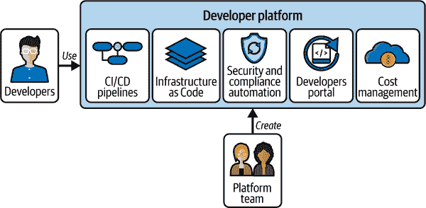

# 第十章. 现代 DevOps 的平台工程方法

前几章描绘了许多系统和实践，这些是现代软件交付的特征。这段漫长的旅程展示了现代软件团队必须应对的令人敬畏的复杂性。此外，现代软件开发往往倾向于“左移”许多问题——如安全、可观测性和基础设施管理——这些问题以前由运维团队处理。即使是最有经验和资源丰富的开发团队也会因为这种复杂性和额外责任而感到压力，我们该如何应对呢？

平台工程应运而生，以帮助现代软件组织回答这个非常问题。它是设计、构建和维护内部开发者平台的学科，这些平台为软件交付提供集成工具和基础设施。虽然前几章探讨了现代软件交付的各个组成部分，但在这章中，我们将看到平台工程如何将这些能力整合成一个统一平台，为开发团队提供服务。

在本章中，我们将探讨组织如何构建和运行有效的平台工程团队。我们将研究这些团队如何在组织中定位以及它们在促进快速、安全交付中扮演的角色。然后我们将深入研究构建和运营高性能平台团队的实践方面——从团队结构到日常运营的各个方面。我们将探讨具体的方法来衡量开发者平台的有效性，确保我们的投资带来真正的价值。我们将讨论标准化和团队自主权之间的平衡——如何在提供护栏的同时不扼杀创新。最后，我们将探讨可持续平台演化的策略，确保我们的平台随着组织需求的增长而发展。

# 为什么是平台工程？

我们理解，传统的开发者工具方法通常要求开发团队独立导航一个复杂的工具和实践景观。平台工程将内部开发者平台视为一个战略产品，将开发团队视为宝贵的客户。这种转变发生在关键时刻，因为软件实践的快速演变为开发者创造了一个认知负荷危机，他们必须处理不断扩大的责任集。平台工程解决了这个危机，我们将深入研究其商业案例以及它如何加强协作的 DevOps 文化。

## 开发者认知负荷危机

我们添加到工具链中的每个新工具和添加到交付流程中的每个新实践都承诺可以加速交付或提高软件质量。然而，这种累积效应可能会给我们的开发团队带来不可持续的认知负担。考虑一下，开发者必须处理版本控制、CI/CD 管道配置、IaC 模板、安全扫描工具、部署策略、监控系统以及一系列其他专业工具。每个工具都有自己的复杂性、最佳实践和故障模式。

这种认知负担在团队采用 AI 工具贯穿整个开发周期时尤为突出。虽然这些工具承诺可以加速交付，但它们通常需要显著的专长才能有效实施。平台工程可以将这种复杂性封装起来，通过标准化的接口和模板使 AI 能力易于访问，而不需要每个开发者都成为 AI 专家。

数据讲述了一个令人担忧的故事：最近[Harness 调查](https://oreil.ly/TyQ9U)发现，78%的开发者至少将 30%的时间花在手动、重复性的任务上，而不是编写代码。时间被运营责任和工具管理所消耗——虽然这些活动是必要的，但它们将开发者从最有价值的工作中拉走：创造解决商业问题的创新解决方案。与失去的时间本身一样令人担忧的是，这种注意力分散造成的认知负担直接影响了交付质量和速度。传统流程往往加剧了这一挑战，产生了低价值的工作，阻碍了深入、创造性的思考。

上下文切换的成本是高昂的。当开发者不断在编写应用程序逻辑、调试管道、调查安全警报和解决生产问题之间转换时，每次转换都会提取一定的精神成本。这种成本不仅会减缓功能交付，而且从根本上破坏了支持开发者卓越的条件。深入、不间断的专注时间推动软件质量和创新。当开发者不断在编码和运营任务之间跳转时，技术卓越和创造性问题解决能力都会受到影响，导致技术债务的累积。

这个问题影响的不仅仅是生产力指标，它直接影响到士气、留存率和吸引顶尖人才的能力。最好的工程组织明白，优秀的开发者体验——工程师可以花更多的时间解决问题，而不是与低效作斗争——不仅会导致更好的软件，而且会培养一个顶尖人才能够茁壮成长并留下来的文化。一个成功的平台将解决这些不满的来源，开发者会纷纷涌向它。如果大多数开发者被迫使用一个平台，那么这个平台或其推广可能存在问题。

## 从工具链到平台即产品

平台工程师通过创建一个开发者可以最大限度地提高生产力的环境来直接解决开发者体验问题。这意味着设计、构建和维护底层开发者平台，这些平台能够使应用程序和服务的开发、部署和运行顺利。

开发者平台通常解决多个领域，如图 10-1 所示。这包括门户、CI/CD 管道和 IaC。确保安全、合规和云成本合规的自动化措施贯穿始终。

###### 图 10-1\. 开发者平台功能

开发者平台可以通过多种方式构建：平台团队可以从各种工具中组装它们，组织可以购买来自 GitLab 或 Harness 等供应商的预包装解决方案，或者他们可以使用 Humanitec 等编排工具在现有工具集之上创建一个统一的层。在实践中，大多数实现结合了这些方法，而不是遵循单一的清晰策略。团队通常会选择一种策略，并对组织认为重要但不太适合该策略的事情做出一些妥协。作为实用的问题解决者，工程师通常会混合策略，调整他们选择的方法以适应关键的组织需求，并最终使其发挥作用。

平台提供了铺好的道路——经过验证的模式和实践，开发团队能够有信心地遵循。铺好的道路通常以应用程序或基础设施模板的形式出现。考虑一个标准的 Web 应用程序模板。从头开始，开发者可能需要好几天的时间手动组合基础功能并设置部署——这是一项繁琐且重复的工作。平台提供的模板已经预先配置了必要的框架。这包括指标收集的标准方法、容错模式、具有合理默认值的网络安全配置以及带有请求跟踪的结构化日志——所有这些都被集成在一个统一的框架中。模板可以扩展到应用程序代码之外，包括基础设施定义和部署管道配置，形成一个全面的应用程序基础。

此外，平台通常提供模板，在应用程序层面，这些模板标准化了方法并封装了组织在跨切面关注点（如身份验证、日志记录和错误处理）方面的最佳实践。操作层包括包含安全扫描、负载测试和自动回滚程序的部署管道。基础设施层利用自动化来配置具有适当安全组、监控配置和灾难恢复程序的资源。

这些功能通过自助门户或接口公开，这些门户或接口抽象了底层复杂性，同时保持了安全和合规的护栏。例如，一个平台可能提供一个用于配置数据库的 API，该 API 会根据组织标准自动配置备份计划、加密和访问控制。

利益显而易见：而不是让团队去拼凑工具，模板自动化了这个繁琐的设置和配置工作，同时嵌入最佳实践、安全和合规标准。这使得开发者更加高效——有了模板代码，他们可以立即专注于构建功能。此外，当他们转向另一个项目时，无论是由于他们更换了团队还是因为他们需要更新依赖项，由于熟悉的环境，他们会感到更加舒适和高效。同时，这种增加的一致性降低了风险，因为管理少量标准工具和模板的风险比管理组织内散布的无数独特的雪花状风险更容易。

重要的是要注意，平台团队提供的特定模板和自动化工具在各个组织之间会有很大差异。没有一种适合所有情况的解决方案。平台团队的关注点必须非常专注于解决其内部开发团队的独特需求和用例。对于一个对合规要求严格的金融机构来说，有效的平台可能与为快速发展的初创企业构建的平台大相径庭。关键是平台团队要深入了解其“客户”——开发团队，并根据他们的具体痛点和工作流程定制其服务。在本章的后面部分，我们将深入探讨平台工程所需的产品心态，以确保团队是真正的、以开发者体验为中心的服务提供商。

## 平台工程的商业案例

平台工程的商业案例建立在这样一个简单的前提上：通过简化软件开发和运营，我们可以实现开发者和运营效率的提升，使我们的团队更加高效，并降低与风险相关的成本。考虑开发者的时间成本。如果大多数开发者大约花费 30%的时间在重复的、无价值的任务上，对于一个只有 250 名开发者的组织来说，这相当于巨大的可回收成本。在我们调查的公司中，开发者的平均年收入为 107,599 美元，相当于每年每位开发者因生产力下降而损失超过 32,000 美元。对于拥有 250 名开发者的组织来说，这代表着 800 万美元的隐藏成本，即损失的开发时间。

平台工程提供了开发者平台，自动化了许多这些重复性任务，恢复了失去的时间。平台标准化和集中化平台开发消除了跨团队重复的努力。这使得运维团队能够在现有人员编制的情况下支持更大的应用组合，同时保持一致的安全和合规标准。

平台工程的回报率（ROI）不仅限于开发者生产力。它解决了让团队夜不能寐的业务风险。开发者平台的“铺就道路”通过消除团队间不一致实施产生的安全漏洞，减少了安全漏洞的风险和潜在成本。通过标准化的部署流程和监控实践，平台团队能够减少服务中断的频率和影响。通过将高可用性和灾难恢复的成熟模式嵌入到平台组件中，组织在事件发生期间也能保持业务连续性。同时，内置的合规控制和自动化的审计跟踪有助于组织避免昂贵的监管违规。

平台工程还可以作为更广泛组织倡议（如云迁移或应用现代化）的强大加速器。通过提供标准化和自动化的基础，平台工程创建了可重复的路径，从而加快了时间表并降低了风险。

## 支持协作的 DevOps 文化

平台工程支持开发、运维和安全团队之间的协作，这是我们之前章节中反复提到的主题。一个统一的自助平台充当协作的桥梁。而不是孤立的职责和潜在的摩擦点，平台带来了一个更集成的生态系统，在平台铺就的道路上直接和自动地解决运维和安全需求。这些铺就的道路为开发者提供了预先批准的安全模式和自动化的工作流程，这些工作流程本质上就包含了安全最佳实践。

在受监管的环境中，这一点尤其强大：而不是为每个应用团队实施新的法规，高概率无法得到一致执行，平台团队可以在平台层面一次性实施这些规则，确保所有人的合规性。开发者可以专注于创造业务价值，同时通过平台护栏自动遵守运维和安全标准。最终结果是更流畅、更安全的软件交付管道。

# 创建和运营平台团队

现在我们已经了解了平台工程的价值（“为什么”），我们将转向实施（“如何”）。在本节中，我们将探讨如何建立和运营有效的平台工程团队。我们将研究成功团队的关键特征，讨论保持平台团队与开发需求紧密对齐的参与模式，并回顾支持可扩展、高性能平台工程功能的运营模式。

## 平台团队的关键特征

最成功的平台工程团队不仅拥有深厚的专业技术知识，还带来了产品洞察和客户同理心。从平台领导层开始：领导者需要具备技术深度，以理解组织内部开发者面临的各种挑战，同时也要拥有战略视野，使平台与业务目标保持一致。他们必须同时赢得工程师和业务利益相关者的信任，弥合技术和战略之间的差距。理想的领导者在这三个领域——开发、运营和安全——都有坚实的背景。这种关注将有助于引导团队和组织走向正确的方向。

平台团队本身应该是您开发组织的缩影，涵盖开发、安全和运营方面的专业知识。这种跨职能知识使团队能够创建解决开发者需求全谱系的集成解决方案。团队应包括在关键瓶颈领域（如安全和合规性）有经验的工程师，以及精通开发、企业架构和现有工具的工程师。随着人工智能成为软件交付的基本组成部分，平台团队从至少包括一名在 AI/ML 运营方面有专长的成员中受益。这个角色在数据科学和软件交付之间架起桥梁，帮助团队有效地整合和管理平台内的 AI 工具。他们确保 AI 组件保持可靠、可解释，并与组织治理要求保持一致。

记住，平台是一个产品，开发者是其客户。为确保平台根据开发者需求而非仅凭平台团队偏好进行演变，团队需要强大的产品管理能力。这包括用户研究、路线图开发和采用度测量的技能。通过理解开发者需求并衡量平台的有效性，团队可以确保平台始终是整个组织的宝贵资产。

## 有效的参与模式

在开始平台实践时，首先要考虑的是团队如何与更大的组织进行互动。一个成功的平台团队需要一种参与模式，这种模式能够深入了解开发者的需求，并促进组织内部的有效协作。平台团队还必须以深思熟虑和结构化的方式与他们的客户——开发团队——进行互动。

“沉浸式项目”是某些组织中运作良好的参与模式的一个例子。在这种模式下，平台工程师暂时将自己嵌入到各个开发团队中。这种动手方法使团队能够深入了解开发者面临的日常挑战；它促进了同理心，并加深了对他们需求的理解。通过与开发者并肩工作，平台工程师可以识别痛点、瓶颈和改进机会。这确保了平台与特定团队独特的需求同步发展，同时仍保持中央治理结构。当您刚开始进行平台工程时，这种模式尤其有效，因为它有助于形成对团队挑战和约束的深入理解。

另一个选择是建立一个卓越中心。这种类型的平台团队作为一个独立的、跨职能的团队，为所有开发团队提供服务。他们提供对平台功能的反馈，倡导采用，并协助将平台功能集成到开发工作流程中。组织内部的协作确保平台与开发社区不断变化的需求保持一致。这种模式对于拥有多样化项目的大型组织来说效果很好，因为它提供了明确的所有权和集中式最佳实践，同时减少了工作重复。

另一种选择是混合模式，其中平台工程师既作为集中式专家，也作为嵌入式资源，提供了两者的最佳结合——工具和流程的一致性以及特定产品挑战的深入了解。

选择正确的模式取决于您组织的规模、复杂性和战略重点。您平台的成熟阶段也可能是一个因素。随着平台成熟和用户基础的扩大，参与模式需要扩展。虽然对于早期采用者来说，高接触支持可能是可行的，但对于广泛采用来说，需要更可扩展的方法。通过全面的文档和直观的工具实现的自助式入门，允许团队无缝且自主地与平台集成。

最后，虽然这些模式为平台成功提供了结构基础，但它们必须通过强大的机制来衡量和验证平台的有效性。在本章的后面，我们将探讨确保建立系统性的反馈循环来衡量开发者满意度和平台采用率。

## 有效的运营模式

虽然参与模式指导平台团队如何与开发团队合作，但运营模式定义了平台团队的内部分工和原则。运营模式对于为开发团队提供服务同时保持高运营标准至关重要。它决定了团队如何运作、分配资源以及与更广泛的组织互动。一个有效的模式在授权和控制之间取得平衡。

一个强大的运营模式优先考虑自助服务能力，赋予开发团队快速独立行动的能力。平台团队通过自动化和模板提供适当的护栏，这些模板封装了组织最佳实践。

清晰、最新且易于获取的文档是有效运营模型的另一个特征。文档应使开发者能够理解并采用平台功能，而无需平台团队的手把手指导。

最后，您的运营模式应结构化以处理战术和战略需求——实施关键问题的服务级别协议（SLA），同时保护用于平台改进和解决开发者反馈的专用时间。支持轮换和工程冲刺等技术可以帮助团队管理这种平衡。

# 定义您的平台战略

一个连贯的平台战略直接关注您的开发者需求。它考虑了您组织的限制和您业务最重要的目标。在本节中，我们将讨论您的战略应如何明确阐述一套指导决策的原则。我们将探讨如何深入理解您的平台客户应驱动初始范围。最后，我们将讨论您在平衡通过平台实现标准化与允许团队在必要时进行灵活变通时可能遇到的挑战。

## 制定平台原则

平台战略始于明确的原则，这些原则阐述了您的平台团队将如何处理解决方案。当团队被拉向许多不同方向并被要求解决不断增长的问题集时，明确的原则充当指南针。它们指导决策，为评估权衡、解决冲突和在平台开发复杂性中保持专注提供框架。一旦您定义了原则，重要的是在整个组织中分享它们，以获得有助于团队成功的对齐。

以下原则是任何平台战略应支撑的原则：

开发者体验和效率是平台设计的首要驱动力。

每项能力都应旨在减少认知负荷并简化开发工作流程，而不是增加复杂性。

安全性和合规性要求无缝嵌入到平台中。

这使得开发者更容易“做对事情”而不是绕过控制。这种方法培养了一个安全的发展环境，同时不会阻碍生产力。

平台演进是由可衡量的开发者需求和可证明的商业成果驱动的。

平台演进不仅仅是由平台团队的技术偏好或任何特定开发团队的强烈观点所驱动。平台团队将征求开发者的反馈，跟踪平台使用情况，并衡量对关键指标如部署频率和领先时间的影响。

一个关键的战略决策是采用是否应该是强制性的或可选的。强制性的平台可以推动一致性和标准化，但可能会降低提供优质开发者体验的激励。另一方面，可选的采用迫使平台团队赢得信任并证明其价值，从而带来更多以用户为中心、创新的解决方案。虽然这种方法可能会造成碎片化，但它促进了实践中的卓越，而不仅仅是理论上的。一些组织开始时采用可选的采用，然后在后期引入强制措施，以巩固成果并让后期采用者加入。

## 平台反原则和解决冲突

与你的平台战略应该拥抱的内容一样重要的是它应该避免的内容。常见的、损害平台成功的反原则包括：

完美主义胜过进步

延迟平台发布直到它们“完美”通常意味着开发者在此期间会创建自己的解决方案，从而使最终采用更加困难。

技术驱动的发展

建立平台能力仅仅因为它们在技术上有趣或酷，而不是因为它们解决了真正的开发者问题。

没有展示价值就强制采用

在证明其价值之前强迫团队使用平台会引发阻力，并可能损害平台的长远声誉。

当原则相互冲突时，就像它们不可避免地会那样，拥有一个清晰的优先级框架有助于。例如，当安全要求与开发者体验冲突时，大多数组织需要一种结构化的方法来解决这种紧张关系。成功的平台团队通常优先考虑：

1.  带有监管风险的合规和安全要求

1.  高频活动中的开发者体验

1.  运营一致性中的标准化

1.  创新和灵活性

这个层次结构帮助团队在原则竞争时做出一致的决定。当面临此类冲突时，平台团队应记录紧张关系、决策过程和最终的解决方案，为未来的决策创造先例。

为了安全的名义而允许这种模式支持导致开发者体验不佳的选择是危险的。你已经在绕过或操纵平台方面播下了种子。将此类决定视为必要的临时措施，然后努力开发一种更高效、更愉快的方式来满足治理控制，是长期成功的关键。

## 理解你的平台受众

回到我们的第一个原则：开发者体验和效率是平台设计的首要驱动力。成功的平台战略始于对开发团队需求以及更广泛组织背景的深入理解。沉浸式参与模型在这里可以提供帮助。在这个模型中，平台工程师会嵌入到个别应用团队中一段时间。通过坐在应用开发者旁边，通过密切观察和提问来了解他们的工作，平台团队成员能够更好地识别常见的摩擦点、瓶颈和改进机会。考虑既有的阻碍开发者生产力的痛点，也要考虑长期的战略目标。

## 选择平台范围

一旦你对平台受众有了清晰的认识，下一步就是定义平台能力的初始范围。最有效的方法是从关注能够立即提升开发者生产力的基础元素开始，从小规模做起。简化的基础设施配置、自动化的交付管道和集成的安全自动化是很好的例子。随着平台的发展和组织需求的演变，你可以逐步扩展到更高级的领域，例如创建全面的开发者门户或引入自助分析工具。关键是要抵制一次性解决所有问题的诱惑——成功的平台会稳步增长，由已证实的价值和持续来自服务团队的反馈所引导。

## 实用路线图示例

让我们通过一个实际例子来了解如何利用对受众的理解来选择初始范围。一个有用的方法是聚焦于那些已经推动快速创新的团队和用例。例如，采用新技术或跃迁到云平台的团队常常面临严峻的挑战，即使是简单的平台也能迅速帮助解决。

在我们的例子中，我们决定集中精力支持一个正在向 AWS 和 Kubernetes 迁移微服务的应用团队。这个团队在标准化基础设施和部署模式上遇到了困难。通过解决这一具体需求，我们可以展示平台的价值，并在组织内部获得支持。在确定我们的早期采用者团队时，我们仔细选择了一个对积极参与平台产品改进和愿意提供频繁反馈的团队持热情态度的团队。

在这个案例中，我们首先创建一条铺好的道路，以简化常见任务。我们通过从仓库创建到 CI/CD 管道配置和基础设施提供的自动化创建新的微服务。一开始，这不需要包括管道中的每一个工具。我们专注于只包括核心构建、部署和管理层，并将组织标准直接嵌入到我们的模板中。根据我们的第二个原则，安全要求、合规控制以及最佳实践被内嵌其中。我们与合规和安全团队紧密合作，确保我们的自动化模式满足他们的要求。目标是，通过使用我们的平台，应用团队默认做正确的事情。

另一个容易实现的建议是考虑将审计帮助作为服务提供给应用团队，作为您平台的一部分。内置功能来自动回答某些审计问题。因为您在设计系统时考虑了内部审计，所以这将很容易提供，并将有助于推动采用并让用户感到满意。

## 平衡标准化和灵活性

在建立平台工程实践中，您可能会发现使用平台路径标准化软件交付以及给予团队所需（或只是想要）的灵活性存在挑战。通过标准化平台路径进行一致的软件交付确保了平台的可靠性、运营效率，最终是其商业价值。然而，您的平台应该允许一些团队自主性；团队应该能够创新，为他们的特定需求找到最合适和最有效率的解决方案。一个过于主观的模板和非常僵化的路径只会阻碍您平台的使用。

解决这个挑战的一种方法是将模板的组件考虑为以下三个类别：

必需组件

这套组件涵盖了诸如日志配置、监控设置和安全控制等功能。这些都是至关重要的关注点（安全、可观察性、合规性），并且有严格的标准。它们的包含是强制性的。

可配置组件

这些组件包括资源扩展配置、缓存设置和数据库连接。团队应该能够根据需要配置，而不影响标准化整体目标。

扩展点

最后，应该使用扩展点来允许团队自定义健康检查、配置专用中间件以及定义团队特定的指标。良好的文档 API 提供了这些扩展点，定义了标准化和灵活组件之间的清晰接口。

使用这种模块化方法，团队可以在使用铺路路径模板的同时，有灵活性根据他们的需求进行调整。一个构建高吞吐量服务的团队可能会定制扩展配置并添加专门的性能指标，而一个构建安全敏感型服务的团队可能会添加额外的身份验证中间件和审计日志。

在这个平衡中，治理的作用至关重要。有效的平台使用 PaC 和自动化验证来创建护栏，防止严重问题同时允许在安全边界内进行偏差。例如，你可能会实施自动化检查，以验证关键要求得到满足，而不管具体的实现方式如何。这种方法允许团队创新，同时确保基本标准得到维护。

# 平台测量和演变

在制定平台战略后，下一步是衡量其有效性并推动其采用。本节探讨了如何定义和跟踪指标以证明平台价值，然后探讨了鼓励开发者参与和平台利用的策略。

## 衡量平台成功

你无法改善你未衡量的东西。将你的平台视为一个具有技术和业务关键绩效指标的产品。指标应帮助你评估对开发者和企业的价值。关键指标类别包括：

开发者生产力

使用平台，团队可以多快地发布功能？跟踪部署频率、变更的提前期和 MTTR 等指标。使用指标来更好地了解编写代码与管理工作基础设施所花费的时间。

平台采用

团队是否实际上在使用平台？指标应衡量广度（活跃用户数、利用平台的项目的数量以及新项目上线的百分比）和深度（团队如何广泛利用现有功能）。这里的用法模式可以帮助识别成功的提供和潜在的摩擦点。

运营效率

平台降低了多少成本或提高了运营绩效？查看基础设施成本、事件率和支持工单量。

商业影响

最终，平台是否有助于实现商业目标？指标应将平台投资与组织成果联系起来，例如更快的上市时间、提高客户满意度或提高产品质量。

我们跟踪平台性能和价值创造，以验证持续改进并指导平台项目。接下来，我们将探讨鼓励初始平台采用和促进平台演变以释放更多价值的策略。

## 推动平台采用

在了解我们受众最紧迫的痛点的基础上，我们平台清晰的愿景，我们接下来的挑战在于推动我们平台的应用。一个执行良好的采用策略结合了谨慎的能力选择、无缝的访问和主动的参与。

最小可行平台（MVP）方法是一种有助于推动早期采用的方法。与其试图一次性构建所有内容，不如将平台工作集中在交付一组高价值、低努力成本的功能上，这些功能针对开发团队最紧迫的痛点。这些初步的成功建立了信誉并展示了我们平台潜力，使获得未来扩展的认可和资源变得更加容易。基于我们对受众的理解，考虑那些消耗最多开发者时间或造成最大摩擦的任务。通过首先解决这些挑战，我们可以迅速展示可衡量的好处，并在平台上产生兴奋感。

最后，如果你是平台团队，你必须积极推广你的能力。构建一个伟大的平台只是战斗的一半；你还需要说服开发者使用它。考虑开发者教育计划、技术展示和清晰传达平台优势和路线图。举办研讨会和培训课程，教开发者如何有效地使用平台。展示成功的用例，并强调平台对其他团队产生的积极影响。保持清晰的路线图，并传达即将推出的功能和改进，以建立兴奋感和鼓励采用。通过积极与开发者社区互动，平台团队可以培养采用文化，并确保平台成为开发工作流程的有机组成部分。

## 利用内部开发者门户实现平台成功

内部开发者门户（IDPs）作为开发团队与平台功能之间的接口。门户通过将所有内容集中在一个地方，使平台易于发现和使用。最有效的门户包括服务发现、上下文文档和自助功能，使它们成为任何开发者与平台互动的自然起点。

### 核心门户组件

一个设计良好的 IDP 通常包括：

软件目录

所有服务、API 和组件的集中注册，包括所有权信息和依赖映射。

自助工作流程

使用“黄金路径”模板自动处理常见任务，如创建新服务或配置环境。

文档中心

当需要时出现的上下文、可搜索的技术资源

评分卡

显示服务成熟度、合规状态和最佳实践采用情况的指标

### AI 增强的开发者体验

现代 IDPs 越来越多地利用以下 AI 能力来减少认知负荷并加速平台采用：

自然语言界面

允许开发者使用对话查询查找资源和执行工作流程。

智能推荐

根据开发者的上下文和历史记录，建议相关的文档、服务和配置选项。

自动故障排除

分析开发者在遇到问题时出现的错误模式，并提出潜在解决方案。

预测性辅助

根据开发者的当前活动预测他们的需求，并主动提供相关资源。

这些 AI 能力将门户从被动资源转变为主动助手，引导开发者通过复杂操作，而无需他们成为专家。

### 构建一个有效的门户

为了实现可持续的成功，将您的 IDP（个人发展计划）视为一个产品，并为其持续发展分配专用资源。通过如开发者采用率、通过自助工作流程节省的时间以及新开发者的产品生产力时间等指标来衡量其有效性。

IDP 最近已作为现成产品提供。Backstage 最初在 Spotify 开发，于 2020 年开源并捐赠给了云原生计算基金会。包括 Roadie、Spotify 和 Harness 在内的供应商推出了简化 Backstage 采用和管理的商业产品。还有非 Backstage 的商业 IDP 也可供选择，例如 Atlassian 的 Compass。

一个设计良好的 IDP 可以减少认知负荷，加快入职流程，并使平台采用成为阻力最小的路径，从而改变开发者体验您整个平台提供的方式。

## 可持续平台演进

在初始采用正在进行时，下一步是确保平台的可持续演进。这取决于平衡开发者赋能与平台完整性，通过 PaC（政策即代码）和自动化、持续反馈循环以及持续投资于可靠性和可扩展性来实现。利用 PaC 实现“信任但验证”自动化是达到这种平衡的一种方法。通过将组织标准编码到可编程政策中（使用如 OPA 或自定义执行引擎等工具），您的平台团队可以在保持合规性的同时委派控制权。

政策和“政策即代码”（Policy as Code）可以为开发团队提供一些控制权，以减少瓶颈并促进敏捷性，同时不牺牲标准化。例如，政策可以定义可接受的资源使用限制、强制执行安全最佳实践或确保符合组织标准。开发者可以在预定义的边界内操作，知道他们的行为不会损害平台的稳定性和安全性。关键的是，政策还可以用来发出即将到来的变化信号，例如弃用旧系统或模板。通过提前发出警告，开发者有足够的时间迁移到更新、受支持的选择，确保平稳过渡并最小化在最终弃用旧系统时的干扰。

人工智能技术正在迅速发展，为平台团队带来了机遇和挑战。在将新兴的人工智能工具纳入平台之前，建立一种系统性的方法来评估这些工具至关重要。创建一个沙盒环境，其中可以测试有希望的技术，使用您组织的数据来应对现实世界场景。制定明确的准则，将人工智能能力从实验性过渡到生产就绪，包括考虑可靠性、可解释性和治理等方面。这种方法使您的平台能够从人工智能的进步中受益，同时管理快速发展的技术的风险。

平台的发展必须基于经验证据而非假设。您的团队必须定期审查您的“平台智能三角形”——平台使用指标、支持请求和开发者反馈的结合。利用这些信息来指导路线图的发展，并识别开发者的需求和痛点。是否有某些功能未被充分利用？是否有常见的支持请求表明需要改进的领域？例如，如果您注意到围绕特定服务的支持工单数量增加，同时使用模式下降，这可能表明需要立即关注的可靠性问题。定期的平台健康检查应检查技术指标（错误率、响应时间）和采用指标（功能使用、团队入职成功率）。

最后，对平台可靠性和可扩展性的持续投资是不可或缺的——一次重大的中断可能会抹去数月的信任建设。随着平台采用率的增长——以及平台负载的增加——对可靠性工程的投资变得更加关键。开发者需要相信平台在他们需要时将可用，并且它将保持一致的性能。这包括实施强大的可观察性、建立清晰的故障管理流程，并与开发团队保持透明的沟通渠道。

## 实际案例：平台工程实践

以一个拥有 1,400 名开发者，分布在 80 个产品团队中的金融服务组织为例，他们面临着重大的交付挑战。一次审计揭示了不一致的安全实践，CTO 对速度和合规风险都表示担忧。同时，内部指标显示开发者将近 45%的时间花在了非编码活动上——管理管道、配置环境、以及处理安全和合规要求。

为了应对这些挑战，该组织成立了一个由六人组成的专用平台团队：一个平台工程负责人、一位具有 CI/CD 专长的资深开发者、一位安全工程师、一位运维工程师、一位具有 Kubernetes 专长的平台工程师，以及一位负责文档的技术产品经理。

### 发现与策略发展

团队从密集的发现阶段开始，以了解开发者的痛点以及合规性要求。他们实施了一个结构化的沉浸式项目，将团队成员嵌入代表产品团队中，以观察工作流程并记录挑战。这项研究揭示了常见的痛点：

+   在各团队之间维护单独的 CI/CD 管道造成重复劳动

+   安全扫描实施不一致

+   手动环境配置造成延迟和不一致

+   对合规性要求理解不足，导致各团队实施方式不同

同时，团队通过与 CISO 团队、企业架构、合规性和法律部门的工作会议，了解安全控制、技术标准、审计要求和数据处理要求。

基于这项研究，团队制定了一个具有明确原则的平台战略：

+   开发者体验驱动平台设计——减少认知负荷。

+   安全性和合规性是内置的，而不是附加的。

+   一切都是可衡量的——只关注能带来价值的东西。

+   该平台是可选的但具有吸引力——解决实际问题。

团队故意将初始范围集中在单一的高影响能力上：具有嵌入式安全控制的可靠 CI/CD 管道。

### 构建最小可行平台

团队在八周内交付了他们的 MVP：一个由模板驱动的管道系统，具有嵌入式安全扫描。关键组件包括：

+   适用于不同应用类型的最佳实践管道模板

+   预配置的安全扫描直接集成到管道中

+   自动收集合规性要求的证据

+   通过简单的 YAML 文件进行自助配置

团队直接将所需的安全控制嵌入到管道模板中，静态分析、依赖项扫描、容器扫描和合规性检查自动运行。结果输入到集中式仪表板，而自动收集证据简化了审计准备。

通过自动化关键检查，包括所需的代码覆盖率级别，平台上的应用团队变更管理流程得到了显著简化。他们很高兴被授予免除前往 CAB 的许可。

与两个试点团队紧密合作，平台团队根据每周的反馈改进了他们的产品。文档与代码同步开发，包括技术参考材料和实用指南。

在三个月内，MVP 与试点团队一起展示了令人印象深刻的成果：

+   通过自动化扫描发现并修复了关键漏洞。

+   安全扫描覆盖率从 40% 提高到 100%。

+   审计准备时间从几天减少到几小时。

+   部署时间从五天减少到六小时。

到六个月时，15 个团队（约 250 名工程师）正在使用安全的管道模板，与未采用这些模板的团队相比，这些团队的安全事件下降了 40%。

### 扩展平台功能

基于全面的遥测和用户反馈，平台团队将环境配置确定为他们的下一个目标。他们也认识到，随着采用率的增长，他们需要一个更可扩展的入职和支持方法。

他们的下一阶段重点在于两个关键功能：

+   作为所有平台功能的单一接口的 IDP，包括：

    +   具有自动发现功能的目录服务

    +   安全管道的自助服务入职

    +   集成文档和指南

    +   对管道状态和安全发现的实时可见性

+   为常见应用程序模式编码最佳实践的 IaC 模板：

    +   安全网络配置

    +   正确配置的访问控制

    +   与合规性一致的日志记录和监控

    +   资源限制和成本控制

这些模板与 IDP 集成，允许开发者以最小的努力提供符合规定的环境。

扩展的平台显著增加了采用率。在六个月内：

+   45 个团队（代表约 600 名开发者）正在使用安全管道。

+   30 个团队已采用 IaC 模板进行环境配置。

+   平台每月处理超过 2000 次部署。

+   由于自助服务功能，每名用户的支持请求下降了 70%。

尽管为数百名开发者提供服务，平台团队仍仅由六人组成，利用自助服务和自动化来扩大其影响力。

### 企业级采用和业务影响

为了推动更广泛的采用，平台团队制定了一种多方面的方法：

+   展示功能和成功故事的内部活动

+   “平台冠军”计划，确定每个部门的倡导者

+   显示采用指标和业务影响的执行仪表板

+   提供自学和导师指导两种选项的培训计划

CTO 为采用制定了激励措施，平台用户在云资源和简化合规性审查方面享有优先权。

随着平台采用率的增长，治理方法也发生了演变。不再进行手动审查和文档编制，而是通过以下方式将安全和合规性要求直接编码到平台中：

+   自动执行标准的 PaC 框架

+   内置的证据收集满足审计要求

+   为合法边缘案例提供自助服务异常流程

+   来自平台遥测的自动合规性报告

到 18 个月时，该平台已取得显著成果：

+   85%的开发团队（代表约 1200 名开发者）正在使用该平台。

+   开发者生产力提高了 35%。

+   组织内的部署频率增加了 6 倍。

+   从故障中恢复的平均时间减少了 70%。

+   平台用户的安全事件减少了 65%。

+   审计准备时间减少了 90%。

+   新功能上市时间缩短了 40%。

这些改进转化为可衡量的商业成果：更快的特性发布、更快的市场变化响应、减少停机时间以及降低安全和合规风险。

### 持续改进

在旅程的第三年，平台团队不断演进其产品。他们的路线图包括人工智能辅助开发功能、高级可观察性工具、扩展的安全自动化以及基于持续研究的开发者体验改进。

从这个平台工程之旅中得出的关键教训包括：

产品思维至关重要

将开发者视为客户可以促进更好的决策。

从小做起建立信誉

在扩展之前先交付一个功能。

自助服务是扩展的关键

采用敏捷方法，迭代交付。

指标驱动投资

测量技术成果和商业影响。

治理集成创造双赢

正确的工具可以将合规性从约束转变为加速器。

这个例子展示了如何通过系统地解决开发者需求并简化治理要求，一个小而专注的平台团队能够通过系统性地解决开发者需求并简化治理要求，通过从高影响功能开始，衡量结果，并将平台视为产品，实现了显著规模，仅用六名平台工程师就服务了 1,400 名开发者。

# 结论

在我们结束对现代软件交付的探索时，有一点是明确的：人工智能不仅仅是我们的 DevOps 工具箱中的另一个工具；它从根本上改变了我们构建和交付软件的方式。

在整本书中，我们看到了人工智能如何影响软件生命周期的每个阶段。从检测存储库中的代码模式到优化测试选择，从识别安全漏洞到自动化云成本优化，人工智能功能正迅速成为现代交付实践的核心。

平台工程将这些元素结合起来，创建一个基础，其中人工智能驱动的功能协同工作以加速交付，同时保持治理。

在撰写本文时，开发者编码助手的人工智能比软件交付许多部分的人工智能更为成熟。这预示着 DevOps 团队将面临新的压力，因为创新越来越受到限制，不是在于组织生成代码的能力，而是在于验证和交付这些应用的能力。日益依赖人工智能的交付卓越性将成为充分利用编码技术进步和避免挫败的关键因素。

## 展望未来

转向 AI 原生交付实践的转变仍处于早期阶段，但方向是明确的。那些有效地将 AI 集成到其交付管道中的组织将获得显著优势：

+   加速交付周期，因为人工智能消除了瓶颈并自动化了常规任务

+   通过 AI 驱动的测试和漏洞检测提高质量和安全性

+   通过智能资源优化和自动化修复降低运营成本

+   提高开发者体验，因为认知负荷从运营关注转向创造性问题解决

在实践中，这意味着部署决策将越来越多地基于复杂的 AI 分析，而不是仅仅依赖人类判断。测试策略将动态适应代码更改，而不是遵循僵化的模式。基础设施将根据应用程序需求自我优化，而不是需要手动调整。

## 入门指南

如果您想在您的组织中实施这些实践，我们建议采取一种务实的做法：

+   首先识别您最痛苦的限制。您的团队在哪些低价值活动中花费了最多时间？这些是 AI 自动化的主要目标。

+   从小开始，并持续衡量。实施有针对性的改进，验证其影响，并利用这种成功来推动进一步的采用。

+   为您的开发者构建，而不是为工具构建。为您的交付平台采用产品心态，确保它实际上解决了团队的真实问题。

+   内置治理，而不是附加。利用您的平台使合规性和安全性成为开发过程中的无缝部分，而不是事后考虑。

在这个新时代中蓬勃发展的组织不一定是那些拥有最大工程团队或最大预算的组织。相反，它们将是那些最有效地利用人工智能来更快地交付更好软件，同时保持企业运营所需治理护栏的组织。

这不会一夜之间发生。像任何重大转型一样，它需要承诺的领导力、持续学习和愿意挑战既定流程的意愿。但回报——以开发速度、产品质量和最终业务成果来衡量——使这段旅程值得承担。

软件交付的未来是智能的、自动化的，并且是为那些始终处于核心地位的人类开发者构建的。我们希望这本书为您提供了技术理解和实际策略，以帮助您今天开始在组织中构建那个未来。
