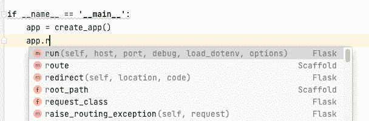
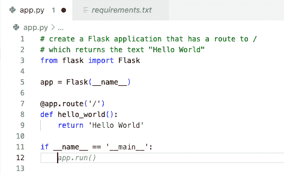
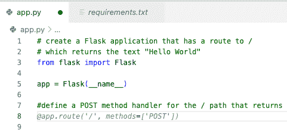
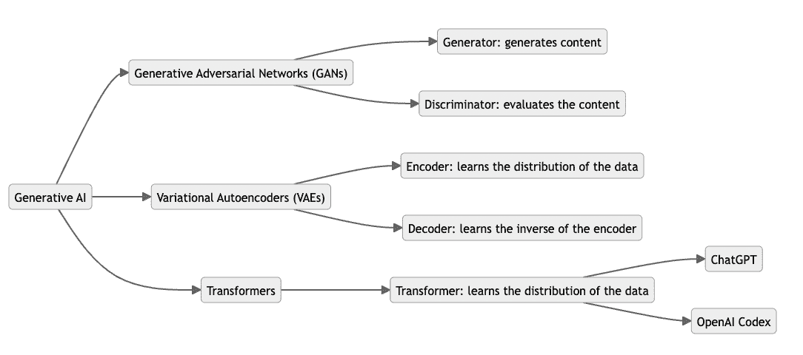
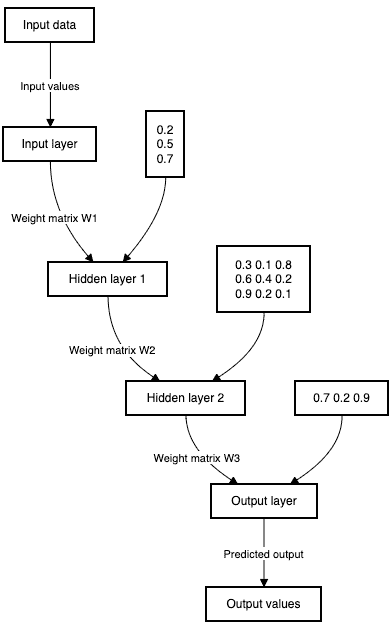
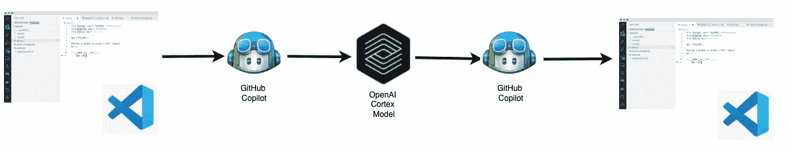

# 第一章：了解大型语言模型

### 本章涵盖

+   介绍生成式人工智能（特别是大型语言模型）

+   生成式人工智能的历史

+   探索生成式人工智能的好处

+   确定何时使用生成式人工智能以及何时不使用

无论你是否意识到这一点，无论你是否愿意承认这一点，你都悄悄地得到了晋升。事实上，每个专业软件工程师都得到了晋升。几乎一夜之间，我们从员工工程师变成了工程经理。你现在拥有世界上最聪明、最有才华的初级开发人员作为你的团队成员。指导、辅导和执行代码审查应该成为你日常工作的一部分。你现在有了生成式人工智能作为你的新编程伙伴。本章将为您提供生成式人工智能的一个子集的概述，称为大型语言模型（LLM），具体包括 Chat GPT、GitHub Copilot 和 AWS CodeWhisperer。

##### 注意

本书将不是一本传统的编程书籍。你不能像使用脚本一样使用它。你将与大型语言模型进行对话，就像与任何对话一样，词语和方向会根据模型和之前的语境而改变。你收到的输出很可能会与本书中打印的内容不同。这不应该让你感到沮丧。相反，你应该探索。旅程与目的地同样重要。你可能会发现自己感到沮丧，因为它们无法跟上。请耐心等待。如果你有纪律（并且有些冒险精神），你可以让 GPT 配合本书的一般主题和目的：学习如何使用生成式人工智能使你成为一名更好的程序员。

## 1.1 大型语言模型简介

生成式人工智能，特别是大型语言模型（LLMs），正在彻底改变我们思考和开发软件的方式。我们不再设计和编码模块、组件和测试，而是描述我们希望这些人工智能构建的软件，它们将为我们生成这些工作的主体。这是软件工程领域的一个自然趋势：我们的编译器变得更智能（Rust 的编译器是一个很好的例子，它消除了一个整个类别的错误），我们的工具变得更智能（源代码中的 IntelliSense），我们的编程语言变得更具表现力和生产力。虽然这可能使得这些生成式人工智能看起来更像是进化，而不是革命性的；但从某种意义上说，它们既是进化的，也是革命性的。

本书将审视、比较和对比三种大型语言模型：GitHub 的 Copilot、OpenAI 的 ChatGPT 和亚马逊的 CodeWhisperer。后者将获得较少的关注，因为它在很大程度上类似于 Copilot，但更实用，更专注于 AWS 生态系统内的开发。

GitHub Copilot 和 ChatGPT 都在幕后使用由 OpenAI 创建的 GPT-4 Codex 模型。微软从 OpenAI 许可了这个软件，使用了 GitHub 的公共存储库中的源代码（微软拥有）。GitHub 创建了一个服务，它将会接收你在集成开发环境（IDE）中提供的上下文，比如 Visual Studio Code 或 IntelliJ，并将该上下文发送到 GitHub Copilot 服务。该服务将使用 OpenAI Codex 根据你在文件中的注释和代码提供的上下文生成最多十种可能的解决方案。Codex 尝试将这个上下文与它在训练数据语料库中找到的示例进行匹配。这些代码解决方案将被返回到你的集成开发环境，供你选择。你需要审查所有的代码建议，并接受最接近你意图的一个。你在这里提供的监督非常重要：解决方案过时或不准确并不罕见。如果接受了某个解决方案，那么你的“接受”解决方案会被发送回 GitHub Copilot 服务，以进一步增强模型和建议。

微软正在通过 Copilot 大力押注这项技术。谷歌也在通过 Bard 押注。很容易理解为什么。

本书教会你如何管理 GitHub Copilot 等生成式人工智能。琐碎的示例将让位给令你惊叹的难以置信复杂的示例。本书假定你对*使用*生成式人工智能了解不多。你可能听说生成式人工智能已经有一段时间了。你可能认为这个概念令人兴奋，值得随时研究生成式人工智能。那么，现在是最好的时机。本书将带你了解基础知识，从在集成开发环境中设置到使用它来将你的生产率、输出和希望的编码乐趣提高 10 倍。

本书将展示一个接一个的示例，说明哪种生成式人工智能更适合特定任务。这将帮助你建立直觉，了解何时应该使用其中一种，以及何时应该避免它们。让我们简要了解一下每种生成式人工智能的核心优势。

ChatGPT 擅长生成模仿人类语言和书面语言的回复。因此，它非常擅长文档编写和代码注释。由于它可以处理自然语言（NLP），它还可以执行反向操作：总结文本并捕获情绪。你还可以使用它来改善这些领域：让它重写或重新表达文案。

ChatGPT 可以生成代码片段、函数、应用程序和整个聊天机器人。此外，你可以使用它来自动生成测试。我们将在后续章节中完成所有这些任务。

GitHub Copilot（以及 CodeWhisperer）为开发人员提供了以下好处：它们帮助完成代码、修复错误和重构。它们驻留在开发人员的集成开发环境（IDE）中，可以帮助保持开发人员对手头任务的关注。这将使开发人员在输出方面更加高效（单位时间内的代码行数），但它们也可以自动化重复的任务。鉴于 Copilot 的训练数据是通过整理公共代码库获得的，开发人员将有建议来提高整体代码质量。

Copilot 还可以帮助更好地理解外部代码库。它将提供关于如何浏览该代码库的建议，因为它可以帮助我们更好地理解类和代码之间的关系。

当你使用这些工具时，你会注意到随着你更好地了解你的新编程伙伴的能力和局限性，你的速度会发生巨大的变化。由于它可以“记住”你的编程风格和方法，你的编程伙伴也会变得更加擅长与你合作。与生成式 AI 一起工作将使你能够解决更加复杂的问题。你将编写更好、更干净的代码，bug 更少。所有这些都是以比你想象的更快的速度前进。听起来像是一个梦，或者更糟糕，是空洞的话？它不是。

有人可能会问自己这不就是 IntelliSense 的一个更好的版本吗？在看过前几个例子之后，你可能会问自己这个问题；然而，在下一章结束时，使用生成式 AI，你将能够欣赏到其中的区别。

在图 1.1 中，你会看到 Microsoft Visual Studio Code 提供了 IntelliSense 的自动完成建议来启动 Flask 应用程序。请注意，这是内联的，建议是在我编辑代码时提供的。

##### 图 1.1 IntelliSense 自动完成了 Flask 的运行方法。

图 1.2 显示了 GitHub Copilot 根据方法名称和签名提出了相同的建议。也就是说，在我开始编写实现之前，它就已经写好了代码。生成式 AI 背后的激动在于这种力量：它的预测性质。随着提示变得更加明确，建议变得更加精确。我们将在后面的章节中进一步探讨这一点。

##### 图 1.2 GitHub Copilot 提供了运行 Flask 应用程序的解决方案。

图 1.2 提供了一个简单的示例，并没有提出为什么要使用生成式 AI 的充分理由。然而，在同一个 Flask 应用程序中，如果你需要创建一个能够处理来自 POST 方法的输入的端点，但忘记了语法怎么办？我们需要打开官方文档然后尝试找到如何做吗？不，我们可以直接问 GitHub Copilot。

##### 图 1.3 GitHub Copilot 生成 POST 方法处理程序

您可以看到 Copilot 提供了几个类似的建议来完成这段代码。声明该方法会使第一个建议在我们的 IDE 中自动完成。不需要停下来使用鼠标。这种方法可以让您在不必要的干扰下更长时间地保持在代码和流状态中。现在，如果 Copilot 能给我们带杯咖啡就好了……

## 1.2 生成式人工智能的历史

值得快速了解一下我们在接下来的几章中研究的技术的起源。

生成式人工智能是人工智能的一个子集。人工智能已经存在并且积极研究了六十多年。逻辑理论家被认为是人工智能的第一个应用，早于“人工智能”这个术语的出现。逻辑理论家是赫伯特·西蒙和艾伦·纽厄尔的杰作，克利夫·肖也做出了一些贡献。西蒙和纽厄尔试图教会计算机思考。

尽管这次尝试没有产生真正思考的机器，但逻辑理论家能够产生比当时的数学家阿尔弗雷德·北·怀特海德和伯特兰德·罗素更好、更详细的数学证明。对逻辑理论家将对数学领域产生什么影响的猜测和推测，与我们今天在新闻中看到的关于 ChatGPT 的情况相呼应。

直到 1956 年，兰德公司举办了达特茅斯夏季人工智能研究项目，人工智能这个词才出现。在此次会议上，著名研究员约翰·麦卡锡（Lisp 的原始作者）和计算机科学家首次提出了“人工智能”这个术语。

对人工智能的研究持续了几十年，随着公众对其兴趣的起伏不定而逐渐改进。加里·卡斯帕罗夫于 1997 年被 IBM 的深蓝战胜了。肯·詹宁斯于 2011 年被 IBM 的沃森在“危险边缘！”中打败。几年后，2014 年，生成式对抗网络（GANs）被发明。GANs 的出现引发了人工智能的新一轮兴趣，因为它能够创建逼真的图像和所谓的深度伪造。

2017 年，一种新型的深度学习模型被发明了：transformer。这为大型语言模型（LLM）奠定了基础：例如 GPT-3。而 GANs 能够从噪声图生成图像，LLMs 能够创建文本和软件。在此期间，OpenAI 公司——ChatGPT 的管理者——成立了。

##### 但是 OpenAI 是为什么成立的呢？他们的目标是什么？让我们问问 ChatGPT。

Q: openai 的历史是什么？

A：OpenAI 是一家研究公司，于 2015 年 12 月由埃隆·马斯克、萨姆·奥尔特曼、格雷格·布罗克曼、伊利亚·苏茨克维尔、沃伊切赫·扎伦巴和约翰·舒尔曼创立。该公司的使命是以惠及全人类为目标开发和推广友好型人工智能。OpenAI 最初专注于开发和推广游戏和机器人技术领域的人工智能，但后来扩大了业务范围，包括了更广泛的行业。2019 年，OpenAI 发布了 GPT-2，这是一个强大的语言处理人工智能模型，2020 年发布了 GPT-3，已被广泛应用于自然语言处理任务，并成为迄今为止最大的人工智能模型之一。2023 年，我们看到了 GPT-4 的发布，这是迄今为止最先进的模型。它具有连接互联网等其他巨大改进的能力。OpenAI 还参与了人工智能安全、机器人技术和机器学习等多个研究项目，并与多个组织和公司建立了合作伙伴关系，推动人工智能研究和发展。

这段文字中一个重要的细节是，有一些公司正在积极致力于使人工智能系统更易于使用。考虑到这种趋势不太可能结束（而且未来可能只会加剧），提前入局不是很有意义吗？这将让你保持在技术发展的前沿。这将使你作为一个受 AI 辅助的开发者的技能变得更加有价值。

## 1.3 理解生成型人工智能

生成型人工智能是人工智能的一个子集。它们在大型数据集上进行训练，以学习数据的模式和结构。训练完成后，它们将使用这些数据生成类似于训练数据集的新数据，就新数据的结构而言。这就是生成型人工智能名称中的生成部分。

有三种显著和备受瞩目的生成型人工智能：生成对抗网络（GANs）、变分自动编码器（VAEs）和基于变换器的语言模型。ChatGPT 和 OpenAI 的 Codex 就是后者的例子。我们将简要介绍每种类型的生成型人工智能的功能。

##### 图 1.4 生成型人工智能主要有三种类型：生成模型、生成对抗网络和基于变换器的模型。

所有这三种生成型人工智能都利用神经网络来创建输出；无论是文本还是代码生成或图像。神经网络是模仿人类思维方式的，因为神经元之间传递信号。你可以将其视为一个有向图，其中超过一定阈值的数据被传递到图中的下一个节点。

数据编码输入层，称为外层。输出层连接到隐藏层。在隐藏层后面是其他的，通过这些隐藏层必须经过许多隐藏层的数据。神经网络中的所有节点都通过计算得到的数值连接，表示神经元之间连接的强度，使用反向传播（在图 1.5 中表示为线条）进行，具有必须超过阈值才能激活下一层的阈值。如果数据到达输出层，那么数据将从网络返回。但是，不能保证数据将被返回。数据可能会被过滤掉。

##### 图 1.5 可视化神经网络。一个非常微小的网络。外部节点是暴露的，以便它们可以接受输入。当遍历隐藏节点时，这些输入要么被丢弃，要么转发到下一个节点。如果输入到达输出节点，则会返回。

生成式人工智能使用非常大的数据集来训练这些模型。在 GitHub Copilot 的情况下，这个大型数据集是 GitHub 内部公开可访问的存储库的内容。如果你曾经为开源项目做过贡献，那么你可能有 Copilot 训练过的代码。

尽管许多生成式人工智能使用神经网络，但它们的使用方式决定了人工智能的类型。生成对抗网络（GAN）使用两个神经网络：一个称为生成器，一个称为判别器。生成器网络根据训练数据集生成假数据。判别器试图识别假数据。这些网络具有对抗性，因为生成器试图创建与真实数据无法区分的数据，而判别器试图判断数据是真实的还是假的。

变分自动编码器（VAEs）也使用两个网络：一个用于编码，一个用于解码。在某种意义上，编码网络通过将数据简化为低维表示来简化输入。然后，解码网络将这个低维表示映射回原始数据空间。这样做的全部意义在于能够通过抽样生成新的数据。

最后一种类型是*基于变换器的模型*。变换器模型是一种使用*自注意机制*处理顺序数据（例如自然语言文本）的*前馈*神经网络。在训练期间，网络的权重会调整以最小化损失函数，例如交叉熵。

在前馈神经网络中，输入沿着一个方向流动，从输入层到输出层，层与层之间没有反馈连接。此外，没有信息或错误信号从输出返回到输入层。因此，神经网络的输出仅由输入数据和层之间分配的连接权重确定。

自注意机制允许网络基于与当前输出相关性选择性地关注输入序列的不同部分。在 transformer 中，输入序列首先通过嵌入层嵌入到向量空间中。然后将嵌入的输入序列送入编码器网络，该网络由多个前馈神经网络层组成。每个编码器层应用自注意机制来捕捉输入序列的不同部分之间的关系。

自注意机制根据每个输入序列部分与其它序列部分的关系计算一个注意力分数。这些分数用于权重化每个序列部分对编码器网络最终输出的贡献。这使得编码器网络能够有选择性地关注输入序列中最重要的部分，而忽略不相关的部分。

编码器网络的输出被送入一个解码器网络，这个解码器同样由多层前馈神经网络组成。解码器使用自注意机制基于输入序列逐个词生成输出序列。

在 transformer 网络中，编码器和解码器的关系可以用编译器和链接器的类比来理解。就像编译器把高层代码变成低层指令，链接器把这些指令组合成一个可执行程序一样，编码器网络把输入序列分解成有意义的单位，解码器则把这些单位组合成最终的输出序列。transformer 中使用的自注意机制类似于编译器和链接器优化代码性能的方式。

正如之前所说的，很多生成 AI 使用神经网络，但并非所有的都是如此。有些是基于规则的，通过将规则应用于输入来生成输出。仍有其他人是演化的性质，迭代结果，并根据适合度进行选择。

现在我们可以通过一个描述性的例子来演示你如何与 Copilot 交互。当你开始在你最喜欢的 IDE 中（例如本例中的 VS Code）键入时，Copilot 插件将把你的注释或代码（有时候仅需要一个函数名！）发送到 Copilot 服务中。

这个服务可以把你的代码行或注释转换为自然语言提示，然后运行在 OpenAI 的 Codex 模型上。该模型基于训练数据集生成建议。GitHub 称之为代码合成。他们声称这个训练数据集包含来自数十种编程语言的数十亿行代码。

Codex 模型返回的前十个解决方案将会被 Copilot 服务返回给你的编辑器。你可以选择最符合你意图或需求的建议，或者拒绝所有的建议。你的选择将会被返回给 Copilot 服务以更好地训练模型。

##### 图 1.6 你的代码被 Copilot 插件采样和编码。然后将其发送到 OpenAI Codex 模型，生成建议。这些建议然后返回到你的 VS Code 会话中。

GitHub 不断改进他们的 Copilot 服务。最近发布（截至 2022 年 12 月），他们自豪地宣称跨所有编程语言的接受率为 46％，而特别是对于 Java，平均为 61％。[^([1])](v-5.html) 

## 1.4 何时使用和何时避免生成式人工智能

这些技术引起了人们的兴奋。自 2022 年 11 月底公开发布以来，有数百（可能数千）篇关于 ChatGPT 各个方面的文章。它会破坏教育吗？还需要教育吗？软件工程师还有必要吗？

抱持悲观情绪是很容易的。有很多未知数，这项技术的全部影响尚未被揭示。然而，当你阅读本书时，你应该形成自己的观点。我希望你能看到生成式人工智能的优点，并将其用于正面方面。你将用它来成长为一名程序员。随着你的使用，你会成为一名更好的程序员。

作为开发者成长的最佳途径之一就是阅读优秀的代码。OpenAI 已经为你筛选出了地球上最优秀的代码；它们都近在咫尺。你现在也可以轻松获得一些最糟糕的代码。你可以从好的示例中学习，也可以从坏的示例中学习。能够分辨出其中的区别是成长的关键。

那么，什么时候应该使用生成式人工智能呢？尽可能地利用每一个机会吧！（我们将讨论一些使用例外情况。）与生成式人工智能互动是非常有趣的。你将学会如何更好地使用它们，找到捷径，发现新功能，并且每一刻都会感到心花怒放，就像一个充满好奇心的孩子一样。

尽管在日常工作中使用生成式人工智能似乎是很有道理的（因为它确实如此），但应该注意的是，并非所有情况下都适用。

如果你被要求完成一份带回家的编码考试，你应该使用生成式人工智能来完成这个考试吗？除非明确说明可以使用，否则应该避免。如果测试者没有预料到你会使用它，那么这可能被视为作弊。

他们是否应该预计到你会使用它们？是的，在这一点上他们可能应该。此外，有人可能会认为，考试的目的是评估潜在候选人的编码能力，潜在雇主应该尽力构建真实世界的条件，以最好地评估一个人的能力。这应该包括所有在一天中进行课程的工具和资源。这些工具将包括生成式人工智能。

特别注意不要在学术环境中使用它们。适当的归属涉及到很多复杂的问题，至少如此。生成式人工智能在灵感和抄袭之间的界限非常微妙。如果你的使用被认定为抄袭，后果将是严重且永久的：开除，并可能被其他机构拒绝未来入学。务必小心谨慎。

总的来说，要运用你更好的判断力。如果你有可能触犯任何版权法或行政政策，那么除非你被授予明确的许可，否则不要使用它。最好与工作中的企业 IT 或信息安全团队交流一下，确保你遵守与企业系统和计算机相关的企业政策。

最后需要注意的是：生成式人工智能是工具，像任何工具一样，你需要对自己的操作有一定的了解。你应该对正确答案有一定的了解。你应该在你对领域有一定了解的情况下使用它们。在这样的情况下，你会发现自己在探索领域，加深对领域的理解，以及学习速度更快。

现在我们已经简要探讨了生成式人工智能的历史，看到了一些生成式人工智能的用例，并应用了一些重要的防范措施，我们将在下一章进行实际操作，探讨如何使用这三种生成式工具开始同样的项目。

## 1.5 总结

+   生成式人工智能既是进化的也是革命性的。从进化的角度来看，它们只是开发人员每天使用的工具之一。从革命性的角度来看，它们将改变我们的工作方式。事实上，它们将改变我们的工作。

+   开发的未来将是生成式人工智能的管理。即使是传说中的 10x 开发者也不会像拥有人工智能伙伴的开发者一样高效；一个由人工智能驱动的开发者将以比不使用人工智能更高的质量和更快的速度、更低的成本产生代码。我们将花更多的时间训练我们的人工智能伙伴，让它按我们想要的方式进行操作，然后我们将不再像以前那样编写代码。

+   尽管有很多生成式人工智能在世界上，我们将探讨其中三种最受欢迎的：

    +   ChatGPT – 自 2022 年 11 月以来一直成为头条新闻。

    +   GitHub Copilot – 在集成开发环境中使用最广泛的生成式人工智能。由微软提供资金支持和推广。

    +   亚马逊网络服务 CodeWhisperer – 一款类似 Copilot 的产品，由亚马逊支持。

+   一些全球最大的公司正在大力投资生成式人工智能（微软、亚马逊、Alphabet）并使其更易于使用（Open AI）。

+   生成式人工智能利用极其复杂的神经网络，类似于我们的神经网络，将输入过滤和映射到以前未见过的新输出。

+   在使用生成式人工智能进行学校作业之前，你应该先咨询你的教授或老师。

* * *

[^([1])](v-5.html) 赵舒音。“GitHub Copilot 现在拥有更好的 AI 模型和新功能。” *GitHub 博客.* `github.blog/2023-02-14-github-copilot-now-has-a-better-ai-model-and-new-capabilities/`。上次访问日期：2023 年 2 月 14 日。
