# 第二章：从生成式人工智能入门

### 本章涵盖

+   使用 ChatGPT 进行交流

+   学习使用 Copilot 的基础知识

+   学习使用 CodeWhisperer 的基础知识

+   对比这三个生成式人工智能工具之间的差异

在本章中，我们将深入研究使用三个重要的生成式人工智能工具：ChatGPT、GitHub Copilot 和 AWS CodeWhisperer。本章的主要重点将是利用这些人工智能工具开发一个模型信息技术资产管理（ITAM）系统，特别关注硬件管理组件。

ITAM 系统，无论是商业的还是开源的，都提供了一系列专门用于组织软件和硬件管理的功能。通过仅限制我们的项目范围仅限于硬件管理组件，我们旨在突出显示我们如何与每个生成式人工智能工具互动，比较它们生成的代码质量，并对比它们的独特特点和局限性。

表面上看，ITAM 系统似乎相对简单，主要关注资产管理、标记和跟踪。然而，正如我们将要揭示的那样，在这些看似简单的要求中隐藏着一层重要的复杂性。这种固有的复杂性使我们选择的项目成为利用生成式人工智能来导航问题空间的理想候选。

所以，让我们踏上这个迷人的建设和理解之旅。我们将从概述我们打算构建的系统以及这些非凡的人工智能工具在这一过程中将扮演的角色开始。

## 2.1 介绍我们的项目，信息技术资产管理系统

*信息技术资产管理*（ITAM）系统是一种管理和跟踪硬件设备、软件许可证和其他 IT 相关组件的工具，贯穿它们的生命周期。ITAM 系统通常包括硬件和软件清单工具、许可证管理软件和其他相关软件应用程序。该系统还可能涉及使用 QR 码、条形码或其他物理资产管理技术对 IT 资产进行手动跟踪和物理跟踪。

一般来说，ITAM 系统将拥有一个集中式数据库，该数据库存储与资产类型特定的资产标识符和属性。例如，您可能会为台式电脑存储设备类型、型号、操作系统和已安装的应用程序。对于软件，您可能会保存应用程序的名称、供应商、可用许可证数量以及已安装该软件的计算机。后者确保您的组织符合所有许可证限制。通过监控使用情况，您不应超出已购买的许可证数量。

ITAM 系统还赋予了控制成本的能力。由于您始终知道可用的软件和硬件，因此不应该进行任何不必要的购买。这些系统集中了购买，这有助于批量采购。未使用的硬件可以出售。工作负载未充分利用的硬件可以合并其工作负载。此外，正如我们将看到的，我们可以使用此购买日期信息来计算硬件的折旧价值，并将该价值应用于您的组织税收。

我们将探索 ITAM 系统的更多特性，构建一个迷你版本，专注于硬件管理。我们将从 ChatGPT 开始，使用 Python 构建第一个组件。然后，我们将使用 Copilot 和 AWS CodeWhisperer 复制此练习。通过使用每个这些生成 AI 工具重复此过程，我们可以对比差异并将相似之处联系起来。

首先，从 ChatGPT 开始，我们将专注于构建 Asset 类。接下来，我们将开发一种通过使用 FastAPI 库的表征状态转移（REST）控制器来呈现它的方法。最后，我们将在随后的章节中构建这个，添加功能，扩展设计并添加文档。

##### 为什么选择 Python？

在 2023 年，一个人在应用开发中使用 Python 3 的决定不应该需要进行辩解。然而，鉴于主题的关系，对于选择 Python 作为本书的语言是有意义的值得列举一下。首先，Python 是一个用于原型设计项目的优秀语言。数据科学家和机器学习专家经常使用它。其次，它是表达性和生产性的。几行代码就可以完成大量工作，尤其是考虑到标准库的大小，更不用说像 pandas 和 numpy 这样的常用库了。第三，它易于学习和使用。它的语法侧重于（并强制执行）可读性。最后，它得到了所有生成 AI 平台的支持。

## 2.2 进入 ChatGPT 的探索

上下文是与 ChatGPT 一起工作的最重要的方面之一。你之前的*prompt*可以极大地改变你当前提示的结果。在像 ChatGPT 这样的语言模型的背景下，提示是指提供给模型的输入，用于生成响应。它可以是一个句子，一个段落，甚至是一段更长的文本。它充当模型的指令或查询，引导其响应。鉴于提示的质量构成了模型响应的上下文，始终注意当前会话中发布了哪些提示是很重要的。因此，建议每次开始新项目时都从新会话开始。附录 A 将指导您设置帐户，登录 ChatGPT，并编写您的第一个提示。

我们将从简单的提示开始：“请使用 Python 为 ITAM 编写一个 Asset 类。” 值得重申的是，当使用大型语言模型时，相同的输入不会总是产生相同的输出。因此，您的输出可能与以下内容不完全匹配；但希望它至少近似。

##### 列表 2.1 ChatGPT 生成的用于 ITAM 的 Asset 类

```py
class Asset:
    def __init__(self, asset_id, asset_type, manufacturer, model, purchase_date, warranty_end_date, location):
        self.asset_id = asset_id
        self.asset_type = asset_type
        self.manufacturer = manufacturer
        self.model = model
        self.purchase_date = purchase_date
        self.warranty_end_date = warranty_end_date
        self.location = location
        self.assigned_to = None
        self.status = 'Available'

    def assign_to_user(self, user):
        self.assigned_to = user
        self.status = 'Assigned'

    def unassign(self):
        self.assigned_to = None
        self.status = 'Available'

    def get_details(self):
        details = f "Asset ID: {self.asset_id}\n"
        details += f"Type: {self.asset_type}\n"
        details += f"Manufacturer: {self.manufacturer}\n"
        details += f"Model: {self.model}\n"
        details += f "Purchase Date: {self.purchase_date}\n"
        details += f "Warranty End Date: {self.warranty_end_date}\n"
        details += f"Location: {self.location}\n"
        details += f "Assigned To: {self.assigned_to}\n"
        details += f"Status: {self.status}\n"
        return details
```

除了代码之外，ChatGPT 还将返回此类的文档。

##### 图 2.1 ChatGPT 枚举了 Asset 类中的属性以及类的方法

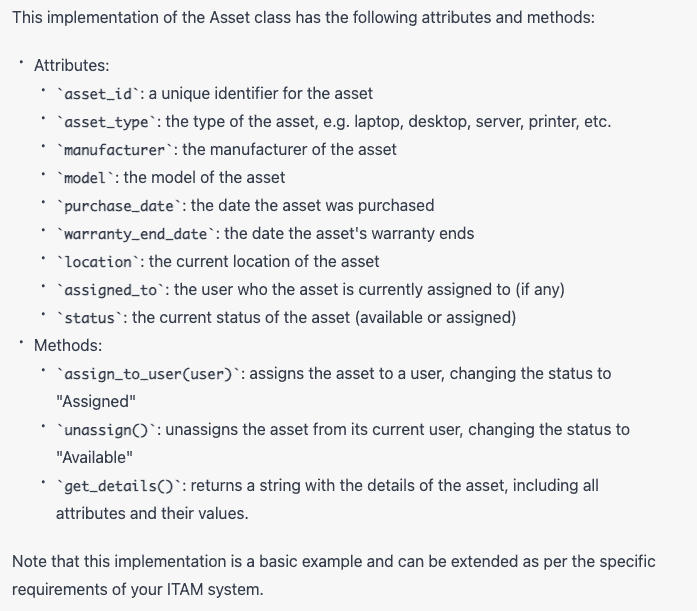

为了跟踪我们的资产，我们需要一种与它们交互的方式。API 是与系统中的对象交互的一种绝佳方式。REST 是在微服务架构中公开 API 功能的一种方法。因此，我们将要求 ChatGPT 为该类创建一个 REST 控制器，并使用以下提示：“请为此类创建一个 REST 控制器。” ChatGPT 生成的简化代码在列表 2.2 中。

##### 列表 2.2 当要求 ChatGPT 为项目添加 REST 控制器时，ChatGPT 生成的 REST 控制器

```py
from flask import Flask, request, jsonify
from asset import Asset, AssetManager

app = Flask(__name__)
asset_manager = AssetManager()

# Get all assets
@app.route('/assets', methods=['GET'])
def get_assets():
    assets = [asset.__dict__ for asset in asset_manager.assets]
    return jsonify({'assets': assets})

# Get an asset by ID
@app.route('/assets/<string:asset_id>', methods=['GET'])
def get_asset(asset_id):
    asset = asset_manager.get_asset_by_id(asset_id)
    if asset:
        return jsonify(asset.__dict__)
    else:
        return jsonify({'error': 'Asset not found'})

if __name__ == '__main__':
   app.run(debug=True)

```

ChatGPT 做出了一些有趣的假设。首先，它使用 Flask 构建 REST 控制器。虽然 Flask 是一种流行的基于 Python 的 Web 框架，绝不是一个坏决定，但我们很想知道为什么选择它。因此，我们可以问 ChatGPT 为什么选择 Flask。使用以下提示：“`为什么在没有提供要使用的框架的情况下，你选择了 Flask ？`” 使用大型语言模型的乐趣之一是试图剥开谜题的层，看看它是如何工作的。

##### 图 2.2 ChatGPT 在没有提供要使用的框架时解释了使用 Flask 的理由。它指出 Flask 轻量级且易于使用。

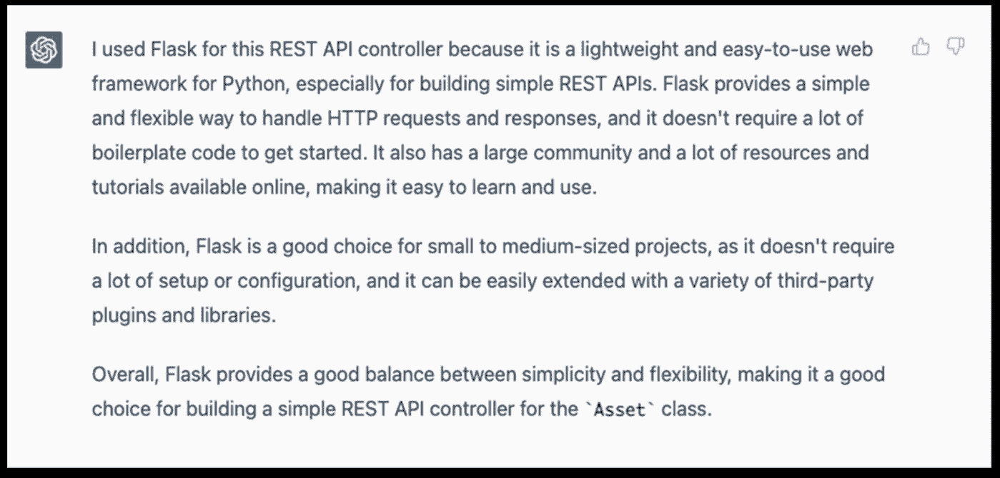

尽管这个理由很好，但它并不是我们想要使用的框架。不久之后，我们将让 ChatGPT 切换应用程序以使用 FastAPI。不过，我们应该确保我们刚刚“编写”的代码能够运行。然而，在我们的项目中缺少一些依赖项。我们可以要求 ChatGPT 为我们创建一个 requirements.txt 文件。

在输入框中输入以下提示：“`请为此项目创建一个 requirements.txt 文件。`” ChatGPT 应该会返回类似以下代码片段的内容。

##### 列表 2.3 具有 Flask 支持的 Asset 管理项目的 requiremnts.txt 文件

```py
click==8.0.3
Flask==2.1.1
importlib-metadata==4.8.1
itsdangerous==2.0.1
Jinja2==3.0.2
MarkupSafe==2.0.1
typing-extensions==3.10.0.2
Werkzeug==2.0.1
zipp==3.6.0
```

一旦我们创建并填充了初始的 app.py 文件（ChatGPT 创建的初始 Python 代码）以及我们刚刚生成的 requirements.txt 文件，我们会注意到 ChatGPT 做出的第二个假设：`AssetManager` 类。ChatGPT 默默地生成了这段代码，而没有给我们任何线索。这个隐藏的类，我们没有源代码，意味着我们的项目无法运行。

幸运的是，我们可以要求 ChatGPT 给我们这段代码。输入以下提示：“`请显示 AssetManager 的源代码。`”

##### 列表 2.4 ChatGPT 生成的 AssetManager 类的类定义

```py
class AssetManager:
    def __init__(self):
        self.assets = []

    def add_asset(self, asset):
        self.assets.append(asset)

    def remove_asset(self, asset_id):
        for asset in self.assets:
            if asset.asset_id == asset_id:
                self.assets.remove(asset)
                return True
        return False

    def get_asset_by_id(self, asset_id):
        for asset in self.assets:
            if asset.asset_id == asset_id:
                return asset
        return None

    def assign_asset(self, asset_id, user):
        asset = self.get_asset_by_id(asset_id)
        if asset and asset.status == 'Available':
            asset.assign_to_user(user)
            return True
        return False

    def unassign_asset(self, asset_id):
        asset = self.get_asset_by_id(asset_id)
        if asset and asset.status == 'Assigned':
            asset.unassign()
            return True
        return False

    def get_available_assets(self):
        return [asset for asset in self.assets if asset.status == 'Available']

    def get_assigned_assets(self):
        return [asset for asset in self.assets if asset.status == 'Assigned']
```

此外，ChatGPT 还将生成关于类使用以及类的所有方法的文档。如果我们想知道如何使用该类，或者如果我们想要向我们的代码添加注释，这份文档将会很有帮助。

##### 图 2.3 ChatGPT 提供了关于 AssetManager 类的文档，包括属性和方法。

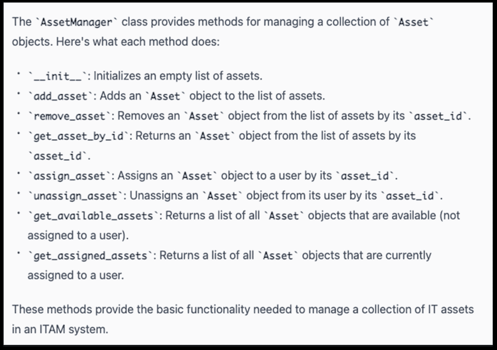

如果您选择将 `AssetManager` 类存储在单独的 Python 文件中，这是一个好主意，那么您将需要更新 app.py 文件，以以下方式更改导入语句：

##### 列表 2.5 修复文件 app.py 的导入语句

```py
from flask import Flask, request, jsonify
from asset import Asset
from asset_manager import AssetManager

app = Flask(__name__)
asset_manager = AssetManager()
…
```

现在，您应该能够运行我们非常简单的 ITAM 系统了。一旦您启动 Flask 应用程序，如果您导航到 http://localhost:5000/assets，您应该会看到 JSON 输出的 Assets。

##### 图 2.4 我们向 AssetManager 添加了三个资产。控制器以 JSON 格式返回了这个集合

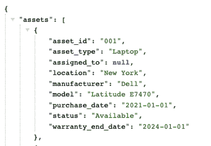

有一个我们应该关注的未解决问题。这个项目仍然在使用 Flask。有几个原因使我们更倾向于使用 FastAPI 而不是 Flask。首先是 FastAPI 将为我们提供更好的性能。FastAPI 在基准测试中一直表现得明显更好，因此得名。FastAPI 支持异步非阻塞、高并发编程。异步非阻塞系统在相同的硬件上提供更好的性能，因为计算机在等待 I/O 操作完成时会执行其他任务。然而，我们想在这个项目中使用 FastAPI 的主要原因是为了演示如何使用 ChatGPT 轻松更改我们的中间件。

因此，我们应该转换到 FastAPI。我们可以要求 ChatGPT 为我们做这个。输入以下提示：“`请将此项目从使用 Flask 切换到使用 FastAPI`。” ChatGPT 将生成类似于以下 app.py 的代码。请注意，列表 2.6 被删减了，只包括 GET REST 操作。完整的输出将支持 POST、PUT 和 DELETE。

##### 列表 2.6 包含 FastAPI 支持的更新后的 app.py

```py
app = FastAPI()
asset_manager = AssetManager()

class AssetIn(BaseModel):
    asset_id: str
    asset_type: str
    manufacturer: str
    model: str
    purchase_date: str
    warranty_end_date: str
    location: str

class AssetOut(BaseModel):
    asset_id: str
    asset_type: str
    manufacturer: str
    model: str
    purchase_date: str
    warranty_end_date: str
    location: str
    assigned_to: str
    status: str

@app.get("/assets/{asset_id}", response_model=AssetOut)
async def get_asset(asset_id: str):
    asset = asset_manager.get_asset_by_id(asset_id)
    if asset:
        return asset
    else:
        return {"message": "Asset not found"}
```

有几件事需要注意。首先是 ChatGPT 通知我们所做的更改。请参见图 2.5。接下来，请注意它创建了两个额外嵌入的类：`AssetIn` 和 `AssetOut`。这被认为是一种良好的做法，因为它提供了客户端应遵守的接口或合同，同时允许我们自由更改我们的领域模型的内部表示。

##### 图 2.5 ChatGPT 解释了将应用程序从 Flask 应用程序更改为 FastAPI 所做的更改。

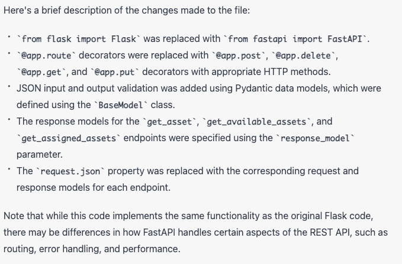

在更改项目的中间件时，您应该查看领域模型类是否没有发生变化。在这种情况下，`Asset` 和 `AssetManager` 都发生了变化。我们应该要求 ChatGPT 展示给我们这些新类。

##### 注意

在设计和开发与 ChatGPT 相关的软件时，定期审查不同类或文件的代码非常重要。这是因为上下文是通过与 ChatGPT 的交互不断建立的。这个审查过程将使您首次亲眼看到这些更改是如何实施的。

首先，让我们看看对 `Asset` 类所做的更改。要做到这一点，请输入以下提示："`请展示 Asset 类的代码。`"

##### 2.7 更新后的 Asset 类，反映了从 Flask 到 FastAPI 的中间件的更改

```py
from typing import Optional

class Asset:
    def __init__(self, asset_id: str, asset_type: str, manufacturer: str, model: str, purchase_date: str, warranty_end_date: str, location: str):
        self.asset_id = asset_id
        self.asset_type = asset_type
        self.manufacturer = manufacturer
        self.model = model
        self.purchase_date = purchase_date
        self.warranty_end_date = warranty_end_date
        self.location = location
        self.assigned_to: Optional[str] = None
        self.status: str = 'Available'

    def assign_to_user(self, user: str):
        self.assigned_to = user
        self.status = 'Assigned'

    def unassign(self):
        self.assigned_to = None
        self.status = 'Available'

    def get_details(self):
        details = f "Asset ID: {self.asset_id}\n"
        details += f"Type: {self.asset_type}\n"
        details += f"Manufacturer: {self.manufacturer}\n"
        details += f"Model: {self.model}\n"
        details += f "Purchase Date: {self.purchase_date}\n"
        details += f "Warranty End Date: {self.warranty_end_date}\n"
        details += f"Location: {self.location}\n"
        details += f "Assigned To: {self.assigned_to}\n"
        details += f"Status: {self.status}\n"
        return details
```

ChatGPT 添加的最有意义的更改是 `Optional` 类型提示。这将表明您打算 `assigned_to` 属性不应为空，从而导致 `NoneType` 错误。ChatGPT 通常还会提供方法文档。

##### 图 2.6 ChatGPT 解释了更新后的 Asset 类。虽然它没有明确告诉我们它在更新类时进行了哪些更改，但它提供了对类方法的充分文档。

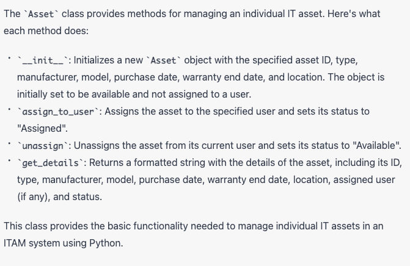

接下来，请输入以下提示："`请展示 AssetManager 的代码。`" 构造函数初始化一个 `Assets` 的列表。这个列表是 `AssetManager` 类用来执行 CRUD（创建、读取、更新和删除）操作的数据结构。

##### 2.8 更新后的 AssetManager 类，反映了从 Flask 到 FastAPI 的中间件的更改

```py
from typing import List, Optional
from asset import Asset

class AssetManager:
    def __init__(self):
        self.assets: List[Asset] = []

    def add_asset(self, asset: Asset):
        self.assets.append(asset)
```

`remove_asset` 方法将遍历资产列表中的元素。如果找到与方法参数（asset_id）提供的标识符相匹配的资产，则将其从列表中移除。

##### 2.9 AssetManager 的 remove_asset 方法

```py
    def remove_asset(self, asset_id: str) -> bool:
        for asset in self.assets:
            if asset.asset_id == asset_id:
                self.assets.remove(asset)
                return True
        return False
```

`get_asset` 方法遍历列表中的所有元素，查找传入的 asset_id 对应的资产。如果找到该资产，则返回它。该搜索功能与此类中的许多方法非常相似：在 `assign_asset` 和 `unassign_asset` 方法中可以再次注意到这一点。如果我们遵循 DRY（不要重复自己）原则（我们应该这么做！），那么我们将重构这个类（或者让 ChatGPT 为我们做这个），整合逻辑，提取一个单一的方法供整个类使用。

##### 2.10 AssetManager 类的常见方法

```py
    def get_asset_by_id(self, asset_id: str) -> Optional[Asset]:
        for asset in self.assets:
            if asset.asset_id == asset_id:
                return asset
        return None

    def assign_asset(self, asset_id: str, user: str) -> bool:
        for asset in self.assets:
            if asset.asset_id == asset_id:
                if asset.status == 'Available':
                    asset.assign_to_user(user)
                    return True
                else:
                    return False
        return False

    def unassign_asset(self, asset_id: str) -> bool:
        for asset in self.assets:
            if asset.asset_id == asset_id:
                if asset.status == 'Assigned':
                    asset.unassign()
                    return True
                else:
                    return False
        return False
```

同样，`get_available_asset` 和 `get_assigned_asset` 方法包含共同的功能。两者都会查找所有状态与参数匹配的资产。这些都可以被重构成一个常用的方法来使用。

##### 2.11 方法：根据给定状态返回资产

```py
    def get_available_assets(self) -> List[Asset]:
        return [asset for asset in self.assets if asset.status == 'Available']

    def get_assigned_assets(self) -> List[Asset]:
        return [asset for asset in self.assets if asset.status == 'Assigned']

    def get_all_assets(self) -> List[Asset]:
        return self.assets
```

附带这段代码的是与类方法及其用法相关的文档。

##### 图 2.7 ChatGPT 列出了已迁移到使用 FastAPI 的 AssetManager 类中可用的方法

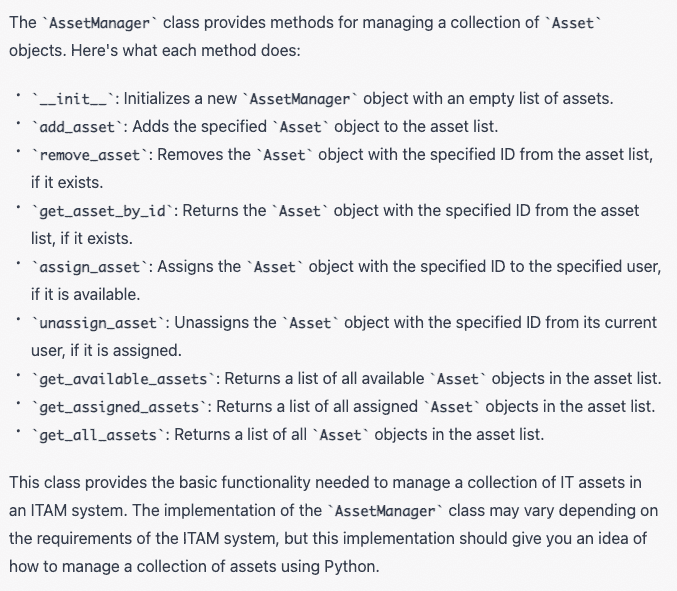

最后，我们需要 ChatGPT 重新生成依赖文件。使用以下提示：“`请展示我新的 requirements.txt 文件。`”

##### 列表 2.12 更新后使用 FastAPI 的 requirements.txt 文件

```py
fastapi==0.70.0
uvicorn==0.15.0
pydantic==1.8.2
```

一旦重新运行了 `pip` 命令（`pip install -r requirements.txt`）以安装更新的依赖项，您应该能够使用以下命令运行项目：`uvicorn app:app --reload`。

端口现在已更改为 8000。当我运行这个时，并没有一个方法来显示 `AssetManager` 中的所有 `Assets`。我们可以要求 ChatGPT 添加这样一个方法。“`请添加一个方法到 app.py 中，以返回和显示所有 Assets。`”您可能会得到一个异步方法，该方法返回 AssetManager 的所有 `Asset`。代码应该类似于以下清单。

##### 列表 2.13 用于显示 AssetManager 中所有资产的方法

```py
@app.get("/assets/", response_model=List[AssetOut])
async def get_assets():
    assets = asset_manager.get_all_assets()
    return assets
```

##### FastAPI 中的路由

在这种方法中，我们使用 @app.get 装饰器定义了一个新的路由，URL 路径为 /assets/。我们还使用 response_model 参数指定了 List[AssetOut] 的响应模型，这告诉 FastAPI 验证输出数据并基于 AssetOut 数据模型的架构生成 API 文档。

在方法内部，我们调用 asset_manager 对象的 get_all_assets 方法，该方法返回所有 Asset 对象的列表。然后，我们将此列表返回给客户端，FastAPI 将自动将其转换为 JSON 数组。

您可以使用 Web 浏览器或诸如 curl 之类的工具测试此端点。例如，如果您在本地运行应用程序并使用端口 8000，则可以在 Web 浏览器中打开 http://localhost:8000/assets/，以查看所有资产的 JSON 数组。

让我们通过在浏览器中添加并显示一个新的 `Asset` 来测试我们的 ITAM 系统。您可以使用 curl 或 Postman 添加一个新的 `Asset`。

##### 列表 2.14 使用 curl 将新资产添加到 AssetManager

```py
curl -X POST -H "Content-Type: application/json" -d '{"asset_id": "12345", "asset_type": "Laptop", "manufacturer": "Dell", "model": "Latitude 5400", "purchase_date": "2022-01-01", "warranty_end_date": "2023-01-01", "location": "New York"}' http://localhost:8000/assets/
```

当您尝试购买这个新的 `Asset` 时，可能会遇到错误。要使 ChatGPT 生成的代码正常工作，需要进行两处修改。第一步是在 Asset 类中添加一个名为 `to_dict()` 的新方法。FastAPI 使用库 pydantic 将输入/输出模型（例如 `AssetIn` 和 `AssetOut`）与 `Asset` 类进行转换。它通过使用字典来分配属性来实现此目的。`to_dict()` 方法将为我们提供一种简单的方法来提供该字典。

##### 列表 2.15 在 asset.py 中定义的 Asset 类中添加 to_dict 方法

```py
def to_dict(self):
        return {
            "asset_id": self.asset_id,
            "asset_type": self.asset_type,
            "manufacturer": self.manufacturer,
            "model": self.model,
            "purchase_date": self.purchase_date,
            "warranty_end_date": self.warranty_end_date,
            "location": self.location,
            "assigned_to": self.assigned_to,
            "status": self.status
        }
```

我们需要做的第二个更改是将输出模型（`AssetOut`）转换为 JSON。我们需要在输出此对象的所有地方进行此操作。我们将检查与将输出更改为 JSON 相关的类中的更改。

##### 列表 2.16 更新后的 app.py 类，输出采用 JSON 编码

```py

@app.get("/assets/", response_model=List[AssetOut])
async def get_assets():
    assets = asset_manager.get_all_assets()
    return JSONResponse(content=[asset.to_dict() for asset in assets])

@app.post("/assets/")
async def add_asset(asset: AssetIn):
    new_asset = Asset(asset.asset_id, asset.asset_type, asset.manufacturer, asset.model, asset.purchase_date, asset.warranty_end_date, asset.location)
    asset_manager.add_asset(new_asset)
    return {"message": "Asset added successfully"}

@app.delete("/assets/{asset_id}")
async def remove_asset(asset_id: str):
    if asset_manager.remove_asset(asset_id):
        return {"message": "Asset removed successfully"}
    else:
        return {"message": "Asset not found"}

@app.get("/assets/{asset_id}", response_model=AssetOut)
async def get_asset(asset_id: str):
    asset = asset_manager.get_asset_by_id(asset_id)
    if asset:
        return JSONResponse(content=asset.to_dict())
    else:
        return {"message": "Asset not found"}

@app.put("/assets/{asset_id}/assign")
async def assign_asset(asset_id: str, user: str):
    if asset_manager.assign_asset(asset_id, user):
        return {"message": "Asset assigned successfully"}
    else:
        return {"message": "Asset not available"}

@app.put("/assets/{asset_id}/unassign")
async def unassign_asset(asset_id: str):
    if asset_manager.unassign_asset(asset_id):
        return {"message": "Asset unassigned successfully"}
    else:
        return {"message": "Asset not assigned"}

@app.get("/assets/available/", response_model=List[AssetOut])
async def get_available_assets():
    assets = asset_manager.get_available_assets()
    return JSONResponse(content=[asset.to_dict() for asset in assets])

@app.get("/assets/assigned/", response_model=List[AssetOut])
async def get_assigned_assets():
    assets = asset_manager.get_assigned_assets()
    return JSONResponse(content=[asset.to_dict() for asset in assets])
```

将中间件从 Flask 切换到 FastAPI 在我们的代码中引起了无数的问题。然而，通过这个过程，我们建立了一个直觉，即我们应该如何以及何时与 ChatGPT 进行交互。ChatGPT 是我们软件设计工具箱中不可或缺的工具。它可以让我们快速地对我们的项目进行根本性的改变，并给我们指明应该采取的方向。它往往在非常精细的任务上失败（至少在撰写本文时是这样）。

一个有趣的实验是你应该尝试（在一个新的会话中）首先创建一个使用 FastAPI 的项目的提示，然后将其与我们迭代创建的项目进行比较。你应该会注意到代码有很大的不同。

在本书的这一部分中，我们深入探讨了 ChatGPT 在软件开发中的实际应用，通过开发一个小型 IT 资产管理（ITAM）项目。我们利用 ChatGPT 自动生成软件的基本元素，包括创建类、开发一个 RESTful 控制器，并生成一个 requirements.txt 文件。这个过程凸显了 ChatGPT 作为一个辅助工具在加快和简化软件开发的复杂过程中的能力，特别是对于像这样的小规模项目。在这种情况下应用 ChatGPT 不仅突显了它在构建基本软件组件方面的实用性，而且展示了它在未来简化软件开发流程方面的潜力。

## 2.3 让 Copilot 掌控！

现在让我们使用 GitHub Copilot 来解决 Asset 类的创建问题。附录 B 中有关于如何创建账户并将插件安装到你喜爱的 IDE 中的说明（假设你喜欢的 IDE 是 VS Code 或 PyCharm 中的一个）。安装完成后，你应该在你喜欢的 IDE 中创建一个新项目。首先，创建一个名为 asset.py 的新文件。这个类将保存 Asset 类的源代码。当你输入构造函数时，Copilot 将给出代码建议。你可能会得到类似于图 2.9 中源代码的代码。或者，你可以通过按下 `Ctrl+Enter` 来激活交互模式，Copilot 将基于当前上下文生成多达十个建议。

##### 注意

在本书的大部分内容中，我们将主要使用内联模式，在该模式下，你可以使用 `Tab` 键来接受给定的建议。

虽然 Copilot 的第一次尝试令人钦佩，但它并不像我们感兴趣的类定义；我们想要一个 ITAM 系统资产，而不是一个通用的资产实现。就像我们在 ChatGPT 中所做的那样，我们将创建一个提示，来告诉 Copilot 我们的意图，给它提供额外的上下文和信息，以便它生成代码建议。在 Copilot 中输入提示非常简单，只需在源代码文件的开头添加注释。我们将告诉 Copilot 类的名称应该是什么，以及它应该具有什么属性。

##### 清单 2.17 GitHub Copilot 的起始提示要求其创建名为 Asset 的新类

```py
# Create a class named Asset
# Add the following attributes: id, asset_type, manufacturer, model, purchase_date, purchase_price, warranty_end_date, location, and status. 
# The class should have a function named get_details that returns a string that is the concatenation of all attributes.
# The class should have a function named to_dict that returns a dictionary of all attributes.
```

当您开始定义构造函数时，Copilot 将返回一个完整的代码建议，用于 ITAM 系统资产。 如果我们将 ChatGPT 生成的代码与 Copilot 生成的结果代码进行并排比较，我们会注意到它们非常相似。

##### 图 2.9 根据我们添加到文件顶部的注释，Copilot 能够生成一个构造函数，其中包含提示中包含的所有属性。

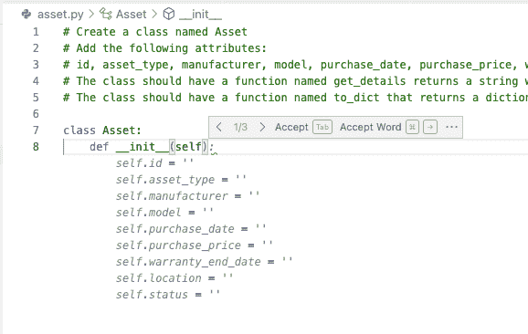

接下来，添加 `get_details` 和 `to_dict` 方法。 JSONResponse 类接受一个字典并将其转换为 JSON。 `to_dict` 方法将有助于简化此交接。 `get_details` 方法在调试过程中会很有用，使我们能够查看类的内容。

##### 清单 2.18 Copilot 根据我们的请求生成的代码

```py
# Create a class named Asset
# Add the following attributes: id, asset_type, manufacturer, model, purchase_date, purchase_price, warranty_end_date, location, and status. 
# The class should have a function named get_details that returns a string that is the concatenation of all attributes.
# The class should have a function named to_dict that returns a dictionary of all attributes.

class Asset:
    def __init__(self):
        self.id = None
        self.asset_type = None
        self.manufacturer = None
        self.model = None
        self.purchase_date = None
        self.purchase_price = None
        self.warranty_end_date = None
        self.location = None
        self.status = None

    def get_details(self):
        return f"{self.id}, {self.asset_type}, {self.manufacturer}, {self.model}, {self.purchase_date}, {self.purchase_price}, {self.warranty_end_date}, {self.location}, {self.status}"

    def to_dict(self): 
        return {
            "id": self.id,
            "asset_type": self.asset_type,
            "manufacturer": self.manufacturer,
            "model": self.model,
            "purchase_date": self.purchase_date,
            "purchase_price": self.purchase_price,
            "warranty_end_date": self.warranty_end_date,
            "location": self.location,
            "status": self.status
        }
```

现在我们有了资产类。 我们将继续 AssetManager 类。 我们将从一个基本提示开始，告诉 Copilot 创建 AssetManager 类并定义一些基本功能。

##### 清单 2.19 让 Copilot 生成我们的 AssetManager 的提示

```py
# Create a class called AssetManager that will allow us to store and retrieve assets.
```

在定义完类之后不久，您会注意到 Copilot 将建议为此管理器提供完整的源代码。

##### 图 2.10 带有最少说明，Copilot 能够创建一个允许存储和检索资产的 AssetManager。

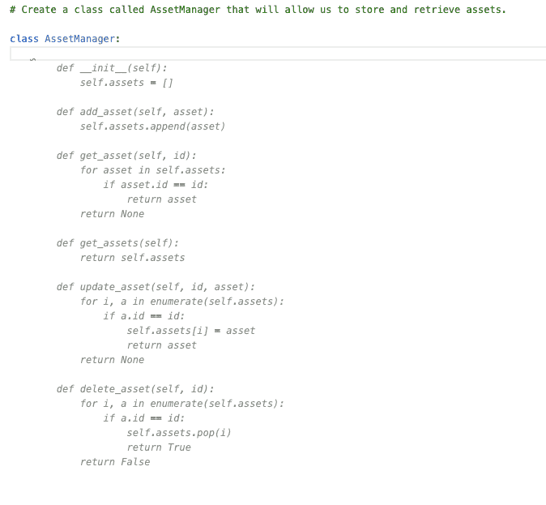

Copilot 的 AssetManager 源代码将与 ChatGPT 生成的代码非常相似。

##### 清单 2.20 由 Copilot 从我们的初始提示生成的 AssetManager 完整源代码

```py
# Create a class called AssetManager that will allow us to store and retrieve assets.

class AssetManager:
    def __init__(self):
        self.assets = []

    def add_asset(self, asset):
        self. Assets.append(asset)

    def get_assets(self):
        return self. assets

    def get_asset(self, asset_id):
        for asset in self.assets:
            if asset.id == asset_id:
                return asset
        return None

    def update_asset(self, asset_id, asset):
        for index, asset in enumerate(self.assets):
            if asset.id == asset_id:
                self.assets[index] = asset
                return True
        return False

    def delete_asset(self, asset_id):
        for index, asset in enumerate(self.assets):
            if asset.id == asset_id:
                del self.assets[index]
                return True
        return False
```

接下来，我们将组装 FastAPI 应用程序以运行和显示资产。 我们将从 app.py 类的开头开始。

##### 清单 2.21 启动提示，让 Copilot 构建我们的 FastAPI 应用程序

```py
# Create a FastAPI app that allows CRUD operations on the Asset class.
```

##### 图 2.11 Copilot 开始自动导入所需的库。

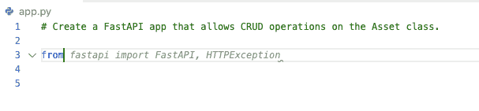

Copilot 将添加导入语句。 在定义 FastAPI 应用程序之后发生了一些有趣的事情：Copilot 将尝试定义 Asset 类。 封装和保护内部模型是一个好习惯，这就是 Asset 类。

##### 图 2.12 Copilot 尝试定义基于 pydantic 的 Asset 类。 但是，我们已经定义了一个 Asset 类，它代表了我们的“内部”类的模型。 因此，我们拒绝了这个建议。

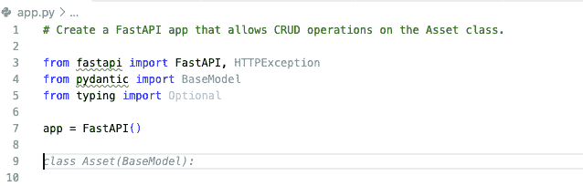

为了保护我们的内部模型，因此，我们将拒绝 ChatGPT 提供给我们的建议。相反，我们将创建两个类：AssetIn 和 AssetOut。 Copilot 生成的代码与 ChatGPT 提供给我们的解决方案非常相似。一旦我们键入 AssetIn，Copilot 将会帮助我们创建剩下的类，因为它已经猜到我们想要做什么。

##### 图 2.13 Copilot 已确定我们不想直接暴露我们的内部模型，并创建一个类来表示我们尚未定义的 POST REST 端点的输入负载。

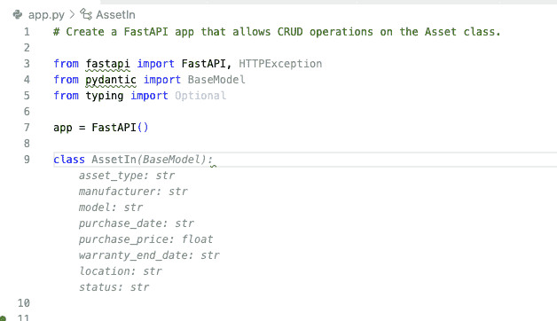

当我们继续定义我们的 FastAPI 应用程序中的方法时，Copilot 将预测方法的实现。

##### 图 2.14 在 Copilot 生成了所有方法的实现后，文件 app.py 的最终内容。

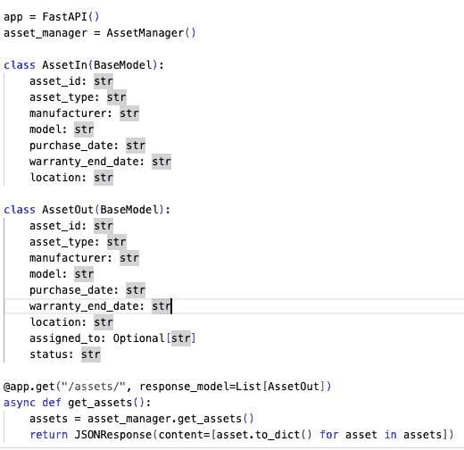

最后，我们将让 Copilot 为我们创建一个 `requirements.txt` 文件。我们从列表 2.22 的提示开始。然后，当我们开始列举库的版本号时，Copilot 将添加版本号。

##### 列表 2.22 此项目的 requirements.txt 文件

```py
# generate a requirements.txt file for this project
fastapi==0.63.0
uvicorn==0.13.4
pydantic==1.7.3
starlette==0.13.6
```

使用以下命令启动应用程序：`uvicorn app:app --reload`。通过列表 2.23 中的 curl 命令创建一个新的资产。

##### 列表 2.23 用于向我们的 Copilot 应用程序添加新资产的 curl 命令

```py
curl -X POST -H "Content-Type: application/json" -d '{"id": "12345", "asset_type": "Laptop," "manufacturer": "Dell", "model": "Latitude 5400", "purchase_date": "2022-01-01", "warrenty_expiration": "2023-01-01", "location": "New York", "status": "Available", "purchase_price": "1000.00"}' http://localhost:8000/assets/
```

打开你的浏览器访问 http://localhost:8000/assets/ 通过 REST 控制器展示新的资产。

##### 图 2.15 我们使用 POST 端点创建了一个单独的资产对象。这通过 GET 端点显示。

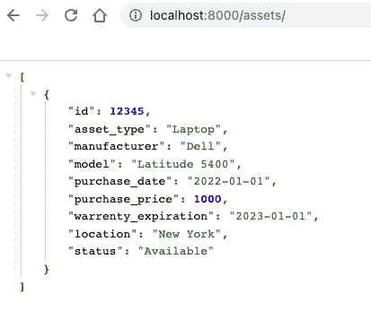

在本节中，我们开始了一个软件开发的比较之旅，使用了两种不同的生成性 AI 工具 - ChatGPT 和 GitHub Copilot，这两种工具都应用于相同的 IT 资产管理（ITAM）项目中。 ChatGPT 在我们的开发方式中提供了显著的灵活性，甚至使我们能够切换框架，尽管有些谨慎。它作为一位宝贵的顾问，提供建议和指导。

与此同时，我们与 Copilot 的经验需要采用不同的方法。我们使用提示来指示 Copilot 生成代码，这要求我们从一开始就对预期的实现有清晰的愿景。

接下来，我们计划引入 AWS CodeWhisperer 到混合中，为这个探索性练习增加另一层。最后，我们将对比这三个工具 - ChatGPT、Copilot 和 AWS CodeWhisperer。目标仍然是了解它们各自的独特优势和局限性，以及根据软件开发项目的需求和环境如何最佳地使用每个工具。

总的来说，通过我们对这些 AI 助力工具的实践经验，我们深入探讨了 AI 在软件开发领域的变革潜力。无论是 ChatGPT、Copilot 还是即将推出的 AWS CodeWhisperer，每个工具都在这一领域带来了独特的东西，承诺了一个更高效、更流畅的软件开发流程。然而，最大化它们的好处的关键在于我们不断适应和学习，充分利用每个工具的同时注意它们的局限性。

## 2.4 让 CodeWhisperer 大声说话

在我们开始使用 CodeWhisperer 之前，我们应该禁用 Copilot。单击扩展表并搜索 Copilot。一旦找到它，点击 **Disable** 按钮。你需要重新启动应用程序。一旦应用程序重新启动，你就可以开始使用 CodeWhisperer 了。如果你需要帮助安装或配置 CodeWhisperer，你应该参考附录 C。一旦插件安装完成并且你已经登录到你的开发者账户中，你应该创建一个名为 asset.py 的文件。

##### 图 2.16 在我们切换到 CodeWhisperer 之前，我们必须禁用 Copilot。我们在扩展选项卡中禁用该扩展。

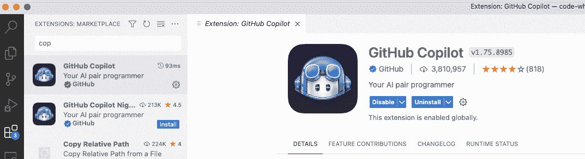

我们将使用与 Copilot 相同的提示。这里为了方便重新打印。

##### 列表 2.24 让 CodeWhisperer 为我们创建 Asset 类的提示

```py
# Create a class named Asset
# Add the following attributes: id, asset_type, manufacturer, model, purchase_date, purchase_price, warranty_end_date, location, and status. 
# The class should have a function named get_details that returns a string that is the concatenation of all attributes.
# The class should have a function named to_dict that returns a dictionary of all attributes.
```

一旦我们输入了这个提示并编写了类定义，CodeWhisperer 将开始编写构造函数。

##### 图 2.17 根据我们在文件开头输入的提示，CodeWhisperer 建议了一个构造函数。

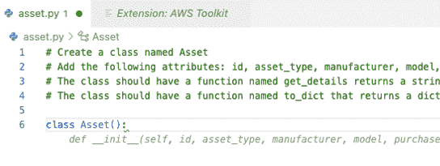

然后，我们继续编写方法定义，CodeWhisperer 将忠实地生成实现。

##### 列表 2.25 CodeWhisperer 生成的完整代码

```py
# Create a class named Asset
# Add the following attributes: id, asset_type, manufacturer, model, purchase_date, purchase_price, warranty_end_date, location, and status.
# The class should have a function named get_details that returns a string which is the concatenation of all attributes.
# The class should have a function named to_dict that returns a dictionary of all attributes.

class Asset():
    def __init__(self, id, asset_type, manufacturer, model, purchase_date, purchase_price, warranty_end_date, location, status):
        self.id = id
        self.asset_type = asset_type
        self.manufacturer = manufacturer
        self.model = model
        self.purchase_date = purchase_date
        self.purchase_price = purchase_price
        self.warranty_end_date = warranty_end_date
        self.location = location
        self.status = status

    def get_details(self):
        return f"{self.id}, {self.asset_type}, {self.manufacturer}, {self.model}, {self.purchase_date}, {self.purchase_price}, {self.warranty_end_date}, {self.location}, {self.status}"

    def to_dict(self):
        return {"id": self.id, "asset_type": self.asset_type, "manufacturer": self.manufacturer, "model": self.model, "purchase_date": self.purchase_date, "purchase_price": self.purchase_price, "warranty_end_date": self.warranty_end_date, "location": self.location, "status": self.status}
```

最终的代码应该类似于 Copilot 创建的代码。非常相似。基于此，我们将跳过项目中的其他文件的编写。完成项目将留给一个有动力的读者。

在这一部分，我们将 AWS CodeWhisperer 引入了其中。像它的前辈一样，CodeWhisperer 能够生成项目的关键组件，强化了 AI 在软件开发领域的变革潜力。

鉴于这些工具生成的代码之间惊人的相似性，一个引人入胜的问题自然而然地出现：这些产品到底如何真正比较？对于这个问题的答案并不像人们想象的那样直截了当，因为每个工具具有独特的优势和局限性。

在接下来的部分中，我们将深入探讨这个问题，比较这三种工具 - ChatGPT、Copilot 和 AWS CodeWhisperer - 以便了解它们的独特优势、最佳使用案例，以及它们可能如何重塑软件开发的未来。我们的目标是提供一份全面的指南，帮助软件开发人员在这个快速发展的 AI 驱动工具领域中找到方向。

## 2.5 比较 ChatGPT、Copilot 和 CodeWhisperer

我们要考虑的第一个维度是参与模型：我们如何与 AI 互动。就 ChatGPT 而言，我们登录聊天网站并将提示输入到聊天输入框中。然后，我们在后续提示中完善我们的需求。反馈循环从先前的提示中提取上下文，将其应用于当前提示，并生成输出，用户对其作出反应并重新发出。如果我们将这种参与模型与 Copilot 和 CodeWhisperer 的模型进行对比，我们会注意到后两种工具是在集成开发环境中工作的。我们不能在 IDE 外部使用它；尽管我们努力，但这种方法并不是本质上劣质的，它只是不同。

Copilot 和 CodeWhisperer 让你保持在你的集成开发环境中可能被视为一种优势而不是不足之处。在即将推出的 Copilot X 版本中，你将获得两全其美：ChatGPT 和 GPT 4.0 都在你的集成开发环境中。这些工具让你在没有干扰的情况下更长时间地保持在你的代码中。无干扰地工作是提高生产力的关键之一。Copilot 和 CodeWhisperer 擅长让你专注于工作；让你不必切换上下文；让你远离干扰；让你更长时间地保持在工作状态中。它们做得很好。你与 ChatGPT 进行对话；Copilot 和 CodeWhisperer 给你建议。对话会花费更长时间来完成；建议则快速且免费。

接下来，我们将检查代码是如何呈现和生成的。ChatGPT 可以将代码创建为块、方法、类或项目。如果需要，ChatGPT 会有意识地逐步展示项目。但 ChatGPT 实际上在幕后创建了项目。毕竟，ChatGPT 喜欢交谈。对于 Copilot 和 CodeWhisperer，代码一次性展开一个方法，至少最初是这样的。随着使用的增加，你会注意到它们可以为给定类编写越来越多的代码。但遗憾的是，它们无法通过一个小提示编写整个项目。

它们都共享的一个特性是它们能够响应提示。对于 ChatGPT，提示是唯一与工具互动的方式。对于 Copilot 和 CodeWhisperer，响应提示并不是严格必要的，但编写这些提示将使输出更接近你最初的想法。

综合考虑这些因素，我们可能得出 ChatGPT 是进行探索和原型开发的最佳选择。然而，ChatGPT 可能会引起不必要的分心，部分原因是因为你离开了你的集成开发环境（IDE），现在进入到了一个带有所有浏览器相关诱惑的网页浏览器中。ChatGPT 本身就是引入不必要干扰的一部分。你最终会掉进那个寓言中的兔子洞里。这个工具使事情变得过于容易，而不是相反。不要被这吓到。它是一个很棒的资源。

Copilot 和 CodeWhisperer 要求你有一个预期结果。因此，这些工具非常适合在你希望完成具备精确要求和紧密期限的编码任务时使用。当你熟悉语言和框架时，Copilot 和 CodeWhisperer 效果最佳。它们可以自动化很多枯燥的工作，让你专注于能够增加价值的业务需求，这很可能是你编写软件的原因。

下表简要总结了这三种人工智能的利与弊：

##### 图 2.18 ChatGPT、Copilot 和 CodeWhisperer 的正负比较。

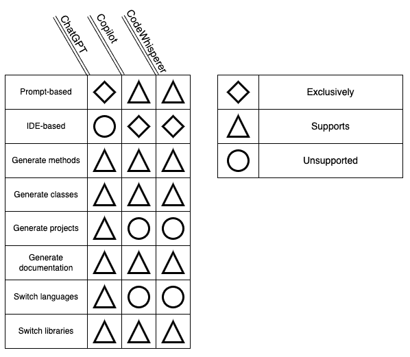

在本章中，我们经历了很多，多次重复编写相同的代码。然而，编写 ITAM 系统相同子节的三个版本为我们提供了合适使用 ChatGPT 而不是使用其他以 IDE 为重点的工具（如 Copilot 和 CodeWhisperer）的时机打下了基础。在随后的章节中，我们将利用这些知识，选择最合适的工具。

最后要注意的是，这些工具在它们一起使用时效果最佳。ChatGPT 是一个很好的示例和结构工具。Copilot 和 CodeWhisperer 为您提供了扩展和自定义代码的能力。这使得即将发布的 Copilot X 版本非常令人兴奋：它是这两种方法的结合。

## 2.6 小结

+   信息技术资产管理（ITAM）系统是一种用于管理和跟踪硬件设备、软件许可证和其他与信息技术相关的组件的工具。这些系统允许公司控制成本、管理供应商关系，并确保许可和合规性。

+   在本章中，我们通过在这三个工具中编写相同的代码，探索了使用 ChatGPT、GitHub Copilot 和 AWS CodeWhisperer 的方式。编写相同的代码三次允许我们比较它们的特点，并对使用方式的差异进行对比和对照：如何以及何时使用每个工具。

+   ChatGPT 是一个基于提示的生成式人工智能，与用户进行对话，帮助他们探索想法，以协助设计和开发整个项目。此外，ChatGPT 精巧地为其编写的每种方法生成文档。我们之所以开始使用它来开始本章，是因为它帮助定义了我们在本章剩余部分中使用的模板之一。这是一个迷人的产品，可以导致不必要但令人愉快的分心。

+   Copilot 和 CodeWhisperer 是头脑风暴式的工具，在您知道要做什么并需要一些关于如何最好地完成的建议时效果最佳。与这些工具的互动方式非常相似，结果也是如此。

+   我们撰写本文时，ChatGPT 不支持在集成开发环境中进行开发。然而，与 GitHub Copilot 和 AWS CodeWhisperer 不同，它可以生成整个项目，并轻松将代码从一种编程语言转换为另一种。GitHub Copilot 和 AWS CodeWhisperer 从您的注释中获取提示，推断出您想要编写的代码。而在 ChatGPT 中，您需要明确编写提示，ChatGPT 将使用这些提示来创建代码。
