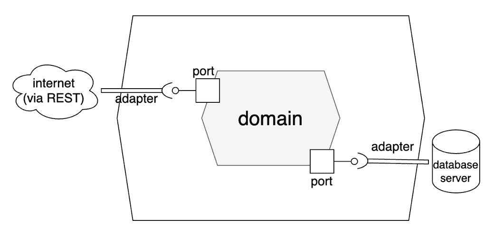
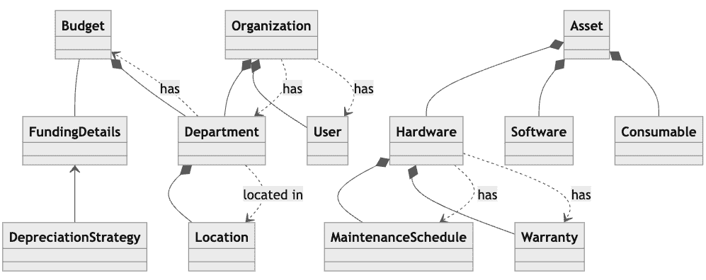
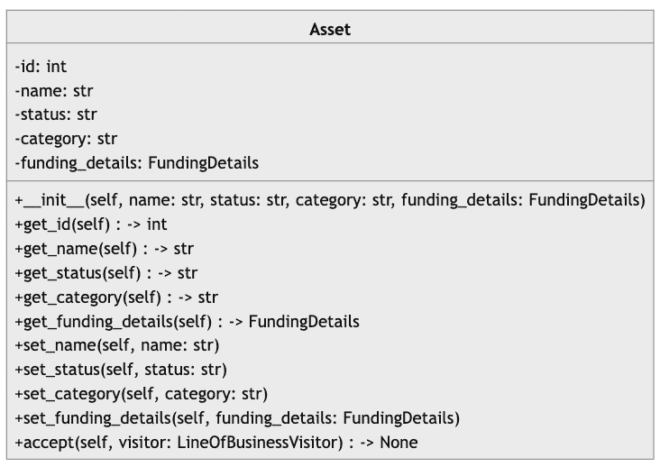
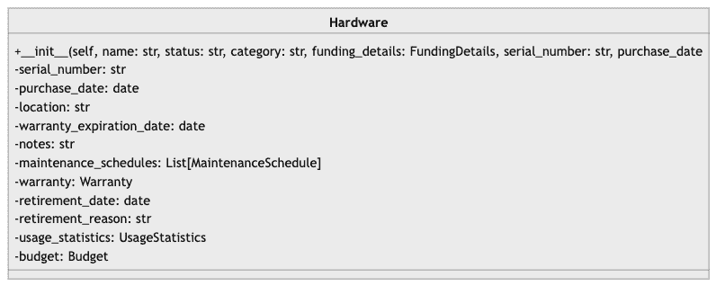
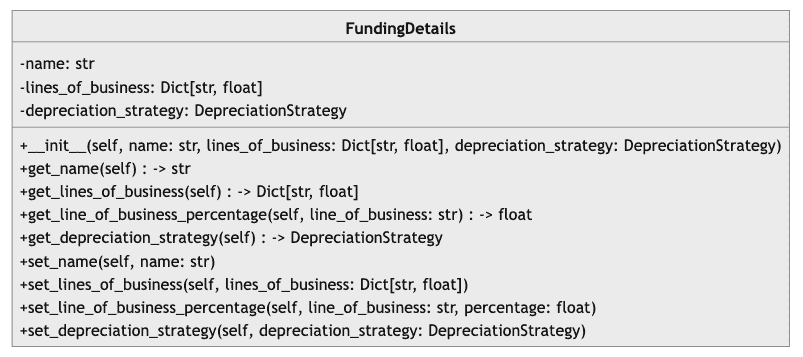
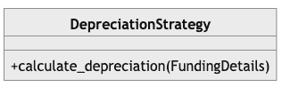
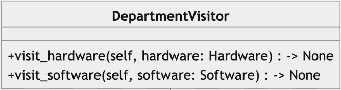
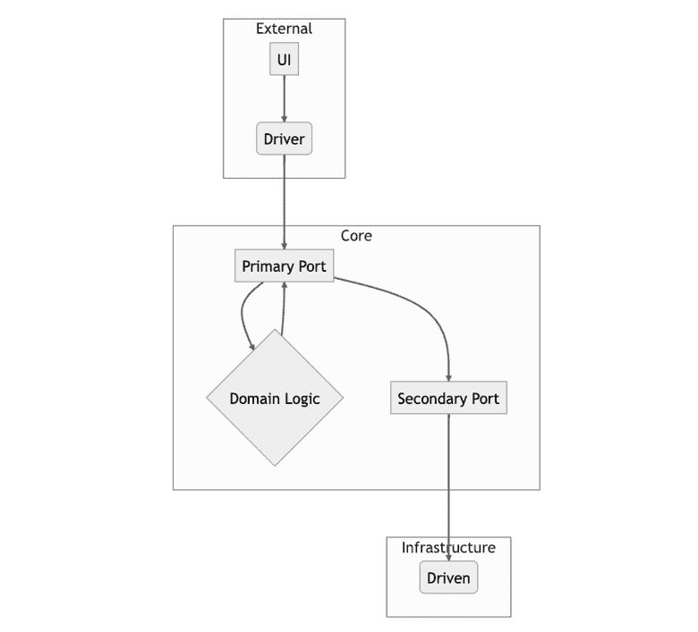

# 第四章：使用 GitHub Copilot 构建软件

### 本章节涵盖的内容：

+   使用 Copilot 开发我们系统的核心

+   重构以应用模式

+   集成六边形架构

+   融合事件驱动原则

在上一章中，我们使用 ChatGPT 帮助我们设计 ITAM 系统。现在，有了设计的坚实基础，我们开始构建这个应用程序，从领域模型开始。领域模型是我们系统的核心。它代表将应用和执行我们的业务规则的类。我们将在本章节中广泛使用 GitHub Copilot。本章节最重要的收获是，通过使用大型语言模型，帮助我们阐明未知的未知，即系统中的非明显、奥秘或隐藏复杂性。它使得困难的事情变得更容易、看似不可能的事情变得可能。

还有一件事，本章节的代码占比较大。您的代码很可能与本章节中呈现的代码不完全相同。与其钻牛角尖，不如接受它，试着理解这些差异的原因。观察一下如果更改您的提示会如何修改结果，如果会，以什么方式？

## 4.1 奠定基础

在本章的第一部分中，我们将奠定应用程序的基础。我们从应用程序的核心开始：领域模型。领域模型应包含我们应用程序的未打磨的业务规则和责任，摆脱外部世界，专注于业务逻辑和工作流。正如您从图 4.1 中看到的那样，领域位于我们应用程序的中心。这并非巧合，因为它是应用程序的核心。在本章节中，当我们加深对六边形架构的理解和欣赏时，我们将在整章里回到这个图表。

##### 图 4.1 传统六边形架构的可视化，其中领域或业务逻辑位于中间。



正如您从上一章中所记得的，六边形架构是一种旨在在应用程序的核心逻辑和其与外部系统的交互之间创建明确分离的架构模式。这个原则在前一张图中清晰地显示出来。

## 4.1.1 表达我们的领域模型

在开始之前，让我们回顾一下上一章中我们使用 ChatGPT 协助设计信息技术资产管理（ITAM）系统时创建的文档。这份文档将为我们提供模板供我们实现。正如我们现在所知道的，我们不会盲目实现 ChatGPT 提供的代码和文档的每个方面。这样做可能会意外地导致脆弱且难以更改、不安全或不完整的设计。

##### 图 4.2 ChatGPT 为我们生成的领域对象模型，突出了类之间的关系。



如果我们深入研究上一章创建的`Asset`类的方法和字段，我们会注意到两件事情：首先，这与我们在第二章创建的`Asset`类不同。其次，ChatGPT 建议我们为这个类编写一个接受所有属性的构造函数；然而，它也添加了许多修改器方法 - “设置器” - 用于所有属性。

##### 图 4.3 由我们自己与 ChatGPT 的帮助创建的 Asset 类。它包括一个详尽的构造函数和每个属性的修改器方法



### 4.1.2 更喜欢不可变性

不可变对象，其内部状态不能更改，使类更安全且更易于并发。如果两个或多个线程访问同一个对象，我们不需要同步访问；状态几乎肯定会对这两个线程都是相同的。因此，我们将更喜欢基于构造函数的值注入而不是修改器方法。当我们编写这个类时，我们将不添加修改器。

首先，我们将`purchase_date`字段从 Hardware 中提取出来。这个字段在所有资产之间是共享的（我们不会在本书中讨论资产被租赁的情况）；因此，`purchase_date`字段应该属于父类。

接下来，我们将需要添加一些额外的字段，这些字段在上一章的设计中不存在：成本、`useful_life`和残值。这些字段将对*折旧*的正确计算至关重要。你可能记得折旧是一种用于在其有用寿命内分配资产成本的会计方法。你应该注意到，成本和有用寿命这两个术语出现在该定义中。因此，这些字段是必需的。此外，残值是企业、部门或公司在资产有用寿命结束时可以预期从出售资产中获得的金额。这个字段在某些折旧计算中是必要的；因此，我们将把它添加到我们的类中。

接下来，创建一个名为 domain/model 的包，添加一个名为 asset.py 的文件，然后在这个文件的开头添加以下提示。

##### 图 4.1 让 GitHub Copilot 创建我们的`Asset`类的提示

```py
# Define a class named Asset
# It should have the following attributes: 
# - id: int
# - name: str
# - status: str
# - category: str
# - cost: float
# - useful_life: float
# - salvage_value: float
# - purchase_date: datetime
# 
# The attributes cannot be None and cannot be added after construction
# However, we should be able to access the attributes using methods
```

当你在文件中按制表符以让 GitHub Copilot 为你自动生成代码时，你可能会注意到，尽管我们明确指示不要这样做，它仍然会创建修改器。出于这个原因以及许多其他原因（正如我们将在本章中看到的那样），在编码时你必须保持警惕和注意。当然，你可以表达你的意图，但这些工具可能会覆盖你对工具构建代码的期望。此外，你可能会注意到它使用了`@dataclasses`装饰器。

##### 装饰器设计模式

装饰器设计模式是一种结构设计模式，允许你在不改变现有类的情况下动态地向对象添加新的或修改现有的行为。这是通过将现有对象包装在装饰对象中来实现的。

### 4.1.3 装饰我们最喜爱的类

这个装饰器会为 Python 自动生成常见的方法（例如等于，字符串表示等）。数据类是一个主要用于存储数据并且没有太多行为的类。在 Python 中，数据类是在 Python 3.7 中引入的一个实用程序，用于使主要用于存储数据的类更清洁和更有效。这与用户定义类的目的可能是混合的（即数据和行为）。在这种情况下使用数据类是有用的，因为您可以避免冗余代码来构建、表示和比较对象。

另外，对于那些在家里计分的人：我们的自动生成的代码正在自动生成代码。

##### 列表 4.2 GitHub Copilot 响应我们的提示所创建的代码

```py
from dataclasses import dataclass
from itam.domain.funding_details import FundingDetails

@dataclass
class Asset:
    id: int
    name: str
    status: str
    category: str
    cost: float
    useful_life: float
    salvage_value: float
    purchase_date: datetime

    def __post_init__(self):
        if self.id is None:
            raise TypeError("ID cannot be None")
        if self.name is None:
            raise TypeError("Name cannot be None")
        if self.status is None:
            raise TypeError("Status cannot be None")
        if self.category is None:
            raise TypeError("Category cannot be None")
        if self.cost is None:
            raise TypeError("Cost cannot be None")
        if self.useful_life is None:
            raise TypeError("Useful life cannot be None")
        if self.salvage_value is None:
            raise TypeError("Salvage value cannot be None")

    def get_id(self):
        return self.id

    ... # other accessors omitted for clarity

```

`__post_init__()` 方法将在构造函数之后运行，并强制确保参数中没有一个是 null（在 Python 中称为 ‘None’）。以这种方式进行防御性编码将确保在初始化后您的值不能更改。当然，您还可以添加额外的验证，比如对类别状态的可接受值。但是，如果您希望在这方面强制执行值，最好是使它们成为适当的类或使用 Enum 类。

接下来，让我们审查一下我们在上一章中创建的 Mermaid 图中的 Hardware 类。

##### 图 4.4 我们在 ChatGPT 的帮助下起草的 Hardware 类。请注意它没有任何访问器方法。



从这个图表中可以注意到几个项目：它既没有访问器，也没有变异器方法。我们需要向我们的提示添加访问器方法。

现在我们已经审查并评估了我们在 Hardware 类中需要的方法和属性，我们应该构建它。在 domain 目录中创建一个名为 `hardware.py` 的文件。在此文件的开头添加列表 4.3 中的提示。

##### 列表 4.3 一个提示，让 GitHub Copilot 创建我们的 `Hardware` 类

```py
# Define a class called Hardware, which is an instance of Asset. 
# The Hardware entity has the following attributes:
# - serial_number: str,
# - location: Location,
# - warranty_expiration_date: date,
# - notes: str
# - maintenance_schedules: List[MaintenanceSchedule]
# - warranty: Warranty
# - retirement_date: date
# - retirement_reason: str
# - usage_statistics: UsageStatistics
# - budget: Budget
# The attributes can be None and the class should have a constructor that takes all attributes as parameters.
# The attributes should be private and the class should have accessor methods for all attributes.
```

出于简洁起见，列表 4.4 中不包括后构造函数代码和访问器方法。但是，它们应该会自动添加到您的文件中。

##### 列表 4.4 `Hardware` 类的定义

```py
from datetime import datetime
from dataclasses import dataclass
from itam.domain.asset import Asset
from itam.domain.location import Location
from itam.domain.warranty import Warranty
from itam.domain.maintenance_schedule import MaintenanceSchedule
from itam.domain.usage_statistics import UsageStatistics
from itam.domain.budget import Budget

@dataclass
class Hardware(Asset):
    serial_number: str
    location: Location
    warranty_expiration_date: datetime
    notes: str
    maintenance_schedules: list[MaintenanceSchedule]
    warranty: Warranty
    retirement_date: datetime
    retirement_reason: str
    usage_statistics: UsageStatistics
    budget: Budget
```

接下来，鉴于它在 Asset 类中被引用，让我们接下来添加 `FundingDetails` 类。然而，让我们先重新审查一下类图。注意到一件事，`lines_of_business` 字典，我们将它重命名为 `department_allocations`，使用字符串作为键。我们应该将其更改为实际的 `Department`。这是另一个提醒，我们必须积极监视生成的代码并作出如何最好地实现项目的决策。

##### 图 4.5 我们在 ChatGPT 的帮助下起草的 FundingDetails 类。我们将希望更改业务字典的行（改名为 department_allocations）以使用 Department 作为键。



对于这个类，我们需要做两个额外的编辑。我们需要在构造函数中包含资产。这将允许我们访问进一步计算折旧所需的字段，如前面所述。另外，我们需要在构造函数中包含折旧率。这个折旧率用于递减折旧而不是直线折旧。我们可以在特定折旧构造函数或使用 mutator 方法中设置这个字段的值，但现在，我们将它添加到`FundingDetails`类中。包括更新后的字段名的创建`FundingDetails`类的更新提示列在 4.5 中。

##### 列表 4.5 创建`FundingDetails`类的 GitHub Copilot 提示

```py
# Define a class called FundingDetails
# It should have the following attributes: 
# - asset: Asset
# - depreciation_strategy: DepreciationStrategy,
# - depreciation_rate: float
# - department_allocations: Dict[Department, float]
# The attributes cannot be None and cannot be modified after construction
# However, we should be able to access the attributes using methods
```

生成的类中没有任何令人惊讶的内容：代码建立了内部属性，并通过构造函数进行设置。在构造函数完成后，它将检查所有属性是否为 None。

##### 列表 4.6 `FundingDetails`类，省略了构造函数和访问器方法

```py
from dataclasses import dataclass
from itam.domain.asset import Asset
from itam.domain.depreciation_strategy import DepreciationStrategy
from itam.domain.department import Department

@dataclass
class FundingDetails:
    asset: Asset
    depreciation_strategy: DepreciationStrategy
    depreciation_rate: float
    department_allocations: Dict[Department, float]

    def __post_init__(self):
        if self.asset is None:
            raise TypeError("Asset cannot be None")
        if self.depreciation_strategy is None:
            raise TypeError("Depreciation strategy cannot be None")
        if self.depreciation_rate is None:
            raise TypeError("Depreciation rate cannot be None")
        if self.department_allocations is None:
            raise TypeError("Department allocations cannot be None")

    def get_asset(self):
        return self.asset

    def get_depreciation_strategy(self):
        return self.depreciation_strategy

    def get_depreciation_rate(self):
        return self.depreciation_rate

    def get_department_allocations(self):
        return self.department_allocations
```

在本章中我们将生成的最后一个类是`DepreciationStrategy`。在上一章中，我们简要介绍了`DepreciationStrategy`类。当时没有提到的是，这个类将采用一种新的设计模式，策略模式。

##### 策略设计模式

策略设计模式是一种行为设计模式，它允许您定义一组算法，将每个算法封装为一个对象，并使它们可以互换使用。策略模式的思想是为一组算法定义一个公共接口，以便它们能够互换使用，尽管可能有非常不同的实现方式。

### 4.1.4 调整折旧策略。

在我们尝试创建`DepreciationStrategy`类之前，让我们回顾一下上一章创建的类图。

##### 图 4.6 接口类`DepreciationStrategy`定义了在我们的领域模型中计算资产折旧的功能。有四个具体的类代表了我们如何对资产进行折旧。



这个类的实现包含相当复杂的隐藏细节。如果不给 Copilot 提供非常具体的指令来执行计算，Copilot 将无法提供正确的算法。

##### 列表 4.7 不完整和不准确的提示，以便 Copilot 创建`DepreciationStrategies`

```py
# Define an interface called DepreciationStrategy. 
# It should have four concrete implementations of the interface: StraightLineDepreciationStrategy, DecliningBalanceDepreciationStrategy, DoubleDecliningDepreciationStrategy, and NoDepreciationStrategy.
# Each implementation overrides the calculate_depreciation() method to provide a specific way of calculating depreciation for an asset based on its funding details.
# The calculate_depreciation() method should take a FundingDetails object as a parameter and return a float value representing the depreciation amount.
```

这个提示将返回一些乍一看似乎正确的方法。然而，它们并不是。例如，如果我们检查直线折旧方法，我们会发现它既没有在计算中包括残值，也没有使用有用寿命。

##### 列表 4.8 直线折旧的不正确实现

```py
class StraightLineDepreciationStrategy(DepreciationStrategy):
    def calculate_depreciation(self, funding_details: FundingDetails) -> float:
        return funding_details.get_asset().get_cost() * funding_details.get_depreciation_rate()
```

我们应该使用实际的公式来更新提示以修正这一点。谢天谢地，我们不需要提供精确的语法，只需要提供计算公式。Copilot 将转换我们的算法以验证 Python 代码。更新后的提示在列表 4.9 中。

##### 列表 4.9 是一个准确的提示，其中包含我们折旧方法的正确计算。

```py
# Define an interface called DepreciationStrategy. 
# It should have four concrete implementations of the interface: StraightLineDepreciationStrategy, DecliningBalanceDepreciationStrategy, DoubleDecliningDepreciationStrategy, and NoDepreciationStrategy.
# Each implementation overrides the calculate_depreciation() method to provide a specific way of calculating depreciation for an asset based on its funding details.
# The calculate_depreciation() method should take a FundingDetails object as a parameter and return a float value representing the depreciation amount.
# NoDepreciationStrategy should return 0 for all assets.
# The other three strategies should return the depreciation amount based on the following formulas:
# - Straight Line: (cost - salvage value) / useful_life
# - Declining Balance: cost * (1-rate/100)^(current_year - purchase_year)
# - Double Declining: Declining Balance * 2
```

请注意我们可以使用伪代码。Copilot 会处理剩下的事情。

##### 列表 4.10 是我们的提示输出，其中包含正确计算我们折旧方法的结果。

```py
from abc import ABC, abstractmethod
from itam.domain.funding_details import FundingDetails
from math import pow

class DepreciationStrategy(ABC):
    @abstractmethod
    def calculate_depreciation(self, funding_details: FundingDetails) -> float:
        pass

class StraightLineDepreciationStrategy(DepreciationStrategy):
    def calculate_depreciation(self, funding_details: FundingDetails) -> float:
        cost = funding_details.get_asset().get_cost()
        salvage_value = funding_details.get_asset().get_salvage_value()
        useful_life = funding_details.get_asset().get_useful_life()
        return (cost - salvage_value) / useful_life

class DecliningBalanceDepreciationStrategy(DepreciationStrategy):
    def calculate_depreciation(self, funding_details: FundingDetails) -> float:
        cost = funding_details.get_asset().get_cost()
        depreciation_rate = funding_details.get_depreciation_rate()
        return cost * pow(1 - (depreciation_rate / 100), datetime.now().year - asset.get_purchase_date().year)

class DoubleDecliningDepreciationStrategy(DepreciationStrategy):
    def calculate_depreciation(self, funding_details: FundingDetails) -> float:
        cost = funding_details.get_asset().get_cost()
        depreciation_rate = funding_details.get_depreciation_rate()
        return DecliningBalanceDepreciationStrategy().calculate_depreciation(funding_details) * 2

class NoDepreciationStrategy(DepreciationStrategy):
    def calculate_depreciation(self, asset: Asset) -> float:
        return 0
```

还有许多其他类未定义。因此，您可以自由地通过实现缺失的类来练习完善您的提示工程技能。例如，您可以添加`Organizations`、`MaintenanceSchedule`、`Address`、`UsageStatistics`、`User`、`Role`和`Warranty`。

在接下来的部分，我们将使用 Copilot 将模式应用到我们的代码中，首先是一个熟悉的模式。

## 4.2 编织模式、模式、模式

在接下来的部分，我们将用常用设计模式丰富我们的领域模型。设计模式是软件开发中经常出现的设计问题的常见解决方案。它们代表了最佳实践，并且可以通过提供一套经过验证的解决方案集来加快开发过程。设计模式不是现成的代码片段，而是有关如何以灵活并可在不同项目中重用的方式解决特定问题的通用指南。

### 4.2.1 访问我们的部门

我们将重新讨论的第一个模式是*访问者*模式。正如您可能还记得的第三章所述，您使用访问者模式来为给定类添加新的行为或更改现有行为。首先，让我们来看看它在上一章中是如何模型化的。

##### 图 4.7 是`DepartmentVIsitor`接口（更新为使用新名称，以前称为`LineOfBusinessVisitor`）。此类“访问”硬件和软件，并在内部保持总成本和折旧。



让我们设计一个提示来让 Copilot 生成我们的`Vistor`模式的一个实现。`DepartmentVisitor`。

##### 列表 4.11 是要求 Copilot 创建一个访问我们`Asset`的`Vistor`的提示。

```py
# Define an interface called class DepartmentVisitor with the following methods:
#  +visit(self, asset: Asset) -> None
# Additionally, define a class called class DepartmentStatisticsVisitor that implements the interface DepartmentVisitor
```

Copilot 会生成这个类的简单实现。

##### 列表 4.12 是`Vistor`的实现。

```py
from abc import ABC, abstractmethod
from itam.domain.asset import Asset

class DepartmentVisitor(ABC):
    @abstractmethod
    def visit(self, asset: Asset) -> None:
        pass

class DepartmentStatisticsVisitor(DepartmentVisitor):
    def __init__(self):
        self._total_cost = 0
        self._total_depreciation = 0
        self._total_allocation = 0

    def visit(self, asset: Asset) -> None:
        self._total_cost += asset.get_cost()
        self._total_depreciation += asset.get_depreciation()
        self._total_allocation += asset.get_allocation()

    def get_total_cost(self):
        return self._total_cost

    def get_total_depreciation(self):
        return self._total_depreciation

    def get_total_allocation(self):
        return self._total_allocation
```

### 4.2.2 使用工厂（模式）创建对象

*Factory* 模式是另一种创建模式，它允许你将你试图创建的对象的一些细节抽象出来。在我们的信息技术资产管理系统中，我们有两种类型的 `Assets`（当前）：`Hardware` 和 `Software`。这些对象的每一个都有其自己特有的属性。这的一个效果是我们的应用程序不需要知道具体类的细节（例如，硬件）。从应用程序的角度来看，它只是获得了一个具有附加字段的 `Asset` 实例。让我们看看如何让 Copilot 为我们创建一个工厂。

##### 列表 4.13 要求 Copilot 为我们创建一个 `AssetFactory` 类的提示

```py
# Define a class called AssetFactory
# It should have the following methods:
#        +new(self, asset_type: str, asset_name: str, asset_cost: float, useful_life: int, depreciation_strategy: str, depreciation_rate: float, salvage_value: float, asset_purchase_date: str) -> Asset
# When asset_type is equal to "hardware" it should delegate the call to a class called HardwareAssetFactory
# When asset_type is equal to "software" it should delegate the call to a class called SoftwareAssetFactory
# If it is neither "hardware" nor "software" it should raise a ValueError
# When depreciation_strategy is equal to "straight_line" it should return a new instance of StraightLineDepreciationStrategy
# When depreciation_strategy is equal to "double_declining_balance" it should return a new instance of DoubleDecliningDepreciationStrategy
# When depreciation_strategy is equal to "none" it should return a new instance of NoDepreciationStrategy
# When depreciation_strategy is equal to "declining_balance" it should return a new instance of DecliningBalanceDepreciationStrategy
# The HardwareAssetFactory and the SoftwareAssetFactory should get the id from the AssetFactory on each call to new.
```

这个提示是我们遇到的最详细的提示之一。随着我们需求变得越来越专业，我们的提示自然会变得更加细致。我们将详细研究这段代码，从 `new` 方法开始。

##### 列表 4.14 我们的 `AssetFactory` 类的结果代码，包含两个嵌入的工厂

```py
from datetime import datetime
from itam.domain.asset import Asset
from itam.domain.hardware import Hardware
from itam.domain.funding_details import FundingDetails
from itam.domain.depreciation_strategy import (
    DepreciationStrategy,
    StraightLineDepreciationStrategy,
    DecliningBalanceDepreciationStrategy,
    DoubleDecliningDepreciationStrategy,
    NoDepreciationStrategy
)

class AssetFactory:
    def __init__(self):
        self.id = 0

    def date_from_string(self, date_string: str) -> datetime:
        return datetime.strptime(date_string, "%Y-%m-%d")

    def new(self, asset_type: str, asset_name: str, asset_cost: float, useful_life: int, depreciation_strategy: str, depreciation_rate: float, salvage_value: float, asset_purchase_date: str) -> Asset:
        self.id += 1
        purchase_date = self.date_from_string(asset_purchase_date)

        if asset_type == "hardware":
            return HardwareAssetFactory().new(self.id, asset_name, asset_cost, useful_life, depreciation_strategy, depreciation_rate, salvage_value, purchase_date)
        elif asset_type == "software":
            return SoftwareAssetFactory().new(self.id, asset_name, asset_cost, useful_life, depreciation_strategy, depreciation_rate, salvage_value, purchase_date)
        else:
            raise ValueError
```

新方法将根据 asset_type 参数确定需要调用哪些特定的工厂。此外，它会跟踪它创建的资产数量，确保标识符（“id”字段）始终唯一。否则，如果将标识符创建推迟到特定的工厂对象，我们将获得重复的键。

##### 注意

此实现不是线程安全的。对 id 字段的访问应该同步。

##### 列表 4.15 嵌入的 `HardwareAssetFactory` 类

```py
class HardwareAssetFactory:
    def new(self, id: int, asset_name: str, asset_cost: float, useful_life: int, depreciation_strategy: str, depreciation_rate: float, salvage_value: float, purchase_date: datetime) -> Asset:
        a = Hardware (
            id=id,
            name=asset_name,
            category="hardware",
            cost=asset_cost,
            useful_life=useful_life,
            status="active",
            salvage_value=salvage_value,
            purchase_date=purchase_date
        )

        funding_details=FundingDetails(
                asset=a,
                depreciation_strategy=
                      self._get_depreciation_strategy(depreciation_strateg,
                depreciation_rate=depreciation_rate,
                department_allocations=dict()
            )

        a.funding_details = funding_details
        return a

    def _get_depreciation_strategy(self, depreciation_strategy: str) -> DepreciationStrategy:
        if depreciation_strategy == "straight_line":
            return StraightLineDepreciationStrategy()
        elif depreciation_strategy == "double_declining_balance":
            return DoubleDecliningDepreciationStrategy()
        elif depreciation_strategy == "none":
            return NoDepreciationStrategy()
        elif depreciation_strategy == "declining_balance":
            return DecliningBalanceDepreciationStrategy()
        else:
            raise ValueError
```

`HardwareAssetFactory` 类的新方法相对简单。此方法接受来自 `AssetFactory` 的参数，并尝试解析 `DepreciationStrategy`，并设置一些合理的默认值。

##### 列表 4.16 嵌入的 `SoftwareAssetFactory` 类

```py
class SoftwareAssetFactory:
    def new(self, id: int, asset_name: str, asset_cost: float, useful_life: int, depreciation_strategy: str, depreciation_rate: float, salvage_value: float, purchase_date: datetime) -> Asset:
        a = Asset(
            id=id,
            name=asset_name,
            category="software",
            cost=asset_cost,
            useful_life=useful_life,
            status="active",
            salvage_value=salvage_value,
            purchase_date=purchase_date
        )

        funding_details=FundingDetails(
            asset=a,
            depreciation_strategy=self._get_depreciation_strategy(depreciation_strategy),
            depreciation_rate=depreciation_rate,
            department_allocations=dict()
        )

        a.funding_details = funding_details
        return a

    def _get_depreciation_strategy(self, depreciation_strategy: str) -> DepreciationStrategy:
        if depreciation_strategy == "straight_line":
            return StraightLineDepreciationStrategy()
        elif depreciation_strategy == "double_declining_balance":
            return DoubleDecliningDepreciationStrategy()
        elif depreciation_strategy == "none":
            return NoDepreciationStrategy()
        elif depreciation_strategy == "declining_balance":
            return DecliningBalanceDepreciationStrategy()
        else:
            raise ValueError
```

`SoftwareAssetFactory` 类与 `HardwareAssetFactory` 类几乎相同。以至于它可能存在一些问题，你可能会有重构的冲动，因为这似乎违反了 DRY 原则（不要重复你自己）。

实际上有一种更简单的方法来处理这种去重。为了做到这一点，我们将看看我们的下一个设计模式：*Builder* 模式。

##### Builder 模式

Builder 模式是一种创建型设计模式，通过逐步提供创建对象的说明，为对象的创建提供了流畅的 API。

### 4.2.3 指导系统如何构建

首先，我们将编写一个提示，让 Copilot 为我们创建我们的构建器：一个用于资产，一个用于 `FundingDetails`。我们将让 Builder 知道，如果 `asset_type` 是硬件，它应该返回 `Hardware` 的实例。对于 `Software` 也是一样。

##### 列表 4.17 提示创建 `AssetBuilder` 和 `FundingDetailsBuilder` 类

```py
# Create a class called AssetBuilder
# It should use the Builder pattern to build an Asset
# Create another class called FundingDetailsBuilder
# It should use the Builder pattern to build a FundingDetails
# The AssetBuilder should have an embedded FundingDetailsBuilder
# When the category is "hardware" the AssetBuilder should create a Hardware object
# When the category is "software" the AssetBuilder should create a Software object
# When depreciation_strategy is equal to "straight_line" it should return a new instance of StraightLineDepreciationStrategy
# When depreciation_strategy is equal to "double_declining_balance" it should return a new instance of DoubleDecliningDepreciationStrategy
# When depreciation_strategy is equal to "none" it should return a new instance of NoDepreciationStrategy
# When depreciation_strategy is equal to "declining_balance" it should return a new instance of DecliningBalanceDepreciationStrategy
# The variables will need to be held in local variables and then passed to the Asset and FundingDetails objects when they are created.
# The final method of the AssetBuilder should return an Asset and be called build().
# The final method of the FundingDetailsBuilder should return a FundingDetails and be called build().
```

值得注意的一点是，所有的值都需要存储在本地变量中；否则，我们会遇到后初始化异常。`AssetBuilder`的生成代码如下图所示。出于简洁起见，省略了导入语句和访问器方法。

##### 清单 4.18 对应的`AssetBuilder`类

```py
class AssetBuilder:
    def __init__(self):
        self.id = 0
        self.name = ""
        self.category = ""
        self.cost = 0.0
        self.useful_life = 0
        self.status = ""
        self.salvage_value = 0.0
        self.purchase_date = datetime.now()

    def with_name(self, name):
        self.name = name
        return self

    ...

```

接下来，我们将检查`AssetBuilder`类的`build()`方法。这个方法将使用类别字段来返回`Asset`的正确子类。

##### 清单 4.19 `AssetBuilder`类的`build()`方法

```py
def build(self) -> Asset:
        if self.category == "hardware":
            return Hardware(
                id=self.id,
                name=self.name,
                category=self.category,
                cost=self.cost,
                useful_life=self.useful_life,
                status=self.status,
                salvage_value=self.salvage_value,
                purchase_date=self.purchase_date
            )
        elif self.category == "software":
            return Software(
                id=self.id,
                name=self.name,
                category=self.category,
                cost=self.cost,
                useful_life=self.useful_life,
                status=self.status,
                salvage_value=self.salvage_value,
                purchase_date=self.purchase_date
            )
        else:
            return Asset(
                id=self.id,
                name=self.name,
                category=self.category,
                cost=self.cost,
                useful_life=self.useful_life,
                status=self.status,
                salvage_value=self.salvage_value,
                purchase_date=self.purchase_date
            )
```

现在我们可以看一下`FundingDetailsBuilder`。这个类将与`AssetBuilder`非常相似，只是没有多态的`build()`方法。

##### 清单 4.20 `FundingDetailsBuilder`类

```py
class FundingDetailsBuilder:
    def __init__(self):
        self.asset = None
        self.depreciation_strategy = ""
        self.depreciation_rate = 0.0
        self.department_allocations = dict()

    def with_asset(self, asset: Asset) -> FundingDetailsBuilder:
        self.asset = asset
        return self

    ...
```

类的`build()`方法实现非常简单；它只是在将参数应用到构造函数之后返回一个`FundingDetails`对象的实例。

##### 清单 4.21 `FundingDetailsBuilder`类的`build()`方法

```py
def build(self) -> FundingDetails:
        return FundingDetails(
            asset=self.asset,
            depreciation_strategy=self.depreciation_strategy,
            depreciation_rate=self.depreciation_rate,
            department_allocations=self.department_allocations)
```

接下来，让我们从`AssetFactory`类中提取`_get_depreciation_strategy`方法，将折旧策略的名称映射到`DepreciationStrategy`的实例的逻辑统一起来。

##### 清单 4.22 包括从`str`到`DepreciationStrategy`的映射的`FundingDetailsBuilder`类的更新的`build()`方法

```py
    def _get_depreciation_strategy(self, depreciation_strategy: str) -> DepreciationStrategy:
        if depreciation_strategy == "straight_line":
            return StraightLineDepreciationStrategy()
        elif depreciation_strategy == "double_declining_balance":
            return DoubleDecliningDepreciationStrategy()
        elif depreciation_strategy == "none":
            return NoDepreciationStrategy()
        elif depreciation_strategy == "declining_balance":
            return DecliningBalanceDepreciationStrategy()
        else:
            raise ValueError

    def build(self) -> FundingDetails:
        return FundingDetails(
            asset=self.asset,
            depreciation_strategy=self._get_depreciation_strategy(depreciation_strategy),
            depreciation_rate=self.depreciation_rate,
            department_allocations=self.department_allocations
        )
```

现在我们已经编写了构建器，我们可以修改`AssetFactory`以使用它们。

##### 一个藏在明处的模式：适配器

适配器模式是一种结构设计模式，允许将目标接口与具有不兼容接口的类之间建立联系。例如，在我们的情况下，我们可以在一个称为`StringDepreciationStrategyAdapter`的适配器中将`str`->`DepreciationStrategy`的接口形式化。

我们将更新`AssetFactory`类中的提示，以使用新的构建器来构建`Asset`和`FundingDetails`的实例。

##### 清单 4.23 提示更新`AssetFactory`类以使用`AssetBuilder`

```py
# Define a class called AssetFactory
# It should have the following methods:
#        +new(asset_type: str, asset_name: str, asset_cost: float, useful_life: int, depreciation_strategy: str, depreciation_rate: float, salvage_value: float) -> Asset
# Create a function that will take a string and return a datetime
# Use the AssetBuilder to create the Asset and use the FundingDetailsBuilder to create the FundingDetails
```

使用新的构建器将大大减少此类的代码量。例如，`new`方法现在只有 8 行长（在 Microsoft VS Code 中格式化）。

##### 清单 4.24 提示更新`AssetFactory`类以使用`AssetBuilder`

```py
    def new(self, asset_type: str, asset_name: str, asset_cost: float, useful_life: int, depreciation_strategy: str, depreciation_rate: float, salvage_value: float, asset_purchase_date: str) -> Asset:
        self.id += 1
        purchase_date = self.date_from_string(asset_purchase_date)
        a = AssetBuilder().with_id(self.id).with_name(asset_name).with_category(asset_type).with_cost(asset_cost).with_useful_life(useful_life).with_status("active").with_salvage_value(salvage_value).with_purchase_date(purchase_date).build()
        f = FundingDetailsBuilder().with_asset(a).with_depreciation_strategy(depreciation_strategy).with_depreciation_rate(depreciation_rate).build()

        a.funding_details = f
        return a
```

### 4.2.4 观察变化

接下来，我们将观察者模式应用于我们的信息技术资产管理系统。这种模式的真正价值将在下一章中变得更加明显，但我们将在这里播种种子。

##### 观察者模式

观察者模式是一种行为模式，其中 Subject 类通过通知向 Observer 类报告某些状态变化。该模式在用户界面和事件驱动系统中非常有用。

我们将在服务目录中创建一个名为`AssetManager`的新类。`AssetManager`类将负责与外部世界进行交互（在下一部分中会更详细地介绍）。我们将使用列表 4.22 中的提示来指导 Copilot 如何定义这个类。

##### 列表 4.25 创建`AssetManager`的简单提示

```py
# Define a class called AssetManager
# with CRUD operations for Asset
```

我们目前的`AssetManager`实现使用列表来跟踪它管理的`Assets`的生命周期。`AssetManager`支持`Assets`的所有 CRUD（创建、读取、更新和删除）操作。

##### 列表 4.26 `AssetManager`的实现

```py
from itam.domain.asset import Asset

class AssetManager:
    def __init__(self):
        self._assets = []

    def create(self, asset: Asset) -> None:
        self._assets.append(asset)

    def read(self, asset_id: int) -> Asset:
        for asset in self._assets:
            if asset.get_id() == asset_id:
                return asset
        raise ValueError("Asset not found")

    def update(self, asset: Asset) -> None:
        for i in range(len(self._assets)):
            if self._assets[i].get_id() == asset.get_id():
                self._assets[i] = asset
                return
        raise ValueError("Asset not found")

    def delete(self, asset_id: int) -> None:
        for i in range(len(self._assets)):
            if self._assets[i].get_id() == asset_id:
                del self._assets[i]
                return
        raise ValueError("Asset not found")

    def get_assets(self):
        return self._assets
```

我们将更新我们的提示，以添加通知到我们的`AssetManager`类中。现在，我们不会分配任何观察者。我们会把这个留到下一章，当我们开始处理数据流时。

##### 列表 4.27 更新后的提示，将观察者模式应用到`AssetManager`

```py
# Define a class called AssetManager
# with CRUD operations for Asset
# and a method to notify observers
```

作为对我们提示的回应，如果我们重新创建整个类，Copilot 将添加通知框架，我们最终会扩展它。

##### 列表 4.28 更新后的`AssetManager`定义，启用了通知功能

```py
from itam.domain.asset import Asset

class AssetManager:
    def __init__(self):
        self._assets = []
        self.observers = []

    def add_observer(self, observer):
        self.observers.append(observer)

    def remove_observer(self, observer):
        self.observers.remove(observer)

    def notify_observers(self, event, asset):
        for observer in self.observers:
            observer.update(event, asset)

    def read(self, asset_id: int) -> Asset:
        for asset in self._assets:
            if asset.get_id() == asset_id:
                return asset
        raise ValueError("Asset not found")

    def create(self, asset: Asset) -> None:
        self.notify_observers("CREATE", asset)
        self._assets.append(asset)

    def update(self, asset: Asset) -> None:
        for i in range(len(self._assets)):
            if self._assets[i].get_id() == asset.get_id():
                self._assets[i] = asset
                self.notify_observers("UPDATE", asset)
                return
        raise ValueError("Asset not found")

    def delete(self, asset_id: int) -> None:
        for i in range(len(self._assets)):
            if self._assets[i].get_id() == asset_id:
                del self._assets[i]
                self.notify_observers("DELETE", asset_id)
                return
        raise ValueError("Asset not found")

    def get_assets(self):
        return self._assets
```

我们将在本章的下一部分看到另外两种模式：单例模式和存储库模式。然而，在我们看到它们之前，我们需要设置一个控制器来与我们的系统交互。这将引导我们使用端口和适配器。

## 4.3 插入端口和适配器

我们的信息技术资产管理系统开始完善；核心业务模型已经建立。我们已经应用了模式使代码更简洁、可读和可维护。然而，有一个明显的缺陷：我们如何与之交互？这是本节的主题。在本节中，我们将继续深入研究六边形架构。

### 4.3.1 六边形架构回顾

正如你可能记得的，六边形架构是一种设计软件的方法，强调将核心业务逻辑与外部服务分离。

业务逻辑可以被认为是应用程序的“大脑”。它包含了所有重要的规则和构造，应用程序将需要保证程序的正确性。在这个类比中，外部服务就像是你的“手”或“眼睛”。它们允许与外部世界进行交互：用户界面、数据库等等。

六边形架构将主程序逻辑与按钮、屏幕和数据库等外部部分分开。它使得更改这些外部部分而不更改主程序变得容易。它通过使用“端口”来定义外部部分如何与主程序交互，以及通过“适配器”使这些交互以具体方式发生来实现这一点。

这种方法使得随着时间的推移更容易更改和发展应用程序。如果需要对其中一个外部系统进行更改，则应用程序的核心不应受影响。您只需更新适配器即可。以下图表说明了这一点：

##### 图 4.8 更具概念性的六边形架构示例。请注意，核心与系统的其他部分隔离开来，仅通过端口进行交互。



### 4.3.2 驱动我们的应用程序

我们将首先构建系统的驱动程序。驱动程序是应用程序上下文边界之外的系统，它向系统发送请求，并可选择从应用程序接收响应；一个常规的例子是从 Web 浏览器到 REST 控制器的 REST 调用。

首先，我们将向我们的信息技术资产管理系统添加一个 REST 控制器。REST 控制器将公开`AssetManager`类提供的功能。我们将创建一个名为 infrastructure/API 的目录，在其中创建一个名为 `asset_controller.py` 的文件。在此文件的开头添加以下提示。

##### 列表 4.29 创建 REST 控制器以公开 `AssetManager` 功能的提示

```py
# Import statements for Asset, AssetService, AssetFactory, AssetIn, AssetOut, and from_asset
# Use AssetFactory to create an Asset from an AssetIn
# Construct an instance of the APIRouter class from FastAPI
# Define HTTP endpoints to handle CRUD operations for the AssetService
# Implementation of error handling, logging, and other necessary components for a robust and reliable HTTP API
# All methods should be asynchronous
```

由于我们没有指定要使用的路径，Copilot 可能会生成与路由不一致或无效的路径。这就是在 VS Code 中使用上述提示时输出的内容。这更多是一种偏好而不是标准，但是 URL 应该是复数形式。

##### 列表 4.30 生成的代码的路由为“asset”而不是“assets”

```py
@router.post('/asset', response_model=AssetOut)
async def create_asset(asset_in: AssetIn):
    asset = AssetFactory.create_asset(asset_in)
    asset_service.create(asset)
    return from_asset(asset)
```

您可能选择手动更新代码以反映您的路径首选项。尽管如此，请确保在各种方法之间保持一致。第一个列表将向我们展示如何初始化运行应用程序所需的所有服务。

##### 列表 4.31 更新的 `AssetController` 代码以反映一致的路由

```py
from fastapi import APIRouter, HTTPException
from itam.domain.asset import Asset
from itam.service.asset_manager import AssetManager
from itam.domain.factory.asset_factory import AssetFactory
from itam.infrastructure.api.asset_model import AssetIn, AssetOut, from_asset
import logging

router = APIRouter()

asset_manager = AssetManager()
asset_factory = AssetFactory()
```

接下来，我们将看到路由是如何定义的以及它们的方法如何使用的。前两个路由定义了我们将如何访问我们的`Asset`对象。第一个 GET 请求将获取系统中当前所有`Assets`。在现实世界中，我们会包括诸如分页和排序之类的便利功能。但是，考虑到系统中目前条目数量有限，我们将放弃这些功能。下一个 GET 方法将根据其标识符获取特定的`Asset`。

##### 列表 4.32 `AssetController` 方法以访问`Assets`

```py
@router.get('/assets', response_model=list[AssetOut])
async def get_assets():
    assets = asset_manager.get_assets()
    return [from_asset(asset) for asset in assets]

@router.get('/assets/{asset_id}', response_model=AssetOut)
async def read_asset(asset_id: int):
    try:
        asset = asset_manager.read(asset_id)
        return from_asset(asset)
    except ValueError as e:
        logging.error(e)
        raise HTTPException(status_code=404, detail="Asset not found")
```

最终的路由集定义了我们将如何创建、更新和删除系统中的`Assets`。请注意，我们不进行“软”删除，这只会设置一个标志，并且此资产在随后的查询中不会被返回。

##### 列表 4.33 `AssetController` 方法以修改和删除`Assets`

```py
@router.post('/assets', response_model=AssetOut)
async def create_asset(asset_in: AssetIn):
    asset = asset_factory.new(asset_in.asset_type, asset_in.name, asset_in.unit_cost, asset_in.useful_life, asset_in.depreciation_strategy, asset_in.depreciation_rate, asset_in.salvage_value, asset_in.purchase_date)
    asset_manager.create(asset)
    return from_asset(asset)

@router.put('/assets/{asset_id}', response_model=AssetOut)
async def update_asset(asset_id: int, asset_in: AssetIn):
    try:
        asset = asset_factory.new(asset_in.asset_type, asset_in.name, asset_in.unit_cost, asset_in.useful_life, asset_in.depreciation_strategy, asset_in.depreciation_rate, asset_in.salvage_value, asset_in.purchase_date)
        asset.set_id(asset_id)
        asset_manager.update(asset)
        return from_asset(asset)
    except ValueError as e:
        logging.error(e)
        raise HTTPException(status_code=404, detail="Asset not found")

@router.delete('/assets/{asset_id}')
async def delete_asset(asset_id: int):
    try:
        asset_manager.delete(asset_id)
    except ValueError as e:
        logging.error(e)
        raise HTTPException(status_code=404, detail="Asset not found")
```

你应该注意到在该类中有称为 `AssetIn` 和 `AssetOut` 的 `Asset` 类的简化表示。您可以在 `AssetController` 中定义这些类，或者您可以添加一个单独的类并在那里定义它们。在本书的参考实现中，它们在一个名为 `asset_model.py` 的文件中定义。

##### 列表 4.34 定义 `AssetIn` 和 `AssetOut` 类的提示

```py
# Define a pydantic model for AssetIn
# It should have the following attributes:
#    name: str
#    asset_type: str
#    department: str
#    depreciation_strategy: str
#    useful_life: int
#    unit_cost: float
#    depreciation_rate: float
#    salvage_value: float

# Define a pydantic model for AssetOut
# It should have the following attributes:
#    id: int
#    name: str
#    asset_type: str
#    department: str
#    depreciation_strategy: str
#    useful_life: int
#    unit_cost: float
#    depreciation_rate: float
#    salvage_value: float
# It should have a method that transforms an Asset into an AssetOut
```

在文件开头定义了提示后，我们应该会得到 Copilot 生成的代码，与列表 4.35 中的代码类似。

##### 列表 4.35 `asset_model.py` 中的 `AssetIn` 和 `AssetOut` 类

```py
from pydantic import BaseModel
from itam.domain.asset import Asset

class AssetIn(BaseModel):
    name: str
    asset_type: str
    department: str
    depreciation_strategy: str
    useful_life: int
    unit_cost: float
    depreciation_rate: float
    salvage_value: float
    purchase_date: str

class AssetOut(BaseModel):
    id: int
    name: str
    asset_type: str
    depreciation_strategy: str
    useful_life: int
    unit_cost: float
    depreciation_rate: float
    salvage_value: float
    purchase_date: str

@staticmethod
def from_asset(asset: Asset) -> AssetOut:
    return AssetOut(
        id=asset.id,
        name=asset.name,
        asset_type=asset.category,
        depreciation_strategy=str(asset.funding_details.depreciation_strategy),
        useful_life=asset.useful_life,
        unit_cost=asset.cost,
        depreciation_rate=asset.funding_details.depreciation_rate,
        salvage_value=asset.salvage_value,
        purchase_date=asset.purchase_date.strftime("%Y-%m-%d"),
    )
```

我们可以选择在 `AssetController` 和 `AssetManager` 之间再添加一层抽象。某些人可能认为这样做可能会使六边形架构极端化，但在计算机科学中几乎没有解决不了的挑战，只要再增加一层抽象。我们将添加一个端口，用于与 `AssetController` 进行接口交互。让我们为 `AssetRestPort` 类创建一个提示，并让 Copilot 生成代码。

##### 列表 4.36 创建 `AssetRestPort` 的提示

```py
# Define an interface called AssetRestPort
# It should expose all of the methods in AssetManager as abtract methods
```

此提示指示 Copilot 创建一个我们将很快实现的接口。

##### 列表 4.37 `AssetRestPort`的完整源代码

```py
from itam.domain.asset import Asset
from abc import abstractmethod

class AssetRestPort:
    @abstractmethod
    def read(self, asset_id: int) -> Asset:
        pass

    @abstractmethod
    def create(self, asset: Asset) -> None:
        pass

    @abstractmethod
    def update(self, asset: Asset) -> None:
        pass

    @abstractmethod
    def delete(self, asset_id: int) -> None:
        pass

    @abstractmethod
    def get_assets(self):
        pass
```

接下来，我们将使用适配器实现这个端口，该端口将用于与控制器交互，以进一步抽象组件。如果我们想要将其转换为命令行应用程序，我们可以轻松地用另一个适配器替换这个适配器。适配器的提示如下。

##### 列表 4.38 创建 `AssetRestAdapter` 的提示

```py
# Define an interface called AssetRestAdapter
# It should take an AssetManager as a parameter in its constructor
# It should expose all of the methods in AssetManager
# It should inherit from AssetRestPort
```

此提示有两个重要元素。第一个是它实现了我们之前定义的端口接口。第二个是它获取 `AssetManager` 并包装其功能。

##### 列表 4.39 `AssetRestAdapter` 的源代码

```py
from itam.domain.asset import Asset
from itam.infrastructure.ports.asset_rest_port import AssetRestPort
from itam.service.asset_manager import AssetManager

class AssetRestAdapter(AssetRestPort):
    def __init__(self, asset_manager: AssetManager):
        self._asset_manager = asset_manager

    def read(self, asset_id: int) -> Asset:
        return self._asset_manager.read(asset_id)

    def create(self, asset: Asset) -> None:
        self._asset_manager.create(asset)

    def update(self, asset: Asset) -> None:
        self._asset_manager.update(asset)

    def delete(self, asset_id: int) -> None:
        self._asset_manager.delete(asset_id)

    def get_assets(self):
        return self._asset_manager.get_assets()
```

唯一要做的是更新 `AssetController`，将 `AssetController` 直接调用 `AssetManager` 方法的部分移除，而是让 `AssetController` 调用适配器的方法，而适配器又调用 `AssetManager` 的方法。端口和适配器模式的关键是，它抽象了系统驱动部分（在本例中是 REST API）与被驱动应用程序（我们系统的业务模型和核心：`AssetManager`）之间的交互。为了更明确地表达这一点，并作为一个小的预览，我们将很快再次修改这个类，将端口添加到构造函数中。

##### 列表 4.40 使用 `AssetRestAdapter` 的 `AssetController` 的更新代码

```py
router = APIRouter()

asset_rest_adapter = AssetRestAdapter(AssetManager())
asset_factory = AssetFactory()

@router.post('/assets', response_model=AssetOut)
async def create_asset(asset_in: AssetIn):
    asset = asset_factory.new(asset_in.asset_type, asset_in.name, asset_in.unit_cost, asset_in.useful_life, asset_in.depreciation_strategy, asset_in.depreciation_rate, asset_in.salvage_value, asset_in.purchase_date)
    asset_rest_adapter.create(asset)
    return from_asset(asset)
```

正如之前提到的，我们将修改`AssetController`以删除对`AssetManager`的所有直接引用。虽然我们的当前`AssetController`并没有直接调用任何`AssetManager`的方法，但它确实对`AssetManager`具有间接引用，因为`AssetManager`是在`AssetController`中构造的。这样做将进一步隔离`AssetManager`免受驱动程序的更改。

### 4.3.3 访问我们的数据并持久化我们的更改

软件中的抽象并不仅仅是一种学术问题。这些抽象允许灵活地满足要求，并使更改变得更容易。它们可以隐藏复杂性，将行为封装在看似简单的接口后面。这将引向我们的下一个模式：*仓储模式*。

##### 仓储模式

仓储模式是一个设计模式，帮助通过创建一个单独的地方来处理诸如获取、保存、更新和删除数据等任务来管理数据。它将数据源（比如数据库或文件）连接到应用程序的其他部分，将数据访问代码与其他代码分开。

在我们的 ITAM 项目中，仓储模式将使我们能够呈现一个大大简化的接口，掩盖了我们数据访问的复杂性。从仓库或 AssetManager 的角度来看，我们的数据访问层只是一系列方法。在背后，它可能是一个 REST API、一个 Redis 缓存、MongoDb、一个文件，或者任何一种数据库。让我们创建一个提示，来设置我们的通用数据访问层，使用仓储模式。

##### 列表 4.41 创建我们的通用数据访问层的提示

```py
# Create an abstract base class called BaseRepository that represents a generic data access layer using the Repository pattern. 
# The class should define common methods for CRUD operations such as create, read, update, and delete. 
# Make sure to use type hints for the input parameters and return values.
```

有了这个提示，Copilot 应该有了建立所有实现都将遵守和行为的契约所需的一切。让我们来检查代码。

##### 列表 4.42 作为我们通用数据访问层的`BaseRepository`的代码

```py
from abc import ABC, abstractmethod
from typing import List, TypeVar, Generic

T = TypeVar('T')

class BaseRepository(ABC, Generic[T]):
    @abstractmethod
    def create(self, entity: T) -> None:
        pass

    @abstractmethod
    def read(self, entity_id: int) -> T:
        pass

    @abstractmethod
    def update(self, entity: T) -> None:
        pass

    @abstractmethod
    def delete(self, entity_id: int) -> None:
        pass

    @abstractmethod
    def get_entities(self) -> List[T]:
        pass
```

Copilot 引入了一种通用类型，当实现时可以提供一些类型提示。如果我们表达该类型应该是一个`Asset`，那么方法签名将会展示这一点。我们的第一次尝试是一个内存数据存储。这将允许我们对系统进行端到端的测试。这也很好地展示了抽象的有用性。不久之后，我们将添加另一个使用 Postgres 的实现。但首先，提示是：

##### 列表 4.43 用于测试目的的内存数据存储的提示

```py
# Define a class called InMemoryAssetRepository that inherits from the BaseRepository abstract class. 
# The InMemoryAssetRepository should be specific to managing Asset objects sing an in-memory list to store and update the assets. 
# Implement the necessary methods for CRUD operations such as create, read, update, and delete for Asset objects using the in-memory list. 
# Make sure to use type hints for the input parameters and return values.
```

我们的内存实现将使用一个简单的列表来存储`Assets`。我们将能够执行所有 CRUD 操作。此外，Copilot 将为我们添加类型提示：让其他人知道它应该接受和返回 Assets。这就是`BaseRepository`[`Asset`]的意思：这是一个`BaseRepository`的实现，其通用类型为 Asset。

##### 列表 4.44 用于`InMemoryAssetRepository`的代码

```py
from itam.infrastructure.repository.base_repository import BaseRepository
from itam.domain.asset import Asset

class InMemoryAssetRepository(BaseRepository[Asset]):
    def __init__(self):
        self._assets = []

    def create(self, asset: Asset) -> None:
        self._assets.append(asset)

    def read(self, asset_id: int) -> Asset:
        return next((asset for asset in self._assets if asset.id == asset_id), None)

    def update(self, asset: Asset) -> None:
        for i in range(len(self._assets)):
            if self._assets[i].id == asset.id:
                self._assets[i] = asset
                break

    def delete(self, asset_id: int) -> None:
        self._assets = [asset for asset in self._assets if asset.id != asset_id]

    def get_entities(self) -> list[Asset]:
        return self._assets
```

最后，我们将更新`AssetManager`，将`Assets`的 CRUD 操作委托给一个`BaseRepository`实例（`_repository`）。完整的源代码如下，包括位于文件开头的提示。

##### 代码清单 4.45 更新后的提示和`AssetManager`代码，使用`InMemoryAssetRepository`。

```py
# Define a class called AssetManager
# with CRUD operations for Asset
# and a method to notify observers whenever an asset is created, updated or deleted
# The AssetManager should use an instance of the InMemoryAssetRepository class for data access and CRUD operations on Asset objects. 
# Implement methods for creating, reading, updating, and deleting assets using the AssetRepository instance. 
# Please include type hints for the input parameters and return values.
# The methods should be named create, read, update, get_assets, and delete.

from itam.domain.asset import Asset
from itam.infrastructure.repository.in_memory_asset_repository import InMemoryAssetRepository

class AssetManager:
    def __init__(self):
        self._repository = InMemoryAssetRepository()

    def create(self, asset: Asset) -> Asset:
        self._repository.create(asset)
        return asset

    def read(self, asset_id: int) -> Asset:
        return self._repository.read(asset_id)

    def update(self, asset: Asset) -> Asset:
        self._repository.update(asset)
        return asset

    def get_assets(self) -> list[Asset]:
        return self._repository.get_entities()

    def delete(self, asset_id: int) -> None:
        self._repository.delete(asset_id)
```

此时，我们拥有一个核心业务域，它直接不受我们系统的影响。我们有请求可以进入的端口。我们也有可以存储数据的端口（至少在系统运行时）。我们应该能够通过运行系统并将请求 POST 到创建端点，以及从 GET 端点读取来端到端测试系统。一旦我们确认系统可以端到端工作，我们现在可以解决我们的数据仅在内存中持久化的问题；我们现在可以连接实际的数据库。为了达到这个目的，我们引入本章的最后一个模式：单例模式。单例模式在概念上非常简单；它应该只有一个实例正在运行。单例模式对于许多用例都很好用：日志记录、缓存、配置设置或数据库连接管理。

##### Singleton 模式

单例模式是一种设计模式，它确保一个类只有一个实例，并提供对该实例的全局访问点。当您想要在程序的不同部分共享单个对象而不是创建多个相同类的实例时使用它。

### 4.3.4 集中（和外部）我们的数据访问

我们将请求 Copilot 为我们创建一个 Singleton 类来管理数据库的连接。由于我们永远不希望在我们的源代码中硬编码用户名或密码（或任何连接详细信息），不仅因为它在本质上不安全，而且这些详细信息可能因环境而异（开发、QA、产品）。因此，我们将要求 Copilot 将这些值作为环境变量接受，并使用这些值配置连接。

##### 代码清单 4.46 创建 Singleton `DatabaseConnection`类的提示。

```py
# Create a Python class called DatabaseConnection using the Singleton pattern to manage a single connection to a PostgreSQL database using SQLAlchemy. 
# The class should read the database username, password, and connection string from environment variables
# The environment variables should be named: DB_USERNAME, DB_PASSWORD, DB_HOST, DB_PORT, and DB_NAME
```

我们要求 Copilot 使用 SQLAlchemy，一个对象关系映射（ORM）工具，执行对数据库的操作。Copilot 会巧妙地组装我们的源代码。`@staticmethod`关键字将创建一个方法，它属于类而不是类的实例。此关键字用于获取`DatabaseConnection`类的实例。由于静态方法无法修改实例数据，因此它可用于确保此类的仅一实例在运行，并因此成为单例模式。构造函数使用环境变量的字符串插值初始化到数据库的连接。

##### 代码清单 4.47 创建 Singleton `DatabaseConnection`类的提示。

```py
from sqlalchemy import create_engine
from sqlalchemy.orm import sessionmaker
import os

class DatabaseConnection:
    __instance = None
    @staticmethod
    def get_instance():
        if DatabaseConnection.__instance == None:
            DatabaseConnection()
        return DatabaseConnection.__instance

    def __init__(self):
        if DatabaseConnection.__instance != None:
            raise Exception("This class is a singleton!")
        else:
            DatabaseConnection.__instance = self
            self.engine = create_engine(f"postgresql://{os.environ['DB_USERNAME']}:{os.environ['DB_PASSWORD']}@{os.environ['DB_HOST']}:{os.environ['DB_PORT']}/{os.environ['DB_NAME']}")
            self.Session = sessionmaker(bind=self.engine)

    def get_session(self):
        return self.Session()
```

现在我们连接到了数据库，我们将需要创建一个存储和检索 Asset 对象的存储库。我们将创建一个名为 `SQLAlchemyAssetRepository` 的类。这个名称非常明确地说明了它是什么以及它如何做到这一点。

##### 列表 4.48 `SQLAlchemyAssetRepository` 类的提示和代码

```py
# Define a class called SQLAlchemyAssetRepository that implements the AssetRepository interface for data access using SQLAlchemy. 
# The class should handle the CRUD operations (create, read, update, and delete) for assets, storing and retrieving them in a PostgreSQL database using SQLAlchemy.

from itam.domain.asset import Asset
from itam.infrastructure.repository.base_repository import BaseRepository
from sqlalchemy.orm import Session

class SQLAlchemyAssetRepository(BaseRepository[Asset]):
    def __init__(self, session: Session):
        self._session = session

    def create(self, asset: Asset) -> Asset:
        self._session.add(asset)
        self._session.commit()
        return asset

    def read(self, asset_id: int) -> Asset:
        return self._session.query(Asset).filter(Asset.id == asset_id).first()

    def update(self, asset: Asset) -> Asset:
        self._session.query(Asset).filter(Asset.id == asset.id).update(asset)
        self._session.commit()
        return asset

    def get_assets(self) -> list[Asset]:
        return self._session.query(Asset).all()

    def delete(self, asset_id: int) -> None:
        self._session.query(Asset).filter(Asset.id == asset_id).delete()
        self._session.commit()
```

接下来，我们将重构 `AssetController`，以允许我们传入 `AssetRestPort`。通过这样做，我们可以交换应用程序的驱动部分。这种重构将进一步将驱动程序与业务核心分离。

##### 列表 4.49 更新的 `AssetController` 类，其中公开路由而不是使用方法装饰器

```py
from itam.infrastructure.ports.asset_rest_port import AssetRestPort
import logging

class AssetController:
    def __init__(self, asset_rest_port:  AssetRestPort):
        self._asset_factory = AssetFactory()
        self._asset_rest_port = asset_rest_port
        ...

    def get_router(self):
        return self._router

    async def get_assets(self):
        return  [ from_asset(a) for a in self._asset_rest_port.get_assets()]

    async def get_asset(self, asset_id: int):
        asset = self._asset_rest_port.read(asset_id)
        if asset is None:
            raise HTTPException(status_code=404, detail="Asset not found")
        return from_asset(asset)

    async def create_asset(self, asset_in: AssetIn):
        asset = self._asset_factory.new(asset_in.asset_type, asset_in.name, asset_in.unit_cost, asset_in.useful_life, asset_in.depreciation_strategy, asset_in.depreciation_rate, asset_in.salvage_value, asset_in.purchase_date)
        self._asset_rest_port.create(asset)
        return from_asset(asset)

    async def update_asset(self, asset_id: int, asset_in: AssetIn):
        asset = self._asset_factory.new(asset_in.asset_type, asset_in.name, asset_in.unit_cost, asset_in.useful_life, asset_in.depreciation_strategy, asset_in.depreciation_rate, asset_in.salvage_value, asset_in.purchase_date)

        asset.id = asset_id
        asset = self._asset_rest_port.update(asset)
        if asset is None:
            raise HTTPException(status_code=404, detail="Asset not found")
        return from_asset(asset)

    async def delete_asset(self, asset_id: int):
        asset = self._asset_rest_port.read(asset_id)
        if asset is None:
            raise HTTPException(status_code=404, detail="Asset not found")
        self._asset_rest_port.delete(asset_id)
        return from_asset(asset)
```

现在我们可以将应用程序的初始化逻辑 consolide 到 `main.py` 文件中。这就是大收益。我们的系统将具有分层结构，方便根据需要或要求更改组件。

##### 列表 4.50 `main.py` 类的最终版本，其中我们将应用程序连接在一起

```py
from fastapi import FastAPI
from itam.infrastructure.api.asset_controller import AssetController
#from itam.infrastructure.repository.in_memory_asset_repository import InMemoryAssetRepository
from itam.infrastructure.repository.sqlalchemy_asset_repository import SQLAlchemyAssetRepository
from itam.infrastructure.database.database_connection import DatabaseConnection
from itam.service.asset_manager import AssetManager
from itam.infrastructure.adapters.asset_rest_adapter import AssetRestAdapter
import uvicorn

app = FastAPI()
session = DatabaseConnection().get_session()
#repository = InMemoryAssetRepository()
repository = SQLAlchemyAssetRepository(session)
asset_manager = AssetManager(repository)
asset_rest_adapter = AssetRestAdapter(asset_manager)
asset_controller = AssetController(asset_rest_adapter)
app.include_router(asset_controller.get_router())

if __name__ == '__main__':
    uvicorn.run(app, host='0.0.0.0', port=8000)
```

恭喜，我们现在有一个运行中的系统，可以将数据持久化到我们的数据库中。

## 4.4 摘要

+   装饰者设计模式是一种结构设计模式，允许您动态地向对象添加新的或修改现有行为，而无需更改现有类。这是通过将当前对象包装在装饰对象中来实现的。

+   访问者模式用于向给定类添加新行为或更改现有行为。

+   工厂模式是另一种创建模式，允许您抽象出您试图创建的对象的某些细节。

+   生成器模式是一种创建设计模式，它通过逐步提供关于如何创建对象的说明，为对象的创建提供了流畅的 API。

+   适配器模式是一种结构设计模式，它允许将目标接口与具有不兼容接口的类之间建立桥梁。

+   观察者模式是一种行为模式，其中主题类通过通知向观察者类报告某些状态更改。

+   六边形架构将主程序逻辑与外部部分（如按钮、屏幕和数据库）分开。它使得更改外部部分变得容易，而不用更改主程序。

+   存储库模式是一种设计模式，通过创建一个单独的地方来处理获取、保存、更新和删除数据等任务来帮助管理数据。它将数据源（如数据库或文件）连接到应用程序的其余部分，将数据访问代码与其他代码分开。

+   单例模式是一种设计模式，确保一个类只有一个实例，并为该实例提供全局访问点。当您希望在程序的不同部分共享单个对象而不是创建同一类的多个实例时，可以使用它。
