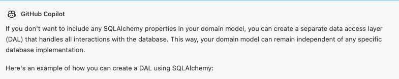
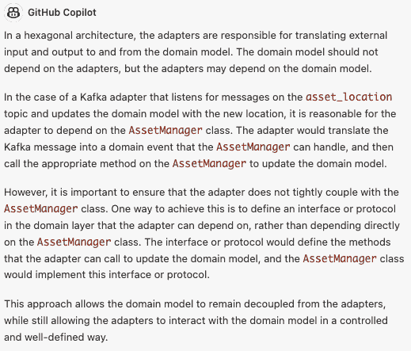
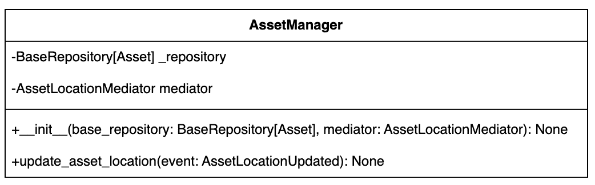

# 第五章：通过 GitHub Copilot 和 Copilot Chat 管理数据

### 本章内容涵盖

+   将我们的数据持久化到关系型数据库

+   使用 Apache Kafka 进行数据流式传输

+   融合事件驱动原则

+   使用 Spark 分析我们的数据以监控位置

上一章为我们的信息技术资产管理系统奠定了基础。然而，没有数据，这个应用程序将无法满足我们的要求。数据是每个应用程序的命脉。这正是本章的主题：我们可以使用生成式 AI 来创建数据、流式传输数据、转换数据、对数据做出反应并从数据中学习的各种方式。

敏锐的人可能已经注意到在上一章中，我们的数据访问模式是无法正常工作的，因为它是不完整的。本章的开头部分将解决这个问题。之后，我们将设置我们的数据库，修复访问这些数据的类，并加载一些示例数据，以便在本章的其余部分使用。

## 5.1 积累我们的数据集

我们的第一个任务将是构建一个大量的数据集，以帮助我们在本章剩余的实验中。首先，我们将使用 GitHub Copilot 生成一千行资产信息。然而，我们很快会发现，这可能不是最适合这项任务的工具。使用这些工具的一个关键驱动因素是发现的概念：测试它们的边界，推动它们，有时候，反击它们。但旅程往往是快乐的源泉。一旦我们找到了这个边缘，我们将被介绍一个新的、以前从未见过的工具：GitHub Copilot Chat。最后，一旦我们创建了我们的资产列表，我们将再次使用 GitHub Copilot Chat 为这些资产添加位置信息。

在构建我们的初始数据集之前，我们需要让数据库运行起来。Docker 让这个任务变得微不足道，让我们能够快速启动一个空的 Postgres（或其他 RDBMS/NoSQL 服务器），几乎不费吹灰之力。你忘记了执行此操作的命令吗？别担心，我们可以问 Copilot。打开一个名为 data/initial_data_laod.sql 的新文件，并在你的新生成的 SQL 文件顶部输入以下提示。

##### 片段 5.1 提示 GitHub Copilot 为我们提供一个 Docker 命令

```py
-- Question: What is the command to run a docker container, running PostgreSQL for a database called itam_db. I would like to specify the password for this database.
```

Copilot 将逐渐揭示 Docker 命令：`--Answer: docker run --name itam_db -e POSTGRES_PASSWORD=postgres -d -p 5432:5432 postgres.` 一旦你在终端或命令行运行这个命令，我们就可以构建出我们的数据集。你应该能够连接到本地运行的数据库。你应该注意到里面有一个名为 itam_db 的数据库在运行。然而，这个数据库没有模式、表或数据。让我们首先设置一个新的模式。

在我们的 initial_data_file.sql 中，我们将添加一个提示，让 Copilot 起草模式创建命令。执行此命令将允许您从数据库客户端应用程序（例如 DataGrip、SQuirreL、pdAdmin，甚至使用 Docker exec 命令 `docker exec -i itam_db psql -U postgres -c "create schema itam"`）中创建名为 itam 的新模式。

##### 提示让 Copilot 创建新模式

```py
-- create a schema called itam
create schema itam;
```

接下来，我们应该为应用程序中使用的用户添加一个用户。此用户将能够对我们的数据执行*CRUD*（创建、读取、更新、删除）操作，但将无法影响数据库表或存储过程的结构。

##### 注意

以双破折号开头的行是 SQL 中的注释。从 Copilot 的角度来看，注释这些行是可选的，因为它将生成没有注释的解决方案；这样做可以更轻松地将代码直接复制粘贴到我们选择的数据库工具中。

在此期间，我们还将添加一个管理帐户，以执行我们的读写用户无法执行的操作，例如创建或删除表。

##### 提示创建新用户

```py
-- create two users called itam_user and itam_admin. itam_user should be able to read from and write to the tables in the itam schema. itam_admin should be able to read from and write to the tables in the itam schema and create and drop tables in the itam schema.

create user itam_user with password 'itam_user';
create user itam_admin with password 'itam_admin';
grant usage on schema itam to itam_user;
grant usage on schema itam to itam_admin;
grant select, insert, update, delete on all tables in schema itam to itam_user;
grant select, insert, update, delete on all tables in schema itam to itam_admin;
grant usage, drop on schema itam to itam_admin;
```

接下来，我们将把此模式的所有权授予 itam_admin 帐户。转移此所有权将确保只有此帐户可以更改表结构：数据定义。

##### 将模式所有权转移给管理员帐户的提示

```py
-- grant ownership of the itam schema to itam_admin
alter schema itam owner to itam_admin;
```

配置完成、帐户创建和系统的崇拜已经完成，我们可以开始专注于数据。我们将从添加参考数据开始，即支持资产的数据：折旧策略。这些数据的性质更加静态；它们的变化频率较低，甚至根本不变。接下来，我们将定义并存储这些策略。

##### 提示创建折旧策略表

```py
-- create a table called depreciation_strategy in the itam schema. the table should have the following columns: id (int), name (varchar), and description (varchar). the table should have a primary key on id.
-- id needs to be in quotes because it is a reserved word in postgresql
-- there are two values for depreciation_strategy: straight line and double declining balance
create table itam.depreciation_strategy (
    "id" int primary key,
    "name" varchar,
    "description" varchar
);
```

我们将使用序列作为此表的主键。虽然对于一个不会很大并且我们可以手动输入已知值的表而言，这并不是严格必要的，但是添加此序列将允许我们与 Copilot 更多地合作并让它提出一些建议。此外，询问 Copilot 并在文本文件中获得 Copilot 的回答是有趣的。

##### 提示为折旧策略表的主键创建序列

```py
-- create a sequence called depreciation_strategy_seq, which should start at 1 and increment by 1 and should be used as the primary key for the depreciation_strategy table.
create sequence itam.depreciation_strategy_seq start 1 increment 1;
```

自然地，有了我们手中的序列，我们需要知道如何将序列与`depreciation_stategy`表的主键列关联起来。幸运的是，Copilot 有答案。

##### 询问 Copilot 如何将序列与主键关联

```py
-- question: how do I make the sequence the primary key for the depreciation_strategy table?

-- answer: use the following command
alter table itam.depreciation_strategy alter column "id" set default nextval('itam.depreciation_strategy_seq'::regclass);
```

最后，我们将通过将以下静态条目插入表格来完成此表格。目前我们只使用两种折旧策略：直线法和双倍余额递减法。

##### 将静态条目添加到折旧策略表

```py
insert into depreciation_strategy (id, name, description) values (1, 'straight line', 'straight line');

insert into depreciation_strategy (id, name, description) values (2, 'double declining balance', 'double declining balance');
```

接下来，我们将转向资金细节表。这些信息告诉我们如何为我们的设备进行融资，再销售价值，并对资产在其有用生命周期结束后应采取的措施进行说明。我们在折旧策略中所做的步骤顺序将与此相同，唯一的区别是我们不会添加静态条目，因为这些数据直接与个体资产相关。我们将定义表，创建序列，并将该序列应用于表，作为主键的功能。

##### 列表 5.6 资金详情表的完整代码列表

```py
-- create a table called funding_details in the itam schema. the table should have the following columns: id (int), name (varchar),depreciation_strategy_id (int) and depreciation_rate (float). the table should have a primary key on id.
-- depreciation_stategy_id is a foreign key to the depreciation_strategy table.
-- id needs to be in quotes because it is a reserved word in postgresql
create table itam.funding_details (
    "id" int primary key,
    "name" varchar,
    "depreciation_strategy_id" int,
    "depreciation_rate" float
);

-- create a sequence called funding_details_seq, which should start at 1 and increment by 1 and should be used as the primary key for the funding_details table.
create sequence itam.funding_details_seq start 1 increment 1;

alter table itam.funding_details alter column "id" set default nextval('itam.funding_details_seq'::regclass);
```

我们将定义和生成的最后信息是资产本身。这个列表也是冗余的，但出于完整性考虑已包括在内。最后，我们创建表，创建序列，并将其用作主键。

##### 列表 5.7 资产表的完整代码列表

```py
-- create a table called assets in the itam schema. the table should have the following columns: 
-- id (int), name (varchar), status (varchar), category (varchar), cost (float), useful_life (int), salvage_value (float), purchase_date (date), funding_details_id (int). The table should have a primary key on id and a foreign key on funding_details_id.
-- id needs to be in quotes because it is a reserved word in postgresql
-- the table should have a sequence called assets_id_seq, which should start at 1 and increment by 1 and should be used as the primary key for the assets table.
create table itam.assets (
    "id" int primary key,
    "name" varchar,
    "status" varchar,
    "category" varchar,
    "cost" float,
    "useful_life" int,
    "salvage_value" float,
    "purchase_date" date,
    "funding_details_id" int
);

-- create a sequence called assets_seq, which should start at 1 and increment by 1 and should be used as the primary key for the assets table.
create sequence itam.assets_seq start 1 increment 1;

alter table itam.assets alter column "id" set default nextval('itam.assets_seq'::regclass);
```

在定义和创建表之后，我们现在将专注于创建数据。在我们的文本文件中，我们使用参数指示 Copilot 我们正在寻找的数据集。Copilot 可能会尝试帮助您概述围绕新数据集的属性。

##### 列表 5.8 为资产表创建数据集

```py
-- Generate a dataset of assets for an ITAM system. The dataset should include the following columns: id (int), name (varchar), status (varchar), category (varchar), cost (float), useful_life (int), salvage_value (float), purchase_date (date), funding_details_id (int). The dataset should have 1000 rows, sorted by id. Each row should have the following characteristics:
-- - id should be a unique integer and sequential starting at 1.
-- - name should be a random string of characters between 1 and 50 characters long.
-- - status should be a random selection from the following valid asset statuses: in use, in storage, disposed of, in repair, in transit, other.
-- - category should be a random selection from the following valid categories: hardware, software, other.
-- - cost should be a random float between 0 and 100000.
-- - useful_life should be a random int between 1 and 10.
-- - salvage_value should be a random float greater than 0 but less than the cost of the asset.
-- - purchase_date should be a random date between 1/1/2019 and 12/31/2022.
-- - funding_details_id should be a random integer either 1 or 2.
-- The dataset should be saved as a CSV file named assets.csv in the data directory. The file should have a header row and the columns should have the following data types: id (int), name (varchar), status (varchar), category (varchar), cost (float), useful_life (float), salvage_value (float), funding_details_id (int)
```

Copilot 提供的解决方案是新颖的。它使用 Postgres 内置功能构建了一个大系列，这意味着这不是一个可移植的解决方案。然而，考虑到这是我们将要使用的数据库，这是一个足够合适的解决方案。生成的数据集经过了精心制作。如果我们使用 Python 并要求 Copilot 帮助编写一个用于加载到 Postgres 的文件的脚本，我们可能会得到更好的结果。然而，鉴于这个数据集只是用来玩应用程序，目前我们不需要过于担心数据质量。尽管在现实世界中，数据质量是至关重要的。

##### 列表 5.9 Copilot 的响应：基于一系列构建的插入语句

```py
insert into itam.assets (id, name, status, category, cost, useful_life, salvage_value, purchase_date, funding_details_id)
select
    id,
    name,
    status,
    category,
    cost,
    useful_life,
    salvage_value,
    purchase_date,
    funding_details_id
from (
    select
        row_number() over (order by random()) as id,
        md5(random()::text) as name,
        case
            when random() < 0.2 then 'in use'
            when random() < 0.4 then 'in storage'
            when random() < 0.6 then 'disposed of'
            when random() < 0.8 then 'in repair'
            when random() < 0.9 then 'in transit'
            else 'other'
        end as status,
        case
            when random() < 0.5 then 'hardware'
            when random() < 0.9 then 'software'
            else 'other'
        end as category,
        random() * 100000 as cost,
        (random() * 100)::int as useful_life,
        random() * (random() * 100000) as salvage_value,
        -- generate a random date between 1/1/2019 and 12/31/2022
        -- this does not work please fix
        -- '2019-01-01'::date + random() * ('2022-12-31'::date - '2019-01-01'::date) as purchase_date,
        '2019-01-01'::date + (random() * (DATE '2022-12-31' - DATE '2019-01-01')::integer)::integer as purchase_date
        case
            when random() < 0.5 then 1
            else 2
        end as funding_details_id
    from generate_series(1, 1000)
) as assets;
```

如果我们仅仅转向 ChatGPT，我们可以得到如何创建这样的数据集的第二意见。ChatGPT 建议使用 Python 库`faker`。`faker`包用于生成虚假数据，例如常见的英文姓名。`numpy`用于生成成本、有用生命和残值的随机浮点值。`pandas`用于在`DataFrame`（表）中管理数据。此外，我们可以使用`df.to_csv('assets.csv', index=False)`方法将`DataFrame`保存到 CSV 文件中。

##### 列表 5.10 ChatGPT 建议使用 Faker 来生成虚假数据集

```py
import pandas as pd
import numpy as np
import random
from faker import Faker

# Create Faker object
fake = Faker()

# Define our valid statuses, categories, funding_details and depreciation_strategies
valid_statuses = ['in use', 'in storage', 'disposed', 'in repair', 'in transit', 'other']
valid_categories = ['hardware']
valid_funding_details = ['purchased']
valid_depreciation_strategies = ['straight line']

# Generate the data
data = {
    'id': list(range(1, 1001)),
    'name': [fake.first_name() for _ in range(1000)],
    'status': [random.choice(valid_statuses) for _ in range(1000)],
    'category': [random.choice(valid_categories) for _ in range(1000)],
    'cost': np.random.uniform(0, 100000, 1000),
    'useful_life': np.random.uniform(1, 10, 1000),
    'salvage_value': np.random.uniform(0, 10000, 1000),
    'funding_details': [random.choice(valid_funding_details) for _ in range(1000)],
    'depreciation_strategy': [random.choice(valid_depreciation_strategies) for _ in range(1000)],
}

# Create DataFrame
df = pd.DataFrame(data)

# Ensure the DataFrame is sorted by id
df = df.sort_values('id')

# Show the DataFrame
print(df)
```

对于这些资产的每一项，我们也需要资金细节；它们是如何融资的（在这种情况下购买），以及折旧细节。毫不奇怪，我们从 Copilot 得到了类似的解决方案：使用与我们为资产使用的类似提示生成一系列条目。我们需要确保对于每个资产标识符（1-1000），我们都有相应的资金细节条目。否则，在运行我们的代码时会出现空指针的风险。

##### 清单 5.11 创建`funding_details`表的数据集

```py
-- Generate a dataset of funding details for an ITAM system. The dataset should include the following columns: id (int), name (varchar), depreciation_strategy_id (int), depreciation_rate (float). The dataset should have 1000 rows, sorted by id. 
-- Each row should have the following characteristics:
-- - id should be a unique integer and sequential starting at 1.
-- - name should be a random string of characters between 1 and 10 characters long.
-- - depreciation_strategy_id should be a random integer either 1 or 2.
-- - depreciation_rate should be a random float between 0 and .4.

insert into itam.funding_details (id, name, depreciation_strategy_id, depreciation_rate)
select
    id,
    name,
    depreciation_strategy_id,
    depreciation_rate
from (
    select
        row_number() over (order by random()) as id,
        md5(random()::text) as name,
        case
            when random() < 0.5 then 1
            else 2
        end as depreciation_strategy_id,
        random() * 0.4 as depreciation_rate
    from generate_series(1, 1000)
) as funding_details;
```

有了在数据库中生成和存储的数据集，我们应该能够通过 REST API 连接我们应用程序的其余部分来存储和显示资产。然而，由于我们在构建阶段之前已经剥离了所有的 SQLAlchemy 元数据（请参阅上一章），我们需要一种不同的方法来将这些元数据与我们的适配器进行连接。

有了这个，我们已经达到了 Copilot 的能力边缘。我们对接下来会发生什么感到困惑；我们如何解决我们最近的困境。尽管诱人，我们不能放弃回家。因此，现在是时候介绍 Copilot 产品套件的最新成员了：Copilot Chat。Copilot Chat 是嵌入式的 GPT-4 模型，可以集成到你的 IDE 中（目前仅支持 Visual Studio Code）。我们将打开聊天对话框，询问如何保持我们的业务模型清晰，但仍然使用 SQLAlchemy 的 ORM（对象关系模型）功能。

##### 图 5.1 GitHub Copilot Chat 对我们最近困境的解决方案



Copilot Chat 建议我们创建一个单独的数据访问层。这种方法与我们迄今为止使用的端口和适配器方法非常契合。此外，Copilot Chat 建议将这些类建模得与领域类类似，但包括 ORM 功能正常工作所需的元数据。生成的代码见清单 5.12。

##### 清单 5.12 领域类之外的 ORM 支持。

```py
Base  = declarative_base()

class FundingDetailsModel(Base):
    __tablename__ = 'funding_details'
    id = Column(Integer, primary_key=True)
    depreciation_rate = Column(Float)
    depreciation_strategy_id = Column(Integer)

    def get_depreciation_strategy(self) -> DepreciationStrategy:
        if self.depreciation_strategy_id is 1:
            return StraightLineDepreciationStrategy()
        else:
            return DoubleDecliningDepreciationStrategy()

class AssetModel(Base):
    __tablename__ = 'assets'
    id = Column(Integer, primary_key=True)
    name = Column(String)
    status = Column(String)
    category = Column(String)
    cost = Column(Float)
    useful_life = Column(Float)
    salvage_value = Column(Float)
    purchase_date = Column(Date)
    funding_details_id = Column(Integer, ForeignKey('funding_details.id'))
    funding_details = relationship('FundingDetailsModel')
```

现在，外部模型类已经创建，我们必须将这些 ORM 实例映射到我们的领域模型，然后返回给系统核心。虽然对于这样一个简单的应用程序来说，这似乎是过度设计的代码，但这给了我们很大的灵活性，使我们的领域模型可以进行复杂的操作。例如，我们的模型可以执行 CRUD 之外的复杂操作。如果我们将我们的领域模型身份限制在数据访问层中使用的模型上，我们将受到这些操作的限制。

接下来，我们将使用 Copilot 和 Copilot Chat 探索将事件驱动思想纳入我们的应用程序中。事件驱动的概念将允许我们实时跟踪我们的 IT 资产：它们的位置、状态和市场价值，例如。

## 5.2 使用 Kafka 实时监控我们的资产

我们将实时监控我们的资产，以激励我们探索将生成式人工智能与事件驱动架构结合使用的探索。我们应该认为，信息安全资产管理系统外部的某些系统在我们的资产从一个位置移动到另一个位置时会触发事件。

要深入了解 ITAM 事件，我们需要配置一些额外的服务。在这种情况下，我们将使用 Apache Kafka。Apache Kafka 是一个分布式流平台，用于构建实时数据管道和流应用程序。它被设计用于处理来自多个来源的数据流，并将它们传送到多个消费者，有效地充当我们实时数据的中间人。

首先，我们将询问 Copilot Chat 如何在本地使用 Docker 运行 Kafka。Apache Kafka 有一个不应该存在的声誉，即安装和配置很困难。在 Docker 中运行将允许我们回避这个争议。使用 Copilot Chat，我们可以生成一个 docker compose 文件。然而，通常情况下，版本非常旧，甚至不支持一些硬件。图示 5.13 是从 Confluent（提供 Kafka 商业支持的公司）官方 GitHub 存储库中提取的更新的列表。请注意，docker-compose 文件的内容包括 Kafka 和 Zookeeper。Zookeeper 是 Kafka 用来管理和协调集群内代理的分布式协调服务，至少目前是这样。未来版本的目标是消除对 Zookeeper 的依赖。

##### **图示 5.13 Docker-Compose 文件，用于启动带有 Zookeeper 的 Kafka**

```py
version: '2.1'

services:
  zookeeper:
    image: confluentinc/cp-zookeeper:7.3.2
    container_name: zookeeper
    ports:
      - "2181:2181"
    environment:
      ZOOKEEPER_CLIENT_PORT: 2181
      ZOOKEEPER_SERVER_ID: 1
      ZOOKEEPER_SERVERS: zoo1:2888:3888

  kafka:
    image: confluentinc/cp-kafka:7.3.2
    hostname: kafka
    container_name: kafka
    ports:
      - "9092:9092"
      - "29092:29092"
      - "9999:9999"
    environment:
      KAFKA_ADVERTISED_LISTENERS: INTERNAL://kafka:19092,EXTERNAL://${DOCKER_HOST_IP:-127.0.0.1}:9092,DOCKER://host.docker.internal:29092
      KAFKA_LISTENER_SECURITY_PROTOCOL_MAP: INTERNAL:PLAINTEXT,EXTERNAL:PLAINTEXT,DOCKER:PLAINTEXT
      KAFKA_INTER_BROKER_LISTENER_NAME: INTERNAL
      KAFKA_ZOOKEEPER_CONNECT: "zookeeper:2181"
      KAFKA_BROKER_ID: 1
      KAFKA_LOG4J_LOGGERS: "kafka.controller=INFO,kafka.producer.async.DefaultEventHandler=INFO,state.change.logger=INFO"
      KAFKA_OFFSETS_TOPIC_REPLICATION_FACTOR: 1
      KAFKA_TRANSACTION_STATE_LOG_REPLICATION_FACTOR: 1
      KAFKA_TRANSACTION_STATE_LOG_MIN_ISR: 1
      KAFKA_JMX_PORT: 9999
      KAFKA_JMX_HOSTNAME: ${DOCKER_HOST_IP:-127.0.0.1}
      KAFKA_AUTHORIZER_CLASS_NAME: kafka.security.authorizer.AclAuthorizer
      KAFKA_ALLOW_EVERYONE_IF_NO_ACL_FOUND: "true"
    depends_on:
      - zookeeper
```

现在我们的新 Kafka 实例正在运行，我们现在需要一个消费者，它将从主题`asset_location`（我们很快将创建的主题）中拉取更新的位置，并在数据库中更新库存。同样，我们可以请求 Copilot Chat 为我们提供如何做到这一点的建议。

##### **图示 5.14 提示 Copilot Chat 如何使用 Python 订阅主题**

```py
In our ITAM project, we would like a Python consumer for the assets_location Kafka topic. Once it receives a new updated location, it should update the domain model to reflect the new location. How should we do this?
```

Copilot Chat 生成的代码创建一个消费者，监听主题，并使用对`AssetManager`类的引用来更新受影响资产的位置。

##### **图示 5.15 Copilot Chat 代码，用于监控资产位置**

```py
from kafka import KafkaConsumer
from asset_manager import AssetManager

consumer = KafkaConsumer(
    'asset_location',
    bootstrap_servers=['localhost:9092'],
    auto_offset_reset='earliest',
    enable_auto_commit=True,
    group_id='my-group',
    value_deserializer=lambda x: tuple(map(float, x.decode('utf-8').split(',')))
)

asset_manager = AssetManager()

for message in consumer:
    asset_id, latitude, longitude = message.value
    asset_manager.update_asset_location(asset_id, (latitude, longitude))
```

但是，适配器应该知道`AssetManager`吗？虽然`AssetManager`不直接位于领域模型内部，但它是一个至关重要的中介。适配器和`AssetManager`之间的这种耦合程度可能会违反六边形架构模型中的六边形。让我们让 Copilot Chat 来发表意见。我们可以问它：“考虑到这个项目使用了六边形架构，让适配器知道`AssetManager`是一个好主意吗？”

##### **图示 5.2 GitHub Copilot Chat 承认它实际上并不完美**



看起来 Copilot Chat 认为这确实会被视为适配器的适当承包责任的违约。我们可以向我们的`AssetManager`类添加一个新的端口，它可以使用 Kakfa 端口。然而，让我们看看 Copilot Chat 是否有其他建议：“我们不希望 Kafka 消费者直接与`AssetManager`进行交互。有什么方法可以实现这一点？” Copilot Chat 建议我们应用`Mediator`模式，这类似于一个端口和适配器的组合。

##### 中介者模式

Mediator 设计模式是一种行为模式，通过将对象之间的交互封装在一个中介对象中，促进对象之间的松耦合。中介对象充当一个中心枢纽，促进对象之间的通信，而无需对象知道彼此。

让我们首先看一下 Copilot Chat 生成的 Mediator 类。该类将位于`AssetManager`和 Kafka 消费者之间。

##### 图 5.16 Mediator 类，它将调和 AssetManager 和 Kafka 消费者之间的交互

```py
class AssetLocationMediator:
    def __init__(self):
        self.handlers = {}

    def register_handler(self, event_type, handler):
        if event_type not in self.handlers:
            self.handlers[event_type] = []
        self.handlers[event_type].append(handler)

    def publish(self, event):
        event_type = type(event)
        if event_type in self.handlers:
            for handler in self.handlers[event_type]:
                handler(event)
```

这个实现与消息队列或消息发布者十分相似，这正是关键所在：解耦。

##### 注意

有慧眼的读者可能会注意到我们在资产和硬件类型的资产之间的区别上有一点疏忽。在原始领域模型中，只有硬件有位置。通常，人们不会认为软件有位置。当然，您可以说软件安装在它的位置上，但人们是否会认为这个论点说服力有待商榷。不过，随着项目的继续进行，领域模型变平的原因是为了简化，因为在持久性层中的多态结构是一个令人分心的复杂主题。

现在我们有了一个将 Kafka 消费者与 AssetManager 解耦的策略，我们应该更新 Kafka 消费者以利用它。我们需要在构造函数中将中介者传递给类。这样，AssetManager 和消费者将可以访问相同的实例，并且消息可以自由地来来往往；或者，在这种情况下，流程将是单向的。您应该注意，我们打算在这个主题上读取和写入 JSON，因此我们需要让我们的值反序列化器理解这一点。

##### 图 5.17 将中介者整合到 Kafka 消费者类中

```py
from kafka import KafkaConsumer
from itam.domain.events.asset_location_updated import AssetLocationUpdated
import json

class AssetLocationKafkaConsumer:
    def __init__(self, mediator):
        self.mediator = mediator

        self.consumer = KafkaConsumer(
            'asset_location',
            bootstrap_servers=['localhost:9092'],
            enable_auto_commit=True,
            group_id='itam-group',
            value_deserializer=lambda m: json.loads(m.decode('utf-8'))
        )

    def poll(self):
        print("Polling for asset location updates")
        for message in self.consumer:
            asset_id = message.value['asset_id']
            latitude = message.value['latitude']
            longitude = message.value['longitude']
            timestamp = message.value['timestamp']
            event = AssetLocationUpdated(asset_id, latitude, longitude, timestamp)
            self.mediator.publish(event)
```

接下来，我们将检查`AssetManager`类需要的更改，以包含跟踪这些位置的功能。您应该注意，要使该项目完全运行起来，您需要修改`AssetManager`、`SQLAlchemyAssetRepository`和`Asset`类，并在数据库中创建一个名为`itam.asset_locations`的新表。完整且更新的源代码可在本书的 GitHub 存储库中找到。现在，我们将专注于为我们的系统流动的事件所需的更改，并在需要时使用存储库作为参考。

##### 图 5.3 `AssetManager`需要另外一个构造函数参数和一个方法来处理其位置对象的更新



对于`AssetManager`类，有两个必需的更改：首先，我们需要将`AssetLocationMediator`添加到构造函数中，并注册它来处理`AssetLocationUpdated`事件。其次，我们需要添加一个处理此事件的方法。在这种情况下，我们称此方法为`update_asset_location`。删节后的代码如下。

##### 图 5.18 更新后的`AssetManager`类的构造函数和事件处理程序

```py
from itam.infrastructure.mediators.asset_location_mediator import 

class AssetManager:
    def __init__(self, base_repository: BaseRepository[Asset], mediator: AssetLocationMediator):
        self._repository = base_repository
        self.mediator = mediator
        self.mediator.register_handler(AssetLocationUpdated, self.update_asset_location)

    def update_asset_location(self, event: AssetLocationUpdated) -> None:
        asset = self.read(event.asset_id)
        asset.add_location(event.latitude, event.longitude, event.timestamp)
        #self.update(asset)
        print(f"Asset {asset.id} location updated to {event.latitude}, {event.longitude} at {event.timestamp}")
```

`Asset`类的`add_location`方法仅仅是将新的位置追加到位置列表的末尾。更复杂的领域模型可能会包括一个`current_location`属性，将其余部分归类为历史位置列表；然而，鉴于我们试图使我们的事件在系统中流动，使事情保持简单是明智的。

我们待办事项清单上只有一项最终项目：创建主题。如何创建主题呢？这是一个很好的问题。幸运的是，我们运行的 Docker 容器中有我们需要的所有工具。所以，让我们登录到我们的 Kafka Docker 实例中。我们使用以下命令（假设您的 Docker 实例命名为 kafka）：`docker exec -it kafka /bin/bash`.

应该首先检查的是是否已经创建了任何主题。我们可以使用以下命令来执行：`kafka-topics --list --bootstrap-server localhost:9092.` 此命令将列出在此 Kafka 集群上运行的所有现有主题。正如您所见，没有任何主题。

需要一个主题，让我们来创建它。您可以使用以下命令：`kafka-topics --create --bootstrap-server localhost:9092 --replication-factor 1 --partitions 1 --topic asset_location.` 如果您重新运行`kafka-topics --list`命令，您将看到新主题。我们在创建主题命令中包含的分区和复制因子说明告诉 Kafka 我们希望有一个分区和一个复制因子。如果我们是为生产环境或测试以外的任何目的设置这个，我们可能希望它们大于那个数，以确保数据的可用性。

##### 表 5.1 Kafka 控制台命令摘要

| 动作 | 命令 |
| --- | --- |
| 创建 |

```py
kafka-topics --create --bootstrap-server localhost:9092 --replication-factor 1 --partitions 1 --topic asset_location

```

|

| 读取 |
| --- |

```py
kafka-console-consumer --broker-list localhost:9092 --topic asset_location –from-beginning

```

|

| 写入 |
| --- |

```py
kafka-console-producer --broker-list localhost:9092 --topic asset_location

```

|

| 删除 |
| --- |

```py
kafka-topics --delete --topic asset_location --bootstrap-server localhost:9092

```

|

| 列出 |
| --- |

```py
kafka-topics --list --bootstrap-server localhost:9092

```

|

现在是有趣的部分，观察应用程序的运行情况。Kafka 自带一个控制台生产者，允许我们从标准输入向 Kafka 发布消息。要做到这一点，我们应该使用以下命令启动控制台生产者：`kafka-console-producer --broker-list localhost:9092 --topic asset_location`。您将进入一个交互式会话，可以在每行发布一条消息。让我们发布一些消息，模拟我们的资产在芝加哥附近移动的情况。

##### 列表 5.19 Kafka 控制台生产者的条目

```py
{"asset_id": 1, "latitude": 41.8781, "longitude": -87.6298, "timestamp": "2022-01-01T00:00:00Z"}
{"asset_id": 1, "latitude": 41.9000, "longitude": -87.6244, "timestamp": "2022-01-01T00:10:00Z"}
{"asset_id": 1, "latitude": 41.8676, "longitude": -87.6270, "timestamp": "2022-01-01T00:20:00Z"}
{"asset_id": 1, "latitude": 41.8788, "longitude": -87.6359, "timestamp": "2022-01-01T00:30:00Z"}
{"asset_id": 1, "latitude": 41.8740, "longitude": -87.6298, "timestamp": "2022-01-01T00:40:00Z"}
{"asset_id": 1, "latitude": 41.8800, "longitude": -87.6300, "timestamp": "2022-01-01T00:50:00Z"}
{"asset_id": 1, "latitude": 41.8775, "longitude": -87.6244, "timestamp": "2022-01-01T01:00:00Z"}
{"asset_id": 1, "latitude": 41.8745, "longitude": -87.6328, "timestamp": "2022-01-01T01:10:00Z"}
{"asset_id": 1, "latitude": 41.8825, "longitude": -87.6298, "timestamp": "2022-01-01T01:20:00Z"}
{"asset_id": 1, "latitude": 41.8800, "longitude": -87.6250, "timestamp": "2022-01-01T01:30:00Z"}
```

当您输入这些消息时，您应该看到应用程序的输出，指示位置已经更新。

为了完整起见，还有一个命令需要您注意：在输入这些消息时，您可能会犯错。一个无效的消息可能会导致您的消费者出现问题。一个可能的解决方案是删除主题。删除主题可能听起来很夸张，但这将解决问题。因此，这就是那个命令：`kafka-topics --delete --topic asset_location --bootstrap-server localhost:9092.`

在本节中，我们已经添加了实时跟踪我们的 `资产` 在 Apache Kafka 中的位置变化的能力。在本章的最后一节中，我们将使用 Copilot Chat 扩展能力，通过实时监控我们的 `资产`，尝试确定它们是否位于它们应该位的位置。同样，我们将探讨使用 Spark 和 Kafka 一起完成此分析。完成后，我们将感谢我们的信息安全团队，他们担心我们的核心业务和知识产权过多存在于这些 `资产` 中。

## 5.3 使用 Apache Spark 进行分析、学习和跟踪

资产的实时跟踪是一个业务关键功能。您的 IT 资产包含着敏感的商业数据、客户名单、销售数据、利润和损失（PnL）预测以及销售策略，以及许多其他项目。一次丢失的资产可能是公司的生存危机。因此，对于许多信息安全专业人员来说，仔细的管理和监控是首要任务。在本节中，我们旨在使他们的工作变得更加轻松。现代数据平台使实时跟踪资产并在出现可疑情况时发送通知变得微不足道。让我们开始吧。

Apache Spark 是一个强大的、开源的数据处理引擎，以速度、易用性和复杂的分析而闻名。它旨在提供一个比 MapReduce 更好的处理大数据集的替代方案，并且可以处理批处理和实时分析。Spark 提供了 Scala、Java、Python 和 R 的 API，并且具有用于 SQL 查询的内置模块。其核心数据结构，弹性分布式数据集（RDD），支持容错操作，并允许数据在计算机集群上并行处理。

Spark 还包括几个库来扩展其功能，包括用于机器学习的 MLlib，用于处理实时数据流的 Spark Streaming，以及用于处理结构化数据的 Spark SQL 和 DataFrames。这些工具使其非常适合从机器学习到实时数据流和批处理的任务。其内存处理能力使 Spark 比其前身快得多，使其成为大数据处理的热门选择。

首先，我们将要求 Copilot Chat 推荐一种使用 Apache Spark 跟踪我们资产的策略。

##### 清单 5.20 请求 Copilot Chat 如何最好地实时跟踪我们的`资产`

```py
Let's imagine that our company is in Chicago. We want to create a class called AssetLocationSparkAdapter that will continuously stream AssetLocation json messages from a Kafka topic called asset_location. An AssetLocation has the following attributes asset_id: int, latitude: float, longitude: float, and timestamp: datetime. The AssetLocations are stored in a Postgres database in a table called itam.asset_locations. AssetLocationSparkAdapter should calculate if the new AssetLocation is more than 25 miles from Chicago. If it is, then it should write a message to the console. This should be using the latest version of Spark. How would we do this?
```

Copilot Chat 生成了应该放入 infrastructure 包中名为 asset_location_spark_adapter.py 的文件的类。幸运的是，它还为每一行包括了注释，因此你应该会发现生成的代码很容易跟踪。导入语句包括 Spark 库以及 geopy。

##### 清单 5.21 运行 Spark 所需的导入项

```py
from pyspark.sql import SparkSession
from pyspark.sql.functions import from_json, col, expr
from pyspark.sql.types import StructType, StructField, IntegerType, DoubleType, TimestampType
from geopy.distance import distance
```

课程以一个过于臃肿的构造函数开始，该构造函数定义了 Spark 在将 JSON 转换为 DataFrame 时将使用的模式。

##### 注意

如定义的 `AssetLocationSparkAdapter` 是一个阻塞进程。因此，在 Spark 进程被终止之前，你的 FastAPI 应用程序将不会“完全”启动。你希望这是一个独立的进程，或者你需要引入一个异步框架来使这两个进程同时运行。

接下来，它将启动一个本地 Spark 实例/会话，允许 Spark 连接到 Kafka 主题并持续地流式处理记录。

##### 清单 5.22 负责处理 Kafka 主题并生成通知的 `AssessLocationSparkAdapter`

```py
class AssetLocationSparkAdapter:
    def __init__(self):
        # Define the schema for the incoming JSON data
        self.schema = StructType([
            StructField("asset_id", IntegerType()),
            StructField("latitude", DoubleType()),
            StructField("longitude", DoubleType()),
            StructField("timestamp", TimestampType())
        ])

        # Create a SparkSession
        self.spark = SparkSession.builder \
            .appName("AssetLocationSparkAdapter") \
            .getOrCreate()

        # Create a streaming DataFrame from the asset_location topic
        self.df = self.spark \
            .readStream \
            .format("kafka") \
            .option("kafka.bootstrap.servers", "localhost:9092") \
            .option("subscribe", "asset_location") \
            .option("startingOffsets", "earliest") \
            .load() \
            .selectExpr("CAST(value AS STRING)")

        # Parse the incoming JSON data
        self.parsed_stream = self.df \
            .select(from_json(col("value"), self.schema).alias("data")) \
            .select("data.*")
```

`AssetLocationSparkAdapter` 类的最后一部分将计算资产当前位置到芝加哥的距离。如果差距大于 25 英里，则将结果集发送到控制台。此外，它还提供了一个方法来启动和停止适配器。

##### 清单 5.23 `AssessLocationSparkAdapter` 计算当前`资产`位置与芝加哥的距离

```py
        # Calculate the distance between the current location and Chicago for each asset
        self.distance = self.parsed_stream \
            .withColumn("distance", expr("calculate_distance(latitude, longitude, 41.8781, -87.6298)")) \
            .select(col("asset_id"), col("timestamp"), col("distance")) \
            .filter(col("distance") > 25)

        # Write the results to the console
        self.query = self.distance \
            .writeStream \
            .outputMode("append") \
            .format("console") \
            .start()

    def run(self):
        # Start the streaming query
        self.query.awaitTermination()

    def stop(self):
        # Stop the streaming query and SparkSession
        self.query.stop()
        self.spark.stop()
```

calculate_distance 方法接受资产位置的经度和纬度，并使用 geopy.distance 函数确定距离芝加哥的距离。

##### 清单 5.24 Spark 用于计算芝加哥和你的`资产`之间距离的函数

```py
def calculate_distance(lat1, lon1, lat2, lon2):
    return distance((lat1, lon1), (lat2, lon2)).miles
```

在这种情况下，Copilot Chat 生成的代码存在一些问题，阻止其在本地运行。在本地运行并遇到这些问题后，搜索 Stack Overflow，你会发现代码的两个主要问题的解决方案：缺少用于本地运行的环境变量，以及未能注册您的 UDF（用户定义的函数）。幸运的是，你不需要进行测试和研究，因为清单 5.23 中提供了解决方案。

##### 清单 5.25 在本地运行应用程序所需的编辑

```py
os.environ['PYSPARK_SUBMIT_ARGS'] = '--packages org.apache.spark:spark-streaming-kafka-0-10_2.12:3.2.0,org.apache.spark:spark-sql-kafka-0-10_2.12:3.2.0 pyspark-shell'

class AssetLocationSparkAdapter:
    def __init__(self):
        # Create a SparkSession
        self.spark = SparkSession.builder \
            .appName("AssetLocationSparkAdapter") \
            .getOrCreate()
         self.spark.udf.register("calculate_distance", calculate_distance)
```

最后，要运行你的 Spark 应用程序，你需要在 `main.py` 中的 `main` 函数中更新以下代码。

##### 列表 5.26 对 `main` 函数的更新

```py
if __name__ == "__main__":
    adapter = AssetLocationSparkAdapter()
    adapter.run()
```

当你将资产位置输入到 Kafka 控制台生产者中时，如果距离芝加哥市中心超过二十五英里，你会注意到条目被写入到控制台中。更新类以将这些结果输出到 Twilio 的短信 API 或类似 SendGrid 的电子邮件服务是微不足道的。

##### 列表 5.27 你的资产位置的流式输出

```py
+--------+-------------------+------------------+
|asset_id|          timestamp|          distance|
+--------+-------------------+------------------+
|       1|2021-12-31 20:30:00| 712.8314662207446|
+--------+-------------------+------------------+
```

恭喜，你正在实时追踪你的资产，并在公司资源离开的时候发送实时警报。

## 5.4 总结

+   GitHub Copilot Chat 是一款创新性工具，结合了 ChatGPT 的全面语言理解和 Copilot 的便捷功能。这是编程辅助领域的一个值得注意的发展，特别是在实时提供详细且上下文相关的建议方面，促进了更高效的编码体验。

+   中介者设计模式是一种独特的行为模式，它促进了对象之间高度解耦，从而增强了代码的模块化。通过在一个中介者对象中包含对象之间的交互，对象可以间接地进行通信，从而减少了依赖性，促进了代码的可重用性和易修改性。

+   Apache Kafka 是一个健壮的、分布式的流平台，专为创建实时数据管道和流应用而设计。它可以有效处理来自多种来源的数据流，并将其传输给各种消费者，使其成为处理大量实时或准实时数据的理想解决方案。需要记住的是，Kafka 优化了追加式、不可变数据，而不适用于需要记录更新或删除，或复杂查询的用例。

+   Apache Spark 是一款性能卓越的、分布式的数据处理引擎，以其速度、易用性和高级分析功能而闻名。它非常适用于需要实时数据处理或对大量数据集进行操作的场景。然而，对于诸如基本分析或简单聚合等较简单的任务，传统的关系型数据库可能是更合适的选择。

+   尽管生成式人工智能迅速发展，但并非无懈可击。仔细审查所有生成的输出以确保其符合你的特定要求和质量标准至关重要。虽然生成式人工智能不能替代深入的领域知识或编码专业知识，但它通过提供有价值的见解和减少在例行任务上花费的时间来显著提高生产力。
