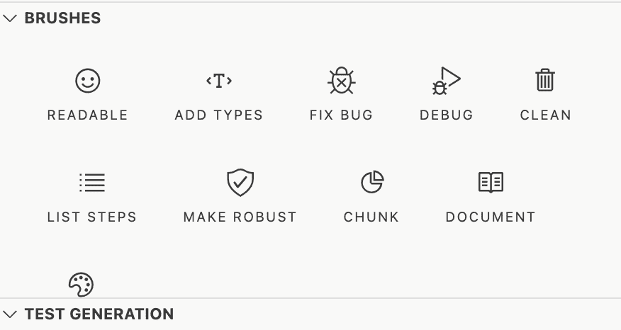
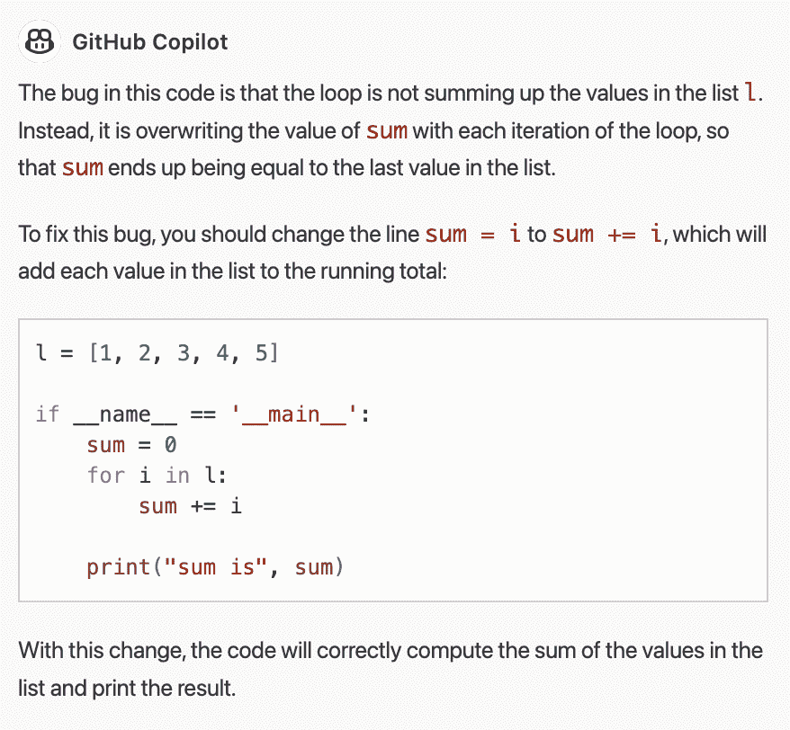
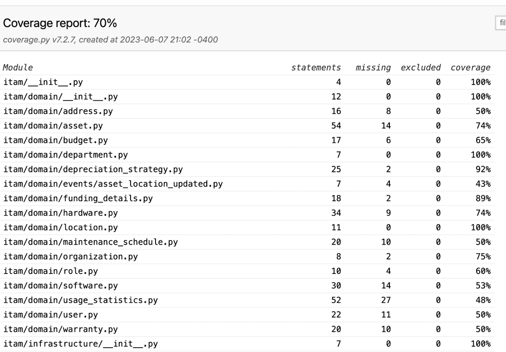
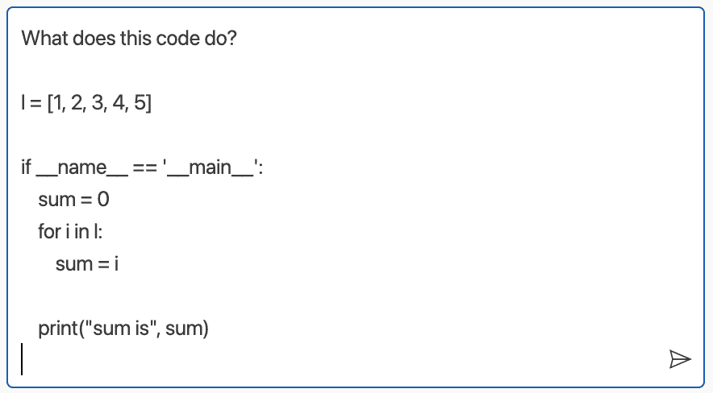

# 第六章：测试、评估和解释大型语言模型

### 本章内容包括

+   轻松草拟单元测试

+   生成集成测试

+   确定代码质量和覆盖率

+   评估软件复杂性

+   翻译代码和文本

本章将探讨软件工程的一个关键方面：测试。测试软件的行为有多个重要目的。首先，它有助于识别可能会影响软件功能、可用性或性能的错误和问题。此外，它确保软件符合所需的质量标准。通过进行全面的测试，我们可以验证软件是否满足指定的要求，正如预期的那样工作，并产生预期的结果。通过全面的测试，开发人员可以评估软件在各种平台和环境中的可靠性、准确性、效率、安全性和兼容性。在开发过程的早期检测和解决软件缺陷可以节省大量的时间和成本。

当我们完成测试的制定后，我们将评估代码的质量。你将了解到几个有助于评估软件质量和复杂性的度量标准。此外，如果我们需要对代码的目的有更清晰的了解，或者是首次审核代码，我们将寻求解释以确保全面理解。

## 6.1 测试，测试...一、二、三种类型

测试在软件工程中扮演着重要的角色，因此我们将详细探讨各种类型的测试。这包括单元测试、集成测试和行为测试。首先，我们将利用 Copilot Chat 来帮助我们创建一个*单元测试*。

##### 单元测试

单元测试是一种专注于测试单个组件或代码单元的测试类型，以确保它们在独立环境中的正确运行。通常由开发人员执行这种测试，以帮助识别特定软件单元中的错误和问题。

### 6.1.1 单元测试

在本节中，我们将创建单元测试来测试我们的软件组件。Python 的有几个用于单元测试的测试框架。每个框架都有其独特的特点，适用于不同的场景。在我们的 AI 工具提供的建议基础上，我们将简要介绍每个框架，然后选择一个特定的框架。

第一个框架是`unittest`：这是 Python 用于创建单元测试的标准库。它与 Python 捆绑在一起，无需单独安装。`unittest`提供了丰富的断言集，并非常适合编写简单到复杂的测试用例，但是代码量可能会相当庞大。`unittest`适合编写基本的单元测试，特别是如果您不想在项目中引入其他依赖项时。在任何需要独立于系统其余部分确认代码功能的情况下，它都非常有用。

接下来，让我们来看一下`pytest`：`pytest`是一个流行的第三方库，用于单元测试，尽管它足够灵活，可以处理更多不仅仅是单元测试。它比`unittest`需要更少的样板代码，并且具有强大的功能，例如设置和拆卸的 fixture，参数化测试，以及运行`unittest`和 nose 测试套件的能力。`pytest`非常适合简单和复杂的单元测试用例。它也适用于功能和集成测试。如果你重视简单和易用性，并且你的项目不限于仅使用 Python 标准库，那么`pytest`是一个绝佳的选择。

接下来，我们有`nose2`，它是被废弃的"`nose`"测试框架的继承者。它扩展了`unittest`，使测试变得更容易。它以其测试发现功能而闻名，该功能可以自动找到您项目中的测试，因此您无需手动列出它们。`nose2`适用于大型项目，其中测试发现可以节省时间。与`pytest`一样，它可以运行`unittest`测试套件，因此如果您正在从`unittest`迁移但希望保留现有的测试，它也是一个不错的选择。

最后，还有`doctest`。这是 Python 标准库的另一个模块。它不像其他模块那样是一个功能齐全的测试框架，但它允许你直接在文档字符串中编写测试。`doctest`最适合简单的情况，你想演示如何使用一个函数或模块，并确认示例代码是否按预期工作。这是确保你的文档与代码保持最新的好方法。

Copilot Chat 建议我们使用`unittest`，所以我们会这样做。你可以自己尝试询问它，并看看它是否会得出不同的结论，这取决于你如何提问。

首先，我们将通过创建从`unittest.TestCase`类继承的类来定义测试用例。在编写我们的第一个单元测试时，我们将发现一个相当隐匿的错误，这个错误迄今为止一直使我们束手无策。我们马上就要解决这个问题了。最后，我们将测试`DepartmentStatisticsVisitor`类的正确性。

我们从提示开始，请 Copilot Chat 创建一个`DepartmentStatisticsVisitor`的单元测试。回复将提醒我们上下文的重要性。Copilot Chat，考虑到我们开始了一个新的聊天会话，将尝试创建这个单元测试，但它缺乏我们任何类的定义。

##### 列表 6.1：为`DepartmentStatisticsVisitor`定义单元测试的第一次尝试

```py
import unittest
from department_visitor import DepartmentStatisticsVisitor

class TestDepartmentStatisticsVisitor(unittest.TestCase):
    def test_visit_department(self):
        visitor = DepartmentStatisticsVisitor()
        department = {'name': 'Sales', 'employees': [{'name': 'John', 'salary': 50000}, {'name': 'Jane', 'salary': 60000}]}
        visitor.visit_department(department)
        self.assertEqual(visitor.total_salaries, 110000)
        self.assertEqual(visitor.num_employees, 2)
        self.assertEqual(visitor.avg_salary, 55000)
```

我们应该继续将定义输入到 Copilot Chat 中，以便它可以完善测试用例。我们可以告诉它更多关于访问者类的信息，如下面的代码片段所示。

```py
The DepartmentStatisticsVisitor class visits to determine the total asset depreciation based off of the asset allocation for each department
```

有了这些更新的信息，Copilot Chat 即将更好地估计我们的单元测试应该如何运行。

##### 列表 6.1：为`DepartmentStatisticsVisitor`定义单元测试的第一次尝试

```py
import unittest
from department_visitor import DepartmentStatisticsVisitor, Asset

class TestDepartmentStatisticsVisitor(unittest.TestCase):
    def test_visit(self):
        visitor = DepartmentStatisticsVisitor()
        asset1 = Asset(1000, 500, 0.5)
        asset2 = Asset(2000, 1000, 0.3)
        visitor.visit(asset1)
        visitor.visit(asset2)
        self.assertEqual(visitor.get_total_cost(), 3000)
        self.assertEqual(visitor.get_total_depreciation(), 1500)
        self.assertEqual(visitor.get_total_allocation(), 0.8)
```

单元测试接近所需的内容；但是，Asset 的定义是错误的。我们应该从我们的 asset.py 类中输入正确的定义。Copilot 聊天将继续完善单元测试。

##### 第 6.2 节 在 Copilot 聊天了解如何定义 `Asset` 后，对 `DepartmentStatisticsVisitor n` 定义单元测试的下一次尝试。

```py
import unittest
from datetime import date
from typing import List
from dataclasses import dataclass

@dataclass
class Location:
    name: str
    address: str

@dataclass
class Asset:
    id: int
    name: str
    status: str
    category: str
    cost: float
    useful_life: int
    salvage_value: float
    purchase_date: date
    locations: List[Location]

class TestAsset(unittest.TestCase):
    def test_asset(self):
        location1 = Location('Office', '123 Main St')
        location2 = Location('Warehouse', '456 Elm St')
        asset = Asset(1, 'Computer', 'In use', 'Hardware', 1000.0, 3, 100.0, date.today(), [location1, location2])
        self.assertEqual(asset.id, 1)
        self.assertEqual(asset.name, 'Computer')
        self.assertEqual(asset.status, 'In use')
        self.assertEqual(asset.category, 'Hardware')
        self.assertEqual(asset.cost, 1000.0)
        self.assertEqual(asset.useful_life, 3)
        self.assertEqual(asset.salvage_value, 100.0)
        self.assertEqual(asset.purchase_date, date.today())
        self.assertEqual(asset.locations, [location1, location2])
```

这更接近了，我们还应该提醒 Copilot 聊天，`Asset` 类还有一个名为 `FundingDetails` 的类。一旦我们提供了 `FundingDetails` 的定义，并告知 Copilot 聊天它应该是 `Asset` 的一部分，我们就更接近了。

##### 第 6.3 节 第三次尝试编写一个相当接近的单元测试。

```py
import unittest
from department_visitor import DepartmentStatisticsVisitor, Asset, FundingDetails
from datetime import date
from typing import List, Dict
from dataclasses import dataclass

@dataclass
class Location:
    name: str
    address: str

class TestDepartmentStatisticsVisitor(unittest.TestCase):
    def test_visit(self):
        visitor = DepartmentStatisticsVisitor()
        location1 = Location('Office', '123 Main St')
        location2 = Location('Warehouse', '456 Elm St')
        asset1 = Asset(1, 'Computer', 'In use', 'Hardware', 1000.0, 3, 100.0, date.today(), [location1, location2])
        asset2 = Asset(2, 'Printer', 'In use', 'Hardware', 500.0, 2, 50.0, date.today(), [location1])
        funding_details1 = FundingDetails(asset1, 'Straight Line', 0.33, { 'IT': 0.5, 'HR': 0.5 })
        funding_details2 = FundingDetails(asset2, 'Double Declining Balance', 0.25, { 'IT': 0.3, 'HR': 0.7 })
        visitor.visit(asset1, funding_details1)
        visitor.visit(asset2, funding_details2)
        self.assertEqual(visitor.get_total_cost(), 1500.0)
        self.assertEqual(visitor.get_total_depreciation(), 550.0)
        self.assertEqual(visitor.get_total_allocation(), 0.8)
```

唯一需要手动更新的是导入语句。

##### 注意

让这个练习成为对使用大型语言模型的警示，强迫它们在高度专注的任务上表现得很具有挑战性，甚至可能不值得付出这种努力。在现实世界中，没有人会责怪您放弃提示工程，而回到只是编写出这个测试的代码。然而，通过一些坚持，您可能能够建立一个模板库，用于构建一套类似形状的类的单元测试。另一个额外的注意是 Copilot 聊天可以生成编辑器窗口中文件的测试，如果您指示它“为我的代码生成一个单元测试”，但是，它将模拟所有不直接属于正在测试的类的对象/属性。根据您尝试测试的内容，此功能的效用可能值得怀疑。

当我们尝试运行此测试时，我们发现 visitor、asset、funding details 和 depreciation strategy 之间存在*循环依赖*。循环依赖是指两个或多个模块或组件直接或间接地彼此依赖的情况。在我们的情况下，当 Python 尝试实例化 `Asset` 时，它会加载 `FundingDetails` 的定义。

我们通过摆脱对 `FundingDetails` 类的直接实例化或引用来修复这个问题。

##### 第 6.4 节 更新后的 `Asset` 类，不再直接引用 `FundingDetails` 类。

```py
@dataclass
class Asset():
    id: int
    name: str
    status: str
    category: str
    cost: float
    useful_life: int
    salvage_value: float
    purchase_date: date
    locations: List[Location]
    funding_details: None or 'itam.domain.funding_details.FundingDetails'
```

我们需要对 `FundingDetails` 类执行相同的操作。它不应该直接引用 `DepreciationStrategy` 类。

##### 第 6.5 节 更新后的 `FundingDetails` 类，不再直接引用 `DepreciationStrategy` 类。

```py
@dataclass
class FundingDetails:
    depreciation_rate: float
    department_allocations: Dict[Department, float]
    depreciation_strategy: DepreciationStrategy or 'itam.domain.depreciation_strategy.DepreciationStrategy'
    asset: None or 'itam.domain.asset.Asset'
```

正如我们所见，我们能够使用 Copilot 聊天创建一个单元测试。然而，如果我们没有使用 Copilot，可能会更容易地创建它。这个工具非常擅长提供何时以及如何测试您的代码的指导，但是实施（至少目前）还有待改进。

在现实世界中，我们将继续添加单元测试来建立一个实质性的测试体系。你可能会问，什么样的测试是实质性的？我们马上就会探讨这个问题。但是，我们应该首先把注意力转向下一种类型的测试：*集成测试*。

##### 集成测试

集成测试涉及测试软件的不同组件或模块之间的交互，以确保它们能够无缝地配合工作。它验证集成系统是否按预期功能，并检测模块之间的任何不一致或通信问题。

### 6.1.2 集成测试

在本节中，我们将开发一个集成测试，以便测试端到端的系统。幸运的是，`fastapi` 自带了自己的测试客户端，这将帮助我们创建这个测试。

我们首先将 `AssetController` 的定义复制到 Copilot Chat 窗口中。然后我们可以询问 Copilot Chat 如何为这个控制器创建集成测试。鉴于我们在定义中包含了路由，Copilot Chat 应该能够为我们提供准确的集成测试。我们需要指定我们将使用 `InMemoryAssetRepository` 类，或者在生成测试后修复它。

##### 列表 6.6 `AssetController` 生成的 Copilot Chat 集成测试

```py
from fastapi.testclient import TestClient
from itam.infrastructure.adapters.memory_asset_repository import MemoryAssetRepository
from itam.infrastructure.ports.asset_rest_port import AssetRestPort
from itam.interfaces.asset_controller import AssetController

def test_get_assets():
    # Create an instance of the InMemoryAssetRepository
    asset_repository = InMemoryAssetRepository()

    # Add some assets to the repository
    asset_repository.create(Asset(name="Asset 1", unit_cost=1000))
    asset_repository.create(Asset(name="Asset 2", unit_cost=2000))

    # Create an instance of the AssetRestPort using the MemoryAssetRepository
    asset_rest_port = AssetRestPort(asset_repository)

    # Create an instance of the AssetController using the AssetRestPort
    asset_controller = AssetController(asset_rest_port)

    # Create a TestClient instance using the AssetController's router
    client = TestClient(asset_controller.get_router())

    # Send a GET request to the /assets endpoint
    response = client.get("/assets")

    # Check that the response status code is 200 OK
    assert response.status_code == 200

    # Check that the response body contains the expected assets
    assert response.json() == [
        {"id": 1, "name": "Asset 1", "unit_cost": 1000},
        {"id": 2, "name": "Asset 2", "unit_cost": 2000},

```

现在我们将注意力转向我们要检查的最后一种测试类型：*行为测试*。

##### 行为测试

行为测试是一种侧重于系统整体行为的测试类型，从最终用户的角度来看待。行为测试通常用于测试系统的功能，并确保它符合为其定义的要求和规范。

### 6.1.3 行为测试

从某种意义上说，所有测试都是行为测试，因为测试验证系统的行为。然而，行为测试在某些方面是独特的。让我们总结一下到目前为止我们遇到的不同类型的测试，并将其与行为测试进行对比。

单元测试是一种侧重于测试系统的单个单元或组件的测试类型，通常使用自动化测试。单元测试旨在测试单个函数或方法的功能，并确保它们在各种条件下表现正确。

另一方面，集成测试是一种侧重于测试系统的不同组件或单元之间的交互的测试类型。集成测试通常用于测试不同组件或单元之间的接口，并确保它们正确地配合工作。集成测试可以手动执行或使用自动化测试，并且通常涉及测试系统的不同组件或单元之间的交互，而不是整个系统。

行为测试侧重于根据用户故事或场景定义软件的行为。这些场景以一种特定的格式写入，称为“给定-当-那么”（GWT），用于驱动开发过程。GWT 格式描述了特定场景的前提条件（给定）、操作（当）和预期结果（那么）。

随着我们在测试中的进展，我们可能会发现一些行为或组件在我们的测试中很难设置。此外，我们可能会发现难以隔离特定对象或模块的行为，并测试不同对象之间的交互。为了解决这个限制，我们可以使用一个*模拟对象*。

##### 模拟对象

模拟对象是一种以受控方式模拟真实对象行为的测试替身。它们也可以用来模拟难以通过真实对象复制的错误条件或边缘情况。模拟对象可以手动创建，使用诸如`unittest.mock`或`pytest-mock`等模拟库。这些库提供了用于创建和配置模拟对象的函数和类。模拟对象可以配置为在调用其方法时返回特定值或引发特定异常。它们还可以用于记录对其方法的调用，以便您可以验证是否正确地使用了正确的参数调用了正确的方法。

我们将在提示中引入模拟对象，以创建`AssetManager`的行为测试。

##### 列表 6.7 设置`AssetManager`行为测试的提示

```py
We have a class called AssetManager. AssetManager's constructor takes two class BaseRepository and AssetLocationMediator. The BaseRepository is a repository in which Assets are stored. We want to use InMemoryAssetRepository, which is a subclass of BaseRepository that stores the Assets in memory. Use a mock object for AssetLocationMediator. The AssetManager stores Assets using the method create and gets all of the Assets using the method get_assets. An asset has 10 required positional arguments: 'id', 'name', 'status', 'category', 'cost', 'useful_life', 'salvage_value', 'purchase_date', 'locations', and 'funding_details'. Use named parameters to make it clear which param is going where. Create a BDD script that will add two Assets to the AssetManager, confirming that all Assets cost $4000.00\. This should be implemented in Python. Take it step by step, telling us the tools and libraries you will use.
```

Copilot Chat 将告诉我们需要创建一个名为`asset_manager.feature`的新文件（称为特性文件）。在这个文件中，我们将定义`AssetManager`的属性（以及任何支持类）。例如，在特性文件中定义了一个场景，将两个资产添加到`AssetManager`，确认所有资产的总成本为$4000.00，并模拟`AssetLocationMediator`类。

##### 列表 6.8 根据 Copilot Chat 定义的`asset_manager.feature`文件

```py
Feature: Asset Manager
  As an IT Asset Manager
  I want to be able to manage assets
  So that I can keep track of all IT assets in my organization

  Scenario: Add two assets to the Asset Manager
    Given the Asset Manager is running
    And the InMemoryAssetRepository is initialized
    And the AssetLocationMediator is mocked
    When I create an asset with a cost of $2000.00
    And I create another asset with a cost of $2000.00
    Then the total cost of all assets should be $4000.00
```

我们应该在项目的根目录中创建一个名为`features`的目录。我们应该将这个文件放在那个目录中。此外，我们应该添加一个名为`steps`的子目录。我们将很快得到`steps`。

接下来，我们将创建一个名为 `steps.py` 的新 Python 文件，并将其放置在 `steps` 目录中。这个 Python 文件定义了用于场景的步骤实现。`AssetManager`、`InMemoryAssetRepository`、`AssetLocationMediator` 和 `Asset` 类被导入，并定义了六个函数来对应场景中的步骤。这些函数使用 `context` 对象在步骤之间存储和检索数据。使用 `unittest.mock` 库的 `Mock` 类来为 `AssetLocationMediator` 类创建一个模拟对象。`Asset` 类使用命名参数来实例化，以澄清哪个参数属于哪个属性。如果我们向 Copilot Chat 请求 `steps.py` 文件的内容，我们将看到类似以下列表的输出。

##### 列出 6.9 我们在 `steps.py` 中定义的行为测试的实现细节

```py
from behave import given, when, then
from itam.service.asset_manager import AssetManager
from itam.infrastructure.repository.in_memory_asset_repository import InMemoryAssetRepository
from itam.domain.asset import Asset
from itam.infrastructure.mediators.asset_location_mediator import AssetLocationMediator
from unittest.mock import Mock

@given('the Asset Manager is running')
def step_impl(context):
    context.asset_repository = InMemoryAssetRepository()
    context.asset_location_mediator = Mock(spec=AssetLocationMediator)
    context.asset_manager = AssetManager(context.asset_repository, context.asset_location_mediator)

@given('the InMemoryAssetRepository is initialized')
def step_impl(context):
    pass

@given('the AssetLocationMediator is mocked')
def step_impl(context):
    pass

@when('I create an asset with a cost of ${cost}')
def step_impl(context, cost):
    asset = Asset(id=1, name='Test Asset 1', status='Available', category='Test Category', cost=float(cost), useful_life=5, salvage_value=0, purchase_date='2022-01-01', locations=['Test Location'], funding_details={'Test Funding': 1000})
    context.asset_manager.create(asset)

@when('I create another asset with a cost of ${cost}')
def step_impl(context, cost):
    asset = Asset(id=2, name='Test Asset 2', status='Available', category='Test Category', cost=float(cost), useful_life=5, salvage_value=0, purchase_date='2022-01-01', locations=['Test Location'], funding_details={'Test Funding': 1000})
    context.asset_manager.create(asset)

@then('the total cost of all assets should be ${total_cost}')
def step_impl(context, total_cost):
    assets = context.asset_manager.get_assets()
    assert sum(asset.cost for asset in assets) == float(total_cost)
```

如果您尚未安装它，请使用 pip 安装 `behave` 库：`pip install behave.` 此外，您应将其添加到 `requirements.txt` 文件中，以确保在稍后构建可部署版本的此应用程序时会被引入。我们将通过从项目的根目录发出以下命令来运行行为测试。

##### 列出 6.10 运行行为测试并生成输出

```py
% behave features
Feature: Asset Manager # features/asset_manager.feature:1
  As an IT Asset Manager
  I want to be able to manage assets
  So that I can keep track of all IT assets in my organization
  Scenario: Add two assets to the Asset Manager          # features/asset_manager.feature:6
    Given the Asset Manager is running                   # features/steps/steps.py:8 0.000s
    And the InMemoryAssetRepository is initialized       # features/steps/steps.py:14 0.000s
    And the AssetLocationMediator is mocked              # features/steps/steps.py:18 0.000s
    When I create an asset with a cost of $2000.00       # features/steps/steps.py:22 0.000s
    And I create another asset with a cost of $2000.00   # features/steps/steps.py:27 0.000s
    Then the total cost of all assets should be $4000.00 # features/steps/steps.py:32 0.000s

1 feature passed, 0 failed, 0 skipped
1 scenario passed, 0 failed, 0 skipped
6 steps passed, 0 failed, 0 skipped, 0 undefined
Took 0m0.001s
```

在本节中，我们通过使用三种类型的测试：单元测试、集成测试和行为测试，为良好的软件开发奠定了基础。现在，有人可能会争辩说它在项目的开发生命周期中出现得很晚。这个争论也不无道理。在现实世界中，我们会在开发代码时开发我们的测试。有些人可能会认为我们应该在编写代码之前构建测试。您可能持有这种信念，也可能不持有，但无论如何，您都应该尽早测试，并经常测试。

在本书的下一部分中，我们将深入研究一些可用于确定我们软件总体质量的指标，并请求 Copilot 帮助我们评估到目前为止我们代码的质量。

## 6.2 评估质量

理解软件应用程序的性能、可靠性、可维护性和总体质量是软件工程的重要方面。本章将深入探讨软件质量指标领域的迷人和复杂内容 – 这些量化标准和基准指导我们理解软件系统质量的。 

软件质量指标是必不可少的工具，它允许利益相关者 – 开发人员、测试人员、经理和用户 – 评估软件产品的状态，识别其优点和改进空间。它们为产品开发、测试、调试、维护和改进倡议等各种流程提供了经验基础。通过量化软件的特定特性，这些指标提供了一种具体的方法来理解软件质量这一抽象概念。

在本节中，我们将探讨软件质量度量的几个重要类别，包括产品度量、过程度量和项目度量。我们将分析它们的重要性、计算方法以及如何有效利用它们来评估和提高软件质量。这个探讨将包括静态度量，即应用于静态软件系统的度量，以及动态度量，它们评估系统在执行过程中的行为。

软件质量度量不仅有助于软件系统的技术完整性，还有助于确保客户满意度、盈利能力和长期的商业成功。因此，了解这些度量是对软件开发领域的任何从业人员都是非常宝贵的，从工程师和项目经理到高管和软件用户。

在本节中，我们将研究类或代码复杂性和可维护性的一些常见指标。复杂的软件很难理解，这使得开发人员，尤其是新手开发人员，很难把握软件不同部分是如何相互交互的。这可能会减慢员工的适应速度和开发时间。

复杂的代码往往会导致更高的维护工作量。当代码复杂时，修改或修复 bug 可能需要更长的时间，因为很难预测改动系统中某一部分的影响。这可能会导致软件整个生命周期的更高成本。

复杂的软件往往更容易出错。因为它更难理解，开发人员在进行改动时更有可能引入 bug。此外，复杂的代码可能存在许多相互依赖的关系，一处的改动可能在其他地方产生意想不到的影响。

软件越复杂，就需要更多的测试用例来进行彻底测试。由于涉及逻辑的复杂性，编写这些测试用例可能也更加困难。

编写简单和易维护的代码应该是我们的首要任务之一。观察与我们的代码相伴的度量变化应该有助于我们在这方面的努力。在这个目标的推动下，我们可以（也应该）首先使用的度量是*圈复杂度*。

##### 圈复杂度

圈复杂度是量化软件模块中独立路径的数量的度量。它衡量了代码中的决策复杂性，包括循环、条件和分支。较高的圈复杂度值表示增加的复杂性，并暗示着可能存在更多的 bug 和理解、维护代码的挑战。

在文件 department_visitor.py 中，输入片段 6.3 的提示任何位置。Copilot 将立即输出答案。

```py

# Question: What is the cyclomatic complexity of the class DepartmentStatisticsVisitor?
# Answer: 1

```

Copilot 会告诉您这个类的复杂性为 1。您可能不清楚这个值的含义。如果是后者，您可以要求 Copilot 加以解释。

```py

# Question: Is 1 an excellent cyclomatic complexity?
# Answer: Yes

# Question: Why is one a good value for cyclomatic complexity?
# Answer: Because it is low

```

Copilot 告诉我们，如果圈复杂度低，则好。 这在直觉上是有道理的。 代码复杂度低意味着更容易理解，因此更容易理解和推理。 也更有可能更容易维护。 我们将要探讨的下一个指标是*Halstead 复杂度度量*。

##### Halstead 复杂度度量

Halstead 复杂度度量评估软件程序的复杂性，基于代码中使用的唯一运算符和操作数的数量。 这些度量包括程序长度（N1）、程序词汇量（n1）、体积（V）、难度（D）、工作量（E）等。 这些度量提供了有关代码的大小和认知复杂性的见解。

与上次类似，我们将从一个提示开始，要求 Copilot 确定我们的访问者类的 Halstead 复杂度度量。

```py

# Question: What is the Halstead Complexity Measure of the class DepartmentStatisticsVisitor?
# Answer: 2

# Question: What is the Halstead Difficulty Measure of the class DepartmentStatisticsVisitor?
# Answer: 1

# Question: Is 2 a good Halstead Complexity Measure?
# Answer: Yes

# Question: Is 1 a good Halstead Difficulty Measure?
# Answer: Yes

# Question: What is a bad Halstead Difficulty Measure?
# Answer: 10

# Question: What is a bad Halstead Complexity Measure?
# Answer: 10

# Question: What does a high Halstead Difficulty Measures mean?
# Answer: It means that the code is hard to understand

```

您可能想要继续进行一段时间的问答会话，以查看 Copilot 可以从中获取的信息。 一旦您准备好继续，还有一个指标要探讨：*可维护性指数*。

##### 可维护性指数

可维护性指数是一个综合指标，结合了多个因素，包括圈复杂度、代码行数和 Halstead 复杂度度量，以提供软件可维护性的整体度量。 更高的可维护性指数表示更容易维护和潜在较低的复杂性。

您应该在访问者文件中开始一个类似的讨论，以了解可维护性指数。

```py

# Question: What is the maintainability index of the class DepartmentStatisticsVisitor?
# Answer: 100

# Question: Do we want a high Maintainability Index or low Maintainability Index?
# Answer: high

# Question: Why do we want a high Maintainability Index?
# Answer: Because it is easier to maintain

```

如果我们得到一个较低的可维护性指数，我们可以重构以减少这个数字。 指标在于它给了我们一个钉子来挂我们的帽子；也就是说，我们可以采取这个措施来改善它。 指标使我们超越了个体的纯美感或主观性。 指标是真实的、可操作的数据。 但 Copilot 还有（至少）一项更多的技巧。 Copilot 不仅能够编写和评估我们的代码，还可以解决代码的缺陷。 让我们来捕虫吧。

## 6.3 搜索错误

在这一部分，我们将使用一个基本的（尽管相当牵强）示例来演示我们如何使用 Copilot 来查找和修复我们代码中的问题。 这段代码应该循环遍历整数列表并计算总和。 但是，存在一个“眨眼就会错过”的错误。 总和被赋予了 i 的值，而不是将 i 的值添加到累加总和中。

##### 列表 6.11 简单循环遍历整数列表并计算总和

```py
l = [1, 2, 3, 4, 5]

if __name__ == '__main__':
    sum = 0
    for i in l:
        sum = i

    print("sum is", sum)
```

要调试此问题，我们将引入一个新工具：Copilot 实验室。在 Copilot 聊天之前，Copilot 实验室是我们的 IDE 中某些功能可用的唯一方式，具体来说是 VS Code。例如，我们需要使用 Copilot 实验室来查找和修复错误。Copilot 实验室今天仍然具有的主要优势是，它可以访问编辑器窗格中突出显示的内容。此功能使 Copilot 实验室能够直接在您的 IDE 中的可编辑代码上操作。安装扩展到您的 IDE 后，您应该在 IDE 的左侧看到一个 Copilot 实验室工具包。如果您需要提醒如何将扩展安装到您的 IDE 中，请参考附录 A 到 C，其中包含有关安装扩展的说明。

##### 图 6.1 Copilot 实验室工具包菜单，其中包括查找和修复错误的选项。该工具包还提供增强您的代码以及对其进行文档化的功能。



我们将暂时更改 main.py 文件的内容为列表 6.9 中列出的代码。完成此更改后，请突出显示代码，并在 Copilot 实验室工具包中按下“修复 Bug”按钮。您应该会看到类似于图 6.2 中的输出。Copilot 实验室能够确定此代码中的问题，并提供解决此问题的建议。

##### 图 6.2 Copilot 实验室，使用 GPT 模型，已经识别出了错误以及如何解决此错误



或者，我们可以将这段代码复制到 ChatGPT 中，并要求它找到错误。然而，可以争论的是，这可能不太方便，因为在请求 ChatGPT 修复之前，您必须知道代码中存在错误。

## 6.4 覆盖代码

*代码覆盖率*是衡量您的代码被测试覆盖程度的一种指标。通常以百分比表示，代表您的代码被测试执行的比例。

代码覆盖率可以用作评估测试效果的指标。如果您的代码覆盖率较低，可能表示您的代码的某些部分未经过测试，这可能导致未捕获的错误和其他问题。另外，如果代码覆盖率高，则您可以放心您的代码经过了充分测试。这并不保证您的代码是无错的，但应该表明对于应该在测试中捕获的错误，您具有很高的信心。

为了确定我们的 Python 项目中的代码覆盖率，我们将使用 `coverage` 库中提供的代码覆盖率工具 coverage。`coverage` 库通过对我们的代码进行工具化来收集运行时的覆盖率数据。它可以收集任何 Python 代码的覆盖率数据，包括测试、脚本和模块。通过使用像 coverage 这样的代码覆盖率工具，我们可以更好地了解我们的代码有多少被我们的测试所覆盖，并识别可能需要更多测试的代码区域。

首先，让我们使用 pip 安装 coverage：`pip install coverage.` 接下来，让我们使用 coverage 运行我们的测试：`coverage run -m pytest.` 这将运行您的测试并收集覆盖率数据。

接下来，我们将生成一个覆盖率报告。覆盖率报告将显示项目中每个文件的代码覆盖率。我们使用以下命令创建基于文本的覆盖率报告：`coverage report` 或使用以下命令生成报告的 HTML 版本：`coverage html`。报告的 HTML 版本将位于 htmlcov 目录中。图 6.3 显示了覆盖率报告。

##### 图 6.3 代码覆盖率报告显示了我们信息技术资产管理系统项目中每个文件的覆盖情况。



代码覆盖率达到 70% 是一个不错的起点。在现实世界中，我们将继续与我们的团队和生成式人工智能小伙伴合作，将这个指标提高到高 90%。

我们将转向一个新的主题：使用生成式人工智能为我们描述代码列表。

## 6.5 将代码转换成描述 - 从代码到描述

通常，人们会交给你现有的源代码。确定这段代码的确切入口点、代码的目的以及棕地项目的整体结构可能是具有挑战性的。幸运的是，这正是生成式人工智能真正擅长的领域之一：将代码翻译成文本描述。

首先，我们将把（有 bug 的）代码从上一节复制到 Copilot 聊天对话框中，并加上提示语：“**这段代码是做什么的？**”

##### 图 6.4 上一节的有 bug 代码，并附有提示，要求 Copilot 聊天向我们解释这段代码。



这个解释引人注目的地方在于，Copilot 聊天检测到代码中存在一个 bug，并提出了如何修复这个 bug 的建议。

##### 图 6.5 Copilot 聊天解释了代码的目的，识别了 bug，并提出了修复建议。


接下来，我们将提出一个更具挑战性的问题。我们将要求它解释我们在本章前面设置的行为测试。将代码复制到 Copilot 聊天窗口中，并询问这个类做什么。您可能会收到类似以下清单的回复。

##### 列表 6.12 Copilot Chat 解释了我们之前编写的行为测试的行为。

```py
The code you provided is not a class but a series of step definitions for a Behavior-Driven Development (BDD) test using the Behave framework in Python. These steps correspond to a specific scenario written in Gherkin language (Given, When, Then format).

These step definitions describe how to interact with an AssetManager class and an InMemoryAssetRepository class. They're meant to test the creation of assets and the calculation of the total cost of all assets.

Let's go through each step:

@given('the Asset Manager is running'): This sets up the initial state for the test. It initializes the AssetManager with an InMemoryAssetRepository (which presumably stores assets in memory during the execution of the test) and a mocked AssetLocationMediator.

@given('the InMemoryAssetRepository is initialized') and @given('the AssetLocationMediator is mocked'): These steps appear to be placeholders, as they don't execute any actions.

@when('I create an asset with a cost of ${cost}') and @when('I create another asset with a cost of ${cost}'): These steps create Asset instances with the given cost and add them to the AssetManager.

@then('the total cost of all assets should be ${total_cost}'): This step retrieves all the assets from the AssetManager, calculates the total cost, and checks that it matches the expected total cost.

This sequence of steps allows the user to test the process of creating assets and validating the total cost of all assets in the AssetManager.

    # Question: What does this method do?
    # Answer: It gets an asset by its id
    async def get_asset(self, asset_id: int):
        asset = self._asset_rest_port.read(asset_id)
        if asset is None:
            raise HTTPException(status_code=404, detail="Asset not found")
        return from_asset(asset)
```

## 6.6 从一种语言翻译成另一种语言

看起来很遥远，您可能会发现自己正在查看一个语言只是稍有了解的编程语言编写的代码库。或者，您可能想在当前语言中使用来自另一种语言的特定函数。例如，以 JavaScript 重写 `Asset` 和 `FundingDetails` 类会是什么样子呢？好吧，让我们问问 Copilot Chat。

##### 列表 6.13 Copilot Chat 将我们的 `Asset` 和 `FundingDetails` 类翻译成了 JavaScript。

```py
class Asset {
  constructor(id, name, status, category, cost, useful_life, salvage_value, purchase_date, locations, funding_details) {
    this.id = id;
    this.name = name;
    this.status = status;
    this.category = category;
    this.cost = cost;
    this.useful_life = useful_life;
    this.salvage_value = salvage_value;
    this.purchase_date = purchase_date;
    this.locations = locations;
    this.funding_details = funding_details;
  }
}

class FundingDetails {
  constructor(asset, funding_source, funding_amount) {
    this.asset = asset;
    this.funding_source = funding_source;
    this.funding_amount = funding_amount;
  }
}

```

我们可能会认为翻译一个或两个类太容易了。好吧，我们将尝试更复杂的事情。**如果用 JavaScript 写 `AssetManager` 行为测试，它会是什么样子？**

##### 列表 6.14 Copilot Chat 将我们的 `AssetManager` 行为测试翻译成了 JavaScript。

```py
const AssetManager = require('./asset_manager');
const Asset = require('./asset');

describe('AssetManager', () => {
  let assetManager;

  beforeEach(() => {
    assetManager = new AssetManager();
  });

  describe('addAsset', () => {
    it('should add an asset to the asset list', () => {
      const asset = new Asset(1, 'Computer', 'Active', 'Hardware', 1000.0, 5, 100.0, new Date(), [], null);
      assetManager.addAsset(asset);
      expect(assetManager.assets.length).toBe(1);
      expect(assetManager.assets[0]).toBe(asset);
    });
  });

  describe('removeAsset', () => {
    it('should remove an asset from the asset list', () => {
      const asset = new Asset(1, 'Computer', 'Active', 'Hardware', 1000.0, 5, 100.0, new Date(), [], null);
      assetManager.addAsset(asset);
      assetManager.removeAsset(asset);
      expect(assetManager.assets.length).toBe(0);
    });
  });

  describe('getAssetById', () => {
    it('should return the asset with the given ID', () => {
      const asset1 = new Asset(1, 'Computer', 'Active', 'Hardware', 1000.0, 5, 100.0, new Date(), [], null);
      const asset2 = new Asset(2, 'Printer', 'Active', 'Hardware', 500.0, 3, 50.0, new Date(), [], null);
      assetManager.addAsset(asset1);
      assetManager.addAsset(asset2);
      const result = assetManager.getAssetById(2);
      expect(result).toBe(asset2);
    });

    it('should return null if no asset with the given ID is found', () => {
      const result = assetManager.getAssetById(1);
      expect(result).toBeNull();
    });
  });
});

```

另外，您可能希望让 GPT 以惯用的 JavaScript 重写代码。您只需要说：“用惯用的 JavaScript 编写 `AssetManager`。”Copilot Chat 将告诉您它使用 ES6 中引入的 `class` 语法来定义 `AssetManager` 类。

##### 列表 6.15 `AssetManager` 类被以惯用的 JavaScript 重写。

```py
class AssetManager {
  constructor() {
    this.assets = [];
  }

  addAsset(asset) {
    this.assets.push(asset);
  }

  removeAsset(asset) {
    const index = this.assets.indexOf(asset);
    if (index !== -1) {
      this.assets.splice(index, 1);
    }
  }

  getAssetById(id) {
    return this.assets.find(asset => asset.id === id) || null;
  }
}
```

这是 `AssetManager` 行为测试在 JavaScript 中使用 Jest 测试框架的示例（Copilot Chat 在没有我们的建议的情况下包含了这个）：

##### 列表 6.16 Copilot Chat 用惯用的 JavaScript 重写了我们的 `AssetManager` 测试。

```py
const AssetManager = require('./asset_manager');
const Asset = require('./asset');
describe('AssetManager', () => {
  let assetManager;
  beforeEach(() => {
    assetManager = new AssetManager();
  });
  describe('addAsset', () => {
    it('should add an asset to the asset list', () => {
      const asset = new Asset(1, 'Computer', 'Active', 'Hardware', 1000.0, 5, 100.0, new Date(), [], null);
      assetManager.addAsset(asset);
      expect(assetManager.assets.length).toBe(1);
      expect(assetManager.assets[0]).toBe(asset);
    });
  });
  describe('removeAsset', () => {
    it('should remove an asset from the asset list', () => {
      const asset = new Asset(1, 'Computer', 'Active', 'Hardware', 1000.0, 5, 100.0, new Date(), [], null);
      assetManager.addAsset(asset);
      assetManager.removeAsset(asset);
      expect(assetManager.assets.length).toBe(0);
    });
  });
  describe('getAssetById', () => {
    it('should return the asset with the given ID', () => {
      const asset1 = new Asset(1, 'Computer', 'Active', 'Hardware', 1000.0, 5, 100.0, new Date(), [], null);
      const asset2 = new Asset(2, 'Printer', 'Active', 'Hardware', 500.0, 3, 50.0, new Date(), [], null);
      assetManager.addAsset(asset1);
      assetManager.addAsset(asset2);
      const result = assetManager.getAssetById(2);
      expect(result).toBe(asset2);
    });
    it('should return null if no asset with the given ID is found', () => {
      const result = assetManager.getAssetById(1);
      expect(result).toBeNull();
    });
  });
});

```

在此示例中，我们使用 Jest 测试框架为 `AssetManager` 类定义了一组行为测试。我们使用 `describe` 库确定测试套件和单个测试。

在每个测试中，我们创建 `AssetManager` 类的一个实例并对其执行某些操作，例如添加或删除资产。然后，我们使用 expect 函数对 `AssetManager` 类的行为进行断言，例如检查资产是否已添加到资产列表或资产是否已从资产列表中删除。

请注意，在 JavaScript 中，定义类和构造函数的语法与 Python 略有不同，我们使用 required 函数从各自的模块中导入 AssetManager 和 Asset 类。

最后，为了大结局：我们将开始一个新的 ChatGPT 4.0 会话，并将第三章中的 Mermaid 图表粘贴到其中。请以提示“**这是我应用程序的 Mermaid 图表，请用 Golang 实现。**”为主导。它将返回用 Golang 渲染的代码。

##### 列表 6.17 Copilot Chat 用惯用的 Golang 重写了我们的 `Asset` 类。

```py
type Asset struct {
    id            int
    name          string
    status        string
    category      string
    fundingDetails *FundingDetails
}

func NewAsset(name, status, category string, fundingDetails *FundingDetails) *Asset {
    return &Asset{
        name:          name,
        status:        status,
        category:      category,
        fundingDetails: fundingDetails,
    }
}

```

接下来，告诉它切换到 Java。

##### 列表 6.18 Copilot Chat 用惯用的 Java 重写了我们的 `Asset` 类。

```py
class Asset {
    private int id;
    private String name;
    private String status;
    private String category;
    private FundingDetails fundingDetails;

    public Asset(String name, String status, String category, FundingDetails fundingDetails) {
        this.name = name;
        this.status = status;
        this.category = category;
        this.fundingDetails = fundingDetails;
    }

```

## 6.7 摘要

+   单元测试：重点测试代码的单个组件或单元，以识别特定单元内的错误和问题。单元测试将是您代码库中数量最多的部分。

+   集成测试：测试软件的不同组件或模块之间的交互，以确保无缝集成并检测通信问题。

+   行为测试：从最终用户的角度测试系统的功能，确保其符合要求和规格。

+   模拟对象：以受控的方式模拟自然对象的行为，对于测试和模拟错误条件非常有用。Mock 对象特别擅长模仿测试运行所需但不在测试范围内的系统的某些部分。例如，如果您的类有一个构造函数参数为数据库，但您不想直接测试数据库，因为数据可能会更改，导致您的测试无法得出结论、不可重复或不确定。

+   圈复杂度：衡量软件模块独立路径的数量，表示复杂性和潜在漏洞。

+   Halstead 复杂度度量：根据独特的运算符和操作数评估软件复杂度，提供关于代码大小和认知复杂度的见解。

+   可维护性指数：组合了圈复杂度、代码行数和 Halstead 度量等因素，评估软件的可维护性。

+   代码覆盖率：用于评估测试效果的衡量标准，表示代码被测试的程度以及出现未捕获错误的潜力。通常情况下，覆盖率越高越好。

+   语言熟悉度：需要在一个陌生的编程语言中导航代码或希望在当前语言中使用另一种语言的功能。
