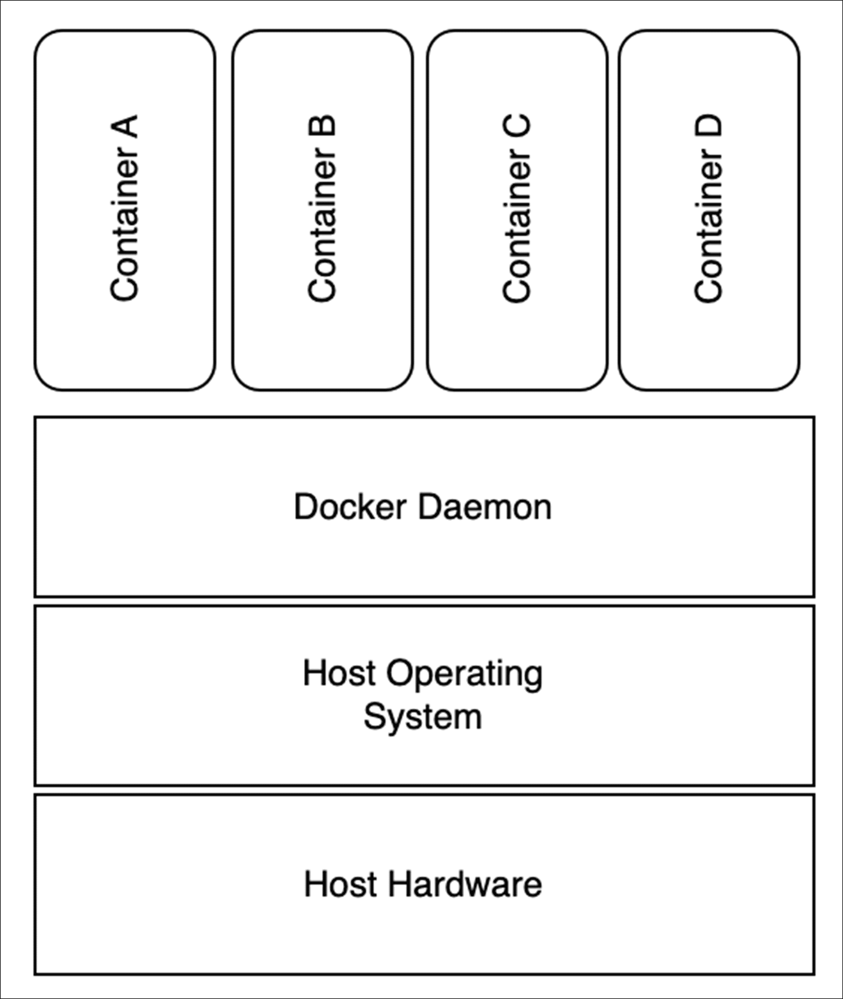

# 第七章：编码基础设施和管理部署

### 本章内容包括

+   使用 Copilot 的帮助创建 Dockerfile

+   使用大型语言模型起草您的基础设施代码

+   使用容器注册表管理 Docker 镜像

+   发挥 Kubernetes 的强大能力

+   无缝地使用 GitHub Actions 发布您的代码

没有比让应用程序闲置更令人沮丧的事情了。因此，将经过充分测试的应用程序快速推向生产是每个称职开发人员的明确目标。由于我们上一章节花费了时间测试我们的产品，现在它已经准备好发布了。

本章将重点介绍从开发到产品发布的关键时刻。在这个关键阶段，理解部署策略和最佳实践对确保成功的产品发布至关重要。

随着我们的应用程序成功地得到了保障和测试，现在是时候将注意力转向推出产品了。为此，我们将利用大型语言模型（LLMs）的强大功能，探索针对云基础设施量身定制的各种部署选项。

通过利用 LLMs 的力量并拥抱它们的部署选项和方法，我们可以自信地在推出产品的复杂领域中航行，为我们的客户提供强大且可扩展的解决方案，同时利用云计算的好处。

首先，我们将为 Docker 开发部署文件。我们将探讨如何创建 Docker 镜像和定义部署文件。此外，我们还将讨论容器化我们的应用程序的最佳实践，以及实现无缝部署的方法。

接下来，我们将利用 Terraform 来定义我们的基础设施代码，并自动部署 AWS 上的 Elastic Compute Cloud（EC2）实例。我们将演示如何编写 Terraform 脚本来在 EC2 实例上提供和部署我们的应用程序，以确保一致且可重现的基础设施设置。

接下来，我们将利用 LLMs 将我们的应用程序部署到 Kubernetes（AWS EKS/ECS）。我们将让 GitHub Copilot 创建适当的 Kubernetes 部署文件，以简化我们的部署流程并高效地管理我们应用程序的生命周期。鉴于我们应用程序的相对简单性，我们不需要像 Helm 这样的 Kubernetes 包管理器。然而，随着服务复杂性和依赖关系的增加，您可能希望将其作为一个选项进行探索。幸运的是，Copilot 也可以为您编写 Helm 图表！

最后，我们将简要展示如何使用 GitHub Actions 从本地迁移到自动化部署。我们可以通过将 LLMs 与这一广泛使用的持续集成和交付（CI/CD）工具集成，自动化我们的构建和部署过程，确保更快和更有效的部署。

##### 注意

虽然本章将使用 AWS 作为我们的云服务提供商，但本章涵盖的原则和实践可以适用于其他云平台甚至没有虚拟化的本地基础设施（裸机），这使我们能够根据业务需求调整和扩展我们的产品部署策略。你会发现，通过使用 LLM 和使用基础设施即代码，你可以（部分地）减轻云平台常见的供应商锁定问题。

你应该注意，如果你选择将这个（或任何应用程序）部署到 AWS，那么你的活动将会产生费用。AWS 和大多数云服务提供商为你提供了免费试用期来了解他们的平台（例如 Google Cloud Platform 和 Azure），但一旦这些信用额用完，你可能会被意外的大额账单所冲击。如果你决定在本章跟随进行，你应该为你能轻松承受的金额设置阈值警报。Andreas Wittig 和 Michael Wittig 的 *Amazon Web Services in Action, Third Edition*, 2023 年 3 月, Manning Publishing, 第 1.9 节是设置此类计费通知警报的绝佳资源。

## 7.1 构建一个 Docker 镜像并在本地“部署”它

正如你可能还记得第六章所讲的，Docker 是一个容器化平台，允许我们以传统意义上的很少或几乎没有安装（Docker 外部）的方式运行应用程序。与模拟整个操作系统的虚拟机不同，容器共享主机系统的内核（操作系统的核心部分），并利用主机系统的操作系统功能，同时将应用程序进程和文件系统与主机隔离开。这允许你在单个主机系统上运行多个隔离的应用程序，每个应用程序都有自己的环境和资源限制。下面的图表应该让你对 Docker 运行时和主机之间的关系有所了解。

##### 图 7.1 Docker 利用主机操作系统，同时隔离每个容器。这使得 Docker 容器相比虚拟机更加轻量，因为它们不需要完整的操作系统来运行。



从生产准备性的角度来看，其中一个更令人兴奋的功能是 Docker 更容易运行一些在某种意义上可以自我修复的应用程序。如果它们在运行时失败或崩溃，你可以配置它们在不需要干预的情况下重新启动。在本节中，我们将使用 Copilot 创建文件（称为 Dockerfile），从中构建我们的 *Docker 镜像*。

##### Docker 镜像

Docker 镜像就像 Docker 容器的蓝图。它们是可移植的，包括应用程序运行所需的所有依赖项（库、环境变量、代码等）。

运行中的 Docker 实例称为 Docker 容器。由于其轻量级特性，您可以在单个主机上运行多个容器而不会出现问题。我们之所以能够这样做，是因为容器化技术共享操作系统内核，以独立的用户空间运行。

##### 注意

最初，您的作者希望将 AWS CodeWhisperer 用作本章的 LLM。考虑到预期的云平台，这似乎是合乎逻辑的。但是，在撰写本文时，AWS CodeWhisperer 仅支持使用编程语言进行编程。它没有基础设施即代码的功能。

我们将从以下提示开始，让 Copilot 为我们起草 Dockerfile。

```py
# Create a Dockerfile for this Python app. The main class is main.py. Use Python 3.10 and install

# the dependencies using the requirements.txt file in this directory. The app should run on port 8080.
```

您可能会留下一个空文件（除了此注释以外）。基础设施即代码的支持正在不断发展（与 LLM 生态系统一样）。根据 Copilot 聊天的说法，GitHub Copilot 能够为您创建 Dockerfile；但是，您需要按照以下步骤引导它：

1.  在 `Dockerfile` 中，键入 `FROM python:`，然后等待 Copilot 建议使用的 Python 版本。选择您想要使用的版本。

1.  输入 `WORKDIR /app` 以设置容器的工作目录。

1.  输入 `COPY . /app` 以将项目内容复制到容器中。

1.  输入 `RUN pip install --trusted-host pypi.python.org -r requirements.txt` 以安装项目的依赖项。

1.  输入 `EXPOSE 8080` 以将端口 8080 暴露给容器。

1.  输入 `CMD ["python", "main.py"]` 以指定容器启动时要运行的命令。

或者，您可能希望将先前编写的相同提示复制并粘贴到 Dockerfile 中的 Copilot 聊天提示窗口中。 Copilot 聊天将为您提供所需的 Dockerfille 内容。

##### 列表 7.1 构建 Docker 镜像并准备其运行时生命周期的 Dockerfile 内容

```py
FROM python:3.10-slim-buster
WORKDIR /app
COPY . /app
RUN pip install --trusted-host pypi.python.org -r requirements.txt
EXPOSE 8080
CMD ["python", "main.py"]
```

使用 Dockerfile，我们将构建一个用于部署和运行我们的应用程序的镜像。我们可以输入以下命令来构建我们的应用程序（从 Dockerfile 所在的目录运行，并且不要忘记末尾的点）。您将需要互联网访问以下载依赖项并创建镜像。

```py
docker build -t itam:latest .
```

构建 Docker 镜像可能需要几秒钟到几分钟，具体取决于您的系统上安装了哪些镜像和软件包以及您的互联网连接速度。您的耐心很快就会得到回报，因为您很快就会有一个几乎可以安装在任何地方的应用程序，从最普通的商品硬件到您最喜欢的云提供商提供的最大型硬件。然而，在任何地方运行之前，您应该尝试在本地运行它。如果您忘记了命令，Copilot 聊天将乐意并乐于协助。

```py
    docker run -p 8000:8000 -d --name itam itam:latest
```

您可以通过在命令行中输入此命令来确认您的 Docker 容器正在运行：`docker ps | grep itam`。您应该看到正在运行的实例。

## 7.2 通过 Copiloting Terraform 架设基础设施

当您创建和测试应用时，在计算机上使用 Docker 镜像是有用的。但是当到达启动应用程序的时候，我们将需要一台比我们的本地计算机更强大的机器。在本节中，我们将使用 GitHub Copilot 来帮助我们通过让 Copilot 编写用于基础设施即代码工具 Terraform 的必需部署描述符来设置和控制我们的 AWS 基础架构。Terraform 由 HashiCorp 制作，使用领域特定语言（DSL）编写我们希望我们的基础架构看起来像什么的内容。此 DSL 使我们不必理解每个云服务提供商用于配置硬件的所有复杂性和细微差别。此外，它允许我们使用基础设施即代码存储和版本化我们的基础架构。

要开始，我们需要创建一个名为`ec2.tf`的文件，并添加提示以告知 Copilot 我们打算将其作为 Terraform 文件，并说明我们希望如何建立我们的基础架构。您可能会注意到 Copilot 需要我们在继续之前输入给定行的第一个单词。

##### 列表 7.2 Terraform 文件的示例，包括实例大小和如何构建和配置的说明

```py
# Create a Terraform file that provisions an AWS EC2 instance of type t2.micro, installs the Docker daemon, and returns the instance's hostname.

provider "aws" {
 region = "us-west-2"
}
 resource "aws_instance" "example" {
 ami = "ami-0c55b159cbfafe1f0"
 instance_type = "t2.micro"
}
```

您可能会发现 Copilot 跳过了一个微小但关键的细节：Copilot 没有提供安装和配置 Docker 的代码。鉴于 Docker 是运行我们的应用所必需的，我们需要纠正这个疏忽。事实上，您可能需要手动更新文件以包含安装 Docker 的命令，如下所示：

```py
resource "aws_instance" "example" {
  ami           = "ami-0c55b159cbfafe1f0"
  instance_type = "t2.micro"

   user_data = <<-EOF
                #!/bin/bash
                sudo yum update -y
                sudo yum install -y docker
                sudo service docker start
                sudo usermod -a -G docker ec2-user
                sudo docker run -d -p 80:80 nginx
                EOF
}
```

Copilot 应该生成一个完整的 Terraform 文件，类似于列表 7.3 的内容。很可能，代码与此列表不完全匹配，但只要包含关键特性即可：即提供程序、实例、添加 Docker 守护程序的脚本、密钥对和安全组。

##### 列表 7.3 完整列出了用于创建最小 EC2 实例的 Terraform 文件

```py
# Create a Terraform file that provisions an AWS EC2 instance of type t2.micro, installs the Docker daemon, and returns the hostname of the instance.

provider "aws" {
 region = "us-west-2"
}
 resource "aws_instance" "example" {
 ami = "ami-0c55b159cbfafe1f0"
 instance_type = "t2.micro"
 user_data = <<-EOF
 #!/bin/bash
 sudo yum update -y
 sudo yum install -y docker
 sudo service docker start
 sudo usermod -a -G docker ec2-user
 sudo docker run -d -p 80:80 nginx
 EOF
 connection {
 type = "ssh"
 user = "ec2-user"
 private_key = file("~/.ssh/id_rsa")
 host = self.public_ip
 }
 lifecycle {
 create_before_destroy = true
 }
 depends_on = [aws_security_group.allow_http]
}
 resource "aws_security_group" "allow_http" {
 name = "allow_http"
 description = "Allow HTTP inbound traffic"
 vpc_id = "vpc-12345678"
 ingress {
 description = "HTTP from VPC"
 from_port = 80
 to_port = 80
 protocol = "tcp"
 cidr_blocks = ["0.0.0.0/0"]
 }
}
 output "public_dns" {
 value = aws_instance.example.public_dns
 }
```

如果您使用的是默认的虚拟专用云（VPC），那么第 35 行上的`vpc_id`条目并不是严格必要的。尽管您会发现 AWS 团队选择的许多默认配置和约定都是有道理的，但如果您有更严格的安全要求，或者如果您想要了解有关您的基础架构的一切而不假设任何内容，那么您可能会考虑使用 Terraform 从头开始设置新的 VPC。您将需要将第 21 行的密钥对条目更改为您可以访问的密钥对。

完成了这个文件后，您应该运行`terraform init`命令。`terraform init`命令初始化一个新的或现有的 Terraform 工作目录。此命令下载并安装配置文件中指定的所需提供程序插件和模块。此命令准备就绪。

接下来，您将让 Terraform 解释它打算进行的更改。您可以使用 `terraform plan` 命令来完成此操作。`terraform plan` 命令为您的基础架构更改创建执行计划。此命令向您展示了当您应用配置文件时 Terraform 将对基础架构进行的更改。该计划将向您展示将创建、修改或销毁哪些资源，以及将对基础架构进行的任何其他更改。

##### 注意

当您第一次运行 terraform plan 时，可能会出现错误 “Error: configuring Terraform AWS Provider: no valid credential sources for Terraform AWS Provider found。” 您会遇到此错误，是因为 Terraform 尝试连接到 AWS，但无法向 AWS 提供适当的凭据。要解决此问题，您需要创建（或编辑）名为 `~/.aws/credentials` 的文件，并添加您的 ITAM AWS 访问密钥 ID 和 AWS 密钥访问密钥凭据。有关如何正确执行此操作的完整详细信息，请参阅 *Amazon Web Services in Action, Third Edition* 的 **4.2.2 配置 CLI** 部分。

最后，要应用 Terraform 更改，您将使用 `terraform apply` 命令。然后，Terraform 将读取当前目录中的配置文件，并将任何更改应用于您的基础架构。如果您自上次运行 `terraform apply` 以来对配置文件进行了任何更改，例如，如果我们需要启动一个新的数据库实例或更改 EC2 的大小，则 Terraform 将向您显示将要进行的更改的预览，并在应用更改之前提示您确认。

如果您要应用这些更改，那么在几分钟内，您将在您的 VPC 中运行一个全新的 EC2 实例。然而，这只是问题的一半。拥有您手边的计算能力非常棒；然而，您需要某些东西来应用此能力。在这种情况下，我们可以使用这个 EC2 来运行我们的信息系统资产管理系统。以下部分将简要介绍将本地构建的镜像传输到另一台机器的过程。

## 7.3 移动 Docker 镜像（困难的方法）

首先，我们将从本地计算机导出一个 Docker 镜像，并将其加载到远程计算机上。我们将使用命令 `docker save` 和 `load` 来完成此操作。您可以在本地计算机上使用 `docker save` 命令将镜像保存到 tar 存档中。以下命令将镜像保存到名为 <`image-name>.tar` 的 tar 存档中：`docker save -o <image-name>.tar <image-name>:<tag>`。

接下来，您可以使用诸如 SCP 或 SFTP 之类的文件传输协议将 tar 存档传输到远程计算机。您可以在远程计算机上使用 docker load 命令从 tar 存档加载镜像：`docker load -i <image-name>.tar.` 这将在远程计算机上将镜像加载到本地 Docker 镜像缓存中。一旦镜像加载完成，您可以使用 `docker run` 命令启动镜像并运行 Docker 容器，就像您构建它后所做的那样。此外，您随后可以将此镜像添加到您的 Docker compose 文件中，其中包含了您的 Postgres 数据库和 Kafka 实例。

##### 注意

Terraform 的前期介绍被大大简化了。当你准备认真学习 Terraform 时，你的首选资源应该是 Scott Winkler 的 *Terraform 实战*（2021 年 5 月，Manning 出版社）。

本节介绍了如何打包我们的镜像并将其加载到远程主机上。尽管这很容易脚本化，但随着容器注册表的出现，现在更容易地管理部署而无需将它们全部传送到互联网上。在下一节中，我们将探讨其中一个工具 Amazon 的弹性容器注册表（ECR）。

## 7.4 将 Docker 镜像轻松传送到其他地方

Docker 镜像，我们容器的蓝图，是容器化应用的基本构建块。正确管理它们确保我们保持清洁、高效和有组织的开发和部署工作流程。Amazon ECR 是一个完全托管的 Docker 容器注册表，使开发人员能够轻松地存储、管理和部署 Docker 容器镜像。

首先，让我们深入了解如何将 Docker 镜像推送到 ECR。这个过程对于使您的镜像可以使用和部署是至关重要的。我们将逐步介绍设置您的本地环境、与 ECR 进行身份验证和推送您的镜像。在我们将镜像移到 ECR 之前，我们必须创建一个仓库来存放该镜像。这可以从 AWS 管理控制台中进行，或者我们将要做的就是使用 AWS 命令行界面（CLI）。为我们的镜像创建一个新仓库的命令是：`aws ecr create-repository --repository-name itam`

接下来，我们需要为我们的 Docker 镜像打上 ECR 仓库的 URL 和镜像名称的标签。我们可能想要将其称为 latest 或使用语义化版本。打标签将使我们能够轻松地回滚或前进系统的版本。我们将使用以下命令为我们的应用镜像打上最新标签：`docker tag itam:latest 123456789012.dkr.ecr.us-west-2.amazonaws.com/itam:latest.`

然后，我们需要使用 `aws ecr get-login-password` 命令对 Docker 进行身份验证以访问 ECR 注册表。这将生成一个 Docker 登录命令，您可以使用该命令对 Docker 进行身份验证以访问注册表。登录的命令是 `aws ecr get-login-password --region us-west-2 | docker login --username AWS --password-stdin 123456789012.dkr.ecr.us-west-2.amazonaws.com`

最后，我们将使用 `docker push` 命令将 Docker 镜像推送到 ECR 注册表。我们会这样做：`docker push 123456789012.dkr.ecr.us-west-2.amazonaws.com/itam:latest`

一旦我们的镜像在我们的注册表中，我们的部署选项就大大增加了。例如，我们可以编写一个 bash 脚本，登录到我们的 EC2 实例并执行 docker pull 命令来下载并在该 EC2 实例上运行镜像。或者，我们可能希望采用更可靠的部署模式。在接下来的部分中，我们将逐步介绍在一个名为弹性 Kubernetes 服务（EKS）的强大云服务上设置和启动我们的应用程序的过程。EKS 是由 AWS（亚马逊网络服务）提供的托管 Kubernetes 服务。让我们开始吧！

## 7.5 将我们的应用程序部署到 AWS 弹性 Kubernetes 服务（EKS）

Kubernetes 相对于简单地在 EC2 实例上运行 Docker 镜像具有许多优势。首先，使用 Kubernetes 管理和扩展我们的应用程序变得更加简单。而且，使用 Kubernetes，我们不必花费大量额外的时间考虑我们的基础架构应该是什么样子。此外，由于其对其镜像生命周期的自动管理（称为 pod），我们的应用程序基本上是自愈的。这意味着如果出现问题，Kubernetes 可以自动修复它，始终保持我们的应用程序平稳运行。

首先，我们需要一个用 YAML（另一种标记语言或 YAML 不是标记语言，这取决于你问的是谁）编写的部署描述符，它将描述我们的信息技术资产管理系统在任何时间点应处于的状态。该文件（通常称为 deployment.yaml）将提供模板，Kubernetes 将根据该模板与当前运行的系统进行比较，并在需要时进行更正。

##### 清单 7.4 用于信息技术资产管理系统的 Kubernetes 部署文件

```py
# Create a Kubernetes deployment file for the itam application. The image name is itam:latest

# The deployment will run on port 8000
 apiVersion: apps/v1
kind: Deployment
metadata:
 name: itam-deployment
 labels:
 app: itam
spec:
 replicas: 1
 selector:
 matchLabels:
 app: itam
 template:
 metadata:
 labels:
 app: itam
 spec:
 containers:
 - name: itam
 image: itam:latest
 imagePullPolicy: Always
 ports:
 - containerPort: 8000
```

然而，这样是行不通的。Kubernetes 将无法找到我们在部署描述符文件中引用的镜像。为了纠正这一点，我们需要告诉 Kubernetes 使用我们新建的 ECR。幸运的是，这并不像听起来那么困难。我们只需更新文件中的图像条目，指向 ECR 镜像，以及授予 EKS 访问 ECR 的权限（也许有点棘手，但还是可以管理的）。

首先，更新部署 yaml 文件以使用 ECR 镜像。它将类似于这样：`image: 123456789012.dkr.ecr.us-west-2.amazonaws.com/itam:latest`。然后，我们需要定义一个供 EKS 使用的策略。然后，我们将使用 AWS CLI 或 IAM 管理控制台应用该策略。虽然应用策略略微超出了本书的范围，但您可以使用 Copilot 定义此策略。生成的策略将类似于以下清单。

##### 清单 7.5 允许 EKS 从 ECR 拉取镜像的 IAM 策略

```py

{
  "Version": "2012-10-17",
  "Statement": [
    {
      "Sid": "AllowPull",
      "Effect": "Allow",
      "Principal": {
        "AWS": "arn:aws:iam::<aws_account_id>:role/<role>"
      },
      "Action": [
        "ecr:GetDownloadUrlForLayer",
        "ecr:BatchGetImage",
        "ecr:BatchCheckLayerAvailability"
      ],
      "Resource": "arn:aws:ecr:<region>:<aws_account_id>:repository/<repository_name>"
    }
  ]
}

```

一旦 EKS 能从 ECR 拉取镜像，你会看到一个 Pod 开始运行。然而，你没有办法从外部访问这个 Pod。我们需要创建一个 Service。在 Kubernetes 中，Service 是一种抽象，定义了一组逻辑上的 Pods（在 Kubernetes 对象模型中，你创建或部署的最小、最简单的单位）以及访问它们的策略。

Services 使应用程序的不同部分之间，以及不同应用程序之间能够进行通信。它们通过将 Pods 暴露给网络以及 Kubernetes 内部的其他 Pods 来帮助分配网络流量和进行负载平衡。

##### 7.6 列表：一个 Kubernetes 服务文件，以便为我们的应用程序启用外部访问。

```py
# Please create a service for the application that uses a load balancer type egress
apiVersion: v1
kind: Service
metadata:
  name: itam-service
spec:
  type: LoadBalancer
  selector:
    app: itam
  ports:
  - name: http
    port: 80
    targetPort: 8000

```

Kubernetes 负责将来自此入口的所有请求通过服务路由到正在运行的 Pods，无论它们运行在哪个主机上。这实现了无缝的故障切换。Kubernetes 预期某些事情会失败。它对此有所准备。因此，分布式系统中的许多最佳实践都被融入了 Kubernetes。进入 Kubernetes 是实现一个可靠、高可用系统的重要第一步。在接下来的部分中，我们将探讨如何减轻将应用程序重复且持续地部署到 Kubernetes 上的负担。我们将探讨使用 GitHub Actions 构建一个小型部署管道。

## 7.6 章节：在 GitHub Actions 中设置一个持续集成/持续部署管道。

如果发布过程很困难，那么它就不会经常进行。这限制了我们为应用程序和利益相关者增加价值的能力。然而，自动化部署过程显著减少了发布所需的时间。这使得更频繁的发布成为可能，加快了开发的步伐，并加速了向用户交付新功能。持续集成/持续部署（CI/CD）管道可以降低与部署相关的风险。通过进行更小、更频繁的更新，任何出现的问题都可以迅速被隔离和修复，从而将对最终用户的潜在影响降到最低。这些管道促进代码更顺畅地集成并加速部署，简化了软件发布过程。

GitHub Actions 允许我们直接在 GitHub 仓库中构建自定义的 CI/CD 管道。这使得开发工作流程更高效，并使得自动化各种步骤成为可能，让我们能够专注于编写代码，而不是处理集成和部署的后勤工作。

本节提供了使用 GitHub Actions 和 GitHub Copilot 设置 CI/CD 管道的简要介绍。请注意，这不是一份详尽的指南，而是一份概述，介绍了潜在的好处和一般工作流程。这应该作为一个入门教程，让你了解如何使用这些工具来优化你的软件开发过程。

首先，我们将在项目中创建一个文件，路径为：`.github/workflows.`。注意前导点。我们可以将此文件命名为`itam.yaml`或任何您想要的名称。在此文件的第一行上，添加以下提示：# 创建一个 GitHub Actions 工作流，每次合并到主分支时都会构建 ITAM 应用程序并将其部署到 EKS。

##### 注意

`：像`我们在本章中交给 Copilot 的许多基础设施相关任务一样，Copilot 需要大量帮助来为我们创建此文件。我们需要了解此文件的结构以及如何开始每一行。在这种情况下，像向 ChatGPT 或 Copilot Chat 请求构建文件一样是有道理的。

##### 列表 7.7 我们用于构建和部署应用程序的 GitHub Actions 文件的开头

```py
# Create a GitHub Actions workflow that builds the ITAM application on every merge to the main branch and deploys it to EKS.

name: Build and Deploy to EKS
 on:
 push:
 branches:
 - main
jobs:
```

构建作业首先将代码从我们的 GitHub 存储库中检出。它使用在模块 actions/checkout 版本 2 中编写的代码。类似地，接下来，它将获取 EKS 命令行界面并配置凭据以连接到 EKS。您将注意到 AWS 访问密钥和密码是自动传递到应用程序中的值。GitHub Actions 使用内置的秘密管理系统来存储诸如 API 密钥、密码或证书等敏感数据。此系统已集成到 GitHub 平台中，并允许您在存储库和组织级别添加、删除或更新秘密（和其他敏感数据）。秘密在存储之前已加密，不会显示在日志中，也无法下载。它们仅作为环境变量暴露给 GitHub Actions 运行器，这是处理敏感数据的安全方式。

同样，您可以创建环境参数并在您的操作中使用它们。例如，看看变量`ECR_REGISTRY`。该变量是使用`login-ecr`函数的输出创建的。在这种情况下，您仍然需要在您的操作文件中硬编码弹性容器注册表（ECR）。但是，您希望这样做是因为一致性和仅在文件中的一个位置管理它的需要。大多数这些步骤应该对您来说很熟悉，因为我们在整章中都使用过它们。这就是自动化的魔力：它为您做这些事情。

##### 列表 7.8 我们的 GitHub Actions 文件的构建和部署步骤

```py
  build:
    runs-on: ubuntu-latest

    steps:
    - name: Checkout code
      uses: actions/checkout@v2

    - name: Set up EKS CLI
      uses: aws-actions/amazon-eks-cli@v0.1.0

    - name: Configure AWS credentials
      uses: aws-actions/configure-aws-credentials@v1
      with:
        aws-access-key-id: ${{ secrets.AWS_ACCESS_KEY_ID }}
        aws-secret-access-key: ${{ secrets.AWS_SECRET_ACCESS_KEY }}
        aws-region: us-west-2

    - name: Build and push Docker image
      env:
        ECR_REGISTRY: ${{ steps.login-ecr.outputs.registry }}
        ECR_REPOSITORY: itam
        IMAGE_TAG: ${{ github.sha }}
      run: |
        docker build -t $ECR_REGISTRY/$ECR_REPOSITORY:$IMAGE_TAG .
        docker push $ECR_REGISTRY/$ECR_REPOSITORY:$IMAGE_TAG

    - name: Deploy to EKS
      env:
        ECR_REGISTRY: ${{ steps.login-ecr.outputs.registry }}
        ECR_REPOSITORY: itam
        IMAGE_TAG: ${{ github.sha }}
      run: |
        envsubst < k8s/deployment.yaml | kubectl apply -f -
        envsubst < k8s/service.yaml | kubectl apply -f -
```

文件的最后部分将登录到 AWS ECR。操作文件中的步骤调用此部分。完成后，它将输出返回到调用函数。

##### 列表 7.9 我们用于构建和部署应用程序到 EKS 的 GitHub Actions 文件的开头

```py
  login-ecr:
    runs-on: ubuntu-latest
    steps:
    - name: Login to Amazon ECR
      id: login-ecr
      uses: aws-actions/amazon-ecr-login@v1
      with:
        registry: <your-ecr-registry>
        aws-access-key-id: ${{ secrets.AWS_ACCESS_KEY_ID }}
        aws-secret-access-key: ${{ secrets.AWS_SECRET_ACCESS_KEY }}
```

总之，探索 Code-as-Infrastructure 使我们能够了解其在任何项目中的重要作用以及如何通过代码更好地管理它。像 Terraform 这样的工具提供了管理基础设施的简化解决方案，而 GitHub 的以代码为中心的功能有助于维护整体工作流程。

引入持续集成和持续部署（CI/CD）流水线，主要通过 GitHub Actions 平台，突出了自动化软件交付流程的重要性。自动化这些流程可以提高软件开发生命周期的速度和可靠性，并减少人为错误的机会。

管理基础设施即代码的旅程不断发展，新工具和实践不断涌现。它需要持续的学习和适应心态。本章为您展示了其好处和可能性。

## 7.7 摘要

+   从应用程序开发到产品发布的过渡：讨论了从应用程序准备投入生产到发布上线的过程。

+   云基础设施的部署策略和最佳实践：详细说明了如何设置您的云基础设施以及实现最佳性能的推荐准则。

+   使用 Docker 进行应用程序容器化：它解释了 Docker 如何将应用程序及其依赖项捆绑到单个对象中，从而便于部署和管理。

+   用于基础设施即代码的 Terraform 入门：介绍了 Terraform 如何使您能够使用代码来管理基础设施，从而提高效率并减少错误。

+   通过 Kubernetes 进行应用部署管理：讨论了 Kubernetes 如何简化容器化应用程序的部署、扩展和管理。

+   将方法适应不同的云平台或本地基础设施：解释了书中讨论的方法如何适应不同的云平台或本地部署。

+   GitHub Copilot 在创建 Dockerfile 和 Terraform 文件中的作用：讨论了 GitHub Copilot，一个基于人工智能的代码助手，如何帮助您更高效、更准确地创建 Docker 和 Terraform 文件。

+   将 Docker 镜像从本地导出到远程机器：解释了将 Docker 镜像从本地计算机移动到远程服务器的步骤。

+   在 AWS 的弹性 Kubernetes 服务（EKS）上部署：讨论了如何在 AWS EKS 上部署容器化应用程序，这是一项托管的 Kubernetes 服务。

+   创建 Kubernetes YAML 部署描述符：详细说明了如何编写 YAML 格式的 Kubernetes 部署描述符，描述了部署的期望状态。

+   用于网络流量分发和通信的 Kubernetes 服务形成：解释了如何创建 Kubernetes 服务，这些服务抽象了您与 Pod 的通信和流量路由方式。

+   将 Docker 镜像推送到亚马逊的弹性容器注册表（ECR）：描述了如何将 Docker 镜像上传到 ECR，这是 AWS 提供的完全托管的 Docker 容器注册表。

+   从本地到使用 GitHub Actions 自动化部署的迁移：讨论了如何使用 GitHub Actions，一个 CI/CD 平台，自动化部署流程。
