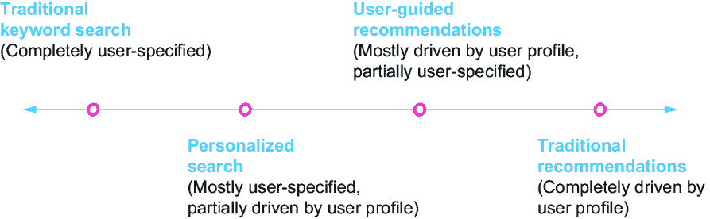
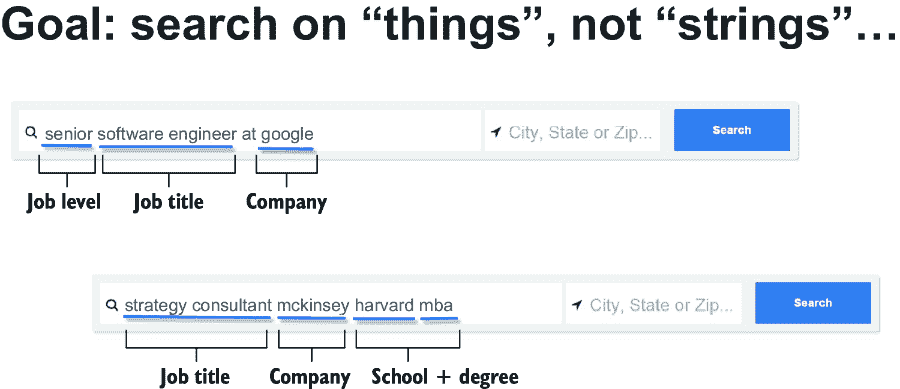
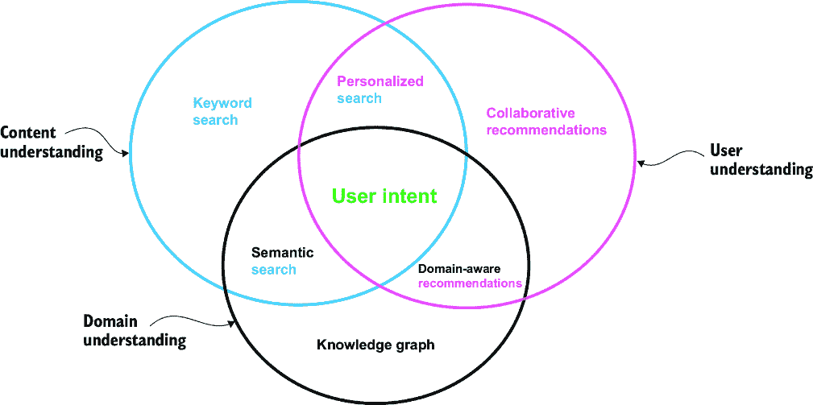
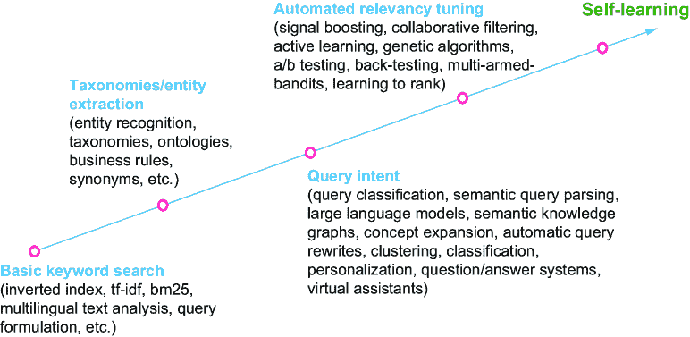
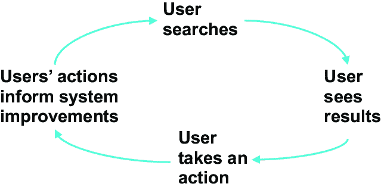
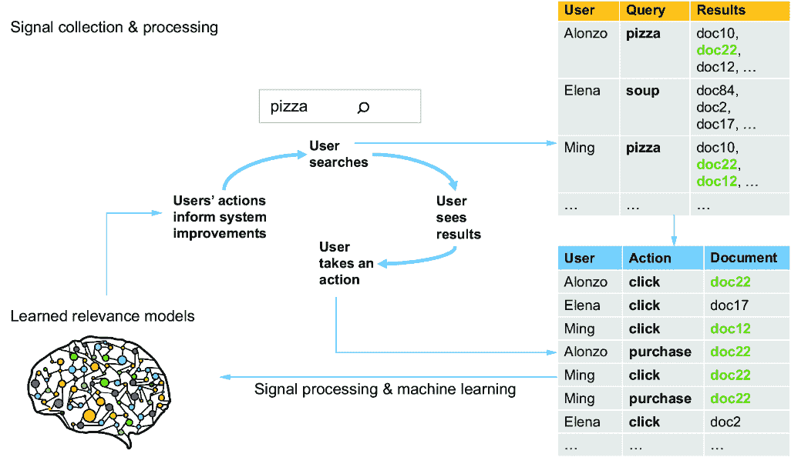

# 第一章：介绍人工智能搜索

### 本章涵盖

+   什么是人工智能搜索？

+   理解用户意图

+   人工智能搜索的工作原理

+   内容和行为智能

+   构建人工智能搜索引擎

搜索框已经成为大多数现代应用程序中与数据交互的默认用户界面。如果你想到你每天使用的每一个主要应用程序或网站，你可能在每次访问时做的第一件事就是输入一个查询来找到对你最相关的内容或操作。

当你没有明确搜索时，你可能会消费定制到你口味和兴趣的内容流。无论是视频推荐、购买物品、优先电子邮件、新闻文章或其他内容，你很可能仍在查看过滤或排名的结果，并有机会通过自己的查询浏览或明确过滤内容。

对于大多数人来说，“搜索引擎”这个短语会让人联想到像 Google、Bing 或 Baidu 这样的网站，这些网站通过爬取整个公共互联网来允许基于搜索的查询。然而，现实情况是，现在搜索几乎已经融入到我们每天与众多网站和应用进行数字互动的每一个环节中。

这些搜索引擎远非静态。我们看到像 OpenAI 的 ChatGPT、Anthropic 的 Claude 和 Google 的 Gemini 这样的商业技术，以及数百个其他更开放的大型语言模型（LLMs），如 Meta 的 Llama 和 Mistral 的 Mixtral，它们的源代码和模型权重已公开发布供公众使用。这些都作为世界信息的模型，可以生成对任意查询的解释和响应。这些模型正在积极集成到主要搜索引擎中，并将继续对人工智能搜索的演变产生重大影响。

虽然搜索框的预期响应可能历史性地是返回“十个蓝色链接”——一个按排名排列的文档列表，供用户进一步调查以找到他们查询的信息——但近年来对搜索技术智能水平的期望已经急剧上升。

用户今天期望搜索技术能够

+   *领域感知*——搜索技术应该理解每个特定用例和文档集合中的实体、术语、类别和属性，而不仅仅是使用字符串文本的通用统计数据。

+   *情境化和个性化*——它应该能够考虑到用户情境（位置、上次搜索、个人资料、先前互动、用户推荐和用户分类），查询情境（其他关键词、类似搜索）和领域情境（库存、业务规则、领域特定术语），以便更好地解释用户意图。

+   *对话式*——它应该能够用自然语言进行交互，并在学习并记住相关新信息的同时，引导用户通过多步骤的发现过程。

+   *多模态*—它应该能够解决由文本、语音、图像、视频或其他内容类型提出的查询，并使用这些查询在跨其他内容类型中进行搜索。

+   *智能*—它应该能够提供预测性自动补全，并理解用户的意思（拼写纠正、短语和属性检测、意图分类、概念搜索），以便在正确的时间提供正确的答案，并不断变得更聪明。

+   *辅助*—它应该超越仅仅提供链接，提供答案、摘要、解释和可用的操作。

许多这些功能都是由大型语言模型（LLMs）实现的，而其他功能则是由分析用户行为和构建特定领域的个性化配置文件、知识图谱和排名模型驱动的。

随着 LLMs 的普及，搜索界面也在不断发展，包括更多的聊天机器人和会话信息发现会话，但即使是目前最好的模型，在没有连接到实际的信息源（如搜索引擎索引）的情况下，也难以避免胡编乱造（提供错误的答案）和偏离轨道，除非连接到可靠的信息源。*检索增强生成（RAG）*，即使用搜索引擎或向量数据库作为知识源，为 LLMs 提供准确和最新的信息作为上下文，是目前提高生成人工智能模型准确性的最可靠技术之一。

人工智能搜索的目标是利用自动机器学习技术来实现所有这些期望的功能。虽然许多组织从基本的文本搜索开始，花费多年时间尝试手动优化同义词列表、业务规则、本体、字段权重以及搜索配置的无数其他方面，但一些组织开始意识到，这个过程的大部分可以自动化。

在整本书中，你将学习到实现许多关键人工智能搜索技术，例如

+   使用 LLMs 进行查询解释、嵌入、问答和结果摘要

+   微调 LLMs 以进行搜索和问答

+   收集和使用用户信号以进行众包相关性

+   信号增强模型

+   从信号和内容中学习知识图谱

+   语义知识图谱

+   查询意图分类和查询意义消歧

+   个性化搜索和推荐

+   机器学习排名（学习排名）

+   用于隐式相关性反馈的点击模型

+   通过主动学习避免排名模型中的偏差

+   文本、图像和混合内容类型的混合搜索和多模态搜索

+   使用知识图谱和 LLMs 进行语义搜索

这本书是一个以实例为导向的指南，介绍了构建智能搜索系统最常用的机器学习算法和技术。我们不仅会讲解关键概念，还会提供可重用的代码示例，涵盖数据收集和处理技术，以及用于提供 AI 驱动的搜索能力的自我学习查询解释和相关性策略，希望很快也能包括您自己的组织！

## 1.1 什么是 AI 驱动的搜索？

在 2022 年 11 月之前，当 OpenAI 将 ChatGPT 作为一个可通用的算法发布给世界，让非技术用户可以通过它来解决许多问题时，“人工智能”的定义对公众来说有些模糊。人们理解它包括自动驾驶汽车、自主机器人和其他使计算机看起来具有智能的未来技术，但对许多人来说，AI 似乎更像是一个营销术语，而不是一个定义明确的术语。然而，在软件行业，多年来一直存在一个更具体的定义。

在软件开发背景下，术语*人工智能*通常指任何能够执行以前需要人类智能的任务的计算机程序。该程序通常包括机器学习技术，使其能够从数据中学习并随着时间的推移提高其性能。尽管如此，即使不涉及机器学习技术但能生成类似人类反馈的基于规则的系统也一直被视为“人工智能”系统。在这本书中，我们将采用这种更广泛的 AI 定义，尽管我们主要会讨论 AI 的机器学习方面。

术语*搜索*（或*搜索引擎*）同样被公众认为是像 Google 或 Bing 这样的网络搜索引擎。在软件开发中，这个术语也用来描述任何能够使用户查询和找到信息的任何技术。搜索通常至少涉及两个关键步骤——找到与查询匹配的文档（*匹配*）然后根据查询的相关性对这些文档进行排序（*排名*）。搜索还可以包括许多预处理步骤来更好地理解查询，以及后处理步骤从匹配的文档中提取答案或总结结果。搜索通常是用户找到信息的主要方式，无论是进行一般网络搜索、产品搜索、企业搜索、视频/图像搜索，还是数百种其他常见的信息查找和排名用例。它也是生成式 AI 系统快速找到更新的事实内容作为其提示上下文的主要方式。

但什么是人工智能驱动的搜索，它与传统的“搜索”有何不同？许多流行词汇，如“人工智能”、“机器学习”、“数据科学”和“深度学习”，常常被互换使用，了解它们之间的区别以及它们如何与人工智能驱动的搜索重叠是很重要的。图 1.1 展示了这些相关领域之间的重要关系。

##### 图 1.1 人工智能驱动的搜索包括搜索和人工智能领域的交叉点上的所有技术和技巧。这些技术与数据科学、机器学习和深度学习领域重叠很大，并使用这些领域。

*机器学习*是人工智能的一个子集，它专注于使用数据来训练模型，根据从训练数据中学习到的见解执行任务。深度学习是机器学习的一个进一步子集，它专注于训练人工神经网络——部分模仿人类大脑结构的算法——以学习解决复杂问题。在图 1.1 中，请注意深度学习是机器学习的一个完全包含的子集，而机器学习又是人工智能的一个完全包含的子集。数据科学是一个与人工智能和搜索重叠很大的学科，但它还包含其他独特的关注领域，因此它既不是另一个学科的完全超集也不是子集。

本书关注的重点是搜索（也称为*信息检索*）与人工智能的交叉点，特别是将机器学习和深度学习技术应用于提高搜索结果的相关性以及自动化调整搜索相关性的过程。构建人工智能驱动的搜索涉及许多众所周知的机器学习技术，但也涉及许多特定于信息检索和搜索领域的技术。图 1.2 提供了本书将涵盖的一些关键人工智能驱动的搜索技术的分类列表，按是否为深度学习技术、不需要深度学习的其他机器学习技术或不需要机器学习的其他人工智能技术分类。

##### 图 1.2 按是否为深度学习技术、不需要深度学习的其他机器学习技术或不需要机器学习的其他人工智能技术分类的具体人工智能驱动的搜索技术

在仅限人工智能的类别中，问答系统、虚拟助手、聊天机器人和基于规则的关联性都是通常使用机器学习构建但不需要机器学习的人工智能技术的例子。许多人基于规则构建聊天机器人来理解不同的用户话语和意图，同样，问答系统也可以仅基于规则和本体来构建。但即便如此，机器学习通常用于学习这些规则和本体，因此这些类别之间的界限往往模糊不清。

当算法开始使用数据来训练模型时，我们就进入了人工智能搜索的机器学习子类别。我们使用搜索引擎用户的（点击、点赞、加入购物车、购买等）行为信号来构建能够学习更好地对文档进行排序的模型。这可以包括信号增强模型（每个查询或类别的顶级文档）、生成推荐或个性化搜索结果的协同过滤模型，以及从内容和行为信号中学习以更好地排序结果的排序分类器（学习排序）。机器学习还用于学习知识图谱，这些图谱是实体、概念及其关系的图，可用于更好地理解领域并更好地解释用户查询。语义搜索（基于意义而非仅关键词的搜索）可以通过此类知识图谱以及传统的自然语言处理方法、查询意图分类、文档聚类和其他由用户查询、文档和用户行为信号驱动的技术来实现。

最后，在人工智能搜索的深度学习子类别中，我们看到使用神经网络来构建能够理解用户查询和文档、排序和总结搜索结果的模型。在这里，文本用于训练大型语言模型（LLMs）以理解词语和短语的含义，生成问题的答案，以及生成文档的摘要。LLMs 是一种可以解释文本内容的*基础模型*，通常在互联网上的大量文本上进行训练。基础模型还可以在除了文本之外的其他类型的内容上进行训练（如图像、音频、视频），以实现跨这些内容类型的**多模态搜索**：文本到图像搜索、文本到音频、图像到视频等。LLMs 还用于生成**嵌入**，这是内容的向量表示，代表内容的含义。由于搜索引擎的主要任务是找到并排序与进入查询相似的内容，这些嵌入使得在查询的意义上进行搜索的能力更加复杂，并显著提高了查询理解和排序。在特定目标或特定领域的数据集上进一步微调基础模型也将使它们在理解这些领域的细微差别或用例方面变得更好。

基础模型压缩了大量的人类知识（通常包括大部分互联网），使它们在大多数领域拥有广泛的理解。然而，这种知识压缩是有损压缩——原始数据没有存储，具体事实和概念很容易混淆。基础模型因能够对问题产生幻觉答案而闻名，这使得它们在回答事实问题时通常不可靠。因此，除了搜索引擎使用基础模型来改进查询理解和排名之外，我们还在看到它们被大量用于 RAG——其中搜索作为知识源，为生成式人工智能任务提供准确和最新的信息作为上下文。

我们将在整本书中详细介绍这些人工智能驱动的搜索技术。但首先，让我们讨论人工智能驱动的搜索的目标以及它与传统搜索的不同之处。

## 1.2 理解用户意图

要提供人工智能驱动的搜索，我们需要对涉及解释用户意图和返回匹配内容维度的整体理解。在信息检索领域，搜索引擎和推荐引擎是两种最流行的技术，用于提供满足用户信息需求的相关内容。许多组织认为搜索引擎和推荐引擎是不同的技术，解决不同的用例。通常，同一组织内的不同团队——通常具有不同的技能集——独立工作在不同的搜索引擎和推荐引擎上。在本节中，我们将讨论为什么将搜索和推荐分离成独立的功能和团队往往会导致不太理想的结果。

### 1.2.1 什么是搜索引擎？

搜索引擎通常被视为一种明确输入查询并接收响应的技术（图 1.3）。它通常通过一个文本框暴露给最终用户，用户可以在其中输入关键词或问题。结果通常以列表形式返回，并列有额外的过滤选项，这些选项可以进一步细化初始查询。使用这种机制，搜索被用作直接发现相关内容的工具。当用户完成他们的搜索会话后，他们通常可以发出新的查询，并从一张白纸开始，忽略之前搜索的上下文。

##### 图 1.3 一个典型的搜索体验，用户输入查询并看到带有过滤选项的搜索结果，以支持进一步细化搜索结果

搜索引擎是软件工程世界中功能最全面的一种系统。大多数底层搜索引擎技术被设计成以大规模可扩展的方式运行，针对数百万、数十亿甚至数万亿的文档处理大量查询，并在数百毫秒或更短的时间内提供结果。在许多情况下，对新摄入的数据进行实时处理和近实时搜索是必需的，所有这些都必须在多个服务器上并行化以扩展并满足如此高的性能要求。

实现搜索引擎还需要大量工作来构建特定的搜索数据结构，如倒排索引或基于 ANN 的向量存储，理解线性代数和向量相似度评分，具备文本分析和自然语言处理的经验，以及了解众多特定的搜索类型的数据模型和能力（拼写检查、自动建议、细分、文本高亮、嵌入等）。

为了让搜索引擎完全理解用户意图，你结合对内容、用户和领域的彻底理解至关重要。在简要讨论了相关主题推荐引擎之后，我们将重新审视为什么这一点很重要。

### 1.2.2 推荐引擎提供了什么？

大多数人认为推荐引擎（或称为“推荐系统”）是不接受直接用户输入，而是根据引擎从他们那里学到的信息来提供内容，计算与他们的兴趣和行为最佳匹配的系统。这些兴趣通过用户偏好、用户行为、查看的内容等多种方式推断出来。对于推荐引擎来说，缺乏直接用户输入与搜索引擎形成鲜明对比，后者传统上被认为是一种需要明确用户驱动的查询的技术。

如果你经常访问 Amazon.com 或其他任何主要电子商务网站，你无疑熟悉那些声称“根据你对这个物品的兴趣，你可能还会喜欢……”或其他基于你的集体浏览和购买历史推荐物品列表的推荐引擎部分，如图 1.4 中的示例。这些推荐往往为公司带来显著收入，并帮助客户发现相关、个性化且相关的内容，这些内容通常补充了他们明确搜索的内容。

##### 图 1.4 基于用户对相似物品表示兴趣的推荐

推荐算法大致可以分为三类：

+   *基于内容的推荐器*—这些推荐器基于物品或用户的属性进行匹配。

+   *基于行为的推荐器*—这些推荐器基于相似用户与相似物品之间的交互重叠进行匹配。

+   *多模态推荐器*—这些推荐器基于相似的内容属性和重叠的行为交互进行混合匹配。

### 1.2.3 搜索和推荐之间的个性化范围

搜索引擎和推荐引擎之间的关键区别在于，搜索引擎通常由用户引导，匹配用户明确输入的查询，而推荐引擎通常不接受任何直接用户输入，而是基于已知或推断的知识推荐用户可能想要看到的内容。

但这两个系统实际上是同一枚硬币的两面，将它们视为独立的系统会创造一个虚假的二分法。在两种情况下，目标都是理解用户在寻找什么，并交付相关结果以满足用户的信息需求。在搜索和推荐系统之间存在着广泛个性化的能力范围。

假设你在尝试为你的最终用户寻找内容时，既有明确的查询又有用户特定的个性化资料可用，你可以做以下任何一项：

+   *传统关键词搜索*—忽略个人资料，仅使用明确输入。

+   *个性化搜索*—隐式使用个人资料，并结合其他明确用户输入。

+   *用户引导推荐*—明确使用个人资料，并赋予用户调整它的能力。

+   *传统推荐*—明确使用个人资料，但用户无法调整。

图 1.5 展示了这一个性化范围。

##### 图 1.5 个性化范围，展示了传统关键词搜索和传统推荐作为更大连续体两端。

尽管个性化范围的两端代表了极端，但它们也是两种最常见的方法。不幸的是，我们在许多组织中看到的一个最大的错误是围绕搜索和推荐是独立问题的信念构建团队。这通常导致数据科学团队构建复杂的个性化分段模型，这些模型只能进行推荐而不能进行搜索，以及工程团队构建大规模关键词匹配引擎，这些引擎难以利用推荐团队构建的强大模型。

更多的时候，推荐团队由具有最少信息检索背景的数据科学家组成，而搜索团队通常由具有最少数据科学背景的工程师组成。由于康威定律（“设计系统的组织……受限于产生的设计是这些组织沟通结构的复制品”），这最终导致在个性化范围（尤其是中间部分）解决问题的挑战，需要两个团队的最佳表现。在这本书中，我们专注于共享技术，通过统一方法使搜索变得更智能，使推荐变得更灵活。AI 驱动的搜索平台需要能够从您的用户和内容中持续学习，并使您的用户能够引导结果，以便它们持续改进。

### 1.2.4 语义搜索和知识图谱

我们在图 1.5 中将搜索和推荐作为个性化范围呈现，个性化搜索和用户引导推荐位于其中，但还有一个对于构建良好的 AI 驱动搜索系统至关重要的维度——对给定领域的深入理解。仅仅匹配关键词和根据用户如何集体互动文档来推荐内容是不够的。引擎还必须尽可能多地了解该领域。这包括

+   学习所有重要的特定领域短语、同义词和相关术语

+   在文档和查询中识别实体

+   生成一个关联这些实体的知识图谱

+   消除由特定领域术语表示的许多细微含义的歧义

+   能够有效地解析、解释和概念上匹配您领域内用户细微的意图。

图 1.6 展示了查询语义解析的一个示例，目标是搜索“事物”（已知实体）而不是“字符串”（仅仅是文本匹配）。

##### 图 1.6 展示了查询的语义解析，展示了理解由查询术语表示的实体（“事物”）

为了使他们的搜索更智能，许多公司花费大量资金雇佣大型团队手动创建词典和知识图谱，以识别用户查询中实体之间的关系。本书侧重于一种更可扩展的方法：构建一个能够自动持续学习这些关系的 AI 驱动搜索引擎。我们还深入探讨了语义搜索的附加技术，包括在嵌入上进行密集向量搜索和使用 LLMs 进行生成搜索。

### 1.2.5 理解用户意图的维度

我们讨论了传统关键词搜索、推荐和个性化范围之间的重要作用。我们还讨论了需要语义搜索以提供对您的内容和用户查询的特定领域理解的需求。所有这些都是实现一个更大目标的关键支柱：完全理解用户意图。图 1.7 展示了这些用户意图关键支柱之间的相互作用。

图 1.7 中左上角的圆圈代表*内容理解*——基于关键词、语言模式和已知属性匹配找到正确内容的能力。右上角的圆圈代表*用户理解*——理解每个用户的特定偏好，并使用这些偏好返回更个性化的结果。最后，下方的圆圈代表*领域理解*——在您自己的特定领域背景下解释单词、短语、概念、实体以及这些实体之间的细微解释和关系的能力。

##### 图 1.7 用户意图的维度：内容理解、用户理解和领域理解的组合

仅在内容理解圈中的查询代表传统的*关键词搜索*，它能够基于关键词进行匹配，但不使用任何领域或用户特定的上下文。仅在用户理解圈中的查询将是基于协同过滤的推荐，用户无法覆盖输入，也不理解底层文档的领域或内容。仅在领域理解圈中的查询可能是对已知标签、类别或实体的结构化查询，甚至是一个类似浏览器的界面，允许探索这些特定领域实体的*知识图谱*及其关系，但没有任何针对用户的个性化或找到任意术语、短语和内容的能力。

当传统关键词搜索和推荐重叠时，我们得到*个性化搜索*或引导推荐。当传统关键词搜索和知识图谱重叠时，我们得到*语义搜索*：一种智能的、特定领域的搜索体验。最后，当推荐和知识图谱重叠时，我们得到更智能的*领域感知推荐*，它可以在类似文档的众包用户交互以及这些文档的特定领域理解的重要属性上进行匹配。

人工智能搜索的圣杯是利用所有三个类别的交集：语义搜索、个性化搜索和领域感知推荐。也就是说，要真正理解用户意图，我们需要以下所有内容：

+   对用户搜索领域的专家理解

+   对用户及其偏好的专家理解

+   能够匹配和排序任意查询与任何内容的专家能力

人工智能搜索始于用户意图（内容、领域和用户）的三个支柱，然后采用智能算法在这些领域不断学习和改进。这种学习包括自动学习排名标准、自动学习用户偏好以及自动学习代表领域的知识图谱和语言模型等技术。最终，这三个方法的平衡组合是理解用户及其查询意图的关键，这也是我们人工智能搜索系统的最终目标。

## 1.3 人工智能搜索是如何工作的？

我们明确了我们的最终目标，即通过内容理解、用户理解和领域理解来匹配用户意图。在建立这个背景之后，让我们以对实际所需组件的概述来结束本章，这些组件用于提供人工智能搜索平台。搜索智能通常随着时间的推移，以可预测的迭代方式成熟，如图 1.8 所示。基本关键词搜索是组织的一个典型起点。一旦投入生产，他们意识到他们的搜索相关性需要改进，于是开始手动调整字段权重、提升、文本和语言分析，并引入额外的功能和功能。

##### 图 1.8 典型的搜索智能进步，从基本关键词搜索到完整的自我学习搜索平台

最终，他们意识到他们需要将领域理解注入到他们的搜索能力中，此时组织开始投资于同义词列表、分类法、已知实体列表以及特定领域的业务规则。虽然这些都很有帮助，但组织最终也发现，相关的搜索在很大程度上取决于成功解释用户查询和理解用户意图，因此他们开始投资于查询分类、语义查询解析、知识图谱、个性化以及其他正确解释用户查询的尝试。

由于这些任务会产生改进，这种成功通常会导致创建大型团队投入大量时间手动调整列表和参数，最终组织可能会意识到，通过从用户信号、用户测试（A/B 测试、离线相关性模拟和主动学习）以及构建机器学习相关性模型中学习，可以尽可能自动化这一过程。最终目标是完全自动化搜索智能进步过程中的每个步骤，并使引擎能够自我学习。

### 1.3.1 核心搜索基础

构建搜索平台的第一步几乎总是要使传统的关键词搜索工作（图 1.7 中的“内容理解”部分）。团队通常会花费数年时间调整和改进这一步骤，一个名为*相关性工程*的整个学科也因此产生，它历史上一直致力于理解内容；改进搜索中的内容；调整提升、查询参数和查询函数；以及其他尝试最大化传统搜索体验的相关性。对于深入了解这个相关性工程和调整传统关键词搜索相关性的世界，我们推荐道格·特恩布尔和约翰·贝里曼（Manning，2016 年）所著的《相关搜索》一书。

随着相关性工程师变得更加复杂，他们的工作往往进入用户理解、推荐以及领域理解和语义搜索的领域。近年来，大型语言模型的出现使得实现即插即用的语义搜索变得容易，但要达到优化相关性和匹配的下一级水平，需要更加复杂的方法，正如你将在本书中学到的。在《人工智能驱动的搜索》中，我们的重点是自动化学习和优化搜索相关性的过程，使其作为一个连续的反馈循环运行。我们本质上希望自动化相关性工程师的大部分工作，尽可能依赖算法来不断地学习最优匹配和排名策略。

那么，什么特征区分了一个调校良好的搜索引擎和一个人工智能驱动的搜索引擎？一个调校良好的搜索引擎是人工智能驱动的搜索的基础，但人工智能驱动的搜索远远超出了这一点，它通过反映智能不断地学习和改进。*反映智能*的概念是利用用户输入、内容更新和用户与内容的交互的持续反馈循环，以不断地学习和改进搜索应用的质量。

### 1.3.2 通过反馈循环反映的智能

反馈循环对于构建人工智能驱动的搜索解决方案至关重要。想象一下，如果你的整个教育（从小学到最高学位）都只是阅读教科书：没有老师提问，没有考试来测试你的知识并提供反馈，也没有同学或其他人与你互动、学习或合作。你可能会在无法完全理解某些概念甚至不理解你所阅读的内容的地方遇到无尽的障碍，你可能会错误地理解许多想法，并且从未有机会意识到这一点或调整你的假设。

搜索引擎通常以这种方式运行。聪明的工程师将数据推送到搜索引擎，并调整某些特性和特征权重，但引擎只是读取这些配置并以相同的方式对每次重复的用户查询做出反应。然而，当我们引入反馈循环时，搜索引擎是交互式学习的完美系统。

图 1.9 显示了搜索反馈循环中信息流动的典型流程。首先，用户提出一个查询。这个查询执行搜索，返回结果，如特定答案、答案列表或指向页面的链接列表，给最终用户。一旦呈现列表，用户就会采取一个或多个行动。这些行动通常从点击文档开始，但这些点击最终可能导致将商品添加到购物车并购买（电子商务）、对商品点赞或踩（媒体消费网站）、喜欢或评论结果（社交媒体网站），或任何其他上下文特定的行动。

##### 图 1.9 反馈循环中的反射智能

这些行动可以用来生成改进的未来搜索的相关性排名模型。您的搜索应用可以自动调整未来搜索结果的排名，为下一个用户的搜索提供改进的搜索体验。

### 1.3.3 信号增强、协同过滤和排序学习

您的搜索应用中的搜索、点击、点赞、添加到购物车、购买、评论以及其他与您的搜索应用的互动都是您需要捕获的关键数据。我们把这些数据点统称为*信号*。信号为您的搜索应用提供持续的反馈流，记录与最终用户每次有意义的互动。这些数字时刻可以由机器学习算法用来生成模型，以驱动用户理解、内容理解和领域理解。

图 1.10 显示了典型 AI 驱动搜索应用中信号收集和处理的流程。你可以看到每个搜索都会收集信号，以及产生的点击和购买。还可以记录任何其他类型的用户交互的独有信号（如添加到购物车、分类点击、书签、悬停或甚至页面停留时间）。

##### 图 1.10 信号收集和处理数据流

信号是驱动 AI 驱动搜索应用智能引擎的两个数据源之一，另一个是内容。许多 AI 驱动搜索算法结合信号反馈循环来构建反射智能模型。这些关键类型的反射智能算法包括

+   流行相关性——*信号增强*算法创建使用聚合信号来提升您最常用查询的最重要文档排名的模型。

+   个性化相关性——*协同过滤*算法使用矩阵分解或类似技术创建模型，利用信号生成推荐和用户配置文件，以个性化每个用户的搜索结果。

+   广义相关性——*学习排名*算法训练*排名分类器*，根据基于用户点击模型的用户信号生成的相关性判断进行机器学习排名。这个过程学习到一组特征和排名权重，可以普遍应用于所有查询——即使是之前未见过的查询。

这些算法使您的搜索应用能够从用户交互中学习，并自动调整未来搜索结果的排名，为下一批用户的搜索提供改进的搜索体验。

### 1.3.4 内容和领域智能

虽然信号为您的搜索应用提供了一连串的使用和反馈数据，但您的文档也是一个丰富的信息来源，可以纳入反馈循环中。例如，如果有人搜索特定的关键词，返回的文档中的其他关键词和顶级类别可以作为有价值的数据点。这些数据点可以用来标记或分类查询，并可以展示给其他最终用户（例如，作为维度），从而产生进一步的交互，这些交互会生成信号，搜索引擎可以从中学到东西。

您文档的内容构成了您领域的一个代表性的文本模型。实体、领域特定术语以及您文档中包含的句子构成了一个丰富、语义的图。该图可以被用来驱动强大的概念和语义搜索，更好地理解您的领域。我们将在第二章中更深入地了解您的内容，在第五章中深入探讨使用这个丰富的语义知识图谱（SKG）的语义搜索能力。

近年来，大型语言模型（LLMs）彻底改变了搜索引擎如何解释查询和响应的方式。LLMs 是在大量文本数据上训练的深度神经网络。它们可以根据接收到的提示和任何额外的上下文识别、翻译、总结、预测和生成新数据。通常，LLMs 在文本上训练，以文本形式接收提示，并以文本形式返回响应，尽管类似的多元模型也可以在图像、音频、其他数据或所有上述数据上训练。LLMs 在神经网络中通常包含数十亿个参数，并且只要模型性能随着参数的增加而持续提高，这个数字很可能会继续增长。

今天最成功的语言模型是基于 2017 年由谷歌研究人员提出的变换器架构，该架构将“注意力”的概念应用于语言学习（“Attention is All You Need”，Ashish Vaswani 等人）。大量的文本数据被输入到神经网络中，使用无监督学习对单词及其在每个上下文中的关系进行建模。一旦模型构建完成，它就能够将输入的文本字符串，即**提示**，解释为上下文，并将上下文编码到嵌入中，嵌入是提示意义的数值向量表示。除了能够将提示编码到嵌入中，变换器还包含一个解码层，可以将嵌入转换回文本。变换器可以用于解决许多类型的问题，从嵌入上的相似性搜索（文本搜索、图像搜索等），到问答，到分类，到内容摘要，甚至到生成新内容（写作、代码、诗歌、图像等）。

变换器是上下文敏感的。一个针对问答任务调整过的语言模型可能会对提示“首都和州首府的区别是什么？”的回答是：“首都是一个城市或城镇，作为州或国家的政府所在地。州首府是一个州立法机构所在的建筑。”然而，同一个语言模型在回答“大写字母和小写字母的区别是什么？”这个问题时，可能会给出以下基于上下文的回答：“大写字母和小写字母的区别在于，大写字母用于句子的开头或专有名词，而小写字母用于单词中的其他字母。”

许多语言模型是开源的，但为了获得最佳输出质量，语言模型需要针对特定任务进行微调，使用特定领域的内容和提示。微调是指使用已经对语言和一般概念有强大理解能力的预训练模型，并“教授”它关于新内容和任务的知识。原始预训练模型通常被称为**基础模型**，因为它们构成了特定领域微调的基础。微调的过程通常只需要训练原始语言模型所需时间的一小部分。一些语言模型在大量数据和广泛多样的数据（如互联网的全面爬取）上进行了训练，因此它们在无需重新训练的情况下可以表现得相当好，但针对特定任务进行重新训练几乎总是可以提高性能。

### 1.3.5 生成式 AI 和检索增强生成

生成式 AI 正在以极快的速度发展，搜索引擎既从中受益，又作为生成式 AI 系统的一个关键组件。LLMs（以及其他基础模型）作为推理引擎，拥有足够的世界知识来解释语言，并且通常可以就大多数概念进行推理，但它们没有可靠回忆事实信息的能力，而不会出现幻觉（编造虚假信息）的风险。

因此，搜索引擎在检索增强生成（RAG）管道中用作 LLMs 的知识源，允许检索相关上下文并将其传递给 LLMs，以确保它有最新和准确的数据来回答问题。整本书实际上都是关于使用 AI 来优化 RAG 中的“检索”部分，我们将在第十五章中介绍“生成”部分。

虽然 RAG 使搜索引擎成为生成式 AI 系统的一个关键组件，但 LLMs 也作为搜索引擎的关键组件。LLMs 可以用来解释查询，为向量搜索生成嵌入，生成搜索结果的摘要，甚至可以直接从搜索结果中生成问题的答案。

从传统的信息检索过渡到这些新的*生成式搜索*能力在图 1.11 中展示。几十年来，传统的搜索返回一系列搜索结果（“十个蓝色链接”），显示与查询最相关的顶级文档。对于实体和知名主题的查询，搜索引擎通常会显示预先计算的包含总结信息的信息框或显示对已知问题的预定答案。搜索引擎通常还会从搜索结果中提取单词、句子或段落片段来回答问题，而不是强迫用户打开和阅读搜索结果来找到答案。这个过程被称为*抽取式问答*，它是一种更具有针对性的搜索形式，因为它还会在文档中搜索和排名找到的答案。

##### 图 1.11 从传统信息检索到生成式搜索的过渡

然而，从搜索结果中提取答案和综合新内容以返回结果之间存在一条细线，这就是我们过渡到生成式搜索领域的时刻。*结果摘要*是将搜索结果重写为更简洁、更易读的格式的过程，通常结合来自多个来源的信息，甚至在摘要响应中为来源提供引用。*抽象式问答*是通过综合一个或多个排名搜索结果的信息来生成问题的答案的过程。与提取式问答相比，抽象式问答是从文档中找到相关内容作为答案（“提取它”），而抽象式问答通过解释结果并生成一个可能不同于任何文档中写的内容的答案来编写综合响应。在生成式搜索体验中，*新内容生成*也是可能的，例如，根据用户提交的关键词或提示，以创意新散文、代码、诗歌、图像或其他内容来响应查询。

总结来说，生成式 AI 和 AI 驱动的搜索紧密相连。生成式 AI 是“AI 驱动的搜索”（提供答案生成和结果摘要）的一个关键组件，而 AI 驱动的搜索是“搜索驱动的 AI”（RAG）的一个关键组件。两者都大量使用 LLMs 和其他基础模型，并且都是智能和准确 AI 系统的关键组件。

### 1.3.6 精选 AI 与黑盒 AI

类似于 LLMs，许多现代 AI 技术严重依赖于基于人工神经网络的深度学习。不幸的是，由于学习模型的内部复杂性，人类往往难以理解任何特定预测或深度学习模型输出的具体因素。

这有时会导致一个“黑盒 AI”系统，其中结果可能是正确或令人印象深刻的，但当模型做出错误判断时，它们并不容易调试或纠正。为了能够理解、整理和信任这些模型，一个名为*可解释 AI*（有时称为*可解释 AI*或*透明 AI*）的整个领域应运而生。

在这本书中，我们将介绍搜索的深度学习方法，例如在嵌入上进行密集向量搜索、问答、使用大型语言模型生成合成训练数据以及使用 LLMs 进行结果摘要。然而，我们主要将精力集中在创建可以用人类术语表达并随后由人类智能进行纠正和增强的智能。你可以将其视为“AI 辅助的人类编辑”，或者“人类辅助的 AI”，但无论如何，本书的总体哲学是使用 AI 自动化搜索智能的过程，同时保持人类在循环中，具有控制能力，并能够增强或覆盖系统。

作为学习练习，这种方法也导致了对搜索排名和相关性工作原理的更深入、直观的理解，以及如何在不放弃系统控制权的情况下集成许多不同的 AI 驱动方法。

### 1.3.7 AI 驱动搜索引擎的架构

AI 驱动搜索引擎的架构通常需要组装许多构建块以形成一个智能端到端系统。你从一个核心搜索引擎开始，如 Apache Solr、OpenSearch 或附录 B 中确定的其它搜索引擎或向量数据库。然后，将你的可搜索内容输入到引擎中，运行各种转换使其更有用。这些索引时间转换可能包括以下变化：

+   使用大型语言模型将你文档的意义转换为嵌入

+   对文档进行分类，将分类作为字段添加

+   标准化字段值

+   从文本中提取实体，将实体添加到单独的字段中

+   对内容进行聚类，将聚类作为字段添加

+   识别和注释短语

+   从知识图谱、外部 API 或其他数据源中拉取额外数据

+   执行词性（POS）检测和其他自然语言处理步骤

+   提取事实（如 RDF 三元组）

+   应用其他机器学习模型或 ETL 规则来丰富文档

一旦数据进入引擎，你的目标就是使其可供搜索。这需要查询管道，它可以解析传入的查询；识别概念、短语和实体；纠正拼写错误；扩展查询以包括相关术语、同义词、概念或嵌入表示；然后重写查询，以便你的核心引擎可以找到最相关的结果。然后，可以返回单个搜索文档给最终用户，也可以从语言模型生成结果摘要，或者明确地从结果中提取答案。

然而，许多查询智能需要你对领域有稳健的理解。这需要在你内容和用户信号上运行批量作业，以学习模式和推导出特定领域的智能。用户最常见的拼写错误是什么，他们在多个候选者中选择哪个作为正确的拼写？当用户搜索特定查询时，哪些文档应该被提升为最流行的？对于未知查询，所有可用于匹配的属性或特征的理想排名是什么？

我们需要在查询时（无论是预先计算的还是快速可计算的）获取这些答案，因为我们期望查询在毫秒到秒内返回。这需要一个作业处理框架（本书中使用 Apache Spark）和一个工作流程调度机制，以保持作业按顺序运行。

你还需要一个机制来收集不断流入的用户信号（在前端应用程序中捕获它们，然后存储在您的搜索引擎或其他后端数据存储中）。

这些信号将被用来生成各种模型——从增强最流行项目的信号增强模型，到学习排名模型，该模型将可推广的排名函数应用于所有查询，再到输出针对每个用户或用户群体的特定推荐和个性化偏好的个性化模型。

由人工智能驱动的搜索远不止是使用最新的 LLM 来解释查询。它关乎构建一个端到端系统以实现持续学习。最终，你将拥有一个系统，该系统接收不断变化的文档流和用户信号，持续处理这些流以改进模型，然后不断调整未来的搜索结果并衡量变化的影响，以便提供更智能的结果。这就是人工智能驱动搜索的关键：基于真实用户交互、更新内容模式和演变模型，以最佳方式理解当前用户意图并提供不断改进的搜索体验。

## 摘要

+   随着大型语言模型（LLMs）的兴起，对搜索复杂度的期望正在演变，最终用户现在期望搜索能够具备领域感知、情境化、个性化、对话式、多模态、智能和辅助功能。

+   搜索和推荐是信息检索中个性化连续光谱的两个极端，考虑两者之间的机会以优化相关性非常重要。

+   正确理解用户意图需要同时理解你的内容、你的用户及其偏好，以及你的平台运营的知识领域。

+   最佳搜索相关性位于个性化搜索（传统关键词搜索加上协同推荐）、语义搜索（传统关键词搜索加上知识图谱）和领域感知推荐（协同推荐加上知识图谱）的交汇处。

+   人工智能驱动的搜索在两种关键类型的数据上运行并从中学习：内容和用户信号。

+   搜索和生成式人工智能相辅相成。生成式搜索能力，如 RAG，是现代生成式人工智能系统（防止幻觉）的关键组成部分；而生成式人工智能能力，如结果摘要，是现代搜索引擎（提供更好的答案）的关键组成部分。

+   反射式智能——利用反馈循环持续收集信号、调整结果和衡量改进——是使人工智能驱动的搜索能够学习和不断改进的引擎。
