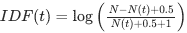

# 第三章：排序和基于内容的相关性

### 本章涵盖

+   执行查询并返回搜索结果

+   根据与进入查询的相关性对搜索结果进行排名

+   关键词匹配和过滤与基于向量的排名

+   使用函数查询控制并指定自定义排名函数

+   针对特定领域定制排名函数

搜索引擎本质上做三件事：摄取内容（*索引*）、返回与进入查询匹配的内容（*匹配*）以及根据某些衡量标准对返回的内容进行排序（*排序*）。可以添加额外的层，使用户能够提供更好的查询（自动建议、聊天机器人对话等）并从结果中提取更好的答案或使用大型语言模型总结结果（见第 14-15 章），但搜索引擎的核心功能是对索引数据进行匹配和排序。

*相关性* 是指返回的内容与查询匹配得有多好的概念。通常，被匹配的内容是文档，返回并排序的内容是匹配的文档及其相应的元数据。在大多数搜索引擎中，默认的相关性排序是基于一个分数，表示查询中的每个关键词与每个匹配文档中相同关键词匹配得有多好。或者，查询可以被映射到数值向量表示，此时分数表示查询向量与每个匹配文档的相似程度。最佳匹配产生最高的相关性分数，并显示在搜索结果的最顶部。相关性计算非常灵活，可以根据每个查询进行调整，从而实现复杂的排序行为。

在本章中，我们将概述如何计算相关性，如何通过函数查询轻松控制并调整相关性函数，以及如何实现流行的特定领域和用户特定相关性排名功能。

## 3.1 使用余弦相似度对查询和文档向量进行评分

在第 2.3 节中，我们展示了通过计算两个向量之间的余弦值来衡量两个向量相似度的概念。我们创建了代表不同食品项目的向量（数字列表，其中每个数字代表某些特征的强度），然后计算余弦值（向量之间角度的大小）以确定它们的相似度。在本节中，我们将扩展这一技术，讨论文本查询和文档如何映射到向量以用于排序目的。然后，我们将探讨一些流行的基于文本的特征加权技术以及如何将它们集成以创建改进的相关性排序公式。

##### 运行代码示例

书中的所有代码示例都可在预配置的 Docker 容器中运行的 Jupyter 笔记本中找到。这使得您可以通过单个命令（`docker compose up`）运行代码的交互式版本，而无需花费时间进行复杂的系统配置和依赖关系管理。代码示例也可以在多个搜索引擎和向量数据库上运行。有关如何配置和启动 Jupyter 笔记本以及如何在网络浏览器中跟踪的说明，请参阅附录 A。

为了简洁，本书中的列表可能省略了某些代码行，例如导入或辅助代码，但笔记本包含所有实现细节。

在本节中，我们将深入探讨本书的第一个代码示例。启动运行伴随 Jupyter 笔记本所需的 Docker 容器将有助于您跟随交互式代码示例。有关如何执行此操作的说明请参阅附录 A。

### 3.1.1 文本到向量的映射

在典型的搜索应用中，我们从一个文档集合开始，然后尝试根据它们与某些用户查询的匹配程度对文档进行排序。在本节中，我们将介绍将查询和文档的文本映射到向量的过程。

在上一章中，我们使用了搜索食品和饮料项目（如`苹果汁`）的例子，所以让我们在这里重用这个例子。假设我们有两个不同的文档，我们希望根据它们与查询的匹配程度进行排序。

*查询:* `apple` `juice`

```py
*Document 1:*
  Lynn: ham and cheese sandwich, chocolate cookie, ice water
  Brian: turkey avocado sandwich, plain potato chips, apple juice
  Mohammed: grilled chicken salad, fruit cup, lemonade
*Document 2:*
  Orchard Farms apple juice is premium, organic apple juice made from the
  freshest apples, never from concentrate. Its juice has received the
  regional award for best apple juice three years in a row.
```

如果我们将两个文档（包含总共 48 个单词）映射到向量，它们将映射到具有以下维度的 48 个单词向量空间：

```py
[a, and, apple, apples, avocado, award, best, brian, cheese, chicken, chips,
 chocolate, concentrate, cookie, cup, farms, for, freshest, from, fruit,
 grilled, ham, has, ice, in, is, its, juice, lemonade, lynn, made,
 mohammed, never, orchard, organic, plain, potato, premium, received,
 regional, row, salad, sandwich, the, three, turkey, water, years]
```

如果你在 2.3 节中回忆一下，我们提出将针对短语“苹果汁”的查询视为一个向量，该向量包含我们任何文档中每个单词的特征，对于“苹果”和“juice”这些术语，其值为`1`，而对于所有其他术语，其值为`0`。

由于术语“苹果”位于我们的 48 个单词向量空间的第 3 位，而“juice”位于第 28 位，因此短语“苹果汁”的查询向量将如图 3.1 所示。


##### 图 3.1 查询向量。对于`apple` `juice`的查询被映射到一个包含每个已知术语一个维度的向量，对于“苹果”和`juice`这些术语，其值为`1`，而对于所有其他术语，其值为`0`。

即使查询向量只包含两个非零值（代表“苹果”和“juice”的位置），它仍然包含所有其他可能维度的`0`值。表示这种包含每个可能值的向量，称为*密集向量表示*。

每个文档也根据其包含的每个术语映射到相同的向量空间：

```py
*Document 1:*
 [0 1 1 0 1 0 0 1 1 1 1 1 0 1 1 0 0 0 0 1 1 1 0 1
  0 0 0 1 1 1 0 1 0 0 1 1 1 0 0 0 0 1 1 0 0 1 1 0]

*Document 2:*
 [1 0 1 1 0 1 1 0 0 0 0 0 1 0 0 1 1 1 1 0 0 0 1 0
  1 1 1 1 0 0 1 0 1 1 0 0 0 1 1 1 1 0 0 1 1 0 0 1]
```

使用我们查询和文档的密集向量表示，我们现在可以使用线性代数来衡量我们的查询向量和每个文档向量之间的相似度。

### 3.1.2 计算密集向量表示之间的相似性

为了对文档进行排序，我们只需要遵循第二章中计算每个文档和查询之间余弦值的过程。然后，这个余弦值将成为我们根据其排序每个文档的相关性得分。

以下列表显示了如何在代码中表示查询和文档向量，以及如何计算查询和每个文档之间的余弦相似性。

##### 列表 3.1 计算向量之间的余弦相似性

```py
query_vector = numpy.array(
  [0, 0, 1, 0, 0, 0, 0, 0, 0, 0, 0, 0, 0, 0, 0, 0, 0, 0, 0, 0, 0, 0, 0, 0,
   0, 0, 0, 1, 0, 0, 0, 0, 0, 0, 0, 0, 0, 0, 0, 0, 0, 0, 0, 0, 0, 0, 0, 0])

doc1_vector = numpy.array(
  [0, 1, 1, 0, 1, 0, 0, 1, 1, 1, 1, 1, 0, 1, 1, 0, 0, 0, 0, 1, 1, 1, 0, 1,
   0, 0, 0, 1, 1, 1, 0, 1, 0, 0, 1, 1, 1, 0, 0, 0, 0, 1, 1, 0, 0, 1, 1, 0])

doc2_vector = numpy.array(
  [1, 0, 1, 1, 0, 1, 1, 0, 0, 0, 0, 0, 1, 0, 0, 1, 1, 1, 1, 0, 0, 0, 1, 0,
   1, 1, 1, 1, 0, 0, 1, 0, 1, 1, 0, 0, 0, 1, 1, 1, 1, 0, 0, 1, 1, 0, 0, 1])

def cosine_similarity(vector1, vector2):
  return dot(vector1, vector2) / (norm(vector1) * norm(vector2))

doc1_score = cosine_similarity(query_vector, doc1_vector)
doc2_score = cosine_similarity(query_vector, doc2_vector)

print_scores([doc1_score, doc2_score])
```

输出：

```py
Relevance Scores:
  doc1: 0.2828
  doc2: 0.2828
```

有趣的是……尽管这两个文档包含内容非常不同的长向量，但它们仍然获得了相同的相关性得分。这可能不是立即显而易见的，所以让我们通过只关注相关的特征来简化计算。

### 3.1.3 计算稀疏向量表示之间的相似性

理解上一节计算的关键在于意识到唯一相关的特征是查询和文档之间共享的特征。所有其他特征（出现在不匹配查询的文档中的单词）对判断一个文档是否比另一个文档排名更高没有影响。因此，我们可以从我们的向量中删除所有其他不重要的术语来简化示例，从密集向量表示转换为如图 3.2 所示的*稀疏向量表示*。


##### 图 3.2 稀疏向量表示仅包含“存在”的特征，与密集向量表示不同，密集向量表示还包含每个特征的 0 值条目。

在大多数搜索引擎评分操作中，我们倾向于处理稀疏向量表示，因为当基于少量特征评分时，它们更有效率。

此外，我们可以通过创建只包含“有意义的条目”——即查询中存在的术语——的向量来进一步简化我们的计算，如下列所示。

##### 列表 3.2 稀疏向量表示的余弦相似性

```py
query_vector = [1, 1] #[apple, juice]
doc1_vector  = [1, 1]
doc2_vector  = [1, 1]

doc1_score = cosine_similarity(query_vector, doc1_vector)
doc2_score = cosine_similarity(query_vector, doc2_vector)

print_scores([doc1_score, doc2_score])
```

输出：

```py
Relevance Scores:
  doc1: 1.0
  doc2: 1.0
```

注意到 doc1 和 doc2 仍然产生相同的相关性得分，但现在每个得分都是`1.0`。如果你还记得，余弦计算中的`1.0`得分意味着向量是完美匹配的，考虑到这两个向量都是相同的(`[1,` `1]`)，这是合理的。

事实上，你会注意到几个非常有趣的事情：

+   这个简化的稀疏向量表示计算仍然显示 doc1 和 doc2 返回等效的相关性得分，因为它们都匹配查询中的所有单词。

+   尽管密集向量表示相似性(`0.2828`)和稀疏向量表示相似性(`1.0`)之间的绝对得分不同，但相对于每种向量类型，得分仍然是相同的。

+   两个查询词（“apple”，“juice”）的特征权重在查询和每个文档之间是相同的，导致余弦得分为`1.0`。

##### 向量与向量表示

我们一直小心翼翼地使用“密集向量表示”和“稀疏向量表示”，而不是“密集向量”和“稀疏向量”。这是因为向量的概念与其表示之间存在概念上的区别，这种区别往往会导致混淆。

向量的稀疏性指的是向量特征中具有有效值的比例。具体来说，密集向量是指特征值大部分不为零的任何向量，而稀疏向量是指特征值大部分为零的任何向量，无论它们是如何存储或表示的。另一方面，向量*表示*涉及处理向量的数据结构。对于稀疏向量，为所有零值分配内存和存储空间可能是浪费的，因此我们通常会使用稀疏数据结构（如倒排索引）来仅存储非零值。以下是一个例子：

*密集向量*:

feature_1: **1.1**, feature_2: **2.3**, feature_3: **7.1**, feature_4: **5.2**, feature_5: **8.1**

*密集向量表示*: `[`**1.1**`,`**2.3**`,`**7.1**`,`**5.2**`,`**8.1**`]`

*稀疏向量表示*: N/A（该向量不是稀疏的，因此不能稀疏表示）

*稀疏向量*: feature_1: **1.1**, feature_2: **0**, feature_3: **0**, feature_4: **5.2**, feature_5: **0**

*密集向量表示*: `[`**1.1**`, 0.0, 0.0,`**5.2**`, 0.0 ]`

*稀疏向量表示*: `{ 1:`**1.1**`, 4:`**5.2**`}`, 或者在不需要特征位置的情况下，直接为 `[`**1.1**`,`**5.2**`]`

由于稀疏向量主要由零组成，其对应的稀疏向量表示几乎相反（只有非零值），因此人们经常混淆这些概念，错误地将稀疏向量的密集向量表示称为“密集向量”，甚至将具有许多维度的任何向量称为“密集向量”，将维度较少的向量称为“稀疏向量”。你可能会在其他文献中找到这种混淆，因此了解这种区别很重要。

由于我们的查询和文档向量都是稀疏向量（由于特征数是搜索索引中关键词的数量，大多数值都是零），在进行关键词搜索时使用稀疏向量表示是有意义的。

搜索引擎通过不仅将向量中的每个特征视为`1`（存在）或`0`（不存在），而是根据特征与匹配的**好坏**为每个特征提供分数来调整这些问题。

### 3.1.4 词语频率：衡量文档与词语匹配的程度

我们在上一个章节中遇到的问题是，我们的术语向量中的特征只表示“苹果”或“果汁”这个词是否存在于文档中，而不是每个文档代表这两个术语的好坏。如果查询中的每个术语存在时用 `1` 的值来表示每个术语，副作用是 doc1 和 doc2 将始终具有相同的余弦相似度评分，尽管从质量上讲，doc2 是一个更好的匹配，因为它更多地提到了苹果汁。

我们可以使用 *词频*（TF）来模拟“文档匹配得有多好”，而不是为每个现有术语使用 `1` 的值，词频是衡量术语在每个文档中出现的次数的度量。这里的想法是，一个术语在特定文档中出现的频率越高，该文档与查询的相关性就越大。

以下列表显示了具有每个术语在文档或查询中出现的次数作为特征权重的向量。

##### 列表 3.3 原始 TF 向量的余弦相似度

```py
query_vector   = [1, 1] #[apple:1, juice:1]
doc1_tf_vector = [1, 1] #[apple:1, juice:1]
doc2_tf_vector = [3, 4] #[apple:3, juice:4]

doc1_score = cosine_similarity(query_vector, doc1_tf_vector)
doc2_score = cosine_similarity(query_vector, doc2_tf_vector)

print_scores([doc1_score, doc2_score])
```

输出：

```py
Relevance Scores:
  doc1: 1.0
  doc2: 0.9899
```

与你预期的相反，doc1 被认为比 doc2 更好的余弦相似度匹配。这是因为“苹果”和“果汁”这两个词在查询和 doc1 中都以“相同的比例”出现（每个词在每个其他词出现一次），使它们在文本上最相似。换句话说，尽管 doc2 直观上更接近查询，因为它包含的查询中的词显著更多，但余弦相似度返回 doc1，因为它是查询的精确匹配，而 doc2 则不是。

由于我们的目标是使像 doc2 这样具有更高 TF 的文档得分更高，我们可以通过从余弦相似度切换到另一个评分函数来实现，例如 *点积* 或 *欧几里得距离*，随着特征权重的增加而增加。让我们使用点积 (`a` `.` `b`)，它等于余弦相似度乘以查询向量长度和文档向量长度的乘积：`a` `.` `b` `=` `|a|` `×` `|b|` `×` `cos(θ)`。点积将导致包含更多匹配项的文档得分更高，与余弦相似度相反，余弦相似度在查询和文档之间包含更多相似比例的匹配项时，会给文档更高的评分。

##### 短语匹配和其他相关性技巧

到现在为止，你可能想知道为什么我们一直将“苹果”和“果汁”作为独立术语处理，为什么我们不直接将“苹果汁”作为一个短语来提高匹配精确短语的文档的得分。短语匹配是我们将在本章后面讨论的许多简单相关性调整技巧之一。现在，我们将保持我们的查询处理简单，只处理单个关键词，以保持我们对主要目标的关注——解释基于向量的相关性评分和基于文本的关键词评分特征。

在下一个列表中，我们将余弦相似度替换为点积计算，以考虑文档向量在相关度计算中的幅度（随着每个查询术语的匹配次数增加而增加）。

##### 列表 3.4 TF 向量的点积

```py
query_vector   = [1, 1] #[apple:1, juice:1]
doc1_tf_vector = [1, 1] #[apple:1, juice:1]
doc2_tf_vector = [3, 4] #[apple:3, juice:4]

doc1_score = dot(query_vector, doc1_tf_vector)
doc2_score = dot(query_vector, doc2_tf_vector)

print_scores([doc1_score, doc2_score])
```

输出：

```py
Relevance Scores:
  doc1: 2
  doc2: 7
```

如您所见，doc2 现在对查询的相关度得分高于 doc1，这种改进与我们的直觉更吻合。请注意，相关度得分不再被限制在 `0` 和 `1` 之间，就像余弦相似度那样。这是因为点积考虑了文档向量的幅度，它可以随着额外匹配的关键词出现次数的无限制增加而增加。

虽然在我们的向量中用 TF 作为特征权重确实有所帮助，但文本查询表现出额外的挑战，需要考虑。到目前为止，我们的文档都包含查询中的每个术语，这与大多数现实世界场景不符。以下示例将更好地说明，当仅使用基于词频的加权对基于文本的稀疏向量相似度评分进行评分时，仍然存在的一些局限性。让我们从以下三个文本文档开始：

```py
*Document 1:*
  In light of the big reveal in her interview, the interesting
  thing is that the person in the wrong probably made a good
  decision in the end.

*Document 2:*
  My favorite book is the cat in the hat, which is about a crazy
  cat in a hat who breaks into a house and creates the craziest
  afternoon for two kids.

*Document 3:*
  My careless neighbors apparently let a stray cat stay in their
  garage unsupervised which resulted in my favorite hat that I
  let them borrow being ruined.
```

现在我们将这些文档映射到它们对应的（稀疏）向量表示，并计算相似度得分。以下列表根据原始 TF（术语计数）对文本相似度进行排序。

##### 列表 3.5 基于术语计数的文本相似度排序

```py
def term_count(content, term):
  tokenized_content = tokenize(content)
  term_count = tokenized_content.count(term.lower())
  return float(round(term_count, 4))

query = "the cat in the hat"
terms = tokenize(query)

query_vector = list(numpy.repeat(1, len(terms)))
doc_vectors = [[term_count(doc, term) for term in terms] for doc in docs]
doc_scores = [dot(v, query_vector) for v in doc_vectors]

print_term_count_scores(terms, doc_vectors, doc_scores)
```

输出：

```py
labels:  ['the', 'cat', 'in', 'the', 'hat']

query vector: [1, 1, 1, 1, 1]

Document Vectors:
  doc1: [5.0, 0.0, 4.0, 5.0, 0.0]
  doc2: [3.0, 2.0, 2.0, 3.0, 2.0]
  doc3: [0.0, 1.0, 2.0, 0.0, 1.0]

Relevance Scores:
  doc1: 14.0
  doc2: 12.0
  doc3: 4.0
```

虽然我们现在根据每个术语匹配的次数为每个文档接收不同的相关度得分，但结果的排序并不一定符合我们对哪些文档是最佳匹配的预期。直观上，我们更期望以下排序：

1.  *doc2:* 因为它关于书籍 *《戴帽子的猫》*

1.  *doc3:* 因为它与所有单词“the”、“cat”、“in”和“hat”相匹配

1.  *doc1:* 因为它只匹配单词“the”和“in”，尽管它包含它们很多次

这里的问题在于，由于每次一个术语出现时都被视为同等重要，因此相关度得分会随着该术语出现的每一次额外增加而毫无区别地增加。在这种情况下，doc1 获得了最高的得分，因为它包含总共 14 个术语匹配（第一个“the”出现五次，“in”出现四次，第二个“the”出现五次），比任何其他文档的总术语匹配数都要多。

然而，一个包含这些词语出现 14 次的文档被认为比只有一个匹配的文档相关 14 倍，这实际上并不合理。相反，如果一个文档与查询中的许多不同术语匹配，而不是反复匹配相同的术语，那么应该认为该文档更相关。通常，现实世界的 TF 计算通过将每个术语出现的次数计算为对数或平方根来衰减每个额外出现的影响（如图 3.3 所示）。此外，TF 通常也相对于文档长度进行归一化，通过将 TF 除以每个文档中的术语总数。由于较长的文档自然更有可能包含任何给定的术语更频繁，这有助于将分数归一化以考虑这些文档长度变化（根据图 3.3 的分母）。我们的最终、归一化的 TF 计算可以在图 3.3 中看到。


##### 图 3.3 标准化 TF 计算图。*t* 代表一个术语，`d` 代表一个文档。*TF* 等于当前文档中术语出现的次数的平方根（*f**[t,d]*）除以文档中的术语数量（`∑`*[t']*`[∈]`*d f**[t',d]*）。平方根衰减了术语每次额外出现的额外相关性贡献，而分母将这种衰减频率归一化到文档长度，以便较长的文档（包含更多术语）与较短的文档（包含较少术语）具有可比性。

TF 计算的变体很多，其中只有一些执行文档长度归一化（分母）或衰减额外术语出现的影响（这里使用平方根，有时使用对数）。例如，Apache Lucene（为 Solr、OpenSearch 和 Elasticsearch 提供搜索功能的库）计算 TF 时只计算分子部分的平方根，但在进行某些排名计算时，会乘以一个单独的文档长度规范（相当于我们方程中分母的平方根）。

今后，我们将使用这种归一化的 TF 计算来确保相同术语的额外出现继续提高相关性，但提高的速度会逐渐减慢。以下列表显示了生效的新 TF 函数。

##### 列表 3.6 基于 TF 的文本相似度排名

```py
def tf(term, doc):
  tokenized_doc = tokenize(doc)
  term_count = tokenized_doc.count(term.lower())
  doc_length = len(tokenized_doc)
  return numpy.sqrt(term_count / doc_length)

query = "the cat in the hat"
terms = tokenize(query)

query_vector = list(numpy.repeat(1, len(terms)))
doc_vectors = [[tf(term, doc) for term in terms] for doc in docs]
doc_scores = [dot(dv, query_vector) for dv in doc_vectors]

print_term_frequency_scores(terms, doc_vectors, doc_scores)
```

输出：

```py
Document TF Vector Calculations:
  doc1: [tf(doc1, "the"), tf(doc1, "cat"), tf(doc1, "in"),
         tf(doc1, "the"), tf(doc1, "hat")]
  doc2: [tf(doc2, "the"), tf(doc2, "cat"), tf(doc2, "in"),
         tf(doc2, "the"), tf(doc2, "hat")]
  doc3: [tf(doc3, "the"), tf(doc3, "cat"), tf(doc3, "in"),
         tf(doc3, "the"), tf(doc3, "hat")]

Document TF Vector Values:
Labels: ['the', 'cat', 'in', 'the', 'hat']
  doc1: [0.4303, 0.0, 0.3849, 0.4303, 0.0]
  doc2: [0.3111, 0.254, 0.254, 0.3111, 0.254]
  doc3: [0.0, 0.1961, 0.2774, 0.0, 0.1961]

Relevance Scores:
  doc1: 1.2456
  doc2: 1.3842
  doc3: 0.6696
```

标准化后的 `tf` 函数显示有所改进，正如预期的那样，doc2 现在排名最高。这主要是因为 doc1（匹配了“the”和“in”如此多次）中术语出现次数的衰减效应，使得每次额外出现对特征权重的贡献比之前出现要小。不幸的是，doc1 仍然排名第二高，所以即使改进后的 TF 计算也无法使更好的匹配文档 doc3 排名更高。

改进的下一步将是考虑术语的相对重要性，因为“cat”和“hat”在直觉上比“the”和“in”等常见词更重要。让我们修改我们的评分计算，通过引入一个新变量来包含每个术语的重要性，以纠正这一疏忽。

### 3.1.5 逆文档频率：衡量查询中术语的重要性

虽然 TF 在衡量文档与查询中每个术语的匹配程度方面已被证明是有用的，但它对区分查询中术语的重要性贡献甚微。在本节中，我们将介绍一种使用基于文档中关键词出现频率的显著性的技术。

术语的*文档频率*（DF）定义为搜索引擎中包含该术语的所有文档的总数，它作为衡量术语重要性的良好指标。这里的想法是，更具体或罕见的词（如“cat”和“hat”）通常比常见的词（如“the”和“in”）更重要。用于计算文档频率的函数如图 3.4 所示。


##### 图 3.4 文档频率计算。`D`是所有文档的集合，`t`是输入术语，`D[i]`是`D`中的第*i*个文档。一个术语的文档频率越低（`DF(t)`），在查询中看到的术语就越具体、越重要。

由于我们希望更重要的词得分更高，所以我们采用*逆文档频率*（IDF），如图 3.5 所示。


##### 图 3.5 逆文档频率。`|D|`是所有文档的总数，`t`是术语，`DF(t)`是文档频率。`IDF(t)`越低，术语就越不重要，越高，术语在查询中的相关性得分就应该越高。

沿用上一节中我们的“the cat in the hat”查询示例，一个逆文档频率（IDF）向量将看起来如下所示。

##### 列表 3.7 计算逆文档频率

```py
def idf(term):  #1
  df_map = {"the": 9500, "cat": 100,   #2
            "in": 9000, "hat": 50}    #2
  total_docs = 10000
  return 1 + numpy.log((total_docs+1) / (df_map[term] + 1))

terms = ["the", "cat", "in", "the", "hat"]
idf_vector = [idf(term) for term in terms] #3

print_inverse_document_frequency_scores(terms, idf_vector)
```

#1 决定查询中术语重要性的 IDF 函数

#2 模拟倒排索引中真实统计数据的文档计数

#3 IDF 是术语依赖的，不是文档依赖的，所以对于查询和文档都是相同的。

输出：

```py
IDF Vector Values:
  [idf("the"), idf("cat"), idf("in"), idf("the"), idf("hat")]

IDF Vector:
  [1.0513, 5.5953, 1.1053, 1.0513, 6.2786]
```

这些结果看起来很有希望。现在可以根据术语相对于查询的描述性或重要性来加权：

1.  “hat”: `6.2786`

1.  “cat”: `5.5953`

1.  “in”: `1.1053`

1.  “the”: `1.0513`

我们接下来将到目前为止学到的 TF 和 IDF 排名技术结合起来，形成一个平衡的相关性排名函数。

### 3.1.6 TF-IDF：基于文本相关性的平衡加权指标

我们现在有了基于文本的相关性排名的两个主要成分：

+   TF 衡量一个术语描述文档的好坏。

+   IDF 衡量每个术语的重要性。

大多数搜索引擎以及许多其他数据科学应用都使用这些因素的组合作为文本相似度评分的基础，使用图 3.6 中的函数的变体。


##### 图 3.6 TF-IDF 分数。将 TF 和 IDF 计算结合成一个平衡的文本排名相似度分数。

在此改进的特征加权函数到位后，我们最终可以计算一个平衡的相关性分数如下。

##### 列表 3.8 计算 `the cat in the hat` 查询的 TF-IDF

```py
def tf_idf(term, doc):
  return TF(term, doc) * IDF(term)***2*

query = "the cat in the hat"
terms = tokenize(query)

query_vector = list(numpy.repeat(1, len(terms)))
doc_vectors = [[tf_idf(doc, term) for term in terms] for doc in docs]
doc_scores = [[dot(query_vector, dv)] for dv in doc_vectors]

print_tf_idf_scores(terms, doc_vectors, doc_scores)
```

输出：

```py
Document TF-IDF Vector Calculations
  doc1: [tf_idf(doc1, "the"), tf_idf(doc1, "cat"), tf_idf(doc1, "in"),
         tf_idf(doc1, "the"), tf_idf(doc1, "hat")]
  doc2: [tf_idf(doc2, "the"), tf_idf(doc2, "cat"), tf_idf(doc2, "in"),
         tf_idf(doc2, "the"), tf_idf(doc2, "hat")]
  doc3: [tf_idf(doc3, "the"), tf_idf(doc3, "cat"), tf_idf(doc3, "in"),
         tf_idf(doc3, "the"), tf_idf(doc3, "hat")]

Document TF-IDF Vector Scores
Labels: ['the', 'cat', 'in', 'the', 'hat']
  doc1: [0.4756, 0.0, 0.4703, 0.4755, 0.0]
  doc2: [0.3438, 7.9521, 0.3103, 0.3438, 10.0129]
  doc3: [0.0, 6.1399, 0.3389, 0.0, 7.7311]

Relevance Scores:
  doc1: 1.4215
  doc2: 18.9633
  doc3: 14.2099
```

最后，我们的搜索结果变得有意义！doc2 获得最高分数，因为它与最重要的单词匹配得最多，其次是包含所有单词但出现次数较少的 doc3，然后是只包含大量不相关单词的 doc1。

这种 TF-IDF 计算是许多搜索引擎相关性算法的核心，包括默认的相似度算法，即 BM25，目前它被用于大多数搜索引擎中的基于关键词的排名。我们将在下一节介绍 BM25。

## 3.2 控制相关性计算

在上一节中，我们展示了如何将查询和文档表示为向量，以及如何使用余弦相似度或其他相似度度量（如点积）作为相关性函数来比较查询和文档。我们介绍了 TF-IDF 排名，它可以用于创建一个特征权重，平衡基于向量的每个术语的强度（TF）和术语的重要性（IDF）。

在本节中，我们将展示如何在搜索引擎中指定和控制完整的相关性函数，包括常见的查询功能、将查询建模为函数、排名与过滤，以及应用不同类型的提升技术。

### 3.2.1 BM25：行业标准默认文本相似度算法

BM25 是 Apache Lucene、Apache Solr、Elasticsearch、OpenSearch 以及许多其他搜索引擎中默认的相似度算法。BM25（Okapi “最佳匹配”版本 25 的缩写）首次于 1994 年发表，它在许多基于文本的排名评估中显示出比标准 TF-IDF 余弦相似度排名的改进。目前，它仍然优于大多数未微调的 LLMs 的嵌入表示的排名模型，因此它作为基于关键词排名的良好基线。

BM25 仍然使用 TF-IDF 作为其核心，但它还包括其他几个参数，提供了对 TF 饱和点和文档长度归一化等因素的更多控制。它还总结了每个匹配关键字的权重，而不是计算余弦值。

全部 BM25 计算如图 3.7 所示。变量定义如下：

+   *t* = 术语；*d* = 文档；*q* = 查询。

+   *freq*(*t*, >*d*) 是一个简单的 TF，Σ[𝑡ϵ𝑑] 1 显示了术语 `t` 在文档 `d` 中出现的次数。

+   

+   是 BM25 中使用的 IDF 的变体，其中 *N* 是文档总数，*N*(*t*) 是包含项 *t* 的文档数。

+   |*d*| 是文档 *d* 中的项数。

+   *avgdl* 是索引中每个文档的平均项数。

+   *k* 是一个通常在 1.2 到 2.0 之间变化的自由参数，它增加了 TF 饱和点。

+   *b* 是一个通常设置为约 0.75 的自由参数。它增加了文档归一化的效果。


##### 图 3.7 BM25 评分函数。它仍然主要使用简化的 *TF* 和 *IDF* 的变体，但它提供了更多控制每个额外出现项对分数贡献（`k` 参数）以及基于文档长度归一化分数（`b` 参数）的程度。

您可以看到，分子包含 *freq*（简化的 TF）和 *IDF* 参数，而分母增加了新的归一化参数 *k* 和 *b*。TF 饱和点由 *k* 控制，使得随着 *k* 的增加，相同项的额外匹配计数减少，由 *b* 控制，随着其增加，对文档长度归一化的控制水平更高。每个项的 *TF* 计算为 *freq*(*t*,*d*) / (*freq*(*t*,*d*) + *k* · (1 – *b* + *b* · |*d*| / *avgd**l*))，这比我们在图 3.3 中使用的方法计算更复杂。

从概念上讲，BM25 只是提供了一个比传统的 TF-IDF 更优化的 TF 归一化方法。还值得注意的是，存在几种 BM25 算法的变体（BM25F，BM25+），并且根据您使用的搜索引擎，您可能会看到一些轻微的修改和优化。

在测试 BM25 时，我们不重新实现所有这些数学公式，现在让我们切换到使用我们的搜索引擎并查看它的计算性能。让我们首先在搜索引擎中创建一个集合（列表 3.9）。一个集合包含特定的架构和配置，它是我们将索引文档、搜索、排名和检索搜索结果的基本单位。然后我们将索引一些文档（使用我们之前的 `the` `cat` `in` `the` `hat` 示例），如列表 3.10 所示。

##### 列表 3.9 创建 `cat_in_the_hat` 集合

```py
engine = get_engine() #1
collection = engine.create_collection("cat_in_the_hat")
```

#1 默认情况下，该引擎设置为 Apache Solr。请参阅附录 B 以使用其他支持的搜索引擎和向量数据库。

输出：

```py
Wiping "cat_in_the_hat" collection
Creating "cat_in_the_hat" collection
Status: Success
```

##### 列表 3.10 向集合添加文档

```py
docs = [{"id": "doc1",
         "title": "Worst",
         "description": """The interesting thing is that the person in the
                           wrong made the right decision in the end."""},
        {"id": "doc2",
         "title": "Best",
         "description": """My favorite book is the cat in the hat, which is
                           about a crazy cat who breaks into a house and
                           creates a crazy afternoon for two kids."""},
        {"id": "doc3",
         "title": "Okay",
         "description": """My neighbors let the stray cat stay in their
                           garage, which resulted in my favorite hat that
                           I let them borrow being ruined."""}]
collection.add_documents(docs)
```

输出：

```py
Adding Documents to 'cat_in_the_hat' collection
Status: Success
```

将我们的文档添加到搜索引擎后，我们现在可以发出查询并查看完整的 BM25 分数。以下列表使用查询 `the cat in the hat` 并请求每个文档的相关性计算解释。

##### 列表 3.11 通过和检查 BM25 相似度分数进行排名

```py
query = "the cat in the hat"
request = {"query": query,
           "query_fields": ["description"],
           "return_fields": ["id", "title", "description", "score"],
           "explain": True}

response = collection.search(**request)
display_search(query, response["docs"])
```

输出：

```py
*Query*: the cat in the hat
*Ranked Docs*:
[{'id': 'doc2',
'title': ['Best'],
'description': ['My favorite book is the cat in the hat, which is about a
↪crazy cat who breaks into a house and creates a crazy afternoon for
↪two kids.'],
'score': 0.68231964, '[explain]': '
  0.68231964  = sum of:
    0.15655403 = weight(description:the in 1) [SchemaSimilarity], result of:
      0.15655403 = score(freq=2.0), product of:
        2.0 = boost
        0.13353139 = idf, computed as log(1 + (N - n + 0.5) / (
          n + 0.5)) from:
          3 = n, number of documents containing term
          3 = N, total number of documents with field
        0.58620685 = tf, computed as freq / (freq + k1 * (
          1 - b + b * dl / avgdl)) from:
          2.0 = freq, occurrences of term within document
          1.2 = k1, term saturation parameter
          0.75 = b, length normalization parameter
          28.0 = dl, length of field
          22.666666 = avgdl, average length of field
    0.19487953 = weight(description:hat in 1) ...
    0.27551934 = weight(description:cat in 1) ...
    0.05536667 = weight(description:in in 1) ...
'}, {'id': 'doc3',
'title': ['Okay'],
'description': ['My neighbors let the stray cat stay in their garage, which
↪resulted in my favorite hat that I let them borrow being ruined.'],
'score': 0.62850046, '[explain]': '
  0.62850046 = sum of:
    0.21236044  = weight(description:the in 2) ...
    0.08311336 = weight(description:hat in 2) ...
    0.21236044 = weight(description:cat in 2) ...
    0.120666236 = weight(description:in in 2) ...
'}, {'id': 'doc1',
'title': ['Worst'],
'description': ['The interesting thing is that the person in the wrong made
↪the right decision in the end.'],
'score': 0.3132525,
'[explain]': '
  0.3132525 = sum of:
    0.089769006 = weight(description:the in 0) ...
    0.2234835 = weight(description:in in 0) ...
'}]
```

对于排名最高的文档，doc2，你可以看到使用 `tf` 和 `idf` 组件的部分分数计算，并且你可以看到其他两个文档中每个匹配术语的高级分数。如果你想深入了解数学，可以检查 Jupyter 笔记本中的完整计算。

虽然 BM25 计算比 TF-IDF 特征权重计算更复杂，但它仍然将 TF-IDF 作为其计算的核心部分。因此，BM25 排名与列表 3.8 中的 TF-IDF 计算的相对顺序相同：

```py
*Ranked Results (Listing 3.8: TF-IDF Cosine Similarity)*:
  doc2: 0.998
  doc3: 0.9907
  doc1: 0.0809

*Ranked Results (Listing 3.9: BM25 Similarity)*:
  doc2: 0.6878265
  doc3: 0.62850046
  doc1: 0.3132525
```

我们对 `the cat in the hat` 的查询仍然可以被视为每个术语的 BM25 分数的向量：`["the", "cat", "in", "the", "hat"]`。

可能不明显的是，这些术语的每个特征权重实际上是可以覆盖的函数。我们不应该将查询视为一系列关键词，而可以将查询视为由其他函数组成的数学函数，其中一些函数将关键词作为输入并返回用于相关性计算的数值（分数）。例如，我们的查询可以表示为以下向量：

```py
[ query("the"), query("cat"), query("in"), query("the"), query("hat") ]
```

这里的 `query` 函数只是计算传入术语相对于所有评分文档的 BM25 值。因此，整个查询的 BM25 是每个术语 TF-IDF 的总和。在 Solr 查询语法中，这将表示为

```py
{!func}query("the") {!func}query("cat") {!func}query("in")
{!func}query("the") {!func}query("hat")
```

如果我们执行这个“函数化”版本的查询，我们将得到与直接执行查询完全相同的相关性分数。以下列表显示了执行此版本查询的代码。

##### 列表 3.12 使用 `query` 函数进行文本相似度

```py
query = '{!func}query("the") {!func}query("cat") {!func}query("in")
       ↪{!func}query("the") {!func}query("hat")'
request = {"query": query,
           "query_fields": "description",
           "return_fields": ["id", "title", "score"]}

response = collection.search(**request)
display_search(query, response["docs"])
```

输出：

```py
*Query:*
 {!func}query("the") {!func}query("cat") {!func}query("in")
  {!func}query("the") {!func}query("hat")
*Results:*
 [{'id': 'doc2', 'title': ['Best'], 'score': 0.6823196},
  {'id': 'doc3', 'title': ['Okay'], 'score': 0.62850046},
  {'id': 'doc1', 'title': ['Worst'], 'score': 0.3132525}]
```

如预期的那样，分数与之前相同——我们只是用显式函数替换了之前隐式函数的位置。

### 3.2.2 函数，到处都是函数！

我们刚刚遇到了 `query` 函数（在前一节的末尾），它对关键词执行默认（BM25）相似度计算。理解查询的每一部分实际上都是一个可配置的评分函数，这为操作相关性算法打开了巨大的可能性。查询中可以使用哪些*其他*类型的函数？我们能否在我们的评分计算中使用其他特征——可能是一些非基于文本的特征？

这里是一个部分列表，列出了常用的一些函数和评分技术，这些技术通常用于影响相关性分数：

+   *地理空间增强*—距离查询用户较近的文档应该排名更高。

+   *日期增强*—较新的文档应该获得更高的相关性提升。

+   *流行度增强*—更受欢迎的文档应该获得更高的相关性提升。

+   *字段增强*—在特定字段中匹配的术语应该比其他字段获得更高的权重。

+   *类别增强*—与查询术语相关的文档应该获得更高的相关性提升。

+   *短语增强*——与查询中的多词短语匹配的文档应该比仅匹配单独单词的文档排名更高。

+   *语义扩展*——包含与查询关键词和上下文高度相关的其他单词或概念的文档应该被增强。

##### 使用本书的搜索引擎无关的搜索 API

在整本书和代码库中，我们实现了一套 Python 库，提供了一组通用的 API 用于索引文档（`collection.add_documents(documents)` 或 `collection.write(dataframe)`），查询文档（`collection.search(**query_parameters)`），以及执行其他搜索引擎操作。这允许你无论选择哪种支持的搜索引擎或向量数据库，都可以在书中和相应的笔记本中执行相同的代码，将特定引擎的语法创建委托给客户端库。有关如何在引擎之间无缝切换的详细信息，请参阅附录 B。

虽然这些针对 AI 驱动的搜索的通用方法非常强大，但在某些情况下，了解搜索引擎底层实现的细节也很有帮助，对于更复杂的示例，甚至可能难以使用高级引擎无关的 API 完全表达其功能。因此，我们偶尔也会在书中包含默认搜索引擎（Apache Solr）的原始搜索引擎语法。如果你不熟悉 Apache Solr 及其语法，请不要过于纠结于细节。重要的是要充分理解这些概念，以便将它们应用到你的选择搜索引擎中。

这些技术（以及更多）被大多数主要搜索引擎支持。例如，字段增强可以通过在`query_fields`中指定的任何字段后附加`^BOOST_AMOUNT`在我们的搜索客户端中实现：

```py
*Generic search request syntax:*
 {"query": "the cat in the hat",
  "query_fields": ["title¹⁰", "description².5"]}
```

此查询请求为`title`字段中的匹配项提供 10 倍的相关性增强，为`description`字段中的匹配项提供 2.5 倍的相关性增强。当映射到 Solr 语法时，它看起来像这样：

```py
*Solr request syntax:*
 {"query": "the cat in the hat",
  "params": {"defType": "edismax",
             "qf": "title¹⁰ description².5"}}
```

每个搜索引擎都不同，但许多这些技术都内置在 Solr 的特定查询解析器中，无论是通过查询语法还是通过查询解析器选项，就像刚刚展示的`edismax`查询解析器一样。

在全短语匹配、双词短语和三词短语上增强，也是 Solr 的`edismax`查询解析器的原生功能：

+   在`title`字段中包含确切短语`"the cat in the hat"`的文档：

```py
*Solr request syntax:*
 {"query": "the cat in the hat",
  "params": {"defType": "edismax",
             "qf": "title description",
             "pf": "title"}}
```

+   在`title`或`description`字段中包含双词短语`"the cat"`、`"cat in"`、`"in the"`或`"the hat"`的文档：

```py
*Solr request syntax:*
 {"query": "the cat in the hat",
  "params": {"defType": "edismax",
             "qf": "title description",
             "pf2": "title description"}}
```

+   在`description`字段中包含三词短语`"the cat in"`或`"in the hat"`的文档：

```py
*Solr request syntax:*
 {"query": "the cat in the hat",
  "params": {"defType": "edismax",
             "qf": "title description",
             "pf3": "description"}}
```

许多其他的相关性提升技术需要使用函数查询来构建自定义特征。例如，如果我们想创建一个查询，只提升运行搜索的用户地理位置最近的文档的相关性排名，我们可以发出以下 Solr 查询：

```py
*Solr request syntax:*
 {"query": "*",
  "sort": "geodist(location, $user_latitude, $user_longitude) asc",
  "params": {"user_latitude": 33.748,
             "user_longitude": -84.39}}
```

最后一个查询使用 `sort` 参数严格按 `geodist` 函数对文档进行排序，该函数接受文档的位置字段名称以及用户的纬度和经度作为参数。当考虑单个特征时，这效果很好，但如果我们想根据许多特征构建更复杂的排序怎么办？为了实现这一点，我们可以更新我们的查询，在计算相关性得分时应用多个函数，然后按相关性得分进行排序：

```py
*Solr request syntax:*
 {"query": "{!func}scale(query($keywords),0,25)
    ↪{!func}recip(geodist($lat_long_field,$user_latitude,
     ↪$user_longitude),1,25,1)
     ↪{!func}recip(ms(NOW/HOUR,modify_date),3.16e-11,25,1)
    ↪{!func}scale(popularity,0,25)",
  "params": {"keywords": "basketball",
             "lat_long_field": "location",
             "user_latitude": 33.748,
             "user_longitude" -84.391}}
```

该查询有几个有趣的特性：

+   它构建了一个包含四个特征的查询向量：关键词的 BM25 相关性得分（越高越好）、地理距离（越低越好）、发表日期（越新越好）和流行度（越高越好）。

+   每个特征值都在 `0` 到 `25` 之间缩放，以便它们都是可比较的，每个特征的最好得分是 `25`，最差得分接近 `0`。

+   因此，“完美得分”将累计到 `100`（所有 4 个特征得分 `25`），最差得分将大约为 `0`。

+   由于 `25` 的相对贡献是作为每个函数查询的一部分指定的，因此我们可以轻松地实时调整任何特征的权重，以影响最终的相关性计算。

通过最后一个查询，我们已经完全将相关性计算掌握在自己手中，通过建模相关性特征并赋予它们权重。虽然这非常强大，但仍需要大量的手动工作来确定给定领域最重要的特征，并调整它们的权重。在第十章中，我们将介绍构建机器学习排名模型的过程，以自动为我们做出这些决定（这个过程称为 *学习排名*）。目前，我们的目标只是理解在查询向量中建模特征以及如何编程控制它们的权重。

##### 深入了解函数查询

如果你想了解更多关于如何利用 Solr 的函数查询的信息，我们建议阅读我们之前的一本书《Solr in Action》的第七章，由 Trey Grainger 和 Timothy Potter 撰写（Manning，2014；[`mng.bz/n0Y5`](https://mng.bz/n0Y5)）。要查看 Solr 中可用的所有函数查询的完整列表，你还可以查看 Solr 参考指南中函数查询部分的文档（[`mng.bz/vJop`](https://mng.bz/vJop)）。如果你使用的是不同的搜索引擎，请查看它们的文档以获取类似指南。

我们已经看到了利用函数作为查询特征的力量，但到目前为止，我们的例子都是所谓的“加性”提升，其中每个函数计算的值之和构成了最终的相关性得分。通过“乘性”提升以更模糊、更灵活的方式组合函数也经常很有用，我们将在下一节中介绍。

### 3.2.3 选择乘性提升与加性提升用于相关性函数

最后一个要讨论的话题，关于我们如何控制我们的相关性函数，是乘性提升与加性提升之间的比较。

到目前为止的所有例子中，我们都将多个特征添加到我们的查询向量中以贡献得分。例如，以下 Solr 查询都将产生等效的相关性计算，假设它们被过滤到相同的结果集（即，`filters=["the cat in the hat"]`）：

```py
*Text query (score + filter):*
 {"query": "the cat in the hat"}

*Function Query (score only, no filter):*
 {"query": '{!func}query("the cat in the hat")'}

*Multiple Function Queries (score only, no filter):*
 {"query": '{!func}query("the")
          ↪{!func}query("cat")
          ↪{!func}query("in")
          ↪{!func}query("the")
          ↪{!func}query("hat")'}

*Boost Query (score only, no filter):*
 {"query": "*",
  "params": {"bq": "the cat in the hat"}}
```

这些例子中的相关性提升类型被称为*加性提升*，并且很好地映射到我们将查询视为仅仅是一个需要跨文档比较其相似性的特征向量的概念。在加性提升中，随着更多特征的添加，每个特征的相对贡献会减少，因为总得分只是所有特征得分的总和。

相比之下，*乘性提升*允许文档的整个计算相关性得分通过一个或多个函数进行缩放（乘法）。乘性提升使得提升可以“叠加”在一起，避免了在 3.2.2 节中我们不得不对查询的不同部分分别约束权重的情况。在那里，我们必须确保关键词得分、地理距离、年龄和文档的流行度各自缩放到相关性得分的 25%，以便它们加起来达到最大得分 100%。

要在 Apache Solr 中提供乘性提升，你可以在查询向量中使用`boost`查询解析器（语法：`{!boost …}`），或者如果你使用的是`edismax`查询解析器，可以使用简化的`boost`查询参数。以下两个查询将文档的相关性得分乘以`popularity`字段值的 10 倍：

```py
{"query": "the cat in the hat",
 "params": {"defType": "edismax",
            "boost": "mul(popularity,10)"}}

{"query": "{!boost b=mul(popularity,10)} the cat in the hat"}
```

在这个例子中，对`the cat in the hat`的查询仍然使用加性提升（每个关键词的 BM25 值相加），但最终得分乘以`popularity`字段值的 10 倍。这种乘性提升允许流行度独立于其他任何特征来调整相关性得分。

通常，乘法增强提供了更大的灵活性，可以在不显式预定义一个考虑每个潜在贡献因素的关联公式的情况下，结合不同的关联特征。另一方面，这种灵活性可能导致意外的后果，如果特定特征的乘法增强值过高，以至于掩盖了其他特征。相比之下，加法增强可能难以管理，因为你需要显式地调整它们，以便在保持对整体得分的可预测贡献的同时进行组合。然而，通过这种显式缩放，你可以保持对关联得分计算和得分范围的紧密控制。无论是加法增强还是乘法增强，都可能很有用，因此最好考虑手头的问题并实验哪种方法能带来最佳结果。

我们现在已经介绍了控制搜索引擎中相关性排名的主要方法，但文档的匹配和过滤通常同样重要，因此我们将在下一节中介绍它们。

### 3.2.4 区分文档的匹配（过滤）与排名（评分）

我们已经将查询和文档视为特征向量，但到目前为止，我们主要讨论了搜索作为一个计算向量相似度（如余弦或点积）的过程，或者将查询中每个特征（关键词或函数）的文档得分相加。

一旦文档被索引，执行查询涉及两个主要步骤：

+   *匹配*—将结果过滤到一组已知的可能答案中

+   *排名*—按相关性对所有可能的答案进行排序

我们经常可以完全跳过第一步（匹配），仍然在第一页（以及许多页面）上看到完全相同的结果，因为最相关的结果通常排名最高，因此会首先显示。如果你回想起第二章，我们甚至看到了一些向量得分计算（比较食品项目的特征向量——即“苹果汁”与“甜甜圈”），在这种情况下，我们根本无法过滤结果。我们不得不首先对每个文档进行评分，以确定哪些文档基于相关性返回。在这种情况下（使用密集向量嵌入），我们甚至没有可以作为过滤器的关键词或其他属性。

那么，如果初始匹配阶段实际上是可选的，为什么还要进行它呢？一个明显的答案是它提供了显著的性能优化。我们不必遍历每一份文档并计算关联得分，通过首先将初始结果过滤到一组较小的、逻辑上匹配的文档集合中，我们可以大大加快我们的关联计算和搜索引擎的整体响应时间。

能够过滤结果集还有其他好处，例如我们可以提供分析，如匹配文档的数量或文档中找到的特定值的计数（称为**维面**或**聚合**）。从搜索结果中返回维面和类似的聚合元数据有助于用户随后根据特定值进行过滤，以进一步探索和细化他们的结果集。最后，在许多场景中，“具有逻辑匹配”应被视为排名函数中最重要的特征之一，因此简单地根据逻辑匹配进行过滤可以极大地简化相关性计算。我们将在下一节讨论这些权衡。

### 3.2.5 逻辑匹配：查询中术语之间关系的加权

我们刚才提到，在评分之前过滤结果主要是性能优化，并且无论你过滤结果还是只进行相关性排名，搜索结果的前几页可能看起来都一样。

然而，这只有在你的相关性函数成功包含能够适当提升更好逻辑匹配的特征时才成立。例如，考虑以下查询的期望差异：

1.  `"statue of liberty"`

1.  `statue AND of AND liberty`

1.  `statue OR of OR liberty`

1.  `statue of liberty`

从逻辑匹配的角度来看，第一个查询将非常精确，仅匹配包含“statue of liberty”这一**精确**短语的文档。第二个查询将仅匹配包含所有术语“statue”、“of”和“liberty”的文档，但不一定是作为一个短语。第三个查询将匹配包含这三个术语中的任何一个的任何文档，这意味着仅包含“of”的文档将匹配，但包含“statue”和“liberty”的文档应该由于 BM25 评分计算的权重而排名更高。

理论上，如果短语提升作为一项功能被启用，包含完整短语的文档可能会排名最高，其次是包含所有术语的文档，然后是包含任何单词的文档。假设这种情况发生，无论你过滤它们以进行逻辑布尔匹配，还是仅根据相关性函数进行排序，你应该都会看到类似的结果顺序。

然而，在实践中，用户通常认为他们的查询的逻辑结构与他们期望看到的文档高度相关，因此尊重这种逻辑结构并在排名之前进行过滤可以使你移除用户查询表明可以安全移除的结果。

有时用户查询的逻辑结构可能是模糊的，例如，在我们的第四个例子中：查询`statue` `of` `liberty`。这逻辑上意味着`statue` `AND` `of` `AND` `liberty`，`statue` `OR` `of` `OR` `liberty`，还是更细微的，例如`(statue` `AND` `of)` `OR` `(statue` `AND` `liberty)` `OR` `(of` `AND` `liberty)`，这本质上意味着“至少匹配三个词中的两个”。使用我们搜索 API 中的“最小匹配”(`min_match`)参数，您可以轻松控制这些匹配阈值，甚至可以针对每个查询进行控制：

+   100%的查询词必须匹配（相当于`statue` `AND` `of` `AND` `liberty`）：

```py
*Generic search request syntax:*
 {"query": "statue of liberty",
  "min_match": "100%"}

*Solr request syntax:*
 {"query": "statue of liberty",
  "params": {"defType": "edismax",
             "mm": "100%"}}
```

+   至少有一个查询词必须匹配（相当于`statue` `OR` `of` `OR` `liberty`）：

```py
*Generic search request syntax:*
 {"query": "statue of liberty",
  "min_match": "1"}

*Solr request syntax:*
 {"query": "statue of liberty",
  "params": {"defType": "edismax",
             "mm": "1"}}
```

+   至少有两个查询词必须匹配（相当于`(statue` `AND` `of)` `OR (statue` `AND` `liberty)` `OR` `(of` `AND` `liberty)`）：

```py
*Generic search request syntax:*
 {"query": "statue of liberty",
  "query_parser": "edismax",
  "min_match": "2"}

*Solr request syntax:*
 {"query": "statue of liberty",
  "params": {"defType": "edismax",
             "mm": "2"}}
```

我们 Python API 中的`min_match`参数支持指定必须匹配的最小百分比（0%到 100%）或必须匹配的词数（1 到*N*个词）。此参数与 Solr 的`mm`参数以及 OpenSearch 和 Elasticsearch 的`minimum_should_match`参数相对应。除了接受匹配的百分比或词数外，这些引擎还支持类似`mm=2<-30% 5<3`的步进函数。此步进函数的例子意味着“如果少于 2 个词，则所有词都必须匹配；如果少于 5 个词，则最多 30%的词可以缺失；如果 5 个或更多词，则至少必须有 3 个词”。当使用 Solr 时，`mm`参数与`edismax`查询解析器一起工作，这是我们将在本书中用于文本匹配查询的主要查询解析器（如果 Solr 配置为您的引擎，请参阅附录 B）。您可以在 Solr 参考指南的“扩展 DisMax 参数”部分中查找有关如何使用这些最小匹配功能微调您的逻辑匹配规则的更多详细信息（[`mng.bz/mRo8`](https://mng.bz/mRo8)）。

当思考构建相关性函数时，过滤和评分的概念可能会混淆，尤其是大多数搜索引擎都会为它们的主要查询参数执行这两者。我们将在下一节尝试分离这些关注点。

### 3.2.6 分离关注点：过滤与评分

在 3.2.4 节中，我们区分了匹配和排名的概念。结果的匹配是逻辑的，通过过滤搜索结果到文档的子集来实现，而结果的排名是定性的，通过相对于查询评分所有文档然后按该计算分数排序来实现。在本节中，我们将介绍一些技术，通过清晰地分离过滤和评分的关注点，以提供最大限度的灵活性来控制匹配和排名。

我们的搜索 API 有两种主要方式来控制过滤和评分：`query`和`filters`参数。考虑以下请求：

```py
*Generic search request syntax:*
 {"query": "the cat in the hat",
  "query_fields": ["description"],
  "filters": [("category", "books"), ("audience", "kid")],
  "min_match": "100%"}

*Solr request syntax:*
 {"query": "the cat in the hat",
  "filters": ["category:books", "audience:kid"],
  "params": {"qf": ["description"],
             "mm": "100%",
             "defType": "edismax"}}
```

在这个查询中，搜索引擎被指示过滤可能的结果集，只保留 `category` 字段值为“books”和 `audience` 字段值为“kid”的文档。然而，除了这些过滤器之外，查询本身也充当过滤器，因此结果集进一步过滤，只保留 `description` 字段中包含（100%）“the”、“cat”、“in”和“hat”值的文档。

`query` 和 `filters` 参数之间的逻辑区别在于，`filters` 只作为过滤器，而 `query` 则作为 *同时* 过滤器和相关性排名的特征向量。`query` 参数的这种双重用途对于查询来说是帮助默认行为，但将过滤和评分的关注点混合在同一个参数中对于更高级的查询来说可能不是最佳选择，尤其是如果我们只是试图操纵相关性计算而不是任意从我们的文档集中删除结果。

有几种方法可以解决这个问题：

+   将 `query` 参数建模为一个函数（函数只计算相关性，不进行过滤）：

```py
*Solr request syntax:*
 {"query": '{!func}query("{!edismax qf=description mm=100%
 ↪v=$user_query}")',
  "filters": "{!cache=false v=$user_query}",
  "params": {"user_query": "the cat in the hat"}}
```

+   使你的查询匹配所有文档（不进行过滤或评分）并应用一个提升查询 (`bq`) 参数来影响相关性而不进行评分：

```py
*Solr request syntax:*
 {"query": "*",
  "filters": "{!cache=false v=$user_query}",
  "params": {"bq": "{!edismax qf=description mm=100% v=$user_quer}",
             "user_query": "the cat in the hat"}}
```

`query` 参数既过滤又根据相关性提升，`filters` 只过滤，而 `bq` 只提升。前两种方法在逻辑上是等价的，但我们推荐第二种选项，因为它使用专门的 `bq` 参数更为简洁，该参数旨在贡献于相关性计算而不进行过滤。

你可能已经注意到，查询的两个版本也包含一个过滤查询 `{!cache=false` `v=$user_query}`，它根据 `user_query` 进行过滤。由于 `query` 参数故意不再过滤我们的搜索结果，因此如果还想过滤到用户输入的查询，现在这个 `filters` 参数是必需的。特殊的 `cache=false` 参数用于关闭过滤的缓存。在 Solr 中，默认情况下会开启过滤的缓存，因为过滤通常在多个请求中重复使用。由于 `user_query` 参数是用户输入的，并且在这种情况下变化很大（在请求之间不经常重复使用），因此没有必要将这些值污染搜索引擎的缓存。如果你尝试在不关闭缓存的情况下过滤用户输入的查询，这将浪费系统资源，并可能减慢你的搜索引擎速度。

在这里的主旨是，可以干净地将逻辑过滤与排名特征分离，以保持对搜索结果的完全控制和灵活性。虽然对简单的基于文本的排名来说，这种努力可能有些过度，但当尝试构建更复杂的排名函数时，分离这些关注点变得至关重要。

现在你已经了解了如何构建这类专门用途的排名函数的机制，让我们以简要讨论如何将这些技术应用于实现用户和领域特定的相关性排名来结束本章。

## 3.3 实现用户和领域特定的相关性排名

在 3.2 节中，我们介绍了如何动态修改我们的查询到文档相似度算法的参数。这包括传递我们自己的函数作为有助于评分的特征，除了基于文本的相关性排名之外。

虽然基于文本的相关性排名，使用 BM25、TF-IDF、向量余弦相似度或其他基于词频的统计方法可以提供不错的通用搜索相关性，但它无法与良好的领域特定相关性因素相媲美。以下是一些在各个领域中最常关注的领域特定因素：

+   *餐厅搜索*—地理位置接近性、用户特定的饮食限制、用户特定的口味偏好、价格范围

+   *新闻搜索*—新鲜度（日期）、流行度、地理区域

+   *电子商务*—转换可能性（点击率、加入购物车和/或购买）

+   *电影搜索*—名称匹配（标题、演员等）、电影流行度、上映日期、影评评分

+   *职位搜索*—职位名称、职位级别、薪酬范围、地理位置接近性、行业

+   *网页搜索*—页面上的关键词匹配、页面流行度、网站流行度、页面上的匹配位置（标题、页眉、正文等）、页面质量（重复内容、垃圾内容等）、页面与查询之间的主题匹配

这些只是例子，但大多数搜索引擎和领域都有独特的特征需要考虑，以提供最佳的搜索体验。本章仅仅触及了无数种你可以控制匹配和排名函数以返回最佳内容的方法的表面。有一个整个行业——称为*相关性工程*——在许多组织中致力于调整搜索相关性。如果你想要深入了解，我们强烈推荐我们之前的一本书，由 Doug Turnbull 和 John Berryman 合著的《Relevant Search》（Manning, 2016），这是一本关于此类相关性工程的指南。

每个搜索引擎和领域都有独特的特征需要考虑，以提供最佳的搜索体验。而不是手动建模这些相关性特征，一个由人工智能驱动的搜索引擎可以利用机器学习自动生成和权衡这些特征。

本章的目标是为你提供在接下来的章节中需要的知识和工具，以便在我们开始集成更多自动化机器学习技术时影响相关性排名。我们将在下一章关于众包相关性中开始应用这些技术。

## 摘要

+   我们可以将查询和文档表示为密集或稀疏的数值向量，并根据向量相似度计算（如余弦相似度）为文档分配相关性排名。

+   使用 TF-IDF 或基于 TF-IDF 的 BM25 相似度计算（同样基于 TF-IDF）来计算我们的文本相似度得分，为我们查询和文档中的特征（关键词）重要性提供了一个更有意义的度量，使得仅通过查看术语匹配就能实现文本排名的改进。

+   文本相似度评分是我们可以在查询中调用的许多函数之一，用于相关性排名。我们可以在查询中注入函数，包括关键词匹配和评分，因为每个关键词短语实际上就是一个排名函数。

+   将“过滤”和“评分”视为两个独立的问题，在指定我们自己的排名函数时提供了更好的控制。

+   为了优化相关性，我们需要同时创建特定领域的相关性函数和使用特定于用户的特征，而不是仅仅依赖于关键词匹配和排名。
