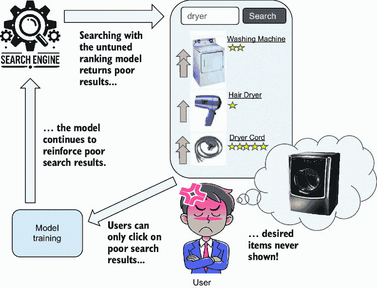
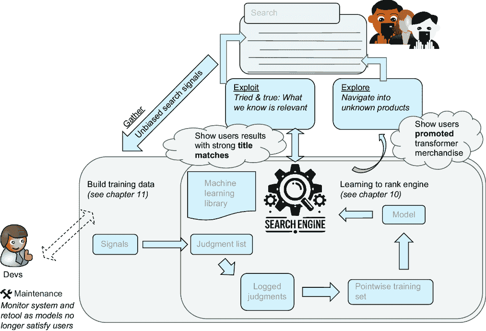
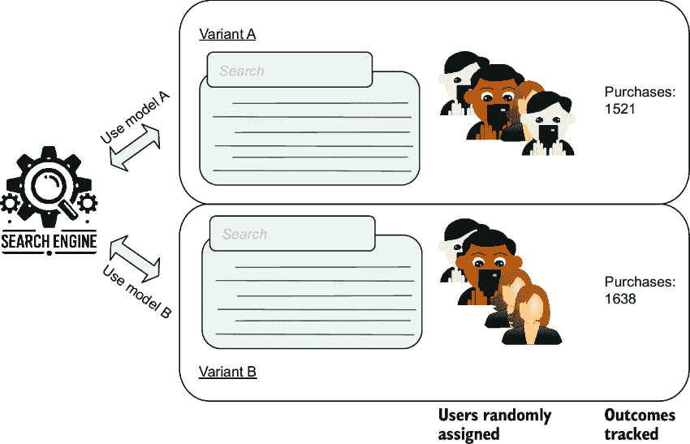
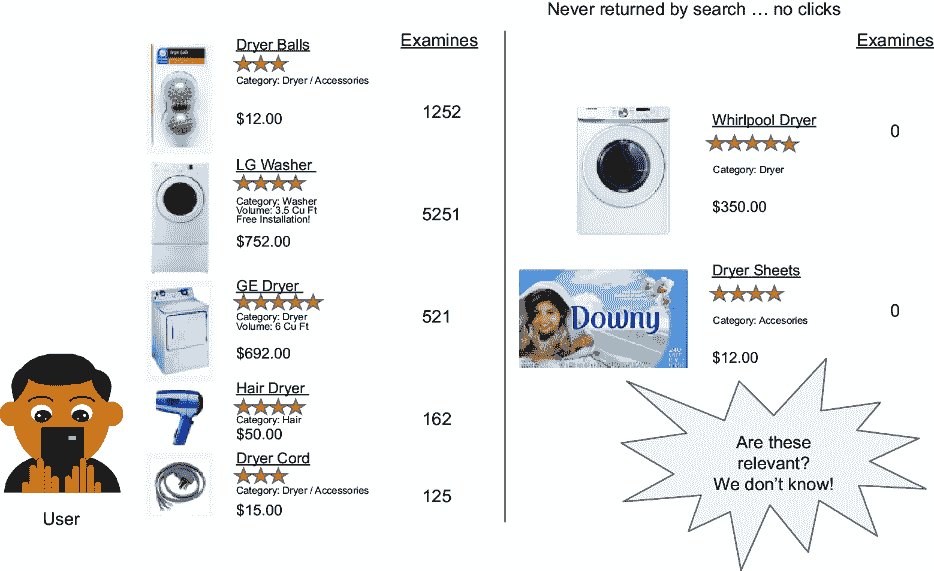

# 第十二章：通过主动学习克服排名偏差

### 本章涵盖

+   利用实时用户交互来收集对部署的 LTR 模型的反馈

+   使用实时用户进行 A/B 测试搜索相关性解决方案

+   使用主动学习来探索可能相关的结果，而不仅仅是顶部结果

+   在利用用户交互的同时探索其他可能相关的信息

到目前为止，我们的学习排名（LTR）工作一直在实验室进行。在前几章中，我们使用用户点击自动构建的训练数据构建了模型。在本章中，我们将把我们的模型带入现实世界，与（模拟的）实时用户进行测试！

回想一下，我们比较了自动 LTR 系统与自动驾驶汽车。在内部，汽车有一个引擎：第十章讨论的基于历史判断的端到端模型重新训练。在第十一章中，我们将我们的模型训练数据与自动驾驶汽车的方向进行了比较：我们应该优化什么来根据与搜索结果的先前交互自动学习判断？我们构建了训练数据并克服了点击数据中固有的关键偏差。

在本章中，我们的重点是将我们的排名模型从实验室转移到生产环境中。我们将部署并监控我们的模型，当它们接收用户流量时。我们将看到模型做得好的地方，并了解前两章的工作是否失败或成功。这意味着探索一种新的测试方法来验证我们的模型：*A/B 测试*。在*A/B 测试*中，我们将随机将实时用户分配到不同的模型，并检查业务结果（销售额等），以查看哪个模型表现最好。你可能在其他环境中熟悉 A/B 测试，但在这里我们将专注于自动 LTR 系统的含义。

实时用户不仅帮助我们验证系统，还帮助我们摆脱模型可能陷入的危险负面反馈循环，如图 12.1 所示。



##### 图 12.1 展示了展示偏差的负面反馈循环。用户永远不会点击搜索引擎从未返回的内容，因此相关性模型永远无法超越当前模型的知识。

在图 12.1 中，我们的模型只能学习用户展示给他们的相关内容。换句话说，我们面临一个不幸的鸡生蛋问题：模型是根据用户认为相关的数据进行训练的，但用户认为相关的数据是基于模型展示给他们的。好的 LTR 尝试优化具有最多积极交互信号的结果，但用户只会点击他们面前的东西。当训练数据似乎毫无希望地偏向搜索引擎当前排名时，LTR 如何可能变得更好？这种从隐式推导的训练数据中反映出的先前显示结果的偏差被称为*展示偏差*。

在我们探索 A/B 测试之后，我们将使用主动学习来对抗本章剩余部分的展示偏差。一个*主动学习*系统是可以交互式地从用户那里收集新的标记数据以回答新问题的系统。在我们的情况下，我们的主动学习算法将确定导致排名偏差的盲点，提示用户与探索这些盲点的新结果进行交互，并将用户交互作为新的训练数据来纠正盲点。就像只有学习了一条次优路径的自动驾驶汽车一样，我们必须战略性地探索其他有希望的路径——在我们的情况下，是额外的搜索结果类型——以学习新的用户相关性模式。在图 12.2 中，我们看到自动化 LTR 循环增加了这种盲点探索。

在我们到达这个至关重要的主题之前，我们必须首先将第十章和第十一章所学的一切封装成几行代码。然后我们才能快速迭代，探索 A/B 测试和克服展示偏差。



##### 图 12.2 自动化 LTR 与实时用户相遇。为了有用，我们的自动化 LTR 系统必须通过探索用户尚未看到的结果来克服展示偏差，以扩大训练数据覆盖范围。

## 12.1 几行代码中的我们的自动化 LTR 引擎

在我们开始进行 A/B 测试之前，让我们将第十章和第十一章的所有知识汇总到几个可重用的 Python 辅助函数中。首先，我们将定义一个函数，使我们能够使用简化的动态贝叶斯网络（SDBN）点击模型（第十一章的全部内容）从原始会话点击中重建训练数据。接下来，我们将创建一个同样简单的代码片段，使用该训练数据（第十章的全部内容）训练模型。在深入 A/B 测试和本章剩余部分克服展示偏差之前，我们将非常快速地总结这些函数。

### 12.1.1 将点击转换为训练数据（第十一章一行代码）

在第十一章中，我们将点击转换为训练数据，并探讨了 SDBN 点击模型，该模型可以克服用户点击搜索结果时的偏差。在探索本章中额外的偏差并自动化端到端 LTR 过程时，我们将重用第十一章的大部分代码。

作为提醒，我们的点击模型将原始点击转换为训练标签或*评分*，映射文档与关键词的相关性。我们需要构建训练数据的原始输入包括查询字符串、显示的结果排名、该位置的文档以及是否被点击。我们可以看到存储在这个数据框中的数据：

```py
id  sess_id  query      rank  doc_id        clicked
0   50002    blue ray   0.0   600603141003  True
1   50002    blue ray   1.0   827396513927  False
2   50002    blue ray   2.0   24543672067   False
3   50002    blue ray   3.0   719192580374  False
4   50002    blue ray   4.0   885170033412  True
```

给定这个输入，我们可以将第十一章的所有内容封装成一个可重用的函数，该函数用于计算我们的训练数据。回想一下，我们使用“判断列表”或“判断”来指代我们的训练数据。我们可以在以下列表中看到我们的判断计算。

##### 列表 12.1 从会话生成训练数据（第十一章）

```py
training_data = generate_training_data(sessions, prior_weight=10,
                                       prior_grade=0.2)
display(training_data)
```

输出（截断）：

```py
query             doc_id          clicked  examined  grade     beta_grade
blue ray          27242815414     42       42        1.000000  0.846154
                  827396513927    1304     3359      0.388211  0.387652
                  883929140855    140      506       0.276680  0.275194
                  885170033412    568      2147      0.264555  0.264256
                  24543672067     665      2763      0.240680  0.240534
...
transformers dvd  47875819733     24       1679      0.014294  0.015394
                  708056579739    23       1659      0.013864  0.014979
                  879862003524    23       1685      0.013650  0.014749
                  93624974918     19       1653      0.011494  0.012628
                  47875839090     16       1669      0.009587  0.010721
```

`generate_training_data` 函数接收所有用户搜索 `sessions`，以及 `prior_weight`，表示先验权重应该被赋予多强的权重（默认为 `10`），和 `prior_grade`，指定在没有证据时结果的相关性的默认概率（默认为 `0.2`）。参见第 11.3.2 节，了解这些值如何影响 SDBN 计算的复习。

让我们通过查看列表 12.1 简要回顾一下在第十一章中学到的内容。如您在输出中看到的那样，我们计算了一个 dataframe，其中每个查询-文档对都有相应的 `clicked` 和 `examined` 计数。点击就是它们听起来那样：这个产品为这个查询收到的原始点击总和。回想一下，`examined` 对应于点击模型认为用户注意到结果次数的数量。

`grade` 和 `beta_grade` 统计量是训练标签。这些对应于文档对于查询的相关性概率。回想一下，`grade` 简单地将 `clicked` 除以 `examined`：SDBN 点击模型的原始、首次实现。然而，我们在第十一章中了解到，最好考虑我们拥有的信息量（参见第 11.3 节）。我们不希望一个点击和一个查看 `(1 / 1 = 1.0)` 被计为像一百个点击和一百个查看 `(100 / 100 = 1.0)` 那样强烈。因此，`beta_grade` 对信息量更多的结果赋予更高的权重（更倾向于一百个点击的例子）。因此，当重新训练 LTR 模型时，我们将使用 `beta_grade` 而不是 `grade`。

这份数据是我们第十章中训练的 LTR 模型的训练数据。接下来，让我们看看我们如何轻松地使用这些训练数据，训练一个模型，并将其部署。

### 12.1.2 几个函数调用中的模型训练和评估

除了重新生成训练数据外，我们还需要在将其部署给实时用户之前重新训练我们的模型。在本节中，我们将探讨我们核心 LTR 模型训练引擎的便利函数。这将使我们能够在本章的其余部分快速实验模型。

我们将使用几行简单的代码来封装模型训练和离线评估。

##### 列表 12.2 在几个特征上训练和评估模型

```py
def train_and_evaluate_model(sessions, model_name, features, log=False):
  training_data = generate_training_data(sessions)
  train, test = split_training_data(training_data, 0.8)
  train_and_upload_model(train, model_name, features=features, log=log)
  evaluation = evaluate_model(test, model_name, training_data, log=log)
  return evaluation

feature_set = [
  ltr.generate_query_feature(feature_name="long_description_bm25",
                             field_name="long_description"),
  ltr.generate_query_feature(feature_name="short_description_constant",
                             field_name="short_description",
                             constant_score=True)]

evaluation = train_and_evaluate_model(sessions, "ltr_model_variant_1",
                                      feature_set)
display(evaluation)
```

`ltr_model_variant_1` 的评估：

```py
{"dryer": 0.03753076750950996,
 "blue ray": 0.0,
 "headphones": 0.0846717500031762,
 "dark of moon": 0.0,
 "transformers dvd": 0.0}
```

在列表 12.2 的帮助下，让我们简要回顾一下在第十章中学到的内容。我们定义一个 `feature_set`，包含两个 LTR 特征：一个用于与 `long_description` 字段进行搜索，另一个用于与 `short_description` 字段进行搜索。我们必须仔细选择，希望找到能够有意义地预测相关性并且可以从列表 12.1 中的训练数据中学习到的特征。然后我们将 `training_data` 分割成 `train` 和 `test` 集合，并使用 `train` 集合来训练和上传模型。

但我们如何知道我们的模型是否成功地从训练数据中学习到了知识？在模型训练期间将判断分开并排除`测试`集，为评估训练好的模型保留了一些训练数据。你就像是一位教授给学生（这里的模型）进行期末考试。你可能会给学生提供许多样题来准备考试（`训练`集）。但为了看看学生是否真正学到了材料，而不是仅仅记住它，你会给他们一个包含不同问题的期末考试（`测试`集）。这有助于你在将学生送入现实世界之前评估学生是否理解了你之前教给他们的内容。

当然，课堂上的成功并不总是等同于现实世界的成功。将我们的模型推广到现实世界，在 A/B 测试中有真实用户的情况下，可能会显示出它的表现并不像我们希望的那样好！

最后，每个测试查询旁边的统计数字是什么？我们如何评估学生在测试查询上的成功？回想一下第十章，我们只是使用了精确度（相关查询的比例）。这个统计数字将前`N`个评分相加，然后除以`N`（对我们来说`N` = 10），这实际上是平均相关性评分。我们建议探索其他统计指标，用于模型训练和评估，这些指标倾向于正确获取前几位，例如折现累积收益（DCG）、归一化折现累积收益（NDCG）或期望倒数排名（ERR）。对于我们来说，我们将继续使用更简单的精确度统计指标。

仅从 12.2 列表中测试查询的相关性指标来判断，我们的模型在离线测试中表现相当糟糕。通过提高离线指标，我们应该在 A/B 测试中的真实用户中看到显著的改进。

## 12.2 对新模型进行 A/B 测试

在本节中，我们将模拟运行 A/B 测试，并将 12.2 列表的模型与在实验室中似乎表现更好的模型进行比较。我们将反思 A/B 测试的结果，这为我们完成了在第十一章中引入的自动 LTR 反馈循环奠定了基础。我们将通过反思哪些地方做得不好来结束，本章剩余部分将专注于添加“主动学习”，这是我们自动 LTR 反馈循环中缺失的关键部分。

### 12.2.1 对更好的模型进行测试

我们原始的 LTR 模型表现并不理想，正如我们在 12.2 列表的输出中所见。在本节中，我们将训练一个新的模型，一旦它看起来有希望，我们就会将其部署在与 12.2 列表中训练的模型进行的 A/B 测试中。

让我们看看以下改进后的模型。

##### 列表 12.3 通过改变特征改进的新模型

```py
feature_set = [
  ltr.generate_fuzzy_query_feature(feature_name="name_fuzzy",
                                   field_name="name"),
  ltr.generate_bigram_query_feature(feature_name="name_bigram",
                                    field_name="name"),
  ltr.generate_bigram_query_feature(feature_name="short_description_bigram"
                                    field_name="short_description")]

evaluation = train_and_evaluate_model(sessions, "ltr_model_variant_2",
                                      feature_set)
display(evaluation)
```

对`ltr_model_variant_2`的评估：

```py
{"dryer": 0.07068309073137659,     #Before: 0.038
 "blue ray": 0.0,                         # 0.0
 "headphones": 0.06540945492120899,       # 0.085
 "dark of moon": 0.2576592004029579,      # 0.0
 "transformers dvd": 0.10077083021678328} # 0.0
```

在前面的列表中，我们定义了一个包含三个特征的`feature_set`：`name_fuzzy`，它对`name`字段执行模糊搜索；`name_bigram`，它在`name`字段上执行双词短语搜索；以及`short_description_bigram`，它在`short_description`字段上执行双词短语搜索。像之前一样，这个模型被训练、部署和评估。注意列表 12.3 的输出——在相同的测试查询集上，我们的模型似乎表现更好。这看起来很有希望！实际上，我们选择了一组似乎能更好地捕捉相关性文本匹配方面的特征。

聪明的读者可能会注意到，我们保持了与列表 12.2 相同的测试查询。我们有意这样做是为了清晰起见。这足以教授你基本的 AI 搜索技能。然而，在现实生活中，我们希望有一个真正的随机测试/训练数据集分割，以更好地评估模型的表现。我们甚至可以更进一步，进行交叉验证——在不同的测试/训练数据集分割上对多个模型进行重采样和训练，以确保模型能够很好地泛化，而不会过度拟合训练数据。如果你想要深入了解离线模型评估，我们推荐一本更通用的机器学习书籍，例如 Alexey Grigorev 的《Machine Learning Bootcamp》（Manning，2021 年）。

也许你的搜索团队认为列表 12.3 中训练的模型有潜力，并且足够好以部署到生产环境中。团队的希望很高，那么让我们看看当我们将模型部署到生产环境中进行进一步的用户评估时会发生什么。

### 12.2.2 在自动 LTR 的上下文中定义 A/B 测试

到第十一章结束时，我们已经开发了一个端到端的 LTR 重新训练过程：我们可以将用户信号输入生成点击模型，使用点击模型生成判断，使用判断来训练 LTR 模型，然后将 LTR 模型部署到生产环境中以收集更多信号以重启该过程。通过设置这个 LTR 重新训练循环，我们可以轻松部署有潜力的新排名模型。

尽管如此，我们实际上还没有将我们的 LTR 模型部署到生产环境中。我们只开发了理论模型。我们如何知道我们在实验室中构建的东西在现实世界中表现良好？处理真实的现实世界场景是相当不同的事情。

在本节中，我们将探讨与（模拟的）真实用户进行的 A/B 测试的结果。因为这是一本你本地运行的代码库的书，很遗憾我们无法让真实用户点击我们的应用程序。因此，我们将使用我们代码库内部模拟的“实时”用户流量。就我们的目的而言，这种流量模拟与真实用户交互足够相似，可以成功地展示主动学习过程。

我们将看到 A/B 测试如何成为我们自动 LTR 系统成功的最终仲裁者。它将使我们能够纠正离线自动 LTR 模型训练中的问题，以便反馈循环可以逐步变得更加可靠。

你可能已经了解 A/B 测试，但在这里我们将演示它们如何影响自动 LTR 系统。如图 12.3 所示，一个*A/B 测试*随机将用户分配到两个*变体*。每个*变体*包含一组独特的应用程序功能。这可能包括从不同的按钮颜色到新的相关性排名算法等任何内容。由于用户是随机分配到变体的，我们可以更可靠地推断哪个变体在选定的业务结果上表现最佳，例如销售、在应用程序上花费的时间、用户保留率，或者企业可能选择优先考虑的其他任何事情。

在运行 A/B 测试时，你通常会指定一个变体作为*对照组*，代表当前的默认算法。拥有一个对照组可以让你衡量其他模型的改进。同时进行多变量测试也很常见，其中同时测试多个变体或变体的组合。可以实施更高级的测试策略，如多臂老虎机测试，其中测试不断将实时流量转移到当前表现最佳的变体，或者基于信号的回溯测试，其中你使用历史数据来模拟 A/B 测试，以预测在向实时用户展示结果之前，离线最佳变体。



##### 图 12.3 搜索 A/B 测试。搜索用户被随机分配到两个相关性算法（此处为两个 LTR 模型），并跟踪结果。

### 12.2.3 将更好的模型毕业到 A/B 测试

接下来，我们将部署我们的新颖模型`ltr_model_variant_2`，如列表 12.3 所示，进入 A/B 测试。然后我们将探讨测试结果的影响。期望很高，你的团队认为这个模型可能会让竞争对手大吃一惊：列表 12.2 中表现不佳的`ltr_model_variant_1`。

在本节中，我们将模拟一个 A/B 测试，将 1,000 名用户随机分配到每个模型。在我们的案例中，这些模拟用户有他们想要购买的具体商品。如果他们看到这些商品，他们就会进行购买并愉快地离开我们的商店。如果他们看不到，他们可能会四处浏览，但很可能会不购买就离开。当然，我们的搜索团队不知道用户希望购买什么——这些信息对我们来说是隐藏的。我们只看到点击和购买流，正如我们将看到的，这些受到展示偏差的严重影响。

在列表 12.4 中，我们有一个用户群体，他们通过搜索 `transformers dvd` 来寻找最新的 Transformers 电影。在我们的讨论中，我们将专注于这个单一查询。当然，在真实的 A/B 测试中，我们会查看完整的查询集，用户群体不会这么静态。然而，通过专注于一个查询，我们可以更具体地理解我们的 A/B 测试对自动化 LTR 的影响。对于更深入的 A/B 测试实验概述，我们推荐 David Sweet（Manning，2023）所著的《工程师的实验：从 A/B 测试到贝叶斯优化》一书。

对于列表 12.4 中 `a_b_test` 函数的每次运行，都会随机分配一个模型。然后，`simulate_live_user_session` 函数模拟用户使用查询和选定的模型进行搜索，浏览结果，可能点击并购买。我们不知道的是，我们的用户群体在他们的查询背后有隐藏的偏好，这些偏好由 `simulate_live_user_session` 模拟。我们运行 `a_b_test` 1,000 次，收集使用每个模型的用户的购买情况。

##### 列表 12.4 对查询 `transformers dvd` 的模拟 A/B 测试

```py
def a_b_test(query, model_a, model_b):
  draw = random.random()
  model_name = model_a if draw < 0.5 else model_b  #1
  purchase_made = simulate_live_user_session(query,  #2
                                        model_name)  #2
  return (model_name, purchase_made)

def simulate_user_a_b_test(query, model_a, model_b, number_of_users=1000):
  purchases = {model_a: 0, model_b: 0}
  for _ in range(number_of_users):  #3
    model_name, purchase_made = a_b_test(query, model_a, model_b)  #3
    if purchase_made:  #4
      purchases[model_name] += 1  #4
  return purchases

results = simulate_user_a_b_test("transformers dvd",
                                "ltr_model_variant_1",
                                "ltr_model_variant_2")
display(results)
```

#1 随机将每个用户分配给模型 a 或 b

#2 模拟用户的搜索和购买行为

#3 模拟测试的用户数量

#4 统计每个模型的总购买数量

输出：

```py
{"ltr_model_variant_1": 21,
 "ltr_model_variant_2": 15}
```

正如列表 12.4 的输出所示，`ltr_model_variant_2`（我们的黄金学生）在这个 A/B 测试中实际上表现得更差！这怎么可能呢？它为什么会有如此好的离线测试指标性能，但在现实世界中表现不佳？

在本章的剩余部分，我们将深入探讨正在发生的事情，并尝试解决问题。因此，你将了解活用户如何提高你自动化 LTR 系统的准确性，让你有信心重新训练！

### 12.2.4 当“好”的模型变坏：我们可以从失败的 A/B 测试中学到什么

正如我们在列表 12.4 中所看到的，当我们的模型进入现实世界时，很多东西都可能发生变化。在本节中，我们将反思我们刚刚进行的 A/B 测试的影响，以确定下一步适当的行动。

当一个模型在实验室表现良好但 A/B 测试失败时，这意味着我们可能已经构建了一个“正确”的 LTR 模型，但我们构建的是错误的规范。我们需要纠正训练数据本身的问题：来自我们点击模型的判断。

但我们的基于点击模型的判断可能会出现哪些问题？我们在第十一章中看到了两个问题：*位置偏差*和*置信度偏差*。根据你的目标、用户体验和领域，可能会出现其他偏差。在电子商务中，用户可能会被吸引点击打折的商品，使数据偏向这些商品。在研究环境中，一篇文章可能在搜索结果中提供比另一篇文章更丰富的摘要。一些偏差模糊了“偏差”和该领域实际相关性之间的界限。例如，一个缺少图像的产品可能会得到更少的点击。它可能在技术上与另一个“相关”的产品相同，但用户可能会觉得缺少图像的产品不太可信，因此不会点击。这是偏差还是这个领域实际相关性的一个简单指标，其中产品可信度是一个因素？

为了做出更好的判断，我们应该忽略或降低点击的重要性，而应该使用其他行为信号吗？也许应该包括点击后的后续行动，比如点击“喜欢”按钮、将商品添加到购物车或点击“阅读更多”按钮？也许我们应该忽略用户在点击后立即点击后退按钮的“便宜”或意外点击？

考虑点击后的行为可能是有价值的。然而，我们必须问搜索排名对事件如购买或添加到购物车的影响有多强，或者它们是否归因于其他因素。例如，缺乏购买可能表明产品展示页面存在问题，或者复杂的结账流程存在问题，而不仅仅是特定查询的搜索结果的相关性。

我们可能会使用像总购买量这样的结果，在所有测试组的所有查询中汇总，来评估 A/B 测试。只要应用中的所有其他变量保持不变，除了排名算法，那么我们知道测试组之间购买量的任何显著差异必须是由我们改变的那一件事引起的。然而，在特定的查询到文档关系中，因果关系变得复杂。任何单一产品可能只有很少的购买（许多人看过 2000 美元的电视，但很少有人购买）。数据可能简单地缺乏足够的数量来知道购买是否仅与产品对查询的特定相关性有关。

考虑到搜索用户体验、领域和行为的所有变化，可能需要填满许多书籍，但仍会不足。搜索空间不断演变，新的与搜索结果交互的方式不断兴起和衰落。对于大多数情况，使用点击和标准点击模型就足够了。搜索界面中的点击已经被深入研究。然而，得出良好的判断既是艺术也是科学；你可能会发现对点击模型进行轻微修改，以考虑额外的信号对你的领域很重要，并且可能会在 A/B 测试中显著提高你的模型性能。你可以在完善你的点击模型上花费的时间，与你开发搜索引擎所花费的时间一样多。

然而，有一个普遍有害的训练数据问题挑战了所有点击模型：展示偏差。*展示偏差*发生在我们的模型无法从用户点击中学习相关内容，因为相关结果从未显示出来以便被点击。接下来，我们将深入研究这个难题，并学习如何通过同时优化模型已经学习到的内容和它们还需要学习的内容来克服这种偏差。

## 12.3 克服展示偏差：知道何时探索与何时利用

无论我们使用点击还是更复杂的信号，用户永远不会与那些他们看不到的东西互动。换句话说，在自动化的 LTR（学习到排名）背后，存在一个“先有鸡还是先有蛋”的问题：如果相关结果从未被原始的、调优不良的系统返回，那么基于点击的机器学习系统如何能够学会该结果是相关的呢？

在本节中，你将了解一种机器学习技术，该技术选择文档进行探索，尽管这些结果没有点击数据。我们自动化的 LTR 系统这个最后的缺失部分不仅帮助我们构建针对训练数据的优化模型，而且积极参与其自身的学习，以扩大可用训练数据的范围。我们将参与自身学习的系统称为*主动学习*系统。

图 12.4 展示了展示偏差。图右侧的项目可能对我们的查询具有可行性，但，没有流量，我们无法知道任何一方面。如果能够向这些结果发送一些流量，以了解用户是否认为它们是相关的，那将是很不错的。



##### 图 12.4 查询`dryer`的展示偏差（与未探索的结果）

为了克服展示偏差，我们必须仔细平衡*利用*我们模型当前辛苦获得的知识和*探索*超出这些知识。这是*探索与利用*的权衡。探索让我们获得知识，扩大我们的点击模型覆盖范围，涵盖新的和不同类型的文档。然而，如果我们总是探索，我们就永远不会利用我们的知识。当我们*利用*时，我们优化的是我们目前知道表现良好的内容。利用对应于我们的当前 LTR 模型，该模型与我们的训练数据一致。知道如何系统地平衡探索和利用是关键，我们将在接下来的几节中讨论这一点，我们将使用为此目的构建的机器学习工具（高斯过程）进行讨论。

### 12.3.1 RetroTech 训练数据中的展示偏差

让我们先分析当前的训练数据，以了解情况。训练数据缺少哪些搜索结果？我们的知识在哪些方面不完整？另一种说法是“呈现偏差”，即可能相关的搜索结果被排除在训练数据之外：我们必须检测并对抗的盲点。一旦我们定义了这些盲点，我们就可以更好地纠正它们。这将为我们重新训练一个更稳健的模型奠定基础。

在列表 12.5 中，我们创建了一个名为`explore_feature_set`的新特征集，其中包含三个简单的特征：`long_description_match`、`short_description_match`和`name_match`，告诉我们是否发生了给定的字段匹配。这些对应于我们的模型已经学习到的特征。此外，我们还添加了一个`has_promotion`特征。如果产品正在促销并通过营销渠道推广，则该特征变为`1.0`。我们之前还没有探索这个特征；也许它是一个盲点？

##### 列表 12.5 分析缺失的文档类型

```py
def get_latest_explore_feature_set():
  return [
    ltr.generate_query_feature(  #1
      feature_name="long_description_match",  #1
      field_name="long_description",  #1
      constant_score=True),  #1
    ltr.generate_query_feature(  #1
      feature_name="short_description_match",  #1 
      field_name="short_description",  #1
      constant_score=True),  #1
    ltr.generate_query_feature(  #1
      feature_name="name_match",  #1
      field_name="name", constant_score=True),  #1
    ltr.generate_query_feature(  #2
      feature_name="has_promotion",  #2
      field_name="has_promotion", value="true")]  #2

def get_logged_transformers_judgments(sessions, features):
 training_data = generate_training_data(sessions)  #3
  logged_judgments = generate_logged_judgments(training_data,  #4
                                         features, "explore")  #4
  logged_judgments = logged_judgments \  #5
      [logged_judgments["query"] == "transformers dvd"]  #5
  return logged_judgments

explore_features = get_latest_explore_features()
logged_transformers_judgments = get_logged_transformers_judgments(sessions,
                                                          explore_features)
display(logged_transformers_judgments)
```

#1 与已经用于训练 LTR 模型的字段相对应的特征。

#2 我们正在探索的盲点新特征：促销

#3 从当前原始会话构建 SDBN 判断

#4 记录特征值并返回与特征值结合的 SDBN 判断

#5 检查当前“transformers dvd”训练数据的属性

输出：

```py
doc_id       query             grade  long_desc*_match   name_match
                                            short_desc*_match  has_promotion
----------------------------------------------------------------------------
97363560449  transformers dvd  0.34   0.0   0.0          1.0   0.0
97361312804  transformers dvd  0.34   0.0   0.0          1.0   0.0
97361312743  transformers dvd  0.34   0.0   0.0          1.0   0.0
97363455349  transformers dvd  0.34   0.0   0.0          1.0   0.0
...
708056579739 transformers dvd  0.01   1.0   1.0          1.0   0.0
879862003524 transformers dvd  0.01   1.0   1.0          1.0   0.0
93624974918  transformers dvd  0.01   0.0   0.0          1.0   0.0
47875839090  transformers dvd  0.01   1.0   0.0          1.0   0.0
```

我们可以在列表 12.5 的输出中看到训练数据知识的一些差距：

+   每个商品都包含一个名称匹配。

+   没有促销（`has_promotion=0`）存在。

+   存在一系列`long_description_match`和`short_description_match`的值。

直观地说，如果我们想扩展我们的知识，我们应该向搜索`transformers dvd`的用户展示一些完全不同于列表 12.5 输出的内容。这意味着向用户展示一个促销商品，可能是一个没有名称匹配的商品。换句话说，我们需要通过明确地多样化我们向用户展示的内容，远离训练数据中的内容，来让搜索跳出自己的回音室。唯一的问题是，我们愿意承担多大的风险来改善我们的知识？我们不想用随机产品覆盖搜索结果，只是为了拓宽我们的训练数据。

我们到目前为止所做的工作还没有系统化：我们只分析了一个查询，以查看缺少了什么。我们如何自动化这个过程？接下来，我们将讨论一种使用称为高斯过程的工具来自动化探索的方法。

### 12.3.2 超越临时性：用高斯过程深思熟虑地探索

*高斯过程*是一种统计模型，它做出预测并提供一个概率分布，捕捉该预测的确定性。在本节中，我们将使用高斯过程来选择探索的区域。在本章的后面部分，我们将创建一种更稳健的方法来寻找数据中的差距。

#### 以实例为例：通过利用现有知识探索一条新河流

为了对高斯过程有一个直观的了解，让我们用一个现实生活中的探索具体例子。通过这个例子，你将能够更直观地思考我们如何可能在数学上进行探索与利用的权衡。

假设你是一位科学家，计划对荒野深处的一条很少被探索的河流进行考察。在你规划旅行时，你只有来自过去探险的零星河流深度观测数据，知道何时旅行是安全的。例如，一次观测显示四月河流深度为两米；另一次在八月，深度为一米。你希望为你的探险选择一个日期，以优化理想的河流条件（即不是雨季，也不是干旱期）。然而，你也是一个科学家——你希望在一年中尚未观测到的时间进行观测，以增加你对河流的了解。图 12.5 显示了全年进行的河流深度测量。


##### 图 12.5 探索一条河流，随着我们远离过去的观测点，河流深度的不确定性逐渐增加。我们如何选择一个既安全又能最大限度地增加我们对河流深度了解的年份？

我们如何选择探险的日期呢？如果你在 4 月 14 日观测到河流深度为两米，你会猜测 4 月 15 日的深度将非常接近两米。在那个时间旅行可能会很愉快：你相信河流不会过度泛滥。然而，你不会从河流中获得很多知识。尝试在离这个观测几个月的 1 月去怎么样？1 月离 4 月太远，无法了解河流的预期深度。我们可能会在一年中危险的时间旅行，但我们几乎肯定会获得新的知识——可能比我们预期的要多得多！由于数据如此之少，在这个时间旅行可能会有太多的风险。

在图 12.5 中，我们看到基于相邻日期之间预期相关性的河流水平面的合理猜测（4 月 15 日和 14 日应该非常接近）。随着我们远离直接观测，我们的确定性降低，由扩大的灰色区域表示。

图 12.5 展示了一个高斯过程。它从数学上捕捉预测，以及我们对每个预测的不确定性。这与相关性排名有何关联？正如附近的日期有相似的河流水位，相似搜索结果在相关性上也会相似。考虑列表 12.5 中的探索特征。那些与 `transformers` `dvd` 有强烈名称匹配，未被推广，且没有简短/长描述匹配的，可能具有相似的相关性等级——所有都是适度相关。当我们远离这些常见的例子——也许添加推广项目——我们对我们的有根据的猜测变得越来越不确定。如果我们走得很远，远远超出框外，比如一个没有名称匹配但被推广的搜索结果，并且有强烈的简短/长描述字段匹配，我们的不确定性会非常高。就像考虑一月份旅行的科学家一样，我们几乎没有能力做出关于这些结果是否相关的良好猜测。向用户展示这些结果可能涉及太多的风险。

我们可以使用高斯过程来平衡利用现有的相关性知识与风险较高的探索以获得知识。高斯过程使用不完整的信息在可能的质量和获得的知识之间做出谨慎的权衡。例如，我们可以权衡理想的河流条件或可能的相关搜索结果，以换取更多关于河流条件或关于新类型搜索结果的相关性了解。我们可以谨慎地选择我们想要探索多远，以获得新的知识。

在我们的 `transformers` `dvd` 案例中，哪种搜索结果可能具有高收益，可能也是相关/安全的探索，同时也会最大限度地增加我们的知识？让我们训练一个高斯过程并找出答案！

#### 训练和分析高斯过程

让我们动手看看高斯过程是如何工作的。我们将在 `transformers dvd` 查询上训练一个高斯过程。然后我们将使用它来生成最佳的探索候选者。您将看到我们如何评分这些探索候选者，以最大限度地减少我们的风险并增加我们获得知识的可能性。

在以下列表中，我们使用 `sklearn` 中的 `GaussianProcessRegressor`（也称为 `gpr`）来训练高斯过程。此代码创建了一个尝试预测 `explore_feature_set` 特征作为函数的相关性 `grade` 的高斯过程。

##### 列表 12.6 在我们的训练数据上训练 `GaussianProcessRegressor`

```py
from sklearn.gaussian_process import GaussianProcessRegressor

def train_gpr(logged_judgments, feature_names):
  feature_data = logged_judgments[feature_names]  #1
  grades = logged_judgments["grade"]  #2
  gpr = GaussianProcessRegressor()  #3
  gpr.fit(feature_data, grades)  #3
  return gpr
```

#1 使用来自列表 12.5 中 explore_feature_set 记录的特征

#2 预测相关性等级

#3 创建并训练 gpr 模型

一旦我们训练了一个 `GaussianProcessRegressor`，我们就可以用它来做出预测。记住，`GaussianProcessRegressor` 不仅预测一个值，它还返回该预测的概率分布。这有助于我们衡量模型的确定性。

在列表 12.7 中，我们生成了我们想要探索的可能特征值。在我们的河流探索示例中，这些值对应于我们科学家探险的可能探索日期。在我们的情况下，由于每个特征可以是`0`或`1`，我们查看每个可能的特征值作为候选。

##### 列表 12.7 预测一组探索候选者

```py
def calculate_prediction_data(logged_judgments, feature_names):
  index = pandas.MultiIndex.from_product([[0, 1]] * 4,  #1
                                  names=feature_names)  #1
  with_prediction = pandas.DataFrame(index=index).reset_index()

  gpr = train_gpr(logged_judgments, feature_names)
  predictions_with_std = gpr.predict(  #2
    with_prediction[feature_names], return_std=True)  #2
  with_prediction["predicted_grade"] = predictions_with_std[0]  #3
  with_prediction["predicted_stddev"] = predictions_with_std[1]  #3

  return  with_prediction.sort_values("predicted_stddev", ascending=True)

explore_features = get_latest_explore_features()
logged_transformers_judgments = get_logged_transformers_judgments(sessions,
                                                          explore_features)
feature_names = [f["name"] for f in explore_features]
prediction_data = calculate_prediction_data(logged_transformers_judgments,
                                                            feature_names)
display(prediction_data)
```

#1 为我们想要探索的每个特征生成一个可能的值为 0 或 1 的候选矩阵

#2 根据 gpr 概率分布预测候选者的等级和标准差

#3 存储从 gpr 预测的等级和标准差

输出：

```py
long_description_match  name_match      predicted_grade
         short_description_match  has_promotion         prediction_stddev
0        0              1         0     0.256798        0.000004
1        0              1         0     0.014674        0.000005
1        1              1         0     0.014864        0.000007
0        1              1         0     0.022834        0.000010
1        0              1         1     0.018530        0.000010
0        0              1         1     0.161596        0.632121
1        1              1         1     0.014856        0.632121
```

在列表 12.7 的输出中，我们看到一个`predicted_grade`——`gpr`对示例相关性的合理猜测。我们还有`prediction_stddev`，它捕捉了图 12.5 中的灰色带——预测中的不确定性有多大。

我们在列表 12.7 的输出中注意到，对于前四个`name_match=1`的产品，标准差接近 0。换句话说，当`name_match=1`时，`gpr`往往更有信心。在这些观察之后，我们看到标准差急剧增加，因为我们缺乏这些初始名称匹配示例之外的大量知识。

输出开始显示出我们在列表 12.5 中直观检测到的展示偏差。我们发现关于名称匹配重要性的知识非常多，但关于其他情况的知识却很少。哪个案例值得与真实用户探索，同时还能最小化我们向用户展示搜索结果中完全陌生内容的风险？

在列表 12.8 中，我们使用一种称为“预期改进”的算法生成和评分探索候选者，该算法预测具有最高潜在收益的候选者。如果您想了解更多信息，我们建议阅读 Agnihotri 和 Batra 的文章“探索贝叶斯优化”（[`distill.pub/2020/bayesian-optimization`](https://distill.pub/2020/bayesian-optimization)）。

##### 列表 12.8 计算探索的预期改进

```py
def calculate_expected_improvement(logged_judgments, feature_names, theta=0.6):
  data = calculate_prediction_data(logged_judgments, feature_names)
  data["opportunity"] = (data["predicted_grade"] -  #1
           logged_judgments["grade"].mean() - theta) #1
 #1
  data["prob_of_improvement"] = ( 
    norm.cdf(data["opportunity"] /  #2
             data["predicted_stddev"]))  #2

  data["expected_improvement"] = (  #3
    data["opportunity"] * data["prob_of_improvement"] +  #3
    data["predicted_stddev"] *  #3
    norm.pdf(data["opportunity"] /  #3
             data["predicted_stddev"]))  #3
  return data.sort_values("expected_improvement",  #4
                          ascending=False)  #4

improvement_data = calculate_expected_improvement(
      logged_transformers_judgments, feature_names)
display(improvement_data)
```

#1 预测等级可能高于或低于典型等级吗？

#2 考虑预测中的不确定性，我们改善平均值的概率

#3 在概率、改进和改进幅度给定的情况下，可以获得的收益有多少。

#4 对候选者进行排序，以显示最佳的探索候选者

输出：

```py
long_description_match  name_match  opportunity         expected_improvement
    short_description_match  has_promotion     prob_of_improvement
0   0                   0    1      -0.638497  0.234728  0.121201
0   1                   0    1      -0.725962  0.213214  0.110633
0   0                   0    0      -0.580755  0.232556  0.107853
1   1                   0    1      -0.727500  0.204914  0.101653
0   1                   0    0      -0.722661  0.181691  0.078549
```

预期改进越高，探索候选者的预测收益就越高。但算法如何量化这种潜在收益呢？要么是我们高度确信存在收益（标准差低且预测等级高），要么是我们知道存在高度不确定性，但预测等级仍然足够高，可以冒险。我们可以在列表 12.8 的以下代码中看到这一点：

```py
data["expected_improvement"] = (
  data["opportunity"] * data["prob_of_improvement"] +
  (data["prediction_stddev"] * norm.pdf(data["opportunity"] /
                                        data["prediction_stddev"])))
```

这个第一个表达式覆盖了一个更有把握的机会：

```py
data["opportunity"] * data["prob_of_improvement"]
```

同时，这个第二个表达式（在`+`之后）覆盖了一个具有广泛变异性的未知机会：

```py
data["prediction_stddev"] * norm.pdf(data["opportunity"] /
                                     data["prediction_stddev"])
```

在第一个表达式中，你会注意到机会（我们期望获得多少）乘以改进发生的概率对应于对良好结果的信心。另一方面，第二个表达式更多地依赖于标准差。标准差和机会越高，被选中的可能性就越大。

我们可以使用一个名为`theta`的参数来校准我们的风险容忍度：这个值越高，我们越偏好标准差更高的候选者。高`theta`会导致`opportunity`向 0 减少。这会使评分偏向第二个表达式——未知、标准差更高的案例。

如果我们将`theta`设置得太高，我们的`gpr`在选择学习候选者时不会考虑它们是否可能对用户有用。如果`theta`太低，我们不会探索很多新的候选者，而会偏向于现有知识。高`theta`类似于图 12.5 中科学家在 1 月份承担高风险（如探索）的情况，而非常低的`theta`则对应于在风险规避时期（如 4 月中旬）旅行。因为我们使用这个算法来增强现有的 LTR 系统，所以我们选择了`theta`为`0.6`（略高）以获得更多的知识。

在列表 12.8 的输出中，我们看到`gpr`证实了我们的早期临时分析：我们应该向用户展示具有推广的商品。这些产品更有可能产生更多的知识，可能从赌博中获得高额回报。

现在我们已经确定了我们应该探索的产品类型，让我们从搜索引擎中收集产品以向用户展示。以下列表显示了我们可以如何选择用于探索的产品，这些产品我们可以在以后将其穿插到现有模型的搜索结果中。

##### 列表 12.9 从搜索引擎中选择要探索的产品

```py
def explore(query, logged_judgments, features):  #1
  feature_names = [f["name"] for f in features]
  prediction_data = calculate_expected_improvement(logged_judgments,
                                                   feature_names)
  explore_vector = prediction_data.head().iloc[0][feature_names] #2
  return search_for_explore_candidate(explore_vector, query) #3

explore_features = get_latest_explore_features()
logged_judgments = get_logged_transformers_judgments(sessions,
                                             explore_features)
exploration_upc = explore("transformers dvd", logged_judgments,
                                              explore_features)["upc"]
print(exploration_upc)
```

#1 根据提供的探索向量进行探索，并从该组中随机选择一个文档

#2 根据 expected_improvement 提取最佳的探索候选者特征

#3 搜索符合标准的候选者

输出：

```py
826663114164   # Transformers: The Complete Series [25th Anniversary ... ]
```

在列表 12.9 中，我们选取了最佳的探索候选者——推广的商品，并发出查询以获取具有这些特性的文档。我们在这里省略了将候选者转换为查询（`explore_query`函数）的较低级翻译，但你可以想象，如果候选者中的`has_promotion=1.0`，那么我们会发出一个搜索任何具有推广（`has_promotion=true`）的商品的查询，以及其他特征的类似情况。

我们在列表 12.9 的输出中看到，对于查询`transformers dvd`，随机选择的用于探索的推广产品是 826663114164。这对应于*Transformers: The Complete Series [25th Anniversary Matrix of Leadership Edition] [16 Discs] - DVD*。有趣！

我们应该如何处理这份文档？这归结为一个设计决策。一个常见的做法是将它放入结果列表的第三个位置，这样用户仍然可以首先看到之前最相关的结果，同时也确保了探索结果获得高可见度。注意我们的 826663114164 文档位于第三个位置（`rank=2.0`）。

```py
doc_id       product_name               sess_id query             rank click
93624974918  Transformers: Revenge O... 100049  transformers dvd  0.0  False
879862003524 Razer - DeathAdder Tran... 100049  transformers dvd  1.0  False
826663114164 Transformers: The Compl... 100049  transformers dvd  2.0  False
708056579739 Nintendo - Transformers... 100049  transformers dvd  3.0  False
```

我们在附带的笔记本中模拟了许多类似的探索会话。由于我们没有实际的用户在使用我们的应用，模拟代码仅用于演示目的，以便我们可以在自动化的 LTR 系统中集成探索候选者进行主动学习。在实际的生产环境中，你会向真实用户展示结果，而不是模拟用户会话。

每个会话都会根据列表 12.9 添加一个随机的探索候选者，模拟添加的探索结果是否被点击，并将其附加到新的会话集合中：`sessions_with_exploration`。回想一下，这些会话作为我们需要计算 LTR 训练数据（第十一章中生成的基于 SDBN 的判断，如列表 12.1 所示）的输入。

最后，我们有了重新运行我们的自动化 LTR 训练循环所需的数据。我们将看到这些示例添加到我们的训练数据中会发生什么，以及我们如何将这次探索整合到整体自动化 LTR 算法中。

### 12.3.3 检查我们探索的结果

我们通过向（模拟的）真实用户展示一些非传统的搜索结果进行了探索。现在，我们有了新的会话附加到存储在 `sessions_with_exploration` 数据框中的原始会话数据。在本节中，我们将运行会话数据通过我们的自动化 LTR 函数以再生训练数据并训练模型。然后，我们将运行这个新模型进行 A/B 测试以查看结果。

如你所回忆的，我们的自动化 LTR 辅助工具可以使用 `generate_training_data` 函数再生训练数据。我们在列表 12.10 中这样做，但这次使用的是包含探索数据的增强会话。

##### 列表 12.10 从新会话中再生 SDBN 判断

```py
query = "transformers dvd"
sessions_with_exploration = generate_simulated_exploration_sessions(
  query, sessions, logged_transformers_judgments, explore_features)
training_data_with_exploration = \
  generate_training_data(sessions_with_exploration)
display(training_data_with_exploration.loc["transformers dvd"])
```

输出：

```py
doc_id        product_name                click  examined  grade  beta_grade
97360724240   Transformers: Revenge of... 43     44        0.977  0.833333
826663114164  Transformers: The Comple... 42     44        0.954  0.814815
97360722345   Transformers/Transformer... 46     55        0.836  0.738462
97363455349   Transformers - Widescree... 731    2113      0.345  0.345266
97361312804   Transformers - Widescree... 726    2109      0.344  0.343558
```

我们在列表 12.10 的输出中看到一个新的产品被包含在内。特别注意的是，826663114164 的添加，*Transformers: The Complete Series [25th Anniversary Matrix of Leadership Edition] [16 Discs] - DVD*。有趣的是，这部电影有 `has_promotion=true`，这意味着它是上一节中从新选择的探索候选者之一：

```py
{"upc": "826663114164",
 "name": "Transformers: The Complete Series [25th Anniversary ...] - DVD",
 "manufacturer": "",
 "short_description": "",
 "long_description": "",
 "has_promotion": True}
```

看起来用户被促销产品所吸引，所以让我们将 `has_promotion` 特征从探索特征集移动到我们的主模型中，并重新训练以查看效果。在下面的列表中，我们将训练一个包含这个新特征的模型以观察其效果。

##### 列表 12.11 使用更新后的判断重建模型

```py
promotion_feature_set = [
  ltr.generate_fuzzy_query_feature(feature_name="name_fuzzy",
                                   field_name="name"),
  ltr.generate_bigram_query_feature(feature_name="name_bigram",
                                    field_name="name"),
  ltr.generate_bigram_query_feature(feature_name="short_description_bigram",
                                    field_name="short_description"),
  ltr.generate_query_feature(feature_name="has_promotion",  #1
                             field_name="has_promotion",  #1
                             value="true",  #1
                             constant_score=True)]  #1

evaluation = train_and_evaluate_model(sessions_with_exploration,
                                      "ltr_model_variant_3",
                                      feature_set)
display(evaluation)
```

#1 将 has_promotion 添加到我们训练模型时使用的特征集

对 `ltr_model_variant_3` 的评估：

```py
{"dryer": 0.12737002598513025,     # Before: 0.071
 "blue ray": 0.08461538461538462,          # 0.0
 "headphones": 0.12110565745285455,        # 0.065
 "dark of moon": 0.1492224251599605,       # 0.258
 "transformers dvd": 0.26947504217124457}  # 0.101
```

哇！当将列表 12.11 与列表 12.3 的早期输出进行比较时，我们看到在大多数情况下，将推广产品添加到训练数据中在我们的离线测试评估中产生了显著的改进。特别是`transformers dvd`的精确度显著提高！如果我们发出对`transformers dvd`的搜索，我们会在数据中看到这一点。

##### 列表 12.12 使用最新模型搜索`transformers dvd`

```py
results = ltr.search_with_model("ltr_model_variant_3",
                                query="transformers dvd",
                                rerank_query="transformers dvd",
                                limit=5)["docs"]
display([doc["name"] for doc in results])
```

输出：

```py
["Transformers/Transformers: Revenge of the Fallen: Two-Movie Mega Coll...",
 "Transformers: Revenge of the Fallen - Widescreen - DVD",
 "Transformers: Dark of the Moon - Original Soundtrack - CD",
 "Transformers: The Complete Series [25th Anniversary Matrix of Leaders...",
 "Transformers: Dark of the Moon Stealth Force Edition - Nintendo Wii"]
```

然而，我们知道看起来很好的测试结果并不总是能转化为现实世界。当我们重新运行列表 12.4 中的 A/B 测试时会发生什么？如果你还记得，我们创建了一个`a_b_test`函数，该函数随机为用户的搜索选择一个模型。如果结果包含用户秘密想要购买的项目，那么购买很可能会发生。如果我们使用这个函数来重新模拟 A/B 测试，我们看到我们的新模型似乎已经中了大奖！

##### 列表 12.13 在新的`ltr_model_variant_3`模型上重新运行 A/B 测试

```py
results = simulate_user_a_b_test(query="transformers dvd",
                                 model_a="ltr_model_variant_1",
                                 model_b="ltr_model_variant_3",
                                 number_of_users=1000)
display(results)
```

输出：

```py
{"ltr_model_variant_1": 21,
 "ltr_model_variant_3": 145}
```

现在，我们看到新模型（`ltr_model_variant_3`）在 A/B 测试中显著优于旧模型（`ltr_model_variant_1`）。我们现在知道，我们的探索不仅帮助我们发现了训练数据中的理论差距，而且当我们在针对目标查询（`transformers` `dvd`）的真实世界场景中测试新模型时，它的表现比旧的“仅利用”模型要好得多。虽然我们在这章中关注了一个特定的查询，但同样的过程可以应用于许多查询和探索候选者，以继续使用主动学习自动优化你的 LTR 模型。

我们现在已经实施了一个自动化的 LTR 系统，它不仅从最新的用户信号中重新学习，而且还使用主动学习来探索可能对活跃用户相关的其他内容，然后收集相应的信号来衡量他们的反馈。这个主动学习过程有助于持续地消除训练数据中的盲点。

## 12.4 利用、探索、收集、清洗、重复：一个健壮的自动化 LTR 循环

当所有最终部分就绪时，我们看到探索新特性如何帮助我们克服展示偏差。特性探索和训练数据探索是相辅相成的，因为我们通过理解我们所缺乏的特性以及可能需要将其工程化到搜索中的特性，来学习我们的展示偏差。在本章中，我们使用了一个简单的“促销”例子，但还有哪些更复杂的功能可能会在你的训练数据中显示出盲点？在本节中，让我们通过增强第十一章中的自动化 LTR 算法来结束，不仅包括使用基于先前点击模型训练数据的模型训练，还包括探索训练数据当前范围之外的新主动学习方法。

我们新的自动探索自动化 LTR 算法可以总结为以下三个主要步骤：

1.  *利用*—使用已知特性，并使用现有训练数据训练 LTR 模型以进行排名。

1.  *探索*—生成假设的、“探索”特性，以消除训练数据盲点。

1.  *收集*——使用部署的模型和训练好的`gpr`模型，展示探索/利用搜索结果，并收集点击以建立判断。

我们可以通过将它们合并到列表 12.14 中，总结过去三章的内容，如以下所示。此列表将所有部分组合在一起（省略了一些内部细节）。我们在这个算法中的主要决策点是用于探索和利用的特征。我们还可以深入了解，更改选择的点击模型、LTR 模型架构以及我们的风险容忍度（`theta`参数）。

##### 列表 12.14 总结完全自动化的 LTR 算法

```py
def train_and_deploy_model(sessions, model_name, feature_set):
  judgments = generate_training_data(sessions)
  train, test = split_training_data(judgments, 0.8)
  train_ranksvm_model(train, model_name, feature_set=feature_set)

def ltr_retraining_loop(latest_sessions, iterations=sys.maxsize,
                        retraining_frequency=60 * 60 * 24):  #1
  exploit_feature_set = get_exploit_feature_set()  #2
  train_and_deploy_model(latest_sessions,  #2
                         "exploit",  #2
                         exploit_feature_set)  #2
  for i in range(0, iterations):  #3
    judgments = generate_training_data(latest_sessions)
    train, test = split_training_data(judgments)
    if i > 0:
      previous_explore_model_name = f"explore_variant_{i-1}"
      exploit_model_evaluation = evaluate_model(test_data=test,
        model_name="exploit", training_data=train)
      explore_model_evaluation = evaluate_model(test_data=test,
        model_name=previous_explore_model_name, training_data=train)
      print(f"Exploit evaluation: {exploit_model_evaluation}")
      print(f"Explore evaluation: {explore_model_evaluation}")
      if is_improvement(explore_model_evaluation,  #4
                        exploit_model_evaluation):  #4
        print("Promoting previous explore model")
        train_and_deploy_model(latest_sessions,
                               "exploit",
                               explore_feature_set)

    explore_feature_set = get_latest_explore_feature_set()  #5
    train_and_deploy_model(latest_sessions,  #5
                           f"explore_variant_{i}",  #5
                            explore_feature_set)  #5

    wait_for_more_sessions(retraining_frequency)  #6
    latest_sessions = gather_latest_sessions(  #7
                        "transformers dvd",  #7
                        latest_sessions,  #7
                        explore_feature_set)  #7

ltr_retraining_loop(sessions)
```

#1 每天返回一次模型

#2 在已知良好特征和当前训练数据上训练 LTR 模型

#3 收集新会话并重复该过程

#4 评估当前探索变体，如果它比当前探索模型更好，则提升它

#5 假设新的特征以探索盲点

#6 收集用户信号，直到重新训练模型的时间

#7 收集新会话并重复该过程

在这个循环中，我们捕捉到一个更好的自动 LTR 过程。我们通过理论化可能隐藏在背后的特征来主动学习我们的训练数据的盲点。在让循环运行的同时，我们可以观察其性能并决定何时将“探索”特征提升到完整的生产“利用”特征集。当我们淘汰旧的点击数据时，我们还可以注意旧特征何时不再重要，以及何时由于趋势和季节性，新特征变得重要。我们的实现使用手动调优的利用和探索特征集来保持我们的搜索相关性团队对特征工程的控制，但你当然可以编写一个生成新特征的算法，或使用深度学习来发现潜在特征，或使用基于现有内容属性的某些其他方法。

总体而言，这些算法提供了一种稳健的机制，以全面考虑可能向用户展示的选项范围，从而接近理想的排名。它们让您可以选择新的特征来调查盲点，达到一个最大化用户在搜索结果中希望看到的关联算法。

## 摘要

+   在离线测试中表现良好表明我们的特征可以近似训练数据。然而，这并不能保证成功。A/B 测试可以向我们展示训练数据本身可能具有误导性的情况。

+   训练数据必须监控偏差并仔细纠正。

+   展示偏差是搜索中最有害的相关性问题之一。展示偏差发生在我们的模型无法从用户点击中学习相关内容，因为结果从未显示出来供点击。

+   我们可以通过使自动 LTR 过程成为寻找训练数据盲点的积极参与者来克服展示偏差。执行此操作的模型参与主动学习。

+   高斯过程是选择有前景的探索机会的一种方法。通过一组特征，我们可以找出训练中的缺失部分，并根据哪些项目可能为持续学习提供最有用的新数据点来选择新的项目展示给用户。我们可以通过不同的方式通过特征来描述数据，以寻找新的有趣盲点和调查领域。

+   当我们将利用现有知识与探索盲点相结合时，我们便拥有了一个更稳健、自动化的 LTR 系统——反映智能，它可以自动探索和利用特征，且几乎不需要内部维护。
