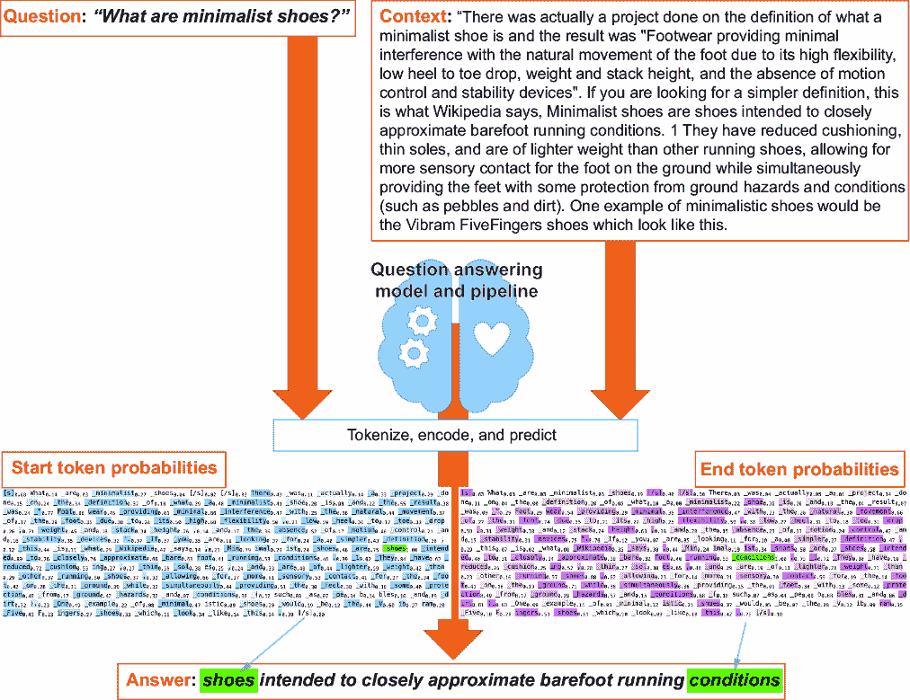
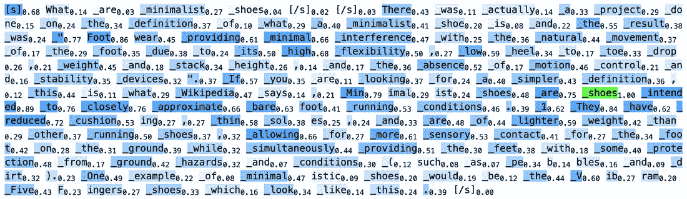
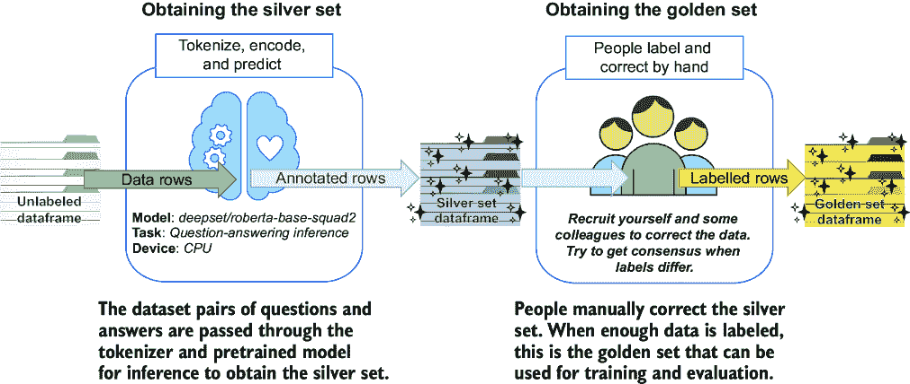
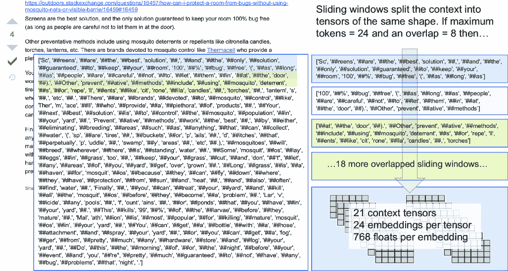

# 第十四章：使用微调的大型语言模型进行问答

### 本章涵盖

+   使用 LLM 构建问答应用程序

+   为训练创建问答数据集

+   微调基于 Transformer 的 LLM

+   将基于深度学习的 NLP 管道集成到搜索结果中提取和排序答案

我们在第十三章中介绍了使用 Transformers 进行语义搜索的基本知识，因此我们现在准备尝试搜索中最难的问题之一：问答。

*问答*是返回搜索者查询答案的过程，而不仅仅是搜索结果列表。问答方法有两种类型：抽取式和抽象式。*抽取式问答*是从你的文档中找到问题的确切答案的过程。它返回包含用户问题可能答案的文档片段，这样用户就不需要筛选搜索结果。相比之下，*抽象式问答*是生成用户问题响应的过程，可以是多份文档的摘要，也可以直接从没有源文档的 LLM 生成。在本章中，我们将主要关注抽取式问答，将抽象式问答留到第十五章。

通过解决问答问题，你将完成三件事：

+   你将更好地理解你在第十三章开始学习的 Transformer 工具和生态系统。

+   你将学习如何将大型语言模型微调到特定任务。

+   你将把你的搜索引擎与高级自然语言技术合并。

在本章中，我们将向你展示如何直接回答问题并生成一个可工作的问答应用程序。我们将处理的查询类型包括单句的*谁*、*什么*、*何时*、*何地*、*为什么*和*如何*问题。我们还将继续使用上一章的 Stack Exchange 户外数据集。我们的目标是使用户能够提出*以前未见过的*问题，并得到简短的答案作为回应，从而消除用户需要阅读多个搜索结果以找到答案的必要性。

## 14.1 问答概述

传统搜索在查询响应时返回文档或页面的列表，但人们可能经常在寻找问题的快速答案。在这种情况下，我们希望避免人们不得不在文本块中挖掘答案，而答案在我们的内容中已经直接存在。

在本节中，我们将介绍问答任务，然后定义用于实现问答的检索器-阅读器模式。

### 14.1.1 问答模型的工作原理

让我们看看一个问答模型在实际中是如何工作的。具体来说，我们正在实现*抽取式问答*，它能在给定的文本中找到问题的最佳答案。例如，考虑以下问题：

Q: `什么是极简主义鞋？`

提取式问题回答通过查看可能包含答案的大文档来工作，并为你识别答案。

让我们看看一份可能包含我们问题答案的文档。我们向模型提供了一个问题 `什么是` `极简主义` `鞋？` 以及以下文档文本（上下文）：

```py
There was actually a project done on the definition of what a minimalist shoe
is and the result was "Footwear providing minimal interference with the 
natural movement of the foot due to its high flexibility, low heel to toe 
drop, weight and stack height, and the absence of motion control and stability
devices". If you are looking for a simpler definition, this is what Wikipedia
says, Minimalist shoes are shoes intended to closely approximate barefoot 
running conditions. 1 They have reduced cushioning, thin soles, and are of 
lighter weight than other running shoes, allowing for more sensory contact 
for the foot on the ground while simultaneously providing the feet with some protection from ground hazards and conditions (such as pebbles and dirt). Oneexample of minimalistic shoes would be the Vibram FiveFingers shoes which 
look like this.
```

文档可以被分解成许多小的部分，称为 *span*，模型会提取最佳 span 作为答案。一个工作的问题回答模型会评估问题和上下文，并可能产生这个 span 作为答案：

A: `旨在紧密模拟赤脚跑步条件的鞋`

但是模型是如何知道任何给定的 span 是否是答案的概率呢？我们可以尝试查看不同的 span，看看它们是否以某种方式代表答案，但这会非常复杂。相反，通过首先学习上下文中每个标记是否是答案的开始以及每个标记是否是答案的结束的概率，可以简化这个问题。因为我们只关注一个标记代表开始的概率，另一个标记代表结束的概率，所以问题更容易理解和解决。我们的标记被视为离散值，提取式问题回答模型被训练来学习一个 *概率质量函数*（PMF），这是一个函数，它给出了离散随机变量恰好等于某个值的概率。这与我们在第十一章中讨论的连续 beta 分布中测量的连续值不同，这些连续值用于概率分布。这两个之间的主要区别在于我们的标记是离散值。

使用这种策略，我们可以训练一个模型，该模型将学习两个概率质量函数——一个用于答案 span 的起始标记，另一个用于答案 span 的结束标记。你可能会注意到我们之前说模型“*可能*”产生之前的答案。由于使用不同数据和超参数训练的模型会给出不同的结果，因此针对特定问题的具体答案可以基于模型的训练参数而变化。

为了说明这是如何工作的，我们将从一个已经为提取式问答任务训练好的模型开始。该模型将输出分词是答案跨度开始或结束的概率。当我们确定最可能的答案开始和结束位置时，那就是我们的答案跨度。我们将使用的预训练模型是 `deepset/roberta-base-squad2`，由 Hugging Face 组织提供并由 Deepset 团队训练。我们将通过列表 14.1 到 14.3 中的模型和管道将问题和上下文传递给这个模型，以确定答案跨度开始和结束的概率，以及最终的答案。图 14.1 通过对问题和上下文输入进行 *分词*、*编码* 和 *预测* 最合适的答案跨度来演示此过程。



##### 图 14.1 提取式问答预测过程

在图中，你可以看到问题和上下文首先组合成一对以进行分词。然后对这个对进行分词，获得模型的分词输入。模型接受这些输入，然后输出两个序列：第一个序列是上下文中每个分词是答案开始的概率，第二个序列是上下文中每个分词是答案结束的概率。然后开始和结束概率序列被组合起来以获得最可能的答案跨度。

下面的列表介绍了此过程的第一个步骤：分词。

##### 列表 14.1 加载分词器和模型

```py
from transformers import AutoTokenizer, AutoModelForQuestionAnswering
model_name = "deepset/roberta-base-squad2"
tokenizer = AutoTokenizer.from_pretrained(model_name)
model = AutoModelForQuestionAnswering.from_pretrained(model_name)
```

列表 14.1 中的模型名称是一个专门为提取式问答预训练的公开模型。有了模型和分词器准备就绪，我们现在可以传入一个问题和答案对，如下所示列表。响应将显示标记的数量等于开始和结束概率的数量。

##### 列表 14.2 分词问题及其上下文

```py
question = "What are minimalist shoes"
context = """There was actually a project done on the definition of what a
minimalist shoe is and the result was "Footwear providing minimal
interference with the natural movement of the foot due to its high
flexibility, low heel to toe drop, weight and stack height, and the absence
of motion control and stability devices". If you are looking for a simpler
definition, this is what Wikipedia says, Minimalist shoes are shoes intended
to closely approximate barefoot running conditions. 1 They have reduced
cushioning, thin soles, and are of lighter weight than other running shoes,
allowing for more sensory contact for the foot on the ground while
simultaneously providing the feet with some protection from ground
hazards and conditions (such as pebbles and dirt).
One example of minimalistic shoes would be the Vibram FiveFingers
shoes which look like this."""

inputs = tokenizer(question, context, add_special_tokens=True,
                   return_tensors="pt")
input_ids = inputs["input_ids"].tolist()[0]

outputs = model(**inputs)
start_logits_norm = normalize(outputs[0].detach().numpy())
end_logits_norm = normalize(outputs[1].detach().numpy())

print(f"Total number of tokens: {len(input_ids)}")
print(f"Total number of start probabilities: {start_logits_norm.shape[1]}")
print(f"Total number of end probabilities: {end_logits_norm.shape[1]}")
```

响应：

```py
Total number of tokens: 172
Total number of start probabilities: 172
Total number of end probabilities: 172
```

输入是通过将问题和上下文一起分词获得的。输出是通过将输入通过模型进行正向传递获得的。`outputs` 变量是一个包含两个元素的列表。第一个元素包含开始概率，第二个元素包含结束概率。

图 14.2 通过视觉演示了上下文中每个分词是否可能是答案跨度开始的概率，而图 14.3 同样演示了每个分词是否可能是答案跨度结束的概率（较暗的突出显示表示更高的概率）。



##### 图 14.2 分词是否为答案跨度开始的概率


##### 图 14.3 分词是否为答案跨度结束的概率

注意，每个标记在其各自的索引处都有一个起始概率（在图 14.2 中）和一个结束概率（在图 14.3 中）。我们还对每个索引处的起始和结束概率进行了归一化，使其介于`0.0`和`1.0`之间，这使得它们更容易思考和计算。我们称这些起始和结束概率列表为*logits*，因为它们是统计概率的列表。

例如，对于第 17 个标记（`_definition`），该标记作为答案起始的概率约为`0.37`，而作为答案结束的概率约为`0.20`。由于我们已经对这两个列表进行了归一化，因此答案跨度的起始是`start_logits_norm`等于`1.0`的标记，而答案跨度的结束是`end_logits_norm`等于`1.0`的位置。

以下列表展示了如何在图 14.2 和 14.3 中生成标记列表，以及如何提取最终的答案跨度。

##### 列表 14.3 从标记化上下文中识别答案跨度

```py
start_tokens = []
end_tokens = []
terms = tokenizer.convert_ids_to_tokens(input_ids)
start_token_id = 0
end_token_id = len(terms)
for i, term in enumerate(terms):
  start_tokens.append(stylize(term, [0, 127, 255], start_logits_norm[0][i]))
  end_tokens.append(stylize(term, [255, 0, 255], end_logits_norm[0][i]))
  if start_logits_norm[0][i] == 1.0:
    start_token_id = i
  if end_logits_norm[0][i] == 1.0:
    end_token_id = i + 1

answer = terms[start_token_id:end_token_id]
display(HTML(f'<h3>{clean_token(" ".join(answer))}</h3>'))  #1
display(HTML(f'<pre>{" ".join(start_tokens)}</pre>'))  #2
display(HTML(f'<pre>{" ".join(end_tokens)}</pre>'))  #3
```

#1 在以下输出中显示的提取答案跨度

#2 图 14.2 中显示的起始概率

#3 图 14.3 中显示的结束概率

输出：

```py
_shoes _intended _to _closely _approximate _bare foot _running _conditions
```

通过在训练过程中将起始和结束概率质量函数拟合到问答/上下文/答案三元组的集合中，我们创建了一个模型，该模型可以为新的问题和上下文提供最可能答案的概率。然后我们使用这个模型在列表 14.3 中进行概率搜索，以识别文本中最可能的答案跨度。

在实践中，它的工作方式如下：

1.  我们选择一个最小和最大的跨度大小——跨度是一组连续的单词。例如，答案可能只有一个单词长，或者像之前的答案一样，它可能长达八个单词。我们需要提前设置这些跨度大小。

1.  对于每个跨度，我们检查该跨度是否是正确答案的概率。答案是具有最高概率的跨度。

1.  当我们检查完所有跨度后，我们展示正确的答案。

构建模型需要大量的问答/上下文/答案三元组和一种将这些三元组提供给模型以便进行计算的方法。这时就出现了 Transformer 编码器，你应该已经在第十三章中熟悉了它。我们首先使用一个产生密集向量的 LLM 对大量训练数据进行编码。然后我们训练一个神经网络来学习给定跨度编码回答问题的概率质量函数，使用正负训练示例。

我们将在本章后面部分看到如何微调问答模型，但首先我们需要解决一个非常重要的细节：当有人提问时，我们从哪里获取上下文？

### 14.1.2 检索器-阅读器模式

在阅读关于抽取式问答如何工作的时候，你可能想过“所以，对于每个问题查询，我需要检查整个语料库中每个片段的概率吗？”不！那会非常慢且不必要，因为我们已经有一种非常快且准确的方法来获取可能包含答案的相关文档：搜索。

我们真正要制作的是一个功能强大的文本高亮器。将整个问答系统想象成一种自动的参考图书馆。它知道哪个文档包含你的答案，然后阅读该文档的文本，以便能够指出确切的答案给你。

这被称为检索器-阅读器模式。这个模式使用一个组件来检索和排序候选文档（对搜索引擎运行查询）以及另一个组件来阅读最相关文档的片段并提取适当的答案。这与基于 Lucene 的搜索引擎（如 Solr、OpenSearch 或 Elasticsearch）中的高亮功能非常相似：统一的高亮器将找到包含分析查询词的最佳段落，并使用它们作为上下文。然后，它确定查询关键词在该上下文中的确切位置，以便向最终用户显示周围上下文。

我们将要构建一个类似于荧光笔的工具，但与显示包含用户查询关键词的上下文不同，我们的问答荧光笔将回答类似这样的问题：

```py
Q: What are minimalist shoes?
A: shoes intended to closely approximate barefoot running conditions
```

让我们看看完整的背景。当我们问“什么是极简主义鞋？”时，我们首先使用*检索器*来获取最有可能包含答案的文档。在这种情况下，这个文档（在这里进行了摘要，但在 14.1.1 节中展示了全文）被返回：

```py
There was actually a project done on the definition... this is what Wikipedia
says, Minimalist shoes are shoes intended to closely approximate barefoot 
running conditions. 1 They have reduced cushioning, thin soles, ...
```

拿到文档后，*阅读器*会扫描它，并找到最有可能回答问题的文本。

除了使用花哨的 Transformer 来找到正确的答案之外，我们在基本搜索之外又迈出一步，我们将实际上使用问题/答案阅读器的置信度作为重新排序器。所以，如果我们不确定在检索步骤中哪个文档最有可能包含答案，我们将让读者浏览一大堆文档，并从中找出最好的答案。这“一大堆文档”将是我们重新排序的窗口，我们可以将其设置为任何大小。

然而，请注意，实时分析文档并不高效。我们不应该要求阅读器查看 100 个文档——这将花费太多时间。我们将将其限制在一个更小的数字，比如 3 或 5。限制阅读器窗口迫使我们确保我们的搜索引擎非常准确。结果必须是相关的，因为如果一个检索器在顶部 5 个窗口大小内找不到相关候选者，它将不会给阅读者提供任何有用的东西来工作。

检索器-读者有两个独立的问题，因此我们可以用其他东西替换我们的检索器。我们已经展示了如何使用具有开箱即用的排名（第三章中介绍的 BM25）的词汇搜索引擎，但你也可以尝试使用第十三章中介绍的密集向量索引。

在我们可以处理实时用户问题之前，我们还需要训练一个问答模型来从上下文中预测最佳答案。我们将逐步构建我们的问答应用程序的完整步骤如下：

1.  *使用我们的搜索引擎设置检索器*—我们将为我们的示例使用一个简单的具有高召回率的查询作为候选答案。

1.  *适当整理和标记数据*—这包括将数据放入正确的格式，并从基础预训练模型中获得我们答案的第一遍。然后我们将进行第一遍手动修正，并标记用于训练和测试的示例。

1.  *理解数据结构的细微差别*—我们将使用一个现有的数据结构，它将以正确的格式表示我们的训练和测试数据，以便进行微调任务。

1.  *微调模型*—使用我们在上一步中进行的修正，我们将训练一个微调的问答模型，以获得比基线更好的准确性。

1.  *在查询时使用模型作为读者*—我们将把所有这些放在一起，让我们可以请求查询，从搜索引擎获取候选答案，从模型中读取/重新排序答案，并将它们作为响应展示。

图 14.4 显示了我们的检索器、读者和重新排序器整个架构的流程：

1.  用户提出一个问题，并使用该问题在检索器（搜索引擎）中查询文档。

1.  搜索引擎匹配和排序以获取对读者最相关的最高-*k*个文档。

1.  原问题与每个检索到的最高-*k*上下文配对，并送入问答管道。

1.  读者将问题/上下文对进行分词并编码成跨度，然后预测最可能的前-*n*个答案跨度，其概率作为评分。


##### 图 14.4 提取式问答的检索器-读者模式

1.  5. 重新排序器按降序排列每个最高-*n*个答案跨度的得分。

1.  6. 重新排序器排序的得分最高的答案被接受，并展示给用户。

要完成所有这些，我们需要调整检索器，整理数据以训练读者模型，使用该数据微调读者模型，并构建一个重新排序器。关于调整检索器（搜索引擎）的策略，本书已经进行了详细的介绍，所以接下来，我们将整理数据。

## 14.2 构建问答训练数据集

在本节中，我们将创建一个我们可以用来训练我们的问答模型的数据库。这涉及几个步骤：

+   收集和清理数据集以适应我们的问答问题空间的内容

+   从现有的模型和语料库自动创建银集（一个需要进一步标记的半精炼数据集）

+   手动纠正银集以生成金集（一个我们可以用于训练的可信数据集）

+   将数据集分割用于训练、测试和验证微调模型

我们将从 Stack Exchange 户外数据集开始，因为它的数据已经非常适合问答应用。我们需要用于微调基础模型的问题/答案对。

户外数据集已经格式良好，并且以小型的问答块形式呈现。借助 Transformers 的力量，我们可以快速地使用现成的工具和模型构建解决方案。这比尝试从其他内容（如《伟大的期望》这本书）中构建问答数据集要容易得多。如果你正在处理长篇文本，例如书籍或长篇文档，你首先需要将文本分割成段落，并手动为这些段落设计问题。

##### 金集和银集

在机器学习中，*金集*是一个准确标记的数据集，用于训练、测试和验证模型。我们将金集视为高度宝贵的资产，因为收集它们通常需要大量的手动工作。训练模型的准确性和可用性受限于金集的准确性和广度。因此，你花费更多时间来增长和验证你的金集，模型就会越好。

为了减少在标记数据时所需的一些努力，我们可以通过让机器尝试为我们生成标记数据集来节省时间。这个自动生成的标记数据集被称为*银集*，它可以防止我们必须从头开始。

银集不如金集可信。由于我们通过机器自动化的过程自动获得银集，而这些过程不如人类准确，因此会有错误。因此，理想情况下，应该通过手动审计和纠正来提高其准确性。使用银集来启动你的训练数据集可以在长期内节省大量时间和精神努力，并有助于你扩展你的训练数据整理。

### 14.2.1 收集和清理问答数据集

接下来是我们的第一步：让我们构建一个可以标记并用于训练模型的数据库集。对于这个数据集，我们需要包含答案的相关上下文的问题。列表 14.4 展示了如何在 pandas 数据框的行中获取问题和包含答案的上下文。我们需要构建两个查询：一个用于获取社区问题，另一个用于获取这些问题的被接受社区答案。我们只将使用有被接受答案的问题/答案对。我们将分别执行这两个查询并将它们合并在一起。

我们所使用的模型指的是从中提取答案作为上下文的内容。记住，我们不是在生成答案，我们只是在文本体中找到最合适的答案。

##### 列表 14.4 从 Solr 提取训练问题

```py
def get_questions():
  question_types = ["who", "what", "when",  #1
                    "where", "why", "how"]  #1
  questions = []
  for type in question_types:
    request = {"query": type,
               "query_fields": ["title"],
               "return_fields": ["id", "url", "owner_user_id",
                                 "title", "accepted_answer_id"],
               "filters": [("accepted_answer_id", "*")],  #2
               "limit": 10000}
    docs = outdoors_collection.search(**request)["docs"]
    questions += [document for document in docs  #3
                  if document["title"].lower().startswith(type)]  #3
  return questions
```

#1 窄化我们检索的问题类型范围

#2 只检索有已接受答案的问题

#3 只使用以问题类型开头的标题

在列表 14.4 中的问题列表之后，我们接下来需要获取与每个问题相关联的上下文。列表 14.5 返回一个包含以下列的数据框：`id`、`url`、`question`和`context`。我们将使用`question`和`context`在接下来的章节中为我们的问答模型生成训练和评估数据。

##### 列表 14.5 搜索已接受答案的上下文

```py
def get_answers_from_questions(questions, batch_size=500):
  answer_ids = list(set([str(q["accepted_answer_id"])  #1
                         for q in questions]))  #1
  batches = math.ceil(len(answer_ids) / batch_size)  #2
  answers = {}

  for n in range(0, batches):  #3
    ids = answer_ids[n * batch_size:(n + 1) * batch_size]
    request = {"query": "(" + " ".join(ids) + ")",
               "query_fields": "id",
               "limit": batch_size,
               "filters": [("post_type", "answer")],
               "order_by": [("score", "desc")]}
    docs = outdoors_collection.search(**request)["docs"]
    answers |= {int(d["id"]): d["body"] for d in docs}
  return answers

def get_context_dataframe(questions):
  answers = get_answers_from_questions(questions) #4
  contexts = {"id": [], "question": [], "context": [], "url": []}
  for question in questions:
    contexts["id"].append(question["id"])
    contexts["url"].append(question["url"])
    contexts["question"].append(question["title"]),
    if question["accepted_answer_id"] in answers:
      context = answers[question["accepted_answer_id"]]
    else:
      context = "Not found"
    contexts["context"].append(context)
  return pandas.DataFrame(contexts)

questions = get_questions()  #5
contexts = get_context_dataframe(questions)  #6
display(contexts[0:5])
```

#1 获取所有不同答案 ID 的列表

#2 计算需要进行的搜索请求数量

#3 聚合所有答案

#4 获取所有问题的答案数据

#5 加载列表 14.4 中的问题。

#6 加载每个问题的上下文。

输出：

```py
id    question                               context
4410  Who places the anchors that rock c...  There are two distinct styl...
5347  Who places the bolts on rock climb...  What you're talking about i...
20662 Who gets the bill if you activate ...  Almost always the victim ge...
11587 What sort of crane, and what sort ...  To answer the snake part of...
7623  What knot is this one? What are it...  Slip knot It's undoubtably ...
```

我们鼓励您检查问题和上下文对的完整输出，以欣赏所使用的各种输入和语言。如果您想访问 Stack Exchange 户外网站并自行在 Jupyter 笔记本中探索源数据，我们还包含了原始 URL。

### 14.2.2 创建银集：从预训练模型自动标记数据

现在我们有了我们的数据集，我们必须对其进行标记。为了使训练工作，我们需要告诉模型在给定问题的上下文（文档）中正确的答案是什么。存在一个 LLM（大型语言模型）已经在这方面做得相当不错：`deepset/roberta-base-squad2`。这个模型是由 Deepset 公司使用 SQuAD2 数据集预训练的，并在他们的 Hugging Face 页面上免费提供（[`huggingface.co/deepset`](https://huggingface.co/deepset)）。SQuAD 是*斯坦福问答数据集*，这是一个由成千上万的问答对组成的大型公共数据集。Deepset 团队从第十三章中介绍的 RoBERTa 架构开始，并基于此数据集对模型进行微调，以完成问答任务。

备注：熟悉 Hugging Face 网站（[`huggingface.co`](https://huggingface.co)）是个好主意。Hugging Face 社区非常活跃，已经提供了数千个免费预训练模型，任何人都可以使用。

我们的策略是使用可用的最佳预训练模型首先尝试回答所有问题。我们将这些答案称为“猜测”，整个自动标记的数据集称为“银集”。然后我们将遍历银集猜测并自行纠正它们，以获得“金集”。

列表 14.6 展示了我们的问答函数，该函数使用 `question-answering` 类型的 Transformers 流程和 `deepset/roberta-base-squad2` 模型。我们使用这些来构建一个包含适当的分词器和目标设备（CPU 或 GPU）的流程。这为我们提供了将原始数据传入并获取银牌集合所需的一切，如图 14.5 所示。



##### 图 14.5 从准备好的数据框中获取银牌集合和金牌集合。

在 Python 中，我们创建了一个名为 `answer_questions` 的函数，该函数接受我们从检索器中提取的上下文列表。该函数将每个问题和上下文通过流程运行以生成答案，并将其追加到列表中。我们不会假设它们实际上是答案，因为其中许多将是错误的（正如你打开文件时将看到的）。我们只有在经过人工审核后才会将某些内容计为 *答案*。这是将银牌集合升级为金牌集合的本质。

`device`（CPU 或 GPU）将根据你的 Docker 环境中是否有 GPU 自动选择。现在是一个好时机来提到，如果你在仅使用 CPU 的家用电脑或 Docker 配置上运行或训练这些模型，你可能需要等待一段时间才能完成所有数据的推理。如果你没有使用 GPU，你可以自由地跳过运行列表 14.6–14.7，因为我们已经提供了运行此笔记本数据集中后续列表所需的输出。

列表 14.6 生成银牌集合，以提取出我们之前在列表 14.5 中加载的问题和接受答案上下文对中最可能的答案。

##### 列表 14.6 根据问题/上下文对生成答案。

```py
from transformers import pipeline  #1
import torch
import tqdm  #2

def get_processor_device():  #3
  return 0 if torch.cuda.is_available() else -1  #3

def answer_questions(contexts, k=10):
  nlp = pipeline("question-answering", model=model_name,  #4
                 tokenizer=model_name, device=device)  #4
  guesses = []
  for _, row in tqdm.tqdm(contexts[0:k].iterrows(), total=k):  #5
    result = nlp({"question": row["question"],  #6
                  "context": row["context"]})  #6
    guesses.append(result)
  return guesses

model_name = "deepset/roberta-base-squad2"
device = get_processor_device()  #7

guesses = answer_questions(contexts, k=len(contexts))
display_guesses(guesses)
```

#1 这是我们在图 14.1 中展示的流程。

#2 tqdm 以进度条的形式打印操作进度。

#3 如果可用，使用 GPU (CUDA) 处理；否则使用 CPU。

#4 这是我们在图 14.1 中展示的流程。

#5 tqdm 以进度条的形式打印操作进度。

#6 为每个问题/上下文对获取答案（和置信度分数）。

#7 如果可用，使用 GPU (CUDA) 处理；否则使用 CPU。

输出：

```py
score     start  end   answer
0.278927  474    516   a local enthusiast or group of enthusiasts
0.200848  81     117   the person who is creating the climb
0.018632  14     24    the victim
...
0.247008  227    265   the traditional longbow made from wood
0.480407  408    473   shoes intended to closely approximate barefoot run...
0.563754  192    232   a tube of lightweight, stretchy material
```

恭喜，我们现在已经获得了银牌集合！在下一节中，我们将对其进行改进。

##### 推荐使用 GPU

随意将这些列表运行在你的个人电脑上，但请注意——其中一些在 CPU 上可能需要一段时间。例如，列表 14.6 的总执行时间在我们的测试中，当在 GPU 上运行时比在中端 CPU 上运行减少了大约 20 倍。

注意，本章后面的微调示例将显著受益于拥有 GPU。如果你无法访问 GPU 来运行这些列表，那没关系——我们已经训练了模型，并将其作为户外数据集的一部分包含在内。你可以跟随列表来了解模型是如何训练的，如果你没有 GPU 可用，你可以直接跳过运行它们。你也可以使用像 Google Colab 这样的免费服务，或者从云服务提供商那里租用带有 GPU 的服务器，这通常每小时只需几美元。

如果你想要了解更多关于 GPU 以及为什么它们更适合像训练模型这样的任务，我们推荐阅读 Robert Robey 和 Yuliana Zamora 的《并行与高性能计算》（Manning, 2021）。

### 14.2.3 人机交互训练：手动纠正银色集以生成黄金集

银色集 CSV 文件（question-answering-squad2-guesses.csv）被用作尝试回答问题的初步尝试。我们将使用它，结合人工介入的手动纠正和标记数据，将银色集精炼成黄金集。

注意：没有任何 Python 代码可以为你生成黄金集。数据*必须*由一个了解该领域的人（或者也许有一天是一个高度优化于进行相关性判断的 AI 模型）进行标记。所有后续列表都将使用这个黄金集。不过，我们已经为你标记了数据，给你一个喘息的机会。为了参考，标记大约 200 个由`deepset/roberta-base -squad2`模型产生的猜测大约需要 4 到 6 个小时。

自己标记数据将使你更深刻地体会到这个 NLP 任务的难度。我们**强烈**鼓励你标记更多文档并重新运行即将到来的微调任务。理解获取高质量数据所需的努力以及它对模型准确性的影响，这是只有通过经验才能学到的教训。

然而，在开始标记数据之前，我们需要有一个如何以及标记什么的计划。对于每一行，我们需要对其进行分类，并在必要时将正确的答案我们自己写入另一列。

这里是关键，如图 14.6 所示，这是我们用于`class`字段中所有标记行的标签：

+   `-2` = 这是一个负面示例（一个我们知道猜测是错误的示例）。

+   `-1` = 忽略这个问题，因为它太模糊或者我们缺少一些信息。例如，`这是什么鸟？`没有鸟的图片，我们无法回答，所以我们甚至不尝试。

+   `0` = 这是一个由人纠正的示例，以突出同一上下文中更好的答案范围。`deepset/roberta-base -squad2`给出的猜测是不正确或不完整的，所以我们更改了它。

+   `1` = 这是一个由`deepset/roberta-base -base-squad2`给出正确答案的示例，所以我们没有更改答案。

+   （空白）= 我们没有检查这一行，所以我们将忽略它。


##### 图 14.6 标签类别的图例

你应该打开 outdoors_golden_answers.csv 文件，亲自查看行。理解我们标注为`0`和`1`的问题比例。你甚至可以尝试在 pandas 中打开文件，进行一些分析，以便熟悉黄金集。

### 14.2.4 格式化训练、测试和验证的黄金集

现在我们有了标注数据，我们几乎准备好训练我们的模型了，但首先我们需要将数据格式化为训练和评估流程的正确格式。一旦我们的数据格式正确，我们还需要将其分成训练、测试和验证集，以确保在训练模型时不会过拟合我们的数据。

#### 将标注数据转换为标准化数据格式

Hugging Face 提供了一个名为`datasets`的库，我们将使用它来准备我们的数据。`datasets`库可以接受许多公开可用的数据集的名称，并提供一个用于处理它们的标准化接口。SQuAD2 数据集是可用的数据集之一，但由于我们的黄金集是自定义格式，我们首先需要将其转换为以下列表中所示的标准化`datasets`配置格式。

##### 列表 14.7 将黄金数据集转换为 SQuAD 格式

```py
from datasets import Dataset, DatasetDict

def get_training_data(filename):
  golden_answers = pandas.read_csv(filename)
  golden_answers = golden_answers[golden_answers["class"] != None]
  qa_data = []
  for _, row in golden_answers.iterrows():
    answers = row["gold"].split("|")
    starts = [row["context"].find(a) for a in answers]
    missing = -1 in starts
    if not missing:
      row["title"] = row["question"]
      row["answers"] = {"text": answers, "answer_start": starts}
      qa_data.append(row)
  columns = ["id", "url", "title", "question", "context", "answers"]
  df = pandas.DataFrame(qa_data, columns=columns) \  #1
             .sample(frac=1, random_state=0)  #1
  train_split = int(len(df) * 0.75)  #2
  eval_split = (int((len(df) - train_split) / 1.25) +   #3
                train_split - 1)  #3
  train_dataset = Dataset.from_pandas(df[:train_split])
  test_dataset = Dataset.from_pandas(df[train_split:eval_split])
  validation_dataset = Dataset.from_pandas(df[eval_split:])  #4
  return DatasetDict({"train": train_dataset,  #5
                      "test": test_dataset,  #5
                      "validation": validation_dataset})  #5

datadict = get_training_data("data/outdoors/outdoors_golden_answers.csv")
model_path = "data/question-answering/question-answering-training-set"
datadict.save_to_disk(model_path)
```

#1 随机排序所有示例

#2 75%的示例将用于训练。这将给我们 125 个训练样本。

#3 20%的示例将用于测试。我们从 train_split 中减去 1，以便在三个分割上有 125/32/10 条记录。

#4 剩余的 5%的示例将用于验证保留。这将是有 10 个样本。

#5 SQuAD 需要三组数据：训练、测试和验证

14.7 列表中的函数的第一部分将 CSV 加载到 pandas 数据框中，并进行一些预处理和格式化。一旦格式化，数据就被分成三部分并转换。

从 14.7 列表返回并保存的对象是一个数据集字典（一个`datadict`），它包含我们的三个训练、测试和验证部分。对于我们的数据表，在`get_training_data`中定义的分割下，我们有 125 个训练示例、32 个测试示例和 10 个验证示例。

#### 使用测试集和保留的验证集避免过拟合

*过拟合*一个模型意味着你训练它只记住提供的训练示例。这意味着它无法很好地泛化以处理之前未见过的数据。

为了防止过拟合，我们需要将我们的数据集分成独立的训练、测试和验证部分，就像在 14.7 列表中所做的那样。测试和保留的验证集用于在模型训练后衡量其成功程度。当你从头到尾完成这个过程后，考虑标注更多数据，并在训练、测试和验证部分进行不同的分割，以查看模型的性能。

我们使用训练/测试分割来给模型训练提供一些数据，并给测试结果提供一些数据。我们迭代调整模型训练的超参数，以提高当模型应用于测试集时的准确性（使用损失函数来衡量）。

保留验证集是未见数据的现实世界代理，它直到最后才被检查。在训练和测试完成后，你通过将最终模型版本应用于保留示例来验证最终模型版本。如果这个分数远低于最终测试精度，那么你的模型已经过拟合。

备注：我们使用的示例数量相当少（125 个训练示例，32 个测试示例和 10 个保留验证示例），与用于客户系统数据微调相比。一般来说，目标是大约 500 到 2000 个标记的示例。有时你可以用更少的示例完成，但通常示例越多越好。这将需要相当多的时间投入，但这是值得的。

## 14.3 调整问答模型

现在，我们将通过使用我们的黄金集微调现有的`deepset/roberta-base-squad2`模型来获得更好的模型。

不幸的是，这个下一个笔记本在 CPU 上运行可能会相当慢。如果你正在使用一台具有 CUDA 功能并且可以配置 Docker 环境以使用 GPU 的机器上查看列表，那么你应该一切就绪！否则，我们建议你使用像 Google Colab 这样的服务，它提供免费运行 Jupyter 笔记本在 GPU 上的服务，或者另一个已经准备好 CUDA 设备的云计算或托管提供商。你可以直接从 Google Colab 加载笔记本并运行，除了我们的数据集外，无需其他依赖。在相关笔记本中 14.8 列表上方提供了一个链接。

小贴士：正如我们之前提到的，如果你不想麻烦设置一个兼容 GPU 的环境，你也可以在不运行它们的情况下跟随 14.8-14.13 列表，因为我们已经训练了模型并为你提供了使用。然而，如果你能的话，我们确实鼓励你努力获取 GPU 访问并自己训练模型，以便了解这个过程是如何工作的，并使你能够调整超参数。图 4.7 显示了 GPU 可以为语言模型训练等巨大并行计算提供什么样的加速。


##### 图 14.7 一个 V100 GPU（通常与云提供商一起提供）有 640 个张量计算核心，而一个 4 核心 x86-64 CPU 有 4 个核心。单个 CPU 核心更强大，但大多数 GPU 的核心数量比 CPU 多两个到三个数量级。在进行数百万个模型参数的巨大并行计算时，这一点很重要。

我们需要做的第一件事是要求访问 GPU 设备。以下列表中的代码将初始化并返回可用处理器的设备 ID。如果配置了 GPU 并且可用，我们应该看到该设备的 ID。如果你在使用 Colab 并且有任何关于列表 14.8 的问题，你可能需要在设置中将运行时类型更改为`GPU`。

##### 列表 14.8 检测和初始化 GPU 设备

```py
def get_processor_type():
  gpu_device = torch.device("cuda:0")
  cpu_device = torch.device("cpu")
  return gpu_device or cpu_device

def get_processor_device():
  return 0 if torch.cuda.is_available() else -1

print("Processor: " + str(get_processor_type()))
print("Device id: " + str(get_processor_device()))
```

输出：

```py
Processor: device(type='cuda', index=0)
Device id: 0
```

我们有一个 GPU（在这个列表输出中至少有一个）。在响应中，`device(type='cuda', index=0)`是我们所寻找的。如果你在运行列表时没有可用的 GPU，将返回`device(type='cpu')`，表示将使用 CPU 进行处理。如果你有多个可用的设备供笔记本使用，它将按递增的数字 ID 列出每个设备。你可以在训练过程中通过指定一个`id`（在我们的情况下，`0`）来访问设备。

在我们的设备准备就绪后，我们将加载并标记化我们在列表 14.7 中预先标记的数据集。

### 14.3.1 标记化和塑造我们的标记数据

模型训练器不识别单词；它识别存在于 RoBERTa 词汇表中的标记。我们在第十三章中介绍了标记化，当时我们将其用作将文档和查询编码为密集向量以进行语义搜索的初始步骤。同样，在我们使用它来训练模型之前，我们需要对问答数据集进行标记化。模型接受标记值作为输入参数，就像任何其他 Transformer 模型一样。

以下列表显示了我们在模型训练之前如何标记数据。

##### 列表 14.9 标记化我们的训练集

```py
# This function adapted from:
# https://github.com/huggingface/notebooks/blob/master/examples/
#question_answering.ipynb
# Copyright 2001, Hugging Face. Apache 2.0 Licensed.
from datasets import load_from_disk
from transformers import RobertaTokenizerFast

file = "data/question-answering/question-answering-training-set"
datadict = datasets.load_from_disk(file) #1
tokenizer = from_pretrained("roberta-base") #2
...

def tokenize_dataset(examples):
  maximum_tokens = 384  #3
  document_overlap = 128  #4
  pad_on_right = tokenizer.padding_side == "right" #5
  tokenized_examples = tokenizer(  #6
    examples["question" if pad_on_right  #6
                        else "context"],  #6
    examples["context" if pad_on_right  #6
                       else "question"],  #6
    truncation="only_second" if pad_on_right  #6
                             else "only_first",  #6
    max_length=maximum_tokens,  #6
    stride=document_overlap,  #6
    return_overflowing_tokens=True,  #6
    return_offsets_mapping=True,  #6
    padding="max_length"  #6
  ) 
  ...  #7
  return tokenized_examples

tokenized_datasets = datadict.map(  #8
  tokenize_dataset,  #8
  batched=True,  #8
  remove_columns=datadict["train"].column_names)  #8
```

#1 从我们的黄金集加载我们在列表 14.7 中创建的 datadict

#2 加载预训练的标记器（roberta-base）

#3 这将是问题和上下文中标记的数量。

#4 有时我们需要将上下文拆分成更小的块，因此这些块将重叠这么多标记。

#5 为比模型输入大小短的问答对添加填充标记。

#6 对每个示例执行标记化

#7 对问题和中进行额外的处理以识别开始和结束位置。请参阅笔记本以获取完整的算法。

#8 在我们的黄金数据集的每个示例上调用标记器

我们加载一个标记器（在`roberta-base`模型上训练），从磁盘加载我们的`question-answering-training-set`黄金集（data/question-answering/question-answering-training-set/），然后运行黄金集中的示例通过标记器以生成一个`tokenized_datasets`对象，我们将很快将其传递给模型训练器。

对于每个上下文，我们为每个张量生成一个具有特定数量的嵌入和每个嵌入特定数量的浮点数的张量列表。包含标记的张量的形状必须与我们提供给训练器和评估器的所有示例中的形状相同。我们通过窗口滑动技术实现这一点。

*窗口滑动*是一种技术，它涉及将长列表的 token 分割成许多子列表，但每个子列表在第一个之后都与前一个子列表共享一定数量的重叠 token。在我们的例子中，`maximum_tokens`定义了每个子列表的大小，而`document_overlap`定义了重叠。这种窗口滑动过程在图 14.8 中得到了展示。

图 14.8 展示了为了说明目的而设置的非常小的`maximum_tokens`（`24`）和`document_overlap`（`8`）数值，但实际的分词过程将上下文分割成具有`128`重叠的`384`个 token 的张量。

窗口滑动技术还利用*填充*来确保每个张量具有相同的长度。如果上下文最后一个张量中的 token 数量少于最大值（`384`），则将剩余的张量位置用空标记 token 填充，以确保最终张量的大小也是`384`。



##### 图 14.8 展示了将一个上下文分割成相同形状的张量的滑动窗口技术

了解上下文是如何处理的很重要，因为它会影响准确性和处理时间。如果我们试图在长文档中识别答案，窗口滑动过程可能会降低准确性，尤其是如果`maximum_tokens`和`document_overlap`很小，从而过多地分割上下文。长文档也会被切割成多个张量，这些张量共同处理需要更长的时间。户外数据集中的大多数上下文都符合我们指定的最大值，但在选择`maximum_tokens`和`document_overlap`参数时，在其他数据集中考虑这些权衡是很重要的。

### 14.3.2 配置模型训练器

在我们训练模型之前，我们还需要进行最后一步：我们需要指定训练和评估将如何进行。

在训练我们的模型时，我们需要指定基础模型和训练参数（超参数），以及我们的训练和测试数据集。在配置模型训练器的超参数时，您需要了解以下关键概念：

+   *轮数*——训练器将遍历数据集的次数。更多的轮数有助于随着时间的推移加强上下文并减少损失。然而，过多的轮数可能会导致模型过拟合，当微调 Transformers 时，3 轮是一个常见的选择。

+   *批大小*——一次训练/评估的示例数量。较大的批大小可能会产生更好的模型。这个设置受 GPU 核心数量和可用内存的限制，但常见的做法是尽可能多地放入一个批次，以充分利用可用资源。

+   *预热*——在训练模型时，最初缓慢调整模型可能有所帮助，这样早期的示例就不会对模型学习到的参数产生过度影响。预热步骤允许模型（*学习率*）逐渐改进，这有助于防止训练器在早期示例上过度拟合。

+   *衰减*——权重衰减通过在每一步将每个权重乘以这个常数值来减少过拟合。通常使用 0.01 作为权重衰减，但如果模型快速过拟合，可以将其更改为更高的值；如果看不到足够的改进，可以将其更改为更低的值。

列表 4.10 展示了配置模型训练器。列表中我们指定的超参数（`training_args`）是 SQuAD2 默认使用的，但你可以随意调整它们以查看它们如何提高你自己的问答模型的质量。

当尝试选择最佳设置时，一种常见的技术是在这些超参数上执行网格搜索。*网格搜索*是一个自动遍历参数值并测试调整每个参数的不同组合如何提高训练模型质量的过程。如果你希望深入了解参数调整，我们提供了配套笔记本中的网格搜索示例，但现在我们将继续使用列表 14.10 中指定的超参数。

##### 列表 14.10 初始化训练器和其超参数

```py
from transformers import RobertaForQuestionAnswering, TrainingArguments,
                         Trainer, default_data_collator

model = RobertaForQuestionAnswering.from_pretrained(
  "deepset/roberta-base-squad2")

training_args = TrainingArguments(
  evaluation_strategy="epoch",  #1
  num_train_epochs=3,  #2
  per_device_train_batch_size=16,  #3
  per_device_eval_batch_size=64,  #4
  warmup_steps=500,  #5
  weight_decay=0.01, #6
  logging_dir="data/question-answering/logs",
  output_dir="data/question-answering/results")

trainer = Trainer(
  model=model,  #7
  args=training_args,  #8
  data_collator=default_data_collator,
  tokenizer=tokenizer,
  train_dataset=tokenized_datasets["train"], #9
  eval_dataset=tokenized_datasets["test"])  #10
```

#1 评估每个 epoch 的损失

#2 训练 epoch 的总数

#3 训练过程中每个设备的批大小

#4 评估的批大小

#5 学习率调度器的预热步数

#6 权重衰减的强度

#7 实例化的 Hugging Face Transformers 模型用于训练

#8 训练参数

#9 指定训练数据集

#10 指定评估数据集

### 14.3.3 执行训练和评估损失

在设置好所有超参数后，现在是时候训练模型了。以下列表运行了之前配置的训练器，返回了显示模型性能的训练输出，并保存了模型。

##### 列表 14.11 训练和保存模型

```py
trainer.train()
model_name = "data/question-answering/roberta-base-squad2-fine-tuned"
trainer.save_model(model_name)
```

输出：

```py
[30/30 00:35, Epoch 3/3]
Epoch   Training Loss   Validation Loss     Runtime     Samples Per Second
1       No log          2.177553            1.008200    43.642000
2       No log          2.011696            1.027800    42.811000
3       No log          1.938573            1.047700    41.996000

TrainOutput(global_step=30, training_loss=2.531823984781901,
            metrics={'train_runtime': 37.1978,
                     'train_samples_per_second': 0.806,
                     'total_flos': 133766734473216, 'epoch': 3.0})
```

*损失函数*是一个决策函数，它使用误差来给出一个量化的估计，说明模型有多糟糕。损失越低，模型质量越高。我们希望看到的是损失在每个 epoch 中逐渐减少，这表明模型随着更多训练而持续改进。我们在测试集上的验证损失从`2.178`降至`2.012`再降至`1.939`。这些数字都在以稳定的速度减小（没有大幅跳跃），这是一个好兆头。

这个新微调模型的总体训练损失为`2.532`，而在我们的测试集上的验证损失为`1.939`。考虑到我们的小微调数据集和超参数配置限制，`1.939`这样的验证损失相当不错。

### 14.3.4 保留验证和确认

我们如何知道我们训练好的模型能否成功用于现实世界的问答？嗯，我们需要将模型与我们的保留验证数据集进行测试。回想一下，保留验证集是我们列表 14.9 中的第三个数据集（只有 10 个示例）。

图 14.9 强调了保留验证集的目的。我们希望我们的保留集评估的损失与列表 14.11 中的`1.939`验证损失一样好。如果我们的保留损失结果更高，那将是一个红旗，表明我们可能有过拟合！让我们看看我们的模型在以下列表中的表现。


##### 图 14.9 保留集：使用我们训练好的模型回答以前未见过的问答

##### 列表 14.12 在保留示例上评估训练好的模型

```py
evaluation = trainer.evaluate(eval_dataset=tokenized_datasets["validation"])
display(evaluation)
```

输出：

```py
{"eval_loss": 1.7851890325546265,
 "eval_runtime": 2.9417,
 "eval_samples_per_second": 5.099,
 "eval_steps_per_second": 0.34,
 "epoch": 3.0}
```

测试我们的保留验证集的`eval_loss`为`1.785`看起来很棒。它甚至比训练和测试损失还要好。这意味着我们的模型运行良好，并且不太可能对训练或测试数据过拟合。

随意继续训练和改进模型，但我们将继续使用这个作为完全训练好的模型，并将其集成到我们的问答系统的读者中。

## 14.4 使用新的微调模型构建读者

现在我们读者的模型训练已完成，我们将将其集成到问答管道中，以生成我们最终的读者，可以从问题和上下文中提取答案。以下列表展示了我们如何将模型加载到`transformers`库提供的`question-answering`管道中。

##### 列表 14.13 加载微调后的户外问答模型

```py
device = get_processor_device()
model_name = "data/question-answering/roberta-base-squad2-fine-tuned"
nlp2 = pipeline("question-answering", model=model_name,
                tokenizer=model_name, device=device)
```

在加载问答管道后，我们将从一些问题/上下文对中提取一些答案。让我们使用我们在 14.3.4 节中早期使用的 10 个文档的保留验证集。保留示例未用于训练或测试模型，因此它们应该是对我们模型在实际中表现如何的良好试金石。

在以下列表中，我们测试了我们的问答模型在保留验证集示例上的准确性。

##### 列表 14.14 评估微调的问答模型

```py
def answer_questions(examples):
  answers = []
  success = 0
  for example in examples:
    question = {"question": example["question"][0],
                "context": example["context"][0]}
    answer = nlp2(question)
    label = example["answers"][0]["text"][0]
    result = answer["answer"]
    print(question["question"])
    print("Label:", label)
    print("Result:", result)
    print("----------")
    success += 1 if label == result else 0
    answers.append(answer)
  print(f"{success}/{len(examples)} correct")

datadict["validation"].set_format(type="pandas", output_all_columns=True)
validation_examples = [example for example in datadict["validation"]]
answer_questions(validation_examples)
```

输出：

```py
How to get pine sap off my teeth
Label: Take a small amount of margarine and rub on the sap
Result: Take a small amount of margarine and rub on the sap

Why are backpack waist straps so long?
Label: The most backpacks have only one size for everyone
Result: The most backpacks have only one size for everyone

...

How efficient is the Altai skis "the Hok"?
Label: you can easily glide in one direction (forward) and if you try to
       glide backwards, the fur will "bristle up"
Result: you can easily go uphill, without (much) affecting forward gliding performance

7/10 Correct
```

成功提取出 10 个正确答案中的 7 个是一个令人印象深刻的成果。恭喜你，你现在已经为现实世界的用例微调了一个 LLM！这完成了我们架构中的`reader`组件，但我们仍然需要将其与一个用于找到传递给`reader`的初始候选上下文的`retriever`结合。在下一节中，我们将把检索器（我们的搜索引擎）纳入，以最终确定端到端问答系统。

## 14.5 纳入检索器：使用问答模型与搜索引擎

接下来，我们将实现一个重新排序操作，使用读者置信度分数来对顶级答案进行排序。以下是我们在这次练习中将经历的步骤概述：

1.  从针对高召回率调优的搜索集合中查询户外索引。

1.  将我们的问题与顶级-*K* 文档结果配对，并使用问答 NLP 推理管道推断答案和分数。

1.  按分数降序重新排序答案预测。

1.  使用步骤 1 到 3 中创建的部分，返回正确的答案和顶级结果。

参考图 14.4 以刷新此应用程序流程。

### 14.5.1 步骤 1：查询检索器

在第一阶段检索中，我们的目标是召回率。具体来说，所有可能包含我们答案的相关文档是什么？我们依靠已经微调的搜索集合来提供召回率，以便我们可以将高质量的文档传递到我们的重新排序阶段。

以下列表实现了我们的 `retriever` 函数，该函数可以接受一个问题并返回一个初始的相关文档列表，这些文档可能作为答案的潜在上下文进行考虑。

##### 列表 14.15 检索器函数，用于搜索相关答案

```py
nlp = spacy.load("en_core_web_sm")  #1
nlp.remove_pipe("ner")

def get_query_from_question(question):
  words = [token.text for token in nlp(question)
           if not (token.lex.is_stop or token.lex.is_punct)]
  return " ".join(words)

def retriever(question):
  contexts = {"id": [], "question": [], "context": [], "url": []}
  query = get_query_from_question(question) #2
  request = {"query": query,
             "query_fields": ["body"],
             "return_fields": ["id", "url", "body"],
             "filters": [("post_type", "answer")],  #3
             "limit": 5}
  docs = outdoors_collection.search(**request)["docs"]
  for doc in docs:
    contexts["id"].append(doc["id"])
    contexts["url"].append(doc["url"])
    contexts["question"].append(question)
    contexts["context"].append(doc["body"])
  return pandas.DataFrame(contexts)

example_contexts = retriever('What are minimalist shoes?')
display_contexts(example_contexts)
```

#1 使用英语 spaCy NLP 模型

#2 通过移除停用词并关注重要词性将问题转换为查询（请参阅笔记本中的实现）

#3 仅获取答案文档（不是问题）

响应：

```py
id     question                    context
18376  What are minimalist shoes?  Minimalist shoes or "barefoot" shoes are shoes...
18370  What are minimalist shoes?  There was actually a project done on the defin...
16427  What are minimalist shoes?  One summer job, I needed shoes to walk on a ro...
18375  What are minimalist shoes?  The answer to this question will vary on your...
13540  What are minimalist shoes?  Barefoot Shoes Also known as minimalist shoes,...
```

当我们将问题作为查询时，我们面临的一个问题是噪声。有很多文档包含“谁”、“什么”、“何时”、“何地”、“为什么”和“如何”等术语，以及其他停用词和不那么重要的词性。尽管 BM25 在排名函数中可能很好地将这些术语降级，但我们知道这些并不是用户搜索的关键术语，所以我们通过 `get_query_from_question` 函数移除它们以减少噪声。我们之前在 5 章和 13 章中介绍了使用 spaCy 进行词性标注，所以这里不再重复实现（你可以在笔记本中找到它）。

在搜索引擎返回了可能包含用户问题答案的良好文档集之后，我们现在可以将这些文档作为上下文传递给 `reader` 模型。

### 14.5.2 步骤 2：从读者模型中推断答案

现在，我们可以使用 `reader` 模型从每个顶级 *N* 环境中推断问题的答案。列表 14.16 实现了我们的通用 `reader` 接口，该接口接受步骤 1 中 `retriever` 的输出。`retriever` 的模型和管道加载过程与列表 14.13 中的过程相同，而 `reader` 的其余实现专门处理从传入的上下文中生成候选答案（以及每个答案的分数）。

##### 列表 14.16 读者函数，结合我们的微调模型

```py
from transformers import pipeline

device = get_processor_device()
model_name = "data/question-answering/roberta-base-squad2-fine-tuned"
qa_nlp = pipeline("question-answering", model=model_name,  #1
                  tokenizer=model_name, device=device)  #1

def reader(contexts):
  answers = []
  for _, row in contexts.iterrows():  #2
    answer = qa_nlp({"question": row["question"],  #2
                     "context": row["context"]})  #2
    answer["id"] = row["id"]  #3
    answer["url"] = row["url"]  #3
    answers.append(answer)  #2
  return answers
```

#1 使用我们的微调模型创建 spaCy 管道

#2 调用读者管道从每个上下文中提取一个候选答案

#3 返回每个答案找到的附加元数据

`reader` 根据我们的微调模型从每个上下文中返回一个答案，以及答案的 `id`、`url` 和 `score`。

### 14.5.3 步骤 3：重新排序答案

列表 14.17 展示了一个简单的函数，它通过按分数（来自“阅读器”模型的概率质量函数输出）对答案进行排序来重排答案。最上面的答案是可能性最高的，因此首先显示。你可以显示一个答案，或者显示阅读器返回的所有答案。实际上，有时提供多个选项给提问者并让他们决定可能是有用的。这增加了显示正确答案的机会，但同时也占据了浏览器或应用中展示答案的更多空间，因此可能需要用户体验上的权衡。

##### 列表 14.17 重排器根据阅读器的分数排序

```py
def reranker(answers):
  return sorted(answers, key=lambda k: k["score"], reverse=True)
```

我们应该指出，你的重排器可能更复杂，可能包含多个条件模型，甚至尝试将多个答案组合在一起（例如，来自多个上下文的重叠答案）。就我们的目的而言，我们只需依赖最高分数。

### 14.5.4 步骤 4：通过组合检索器、阅读器和重排器返回结果

我们现在准备好组装我们问答（QA）系统的所有组件。困难的部分已经完成，因此我们可以将它们放入一个名为 `ask` 的函数中，该函数将接受一个查询并打印出答案。

##### 列表 14.18 组合检索器、阅读器和重排器的 QA 函数

```py
def ask(question):
  documents = retriever(question)
  answers = reader(documents)
  reranked = reranker(answers)
  print_answer(question, reranked)

ask('What is the best mosquito repellent?')
ask('How many miles can a person hike day?')
ask('How much water does a person need per day?')
```

响应：

```py
What is the best mosquito repellent?
1116   DEET (0.606)
1056   thiamine (0.362)
569    Free-standing bug nets (0.158)
1076   Insect repellent is not 100% effective (0.057)
829    bear-spray (0.05)

How many miles can a person hike day?
17651 20-25 (0.324)
19609 12 miles (0.164)
19558 13 (0.073)
13030 25-35 (0.065)
4536 13 miles (0.022)

How much water does a person need per day?
1629 3 liters (0.46)
193 MINIMUM a gallon (0.235)
20634 0.4 to 0.6 L/day (0.207)
11679 4 litres (0.084)
11687 carry water (0.037)
```

这些结果看起来相当不错。请注意，在某些情况下，多个上下文可能会返回相同的答案。通常，这将是正确答案的强烈信号，因此这可能是一个考虑将其集成到您的重排中的信号。

看到使用这些现成模型在最少重新训练的情况下所能达到的结果质量真是令人惊叹。向 NLP 社区致敬，他们使这些开源工具、技术、模型和数据集免费且易于使用！

恭喜你，你已经成功实现了一个端到端问答系统，该系统能够从搜索结果中提取答案。你生成了一个银色答案集，看到了如何将它们改进为金色答案集，加载并微调了一个问答阅读器模型，并实现了检索器-阅读器模式，使用你的训练模型和搜索引擎。

然而，使用大型语言模型（LLMs），我们能够做的不仅仅是从搜索结果中提取答案。LLMs 可以经过微调以执行抽象式问答，生成在搜索结果中未见过的答案，这些答案是从多个来源综合而成的。它们还可以被训练来为用户总结搜索结果，甚至根据用户输入生成全新的内容（文本、图像等）。许多 LLMs 在涵盖如此广泛的人类知识（例如，已知互联网的大部分内容）的大量数据上进行了训练，因此它们通常能够出色地执行各种类似任务。这些基础模型，我们将在下一章中介绍，正在为 AI 和 AI 驱动的搜索的下一阶段发展铺平道路。

## 摘要

+   提取式问答系统通常遵循检索器-读者模式，其中检索器找到可能的上下文（文档），然后使用读者模型分析这些上下文以提取最可能的答案。

+   搜索引擎充当了一个出色的检索器，因为它专门设计用来接收查询并返回一系列按相关性排序的文档，这些文档可能作为查询的相关上下文。

+   读者模型分析文本片段以预测每个上下文中答案最可能的开始和结束位置，对所有选项进行评分以提取最可能的答案。

+   精心制作训练数据集是一项耗时的工作，但你可以使用预训练模型自动生成一组银色训练数据。然后，你可以调整银色数据集中的答案，与手动创建整个金色训练数据集相比，这样可以节省大量精力。

+   你可以使用训练、测试和保留验证数据集来微调预训练模型，并针对损失最小化函数进行优化。
