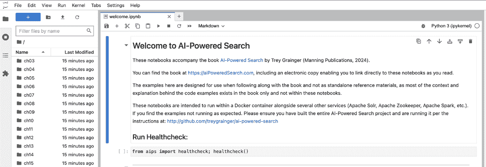
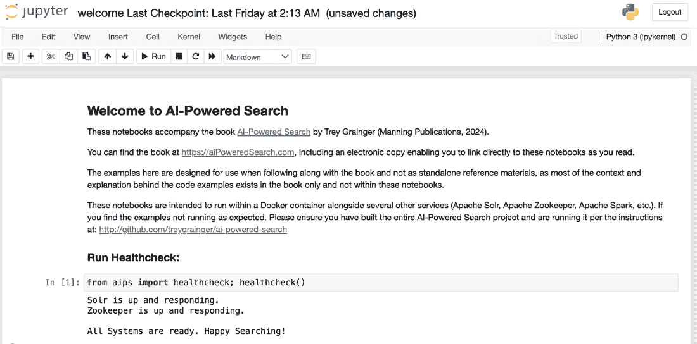

# 附录 A 运行代码示例

在您的“基于 AI 的搜索”之旅中，我们将通过大量代码和运行软件示例来展示本书中的技术。本附录向您展示如何轻松设置和运行附带的源代码，以便您可以在处理材料时实验实时运行的示例。我们将介绍如何打包本书的源代码，拉取和构建源代码，以及如何使用 Jupyter 笔记本和 Docker 来运行示例。

## A.1 代码示例的整体结构

构建一个基于 AI 的搜索系统需要集成许多组件和库。对于我们的默认搜索引擎，我们将使用 Apache Solr，它内部依赖于 Apache ZooKeeper。您也可以用许多其他流行的搜索引擎和向量数据库替换 Solr——有关说明，请参阅附录 B。

对于重要的数据处理和机器学习任务，我们使用 Apache Spark。我们使用 Python 作为所有代码示例的编程语言，并依赖于许多 Python 库依赖项，以及其他系统依赖项（如 Java），其中一些系统需要这些依赖项。当然，我们还需要以用户友好的方式执行代码示例并查看结果，这通过使用 Jupyter 笔记本来实现。

为了让整个过程尽可能简单，我们不是安装几十个软件库和数百个依赖项来使所有这些工作正常，而是将本书的所有示例打包到 Docker 容器中，这些容器已经完全配置并准备好使用。这意味着在运行本书中的代码示例之前，您只需安装一个先决条件：Docker。

Docker 允许创建和运行微小的容器——这些是完全功能的虚拟机，仅运行一个轻量级的操作系统，其中已安装并配置了所有需要的软件和依赖项。这使得您可以在大多数操作系统（macOS、Windows、Linux）上运行代码，而无需配置任何特定于系统的依赖项。

一旦所有服务都启动，本书中的所有代码列表都将通过 Jupyter 笔记本提供，这些笔记本将作为运行和实验代码示例的接口，以查看生成的输出。

## A.2 拉取源代码

本书附带的源代码可在 GitHub 上找到：[`github.com/treygrainger/ai-powered-search`](https://github.com/treygrainger/ai-powered-search)。要拉取代码，您可以使用已安装的 Git 客户端或在您首选的开发文件夹中打开命令行界面，并运行以下命令：

```py
git clone https://github.com/treygrainger/ai-powered-search.git
```

您现在应该在当前目录中有一个名为 ai-powered-search/的新文件夹，其中包含本书的所有源代码。

如果您没有安装 Git 或无法通过前面的命令拉取代码，网站上也提供了一个选项，可以通过您的网络浏览器下载源代码的 zip 文件，然后您只需将其解压缩到您的开发文件夹中。

如果您愿意，可以重命名或移动 ai-powered-search/文件夹；在本书的其余部分，我们将简单地使用变量`$AIPS_HOME`来指代此目录。

## A.3 构建和运行代码

如前所述，Docker 是您必须在系统上安装的一个关键依赖项，以构建和运行*AI-Powered Search*代码示例。我们不会在这里介绍此安装过程，因为它依赖于系统，并且会不时发生变化。请访问[`docker.com`](https://docker.com)以获取下载和安装说明。我们还应该注意，除了 Docker 之外，还可以使用其他容器管理工具，如 Podman，但我们将不会在这里介绍这些工具。

一旦您安装了 Docker，请确保在您的命令行界面中将目录更改为`$AIPS_HOME`目录（`cd` `$AIPS_HOME`）。要构建和运行代码库，您只需运行以下命令：

```py
docker compose up
```

注意，此命令等同于运行 `docker compose up solr`。本书的代码库支持多个搜索引擎和向量数据库，并且最后一个（可选）参数允许您指定您想要使用的引擎（默认为 Apache Solr）。例如，如果您想使用 OpenSearch，您将运行 `docker compose up opensearch`。有关其他支持搜索引擎的更多信息，请参阅附录 B。

提示：`docker compose up`命令在您的控制台前台运行，这允许您实时查看所有日志流，但这也意味着如果关闭控制台，所有容器都将停止。如果您想在不关闭或继续使用控制台的情况下在后台运行容器，可以传递`-d`或`--detach`参数（`docker compose up -d`）。如果您这样启动它，请确保在完成后明确运行`docker compose --profile all down`，以停止容器在后台无限期运行，消耗资源。

此命令第一次运行需要一段时间，因为它会拉取构建和运行本书所附软件所需的所有代码、操作系统和依赖项。然而，一旦命令完成，您将拥有所有必要的服务（Jupyter、Spark、ZooKeeper、Solr 等）在单独的 Docker 容器中运行。

现在，要开始，只需打开您的网络浏览器并访问 http://localhost:8888。这将重定向到欢迎屏幕，列出本书的所有章节及其对应的 Jupyter 笔记本（图 A.1）。您现在可以点击任何章节以启动其代码示例。



##### 图 A.1 欢迎屏幕。一旦你看到这个，*AI-Powered Search* 容器就构建完成，Jupyter 笔记本正在运行。

默认情况下，Jupyter 笔记本被加载到 Jupyter Labs 环境中，这是一个用于处理、调试和导航笔记本的开发环境。它允许你同时打开和编辑多个笔记本（在单独的标签页中），并在你探索时在屏幕左侧导航和修改目录结构。

如果你只想在更简单的环境中跟随书籍，你可以选择访问 http://localhost:8888/notebooks 并导航目录表，逐个笔记本地跟随，随着你在书中前进。我们将在下一节中使用这个更简单的界面，尽管默认的 Jupyter Labs 环境在 http://localhost:8888\ 中提供了相同的功能（以及更多）。

## A.4 使用 Jupyter

一旦你查看 `welcome.ipynb` 笔记本，你会在屏幕上看到几个数据单元，包括一个介绍消息、“健康检查”脚本以及包含书中可执行示例的各个笔记本的目录表。

如果你之前从未使用过 Jupyter，它是一个允许你在浏览器中混合标记（通常是说明和解释）和代码的工具，并且可以编辑、运行和与代码示例的输出进行交互。这使得学习变得更加容易，因为你不需要使用命令行工具，而是可以通过点击按钮与准备好的可执行示例完全交互。

你会注意到屏幕顶部附近有一个工具栏，允许你与笔记本中的内容部分（称为 *单元*）进行交互。你可以使用这些工具上下导航，停止和重新启动笔记本，或使用“运行”按钮按顺序执行每个单元。

在图 A.2 中，当健康检查代码单元被突出显示时点击“运行”将导致健康检查执行以确认所有 Docker 容器正在运行，并且其中运行的服务是健康的并且正在响应。


##### 图 A.2 运行代码示例。在工具栏中点击“运行”将执行当前单元中的任何示例（如果有）并转到下一个单元。

图 A.3 显示了当一切按预期运行时你将看到的响应。



##### 图 A.3 健康检查成功。如果一切运行正常，你应该看到这条消息。

在这一点上，你可以向下滚动到目录表，并逐章浏览笔记本。当然，由于示例背后的解释包含在书中，你可能更喜欢在阅读书籍的同时处理示例，以便在运行它们时拥有适当的背景知识。Jupyter 笔记本不是旨在作为独立示例，所以你可能需要将书籍放在附近以提供上下文。

所有 Jupyter 笔记本都设计为独立幂等的。这意味着，虽然笔记本中的所有步骤都需要按顺序执行以保证成功的结果，但你总是可以从任何笔记本的开始处重新开始，并且它将“重置”到执行后续步骤所需的预期结果。如果你在笔记本中遇到错误，只需回到页面上的第一个单元格并重新运行整个笔记本即可。

## A.5 使用 Docker

虽然前几节中的所有内容都应该按预期工作，但当然有可能你在过程中会遇到问题。你可能会遇到的最大挑战是其中一个 Docker 容器，或者其中运行的服务失败。如果你正在更改某个服务的基础数据或配置，例如，你可能会将其置于不良状态。

当这种情况发生时，你总是可以拆毁你的容器并重新开始。为此，只需从 `$AIPS_HOME` 目录运行以下命令：

```py
docker compose --profile all down && docker compose up
```

请记住，如果你对笔记本或代码进行了任何更改，当你运行 `docker` `compose` `--profile` `all` `down` 时，你已完成的工作将会丢失。一般来说，示例被设计为短暂的。如果你想跨容器重建保留你的工作，你可以修改 docker-compose.yaml 文件以将文件夹挂载到本地驱动器，或者使用标记为 `external` 的 Docker 数据卷，这将保持持久性。如果你计划在 Docker 文档中进行更改，请参考 Docker 文档，因为机制和 API 可能会不时更改。

如果你修改了代码示例或你的配置，你可能还需要重新构建你的 Docker 镜像。当你第一次运行 `docker compose up` 时，它将拉取或构建你的镜像并启动它们，但它不会在第一次构建后重建。为了在重新启动 Docker 容器之前重建一切，你可以运行以下命令：

```py
docker compose up --build
```

如果你只想暂时停止正在运行的 Docker 容器并在以后恢复，你也可以运行 `docker` `compose` `--profile` `all` `stop` 来停止，然后在稍后运行 `docker compose start` 来恢复。如果你想在下次启动时保留所做的任何更改而不重置到笔记本的干净版本，这将非常有用。

这应该会给你运行所有 *AI-Powered Search* 中的笔记本和代码所需的一切。
