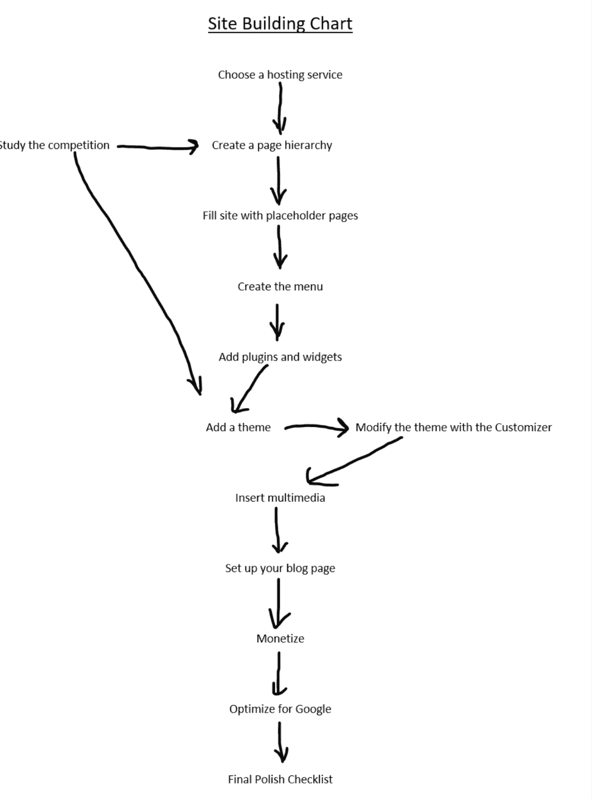

# 第一章：WordPress 主宰了互联网

### 本章内容包括

+   为什么 WordPress 主导了当今大部分的网站

+   本书方法如何利用人工智能的力量将任何网站提升到更高水平

+   网站构建者面临的 12 个常见挑战

如果你刚开始使用 WordPress，你选择了正确的书！你可能应该从头到尾地阅读这本书，这样你就可以建立一个一流的网站。

如果你是 WordPress 专家，你仍然可以在这里找到许多你不知道的提示和解决方案。你可以把它当作一本参考书——跳跃阅读，发现许多提升和改进你网站的方法。

但无论你在 WordPress 方面的专业水平如何，本书都将向你展示如何运用人工智能（AI）提供的强大新工具的数十种方法。你可以肯定，你最成功的竞争对手现在都在使用 AI，所以不要落后。AI 可以使一个好站点变得更好。

本章提供了 WordPress 概述，并解释了多年来许多竞争对手的 CMS（内容管理系统）为何相继失败。WordPress 占据了 65%的市场份额！排名第二的 Joomla 只有 4.6%。这个惊人的差距有几个很好的原因。

本章还向你展示了如何使用人工智能将你的网站提升到下一个水平。人工智能如何在多个方面帮助你，以及如何编写有效的提示以获得最佳结果。最后，你将看到如何克服任何 WordPress 网站构建者所面临的主要挑战。

##### 提示

这本书中的一些示例基于一个虚构的 Instant Pot Recipes 网站，但如果你只想将这些教训应用于自己的网站也没问题。然而，如果你愿意，你可以在附录 A 中找到创建该练习站点并安装 Twenty Sixteen 主题的说明。此外，本书侧重于经典的 WordPress 编辑器，而不是 Gutenberg 区块编辑器。因此，你可能想安装经典编辑器插件（附录 A 中也有解释）。尽管如此，我还是包含了使用新的 WordPress 区块编辑器完成任务的平行说明。第十三章完全致力于探索区块编辑器。

## 1.1 为什么 WordPress 胜出

在 WordPress 出现之前，建立网站需要你与三个可怕的“T”——繁琐、技术性和耗时——作斗争。大多数人根本无法做到！

WordPress 是对传统网站构建工具如 DreamWeaver 和 Drupal 的重大改进。首先，WordPress 消除了编写编程代码的需要。结果，现在几乎每个人都能为自己建立令人印象深刻的网站——不管是个人、专业、电子商务、教育还是商业。而且他们可以在几周内完成，而不是几个月。

我假设你正在阅读这本书，因为你已经明智地选择使用 WordPress 创建或管理你的网站。我将向你展示如何快速构建一个完全专业、独特的网站。一个你可以非常自豪的网站！

本书告诉您如何在使用 WordPress 创建、修改和维护出色而繁荣的网站时取得成功。章节从基础到更高级的主题逐步展开。我会用清晰的细节和具体的例子来解释事情。本书充满了解决方案，以确保您在遇到这些任务时能够高效地取得成功：

+   选择合适的托管服务。

+   确保网站安全。

+   预先规划网站。

+   使用插件添加功能。

+   为网站找到最佳主题，以使设计符合其目的。

+   调整主题使您的网站看起来独特。

+   添加媒体——图片、音频和视频。

+   设置博客页面，以便您的受众能够与您的网站互动。

+   通过货币化创建收入流。

+   优化网站以获得良好的搜索引擎或人工智能排名。

+   掌握分析工具以提高网站效率。

+   建立受众群体——吸引访客的技巧。

+   探索新的区块编辑器。

+   在您完成本书后使用的资源。

学习构建和管理自己的 WordPress 网站是一个非常好的主意。WordPress 从头开始就设计得易于使用。我在 ed2go 上教授了两门在线 WordPress 课程，我的学生们掌握了他们在六周内创建完全专业外观的网站所需的工具和技能。通过本书，您也可以达到这种熟练水平！

雇佣开发人员来构建您的网站可能会既昂贵又令人沮丧。首先，您必须找到一个您希望是称职的开发人员。许多开发人员更擅长编程而不是设计，因此您很容易最终得到一个功能顺畅但外观（委婉地说）相当丑陋的网站。太多的媒体，或太少。拥挤、贫瘠或不平衡的布局。不合适或不可读的字体。不合适的颜色方案。您明白我的意思。

或者反之：您的开发人员是一位具有强大设计背景的艺术家，但在建立功能齐全、逻辑清晰且导航高效的网站方面遇到了困难。尽管外观漂亮。

此外，网站建成后，当您召回开发人员进行网站维护时，通常会产生相当大的额外费用。而且您的网站需要维护。插件和 WordPress 本身的安全更新频繁。随着您的网站发展，您可以获得反馈并使用分析工具了解如何使网站对您的受众体验更好的方法。您希望自己进行这样的调整。

话虽如此，如果您没有时间，有了钱，市场上也有很棒的开发人员——有些收费相当合理。

注意，设计改进也不容忽视——网站设计趋势随着时间变化，您希望您的网站保持时尚。如果您自己能做到这些，您既节省了金钱，也节省了时间（开发者有时会很忙，必须排队等候）。网站维护——就像建站一样——比大多数人想象的要容易得多，您很快就会发现。

## 1.2 WordPress 提供了什么。

WordPress 于 2003 年首次亮相，结果使得构建网站变得更加简单和高效。自 2011 年以来，WordPress 的使用量每年平均增长 12%。

让我们来看看 WordPress 之所以如此优越于其他替代品的主要原因。它们包括以下内容：

+   *安装简单*—在大多数 WordPress 托管服务中都有一个简单的一键安装工具，只需将新的、空的 WordPress 站点挂载到您的托管帐户即可。无需技术知识。

+   *无需编程*—WordPress 是无需编码的（除非您想编码）。没有技术背景的人发现他们不需要知道如何进行编程。WordPress 会在幕后为您创建编程代码。您通过移动滑块、拖放、点击以从选项列表中选择等方式进行*可视化*工作。您可以在一个高度高效的图形系统中创建您的站点页面，而不是编程的系统。您可以在不需要了解如何编写 HTML、PHP、JavaScript 或 CSS 代码的情况下创建和修改站点内容。您可以使用鼠标调整页面布局、响应按钮或链接点击、文本特性和其他站点元素，而不是使用令人心烦的键盘编码。简而言之：用户界面是高效、友好和直观的。

+   *大量的专业设计主题—*如果您愿意，您可以将您的网站设计交给专业设计师。您可以从 30,000 多个免费或付费主题中进行选择。WordPress 主题决定了一个网站的外观——颜色方案、布局、字体和其他样式元素。然而，您可以自定义和修改这些默认视觉元素，使您的网站独特。

+   *可定制*—WordPress 高度可定制，使用户能够轻松对其网站的设计和功能进行更改。如果你有兴趣，*可以*添加自己的编程代码，但这并不是必需的。

+   *大量的插件选择*—您可以在官方 WordPress 目录中找到超过 60,000 个插件！它们为网站添加功能，例如动画图片库、备份系统、与社交媒体的连接等等。这些插件可以通过一次鼠标点击安装。

+   *内置媒体管理*—WordPress 包含一个内置的媒体库，可以轻松上传、组织、修改和插入图像和其他媒体到您的帖子和页面中。

+   *响应式设计*—大多数流行的 WordPress 主题都设计为*响应式*，这意味着它们会自动调整您的内容以适应它所在的屏幕大小，从而轻松创建移动友好的网站。然而，在网站发布之前，您应该在各种屏幕尺寸上进行测试：手机、平板电脑和计算机显示器。这样您就可以根据需要进行调整。

+   *友好的 SEO*—WordPress 是为*搜索引擎优化*（SEO）而构建的，使您可以修改您的网站以在人们搜索您网站的主题时获得更高的排名。

+   *高效的页面构建* —— WordPress 包含许多工具，可在短时间内快速构建成功的网站。

## *1.3* *为什么使用人工智能*

工业革命的机器大大增强了人类的物理能力。现在我们正在经历一个更快速和影响更深远的革命：*AI*（人工智能）正在增强我们的智慧、才能和创造力。GPT、Perplexity、Midjourney、Claude、Bing、Bard 等 AI 系统的快速而令人瞩目的成就使它们成为许多领域的必备助手。如果你从事医学、法律、写作、绘画或其他许多创造性或白领领域的工作，你就需要使用 AI。网站开发也不例外。与你竞争的网站的设计师和管理员正在使用 AI 帮助。为了保持竞争力，你需要使用 AI。

### 1.3.1 AI 产生高质量结果（正确使用时）

下面是一个简单的例子，展示了 AI 的惊人技能。我请了 Midjourney，一个文本到图像的 AI 平台，创建了这样一个作品：“以爱德华·霍普风格创作的题为‘我做了什么？他去哪了？’的绘画。”

它提供了这幅完全原创的画作，如图 1.1 所示，我相信霍普本人会为之感到非常自豪。

##### 图 1.1 AI 能产生令人惊叹的艺术品。这幅画是霍普作品中值得一提的一部分。在 AI 出现之前，即使是专家也会说这是一幅最近发现的丢失的霍普原作。


图 1.1 展示了 AI 能够达到的高质量水平。这幅作品具有霍普的风格元素，并传达了他大多数绘画作品的麻木和孤独主题。

AI 创意合作者能为 WordPress 开发者做些什么？你将得到一群高技能的助手。AI 可以是：研究员，主要编辑，技术编辑，标志设计师，插图画家，副本编辑，校对员，画家，评论家，初稿写作助手，专业着色师，原创思想的源泉，有才华和经验丰富的网站设计师，你可以向其咨询*你的*想法，用户体验分析师以及竞争网站的评论者。还有几乎任何你会雇人做的其他工作的大师。（只要不是像吸尘那样的体力活。）

当我列出 AI 可以协助创建和完善网站的方式时，我使用了 AI 吗？当然。我写了前十条，然后让 Bard 列出了更多。

利用 AI 进行头脑风暴是其最强大的功能之一。你可以得到专家建议和非常有创意的建议。提出一个问题，然后进行一次对话，或者从它给你的列表中选择。试试这样一个提示：

*请帮我头脑风暴一下我新网站的标题。问我问题，但在每个问题之后，等待我的回答。*

（请注意，我们在这里比较含糊。我们希望 AI 向我们提出一系列问题，更像一次真正的头脑风暴会话。）在提出几个问题后，它列出了十个可能的标题，包括约三个非常有创意的标题，比如“从码头到晚餐的兰德尔曼湖鲈鱼钓鱼”。然后你可以询问 AI 哪三个是它最喜欢的。只是为了好玩。

需要注意的是，当你使用 AI 来创建图像等任务时，你的工作是在不同的层面上。你成为*策展人*，决定哪些图像是最好的。如果 AI 编写了初稿，你成为编辑，核查并优化写作。或者，在头脑风暴中，你从几个建议中选择最好的一个。换句话说，你从内容的作者变成了内容的评判者。

### 1.3.2 掌握提示的写作

你向 AI 系统提出的问题（称为*提示*）将决定 AI 产生的质量和有用性。一个坚实提示的主要优点是它是*具体的*。

这是一个不够具体的提示示例：

*写一篇关于一位经营面包店的女企业家的文章。*

如果你用更多的细节提示，你会

*你是一名获奖的人文主题杂志作家。请写一篇 1500 字的特写，讲述一位成功的面包店老板的故事，并分享她如何平衡工作和生活。需要包括她的外貌、个性、日常生活和人际关系的细节。*

##### 注：

AI 希望收到完整的句子或短语作为提示，就像你在与人交谈一样，而不是像大多数人使用 Google 那样仅列出一些关键词。简而言之，AI 系统旨在进行对话并深刻理解上下文和你的偏好，而 Google 仅匹配关键字而没有烦琐的理解。Google 给你一个链接列表，可以访问其中你的关键词与其数据库匹配的答案，而 AI 则直接给出*答案*。

对于大多数提示，包含以下七个元素会有所帮助：

1.  告诉 AI 它将要扮演什么专家角色；给它一个角色，比如律师或艺术评论家。因此，提示以变化开始，如“*你是* 有技能的机械师”或“*扮演* 大师级的蛋糕装饰师”。AI 有时会拒绝，说它不是律师，或者作为 AI 它没有个人意见。但通常它还是会给出好的答案。让 AI 扮演一个角色似乎在两个方面影响结果：答案可以更可靠，因为它来自专家，而且所使用的措辞和惯用语符合角色（“你是卡车司机”可能导致“在这里运行两条五，你会得到一个保险杠贴纸”翻译：*开 55 英里/小时，你会被紧随其后*）。你还可以告诉 AI 它是一个特定的角色或人物：*扮演米奇老鼠*或*你是猫王*。

1.  描述语调——对话式、正式、法律性的，等等。如果您分配的角色决定了写作风格，这可能不是必要的。这个变体是指定你的目标受众——儿童、艺术学生、厨师、一群信徒。简化复杂主题的一个好方法是这样提示：用一个十岁的孩子的语言解释量子计算。

1.  给予 AI 有关您想要的输出的大小和类型的具体信息：五行打油诗，编号列表，1500 字博客文章，链接到，逗号分隔的值，按热度排序，在一个段落中总结等等。一些 AI 还可以给您提供图片。此外，您还可以要求 AI 重新格式化您的现有文本。例如，给它一个段落，并要求它将句子按字母顺序列出。或者粘贴一篇长文章，要求它在一个段落中总结内容。

##### 提示

目前 AI 在字数统计方面并不是很好，因为它使用*标记*。这些是文本单位，但不一定是单词。标记不是一对一地映射到单词。例如，标点符号是一个标记。术语*冰淇淋*只有一个标记。因此，如果有很多标点符号，AI 的回应就会比您请求的单词少，如果有几个多词标记，您会得到更多的单词。当被问及时，克劳德为拒绝提供确切的字数统计辩护，因为“*连贯性、相关性、事实准确性等指标被优先考虑*”。换句话说，在这种情况下，它更愿意提供质量而不是数量。很公平。

1.  语言清晰简洁。你甚至可以要求 AI 向 *你* 提问：“给我制作砂锅饭的逐步说明。询问我有关它的必要问题，然后在我回答后提供食谱。”GPT 回应了以下问题：“蛋白质类型，淀粉基（面条、米饭或土豆？），蔬菜，酱料，任何配料，辣度，和饮食限制。”

1.  提供背景：13 世纪建筑、希腊地理、墨西哥历史。

1.  可选择提供你所寻找的示例。

1.  指定多个元素：我是否可能需要更换我 2005 年福特 F150 XLT 的悬架？这辆卡车状况良好，行驶了 22 万英里，在匹兹堡行驶，有很多坑洼。您提供的细节越多，结果就越接近您的目标。

##### 提示

如果 AI 提供的结果过于笼统、不适当或明显错误，请告诉它并要求提供另一个回答。你可以用不同的方式提出同样的问题，要求它详细说明，给它一些额外的细节，或要求它重新思考（或事实检查）其回答。尝试告诉它将答案改写成逐步列表或待办事项列表。记住，AI 与传统搜索引擎的不同之处在于，你可以通过对话引导它来实现你的目标。大多数 AI 在被纠正时会道歉并感谢你提供的信息。它们会将修正存储在内存中，以避免再犯同样的错误。不要害羞。据说 AI 没有受伤的感觉，所以如果它回答不好，请直接输入“给我一些支持你回答的证据。”或者“为什么你这么说？”或者“这太长了，把你的回答缩短一半。”

有研究表明，一个很好的开始提示的方式是用这个有趣的短语：*深呼吸，然后一步一步地解决这个问题*。要求 AI 在其回答中逻辑地一步步进行的想法被称为思维树（TOC）。在某些类型的查询中，这样做会得到明显更好的答案。

`www.lesswrong.com/posts/37LWXb3cvC7NLJN6x/ai-29-take-a-deep-breath`

你可以将几种提示实践结合到一个提示中。这个示例使用了一个角色、TOC 和与你的互动：

*作为一个专业的网站设计师，列举一下你在设计一个新的电压锅食谱网站时的思考过程的步骤。具体说明网站的整体组织结构，主题以及你计划如何使其变得流行。在每一步之后，在你继续之前暂停一下，问问我是否有什么建议。等待我回答。*

*当你从更一般的概述向特定的建议深入挖掘时，你可以使用类似的方法。下面是一个结合了几种提示技巧和深入挖掘的例子：*

*作为一个专业的网站设计师，列举一下你在发现如何在 WordPress 中执行某项操作时寻找最佳资源的思考过程的步骤。首先找到五种好的资源类型（例如 WordPress 论坛，托管网站的技术支持，你的一个朋友）。然后第二步是评估这些资源，并决定其中两个最有用的。解释你的理由。最后选择最好的资源，并提供一个例子。在每一步之后，在你继续之前暂停一下，问问我是否有什么建议。等待我回答。*

并不是所有的 AI 系统都会遵循你在每一步之后暂停以等待你的反应的建议。目前，GPT、Bing 和 Claude 会这样做，但 Perplexity 不会。

### 1.3.3 生成自己的 HTML

请注意，你可以要求 AI 以多种格式提供结果。让我们假设你想在网站的某个页面上显示一个表格。给 Claude 这个提示：

*列出美国最大的五个湖泊。将结果呈现在 HTML 表格中。*

它将生成必要的 HTML 代码，您可以将其复制并粘贴到站点“编辑页面”屏幕的“文本”选项卡中：

```py
<table> <tr> <th>Lake</th> <th>Surface Area (sq mi)</th> </tr> <tr> <td>Lake Superior</td> <td>31,700</td> </tr> <tr> <td>Lake Huron</td> <td>23,010</td> </tr> <tr> <td>Lake Michigan</td> <td>22,300</td> </tr> <tr> <td>Lake Erie</td> <td>9,910</td> </tr> <tr> <td>Lake Ontario</td> <td>7,340</td> </tr> </table>
```

但你总是可以跟进请求的改进：

*使列头为黑色，字母为白色，并全部大写*

结果是：

```py
<table> <tr> <th style="background-color:black;color:white;">LAKE</th> <th style="background-color:black;color:white;">SURFACE AREA (SQ MI)</th> </tr> <tr> <td>Lake Superior</td> <td>31,700</td> </tr> <tr> <td>Lake Huron</td> <td>23,010</td> </tr> <tr> <td>Lake Michigan</td> <td>22,300</td> </tr> <tr> <td>Lake Erie</td> <td>9,910</td> </tr> <tr> <td>Lake Ontario</td> <td>7,340</td> </tr> </table>
```

如果你愿意，可以不断完善。*使每隔一行的背景变成浅灰色*。让 AI 为诸如表格之类的内容生成 HTML 可能比使用文本框中提供的表格功能更快（也更可定制）。或者通过使用插件。

熟练的提示称为*提示工程*。鉴于这是一种心智技能，你会惊讶地发现 AI 本身擅长撰写提示吗？你可以提交自己的提示，并要求 AI 用更好的提示进行回应。以下列出了一些你可以尝试的 AI 提示生成器。（或者直接向“你知道谁”询问最好的三个提示生成器的链接。）

`www.geniept.com/`

`promptomania.com/`

`promptperfect.jina.ai/`

`phraser.tech/builder/image_generation`

## 1.4 如何在 WordPress 中取得成功

创建和维护 WordPress 网站的人面临着 12 个主要挑战。本书按照通常在构建网站时遇到的顺序对其进行了覆盖。因此，让我们来看看人们在构建他们的网站时通常会采取的典型步骤。

+   图 1.2 是创建新 WordPress 网站过程的概述。

##### 图 1.2 这些是构建 WordPress 网站时所采取的主要步骤



下面列出了在创建和维护网站时遇到的主要挑战类别：

+   寻找最佳主机服务

+   预先计划

+   设置站点结构

+   以对话式网站风格撰写

+   选择正确的插件

+   选择一个出色的主题

+   自定义主题

+   有效地管理媒体

+   设置博客页面

+   在货币化时获得良好的结果

+   为搜索引擎成功优化你的网站

+   建立观众群体

+   尝试 Gutenberg 编辑器

## 1.5 管理设置过程

在实际开始处理你的网站之前，你需要采取几个重要的步骤。找到并注册最好的主机服务。你将在云端使用 WordPress，你的网站将存储在主机服务器上并受到保护。WordPress 本身是免费使用的；它是开源的。

可以，但很困难，在自己的硬盘驱动器上托管您的站点。但您会想要使用供应商提供的实用工具、安全、技术支持和其他许多特性。他们可能相当合理，并且使构建、维护和保护您的站点*更容易*。最佳主机是 DreamHost、Bluehost 和 SiteGround。这是 WordPress 本身推荐的三个选项。即使是有经验的站点开发人员也会遇到问题，对于我们大多数人来说，具有出色技术支持——快速而准确——是必不可少的。

## 1.6 预演计划

一个网站应该是有机的——它应该有良好的*连贯性*和焦点。如果您决定随机应变，随意添加，很容易随意拼凑许多特性和设计的碎片，这个结果可能是一个不连贯的集合，导致整体目的和背景不清晰。页面之间的转换可能会显得令人意外。站点导航可能效率低下。设计可能看起来杂乱无章。在本书中，我们将看几种方法来确保在站点构建的最初阶段就有凝聚力和一致性。

这似乎有点违反直觉，但是一个专注于狭窄主题的站点几乎总是能吸引并保留更大的受众。计划站点主题的人们通常错误地认为大量的访客对像*钓鱼*这样的一般主题感兴趣。但是，除非您是一个著名的钓鱼者，否则这种太一般化的主题很容易让您的在线努力陷于遗忘。原因很简单，反直觉：竞争。谷歌搜索“fishing”，你会获得 30 多亿个结果。而搜索“Oconaluftee 河的飞钓”会将您的竞争对手降至零或只有几个。

唯一成功的非重点网站是关于名人的，因此已经有内置受众了。而且这个受众对名人的旅行和其他活动相关的各种主题都很感兴趣。

## 1.7 设置站点结构

当人们发现你可以在几个小时内设置站点中所有页面和子页面时，他们通常会感到非常惊讶！只需点击“添加新页面”按钮并输入页面标题即可在站点中填充空白、占位符页面。稍后，您将用文本和媒体内容填充它们。但是创建整体站点结构非常快速和简单。

## 1.8 使用会话式口吻写作

大多数网站内容都以轻松、亲切的风格编写。除非内容面向学术、法律或其他期望正式写作的受众，否则您应该采用会话式口吻。写作时像与朋友交谈一样。第四章将向您展示如何使用人工智能以不同风格重写您的文本内容。

## 1.9 选择正确的插件

*插件*为 WordPress 网站添加功能。你需要一个用户可以点击的按钮将您的网站翻译成另一种语言吗？您想在动画幻灯片中展示您的艺术作品吗？您的网站的博客需要受到垃圾邮件的保护吗？大约有 60,000 个插件，这个数量既是好事也是坏事。你有很多选择，但你想学会如何挑选最好的。

好的一面是你可以找到相当多优秀的插件可供选择，其中许多甚至是免费的。不好的一面是没有插件开发者有时间测试他们的插件与其他 59,000 个插件的兼容性。如果你注意到一些奇怪的行为（bug），首先看看你的插件。插件副作用是 WordPress 中最常见的 bug 原因。话虽如此，大多数插件，尤其是非常流行的插件，都能很好地配合在一起。

##### 定义

*插件*是一个添加特定功能到网站的软件组件。例子包括事件日历、联系表单、社交媒体集成、加速页面加载和垃圾邮件拦截器等。插件类似于手机应用程序——它们可以是免费或付费的，可以添加功能，并且可以随意安装或卸载。

##### 定义

*副作用*本质上就是一个 bug——一些奇怪的行为，比如应该在页面上可见的东西，但没有。或者你看到一个错误消息。Bugs 可能导致崩溃、冻结、信息显示不正确或其他意外行为。如果你在 WordPress 中有一个 bug，调试的第一步是暂时停用所有插件（这很容易做到），然后逐个重新激活它们。当 bug 再次出现时，你刚刚重新激活的插件就是罪魁祸首。卸载它并找到一个替代插件。有数万个插件，所以你不会遇到任何问题找到一个好的替代品。Google：*最佳 WordPress 联系表单插件。*或者问一个 AI。鉴于现有的高质量插件选择众多，没有必要浪费时间去弄清楚为什么你的插件之一会引起问题。

在本书中，我们将探讨如何选择可靠的插件，这些插件不太可能被其创建者放弃，与其他插件兼容，且保持更新以防止引入安全漏洞。一个好的策略是选择分为两个层次的流行插件——免费和付费版本。这些*freemium*插件为其开发者提供了收入来源，因此可能会被保持更新。（出于同样的原因，你也想选择 freemium 主题。）

## 1.10 选择最佳主题

如果你知道要选择哪个主题，主题会为网站添加专业设计。大多数访问者不会有意识地注意到许多设计元素。颜色、布局、字体等都在大多数人的视线以下。但这并不意味着他们不受设计的影响。恰恰相反！

设计不佳的网站可能会以多种方式使您的访客感到恼火、不悦、沮丧、恐惧、困惑等等。所以，由于我们大多数人不了解色彩理论或字体变化，专业设计师会考虑这些和其他因素，并创建出外观好看的主题。

当您初次安装 WordPress 时，它会带有由 WordPress 自身创建的默认主题，并以当年的命名：Twenty Twenty、Twenty Twenty-Four 等等。但是您可以安装其他主题。有些主题是免费的，有些是付费的。但像插件一样，选择免费和付费主题都可以避免将来出现问题。免费和付费主题为其创建者提供收入，因此很少会被废弃。所以您将不会被迫在将来切换到新主题。这可能会造成问题，特别是如果您的网站变得很大。

主题还包括定制选项，可以让您自定义默认网站设计，包括各种字体选择、颜色选项、替换页眉图片等。这些定制项位于外观 > 自定义屏幕中。

尽管经常被网站构建者忽视，但外观也很重要。您希望您的受众感到舒适，即使他们无法解释为什么会感到舒适。在医生办公室里您不会看到红色，或者说你不会看到斗牛的画。

## 1.11 自定义主题

最好的主题会变得受欢迎，这有点不好。您不希望您的网站看起来像其他网站的克隆。它应该看起来好看，但以独特的方式。如果您的网站销售产品，您希望选择一个促进您销售的设计。如果您提供一个关于园艺的网站，您如何使用颜色获得最佳效果？换句话说，在您选择了一个主题之后，请对其进行自定义。您的特定受众希望看到什么？您可以通过哪些方式使网站看起来独特，并为网站的目标服务？

最后，如果您对选择另一种配色方案不太自信，没问题。您可能有个懂设计的朋友。异性相吸。

## 1.12 简化设计的方法

层叠样式表（CSS）是一种语言，允许您完善网站的外观，通过改写主题的样式设置。这样，您可以调整网站的设计，使其与主题更协调，并展现出更多独特性。

例如，如果您的主题正文默认使用 Garamond 字体，您可以使用 CSS 来修改主题默认设置，并将段落显示为 Roboto 或 Verdana。您在网站上几乎可以完全控制所有的视觉元素。您甚至可以将网站上的所有文本都变成绿色，或者在单个页面中更改字体样式，甚至显示*一个单词*的字体为 Roboto，其他文本仍然使用 Garamond。换句话说，您可以以高度特定、细粒度的方式修改和升级您的网站。这使您摆脱了主题所施加的设计限制。

尽管 CSS *是*一种计算机语言，但您无需学习它。有一个优秀的 WordPress 插件，YellowPencil，可以在所见即所得的用户界面中为您生成 CSS 元素。您可以移动滑块来完成诸如在页面中调整大小或重新定位照片之类的操作。点击颜色调色板更改颜色。通过从下拉列表中选择来选择新的字体，以及许多其他自定义。通过这种可视方式，您可以轻松修改和改进您的站点的外观，而无需编写任何代码。YellowPencil 知道需要哪些 CSS 代码来实现您想要的结果。

除了 YellowPencil 之外，还有一些其他质量较高的 CSS 代码生成插件，您可能想看看，特别是 CSS Hero。但在第七章，我们将花费大量时间学习如何使用 YellowPencil。

## 1.13 媒体管理

在线沟通的一个重要好处是可以添加各种各样的媒体。以下是可以改善站点的添加：

+   图片

+   音频

+   视频

+   文档，例如 PDF、Word、Excel、PowerPoint 等。

+   交互元素，如旋转图片库和谷歌地图。

+   社交媒体内容。

+   动画

网页设计中常见的一个错误是过度使用或滥用媒体。当代网站设计需要适度、轻柔的动画；图片要为网站的目的做出贡献（而不仅仅是作为装饰）；音频和视频不应自动播放。访客可以选择启动它们。我们将在第八章涵盖与在线媒体有效、当代使用相关的所有基础知识。

## 1.14 设置博客页面

博客是网站中的一个特殊、独特的页面，包含消息（称为*帖子*），通常以倒序显示。博客页面可以是与您的受众互动的一种方式，可以发布站点主题的最新新闻，也可以是回答问题的客户服务功能。许多博客不允许观众发表评论，因为审查所有传入的消息可能会耗费大量时间。但我们将研究自动批准过程的方法。例如，您可以制作一个禁止词汇表（“愚蠢”，“s***”，“仇恨”等）。如果网站收到包含任何这些词的消息，它会自动被丢进垃圾箱，永远不会在您的博客中发布。

要吸引观众，博客应经常更新——添加新内容，无论是文字还是媒体。

尽管大多数博客主要是文字性的，但有些博客专注于艺术（*artlog*），视频（*vlog*）或音乐。*微博客*是另一种博客类型，其特点是非常简短的帖子，*a la* *X*（前身为 Twitter）。

然而，多年来，已经明显地看到了几种毁掉博客并驱赶任何访客的方法——或者根本就无法吸引他们。在第九章中，您将了解如何构建和管理一个有助于实现站点目标的博客，而不是反对它。

## 1.15 赚钱

第十章涉及变现问题。网站可以通过多种方式产生收入，包括以下方式：

+   在你的网站中放置每次点击广告（链接）。当某人点击链接并进入亚马逊（或其他商家）的页面时，你就能获得佣金。

+   通过推广营销可在某人点击你网站上的链接并购买该产品后获得佣金。

+   通过像 WooCommerce 这样的电子商务插件销售自己的产品。

+   通过评论或其他有关产品的内容获得报酬。这类似于拥有企业租借的广告牌。

+   在你的网站中设置一个需要付费订阅才能进入并查看内容的高级区域。

+   提供咨询、网站设计或市场营销等服务。

+   通过添加 Easy PayPal Donation 这样的捐赠插件筹款。

这些方法并不互斥，你可以将它们结合起来。但必须小心处理变现问题，否则你可能会惹恼并缩小你的观众。请确保不要在你的网站上放置弹出式或幻灯片式的动画广告，也不要采用某些可疑的策略，如获得正面评论的报酬。

## 1.16 优化你的搜索引擎排名

要吸引观众，你需要在搜索引擎排名靠前。当人们搜索自己需要的信息时，如果你的链接被埋没在谷歌的长列表中，他们通常不会一一点开每一个链接。

AI 搜索更是如此，它们通常只显示一个或几个链接，而不是多页链接。AI 系统的设计师喜欢说，虽然 Google 给出的是一系列需要访问的网站列表才能找到你需要的答案，但相比之下 AI 直接给出了答案。

当潜在的访客搜索你的话题时，你希望你的网站链接显眼地显示出来。这意味着你希望在 Google、Bing 和其他搜索系统中得到好的排名，当它们的 Spider bot 来访、评估并向总部汇报时。

Google 和其他搜索引擎有一张不喜欢的列表。例如，如果它们发现冗余、含糊不清或不准确的信息，它们会立即扣分。

因此，作为网站管理员，你需要关注你的内容质量、网站导航、准确性、及时性和整体卓越性。换句话说，因为 Google 和其他搜索引擎努力为人们提供最佳的搜索结果，请确保你的网站是对某个问题或需求最好的答案。尝试操纵搜索引擎没有用，它们知道这些诡计。请提供*质量*。

要获得高排名并非易事，如果你计划扩大观众，那么注意搜索引擎优化（SEO）是必要的。估计有超过 80% 的上网人每天平均使用 Google 三次。对于大多数潜在访问者来说，它是访问你的网站的路径。

在早期，即 Google 之前，搜索引擎相当原始。要获得高排名是相当容易的。例如，如果你只是把*recipe*一词包含 400 次，而最接近的竞争者使用的次数较少，那么当有人搜索食谱网站时，你可以排在搜索结果的第一位。

但后来谷歌出现并改变了游戏规则。他们最初的主要突破（超越了多词、原始的定量排名算法）是模仿学术论文排名的方式。引用你的论文的其他论文数量决定了你的排名。这是*定性*的判断。如果一篇论文经常被其他学者引用，那么它必须具有质量。

同样，谷歌会查看有多少其他网站链接到你的网站（称为*反向链接*）。谷歌还考虑到链接到你的网站的网站的质量，并在确定你的网站价值时也使用该指标。此外，谷歌现在也做出了许多其他类型的判断。

由于人工智能和深度数据挖掘，今天的搜索系统非常复杂，有人说他们的评论现在相当于人类评论家的判断。

这里有一些常用的策略，可以取悦搜索机器人：

+   关键词——使用与某人在谷歌搜索时输入的相同术语

+   优化——修改你的网站，使其更接近搜索者期望在高质量网站中找到的内容——包括网站标题、标题、导航、图片和其他元素

+   内容——确保你的网站充满了对目标受众有用的高质量内容。

+   链接——寻找增加反向链接的方法。

+   速度——测试你的网站页面加载速度和整体性能，如有必要，添加一个可以加速的插件。

我们将在第十一章深入探讨 SEO。

## 1.17 利用分析来建立你的受众

网站*分析*意味着通过理解访问者的行为和测量网站的整体表现来学习如何改进你的网站。

你可以使用分析插件为你提供潜在有价值的数据，包括：

+   有多少访问者来到了网站

+   访问者在访问你之前来自哪里。

+   网站上人们查看的页面（以及停留时间）

+   他们点击的链接

+   他们通过网站的路径

+   他们离开你的网站时所在的位置

+   他们是否在网站内搜索了什么

总的来说，分析数据可以让你知道要改进哪些设计元素和内容。如果你的网站被货币化，它们还可以报告你的营销工作的效果。

## 1.18 探索古腾堡编辑器

在 2018 年，WordPress 推出了一个新的默认编辑器，名为*块编辑器*（又名古腾堡）。此前，“经典”WordPress 编辑器建立在文字处理器模型上，尽管它具有设计、媒体和其他非文本元素的功能。

Elementor 等售后市场供应商多年来一直提供了一种更加视觉化的构建 WordPress 页面的方式。这些“页面构建器”插件和主题允许您拖放功能和内容，从而更容易地可视化页面布局、格式和插入元素（如按钮或进度条）的位置。

理论上，页面构建器提供比经典 WordPress 编辑器更具 WYSIWYG、拖放编辑器。

WordPress 决定创建自己的页面构建器，其中包含各种预定义块，如段落、标题、图像、视频、画廊等等。每个块都可以自定义和以不同方式排列，以创建独特的布局和设计。其中一些块就像缩小版的插件。

但不幸的是，许多专家认为古腾堡系统是一个尚未实现的值得追求的目标。尽管 WordPress 的人才数年来一直在努力，但古腾堡仍然是一个正在进行中的工作。它不稳定——你可能学会了以某种方式做某事，然后几周后尝试重复做同样的事情，发现过程已经改变了。它也可能效率低下，难以学习和使用，尤其是如果你习惯了传统的 WordPress 编辑器。

在 HTML 中，描述网页应该如何呈现的语言中，页面布局非常复杂。*垂直* 布局很容易。在任一编辑器中，拖放（古腾堡使用）或剪切和粘贴（经典编辑器使用）都相当容易。例如，快速简单地切换两个段落的垂直位置是很容易的。将一个移动到另一个下面。

*水平* 重新定位是一种完全不同，也非常复杂的技巧，通过拖放来实现。而且这是古腾堡尚未掌握的技巧。HTML 具有描述水平布局的复杂、多个、相互作用的定位变量。你有边框、对齐、分割、边距、相对、静态、容器、填充和其他规范，所有这些都相互作用以指定对象在 X 轴上的位置。在互联网页面上的水平定位根本不是一个简单的过程。

除此之外，一些主题和插件与古腾堡不兼容，在一些站点中，古腾堡会减慢网站速度。此外，与使用经典编辑器相比，它往往不太可通过 CSS 自定义，尽管在这方面已经取得了一些进展，比如最近包含了全站点编辑（全局样式表）。

出于这些原因，许多 WordPress 专家安装了 Classic Editor 插件，它恢复了传统编辑器。他们避免使用古腾堡，直到它成为经典编辑器的完全功能、值得的替代品为止。

话虽如此，你更喜欢哪个编辑器最终是你的选择，而且有很多人喜欢古腾堡。所以这取决于你。我们将全部章节 13 都用来探索古腾堡，这样你就可以做出自己的决定。此外，在整本书中，你还会看到如何使用古腾堡来完成各种任务。

## 1.19 总结

+   WordPress 在内容管理系统中市场份额遥遥领先，因为它功能强大，无需编码，操作直观。

+   通过学会如何自己建立网站，您可以节省时间和金钱。

+   像 GPT 和 Midjourney 这样的人工智能系统可以在多个方面改善您的网站。您最成功的竞争对手正在使用它。您也应该使用。

+   通过一键操作，您可以添加主题和插件，使您的网站具有专业外观和出色功能。

+   您需要做出的一些重要初始选择包括找到合适的托管服务，并提前规划好您的网站。

+   选择正确的主题和插件，以及有效管理多媒体内容也非常关键。

+   使用 YellowPencil 插件对您网站的外观进行微调。

+   确保您处理好博客、货币化和搜索引擎优化。

+   最后，注意分析数据。收集到的关于访问者与您网站互动的数据可以指导您提供最佳体验。

+   花些时间使用新的 Gutenberg 区块编辑器，看看您是否喜欢它胜过经典的 WordPress 编辑器。
