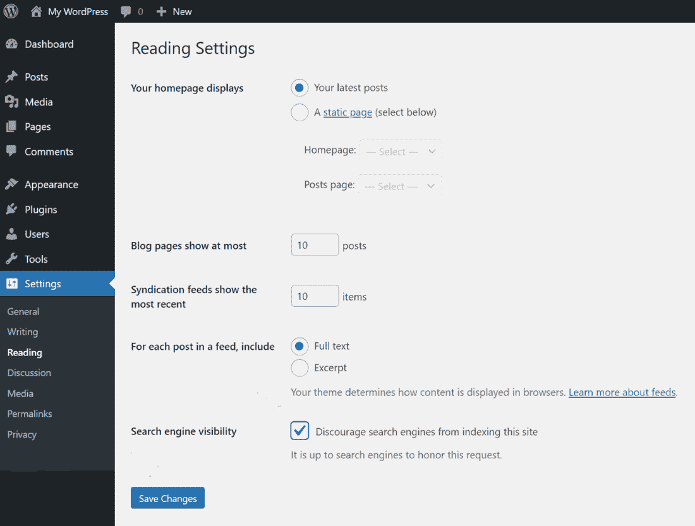
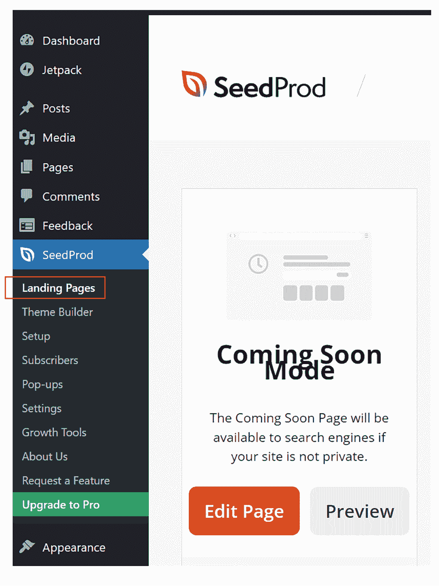
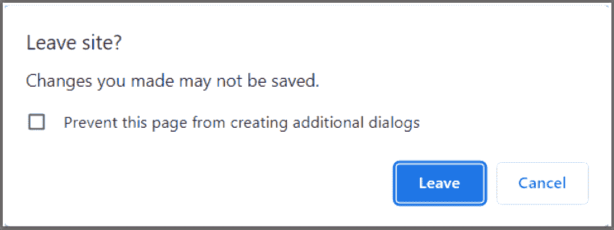
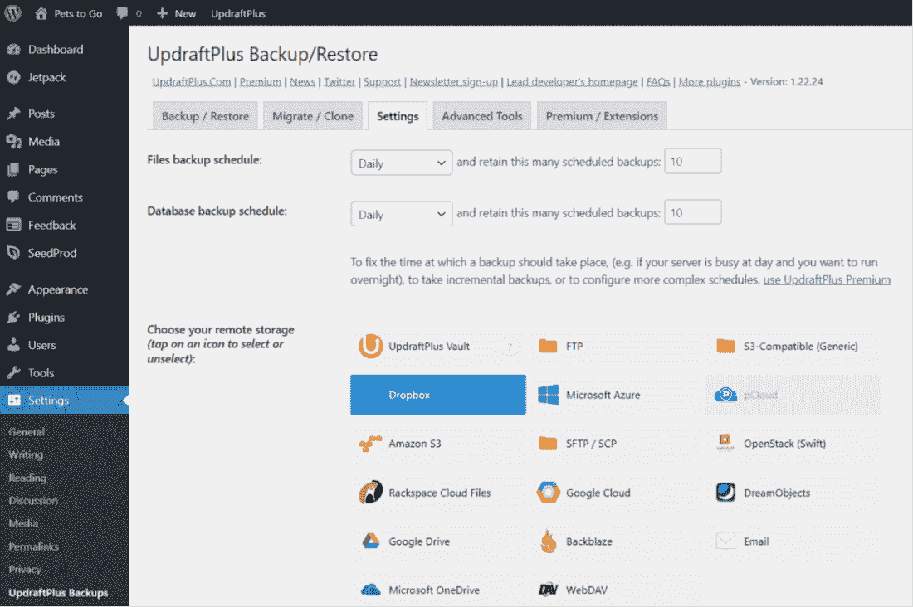
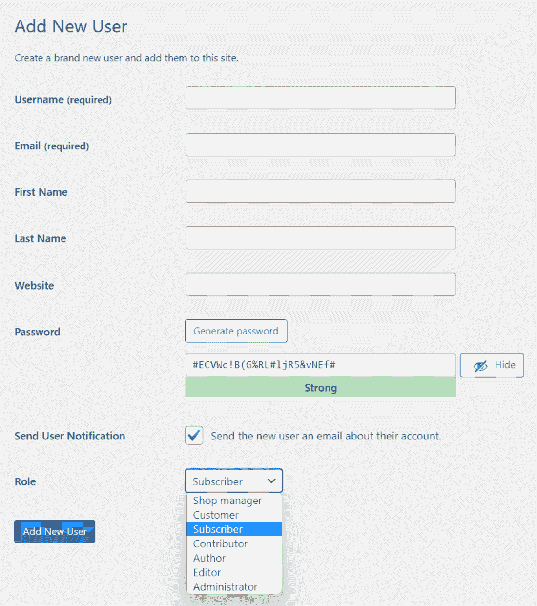
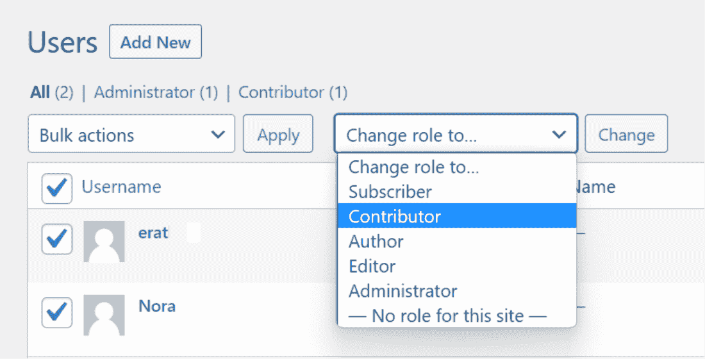
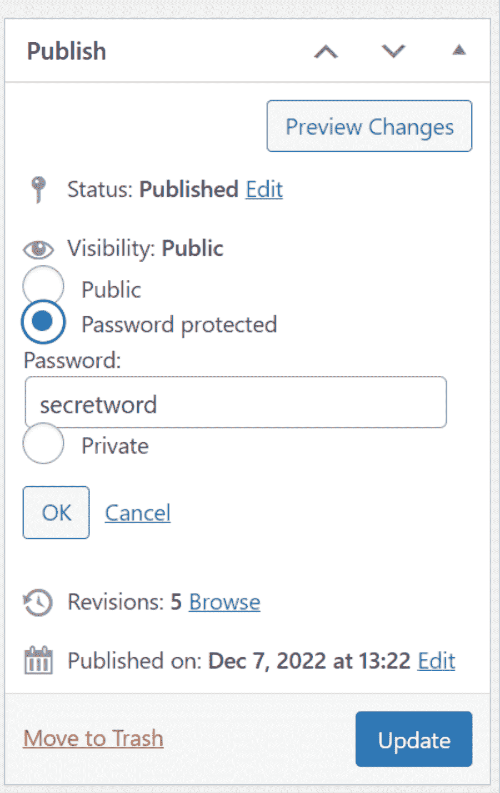

# 第二章：开始 WordPress 网站

### 本章涵盖了

+   选择正确的 WordPress 版本和最佳托管服务

+   在网站准备好发布之前隐藏你的网站

+   学习如何保存你的工作

+   安装安全和备份插件

+   管理你网站的访问权限

在构建网站时，从正确的方向开始非常重要。你的网站是否实现了你的目标，有时取决于你在创建第一个页面之前做出的选择。

一方面，WordPress 有两个版本，如果你选择了错误的版本，从那时起你就会受到限制和不灵活的困扰。此外，你必须选择一个优质的托管服务。它将你的网站存储在云端服务器上。选择错误的服务，当你需要技术支持时（我们都偶尔需要），你会遇到延迟、错误的建议或根本没有回应！

在你开始决定网站的设计和结构之前，本章是关于做出正确的举措的。

## 2.1 选择正确的 WordPress 版本

WordPress 有两个不同的版本，分别称为 WordPress.com 和 WordPress.org。

##### 注意

这里的 *org* 和 *com* 术语只是标识 WordPress 的这两个版本，并且与.com、.edu、.net（称为 *域名扩展*）以及像 cnn.com 或 Wikipedia.org 这样的互联网网站地址后附的其他简短缩写无关。

大多数专家都同意，在这两个版本中，WordPress.org 优于 WordPress.com 版本。

当你开始建立网站时，你的第一个决定是你将使用哪个版本的 WordPress。请记住，WordPress *可以* 安装在你的硬盘上，但这并不推荐。你将不得不处理诸如安全性、正常运行时间和许多其他最好留给云端 WordPress 托管服务处理的技术问题。托管服务的一个关键优势是在出现问题时你可以获得技术支持。

为什么不选择 WordPress.com？网站上有一个名为 WordPress.com 的免费托管计划。但是那个免费版本有限制——例如不允许使用插件。然而，对于小型、简单的个人博客来说可能足够了。WordPress.com 也提供付费高级计划，但许多评论者说与独立托管服务如 SiteGround.com、Bluehost.com 或 DreamHost.com 相比，它们的价值不高。

##### AI 协助

询问巴德或其他 AI 这个问题：“WordPress 只推荐三个托管服务。它们是什么？为什么推荐它们？”

##### 注意

*插件*是你添加到 WordPress 网站中的小型应用程序，用于提供额外的功能，如轮播幻灯片或自动网站备份。第五章就是关于选择最佳插件的。

如果您正在计划一个超出简单个人博客的网站，您可能需要注册一个与 WordPress.com 不同的主机服务。 且当您这样做时，您将自动使用 WordPress.org 版本而不是 .com 版本。 主机服务不使用 WordPress.com 版本。

WordPress.org 版本是开源的，本身可以免费使用。但质量较好的主机服务是需要收费的。以下是付费主机服务的一些主要优势：

+   您可以期待高质量、快速的技术支持。

+   您可以通过成千上万的插件添加功能。

+   WordPress.com 免费计划的自定义功能受限。 而优质主机则不限制修改。

+   他们通常提供更好的性能，例如更快的页面加载时间。

+   您将获得更多的功能和工具，例如更大的带宽、更多的存储空间以及免费的站点迁移。

+   免费主机计划使得站点变现困难。

如果您想使用高品质的主机服务，并希望避免大额的前期投资，通常可以在每月不到 3 美元的价格找到试用优惠。 （就像有线电视的促销优惠一样，优惠过期后价格会上涨。） 此外，一些主机提供退款保证。

如果您想了解专家为什么推荐使用 .org WordPress 版本的原因，可以在这个有用的教程中找到更多信息：`www.wpbeginner.com/beginners-guide/self-hosted-wordpress-org-vs-free-wordpress-com-infograph/`

## 2.2 注册一个一流的主机服务

WordPress 网站通常驻留在云端服务器上。这些服务器由主机服务维护，除了技术支持外，还提供各种实用工具，如安全系统、文件管理器和加密功能。从您的硬盘驱动器上托管 WordPress 网站是*可能*的，但这需要相当多的技术技能，并且您需要负责安全和其他服务，而这最好是由主机服务提供的。 简而言之，这不值得。              

以下是使用主机服务而不是在自己的硬盘驱动器上托管站点的一些优势：

+   可靠性——主机服务有一支专家团队负责保证您的网站 24/7 运行。如果您的网站经常宕机，可能会迅速失去受众。

+   安全性——好的主机有强大的安全措施来保护您的网站免受攻击。 WordPress 网站是黑客的常见目标。

+   性能——主机的专用服务器针对 WordPress 进行了优化。 您的页面将比站点位于您自己的硬盘驱动器上时加载得更快、更有响应性。 请注意，您的受众中有些人的互联网连接速度很慢，页面加载时间可能决定访问者是否返回您的网站。  

+   使用便捷性——主机包括一组实用工具（位于名为 cPanel 或 Site Tools 的位置）。您会发现一个工具，可以安装 SSL（安全套接字层，因此当有人访问您的网站时，他们不会看到令人担忧的通知：*不安全*）。主机还提供许多其他有用的工具，包括自动备份、更新、文件管理、一个“暂存”区域，您可以在离线修改您的网站等等。

+   成本——随着时间的推移，与购买和维护自己的服务器相比，托管可能更经济。

+   支持——最后但远非最不重要的是支持。您将需要一个优质的技术支持团队，以快速解决技术问题。他们需要知识渊博，快速响应，并且可以通过聊天、电子邮件或电话轻松联系。

### 2.2.1 选择您的域名

当您第一次注册主机服务帐户时，您将被要求选择一个*域名*。这是您网站的*主页*在互联网上的唯一地址，即 URL（统一资源定位符）。URL 的示例包括：*bbc.com*、*amazon.com*和*facebook.com*。

##### 定义

网站的主页是您网站中的第一个页面。这是访客到达您网站时看到的页面。它也被称为*着陆、闪屏、主、索引、前端、开始和第一页*。

每个页面和每篇博客文章也有自己的 URL（内部页面和文章的 URL 称为*永久链接*），但网站的*域名*是其主页的 URL。因此，当在搜索引擎列表中单击该链接时，访问者将转到您的主页。请注意，永久链接通常由网站名称加上一个短标识（通常是内部页面的标题）组成。永久链接的示例是*cnn.com/world*。

以前，人们为自己的网站努力寻找最佳的域名——找到一个描述性的、简短的域名，换句话说是*令人难忘的*。但到现在为止，所有好的、令人难忘的域名都已经被占用了（或者被仓库保管，直到有人愿意为它付出一笔财富）。Voice.com 于 2019 年以 3000 万美元的价格被出售给了 Block.one，一个区块链技术公司。

因此，不要折磨自己试图找出一个完美的域名，只需尝试将您网站的最佳*关键字*融入到您的新域名中即可。（关键字是某人搜索类似于您网站的网站时可能键入到 Google 中的单词或短语。）

例如，如果您正在创建一个烹饪网站，请在域名中的某处加入*recipes*或*cooking*这个词。*koolrecipes.com*就可以了。如今，人们通常不记得大多数域名。相反，他们会通过搜索引擎、人工智能平台、浏览器中的书签或在其他网站上找到的指向您网站的链接来访问您的网站。

##### AI 助手

像往常一样，在头脑风暴时，向您的人工智能助手寻求建议。例如，为了为我们的食谱实践网站找到一个好的尚未被使用的域名，我向 Perplexity 提交了这个提示：

你是一个网站营销专家。我希望你列出十个新站点的域名，标题为“Instant Pot 时间测试食谱”。让它们引人注目、易记、简短。每个都应该以".com"作为其顶级域名。还要确保每个域名都包含“recipes”这个词。对于您想到的每个域名，请在互联网上查找。如果已经在使用中，请不要将其包含在您的十个域名建议列表中。而是尝试不同的域名，重复这个查找流程。深吸一口气，一步一步地思考。

Perplexity 提出了一些好建议：

*以下是一个名为“Instant Pot 时间测试食谱”的新站点的十个域名建议：*

*InstantPotRecipesHQ.com*

*TriedAndTrueInstantPot.com*

*TimeTestedInstantPotRecipes.com*

*InstantPotRecipesCentral.com*

*InstantPotRecipesVault.com*

*InstantPotRecipesMastery.com*

*InstantPotRecipesGenius.com*

*InstantPotRecipesEmporium.com*

*InstantPotRecipesHub.com*

*InstantPotRecipesGuru.com*

我已经在互联网上搜索了每个域名，但没有一个看起来在使用中。

### 2.2.2 设置一个练习站点

在附录 A 中，您可以设置一个主机服务账户，在该账户上安装 WordPress，在该账户上安装 Twenty Sixteen 默认的 WordPress 主题，您可以在这本书中使用练习站点。最后，在该附录中，您可以转到您站点的“设置”>“常规”屏幕，并将站点标题命名为*Instant Pot 的时间测试食谱*，标语为*初学者的舒适食物*。如果您尚未设置练习站点，请访问附录 A，并立即进行设置，以便您希望使用练习站点。本书中的一些示例是基于该附录中描述的设置。当然，如果您选择在您的真实站点上工作，也是可以的。

在选择主机提供商时，要寻找信誉良好、价格合理的可靠公司。像往常一样，最广告宣传的服务未必是最佳选择。例如，GoDaddy 拥有相当大的市场份额。但它的评价参差不齐。

找到一个可靠的主机服务可能会令人望而却步。全球估计有 330,000 家 WordPress 主机服务！但 WordPress.org 本身只推荐这三个主机：SiteGround、Bluehost 或 DreamHost。不巧的是，我也推荐这三个，原因稍后列出。

它们每一个都是一个绝佳的选择，拥有出色的技术支持、稳定的性能，并提供一套可供您使用的实用工具。以下是最佳主机的最新概述：

##### 提示

wpbeginner.com 网站是一个很好的资源。每当您对 WordPress 有疑问，通常都能在那里找到一个可靠的答案。他们提供清晰的教程，提示，指南和公正的评价。其他有用的资源包括 `neilpatel.com/`，`chat.openai.com/chat`，`wordpress.org/support/forums`，`wordpress.org/support/` 和 `www.facebook.com/groups/wpbeginner/`

在设置过程中，当您注册托管服务时，您将被要求为您的托管服务账户创建用户名/密码对。然后，当您向该账户添加一个新的空白 WordPress 安装时，您将被要求输入*第二*个用户名/密码对。请在一张纸上记下这四个术语。当您需要进入您的托管账户，或者当您想登录您的 WordPress 站点进行工作时，您将需要这些用户名和密码。

### 2.2.3 托管服务清单

你想找一个提供以下内容的托管服务：

+   *可靠的，持续的正常运行时间* – 你应该期望 99%的正常运行时间，因为如果服务导致您的网站不可用，您可能会失去部分受众。人们知道有替代选择，而且互联网已经训练了大多数人对鼠标按钮有非常快的反应。对许多互联网用户来说，只要延迟几秒，他们就会飞快地去其他地方。

+   *快速的页面加载和缓存* – 考虑到您的受众中有许多人对任何形式的延迟都变得不耐烦，包括加载缓慢的网页。因此，在评估托管服务的指标时，要检查他们的平均页面加载速度。还要查看网站流量飙升是否影响加载速度。

##### 注意

贡献于页面快速显示的一项重要技术是*缓存。*为了加快页面显示速度，托管服务会缓存（存储）之前显示过的您网站的页面。当再次请求相同页面时，托管方可以直接将已呈现、缓存的页面呈现给访客。这避免了呈现过程引起的延迟。（要显示新鲜页面，浏览器必须执行各种任务--从您的 WordPress 媒体库获取图片，查看任何 CSS 代码以查看字体大小等是否与主题的 CSS 样式表指定的不同，扫描 HTML 代码以找出页面元素的位置等。因此，您需要一个能高效缓存其网站页面的主机。）

+   *有效的安全性* – 在安全方面，冗余通常是一件好事。重要的是，您的托管服务提供自己强大的安全系统，并且您还要安装一个像 WordFence 这样的安全插件。绝密的军事设施不依赖于单一的围栏，您也不应该。

+   *可靠的备份系统* – 优质的托管服务会每天自动备份您的站点。此外，您还需要安装一个单独的备份插件。因此，如果您的双重防范措施失败了，您仍然可以恢复您的站点。

+   *易于访问和可靠的技术支持* – 每个创建或管理网站的人都会偶尔需要与托管服务的技术支持交谈。这不是“如果”的问题，而是“何时”的问题。因此，您需要选择一个能够迅速准确地回答您的电话、电子邮件或聊天查询的服务。前面提到的三家 WordPress.org 推荐的主机都提供这种类型的技术支持。它们可以被依靠以迅速帮助您解决困难。

+   *位于目标受众附近的服务器* – 虽然托管服务的总部并不重要，但服务器的位置很重要。一些最好的托管服务会宣传 CDN（内容分发网络），这意味着它们在世界各地提供多个服务器来存储您的站点。如果托管您的站点的服务器至少位于与您的主要受众相同的大陆上，您的页面加载速度会更快。许多本来可能加入您的受众的人根本无法容忍页面加载速度缓慢。而且您的受众中有些人的互联网连接速度很慢。对于他们来说，页面加载速度是他们决定是否将您的站点加入书签以供将来访问的主要考虑因素。否则，他们会转身离开。

总之：如果您注册了 WordPress.org 推荐的三家大型托管服务之一：SiteGround、Bluehost 或 DreamHost，您可能会受益匪浅。但是，如果您想探索其他选择，您可以使用上面的检查表来避免以后后悔。

## 2.3 访问您的后端

在您的托管服务上设置全新的、空白的 WordPress 安装之后，首先要做的事情是访问您站点的后端。它的地址基于您在注册托管服务时选择的站点 URL（域名）。例如，如果您的域名是`https://mysitesname.com`，那么您的后端地址是`https://mysitesname.com/wp-admin`。

您的后端地址只是前端地址的修改。您只需在域名后附加*/wp-admin*。当您首次访问后端时，请在浏览器中将其添加到书签（或收藏夹）。此外，当您的浏览器询问是否要保存用户名和密码时，请这样做以便在想要在站点上工作时轻松访问。请注意，当您想要查看前端时，只需删除地址的附加*/wp-admin*部分。

##### 定义

在 WordPress 后端，您可以在其中处理您的站点的地方，有许多不同的页面，例如菜单构建页面、媒体库和添加新插件页面。但是，我们将它们称为*屏幕*而不是页面，以将它们与站点的实际页面区分开来，后者是您的观众所看到的。后端是站点的视图，只有您，管理员（或您授权的其他人）才能进入。在这里，您将添加新页面，执行日常工作，进行改进，并以其他方式构建和维护站点。这是引擎室，在您的访问者看不到的地方。访问者被保留在*前端*，即站点的公共区域。

2018 年，WordPress 开发团队为 WordPress 添加了第二个编辑器，并将其设置为默认。编辑器是您向站点添加新内容或修改现有内容的地方——文本、图像、多媒体、超链接等等。新编辑器通常称为*古腾堡*或*WordPress 区块编辑器*。

因此，您可以选择两种编辑器：传统的经典编辑器和古腾堡。前者有些类似于功能强大的文字处理器，而后者则类似于页面构建器。第三方页面构建器如 Elementor 和 Divi 已成为流行的 WordPress 插件。页面构建器可以提供拖放布局、所见即所得的动态设计、页面模板以及其他功能，例如用于调整站点外观而无需编写代码的工具。

古腾堡的设计目的是将多年来市场上的页面构建器插件所提供的功能集成到 WordPress 中。我们将在后面的章节中深入探讨古腾堡，但目前，您可能希望切换到经典的 WordPress 编辑器。这样，您的结果将与本书中显示的相匹配。然而，在整本书中，还描述了使用古腾堡进行操作的方法。选择权在您手中。如果您想使用经典编辑器，请参阅附录 A 中的说明。在经典编辑器和古腾堡之间轻松切换。

## 2.4 在建设中隐藏您的站点

在将您的网站公开之前，您将希望等到网站变得完美。显然，重要的是在您尽最大努力使其变得非常出色之后，搜索引擎对您的网站的质量进行评判。您也不希望让您的潜在观众根据半成品来决定是否再次访问您，或者将您加为书签。

因此，在您准备好盛大开幕之前，请阻止 Google 和其他搜索引擎。要阻止搜索系统，请转到您站点的后端，在左侧您会看到一个黑色菜单，称为*管理菜单*或*仪表板*。单击“设置”以打开其子菜单，然后单击“阅读”，如图 2.1 所示。

##### 图 2.1 在这里，在您的设置 > 阅读屏幕中，通过选择该选项阻止搜索引擎对您正在进行中的站点进行评判，然后单击“保存更改”按钮

隐藏你的站点的最后一步是安装一个 *即将推出* 的插件。 如果有人访问你的站点，他们只会看到一个消息，说该站点正在建设中。

但是，你，作为站点的管理员，*可以*查看真实的页面。 你需要。 在创建你的站点时，你会想偶尔查看前端。 即将推出的插件会在你的浏览器中存储一个 cookie，以明确你被允许查看真实的页面。

##### 提示

Cookies 是一些网站通常存储在你的浏览器中的小数据。 主要目的是节省你的时间。 如果你之前填写过一个表格，或者用密码登录过 —— 如果信息在你以前访问该站点时存储在 cookie 中，那么你不需要重复这些操作。

一个好的即将推出的插件的标题是 *Website Builder by SeedProd*。 要使用它，在你的 WordPress 后端仪表板中点击插件 > 添加新的。 然后在右上角的搜索框中，键入 *seedprod*。 最后，点击安装按钮，然后点击激活。

一些插件和主题会向你的仪表板菜单添加项目。 在左侧菜单中，点击 SeedProd > 登陆页面，如图 2.2 所示。

##### 图 2.2 点击 SeedProd 下的登陆页面，然后点击编辑页面按钮来定制你的即将推出的页面。

一些插件不受经典编辑器插件的影响，SeedProd 就是其中之一。 当你到达 SeedProd 设计界面时，你可以体验一下古腾堡块编辑器在 WordPress 中的工作方式。 SeedProd 模仿了块编辑器。 如果你愿意，添加一些 SeedProd 的块，同时用你的信息替换一些无意义的文本。 然后你的真实页面就会被这个即将推出的页面替换，通知访客你的网站目前正在建设中。 点击保存按钮。 如果你看到一个警告说 WordPress 不允许你保存，SeedProd 会显示如何解决这个问题的信息。

任何时候你想要查看你的即将推出的页面如何显示给访客，将你站点的前端地址键入或粘贴到一个 *你没有* 用来设置这个插件的浏览器中。

SeedProd 插件还包括一个正在建设中的屏幕，如果你正在 *更新* 现有站点，你可以使用它。 但是除非站点真的很糟糕，否则你应该避免这种方法。 你站点的访客期望能够访问。 即使是短暂的停机也可能会失去一部分受众。

相反，通常最好的方法是通过在副本上工作来更新你的站点，而不是关闭实时站点。 使用一个称为 *staging* 的实用工具，它可以在你的托管服务的 cPanel 实用程序集合中找到（或者你可以向你的站点添加一个 staging 插件）。 当暂存时，站点会被复制，但实时站点仍然可以被你的访客访问。 你对副本进行改进。 然后当你完成时，副本将取代旧版本并上线。

有一个例外情况需要提及，如果你的网站受到恶意软件攻击等问题，导致有损链接、缺失页面、可见代码、空白页面等情况，那么最好只显示一个“建设中”屏幕，并提供有关网站何时可用的信息。你不想让访客进入一个充满问题的网站。

在将你的网站设为私密时，可选的步骤是隐藏独立页面和文章，除非你给某人提供密码来访问它们。站点中的每个页面和文章都有自己单独的永久链接 URL 地址。

通常情况下，永久链接是通过将页面标题附加到网站地址来构建的。

**https://siteaddress.com** - 网站地址

**https://siteaddress.com/about-us** - 这将是“关于我们”页面的永久链接地址（URL 地址无法含有空格字符，因此用连字符替换页面标题中的空格）。在此示例中，*about-us*被称为*slug*。

鉴于内部页面有自己的 URL 地址，有可能在你准备好让网站公开之前，有人会进入其中一个内部页面。话虽如此，像 SeedProd 这样的优质即将推出的插件会默认在所有页面上显示即将推出的屏幕。

### 2.4.1 要求 AI 不要干扰你的网站

你可以要求 AI 系统不要为其自身目的收集你网站中的信息。一些 AI 会遵守这个请求。你的请求的有效性可能取决于未来的版权法。

假设你想将所有或部分内容设为禁止访问，只能由付费用户查看。不适用于 AI。你可以尝试通过在网站根目录下存储一个名为 "robots.txt" 的文件来阻止 AI 或搜索引擎访问你的页面（该目录是存储在托管服务服务器上的站点数据库中名为*public_html*的目录）。该文件可能已经存在，所以你可以进行修改，或者你可以存储一个新的同名文件。

无论如何，你可以在该文件中指定对 AI 授予的访问权限。要了解如何输入该文件的具体内容，请访问：`my.siteground.com/support/kb/how_to_use_the_robotstxt_file/`

如果你需要帮助确定如何以及在哪里保存这个文件，可以咨询你的托管服务技术支持人员。

## 2.5 保存你的工作

一些应用程序，比如微软的 OneNote，会自动保存您所做的任何更改。WordPress 不会这样做。相反，当您在网站的页面中修改内容时，您必须点击更新按钮（或 WordPress 显示的几个同义词）。这些同义词的一个问题在于：当您首次在 WordPress 中创建新页面时，保存您工作的按钮被标注为*发布*。然后，同样的按钮变为更新。更改按钮的名称并不是良好的用户界面设计。初学者经常会因此感到困惑。如果所有保存您工作的按钮都简单地命名为*保存*，那将是一个改进。

WordPress 通常很直观。用户界面设计得很好。但是这些保存工作的按钮会让人困惑，因为它们有不同的含义。这只是你必须习惯的一件事。首先，*发布*通常意味着*公开发布*。换句话说，您可能会认为点击发布意味着您的受众现在可以看到您刚刚修改的页面的最新版本。但事实并非总是如此。如果页面被缓存（存储以供将来显示），他们不一定会看到新版本，特别是如果缓存算法认为修改是次要的。

另外，您可能正在编辑页面的草稿或指定此页面为私有。在这些情况下，页面仅存储在您网站的数据库中，但不对公众可见。

更糟糕的是，WordPress 中相同的保存工作按钮在不同屏幕上以几种不同的方式标注。当您在网站菜单屏幕上工作时，它被命名为*保存菜单*。在其他一些屏幕上，它被称为*保存更改*。有时你也会发现只有简单的*保存*。

还有一个问题。这个“保存”按钮出现在不同屏幕的不同位置。它经常在右上角，有时在右下角，有时甚至在屏幕底部，所以你必须向下滚动才能看到它。

还要注意，有几种方法可以退出未保存的屏幕：点击浏览器中的其他标签，关闭当前标签，关闭浏览器，或切换到其他应用程序。如果您退出而不保存您的更改，WordPress 通常会显示图 2.3 所示的警告消息。

##### 图 2.3 如果您尝试离开一个未保存修改的页面，通常会像这样收到警告

这里的关键词是通常。在一些屏幕上，没有警告，你会丢失在该屏幕上所做的任何工作！所以你会想养成通过点击保存按钮或者在此时显示的任何其他标题名称保存修改的习惯。

## 2.6 确保网站安全

如果你已经注册了高质量的主机服务，你可以确信他们已经在你幼稚的网站和那些不断漫游的威胁性蜘蛛之间建立了一道围墙……毫不知疲地探测漏洞，以惊人的速度进行掌控。

不过在你花费时间构建网站之前，你需要采取两个防御性措施。添加一个安全插件和一个备份插件。

没错，好的站点主机会投入大量精力保护其服务器。大规模攻击将破坏他们的业务。好的主机还会每天或根据你选择的最佳频率备份你的站点，但在这些方面的冗余是一件好事。大多数人都打开 Windows Defender，但同时也要投资于其他反病毒应用程序，这也会有助于提高机器性能。

一个广受尊重的 WordPress 安全插件是 WordFence。它是一个付费产品，提供免费和付费计划，但免费版本也非常有效。在构建站点的早期阶段就应该添加它。以下是步骤:

1.  进入插件 > 添加新插件页面。

1.  在搜索栏中输入*wordfence*。

1.  点击安装按钮，然后点击启用。

还要确保你的密码强度足够大，无论是访问站点的后端密码还是主机服务账户的其他密码。你的浏览器可以帮你记住这些密码，因此没有理由不将它们设置得复杂且无意义。请记住，闪烁在网络中的邪恶蜘蛛非常不知疲倦。他们的一个技巧叫做暴力攻击，他们可以尝试每个英语单词和有限数字组合，直到猜中了你的密码。

## 2.7 自动化备份

最好的备份插件之一是 UpdraftPlus，在超过 300 万个站点中使用。这是一个付费服务，但免费版本也非常好用。以下是安装步骤:

1.  进入插件 > 添加新插件页面。

1.  在搜索栏中输入*updraftplus*。

1.  点击安装按钮，然后点击启用。

安装并启用插件后，进入设置 > UpdraftPlus 备份页面，点击设置选项卡，如图 2.4 所示。

##### 图 2.4 在此设置屏幕中，指定备份文件和数据库的频率、保留备份数量以及存储位置。

点击*文件备份计划*下方的手动设置下拉箭头。这将展开一个列表，如果你正在积极地修改站点或频繁添加新文章，应该选择每日备份。

数据库备份计划可以按照相同步骤进行设置。同时选择 10 个备份保留，第 11 个备份将成为栈中的第一个备份，最老的第十个备份将会被删除。最后选择备份储存的位置。

然后一定要点击*保存更改*。

##### 秘诀

在您构建或积极更新您的网站时，每天的备份可以确保您不会丢失太多工作。但是，如果您进行了需要立即保存的更改，您可以手动备份：只需在主 UpdraftPlus 设置界面（备份 / 还原选项卡）上点击“立即备份”按钮即可。此外，如果您在几周内不对网站进行任何更改，可以降低自动备份的频率。但是，如果您的网站遭受大规模攻击或其他灾难，并且无法还原，则仍然有希望。前往`archive.org/web/`。然后将您网站的前端地址粘贴到搜索字段中。您至少可以复制和粘贴存储在此存档网站上的文本内容，并且还可以对图像和页面布局进行屏幕截图。这样，至少可以更轻松地从头开始重建您的网站。您将重新获得网站设计，页面布局和内容。

## 2.8 管理网站访问权限

如果您想让其他人在您的设计上工作、为内容做贡献或订阅您的网站，您需要决定授予他们多少以及何种类型的访问权限。

并非每个人都需要对网站拥有总体的管理员级别控制权限。您可以提供各种程度的权限，每个权限都有其自己的范围。基本上，您可以指定特定人员在网站中可以或无法执行的操作。您可以在图 2.5 中所示的用户 > 添加新用户界面中设置这些权限。

##### 图 2.5 这是用户 > 添加新用户的界面，您可以在此界面为允许访问后台的用户指定权限级别

### 2.8.1 理解不同的用户角色

以下是每个用户角色的描述：

**管理员**：被指定为此角色的人对网站拥有完全控制权。他们可以在网站的任何地方添加、删除或编辑任何内容。他们可以管理其他用户，在网站中更改任何设置，并安装或移除插件和主题。他们最重要的能力是可以删除、修改或添加其他用户，包括更改他们的密码。换句话说，管理员可以做任何事情。

**编辑**：他们可以在网站上添加、删除或修改任何内容，并且可以对博客文章进行审核。但是他们不允许安装或操纵主题或插件，添加新用户，修改现有用户的角色或更改网站的设置。

**作者**：此角色对网站的风险较小。作者可以添加、删除或创建帖子标签，或修改他们自己的帖子。他们不能创建新分类，不能批准或删除其他人的帖子，也不能对网站进行其他任何操作。

**贡献者**：这些人与作者角色的权限非常相似。然而，他们不能删除已发布的帖子。并且与作者角色不同的是，他们不能在网站上添加文件，因此无法在帖子中包含图片。

**订阅用户**：订阅用户可以修改他们的个人资料或更改密码，除此之外无其他权限。

新用户会收到您的一封电子邮件（如果您在设置时选择了该选项）。它会告诉他们的用户名并显示一个链接，让他们可以创建密码。

除了这些默认用户角色之外，您作为管理员还可以定义自定义角色。这样，如果默认角色之一不是您想要的内容，您可以创建一个新角色，其中包含您想要授予的任何权限集。最好的做法是只有一到两个管理员用户。其他人应该对站点的控制权更少。

插件和主题除了 WordPress 默认角色之外，还可以添加角色。例如， WooCommerce 插件添加了“购物经理”和“客户”角色，定义了用户如何与其电商功能交互。

### 2.8.2 订阅方式变现

一种良好的从站点获得收入的方法是提供访问者必须支付的内容。人们很少反对这种变现方式，因为它是自愿和不显眼的。您可以将整个站点或部分站点封锁。

##### 提示

订阅者角色最常用于基于会员、订阅或在线商店模型的站点。用户必须注册并付款才能访问站点的部分或全部内容。订阅者角色的另一个应用场景是允许订阅者注册并对帖子进行评论，但阻止他们创建或发布其他内容。

##### 如果要从站点获得收入，以下是一些利用订阅者用户角色的建议：

+   线上课程。人们要么付费查看内容，要么加入在线课程。

+   杂志。部分或全部站点受到封锁，提供高级/付费内容。

+   提供特定优惠的付费订阅仅适用于注册的用户

+   私人论坛

+   咨询或教练服务

要更改 WordPress 用户的角色，请按照以下步骤操作（参见图 2.6）：

1.  以管理员身份登录 WordPress 仪表板。

1.  在管理菜单中，单击“用户”。

1.  找到您要更改角色的用户，单击他们的用户名以打开其资料。

1.  滚动到用户资料的“角色”部分。

1.  从下拉菜单中选择新角色。

1.  单击“更新用户”按钮以保存更改。

##### 图 2.6 这是您可以使用批量操作功能一次更改多个用户角色的位置。

### 2.8.3 密码保护页面

这里有另一种控制站点前端页面或博客文章访问权限的方法。您的访问者可以分为具有特定页面密码的人或不能查看这些页面的人。您可以通过将它们标记为密码保护来封锁单个页面和文章。以下是如何操作：

1.  转到“页面”>“所有页面”屏幕。

1.  单击要密码保护的页面的标题。

1.  在此“编辑页面”屏幕中，在右侧找到标题为“发布”的模块。

1.  单击“密码保护”。

1.  键入密码。

1.  单击“更新”按钮。

图 2.7 显示了你可以在哪里为页面或文章设置密码保护，阻止没有密码的人查看它。

##### 图 2.7 在发布模块中，输入一个密码，你可以给那些你想允许查看页面的人。

##### 提示

只有具有管理员或编辑级别权限的用户才能查看标记为密码保护的页面或文章，即使是从网站后台。

除了盈利化，设置内容密码保护在几个方面都很有用：

+   即使访客知道页面的永久链接地址，他们也无法看到它。

+   你正在向你的网站添加一个新页面，但希望在完成之前将其隐藏起来。

+   你希望某些页面或文章只能由你的一部分受众——例如成年人——查看。

如果你在这个发布模块中编辑“发布于”字段，页面或文章也可以预定在特定日期后出现。

在本章中，你已经学到了开始 WordPress 网站时需要采取的几个重要的初步步骤。你需要选择一个可靠的托管服务，选择一个你熟悉的编辑器，安装安全插件，并决定谁可以在你网站的后台访问什么。在下一章中，你将看到如何将网站聚焦于单一、专业的目标，并设置任何高质量网站都必备的重要组成部分——高效的导航性。

## 2.9 总结

+   *正确*的起步方向，以及一些前期规划，可以帮助你创建一个连贯、有机的网站。

+   许多专家都同意，你应该使用名为 WordPress.org 的免费开源版本，而不是 WordPress.com。

+   选择合适的托管服务对一个网站至关重要。每个人偶尔都需要可靠的技术支持，你不希望在最需要帮助时被冷落。

+   如果你注册了 WordPress.org 自己推荐的三个托管商之一：Bluehost、DreamHost 或 SiteGround，你不会错的。

+   WordPress 有两个编辑器。如果你愿意，可以都试试，但经典编辑器总体上比新的古腾堡区块编辑器更稳定、更高效。后者仍在建设中。

+   在网站完善并准备好发布之前，将其从搜索引擎和访客中隐藏起来。

+   一定要安装两个重要的安全插件：UpdraftPlus 和 WordFence。前者可以可靠地自动备份你的网站，后者可以保护你的网站免受病毒攻击。

+   探索 WordPress 提供的几个工具，让你可以控制网站的后台和前台访问权限。
