# 第三章：网站构建准备工作

### 本章内容包括

+   紧密聚焦你网站的主题

+   设定目标

+   创建一个层次结构

+   充分利用链接

+   构建有效的菜单系统

为什么在开始添加文本和图片之前要预先规划你的网站？这非常简单：明确你的主题，确定你的主要目标，并为其页面创建层次结构将影响你以后做出的许多决策。

如果你直接开始添加内容，几乎不可能有效地聚焦网站并知道要优先考虑什么。对于我们大多数人来说，这会导致工作流程混乱无序。可能的结果是一个无组织、令人困惑的网站。

本书将全面介绍如何建立和修改练习网站。通过真实世界的例子，你将看到如何应用每一章节介绍的各种概念。然而，如果你愿意，你也可以直接将这些概念应用到你自己的网站上。

或者你实际上可以建立一个新的空白 WordPress 网站，并在练习网站的基础上进行操作。如果你希望自己构建它，附录 A 提供了如何设置的详细信息，因为我们会教授所有有助于创建优质网站的各种技能和技巧。这个练习网站的标题是*Instant Pot 的时间测试食谱*，它的标语（口号）是*初学者的舒适食物*。然而，我们也会时不时地研究其他用例。例如，在本章中，我们将看到如何准备开始构建一个面向巴斯钓鱼者的电子商务网站。

本章将向你展示如何智能地打下坚实的基础，以帮助你创建一个连贯、专业的网站，让你为之自豪。第一步是聚焦你网站的主题。换句话说：找到一个利基。

## 3.1 聚焦你的网站

当初学者开始他们的第一个网站时，最常见的错误也许就是选择一个广泛的主题。这是合乎逻辑的，但是完全错误的。

考虑一下这个用例。一个男人住在北卡罗来纳州，经常在兰德尔曼湖钓鱼。他是那个湖里钓大口黑鲈的专家。他知道一天中的最佳时间，合适的天气条件，以及使他成为非常成功的巴斯钓鱼者的其他细节。

因此，在决定他的网站标题和域名（互联网地址名称，又称 URL）时，他想：嘿，这些年来我可以给在兰德尔曼湖钓鱼的人提供很好的建议。但仅仅谈论这一个特定的湖泊*会* *极大地限制我的观众*。为什么只把这些好建议提供给当地人？这个世界上有一大群钓鱼者。我应该面向这个巨大的观众。此外，将来，当我的网站庞大时，我还会向他们出售我的特制手工鱼饵。这可能是*大*的！我只会写钓鱼的一般知识并向一个巨大的客户群销售！

这是常识，是直觉，也是最糟糕的选择。

它是如此错误的原因在于，如果你的网站的焦点和标题是*钓鱼*，你就会与其他也使用该关键字的 1.3 亿个网站竞争——从雷达扫描仪到蟾蜍钓鱼。而且其中一些网站已经发展成熟并且很受欢迎。你的网站几乎不可能出现在某人搜索 *fishing* 时的结果中。而且大多数人可能会使用其他关键字，比如 *North Carolina、bass*，甚至 *Randleman Lake*。

所以我们的钓鱼人应该通过使用这样的关键字来缩小网站的主题：*在格林斯伯勒的兰德尔曼湖钓黑鲈鱼*。

这只会在搜索时触发几个竞争网站。如果搜索工具判断你的网站制作精良，你甚至可能位于搜索结果的顶部。*这*就是如何增加你增加庞大和忠实受众的机会。毕竟，兰德尔曼湖周边大约有两百万人口。作为受众，这已经足够大了。

## 3.2 确定网站目标

有些人擅长即兴创作，边做边想。但在开始构建网站之前制定一个计划几乎总是值得的。如果你有太多的事后想法，网站可能会感觉像是拼凑在一起的，不连贯的，甚至令人不适。

所以确定你网站的主要目标（不是目标）。并继续朝着那个目标努力。结果很可能看起来组织良好，从而建立信任并传达质量。无论你的目标是什么，你都希望网站看起来专业，而不是业余的。

首先确定你想要建立的站点类型。你是要销售商品吗？如果是这样，你正在建立一个*电子商务*网站。这个网站只是为了你的家人和朋友，是一种多媒体日记，记录你的活动、生活历史或家谱吗？这就是所谓的*个人* *博客*网站（在这种网站中，你不需要找到一个利基，你就是它）。

##### 提示

大多数个人网站的受众非常有限，只有亲戚和朋友。这样的网站很少吸引大量的观众。首先，它们通常是四处碎片化的，缺乏重点，没有明确的单一主题。有些人成为*影响者*——他们很幸运地建立了一支观众。但除非你已经是一位名人，拥有一个渴望了解你一举一动的现有粉丝基础，否则你的个人博客很可能只会吸引你圈子外的少数关注者。如果你不关心收入或建立大型受众，那么这也没什么。

### 3.2.1 网站的 11 种类型

网站可以根据其主要目的大致分为 11 个不同的类别。当然，有些网站会融合两个或更多的目标，有些网站是如此独特，无法轻易分类，比如 *dudequote.com*——一个《大镖客》的台词生成器。

这个列表展示了一般的类别：

1.  电子商务——一个专注于在线销售的网站。例子包括 eBay、Etsy 和数百万个个体销售者。

1.  博客-在网站上按照反向年代顺序发布信息的广播信息。一些博客鼓励互动，允许访问者回复帖子。一般来说，博客提供最新信息，而不是不经常更改的静态页面。今天，许多网站都包括一组传统的静态页面，但也包括博客页面。这样的网站称为“混合”网站。

1.  新闻-例如 BBC 或 CNN。

1.  社交媒体-人们可以在其中与朋友和家人互动，分享评论和媒体，并参与讨论。 Facebook 是最著名的一个。

1.  论坛-类似于社交媒体，但主要设计用于回答关于特定的，通常是技术的主题，如编程的问题或交流信息。许多应用程序，包括 WordPress 本身，都设置了论坛，初学者可以在其中与有帮助的专家联系，专家们可以交换想法。论坛通常是包含问题和答案的留言板。相比之下，社交媒体往往包含更通用的内容，包括多媒体。

1.  信息性的-https://www.wikipedia.org，我们自己的 Recipes 练习网站和类似的网站提供各种知识。有些信息网站可以用于研究。但通常，AI 驱动的网站如 GPT、Claude、Perplexity 和其他网站对研究是最有效的资源。

1.  教育性的-Udemy 和 ed2go 是在线学校的两个例子。有些提供视频课程，其他人则包括讨论论坛，学生可以与教师互动。许多教师和图书馆员为本地学生和读者建立小型的本地教育网站。

1.  Chat Bot-这些基于 AI 的系统以对话或聊天的形式提供信息。换句话说，您可以通过要求对先前的响应进行详细说明或修改，以深入了解有关查询的更有帮助的答案。

1.  组合-艺术家、作家或其他想要展示他们的创作的人建立组合网站。有许多出色的主题设计显示各种创意工作。

1.  就业-像 monster.com 这样的网站提供给求职者资源，例如创建简历、寻找职位、宣传自己的可用性和申请职位。

1.  政府-本地或国家的网站，旨在协助服务、政策和其他政府资源。

### 3.2.2 需要回答的五个问题

在实际开始建立网站之前，请确保您已回答了这五个问题：

+   网站的目的是什么？

+   网站的短期目标是否不同于长期目标？换句话说，在发展受众后，您是否计划销售商品？

+   目标受众是什么？

+   人们会从网站中获得什么？

+   您准备在主机服务和主题上花费多少？

对于您的目标做出这些基本决策有助于将设计和内容引导为谐和的整体。它还帮助您选择成功支持目标的插件、功能和功能。

以下是针对巴斯钓鱼网站计划的这些问题的示例答案：

+   该网站的目的是最终销售我手工制作的鱼饵。

+   是的，它会随着时间的推移而改变。最初，我只想吸引当地的巴斯钓手，并通过提供关于如何在兰德尔曼湖钓鱼的最新、有价值的技巧来保持他们的回头率。但最终我会添加一个电子商务组件，以市场营销我的昂贵但却令人印象深刻和有效的鱼饵。

+   目标受众是钓鱼的人们在兰德尔曼湖。

+   我希望我的受众能获得优秀、具体的信息，以提高他们的钓鱼水平。

+   我打算获取一个免费主题，并在一段时间内使用免费版本，然后当网站起飞时可能升级到付费版本。我会看看我是否最终需要专业版本的功能。我将使用 DreamHost 托管服务，因为它备受推荐，但起初价格低廉。（我考虑到托管服务通常会在介绍期后增加每月费用。）

### 3.2.3 与克劳德的咨询

现在我已经提供了我对这五个问题的最佳答案，我将问题和答案提交给 claude.ai 以获取其建议。我以以下方式开始提示：

作为一名经验丰富、专业的网站设计师（同时也是一名巴斯钓手），深吸一口气，审查一下我对以下五个问题的回答。一步一步地思考，请列出您对改进有关我的巴斯钓鱼者网站计划的答案的任何补充或建议。您是我的新网站项目的顾问。

克劳德回答了一些好主意：

这是我作为一名经验丰富的巴斯钓手和网站设计师的额外建议：

强调您在兰德尔曼湖钓鱼方面的个人专长。提供有关在那里钓鱼的年数、最喜欢的地点、最大的收获等细节。确立您的信誉。

面向目标受众，非常具体——针对经常参加兰德尔曼湖锦标赛和俱乐部活动的认真的巴斯钓手。为铁杆爱好者提供内容，周末业余钓鱼者会跟随。

专注于提供在兰德尔曼湖上持续捕捞大型巴斯的专业技巧和高级策略。超越基础知识——分享您的专业、经过验证的方法。

在社区方面，考虑创建一个兰德尔曼湖巴斯钓鱼论坛，让访客互动并分享他们的经验。这可能引发持续的参与。

对于货币化，研究与您的受众相符的巴斯装备和船只的联盟计划。考虑与当地的钓鱼指南和小屋合作。

为了在核心目标受众中传播您网站的意识，为付费促销预算——Facebook 广告，赞助活动，战术 SEO 等。

利用您在巴斯社区的社交媒体存在来推广网站。也在影响者博客上做客帖。

*如果你想让我对计划的任何部分进行详细说明，或者从我在黑鲈钓鱼和建立专业网站方面的经验中提供额外的建议，请告诉我！我很乐意提供我的专业知识！*

最后，一旦你弄清楚了你要建立的站点类型，就访问其他同类型的热门站点。从中学习什么是有效的，什么应该包括在内，以及什么功能和设计是最好的。还要在标题、标语（显示在每个页面标题下方的短语）和文本内容中包含关键词。使用人们在搜索时可能使用的精确和详细的关键词：

或

注意这些搜索术语*专注*于相当具体的主题。你可以通过添加形容词来进行专注。我在本章中多次使用了*专注*这个词。

## 3.3 创建一个层次结构

如果你希望你的站点成功，高效的导航至关重要。

人们来到一个网站是为了找到某些东西。但他们*不*希望找到的是一个如此混乱的站点，以至于他们的第一反应是困惑。如果让他们觉得他们必须解决难题才能得到他们想要的东西，他们会很快去别处。

你希望从你的主页到他们的目标的路径非常清晰和直观。确保他们不会感到困惑。记住，当人们感到困惑时，他们很少责备*自己*。他们只会对*你*和你那没必要复杂、效率低下的网站感到沮丧。

你必须立即给访客提供站点结构的心理模型。随着时间的推移，随着你的站点变得越来越庞大，一个坚实、合乎逻辑的架构会使未来的修改更加容易。最后，如果 AI 机器人和搜索引擎发现你的站点连贯而合乎情理，它们就会给你更高的排名。

在以后的章节中，我们将探讨获取有关人们如何遍历你的站点、他们在哪里遇到问题以及其他数据的方法，你可以利用这些数据来尽可能提高他们的用户体验（UX）。但现在让我们考虑基础知识：层次结构和可导航性。

### 3.3.1 网站结构：父页面和子页面

在创建你的站点页面之前，先列出你想在站点中包括的主题。然后将列表安排成一组：父页面、子页面、孙页面（如果你的站点相当大，可能需要孙页面）。

你的菜单只显示父页面。当访客将鼠标指针移动到菜单中父页面的名称上时，会显示一组子页面。这是访客导航你的站点的最典型方式。

例如，在我们的钓鱼站点中，父页面可能包括诱饵和关于我们。子页面将是这些页面的子页面。诱饵父页面可能有四个子页面：转动鱼饵、旋转鱼饵、水面诱饵和嗡嗡声。关于我们下的子页面可能包括我们的历史和未来计划。

这里的目标是将网站组织成五个或六个主要父页面，每个页面可能包括子主题（子页面也称为*子菜单*）。 网站菜单是指指向网站页面的一组链接。 它通常显示为每个页面顶部附近的水平条。

让我们看看这在实践中是如何工作的。 例如，钓鱼网站可以将以下主要父类别作为其主菜单项目：

新闻（博客）技巧和技术比赛联系我们

最好尽量让菜单尽可能简洁。 所以除非这会牺牲导航性，否则请限制自己不超过六个父页面。 创建一个描述性强、引人注目的网站标题，但请注意，标题并不是网站的 URL 网址（URL 以 .com 或 .org 或其他后缀结尾）。

现在考虑我们的钓鱼网站如何显示图 3.1 中显示的典型网页的七个元素。

##### 图 3.1 现代网页通常包括至少以下七个元素：网站标题、网站标语（口号）、横幅图片、菜单、主体内容和行动号召。

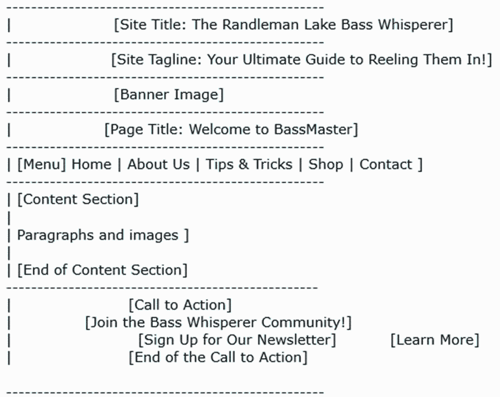

### 3.3.2 让人工智能创建你的页面层次结构

人工智能能否起草我们示例的钓鱼网站的第一版层次结构？的确可以

##### 提示

在与人工智能合作时，要习惯自己的角色：你是老板；它是一个助手（尽管比你快得多，拥有互联网规模的记忆，多才多艺，列表还可以继续…）。 但是，你作为老板的角色是想出任务，把工作交给人工智能，然后判断哪些响应是可靠的，哪些需要进一步的工作。 你总是可以把进一步的工作请求传回给人工智能。 或者自己做出改进。

要向人工智能询问页面层次结构（换句话说，网站菜单系统），指定两个任务将很有帮助：

1\. 查找并列出最成功的钓鱼网站。

2\. 显示一个有序列表，展示这些网站菜单层次结构有什么共同之处。 这些问题将有助于确保没有遗漏任何主题，并且还可能产生最佳、最合逻辑的整体网站组织。 人工智能无疑是有逻辑能力的。

我给了 Bing 这个提示：

*你是一个经验丰富的网站评论员和评论家。 你还是一位专业的巴斯钓手。 请列出世界上五个最成功的巴斯钓鱼网站的 URL 地址。 请仔细检查这些 URL 是否仍在使用，并且它们在谷歌搜索中使用关键词* bass fishing *时排名非常高。*

它回答道：

*根据我的搜索结果，以下是当前活跃并在谷歌搜索中排名高的五个使用“bass fishing”关键词的最成功的钓鱼网站：*

*1.     BassFan*

*2.     BassResource*

*3.     BassRankings*

*4.     Bassmaster*

*5.     FLW Fishing*

然后我跟进了第二个提示，要求 Bing 设计一个结合这五个网站共同主题的菜单。

提示：

*你了解网站菜单系统。请检查这些五个网站的菜单和子菜单。将这五个站点的菜单层次结构合并为一个有序列表，列出父页面和它们的子页面。重新检查你的结果，确保你将这些层次结构合并为一个伟大的钓鲈鱼网站的单一菜单层次结构。*

Bing 提供了这个有用的、逻辑性强的层次结构：

*基于前五个钓鲈鱼网站的菜单结构，以下是一个合并的层次结构，可以作为一个伟大的钓鲈鱼网站的通用结构：*

**主页**

**新闻（博客页面）**

*最新消息*

*职业巡回赛新闻*

*码头谈话*

**锦标赛**

*时间表*

*结果*

*排行榜*

*钓鱼者简介*

**排名**

*世界排名*

*年度钓鱼者*

**技巧与技术**

*专业钓鱼技巧*

*如何视频*

*装备评测*

**论坛**

*一般钓鲈鱼论坛*

*小口鲈钓鱼*

*钓鱼报告*

**装备**

*新产品*

*渔具评测*

**视频**

*最佳抓捕*

*专业日记*

**文章**

*精选文章*

*观点*

**会员资格**

*登录/立即加入*

这涵盖了一个钓鲈鱼的网站的基础。它包括一些我没有想到的好话题。但是，我想要减少菜单的大小。首先，我会将锦标赛和会员资格从菜单移到侧边栏上。但是为什么我要担心修剪，当我的渴望、神童般的助手很可能会做得更好呢？我们很快就会把这个减少菜单的任务交给 AI。

### 3.3.3 AI 可以为您创建一个完整的网站

您想要 AI 为您生成一个全新的网站，或者至少给您一个初稿来参考吗？几个 AI 动力系统提供了这样的服务。其中，`10web.io/` 是一个不错的选择。你只需提供一些关于你意图的基本信息。然后它会相当不错地生成一个真实的网站。当然，您需要做一些调整和提供内容，但对于一些人来说，这个过程可能比从头开始创建一个空白的网站要容易。10web 倾向于偏爱长滚动主页（主页上的整个站点），但是 10web 生成的站点层次结构、文本和图像都是出乎意料地好，正如您在这个示例中所看到的：

##### 图 3.2 这是从一个简短的、只有一段的提示生成的，描述我们的 Instant Pot 食谱练习站点

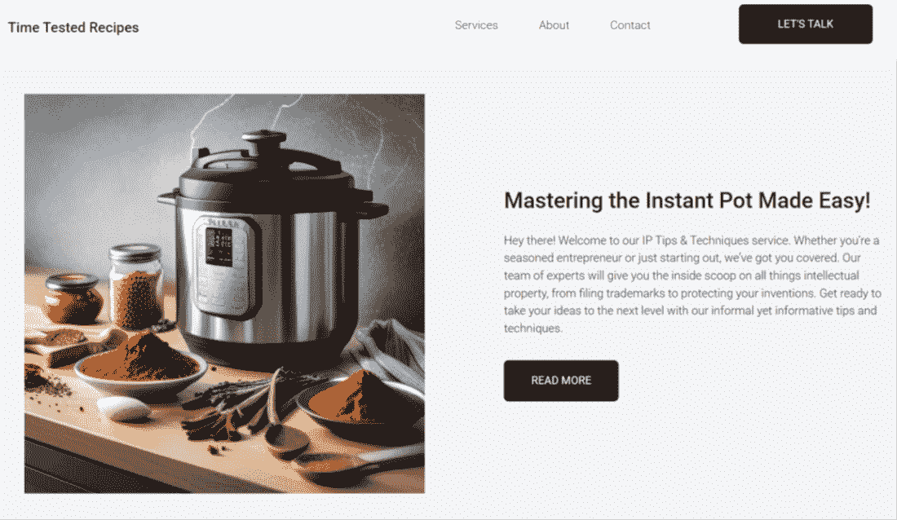

### 3.3.4 使用菜单插件

正如往常一样，您可以安装提供额外功能和选项的插件到您的菜单中。这里有三个受欢迎的菜单插件：

+   UberMenu—让你创建复杂的大型菜单（意味着它们有多个级别，可以包含特殊内容，比如地图或博客文章网格）。

+   QuadMenu—包括一个拖放界面，可以构建包括动画、图标和社交媒体集成在内的菜单。

+   Max Mega Menu—允许您添加带有小部件、转换等功能的大型菜单。

##### 贴士

超级菜单允许您显示网格、图标、多个级别、过渡动画效果和其他高级功能。在这里查看一些示例：`www.theme-junkie.com/what-is-mega-menu-examples/`

### 3.3.5 使菜单简洁、简单和清晰

每个网站的菜单要求不同，但一定要追求简洁、简单和清晰。（事实上，在整个网站中也是如此。）记住人们期望在互联网上迅速获得结果。

在将您的网站公开之前，请朋友浏览您的网站，同时您观察并做笔记是个好主意。是什么让他们困惑了？什么让他们感到恼火或困惑？他们通过网站时采取了哪些路径？最重要的是，当他们离开首页时，他们是否去了您希望他们去的地方（根据您的行动呼吁）？肯定不会去另一个网站！

有人说，完美的导航系统是一个访问者可以在不点击任何东西或实际*做*任何事情的情况下看到所有选项的系统。甚至包括像悬停鼠标在菜单栏上以显示子页面的下拉菜单列表一样简单的事情。

但对于大多数网站来说，将网站划分为父页面和子页面是必要的。至少可以避免在父页面上过多内容导致负载过重。人们几乎总是对大量文字感到厌恶，特别是在首页上。市场营销专家和现代网页设计师都偏爱极简主义。你的目标最终应该是使浏览你的网站变得轻松自如。让访客尽可能用最少的点击找到他们想要的东西。

有时人们希望返回到网站的首页，所以在菜单的最左边包含一个名为*首页*的菜单项是很好的。点击网站标题或标志通常也会返回到首页。网站通常在每个页面上显示网站标题（以及可选的标志图像）。这些通常位于页面的左上角。

主菜单项（父页面）显示您网站中发现的主要、最一般的主题。子菜单用于辅助页面或内容。子页面显示补充的、更具体的信息，扩展了其父页面中的内容。

为了尽可能地使菜单项尽可能简短，请不要在菜单中重复您的网站标题。例如，我们书籍的实践网站的标题是*Instant Pot 的经过时间检验的食谱*。因此，在命名菜单项（或页面标题）时不要使用这些词。不要重复*Instant Pot 的墨西哥食谱*，甚至只是*墨西哥食谱*。您的访客*知道*他们正在查看一个专门为 Instant Pot 食谱的网站，所以只需简单地命名菜单项为*墨西哥和泰国*。

*Instant Pot 的经过时间检验的食谱*是一个确定的术语。毕竟，您的网站标题作为顶部标题显示在每个页面上。不需要在菜单中重复它。

##### 提示

从技术上讲，“time” 和 “tested” 之间需要一个连字符，因为这些修饰语一起作为修改 “recipes” 的复合形容词。这种连字符使人们不会产生错误的想法，比如 “time recipes”。但是，在标题中，标点符号规则通常是放松的。

### 3.3.6 请求 AI 简化您的菜单

如果您试图缩短您的菜单，您可能希望向 AI 寻求一些建议。使用之前描述的钓鱼网站菜单，Bing 提出了几种有用的简化方式。在我查看了本章早些时候 Bing 为我们创建的菜单之后，我给了它这个提示：

*你创建的菜单很不错，但太长了。你能列出哪些主菜单项目可以降级为子项目，或与其他项目合并，或放到侧边栏，或完全不放在菜单中吗？请解释你的理由。*

Bing 说：

*以下是我对简化您网站菜单的建议：*

*合并相似的项目：将相似的项目分组在一起以减少混乱。例如：*

*“Latest News”、“Pro Tour News” 和 “Dock Talk” 可以作为 “News” 的子项目。*

*“Schedule”、“Results” 和 “Standings” 可以作为 “Tournaments” 的子项目。*

*“World Rankings” 和 “Angler of the Year” 可以作为 “Rankings” 的子项目。*

*“Pro Fishing Tips”、“How-To Videos” 和 “Gear Reviews” 可以作为 “Tips & Techniques” 的子项目。*

*“General Bass Fishing Forum”、“Smallmouth Bass Fishing” 和 “Fishing Reports” 可以作为 “Forums” 的子项目。*

*“New Products” 和 “Tackle Reviews” 可以作为 “Gear” 的子项目。*

*“Top Catches” 和 “Pro Diaries” 可以作为 “Videos” 的子项目。*

*降级不太重要的项目：将访问频率较低的项目移到侧边栏或页脚。*

*例如，“Sign In/Join Now” 选项通常放在网站的右上角或页脚，而不是主菜单中。*

*移除多余的项目：如果一些信息在不同的部分重复出现，请考虑移除其中一个。*

*例如，如果 “Gear Reviews” 和 “Tackle Reviews” 中的内容相似，您可能希望将它们合并。*

##### Tip

尽量避免孙子页面（子页面的子页面）——即使在最好的情况下，人们也会觉得它们难以理解和难以导航。但对于较大的网站，它们可能是必要的。

### 3.3.7 菜单替代方案

虽然通常预期网站会提供传统菜单，但也有其他选择。您的目标始终是找到访问者找到所需信息的最佳、最快的方式。每个网站都应该在每个页面上提供搜索工具。虽然大多数人更愿意点击链接或菜单项，而不是输入搜索词，但您确实需要为访问者提供一个好的方式来定位高度特定的信息。而搜索工具就是为此目的服务的。大多数主题都包含基本的搜索功能，但您可能希望使用专门的搜索插件，该插件提供额外的选项，如深入、自动完成，以及可能的缩略图预览。

较大的网站通常也在每个页面的页脚处显示*站点地图*。如果你将菜单看作是网站的目录，那么站点地图就像是索引。这是一个冗长、非常精细和全面的链接列表，涵盖了整个网站的每个主题和子主题。也有说法称，站点地图还可以提高您在谷歌和 AI 机器人中的排名。有关更多信息，请参阅此教程：`www.rankmovers.com/importance-of-sitemap-in-seo/`

制作站点地图可以帮助您可视化如何将网站细分为一个合理的层次结构。在创建站点地图后，将也许多达 50 个主题排列在父子页面的层次类别内。

在许多情况下，最好的选择将是同时提供站点地图和菜单。出于与书籍带有目录仍有目录一样的原因。

## 3.4 避免长滚动

菜单显然有助于网站导航，为进入页面提供了便捷的途径。但是如果网站只有一个页面怎么办？仅仅因为某件事情变得流行并不意味着它是个好主意。还记得曾经因机场飞镖而丧生的人们吗？

现在在网站设计中有一个流行趋势，即将整个内容放在主页上。这可能会使访问者找到所需内容变得复杂。滚动并不是定位你所寻找的东西的最有效方式。

如果在长滚动页面中没有指向各节的链接，访问者必须向下滚动，浏览标题，以找到他们想要的内容。今天的在线观众期望使用链接快速到达他们想要去的地方。

长滚动方法的支持者认为人们更喜欢简单，提供菜单或其他到内部页面的链接并不简单。他们认为单页网站是无缝的--所有信息都在一个页面上。它更简洁。他们声称的另一个优势是单页网站在移动设备上运行良好，其中菜单可能效果更低。

显然，类似亚马逊这样拥有大量内容的网站无法采用长滚动方法。这种网站必须有多个页面。而网站越大，就越依赖其搜索工具。

但是如果客户或设计师坚持采用长滚动系统，则有一种解决方案。为网页内部连接设置一个链接菜单（称为*内部*或*书签链接*，与页面链接相对）。不久我会向您展示如何在页面内部链接到目标。

##### 提示

一定要*对内容进行分块*。人们通常喜欢相对较短的段落，段落之间用图片或空白分隔。而你的访问者也普遍偏好简短、非常清晰的句子。

## 3.5 充分利用链接

菜单是一组链接，但网站也使用其他种类的链接，所有这些都是为了使网站的浏览尽可能容易。

超链接被点击时，跳转到互联网上的其他地方（链接的*目标*）。您跳转到的链接目标可以是一个很短的距离，比如页面中的几段文字，也可以是远到太空站。此外，链接可以显示文档，比如 PDF 文件，或其他媒体。

### 3.5.1 链接被网站访问者和设计师所重视

网站设计师喜欢链接，因为它们以有用的方式为网站的受众提供信息，从而改善了 UX（用户体验）。它们也被认为能提高网站的搜索引擎排名。

因为通常将观众尽可能长时间地留在您的网站上是一种明智的策略，所以链接到站点外部的位置应该很少。您希望观众在您的网站上直到他们完成您希望他们完成的事情。注册某些内容，提供他们的电子邮件地址，购买您的商品，等等。

链接以各种方式显示；以下是最常见的几种：

+   传统链接——通常是下划线和蓝色的单词或短语，描述链接的目标。对访问者可见的描述链接目标的单词或短语有时被称为*锚文本*。链接被点击后，它可能会变成不同的颜色，以通知访问者他们已经去过那里了

+   菜单链接——通常是每个页面顶部附近显示的一组水平链接。链接文本描述通常与链接发送您到的页面的标题相同

+   按钮链接——每个人都知道按钮可以点击。有时它执行一个动作，比如从访问者向您网站的联系表单提交。其他时候它可以是一个链接，链接到按钮标题描述的位置

+   图片链接——您可以显示图片或缩略图，而不是传统的文本链接，或者显示一组缩略图作为文本菜单的替代品

+   地图链接——包含多个链接的较大图像。它显示多个位置或图标，当点击其中任何一个时，访问者将被带到不同的目标

+   Logo——您网站的标志和标题通常都是链接，可将访问者带回首页

链接的目标有各种各样。以下是主要的几种：

+   图像的替代视图——例如将小图像放大到页面大小，或在不同的浏览器选项卡中显示它

+   帮助链接——显示文档，通常在单独的选项卡中显示

+   内部链接——跳转到与链接同一页的位置

+   广告链接——将访问者带到亚马逊或其他某个商家的链接，通常为网站所有者提供回扣

+   类别或标签链接——这些专用链接只出现在网站的博客页面上。它们以一簇或列表的形式显示，并重新绘制消息，仅显示其中的一个子集。例如，在房地产网站上，一个名为*低于 20 万美元*的博客标签将重新绘制帖子列表，仅显示那些房屋价格低于该价格点的帖子

### 3.5.2 如何创建四种类型的超链接

您可以通过四种不同的方式创建传统链接，具体取决于链接目标的位置：

+   到外部位置，如不同站点。

+   到您站点的不同页面顶部

+   到您站点的不同页面内的位置。

+   到同一页面内的位置。

#### 链接到您站点的页面

让我们看看这是如何实际操作的，当我们向我们的食谱练习站点的两个页面添加链接时：*泰国特色菜* 和 *墨西哥特色菜*。

以下是链接到同一站点不同页面顶部的步骤：

1.  转到站点后端的页面 > 所有页面屏幕。

1.  双击要放置链接的页面的标题

1.  确保点击选择编辑页面文本框右上角的“Visual”选项卡。

1.  单击鼠标放置链接的框中。您会看到光标在您单击的位置闪烁。

在工具栏上，点击链接图标，如图 3.3 所示。

##### 提示

如果您的编辑页面屏幕看起来不像图 3.3，那么您正在使用古腾堡块编辑器。向您的页面添加一个 Classic 块，然后按照相同的说明操作。

##### 图 3.3 单击此链接图标以在页面中放置链接

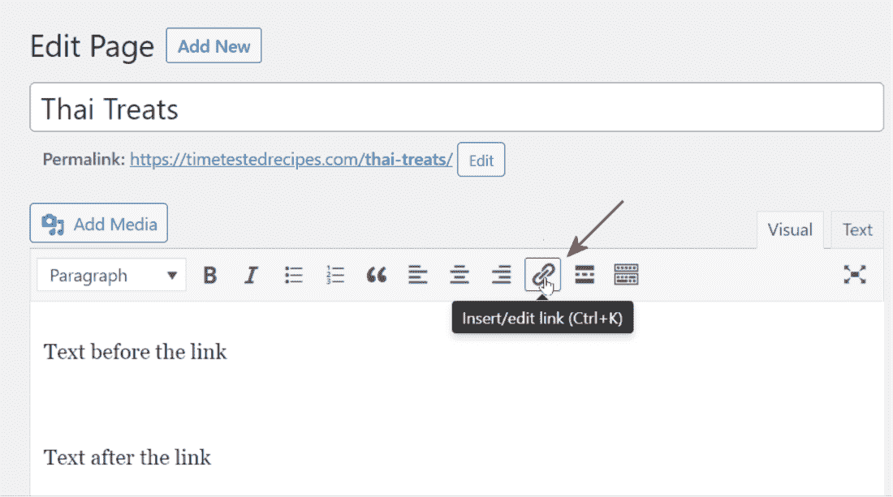

1.  单击图 3.4 中显示的齿轮图标。

##### 图 3.4 点击此齿轮图标会打开一个“插入/编辑链接”模块

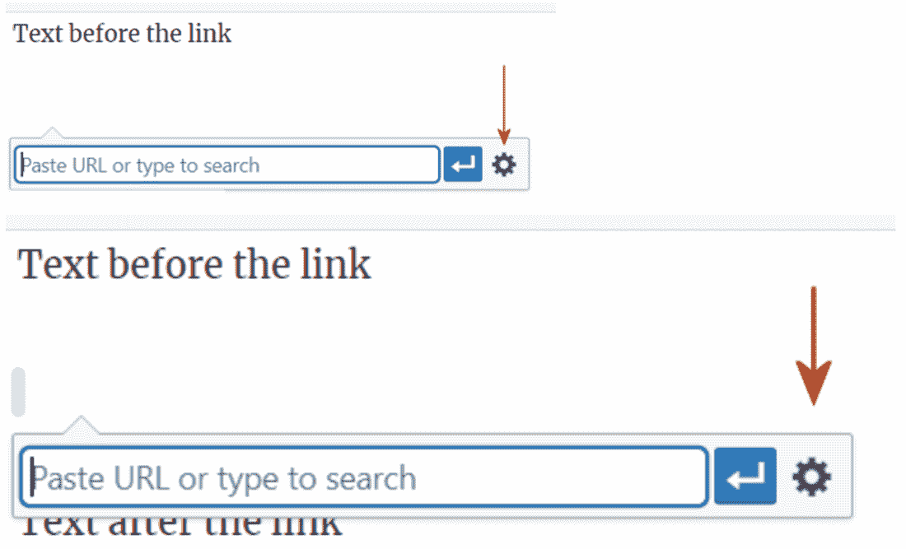

1.  您现在可以看到您站点中的页面和帖子列表。填写链接文本（标题）并点击链接目标页面，如图 3.5 所示。

##### 图 3.5 单击 *墨西哥特色菜* 时，WordPress 会填写该页面的 URL 地址。

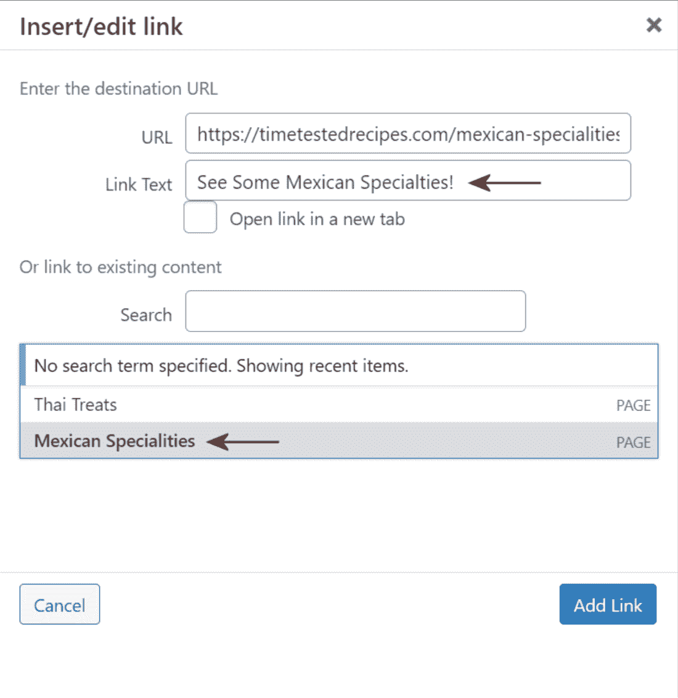

1.  最后点击“添加链接”按钮保存链接。

1.  点击“更新”按钮以保存您刚刚对该页面所做的修改。

1.  要查看实际链接代码，并可能修改链接文本，请点击文本框右上角的“Text”选项卡。（如果您正在使用古腾堡编辑器，请按下 CTL+SHIFT+ALT+M）

链接的 HTML 代码如下所示：

```py
<a href="https://timetestedrecipes.com/mexican-specialties/">See Some Mexican Specialties!</a>
```

我们稍后将探讨此代码，在手动创建不同类型的链接时。

##### 提示

在 WordPress 编辑页面和编辑文章屏幕中，有一个文本框，您可以在其中添加文本或媒体内容。这些文本框在其右上角有两个选项卡：Visual 和 Text。Visual 选项卡允许您看到内容几乎与访客在站点前端看到的内容相同。但是，Text 选项卡显示内容，但还显示告诉浏览器如何显示该内容的 HTML 代码。格式、加粗、链接、页面位置等等。（古腾堡将 Text 视图称为 *代码编辑器*，这是一个更准确的名称。）

#### 链接到外部网站

要创建到其他站点（例如 YouTube）的链接，您可以按照链接到站点页面时描述的相同步骤操作。唯一的区别是，在单击齿轮图标（步骤 6）之后，您粘贴或键入外部站点的 URL 地址。请参见图 3.6。

##### 图 3.6 在这里只需添加 URL 地址和链接标题即可


如常，不要忘记单击“添加链接”按钮。

#### 链接到不同页面内的位置

虽然链接到页面顶部更为常见，但有时您可能想将访问者发送到第三段落，或者在您站点的页面内的特定图像。

要执行此示例，请在您的实践站点中添加两个新页面，标题分别为“泰国美食”和“墨西哥特色菜肴”。

在本示例中，我们的链接目标是墨西哥食谱页面中的第二段落。而链接本身则在泰国食谱页面中找到。（如果您正在使用古腾堡编辑器，请在您的页面中添加经典块）。请按照以下步骤操作：

1.  转到墨西哥页面，并通过点击文本框右上角的“文本”选项卡（在古腾堡编辑器中，按下 CTL+SHIFT+ALT+M）创建链接目标。然后粘贴或键入两段随机文本。我们将创建一个链接，其目标是第二段：

*这是第一段。Lorem ipsum dolor sit amet, consectetur adipiscing elit, sed do eiusmod tempor incididunt ut labore et dolore magna aliqua. Ut enim ad minim veniam, quis nostrud exercitation ullamco laboris nisi ut aliquip ex ea commodo consequat。*

*这是第二段。Lorem ipsum dolor sit amet, consectetur adipiscing elit, sed do eiusmod tempor incididunt ut labore et dolore magna aliqua. Ut enim ad minim veniam, quis nostrud exercitation ullamco laboris nisi ut aliquip ex ea commodo consequat。*

1.  现在用 HTML `<p>` 和 `</p>` 标签将第二段括起来，告诉浏览器将所包含的内容显示为段落：**<p id="mextarget">**这是第二段。Lorem ipsum dolor sit amet, consectetur adipiscing elit, sed do eiusmod tempor incididunt ut labore et dolore magna aliqua. Ut enim ad minim veniam, quis nostrud exercitation ullamco laboris nisi ut aliquip ex ea commodo consequat。**</p>**

注意 `<p` 标签后面的 `id="mextarget">` HTML 属性。这为该段落命名。它标识该段落，以便我们可以将其作为我们将要创建的链接的目标。您可以将 *id* 属性命名为任何您想要的。

图 3.7 显示了您的 HTML ID 代码在文本（代码）选项卡中的外观。

##### 图 3.7 在目标段落开头放置目标 ID

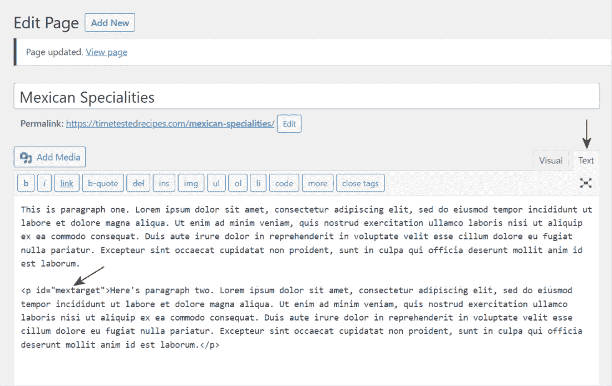

1.  单击“更新”按钮以保存这些更改。

现在，要创建一个指向墨西哥页面的链接，您需要该页面的永久链接地址。因此，请通过将鼠标拖动到永久链接上，然后按下 CTL+C 将其复制到 Windows 剪贴板中，如图 3.8 所示。

##### 图 3.8 这是您复制页面永久链接的位置

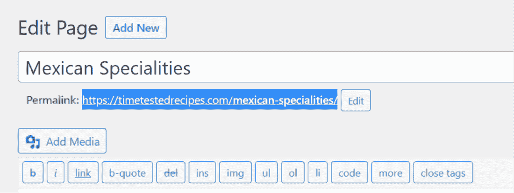

##### 在古腾堡中查找永久链接

在古腾堡中查找页面的永久链接是一项费时的任务。首先点击设置图标。它位于右上角。该图标以前看起来像一个齿轮（传统的设置图标），但现在已更改为带有一条穿过的矩形。


如果块选项卡（在设置图标下方）当前已选择，请单击页面选项卡。现在通过单击其黑色三角形图标打开摘要部分。然后找到并单击 URL。这将打开另一个模块，您可以在其中将鼠标拖动到永久链接上以选择它，并按 CTL+C 进行复制。可能更容易的是将永久链接显示在页面编辑器屏幕上。但这将违反古腾堡编辑器 UI 管理的最小主义理论。该理论提倡默认仅显示可能在该时刻需要的最少信息和最少选项。所以因为像永久链接这样的东西并不经常使用，您需要在 UI 中深入几个级别才能找到它。

这是一个提示：点击“查看页面”选项以查看页面的前端视图。然后只需从浏览器地址栏中复制永久链接。

1.  现在转到泰语页面以创建到该 id 的链接。点击泰国页面的编辑页面的文本标签，然后在文本框中添加此代码（但替换您页面的永久链接）：

```py
<a href="https://www.timetestedrecipes.com/mexican-specialties/#mextarget">Visit the second paragraph in the Mexican recipes page</a>
```

让我们解析一下这段 HTML 代码：“

+   **<a**是链接开标签的 HTML 代码

+   **href="https://www.timetestedrecipes.com/mexican-specialties**是您复制的指向墨西哥菜谱页面的永久链接。换句话说，这告诉链接在点击时显示互联网上的哪个页面。

+   **/#mextarget">**是您为墨西哥菜谱页面内的位置指定的 ID，当单击链接时，希望它转到的位置。它是第二段的**id**。

+   **访问墨西哥菜谱页面的第二段**是您希望在链接上显示的标题。

+   **</a>**是链接的闭合标签。

##### 提示

注意，在*链接*代码中，将井号（也称为井号**#**）添加到目标 ID 中：`#mextarget`。而在墨西哥页面中，ID 没有井号：`mextarget`。

1.  单击“更新”按钮以保存这些更改。

现在通过转到前端的泰语页面来测试链接。您可以通过在仪表板左上角点击您的站点标题，或点击两个“查看页面”链接之一的方式之一查看站点的前端，如图 3.9 所示。

##### 图 3.9：有三种从后端到站点前端的方式

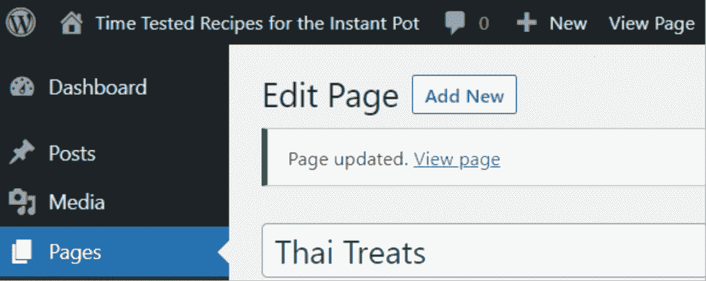

单击链接，浏览器应该显示图 3.10 所示的墨西哥页面的第二段。

##### 图 3.10：您直接跳转到页面内的段落，而不是跳转到其顶部

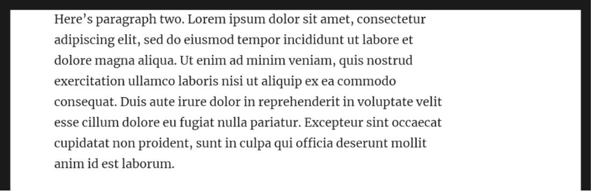

##### 调试 HTML

与一些计算机语言不同，当您提供有错误的代码时，HTML 不会显示错误消息。它只会做一些有趣的事情，比如发布 404 错误消息（页面未找到）。或者它可能什么都不做，嘲笑你。

计算机代码非常精确。一个错误的标点符号或拼写错误，计算机就无法理解你要求它做什么。这意味着你有一个要追踪的错误。在我们之前的链接示例中，你可能已经从像 Word 这样使用弯引号而不是直角引号的源代码中复制了代码。

##### 图 3.11 引号有两种类型——直角和（弯曲或斜向）——HTML 需要直角引号

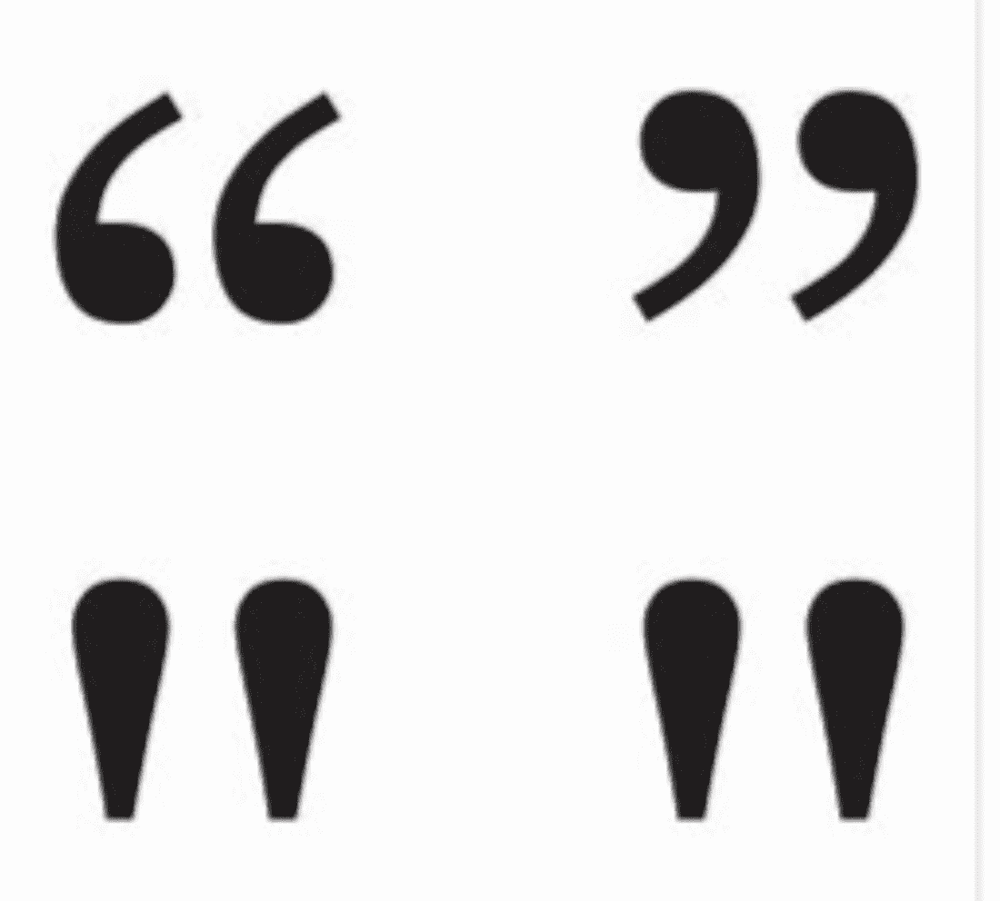

HTML 不喜欢弯引号。不知道它们到底是什么。

或者你可能遗漏了一个 > 符号，或者在你应该包含一个引号的地方没有使用引号。解决错误的一种方法是校对代码——仔细比较你的代码和本书中的代码。确保一切都完全相同（当然，除了你的 URL 地址）。但是还有一个有用的调试工具你也可以使用。

将你的墨西哥或泰国页面的永久链接粘贴到这个网站上：

W3C 标记验证服务

为了向你展示这是如何工作的，我在泰国页面的链接中省略了第一个引号，验证器正确地报告了代码的这一部分（称为属性）没有引号。所以这是一个简单的修复：我只是添加了需要的引号。这个错误消息显示在图 3.12 中。

##### 图 3.12 验证可以描述 HTML 代码中的错误

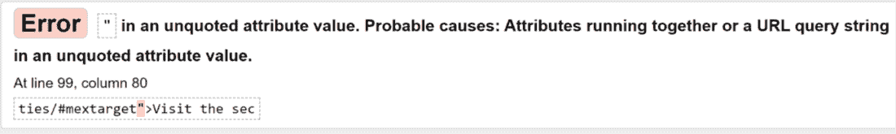

接着，它还通过显示图 3.13 中的错误消息，正确地标记了弯引号。

##### 图 3.13 这个错误消息甚至显示了非法字符，即引号

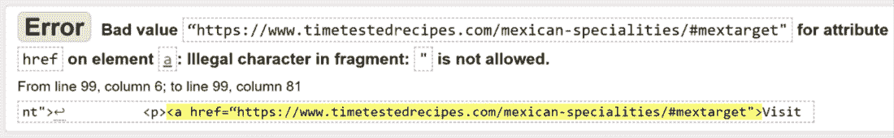

##### AI 助手

AI 系统在调试代码方面非常出色。这段 HTML 代码中有两个错误。它在 https 前使用了斜向（弯曲）引号。而且它在结尾的 </a> 标签中缺少了一个 / 斜杠：

```py
<a href=“https://www.timetestedrecipes.com/mexican-specialties/#mextarget">Visit the second paragraph in the Mexican recipes page<a>
```

所以我让 GPT 找出这段代码中的错误，并告诉我如何更正它们。

AI 在这次测试中得了满分。它回答说：

*我已经确定了提供的 HTML 代码中的错误：*

*href 属性的开头引号是弯引号（“）而不是直角引号（"）。*

*闭合锚标签缺少一个正斜杠（/）。*

*以下是更正后的 HTML 代码：*

*<a href="https://www.timetestedrecipes.com/mexican-specialties/#mextarget">访问墨西哥食谱页面中的第二段</a>*

*更改如下：*

*将 href 属性中的弯引号替换为直角引号。*

*在闭合锚标签中添加了一个正斜杠（/）。*

#### 链接到同一页面内的位置

这种链接比其他类型的链接更简单，因为你不需要指定 URL 或永久链接。当链接的代码中没有包含 URL 时，HTML 会假定你的链接目标在同一页面内。

假设你在页面上有四个标题。在页面顶部，你添加了一个链接到第四个标题。

在页面编辑页面的文本选项卡中，输入这四个标题：

```py
<h1>First</h1>
<h1>Second</h1>
<h1>Third</h1>
<h1>Fourth</h1>
```

然后在文本框的顶部键入链接：

```py
<a href=”#fourth”>Go to the fourth headline</a> 

<h1>First</h1>
<h1>Second</h1>
<h1>Third</h1>
```

最后，给第四个标题添加一个 ID，以识别链接的目标：

```py
<h1 id=”fourth”>Fourth</h1>

```

##### 提示

请记住，你可以将 ID 命名为任何你想要的名称，但在*链接*中，你必须在前面加上一个井号 #。

点击“更新”按钮以保存你的代码。现在，当你通过点击“查看页面”来测试它，转到你页面的前端时，点击链接应该会带你到第四个标题。

### 3.5.3 使用按钮作为链接

到目前为止，你已经看到了如何创建文本链接。但你也可以将图像、按钮或其他视觉元素转换为链接。让我们显示一个按钮，当点击时将访问者发送到 YouTube。

HTML 中有一个内置的按钮对象，所以你可以将其转换为链接。记住，在你的站点的编辑页面中添加代码时，你需要在文本框中点击“文本”选项卡。（或在 Gutenberg 中按下 CTL+SHIFT+ALT+M）

这是一个按钮链接的 HTML 代码：

```py
<a href=”https://www.YouTube.com”><button>Click to visit YouTube</button></a>
```

结果链接按钮如图 3.14 所示，在“泰国美食”下方。

##### 图 3.14 默认的 HTML 按钮是一个相当粗糙的黑色块

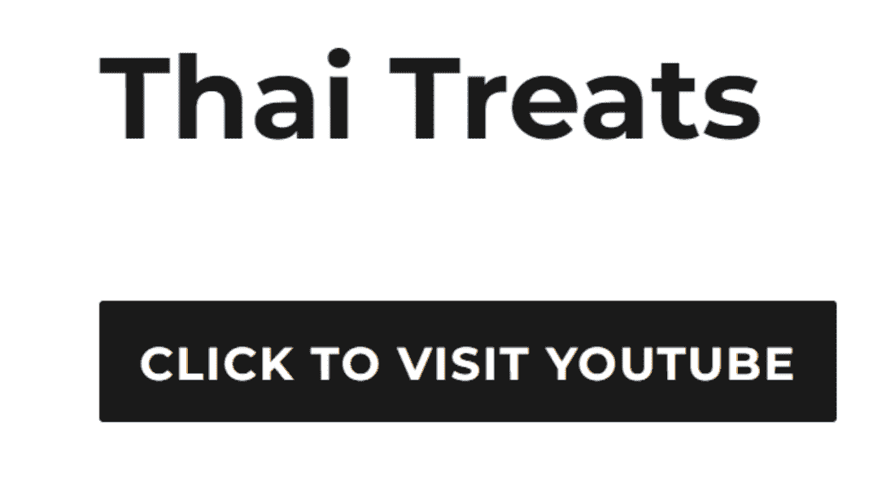

这个鲜明的全大写白字黑色按钮（HTML 默认）在许多 WordPress 主题中不会很好地融入。事实上，几乎没有一个。它很难看。所以让我们添加一些 CSS 代码，使它不那么严厉，如图 3.15 所示。

```py
<a href="https://www.youtube.com/" style="background-color: lightblue; color: gray; padding: 10px; border-radius: 5px solid gray;">Click to visit YouTube</a>
```

##### 提示

如果你只使用 `border` 而不是 `border-radius`，你会得到一个实心框架。添加半径，你会得到一个更细微的、3D 的阴影效果。

##### 图 3.15 CSS 样式代码可以改进默认的 HTML 按钮，但你可以做得更好

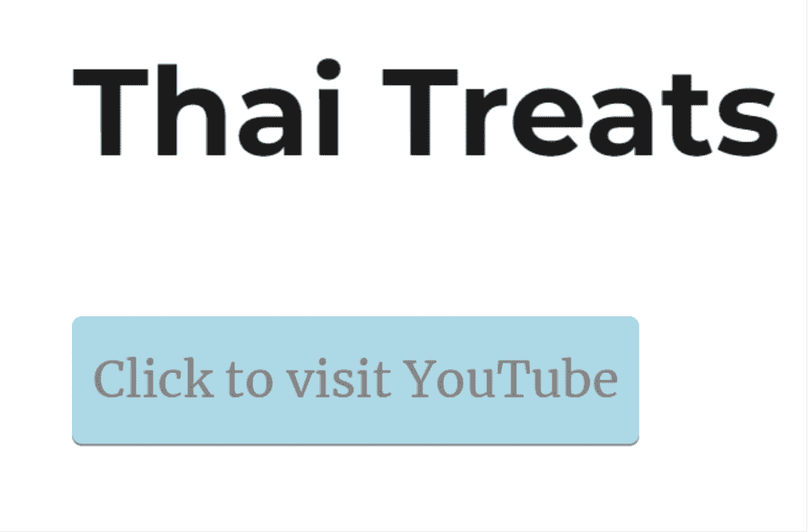

HTML 属性的`style`代码实际上是用 CSS 语言编写的。它与 HTML 结合使用来微调网站的外观，并且还可以添加特效，如动画、不透明度、过渡淡入淡出等其他酷炫的视觉效果。我们将在后面的章节中深入研究 CSS。幸运的是，CSS 相当容易理解，因为与大多数计算机语言不同，它使用像 *border*、*color* 和 *background* 这样的英文单词。当然，你也可以随时向克劳德或其他 AI 之一提交请求，以生成符合你要求的 CSS 代码。

那个蓝色按钮比第一个按钮要好，但它仍然可以改进。为了得到逼真的按钮，你可以在类似 Paint.net 或 PhotoShop 的图片编辑应用中创建一个按钮图像。或者使用像 Midjourney 这样的 AI 文字到图像应用程序。或者甚至从 pexels.com 或 iStockPhoto.com 购买一个按钮图标。然后将该按钮图像添加到你的网页中，并将其设置为链接。方法如下：

1.  转到媒体 > 添加新内容 屏幕，并将按钮图像上传到你的 WordPress 媒体库中。这是你在页面中使用的图像和其他媒体的存储位置。

1.  转到要创建链接的编辑页面。

1.  在文本框中点击“可视化”选项卡。

1.  点击“添加媒体”按钮，点击图像进行选择，然后点击“插入到页面”按钮。

##### 提示

如果你正在使用古腾堡代码编辑器，按下 CTL+SHIFT+ALT+M。这个键盘快捷键可以在代码视图和可视视图之间切换。现在你想要处于可视编辑器模式。然后在页面上添加一个经典块。如果你在经典块的工具栏上看不到菜单—文件、编辑、视图、插入等—那么转到你的插件 > 新增屏幕，并搜索、安装并激活 *高级编辑工具* 插件。在块的菜单中，选择插入 > 添加媒体（而不是媒体选项）。从你的媒体库中选择你想使用的图像。点击插入到页面按钮。

1.  在编辑页面屏幕上，点击图像以选择它。

1.  点击工具栏上的链接图标。

1.  输入 YouTube 的网址，然后点击左箭头图标，创建如图 3.16 所示的链接。

##### 图 3.16 这是如何将图像链接到 YouTube 的方法

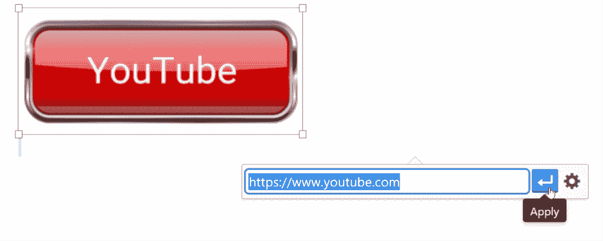

1.  点击更新以保存你的更改。

1.  点击查看页面以查看并测试链接，如图 3.17 所示。

##### 图 3.17 一张逼真的按钮图像比一个 HTML 按钮更专业

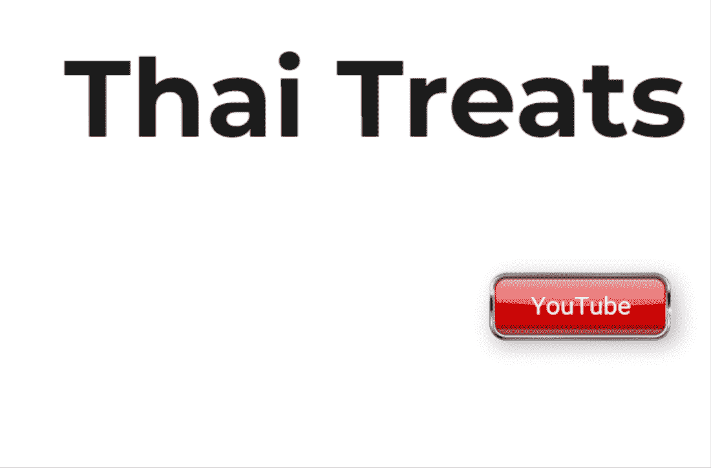

这是完整的 HTML 代码：

```py
<a href=”https://www.youtube.com”></a>
```

请注意，这里不需要链接标题，因为单词 *YouTube* 已经嵌入到按钮图像中了。

## 3.6 管理你的菜单

一个站点的菜单几乎总是关键的导航系统，所以你要搞好它。我们将通过建立菜谱练习站点的菜单来结束本章。这包括选择和重命名主页；在菜单中正确显示子页面；并检查是否有损坏的链接。

### 3.6.1 定制你的菜单

你的菜单项目的顺序，有时甚至菜单项目的名称都需要进行修改。但在这之前，让我们在练习站点中创建一些子页面。

##### 小贴士

如果你正在使用古腾堡编辑器，你可以按照下面为经典编辑器描述的相同步骤来创建你的菜单。古腾堡还包括一个导航菜单选项（作为外观 > 小工具屏幕上的小部件和编辑页面屏幕上的块）。它提供了几个选项，包括在侧边栏中显示到所有页面的链接列表。

到目前为止，所有页面都是父页面。这些新的子页面将是空的占位符页面。它们将有标题，但我们将在首先创建站点结构后再给它们添加内容。所以让我们在练习站点中再添加几个占位符页面。

转到你的页面 > 新增屏幕，并添加以下额外的占位符：

+   德州墨西哥风味餐

+   香辣泰式

+   中餐

+   法国料理

+   意大利食材

+   美食希腊

+   还要添加一个名为 *博客* 的新页面

##### AI 协助

如果你想要一些帮助来想出好的子页面，你可以问 GPT。

提示：

*作为一名专业的墨西哥餐厅厨师，请列出六个墨西哥食品的子类别（例如墨西哥德州风味）。不要根据地理位置创建类别。*

GPT 的建议：

*当然！墨西哥菜系丰富多样，虽然不可能仅用几个子类别来归纳其所有细微差别，但这里有六个广泛的类别：*

*街头美食*

*开胃菜和小零食*

*墨西哥辣酱和调味料*

*酸橘汁腌料和海鲜*

*砂锅菜和炖菜*

*甜点和糖果*

在创建菜单之前，还有一些小事情需要处理。WordPress 默认将博客页面设置为首页。但是对于练习站点，您希望将博客设置为内部页面。 （博客是一种特殊的页面，其中包含您或您的访客发布的所有消息。它们以可滚动的、反向时间顺序显示。我们将在下一章中处理博客页面。）

前往“文章” > “新增文章”，键入标题和一些文本以创建一个虚拟的占位文章。这会导致 WordPress 为您创建一个博客页面的流程完成。点击“发布”按钮。

此时将博客更改为内部页面。如图 3.18 所示，转到“设置” > “阅读”屏幕，然后点击“静态页面”选项，并选择将*Instant Pot 的经过时间测试的食谱*设置为首页。选择*博客*作为博客页面。点击“保存更改”按钮。

##### 图 3.18 这是您指定站点首页的地方

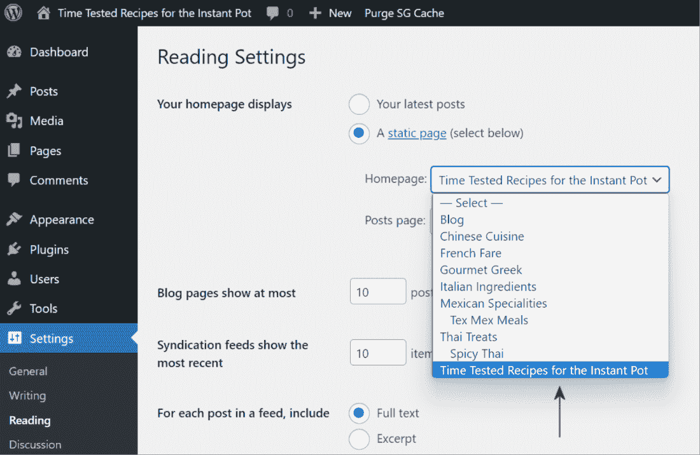

当您首次开始新的 WordPress 网站时，您需要为站点命名一个标题。如果您为本书设置了练习站点，请在附录 A 中将练习站点命名为*Instant Pot 的经过时间测试的食谱*。WordPress 会自动将您的首页标题与站点的标题相同。（每个站点都有一个首页。）但是您应该更改默认的首页标题。这是多余的。网站标题出现在每个页面上。因此，首页不应与站点标题相同。

因此，转到您的“页面” > “所有页面”屏幕，点击*Instant Pot 的经过时间测试的食谱*以打开其编辑页面屏幕。将首页标题更改为*轻松卓越*或您喜欢的任何内容。点击“更新”按钮。

快速查看您的“页面” > “所有页面”屏幕。请注意，WordPress 已将博客标识为博客页面，将 Easy Excellence 标识为前端（首页），如图 3.19 所示。

##### 图 3.19 WordPress 已识别出您的主页（首页）和博客页面，并缩进了子页面


在构建站点菜单之前，您需要将“Tex Mex 餐”和“香辣泰式”转变为子页面。转到“页面” > “所有页面”，双击“Tex Mex 餐”。要将其设置为“墨西哥特色”父页面的子页面，找到“页面属性”模块，然后点击 V 形图标以展开父菜单。点击*墨西哥特色*。点击“更新”按钮，如图 3.20 所示。

##### 图 3.20 这是您将子页面分配给其父页面的地方。实际上，您在此处创建父/子页面关系

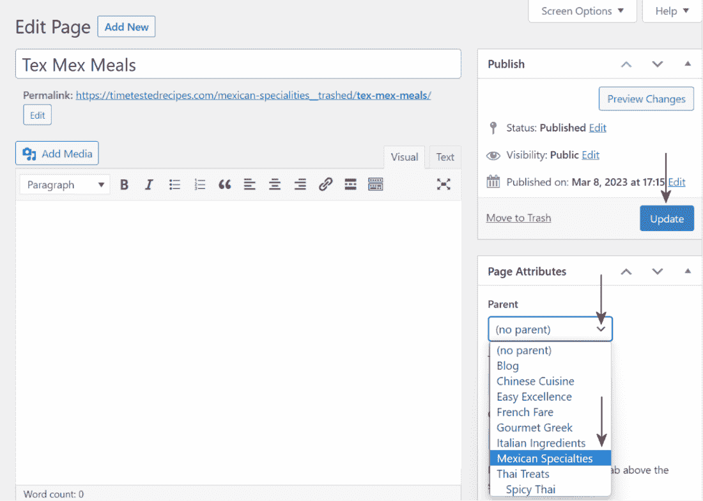

按照相同的步骤将“香辣泰式”设置为“泰国特色”的子页面。

填充了占位符后，现在您可以将注意力转向组织和自定义菜单。转到“外观” > “菜单”屏幕。

由于某些原因，WordPress 默认仅在其“添加菜单项模块”中显示最近的页面。幸运的是，WordPress 中很少见到此类用户界面错误。但您应该记住这一点：每当您访问外观 > 菜单屏幕时，请务必首先单击“查看所有”选项卡，如图 3.21 所示。

##### 图 3.21 必须记住单击此“查看所有”选项卡

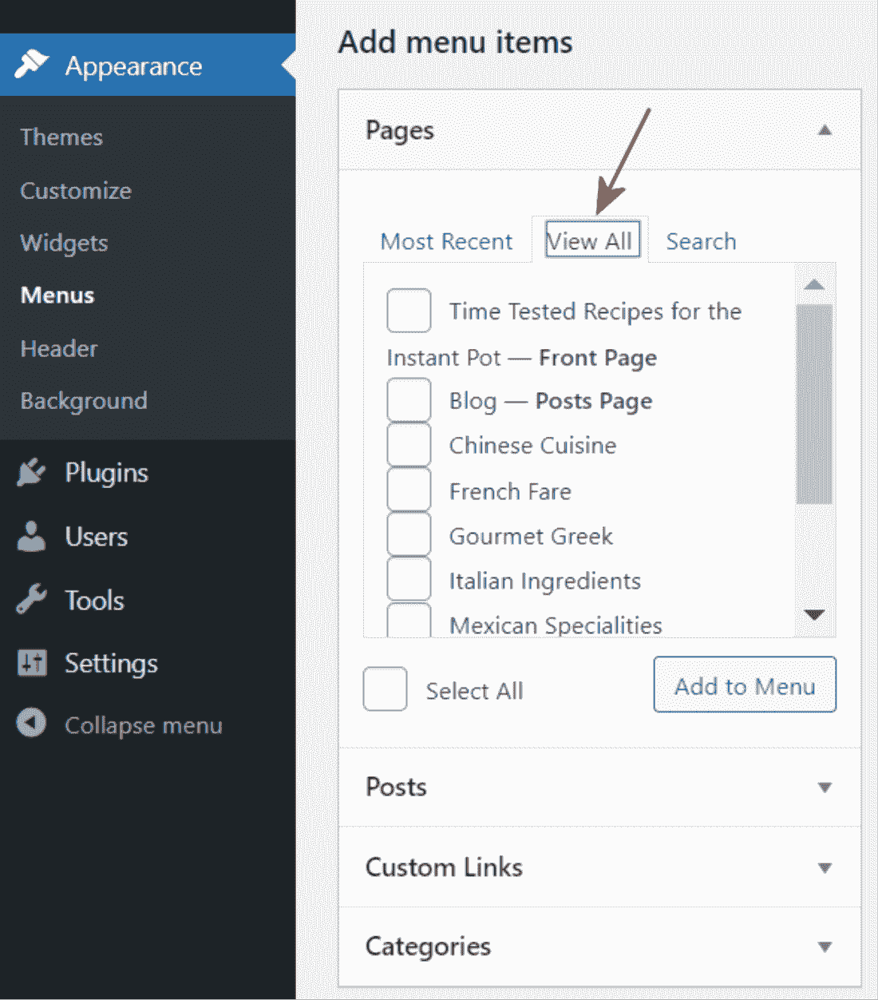

在菜单结构下，输入菜单名称，然后单击“创建菜单”按钮。您希望所有页面都出现在菜单中，所以单击“添加菜单项模块”中的“全选”框，如图 3.22 所示。然后单击“添加到菜单”按钮。菜单结构模块将填充您的页面标题。单击此模块下方的“指定主菜单”选项。这将使新菜单出现在每个页面的顶部附近。您可以选择放置菜单的位置取决于您的主题（或您安装的菜单插件）提供的选项。

##### 图 3.22 添加所有页面到菜单

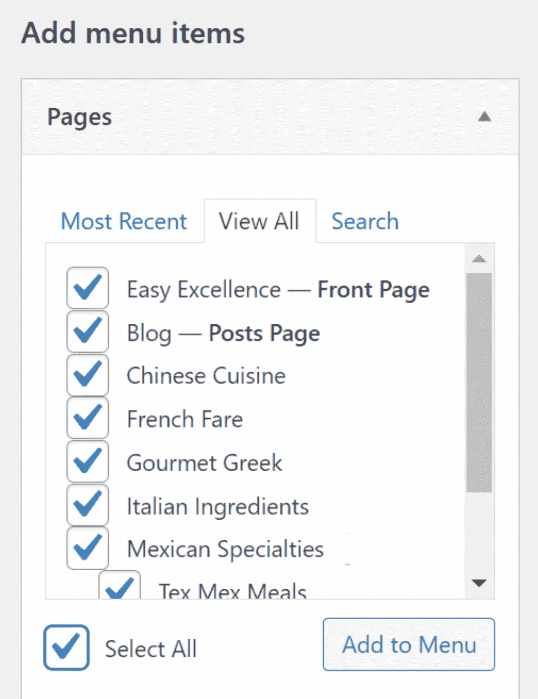

### 3.6.2 创建子页面菜单链接

拖放菜单项，使您的菜单结构看起来像图 3.23。要将菜单项更改为子菜单（换句话说，显示为子页面），请将其向右拖动一点，然后将其放置在其父菜单项的缩进下方。

这种操作需要一些时间来适应。请注意，在图 3.23 中当您将菜单项向右拖动时出现的微弱虚线框。该框是您希望将 Tex Mex 餐饭子项目��放的目标位置。

##### 图 3.23 要创建子菜单（子菜单）项，请将子菜单拖到一个标签上并将其放在那里


##### 提示

如果您发现将子菜单向右移动一个标签的过程具有挑战性，您也可以单击子项框右侧的黑色箭头图标来打开其模块。然后单击图 3.24 所示的*移至*链接。

##### 图 3.24 您可能会发现此链接比将菜单项移动一个标签更容易

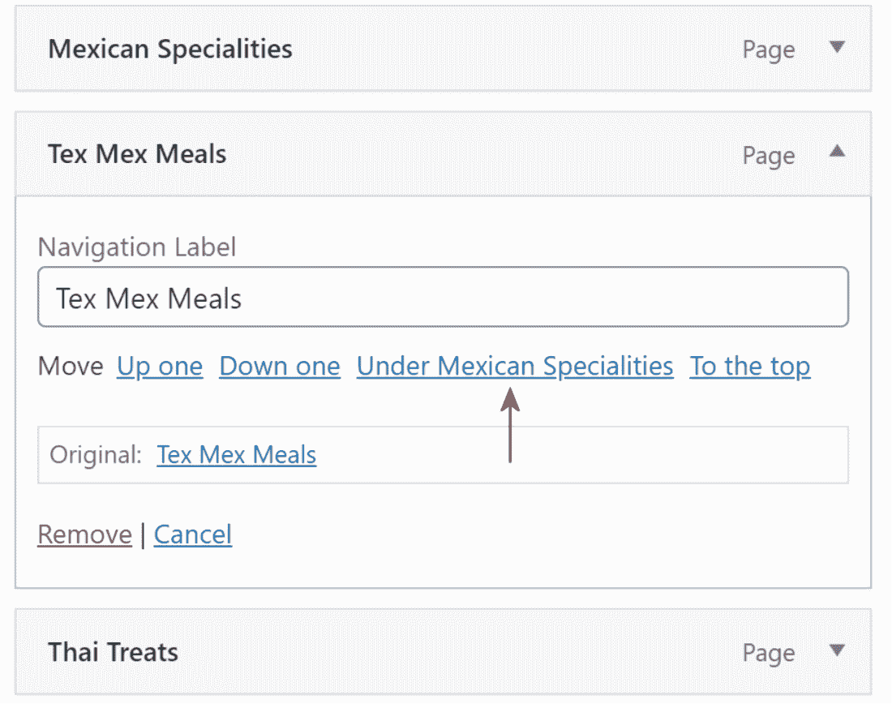

为了完成菜单，我们将希望缩短菜单项的名称（WordPress 称之为*导航标签*）。对于每个菜单项，请单击其框右侧的黑色箭头图标以打开其模块。将标签重命名为：*主页、中文、法文、希腊文、意大利文、墨西哥文*和*泰文*。简洁的菜单是我们的目标。

请注意，您必须将*Easy Excellence*重命名为*主页*，因为这是习惯的。人们期望第一个菜单项命名为主页，并位于菜单栏的最左侧。

完成的菜单结构应该类似于图 3.25 所示。

##### 图 3.25 完成的菜单

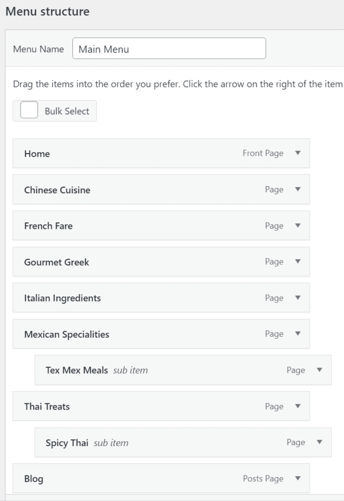

单击“更新菜单”按钮，然后单击左上角的网站标题*Instant Pot 时测试配方*以查看前端的菜单，如图 3.26 所示。请记住，单击网站标题是在后端和前端之间快速切换的一种快捷方式。

##### 图 3.26 完成菜单的前端视图

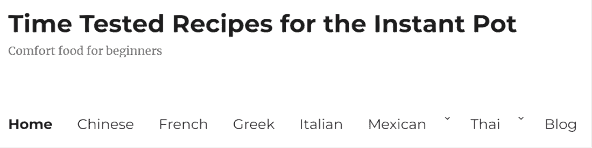

现在要注意两件事。Twenty Sixteen 主题在菜单上提供了两个不引人注目的视觉提示：当前显示的页面的菜单项是加粗的（在本例中是首页），而墨西哥和泰国的项目具有小的“v”图标，让人们知道这些项目有子页面。

警告：没有什么比死链接更能清晰地表明“不专业”和“不可靠”的了。确保你的所有链接实际上指向真正的目标，而不触发“页面未找到”的错误消息。对于小型网站，可以通过在前端点击它们手动检查它们来测试链接。较大的网站可以使用 Google 搜索控制台插件。或使用此在线检查器：`www.brokenlinkcheck.com/broken-links.php` 我们将在接下来的章节中探讨插件。

本章内容全部围绕初步规划展开：你的网站目的和层次。我们还探讨了像链接和菜单这样的工具，这将使你的访问者在遍历网站结构时更容易。

现在我们已经在练习网站中创建了占位页面，是时候填充内容了。我们将从文本内容开始。大多数适用于 Web 的写作需要特定的语气和风格。正如您将在下一章中看到的那样，人工智能非常擅长将您的初稿变成优秀的、适合 Web 的文字。

## 3.7 总结

+   在向网站添加内容之前，确定网站的蓝图和最终目标非常重要。这可以帮助你把握网站的目标，并有助于建立一种连贯的设计和高效的网站导航。

+   在规划网站时，创建父子页面的层次结构是蓝图的一部分。这样就能简化菜单，只显示主要（父）类别，隐藏次要（子）页面——只有在游客将鼠标指针悬停在父类上时，它们才会变得可见。

+   避免长滚动主页——它们效率低下，可能会惹恼游客。滚动并需要扫描标题来找到感兴趣的内容比阅读菜单要麻烦得多。

+   链接是关键的导航工具，正确使用可以降低你的网站跳出率，提高你的行动号召成功率。

+   特别注意菜单，它是网站的主要导航工具。在菜单中只展示少量项目，保持每个选项的长度简短。
