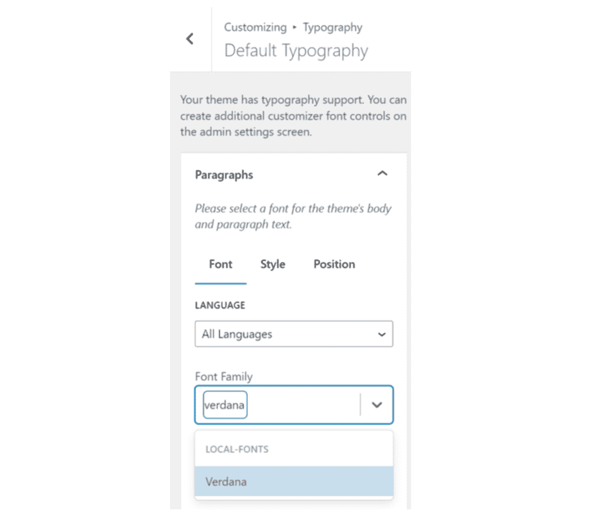
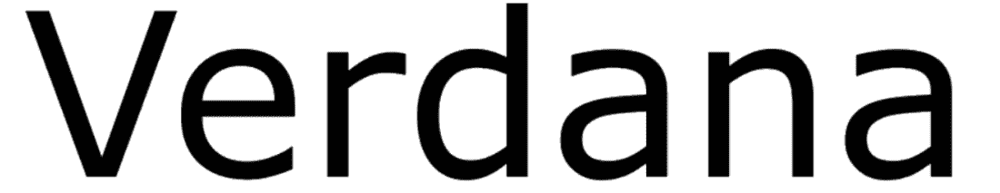
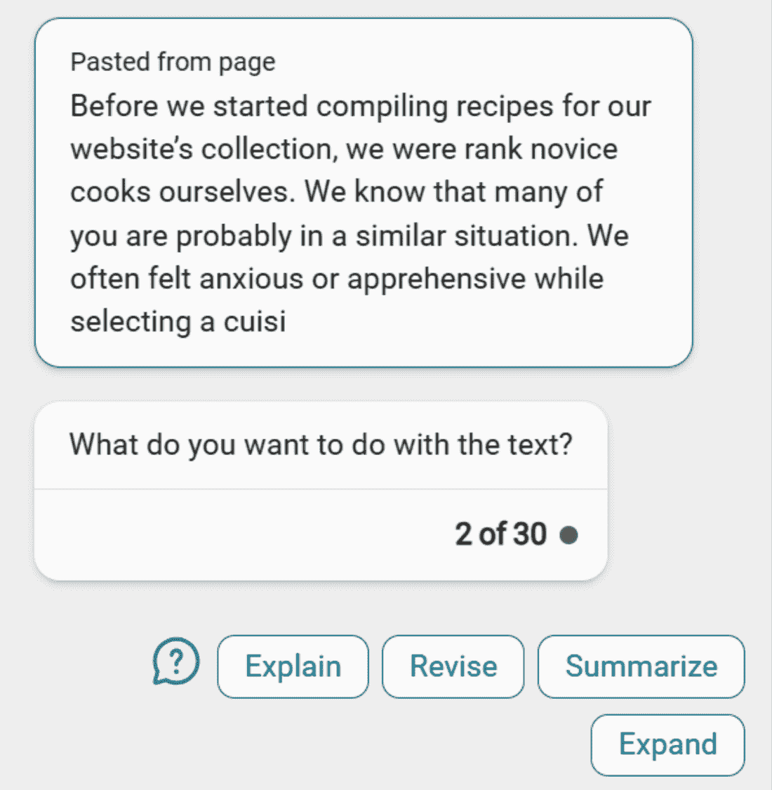
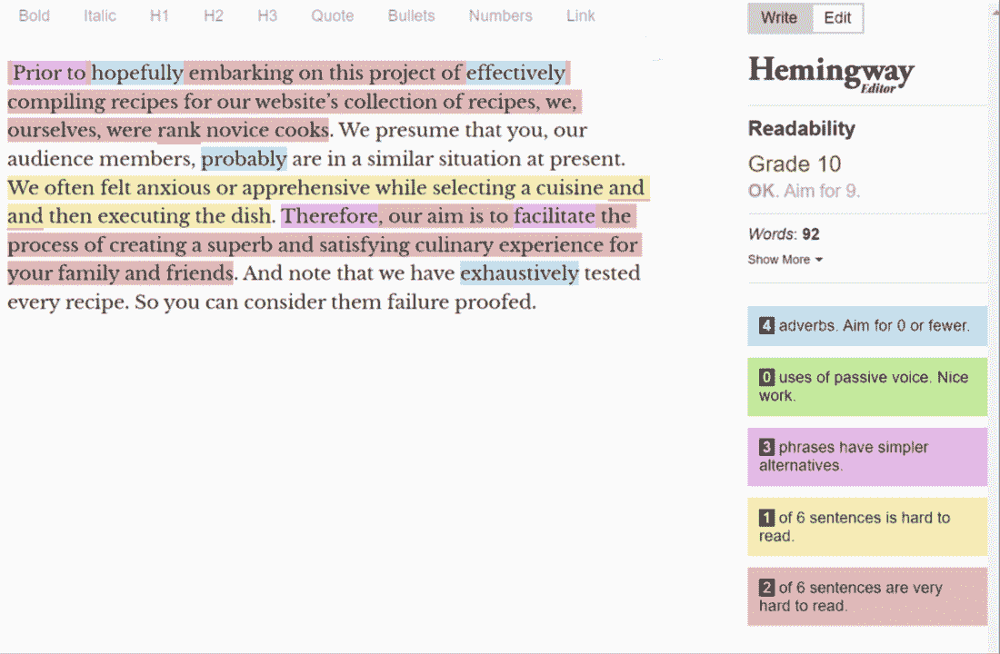
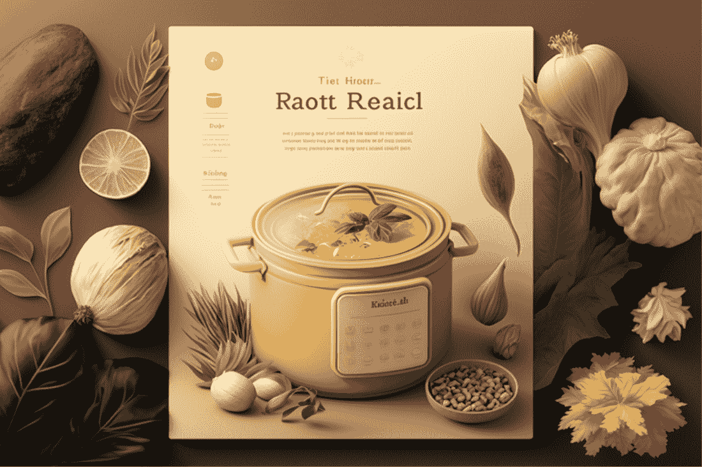
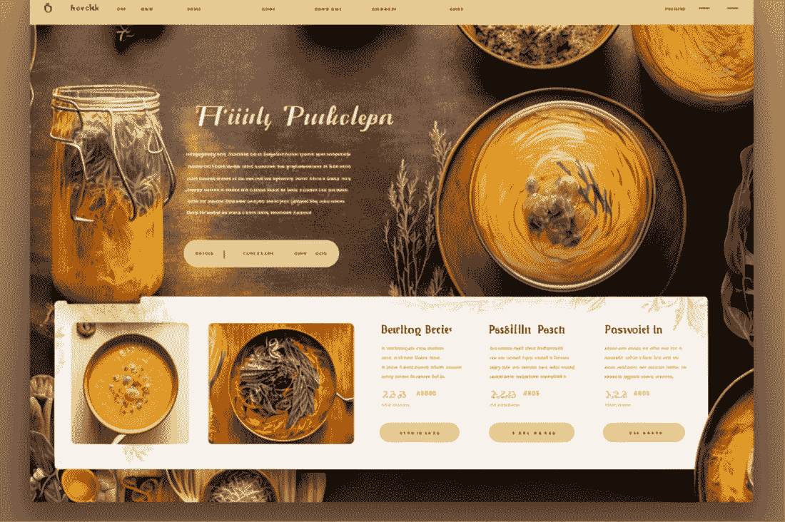
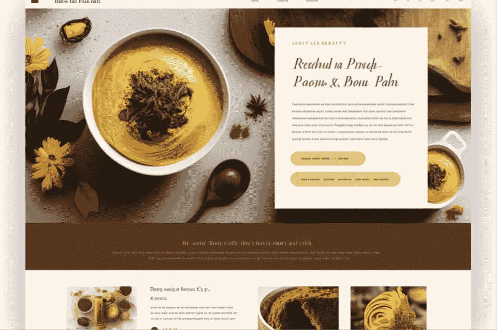
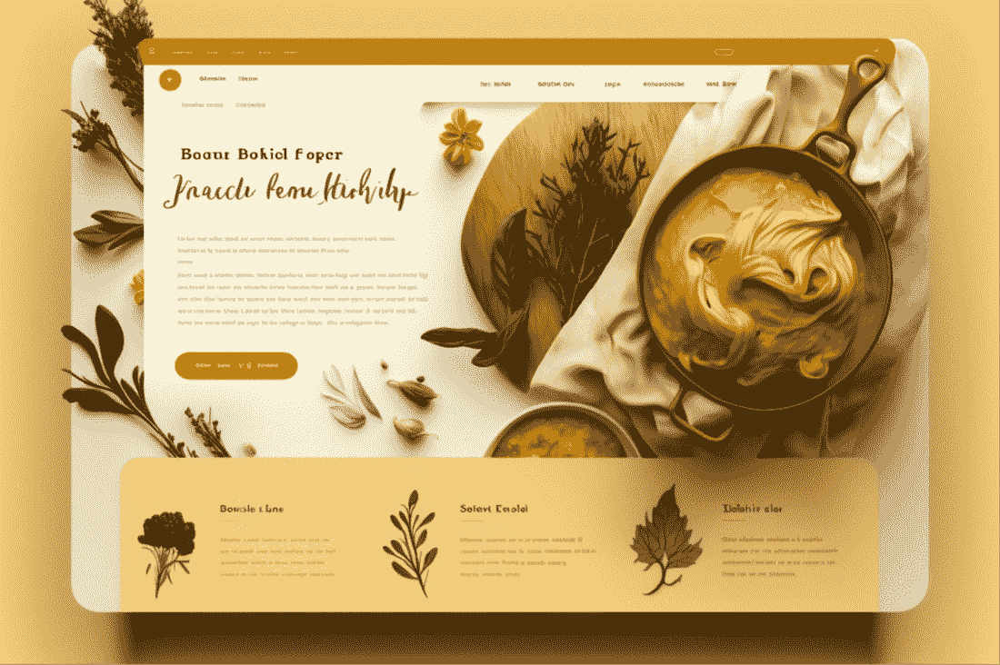
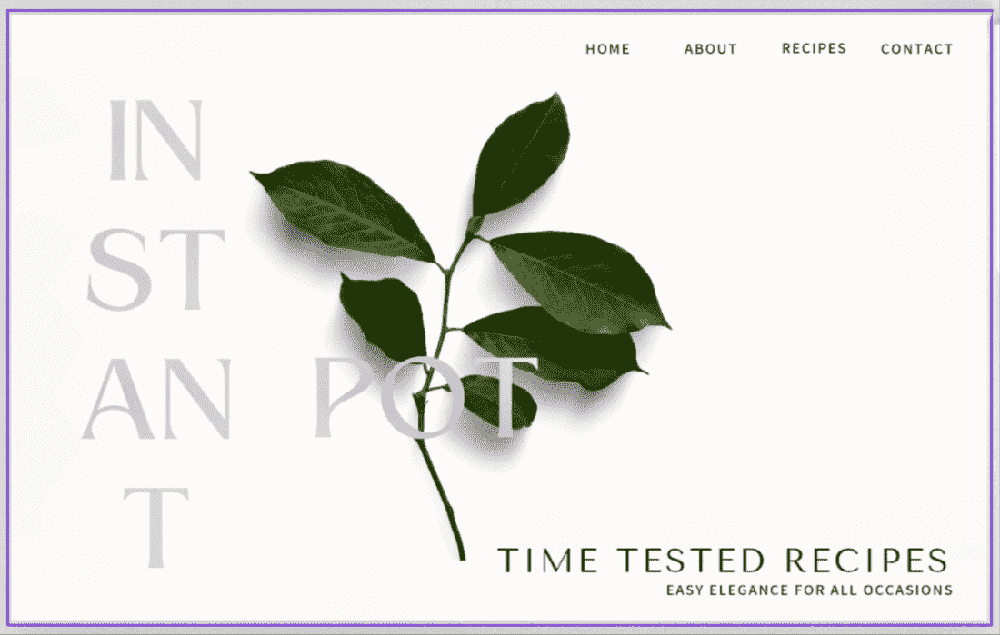
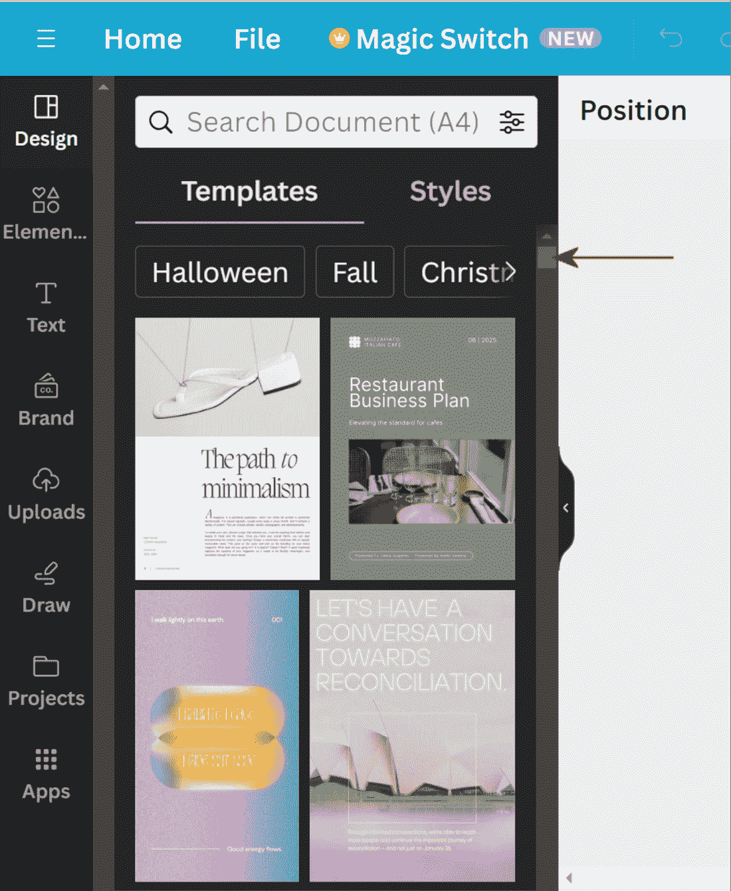

# 第四章：准备写作

### 本章涵盖

+   选择正确的排版

+   了解网站写作风格

+   用出色的主页吸引访客

本章重点关注您网站的文本内容。以及 AI 如何在细节上为您提供帮助，例如选择一个好的字体，以及您整体写作的质量和风格。当拼写检查器出现时，我们不再需要擅长拼写。有了 AI，我们不再需要擅长写作本身！

在本章后面，您将把您的文本提交给一个 AI Hemingway。我认为您会对它如何改善您的写作感到惊讶。我也是。

首先，您肯定会想找到最佳的字体和文本设计。您选择字体大小、字体家族（例如 Times Roman）、字体样式（正常或斜体）、粗细度（字符线条的粗细，**加粗**与正常的区别，例如）和其他属性，如字母间距和行高。您选择的主题提供了一些默认值，但您应该进行微调。

此外，您需要考虑您写作的语调和风格。大多数现代网站都采用轻松、对话式的风格。因此，如果您来自法律、学术或其他正式写作背景，您将在本章中学习如何放松您的写作——如何掌握一种不同、更具对话性的方法。AI 可以帮助您以更加随意、更具吸引力的方式重新撰写文本。

最后，我们将探讨一些方法，通过制作一个精彩而不可抗拒的主页来吸引您的访问者——访问者首先看到的页面。研究表明，人们平均在*0.05 秒内*就会决定留下还是离开主页！因此，您访问者的第一反应确实很重要。AI 在这方面也会非常有帮助，确保您给出自信、积极的第一印象。

## 4.1 选择最佳的排版

大多数人实际上并不了解排版，甚至都没有考虑过。但在某种程度上，它确实对他们产生了影响。为您的网站正文、标题和说明选择一种吸引人且易读的字体和字号。而这里最重要的考虑因素就是*可读性*。您希望显示的字符足够大，以便可读。屏幕上的字体大小通常以*像素*为单位指定。

##### 定义

*像素*或*px*（图像元素）是指数字显示器上的最小视觉单位，即单个点。但像素不是固定大小，像英寸那样。它是相对的。像素大小相对于整个屏幕的大小。因此，足球场上的大屏幕将具有砖块大小的像素，但平板电脑的像素可能太小而无法被眼睛看到。像素是您通常可以靠近大屏幕电视看到的单个色点。

### 4.1.1 理解 AI 多模态

当前的*多模态*是 AI 研究的一个活跃领域。这个想法是，像 GPT 这样的大型语言模型不仅应该从文本输入中学习，而且还应该从其他模态的输入中学习，比如视频、图形、音乐，甚至交通摄像头或任何其他信息源。换句话说，像人类一样从现实世界的输入中学习。（只不过比我们学得快得多，而且永远不会忘记。）

目前，像中途这样的文本到图像生成器通过从互联网上获取图片来学习，并将之与文本组合（例如，通过存储标题为图像进行标记）。但最终的目标是让 AI 系统能够从各种各样的信息中学习。

持续研究的一个相关领域涉及允许我们用户向 AI 系统提交多模态提示。在某种程度上，当前的文本到图像系统确实允许这样做。除了文本提示外，你还可以将图像上传到 GPT、谷歌的贝尔德（Bard）和中途（Midjourney）。然后，AI 根据图像和文本生成输出。在某些系统中，可以通过滑动条调整输出与提交的图像相似程度。

但是多模态的输出怎么办呢？如果你想这样请求：“请描述在面向儿童的网站中用于正文的三种最佳字体，并显示展示这些字体外观的图像。” 目前，唯一能提供文本描述和相关图像的 AI 是 GPT 和 perplexity.ai。类似 Claude 的其他 AI 也在努力。Claude 对于这种提示类型的当前响应是提供文本段落，并附带图像链接。

### 4.1.2 选择最佳的字体大小

对于你网站的正文文本来说，建议的像素大小在电脑显示器上查看文本应为 16 像素到 18 像素之间。（好的主题会在检测到网站在平板电脑或手机上查看时自动将字体大小调整到较小。）

但如果你的正文字体比较细，你可能希望将像素大小增加一点。此外，研究表明，如果你的网站包含大段的文本，为了增加可读性，你应该选择 18 像素或更大一些的字体大小。为可读性而设计：一份 Web 排版指南 | Toptal®[[1]](#_ftn1)

但请记住，大多数网站不应该文字过多。上网时，大多数人都像跳蚤一样，如果碰到一堆灰色的文字感到无聊、困惑或迷茫时就会立刻跳到别的地方。

##### 提示

要查看和修改网站排版的大小、字体和其他元素，请进入网站的后台管理页面（WordPress 仪表板），然后点击外观（Appearance）> 自定义（Customize）> 排版（Typography）。它可能被称为排版（typography）之外的其他名称，比如*字体*（typeface）或*文字*（text）。其中的名称和显示的信息取决于你使用的主题，或者如果你安装了相关的排版插件，则取决于该插件。

##### 提示

要添加大量的字体到您的网站上，我建议您转到您的插件 > 新增屏幕并搜索、安装和激活优秀的 Easy Google Fonts for WordPress 插件。然后您可以转到外观 > 自定义 > 字体屏幕，并从数百种 Google 的字体中选择！找到一种适合您网站设计的字体。图 4.1 显示了您如何使用此插件选择字体。

##### 图 4.1 谷歌字体插件包括数百种供您选择的字体



请注意，谷歌使用 *字体系列* 这个术语来表示我们所说的 *字体*。

你还应该根据两个额外因素选择你的字体大小：行高和字体。

行高是文本行之间的白色空间量。它被指定为字体大小的倍数，1.5 或 2 是最常见的值。如果太小，文本可能变得难以阅读；如果太大，文本看起来断断续续，就像是打算成为项目列表，但缺少了项目符号。

### 4.1.3 选择字体

##### 提示

术语 *字体、字体* 和 *字体系列* 经常可以互换使用，但我们将使用 *字体* 来指代字母设计（比如 Arial 或 Times Roman），而在描述字体的特性时使用 *字体*，比如字体大小或字体样式。

有数百种字体可供选择。粗的；细的；线条形状和厚度各异的；极简的；华丽的；卷曲的；方块状的；几何的；甚至是奇怪的、专门设计的字体，比如蜘蛛网状以显得怪异；或者由跳舞的腿组成的字符以表现小丑。

在婚礼策划师网站上很好用的（人类手写的模仿，如书法或脚本字体），对于迪克体育用品店这样的网站则不适用。而正式、保守的罗马字衬线字体在医院和银行等地方最为适用，因为必须传达可靠性和信任度。然而，大多数网站应选择无衬线字体（简单、无卷曲线，线宽变化小）。流行的无衬线字体选择有 Arial、Verdana 和 Helvetica。

一些研究表明，然而，在数字屏幕上有三种字体特别易读：Consolas、Cambria 和 Verdana。但只有一种是明显的赢家。

Consolas 是经常用于编程代码的字体。但因为可读性并不是唯一的标准（Consolas 很容易阅读），所以要避免使用，因为它不够吸引人。Cambria 是易读的，但它是一种衬线字体，一些研究说你应该避免在网站正文中使用。

获胜者 Verdana 是专门为屏幕阅读而设计的。1996 年为微软创建，它拥有干净、简单的线条。它在网站设计师中相当受欢迎。字符相对较宽，间距较宽。对于许多网站来说，这是最佳选择。

Verdana 是微妙的。它的边缘*略微*弯曲，并且某些字母的线条粗细有所变化（参见图 4.2 中的小写字母），使其比传统无衬线字体更柔和，更轻松。你可以在图 4.2 中看到 Verdana 的效果。

##### 图 4.2 Verdana 的简洁设计使其在各种屏幕尺寸上都可读，并且对于许多类型的网站来说是一个很好的选择



### 4.1.4 十种流行字体

下面列出了十种流行的字体，展示了不同风格的范围——从传统和正式到古怪：

+   Helvetica——一种干净现代的无衬线字体，广泛用于印刷和网站正文。

+   Times New Roman——一种经典的衬线字体，通常用于正式文件或需要传达稳重和保守性的网站。

+   Futura——一种几何无衬线字体，具有独特和未来感。

+   Bodoni——设计于 18 世纪，这是一种高对比度的衬线字体，即使在今天也经常用于标题和标题。然而，网站标题通常是无衬线字体。

+   Garamond——一种优雅且永恒的衬线字体，通常用于书籍和其他印刷品。

+   Impact——一种大胆而引人注目的无衬线字体，最适合广告和网站标题。

+   Comic Sans——一种俏皮而不拘一格的字体，常见于儿童书籍和趣味性网站设计。

+   Optima——类似于 Verdana，它是一种优雅、平衡的混合字体，包括衬线和无衬线设计元素。它多才多艺，被认为相当可读。

+   Arial——一种流行且多功能的无衬线字体，经常在各种上下文中包括网站上在计算机屏幕上看到。

+   Brush Script——一种手写草书字体，具有手绘和艺术感，用于标识、品牌和像新娘店、餐饮和时尚网站这样的网站。据说它传达了优雅和精致。

你网站的主题通常会指定默认大小、行高和字体。但如果没有的话，浏览器有它们自己的默认值，通常是 16 像素的通用无衬线字体作为正文文字。

你也可以使用 CSS 代码来修改你的字体值（实际上 CSS 几乎可以自定义*任何*其他设计特征）。我将在第六章向你展示一个出色的插件，它可以自动生成 CSS 代码。所以不需要学习 CSS 语言来微调你网站的外观。

在指定字体属性时的最后一个基本考虑是它的颜色，更准确地说是颜色的*色调*。每种颜色从淡色到非常深色都有不同的范围。这就是粉色是红色的浅色的方式。

一些设计不好的网站在深色背景上使用深色字体。反之亦然——浅色背景上使用浅色字体。显然，这种对比度不足会对可读性产生负面影响，特别是对视力不佳的人来说，这是特别令人沮丧的。文本应该与其背景形成对比。这通常意味着黑色或深色的文本与白色或浅色的背景形成对比。最好的选择通常是老牌可靠的黑白色。并且背景不应与文本竞争——因此不要在文本下方放壁纸或生动的图像。在像背景这样的事情上，微妙是首选。

人工智能可以帮助您查看一些优秀设计网站的示例。例如，将此请求提交给像 GPT 这样的人工智能平台：

请列出两个网站的地址，这些网站特别有效地利用了它们的排版。并列出排版元素，如行高、字体名称、字号等。

### 4.1.5 排版检查清单

以下清单包括一些您在网站发布之前可能需要调整的其他排版细节：

1.  在不同设备和屏幕尺寸上检查您的排版，以确保可读性。

1.  你的标题应该帮助建立网站信息的清晰层次结构。标题和副标题应该彼此易于区分（通常通过大小或粗细）并与正文文本区分开来。标题总结和介绍接下来的文本内容。

1.  使用一致的排版。这意味着在整个网站中使用相同的大小、字体和颜色，以创建统一的外观和感觉。

1.  确保您的排版对所有人都可访问，包括视觉障碍者。因此选择一种易于阅读的字体。我们将在下一章中介绍一些辅助测试工具。

1.  排版可能会影响页面加载速度。一些字体比其他字体更复杂，加载时间更长。并非每个人都有高速互联网连接。请使用此免费在线工具测试您的网站：`www.isitwp.com/free-website-speed-test-tool-for-wordpress/`

1.  如果您计划在多种语言中显示您的网站，请选择提供这些语言版本的字体。

### 4.1.6 获得人工智能对您的排版的客观意见

在选择并应用了您的字号、字体、颜色、行高和字距之后，请将您的网站提交给人工智能。我询问了 Perplexity 对宠物领养网站排版的看法：

“请告诉我您对这个网站排版的优缺点的看法：sitename.com”

它通过提醒我，它不是一个人，因此没有个人观点来回应：

*作为一个 AI 助手，我没有个人观点。但我可以为您提供对您提供的网站排版的客观分析。*

然后它告诉我它的意见。它们事实证明确实有用且准确，尤其是缺点和最后的总结。借助 AI 作为您的研究助手、编辑、设计评论员和全能的博学多才者，它可以向您的网站提出扎实的改进建议：

*困惑：网站的排版简单易读。所使用的字体是无衬线字体，由于其清晰和现代的外观，无衬线字体是网站的热门选择。字体大小也适合，使得在桌面和移动设备上阅读文本变得容易。*

*优点：*

*排版易读，适用于网站的内容。*

*使用无衬线字体使网站看起来现代且清晰。*

*字体大小适用于桌面和移动设备。*

*缺点：*

*排版并不特别独特或令人难忘，这可能使网站与其他与宠物相关的网站相比显得不那么与众不同。*

*网站上很少使用排版来创建层次结构或视觉吸引力。例如，没有使用粗体或斜体文本来强调重要信息或创建对比。*

*总的来说，网站的排版功能齐全，适用于网站的内容，但在创建更具特色和视觉吸引力的设计方面还有改进的空间。*

*克劳德.ai 在警告我可能会出现幻觉后也提供了帮助：*

*以下是我对网站排版的评估：*

*优点：*

*对于标题和正文文本，使用了简单、清晰的无衬线字体（看起来像是 Roboto）。这使得网站具有现代、友好的氛围。*

*标题大而粗，便于扫描。*

*正文文本的大小和行高适合阅读。*

*深色文本和浅色背景之间有良好的对比，增强了可读性。*

*缺点：*

*所使用的字体缺乏个性，它们是安全和通用的选择。使用更有特色的字体可以使品牌更加突出。*

*正文段落太长。将它们分成较短的段落可能有助于阅读。*

*文本对齐是两端对齐，这可能导致单词间距不均匀。左对齐的文本通常阅读起来更容易。*

*在宽屏幕上，行长度变得非常长，使得从一行到另一行的跟踪变得更加困难。*

*总体而言，排版完成了任务，但还有改进的空间。我建议使用更具特色的标题字体，缩短段落长度，左对齐文本，并设置最大行长度。这些变化可以使排版从功能性提升到引人注目。如果您需要其他建议，请告诉我！*

此外，您还可以提出更具体的问题以获得更具体的建议。

提示：*克劳德，你会建议使用哪些替代字体来赋予它更多个性？考虑到网站的主题。*

克劳德：*以下是一些字体建议，可以为网站注入更多个性，同时仍然适用于宠物/动物主题：*

*Raleway - 这种优雅的、锥形的无衬线字体比 Roboto 多了一些风格。它的曲线和夸张的笔画增加了一丝俏皮的感觉。*

*Montserrat - Montserrat 具有圆润、泡泡感的外观，灵感来自城市和涂鸦风格。它的随意但充满活力的氛围可能与宠物相契合。*

*Playfair Display - 一种衬线字体，但具有弹性、友好的字形。它的对比度和斜线强调给人一种有机的感觉，非常适合动物主题。*

*Libre Baskerville - 一种温暖、坚固的衬线字体，带有微妙的圆角。它的传统风格带来了一丝古典气息，同时又给人一种狗耳朵、深受喜爱的感觉。*

*快乐猴子 - 一种展示字体，具有有趣、泡泡状、猴子扳手的外观。可能对正文来说太俏皮了，但对标题来说可能效果不错。*

*岩盐 - 手写字体，粗糙的边缘赋予这种字体很多个性。传达了宠物和动物手工制作、个性化的特质。*

*如果您需要网站的字体配对或样式的其他建议，请告诉我！我很乐意提供更多的排版建议。*

我会说前三个建议值得考虑。但随着我们继续往下看，它们变得越来越幻觉。请注意，由于该网站涉及宠物相关内容，一些更与动物而不是印刷术相关的修饰语渗入其中：*俏皮、泡泡、有弹性、狗耳朵、猴子*。公平地说，寻找能潜意识传达这些词语的字体确实对于宠物领养网站是有意义的。

Meta 的巴德也提出了一些好主意，大多与 Perplexity 和 Claude 的观点相同。但巴德又增加了一个独到的建议：“*在大多数情况下避免使用全大写。全大写可能难以阅读，会让文本显得过于激进*。” Google 的大喇叭也提供了类似的评论，但它犯了一个错误，说它喜欢使用大小写字母。（哪些网站不使用它们？）Bing 和 GPT 表示它们只能提供一般性建议，因为它们无法访问网络。Edge 给出了这样简洁但准确的回答：

*排版清晰，易于阅读。字体大小足够大，能够辨认，并且字体风格在整个网站上保持一致。网站还使用了无衬线字体，这是网页设计的一个不错选择，因为与衬线字体相比，它在屏幕上更容易阅读。*

提示几个人工智能系统可能是个好主意，以获得多样化的意见。

## **4.2 写作风格**

人工智能可以在提供适合您网站整体使命的文本内容方面提供很大帮助。

网站内容大多是对话式和非正式的。在写作时，使用您与朋友交谈时通常使用的语气和措辞。如果你对我在前一句中使用“像”一词感到不满，那么在为网络写作时，你需要放松一点。对话式写作允许在用词和语法上有一些非正式之处。

因此，如果你有法律、编辑或学术背景，或者其他方面倾向于写正式散文——你可能需要争取采用许多网站典型的更为随意的沟通方式。当然，总有例外。法律、银行、医疗或教育目的的网站可能需要更紧凑、更正式的“正确”风格。这些网站需要传达可靠性、权威性和严肃性。一点点的*冷漠*也不会有什么坏处。但大多数网站应该以随意、友好、易接近的语气为目标。

### 4.2.1 转换一段呆板的段落

你网站首页的第一段对吸引受众至关重要。你想要欢迎他们，让他们从一开始就感到舒适。让我们尝试将一段呆板的、正式的引言写作为我们的第一段，然后请 GPT 将其修改为更温暖、更口语化的版本。这本书的菜谱练习网站的首页标题是*易优美*，所以这是一个自负的第一段：

*在希望着开始有效地为我们网站的菜谱收集有效编写菜谱的项目之前，我们自己是业余的厨师。我们推测，你们，我们的听众成员，目前可能处于类似的情况。在选择烹饪和执行菜肴时，我们经常感到焦虑或不安。因此，我们的目标是为您的家人和朋友创造出一次出色而令人满意的烹饪体验。请注意，我们已经对每道菜谱进行了彻底的测试。所以你可以认为它们是无懈可击的。*

相当呆板，不是吗？

AI 在这种情况下可以非常有帮助。当我们要求它重写我们的段落以使其不太正式时，它给出了以下内容：

*在我们开始为这个网站整理这些菜谱之前，我们在厨房里完全不懂！也许你能理解？  我们过去在选择晚餐要做什么时会感到很紧张，甚至在烹饪时也是如此。所以，我们的目标是让您轻松地为您的朋友和所爱的人做出一些了不起又美味的东西。这些食谱简单但很棒！它们不会让你失望——它们经过了大量的测试。*

### 4.2.2 召唤一个模拟体

我们可以给 AI 分配角色，比如网站评论员，或者是获奖的网站设计师。这也意味着我们可以让它召唤出一些著名的已故人物。让我们请一个 AI 海明威模拟体给我们一些建议，来改善我们的散文。

海明威的风格仍然影响深远，因为它的清晰和简洁。（1935 年出版的《风格的要素》——至今仍在教授——倡导了一种类似的干净、清晰的写作方式。）两者都认为最好的写作方式是力求简洁。海明威建议：

+   编写一个简短而有力的第一段。努力吧，这是吸引读者的钩子。

+   保持句子简短。在被要求用六个词讲述一个故事时，他写道：“待售：婴儿鞋，未穿过。”

+   使用肯定的短语，而不是否定的短语。例如，使用 *easy* 而不是 *not hard*。您应该使用描述想法的术语，而不是其相反的术语。

+   修改，然后再次修改。“我写了一页杰作，然后写了 91 页的废话。我试图把废话扔进垃圾桶。”

+   他们说他将《永别了，武器》的最后一页重写了 39 次。一个采访者问他问题。他说：“把话说准确。”

##### Bing 提供了与风格相关的三个设置：

图 侧边栏 4-1:


如果您使用类似于“请修改以下段落，使其更为非正式和对话”的提示，Bing 将提供良好的修订。

另外，当您在右侧的侧边栏中选择聊天时，Bing 也提供了一个修订选项。要使用该选项，请按照以下步骤操作：

1\. 在左侧的主窗口中选择一些文本。它将自动出现在右侧的聊天窗口中：

图 侧边栏 4-2:


2\. 单击“发送”，您将获得下一个图中显示的选项

图 侧边栏 4-3:



3\. 单击“修改”，您会得到一个新版本，但它往往更像是一种释义，而不是改变语气的改写。

### 4.2.3 使用海明威应用程序

谈到海明威，有一个应用程序将这些原则付诸实践。您可能想利用这个应用程序：`hemingwayapp.com/`。

您将得到对您写作中任何问题的扎实分析。如果您倾向于写得过于正式，或者有其他问题，如过度使用副词（诸如 *hopefully* 和 *really* 这样的 “ly” 词）或过分依赖被动语态（*The burger was eaten by the dog* 如果您修改为使用主动语态，则可以使其更清晰、更简洁：*The dog ate the burger.*）

让我们将我们过于正式的段落交给海明威分析应用程序。图 4.3 显示了它的反馈。它特别不喜欢副词，并建议使用少于零个。

##### 图 4.3 这个海明威应用程序在将正式写作修改为更为对话风格时会很有帮助



要使用该应用程序，请点击其网页右上角的“写”按钮。删除现有的示例文本，然后将您的文本粘贴到该字段中以替换它。单击“编辑”按钮以查看结果的评论。

除了发展轻松的风格外，还要记住将内容分成相当简短的段落。避免大段的灰色文本墙。甚至尝试限制整个网站中的文本量 —— 除非您有不采用的充分理由（例如大量的商品目录）。在大多数页面上，只显示几个简短的段落，通过空白、媒体或布局设计进行分隔。

永远不要忽视从人工智能辅助中获益。你最成功的竞争对手正在使用它。你可以找到许多正文内容生成器，甚至有些可以通过改写来避免抄袭。

记得将你的文本通过抄袭检测系统检查一遍。例如，当你在 Microsoft Word 中打开拼写和语法检查器（F7）时，你会看到编辑器面板中有一个标题为“相似性”的部分。如果发现你的文本在互联网上的其他地方重复，它会标记任何抄袭问题。或者尝试使用 Copyleaks（它会检查数十亿个在线来源）或 Grammarly（你应该使用它，因为它是一个很好的通用、用户友好的写作助手）。

为什么要担心抄袭？你知道你自己不会这么做。实际上，有很好的理由担心。在写作时使用人工智能引入了两个新的危险。你可能会在某个时候忘记检查人工智能的结果是否存在抄袭（有时它会直接从互联网复制整段内容而不进行修改）。或者在写作时，你可能会忘记修改一些从人工智能那里复制的内容。

只公布*你自己的*原创内容是正确的，而不是别人的——即使那个别人是一台机器。

话虽如此，人工智能可以生成许多不同类型的与网站相关的内容，包括博客消息、产品描述、首页文本、各种形式的正式性、一系列引人入胜的标题变体供你选择等。

这里有一些面向网站作者的人工智能资源：

`medium.com/@bedigisure/free-ai-content-generator-11ef7cbb2aa0`

## 4.3 制造一个很好的第一印象

记住，你必须花时间打磨你的首页，特别是你网站的第一段。而且*真的*要努力写好第一句。注意，海明威说过，一篇文章的第一段至关重要。它必须立即吸引读者的注意力。

### 4.3.1 吸引访客

实际上，你网站的整个第一页都必须吸引访客。写尽可能多的修订，直到文本变得精彩。简洁。出色，像一个清澈的小溪那样清晰。并重新设计页面，直到在视觉上表现出色。

我们将在不久的将来专门讨论两章关于网站设计的内容，但现在让我们预览一下这个主题。开始考虑你的首页设计的一种方式是根据颜色心理学研究结果来考虑什么样的颜色方案会是一个好选择。什么颜色最适合你特定网站的受众？对于我们的食谱练习网站，我进行了一些研究，并得出了以下建议：

+   红色是快餐连锁店最常用的颜色，其次是黄色和橙色。

+   黄色和橙色会让人感到饥饿。

+   棕色有助于给你的网站建立柔和而真实的感觉。

+   蓝色，尤其是深色调，或者使用过多的蓝色总体上会让你的网站给人一种冷漠和冷淡的感觉。

+   据说蓝色还能抑制食欲。对于食谱收集来说并不是最佳选择。

### 4.3.2 利用人工智能寻找设计灵感

作为实验，让我们向图像生成器 Midjourney 提供四个设计，让它遵循那些心理研究的颜色建议。

这是我向 Midjourney 提交的提示：

```py
*sunny, bright, beautiful home page for an instant pot recipes website, brown::2 yellow::1 4K, detailed, masterpiece, ux, ui, --no blue --no orange --ra 3:2 --q 2* 

```

##### 提示

注意，您可以使用双冒号符号在 Midjourney 提示中指定您想要*相对权重*。该提示表示将棕色比黄色突出两倍：brown::2 yellow::1。其他规格包括：高分辨率（4K），用户体验，用户界面，宽高比 3:2 和高质量（q 2）。

这是显示在图 4.4 到图 4.7 中的四个结果。

##### 图 4.4 除了一些奇异的植物外，这是一个可以作为我们主页的设计。



##### 图 4.5 这个版本可能对于一个主页来说太复杂和拥挤了。



##### 图 4.6 这个设计平衡得很好，并很好地遵循了我们的色彩方案，但我们可能会在下部分中离开，以简化设计。



##### 图 4.7 这个设计同样需要简化文本和图像的数量，但左侧草药的立体阴影效果是一个很好的主意。



除了一些外星花卉和蔬菜外，这些图像看起来是灵感的好起点。从 Midjourney 或其他人工智能图像生成器中，通常可以得到与颜色组合、布局、排版、平衡、文本或图像放置相关的惊人的好主意。有趣的是，人工智能艺术通常似乎以某种方式使用在艺术学院教授的规则，关于平衡、线条、对称、颜色、对比度、构图等等。

Midjourney 为每个提示生成四个图像，因此可以轻松生成大量替代方案。如果有什么您想要从生成的图像中摆脱，请使用 "-no" 命令，就像之前阻止蓝色和橙色的方式一样。梵高曾说过：“没有黄色和没有橙色就没有蓝色。”但我们不想要蓝色或橙色，所以我们告诉 Midjourney。

尝试在提示上进行变化，直到设计真正脱颖而出。例如，尝试切换加权：`brown::1 yellow::2`，或者通过放大并选择 Vary 或 Zoom 选项来完善 Midjourney 的四张图像中的最佳图像。您还可以"混合"修改提示。您和 Midjourney 之间的这种来回可以产生你所寻找的杰出的最终结果。

### 4.3.3 使用 Canva

如今在设计领域工作的任何人都需要了解 Canva。您可以从 GPT 中开始 Canva 插件（推荐），也可以直接访问 canva.com。 Canva 可以轻松创建一个印象深刻的极简主义现代化主页，就像图 4.8 所示那样。

##### 图 4.8 如果你想要一个不太舒适、家庭化的设计来为你的网站设计，尝试一下 Canva。凭借其深思熟虑的用户界面，你可以快速地创建一个令人愉悦、专业的形象



Canva，作为 GPT Plus 的插件，为设计提供了丰富的资源。假设你想为我们的 Instant Pot 实践网站设计一个更现代、更极简的主页设计。一个不那么显眼的*舒适*设计。

+   1\. 将 Canva 插件添加到 GPT 中的活动插件中。

+   2\. 使用此提示：使用 Canva 为提供食谱的网站创建一个现代、极简、优雅的主页

##### 提示

Canva 本身不提供提示——它只有一个传统的搜索工具。因此，如果你通过 GPT Canva 插件进入 Canva，你会得到人工智能的优势。通常情况下，提示会给你更好的结果。出于与查询 AI 通常更有效地获取有用信息的相同原因，比起自己进行研究而言。搜索只会给你一个你需要访问以寻找答案的地方列表。

+   3\. GPT 会向你展示一些示例主页的图片，附带 Canva 的链接。

+   4\. 点击显示与你要寻找的最接近的主页样本模板的链接。

+   5\. 这将带你进入 Canva 的免费版本。

+   6\. 在 Canva 的侧边栏中查看并滚动，看看是否有你更喜欢的模板。见图 4.9。

##### 图 4.9 使用此滚动条选项卡，或你的鼠标滚轮，来浏览你的 GPT 提示找到的样本模板



+   7\. 如果通过滚动找不到合适的模板，就在模板搜索字段中输入：食谱网站首页

+   8\. 按 Enter 键

+   9\. 浏览数百种设计。尝试不同的搜索词，如“极简主义”或“现代”。

+   10 当你在侧边栏中找到一个你喜欢的设计时，点击它移动到主窗口。然后侧边栏将重新绘制，显示与你选择的那个类似的设计。

+   11\. 如果你愿意的话再次滚动。当你最终找到合适的时候，点击顶部菜单上的“调整大小”。创建你想要的形状。

+   12\. 双击设计中的文本以进行定制。

+   13\. 探索 Canva。如果你打算设计，它是值得你花时间的。例如，点击你设计中的一个元素以选择它，然后点击“动画”菜单项。

### 4.3.4 主页清单

通过考虑以下建议来预先规划你的主页：

1.  **编写一个简短、引人注目、描述性的页面标题。** 它应该总结你网站的目的。并包括一个简短的段落，更详细地说明网站提供的好处。主页的房产都在于简明扼要。如果你绝对*必须*显示更长的文本内容，用副标题或项目符号列表分隔开，将其放在页面较低的位置。

1.  **人们对视觉的理解速度比对文字快得多。**选择能够*立即*帮助他们理解网站目的的图片。不要包含仅作装饰目的的图片。限制背景装饰以确保它不与你的图片竞争。时刻保持简明和专注。研究表明，你的访客在*毫秒内*决定是否继续停留。所以你没有太多时间来吸引他们。

1.  对于网站的目标**要坚决一致**，并且应该只有*一个*主要目标。如果你在写一篇旅行博客，不要在首页上添加健康提示，这样会削弱焦点。可以在内部子页面专门讲述旅途中保持健康的内容，但要保持内部化。在首页上，将健康主题限制在一个概念上。确保首页上的*每一样东西*都服务于你的一个主要目的。

1.  **避免**跳出*，*这意味着有人访问你的主页，但立即返回并转到另一个网站，没有浏览你的内部页面，甚至没有仔细查看你的主页大部分内容。

记住，专家们说平均来说访问你的网站的人在 0.05 秒内就会决定是否留下。如果你的主页经受住了这个超快速判断，仍然有可能在接下来的 20 秒内离开，除非你能够吸引住他们。从技术上讲，互联网营销专家们会关注他们称之为*跳出率*的数据：即在没有浏览其他页面的情况下浏览主页的访问者所占的百分比。我们将在后面关于网站分析的章节中看看你如何利用这个指标（还有其他很多指标）。

1.  **不要让访客滚动页面。**他们不会停留足够长的时间来发现起初屏幕下方可能有他们感兴趣的内容。将最能吸引人的内容放在首页屏幕的最顶部。如果你认为有更多的空间来吸引人，只需要记住，目前的估计是大约 50％的上网操作在便携（即小）屏幕上进行，其中手机占主导地位。要从最顶部吸引他们。

1.  **确定你希望访客采取的下一步行动。**他们应该点击一个链接进入一个展示你产品的页面吗？你希望他们填写表格以便你可以获取他们的电子邮件用于以后的营销信息吗？他们应该使用你的网站搜索工具吗？你希望他们通过在你的博客上发帖来分享他们的观点吗？或者订阅你的网站？或者可能预约、签署请愿书或者获得免费试用？

你希望他们采取的任何下一步行动被称为*行动号召*（CTA）。所以如果他们没有采取这一步，如果他们离开了，那么你的主页就失败了。

让行动呼吁（CTA）在视觉上与其他内容区分开来（例如对比色），并包含简单而有力的文字描述，例如 *查看我们最受欢迎的食谱* 或 *注册以获取额外的食谱*。也许可以通过提供他们的电子邮件地址来获取十个最佳食谱来激励他们跟随行动呼吁。让他们明确知道您提供的奖励是什么。也许可以为他们的第一笔订单提供折扣。无论采取什么措施，都要防止他们离开您的网站。“仅剩三份！” “注册获取独家优惠。” “立即观看视频。”

1.  **移除出口。** 不要给他们展示会离开您网站的链接。有些网站甚至隐藏了菜单——用三条线的汉堡菜单图标，或者仅仅一个单词*菜单*来代替。这是一种相当极端且颇具操控性的做法。但确实要避免在主页上放置可能诱使他们点击并跳转到 Facebook 或 Twitter 的社交媒体按钮。

1.  **精炼和修改。** 一个主页，像任何创意工作一样，永远不会真正完美。当朋友或亲戚尝试您主页的不同版本时，注意观察他们的行为。某个版本可能拥有最成功的行动呼吁（CTA）。安装我们将在书中稍后提到的分析插件。它们可以告诉您访客的行为、他们来自哪里、他们在网站上的路径、他们查看不同页面的时间以及其他可以帮助您改进网站的数据。

1.  **建立信任。** 推荐语是展示您的网站的价值和质量的强大工具。考虑在主页上添加几个来自访客的简短而热情的评论。最好显示这些人的名字、位置和照片，以使他们看起来更加真实。或许还可以包括一个包含更多推荐语的内部页面。推荐语与评论略有不同——前者完全是积极的，而后者，为了可信度，必须包含至少几个批评性的评论。

在本章中，您已完成内容创作和站点设计的准备工作。首先，您探索了选择最佳字体及相关特质的方法，使文本内容看起来更棒。接下来，您了解了如何获得一种让读者愿意阅读您内容的写作风格。最后，本章以实际行动结束：创建一个引人注目的主页。在下一章中，您将深入探讨设计，学习让您的网站看起来出众所需的工具和技能。如我们所见，人工智能能够生成令人难以置信的原创艺术。因此，它也将在网站设计中发挥重要作用。

## 4.4 总结

+   排版是网站成功的重要因素之一，许多人没有意识到这一点。您的主题可能会指定一些默认设置——字体、大小和其他字体元素，但您应该看看这些选择是否可以改进。

+   学会写作许多网站上常见的对话风格。除非某个网站必须传达稳固和严肃的感觉——比如法律或学术网站——否则，人们通常期望一种非正式的语气。

+   你的首页必须迅速吸引读者，并将他们引导到你的行动呼吁的目标处。人们在首次访问网站时很快做出判断，除非你给他们留下深刻印象，否则他们就会离开。

[[1]](#_ftnref1) `www.toptal.com/designers/typography/web-typography-infographic`
