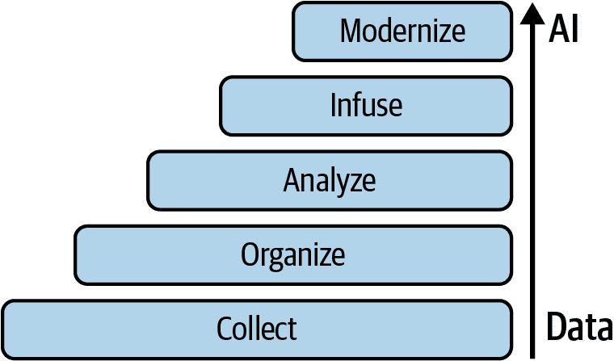
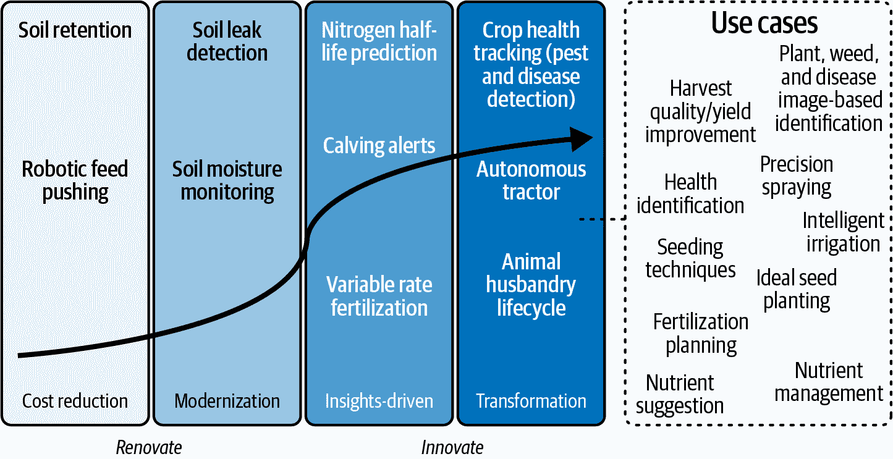

# 第一章\. +AI 到 AI+：生成式 AI 与“网景时刻”

这一章的标题可能让你有些意外——毕竟，网景在 1994 年问世，而我们是在 2025 年写这本书！在这一章中，我们将告诉你我们将生成式 AI（GenAI）等同于“网景时刻”的含义，然后我们将简要地触及一系列广泛的主题，从技术的工作原理到你在规划 GenAI 之旅时需要注意的事项。

我们的出版商告诉我们不要让第一章太长，但我们采取了不同的路线。我们认为，如果我们给你足够的事情去思考，给你足够的价值，并教你我们每天与客户一起工作的那些东西，你就会想要学习更多。这正是我们在这里所做的事情——就像是一部 Netflix 的试播集：它比后续的剧集要长一些，但后续剧集会缩短并缩小焦点到当前的主题。我们还这样做是为了让你不必线性地阅读这本书。例如，我们可能会提到，现在有超过一百万个大型语言模型（LLMs），这使得我们自信地告诉你，无论一个模型多么受欢迎或获得了多少媒体报道，*都不会*统治所有模型。绝对不可能。你可能有很多企业数据想要驱动到你的 AI 中，但又不想分享，这可能会促使你跳到第八章去了解 LLM 的格局以及如何安全地使用你的数据与 AI 模型。或者，也许你已经决定，当我们告诉你，制定公司级技能提升计划的公司将优于那些将技能提升留给一些喷气式头脑和有权访问 AI 的特权少数人的公司时，你会从我们的经验中学习。在这种情况下，你会跳到第六章并了解 Lady Gaga 和伊丽莎白一世（想想 1500 年代）与你的公司技能计划有什么关系。

我们非常确信，你们所有人都能从这一章中学到一些东西——无论是商业洞察、LLMs 和代理的工作原理、历史视角、未来已经到来（如代理 AI）还是其他什么。话虽如此，让我们开始吧。

# 什么是“网景时刻”？

为什么我们把这个时刻称为网景时刻？（啊，网景——互联网的一个古老遗物，对我们今天的年轻人来说就像旋转电话一样熟悉。年轻的读者们……它几乎可以说是世界上第一个网络浏览器。）想想看，当网景在 1994 年首次亮相时发生了什么：（假设你在场）互联网开始变得非常具体和个性化——对每个人来说都是如此。确实，互联网不再只是少数特权者的专属，而是为大多数人所民主化（尽管最初并不是所有人都能利用它）。回顾过去，很明显，一个民主化的互联网永远地改变了我们的世界……它改变了我们存储数据、沟通、购物、约会甚至投票的方式！因此，我们称之为网景时刻（而且这种情况并不常见），因为在这个时刻，世界已经对 AI 的机会有了强烈的认识，这将导致未来出现大量的创新和想法。但就像那些没有利用最初网景时刻的人一样，那些没有成为 AI 浪潮一部分的人将会落后，并站在分裂的错误一边。这种分裂不仅会影响他们与不断发展的社会规范和实践保持联系的能力，而且那些站在错误一边的人将受到限制，无法获得基本服务和机会。这个网景时刻将会像第一个一样展开。那些能够访问 AI 并利用它的人将重塑未来（想想那些利用他们对互联网的访问并将其付诸实践的人对出租车行业做了什么），而那些没有利用它的人将会失去机会，并带来严重的社会或商业后果。（最初网景时刻失败者的名字已被保留，以保护有罪之人。）

现在，关于通用人工智能（GenAI）和 AI 代理的兴起可能导致世界末日的讨论很多。我们的观点是什么？我们认为，一项技术不一定要导致世界末日才能改变世界，至于那些可能导致世界末日的技术……我们将指出，人类有创造一些难以控制、可能毁灭我们的世界但同时也帮助了我们的东西的历史（例如，核技术，我们用它创造了医学、电力和炸弹）。我们在第五章中讨论了这一点。

最后，就像生活中大多数伟大的事物一样，这些惊人的东西并不是突然出现的。它是随着时间的推移，许多小事积累起来，最终形成了一个每个人都注意到的时刻。我们在这里谈论的这个时刻是由经验、学习、失败和突破组成的，这些实际上已经酝酿了几十年（我们说的是超过半个世纪）。但不要误解——GenAI，尤其是以代理的形式，将改变世界。事实上，我们认为它将成为我们做的一切事情的一个如此重要的部分，以至于我们希望我们能回到过去（如果你想知道，AI 做不到这一点）并重新定义*AI*这个缩写，让它代表*环境智能*而不是*人工智能*。为什么？想想你现在坐的地方，读这本书。你周围可能有一些光线：它并不显眼，你不会注意到它，它在背景中，它在你阅读这一页时帮助你——所以它是环境的。这就是我们认为 AI 将要提供的东西——为我们在商业中每天做的许多事情提供环境辅助——这就是为什么我们把这一时刻称为 Netscape 时刻。

*AI 将改变世界。它将如何改变世界取决于我们——我们所有人。*

# AI 和魔法时刻

亚瑟·C·克拉克曾著名地说：“任何足够先进的技术都和魔法无法区分。”也许，当你第一次接触 GenAI 时，它唤起了你的魔法感。（考虑到我们其中一位父亲已经 89 岁，他却用 ChatGPT 来写博客，另一位父亲在股票发布时下跌时给他的孩子发短信询问 DeepSeek，我们假设你已经听说过 GenAI 了。）

突然之间，历史上第一次，任何有互联网连接的人都可以——在自己手中——拥有一种能够说他们语言、理解他们的请求并产生完全新颖输出的技术。今天，AI 甚至可以自己推理问题并提出解决问题的想法——推理模型的进步正在推动*代理 AI*，这是 GenAI 的一个新兴领域。

AI 可以写诗，根据我们的意图仅凭言语就能绘制出超凡脱俗的图像。AI 可以编写和记录代码，它可以用原创的笑话或音乐作品让我们惊讶和高兴。它可以创造——创造的行为常常激发人们的惊奇！

起初，很难反驳那些认为 AI 是魔法的人——组织（和人们）正在迅速奔向这个魔法。

## 但……AI 不是魔法

几个世纪以来，人们认为电是巫师们的领域——那些让听众困惑于电从何而来以及如何产生的魔术师。尽管本杰明·富兰克林在 1752 年证明了电和闪电之间的联系时对这一现象非常清楚，但他很难想象出电的实用用途。讽刺的是，富兰克林最珍视的发明——避雷针——完全是出于避免电的目的，而不是利用电。

今天，我们知道很多人会将通用人工智能（GenAI）视为另一种神奇的技术，并在对其实际工作原理缺乏了解的情况下投入使用。或者，他们会将人工智能视为特殊的存在，将其归为专家们掌握，并期望他们能凭借它让我们眼花缭乱。但这种方法让人工智能披上了一层神秘的面纱，承诺着宏伟的愿景，并往往将人工智能推离普通人的触及范围。相反，我们认为，对人工智能的广泛理解（包括其优点和缺点）才是推动当前网景时刻（Netscape moment）的动力。

但这里的关键是：虽然人工智能很神奇，但它绝对不是魔法。请相信我们。我们与“由人工智能设计”的推杆和球杆打了一轮高尔夫，除了一个人之外，我们其他人还是把球打得老远，并且错过了很多 2 英尺的推杆，以 1 美元的赌注输掉了比赛。如果人工智能是魔法，那么那场比赛的分数会低得多，而且不会有那么多希腊单词，这些单词当然不会翻译成“今天天气真好。我高尔夫打得很好。”

让我们明确一点：人工智能所做的只是连接数据点（并得出结论，不考虑道德后果……但我们会稍后在第五章中讨论）。那么它是如何连接数据点的呢？它是通过使用数学和科学来实现的。最简单的解释方式就是，人工智能只是在尝试通过之前数字给出的线索（我们称之为*向量序列*）猜测一个代表某物（我们称之为*向量*）的数字。是的，没错。如果你使用人工智能进行视觉识别，它可能正在观察一组数字——通常是三组，代表红色、绿色和蓝色（RGB），以及 0 到 255 的阴影强度。如果你有一个 16-MHz 的语音录音，这意味着你每秒有 16,000 个数字代表不同的声音成分（如位移和振幅）。如果你将句子“不要为洒出的牛奶哭泣”输入到人工智能中，它将其读取为类似{16357, 956, 16106, 927, 74125, 14403}的东西，实际上根本不知道牛奶是什么，更不用说为什么你会因为洒了牛奶而哭泣了。事实上，更准确的说法是，一个大型语言模型（LLM），它为许多通用人工智能程序（如 ChatGPT 和 DeepSeek）提供动力，可以被称作一个大型数字猜测模型。或许更好的说法是，你可以称它为大型序列数字模型（这是计算机极客……或者说科学家们称呼它们的名称）。

# 将您的业务从+AI+转变为 AI+

让我们退一步，首先理解这个时刻的*原因*。为什么这个时刻如此重要？对许多人来说，这是 AI 现在能做的事情的惊人之处。当然，我们已经看到了它所做的事情的惊人之处，但我们已经与 AI——以及技术，在这方面——相处了一段时间。惊人的事情经常发生。看看你墙上挂的电视。它比三年前和五年前的那个薄吗？你智能手机上的摄像头数量——是更多还是更少？还有你电脑上的存储量，你拥有的流媒体服务数量，以及你航班登机体验？我们*期望*技术会一直变得更好，而且，如果你看看任何 LLM 或非 AI 技术的连续几代，随着时间的推移，东西会变得越来越惊人。但在这个 Netscape 时刻中，有一件事不容忽视，那就是由提示词带来的超能力。*提示词*是我们给 LLM 的，而*完成*是 LLM 返回的。提示词实际上给了非技术人员超能力。怎么会这样？在过去，你有机会给自己一个生产力提升，*但前提是*你必须懂代码和数据——但今天，我们所有人都可以以与我们的同事相同的方式与 AI 互动。

问题在于，你将如何利用它？我们确信你*想要*利用这个一生一次的商业机会（因为你正在读这本书）。但更大的问题是，*你*能否利用它？你需要一个商业框架，让你能够执行你的愿景（本章的剩余部分将帮助你做到这一点），了解 LLM 的工作原理，一个技能提升计划，以及了解什么可能做得好*以及*什么可能出错。所有这些内容都在这本书中。

想象一下：你坐在办公桌前，要求（提示）AI 为你做一些工作。你要求它打开一个采购订单，对当前季度的销售前景给出情绪分析，为新产品采购材料——或者，如图 1-1 所示，列出你 30000 人公司的所有新职位招聘要求。听起来像是魔法，对吧？但我们已经知道这不是魔法。这是今天可用的技术。这是 GenAI 在工作。

###### 图 1-1\. 提示词：将 AI 交给大众

# 在你做任何事情之前，将你的心智模式从+AI 转变为 AI+

我们所说的*你将如何利用它*是什么意思？今天，大多数组织都在用它们传统的技术战略进行业务。他们说：“嘿，让我们也做一些 AI！”这是*+AI*的世界，这通常意味着将 AI 添加到现有的业务流程中。（剧透警告：这不是你想要的状态。）而且，尽管在过去五年中 AI 的采用率翻了一番，但大多数组织仍然有+AI 的心态。

我们正在从+AI 的世界过渡到*AI+，这意味着*AI 优先*。并且十年后，今天采用 AI+心态的公司——在如何培训员工以及如何将 AI 和技术投入生产方面——将成为今天 Netscape 时刻的赢家，就像互联网的早期采用者一样，他们是原始 Netscape 时刻的赢家。所以我们现在就告诉你：*如果你满足于停留在你的+AI 心态上，你的业务（或你个人）将不会顺利，因为你将缺乏下一代* *AI***带来的敏捷性和能力*。

要进入 AI+，你必须将你的业务工作流程分解成细粒度的离散组件，然后看看 AI 可以在哪里接管（通常是重复性的工作），并在其上构建工作流程中的人类部分。

## AI 梯子：为通用人工智能重新启动

所有这些对你如何在组织中采用通用人工智能和代理意味着什么呢？几年前，我们中的两个人写了一本名为《AI 梯子》（O'Reilly）的书，在书中我们介绍了图 1-2 中看到的框架。这本书侧重于数据作为通过信息架构（IA）通往 AI 的途径。我们认为这个观点准确地反映了当时 AI 是如何进行的——人类收集、组织和标记数据集以进行监督训练。（随着*transformer*的发明，情况发生了变化，这对许多人来说标志着通用人工智能的诞生。）我们觉得 AI 梯子是一个完美的类比，因为它不仅仅关乎技术——它还体现了你选择的合作伙伴以及你试图弥合的公司中的技能差距。

###### 图 1-2\. AI 梯子：一个传统的（预再生）AI 指导策略，组织可以通过将可信数据连接到 AI 来转型其业务

如图 1-2 所示，当时，数据操作构成了 AI 梯子的主要部分。这是理所当然的，因为组织当时（他们今天仍然如此）在努力掌握他们的数据，并希望将一些 AI 添加到他们现有的业务流程中（他们当时有+AI 心态）。

现在，退后一步，思考一下你即将攀登的梯子底座（基础）。如果它稳固，你攀登时会更有信心。甚至更好，如果有人（比如一个值得信赖的技术合作伙伴）在扶着梯子，你肯定会爬得更高、更快，并且更有信心。这一切在通用人工智能和代理出现后都没有消失，这就是我们决定为这个 AI 时刻重新启动 AI 梯子的原因（见图 1-3）。

###### 图 1-3\. 为通用人工智能重新启动的 AI 梯子

从第一级开始，我们重新构想的现代 AI 阶梯是以 AI 为出发点构建的，而不是以目的地为出发点！这意味着什么？嗯，有一个台阶（第一个）仍然非常关注数据。注意在这个重启中，我们合并了原始 AI 阶梯中的几个台阶图 1-2？我们还进行了一些微调，以确保你不错过你最终成功使用 GenAI 的重要组件：你收集、组织、保护和管理数据（等等）的能力是你的*信息架构*——它应该融入 AI 以帮助其发展。IA 对 AI+来说如此重要，以至于我们决定用一种字体大小很大的字体来提出我们的建议，这样你就不会错过它（以防你正在浏览这一章），所以不要觉得我们是在对你大喊大叫（尽管我们可能确实是在这么做）。

什么没有改变？你仍然需要（现在比以前更需要）一个平台，这个平台让你能够收集、组织、整合、转换、应用数据智能和存储数据。事实上，虽然你需要这样一个平台来成为一个+AI 业务，但你将需要它来成为一个 AI+业务。

为什么 IA（信息架构）如此重要？在这本书中，你会逐渐了解到，为了充分利用这个网景时刻，你需要利用你的数据来引导你的模型。为了正确地做到这一点（不仅表现良好，而且值得信赖和可解释），当你真正将 AI 应用于你的业务和最终代表你完成的任务时，你会开始欣赏 IA 如何给你的努力提供涡轮增压。 

新的台阶帮助组织学习如何将 AI 添加到他们的应用程序中。它们指导你如何自动化你的工作流程，并用代理工作流程替换现有工作流程。毕竟，过去的问题在于人们将 AI 放在现有工作流程之上（这在+AI 模型中是有意义的）。但真正的价值——那种让你的老板真正说“太棒了！”的价值——将来自于当你重新构想新的工作流程，让你回过头来问“我们为什么以前这样做？”的时候。这就是 AI+的全部意义！等你到达顶点（这本书旨在帮助你做到这一点），你将让 AI 做它擅长的工作。AI 将做（重复性）工作，我们喜欢这个想法。这个网景时刻将真正改变商业的运作方式。

我们鼓励你花些时间真正地看看这个新的 AI 阶梯，同时在做这件事的时候，思考一下你的核心业务流程以及你是如何做到今天的。你在+AI 到 AI+的谱系中处于什么位置？你甚至有没有掌握你的数据，更不用说准备好将其投入使用？你开始进行一些自动化了吗？再次强调，这项技术可供你在这重新启动的 AI 阶梯上做任何事情，但利用它取决于你。

# 在你开始你的旅程之前，分类预算并确定 AI 将如何帮助

在你甚至开始考虑一个通用人工智能（GenAI）项目（或者任何 IT 项目，实际上）之前，我们认为分享一些由托马斯·爱迪生的一句话最好体现的明智建议是个好主意：“没有执行的愿景只是幻想。”

就像（你会发现）今天的模型可以产生幻觉和虚构一样，你从+AI 业务转型到 AI+业务的计划如果没有经过良好记录的优先事项和强大的执行技能，将毫无是处。在这方面相信我们；我们要么参与其中（并有疤痕来证明这一点），要么看到伟大的想法从炒作曲线的顶峰跳下来并跌入毁灭。（一个很好的例子是在 Hadoop 阶段的数据湖，它们与 Humpty Dumpty 有一个不幸的共同点。）

我们的建议？无论你与谁（供应商或同事）交谈——让他们将他们提出的任何项目根据两个维度进行分类：他们为什么要花钱以及哪种 AI 类别将帮助业务。

当然，我们有很多维度可以与你分享，但我们希望的是你能遵循 KISS 原则（保持简单，傻瓜——尽管其他人可能用不同的词来表示最后一个*S*）。你不需要复杂的公式，但最终，我们（令人震惊的）简单建议几乎可以保证你不会落入许多企业在寻找最新技术趋势的项目资金时容易陷入的“AI 项目”陷阱。你需要关注你项目的商业价值/方面价值，*而不是*关注技术方面。

## 第一个维度：花钱省钱，还是花钱赚钱？AI 将如何帮助你的业务？

花费预算的方式有很多，但当你真正深入思考时，每天的管理者醒来时都会带着受托的预算，并必须决定是花钱省钱还是花钱赚钱。（根据你的行业调整；例如，在医疗保健行业，想想花钱救命作为另一个支出类别。）当你花钱省钱时，你是在*翻新*，而当你花钱赚钱时，你是在*创新*。

如果我们不明确指出某些用例可能会同时进行翻新和创新，那就太不公平了——但请记住要遵循 KISS 原则。如果你的用例要同时进行这两者，为什么不使用与微服务和现代应用程序架构相同的相同方法来分解它？这些较小的阶段组件能让你更快地取得胜利并获得更多关注——一旦你完成了用例的 1 阶段（节省金钱），就进入 2 阶段（赚钱）。例如，我们与一家公司交谈，该公司在价值链中移动 3000 万磅土豆，试图在自动化系统的世界中保持相关性。当他们来找我们时，大约 50%的设施是高科技的，大约 50%是低科技的。他们面临着一个挑战，因为马铃薯疣病害严重破坏了他们部分产量的出口能力。马铃薯疣对人类健康或食品安全没有威胁，但它们对马铃薯种植者有经济影响，因为它们使产品在评级过程中无法上市（甚至在某些国家被禁止）。投资于技术以识别和更好地清洗“疣状”马铃薯（仅用这种方式描述就使它们听起来比实际情况要糟糕得多）可以使这家公司更好地加工其马铃薯。这一举措使其在原计划扩大（稀缺）劳动力进行更多手动检查和清洗上节省了大量成本。使用从节省金钱（劳动力）中节省下来的预算，创造了额外的预算来部署这些美元（通过翻新来资助创新）以重新建立某些马铃薯的出口关系（通过 AI 辅助检查和清洗过程的真实性）以及寻找其他马铃薯的次级市场。这也减少了由于出口控制（在一个粮食短缺的世界中）而产生的食物浪费量。

退后一步，思考一下贵公司目前正在进行的各项倡议。无论是你个人负责的项目，还是你试图推销或获得赞助的项目，你都可以将它们简化为这个简单的框架。

## 第二个维度：分类 AI 如何帮助你的业务

一旦你确定了你正在花费的预算类型——翻新还是创新，下一步就是将你的项目归类到以下三种 AI 可以帮助你的业务的方式之一：自动化、优化或预测。

这个框架并不完美，但它强大且相当简单。让我们通过一些例子来试试看：

自动化：花钱以节省金钱

“我想使用 AI 来总结内部帮助台票务系统，并根据 AI 对票务主题和严重性的理解，自动将其路由到适当的部门进行处理。”通过具有代理能力的 AI，它可以遍历所有这些票务，评估趋势问题以及处理这些票务的人的表现，然后自动生成报告和行动计划。

优化：花钱省钱

“我想使用 AI 来发送高度个性化的（不仅仅是文本和语调，还包括交付方式、交付时间等）接触信息，以支持我们的销售活动。”通过具有代理能力的 AI 研究最佳方式组合和时间组合来接触像老年人、在职专业人士、教师，甚至是 Swifties 这样的群体来增强这一点。

预测：花钱赚钱

“我想*现在预测*（而不是预测）哪些产品可能会售罄，哪些产品可能会表现不佳（使用销售点系统数据），并且我想在销售季节早期对表现不佳的产品进行折扣，这样我就不需要在销售周期结束时，当我还有大量库存时进行大幅降价。”通过使用具有高地理粒度的天气预测来研究可能影响这一特定类库存的趋势线，用具有代理能力的 AI 来增强这一点。

## 使用敏锐度曲线来可视化 AI 如何帮助你的业务

我们认为可视化你所做的维度决策是一个很好的主意，因为它将使你更容易看到公司范围内 AI 投资的总体视图，并且可以更好地进行沟通。你可以提出自己的版本和标签，但图 1-4 展示了我们喜欢用于 AI 和数据项目的标签。

###### 注意

我们希望你能从你的**敏锐度**的角度来考虑数据，这意味着你将数据应用于业务，以帮助你的企业实现数据驱动的技能。为什么？因为即使你拥有大量数据（提示：你确实有），除非你知道如何利用它，否则这些数据对你来说几乎没有用处。这就是敏锐度的部分，而获得敏锐度正是这本书旨在帮助你做到的。提前警告：数据敏锐度的领域是不断变化的。我们喜欢告诉人们，将他们的数据和数据敏锐度比作健身房会员卡，有两个原因。首先，如果你不使用它，你就得不到任何东西。其次，如果你停止使用它，你将开始失去你辛苦努力获得的任何成果。

###### 图 1-4\. 一个 AI 和数据敏锐度曲线

图 1-4 展示了一个 *数据敏锐度* 曲线示例，这是任何战略 AI 项目规划会议中的一项极好的资产。我们为一位农业客户构建了这个特定的数据敏锐度曲线，当我们命运般地聚集在一起共同完成同一个项目，并且相处得很好时。如果我们没有，你可能就不会读到这本书。（如果我们没有，你可能就不会读到这本书。）y 轴很简单：它代表价值。

正如你在图 1-4 中可以看到的，我们在 x 轴上应用了多个维度。首先，我们将预算景观划分为四个象限（可以是任何你想要的数字，你的命名可能也不同），这为我们客户提供了一个良好的视觉工具（以及敏捷性），以便将我们最终会讨论的数十个基于 AI 的应用案例贴在这块白板上。同时，我们与客户共同规划了 AI 战略，并始终专注于商业战略。

在每个象限的底部，我们标注了投资将做什么：降低成本、使业务现代化、使业务在决策方面更具洞察力，或者投资将如何改变业务。最后，在最底部，你可以看到在翻新和创新之间出现了一种自然的边界（它应该是一个友好的边界）。这一点很重要，因为，再次强调，你应该为任何翻新项目制定计划，以从超额预算中获取下游创新收益。

当一切都说完后，我们得到了类似图 1-5 的东西。它给了项目团队极大的清晰度，让他们知道他们将做什么和不会做什么，并能够轻松地将任何项目利益与利益相关者沟通。

###### 图 1-5\. 农业客户用例 AI 和数据洞察曲线的结果

在继续之前，我们想在你思考你的业务项目如何映射到图 1-5 时，给你一些其他的想法。首先，如果你想从“最安全”的地方开始，那就是自动化和花钱来省钱（成本降低）。但我们警告你：如果你就留在这里，长期回报不会很大。我们不是在说，聪明的成本削减是一个糟糕的策略，它可以释放投资预算并帮助推动收入，但它不能成为你 AI 对话的终点，否则你会错过这个模型的最右侧。尽管许多人被迫像只讨论成本节约一样进行预算，我们还是要这么说：在这本书的任何地方，你都不会听到我们告诉你用更少的资源做更多的事情——这是 2000 年代初的事情。

以治理为例。大多数组织匆忙实施最低工作量合规性，以避免罚款（成本节约）。然而，这种方法错过了从合规投资中创造监管红利的机会（例如，为了更好地向审计员解释你的 LLM 的输出而进行的数据智能），以加速你的 AI 战略。我们看到了太多的数据治理项目，最终未能实现对企业真实价值的充分利用，在通用人工智能和代理的世界里，这将代价高昂（关于这一点，本书后面将详细介绍）。

其次，注意图 1-4 中的曲线。当你在这个框架中向右移动时，为你的企业创造的价值会增加。这部分的理由是因为你正在做“不同”的事情（你是 AI+而不是+AI），也因为你已经掌握了将 AI 应用于成本节约，并且你现在正在使流程现代化。随着世界走出隔离（COVID）经济，有些公司弯曲了图 1-4 的价值曲线以利于自己，而有些公司仍然停留在较低的总体收益一边，并且至今仍如此。例如，一家美国手工艺品店在关闭其实体店面的几天内就实施了路边取货服务，而至今，一家非常知名的大型零售商仍在努力明确地将其实体店的库存与其在线订购系统连接起来。确实，大流行迫使公司把 5 到 10 年的现代化压缩到 1 年内，有些做得很好，有些则没有。

看一下图 1-5 中展示的一些创新用例。这些用例需要围绕商业模式和工作流程进行一定程度的重新思考，以便这个客户能够充分拥抱创新投资带来的机会。但请提前警告，如果你的终点线定义是将所有转型创新置于现有的商业模式和工作流程之上，使用+AI 模型，那么你将错失全部潜在的好处。你应该思考和规划这些模型和工作流程如何（或应该）改变，因为你正在使用通用人工智能和代理来成为 AI+。我们无法强调这一点的重要性。当你构建自己的敏锐度曲线时，请考虑你的新获得超级力量，重新构想你的业务流程——因为我们保证在 AI+模式下运营的企业将优于在+AI 模式下运营的企业。

最后，你可以在图 1-5 中的所有价值象限中使用人工智能，因此当价值曲线变陡（产生更多）时，你可以将这项技术应用到任何你想的地方。例如，你可以使用代理式人工智能来降低成本，但你也可以用它来进行转型。回到我们之前的代理示例，想象一下创建一个由代理组成的团队，他们检查你的票务系统，共同执行以下步骤，并带回一份可以帮助你提高 NPS 的报告：

1.  检查一系列来自支持票务的数据。

1.  根据该数据生成改进建议。

1.  将这些数据组织成表格，分组要有意义。

1.  将这些数据制成图表，以便你可以可视化任何趋势。

1.  通过对这个分析进行全面的最终报告来结束，报告中包含有关人工支持专家处理的票务数量、平均解决时间、整体客户满意度、问题区域等信息。

## 从哪里开始？这里是我们有用的建议

在哪里开始一个生成式人工智能（GenAI）项目是每个企业很快将不得不回答的问题。虽然我们已经给你提供了一些关于如何确保你公司做出的任何投资都将与业务价值结果挂钩的宝贵建议，但这个具体问题仍然需要解答。最终，你的商业环境、行业、高管优先事项和战略目标将引导你从现在分类的选项中选择一个用例。然而，我们确实有一些建议与那些刚开始与我们合作的客户产生了共鸣。如果你对生成式人工智能（GenAI）、代理或如何安全部署生成式人工智能（GenAI）和代理感到担忧，请记住我们之前说过的话，选择低风险、内部自动化以及花钱省钱的用例。你可能想在添加代理之前先从生成式人工智能（GenAI）开始。无论如何，你将通过这种方法获得大量关于生成式人工智能（GenAI）所有方面的经验，包括代理。

我们将借助美国棒球类比来解释这一点。（为了吸引全球观众，我们原本打算使用板球作为例子。毕竟，板球的六分球就像棒球中的全垒打……但我们很难理解任何可以持续五天且你仍然不知道谁赢的比赛。话虽如此，我们同意任何有“愚蠢中场”位置的游戏肯定很酷，也是我们愿意玩的游戏。）在棒球中，一些球队构建阵容以击出全垒打（“长球”）。毫无疑问，全垒打非常激动人心，也是体育新闻快照的主要内容，但没有证据表明专注于击出更多全垒打会导致更多胜利。但如果你通过击出一垒安打让跑者上垒，你总是有得分的潜力。最终，全垒打很有趣且引人注目，但没有投球、良好的防守和“磨出”得分的能力，全垒打就是“空热量”。当谈到人工智能时，如果你刚开始，这是你的第一个项目，你在一个如果出错风险很高的行业中——再次，相信我们，选择一个内部用例并将其自动化。先打好第一垒。

例如，考虑使用人工智能帮助员工预订休假，而不是让他们登录一个过度设计的、笨拙的人力资源（HR）系统。这可以简单到在即时通讯平台前端使用自然语言提示界面，让员工输入“我想预订 3 月 24 日至 29 日的半天休假。”或者它可以是一件令人印象深刻的事情，比如摄入学校假期、公司浮动日和国家假日，让 AI 生成一个最大化与家人共度时间的休假日程，同时使用最少的休假天数。现在让你的想象力自由驰骋，并用代理将这个用例提升到另一个层次！在这个光谱的任何地方，如果出了问题，不仅容易解决——*它很安静*（也就是说，如果出了问题，全世界都看不到或嘲笑，就像新闻中许多由大型语言模型驱动的虚构聊天机器人头条所发生的那样）。如果你的 AI 被允许公开回应关于你自己的服务不好的一天（就像一个全球航运和物流机器人所做的那样，它告诉全世界它提供了糟糕的客户服务——它没有撒谎，但仍然很尴尬）。

# 成为灵活的商业：先左移，然后才能右移！

在软件开发和制造业中有一个流行的概念，称为“**左移**”。其前提是，如果你在周期早期捕捉到缺陷，它们将比在下游捕捉到（当它们在客户手中时）的成本低得多。考虑一下：今天的汽车运行着大约 1 亿行代码——为了使这个数字更有意义，波音 787 梦幻客机只运行着 1400 万行代码。（我们知道，这也让我们感到震惊。）显然，物理汽车的缺陷需要召回，但软件代码的缺陷成本非常高——尤其是在汽车行业。汽车制造商必须修复这些错误（修补），这通常需要将客户带到维修店，为他们可能根本不知道的汽车问题提供服务。当然，空中更新（OTA）修补是一个选择，但现在你必须处理通过汽车的连接性扩大了攻击面的情况，这可能导致钓鱼邮件告诉客户下载一个“修复”程序，而这个程序实际上是恶意软件等等。总之：这非常昂贵。

GenAI 和代理为所有公司提供了一个重新定义“**左移**”含义的机会，并从工作的压缩（或第一次就做对，或更快完成，或自动化）以及压缩这些成本中受益。简而言之，它可以使你超级高效——正如你将在第三章中了解到的那样，它将成为未来增长的关键加速器，并有可能唤醒你公司未开发的潜力。但其他左移的时刻看起来是什么样子呢？它们都是关于花钱来省钱！在我们的汽车例子中，这很简单——在它们被部署到你的汽车内部之前修复这些错误。但我们已经决定扩大左移的视野，所以请继续阅读，看看我们是什么意思。

## 每天我们都会走过那些可以用技术解决或改善的问题

这非常正确。每天，我们都会走过那些可以用技术解决或改善的问题。我们在这里重复了这个小节的标题，因为它是一个我们希望你们开始思考的咒语。这就是为什么阅读这本书如此重要：我们不仅给你讲述了 AI 的故事，提醒你要注意的事项，以及 GenAI 和代理能做什么，以及这一切是如何运作的——我们还在给你一本思考者的操作手册，教你如何将 AI 应用于你的业务，这远远超出了技术范畴。我们正在赋予你实现可能性的艺术，并理解 GenAI（得益于提示）如何使你公司中每个人都可以与 AI 建立的关系民主化——现在他们都可以拥有生产力超级能力。简而言之，他们不再需要走过那些他们可以用技术改善或解决的问题。

本编写团队在商业和技术领域拥有非常丰富的经验。（这相当于说：“我们中的一些人年纪大了，已经从事这个行业很长时间了。”）我们本可以写一本关于解决问题可能性的艺术全书，虽然在这本书中没有足够的空间来详述，但我们仍会提供几个令人眼前一亮的医疗保健例子，我们认为这些例子将改变你对“左移”的看法，并使你以不同的方式审视你业务的各个方面：AI+的方式。当你想到“左移”时，要想到减少开支、减少错误、减少伤害和增加安全、减少疾病和挽救生命等等。以下是一些“左移”的绝佳例子。

### 个人移动能力：一项基本人权

在其《残疾人权利公约》（CRPD）的第 20 条中，联合国经济社会事务部（UN-DESA）宣布个人移动能力是一项基本人权。如今，在美国，大约有 330 万轮椅使用者，其中 45%的人年龄超过 65 岁。更重要的是，由于美国人口老龄化，这一部分人群将迎来巨大的增长（约 40%），每年将新增约 200 万名轮椅使用者！

有许多研究支持缺乏移动能力对个人生活质量产生的负面影响以及对无法独立行动的人产生的有害影响。这些包括自我价值感和幸福感的降低、抑郁情绪的增加以及许多其他不良影响。

另一方面，对于那些需要全天候轮椅辅助的人，机械轮椅可以极大地提高他们的生活质量。尽管它们很神奇，但机械轮椅确实存在一些问题，但我们不必像以前那样对它们视而不见。首先，机械轮椅重约 350 磅，这使得它们既是移动辅助工具，也是破坏性的球体。事实上，使用这些辅助设备的 20%的人每年至少会遭遇一次碰撞，其中 11%的人因此被送往医院。这种情况每年都在发生，机械轮椅造成的损害可以用令人震惊的数百万美元来衡量。这包括对住宅、养老设施、机构、狭窄通道商店、操作者本人以及更多地方的损害。

这里的“左移”时刻是什么？我们每天开车都使用防碰撞系统（CAS）和传感器，即使是低价车也有像倒车雷达这样的安全功能。为什么机动轮椅没有呢？一个由人工智能驱动的系统可以通过声音、灯光颜色变化和振动为车主提供反馈，可以将伤害、事故、保险赔偿、损害和自尊心的丧失左移。左移正是像 Braze Mobility 这样的公司通过在机动轮椅上配备类似汽车的安全功能所做的事情，从而减少医院就诊、碰撞、身体和周围物理环境的损害以及保险索赔——同时提高轮椅车主的信心。对于大多数人来说，我们每天走过的地方甚至没有意识到有问题，这已经是一次很大的左移了！

### 糖尿病足溃疡和一次护理经历

今天，美国每年在糖尿病护理上花费大约 3270 亿美元——其中大约三分之一的支出用于糖尿病足溃疡的护理和治疗！

一名糖尿病患者可能因为最简单的事情而患上足溃疡：脚趾被绊倒并打破皮肤，踩到东西，或者因为走路过多而长水泡。这些都是简单、日常事故的结果，对于我们大多数人来说，它们几乎总是自行愈合，但对于糖尿病患者来说——情况则完全不同。

这些溃疡是糖尿病患者自身往往没有注意到的糖尿病并发症。为什么？糖尿病患者可能有额外的并发症，从神经病变（如脚部麻木，他们无法感觉到有什么“不对劲”）到视网膜病变（阻碍视力，使得检查自己的脚变得困难）。

###### 注意

由于糖尿病在哪些地区更为普遍，糖尿病足溃疡与种族和社会经济地位有关。例如，如果你是一名黑人糖尿病患者，你患这种溃疡的可能性是正常人的三倍，如果你是一名贫困的糖尿病患者，你患这种溃疡的可能性是正常人的 93%。这些不是医疗状况，而是社会状况，这超出了本书的范围。

那么，如果你得了这种溃疡会怎样呢？你可以期待你的脚被截肢的可能性增加三十倍，以及你被住院的可能性增加三倍——为了*任何事情*！实际上，糖尿病足溃疡是美国脚部截肢的首要原因，每三分钟就发生一次。

这里的左移时刻是什么？早期检测！患有脚部溃疡的糖尿病患者每年需要“系统”大约 58,000 美元的治疗费用，而没有脚部溃疡的糖尿病患者每年大约需要 17,000 美元的治疗费用。我们如何早期检测脚部溃疡？我们可以通过体温测量来实现，这是温度的测量，而温度基本上是粒子所具有的动能的度量。事实证明，炎症是脚部溃疡的先兆，而炎症会导致温度升高（患者可能因为神经病变而感觉不到）。找到脚部“热点”以建立基线是潜在左移糖尿病患者时刻的一部分。我们能否创造可以追踪热特征并生成警报的连接浴室垫，这些垫子能够理解正常和强烈潜在（或预测）正在发展的脚部溃疡的历史数据？

正如我们所说，每天我们都会走过我们认为可以用技术解决（或改善）的问题。如果我们能收回大约 70%的方差成本（治疗有脚部溃疡的糖尿病患者与治疗没有脚部溃疡的糖尿病患者之间的年度成本差异），并将这些翻新资金作为创新资金（用于治疗和管理的类似事物）使用，那么社会能为糖尿病患者做些什么呢？

### 以及更多

前两个例子并不能充分体现这种左移思维对你业务的影响。但希望你现在可以轻松地认识到，理解技术让你能够以全新的方式看待你的业务。

我们可以讨论的左移例子还有很多：

+   美国退伍军人事务部（VA）有六个月的索赔处理积压。自动化此过程中涉及的手动任务将日常事务左移，并更快地将好处带给那些服务过的人。

+   瑞典政府正在构建自己的公共服务 GenAI 模型，以利用众多左移机会，更好地服务其公民。想象一下，一个能够理解不同瑞典省份的细微差别和文化参考的政府聊天界面，并能理解那些俚语的互动。

+   保险公司处理复杂或大额索赔可能需要数月时间。将所有重复和政策检查工作左移，有助于更快地解决这些索赔，并减少摩擦，从而更及时地将保险金送到需要的地方，并建立更好的客户关系。

+   制药公司安进花费数月时间向全球的医生发送调查问卷，寻找临床试验的相关临床和人口统计学参与者。据估计，安进 80%的研究在长达 18 个月的过程中未能达到招募目标。AI 帮助安进通过根据他们在招募临床试验患者方面的表现来识别诊所和医生，从而左移招募时间。医生在很大程度上影响着诊所参与的态度，有些医生会选择不良候选人，这些人会退出。我们将这种用例称为*理想客户档案*（ICP），这个概念可以用于所有行业来研究诸如某人可能会在比萨饼上点哪些配料，他们吃的时候会看什么，以及谁会经历随之而来的胃灼热等问题。

    另一家制药公司拜耳，将阿斯德西安（一种旨在降低成人长期中风风险的药物）的后期临床试验参与者数量左移。拜耳指出，如果没有 AI，它将花费数百万美元，并且需要多九个月的时间来招募参与者并开始试验。这些都是左移（花钱省钱）然后右移（加快试验，意味着花钱不仅是为了赚钱，也是为了拯救生命或提高生活质量）的绝佳例子。

+   通过一家公司的采购系统获得较大物品（如办公椅）的采购订单可能需要很长时间，这很可能充满了脱节的流程、文件、海外审批者和近岸工作流程监管者。这意味着即使是简单的物品也可能需要数月才能交付——所以让我们坐得更符合人体工程学，并将这个流程左移！

+   北美正站在其第四个压倒性的医疗问题边缘：慢性孤独。是的，这是一个医疗问题，其症状包括抑郁、酗酒、成瘾、无家可归、愤怒和反复无常的行为等。最脆弱的是老年人——但想象一下，只要负责任地提供偶尔的填补空缺的陪伴，AI 如何能够通过为孤独的人提供这种陪伴来左移这个问题的成本。

+   一些公司的人力资源企业资源规划（ERP）系统实际上需要点击 20 分钟才能将员工调转到另一个部门！毫不奇怪，它们的失败率很高。在 IBM，我们不再对此问题视而不见。我们的人力资源总监（CHRO）Nickel LaMoreaux 亲自提升了我们在本书中讨论的技能，并推动了一项计划来解决这个问题。如今，员工调动失败率几乎为零，并且已经为业务节省了超过 4,000 小时的“思考时间”。如果我们不再次提醒你们这一点，那就太疏忽了：这是一个很好的例子，说明了开始你的现代人工智能之旅的最佳方式：通过在内部自动化用例上花钱来节省开支。更重要的是，她的团队在这个推广过程中获得了技能和信心，这导致了数十项其他创新，IBM 业务在节省时间和金钱方面取得了惊人的成果。（总的来说，在所有职能中，自成立以来，这类举措已为 IBM 节省了 30 亿美元。）

正如你所见，任务的大小无关紧要，无论是将员工调转到另一个部门这么小，还是通过辅助运动改变某人的生活质量这么大。通过向左转移，你可以获得很多好处！

重要的是，有很多工作需要完成。哪种技术可以帮助你解决所有这些工作？如果你环顾四周，我们认为你最终会和我们一样，选择生成式人工智能（GenAI）和代理。

### 现在，转向右侧

现在你已经将部分业务转向左侧，并节省了时间和金钱，甚至挽救了生命，你拥有了信心和经验，可以通过花钱赚钱来向右侧转移（即进行变革性工作，图 1-4）。向右侧转移是创新新商业模式，但也可以是当公司或行业的生死攸关时一个关键的举措。

我们已经看到了当你**不**及时调整方向会发生什么。看看柯达，它在摄影领域进行了开创性的工作。虽然柯达是一个成功的故事（它曾经是世界上最有成功的企业之一），但它也是一个令人瞩目的失败案例。发生了什么？柯达认为它是在胶片业务中，在试图保护它时变得短视；毕竟，是柯达在 1975 年发明了数码相机。但正如我们今天所知，柯达实际上是在记忆制作业务中，当记忆的方式向正确的方向转变时，记忆制作业务也变成了数字化。（有时，向正确的方向转变是你的策略，有时，技术变化了，你不得不随之向正确的方向转变。）这种向正确的方向转变改变了一个整个行业，并创造了新的商业模式。图片不仅可以更容易地分享，而且你可以拍摄更多的图片，而无需支付打印糟糕照片的费用。你可以选择你想要保留的图片，而不是等待三天，结果发现你的兄弟道格在奶奶头后用兔子手指弄糟了家庭照片，而坐在右边的小叔子吉米低飞。你还可以在更小的空间里存储更多的图片，因为你的笔记本电脑可以存储那些在打印形式下会占用大约 85 英尺货架空间的图片文件。2 公司利用技术将摄影推向正确的方向。业余爱好者通过软件编辑工具、无缝照片打印、组织和管理照片的方法以及照片中标记人脸的方式变成了专业人士……你知道柯达的故事是如何发展的。

现在，让我们再思考另一家公司：Garmin，它最初因汽车便携式 GPS 导航系统而闻名。尽管这种用途并没有完全消失（仍有部分用户因为其可靠性和准确性而重视这些设备），Garmin 意识到导航的方式已经发生了变化。但 Garmin 还意识到一个更大的事实——他们并不在汽车导航业务中；他们是在追踪和制图业务中。Garmin 及时调整方向，为航海和徒步等活动带来了新的服务。他们不仅通过地图改变了业余高尔夫球的方式，还通过各种游戏内功能和球场统计数据。围绕区域制图和推荐出现了社区——分享跑步或徒步的建议，通过众包校正提高体验和准确性，等等。现在，让我们思考一下，GenAI 和代理如何将这一制图业务进一步推向正确的方向。

有时候，向右转移不仅仅是为了重新利用你已有的东西来为技术发明一个新底盘。它还涉及到将全新的商业模式带入市场（这再次是图 1-4 的远右部分）。例如，Airbnb 是由一群为了支付租金而挣扎的年轻人创立的。他们注意到在一场会议期间，旧金山的所有酒店都客满了，于是灵光一闪。他们改变了住宿行业！

考虑一下你与保险公司的关系——它有点是敌对性的，不是吗？你与你的代理人交谈以获得承保的保单，你没有索赔。你明年再与你的代理人交谈，你的保费就上涨了。或者，你遇到某种事故，提出索赔，然后你的保费就上涨了。无论如何，这绝对感觉不到任何形式的伙伴关系。

现在，让我们思考一下工地上的承保风险。通常，雇主希望遵守工作安全规定，因为它不希望员工受伤。同样可以说，承担风险的保险公司当然也不希望支付受伤人员的护理费用，也不希望人们首先受伤。

GenAI 和代理可以共同合作，通过在建筑工地正确地转移风险承保方式，从而彻底改变保险关系。考虑使用 AI 来监控工地上的适当着装（识别工人所需的代码—安全头盔、夹克、手套、接近带电设备等）。在这个用例中，不同安全区域安装了摄像头，使用 AI 模型来标记工人对区域要求的遵守情况。你可以在与焊接和火灾相关的区域放置一个摄像头，同时你可以在起重机操作员提升钢梁进行储存的区域放置另一个摄像头。AI 视觉可以跟踪合规和不合规事件，代理工作流程可以将视频拼接在一起，用红色框标记合规问题，并生成总结报告（每小时、每天、每周……你想叫什么都可以）。继续这个例子，假设发生了一起事故，风险可以在第二天立即以更高的保险费率对单个区域（而不是整个工地）进行承保。在这种情况下，工地运营商将有机会通过遵守 AI 生成报告中的建议来降低风险溢价，这些报告使用 AI 增强的边缘实时处理来更新承保人。有无数种方式让这种场景发挥作用（按区域合规、按日定价、按月定价等），但这确实是从旧商业模式和新关系模式向新商业模式和新的关系模式的转变。

# 利用基础模型和 GenAI 为您的业务提供建议

我们讨论了将这一部分放在哪里——在这里第一章或者在这本书的结尾。最终，我们决定提前给你这些提示，以便在你选择不阅读这本书的其余部分时，你仍然能获得我们的关键建议。而且谁知道呢？这甚至可能诱使你花时间通读整本书，以便将所有我们的想法付诸实践。无论如何，如果你将你的商业战略与这些建议相匹配，你将处于一个利用 GenAI 和代理做大事的理想位置。

## 第 1 条建议：以紧迫感行动

这是一个技术变革的时刻，所以大胆抓住这个时刻！你需要开始制定技能计划(第六章)，了解这项技术，并开始行动。这正是这本书的目的：为你提供工具，帮助你以紧迫的方式行动，但以明智的方式行动，这样你就不会以恐慌的方式行动。这有点像练习消防演习而不是真的发生火灾：采取快速、排练过的步骤，不要恐慌，不要乱跑。

## 第 2 条建议：成为 AI 价值创造者，而不仅仅是偶尔的 AI 用户

企业应将其作为 AI 战略的一部分，制定计划以使用公司数据微调 AI 模型。这些模型将处于企业的控制之下——他们将拥有这些模型，因为它们将成为他们公司（可以说是）最有价值的资产。事实上，巴里·梅拉康（国际注册会计师协会最近退休的首席执行官，这是最有影响力的专业会计师组织，拥有超过 65 万名会员）告诉我们，他相信有一天模型将被记录在财务报表中作为资产。我们在第二章中深入探讨了这一主题，你将了解成为 AI 价值创造者与成为 AI 用户的区别。剧透一下：不要外包你的数据和控制权，也不要将你的 AI 战略仅仅缩减为一个不透明的 API 调用。如果你不知道别人的模型是如何训练和管理的，以及你的数据将被如何使用，你就不想调用别人的模型。

## 第 3 条建议：不要让一个模型统治一切，所以对社区下注

你希望将前沿技术与前沿社区结合在一起。开源人工智能社区（不要与 Open AI 混淆）正在不断为使用生成式 AI 和代理工作流程的公司创造价值提供动力。基本上，我们是在告诉你，不要仅仅对社区下注——要对社区下一个大大的赌注！把你的 AI 赌注押在开源 AI 社区上。（提示：了解一家公司是否开放，远远超出了他们的名字。）就像你们中许多人可能只听说过或使用过单个 LLM（比如 ChatGPT）一样，我们愿意以我们的声誉担保：*单个 AI 模型不会统治一切，你的业务将从开源社区的创新和模型中受益。* 你今天亲眼见证了这一点——像 Granite、Llama 和 DeepSeek 这样高度有效的开源模型正在不断掀起波澜。这就是为什么我们告诉公司，当他们在投资其 AI 平台组件时，要确保这些平台组件具有灵活性，这样他们就可以为他们的业务同时使用开源和专有模型。

这正是为什么像 Meta 和 IBM 这样的公司宣布与 Hugging Face 建立了紧密的合作伙伴关系。Hugging Face 是人工智能世界的社交蝴蝶。它的一切都关于创建和分享一个 AI 模型的社区。我们喜欢将其视为前沿人工智能研究与想要用它来创造酷炫东西的开发者之间的红娘。Hugging Face 有一个可爱的标志，让人感到温馨舒适（好吧，至少是温暖），它背后是一个庞大的模型、教育和基准库，并且它试图让 AI 对每个人来说都触手可及。

Hugging Face 的故事确实令人好奇，而这种好奇心远远超出了一个漂亮的名字和可爱的标志。Hugging Face 在对话式人工智能领域工作了三年，就像许多初创公司一样，其底层平台和技术最终证明比最终产品更有用。

###### 注意

有趣的事实：无处不在的 Slack 通信平台的 DNA 源自一家名为 Tiny Speck 的失败游戏公司及其游戏 Glitch，这款游戏让你可以生活在古代巨人的想象中。Tiny Speck 的创始人 Stewart Butterfield 曾著名地说：“如果我们继续这样下去，我们将在几个月内耗尽我们的资金，而一无所有。但如果我们现在停下来，我们可以用那笔钱来建造别的东西。”于是，他拿出了 Tiny Speck 构建的通信平台，其余的就是历史了。就像 Hugging Face 一样，Slack 也是出于不同的使命而诞生的，现在看看它们对我们世界的影响吧。

当 Hugging Face 开始在 GitHub 上发布其部分工作时，它开始看到开源贡献者加入其中，同时也开始看到从业者分享他们的模型。

现在，你可能正在想，“每个人都谈论开源社区构建的技术，但有许多没有前途的开源软件产品，或者那些重叠的产品。”你说得对！事实上，我们和一些客户交谈过，他们提到了正在调查的所谓开源技术，结果发现只有一个供应商主导并构建了该技术的 98%，这违背了开源的宗旨。在我们看来，开源的一个关键组成部分是社区的合作和共同构建，而不仅仅是代码可以被查看。

你可能好奇在 Hugging Face AI 社区中集中了多少能量，以及你可以从这个社区期望多少进步和创造力。答案是简单的：能量是惊人的。有一个关于 Clément Delangue（Hugging Face 的创始人之一，也是他们的首席执行官）在商务旅行中推文邀请在旧金山举行一个临时的 GenAI 线下聚会，并预期会有大约 20 人参加的小故事。活动策划者不得不三次更改地点，最终有 5,000 人参加！人们开始称之为“人工智能的伍德斯托克”——所以正如我们所说的，能量是惊人的。

现在，有成千上万（如果不是更多）的公司在使用 Hugging Face 平台，包括像 Google、IBM、Meta、MIT 和 Bloomberg 这样的大型公司和机构，以及较小的公司。他们共同在平台上分享了开放模型、数据集和开放演示。当我们审查这本书的最终稿时，Hugging Face 几乎有 150 万个模型，所以我们停止计数并宣布“一个模型将不会统治一切”（这恰好是第七章标题的一部分）。为了使这一切更加清晰，开源的 Llama 模型（由 Meta 开发）自推出以来已有超过 6.5 亿次下载——所以当然，开源人工智能周围有能量和兴趣。

## 小贴士 4：无处不在，高效运行

我们的世界已经从“物联网”（IoT），即所有事物都可以相互交谈，因为它们是连接的，转变为“万物互联”，即所有事物都在相互交谈（我们中的一人前几天无法吸尘，因为他们的 WiFi 信号中断了）。很快，它将变成“万物智能”（边缘人工智能）。因此，你需要开始考虑通过构建在开放混合技术之上，以及能够在需要运行模型的地方运行模型的能力（可能在单个 GPU 的单一封装中，或者在没有 GPU 的设备上，或者在测量脚部温度的浴室垫上，也就是说，较小的模型将会很重要）来优化你的 AI 项目，以实现性能、延迟和成本的最优化。

## 小贴士 5：承担责任，因为信任是运营的最终许可

我们把最重要的建议留到了最后。我们无法强调这一点：*我们刚刚给出的每一个建议，除非您负责任和透明地构建 AI，并将治理置于 AI 生命周期的核心，否则都是无用的*。

企业应记住持续治理他们的数据（这意味着他们应该有一个 IA），并与值得信赖的合作伙伴共同创造。*信任将是您运营的最终许可证*。当涉及到使用数据时，很容易找到数百个关于好演员和坏演员、挺身而出的和袖手旁观的例子。这就是为什么您需要确保您完全信任您选择在 AI 之旅中合作的那些公司。可以这样想：您在桶里失去信任，在点滴中赢得信任。我们认为您应该寻找那些桶满的合作伙伴——他们的行为、他们的产品以及他们构建 LLMs 的方式都始于信任和透明度。始终努力保持*您的*信任桶满——记住，这将需要将公平性、可解释性和道德（以及其他事物）作为首要考虑，而不是事后考虑。这就是火灾演习的稳步步伐与面对真实火灾时的恐慌之间的区别。

# 那么，让我们专注于 AI 部分

在本章中，我们讨论了从+AI 到 AI+的转变，我们相信一年后，任何阅读这本书的人都会在 GenAI 方面有所作为。问题是您（以及您服务的公司）是否会比竞争对手行动更快。您是否会攀登我们重新启动的 AI 梯子，并利用 IA 和 AI 真正成为一家 AI+企业？

我们希望本章中给出的部分示例能够激发您思考可能性的问题（在第四章中还将有更多用例）。我们也希望您能抓住机会亲自尝试一些这项技术，继续被其改变业务的潜力所启发，并停止每天对那些可以用技术改善或解决的问题视而不见。

^(1) Rishi Bommasani 等人，“关于基础模型的机会与风险”，斯坦福大学基础模型研究中心，2021 年，[*https://crfm.stanford.edu/report.html*](https://crfm.stanford.edu/report.html)。

^(2) 假设您可以将 102,400 张 5MB 的照片存入 512GB 的存储设备空间，并且可以将 200 张 4×6 英寸的照片放入一个典型的 2 英寸厚的相册。您需要 512 个 2 英寸的相册来存储所有这些照片——或者大约 85 英尺的货架空间。
