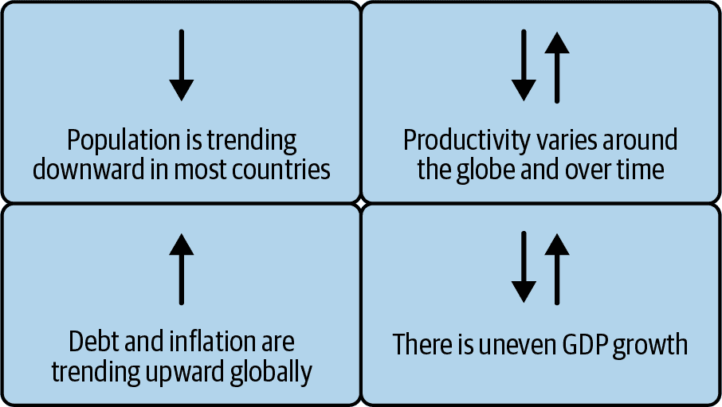

# 第三章：AI 说服的方程式

到目前为止，在这本书中，我们已经提出了一些处理 GenAI 的伟大方法，这一刻有多么深刻，一些需要注意的事项，如何成为自己的火种（这是一种对从 AI 中提取最大价值的人的时髦说法——如果你愿意，可以称之为 AI 价值创造者），如何开始，一种解决问题的全新心态，以及更多。我们给你提供了一些技术细节，但我们认为你会同意，我们保持了技术讨论的轻松，而在商业方面则投入了更多。这一切都是经过精心设计的，这一章也不例外。

真诚地说，这一章是在最后一刻添加的。原本你们应该得到一个关于用例的章节，我们觉得我们欠我们的编辑团队一个公开道歉，因为当我们把最终稿交给他们时，他们看起来就像是从（荣誉）学校毕业了，因为他们不得不进行大量的修改。

那么，为什么添加这一章呢？我们遇到了一位世界著名的人类学家经济学家 Dr. Jason Hickel 的观点，他的研究专注于全球政治经济学、不平等和生态经济学。他评论说：“如今，世界上几乎每个政府，无论是富国还是穷国，都一心一意地关注国内生产总值（GDP）的增长。这已不再是选择的问题。”

这让我们反思了我们的前两章，并意识到虽然我们给你们提供了采取行动的充分理由，但 Hickel 想要表达的是，你们没有选择。想象一下，你在一本选择你自己的冒险书中，如果你想要成功，选择基本上已经为你预选好了。而要真正理解这一点，你必须认识到 AI 对未来增长、我们的生产力悖论以及我们在本章中提出的帮助你度过难关的方程式为什么如此关键。

# 有些事物是永恒的

帮我们一个忙。先读这个引用，然后从我们目前所处的 GenAI 时刻的角度来反思它：

> 我们生活在一个动荡、困惑、迷茫、害怕自己力量的时代，我们不仅寻找自己的道路，甚至寻找自己的方向。有许多咨询的声音，但很少有愿景的声音；有许多兴奋和狂热的活动，但很少有深思熟虑的目的。我们因我们无政府、无方向的力量而感到苦恼，做了很多事情，但都没有持续很久。我们的责任是找到自己。

当我们反思这个引言时，我们不禁注意到这个人工智能时代有很多人“感到困扰、困惑[以及]迷茫”——确实，我们正处于一个社会因现代生活的复杂性而经历某种迷失和恐惧的时代。这个时代的“众多咨询之声”与“但很少的远见之声”形成对比，意味着有很多意见，但缺乏很多前瞻性的商业领导力（我们希望这本书能提供）。最后，“狂热的活动”可能导致了在这样一个每个人都在声称自己是人工智能并且经常不考虑实施这个光鲜新事物（这无疑强调了“寻找自我”的责任）的世界中寻找社会共同方向的需求。

事实上，这个引言是针对现代时代的。你们中许多人可能感觉就像在上周听到了类似的话。你能猜到是谁说的吗？是 IBM 的 CEO 阿维·库拉纳？或许是英伟达的 CEO 黄仁勋，或者是微软的 CEO 萨蒂亚·纳德拉。不，等等，你在想，这肯定是从 OpenAI 的 CEO 山姆·奥特曼那里来的（假设还没有发生任何可以与 HBO 的《继承之战》或 Showtime 的《亿万》一集相提并论的大事件——在我们写这本书的时候，他仍然是 CEO）。

或许，你迄今为止对这个引言的唯一线索（除了本节标题之外）就是其措辞，这明显是 20 世纪初的风格。那么，究竟是谁说了这些如此准确地描述今天人工智能时刻的深刻话语呢？这个引言归功于伍德罗·威尔逊在普林斯顿大学的学士学位演讲中——1907 年，就在他将成为“第 28 号人物”，美国第 28 任总统之前短短几年。

是什么促使第 28 号人物说出这些话呢？1907 年，就像世界其他地方一样，美国正经历着新工作类型和新工人涌入劳动力市场的涌入，工业资本主义正在兴起。新企业正在形成，零售业因更多女性进入劳动力市场而蓬勃发展。技术正在改变商业和就业，对美国的公民来说，事情变得混乱。尽管许多事情都在变化，但技术是一个不可忽视的力量。所有这些因素共同创造了一种不确定性，当技术被应用于解决以前未曾解决的问题时，这种不确定性变得更加明显。在那个时代的公民以他们自己的特殊方式醒来，意识到他们每天都在走过他们可以用技术解决的问题（或使它们变得更好）。确实，有些事情是永恒的。

今天，我们发现自己处于一个类似的转折点。技术正在以前所未有的速度发展，但生产力增长并没有（关于这一点稍后还会详细说明）。正如你们将要发现的，世界迫切需要提高生产力，以推动公司的财务成功和国家的经济增长。人工智能是解决这个生产力问题的答案，但我们面临着这样一个悖论：*责任和颠覆必须共存*。

## 技术与紧张关系始终存在——始终如此

我们相信，许多人对今天的人工智能的感受与一百多年前许多人感受的并没有太大不同，当时威尔逊说出了那些引用的话语。回到大约四百年前，注意伊丽莎白一世女王如何拒绝授予机械编织机的发明者专利，担心这会让编织工失业。当然，在一段时间之后，机械编织机帮助引发了第一次工业革命，导致了爆炸性的经济增长。确实，回顾历史，一次又一次，似乎社会与技术之间始终存在某种紧张关系。

这句话之所以与你们中的许多人产生共鸣，并感觉如此贴近当下，是因为它很可能反映了你们（或你们认识的人）今天对人工智能的一些相同感受。简单地说，因为所有这些历史都在不断重复，这正是我们将分享一个看似矛盾的观察的原因，即我们在商业、政府、学术机构以及所有中间部分都看到了这种矛盾。

## 无需计算器！我们的三个说服方程

在本节中，我们希望分享一些方程式，以便让您了解我们认为事物发展的方向。您不需要计算器来解这些方程，也不可以向大型语言模型（LLM）询问答案。（您可以，但我们认为我们的答案会更好。）但别担心！我们的方程式很简单。它们被设计出来是为了说服您阅读这本书的其余部分，并继续您在人工智能洞察力上的投资，因为如果您仍然是一个怀疑者（或者需要在办公室说服怀疑者），您真的需要能够从商业角度清晰地阐述，为什么您可能比您意识到的更需要人工智能。

让我们从图 3-1 中总结的宏观动态开始，帮助您从经济角度真正了解我们今天的世界正在发生什么。然后，我们将详细讨论以下小节中的这些宏观动态。

###### 图 3-1\. 当前的市场宏观动态：有些东西正在上升，有些东西正在下降，有些东西取决于你住在哪里

### 人口正在减少

这几乎在世界上每个国家都在发生。例如，美国的人口可能从今年开始就会开始下降，预计到 2100 年将减少数百万。实际上，在接下来的 50 年里，全球只有大约 6 个国家将看到人口增长，从历史的角度来看，这是不寻常的。1

此外，与上述情况相关的是，我们面临着劳动力规模的缩小，尤其是在高技能工人方面。当然，我们有所谓的“银色海啸”（我们用来形容一个老龄化劳动力群体，他们正迅速走向退休的亲切术语），这对整个社会带来了重大的挑战和调整：从它带来了退休和相关的企业健忘症（只有长期服务的员工大脑中存在的机构知识丢失），到人才储备池的缩小，再到医疗保健成本的上升，甚至到“银色海啸”垄断 pickleball 球场和拥挤的早鸟折扣自助餐队伍。而且正如你将发现的，这将对经济增长和整个社会产生直接影响。

### 全球生产力差异显著

在某些地理区域，生产力的速率和节奏令人惊叹，但遗憾的是，在当今世界的现状下，这种情况似乎越来越不常见。例如，印度尼西亚等国家的生产力已经远超常规，但这种情况在其他许多地方并不适用。至少，我们在全球范围内看到了生产力的增长并不一致。事实上，根据麦肯锡公司的数据，美国的生产率增长率仅为令人失望的 1.4%（与过去相比有所下降）。加拿大（根据加拿大银行的数据）在 2023 年的生产力比 2019 年下降了 1.8%，自 2019 年以来基本持平，2024 年增长了 0.6%。但麦肯锡的一份报告提出了一个令人震惊的统计数据，就像你发现圣诞老人并不存在的那一刻（希望你不是在这本书中得知这个消息）：如果美国能够恢复过去的生产率水平，其国内生产总值（GDP）将增加 10 万亿美元——这大约是其 2024 年经济的三分之一。正如我们所说，这种生产率下降是全球性的，但我们如果不指出，这种下降是在过去 15 年技术繁荣的背景下发生的，那就太疏忽了！

但如果一家公司提高了生产力呢？这通常意味着更多的收入，更多的收入意味着公司可以在不提高价格的情况下支付给工人更高的工资和奖金，更多的收入和人们花更多的钱意味着一个国家国库的收入增加——而且这种涓滴效应会持续下去。简单来说，每个人都能从更高的生产力中受益：工人、企业和政府。但当你经济增长但生产力下降时会发生什么呢？通货膨胀！事实上，正如许多世界政府已经使用货币政策将顽固的通货膨胀降低到目标范围内一样，一个国家不断增长的 GDP 伴随着生产力的下降结果是通货膨胀。我们并不是要传达一片末日景象……但无论你怎么看（眯着眼睛、闭上一只眼睛、两只眼睛都睁大，甚至闭上眼睛），世界上大多数地方*真的*需要解决其生产力停滞不前的问题。

### 债务增长面临成本和获取的逆风

随着我们走出隔离经济（想想我们在 COVID-19 大流行期间度过的那两年不同寻常的正常生活），接近零利率的时代和长达 15 年的低利率时期宣告结束。换句话说，筹集资金来创办新公司或扩大业务曾经更容易。在我们走向利率常态化的旅程中，债务和资本仍然可用于维持增长，但它们比以往时期更难获得，且成本更高——至少在撰写本书的时候是这样的。

### 不均衡的 GDP 增长

事实上，世界上大多数推动生产力上升的经济体——根据定义——也在经历加速的 GDP 增长。那些没有展现生产力提升的国家发生了什么？当然，其中一些国家的 GDP 在增长，但人均 GDP 在下降，这意味着大多数个人并没有比去年过得更好。

所有这些代表的是我们的方程式旨在揭示的商业机会。

## 方程式 1：如何增长 GDP

方程式 1 是宏观投资中的一个古老的经验法则。它基本上说，任何经济增长（GDP 真正衡量的是：经济产出）都来自三个方面：人口增长、生产力增长和债务增长。

+   **GDP 增长（↑）=↑人口 + ↑生产力 + ↑债务**

现在，花点时间思考一下你所在的国家在这个方程式中的位置。我们讨论了人口增长，除非你居住在少数几个国家之一，否则你所在国家的总人口并没有增长。*这意味着如果你试图增长，人口正在与你作对。*

那么，债务增长怎么样呢？我们指出，尽管债务仍然可用，但获得它将更加困难，且持有成本更高（实际上，这已经发生了）。*这意味着如果你试图增长，债务和资本正在与你作对。*

在这种想法下，几乎所有的企业和政府要实现持续增长，唯一的途径就是极度关注生产力——而生产力也在下降。这与我们在过去一百多年里面对的任何关于增长的挑战都不同。

总结：人口和债务正在与试图增加经济产出的人作对——方程式 1 告诉我们，突然之间，围绕生产力的必要性变得紧迫，每个人都必须考虑这一点。换句话说，生产力是你的答案——生成式人工智能和代理可以帮忙。这就是我们为什么对人工智能如此兴奋的原因。毫无疑问，人工智能作为通过生产力促进增长的催化剂，提供了最大的机会。

这也是我们陷入悖论的原因。为什么？许多人担心人工智能的后果。它会对工作造成破坏吗？它会改变我们的工作方式吗？我们如何处理人工智能的责任？我们能信任它吗？那么，我们的悖论是什么？我们将直言不讳（并且用粗体字来进一步强调）加上一个现实检查：**责任和破坏必须共存**。在这个时刻，没有其他选择。

我们希望你们再次阅读我们的悖论和现实检查。现在，再读一遍，然后再读一遍……直到你得出这是一个事实的结论。我们是否在同一个页面上？太好了！让我们继续。

看看，我们与世界各地的许多客户和政府交谈，相当坦白地说，其中一些让我们感到担忧。有些人告诉我们：“我们认为人工智能有风险，因此，我们不想做任何事情。”我们以更友好的方式告诉他们：“你没有选择。”

退一步想想。如果你同意你所在组织的重点是增长，而增长是始终带来世界改善的唯一一件事，那么你必须处理我们的悖论。

这意味着什么？*这意味着我们必须以正确和负责任的方式做人工智能*（这也是为什么我们包括了听起来像苏斯博士的书名第五章）。但不要就此止步，否则你会对自己短视。我们不仅必须以正确的方式做人工智能。当我们以正确的方式做人工智能时，*我们必须接受* *它可能（并且很可能）带来的破坏*。

因此，这是第一个方程式。想想我们刚才与你分享的增长动态以及我们如何在全世界所有国家继续增长所需的因素。随着人口减少、债务获取变得更加紧张和昂贵，增长的公式不成比例地依赖于生产力。

## 方程式 2：什么因素造就了人工智能的成功？

这就引出了方程式 2，它全部关于人工智能依赖于以下四个要素（这些要素都在本书中有所涉及）：

+   **人工智能成功 = 模型 + 数据 + 管理 + 用例**

第一是*模型*，如 LLM——通用人工智能和代理狂热的 DNA。接下来是*数据*。如果你没有数据，你就没有 AI，如果你不把数据作为你战略的核心部分（这意味着你正在成为一个 AI 价值创造者），那么你就没有充分利用 AI（这意味着你作为一个 AI 用户在运作）。*治理*是随着 AI 成为你业务流程的核心，你如何自信地运作的方式，而*用例*是关注商业价值的方式。

注意我们是否在书中为这些主题专门设立了一章，或者是在整本书中花费时间讨论它们？话虽如此，我们在这里将花一些时间来谈论数据，因为我们认为它是任何 AI 价值创造者成功中*最关键*的元素。鉴于市场上对通用人工智能和代理的炒作和兴趣——而且有充分的理由——我们认为*唯一*可持续的竞争优势将来自*你的*数据。为什么？因为如果这些巨大的 LLM（如 GPT-4.5、Gemini、DeepSeek 等）几乎都是在相同互联网数据上训练的，那么大多数 LLM 将在“长期”（第二十八章对长期的说法）中实现商品化。这意味着我们很快就会达到这样一个点，即从任何其他模型中区分出对你业务有价值的人工智能，将是那些进一步用你的数据对你的业务问题进行训练、引导或调整的人工智能。从 LLM 的角度来看，差异化将沿着能力、可信度、安全性、权重和数据透明度、代理属性等方向发展。简单地说，你需要确保你认识到你数据中蕴含的巨大价值（那些不在互联网上供供应商骚扰和训练 AI 的东西）。你不能轻易地放弃这些数据（这就是为什么你需要理解你参与的供应商条款）。这是关于更好的患者结果、流失者、欺诈、购买更多、销售更多，或者你业务的其他任何事情的数据。实际上，我们甚至可以说，用你公司的数据引导的模型是你对伍德罗·威尔逊的*“多做事情，但不要长期做”*的警钟的回应。

想象一下。你上次和朋友经过一栋新建的房子，停下来，梦幻地对他说，“啊，所有这些集料和水泥的完美和谐之美！”但你肯定对那些材料对比和融合得令人愉悦的成品发表过评论——所有这些都用一些极好的、价格过高的景观设计框起来，以做出某种声明。

当你从长远的角度来看时，你不会吹嘘你在*“多做事情的时刻”*中调整过的模型。事实上，我们认为你不会吹嘘你的晋升、流程、产品定位或任何其他事情。我们认为你最多会吹嘘的是用你的数据增强并与你的业务、价值观、商业词汇等对齐的人工智能。

所以这是第二个等式。虽然我们更多地关注数据，但让我们明确：**没有这个等式中的四个要素，你无法在 AI 中取得成功**。回顾我们的悖论，你肯定会需要治理，因为我们必须接受将会有固有的风险，然后当然，用例和模型。因此，AI 成功的秘诀是成为一个拥有 AI 平台的 AI 价值创造者。

### 烘焙分层蛋糕：一个帮助你掌握 AI 成功等式的平台

如果你想要为你的业务使用 AI，我们认为你需要一个为业务构建的 AI 堆栈，它将与你可能用于消费者 AI 的堆栈**非常不同**。事实上，你选择的堆栈类型将直接影响你从 AI 中获得的企业价值。在“长期”来看，我们认为将会有三种方法可以帮助你从 AI 中获得价值。回想一下，在第二章中，我们评论了我们关于 AI 和成为 AI 价值创造者的不同观点——虽然你可能使用所有这些方法，但**平台方法**不仅将提供最多的价值，而且对于你关心最大化成功至关重要。

想象一个 AI 平台就像一个分层蛋糕。这不是你可以吃的蛋糕——这是一个代表 AI 业务端到端堆栈的架构。而这个蛋糕是实施 AI 并尽可能多地为你使用 AI（平台方法）的业务提取价值的关键。

我们的蛋糕看起来像图 3-2。

###### 图 3-2。通用 AI 平台的分层方法

#### 基础：混合云和 AI 工具

这个蛋糕的底层是关于混合云和 AI 工具的——蛋糕上必须放置的经常被忽视的部分。如果你的这部分做错了，你的杰作的其他部分就不会呈现出来。混合概念始于整个堆栈建立在可以运行你需要的东西的开源技术之上的观念……任何地方都可以。曾经有一个关于企业只运行单一云和可能没有任何本地部署的讨论。但关于混合云的争论已经长期解决，只有一个云战略的企业数量在统计上变得微不足道。

###### 小贴士

我们的一位审稿人，琳达·斯诺，不愿意为我们这本书的工作收取报酬。相反，她要求我们发布这个公共服务公告：**on**premises 是**on**prem 的正确替代词，所以请停止在这个语境中使用单词**premise**，因为它意味着完全不同的东西。

今天的混合云架构更注重于支持工作负载在所有环境（公共云、私有云，甚至本地环境）之间的可移植性，而不是物理连接性。确实，公共云和私有云不再是连接的物理“位置”。例如，许多云服务提供商现在提供在客户本地数据中心运行的公共云服务。私有云，曾经只在本地运行，现在通常托管在本地数据中心、虚拟专用网络（VPN）、虚拟专用云（VPC）或从第三方提供商（有时是公共云提供商）租用的专用基础设施上。在生产力主题上，*基础设施即代码*（例如，像 Terraform 与 Ansible 这样的技术）允许员工通过使用位于防火墙后面或之外的计算或云资源，以声明性方式在任何需要时一致地提供这些环境。这对人工智能来说是个大问题，不仅仅是因为构建组件。随着边缘计算的兴起，它提供了将人工智能推理（运行模型）更靠近实际收集数据的地方的机会，从而提高了全球应用程序的性能。边缘计算可能是人工智能部署中很少被讨论的部分，但我们开始看到很多在边缘设备上发生推理的工作。因此，从定义上讲，人工智能在运行位置和需要作为人工智能价值创造者引导的数据居住地方面将是混合的。结论？这一点很重要，因为随着人工智能渗透到我们业务流程的核心（AI+），构成万物互联的互联设备将需要将智能应用于一切。

#### 数据服务需要为您提供服务

正如我们在第二章中提到的，如果你在我们任何一次会议上的演讲中见过我们，你很可能听到我们反复吟唱这句箴言：“没有 IA，就没有 AI。”如前所述，这意味着没有信息架构，就没有人工智能。如果你忽略了蛋糕的这一层，不要指望你的蛋糕能赢得任何奖项。你可能还能做出那个蛋糕，但你的蛋糕永远不会达到其全部潜力。

数据服务层是您实例化一个*d*ata *f*abric 的地方，它允许您的业务发现、收集、组织、治理和理解它需要的所有数据，以便它能做得更好或甚至不同。你还会遇到像*d*ata *as a p*roduct 这样的数据消费和分配方法，以及老式的数据库和其他组件。你可能对这些中的许多都很了解，但这并不是不关注它们的借口。

从这一层得到的启示是，如果你不能连接到所有数据源并信任它们，你就永远无法通过人工智能获得正确的成果。回到我们之前提到的类比（因为它至关重要）：如果你不去健身房锻炼，你就无法从你的健身房会员卡中获得价值。数据也是如此。

#### 人工智能和数据平台：蛋糕的心脏

这是你肯定会品尝的味道——你知道的，那个你把手指伸进搅拌碗（无疑会有人不赞成）来尝一尝味道，然后再把整个东西烤出来的部分。如果你做错了，无论你放在上面的是什么，都将毫无价值，无论你放在下面的是什么（一个好的 IA），最终都会浪费你的时间和金钱。坦白说，如果你不能做到这一点，那么祝你成为人工智能价值创造者好运。

这一层是管理、构建、训练和引导模型的地方。这一层应该给你的业务提供灵活性，以便混合和匹配、引导或构建最适合你特定行业或用例的不同模型。你选择的平台应该是开放的，这样你就可以与市场上的任何模型一起工作，无论是开源免费的还是你付费购买的。

这个平台无疑会带来几个功能，但**它绝对需要以下三个要素**：

+   一种管理你人工智能模型数据的方式。现代人工智能架构得益于数据湖屋，它将数据服务层汇集在一起。

+   一个可以用来构建人工智能的工作台，并且这个工作台对所有用户都是可消费的，这样在这个领域（真正懂得自己在做什么的人）的佼佼者（就像在商店里第一次尝试的新手，他们没有编程技能，并且明白快速、向前和安全的失败是成长的方式）会感到和初学者一样舒适。这个工作台是所有中间部分汇聚在一起，在你的人工智能之旅上完成各种事情的地方，从构建和管理代理，到引导和使用基础模型，到传统人工智能。

+   一个治理框架允许组织指导、管理和监控 GenAI、代理以及传统形式如机器学习等 AI 活动——无论它们是由哪个供应商构建的。这个组件至关重要，因为它帮助您理解您的模型，并清晰地（向投资者、您的团队、客户，尤其是审计师）阐述它们是如何构建的。它会在监管机构之前提醒您，如果您的任何模型开始以您未预期的方式运行（偏离事实真相、发展偏见等）。（哎呀！）底线是：有了正确的治理，公司可以确信他们的工作流程将符合不断变化的政府法规，并且没有偏见。如果您已经完美地做到了这一切（您没有；没有人能），那么第五章将是有益的，甚至可能是有趣的；否则，它可能会让您感到像过山车一样，胃和神经都承受压力。不要低估您的公司，仅仅为了合规而进行治理。增强您的治理策略，包括洞察力的治理，因为这将帮助您从监管治理投资中获得回报，这将帮助您更快地跨越我们在第一章中向您介绍的敏锐曲线。简单地说，这意味着当您考虑所有属于 AI 治理（可解释性、数据智能、托管、安全等）的事情时，您将做所有真正加速您的 AI 计划需要做的事情。相反，如果您只是试图避免罚款，您就不会像您本可以那样加速您的 AI 业务，但您会投入同样的努力，也许更多。

#### 我对使用 SDK 非常满意

部署任何 AI 解决方案的关键在于集成点和为实践者和开发者提供支持。这意味着您的平台，或者您与之交互的平台，需要一个软件开发工具包（SDK）和 API，以便您可以将 AI 集成到自己的产品和系统中。

#### 代理和助手赋予 AI 服务于众人的能力

我们喜欢认为人类提供能力，而人工智能提供可扩展性。（一个名叫 Vlad Stojanovski 的人告诉我们这一点，并且这个观点一直影响着我们。）因此，人工智能代理和助手是我们蛋糕的最顶层——它们主要解决（通常是特定）可重复的问题。你可能听说过或使用过许多人工智能助手，例如 Otter.ai、Grammarly 和 Microsoft Copilot。IBM 也有几个 watsonx 品牌的助手，可以帮助你编写代码、自动化客户服务，并使用数字劳动力（代理）来自动化常规任务，使工作流程无摩擦。像 CrewAI 和 BeeAI Agent Framework（由 IBM 开源）这样的平台提供了开发者构建和管理自己的代理所需的所有东西（在这种情况下，这些平台可以相互协作）。IBM 甚至为特定行业（如人力资源）提供预构建的代理，以便在自己的或 IBM 的数字劳动力平台 watsonx Orchestrate 上部署。（该产品针对具有无代码和低代码环境以使用数字劳动力和代理编排工作流程的业务用户。）

## 方程式 3：找到你的平衡——导航悖论

到目前为止，我们已经讨论了世界上大多数经济体和业务增长所需的要素，以及人工智能在增长方程式中的作用。现在，我们准备讨论方程式 3，它全部关于如何通过导航我们的悖论来找到正确的平衡。我们具体讨论的是颠覆与责任共存。公司、政府、首席执行官、领导者和工人应该带头推动钟摆摆向大多数组织都在使用人工智能（并且像第一章中提到的 AI+心态那样对待它）的方向。我们发现了一个相当成功的公式来帮助你做到这一点：

+   **找到平衡 = 领导力 + 技能 + 开放**

我们真心认为（这是一种礼貌的说法，意思是如果你有任何计划让这一切工作，你最好做对）你可以使用这三个基本要素来导航我们的悖论。随着你继续阅读这本书，你不可避免地会注意到这些要素也恰好是这本书的核心。我们专门用了一章来讨论技能，领导力几乎贯穿这本书的每一章，你还将听到更多关于开源的内容。

### 领导力是托管：用心引导

领导力有多种形式，但人工智能领导力将从何而来？它将来自像你这样的阅读这本书的人，他们在世界各地的公司、学术机构和政府中扮演着重要角色，并且都需要投身于导航我们的悖论的想法。坦白说，成功的领导者将是不怕风险的那些人，他们花时间理解风险，并在这些风险周围采取负责任的行为。

你现在已经在全球各地的公司中看到一些这些领导者开始崭露头角，他们在财务表现方面开始与竞争对手区分开来。但总体而言，目前缺乏必要的 AI 领导力，当我们阅读去年的 IBM 全球 AI 采用指数调查时，这一点给我们留下了深刻的印象，该调查指出，五分之一的公司表示他们还没有计划在其业务中采用 AI！这意味着太多的组织仍在维持现状。他们所关心的问题包括有限的 AI 技能和专业知识、数据复杂性过高以及伦理问题。现在你知道我们为什么在书中加入这一章节的原因了：正如著名心理治疗师纳撒尼尔·布兰登所说，“改变的第一步是认识，第二步是接受。”^(3) 我们希望到如今，你已经很清楚现状对商业来说根本行不通——这就是我们在序言中提到的那些裂缝和悬崖般的错误路线……接受它吧。

我们认为，那些（负责任地）积极拥抱人工智能的公司，相较于那些没有这样做的公司，将能够实现更快的增长和更好的底线改善，这并不是过分的要求。他们怎么可能做不到呢？如果你将预算的 30%用于客户支持，而你的竞争对手将三分之二的花费转向了其他地方，那么……例如，瑞典的“先买后付”公司 Klarna 指出，他们超过一半的客户服务聊天都是由人工智能处理的。这笔翻新预算（花钱以节省第一章中的钱）带来的节省可以用来资助创新。如果你不做这件事，你怎么能与这样的供应商竞争呢？从我们的视角（我们对商业和政府事务有独特的概览），我们已经开始看到那些积极拥抱人工智能的公司和那些没有这样做的公司之间的差异，以及这种巨大分歧的开始。展望未来，这对整个社会来说都不会是好事。

我们中的一位有幸听到了退休将军科林·鲍威尔关于领导力的演讲。他是乔治·W·布什总统时期的第 65 任美国国务卿——可以说是美国政府中排名第三高的职位。他曾经说过那句现在广为人知的话：“领导，让人们愿意跟随……哪怕只是出于好奇。”确实，我们见过一些公司仅仅出于好奇而跟随，最终陷入麻烦。虽然鲍威尔的这句话已经无处不在，但大多数人引用它时却忽略了这样一个事实：在他的演讲中，他继续谈到人们会这样做是因为他们信任你。所以，当谈到人工智能时，你必须考虑你将如何展示信任（负责任地使用人工智能），以及哪些技术提供商每天作为好的行为者（站起来的人）或坏的行为者（旁观者）出现。我们认为这很重要。因此，人工智能领导力*并不*意味着不负责任地冲在前面。领导力意味着负责任地推动组织前进，而你不可能独自做到这一点。领导力的一大要素是将智慧（知道正确的道路）与行动相结合。正如古老的谚语所说：“有智慧知道番茄是水果，但知道不要把它放在水果沙拉里。”（是的，我们知道从科学的角度来说，番茄是水果，但从烹饪的角度——这个谚语的基础——我们把它当作蔬菜。）

### 训练和技能帮助你掌握技艺

技能是我们方程式的第二个要素，我们会说技能与领导力密切相关。每个公司和机构都必须建立一套全新的技能来应对未来 5 到 10 到 20 年的增长。领导者必须接受技术发展速度比许多人能跟上的速度快，这会在需求和技能之间产生差距。这就是为什么我们专门用了一整章第六章来讨论这个问题，甚至将 Lady Gaga 和布拉德利·库珀这样的明星力量引入我们不那么肤浅（明白了吗？）的证据点。

当然，这些技能包括核心计算机科学、数据科学和机器学习技能。拥有这些技能的人包括那些对最先进（如果你听到术语*SOTA*——长*O*——这是“最新和最伟大”的行话）模型和技术以及未来趋势有深刻理解的人。但有了通用人工智能和代理，你需要整个公司都接受教育的基础技能：如何负责任地使用这些技术，它们能做什么，它们带来的危险，以及它们是如何工作的——所有这些都形成了一个更广阔的视野。

不要忘记好奇心！看，如果你不知道该找什么，或者如果工人对某些机械流程感到不满并想，“不一定要这样。”，那么你永远无法让你的员工停止每天路过那些可以用技术解决或改善的问题。如果你的员工没有权力进行改变，那么你可能在组织中提升的所有技能都可能白费。毕竟，如果你只打算玩跳棋，那么拥有棋子又有什么意义。

不要误解这一点。如果你是一家企业、一个政府或其他任何类型的实体，为了组织的发展，你的员工将需要新的技能。现在，停下来思考一下今天市场上工作模式和工作方式的多样性。一些员工来自转盘电话和打字机的世界（甚至可能是穿孔卡片程序员），其他人则从充满表情符号的 Slack 聊天开始他们的职业生涯（在 Zoom 会议中穿着睡裤），而其他人你即将雇佣，他们将从一开始就与 AI 代理和助手一起开始他们的职业生涯。

简而言之，20 到 50 年前企业需要的技能并不是未来增长所需的技能。我们认为表 3-1 从技能的角度真正展示了事物发生了多大的变化，并将继续发生变化。

表 3-1\. 比较过去对成功至关重要的技能与未来的技能

| 过去的技能（其中一些仍然很重要） | 未来所需的技能 |
| --- | --- |
| *等级领导。* 自上而下的命令和控制不仅是至关重要的，而且是事实上的风格。以电影《福特对决法拉利》为例。 | *适应性领导。* 领导者的美德包括灵活性、周围的人比你聪明、平等的机会以及给每个人一个发言的机会。“因为我这么说！”不会留住人才。以安德鲁·麦卡菲的《极客之道》（Little, Brown）为例。 |
| *力量与权威.* 能够果断决策并赢得尊重的领导者备受推崇——但遗憾的是，诸如欺凌和恐吓之类的技巧竟然也渗透到这种风格中。 | *情商 (EI)。* 理解、同情并与具有不同经验、教育背景和文化的人建立联系的能力是一项关键技能。这实际上归结为不要成为一个混蛋——是的，领导者必须做出艰难的决定并发表强硬的言论，但这并不是一场受欢迎的竞赛。但让人们愿意为你工作是更好的途径——记住，仅出于好奇心！ |
| *Formal communication.* 在沟通中保持专业性是关键，强调正式的书面和口头沟通技巧。没有“眼睛看向左边”的 emoji 表示“正在考虑”。 | *Digital communication.* 精通数字通信工具和平台至关重要，混合工作模式创造了在家工作和回到办公室不同日程和方法的困境。一些法院裁定，通过短信发送的点赞 emoji 可以约束购买合同，一家航空公司因其 LLM 前端聊天机器人提供关于其定价政策的错误（但可信）信息而在法庭上败诉。 |
| *Specialized expertise.* 在商业的特定领域拥有深入的知识至关重要，金融、营销和运营方面的专家需求量大。他们仍然很重要，但许多构成他们工作的例行任务将被自动化。 | *Lifelong learning.* 最有效的领导者将跨学科经验带入并整合到他们的工作中。在开发、产品管理和销售方面的经验创造了真正的变革推动者——所以成为技能奥运会的十项全能运动员吧！更重要的是，技术技能迅速过时。这需要持续学习和提升技能的承诺。专业技能很重要，但你需要始终为你的“技能行李箱”增添内容。 |
| *Risk aversion.* 对商业持谨慎态度，关注稳定性，避免不必要的风险，并保护现有业务线都是常见的特征。 | *Innovation and risk-taking.* 使用前瞻性思维，愿意实验，并接受计算风险将是业务增长的关键驱动力。导航这个悖论！快速失败，安全失败，并向前失败！ |
| *Networking.* 通过面对面的互动和个人关系建立强大的网络对于业务增长至关重要。你的追随者数量是通过走进会议室跟随你的人的数量来衡量的。 | *Global networking.* 通过数字平台建立广泛（可能全球性）的网络对于挖掘国际市场和多元化人才库至关重要。伟大的领导者会写博客、在领英上发帖、写书、做播客，并在现场活动中发言。他们混合和匹配今天互动的各种方式。但是！面对面仍然很重要。 |

我们认为，我们个人角色（以及作为 IBM 员工的角色）的一部分是向前传递，并构建帮助世界充分利用方程 3 所需的课程和技术访问。例如，印度尼西亚（一个万亿美元的经济体）非常关注技术，IBM 与该国政府合作制定了一项计划，以培训超过 50 万名学生这些下一代技术。其他知名和不知名公司也在做同样的事情。我们鼓励所有人参与其中，这始于密切关注第六章。

### 开放的各个方面

当涉及到他们的 AI 时，透明度应该是所有组织追求的目标。在通用人工智能的世界中保持开放是多方面的，这与我们在传统技术空间中习惯的有所不同——这就是为什么找到平衡是如此关键。

在本书的早期，我们告诉过你，没有一个模型可以统治一切。了解这一点有助于你理解为什么你需要使用一个开放的 AI 平台。你需要能够选择自己的模型以找到合适的平衡。随着时间的推移，最适合你业务的模型将取决于你的行业、领域和用例，以及基于特定领域的数据进行引导。在“长期”的商业中，我们认为 AI 价值创造者模型将为你的业务产生比 AI 通用模型更多的价值成果。

开放的一个方面是用于训练你将用于商业的模型的数据的透明度和开放性。当你开始向供应商询问用于训练他们神奇模型的训练数据时，有些人会告诉你这不关你的事；其他人会给你一份他们认为训练过的物品清单；还有一些人甚至会向你展示数据的来源，包括对数据进行的所有管道预处理，使用权利，等等。在本书撰写之时，只有少数公司完全透明地发布了他们的数据来源和管道。

要做到开放，我们认为您必须从开放数据开始。正如我们在本书前面所讨论的，为了最大限度地发挥您的 AI 努力成果，您将需要使用自己的专有数据来调整或调整您为业务开始的模型。这个模型*可能是*开放的，但对企业来说，更有可能的是它应该建立在开放的基础上，并融入专有数据（您的秘方），或者介于两者之间（例如，一个协会为它服务的行业与会员合作创建的有限数据集）。随着您专注于您的 GenAI 战略，我们认为您应该将开放 LLM 和数据透明度纳入您的计划。为什么？开放是好事，因为它使识别偏见、仇恨、侵略（等等）的来源变得容易得多，它有利于主权，因为所有数据源都很容易识别，它有利于可解释性，有利于法律辩护，并且有利于教育，因为它自然地促进了社区之间的合作。

AI 开放的第二个方面是开源。开源社区没有得到应有的认可，但它们为世界做出的贡献比你想象的要多。它们是协作和创新发生的地方，这就是为什么我们在第一章中向您介绍了 Hugging Face。这里有开源模型和专有模型，您可能会使用两者。在这种情况下，您的平台必须是开放的，这样您就可以混合匹配正确的模型。例如，如果一个行业生成一个针对保险的 LLM，它可能需要付费——但它在这个平台上是开放的，因为它可以被使用，并且它在构建它所使用的数据上是透明的。找到那些围绕开放聚集的公司。其中许多公司是[AI 联盟](https://thealliance.ai)的一部分——一个由技术创造者、开发者和采用者组成的社区，他们合作推进基于开放创新的、安全、负责任的 AI。

AI 联盟的成立是为了加速和传播 AI 技术领域的开放创新，以提升基础能力、安全性、安全性和 AI 的信任。也许更重要的是，它的目标是负责任地最大化 AI 对世界各地人民和社会的益处。

AI 联盟汇集了计算、数据、工具和人才的关键群体，以加速 AI 的开放创新。它寻求做到以下几方面：

+   在软件、模型和工具中构建和支持开放技术。

+   *使*开发者和科学家能够理解、实验和采用开放技术。

+   *倡导*开放创新，与组织和社会领导者、政策法规机构以及公众合作。

最后，我们相信在这个人工智能时代，专有模型肯定有它的位置，但开源模型的空间更大。最后，请始终记住，公司的名字与是否开放无关。当谈到开源时，名字中的含义可能会非常误导。

# 最后一条建议：将人工智能视为价值创造者，而不是成本中心

我们发现，许多领导和公司都将技术（以及网络安全）视为需要管理的成本——这是一个问题。你必须尽你所能确保你工作的公司改变其组织文化，将技术和网络安全视为价值创造者，而不是成本中心。

正确的心态是思考技术如何从根本上改变一个企业。如果你的公司把 GenAI 和代理视为需要管理的成本（不仅仅是技术的成本，还包括与之相关的技能提升、治理和其他成本），那么它可能最终会站在错误的一边。我们为什么这么有信心地说这个？考虑一下技术支出占全球 GDP 的比例：大约 25 年前，这个数字是 5%——而今天，它大约是 15%。当你考虑到世界的总经济产出时，这并不是一个小数字。

现在，我们想让你思考这个比例在未来是否会更高或更低。想想看：我们只用了 15 年的时间就从 5%增长到 15%，谁知道它会到哪里呢？我们认为，世界未来在技术上的 GDP 支出达到 20%、25%甚至 35%是完全有可能的。我们不是占卜者，但我们看到了那些抵制而不是拥抱变革和颠覆的公司会发生什么。这就是为什么今天你会看到这么多深度技术专家成为公司高层的一部分，这在 20 年前是很少见的。

# 总结

到这本书的这一部分，我们希望你已经对技术如何以前所未有的速度发展有了深刻的认识；但更重要的是，我们希望你能认识到，生产率的提高并没有。你很可能已经同意我们的观点，即你需要更好的生产率来推动你公司的财务成功和经济增长。

商业和政府*可以*负责任地利用人工智能促进增长。请注意，我们没有以问号结束那个句子。我们不认为这是一个问题——相反，它是我们悖论的一部分。我们非常确信责任和颠覆可以共存，通过这种方式，你可以管理这种颠覆并避免来自试图维持现状的 complacency。

如果我们还没有说得够多（你已经读到这本书的第三章，我们还在说），你必须将负责任的人工智能融入你的文化。记住：负责任的人工智能是负责任的企业。

希望这能回答我们在几乎每一次壁炉旁聊天时都会遇到的普遍问题（一个讽刺的形容词，因为我们集体只去过一次真正有壁炉的聚会）：这个 AI 东西是否过于冒险？当我们在我们“书籍想法”午餐时偶然发现第 28 号引言时，我们感到安慰，因为在那一刻，没有人站出来建议我们可能没有多余的精力去写它（但我们很高兴我们还是写了）。为什么？因为对我们来说，很明显，社会并没有处理任何我们前辈未曾处理过的事情。随着时间的推移，很明显，技术一直是全世界人民创新和繁荣的源泉。现在，当你几乎读完这一章时，我们认为，集体来看，我们已经对以下观点达成共识：AI 是我们生产力低迷的解决方案，责任和颠覆必须共存。

如果我们不仅允许，而且**强烈**鼓励负责任地使用的技术蓬勃发展，我们认为世界上最好的日子还在后面。AI 将释放生产力，这将推动 GDP 增长到一个我们中没有人见过的水平！专为商业设计的正确可信的 AI 正是如此。是的，这可能意味着短期内工作的演变，但我们有信心，就像在过去每一次提升、转变、裂缝或悬崖技术时刻一样，随着技能的提升，将会有新的工作（你以前从未想过的工作）、市场和行业。有了应用负责任 AI 以提升生产力的正确愿景，我们确实可以再次找到自己，并且——同时——为未来许多年带来持续的增长和倾向。

再次思考伍德罗·威尔逊的话：*困惑*、*混乱*和*狂热*的活动。如果你的问题是，“我们能导航这个吗？”那么简短的答案是，“是的。”现在，让我们进入下一章，看看你是如何将 AI 付诸实践的。

^(1) 健康计量评估研究所，“《柳叶刀》：全球生育率急剧下降，预计到 2100 年将改变全球人口模式”，发布日期：2024 年 3 月 20 日，[*https://oreil.ly/rrfun*](https://oreil.ly/rrfun)。

^(2) 麦肯锡全球研究院，“重振美国生产力以迎接新时代”，发布日期：2023 年 12 月 23 日，[*https://oreil.ly/J9ndM*](https://oreil.ly/J9ndM)。

^(3) 钻石顾问公司，“改变始于意识，但接受定义了你的未来”，由 Mindy Diamond 发布，检索日期：2024 年 12 月 13 日，[*https://oreil.ly/VN_nh*](https://oreil.ly/VN_nh)。
