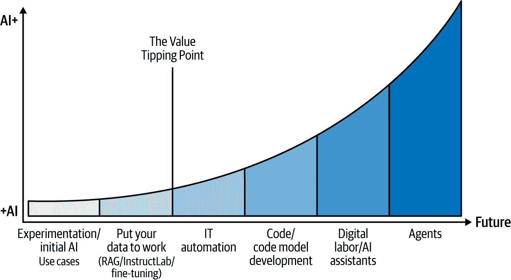

# 第四章. 应用场景章节

有许多研究表明，通用人工智能，尤其是代理，具有巨大的生产力潜力。回想一下我们在上一章中讨论的方程式，你能看到机会吗？但它的规模究竟有多大？试图确定这一点就像在金属 lica 音乐会的后台通行证和下一部*死侍*电影中的角色之间做出选择——无论哪种方式都将是非常壮观的，但你无法知道哪一个会让你的心跳加速。目前，让我们假设通用人工智能在接下来的几年内能解锁高达 10 万亿美元的生产力，到本世纪末可能高达 20 万亿美元（这是通过汇总我们所遇到的所有报告得出的共识）。那么，你们公司将能捕获其中的一部分吗？而且这仅仅是开始：正如几乎所有撰写关于人工智能奇迹的文章的人一样，我们认为这仅仅是前所未有的新商业模式和产品的开始。毕竟，在商务旅行期间在某个陌生人的家中过夜似乎荒谬无比，直到某个售罄的旧金山会议，然后，Airbnb 就这样诞生了。那么，为什么不利用现在可用的生产力优势来测试和改进你对人工智能的使用、你的治理模型、培训、数据管理等等，沿着一条思考未来的不同路径呢？

作为商业领袖，我们不断面临关于如何为我们的工作场所驱动投资回报率的重要决策。现在，比以往任何时候都更加重要的是，我们面临着混合云和人工智能交汇的关键时刻。随着这些技术达到成熟的临界阶段，我们需要拥抱它们以建立竞争优势并推动创新。

这个网景时刻让我们所有人有机会重新思考我们的技术格局，以充分利用这个重大的 AI 机会以及随后的技术。将正确的元素结合起来意味着在您的行业中领先还是落后。

商业人工智能关乎价值创造，而价值创造来源于恰当的应用场景。你今天所做的决策将对你的未来产生深远的影响。在本章中，我们将深入探讨更多应用场景，并扩展我们在第一章中给出的分类框架。显然，仅针对单一行业的应用场景就能写成一整本书，因此在本章中，我们将通过增加我们的应用场景分类模型，引导你走向我们确信是最佳起点的地方，与你分享更多行业特定的应用场景，并评论通用人工智能和代理应用场景的横向性（我们指的是它们跨越行业垂直线），所有这些努力都是为了帮助你解锁内在的才华。

###### 注意

我们想给你一个使用案例的快捷代码：找到你行业 GenAI 使用案例的最好方法就是简单地进行传统的（或 GenAI）网络搜索。似乎有无穷无尽的论文、文章和关于行业使用案例的报道。顾问（如 IBM、德勤、麦肯锡等）发布了大量内容，技术公司和从业者也是如此。我们之所以告诉你这一点，并不是因为我们无法在这里涵盖所有内容。说实话，有时我们会遇到一些销售人员，他们向我们询问他们所覆盖行业的使用案例。当我们听到这个时，我们会给他们一个好处，即他们不知道这个快捷代码。因为如果他们知道，我们就会告诉他们他们太懒了。这听起来很严厉，但信息量确实很大。说真的，你会对如何以极少的努力快速深入了解一个行业的 AI 使用案例感到震惊。

回想一下第三章中关于 AI 成功的公式：四个因素的加成力量：模型 + 数据 + 管理 + 使用案例。如果 LLMs、数据和治理是“脚手架”，那么使用案例就是你所创建的“宫殿”——真正的价值生成器。

# 使用案例价值创造曲线

到目前为止，在这本书中，我们已经向你提供了几个工具，这些工具将帮助你识别那些经过尝试、测试和验证的使用案例。就像电工有一个装满工具的工具袋（剥线钳、剪刀、绝缘螺丝刀、电压测试仪等等），我们也在为你提供使用案例工具，以帮助你自信地引导你的组织走向一些令人震惊（但却是好事）的结果。

停下来片刻，回顾一下我们迄今为止所提供的工具。在第一章中，我们给你提供了一套敏锐曲线，用于放置使用案例，一个关于预算（支出以制造或支出以节省）的分类方案，以及一个关于 AI 将做什么（自动化、优化或预测）的叠加分类方案。在本节中，我们将为你提供另一个工具，帮助你定义对你业务具有高影响力的 AI 使用案例。

看一下图 4-1，将自己置于著名英国跳台滑雪运动员^(1)和励志民谣英雄艾迪“老鹰”爱德华兹的心态中，只是这个斜坡将你送入你的 AI 未来。这个斜坡的早期部分开始时有些谨慎（实验）。你在这个部分积累速度——在跳台滑雪中这被称为*起跑*，但保持平衡的姿态至关重要。不要过度，记住：快速失败，向前失败，安全失败。而且毫无疑问，那些立志高飞的公司的“跳跃”始于实验，但仍然有太多的公司卡在这里（这也是我们写这本书的原因之一）。接下来，你获得更多经验，并在使用一些技术将数据通过某种形式的模型调整（InstructLab，LoRA 等）、多轮提示或使用检索增强生成（RAG）模式来工作（我们将在第八章中更详细地介绍这些内容）时，采取一种 AI 气动姿态。然后你开始加速——达到价值临界点。



###### 图 4-1\. 从+AI 过渡到 AI+的公司通常遵循类似的价值创造路径——AI 价值创造曲线

与跳台滑雪不同，你有在这里掉头的机会，但你为什么要这样做呢？你现在已经有了很大的动力。想想看：你已经取得了胜利，你理解了生成式 AI 和代理能力，你对评估你的 AI 平台的因素有了很好的感觉：选择、效率和透明度。而且（希望如此），因为你已经阅读了这本书，你已经触发了开放式创新（选择），并且拥有适用于企业的性能良好的大型语言模型（LLMs），它们在部署时是安全的（可信的）。简单地说，你不能在这里回头。如果你这样做，你将欺骗你的业务和实现其最大潜力的机会。你看，在 AI 价值创造曲线的价值临界点右边，是真正积累动力的地方，自动化和数字劳动成为代码开发中其他效率的催化剂，AI 助手真正地将成本向左转移，还有更多。

在这个斜坡的最右边，你真正地起飞了，就像奥运跳台滑雪运动员一样，你现在已经很好地定位了自己，可以增加升力并减少阻力。你是主动的。你一直在努力的一切都已成为你公司运营模式的一部分——你有代理，有助手，你正在利用你最有价值的资产（你的数据），你正在将所有角色从开发到营销、写作等中的例行任务向左移动。AI 价值创造曲线的最右边实际上是达到了目的地 AI+。

就像“老鹰”在起飞架上一样，一开始你可能看起来并不像世界级的职业选手。但一旦起飞，那就完全是关于飞得更高、更远。更重要的是，因为你阅读了我们的书，我们相信你的着陆（谁说你必须着陆，我们并不认为你必须）会比爱迪的早期跳跃更稳！

# 水平化让你获得最大的垂直化

观察到图 4-1，你可能已经注意到用例（技术）并不是特定于某个行业（垂直）；相反，它们跨越所有行业——简而言之，它们是水平的。我们将多次强调这一点，因为我们认为在考虑人工智能用例时，先水平思考比垂直思考更为关键。让我们花一点时间来看看（不使用任何滑雪类比）人工智能价值创造曲线的不同阶段。

## 实验

对于大多数人来说，早期的 AI 项目始于数据科学和机器学习。但由于这些技术需要深厚的技能和通常需要扩展数据标注工作，一些价值得到了实现，但并没有惠及大众。在大多数情况下，这是增量价值而不是指数价值。用例多种多样，其中一些是水平的（数据探索、客户服务、营销中的个性化等），而另一些则是特定于行业的（支付欺诈、零售分析等）。但正如你在第二章中学到的，这个 AI 时代从未真正实现规模化，以向许多人提供民主化的价值——今天仍有很多人等待的这个机会。

随着通用人工智能的兴起，一个新的实验周期开始了。突然之间，由于数据准备和标注的努力减少，指数级的结果似乎更加可行。如今，许多人发现，正确的数据，与正确的模型合作，可以带来一些令人兴奋的结果。简单地说，与传统的 AI 相比，实验通用人工智能要容易得多，这也是为什么大多数涉足通用人工智能的人早期就选择了它。

## 将您的数据投入工作

具有讽刺意味的是，通用人工智能在所有业务中的最大资产是相同的：专有数据。随着公司寻求从人工智能中获得价值，每个公司的见解都相似：如果我们能释放我们的专有数据，我们就有了实现指数级影响的非常真实的机会（我们将在第八章中深入探讨这一点）。

## IT 自动化

我们在图 4-1 中加入了价值临界点标记，因为它确实是公司不仅仅*意识到*，而是*相信*他们可以使用人工智能自动化技术和运营，并从中获得巨大回报的时刻。这是我们在本章开头提到的关于人工智能用例水平性的一个很好的例子。想想看，*任何大型公司都依赖于技术，无论行业如何*。

###### 注意

我们最初写的是“任何公司”（而不是“任何大公司”），但这让我们的其中一位母亲感到不安，她对人工智能接管有些担忧。她争辩说：“但我的邻居的柠檬水摊没有使用技术！”真的吗？隔壁的约翰尼和苏伊是用赤手挤那些柠檬的吗？好吧，我们承认这一点。（说实话，当我们听到这个故事时，我们怀疑那些孩子根本就没有用真正的柠檬，但我们想保持这种魔法的活力。）“柠檬是从哪里来的？”作者问道。一家运行在库存系统、追踪和追踪安全以及物流软件上的杂货店是接下来的陈述。然后，那个备受珍爱的智慧之包评论道：“如果他们自己种植柠檬呢；我小时候就有一棵柠檬树。”确实令人印象深刻。他们检查天气预报以知道是否要开门吗？他们在 TikTok 上发布过任何关于他们饮料供应的信息吗？见鬼，我们敢打赌那些孩子肯定接受 Venmo 作为支付方式。当这位母亲在 iPhone 上收到 Netflix 通知，暗示她可能喜欢《林肯律师》因为她为《根据莉迪亚·波伊特的法则》给出了两个大拇指点赞时，讨论就结束了。（终于，我们达成了共识——两部都是优秀的剧集。）简而言之：我们写“大”是为了吸引我们的一位母亲，但我们指的是“任何”**企业**。

现在想想，今天的技术主要是如何为大小公司运作的。它主要是手工操作，由众多技术员工支持，在许多情况下，还有承包商和顾问。人工智能提供了一种基础技术，可以自动化这项工作的很大一部分：系统正常运行时间、解决关键漏洞、证书管理、应用程序操作，等等。

这可能会引发一个问题，为什么是现在？简单地说，技术管理的大部分工作都是重复性任务，需要观察、操作和管理。结果证明，人工智能在重复性任务上相当擅长，而且在许多情况下，它甚至可以在问题成为问题之前就修复技术问题。这就是 IT 自动化的最终承诺。

考虑一下证书健康管理的日常任务。一个集中式系统来管理证书健康可能看起来是一个简单的任务，但对于许多人来说，这是一个巨大的头疼问题，因为证书散布在分布式系统中。缺乏集中式可见性和依赖手动跟踪导致证书库存分散，增加了遗忘和过期证书的风险。在客户端知道之前，证书就已经过期，这直接影响了依赖的应用程序，导致服务完全中断。事实上，大多数证书管理工具都失败了，因为每个工具只与其管理的证书一起工作，而且很难追踪到证书作为故障的根本原因。过期、过时或配置错误的证书的影响和规模是巨大的，可能导致许多中断和风险，从而导致业务中断。过期的证书还使企业面临中间人攻击等安全风险，这意味着黑客可以拦截敏感信息。这是一个非常适合用 AI 解决的问题。

也许现在是考虑所有其他你视为理所当然的事情的好时机，这些事情是 IT 团队在证书管理之外做的，比如缓存内容分发网络（CDNs）、入侵检测系统和电源管理；清单可以一直列下去。要完全欣赏它们（以及 AI 帮助的机会），了解今天的业务应用程序不再是简单的结构至关重要。相反，它们是复杂的生态系统，使用各种工具和服务构建和管理，这些工具和服务部署在多样化的云和本地环境中。AI 现在可以帮助你，但将来你将别无选择。我们为什么这么说？试着理解一下 IDC^(3)分析师与我们分享的令人震惊的统计数据：到 2028 年将会有超过一亿个新的逻辑应用程序被创建！虽然这超出了本书的范围，但这一事实强烈表明，当 CIO 们考虑转型时，需要采取设计时就考虑混合的^(4)方法。想想看：通用人工智能和混合云都是关于数据的。数据在位置和类型上是混合的。混合思维让你从数据中获得最大收益，这让你可以从模型中获得最大收益。它们共同作为商业放大器，是推进数字化转型的前提条件。

简而言之，随着你在 IT 自动化方面的进步，它优化了技术成本。你的公司是否陷入了公共云不是他们原本认为的简单成本节约手段的陷阱？使用 IT 自动化在更低成本的环境中运行这些工作负载。应用程序利用率低？使用 IT 自动化将未使用的容量迁移到不同的应用程序。机会无限，这就是价值创造的转折点。

IBM 有一个名为“客户零”的自动化倡议——这是其 CEO 向公司提出的一项挑战，通过使用 AI 提高生产力来为公司创造 30 亿美元的价值，并将这些旅程封装成模式以惠及客户。这是一个令人难以置信的项目，因为我们向客户交付了真实的结果，并凭借我们已经成功实现这一点的信息。但不仅如此：IBM 肯定也面临过失败、挫折和困难，而这些困难反过来又为其通过这些项目取得的成功和增长铺平了道路。因此，IBM 还与客户分享其学到的经验教训（是的，即使是那些艰难的教训），以便客户能够更快地进步，更有信心，并在自己的旅程中减少失败。

这本书不是关于 IBM 的，我们也没有足够的空间来介绍所有帮助我们满足 CEO 挑战的项目，但仅就 IT 自动化项目而言（还有 AI 项目用于人力资源、销售、开发、房地产运营等），以下是一些值得注意的统计数据：

+   现在已有 80%的顶级 IT 问题通过 AI 得到解决和遏制。

+   客户支持净推荐值（NPS）提高了 25 点。

+   每年节省 165 亿美元。

+   其 TechZone 演示平台支出减少了 66%。

+   将启动演示环境所需的时间减少了 85%。

+   每月进行 45,000 次自动化资源操作。

+   更多内容

请花一点时间再次审视这个列表。首先，要明白，当你阅读这本书的时候，所有这些数字（在保守方面）都将变得极其过时。这是一个重要的观点，不要忘记，因为这些“胜利”一直在产生回报。其次，在这个列表中，某个痛点可能会跳出来吸引你的注意，现在你知道你可以访问一个模式来解决这个问题。

我们明白，自动化可能感觉枯燥无味。这不是客户直接看到的东西，但他们将会感激，因为你会花更多的时间与他们一起思考如何解决问题，或者如何改进你的产品或服务。从内部角度来看，你将成为你员工的英雄。这个编写团队有一天在早餐时讨论了如何轻松地前往 AskIT 并解决我们大部分的 IT 问题，或者至少以最小的努力快速打开并解决一个工单。为什么？你猜对了：IT 自动化。

## 代码——计算机的语言

AI 正在改变创作过程，这不仅对作家和艺术家如此，对软件开发者也是如此。由于编程语言不断演变，软件开发者需要不断更新应用程序以满足现代期望。这是一个对 IT 行业外的人来说并不明显的绝佳用例。为什么？因为当大多数人（不是技术专家）想到语言时，他们正确地想到人类如何相互沟通（甚至与宠物沟通）。但如果你回想起在第二章中，我们讨论了当你开始观察事物——也许稍微眯起眼睛——一切事物都变成了语言。当你这样想时，当然，编程就是一种语言。无论是 COBOL、Java、Go 还是 Python——就像人类可以多语言（说多种语言）一样，计算机和与之对话的程序员也是如此。我们作为人类，使用许多不同的语言与计算机交流，就像我们使用许多不同的语言与其他人类交流一样。最终，随着技术和运营的自动化，人才可以被转移到更有价值的活动上——其中之一将始终是新的开发。

我们都知道，在资深程序员和初级程序员之间，关于代码助手的价值存在激烈的争论。确实，这种情况无处不在。麦肯锡公司^(6)指出，AI 代码助手可以在代码生成过程中为开发者节省 35%到 45%的时间（对于高度复杂任务仅为 10%）。但现实主义者以及批评者也不少。例如，普渡大学计算机科学系的团队研究了 517 个 Stack Overflow 问题，并使用 ChatGPT 来回答这些问题，以此测试 AI 在执行此任务时的连贯性、正确性和简洁性。他们发现，ChatGPT 对编程问题的回答中有 52%^(7)是错误的，77%的回答过于冗长。更有甚者，一些神圣的程序员（如 Pirate Software 游戏界的贾森·霍尔）指出，尽管 AI 可以迅速生成代码，但与人类生成的代码相比，调试这些代码需要更长的时间。

###### 注意

普渡大学团队还对 2,000 个随机选择的 ChatGPT 回答进行了语言分析，发现它们“更加正式和具有分析性”，同时表现出“较少的负面情绪”。如果你曾经使用公共论坛来寻求编程问题的帮助，你会对此表示赞赏。对于那些不编程的人来说，似乎成为开发者的一种仪式，就是提出一个“愚蠢”（对别人来说）的问题，结果却被一个可能在 15 岁时就编写汇编语言的人嘲笑。在即将到来的 100 多条评论帖子中错过了什么？准备好接受一个愤怒的表情符号 RTFM（在我们所交往的圈子中，这意味着“阅读完整手册”，但我们被告知还有其他定义）的回应。换句话说，“没有问题是不愚蠢的问题”在开发者帮助论坛中并不被普遍接受。

我们认为，AI 将对开发者非常有帮助，但它需要从大多数世界至今对 AI 编码助手所采取的方法中重新思考。首先，我们想指出，我们认为随着时间的推移，AI 代码生成将变得更好，因为技术总是在进步。这是毫无疑问的。尽管如此，一个关键问题是要解锁 AI 在这个领域的价值，我们鼓励每个人都要问的问题是：“你用来帮助程序员的模型使用了哪些数据进行训练？”这是从 Reddit、Stack Overflow、GitHub 和其他存储库上的任何代码块中抓取的吗？你有机会看到数据来源吗？这是我们在这本书中讨论的非常重要的话题，我们在第五章中重点讨论的内容。毕竟，我们从这些资源中获得的大量代码可能曾经有效，但现在却不起作用。如果你知道了，你就知道了。

但对于那些专门为当前任务构建，并使用透明数据模型的模型，又该如何呢？例如，watsonx Code Assistant for Ansible Lightspeed 就是为了仅协助创建 YAML 格式的 Ansible playbooks 而专门设计的。其训练数据来自 Red Hat，Ansible 的主要开发者，他们提供了经过企业级强化的 Ansible Automation Platform。想象一下，像 Red Hat 这样的公司，在日复一日进行企业级 Ansible 辅助部署的工作中，编写 Ansible Playbooks 的专业知识和语料库。再加上来自一个经过监管和开放的社区（Ansible Galaxy）的数据，你就拥有了一组相当不错的标记（它确实有效）且可解释（你知道它从哪里来）的数据，可以用来构建一个强大的 AI 代码助手模型，用于生成 Ansible Playbook。

回想一下 IBM 的“零客户”计划，其中很大一部分配置效率的提升归功于 Ansible。使用 watsonx Code Assistant for Ansible Lightspeed，playbook 开发者对代码建议的接受率达到了 70%，这是一个巨大的进步！仅就操作系统补丁而言，IBM 实现了系统打补丁时间的 93% 减少。现在你知道为什么那些 IT 票据能够更快地得到解决，这创造了更多的向右移动的思考时间，使得这些技术团队能够专注于更复杂的问题，而不是花费时间在确保 CVE-2022-0847（脏管道 Linux 内核问题）在所有服务器上得到修补这种日常事务上。

在第七章中，我们还将详细阐述一点：支持这个编码助手的模型比你们可能熟悉的一些用于支持 AI 辅助代码生成的模型要小 33 倍。一个更精确且更小的模型（这意味着不需要订购昂贵的 GPU，*并且*如果你愿意，你可以在笔记本电脑上运行它）是我们认为在未来的通用生成 AI 以及编码助手方面将发挥更大作用的因素。

因此，现在 AI 的普遍代码生成已经不再成为问题，我们希望你们思考代码开发的更多方面——编码不仅仅是关于代码生成。我们之前引用的麦肯锡研究也提到了生成 AI 编码助手被用于代码重构、代码文档和代码问答。

我们都曾在 IBM 开发实验室工作过，我们见过一些不仅写得很好，而且同样重要的是，文档也做得很好的代码。话虽如此，我们也见过很多我们称之为“意大利面”的代码；它很混乱（仍然可能是好代码），试图弄清楚它比交税还要痛苦。事实上，由于多种原因（劳动力流动、承包商、退休、长期任务——对于许多自认为是代码莫扎特的开发者来说，这是最不重要的事情），保持一个注释良好且结构化的代码库是件很难的事情。讽刺的是，代码库越复杂，似乎文档越少。自动化代码摘要可以释放开发者的时间，让他们专注于更高价值的工作，就像生成 AI 可以生成客户接触信息的初稿一样，它也可以生成初始文档。记住，这仍然需要开发者参与验证，但它将初始注释的工作左移，让编码者将大量的思考和打字时间转移到设计和原型化新功能上。更重要的是，随着你微调你的 LLM，你将获得关于这些注释写作风格的一致性和一套标准。

但是，良好的代码文档也有下游的好处。大型语言模型（LLMs）让你可以与“事物”如合同、立法以及，你可能已经猜到了，代码库进行交流。想象一下，你是一名刚刚被雇佣的新开发者，被分配到一个新的项目，你想要了解`processOrder()`函数是如何工作的，以及它与系统的哪些部分交互。或者，某个特定的代码路径在代码库的其他地方是如何使用的。只需向一个面向代码库的 AI 提问——这可以大大加快入职速度，同时仍然利用结对编程模型。

还有其他因素使得代码文档成为一个大问题。在敏捷开发世界的狂风暴雨中，开发者就像被咖啡因激动的仓鼠，在无尽的程序员轮上奔跑，不停地循环着代码、测试、发布...代码、测试、发布...一次又一次。由于没有人会真正阅读他们的文档代码几个月，它就被降级了。但良好的代码文档对任何开发团队来说都是必不可少的。事实上，我们认为它在软件开发中起着至关重要的作用。当然，这是显而易见的：它帮助其他开发者——他们可能是其保管链的一部分——更新或审查它。但它还促进了团队之间的协作和知识共享。麦肯锡发现这是 AI 可以提供帮助的最大领域——指出时间减少了 45%到 50%。IBM 也在这片领域发现了许多好处，但我们将悬念留到第六章中，在那里我们将讨论来自 IBM 技能挑战的解决方案。但是等等，你可能认为你读到软件开发将被 AI 自动化。确实，在代码生成、代码补全和文档创建中存在 AI 价值创造，但这并不是整个工作要做的事情。新的开发始于一个论点：哪些应用将改善我们的业务？我们是专注于客户保留？收入增长？更好的客户服务？我们如何现代化我们的遗留应用程序？

这些思维过程不能由 AI 完成，但解决这些问题的方案创造过程肯定可以借助 AI 来增强。例如，许多公司依赖交易系统来运营业务，并希望现代化（或至少理解）保持业务运行的关键代码库部分。AI 可以用来发现和理解那些没有良好文档记录的旧代码；但更有可能的情况是，没有人知道运行你业务最关键部分的代码是如何工作的！正如我们在第三章中讨论的那样，这种企业健忘症，受到即将到来的银色海啸的困扰，是许多公司今天面临的一个大挑战。

你必须理解你的单体应用程序，才能对它们做任何事情，因此任何现代化项目都必须从解开企业健忘症开始。这是一个主要的 AI 用例，它与实际的代码编写无关，但与你的代码息息相关。有人说“一图胜千言”，所以我们手工绘制了（我们在 AI 方面比在艺术方面更擅长）AI 如何在图 4-2 中提供帮助。


###### 图 4-2. 解开企业健忘症

图 4-2 的最左侧代表了许多人目前所处的位置：大量的神秘代码，这些代码并不完全不同于一团乱糟糟的线团。IBM 看到了（并解决了）这个问题，为许多拥有大型单体应用程序、具有相互依赖的功能并且多年来反复更新的大型机客户解决了这个问题。你可以想象在其他框架中也会有类似的混乱。例如，在 Java 中，Hibernate、Spring 和企业 JavaBeans（EJBs）都有自己的“线团”。

无论你使用什么技术栈，如果你是一家拥有数百万行代码、数百个依赖项和过时文档的大公司，你的开发者可能需要花费数周或数月的时间来理解所有必要的更改，以便将代码块现代化，使其能够重构（并可能迁移）以适应混合云环境。然而，在所有这些工作之后，也无法保证他们的更新不会因为糟糕的代码或遗漏某些内容而导致某些东西出错。

好消息是，AI 也可以在这里发挥作用。例如，许多大型公司仍然依赖 COBOL 代码来运行他们的业务。这个代码库运行稳定，但那些想要更改某些内容或使其现代化的客户会感觉自己像是在玩一个杰 enga 拼图——只不过拉错一块会导致整个业务崩溃，而不是一堆木块。AI 正在帮助这些客户发现和识别代码，了解其功能、连接方式以及更多。实际上，IBM 为这个目的创建了一个 AI 工具，名为应用程序发现与交付智能（Application Discovery and Delivery Intelligence，简称 ADDI）。如图 4-2 的中间部分所示，ADDI 是一个分析工具，可以帮助你在大型机上可视化应用程序、数据和作业。ADDI 使架构师和开发者能够一键发现依赖关系，有信心地进行更改，并保持文档的当前性和准确性。当你这么想的时候，ADDI 就像是开发者最终解线团工具，帮助他们逆转企业健忘症。它就像一只好奇的猫在拨弄一团线团，不知疲倦地分析应用程序并绘制其依赖关系；简而言之，它解开混乱，将其转化为有意义的结构。当你到达图 4-2 的最右侧时，你已经获得了完整的应用程序理解（得益于生成的元数据），你可以像举奖杯一样向你的老板展示（只是要注意可能想要收回它的猫）。

你赢得的 AI 奖杯上贴着什么标签？自信！现在你可以从不同的角度看待 Jenga 拼图的一部分。也许你正在关注你想用不同方法现代化的应用程序的一个区域——现在你有了如果代码块出现问题或业务的其他部分依赖于它的洞察。也许你有很多即将到来的退休，你的任务是确保没有代码因为他们的缺席而暴露出来，所以你的重点是减轻这种风险，通过提升某人的技能来接管这段代码，并计划在代码块上进行的现代化旅程，如果可能的话，留到以后再进行。实际上，这通常是一切事物的混合。有些代码你希望保留原样，有些代码你出于各种原因希望现代化。

将此与一些客户使用通用人工智能（GenAI）来现代化他们的 COBOL 代码的方式做对比（因为供应商告诉他们这样做）。首先，他们跳过了重要的部分：理解。这造成了不必要的风险——想象一下在没有了解房屋框架和支持结构的情况下进行房屋翻新！我们听说有些客户抓起一个普遍存在的 AI 代码助手，挑选一些 COBOL 手册或代码片段，并将它们迁移到 Java。退一步想想，问问自己有多少高质量的 COBOL/JAVA 代码对（^(9）正等着被抓取（无论是否有权限）。答案是：并不多。结果证明，许多这些客户最终得到了“JOBOL”——质量不佳、几乎不工作、文档记录差、难以修改的代码，而且任何不破坏它的修复都需要更长的时间来完成。

就像它对 Ansible 所做的那样，IBM 为 IBM Z 创建了 watsonx Code Assistant，以支持大型机应用程序现代化。但这个产品不仅仅是关于代码迁移。ADDI 被构建来适应完整的代码开发生命周期（理解、重构、转换、验证、推荐、观察）。这个产品内置了自动化，它首先理解（元数据），然后识别混合匹配的业务服务以提取和重构代码——所有这些完成后，才是迁移代码的时候。看到了区别吗？讽刺的是，这也是对设计了这款产品并真正理解客户需求的产品的经理们的一个很好的证明，许多客户只使用这个产品的发现和理解功能！

这个解决方案是如何在主机上实现如此有效的 AI 驱动应用程序现代化和发现的，而其他人却在性能不佳的问题上挣扎？想想看。IBM 有懂 COBOL 和 Java 的双语程序员，他们使用这两种语言为大型机创建了数千对功能等效的程序。具体来说，watsonx Code Assistant for IBM Z 是在数千对真实的 COBOL 和 Java 企业程序上训练的，以创建无 JOBOL 的高质量代码。

代码人工智能只是触及了表面。最终，我们喜欢认为人工智能代码助手就像保时捷在 1990 年推出其 Tiptronic 变速箱时所设想的那样（该变速箱后来演变为 PDK：保时捷双离合器）。基本上，这种变速箱让驾驶员在想要的时候可以享受标准/手动驾驶的刺激，同时享受自动驾驶的便利，或者介于两者之间（并且具有安全性：如果你手动驾驶这辆车并犯了一个会导致车辆损坏的换挡错误，自动化系统会阻止这种情况发生）。我们认为这个类比非常棒。你是一个新手程序员，想要开始吗？这里有一些代码。你是一个专家程序员，编写了如此干净的代码，你几乎可以听到它在合并请求中发出吱吱声？太好了，让它生成简单的部分，或者只是记录你刚刚编写的神圣级别的代码。你是一家新公司的员工，只是想询问 AI 有关代码的问题？那就去做吧。或者，也许你是一个经验丰富的程序员，但给你分配了一块古老、业务至关重要的代码（我们正在看着你，工资系统），你不确定当你将其从 COBOL 迁移到 Java 时会发生什么。无论如何，将这些助手视为不仅仅是代码编写者，并像使用保时捷变速箱一样使用它们。我们确信的一件事是，通用人工智能将重塑开发者的体验。

## 数字劳动与人工智能助手

大多数人都愿意雇佣一个助手：有人来做他们不想做、性质重复，或者可能只是太难的任务。问题是雇佣另一个人太昂贵了。进入数字劳动的世界。

在过去，“数字工作者”这个术语描述的是具有数字技能的人类雇员。如今，当你使用这个词语时，它的定义已经转变为一种软件机器人（不是你在电影中看到的那种，它们即将到来，但尚未完全到来），这些机器人经过训练，可以与人类同事合作执行特定的任务或流程——通常被称为机器人。我们将数字劳动定义为基于软件的劳动，它可以使用一系列技能独立执行复杂、端到端流程的有意义部分。

数字劳动力可以利用 AI 在给定的工作流程中执行一系列任务。具体来说，数字员工（即机器人）利用 AI 能力，如自然语言处理、代理和生成式 AI（以及其他）来进行交互和沟通，思考和分析，动态地排列技能，并通过保持过去交互的工作记忆来将这些技能置于上下文中。知识工作者（我们人类）可以指导、培训和委派工作给这些数字员工。这些委派可以从自动化和加速简单任务，到帮助进行更复杂的决策。例如，一名数字应付账款员工可能能够自主执行四个传统工作角色的部分——客户服务代表、计费代理、现金应用员和争议解决者——以完成订单到现金（OTC）流程。因为数字工作者增加了他们人类老板的带宽，它们主要通过数字化转型努力（左移）被广泛采用，这使得公司能够将劳动力重新分配到更多战略性的任务（右移）。

你肯定经历过聊天机器人的起起伏伏——有些非常出色，甚至可以在无需等待时间的情况下完成像人类一样的事情（优点），而有些似乎只能完成两三个任务（缺点），还有些则毫无用处，感觉就像是在无尽的电话菜单中导航，最终只听到，“抱歉，我们现在已经关门了”（糟糕）。

在这个即时满足已成为期望的时代，消费者（以及坦白说，你的员工）要求快速回答他们的问题和关注点，如果不是立即回答。企业知道，卓越的客户服务对他们的长期成功至关重要。幸运的是，技术正在与时俱进，数字革命和 AI 正在帮助通过数字劳动力完全重新构想呼叫中心。

一个由数字劳动力驱动的 AI 助手是一个非常出色的横向应用案例，因为哪个企业没有面向客户或员工的前端（如果他们没有，他们应该有）。为什么这么吸引人？记住我们之前分享的：如果一名人类员工拿起电话处理一个电话，那通常要花费大约 5 美元（简单案例的费用）；如果一名数字员工处理这个电话，那大约只需要 0.25 美元。

例如，俄勒冈州机动车管理局（DMV）建立了一些数字劳动力来帮助他们处理在 COVID-19 大流行期间经历的巨大电话量激增。几周内，他们就将大约 30%的基本问题进行了转接。10。这些数字员工为人类员工腾出了时间来处理更复杂的电话，并帮助减少了等待时间。俄勒冈州 DMV 指出，这项努力为他们节省了近 300 万美元（大约 30 名工人的两年成本），并减少了客户等待时间。哇！

另一个疫情时期的左移时刻是与 CVS，一家领先的美国健康解决方案公司。虽然它提供多种医疗保健渠道，如保险和健康资源，但它最出名的是药店。在大流行之前，CVS 有大约 40,000 家门店，平均每天约有 150,000 个电话。就像俄勒冈州 DMV 一样，COVID 将电话量推到了顶峰。CVS 投入了一支数字劳动力队伍，利用 AI 帮助处理数百万个电话。通过显著的两位数转接率，CVS 实现了比以前多四倍的电话量，每天节省了惊人的金额。

我们与您分享这两个例子，不仅仅是因为我们对它们非常熟悉（它们是用 IBM 技术构建的），而且因为它们展示了您可以在较小的政府机构或超级大公司，或者两者之间的任何地方工作，并让数字劳动力为您服务。而且由于它们是疫情时期的参考，这也告诉您这些 AI 的好处已经对您开放了一段时间。代理将把这种解决方案提升到下一个层次。现在的问题是：您的公司目前正在进行什么？

Camping World 是一家美国公司，销售休闲车辆（RV）和 RV 零部件。它希望为其代理创造更多自由时间，以便与客户建立有意义的和有影响力的对话。这意味着从真人代理队列中移除基本、快速和简单的查询，这些查询可以通过自动化更快地回答。Camping World 使用了一些 IBM 数字劳动力技术，其人工工作人员最终实现了两位数的效率提升，而客户在需要真人协助解决问题时，等待电话的时间从实际需要时长达 33 秒！虽然这留给客户没有时间思考生活（他们可以在露营时赶上），但它确实使他们更快乐，因为 Camping World 的参与度评分上升了 40%。

另一个例子是 Sport Clips 理发店。它对理发采取了独特的方法：店铺到处都是电视，播放着你能想象到的各种体育赛事，同时您以 MVP 风格理发。Sport Clips 有一个庞大的特许经营扩张计划，包括增加 30%的员工以实现其业务增长目标。该公司与我们分享了一个挑战：我们的特许经营商在哪里可以找到他们需要的员工来为店铺工作并提供那种冠军理发体验？Sport Clips 特许经营团队希望给他们的特许经营商带来信心，当他们加入时，他们将能够找到能够像 NFL 外线卫一样处理乱糟糟头发的员工，并让每一次理发都物有所值。简而言之，Sport Clips 需要为其特许经营商提供他们启动特许经营所需的工具。Sport Clips 团队使用 watsonx Orchestrate 创建数字劳动力工人，并将候选人接触流程从三小时缩短到三分钟。

显然，您不需要 IBM 技术来实现这一切。请别误会：如果您使用 IBM 技术，我们会很高兴，我们确实相信 IBM 的 GenAI 平台能够解决您需要考虑的所有问题。但作为一个非 IBM 的例子，Klarna^(11)在 2024 年初宣布与 IBM 的竞争对手合作，为客服团队利用数字劳动力；如今，AI 处理了三分之二的电话（与 CVS 的比率相似），这导致了重复咨询量减少了 25%，并且完成了相当于 700 名全职代理人的工作量，使员工能够专注于更高层次的任务。这可是大量人员向右移动啊！

您看到了这个模式吗？从招聘理发师，到房车露营，到获取处方信息，到获得驾驶房车的执照——以及所有中间部分——数字劳动力可以帮助任何业务，几乎任何任务，任何行业。这就是我们为什么如此坚定地主张在 GenAI 用例中采用横向思维。每个公司都可以在招聘、客户服务、信息提供等方面得到一些帮助。这也是为什么我们告诉您在第一章中用我们的 Dimension One 用例提示将业务流程分解为其最低公倍数的原因——因为这让您对在哪里创建数字员工以帮助人类工作者在流程中工作并获得 AI+的最高清晰度。 

想象一下，如果您的组织中的每个人都增加了 10 个数字工作者。实际上，没有必要止步于 10；它可以是 100。在第一章中，我们说过要左移，以便您能右移。这是关于在流程或“待完成工作”的早期构建自动化。如果我们花时间向 AI 解释我们想要完成的事情，AI 在这方面非常出色。换句话说，这是构建一个数字员工的过程。

###### 注意

当然，每当谈到数字劳动力时，关于工作保障的讨论都会出现。让我们与您分享我们的重新思考。从我们在第三章中阐述的事实开始：世界上大多数地区都在面临人口下降（未来或当前的劳动力短缺）和生产率下降。问问自己：如果大辞职真的是大升级——一个通过更好地利用他们的技能来吸引和留住员工的机会呢？数字劳动力通过为您的员工承担繁琐的低价值工作，难道不是使这一切成为可能吗？通过与 AI 协作，您可以减轻员工的繁琐、低价值任务，让他们专注于他们被雇佣来做的工作。这并不是*替代*员工，而是让他们掌舵。而且，它不是膨胀成本，而是优化您的预算。这就是我们认为 AI 的最大价值将是避免非价值创造角色的招聘，并使您的公司成为一个有吸引力的工作场所。

## 代理

你可能在上一节中已经注意到了这种直觉，但代理是商业生产力的下一个层次。AI 代理指的是一个能够通过设计其工作流程并利用可用工具（如抓取网站、运行 Python 代码、运行 SQL 查询、获取天气等）来执行任务的系统或程序。简单来说，代理扩展了你的 GenAI 转型可以完成的工作集，因为它们不仅能够综合信息，还可以为给定任务制定自己的计划，执行操作，并记住事情！在代理工作流程中的正确 LLM 可以创造魔法，因为代理可以自主行动，迭代地遍历问题领域，适应、推理等等。我们在第七章中深入探讨了代理，所以在本节中我们只分享了一些用例。

我们在 AI 加速的上一部分讨论了数字劳动力在创造无摩擦客户体验方面的令人印象深刻的结果，但 AI 代理可以将这一切提升到下一个层次。AI 代理可以集成到网站和应用程序中，通过增强虚拟助手的能力来提升体验。例如，也许你想要在特定地点体验一项特定的运动，以实现完美的假期。这是一个需要更多比仅仅给预订网站提供一些日期的要求。一个代理可以真正地构建一个行程（要参观的地方、要做的事情、要吃的东西），同时考虑最佳出行时间，以最大化你在运动时遇到完美天气的机会，同时最小化旅游密度，启动签证流程，甚至预订只有当地人知道的这家优秀餐厅的门票和预约。

假设你管理着一个政府机构，该机构帮助联邦提升技能计划的毕业生找到新的工作。一个代理可以检查候选人申请的工作，了解该候选人（他们是否来自一个准备再次尝试的受挫工作者群体，也许刚刚完成军事服役，或者可能是因为他们在一家最近倒闭的公司工作了很长时间而没有面试过），在网上研究发布工作的公司，并生成模拟面试！退一步想想这里的益处。不仅候选人会为他们的面试准备得更好（你永远没有第二次机会来留下第一印象），而且他们可能会表现得更好，因为经过与数字面试官多次迭代后，他们的焦虑水平会降低。这可以通过实际的声音和可以在多种语言中工作的虚拟形象进一步升级，帮助以英语为第二语言的（ESL）候选人改进他们的其他表现方面。可能性是无限的。

或者考虑对自然灾害的应急响应。一个代理 AI 工作流程可以使用 LLM 和工具（如实时交通报告、严重程度细节或与困难相关的社交媒体帖子、天气等）从可能位于最损坏区域附近的人那里检索潜在的困难呼叫信息。这些用户的地理位置可以绘制出来，并与天气报告、交通、医院负荷和其他属性相结合，以协助救援服务在更短的时间内拯救更多人。

通过自动创建测试单元在安全区域运行他们的代码、分析日志输出、对代码和测试运行生成反馈，甚至可能包括一些代码增强提示，代理也可以为开发者提供服务。当然，这大部分可以通过使用一个优秀的、充满 GenAI 的编码助手和代码检查器异步完成。但这确实是一个非常迭代的过程，而且在这个过程中，企业知识无法得到积累和应用，以帮助其他人编写类似的代码来进化（或实例化）公司的最佳实践。（我们提到过代理可以随着时间的推移而学习吗？更多内容请见第七章。）

如果你遵循这本书中的建议，这就是你实际上在飞翔的地方，因为你正在用你信任、可解释且用你的数据引导的模型构建整个 AI 策略——然后代理将大规模注入你的 GenAI 努力，为你完成更多工作。最后，值得注意的是，由于代理可以自主行动，这意味着它们需要*更多*的可观察性和监管，这就是为什么我们在本书中概述（并将进一步阐述）为什么你需要对你的 AI 有坚实的治理。

## 商业视角：用例——横向而言

当我们转向商业视角时，用例的性质也会发生变化。你可能在上一节中已经注意到了这一点，但在我们工作中，有三个不可否认的顶级 AI 用例。让我们称它们为“大三大案”：

+   客户服务

+   代码

+   数字劳动力

在第一章中，我们讨论了花钱省钱和花钱赚钱作为一种用例分类形式。毫无疑问，这听起来在 TED 演讲中就像在这本书中一样好，但现在是我们将你的高管团队会喜欢的口号付诸实践的时候了。如果你是刚开始，那么“大三大案”就是你应该附加到这个框架上的。

一旦企业解决了“大三大案”，想想 AI 还可以在哪些地方发挥作用，以及在这些功能领域中的哪一个都可以探索的广泛用例：

+   技术运营

+   供应链

+   采购

+   金融

+   人力资源

+   市场

+   法律

我们相信，未来十年 90%的价值创造将发生在这些 10 个领域之一（大三大案和上述 7 个功能领域）。

## 奖励（横向）用例——合成数据

关于需要昂贵的 GPU 来构建更强大的 LLMs 的需求有很多讨论，但一个没有得到应有关注的领域是我们称之为*数据饥渴*的问题。由于大部分互联网数据都压缩到了典型的 LLMs 中，因此可用于更多突破的数据非常有限（记住，LLMs 喜欢数据）。让我们先放下这个话题，来谈谈一种真正触动人心的数据饥渴：假设你是一家信用卡公司，试图利用 GenAI 来预防欺诈。你可能拥有大量的交易数据，但你有多少欺诈数据？当然，你有一些欺诈数据。你的数据中有 50%是欺诈数据吗？如果是这样，你可能会破产。至于属于个人身份信息（PII）或类似领域的其他数据呢？如果数据在语义上与你的数据相似，但却是虚构的——这将消除各种隐私问题，那么引导模型会容易多少？正如 Simon & Garfunkel 在他们的热门歌曲“Fakin’ It”中所暗示的那样，解决数据饥渴的答案是合成数据——换句话说，就是先做起来再说。合成数据是人工创建的数据，用于替代（可能因为隐私原因）或补充（添加，因为不够）现实世界数据。这种新数据可以用作测试数据集的占位符，并且由于其数据隐私的好处，越来越频繁地被用于模型的训练。

合成数据在医疗保健领域也可以用来保护患者数据并增强临床试验，同时满足合规法规。其他例子包括为审计员生成模拟合规测试练习、安慰剂数据生产、风险建模以压力测试潜在的财务场景、碰撞测试、人口普查模拟等。

虽然数据是人工的，但合成数据在数学和统计基础上反映了现实世界事件。这种技术越来越受欢迎。事实上，Gartner 预测，到 2024 年底，用于训练 AI 模型的 60%的数据将是合成的。12 自从 Gartner 的预测发布以来，发生了许多变化，包括 ChatGPT 的发布和 GenAI 的 Netscape 时刻。虽然我们不知道确切的百分比是多少，但我们知道这一点——无论这个数字最终是多少，它每年都会增加（这就是为什么我们在第七章 7 中详细说明了合成数据对 LLMs 训练的至关重要性)。

最后，正如模型中的真实数据可以反映偏见一样，合成生成模仿自然数据的数据也引发了必须解决的类似担忧。

当我们进入这个虚构的数据世界时，有一点是明确的：这个用例可能不会吸引那些热衷于派对的人，但它绝对是**热门**、**热门**、**热门**，找到一种平衡合成数据与真实世界信息的方法将塑造未来通用人工智能用例的实质。

# 一些用例的概述——从垂直角度来说

我们并没有暗示这一点；我们明确地陈述了它，但我们会再次强调：许多通用人工智能和代理型用例归结为横向性。这种观点将为你选择人工智能用例提供一个坚实的基础。毕竟，人工智能通过识别痣的衰减变化来识别黑色素瘤皮肤癌的风险，其工作方式与用于确定制造线末端材料特性的孔隙率或凹坑完全相同。明白了吗？在两个行业（医疗保健和制造）中，从技术角度来看，有两个用例是相同的。

话虽如此，一旦你理解了人工智能可以为任何行业（横向）做什么，你将想要将其旋转 90 度，并将其垂直地定位到你的行业。毕竟，说服你的高管团队在送货车辆中部署人工智能以创建动态操作者注意力分数（分心驾驶的逆指标）以通过讨论人工智能如何识别清洗线上的疣状土豆来降低保险费，可能不会达到你预期的效果。（仅记录在案，现在我们已经为你提供了四个使用相同横向人工智能技术的行业案例。）

在本节中，我们深入探讨一些行业，并为你提供详细的例子和一系列（不解释）的 AI 用例列表，你可以自行探索。虽然我们将这些行业称为垂直行业，但在某些情况下，你也可以将它们视为某些角色。例如，医院网络将像许多公司一样拥有会计和法律代表。这就是为什么我们建议阅读所有用例，即使它们与你的行业没有直接关系。最重要的是，记住我们在本章开头告诉你的——用例只是搜索一下而已。

## 农业

农业是一个劳动密集型行业，但它也充满了技术——从卫星驱动的收割机到来自股市的见解，这些见解优化了采摘时间。自动化关键方面将继续带来创新，以提高作物产量、田间健康，并使整个行业对水和高风险害虫等变量的依赖性降低。

人工智能可以在很多地方提供帮助。例如，我们的世界正被杀虫剂淹没，因为我们经常依赖于“喷洒和祈祷”的方法来控制害虫、病原体或疾病，这些疾病可以摧毁农作物。结果证明，人工智能可以使地面农业设备更智能、更节省。人工智能辅助的精确喷洒帮助农民针对植物需要治疗的特定威胁的部分进行喷洒。这种方法显著减少了对外来广谱除草剂的依赖，这些除草剂会破坏它们路径上的所有东西。人工智能将“喷洒和祈祷”转变为“看到并喷洒”。即使是肥料的成分或杀虫剂的成分也可以根据土壤成分或威胁评估进行高度定制。在一个解决方案中，人工智能可以识别 26 种作物特异性疾病（如 cedar apple rust 和其他相关锈菌），并在 0.2 秒内，以精确到四分之一英寸的精度在威胁区域喷洒控制物质。事实上，真正的由人工智能驱动的生菜机器人已经以这种方式帮助收获美国超过 10% 的生菜供应，并将产量中的杀虫剂使用量减少了高达 90%！

你可能想要搜索的其他人工智能应用案例包括（但不限于）畜牧业（向 Lowica 致敬，他们为马匹提供基于人工智能的激光疗法），自主收获，农学，^(13)轮作，无人机监测植被模式，收获安全，透明度和可追溯性，牲畜评估，行为，可穿戴设备，智能灌溉，心理健康危机干预，^(14)产品质量检测，产品分类和清洗，更安全的单一种植，种子工程或田间定位，种子混合，土壤肥力预测，支出管理，可持续生产力，天气预报等等！

## 会计

技术正在剧烈地改变所有专业服务领域，会计就是其中变化最为剧烈的一个领域。坦白说，通用人工智能和代理将改变税务和会计专业人士的工作方式，并将这一职业越来越远离准备服务（这些服务将被人工智能高度自动化）转向更多咨询和审计服务。如果你是一名会计师，这可是好消息。首先，你的工作不会消失——毕竟，计算器并没有结束你的职业——想象一下没有计算器的会计师！如果你跟随我们在第六章中概述的旅程，你将迎来一次重大的收入潜力提升。这将帮助你摆脱会计的刻板印象——你将像那位停止削土豆并开始设计米其林星级菜单的厨师一样。

准备服务，传统上是会计师的标志，正越来越多地被商品化，这反过来又降低了这些服务的每小时计费率。随着人工智能承担更多的工作量，曾经被接受（并且律师仍在使用）的方法，即以略低于合伙人费率让实习生执行任务，正在失去其吸引力。但会计师长期以来一直是财务的受信任报告者和控制监护人——那么谁更适合领导您的 AI 治理实践，并在 AI 可以为任何业务单元工作的领域提供财务专业知识呢？谁更适合帮助将真正的投资回报潜力与拟议的用例联系起来？确实，随着准备服务的左移，会计师可以有更多时间帮助企业思考，嗯，企业本身。这里受到影响的不只是与金钱和数字打交道的人。这个职业在那些从事财务管理、审计、应付账款、订单到现金优化或贷款风险评估的人中也有近亲。这些领域包括几个有助于优化和控制企业现金流、流动性、资金并保持其合规性的财务流程。

例如，人工智能可以帮助会计师更好地评估和优先考虑在正式财务报表（bean counter talk for a projected financial statement）中的关键因素，以便报告并影响预测的财务结果。通过咨询领导层关于这些见解，企业可以做出基于数据的决策，以优化其财务模型并提高预测准确性。这种相同的用例也有助于财务部门人员。根据财政部今日集团的数据，只有大约 20%的公司能够可靠地预测其超过一个月的现金状况；超过三个月，这个数字下降到大约 5%。^(15) 人工智能可以帮助这些企业最小化过剩的流动性，并以多种方式（投资、资本支出等）利用任何剩余资金。

对于这个职业，其他可搜索的人工智能用例包括（但不限于）自动合规审查、应收账款、现金流流动性资金和现在预测、交易对手风险、为非会计师提供的复杂税务解释、环境、社会和治理（ESG）合规性、欺诈预防和保护、财务报告生成、流动性管理或优化、运营或声誉风险管理、为审计员进行的模拟合规性测试练习、支出管理、税收差距分析、税法变更影响分析和提炼，等等。

## 教育

在所有行业中，教育机构可能面临来自人工智能的最大颠覆——我们谈论的是与共享出行和出租车行业同一级别的颠覆。教育工作者需要重新定义在学生可以使用人工智能来完成大量繁重工作的情况下，学习、评估和成长意味着什么。想想看：当学生可以使用 LLM（大型语言模型）来编写代码时，你如何给学生布置编程作业？至于论文呢？

目前这是一个非常具有争议的空间，我们感到遗憾的是关于在课堂上使用人工智能和代理的意见分歧。简单来说，这并不是一个“是否应该使用”的讨论。许多人对计算器的使用也有过同样的争论。现在是时候了。

有许多关于如何将人工智能引入课堂的创意用例。例如，如果一支团队让一个 AI 提出一个主题的三页总结，但学生们聚在一起来“提升”语言表达？毕竟，这正是律师今天在做的事情——这难道不是在教他们未来的工作是什么样的吗？关于批评 AI 所写的内容呢？需要引用和检查参考资料以验证真实性（这将教会学生如何正确使用 AI，因为 AI 有产生幻觉的倾向）。教师也可以重新构想 AI 能帮助的教案。比如使用大型语言模型（LLM）来创建具有挑战性的角色扮演对话？学生们可以与扮演历史人物的 AI 进行辩论，并“穿越时空”与他们辩论。作为学生，我们会觉得与一位前加拿大总理交谈很有趣，他在 1863 年一次辩论中（他喝醉了！）呕吐后评论说：“我有时会感到不适，不是因为饮酒或其他原因，而是因为我被迫听我尊敬的对手的胡言乱语。”也许不是我们给出的例子中的历史人物，但想象一下与一个 AI 生成的、具有相似外观、声音等特征的人进行这样的互动。重点是，教育工作者可以使用 LLM 来吸引学习者，并将重点从事实的记忆转移到批判性思维的艺术。简单来说，魔瓶已经打开，如果一些教育工作者继续按照自己的节奏前进，他们很可能会偏离真正的节奏，最终损害他们试图帮助的人。这里有一个共同的基础——而且它需要迅速发生，并与学生们实际踏入的世界保持一致。

我们可以肯定的一点是：教育工作者需要提升技能，以便他们不是避开，而是积极地将人工智能融入课堂。具有讽刺意味的是，人工智能有无数种方式可以帮助教师，从减轻评估和课程规划的压力，到管理不断上升的学生与教师的比例，等等。

正因如此，我们写了第六章，它全部关于技能提升。这不会容易。教育中的转变时刻是罕见的。但如果你对未来的技能一无所知，你就无法为孩子们准备明天的职业。坦白说，教育的未来将越来越少地关于为特定的职业做准备。我们认为它将更多地关于为未来可能出现的“一切和任何”做准备。无论你是否喜欢，学生们将进入一个充满人工智能的世界，他们需要了解如何使用这些工具，理解他们的选择和注意事项。

###### 注意事项

我们发现事实记忆测试在学校内外都是一个问题。不要误解我们；它有其位置，但它已经成为事实上的标准，因为这是它一直以来的做法，而不是因为它有效。它总是让我们失望——并不是因为我们在一个数据库管理员认证问题中答错了，这个问题要求我们改变缓冲池预取大小的确切关键字，而这个缓冲池在一系列复杂的语法中有着细微的差别，没有人关心。那么那些“选择所有适用的”问题呢？它们没有告诉你有多少适用——甚至没有。想象一下，一个数据库考试产生了一个具有缓冲池溢出条件的生活环境，候选人必须处理这种情况。我们不是在谈论在你笔记本电脑上的监考控制，而是在谈论对互联网和 LLMs 的自由访问。这就是人们今天工作的方式。他们学习、研究、学习，如此往复。这还远未实现，但世界需要从今天正在使用的许多认证的记忆艺术中前进。

生成式 AI 和代理的一个很好的用例是将识别易受伤害学生的过程左移，并更好地了解他们辍学的原因。毕竟，学生通常是因为一系列非学术因素而辍学的。AI 可以通过其预测元素在为时已晚之前及时提供支持来工作，以使更多学生留在座位上。代理在这里也能真正发挥作用；例如，一旦确定了情况，可以代理处理联系信息、预约预订以及通知更广泛的支持生态系统（教授、教学助理、注册办公室、会计等等）。但在 AI 能够帮助之前，你需要数据（整个 IA 问题）；记住，在连接点之前，你需要*收集*点。

对于与教育无关的教育机构，也有大量的用例。你可以在本章的其他部分找到它们，但当你考虑到大约 70%的大学成本与人员相关时，这里提供的帮助比初看时更多。

其他用例包括平均分数范围变化、增强或虚拟现实培训与测试、课程开发、动态测试、为非英语母语者提供英语作为第二语言（ESL）辅助以减少摩擦、初步评分、干预管理、运营和风险管理、优化居住和运营、识别落后者、学生保留、学费规划等等。

## 医疗保健

这个问题非常棘手，因为大多数国家医疗保健项目的当前成本运行率根本不可持续。以美国 2011 年至 2019 年的通货膨胀率为例，为 1.75%。对于医疗保健来说，这一数字是 7.4%——这是四倍多！再加上日益增长的慢性健康问题（肥胖、抑郁、糖尿病，现在还有孤独症）以及人口老龄化，你很快就会意识到必须迅速采取行动。你上次看到全科医生是什么时候？你是否甚至与他们有 15 分钟的直接眼神交流？这并不是因为他们不喜欢你，而是他们的大部分时间都花在将你的信息输入电脑，然后继续处理他们过度预订的日程表中的下一个预约。这是因为医疗从业者表示，他们每周在临床文档、沟通和与保险公司的授权交流上花费不到 40 小时；实际上，在各项行政任务上花费的时间是导致从业者倦怠的主要原因之一，这当然会导致人员短缺。

在这里，GenAI 和代理有巨大的潜力，我们几乎把这个部分省略了，因为我们觉得我们无法公正地处理它。话虽如此，GenAI 在法规、哪些用例先解决以及伦理等方面也面临着复杂的道路。

预测是这个领域的一个巨大用例。显而易见的一个是预测疾病发作，但随着对临床医生可用性的压力越来越大，预测患者负荷并围绕这一预测优化人员是减轻系统压力的关键，需要立即关注。事实上，多伦多的一家医院使用单个 AI 算法为其急诊室的护士进行大部分排班。这家医院甚至可以预测，周六下午 1 点至 6 点之间，其急诊室将有大约 80 名患者，其中 10 名将患有心理健康问题，12 名难以治疗。

由于 AI 能够处理难以想象的大量信息，也有机会改变罕见遗传疾病的情况，这些疾病伴随着受害者多年痛苦的故事。他们还承受着情感上的痛苦，数十次——甚至数百次——去看医生，在绝望中试图找出问题所在，但最终却一无所获。当前的体系旨在捕捉那些被系统遗漏的群体。AI 可以改变这里的几率，并将诊断性遗传评估带到护理路径的前端，而不是它们现在所处的后端。最后，在可能成为最终潜在转变（即挽救更多生命）的情况下，一项新的加拿大研究发现，一个 AI 预警应用程序帮助一家医院预防了 26%的意外死亡。^(16) 这能否更广泛、更频繁地扩展？我们不确定，但我们感到鼓舞。

记住，上述（以及随后的）用例**不是**旨在取代医疗人员，而是作为患者护理和设施管理的额外工具，以支持更好的患者结果。

你准备好探索人工智能在现代医学中的作用了吗？或许可以从这些用例开始（别忘了我们在第一章中提到的那些）：术后支持、护理连续性整合、收费捕捉职责、临床分析、数据总结或文档（实际上任何类型的临床工作流程）、避免医生和护士倦怠、出院总结、早期疾病检测、增强饮食计划、欺诈性医疗代码提升、医疗代码验证、医疗电子健康记录整合、医疗错误减少、记忆支持、MRI 和其他扫描初步评估、处方依从性、支付处理、患者沟通、门户消息、登记和总结、提供者笔记、放射学辅助、调度沟通，以及许多其他方面。

## 保险

保险业围绕着理解和承保风险，而如今保险公司在处理这些复杂风险方面确实有很多挑战。考虑一下那些承保财产和责任（P&C）风险的保险公司，以及越来越多的频繁和严重的自然灾害的影响。这是一个关键需求。毕竟，2025 年加利福尼亚州帕利塞兹大火的最低成本估计为 1500 亿美元，高达 2500 亿美元。那么，在人口不断增长且不健康的世界中，以及像大流行这样的新风险中，定价人寿保险政策的风险如何呢？我们可以确定的一件事是：保险业是人工智能和代理破坏的绝佳候选人，这将对保险业产生重大影响——特别是索赔、分销、承保、按使用付费（我们在第一章中给出了一个很好的例子）、个性化（重新构想保险人和被保险人之间的关系）和风险评估。

保险公司可以利用通用人工智能（GenAI）在代理工作流程中调用工具，以在保单持有人中建立忠诚度，同时帮助他们避免潜在的与天气相关的汽车索赔。考虑一下这个情况：凤凰城一次单一的冰雹暴风雨就造成了 2000 万美元的损失！据估计，天气警报为财产和意外险（P&C）承保人提供了每年向客户联系 10 次的机会（而不仅仅是续保时或出险时）。作为一辆在冰雹路径上的汽车车主，你不想看到你的车被损坏。当然，保险会覆盖损失，但这很麻烦，未来可能会提高保险费率，等等，所以我们假设你宁愿不处理这种情况。我们也很确定你的保险公司也不想支付修理费、租车费等等。双方都有共同的利益来采取行动。那么，一个以最小化在保保单下任何资产损坏风险为目标的 AI 代理会怎样呢？这个目标导向的 AI 会开始工作，联系保单持有人，告知即将到来的非生命威胁但会损坏财产的暴风雨。基于距离、预报和其他因素，它会提供一些建议，例如，“把你的车停在车库”或“距离你当前位置三分钟车程内有遮蔽的停车场；这是路线。”我们认为，如果你认为这对你有利（我们会），大多数保单持有人都会重视这种联系。事实上，我们合作的一家保险公司采用了这种方法来提高客户参与度，并发现 52%的保单持有人尝试对这类警报采取行动。而在那些能够采取重大行动的人中，只有 6.1%的人提出了索赔！

这里有一些其他基于保险的使用案例，我们认为通用人工智能和代理可以帮助：异常检测、自动索赔评估、合规检查、索赔泄露^(17)和综合比率^(18)管理、风险成本预测、故障后果建模、定制政策、数字参与、动态定价和折扣、损失通知优化（FNOL）、欺诈检测、新业务线市场机会识别（如不断扩大的零工经济），参数化、个性化风险分析、产品设计、再保险承保，以及许多其他方面。

## 法律

GenAI 和代理即将成为律师们不可或缺的工具，就像咖啡和 BARBRI 手册一样——一次提示就能塑造这个行业的未来。为什么这次颠覆的机会可能比大多数行业都要大？高盛指出，他们相信 44%的日常法律任务可以通过使用 AI 进行简化或加速——这比跨行业平均的 25%要高。^(19)得出这个结论的一个原因是因为 AI 擅长的任务与律师们使用的任务有很大的重叠。想想看：分析文件、写作、起草论点和合同、提取信息、研究、审查和总结等任务都非常适合 AI。

想想堆积如山的案例法和证据，这些都是为了构建案件的支持证据。你是如何筛选所有这些数据的？一个单独的人如何能够浏览 260,000 份文件，以全面理解某个特定的观点或细节之间的相互联系？这不仅仅是寻找针尖上的针，这是在针堆中寻找针尖。

事情会变得更加复杂，因为被认为是证据的东西也在不断演变。例如，在意大利，WhatsApp（世界上第二受欢迎的应用程序）的证据被用来离婚近一半的意大利通奸者！意大利婚姻律师协会的 Gian Ettore Gassani 指出：“我们看到了通奸者使用这项服务来维持三四个关系，就像炸药一样。”我们不确定意大利发生了什么；然而，很明显，通信平台（如 WhatsApp、Facebook 和 Instagram）以及我们沟通的方式（一些法院裁定，点赞表情符号可以在文本中合法地约束合同）正在从根本上重塑证据的范围和定义。

现在，让我们思考所有这些文件和应用，假设你想扫描它们以找出哪些人和公司在贷款表中相互关联。你可以使用一个代理，它首先遍历所有你的文档，并使用其支持的 LLM 提供的命名实体识别能力来捕获和连接一组人、地点和事物。然后，工作流程将这些连接以 Markdown 格式输出，一个名为工具的转换器将 Markdown 转换为思维导图，表示那些文件中的所有当事人以及他们之间的相互联系。突然之间，你就有了一个合作的人和企业视觉图。这对于对家风险评估来说是一个很好的方法（也用于保险、银行等）。

我们最喜欢的律师用例之一（惊喜，惊喜，这是一个横向用例）是能够“与文档交谈”。打开一个文档——比如法院意见或新通过的法案——并以自然语言与该文档互动。例如，如果你（或你合作的招聘机构）正在纽约市使用人工智能进行招聘，你必须了解地方法律 144，该法律详细说明了关于自动化就业决策工具（AEDTs）的法律。我们使用 Ollama 和 granite3-dense:2b^(20) LLM 从文档集合中总结出我们应该了解的有关该法律的考虑因素：

```py
The text you provided is a set of rules and guidelines related to the use of 
Automatic Decision-Making Employment Tools (AEDTs) in New York City.
Here's a simplified summary:

1\. **Bias Audit Requirements**: Employers and employment agencies must conduct 
a bias audit of their AEDT every two years, using an independent auditor. 
The audit should include calculations for all categories except those 
representing less than 2% of the data.

2\. **Responsibility for Bias Audits**: Employers and employment agencies are 
responsible for ensuring they don't use an AEDT without a bias audit.
Vendors cannot conduct their own bias audits; they must hire independent
auditors.

3\. **Notice Requirements**: Employers and employment agencies must notify 
employees and job candidates in New York City about the use of an AEDT and 
the job qualifications or characteristics it will assess. They must
provide this notice 10 business days before using the AEDT.

4\. **Independent Auditors**: There's no list of approved independent auditors. 
They must be impartial and not have a financial interest in the employer
or vendor.

5\. **Complaints**: If someone suspects a violation, they can contact 311 or 
the DCWP website to submit a complaint. Discrimination complaints should go 
to the NYC Commission on Human Rights.

6\. **Exclusions**: Certain categories can be excluded from the required
calculations if they represent less than 2% of the data.
```

看看 LLM 如何快速总结我们给它提供的文档集合？现在你可以定制这些信息，并立即为客户准备，以便针对目标受众进行沟通。一个例子是 Better Business Bureau 为新店开业欢迎套装中发送的邮件，发送给无法处理法律术语的目标受众，或者可能是向客户不是英语母语者的个人发送的通信。

就像所有其他职业一样，律师不会因为人工智能而消失。恰恰相反，当我们考虑到世界的日益复杂化——仅大语言模型（GenAI）在公平使用版权方面就产生了各种法律疑问时，我们认为对法律建议和法律服务的需求只会增加。话虽如此，我们倾向于同意高盛在其报告中所表达的观点：利用人工智能处理初步的“重活”可以显著减少压力和单调（左移），使律师能够将更多时间用于初步的、低级别的审查，并做更多的大脑工作（右移）。当然，在人工智能领域（就像医疗保健等其他行业一样），这个行业（以及其他行业）存在一些严重的陷阱，我们将在下一章中介绍其中的一些。

人工智能在法律领域的其他应用案例包括仲裁预测、自动尽职调查、替代争议解决支持、通信、合同和法律起草与修订、客户服务转型、合同生命周期管理、文档审查、电子发现、提高运营效率、促进知识获取、避免语言或洞察力障碍、法律研究和文档分析、电子存储信息的法律保留和管理、谈判支持、预测胜诉或仲裁潜在结果排名、简化案件网络受理，以及其他潜在应用。

## 制造和生产

制造业是那些敢于变革的行业之一。从供应链有时似乎比你的高中初恋更难以理解，到似乎有自己的情绪波动的重型设备，再到生产线，别忘了人员、流程、设施管理等等。说实话，我们打赌你不可能走过任何一个制造现场而不发现一打可以用通用人工智能来解决或减轻问题负担的问题。

一个很好的例子可以说明通用人工智能（GenAI）在这个行业的广泛应用，那就是财务披露声明的起草。固定资产、厂房和设备（PP&E）是公司必须编制的年度财务报表的一部分，这些报表反映了公司的日常运营。通过使用人工智能，基于去年披露的动态更新数据、指标和本年度的日记账，来裁剪一份初稿。显然，财务披露需要巨大的监管，因此人工介入至关重要，但这已经是一个很好的起点。更重要的是，随着时间的推移（使用我们在第八章中介绍的技术，如 InstructLab），你可以通过更新一般公认会计原则（GAAP）披露规则来演进你的模型，这些规则可能自去年以来已经发生了变化。我们明白，这听起来像是一个会计用例……因为确实是。我们将其包括在这里，因为它是一个很好的制造业会计例子。记住，你可以在业务中堆叠水平和垂直用例。

增材制造（AM）是一个术语，描述了通过层层叠加材料来制造产品的制造过程。这些层可以是塑料、粉末薄片、金属、混凝土——甚至有一天可能是人体组织！增材制造已被用于飞机、牙科修复、医疗植入物、汽车，甚至是时尚产品。通常使用某种建模软件（如计算机辅助设计 [CAD]）将草图输入到增材制造过程中，该过程开始添加其层以进行构建。在这本书的早期，我们讨论了非语言或编程领域语言如何演变成为大型语言模型（LLM）。例如，乔治亚理工学院构建了 polyBERT，这是一个将聚合物化学结构视为化学语言的 LLM。这与我们在第二章中讨论的 L’Oréal 倡议非常相似，但语言中心是聚合物而不是化妆品。这个 LLM 可以推断形状和属性，以预测它们可能的行为。一个帮助设计 CAD 文档或发现新粘合剂的 LLM 也是一个很好的制造用例。不相信？只需问问布赖森·德尚博，他利用他的创新优势，用一套 3D 打印的高尔夫球杆赢得了历史性的 2024 年美国公开赛高尔夫胜利。传统上，顶级高尔夫球手使用锻造球杆（白色热金属被压制成形状），但布赖森的高尔夫球杆的增材特性允许他的团队以前所未有的速度不断迭代设计。想象一下一个为高尔夫而构建的 LLM，只是没有诅咒的话。

人工智能也可以用于权衡运营考虑因素（如使用、维护和材料成本），以创建一个优化的生产计划，以最小化停机时间并最大化设备可用性。

当谈到制造业时，感觉唯一的限制就是找到要解决的问题。以下是一些可以帮助你做到这一点的其他方面：烘焙污染检测、合规性和法规、颜色分析、化学剂量、能源效率、机器性能、材料设计和发现、提高缺陷检测率、预测性维护、聚合物表征、适当的着装检测（以及其他工人安全任务）、质量逃逸识别和预测、可持续发展目标、计划外停机时间缓解，等等。

## 药品

与其他每个行业一样，制药行业也在经历其“AI 闪耀”时刻——只不过这一次可能不仅仅是为你节省一些时间，将你错过的最后五次状态会议的记录总结为“它在路线图上”，而是可能拯救生命。

考虑一下从这个领域的大量数据中可以获得的见解。当你考虑到公司通常不会发布其药物发现或临床试验的失败时，可能性就超出了想象。如果 AI 能够访问关于从未进入市场用于预期用途的药物的研究信息，我们能从失败中学到什么？生命科学制造业产生大量数据，这些数据通常散布在缺乏互操作性和一致性的内部和外部系统中——我们可以解锁哪些见解来创造更好的患者结果或生活质量？

现在考虑一下，当考虑到新药平均需要 10 到 14 年才能上市，总花费约为 26 亿美元时，与左移药物开发时间相关的用例。更重要的是，只有 8%到 10%的进入诊所的药物通常能够完成全程。21 想想看：在这个行业，如果你只失败 80%（将成功率翻倍至 20%），你将是一个行业的左移超级英雄！

今天，大多数临床试验由于几个原因而遭遇了不理想的现场表现。首先，随着参与人数的增加和人群的减少，需要更具体的特征来加入试验；这意味着第一个找到/第一个治愈的竞争比以往任何时候都要激烈。实际上，中期临床试验的招募可能需要长达 10 个月——AI 有机会将其减半。22 网站选择（及其相关成本）是另一个因素。也许试验最大的挑战是患者招募和保留。大型制药公司难以识别、招募和保留多样化的患者。实际上，这一阶段可能占据公司药物开发时间表的 30%，并可能使试验推迟数月。更重要的是，一旦受试者加入试验，就有更大的需求来催化新方法的采用，以改善患者体验和保留（这是另一个主要的临床试验瓶颈，极大地导致了延误）。现在横向思考一下，AI 如何为临床试验提供支持，包括分析驱动的招募策略、以患者为中心的招募和保留策略，以及动态和预测性的现场监控。

在这个领域即将到来的是什么，随着量子计算越来越多地发挥作用，甚至进一步加速药物发现，这引起了巨大的期待。例如，我们身体中大约 80%到 90%的蛋白质都避开了制药商，因为实验性药物不会“对接”（获得结合亲和力）在体内，因此它们无法修改目标途径。以青霉素这样的普遍药物为例——要模拟其结构，需要一台经典计算机，这在物理上是不可能的（它需要的晶体管比可观测宇宙中的原子还多）。但这属于量子可能性的范畴。世界将发现哪些新的化合物和药物？

这里有一些额外的 GenAI 和代理用例，以激发对其在制药行业中变革潜力的更深入思考：不良事件报告、批次污染、护理连续性整合、冷链^(23) 监管优化、化合物设计、动态库存管理、动态教学复杂性的增强患者教育、更多样化的临床试验招募、优化的药物配方、优化的生产流程、预测药物相互作用、重新利用现有药物、质量保证模拟，等等。

# 无尽的可能性：GenAI 大放异彩的更多行业

当我们撰写这一章节时，就知道我们的出版社将会对其进行删减。不是因为其中不包含有价值的信息，而是因为整本书几乎可以仅凭这一章节的主题来撰写。

在本节中，我们还没有涵盖许多行业（也许这是我们承诺在下一本书中不会做的事情的一个想法）。尽管如此，我们无法不提及 GenAI 和代理人在其他几个行业中引起的波澜：

汽车行业

高级驾驶辅助系统（ADASs）、售后服务参与、物料清单优化、定制车载空中功能选项、连接式驾驶辅助、持续测试和验证、消费者智能和参与、工程探索、勘探外展、远程服务和诊断、安全分析、残值评估、智能汽车、供应链管理、所有制造领域的用例，+++。

银行和财富管理

加速贷款处理、反洗钱（AML）、合规性、日终存款要求阈值测试、客户尽职调查和交叉销售/升级的见解、费用压缩、交易账簿基本审查（FRTB）评分、了解你的客户（KYC）、按需报告、欺诈检测和预防、生成 alpha，^(24) 滑行^(25) 路径优化、投资建议、最大化存款利差、监控风险、新账户开设和风险评估、支出减少、税收效率、情感分析、法规分析、技术辅助审查、交易风险、估值调整，+++。

零售

自动供应链管理、活动管理、物理数字时尚（是的，为您的头像添加古驰的闪亮元素，我们永远不会走那条路...），尺寸和款式匹配、客流量分析、超个性化营销、店内虚拟礼宾服务、库存管理、适合和口味档案、忠诚度、价格优化、采购物流、^(26)预测性维护、实时市场数据、商店运营平台、风格设计、超级助手、虚拟展厅、+++。

政府服务

公民服务、国防与国家安全、环境情报、欺诈、司法、基本服务的包容性^(27)、基础设施维护、公共安全与安全、政策制定与分析、立法与听证会的总结、房地产场地运营、工作说明书（SOW）和合同起草、听证会、交通优化、税差识别、废物管理与回收、疫苗接种档案和意见评估、虚拟公务员、+++。

# 人工智能的构建模块

那么，这一切将带我们走向何方？回想一下第三章，我们在那里介绍了我们的 AI 成功公式（AI 成功 = 模型 + 数据 + 治理 + 用例）。现在您已经到达本书的这一部分，我们已经揭示了一些更多内容。我们现在已经从“公式”发展到成功的 AI 的“支架”：我们的 AI 构建模块。而且如果我们的 AI 价值创造曲线是您的灵感来源，那么 AI 构建模块（如图图 4-3 所示）将是您的基石。

正如我们在本章（以及本书）中所述，业务价值必须从用例开始，因为让这个 AI 时刻生动起来的最佳方式是讨论它对您的业务意味着什么。记住，业务战略与技术战略的一致性是北极星。


###### 图 4-3\. 人工智能的构建模块

为了跟上技术发展，更快地从实验转向部署，我们希望您始终考虑这些 AI 构建模块。我们认为在本书的这个阶段，将这些内容汇总在一起来结束本章是有价值的：

用例

焦点用例应该能够回答以下问题：我期望 AI 如何帮助我的业务实现哪些目标？这是本章的重点。

*记住：业务价值用例，而非技术宠物项目。*

数据

强大的数据基础对于将数据用于您的业务至关重要。这不仅仅关乎您用数据引导模型的情况；它还关乎组织、理解和治理这些数据。没有这些，您实际上并不真正了解您有什么数据（假设您甚至能找到它），它是否安全使用，围绕它的可辩护的销毁规则是什么，等等。您的数据通过信息架构（IA）为 AI 做好准备，我们已在第二章中讨论过，将在第八章进一步探讨其益处。

**记住：您的 AI 需要一个 IA**。

模型

正确的模型是强制性的。这个构建块包括考虑成本效益、可部署性、信任、透明度和开放性以及性能。有一个新的 LLM 类别被称为小型语言模型（SLMs）。在我们本章早期讨论 AI 增强的编码助手时，您已经看到了它们的有效性。有新的架构，如混合专家（MOEs），被 IBM、DeepSeek 和 Mistral 等模型构建者使用。您的公司不会由一个单一模型定义。这是第七章的重点。

**记住：没有一个模型可以统治一切**。

治理

您需要端到端的治理，以便您可以在您的 AI 中建立信心，并在整个企业中自信地部署它。您还需要它来应对因使用 AI 而产生的日益增加的法规。这是第五章的重点。

**记住：信任将是运营的许可证，因为人们信任的 AI 是人们会使用的 AI**。

助手

直接来说：更多的生产力。

**记住：人类提供能力；助手和其他形式的数字劳动提供可扩展性**。

代理

代理将利用您所实现的**可扩展性**将生产力提升到新的高度，因为它们具有更高的自主性，并且能够学习、记忆和调整其行为。虽然本章中分享了一些用例，但我们将在第七章深入探讨代理。

**记住：代理将为企业解锁下一波生产力提升**。

^(1) 很多人惊讶地发现，虽然冬季奥运会的跳台滑雪看起来像是现代超级英雄电影的场景，但它自 19 世纪以来就已经存在。这个事件是原始力量和优雅的迷人结合，参赛者既被评判距离——他们能飞越 100 多米（约 328 英尺）——也被评判风格得分。

^(2) 数字证书是一组唯一标识组织的电子数据。此类证书包含组织的公钥，并由受信任的第三方数字签名，将公钥绑定到组织。证书对我们数字世界至关重要，因为它们使认证、安全通信（如 SSL）和其他安全协议方面的信任成为可能。您每天都在使用这些证书，但如果您想了解更多信息，请阅读[本说明](https://oreil.ly/c6zjG)。

^(3) 加里·陈和吉姆·默塞，国际数据公司（IDC），“10 亿个新的逻辑应用：更多背景信息，”2024 年 4 月，[*https://oreil.ly/n7Evl*](https://oreil.ly/n7Evl).

^(4) “从混沌到现金：设计混合模式如何创造商业价值，”IBM 商业价值研究院，2023 年 12 月，[*https://oreil.ly/uhBkT*](https://oreil.ly/uhBkT).

^(5) 保罗·昆尔特，“IBM 强调成本节约，包括‘劳动力再平衡’，”*The Register*，2024 年 1 月 25 日，[*https://oreil.ly/lN1T2*](https://oreil.ly/lN1T2).

^(6) “AI 带来的编码提升，”麦肯锡公司，2023 年 7 月 21 日，[*https://oreil.ly/xfG1I*](https://oreil.ly/xfG1I).

^(7) 萨米亚·卡比尔等人，“Stack Overflow 是否过时？对 ChatGPT 对 Stack Overflow 问题的回答特征的实证研究，”CHI 会议关于计算系统人类因素（CHI’24）论文集，arXiv，2023 年，[*https://arxiv.org/pdf/2308.02312*](https://arxiv.org/pdf/2308.02312).

^(8) 该模型有多种变体。例如，在极限编程（XP）方法中，这是两位技能相当的开发者交替担任驾驶员和领航员角色，以保持参与度并防止单调感和疲劳感产生——这种设置类似于 LeJog（兰兹恩德至约翰奥格拉斯可靠性试验）。

^(9) 在人工智能领域，当人们谈论“配对”数据时，他们指的是正确配对在一起的数据——这是良好人工智能训练数据集的标志。例如，如果您有一句完美翻译的英语、法语、希腊语、意大利语和西班牙语句子……这将是一份为这些语言的 AI 翻译器训练的极好的训练数据。同样，一个在 COBOL 和 Java 中运行完美且高效的代码块将构成训练 AI 将 COBOL 代码转换为 Java 任务的极好数据。

^(10) 俄勒冈州交通部，工作小组#1：回归基础维护与保护 ODOT 后续材料，2024 年，[*https://oreil.ly/KKrVS*](https://oreil.ly/KKrVS).

^(11) "Klarna AI Assistant Handles Two-Thirds of Customer Service Chats in Its First Month," Klarna，2024 年 2 月 27 日，[*https://oreil.ly/k9_Ln*](https://oreil.ly/k9_Ln)。

^(12) Gartner，“Gartner Identifies Top Trends Shaping the Future of Data Science and Machine Learning，”新闻稿，2023 年 8 月 1 日，[*https://oreil.ly/QZW1x*](https://oreil.ly/QZW1x)。

^(13) 土地分配、管理和生产率的经济学分支。

^(14) 令人惊讶的是，25%的家庭农民有自杀的念头，而且很少有人有农场继承计划。这个行业正处于心理健康危机之中。

^(15) Treasury Today，"Cash Management: Still Siloed and Outdated as Economic Challenges Bite," 白皮书，国际数据公司，2022 年 3 月，[*https://oreil.ly/eNQG0*](https://oreil.ly/eNQG0)。

^(16) CBC News，“AI Tech Helps Prevent Unexpected Hospital Deaths, Canadian Study Finds，”2024 年 9 月，[*https://oreil.ly/oAa_F*](https://oreil.ly/oAa_F)。

^(17) 这是实际支付的索赔金额与应支付金额之间的差额，如果少于应支付金额的话。

^(18) 综合比率（CR）衡量了与同期赚取的保费相比，发生的损失、损失调整费用、收购成本和一般管理费用。如果一家保险公司的 CR 得分超过 100，这意味着他们支付的保费超过了收取的保费。这在 P&C 保险中很常见，例如飓风或冰雹等事件可以引发大量索赔。

^(19) Joseph Briggs 等人，“人工智能对经济增长的潜在重大影响，”高盛出版（GSP），2023 年 3 月 27 日，[*https://oreil.ly/cEtlz*](https://oreil.ly/cEtlz)。

^(20) 这个 LLM 特别擅长高性能任务，如摘要和问答，并且由于它有 20 亿个参数（且密集），它可以在普通的笔记本电脑上轻松本地运行，并且不会通过互联网与供应商共享或传输数据。

^(21) Duxin Sun 等人，“Why 90% of Clinical Drug Development Fails and How to Improve It?，”美国国家卫生研究院（.gov），ncbi.nlm.nih.gov，PMC9293739，[*https://oreil.ly/n1RLR*](https://oreil.ly/n1RLR)。

^(22) Natalie Grover 和 Martin Coulter，“Insight: Big Pharma Bets on AI to Speed Up Clinical Trials，”路透社，2003 年 9 月 22 日，[*https://oreil.ly/J_MxB*](https://oreil.ly/J_MxB)。

^(23) 今天，制药业在管理冷链货物（如需要冷藏的疫苗）上花费超过 140 亿美元，*但*与他们的同行相比，冷链的增长率预计将翻一番。

^(24) 这个术语指的是在考虑风险后，资产管理者获得的回报超过市场指数的情况。这是相对于市场或其他标准基准的绩效衡量指标。

^(25) 指的是一种随时间变化以管理风险的投资组合策略，当投资者接近退休等目标时，这种策略会发生变化。

^(26) 包括像在线购买、店内取货（BOPIS）、店内发货（SFS）、门店发货（STS）等协议。

^(27) 这将包括像翻译（针对更多和更多样化的群体）或根据敏锐程度进行改写（向资深人士解释支持与向青少年解释支持不同）等任务。
