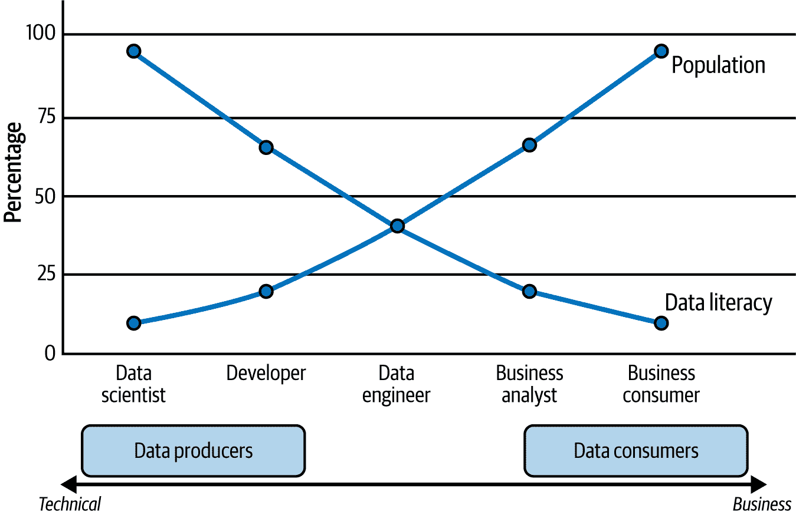
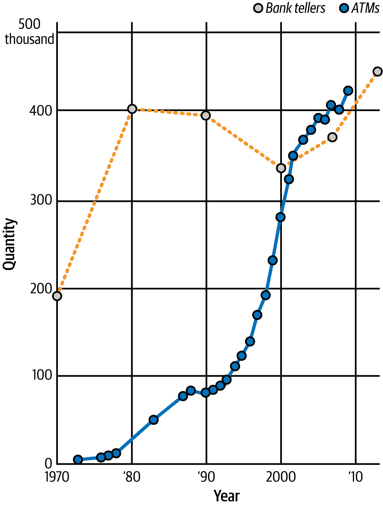
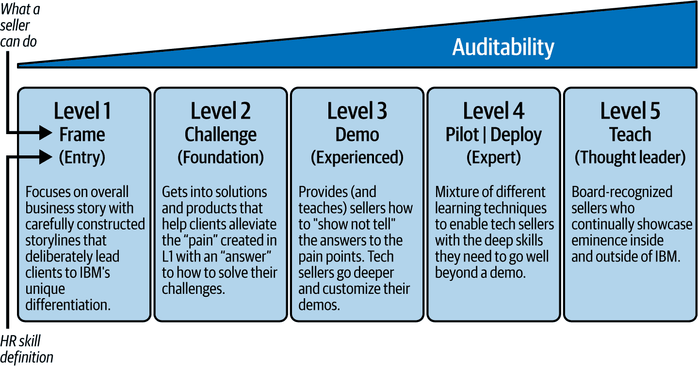
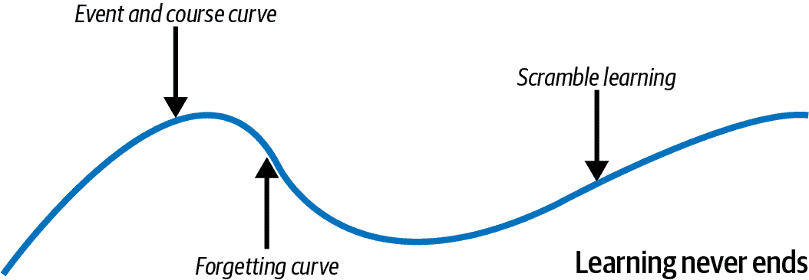

# 第六章．令人兴奋的技能

你可能会想跳过这一章，因为它并不是明确关于人工智能的。讽刺的是，这一章完全是关于人工智能的商业。痛苦的事实是，如果你没有正确掌握个人和组织的人工智能技能，你就没有机会在人工智能之旅上走得更远，这就是为什么我们把这一章放在这本书中的原因。

在我们的工作中似乎没有一次不遇到这样的问题：我如何保持我的技能敏锐以区别自己？我们如何保持我们组织的技能足够现代，以免落后？在人工智能技能提升方面，我是建造还是购买？（这是一个简单的问题，它开启了关于一系列主题的讨论，从技能提升计划到评估你企业的招聘策略。）

在第三章中，我们给你提供了一些关于人工智能说服的方程式。我们以另一个方程式开始本章（由保罗·W·奥斯蒙博士提供）：

+   **知识 × 努力＝成功**

它就像牛顿的第三定律（每一个作用力都有一个大小相等、方向相反的反作用力）：每一份知识，只要付出努力，就能产生一个相等且不可阻挡的力量，指向成功。但如果你只有知识而没有努力，或者只有努力而没有知识，你肯定会在你的技能目标上有所不足。这基本上是将物理学应用于人类的学习能力。

我们相信，当你读完这一章后，你将获得将技能优先级付诸实践的知识，无论是为你个人还是为公司。从这里开始，加上持续的努力（阅读这本书是一个好的开始，但只是一个开始），你将朝着个人和职业成功稳步前进。

# 让技能提升开始吧

在像 AI 这样前沿、快速、不断变化的领域，具备所需知识、技能组合和经验的员工是罕见的。在这个通用人工智能和代理时代，我们将看到对模型师、工程师、数据整理员等高度专业技能的需求迅速扩张。但这还没有结束。当涉及到完全改变你的业务运营方式（左移、右移、达到 AI+）时，还将有其他非常强大的技能因素在发挥作用——做对这一点或风险无法以所需的速度推动你的组织前进，以充分利用你的 AI 之旅。我们看到了许多公司购买技能（收购一家小型公司或进行大规模招聘）并将它们融入他们的组织，但这些行动并没有导致企业整体技能状况的企业级变化。为什么？要在通用人工智能游戏中繁荣发展，技能需要被视为整体组织能力，这样*每个人*都可以提升他们业务的一部分。这意味着还有其他与人才相关的因素在发挥作用，例如公司文化和组织壁垒，这些都可能在 AI 采用时造成重大问题。

为了让组织在未来能够繁荣发展，需要制定一个有意识的技能提升计划。如果你刚刚开始你的技能之旅，请不要慌张。本章将阐述一些思考，帮助你开始构建你的行动计划。

企业级技能通常可以归纳为几个主要类别：

+   业务关键技能（例如：对业务战略至关重要的技能）

+   职位特定技能（例如：部门、职业家族等）

+   核心软技能（例如：协作、设计思维、行业、沟通等）

+   技术技能（例如：在低代码环境中至少感到舒适，编码、模型构建等）

虽然这些都很重要，但本章的特定范围是技术技能。并且不要被误导，认为技术技能只需要你的开发者——在通用人工智能和代理的影响下，每个角色都将受到影响、改进和颠覆——对于非技术角色来说可能更是如此。

最后，亲爱的读者，为了繁荣发展，你需要一个强大的技能计划。这个计划包括所有技能的混合，但同时也明确校准以推动未来的技术创新。这不是一次性的培训课程，也不是在豪华的异地举办的为期三天的全员大会，这也不是你可以简单地通过招聘新职位来解决的问题。长期成功将需要一个计划、大量内容和动手环境，以及个人对提升技能的持续承诺。

好消息是，像任何创新一样，采用新技能可以映射到[创新采用生命周期曲线](https://oreil.ly/hY-hg)（也称为罗杰斯钟形曲线），如图 6-1 所示。

###### 图 6-1\. 创新采用生命周期曲线

在他们的 GenAI 旅程上取得进展的公司知道提升技能很重要。我们的客户参与观察得到了 Gartner 的《生成式 AI 早期采用者的经验教训》报告^(1)的验证，其中受访者指出，用 GenAI 技能提升现有员工是解决他们未来人才需求的最主要方法。更重要的是，这份相同的报告将 AI 提升技能对业务的重要性置于 AI 治理策略之上！这与我们产生共鸣，因为如果你不知道（根据第一章）你每天走过的问题，你如何用技术来解决（或改善）呢？

那你将如何规划自己的技能之旅？我们希望你能将这一章视为正确开始的基础。虽然早期采用者有很多关于技能重要性的说法，但说某事很重要和推动其发展是两件非常不同的事情。许多公司目前都在技能方面遇到困难。但有一点肯定能让我们团结起来（无论是早期采用者还是尚未采用者），那就是我们都经历过这些年来的一些技术拐点——随着这些技术拐点的速度越来越快，我们越来越擅长发现它们。

你之所以在读这本书，是因为你已经知道我们所知道的事情：这一代人工智能和代理性拐点是一个大问题！所以，如果你正在尝试制定更好的技能计划来支持你的 AI 倡议，或者你即将开始，这一章将帮助你。

说实话，我们还没有看到足够多的战略再培训行动——我们说的是企业、教育机构、政府机构等等。我们坚信，要真正掌握劳动力当前的技能水平，需要有目的性的行动。而且坦白讲，这在公共和私营部门中并没有得到应有的重视。事实上，波士顿咨询集团（BCG）的报告^(2)指出，只有“15%的领导者认为学习是公司整体商业战略的核心部分”和“只有少数公司表示他们有一个基于企业业务需求的技能差距预测的流程。”说啥呢？（重复的“a”不是打字错误，这是我们反应的一部分。）

此外，这份报告指出，只有 24%的受访者明确地将企业战略与再培训努力联系起来。我们直言不讳：组织！*停止*将提升技能视为成本中心——它是*终极价值创造者*。经过良好训练的开发人员或云工程师可以学习如何正确评估应用程序，预测他们将使用多少令牌；经过良好训练的市场营销人员将重新思考营销文案，并利用代理人工智能协助他们进行活动、资产设计、广告购买，并获取关于哪些举措正在推动有意义的互动的新见解；经过良好训练的销售代表将成为更具创造力和协作性的客户合作伙伴，并减少在内部准备和文书工作上的时间。提升每个人的技能的影响是巨大的——意识到是时候改变并决定推动变革？现在这就是领导力！记住我们之前的小贴士：技术容易，文化难。

###### 备注

在 IBM，我们对我们的顶尖销售员有一个特殊的认可，称为“黄金圈”。如果你做到了，你被认为是一个典范的执行者，始终如一地表现出对客户卓越的奉献和对交付卓越可衡量成果的承诺（这不仅仅是完成 100%的配额），这些成果推动了 IBM 的增长。奖励是为你和一位嘉宾支付所有费用的旅行，让你感觉像“权力的游戏”中的皇室成员，只是没有被人杀死的恐惧。我们收集了一些关于构成黄金圈销售员特点的统计数据。其中，一个跳脱出来的*最重要*预测是学习：黄金圈成员学得更多，完成他们的学习之旅（比他们的同伴更快），*并且*制定了他们自己的学习计划。这一点非常重要。正如你将在本章后面发现的那样，你必须雇佣那些好奇心强的人，因为正确提升技能需要企业技能计划和人们自己出去寻找他们需要的技能。但结论很明显——黄金圈成员有机会工作，因为他们显然很好奇！

# 通往 AI+之路需要跨多个角色扩展技能

为了有效地弥合数据素养的差距，组织必须赋予他们的员工便捷的教育、数据、直观的工具和针对其角色*定制*的实用应用的访问权限。这种方法显著减少了导航数据挑战所花费的时间，从而提高了组织的生产力和效率。

如果一幅图能说一千个字，图 6-2 就是本章商业案例的视觉总结（以及可能为什么你在读这本书）。

###### 图 6-2\. 数据素养与各角色人口之间的反向关系

注意图 6-2 左侧的数据科学家、开发人员和数据工程师；这些是在典型组织中最有数据素养的个人群体。他们拥有处理复杂数据并提取有价值的见解的技术技能，这对于明智的决策和战略举措至关重要。

向图 6-2 的右侧移动，注意数据消费者角色的转变；您可能知道他们是业务分析师和业务数据消费者。数据消费者可能没有数据生产者那样的技术数据专长，但他们的成功（以及业务的成功）越来越依赖于数据来支持他们的日常运营。我们在第二章中详细介绍了数据作为产品和信息架构（IA——它有助于人工智能）的原因，是因为这个群体包括公司营销部门、人力资源等部门的专业人士。这些角色需要高质量且易于访问和理解的数据，强调了强大数据管理和治理系统的必要性。

图 6-2 中不同角色之间的数据素养转变，表明了需要不同类型的数据访问和解释工具，因为并非所有用户在数据处理方面都拥有相同的专长。组织必须确保这些用户能够轻松地定位、理解并将数据应用于他们的工作中，从而减少在数据相关挑战上的时间消耗，并提高整体生产力。

# 人工智能——是工作破坏者还是工作创造者？

我们经常被问到这个问题，就像我们在本书前面所说的，我们认为人工智能是一个全新的蓝领工作创造者。有了这个观点，我们认为我们应该花一点时间阐述我们为什么这样认为，并提供一些例子，这些例子可能会在您对就业问题的担忧上让您感到安心。毫无疑问，我们将重申：不再有蓝领或白领工作。从锅炉房到董事会会议室，将只有新的蓝领工作，而且它们都将受到人工智能的严重影响。所以，是的，我们知道您之前已经听说过：人工智能不会取代您，但使用人工智能的人会。事实上，我们认为，如果您不提升您公司的技能，人工智能不会伤害您或使您失业，而是另一家公司将实施我们在本书中概述的技术。总之，当您考虑每个工作都将受到人工智能的影响时，肯定会有动荡。

技术拐点周围的焦虑并非什么新鲜事。让我们回顾一下 1589 年，正如我们在第三章中提到的，当时伊丽莎白一世女王拒绝授予机械编织机发明者专利，因为她担心这会让编织工失业。俗话说，事后诸葛亮——我们知道机械编织机帮助引发了第一次工业革命，这导致了爆炸性的经济增长和房地产扩张。现在让我们再回顾一下美国前总统伍德罗·威尔逊及其著名的 1907 年演讲，我们也在第三章中提到了。正如我们所说，这些担忧并不新鲜。

## 如果你不去提高你的技能，你只会被将军

1997 年，一台名为 Deep Blue 的计算机（IBM 生产的，毫不夸张）在象棋比赛中击败了加里·卡斯帕罗夫（可能是有史以来最著名的国际象棋大师之一）。这是著名的人机对决的开始。

卡斯帕罗夫指出，如果他也能立即访问到一个庞大的棋局数据库，他相信自己可以击败 Deep Blue（有传言称 Deep Blue 开始赢得比赛的那个棋局是一个错误，一个事故，但那超出了本书的范围）。虽然许多人将他的评论描绘为酸葡萄心理，但如果你理解人工智能，你就会理解他的观点。毕竟，人工智能是从观察中学习的...并且它从标记的观察中学得最好。他推理说，如果一个 AI 在比赛中能够访问到一个按需的标记棋局数据库及其结果，这对 AI 是公平的（它已经嵌入到 AI 的数据表示中），那么为什么对人类就不公平呢？

从卡斯帕罗夫的评论（以及他的努力）中，诞生了一个新的棋类类别，最终被称为骑士棋（一个变体是自由式棋），它类似于棋类中的综合格斗（除了没有腿锁，但你仍然可以认输）。在骑士棋中，参与者可以单独玩（仅人类），参赛者可以是人工智能（比如一所大学建立人工智能来自己下棋），或者混合（人类与机器结合）。

事情进展如何？大多数情况下，由人工智能增强的人类获胜。但这并不是一场屠杀。机器本身也赢得了它们应得的部分。你知道谁永远不会赢吗？仅凭人类自己。3 这意味着骑士棋是关于放大人类表现！

在他的书[*《棋手与计算机》*](https://oreil.ly/7PFYj)中，卡斯帕罗夫指出：“弱人类加上机器加上更好的过程优于单独的强大计算机，并且，更令人惊讶的是，优于拥有较差过程的强大人类。”

但还有转折：人工智能的出现并没有杀死棋类游戏。事实上，今天玩棋类游戏的人数比以往任何时候都多。当然，他们的兴趣也比以往任何时候都高；而且当然，Netflix 甚至制作了一部迷你系列剧，《女王的棋局》。你知道还有什么吗？今天的国际象棋大师数量是卡斯帕罗夫与科技对峙时的两倍多。而且许多孩子，不出所料，正在使用人工智能作为教练来帮助他们提高自己的棋艺。

因此，需要更多的技能和兴趣。在我们看来，如果人工智能可以帮助人们成为更好的棋手，那么它同样可以帮助人们成为更好的医生、律师、飞行员、电工、法官、瓷砖切割工、教师等等。这与电力的民主化有何不同？我们学会了将电力的好处应用到我们生活中的所有任务中；从开车到做饭到制作电影；人工智能不会有任何不同。

## 民主化技术：就业创造者

因此，确实会有工作替代——记住，我们说的是*净*创造就业机会。想想看——我们后悔冰箱的发明吗？但那取缔了冰块送货职业。底线是，人工智能将影响那些可重复和基于规则的职位，并创造出我们甚至还没有想到的职位。民主化的技术*总是*会为社会带来更好的变化。

银行业的一个例子让我们感到意外：自动取款机（ATMs）。当自动取款机首次出现时，我们都认为最终会有更少的员工和分支机构，因为不需要银行或柜员。简而言之，自动取款机会取代银行柜员。但看看图 6-3——这种情况并没有发生。想想看。自动取款机可以完成一些机械的日常任务：支付账单、将资金从一个账户转移到另一个账户、检查余额等等。为什么需要人类专注于完成这些机械的日常任务呢？

###### 图 6-3\. 自从自动取款机发明以来，银行柜员数量比以往任何时候都多（来源：詹姆斯·贝森，波士顿大学法学院）

如图 6-3 所示，如今柜员数量比以往任何时候都多，他们更专注于关系银行，而不是过去机械的工作。而且，由于自动取款机使银行业务运营成本降低，分支机构数量也比以往任何时候都多——当然，他们可能有更少的员工，但左移的任务使银行能够更好地专注于更有利可图和个性化的服务，如关系银行、遗产规划、信托和证券管理、财务咨询服务等等。

技术也创造了人们对更好方式的需求，或者人们认为他们不需要的方式。为什么这么多人没有意识到他们需要更好的方式呢？可能是因为他们没有意识到技术可以使它变得更好，因为他们没有具备知识甚至知道可以以不同的方式做事。但世界很快发现，通过拼车（其数字地图、数字支付和费用分摊等）确实有更好的方式，因此出租车行业也发生了演变。

这是如何发生的呢？如果您仔细想想，这些颠覆者的可用技术与那些既得利益者的可用技术是相同的，因为其中大部分是开源的。说实话，这项技术对任何人都是可用的。毕竟，当时很多人都有智能手机，数字支付已经成为一种现象，GPS 无处不在，因为每个人都可以从他们的智能手机中获得路线和天气信息。像 Uber 这样的公司将这些事物与一种新的向右偏移的商业模式结合起来，但它们的运营方式不同。他们不是等待出租车经过并招手，或者打电话给调度员，而是问：“如果我们允许人们通过智能手机召唤司机，并且完全透明地了解预期的等待时间、司机详情、车辆等信息，会怎么样？”不要忽视这个时刻。Uber 提出了不同的商业模式，人们非常喜欢它。这并不是技术本身的问题，而且（再次强调）这项技术对任何人（现在来了）来说都是可用的，可以用来停止每天走过他们可以用技术解决的问题或使其变得更好的问题。Uber 只是碰巧第一个这样做。如何做到的呢？Uber 使用了 Osmon 的方程式，将知识（技能）和努力相乘，并将其转化为成功。更重要的是，Uber 对零工经济的看法已经从拼车扩展到几乎任何家庭送货的模型。所以，就像我们说的那样，我们不认为 AI 会取代所有工作——但可以肯定的是，AI 将改变每个人的工作性质。

最后，我们还认为与您分享这一点是有帮助的，那就是我们非常喜欢阅读安德鲁·麦卡菲的《极客之道》（Little, Brown），因为它实际上提炼了 Uber 和其他数字颠覆者是如何做到的秘诀。当然，还有其他一些关键因素，比如文化和流程，也起到了作用，但毫无疑问，技能是突出的。

# 智慧的杠杆：解锁一个永久的技能计划

在本节中，我们将与您分享一些故事、想法以及我们在 IBM 如何将技能平衡转向我们有利的一边所做的事情。虽然没有什么会永远持续，但本节中我们分享的策略是稳固的，并且在多年的时间里，在成千上万的员工和合作伙伴中得到了验证。

我们确信你已经注意到，虽然这本书是由 IBM 员工撰写的，但它并没有专门涉及 IBM 或其技术。我们故意这样做。但本节将大量引用 IBM 及其在技能方面的所作所为。本章是与一位客座作者（Rebecca Reyes）合著的，她是一位在技能领域被行业公认的思考领袖，领导了公司历史上可能最大的提升努力。这就是为什么我们对本章中提出的策略充满信心——我们看到了什么有效，什么无效，并学会了如何适应。将我们的经验应用到你的努力中，并从中成长。

###### 备注

压力和适应是增长的秘诀。当然，肌肉上的压力与我们谈论的工作中的压力有很大不同。但重点是相同的——张力教导，它是任何反应和成长的催化剂。重复重建，将微小的缺陷转化为特性。

考虑到“举重最直观的效果是肌肉增长——也称为肌肉肥大。但驱动这种变化的机制是什么？一切始于你举起足够重的重量来挑战你的肌肉。这个动作会导致肌肉纤维产生微小的撕裂。这些微小的损伤触发了身体启动修复的生物学反应。这些科学过程通过在举重过程中创建新的、更强的肌肉纤维来替换受损的纤维，从而随着时间的推移导致肌肉增长。”^(4)

当谈到技能建设时，我们可能能给出的最大建议是，技能培训就像在健身房锻炼你工作的肌肉：它们在持续的适度张力下发展，通过举起和保持。就像健身计划一样，你首先需要做出承诺，然后用一个有目的、经过验证的计划来支持这个承诺——这次是技能。你或你的团队是否在挑战你的知识？你是否在定期练习——发现你技能、范围、故事、代码、逻辑中的小缺陷，然后留出时间来修复、学习、适应？你是否正在施加正确的张力（太多对身心或你的技能计划都不好）以促进成长？

我们将本章的章节组织在你可以拉动的杠杆周围，以提升你公司的技能并利用这个时刻。你会发现，本章不需要线性阅读……如果你觉得你已经掌握了某个杠杆，也许可以专注于那些你没有考虑过的。等你完成本章的学习后，你将找到几个可以查看和优化的领域，以利用未来的提升机会。

这里是我们的技能杠杆：

+   从一开始——雇佣那些想要知道“为什么”的员工。

+   招募有数字化思维的才能。

+   统计一下——盘点你的技能。

+   为每个人制定计划——没有行动的计划只是演讲。

+   欣然接受学习（和遗忘）的曲线。

+   结合指导、模仿和协作。

+   文化很重要——成为一个技能动词，而不是名词。

+   为人工智能设定组织基调

## 杠杆 1：从开始做起——雇佣那些想要知道“为什么”的员工

一个古老的谚语，“好奇心害死猫”，警告了挑拨和无限探索的风险。然而，在当今信息和技术民主化获取的时代，好奇心却让猫兴奋不已。因此，虽然本章将探讨一些企业项目和想法，以帮助提升你的业务技能，但永远不要忽视最重要的成分：*你所雇佣的人的天生好奇心*。无论你提到哪种角色；我们都管理过他们，或者见过他们。我们曾与那些在无人能练习或排练的方式中表现出才华的人合作。其他人则如此好奇，如果某件事对他们来说没有意义，他们就会上网寻找答案，迷失在某些课程中。在光谱的另一端是那些看待分配的学习，回来宣布，“这不是我的工作；我为什么要接受它？”或者“我不是销售；我为什么要学习我们公司如何销售我们的产品？我只是写代码，”以及所有介于其中的部分。雇佣天生好奇的人永远不会出错。简单地说，如果科技年就像狗年（或者像人工智能的老鼠年那样年龄更快），那么受过正规教育的工作人员所拥有的所有教育优势都将随着时间流逝而消失。

### 成为学习的莫扎特

有一个关于著名作曲家沃尔夫冈·阿马德乌斯·莫扎特的故事（关于这个故事有各种各样的说法和版本），他在六岁时就被认为是音乐天才。莫扎特不仅在他五岁时创作了他的第一首作品^(5)，而且还为两位皇室表演过。有一天，一位二十多岁的有抱负的作曲家来到莫扎特面前，对他说了一些类似的话，“我想创作交响乐；你能教我吗？”莫扎特看着他，说，“你不能学习如何创作交响乐；你还不够老。”那个人提到了他二十多岁，而莫扎特在创作他的第一首交响乐时只有十岁.^(6) 莫扎特（以其直接性而闻名，就像他的音乐一样）回答说，“是的，但我没有四处询问人们如何做这件事。”

问题的要点是什么？莫扎特回答的本质在于这样一个观点：虽然指导（学习计划）和向他人学习很重要，但真正的精通和能力来自内心。作为领导者，你必须找到一种方法，让你的员工超越寻求指示，转向寻求他们自己的知识实验。记住，你的组织将需要一系列规定性的旅程，但也许更需要的是论坛，这些论坛突出并鼓励这种天然的好奇心资源。

要真正将好奇心置于招聘流程的核心，确保你与人力资源团队的人才招聘团队合作，以便他们在招聘过程中密切关注好奇心属性。你将遇到不知道 GitHub 是什么的招聘人员；他们需要提升技能，以便知道如何超越简历或 LinkedIn 页面，因为候选人的 GitHub 往往是好奇心的名片。并且超越你业务所需的技能。例如，有一位候选人给我们留下了深刻印象，因为她不仅技术好奇心强、成绩优异，而且她还有一个蓬勃发展的社交媒体账户（@culinarychum），专注于那些出色地满足过敏症（如乳糜泻）需求的餐厅和超市中的优质无麸质产品。这是一个真正的 IBM 员工（Elena Márquez），她展示了我们喜爱的各种技能（除了她超强的技术技能）：社交网络（活跃，有个人观点——如果不仅仅是商业，那么将获得额外加分；这是了解任何申请者如何将好奇心应用于他们世界的好方法）、同情心、社区、写作、参与度等等。再次强调，我们共同监督了成千上万的员工，跨越所有领域，涉及数十亿美元的投资。你知道什么总是将旋转者和赢家区分开来吗？好奇心！*在当今经济中，工作需要技能，而不仅仅是学位*。

显然，并非所有员工都是新加入企业的。你需要授权你的管理团队去评估和观察好奇心，并启用自我驱动的技能培训。为这些员工创造时间，授权并投资于他们。他们会告诉你如何做：从外部培训、会议、社区志愿者工作——你的任务是帮助他们将点连接起来，形成与你的业务相一致的成长路径。他们想参加的那个会议——他们是演讲者吗？作为管理者或导师，你可以提供审阅他们的演讲提交表格或提供一个安全的空间来预览他们的提案——你的鼓励，甚至你简单的建议，可能是将某人从好奇的观察者转变为自信、热情的领导者的关键。例如，在 IBM，我们有让管理者可以使用他们的预算支付第三方培训费用的项目——从 MBA 到安全证书，再到演讲技巧以及所有中间的部分。如果外部培训不在你的预算范围内，也许灵活的工作时间表可以让你的员工自己投资于培训成本，因为他们知道你重视他们，并以其他方式（如带薪学习时间）对他们进行投资。

为什么对好奇心有这么大的争议？因为拥有好奇心的员工会找到他们需要的东西，或者来寻求你的帮助以获取它们。而且，好奇心强的员工是你在技能提升采用曲线上的领先指标——如果你能识别出你那些好奇心强的先锋所做出的最佳技能提升投资，你就可以更快地将这种技能提升扩展到整个组织，并将新技能传递给大多数员工。这是终极的定制化培训模式——即使是人工智能也无法超越。

## 第二杠杆：招募具有数字化思维的才能

既然我们已经指出人工智能技能的年份比人类年份老化得快得多，那么很明显，即使你雇佣了最熟练的人，你也需要继续对他们进行投资。因此，我们认为从一开始就招募具有数字化思维的才能非常重要。但我们想明确，这并不意味着人才需要拥有计算机科学学位：这意味着你寻找的是那些能够展示他们如何不断拥抱使事物变得更好、更快、更准确、更简洁、更高效的创新的人。

你可能已经知道非数字化思维的人才是什么样的。他们就是那些公开表示“我不懂技术”的人；他们可能点击“文件 $右箭头$ 复制”，然后点击“文件 $右箭头$ 粘贴”（一次又一次），而不是优雅地按下 Ctrl-C，Ctrl-V；他们用 PowerPoint 展示的仪表板报告中的图片已经过时一周；最大的线索是那些拥有 $1,500 美元 iPhone 但只使用 10% 功能的人（而且不知道这些功能）——比如使用人工智能从照片中抓取文本。这真的很重要，所以不要忽视它。因为如果一个人才具有数字化思维，他们总是会独立寻找更高效的方法来做事情，比如使用代理来完成更多工作。

###### 小贴士

高级小贴士：许多公司都有自己的首选招聘学校——有点像只招聘哈佛毕业生的律师事务所。把那个剧本扔出窗外吧。毫无疑问，一些学校比其他学校更难进入，他们拥有更多资源，但事实是人才争夺战是广泛的。你会对那些隐藏在常春藤联盟或知名学校表面之下的才能感到震惊。社区学院有很多惊人的才能，我们已经从那里招募了人才，并见证了他们事业的蓬勃发展。退伍军人通常能够很好地从部署过渡到就业，并带来丰富的现实世界经验和专注的纪律。只需去寻找人才！

在发布招聘广告时，要创造性地定义技能要求和岗位职责。你真的需要四年制学位的要求吗？或者这只是人才获取表格上的默认动作？如果我们只重视那些具有特定更高学位的人，世界就会错过像史蒂夫·乔布斯（苹果公司的联合创始人）、阿曼西奥·奥特加（Inditex 创始人，全球最大的时尚零售商）和安娜·温图尔（《Vogue》主编）这样的人。不要误解我们在这里所说的，学位是有帮助的指标，为学习获取和知识转移提供了一个无价的思维模型，但它们不是唯一因素……远远不是。

哈佛商学院的“隐藏工作者：未被发掘的才能”研究^(7)指出，“绝大多数（88%）的雇主表示同意，告诉我们，*合格的高技能候选人*因为不符合工作描述中设定的确切标准而被排除在流程之外。”看吧，如果你需要程序员，你希望知道他们之前是否编写过企业级的代码，但*永远*不要低估感激和努力的力量。底线是，今天的招聘流程工作流程往往过于关注简历或缺乏经验，而不是某人能为一个角色带来什么。不要陷入这个陷阱。培养一种动态的工作方式，促进成长机会，并远离那长长的要求清单，它让许多人无法得到这份工作，更不用说申请了。

你还希望仔细考虑使用一个 AI 驱动的工具来揭示候选人的技能和员工档案，以采用基于技能的招聘策略。正如我们在上一章中提到的，当使用不当，基于 AI 的招聘工具可能会造成比好处更大的伤害。但是，当谨慎管理并防范偏见时，它们可以用来建立一个机会市场，以支持内部职业流动性机会——按照定义，当人力资本转向新角色时，他们会学习新事物。何时是转换角色的正确时机？虽然一些高管喜欢给角色设定时间表（比如每 2-3 年换一次工作），但我们认为，如果你每天上班都不害怕任何事情，那么你可能没有在学习任何事情，这可能是做些新事情的好时机。简单地说，成长和舒适不能共存。因此，在一份工作中的任期不必与技能相关，但感到不舒服与技能增长直接相关。

## 第三级杠杆：盘点技能——评估你的技能

在本章的前面部分，我们提到了一份 BCG 报告，该报告指出，除了少数公司外，几乎所有公司都无法预测技能差距。想象一下，在没有温度、风速、气压等因素的情况下尝试预测天气。然而，大多数公司却在没有技能基准、差距分析和与未来增长计划相对应的战略路线图的情况下运营。

对于库存，从具体的技术技能开始，有明确的度量（级别），清晰地阐述员工能够做什么。库存任何事物都始于一个分类法和计数指标。人工智能也可以帮助*推断*技能，但在这里我们真的想发出一个警告：这个领域有很多“蛇油”人工智能。如果人工智能“猜测”某人的技能可能是什么，这不是问题，但我们认为它需要由人类（人机交互）验证。毕竟，如果人类同意人工智能的评估，你刚刚创建了一个标记数据对，正如我们之前提到的，这对引导模型至关重要。

有一些人认为人工智能技能评估可以处理所有事情，将这项任务左移给经理，因为他们太忙了。但他们忙的是什么？管理人们不是经理的工作的一部分吗？如果平均经理管理 15 个人，要求经理与他们的员工会面……并使技能对话成为每次互动的持续组成部分，这太过分了吗？为什么不使用人工智能来探测弱点，并询问他们的员工是否同意？有时人工智能会准确无误，有时则不会。以下是对公司最高层的一些免费见解：如果有人在谈论它，他们多少有点兴趣——如果他们衡量它，他们就表示了承诺，然后它就很重要。仅为此原因，经理应该经常与他们的员工进行技能对话。同时，你在忙于提升你的员工在人工智能方面的技能时，也要关注非 STEM 内容——人际和内省技能，通常被称为*软技能*——这些技能很重要，但很难衡量。

我们认为确保技能真实性的最佳方式是拥有一个中心库存分类法，该分类法在完成课程或活动（如飞行员或成功评分的练习投球给教练）后自动更新一个范围（例如，从一级到五级）。在 IBM，我们为我们的技术销售团队定义了一个五级技能库存系统，它看起来像图 6-4。

###### 图 6-4。一个清晰简洁的技能框架，具有不断提高的审计级别

这个框架有一些明显的模式，也有一些细微的模式。以下是我们设计的关键点：

硬技能需要经过严格的评估

我们喜欢自我反思，但在这个领域，我们认为自我评估调查不起作用（但话虽如此，高度合格的候选人应该能够进行测试）。它们有点像要求你的猫评价自己的狩猎技能——直到激光笔出现，她才是丛林的女王。

技术销售和销售都需要销售洞察力和技术能力

因此，第 1 级和第 2 级对于**技术销售**和**传统销售**人员来说都很常见，因为它们教育市场以及我们的价值驱动因素。第 3 级是“展示而非讲述”的级别。在这里，我们开始分叉——销售人员预期进行现场脚本演示，而技术销售人员预期根据客户的要求大幅偏离脚本，深入解释事物，并在一定程度上定制现场演示。而且，不要误解，我们有一些超级技术人才，其中一些人讨厌第 1 级和第 2 级。太好了！这可能意味着他们正在提升自己的业务价值技能。一些销售人员觉得第 3 级太深奥、太可怕，因为它现场进行，而不是播放视频。太好了！由于这些演示是根据“遵循说明就不会失败”的指南构建的，我们假设我们在使这些销售人员变得更加技术化。为了验证我们“不会失败”的声明，有时我们会让中学生完成第 3 级。这也成为了一些销售人员以“技术性太强”作为他们没有完成工作的理由时的绝佳反驳。事实上，他们缺乏努力。

达到更高的技能水平伴随着可证明的要求和对这些成就的审计性

当你达到更高的认证技能等级时，这些技能声明的真实性变得越来越像你可以下赌注的事情（稍后详细说明）。这不是你可以简单断言的，或者简单地参加一次讲座并声称掌握。事实上，恰恰相反：如果 1 级 + 2 级 = 知道，那么 3 级 = 展示，4 级 = 做，5 级 = 教。3 级和 4 级技能包括大量的实际操作和见证。通过这种方式，技能等级的提升留下了一条审计轨迹——学习者和企业可以将其作为成就的证据。这可以用来收取不同的费用（因为高级顾问通常收取比初级助理不同的费用）或为不同员工池的绩效支付费用（高级员工可以也应该要求更高的工资职位）。它还可以用来根据客户可能需求与公司内部能够提供的能力之间的比较来预测未来的招聘需求。我们的建议：抵制急于求成的诱惑（“我们有 100 名高级 AI 开发者随时待命！”）；相反，将其视为一个来之不易的里程碑，并确保追求的道路在挑战性和回报性上都是适当的——如果你这样做，当你看到达到标准的人们的赞誉时，对困难的抱怨都是值得的。而且记住，如果你将其设定为一个高标准，它将赢得尊重。但如果你让公司的其他部分渗透进低标准成就来增加技能等级（比如因为你参加了一个网络研讨会就获得了技能提升），你最终会稀释这个项目。

将我们的等级映射到动词（动作）上，以表明我们期望掌握该技能的人能够做到或知道

注意在图 6-4 中，在等级之下有一组动词。使用动词，我们知道如果我们有一个在日本的 4 级技术销售人员，他们可以去客户那里进行试点或部署平台。在 IBM，这意味着你相当深入：你知道如何部署软件；试点或基准测试该软件；并了解第 0 天、第 1 天和第 2 天的任务，等等。但它也给我们提供了一个共同的技能语言。当时我们并不知道，但这些动词的价值很快就在如何获得最高清晰度和方便客户、合作伙伴和 IBM 员工就个人能力进行沟通方面显现出来。现在，我们正在努力构建这个体系，以用于像沟通和价值传达这样的软技能。

与人力资源部门共同构建

我们认为公司没有在技能部门做得像他们应该的那样好，其中一个原因是因为他们认为这仅仅是人力资源的工作。但如果你真的想在这一点上做得很好，那就不能是这样。这必须是与领域专家的合作。确实，人力资源正在关注学习和知识（L&K），与公司框架的结合是至关重要的。我们为技术销售构建的框架是为了与 IBM 人力资源框架相连接。为什么？如果你负责开发，你可能希望有一些不同的动词。这让我们想起了惠普（HP）的戴维·帕卡德的名言，“营销太重要了，不能[仅仅]留给营销部门。”我们用“仅仅”这个词来软化这句话，以捕捉我们试图表达的观点。

每件事都有保质期

我们对此有细粒度的控制，但我们意识到你今天学到的知识可能随着时间的推移而需要改变。我们的徽章每年都会到期，我们可以让其中一些自动续费，因为变化不大，我们可能会给你一些新的增量课程，添加到你的计划中，以便你完成以保持你的证书（否则你将失去它），或者如果内容变化很大，我们可能会将其过期并重新分配。

### 调整你的层级

如前所述，图 6-4 展示了与我们的 IBM 技术销售和传统销售技能相关的不同层级。我们认为进一步细化这些层级会有所帮助，这样你就能更好地理解 IBM 技术技能框架的精确性，并将其应用于你自己的技能计划中。

第 1 级和第 2 级是关于何时和为何的基础。这些级别是关于价值和我们的市场进入策略。第 1 级从*界定*客户当前面临的企业问题开始，以及即将到来的前景。我们不想进行技术项目；我们希望进行左移和右移的业务价值项目。在这个级别，学习者专注于如何突出客户的问题点（不是询问...他们已经知道了），也许向他们介绍他们不知道的问题点（或者将要遇到的问题——比如可解释人工智能）。这就是学习者通过创造那种啊哈时刻，或者客户评论，“哎呀...我以前从来没有这样想过”（这种东西对客户来说纯粹是金子，因为这意味着卖家在传授知识，而不是推销零部件编号）。学习者通过编写一些开放式书籍测试（有点像 Coursera 课程）来通过这些级别。我们想确保学习者已经学过这些材料，并且知道当他们遇到遗忘曲线时该回到哪里（关于这一点稍后还会详细介绍）。在这些级别中，我们确信一些卖家“欺骗”自己，只是寻找答案（就像他们可以在 Coursera 课程中做的那样）。我们对此持开放态度。为什么？在某个时候，他们将在客户面前进行现场演示，并会感到恐慌。他们将急忙学习并欣赏学习过程——也许在下一次带来不同的观点。而且，坦白说，要擅长某件事，通常你首先必须做得不好，并通过痛苦来学习。当然，如果你是专家，你可以跳过这一课，但仍然可以从中受益于客户面对的材料，并且测试一下。我们相信这些级别有助于我们的卖家销售。如何做到这一点？还记得那些黄金圆环统计数据吗？（不用说，我们自己也使用这些材料。）

在第 3 级，卖家正在进行现场演示，阐述他们在第 1 级和第 2 级学到的价值驱动因素，并现在展示（不是讲述）技术。换句话说，这里没有 PowerPoint 幻灯片或营销资料：你正在多角度提示模型或生成合成数据...并附带价值解释。第 3 级需要经理的批准——这意味着如果有人“欺骗”系统，现在经理和员工都必须参与其中。

###### 注意

“演示”这个词被广泛使用，但我们想坚定地站在某个立场上，并希望你能跟随：演示意味着展示现场的东西。我们与销售领导者进行了（热烈的）讨论，他们发誓说解释一个视频和进行演示是一样的。这不是。客户可以从一英里外闻到这一点。现在，如果互联网背叛了你，有一个备用视频？这是一个明智的举动。但是以视频开头？不。想象一下：一个卖家走进来，大谈他们的“易于访问和易于使用的无代码平台，将通用人工智能带给每个人”，而不是真正展示它，他们只是播放了一个视频。没有什么比完全不使用它更能体现“易于访问和易于使用”了。

当您进入第 4 级时，您正在进行一些重型技术销售工作...这是大多数技术人员喜欢做的事情。如果 PowerPoint 讲述，演示销售，那么部署就会“融合”。这些级别受到那些发誓 vi（无处不在的 Unix 文本编辑器）是生产力工具和 CAPTCHA 是个好主意的人的喜爱。如前所述，您正在为客户执行第 0 天、第 1 天和第 2 天的任务，通常是在他们的机器或云属性上。那么，可审计性是如何提高的呢？嗯，客户参与是由我们的销售流程和我们的管理系统管理的（例如，试点是否成功？他们是否已经启动并运行？等等）。现在，如果技术销售员、经理（在 IBM 销售系统中签字确认工作）和客户（通过购买而不是抱怨工作没有做好来暗示工作已经完成）都参与其中...那么您就可以“作弊”达到第 4 级。第 4 级是动手和不动手学习的结合。第 4 级的作弊者不会持久。

最后，第 5 级描述了 Workday 在他们的超级碗 LVII 广告中正确地烤过的那些令人惊叹的人（真正的摇滚明星）...这些人每个人都能认识。为什么？他们是书籍作者和博主；他们是那些向同行传授知识的人，是客户点名要求或愿意为其写推荐信的人，是当遇到最棘手问题时人们会去找的人。我们不是“董事会批准”的粉丝，但第 5 级可能是有意义的。这些是技能的顶峰，其严谨性在于技能水平的明显性。您如何在这个级别上作弊？也许让您的父母和朋友匿名喜欢您的文章或播客？不确定...但有一个相当可靠的猜测，如果您在 IBM 遇到这样的人，您可以在 Google 上搜索他们，您就会看到他们为什么是一群备受追捧的才华横溢的人。

抽空思考一下您团队所需的技能深度。快速列出五个级别，用动词来展示每个级别更精细的理解水平和实现的结果。您的人力资源部门已经对技能级别进行编码了吗？如果是这样，这些动词与您的需求一致吗？您的技能可能与特定的产品或服务相对应，或者可能是工作家族中所需的更通用的行为。

现在，具体思考一下 AI 所需的技能——无论是采用、实验、构建还是其他方面。对于您公司或组织面临的机会，哪些技能家族最为重要？

记住，没有统一、全球接受的技能分类法——但无论您定义什么，都应该高度校准，并且可以通过您的组织进行衡量。

## 第四杠杆：为每个人制定计划——没有行动的计划只是演讲

在建立库存后，现在您转向制定技能计划。您需要在哪些方面进行投资，在哪些方面应该进行精简？

在 IBM，我们已经大规模地对所有员工进行了关于通用人工智能和代理的技能提升培训。这意味着有意识地审视那些我们期望作为公司增长驱动的关键角色，确保我们引进的新人才具备这些技能，同时指导我们的人力资源开发团队并行发展这些技能。

我们首先召集了负责这些角色的执行领导者，与他们合作，确定他们的成长需求与当前状态之间的差距（站在前沿——关于这一点我们稍后再谈）。如果你对当前员工的技能清单进行快照，并设定年底你希望达到的状态，那么中间的旅程又是什么？我们建立了一个混合了指定和自主选择冒险学习的系统。你需要建立每季度明确截止日期、进度标记和庆祝进步的学习任务节奏（这是另一个潜在的好处……人们——尤其是销售人员——为了赢得比赛会做些什么）。我们根据工作角色定制了所有这些……毕竟，你对于一个拥有 20 年经验的资深 AI 架构师和在一个数字销售职位上刚刚开始职业生涯的人的期望应该是不同的（尽管他们都应该对“通用人工智能究竟是什么？”这个问题有相同的答案——就像我们说的，第一级对每个人都是适用的！）。

在设定期望并配备好能够既站在前沿领导又分享团队进步的管理者后，我们转向高潮：创造一场运动。

在构建你的计划时需要考虑的一些事项：

+   你或你的企业需要讲述的从-到故事是什么？

+   最好的计划会将关键行动分散到一段时间内。在你需要做的所有事情中，什么是至关重要的和紧迫的？什么可以在更长的时间内完成？

+   谁是这个技能提升投资的执行赞助者？（他们*必须*参与——我们将在本章后面讨论那些只谈不做的高管。）

+   你将如何确保你的经理和领导者致力于提升自身技能，并优先考虑为员工提供提升技能的时间？

+   学习是如何分配的？谁在指导或设定里程碑？谁在挑选任务？

+   你将如何认可（并可能奖励）完成学习的员工？

+   学习工作是否有助于你的技能清单？

## 第五杠杆：拥抱学习（和遗忘）曲线

除了本书中一直提到的技术技能类比短暂的生命周期之外，当谈到技能时，你还得欣赏到的是*遗忘曲线*。无论是人的天性，还是不断涌入的新信息超载，或者是过去几十年人类注意力跨度明显下降（有报告称低于八秒的金鱼），我们都会忘记我们学到的大多数东西。在训练大型模型时，最大的挑战之一是 GPU 内存有限。当内存耗尽时，它们必须将数据卸载到 CPU 缓存中，当缓存也耗尽时，数据会转到系统内存，然后是硬盘...每一次卸载都会显著影响性能。你的大脑也不例外（除了你不会每年升级容量），这就是为什么检索那些你不太记得但知道你曾在某处看到的信息对于员工的工作速度至关重要（尤其是在销售方面）。

图 6-5 展示了作为*学习曲线*的过山车。拥抱它的每一个疯狂转弯，因为过山车比直线更有趣。我们在多年的经验中看到很多人没有欣赏这条曲线——未能注意到曲线上的不同斜率、下降和上升。

###### 图 6-5\. 拥抱学习曲线

正如每个人都知道过山车通常是如何开始的（以缓慢的上升开始），每个组织都知道学习曲线的初始部分：这是可选或分配的教育，旨在教员工一些东西。这里有各种各样的学习者；我们见过他们所有人。但是！无论你是谁，经过一周的长时间会议，或者一年中数小时的学习，每个人都会忘记一些东西。这是过山车的一部分（称为*下降*），在这里重力接管，那种令人胃部不适的坠落开始。对于学习者来说，我们称之为*遗忘曲线*。就像过山车一样，当进入学习下降阶段时，可能会发生两件事：他们可能会兴奋地举手拥抱它（有一个行动计划——曲线的快速学习部分）或者出现你的椒盐卷饼和可疑口味的冰沙（也就是说学习丢失了，但不是以令人厌恶的方式）。底线是，如果你负责技能，却忘记为你的团队配备应对遗忘曲线的工具，那么对你或你的公司来说都不会有好的结果。

莱斯利·瓦利亚特指出，“教育的关键特征之一是它能够传授在传授时无法预见的有用知识。”我们称这是学习曲线中的“混乱学习”部分——这就是高质量内容生产者成为英雄的地方。这就是你的销售人员需要回到过去的学习中，以获取他们需要的部分，以及他们不可避免会忘记的部分（但在为客户会议或电话做准备时的疯狂冲刺中完成）。看，你可能知道如何通过提示来提高生成式 AI 的效果，但你可能需要复习一下如何使用微调或低秩适应（LoRA）适配器来更好地微调你的 LLM 以完成当前任务。也许你只需要复习一下 DevSecOps 的定义。我们发现，在混乱学习阶段，销售人员有很多爱可以给予，而在事件和课程部分，你只能得到一些爱，但你也会因为任何分配的学习而得到一些抱怨和呻吟。

我们提出这一点，是因为你需要让你的学习模块化，以便在需要的关键部分能够轻松跳回。同时，你还需要教会学习者如何成为自己救援的一部分——知道在哪里找到学习中的作弊码，并在恰当的时间用适量的知识来刷新自己。元数据在这里也很有帮助。如果学习是由学科专家（SMEs）提供的，那么捕捉课程大纲、笔记和关键要点，以便学习资产可以在以后的时间集中访问。教会学习者如何找到这些内容——为应对紧急情况而铺设的线索无疑会带来感激之情。

如果你提供给员工的只是视频学习，你需要有字幕，将视频模块化成章节，并在其上应用一些生成式 AI，以便学习者可以通过请求跳转到他们需要记住的部分。例如，如果学习者想要重新掌握提示技巧，大型语言模型（LLM）可以生成链接到那些位置。更好的是：LLM 根据请求组装了一个 30 秒的总结，涵盖了 3 小时生成式 AI 课程的所有覆盖领域，并有一个热链接的目录表，指向视频中被拼接在一起的部分——可以将其视为提示调整的高光集锦。现在再提高一个档次，让 AI 索引并生成一个与卖家（扮演客户）的对话。经过大约四到五个问题（例如，“向我解释将我的数据放入模型中的价值，以及风险”），它会在关键指标上返回一个成绩单（答案质量、术语使用等）。这对于紧张的销售人员来说，在无评判区的私密环境中建立信心是一种很好的方式。也许可以使用 AI 制作类似谷歌笔记本 LM 所做的材料播客。这里有很多想法（代理将其提升到另一个层次），并且它们都会吸引学习者的注意，因为它们不同、引人入胜，并提供时钟速度。

这不是未来。IBM 的 watsonx 平台实际上为高尔夫最大舞台（大师赛）生成粉丝要求的精彩集锦，以及自动生成的解说，这些解说映射了你最喜欢的球员的击掌、小鸟球、柏忌和推杆，这些推杆让球员陷入困境，没有任何条件、理由或推杆的机会。真的！说出球员的名字，AI 就会进行一回合比赛（通常持续四个多小时——过去就是这样）并创建一个三分钟的视频，将其浓缩成你想要的内容（在这种情况下是球员的精彩集锦）。

## 第六杠杆：结合指导 + 模仿 + 协作

莱斯利·瓦利亚恩特因其在机器学习和计算机科学领域的开创性贡献，于 2010 年获得了图灵奖。然而，在撰写本文时，他最新的书籍根本不是关于计算机的，至少不是关于 1 和 0 的。*《可教育性的重要性》*(普林斯顿大学出版社)认为，理解我们自身的可教育性对于保护我们的未来至关重要。在分析我们如何处理信息以学习和应用知识，并与其他动物和人工智能系统进行比较后，瓦利亚恩特解释了为什么教育应该是人类的核心关注点。如果我们想发挥我们物种的巨大优势并保护我们的共同未来，我们必须更好地理解和优先考虑可教育性的重要意义。

瓦利亚恩特进一步论证了人类吸收和应用知识的非凡能力，以及人类大脑的“可教育性”可以理解为一种信息处理能力。他认为，我们的可教育性是我们物种与众不同的地方，使我们能够拥有今天的世界——这赋予我们力量和潜力，使我们的星球走上稳定的发展道路。（回想一下我们在序言中分享的史蒂夫·乔布斯的名言，观点高度相关。）然而，他也警告说，这伴随着一种隐秘的弱点：虽然我们可以轻松吸收关于我们自身经验世界之外的整个思想体系，但我们却难以正确判断我们应该信任哪些信息。他是人工智能的奠基人之一，他强调我们人类大脑学习、挑战人工智能创造的内容以及创建能够持续提升我们社区技能水平的系统的独特能力。我们同意。

让我们进一步探讨。美国发展心理学家和比较心理学家迈克尔·托马塞洛认为，人类通过模仿、指导和协作的组合学习效果最佳。很可能这就是你童年学习的方式——作为一个孩子，观察周围的人并模仿他们的行为，然后进行更正式的学习，最终与同龄人共同工作，达到你现在的状态。这可以远远超出童年早期。

在 IBM，我们为我们的销售专业人士遵循一个类似的模式。我们首先围绕一个平台（可能是一些关于如何与客户互动的基本期望）进行一些正式培训，然后接下来是一个观察期，销售员通过一些方式如陪同销售、跟随销售电话、参加关键会议等来学习。学习者（尤其是新员工）有机会与管理者、同事和人工智能一起在一个对他们来说感觉安全的空间中尝试和实践想法——所有这些都会产生反馈和指导，这些都是体验中的关键组成部分。

### 为了 Lady Gaga 的“鼓掌”——要么全力以赴，要么就别做

让我们从借鉴好莱坞的一些帮助开始，确保你在今天的人工智能气候下领导一个组织时至少记住两件事：技术技能的半衰期与其他事物不同，你必须亲自参与其中。

实际上，你的年龄并不重要，几乎每个人都知道某个版本的影片，*《星语心愿》*。这部电影于 1937 年上映，每隔大约 20 年就会出现新的版本。无论你记得哪个版本，它们都带来了同样的普遍故事：成名、爱情和悲剧——所有这些都围绕着一个正在崛起的人，而那个人的恋爱者和导师角色正在走下坡路。2018 年版本由 Lady Gaga（正在崛起的那位）和布拉德利·库珀（正在走下坡路的那位）主演，是吸引我们注意力的翻拍版，尤其是在技能方面。

虽然你可能知道这个故事，但你可能不知道布拉德利·库珀在电影*《星语心愿》*中扮演并演唱了你所看到的一切，都是现场与音乐巨星 Lady Gaga 一起完成的。为什么？因为*Lady Gaga 要求这样做*（非常尊重）。为了这部电影，库珀花了超过 18 个月的时间学习声乐，6 个月学习吉他，6 个月学习钢琴。他还致力于降低自己的声音等。总的来说，布拉德利·库珀花了近 3 年的时间来为这次翻拍做好准备，而这部电影只用了 42 天来拍摄。

这意味着什么？对于世界上最优秀的演员之一来说，要掌握他的时刻并应对挑战，他投入了数年时间，并聘请了声乐、吉他、钢琴、导演和其他多项技能的教练。为了成为他原本不是的人，他需要相信最终状态愿景，并拥有能够引导他实现这一目标的培训和指导。换句话说，如果世界上最成功和最受欢迎的演员相信了足够的事情，以至于愿意花那么多时间来提高他在 42 天内拍摄的电影翻拍版的技能，那么你认为你的组织在技能姿态方面应该集体做些什么呢？

### 构建沙盒——鼓励混乱

你通过亲自动手来学习。如果你想提升众多人的技能，那么在制定任何计划、清单和学习日程之前，你必须有一个可以无障碍实验的地方，一个可以练习的地方。这意味着，如果你想启动一些 GPU 来构建一个用于计算机视觉项目的传统人工智能卷积神经网络（CNN），那就去做吧。你应该能够启动一个像 Chroma 或 Milvus 这样的向量数据库，尝试不同的编码算法，看看你的语义搜索会发生什么。也许你想连接到一个数据库，创建一个模式，并尝试使用像 Iceberg 这样的开放表格式进行测试，看看它的隔离级别。是的！

这与此相关联的是一些成本。我们的建议：让好奇心成为指导。创建适合学习的正确大小的模式，而不是迷失在无数小时的用户费用内部流程中。你不需要给某人一个 128 节点的数据湖来学习如何存储和准备数据供人工智能使用；他们可以用 3 个节点来完成任务。记住，这些不是试点或概念验证，它们是学习机制。鼓励你的员工利用所有可用的免费试用软件——这是一种很好的学习方式。超大规模计算提供免费和轻量级服务：Google 通过其 Colab 平台慷慨地提供 GPU 周期，IBM 提供一系列轻量级云服务，你可以在其中免费构建人工智能应用程序，DeepLearning.AI 也有一些很好的免费资源。现在看看内部。你可能会建立一些自己的训练“堆栈”，让人们可以“玩耍”。不要只是提供技术——考虑使事物更具吸引力。例如，渥太华大学与 IBM 和为退伍军人编码（感谢 Jeff Musson）合作建立了其网络范围，学习小组从黑客（演员）的一个实际电话开始，一个扮演安全运营中心（SOC）人员的学员接起电话，戏剧就开始了。非常酷！

如果你使用外部网站，**不要**使用你的数据或客户的数据，并且**小心**注意条款和条件（包括我们在第五章中讨论的反馈条款）。如果你无法访问数据，要知道实际上有成千上万的数据集可以用来进行任务练习。如果你想找到一些数据，可以查看 Kaggle、Data.gov、Papers With Code 等。

至于那些花费你公司金钱的东西，这也很好。围绕它制定安全措施。像 Turbonomic 这样的应用资源管理（ARM）软件可以识别并停止浪费的资源，而使用像 Apptio 这样的技术业务管理（TBM）软件堆栈可以帮助你向业务线传达成本。在 IBM，我们已经将大部分沙盒集中到一个我们称之为 IBM TechZone 的中央学习和演示中心，并在 [*ibm.com*](https://ibm.com) 上分享了其制作的大量信息，这样任何构建自己的沙盒的人都可以从我们的成功和失败中学习——我们当然都有我们的一份（幸运的是，前者比后者多）。如果你有机会在 IBM 会议中听到 John Steiner 的演讲，不要错过！他不仅是一位引人入胜的演讲者，也是云交付和配置的大师——我们让你自己决定他的干巴巴的极客幽默是否好笑，但你会从他那里学到很多东西，至少会笑一次。

### 展示（并庆祝）那些数字资格证书吧！

在许多国家，在新的驾驶员获得他们的驾驶执照（他们的资格证书）之前，他们必须接受一定量的培训，记录一定量的实践时间，通过书面考试，并在现场场景中成功地向有执照的测试管理员展示基本技能。这段旅程，成千上万的人都知道并走过，对于任何新驾驶员来说，通常是一个备受期待但又令人恐惧的成年礼。同样，一级方程式赛车手、潜在的宇航员和战斗机飞行员都在高度技术和校准的模拟器中投入了大量的时间。即使是训练马拉松的业余跑者也收集了他们在练习跑中的数据流，以努力完善他们的节奏。在毕业到重大日子（获得驾驶执照、首次体验太空飞行或是在听到“开始”以开始马拉松之前），有实践和反馈。现在，是时候问自己了，“这是你自己的职业训练计划的一部分吗？”

无论是内部管理还是由像 Credly 这样的第三方机构管理，徽章计划对于增加你的技能投资的诚信和严谨性至关重要。再次提醒，在这里要小心行事：有一种诱惑是在微不足道的旅程结束时颁发徽章；这使得它们变得陈腐，降低了它们的价值。要具体说明什么使徽章成为徽章，并坚持这一政策。

## 级别 7：文化很重要——成为一个技能动词，而不是名词

在你将任何计划付诸实施之前，领导层必须决定在技能提升方面使用动词，而不是名词。我们见过很多次（甚至在 IBM 内部；没有哪家公司能幸免）：有些领导者通过行动来领导，而有些则只是发表一些口号，但仅此而已。结果正如你所预期的那样：通过行动来领导的领导者，他们的团队了解他们的领导者的价值观（并理解）他们的工作和流程，因为他们自己亲身经历过；那些以口号文化而非实质内容来领导的人会发现参与度下降，执行变成了一场猜测游戏，而不是有指导的专业实践。在我们领导的组织中，我们有一条规则：我们**绝不**要求人们去做我们不愿意做或尚未做过的事情。例如，如果我们要求你测试你的知识或参加一门课程，我们也在报名参加这个测试或课程——我们可能已经完成了它！说实话，当你这样领导时，像面包屑一样在人工智能上留下真正的见解（仅足够激发好奇心），会让员工想，“等等，他们是怎么知道的？我错过了什么？”这种知识会让人想要提升水平，不是因为必须如此——而是因为他们也想成为秘密的一部分。员工很快就能识别出冒牌货，最终这些领导者会像那些不断出现在真人秀节目中的过气运动员和名人一样，没有人记得他们最初为什么出名。但情况也有相反的。你是一位领导者，而你的员工必须跟上你在生成式人工智能方面的技术技能吗？现在想象一下，如果你是一位在要求每个人这样做之前就已经学习过一些内容的执行官。这是对“我没有时间做这项学习；我很忙”这类抱怨的最佳预防措施。我们建议的回应不是玩一个谁更忙的游戏。要谦逊。这个回应是完美的：“我们都很忙，当然没有人比其他人更忙。但我找到了时间去做它，因为这对我们的集体成功至关重要。我真的希望你能成为我们集体成功的一部分，我认为这是每个人都需要开始的地方。”

###### 注意

我们已经提到，最佳员工是那些热爱学习且好奇心强的人，但这里值得欣赏的不仅仅是表面上的东西。您的技能提升投资不仅对员工的成功至关重要，而且对他们的保留也至关重要。您的顶尖学习者会知道，他们投入的技能越多，他们的技能包就越满——而且在这个航空公司没有超额费用！事实上，无论他们是在寻找新工作、寻求晋升还是要求更高的薪水——因为技能稀缺，他们的现有技能组合以及他们发展这些技能的意愿都会发挥作用。携带多个技能包的人会迫使雇主想出办法留住他们，因为他们非常宝贵。这确实很讽刺。事实上，通过这种技能提升的投资，您可能会拥有一支拥有当前所需技能的劳动力队伍，以及一个停留时间更长、工作更努力的才能库，因为他们重视您对他们所做出的投资。在科技公司的任何主要招聘论坛上快速搜索 Reddit 评论，可以迅速显示出哪些公司培养了一种重视并投资于学习的文化，哪些公司没有。有趣的事实是，这对员工流失率有高度相关性。

最后，再培训应该定位为一个针对整个人的定制化成长机会。说实话，我们写这本书的每一个人，从我们职业生涯的开始就订阅了这个理念。无论我们的成就对别人来说是山还是坑，它们都是基于“学习永无止境”的理念，以及投资于组织的技能提升不仅成为竞争优势，而且成为生产力放大器的信念。成为一个持续培养技能的园丁，以实现最大影响。

## 第八杠杆：为人工智能设定组织基调

您需要为人工智能设定组织基调。这包括与每个人分享贵组织的 AI 战略*。*别忘了包括必要的护栏，什么合适什么不合适，什么合法什么不合法，什么有风险等等。

与员工保持透明度是关键，因为许多人会认为你们的举措是针对他们的工作的。提醒他们，那些习惯使用人工智能的人将会取代那些不使用的人。解释随着例行任务转移到左边，他们的工作可能会如何改变。例如，一个负责处理失败的部门调动或回答关于产假的国家（或省）之间（或省与省之间）的问题的人力资源员工，将会有更多时间帮助经理制定一个更高效的入职策略，让新员工更快地为业务做出贡献。

人们的感觉也很重要。你希望创造发展机会和反馈循环，开始对话，将担忧等公开化。文化杀手之一是人们在饮水机旁（虚拟或现实）所说的话以及他们的感受。我们见过很多次，当你没有（以及当你有）面对它时会发生什么。相信我们，成为一名伟大领导者的部分就是*消除恐惧*。消除恐惧是解决问题的关键。提升员工技能是对他们的邀请和投资！如果你认真对待，你就在他们中间——脆弱地分享你所学到的以及你在过程中遇到的挑战。

最后，使用 AI 生成的讨论主题支持下的数字检查，促进关于上述所有内容的对话和互动。从那里，你可以使用 AI 来分类情绪，创建讨论，并开始你的恐惧消除计划。你希望确保员工感觉他们在学习、期望以及他们所需方面有积极的角色。但同样重要的是，将这一切集中在一个地方来分享反馈，采取建议的行动，并安排经理检查。你可以做的最重要的事情是确保每个人都有相同的机会；但不可避免地，根据那些充满活力地拥抱这一时刻的人和那些坐着只是凝视的人，会有不同的结果。

# 案例研究：IBM 的技能挑战——CEO 提问；我们全体响应

挑战：利用一套核心培训材料，提高 280,000 人的 AI 技能。提供对 IBM 新 watsonx AI 平台和产品的动手培训访问权限。让它变得有趣。

2023 年 8 月，应我们 CEO 阿维恩德·克里的要求，我们创建了 watsonx 企业技能挑战——简单地称为*T*he Challenge。挑战鼓励所有 IBM 员工提出应用、工作流程、助手或任何东西……所有这些努力都是为了制定将 AI 投入使用的引人入胜的用例。注意，这不是想法？很容易让一大群人告诉你他们想要什么或认为 AI 能做什么。但这是*非常*不同的方法。我们希望人们构建这些应用程序并获得*动手*经验，因为我们（再次）正在大规模提升员工的技能；简而言之，我们希望他们停止每天走过他们可以用技术解决或改善的问题，并采取行动。

IBM 员工可以个人参与，但大多数人，包括我们的 C 级领导层（记得用动词，哦），都组成了团队——超过 10,000 个团队！这有利于将人们聚集在一起（某种程度上是自然形成的，大型面对面冲刺活动在那里进行，团队会聚集在一起面对面地产生一些来自面对面互动的意外魔法）。你有一周的公司时间来工作于《挑战》，并且几乎所有的计算资源（在合理范围内；我们不允许人们从头开始构建自己的 LLM）你都需要。而且随着大多数公司都在试图找回办公室，这提供了一个非常非政治化或争议性的有力理由来聚集在一起。

进入《挑战》的先决条件是完成指定的培训，其中包括一个“站立并交付”的环节。借鉴我们的销售和咨询培训实践，我们要求 IBM 的每个人都不仅学习新一代人工智能的新故事，还要展示能够就其进行对话。

###### 注意

虽然讨论公司（有时具有争议性）的回归办公室政策及其潜在可能性超出了本书的范围，但《挑战》是人们出于自愿聚集在一起并取得共同成果。挑战并没有要求人们必须亲自工作。实际上，一些团队来自不同的地理区域。但许多团队进入实验室并与他们以前从未见过的人一起工作……创造了新的社会联系，这有助于解决未来的问题，引入新的导师关系、新的工作机会等等。如果你是管理团队的一员，正在努力让人们回归办公室，这个挑战是一个很好的方式，不仅能够提升大众的技能，还能提供一个有力的理由让人们亲自相聚。试试看！

有各种各样的奖品可以赢取，从 IBM watsonx 周边产品到通过我们的 Blue Points 计划（一种内部 IBM 货币，你可以用它购买几乎所有东西）的实物商品，甚至还有与关键 IBM 员工共进晚餐的机会（这些晚宴的影响比我们想象的要大得多——团队非常喜欢这个机会）。2023 年的《挑战》非常成功，我们又在 2024 年再次举办了它。

结果如何？一句话：史诗般的。在 2024 年，我们 160,000 名员工（占我们员工总数的 60%——记住，这是自愿的）在我们的公司最新的人工智能产品上进行了培训，更自信地分享我们的信息，并在世界各地的国家和地区唱着同一首歌。这一次，他们创建了一个由 30,000 个团队组成的社区，每天产生了 800 万次推断（这是指让 AI 做你要求它做的事情，术语叫“nerd talk”），他们共同提交了 12,000 多个原型项目以供评估。除此之外，还有 50,000 多个工作负载的现场测试，以及超过 8,000 页的功能请求、功能增强、可用性改进、弹性测试、错误报告和新用例，这些都在 IBM watsonx 品牌产品的广泛套件中被识别出来——将技能增长项目转化为生产力乘数。太棒了！而且经过这一切（这就是为什么我们在本章中讨论它），88%的 IBM 员工对“你在这次挑战中是否提高了你的 AI 技能？”这个问题给予了高度评价。

两次我们运行挑战赛（我们甚至让它变得可重复，让我们的一个 VAD（虚拟助手）为他们的生态系统合作伙伴运行），最终我们得到了成千上万的精彩想法。我们挑选了最顶尖的十几项并给予奖励，其中一些甚至完全投入生产，彻底改变了 2025 年许多 IBM 员工的工作方式。以下是一些获奖示例：

+   一个获奖项目是为网站可靠性工程师（SREs）设计的：随着应用程序被容器化并演变成微服务和作为服务（FaaS）组件，你不再真正构建应用程序，而是从离散的业务逻辑片段中组合它们（提醒：现代化应用程序景观所需的思维方式与从+AI 过渡到 AI+的思维方式相同）。今天，这些片段通常分布在不同的领域（不同的超大规模计算平台、云和本地），它们共同构成一个单一的应用程序。这些片段可以短暂运行，通常在不到一秒内完成。虽然敏捷开发很棒，但它对 SREs——那些保持系统运行的人——来说变得有些可怕。这个获奖项目使用 AI 存储了一个常见问题的答案库。我们这里不是在谈论 FAQ 的喷洒和祈祷方法，我们在这里谈论的是针对当前任务的相似性搜索。（还记得我们在第二章中提到的女王和 System of a Down 乐队的歌曲推荐吗？）在此之前，这个 SRE 团队每周花费 116 小时回答常规问题……今天，这不到 2 分钟，因为 99.98%的问题都被转移了，让深度专家继续工作，而那些遇到的问题则得到了几乎瞬间无摩擦的答案。有人来唱一下“左移”主题歌吗！

+   另一个团队希望更好地记录他们的代码，以便新加入代码库的人能够理解。他们有成千上万的文件，所以选择了二十几个作为试点，并开始使用人工智能来总结文件开头代码块的功能。每个文件由代码助手总结大约需要 12 秒。现在，早期专业招聘的员工可以使用 watsonx 代码助手与代码库进行“对话”，并立即获得关于代码块如何工作以及它应该做什么的摘要。想象一下，如果你是一个新加入代码库的人，你可能会问：“你是如何确保关键服务的可用性的？”然后你会得到一个概述，告诉你这是任何连接的常见客户端重试逻辑，这是心跳检测，直到问题被宣布还有几秒钟，等等。所有这些都在代码中，但任何接管代码库块的人都知道，文档是那些优先级较低的事情之一。问问任何开发者，他们会告诉你他们是如何记录代码的，当你去查看它时，你会看到以下内容：`*# TODO: Add documentation to this block*`。这些都是我们在第四章中讨论的开发者用例的一部分。

正如你所见，IBM 在《挑战》项目上投入了大量的资金。我们认为，由于这个项目，参与者对我们客户来说变得更加有趣。有趣的是，我们交谈过的员工告诉我们，他们也觉得自己的就业市场竞争力更强了。当然，我们不希望他们离开 IBM——但那些投入《挑战》项目的员工显然发现了那个秘密拉链，它扩展了他们的技能包，以便在决定去其他地方时能装得更多。但正如我们常说的，我们员工的职责是每天来上班，并在那一天尽自己最大的努力（这可能会变化）。我们的工作？给他们一个每天来上班并尽自己最大努力的理由。我们认为，构建一些东西并充实你的技能包是每天来上班的好理由，这比工资（虽然很重要）更有意义。

# 最后的话

有些人肯定会觉得，一旦你让人们变得更有效率，你最终就会需要更少的人。正如我们提到的银行出纳员，*在历史上这实际上是不正确的*。想想看：如果你更有效率，这意味着你相对于竞争对手有自然的经济优势，这意味着你会得到更多的工作，这意味着你需要更多的人。我们认为，有时人们会忘记这一点——他们从零和思维模式出发，认为这是一个零和游戏。所以，是的，某些角色可能会缩小，因为你不需要那么多人来做这些工作（比如，电子邮件回复或电话），但随后可能会转向构建更多应用程序或数字销售等等。

因此，将会有一个转变——是的，第一个桶减少了，每个人都关注这一点，但毫无疑问，第二个桶正在装满新的工作、工作流程和新的工作方式。AI 不仅仅是生产力的提高，或流程的减少，或取代人的自动化，或是对抗竞争对手的保险政策。通过创建一个技能提升的清单和计划，你正在为你的劳动力提供技能，并且随着时间的推移，将使你的组织开放于新的、不可预见的创新和效率。

即将到来的创新可能会彻底改变你的行业或创造一个全新的市场。这是整个高级领导团队都可以并且应该支持的投资回报率。这就是为什么（可能对你来说有些意外）我们在书中花费了大量时间在人工智能技能培训上——而且在这个过程中，不要仅限于技术或销售团队，你的努力必须更广泛地推广到整个企业，到每一个业务线。你准备好提升一些学习了吗？

^(1) Gartner 研究，“生成式 AI 早期采用者的经验教训”，2024 年 8 月 22 日，[*https://oreil.ly/I14sQ*](https://oreil.ly/I14sQ)。

^(2) Sagar Goel 和 Orsola Kovács-Ondrejkovic，“你的战略只与你的技能一样好”，波士顿咨询集团，2023 年 1 月 26 日，[*https://oreil.ly/h0-9F*](https://oreil.ly/h0-9F)。

^(3) 2005 年 11 月 21 日波诺马罗夫与弗里茨（计算机）的比赛是人类在正常象棋锦标赛条件下对抗顶级计算机的最后一场已知胜利。我们在句子中使用了“从未”，因为想想自 2005 年以来 AI 发生了多大的变化，以及其执行能力的提升。因此，我们看不到这种情况再次发生。

^(4) “举重背后的科学：它如何影响你的身体”，美国举重协会，2024 年 2 月 9 日，[*https://oreil.ly/helTm*](https://oreil.ly/helTm)。

^(5) 他的作品被称为“G 大调小步舞曲 KV”。在[YouTube](https://oreil.ly/qR4WV)上收听。

^(6) 莫扎特的第一交响曲是“E♭大调交响曲第 1 号”。在[YouTube](https://oreil.ly/p5JLD)上收听。

^(7) Joseph B. Fuller 等人，“隐藏的工人，未被发掘的才能”，哈佛商学院关于管理未来工作项目，2021 年 9 月 1 日，[*https://oreil.ly/a9Iy5*](https://oreil.ly/a9Iy5)。

^(8) [Workday 摇滚明星商业广告](https://oreil.ly/T94ql)——如果你不想看视频，将出色的员工称为摇滚明星可能会激怒真正的摇滚明星。
