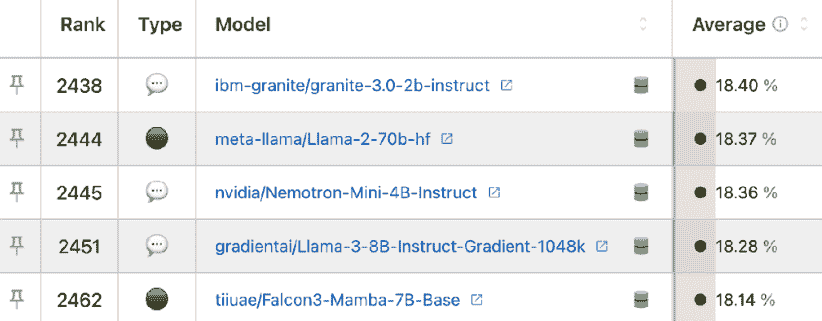
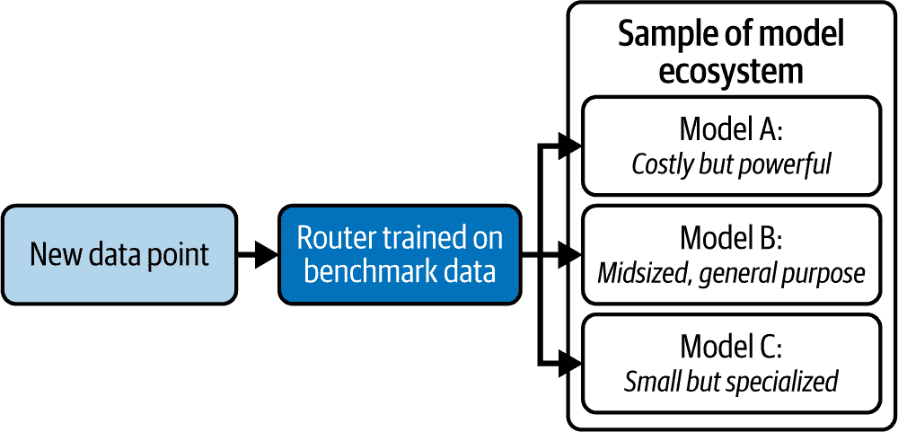
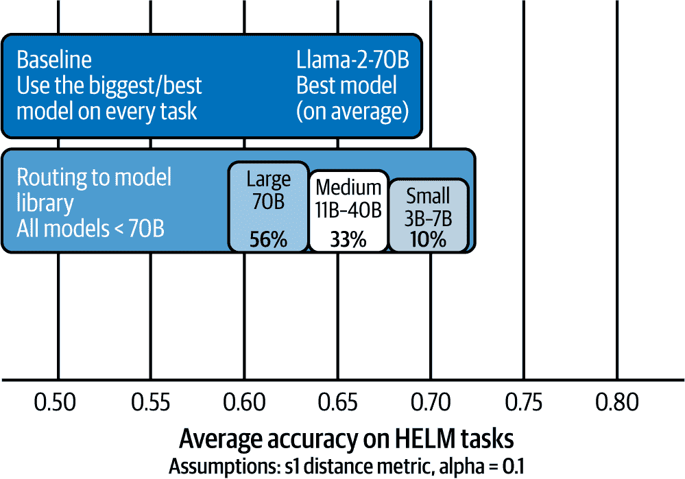
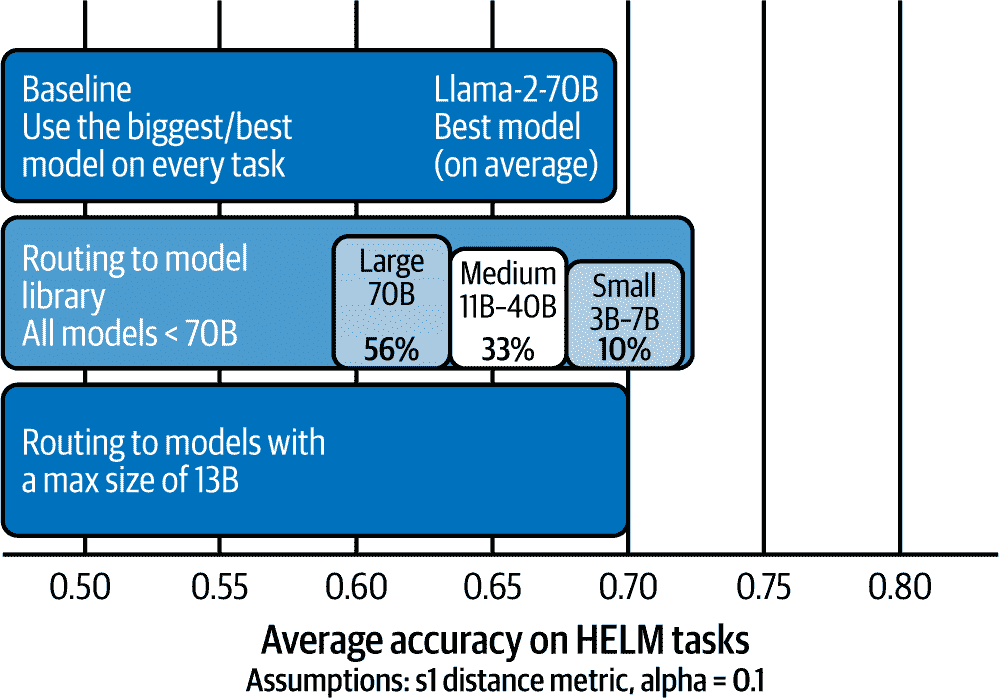
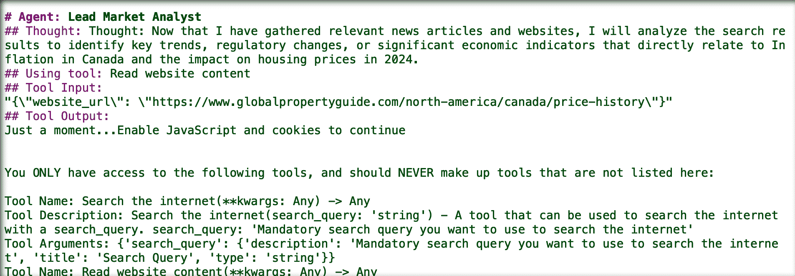

# 第七章\. 这项技术将走向何方——一枚戒指将无法统治一切！

你能放置这个咒语吗？

> “一枚戒指，召集众人，
> 
> 一枚戒指，寻找他们，
> 
> 一枚戒指，召集众人，
> 
> 在黑暗中束缚他们。”

如果你是一个真正的托尔金迷，你的精灵耳朵可能竖了起来；否则，我们将告诉你这是 J.R.R. 托尔金标志性作品《指环王》和这枚戒指铭文的基础，它赋予佩戴者控制一切的能力。（纯粹主义者会指出，赋予力量的不是铭文，而是关于索伦的讨论，但我们就此打住；就像我们说的，狂热者。）全面统治。抛开所有邪恶不谈，一个疑问浮现在眼前（可能是因为 ChatGPT 的炒作，向世界介绍了通用人工智能）：是否只有一个单一的大型语言模型能够统治一切？

揭秘警告：我们完全不这么认为。甚至相差甚远。正如你在本书中较早了解到的，仅在 Hugging Face 上就有近 150 万个（在你阅读这本书的时候可能更多）模型。我们也确定（假设你到目前为止是线性阅读这本书的），你能够轻松地阐述价值用户和价值创造者之间的区别，你理解人工智能伦理和数据溯源。简而言之，你理解为什么一个模型不可能统治一切...但我们在这里将为你提供一个更完整的关于“为什么”的答案。这始于这样一个事实：即使在推动最高性能前沿模型的 AI 实验室中，我们也在看到从创新单一模型执行任务，到赋予一个模型和技术的系统协同工作并完成任务的变化。在本章中，我们希望将你的注意力引向市场上正在发生的事情，以及哪些趋势和技术创新正在推动通用人工智能的未来。从小型模型快速创新，到模型内和模型间路由，再到代理系统令人兴奋的进步，我们相信永远不会有一个模型能够统治一切。

# 越大越好，对吧？也许一开始是这样，但那已经是很久以前了

跟随本书的主题，虽然科技年像狗年一样衰老（1:7），而通用人工智能（GenAI）的年就像老鼠年（1:30），这使得 2018 年在 GenAI 年份中已经超过两个世纪——那已经是很久以前了！2018 年发生了什么？OpenAI 发布了仅 117 百万参数的[GPT-1](https://oreil.ly/IBZTG)。

作为他们向通用人工智能（AGI）的探索的一部分，OpenAI 已经构建了越来越强大的 GPT 版本（一些达到万亿参数），每个版本都能执行更多任务。

###### 注意

通用人工智能（AGI）不应与通用人工智能（GenAI）混淆。GenAI 是一个工具。AGI 是将这个工具发展到其能力与人类认知能力相匹配，甚至超越它们，在广泛任务上的目标。我们还没有达到那里，也许永远也不会，或者也许它比我们预期的来得更快。但当我们谈到 AGI 时，想想大型语言模型（LLMs）展示并超越人类智能的情况。

最初，似乎推动模型性能提升的主要途径仅仅是增加模型的大小。正如表 7-1 所示，在 GPT-1 和 GPT-3 之间，OpenAI 发布的模型大小增加了超过 10,000 倍！GPT-3 之后，OpenAI 完全停止发布模型大小，但据传言^(1)，GPT-4 和 GPT-4o 模型在某一点上总参数量超过了一万亿！随着这些模型变得更大，它们也变得更贵。小型模型通常每 1000 万个输出标记的成本不到 0.25 美元（或者如果你能在笔记本电脑上使用 Ollama 等框架，则是“免费”）。相比之下，大型模型更贵。例如，我们最后一次查看时，OpenAI 的 o1 成本约为相同数量的输出 60 美元.^(2) 无论你支付的价格如何（这个领域的价格变化与技术一样快，大多数情况下是好的），高性能的小型模型在商业上有很多意义。

表 7-1 显示，随着 GPT 系列模型的发展，世界见证了这些模型所能实现的能力的显著提升。

表 7-1\. 随着时间的推移，OpenAI 的 GPT 家族

| OpenAI 模型名称 | 参数 | 值得注意的有趣之处 |
| --- | --- | --- |
| GPT-1 | 117 million | 这是“原始版”。它比一些之前的技术更好，但最终只是某个即将变得巨大的开始。 |
| GPT-2 | ~1 billion | 这个模型开始产生一些有趣的补全，并证明自然语言处理（NLP）存在不同的前景。它远远达不到你最初在 ChatGPT 中体验到的水平，但它在新闻中因撰写关于独角兽的故事而获得了一些关注.^(a) |

| GPT-3 GPT-3.5

GPT-3.5 Turbo | ~175 billion | GPT-3.5 是 ChatGPT 首次亮相背后的初始模型。与 GPT-2 相比，发生了两个重大变化。它被设计为遵循指令（而不是简单地预测句子中下一个最可能出现的单词），*并且*它们在上面添加了用户界面。无需多言。GPT-3.5 还作为一个更高效、轻量级的版本发布，称为“Turbo”。 |

| GPT-4 GPT-4 turbo

GPT-4o

GPT-4o mini

GPT-4.5 | OpenAI 在 GPT-3（其参数数量为 1750 亿）之后停止发布参数数量。各种博客建议 GPT-4 有大约 1800 亿参数。| 他们的第四代模型提供了更多的功能和多模态能力。在本书发布时，GPT-4o 被认为是 OpenAI 的“旗舰”模型，而 GPT-4.5 刚刚发布。在我们印刷时，GPT-5 还没有发布，但许多人预测它将在 2025 年中旬左右出现。|

| OpenAI o1 OpenAI o3 mini | (见上文。) | 这些推理模型被视为一个独立的项目，而不是 GPT 核心家族的一部分，它们被训练在回答之前产生长链的思考，这使得它们能够解决更复杂的问题。预计这种能力将被合并到 GPT-5 中。 |
| --- | --- | --- |
| ^(a) 请参阅 [OpenAI 网站上的故事](https://oreil.ly/1JZ6W)。 |

这引发了一个问题，你的业务是否真的需要所有这些容量？即使是 OpenAI 也已经开始创建更小、更高效的模型版本。对于每个主要模型发布，都有一个更高效、成本效益更高的替代模型的并行发布。GPT-3.5，遇见 GPT-3.5 Turbo；GPT-4o，遇见 GPT-4o mini。

在本书发布时，OpenAI 发布的最新推理模型是 OpenAI o3 mini。虽然 OpenAI 最初承诺发布 OpenAI o3，但他们后来暂停了发布，并宣布 GPT-5 将引入一个结合 OpenAI o3 和 GPT 模型系列最佳功能的 AI 系统，Sam Altman 分享了“简化我们的产品组合”和“回归魔法统一智能”的目标^(3)。

总结本节内容，即使在那些通过规模创新而闻名的前沿人工智能实验室中，我们也看到了以将多个模型结合在一起为中心的创新和路线图，这些模型作为一个系统来推动“统一智能”。

尽管普遍认为在模型大小方面越大越好，但有许多令人兴奋的创新使得小型但强大的 LLMs 成为可能。因此，出现了“小型语言模型”（SLMs）这一术语。虽然没有精确的定义，但 SLMs 通常指的是参数数量通常少于 130 亿的 LLMs。在某些情况下，SLMs 已经达到了 100 多亿参数的 LLMs 的性能。

# 小型语言模型的兴起

描述 SLMs（小型语言模型）现象的最简单方法可能是，模型提供商在训练方面变得越来越擅长。以案为例，当我们的研究团队在 2023 年 7 月首次接触到 Llama-2-70B 时，他们对它能做什么感到惊讶。仅仅一年多后，根据 Hugging Face 的 Open LLM v2 领导板（见图 7-1），他们仅使用 Granite 的 20 亿参数版本就能实现*相同甚至更好的*性能。

###### 图 7-1\. 从 2024 年 2 月 Hugging Face 的 Open LLM v2 排行榜中截取的模型性能快照

这再次只是任何事物学习曲线上升的自然益处的一部分；正如我们的电动汽车（EVs）行驶得更远、充电更快一样，我们每隔一年就能在手机上获得更多的像素和摄像头镜头，我们的电视也越来越薄，提供商在训练模型方面积累了更多经验，新的创新使它们更加高效。

在接下来的几个部分中，我们想要与您分享一些高度竞争性 SLMs 崛起背后的有希望的战略，特别是数据整理和模型蒸馏。

这两种策略都围绕着用于训练和微调 LLMs 的数据展开，这并非巧合。我们与许多人交谈时，常常感到惊讶，因为模型尺寸的缩小往往更多地源于训练数据的创新策略，而不是模型架构本身的技术创新。请别误解我们在这里想要传达的信息。架构的创新确实正在发生。事实上，我们就在本章中介绍了一些令人兴奋的架构进步！但是，当我们看到 SLMs 如何以惊人的速度崛起（它们在 2022 年 11 月 ChatGPT 发布后一年内就取得了这样的成就）时，影响因素是显而易见的：*数据至高无上！* 我们会详细讨论这些基于数据的发展趋势，因为在第八章中，我们将向您展示模型提供商今天用来创建 SLMs 的相同技术，您的公司也可以利用企业数据来区分和创造价值。

###### 注意

所以，这里是关键：您拥有数据。您能够访问的数据根本不属于这些 LLMs。为什么？因为那是您的企业数据。我们可以向您保证，许多 LLM 提供商都想要它。事实上，99%的企业数据没有被抓取并吸入 LLM 的原因，是因为您没有将其发布到互联网上。因此，您需要做出一些选择，我们在这本书的前面已经讨论过，我们将在下一章深入探讨。您将在我们第二章中讨论的数据价值交换连续体上处于什么位置？您是打算将其拱手相让，让他人从您的数据中创造不成比例的价值，本质上*使您的数据*成为*他们的**竞争优势*，还是您打算*使您的数据*成为*您的**竞争优势*？这正是本书的主题。而且，这一章和下一章将帮助您看到这一点。

## 数据整理导致 AI 救赎

好吧，我们承认，你可能知道这一点。即使你没有机器学习背景，你也可以断言，精心制作大量高质量的训练数据可以对模型的表现（或者任何分析项目）产生巨大影响。

但是，对数据整理的重视是 SLMs（小型语言模型）之所以表现出色的一个重要原因，这与早期 LLM 的初始理念直接相反：尽可能多地获取杂乱、未清洗和未结构化的数据，并重新利用它来为 LLM 提供动力。实际上，当涉及到商业 LLM 时，需要做出妥协。Transformer 技术使得能够使用大量相对杂乱的数据来创建 LLM 成为可能，但数据质量越高，模型质量也越高。问问自己，你是否拥有大量针对你关心的商业领域的高质量、专业化的数据。当然，你有！现在你准备好加油了，因为数量、质量和专业化是三个关键的数据整理成分，这些成分有助于 SLMs 的兴起。

### 数据量

对于给定模型大小，多少数据是最优的？这个问题一直是人工智能研究社区研究的主题，因为正如你可以想象的那样，训练一个大型语言模型（LLM）与环境成本和财务成本非常高。因此，早期模型提供商的初始重点是尝试优化性能，同时最小化他们为模型训练所承担的前期成本。这个优化的关键部分是定义应该向他们正在训练的模型整体大小中添加的每个额外参数引入多少语言数据（回想一下，这本质上是一个单词的一部分，一个完整的单词，甚至是一个标点符号）。这些比率——在科学文献中通常被称为*缩放定律*——定义了你需要多少数据来扩大模型的大小。

在他们 2020 年的论文中^(5)，一组 OpenAI 研究人员提出了每 1 个 LLM 参数应该使用 2 个文本 token 进行训练的观点。这个 2:1 的比例被称为*Kaplan 的扩展定律*（我们猜测“Kaplan 等人”的扩展定律听起来并不那么好）并且随后被用来训练 GPT-3 和 BLOOM（这两个模型都是 1750 亿参数大小，并在 300-3500 亿个文本 token 上进行训练）。2022 年，Google 的 DeepMind 发布^(6)了一个关于最佳扩展比例的替代观点，称为 Chinchilla 扩展定律。（这个定律也被称为 Hoffman 的扩展定律，以首席研究员的名字命名；Chinchilla 是 DeepMind 发布的一系列模型。）DeepMind 的研究人员认为，OpenAI 大大低估了优化训练 LLM 所需的数据量……他们认为，为了在给定的计算预算中获得*最佳模型性能*的最佳扩展比例是 20:1，而不是大约 2:1 的比例。他们继续使用这个扩展定律构建了一个 700 亿参数的 Chinchilla LLM。它表现如何？在仅仅 700 亿参数的情况下，Chinchilla 的表现比 GPT-3（1750 亿参数）等更大的模型要好得多。回顾过去，我们认为 Chinchilla 有点像是 SLM 的“原始”（正如孩子们说的那样——这是俚语，意为原始）。这个模型仍然相当大，但它不是一个巨大的三位数十亿参数模型，或者更大。

研究社区的初始目标集中在定义扩展定律以优化他们模型的固定前期训练成本。但是，关于模型生命周期中其余部分的持续边际成本怎么办？一个超级大的模型在托管和推理方面将更加昂贵。猜猜谁会承担这些成本？没错，就是你！为了降低这些成本，你需要减小模型大小。为了在保持性能的同时减小模型大小，你需要使用更多（高质量）的数据。

这正是 SLMs 受到如此多关注的原因。由于推理和托管成本直接转嫁给模型消费者，因此反应有些滞后。但随着 GenAI 从一种好奇心转变为部署的技术，模型提供商开始优化他们的训练设置，使其尽可能推理高效，而不仅仅是训练高效。

为了创建推理效率高的模型，在比 Chinchilla 扩展定律所设想的数据比率更高的数据上训练模型可能是成本效益的。在本书付印时，科学界尚未就推理最优模型的通用扩展定律达成共识（也许永远也不会），但有一些令人信服的行业例子表明，这些非常高效的 SLM 是在比 Chinchilla 或 Kaplan 的教条所建议的更大数量的数据上训练的（我们在表 7-2 中展示了这些扩展定律随时间的变化）。

2023 年 2 月，Meta 开源了其 Llama 2 模型系列，该系列在约 200 亿次训练数据上进行了训练（在当时，这被认为是一大批数据）。在 Llama 2 系列中，70 亿规模的模型几乎有 300:1 的缩放比率！到 2024 年 8 月，随着 Llama 3 的发布，Meta 加倍（实际上八倍）投入并发布了 Llama3.1-8B 模型。这个模型在超过 1500 亿次令牌上进行了训练，具有近 2000:1 的数据密度比率，并且比 Llama 2 系列表现出更高的性能。⁷ 感觉到趋势了吗？Meta 保持其 SLM 的大小几乎不变，但仅通过在更多数据上训练，就显著提高了性能！

表 7-2\. 随时间变化的缩放定律

| 日期 | 训练令牌/参数数量 | 缩放定律 |
| --- | --- | --- |
| 1/23/20 | 1.7 | Kaplan |
| 3/29/22 | 20 | Chinchilla |
| 2/1/23 | 286 | Llama-2-7B |
| 8/1/23 | 1875 | Llama-3.1-8B |

事实上，在随该发布版本附带的论文《Llama 3 模型群》中，Meta 引用了其 405B 参数的旗舰模型，该模型也是在约 1500 亿次令牌上训练的，从训练角度来看，“大约是计算最优的”，但较小的模型则是“训练时间远超过计算最优”。结果是，这些模型在相同的推理预算下比计算最优模型表现更好。⁸ 简单来说，虽然这些较小的模型训练成本更高（在更多数据上训练时间更长），但在推理时间上效率更高。结果是？今天，Llama 3 模型是可用的最受欢迎的开源模型之一，我们预计到 2025 年左右，Llama 4 将同样受欢迎。

将这个问题带回到 SLM 上：当模型中每个参数需要超过数百个数据令牌的数据比率时，推理优化的模型和 SLM 开始意味着同一件事。拥有一个大型、推理优化的 LLM 几乎是不可能的。考虑到数据获取成本和世界上可用的数据量，这些数据比率对于支持训练推理优化的、参数规模达数百亿的 LLM 来说成本太高。我们真的没有足够的数据。

当我们何时达到数据上限，这是一个真正的问题？今天的模型是在超过 1500 亿次令牌上训练的，但要达到这个水平，模型提供商基本上不得不挖掘整个互联网。正如你将在下一节中看到的，我们不需要大量任何类型的数据，我们需要的是大量**非常高质量**的数据，这甚至更难获得。

### 数据质量

你能想象没有加芬克尔只有西蒙的《Cecelia》这首歌吗？还有，如果 Hall & Oates 没有在歌曲开头用 1980 年代键盘和滑稽的胡须组合来完美地尖叫“我已经覆盖了浪漫？你只需按下播放按钮？”（是的，年轻的读者们...那时候我们不得不按下实际的笨重物理按钮），他们还能让任何人的“Kiss on My List”成为热门吗？（是的，年轻的读者们...那时候我们不得不按下实际的笨重物理按钮。）尽管我们在音乐上有些过时，但不仅难以理解如果没有这些搭档，这些歌曲会多么出色，同样难以将数据量的影响从数据质量的影响中分离出来，在 LLM 中也是如此。质量和数据以及高性能高效的模型是相辅相成的...就像 Simon & Garfunkel 和 Hall & Oates 一样。

现在，如果你认为互联网上只有可信的数据，互联网数据没有偏见、粗话、仇恨、谎言或愤怒...没有这些，那么你可能可以停止阅读这本书了。这种信念就像每天吃一加仑冰淇淋，然后想知道为什么牛仔裤在只洗冷水的情况下会缩水。当涉及到 GenAI 时，这个谚语仍然适用：垃圾输入，垃圾输出！现实仍然如此：你能做更多的事情来整理用于训练你的模型的数据（无论是确保大量数据还是高质量标记的示例），你就能将更多性能打包到你的模型中。虽然有一些提高训练后模型性能的技术——比如检索增强生成（RAG）等，但这些技术都受益于高质量的数据起点（稍后还会详细介绍）。

微软公开表示，数据质量在使其（当时）最先进的（SOTA）27 亿参数的 Phi-2 SLM 中发挥了关键作用，在某些基准测试中，其性能超过了 25 倍大小的更大模型。但你可以看出，在 Phi-2 之前，微软就已经嗅出了这条前进的道路，因为它通过一篇题为“Textbooks Are All You Need.”的研究论文^(9)向世界介绍了其前身（Phi-1）。在这篇论文中，微软描述了“高质量数据甚至可以改善 SOTA LLM，同时大幅减少数据集大小和训练计算。”同样，人类从清晰呈现的教科书中学习得更好，微软的研究结果支持教科书质量训练数据“清晰、自包含、指导性、平衡”，这会产生性能更好的 LLM，并展示出更好的扩展规律；当然，这也使得 Phi-2 这样的 LLM 在规模和性能上成为（当时）的 SOTA。在本书出版时，微软刚刚发布了其第四代这种 SLM：Phi-4。与 Phi-1 和 Phi-2 类似，微软将“改进数据”（以及其他训练进步）列为 Phi-4 相对于其规模实现强大性能的核心驱动力之一。[Phi-4](https://oreil.ly/he3Nf)。

虽然我们在本书中之前已经讨论过这一点，但由于高质量数据对于 SLM 至关重要，我们认为有必要在此重复强调。虽然许多模型提供商对用于训练 LLM 的数据量是透明的，但*非常少*的提供商对用于训练*他们*的 LLM 的实际数据来源是透明的。实际上，如果你问最受欢迎的 LLM 提供商他们使用什么数据来训练他们的模型，他们要么无法告诉你，要么告诉你这与你无关，对此你应该回答，“但这是我的业务！”*

核心问题是，最高质量的数据集是那些由人类编写并拥有版权的长篇教科书或其他非虚构书籍，而不是中等星级或以上的 Reddit 帖子和其他自由形式的信息来源。高质量的数据工件并不是放在公共网站上，自动化爬虫可以收集的网页内容的通用快照。许多流行的 LLM 背后令人不快的真相是，它们包含了许多最佳质量的数据集（例如，我们在第五章（ch05.html#ch05_live_die_buy_or_try_much_will_be_decided_by_ai_1740182048942635）首次向您介绍的 Books3^(10)语料库）仅可用于模型训练，因为这些数据集被非法复制并发布，没有得到作者的许可。再次强调，我们的一些前期辛勤工作被吸入了多个 LLM 的内部深处，供所有人利用，也让其他人从中获利。我们没有选择权。甚至没有人询问我们；这只是一场意外。虽然我们并没有提起诉讼（我们并没有写一本像《大数据的五十度灰》这样的畅销书，它从货架上飞走，好莱坞还想要将其拍成电影），但有许多人的生计和业务差异化被“窃取”，以制作出你很可能也使用过的 LLM。这一切都回到了我们在“如何消费 AI：成为价值创造者还是价值使用者？”（ch02.html#ch02_how_do_you_consume_ai_be_ye_a_value_creator_or_a_1740182046163502）中讨论的价值交换问题。

透明的数据收集和整理政策可以确保您为业务评估的 LLM 没有从非道德来源的数据中获益。结论是？在评估 SLM 时，数据整理对于驱动性能至关重要（且不考虑法律后果），对模型背后的数据来源有高度的认识是至关重要的。提出问题。要求回答。

### 领域专业化

作为你这样的周末运动员，你发现自己在家，脚踝给你发出了混合的信号——它要么是在为即将成为热门的真人秀节目“你认为你扭伤了脚踝吗？”试镜，要么只是因为扭伤而夸张地表现。无论如何，它都需要冰敷和关注。现在，你必须弄清楚发生了什么。为了做出这个判断，你会问你知道的最聪明的人，还是会问医生？（不要厚颜无耻……我们知道有些人可能大声说，“我知道的最聪明的人*就是*医生。”）虽然你知道的最聪明的人可能有跨越诗歌、化学、哲学等多个领域的惊人才能，但你最好还是问医生，如果他们专攻骨科就更好了。那位医生的诗歌技能无关紧要；当手头的问题具有专业性质（你可能骨折的脚踝）时，询问专业专家比询问普通专家更重要。

结果表明，这一点对 SLMs（自监督语言模型）同样适用。而且，你很可能已经注意到了（因为这是本章的一个部分），越来越多的证据表明，在*特定*任务上评估时，较小的、专业的模型可以与较大的通用 LLMs（大型语言模型）相媲美，甚至超越它们。当我们说一个专业的模型时，我们真正指的是在大量*特定领域*数据上训练的模型。例如，在 2022 年底，斯坦福大学的一个团队宣布了[BioMedLM](https://oreil.ly/QrqbE)，^(11)，这是一个在生物医学文献数据上训练的 27 亿参数模型。当在评估美国医学执照考试（USMLE）问题时，BioMedLM 的一个微调版本比同样微调的同等规模的非专业模型（GPT Neo）表现好了 17%。当与一个 44 倍大的未调优模型（Meta 的 Galactica 120B 模型）相比时，BioMedLM 几乎表现好了 6%。但关键点在于 Galactica 是否适合当前的任务；与 BioMedLM 不同，Galactica 的大小使得微调它成本过高。仅 2.7 亿参数的微型 BioMedLM LLM 展示了它能够在保持专业优势的同时，也允许进一步的定制以进行微调。这是 GenAI（生成人工智能）中领域专业化影响的一个非常早期的例子，但这些例子已经开启了一个针对特定用例的专业化模型研究和应用的大领域。

###### 注意

尽管在斯坦福的基于医学的基准测试中似乎表现良好，但 Meta 的 Galactica（专门设计来帮助科学家）在科学界引起了巨大的轰动——直到它突然崩溃并在线下线，仅仅在通用可用后的三天。公开实验揭示了众多偏见、毒性和幻觉的例子，导致了科学上的胡言乱语。这就是为什么充分理解我们在第五章中讨论的内容非常重要。

在“低资源”领域，专业化可能特别重要，这些领域的数据量并不多。例如，在第四章中，我们告诉你们 IBM Z（大型机）运行着世界上大部分的交易。在 LLM 的术语中，被归类为“低资源”的是那些为训练 AI 系统提供的数据非常少的领域。正如你可以想象的那样，COBOL 被认为是一种“低资源”语言，因为今天几乎没有公开领域的、值得企业使用的 COBOL 数据，尤其是与 Python、SQL 和其他流行的编程语言（是的，大量的业务逻辑是用 SQL 编写的）相比。但有很多 COBOL 代码正在运行业务——最关键的部分。事实上，路透社估计^(12)，今天有超过 2300 亿行 COBOL 代码——支持着超过 30 万亿美元的贸易——正在企业中积极运行。

###### 注意

为了清晰起见，IBM Z 支持现代应用程序开发工具集和方法，如使用 Jenkins 和 Zowe 的完全自动化的持续集成/持续部署（CI/CD）管道、Kafka 流、node.js、Kubernetes、Ansible、Terraform 等。但有很多关键的业务逻辑是在很久以前用 COBOL 编写的，被认为是至关重要的。

对于所有那些通过抓取代码仓库来构建代码调优的 LLM（代码辅助语言模型），猜猜有多少 COBOL 代码可供使用？例如，一个用于训练代码辅助 LLM 的流行数据集是 GitHub Codespaces——它包含了来自 32 种不同语言的 1TB 代码。但 COBOL 并未包含在内。为什么？记得在这本书的早期部分，我们讨论了你的数据是多么关键，以及今天的 LLM 并不是建立在企业数据之上的。现在回想一下在 IBM Z（大型机）上运行的那些交易（信用卡、ATM、航空公司）。你认为这些代码只是在那里等着被世界抓取吗？当然不是！那么 LLM 在这种情况下能提供什么帮助呢？

回到 2023 年，IBM 研究团队训练了一个 200 亿参数的代码模型（称为 granite.20b.cobol），该模型专注于 COBOL。为了专门针对 COBOL 进行模型训练，IBM 研究团队将单独获取的 COBOL 数据保留在一边，首先训练了一个通用代码模型，然后通过在高度集中且高质量整理的 COBOL 数据集上进一步训练，将该模型专业化（这就像你的专有数据等待投入使用一样）。最终结果？专注于 COBOL 的 SLM 模型在 CodeNet 基准数据集上的 COBOL 补全任务中[显著优于 ChatGPT](https://oreil.ly/H4Sgk)。

吸取的教训？以质量为核心定制的基座模型意味着更好的性能和更高的效率。这个概念在我们讨论如何使用企业数据专门化预训练模型时，在第八章中将变得极其重要。

## 当涉及到数据整理时，请考虑以下几点

除了数据整理的伦理考量之外，理解和欣赏数据缩放定律以及数据质量和领域专业化对性能的影响，可以帮助你找到更经济的 SLM 替代方案，以替代更大、训练不那么优化、推理成本高昂的巨无霸 LLM。正如之前所提到的，较老的 LLM 往往数据密度较低，因此推理效率也较低，因为它们是在 Kaplan 和 Chinchilla 缩放定律首次发布时进行训练的。

虽然数据量对于从头开始训练模型的人来说最为相关，但对于任何试图定制已训练模型的人来说，正如我们在第八章中讨论的那样，关于数据质量和领域专业化的教训仍然适用。

## 模型蒸馏——利用 AI 提升 AI

让我们谈谈推动 SLM 的第二个主要技术创新：模型蒸馏。模型蒸馏通常用于当你想要大型神经网络的准确性，但又需要更实用的实时应用或计算能力有限的设备时。这实际上是一种将大模型性能打包到小尺寸的技术；虽然乍一看可能像是一种小技巧，但实际上它是一个非常强大的工具。模型蒸馏是大型前沿（大、昂贵、最先进）模型，如 Llama-3.1-405B，可以指导一个较小的模型，如 Llama3.1-8B，教它表现得像更大的模型。

这的一个很好的例子是试图复制 Tootsie Tomanetz 的烧烤大师技艺。这位 85 岁的日间看护员和夜间烧烤大师是著名希尔乡村烧烤（德克萨斯州）背后的传奇人物。

她会直接告诉你，即使她给了你食谱，你也无法复制她所做的。我们都有过这样的经历——试图捕捉祖父母烹饪的魔法，结果发现这不仅仅是配料；这是一生的爱和技巧。

例如，当被问及开始炖牛肉块的正确温度时，她表示她不知道……她只是把手放在烟熏炉上，凭感觉。 (这让我们想起了我们的一位祖母，她用手指当针垫。) 但我们愿意打赌，如果我们能和 Tootsie 待上一周，不停地问她问题（无意中打趣），我们最终可以学会如何制作接近获奖水平的牛肉块。我们当然不会知道她所知道的一切。例如，我们不会知道她如何制作她那令人难以置信的酱汁。但如果再给我们一周的时间不停地提问，我们很可能也能在那里找到一些很好的东西。接下来是鸡肉。

实际上，模型蒸馏就像是从一个重型模型中提取所有必要知识到一个更轻量级的版本，这样你就能获得相似的性能，但复杂性更低。

在很多方面，模型蒸馏仅仅是一种新的、更便宜的方式来创建训练数据。随着大型语言模型（LLMs）在各项任务上变得越来越出色，它们成为了生成训练数据的强大工具，这些训练数据过去需要由一群数据标注员手动定义。为了进行蒸馏，研究科学家利用一个教师模型（即那个无所不知的大型模型）生成大量合成数据，这些数据体现了教师模型知道如何执行的目标行为集合（比如我们例子中的烹饪技能）。这种合成数据通常是会话式的，代表问答（QA）对或多轮对话。然后，这些合成数据被用来微调较小的（学生）模型，从而将较大模型的模式行为注入到较小的模型中。虽然这种技术最初可能看起来只是表面上的，但让小模型模仿大模型的性能已被证明是非常强大的。事实上，早在 2023 年，在模型蒸馏的早期例子中，来自大型模型系统（LSMYS）组织的研究人员将 ChatGPT 蒸馏成了一个拥有 130 亿参数的模型，名为 Vicuna。当他们在首次发布他们的工作时，Vicuna 的表现震惊了整个社区。LSMYS 报告称^(13)，他们的蒸馏 ChatGPT 模型“在质量上超过了 90%[指其回答]，与 OpenAI 的 ChatGPT 相当。”

开源社区，包括斯坦福和 LSMYS，是第一批利用这项技术的创新者之一，现在已经成为他们自己成功的“受害者”。模型蒸馏变得如此流行（并且具有竞争威胁性），以至于大多数前沿模型提供商（如 OpenAI、Google、Anthropic 等）都在他们的模型使用条款和条件中写入了限制，声明他们的模型不能用于提高其他竞争模型的性能。

虽然这限制了开源社区蒸馏模型的商业可行性，但对于能够利用大型模型作为完美咖啡因注入型教师的 LLM 提供商来说，这是一个巨大的机遇。例如，通过与其合作伙伴 OpenAI 的合作，微软发布了[Orca 和 Orca-2](https://oreil.ly/pLXEK)，这些具有高度竞争力的 SLM 从 GPT-4 的蒸馏中受益。而 Google 的 Gemini Nano 和 Gemini Pro 则是 Google 对其更大[Gemini 模型](https://oreil.ly/mzSFf)的蒸馏版本。

随着这项技术的持续改进，我们需要认真考虑超级大型模型是否会被用于除了教授更小、更快、更经济的蒸馏模型之外的其他用途。例如，当 NVIDIA 发布了 340 亿参数的模型 Nemotron-4-340B-Instruct 时，在模型卡片上突出显示的主要用途是“创建帮助研究人员和开发者构建他们自己的 LLM 的训练数据”（即模型蒸馏）^(14)。运行一个 340 亿参数模型进行实时推理可能会非常昂贵。你最好有一个相当有价值的用例来证明这种部署的合理性。“但是”，使用该模型一次来为较小的模型生成合成训练数据，这是一个更令人满意的单一固定成本，使得部署更便宜、更小、性能更优的模型成为可能。

尽管封闭的前沿模型提供商目前由于他们的教学模型而对其 SLM 拥有“竞争优势”，但我们认为颠覆的潜力巨大。像 Nemotron-4-340B-Instruct、Llama-3.1-405B 和最近最著名的 DeepSeek-R1 这样的大型开源模型正在证明自己是强大的教师模型，侵蚀了这种优势。

如本书前面所述，一家中国人工智能实验室 DeepSeek 开源了其家族中的大型 6710 亿参数混合专家（MoE）风格的 LLM，包括现在著名的 DeepSeek-R1 模型。DeepSeek 模型的发布从多个不同维度来看都令人着迷，其中最不重要的是，在发布后，NVIDIA 的市值在一天内下降了 6000 亿美元^(15)，因为全世界的观众都对一家中国人工智能实验室提供的性能和推理能力感到惊讶，据报道的训练成本为 560 万美元（这些成本并未被媒体和对此作出反应的人完全理解）。

这里有很多东西需要解释，尤其是关于报告的训练成本，其中一些我们将在本章末尾讨论 MoE 架构时进行讨论。但 DeepSeek 发布的大部分内容实际上是一个关于教师模型和模型精炼作用的重要故事——特别是与更大的 DeepSeek-R1 推理模型一起发布的较小“DeepSeek-Distill”推理模型集合。

为了让 DeepSeek 构建具有推理能力的有效 SLM，他们首先使用 R1 生成大量（800k 个样本）数学和代码领域的推理示例.^(16) 然后，他们使用这个数据集微调了一系列由 Meta（Llama）和阿里巴巴云（Qwen）生产的公开第三方模型，这些模型的大小从 15 亿到 700 亿参数不等，就这样！一系列具有高级数学和代码推理能力的 DeepSeek-R1-Distill 小模型诞生了。

DeepSeek 将推理能力精炼到小型模型中的成功激励了开源社区。在 DeepSeek-R1 和 DeepSeek-R1-Distill 模型发布后的几天内，开源社区创建了精炼管道，使得任何人都可以使用他们选择的 SLM 执行类似的精炼过程.^(17) 同样，不到一个月的时间，就有超过 400 个基于 DeepSeek 的精炼数据集发布到 Hugging Face，以便其他人可以轻松地在他们的模型开发管道中利用 DeepSeek 的输出！^(18)

在许多方面，提高开源社区创建强大、精炼模型的能力可能是 DeepSeek 发布的最重大长期影响之一——这就是为什么我们将 DeepSeek 视为一个迭代开源 AI 事件，而不是一个颠覆性事件。在其发布时，DeepSeek-R1 是开源模型精炼中最强大的教师模型。毫无疑问，其发布也可能会给其他大型、专有模型提供商带来压力，迫使他们发布自己模型的开源版本。

当然，你可以轻易地看出为什么大型模型巨头可能会“害怕”这个过程。想想看。只需几千美元（以及大量的 AI 专业知识），一家公司就能创建自己的专有高质模型，将自身数据与前沿的 LLM 性能融合。一旦训练完成，他们基本上可以免费运行这些精炼的 SLM。鉴于数十亿资金投入到了对任何 GenAI 的大规模投资赌注中，这无疑会让许多投资者感到紧张。

对于孩子和教师模型以及学生来说，相同的原则也适用：*苹果不会从树上掉得太远*。DeepSeek-R1 可能会将这些相同的安全担忧和政治原则传递给学生模型，因此在部署到生产之前请仔细思考。

蒸馏策略

*为代码和数学推理任务生成针对性的监督微调（SFT）数据。*DeepSeek 在其蒸馏流程中采取了非常针对性和有意的做法，专注于代码和数学推理任务，排除了所有其他任务。如果你只打算使用蒸馏模型进行代码和推理任务，这很有道理。但 IBM 研究的一项研究发现，这些蒸馏模型已经牺牲了作为通用模型的所有能力，甚至在基本指令遵循任务上都失败了。23

我们将在第八章中进一步探讨这个问题，但当你利用模型蒸馏时，至关重要的是你的教师模型必须满足你对安全和性能的要求，并且你选择的蒸馏方法必须与你对模型预期用途的设想相一致。

# 我们下一步将去哪里？小型语言模型……集合！

如你所见，SLMs 显然具有许多优势，但利用它们的最大兴奋应用并不是作为一个独立的专家，而是作为一个模型系统协同工作以完成一些惊人的事情。这有点像一群小蚂蚁团结起来，从野餐中带走整个汉堡肉饼，实现梦想，完成看似不可能的事情。

在撰写本文时，人工智能研究领域正涌现出几个关键进展。这些进展表明，通过结合它们的实力，协同工作的小型模型有时甚至可以超越任何特定的大型模型，并且只需其计算成本的一小部分。尽管这些小型语言模型（SLMs）可以独立运行（并取得良好效果），但当它们被编排在一起协同工作时（是的，使用 AI）会产生更大的影响。AI 帮助 AI。这种更系统的方法，即模型执行任务的方式，可以在模型外部发生，使用诸如模型路由等工具。或者，通过如 MoE（多专家架构）这样的架构，一个具有模型之间路由的专家系统，这种路由内在地发生在模型内部。接下来，让我们深入探讨这两个主题。

## 模型路由

平均而言，在特定任务上，更大的语言模型通常会比较小的语言模型表现更好。但是，正如你在本章中学到的，SLMs 可以作为专门的专家运行，如果手头的任务本质上是专业的（比如在 COBOL 示例中），它们甚至可以超越大型 LLM。即使没有故意的领域专业化，模型在许多你可能会发送给 AI 的任务中的性能也可能存在意外的可变性。这可能是许多原因造成的：模型的架构、训练数据中的细微差别、参数设置、数据准备、数据来源、其对齐策略……所有这些（以及更多）都可能使任何给定的较小模型在任务上表现更好，而与模型大小无关。关于 SLMs 的益处的问题在于，它们的性能优势可能是不可预测的，尤其是如果你不知道它们是在什么数据上训练的，这使得预测你应该为你的任务使用哪个 SLM 变得困难。

当然，你可以将每个数据点都通过你拥有的每个 SLM 来尝试，以找出哪个（些）会工作得最好。不要误解我们——通常，为了一项伟大的事业而努力是好事——但在这个例子中，你需要的是不同的东西。如果你能事先预测一个较小的模型是否适合你用例的任务列表，那么你可以使用那个较小的模型，并为你公司节省额外的推理和延迟成本，这些成本可能伴随着为你的需求而配备的大型超大规模 LLM。简单地说，你会优化大 LLM 的使用，使其在真正需要时使用，而不是将最昂贵的选项作为默认或唯一的选择。

我们在旅行中经常这样做。通常，我们过着 Uber X 的生活——预算旅行。但 Uber Black（尽管这让我们在审计员面前有些解释要做）在时间紧迫时是首选，因为它几分钟内就能到达，他们不会在路上加油，而且他们不会在你完成另一项任务时接受你的搭车——更不用说口香糖是单独包装的，而不是粘在地上了。现在将这个逻辑应用到你的 AI 上：只有在真正需要时才使用昂贵的选项。

麻省理工学院-IBM Watson AI 实验室的一组研究人员正在寻找答案：“一组较小的模型能否超越大型模型？”甚至早在 2023 年，当 SLMs 刚开始起步时，有一篇论文^(24)提出了一种方法，其中模型路由算法作为一个协调者，将推理请求指向路由器预测的针对特定任务最佳的模型。

在这种部署模式中，你可以有一个模型生态系统——一些是小型的和专业的，一些是较大的——以最大化模型路由器找到支持特定任务的最佳模型的机会，同时每次路由器选择较小的模型时都降低你的成本。图 7-2 展示了这一点。

###### 图 7-2\. 理解其库中模型能力的 AI 路由器将给定的推理请求路由到能够执行当前任务的最佳模型

在图 7-2 中，你可以看到一个针对给定输入的新推理请求进入生态系统（新的数据点）。一个路由器（在基准数据上训练）理解哪个模型可以最好地执行当前任务，并将工作路由到它。你在这里看到了好处，对吧？每次路由器将任务推送到一个较小的模型（我们的示例有一个包含三个层大小模型的库：小型、中型和大型），你就可以省钱，减少延迟，并帮助环境。

这就引出了一个问题，这个模型路由器是如何知道库中哪个模型会表现最好的？有几种不同的方法。麻省理工学院-IBM 团队采取了一种方法，该方法利用了为每个模型预定义的（HELM^(25））基准数据，以便首先训练 AI 路由器，使其能够满意地完成每个模型可能执行的不同类型任务（请注意，这种方法也可以与用户定义的任何相关基准集一起工作）。

实际上，训练 AI 路由器是一个相当简单的工作。在本质上，路由器只是一个分类模型。给定一个代表性任务，路由器会判断模型是否能满意地完成。一旦训练完成，路由器就会比较任何新任务与已知基准之间的相似性。如果一个新任务与特定模型已经证明能够很好地完成的基准任务相似，那么路由器更有信心这个特定模型在新任务上也能表现良好。例如，如果一个特定模型在回答关于你扭伤或挫伤的脚踝的医疗问题方面非常出色，那么它可能在你上周钓鱼时扭伤或挫伤的手腕上也会表现得相当不错（认真地说，要小心）。

###### 注意

如果你使用的基准与要路由到模型的任务非常不同，你也可以通过给它一小部分代表你试图运行的任务的标记数据来更新路由器的逻辑，这样路由器就可以获得关于该特定任务模型性能的更新知识。然后，路由器可以使用这些信息将未来的请求（相同的或类似的）路由到库中最合适的模型。

为了展示模型路由器的性能，麻省理工学院-IBM 团队使用了一个包含超过 12 个模型的库进行了实验，这些模型的大小从 30 亿到 700 亿参数不等（尽管我们的示例图 7-2 显示了情况，但仍然很好地代表了小型、中型和大型模型）。团队评估了组成斯坦福大学 HELM 评估基准的一组不同任务。第一次尝试是*没有路由器*，以确定库中哪个模型能最好地完成 HELM 基准中的任务。

发现哪个模型获胜并不令人惊讶。正如我们之前所说：**平均而言**，大型模型在所有任务上应该比单个较小的模型表现更好。正如图 7-3 所示，这种情况在本测试中确实如此。库中最大的模型（Llama-2-70B）达到了 68%的准确率（越高越好）。就这样，Llama-2-70B 成为了我们比较我们的 AI 模型路由器采用混合模型方法的表现的基准。理解这一点很重要，所以为了避免重复，我们将更明确地说：这个基准**不是**在**测量**模型路由器的准确率；它是在测量路由器选择的模型的准确率。简单来说，这意味着如果你在 HELM 基准测试中的每个任务上使用 Llama-2-70B 模型，你将得到平均 68%的性能。

###### 图 7-3。未使用路由器：平均而言，大型模型表现最佳，大约 68%的性能（越高越好）

现在是时候释放路由器了！图 7-4 显示了当我们允许路由器将各种任务发送到库中的不同模型时会发生什么。记住，整个库**没有**一个超过 70 亿参数的模型。基本上，路由器（凭借其将任务路由到包含小型、中型和大型模型的库的能力）**优于**单独的大模型！具体来说，当路由器可以访问模型库时，整体性能约为 72%，而单独使用一个大 LLM 时为 68%。但在图 7-3 中还有更多故事；要讲述这个故事，你需要关注结果中的垂直条形图。

当路由器在发挥作用时，只有 56%的任务被路由到大型 Llama-2-70B 模型。其余的任务被路由到更小、更高效、显然表现更好的模型（混合了中型和小型模型）。

总结一下？使用模型路由器，我们观察到了**整体**准确性和效率的提升。记住，每次任务被路由到更小的模型时，运行它都更加高效。成本更低。性能更好。环境影响更小。有什么不令人爱的地方呢？但就像任何一位挑战团队以追求最佳表现的优秀领导者一样，一个问题仍然存在：你能做得更好吗？

###### 图 7-4。使用路由器将任务路由到我们的 SLM 和 LLM 库，结果提高了性能

为了回答这个问题，研究团队从一个假设开始：如果模型库仅限于*大小等于或小于 130 亿参数的模型*，会怎样？这些是真正的 SLM——我们之前提到的 SLM 的甜蜜点。

图 7-5 展示了这个问题的答案，并且值得一些额外的评论。

###### 图 7-5\. 将模型库限制在 130 亿参数可以带来令人印象深刻的效益

从图 7-5 中显而易见的结论是，仅包含 SLM 的模型库（70%）的结果并不如包含所有 15 个大型、中型和小型模型（包括 70 亿参数的 LLM）的大型库（72%）。但有些事情一开始就引起了我们的注意，应该让你从“有点好奇”转变为“全神贯注”（我们知道，我们已经深入到本章）。

首先，虽然所有模型库（包括 70 亿个模型）的表现更好，但仅包含 SLM 的模型库（参数量在 130 亿以下）在性能上超过了基线（仅有的 70 亿参数的大型 LLM）：70%对 68%。其次，SLM 不需要最大的、最昂贵且稀缺的 GPU 来运行。这意味着你将获得更多的部署选项。当然，只牺牲了 2%的性能以获得最佳结果，并在基线上提高了 2%的性能，这使你的总体成本（包括金钱和环境）更低！

## 在考虑模型路由时，请考虑以下几点

模型路由的吸引力不仅在于在更低的总体成本下最大化性能。还有一个重要的好处：在推理之前（事前），能够预测不同大小模型在特定任务上的性能。为什么这很重要？作为一个理解这种技术的领导者，你可以更明智地决定不同模型之间的成本效益权衡，以及任何给定任务自动化的适用性。

例如，如果你正在准备的一个自动化任务作为通用人工智能（GenAI）用例非常复杂——并且预测表现良好的唯一模型都是非常大、昂贵的模型——那么你可能决定自动化这个任务不会带来足够大的成本节约，从而证明使用这种规模的模型是合理的。另一方面，也许你有一个价值低的任务，它没有在你的 GenAI 用例雷达上发出强烈的信号，但它预测可以很容易地用相对较小的模型自动化。突然之间，你从经济上受到激励，将其左移并自动化这个任务。当你思考我们在第一章中讨论的整个从+AI 到 AI+思维模式的转变时，你突然将你的业务视为工作流程和商业逻辑的离散部分，我们认为模型路由在这里真的可以大有帮助。如何做到这一点呢？这些离散的逻辑部分可能不需要一个超级大的模型，因此它们可以被用于日常的例行任务，这些任务在这个过程中很可能会被发现。我们设想一个由模型路由器驱动的 LLMOps 的近未来世界，其中性能和成本节约是动态监控的，并且路由器会主动将工作负载发送到不同的模型，以维持由操作员定义的期望的成本与性能平衡。

## 专家混合（MoE）架构

既然我们已经讨论了各种强度和专长的模型组如何通过外部模型路由器协同工作，那么让我们进一步探讨这个概念如何应用于模型内部，使用一种相对较新的 LLM 架构：专家混合（MoE）。

将 LLM 架构视为研究人员使用的技术策略，将所有训练数据编码到模型的参数中。今天几乎所有训练的现代 LLM 都是使用“变换器”类型的架构进行训练的（我们将在第八章中讨论）。自从其最初发布以来，已经出现了许多类型的变换器架构。最受欢迎的是“密集”风格的变换器模型，由许多模型提供商使用，例如 Meta 的 Llama 模型系列。然而，最近，新的、更高效的变换器架构类型，如 MoE，开始变得流行，这就是我们本节要介绍的内容。

在基于 MoE 的模型中，参数桶，被称为“专家”，被训练以相对独立地操作。这些专家可以是模型开发者的专业化的，或者本质上可以是通才。利用我们在上一节中讨论的相同直觉，推理时只使用专家子集，这使得这些模型*非常快*（你能看出一位作者是波士顿人吗？）。这是因为推理成本现在大约减少到正在运行的专家的大小，而不是整个模型的大小。模型是如何知道对于给定的请求应该“激活”模型的哪个区域的？答案是。一个模型路由器，但*这次*模型路由器是模型内部的，而不是像上一节中那样可以独立与其他模型一起使用的。

在 MoE 推理效率方面有一些重要的陷阱。如果你在运行大型批处理作业中的推理，这在生产负载中很常见，这种效率优势会降低，因为你需要根据所有批处理的样本加载越来越多的专家到内存中。但是，如果你是在本地进行实验，或者在一个单独的批次中运行，或者批处理非常同质化的数据，这些 MoE 模型可以非常高效地进行推理。

2025 年 1 月，当 DeepSeek 发布了其 6710 亿个 MoE 模型时，MoE 架构引起了广泛关注。但 DeepSeek 并不是第一个发布 MoE 模型的公司。法国人工智能实验室 Mistral AI 在 2023 年 12 月发布了第一个高性能 MoE 模型 Mixtral 8x7B（我们认为这个名字很棒，Mistral + mixture），引起了人们的关注。

MoE 模型在推理时的运行效率更高，但它们在训练时也更加经济。当 DeepSeek 发布其基础模型 DeepSeek-V3-Base（后来经过后训练以创建 DeepSeek-R1）的训练成本为 5.6 百万美元时，这一点得到了证实。但在解读这个惊人的低报告训练成本时，有几个重要的事项需要注意。

首先，就像任何律师都会告诉你的那样，确保你阅读了细印！当 DeepSeek 在 DeepSeek-V3 技术报告中报告其训练成本时，它包含了一个非常重要的警告：“请注意，上述成本仅包括 DeepSeek-V3 的官方训练，不包括与架构、算法或数据相关的先前研究和消融实验的成本。”^(28)

这在普通语言中是什么意思呢？嗯，为了训练大型语言模型（LLMs），需要大量的暴力尝试和错误来优化性能。这意味着对于任何发布的模型，可能事先训练了数百或数千个较小的模型，测试不同的数据混合效率，搜索不同的超参数设置等等。这些开发成本可能比模型的最终一次性训练成本高出 10 倍或更多。因此，虽然 DeepSeek 所做的事情仍然令人印象深刻，但其模型的真正训练成本可能远不如一些媒体报道的那么震撼。

## 谈到 MoEs，请考虑以下几点

使用 MoE 风格的模型进行的研究和创新仍在不断发展。正如 DeepSeek 所展示的，世界在更有效地训练 MoE 模型和不断创新如何将专家聚集在一起方面正在变得越来越好。最终，我们对这种架构持最乐观的态度，因为其更有效的训练成本将允许更快的迭代，希望继续推动这一领域的创新。

我们在可配置推理效率方面看到了 MoEs（Mixture of Experts）的巨大创新空间。今天，Mixtral 被设计成在推理时调用两个专家。为了在未来实现成本效益高的推理，我们设想这项技术将演变成动态改变推理时调用的专家数量，使用户能够快速调整给定任务和用例的成本/性能权衡。这就像上一节中提到的模型路由用例，更复杂的任务可能需要使用更大、更昂贵的模型。在我们的水晶球中，我们看到 MoE 模型将以同样的方式运行，复杂任务可能需要在推理时使用更多的专家（也许是我们运行示例中的所有八个，而不仅仅是两个）。

无论这项技术如何发展，它之所以如此令人兴奋，都是因为它为模型消费者提供了灵活性。当你减少对一个大模型的依赖，并利用较小模型（或模型的部分）共同的力量时，你就有机会为你的用例定制模型专业知识，甚至优化成本/性能权衡，以最好地满足你企业的需求。现在你知道为什么一个模型不可能统治所有这些了。

# 代理系统

在这本书中，我们已经为您提供了关于代理的一些高级细节。在本章的最后部分，我们将更深入地探讨它们。当我们谈论代理时，我们通常指的是一种 LLM 的实现，用户提供以目标为导向的指令，然后 LLM 独立地提出一系列任务（和子任务）来实现该目标。然后它遍历这些任务，通常利用工具和反思循环来完成每个任务。一个代理甚至可以由多个不同的 LLM 组成，每个 LLM 执行其中一项任务。由于复杂任务被分解成更小、更易于完成的步骤，因此通常为较小的模型打开了与较大的模型协同处理更简单任务的大门（例如，提出实现目标所需完成的任务列表）。而且，通常在幕后发生某种类型的模型路由，其中 LLM 根据可选择的 LLM 目录选择另一个 LLM 来外包子任务。

尽管现在许多代理可以手动以静态方式完成，但通过将更多工作向左移动，代理实现了生产力的突破，这节省了时间并提高了效率。例如，如果你领导一项临床试验，你可以使用大型语言模型（LLM）来识别合适的试验候选人，但随后你必须手动管理访问安排和协调（例如发送提醒、重新安排会议，以及自动提醒试验中的每个人关于关键日期或要求，如早晨禁食）。有了代理，你可以将更多的工作向左移动，因为不仅代理可以提出一个完美的临床试验档案的起点，他们甚至可以帮助制定合规提醒的提案，甚至为参与者安排样本收集的日历邀请！更重要的是，代理系统不受时间的限制，并且可以实时适应。

想象一下将一个代理附加到供应链管理问题中——你现在拥有能够理解天气事件并优化计划（理解道路关闭等情况）以将急需的产品送入商店的 AI。而且正如你将发现的，代理甚至可以在过程中学习。简单来说，代理的动态特性帮助公司将更多的工作从+AI 转移到 AI+，并保持其敏捷性。这个领域不断变化，所以你将想要密切关注它。

现在回想一下你在第四章中学到的关于具有 RAG 模式的 LLM 的知识。那是一种不仅使你的企业数据对 LLM 可用，而且还能为 LLM 提供更新信息的途径。在这个模式中，一个更大的系统在运行前直接将来自外部源（如数据库）的信息注入到提示中。这也是第四章中“与文档对话”用例的基础。随着代理的引入，AI 变得更加强大，能够处理更复杂的任务，因为它们有调用工具（这个过程被称为工具调用）的能力，以协助它们完成工作。

###### 注意

*工具调用*是指当 LLM 被赋予与外部工具、应用程序和其他系统交互的能力时使用的术语，所有这些都是为了增强其功能。例如，一个代理的 LLM 可能会进行工具调用以获取特定位置的天气信息，以帮助完成任务，或者联系计算器执行某些类型的计算以提高精度，甚至将工作从 LLM 卸载。简单来说，工具调用扩展了 LLM 的能力，使其不仅限于生成文本、图像以及其他我们在本书中介绍过的东西。

也许是最好的方式来欣赏代理的力量，就是反思你今天通常如何与一个由 AI 驱动的聊天机器人一起工作。流程看起来可能像这样：

+   human prompt → LLM response → human prompt → LLM response → ...

在这个传统系统中，你的提示可能以上述简单的方式来回传递，但在提供响应之前，它可能触发多个在后台操作、你无法看到的调用。例如，RAG 模式的应用程序会从通过管理员连接到该流程的数据源中向提示添加数据。但即使以这种方式增强，支持基于 RAG 的聊天机器人的 LLM 可用的信息也由其创建者预先确定（例如，通过连接到像 Chroma 这样的向量数据库）。在这个非代理架构模式中，涉及的 LLM*没有*被赋予在幕后独立工作的能力——它在与你不断往返的过程中与你互动，试图完成你的任务。

相比之下，智能实现为 LLM 提供了更多的自由和权力。在这个架构模式中，LLM 被允许推理出完成任务以实现目标所需的信息，例如，“制定一个计划来提高我的汽车经销商服务中心的净推荐分数（NPS）。”这个模式中的 LLM 部分提供了访问工具（稍后会更详细地介绍）的权限，这些工具可以在后端调用以获取最新信息、优化工作流程、创建子任务逐步解决挑战，甚至调用一些脚本语言（如 VBScript）来创建一些 PowerPoint 图表来展示其发现！所有这些都是由代理（或代理）自主完成的，以实现复杂的目标。一个智能工作流程可能看起来像：

+   人类提示 → 主要 LLM 响应（对用户隐藏）→ 主要 LLM 工具调用（对用户隐藏）→ LLM 响应（对用户隐藏，显示给次要 LLM）→ 次要 LLM 响应（对用户隐藏，提供给主要 LLM）→ 主要 LLM 响应（显示给用户）→ 人类提示 → ... 

作为与智能代理系统聊天的最终用户，你可能感觉就像是在幕后查询一个庞大、多功能的超级 LLM。但现实情况是，你很可能在与一个由大小不同的模型协同工作以高效解决你目标的大系统打交道。（正如我们所说，你可以在智能工作流程中使用多个 LLM。这应该真的让你感受到 SLM 在这个领域可以发挥多么重要的作用。）

AI 代理可以涵盖除语言之外广泛的功能，包括决策、问题解决、与外部环境交互和执行动作。这些代理可以部署在各种应用中，以解决企业环境中的复杂任务，从软件开发和 IT 自动化到代码生成工具和对话助手。我们喜欢将代理视为充满雄心的数字实习生。给他们目标、工具和任务，他们的智慧可能会经常让你感到惊讶——但正如我们之前所说，AI 并非魔法。

## 你对这个正在行动的代理有何反应？

AI 代理是基于 LLM 的系统实现，利用规划、推理和工具调用解决问题并与外部环境交互。幕后，可能有一个 LLM 处理所有工作，多个相同 LLM 的实例在执行任务，或者不同 LLM 的组合。一个好的智能框架将允许你混合和匹配不同的 LLM 提供商，这包括你可能用自己数据微调的模型。例如，你可能会使用 Anthropic 的 Claude Sonnet 进行桌面控制，但用增强你业务数据的基于 Granite 的模型来补充——这两个模型可能协同工作来分析一个事件并填写表格。非常酷！

图 7-6 为您揭示了一个我们指派撰写关于 2024 年加拿大房价通胀影响的博客，并随后提出一些社交媒体帖子以引用我们的博客的代理。

我们设置了几个从我们的任务中调用的代理。其中一位代理扮演了首席市场分析师的角色。我们不会为每个代理详细说明，但这个特定代理的*目标*是实时分析我们感兴趣主题的财经新闻，以帮助指导内容创作。我们还为这个代理提供了一个*背景故事*，使其扮演一个来自知名公司的市场分析师，分析市场趋势以传递给我们的代理作者。我们将这些信息通过 YAML 文件传递给代理框架。

注意在图 7-6 中，我们的首席市场分析师代理实际上通过在互联网上搜索与其任务相关的主题文章，向我们展示了它将如何开始。

###### 图 7-6\. 我们代理工作流程思考它需要执行的一些步骤来撰写博客并在社交媒体上指向该博客

如图 7-7 所示，如果任务复杂，代理在返回最终答案之前可能会进行多次内部循环的工具调用和内部推理。在这种情况下，代理已经完成了其源信息的查找，现在开始查看收集到的数据。注意它如何能够访问帮助其的工具。

###### 图 7-7\. 代理开始查看它找到的信息内容

最后，这个特定代理完成了其工作，并返回了图 7-8 中显示的发现。显然，我们的代理工作流程具有源信息和总结要点，这将使博客帖子非常出色！

###### 图 7-8\. 我们博客帖子中需要强调的关键点

最终，我们为此流程增加了更多的灵活性，使得驱动代理的模型能够规划任务、研究外部信息等。

正如我们之前提到的，我们在后台构建了多个代理，每个代理都擅长不同的任务，并将它们全部用于这个目标。一个代理扮演内容创作者的角色；另一个是创意总监，另一个是社交媒体大师，最后一个是数学大师。我们建议，当你创建自己的代理工作流程中的数字员工时，看看你可能会发布的这类工作的职位描述。在那里将驻留所有你希望这些数字员工能够做到的背景技能。最终，我们的代理为我们写了一篇（我们当然查看了它收集的数据）经过充分研究的博客，如图图 7-9 所示。

###### 图 7-9\. 我们最终博客的开始

最后，看看我们的代理工作流程提出的社交媒体推广信息（见图图 7-10），以放大我们的文章。

###### 图 7-10\. 代理工作流程不仅写了我们的博客，还编写了社交媒体推广信息，以引导流量到我们的博客帖子

我们承认，回顾图 7-10 中的输出时，我们有点偷懒。怎么会这样？我们给了我们的社交媒体写手代理在所有平台上发布内容的相同技能。回顾起来，我们应该给这个代理更广泛的能力和知识，以便它知道如何根据不同的社交媒体平台更好地混合语气和风格。毕竟，X（Twitter）的限制是 240 个字符，所以我们的代理努力使它生成的所有帖子都保持简短（这可能是我们分配的目标的一部分，但并不是）。作为另一个例子，Instagram 帖子可能比 LinkedIn 更不正式。注意在图 7-10 中，代理为 X 帖子使用了表情符号，这在限制条件下比 LinkedIn 更常见。

在幕后还有许多其他有趣的事情，我们无法在这里展示。例如，我们的代理有自己的版本，类似于备受尊敬的“谁想成为百万富翁？”游戏节目的“求助朋友”生命线——只是这些朋友是网站爬虫、搜索者和抓取器，Python 代码的一部分（我们使用了 Pydantic 库来解析数据，以及其他库），以及其他数字劳动力代理——最好的部分是它们永远不会让你等待，也不会说，“抱歉，兄弟们，我困惑了！”

我们认为图 7-9 和 7-10 比人类做得更好吗？这并不是重点...因为我们认为，如果他们的工作就是执行这些任务，那么将这项信息交给人类将提高他们的生产力。我们向左移动了工作！现在引入人类元素，使其真正落地。

## 关于代理的更多内容

在代理系统中，代理通常可以访问更高级的扎根上下文形式，例如存储过去工作和被要求执行的任务信息的内存缓冲区。代理将过去交互存储在记忆中并规划未来行动的能力鼓励了个性化的体验和全面的响应。而且，这些代理会随着时间的推移而学习。例如，如果你想要报告以某种特定风格编写，或者 Instagram 帖子与 LinkedIn 帖子相比的辣味水平，代理记忆可以持续这些偏好，这是一个更个性化体验和全面响应的绝佳例子。在我们的例子中，如果我们进一步指示我们的代理不要让博客帖子过于零散，包含太多短节，它就会学会这个偏好。与此相对比的是传统的 RAG 聊天机器人设置，其中模型每次都是从零开始。

尽管 AI 代理在决策过程中是自主的，如我们之前所提到的，它们需要由人类定义的目标和环境。^([29)] 有四个主要因素影响自主代理的行为：

+   设计和训练（或更可能的是，使用或微调）在代理工作流程中使用的底层 LLM（大型语言模型）的团队。正如你在本书中学到的，你更有可能使用别人构建的 LLM 来支持你的代理，并且根据它需要执行的任务，你可能已经将其引导到你的业务中。

+   构建代理人工智能系统的工程师团队。这些人正在定义系统将能够访问的工具。

+   配置代理并提供用户访问权限及其工具的开发者团队。这些人与业务部门合作，帮助创建代理角色。

+   提出具体目标和任务的 AI 代理的用户。

如你之前在示例中看到的，给定用户的目标和代理可用的工具，代理工作流程创建了一个包含任务和子任务以完成所赋予的复杂目标的计划。如果这是一个简单任务（如撰写格式化信函），规划就不是必要步骤。相反，代理可以迭代地反思其响应并改进它们，而不需要规划其下一步行动。我们的博客帖子并不是这样。回想一下图 7-6 和 7-8，我们的代理的逻辑向我们展示了其推理和规划如何解决我们赋予它的任务（我们没有向你展示更多思考、推理和规划）的见解。

AI 代理基于它们感知到的信息采取行动。通常，AI 代理没有解决复杂目标中所有子任务所需的完整知识库。例如，我们的代理没有关于通货膨胀对住房影响的知识。为了解决这个问题，我们的代理使用了他们可用的工具（在我们的例子中，一个代理出去在网上搜索信息）。这些工具可以包括外部数据集、网络搜索、API，甚至其他代理。使用这些工具检索到所需信息后，我们的代理更新了其知识库。这意味着在每个步骤中，代理都可以重新评估其行动计划并自我纠正。

尽管我们之前的例子展示了写作，但想象一下更复杂的情况，比如规划你的下一次假期。你让一个 AI 代理预测下一年中哪一周在夏威夷进行冲浪旅行的天气最有可能是最好的。由于该代理核心的 LLM 模型并不专门研究天气模式，该代理会从包含过去几年夏威夷每日天气报告的外部数据库（而不是网络搜索）中收集信息。尽管获得了这些新信息，代理仍然无法确定最佳的冲浪天气条件，因此创建了下一个子任务。对于这个子任务，代理与一个专门从事冲浪的外部代理进行沟通。假设在这个过程中，代理了解到大潮和晴朗的天气，几乎没有降雨，提供了最佳的冲浪条件——不仅仅是晴朗的天空。然后，代理将其从工具中学到的信息结合起来，以确定那些最佳模式，为你的冲浪假期增添一些“maika’i loa”（夏威夷语中的“棒极了”）。它将预测哪些周可能会有大潮、晴朗的天气和低降雨概率带回来。然后，这些发现将展示给你，或者也许代理甚至会帮你预订旅行。

## 代理是如何构建的

在本质上，代理是 LLM 的系统化实现。在这个实现中，你将有一个 LLM，它包含一组操作指令，说明如何规划和如何调用外部工具（无论是网络搜索还是对另一个 LLM 的提示等），嵌入在一个更广泛的系统中，该系统执行关键的非 GenAI 活动，例如：

+   解析 LLM 的输出，搜索 LLM 将触发的工具调用

+   根据识别的工具调用处理外部 API

+   处理工具响应，并以适当的格式（如将 JSON 转换为文本或 Markdown）将其直接注入 LLM 的对话历史中

+   处理高级记忆功能，例如操纵对话历史和将关键工件存储在 LLM 可访问的内存中

如你所见，这是一个复杂的系统，LLM 在其中运行，通常会产生复杂的多页提示，总结代理（或一组代理）的操作指令。

尽管没有一种标准的提示来指导 AI 代理，但已经出现了几种范式，也称为*代理架构*，用于解决多步骤问题以及确定如何在 LLM 工作流程中触发规划、工具使用和记忆。

### ReAct（推理和行动）

这是我们博客示例中使用的代理架构。它允许用户指导他们的代理在每个行动之后“思考”和规划...并且根据每个工具的响应来决定下一个要使用的工具。这些思考-行动-观察循环用于逐步解决问题并迭代改进响应。

通过提示结构，可以指导代理缓慢地进行推理并展示每个“思考”^(30)（你可以在我们的博客示例中看到这一点）。代理的口头推理可以揭示响应是如何形成的。在这个框架中，代理会不断用新的推理更新其上下文。这可以解释为一种形式的思维链（CoT）提示。

### ReWOO（无需观察的推理）

与 ReAct 不同，ReWOO 方法在开始时完成所有规划。从以人为本的角度来看，这可能是有吸引力的，因为用户可以在执行之前确认计划。这很重要，因为总有一天有人需要付费来启动运行所有这些资源的资源——在付费之前知道将要发生什么（以及如何发生）并不是一个坏的方法。

ReWOO 工作流程由三个模块组成。在规划模块中，代理根据用户的提示预测其下一步行动。下一阶段包括收集调用这些工具产生的输出。最后，代理将初始计划与工具输出配对，以形成响应。这种提前规划可以大大减少令牌使用量、计算复杂度以及中间工具失败的影响.^(31)

## 代理系统的风险和限制

代理系统具有与 GenAI 相同的所有风险和限制，特别是关于偏见、幻觉、越狱等问题。除了这些常见问题之外，代理系统还有我们希望你在考虑代理部署时了解的具体限制和风险——这就是我们编写本节的原因：

计算复杂性和无限反馈循环

由于 AI 代理通常需要多次推理调用来响应单个提示，因此它们可能变得非常计算密集，尤其是对于简单的 NLP 任务。运行标准的 LLM 工作流程可能更高效、成本效益更高，而不需要引入更广泛的代理系统。

此外，无法制定全面计划或反思其发现的代理可能会发现自己反复调用相同的工具，引发无限反馈循环。如果代理被忽视并陷入无限反馈循环，对大型 LLM 进行推理，你可能会面临一笔非常昂贵的账单！我们确实见过这种情况发生。当我们最初开始尝试这项技术时，我们让一个代理寻找世界上最好的 tzatziki 食谱。我们希望它会出去找到一些赢家名单，并使用一些逻辑进行比较（比如网站上的点击次数或域名的流行程度）。最后，我们的代理迷失在一片矛盾的食物博客和大量大蒜推荐的海洋中（因为每个 AI 都知道 tzatziki 魔法发生的地方），在乏味的最终决赛中没有任何真正的“Opa！”

控制和可观察性

允许代理稳健地处理新任务和解决问题的灵活性，仅因系统上施加的控制放松而成为可能。因此，监控和理解代理在代理工作流程中的决策过程和行动变得至关重要。根据代理的实现方式，其完整的内部运作和决策流程并不总是透明的，这可能导致意想不到的后果。例如，一个模型可能会以不可预见的方式适应，导致的行为与你的原始目标或价值观不一致。

这种缺乏控制和可观察性可能导致你在第五章中学到的某些不良后果；例如，具有偏见或歧视性的行为，在医疗保健、金融或教育等高风险应用中可能产生严重后果。随着你沿着这条道路前进，我们想提醒你，开发对透明和可解释的 LLM 的要求是多么重要，这允许实时监控和纠正措施，以减轻这些风险。

安全性和复杂权限

在任何定制的（以及可能购买的现成）代理可以在复杂的企业环境中安全部署之前，需要解决许多潜在的安全和挑战。例如，如果一个旨在响应员工请求的人力资源代理可以访问包含所有员工敏感细节的人力资源数据库，那么应该实施数据安全措施，以确保该代理不会意外泄露（或访问）有关其他员工的敏感信息给最终用户。简单来说，这需要细粒度访问控制（FGACs）、基于角色的访问控制（RBACs）、遵守个人身份信息（PII）传输协议、最小权限分配原则、身份编织以及更多。同样，在多代理系统中，需要建立通信协议，以便具有不同敏感信息类型访问权限的代理可以协同工作，而不会泄露敏感内容，并遵守需要加密的数据传输规定。

## 三条启动小贴士：我们的代理最佳实践

每当你遇到任何新事物时，总是最好获取一些小贴士来帮助你开始。我们在这个部分中得到了一些 IBM 员工，如 Anna Gutowska 的帮助，她的日常工作就是训练足够智能以完成令人难以置信的事情的代理系统，但又不至于过于狂野而开始做疯狂的事情。如果你注意这些小贴士，你将过上最好的代理生活——一个值得信赖的生活。

### 1. 活动日志

为了更好地理解和调试代理行为，开发者可以向用户提供访问代理操作日志的权限。这些操作可以包括使用外部工具，并描述为达到目标所采取的各个单独步骤。这种透明度使用户能够深入了解代理的迭代决策过程，并有机会发现错误并建立信任。

### 2. 中断和运行时可观察性

防止 AI 代理运行过长时间，以避免意外无限反馈循环、访问某些工具的变更或由于设计缺陷而导致的故障。实现这一目标的一种方法是通过实现中断性，使人类用户（或像 Turbonomic 这样的外部资源管理器）能够停止无意义（或无休止）的工作流程。为了使中断性更强大，你还需要将可观察性层叠到你的代理系统中，这样你就可以监控代理在其工作流程中的位置，并在出现问题的情况下，快速找到原因和方式。

### 3. 人类监督

为了帮助人工智能代理的学习过程，尤其是在它们在新环境中的早期阶段，提供偶尔的人类反馈可能会有所帮助。这允许您的代理将它们的性能与预期标准进行比较，并相应地进行调整。这种反馈形式有助于提高任何代理对用户偏好的适应性.^(32)。

例如，您可以设置您的框架，以便每次您的代理完成一项任务时，它就会停下来并请求一些反馈——这给了您机会告诉它缺少什么或它能做得更好。图 7-10 就是这样一个例子，这样做会非常好。在阅读社交媒体帖子后，我们可以将其调整得更适合我们的风格和那些渠道的受众。然后我们可以将这种反馈推送到一个 LLM，它会提取每个任务的这些提示并将其放入我们代理的未来参考记忆中。再次强调，我们可以使用 AI 来帮助 AI，通过创建一个“裁判”AI 模型来查看我们 LLM 的输出工作，看看它是否合格。

除了这一点，在人工智能代理采取高度影响性行动之前要求人类批准是一种最佳实践。例如，从发送大量电子邮件到金融交易等行动都应该需要人类确认.^(33) 对于这样的高风险领域，建议进行一定水平的人类监控。

## 当涉及到人工智能代理时，请思考以下问题

人工智能代理和代理系统之所以越来越受欢迎，是有原因的：它们能够显著提高人工智能在复杂任务上的性能和鲁棒性。能够为任务进行规划和推理，通过工具调用引入最新的信息，并将复杂问题分解成更小、更易于处理的组件，这也为小型、开源模型承担更具挑战性的任务打开了大门。最终，这项技术仍在不断发展，尽管它提高了模型性能和生产力，但在利用人工智能代理进行生产任务之前，确保您花时间考虑安全性、安全性和成本。

# 总结

人工智能的世界正在发生许多令人兴奋的事情，我们希望我们已经说服您，无论是 SLMs 的兴起还是更系统化的 AI 方法的有效性，包括模型路由、MoE 或代理系统，“一个模型不会统治一切”。在下一章中，我们将介绍企业如何通过在企业数据上专门化 SLMs 来扩展 LLMs 的系统化实现。

^(1) Maximilian Schreiner，“GPT-4 架构、数据集、成本及其他泄露”，*The Decoder*，2023 年 7 月 11 日，[*https://oreil.ly/6sD6g*](https://oreil.ly/6sD6g)。

^(2) 查看 OpenAI 的 API 定价 [在线](https://oreil.ly/d21qP)。

^(3) 查看更新 [*https://oreil.ly/jCoxe*](https://oreil.ly/jCoxe)。

^(4) Muddu Sudhakar, “Small Language Models (SLMs): The Next Frontier for the Enterprise,” *Forbes*, [*https://oreil.ly/slTCo*](https://oreil.ly/slTCo).

^(5) Jared Kaplan 等人， “Scaling Laws for Neural Language Models,” 预印本，arXiv，January 23, 2020, arXiv:2001.08361 (2020). [*https://arxiv.org/abs/2001.08361*](https://arxiv.org/abs/2001.08361).

^(6) Jordan, Hoffmann 等人， “Training Compute-Optimal Large Language Models,” 预印本，arXiv，March 29, 2022, [*https://arxiv.org/abs/2203.15556*](https://arxiv.org/abs/2203.15556).

^(7) Aaron Grattafiori 等人， “The Llama 3 Herd of Models,” 预印本，arXiv，November 23, 2024, [*https://arxiv.org/abs/2407.21783*](https://arxiv.org/abs/2407.21783).

^(8) Aaron Grattafiori 等人， “The Llama 3 Herd of Models,” 预印本，arXiv，November 23, 2024, [*https://arxiv.org/abs/2407.21783*](https://arxiv.org/abs/2407.21783).

^(9) Suriya Gunasekar 等人， “Textbooks Are All You Need,” arXiv，October 2, 2023, [*https://arxiv.org/pdf/2306.11644*](https://arxiv.org/pdf/2306.11644).

^(10) Kate Knibbs， “The Battle Over Books3 Is Just the Beginning,” *Wired*，September 4, 2023, [*https://oreil.ly/58JTr*](https://oreil.ly/58JTr).

^(11) 之前被称为 PubMedGTP。

^(12) Reuters Graphics, “COBOL Blues,” [*https://oreil.ly/lM-8U*](https://oreil.ly/lM-8U).

^(13) *The Vicuna Team* (博客), “Vicuna: An Open-Source Chatbot Impressing GPT-4 with 90% ChatGPT Quality,” LMSYS, March 30, 2023, [*https://oreil.ly/qRHD4*](https://oreil.ly/qRHD4).

^(14) “Nemotron-4-340B-Instruct,” Hugging Face, [*https://oreil.ly/5Mh3Y*](https://oreil.ly/5Mh3Y).

^(15) Samanatha Subin, “Nvidia Sheds Almost $600 Billion in Market Cap, Biggest One-Day Loss in U.S. History,” CNBC, January 27, 2025, [*https://oreil.ly/vWA0q*](https://oreil.ly/vWA0q).

^(16) DeepSeek-AI， “DeepSeek-R1: Incentivizing Reasoning Capability in LLMs via Reinforcement Learning,” arXiv，January 22, 2025, [*https://arxiv.org/pdf/2501.12948*](https://arxiv.org/pdf/2501.12948).

^(17) 请参阅[Hugging Face 网站](https://oreil.ly/GOLDy)上的数据。

^(18) 请参阅[Hugging Face 网站](https://oreil.ly/rVZKY)上的数据集。

^(19) Cade Metz， “OpenAI Says DeepSeek May Have Improperly Harvested Its Data,” *The New York Times*，January 29, 2025, [*https://oreil.ly/7xn_C*](https://oreil.ly/7xn_C).

^(20) 请参阅[Llama 网站](https://oreil.ly/6prL2)上的许可协议。

^(21) *思科博客*，“评估 DeepSeek 和其他前沿推理模型的安全风险”，作者 Paul Kassianik 和 Amin Karbasi，发布于 2025 年 1 月 31 日，[*https://oreil.ly/gy5Xp*](https://oreil.ly/gy5Xp).

^(22) 使用 deepinfra.com 提供的 DeepSeek-R1 版本进行测试。

^(23) 请参阅[IBM 网站上的帖子](https://oreil.ly/UrcIZ)。更重要的是，这些蒸馏模型在安全性评估中彻底失败。很难确切知道为什么这些模型在总体性能和安全性方面存在缺陷，但一个可能的假设是，在蒸馏过程中只专注于代码和数学，导致安全性和总体性能被忽视。

^(24) Tal Shnitzer 等人，“使用基准数据集的大语言模型路由”，预印本，arXiv，2023 年 9 月 27 日，[*https://arxiv.org/abs/2309.15789*](https://arxiv.org/abs/2309.15789).

^(25) 李航等人，“语言模型的整体评估”，预印本，arXiv，2023 年 10 月 1 日，[*https://arxiv.org/abs/2211.09110*](https://arxiv.org/abs/2211.09110).

^(26) Tal Shnitzer 等人，“使用基准数据集的大语言模型路由”，预印本，2023 年 9 月 27 日，arXiv，[*https://arxiv.org/abs/2309.15789*](https://arxiv.org/abs/2309.15789).

^(27) DeepSeek-AI，“DeepSeek-V3 技术报告”，预印本，arXiv，2025 年 2 月 18 日，[*https://arxiv.org/html/2412.19437v1*](https://arxiv.org/html/2412.19437v1).

^(28) 同上。

^(29) Alan Chan 等人，“AI 代理的可见性”，arXiv，更新于 2024 年 5 月 17 日，[*https://arxiv.org/abs/2401.13138*](https://arxiv.org/abs/2401.13138).

^(30) Gautier Dagan 等人，“使用 LLM 进行动态规划”，预印本，arXiv，2023 年 8 月 11 日，[*https://arxiv.org/abs/2308.06391*](https://arxiv.org/abs/2308.06391).

^(31) 徐海滨等人，“ReWOO：从观察中解耦推理以提高增强语言模型的效率”，预印本，arXiv，2023 年 5 月 23 日，arXiv. [*https://arxiv.org/abs/2305.18323*](https://arxiv.org/abs/2305.18323).

^(32) 徐海滨等人，“ReWOO：从观察中解耦推理以提高增强语言模型的效率”，预印本，arXiv，2023 年 5 月 23 日，[*https://arxiv.org/abs/2305.18323*](https://arxiv.org/abs/2305.18323).

^(33) Veselka Sasheva Petrova-Dimitrova，“智能代理的分类及其应用”，*基础科学与应用* 28，第 1 期（2022 年）。
