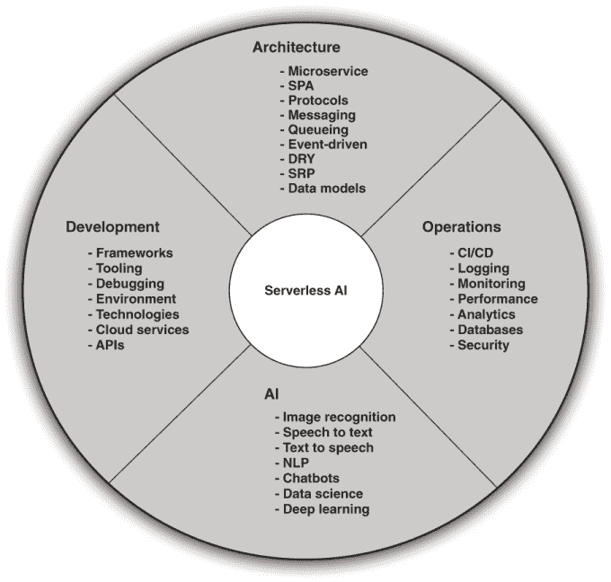
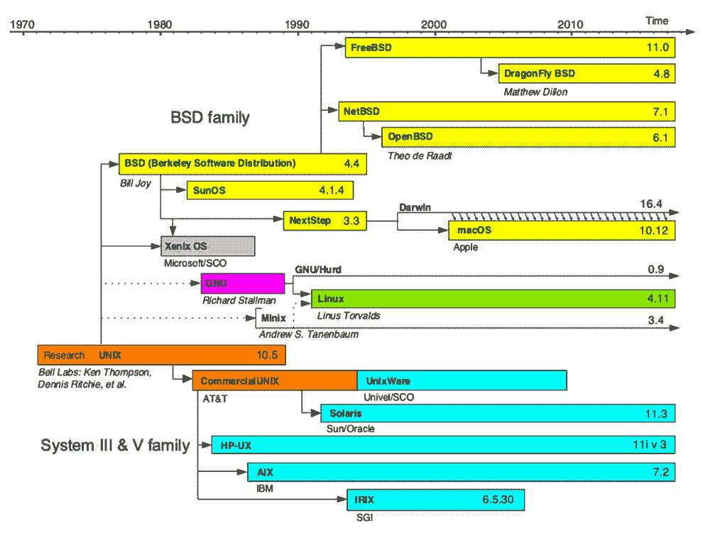
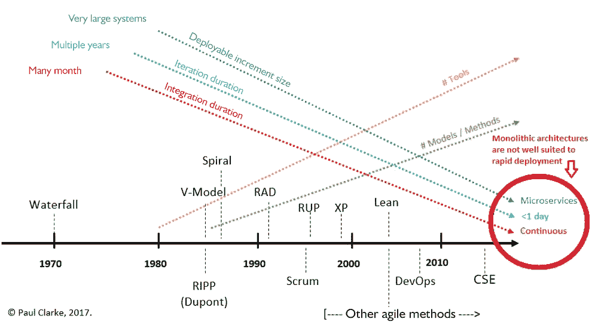
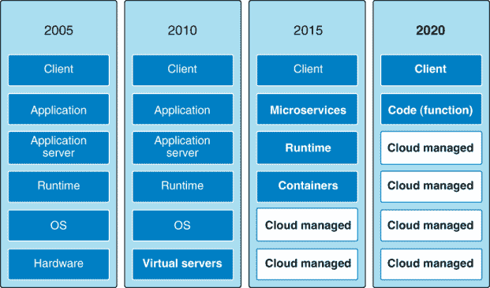
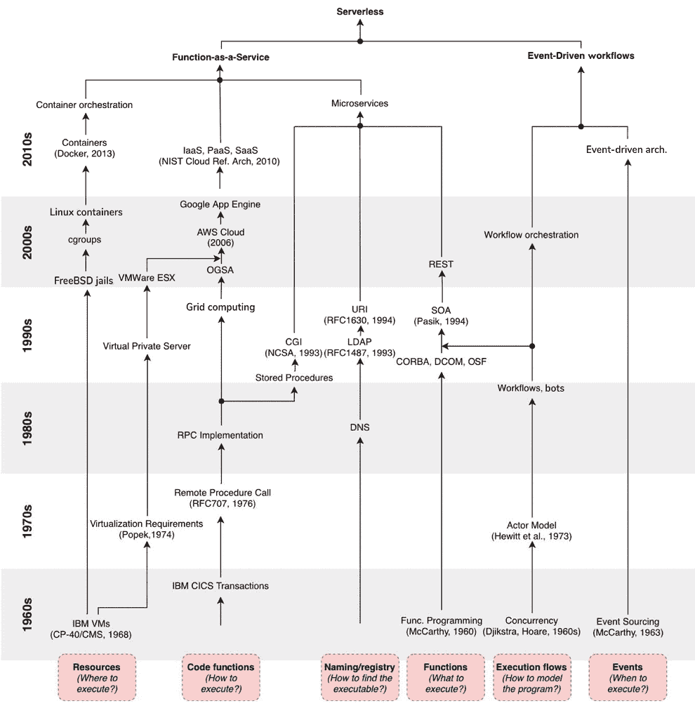
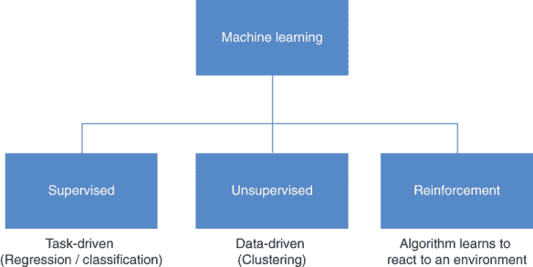
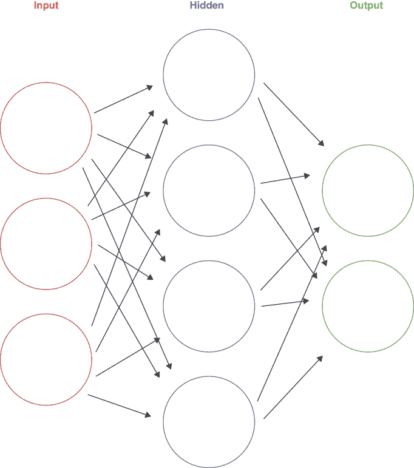
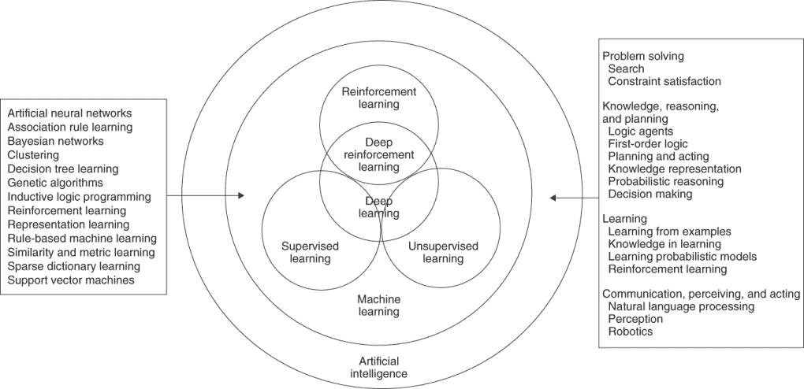
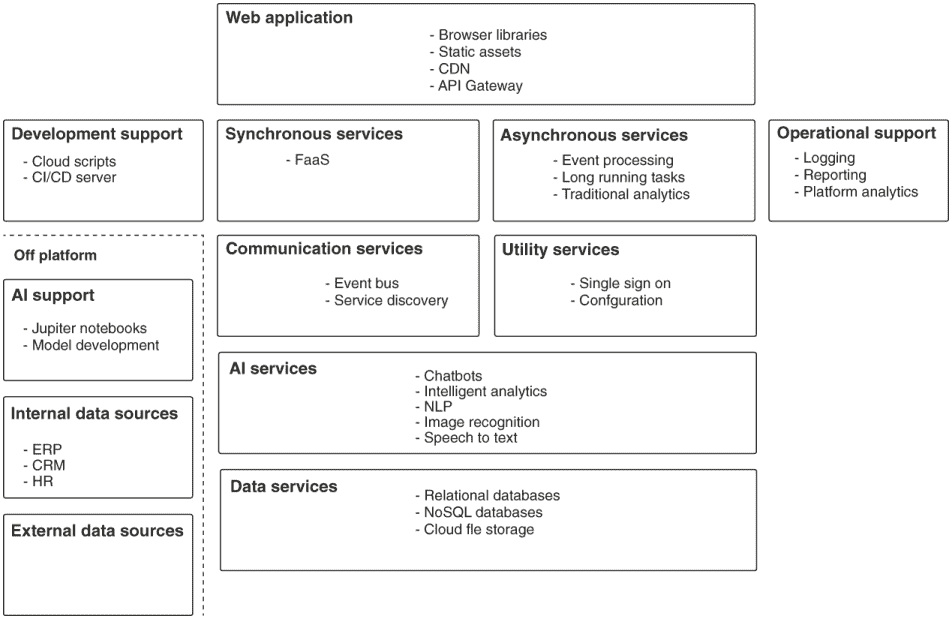
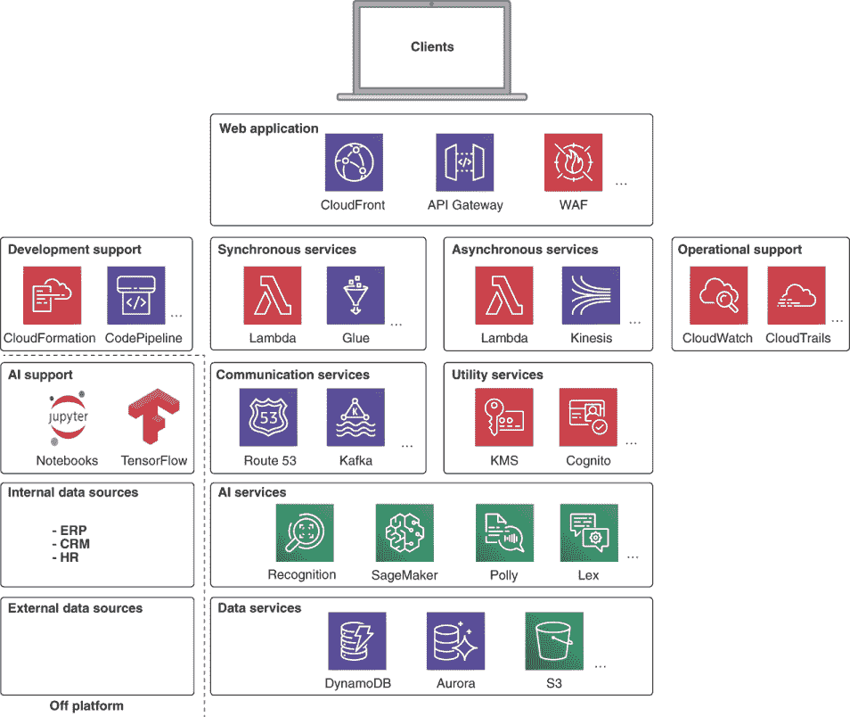

# 1 两种技术的故事

本章涵盖

+   云景观

+   什么是无服务器？

+   人工智能是什么？

+   摩尔定律的民主化力量

+   典型的 AI 即服务架构

+   亚马逊网络服务上的典型架构

欢迎来到我们的书籍！在这些页面中，我们将探讨两种爆炸性技术：*无服务器计算*和*人工智能*。我们将从工程的角度来探讨。当我们说工程角度时，我们的意思是这本书将为你提供一本实用的动手指南，帮助你快速上手 AI 即服务，而不会陷入大量理论的泥潭。

我们想象，像大多数人一样，你已经听说过这些话题，可能会想知道为什么我们将这两个看似不同的主题结合在一本书中。正如我们将在接下来的章节中看到的那样，这些技术的结合有可能成为企业和对消费者平台开发的既定标准。这是一个将为软件开发人员——以及他们为之工作的企业——提供巨大力量来增强和改进现有系统，并快速开发和部署新的 AI 赋能平台的组合。

世界正变得越来越数字化——你可能听说过“数字化转型”这个短语。这通常指的是将现有的手动业务流程（目前使用电子表格、本地数据库，甚至完全没有软件）转变为运行在云上的平台的过程。无服务器为我们提供了一个工具链来加速数字化转型，并且越来越，人工智能成为这些转型的一个核心部分，用计算机取代所有或部分这些由人驱动的业务流程。

软件开发人员将越来越多地需要实施这些平台；我们中大多数参与软件行业的人将需要掌握设计、开发和维护这些类型系统的技能，如果我们还没有的话。

你现在在想，“我对人工智能一无所知！我需要成为人工智能专家吗？这听起来真的很困难？”别慌！你不需要成为数据科学家或机器学习专家来构建无服务器 AI 系统。正如我们将在整本书中看到的那样，大部分艰苦的工作已经以“现成”的云 AI 服务的形式为你完成了。作为软件专业人士，我们的工作是利用这些组件来设计解决方案。

让我们通过一个简单的例子来说明这个概念。想象一家连锁酒店。为了使经营酒店的公司在盈利和运营方面取得成功，必须发生许多过程。以确定某一天房间价格的问题为例。如果价格定得太高，没有人会预订，如果价格定得太低，公司就会失去收入。操作这个流程的人类依赖他们的经验来设定房间价格，并会考虑诸如当地竞争、季节、预期的天气以及可能在该地区发生的任何感兴趣的事件等因素。一旦决定，这些价格将被宣传，但随着当地条件的变化和房间被预订，这些价格将不断变化。

这个过程非常适合 AI 即服务平台，因为它是一个优化问题。使用云原生服务，我们可以想象快速开发服务来摄取和存储适当的数据，无论是通过 API 访问还是抓取有关当地事件信息的网站。我们可以使用现成的 AI 模型来解释抓取的数据，并且可以交叉训练现有的神经网络来计算为我们提供的最佳房间价格。这些价格可以通过另一个服务自动发布。今天，仅通过连接云原生 AI 和数据服务，就可以实现这一点，而无需对 AI 有非常有限的知识。

如果你的主要兴趣是开发简单的网站或低级通信协议，AI 即服务可能不会引起你的兴趣。然而，对于绝大多数软件专业人士来说，AI 即服务将是你职业生涯中产生重大影响的事物，而且很快就会到来！

## 1.1 云计算格局

任何参与软件行业的人至少对 *云计算* 有一个基本了解。云计算最初是一种在他人硬件上运行虚拟服务器的机制——通常被称为 *基础设施即服务 (IaaS)*。它已经演变成为一个更加丰富的按需服务套件，可以满足各种计算负载。目前有三家主要玩家：亚马逊、谷歌和微软。亚马逊网络服务 (AWS) 一直并且继续是云基础设施的主要提供商，提供了一系列令人眼花缭乱的解决方案。

截至 2020 年 3 月，三大平台提供的服务范围非常相似。表 1.1 列出了亚马逊、谷歌和微软在其产品页面上列出的常见类别下的可用服务数量。1

表 1.1 2020 年 3 月云服务数量

| 服务类型 | AWS | Google | Azure |
| --- | --- | --- | --- |
| 人工智能与机器学习 | 24 | 20 | 42 |
| 计算 | 10 | 7 | 20 |
| 容器 | 4 | 8 | 10 |
| 开发者 | 12 | 16 | 11 |
| 数据库 | 12 | 6 | 12 |
| 存储 | 10 | 6 | 17 |
| 物联网 | 12 | 2 | 22 |
| 网络 | 11 | 11 | 20 |
| 安全 | 18 | 28 | 10 |
| 其他 | 85 | 119 | 115 |
| 总计 | 198 | 223 | 279 |

需要尝试理解的服务有很多，每个服务都附带其特定的 API。鉴于我们永远无法详细了解整个领域，我们如何最好地理解所有这些内容，并成为有效的工程师？这个领域也在不断变化，因为新的服务被添加和更新。

我们的目标应该是理解架构原则，以及我们如何从这些服务中组合系统以实现特定的业务目标。我们应该努力保持对可用服务类型的心理清单，并深入探讨一个子集，这样我们就可以根据我们想要实现的结果快速吸收和利用新的服务。



图 1.1 有效的 AI as a Service 工程

图 1.1 概述了将 AI as a Service 平台视为思考框架的心理参考。

该模型建立在理解四个支柱之上：

+   *架构* --采用无服务器计算的有效架构模式是什么？

+   *开发* --最好的开发工具、框架和技术是什么？

+   *AI* --有哪些可用的机器学习和数据处理服务，以及它们如何最好地应用于解决业务问题？

+   *运维* --我们如何有效地将这些服务投入生产并管理它们的运营？

在这本书中，我们将通过构建一个包含机器学习服务（如聊天机器人和语音转文本）的示例软件系统来探索每个 AI 子主题的应用。我们将探索有效的无服务器开发框架和工具，并提供如何在无服务器环境中有效调试的帮助和建议。在本书的后期，我们将发现如何将 AI 工具和技术应用于平台运营，以及如何确保无服务器平台的安全。

我们还将看到我们现有的软件架构经验如何转移到无服务器领域，并开发一个适用于 AI as a Service 平台的规范架构，这将帮助我们将每个可用的云服务置于适当的背景中。我们将在这本书中，将此架构作为我们开发的示例系统的参考模型。

在本章的剩余部分，我们将探讨无服务器和 AI 的发展，并为每个主题提供简略的历史。这个重要的背景信息将帮助我们理解我们作为一个行业如何到达今天的位置，以及看似复杂的 AI 和云计算领域是如何演变的。大部分的理论都在这一章；从第二章开始，我们将直接进入代码！

## 1.2 什么是无服务器？

由于没有官方的无服务器术语定义，我们提供以下作为工作解决方案。

*无服务器计算是一种云效用计算形式，其中云服务提供商动态管理服务用户的底层资源。它为底层基础设施提供了一层抽象，从最终用户那里移除了管理的负担。*

无服务器软件是一种云软件，它避免了显式创建和管理基础设施；例如，服务器或容器。这些传统的计算资源被云提供商管理和运行的函数所取代。这被称为*函数即服务（FaaS）*。无服务器应用程序还避免了创建重型、专用资源，如数据库、文件存储或消息队列。相反，它们依赖于云提供商提供的托管服务，这些服务可以自动扩展以处理大量工作负载。无服务器应用程序的定价模型也非常重要。与无论资源是否在使用或空闲都要付费的传统模式不同，云提供商通常在函数被调用和管理服务被消耗时收费。这可以实现大量成本节约，并确保基础设施成本与使用量同步增长。

无服务器计算的原则可以总结如下：

+   服务器和容器被按需执行的云函数所取代。

+   与自定义资源相比，更倾向于使用托管服务和第三方 API。

+   架构主要是事件驱动和分布式的。

+   开发者专注于构建核心产品，而不是底层基础设施。

术语“无服务器”有点误导，因为当然，在链中某处总是涉及服务器！重点是，在无服务器的情况下，作为技术的用户，我们不再需要关心底层基础设施。云服务提供商通过 FaaS 和其他托管服务，为底层基础设施提供了一层抽象。

计算机历史在某种程度上一直是在创造抽象层次。早期的用户必须关注物理磁盘扇区和寄存器，直到操作系统的抽象被创建。语言已经从汇编语言这样的低级语言，发展到通过创建一系列越来越复杂的抽象，变成了动态的现代方言，如 Python。Serverless 也是如此。

任何从事软件开发工艺的人，无论是作为开发者、DevOps 专家、经理还是高级技术专家，都明白我们行业的变革速度是前所未有的。想象一下，如果你愿意，其他职业，如医生、牙医、律师或土木工程师，必须以软件行业那样的狂热速度更新他们的知识库。如果你觉得难以想象，我们同意你的看法！

这既是福也是祸。我们中许多人喜欢使用最新和最先进的技术栈，但我们也常常遭受选择的悖论，因为可供选择的语言、平台和技术可能太多。

选择悖论

选择悖论：为什么更多意味着更少是心理学家 Barry Schwartz 写的一本书，他在书中提出了这样一个论点：更多的选择实际上会导致消费者焦虑。他认为，一个成功的产品应该将选择限制在几个不同的类别中。在编程语言、框架和平台方面，情况也类似，我们实际上有太多的选项可供选择！

许多在业界工作了一段时间的人对最新的技术趋势或框架变得合理地怀疑。然而，我们相信 Serverless 和当前的 AI 浪潮代表了一次真正的范式转变，而不仅仅是一个短期趋势。

要理解 Serverless 真正意味着什么，我们首先需要了解行业是如何发展到今天的，而要做到这一点，我们需要探索推动行业的核心驱动力：速度！

## 1.3 对速度的需求

计算机工业的历史和发展是一个迷人的话题，关于这个主题已经写了许多值得阅读的书籍。虽然我们在这里无法对这个主题进行充分的公正评价，但了解一些关键的历史趋势和背后的力量是很重要的。这将帮助我们认识到，Serverless 实际上是这一历史进程中的下一个逻辑步骤。

### 1.3.1 早期阶段

计算机的历史可以追溯到古代，有算盘这样的设备。历史学家将第一个已知的计算机算法归功于 Ada Lovelace 在 19 世纪为 Charles Babbage 实现的。计算机的早期发展关注的是单一目的、难以驾驭的系统，旨在完成单一目标。现代软件时代真正开始于 1964 年第一个多任务操作系统的开发，即 MULTICS，随后 Unix 操作系统的开发。

### 1.3.2 Unix 哲学

Unix 操作系统是在 20 世纪 70 年代由 Ken Thompson 和 Dennis Ritchie 在 Bell Labs 创建的。原始的 AT&T 版本衍生出许多作品；最著名的大概是 Linux 内核及其相关发行版。对于那些对计算机历史感兴趣的人来说，图 1.2 描述了 Unix 家族树的主要分支。正如你所看到的，原始系统衍生出许多成功的衍生品，包括 Linux、Mac OS X 和 BSD 操作系统家族。



图 1.2 Unix 家族树。来源：[`mng.bz/6AGR`](http://mng.bz/6AGR)。

也许比操作系统更重要的是围绕原始 Unix 文化发展起来的哲学，可以概括为

+   编写只做一件事并且做得很好的程序。

+   编写可以协同工作的程序。

+   编写处理文本流的程序，因为这是一个通用的接口。

提示：要全面了解这个主题，请参阅 Brian Kernighan 和 Rob Pike 所著的《Unix 编程环境》（Prentice-Hall，1983 年）。

这种系统设计方法首先将模块化的概念引入到软件开发中。我们应该注意，这些原则可以应用于底层操作系统或语言无关。例如，在 Windows 编程环境中使用 C#应用 Unix 哲学是完全有效的。

这里要理解的关键点是单一职责原则——编写具有单一关注点的程序或模块。

单一关注点

为了说明程序单一关注点的概念，考虑以下 Unix 命令行工具：

+   `ls` 知道如何在目录中列出文件。

+   `find` 在目录树中搜索文件。

+   `grep` 知道如何在文本中搜索字符串。

+   `wc` 知道如何计算文本中的行或单词数。

+   `netstat` 列出打开的网络连接。

+   `sort>` 对数字或字母进行排序。

+   `head` 返回输入的前 n 行。

这些工具本身相当简单，但我们可以将它们组合起来完成更复杂的任务。例如，以下代码给出了系统上监听 TCP 套接字的数量：

```
$ netstat -an | grep -i listen | grep -i tcp | wc -l
```

这个例子显示了目录树中的五个最大文件：

```
find . -type f -exec ls -s {} \; | sort -n -r | head -5
```

做一件事做好的哲学是软件中一股强大的正能量。它允许我们编写更小的代码单元，这些单元更容易推理，更容易正确实现，而不是大型互联的单一巨块。

### 1.3.3 面向对象和模式

这种原始的干净和模块化方法在很大程度上被行业遗忘，转而采用面向对象的范式。在 20 世纪 80 年代末和 90 年代初，C++等语言越来越受欢迎。受软件模式运动推动，面向对象的承诺是代码可以通过继承和多态等机制在对象级别上重用。结果证明，这种愿景从未实现，正如在著名的“香蕉、猴子、丛林”问题中所讽刺的那样。

香蕉、猴子、丛林

“香蕉、猴子、丛林”问题指的是现实世界中面向对象代码库中的重用问题。它可以表述为：“我想得到一个香蕉，但当我伸手去拿时，我得到了一个拿着香蕉的猴子。不仅如此，这只猴子还抓着树，所以我得到了整个丛林。”

以下片段说明了这个问题：

```
public class Banana {
    public Monkey Owner {get;}
}

public class Monkey {
    public Jungle Habitat {get;}
}

public class Jungle {
}
```

为了使用 Banana 类，我首先需要向它提供一个 Monkey 实例。为了使用 Monkey 类，我需要向它提供一个 Jungle 实例，依此类推。这种耦合是作者遇到的大多数面向对象代码库中的真正问题。

在这个时期，在互联网出现之前，系统往往被开发和构建为单体，大型系统拥有超过一百万行代码，构成一个单一的可执行文件，这种情况并不罕见。

### 1.3.4 Java, J2EE, .NET,

面向对象的趋势从 20 世纪 90 年代延续到 21 世纪，Java 和 C#等语言获得了显著地位。然而，这些系统的本质开始从桌面交付转向更分布式、网络感知的应用。这个时期见证了应用服务器模型的兴起，其特点是大型的单体代码库、庞大的关系型数据库以及大量的存储过程，以及 CORBA/COM 用于分布式通信和互操作性。部署通常每三到六个月一次，需要数周的计划和停机时间。

CORBA 和 COM

常见对象请求代理架构（Common Object Request Broker Architecture）是一种在 2000 年代初非常流行的遗留二进制通信协议。通用对象模型（COM）是微软特有的 CORBA 替代品。这两种技术现在都幸运地被 RESTful API 所取代。


图 1.3 2000 年左右的企业软件开发（或*耕牛耕作*，乔治·H·哈维，1881 年）。来源：http://mng.bz/oRVD。（[链接](http://mng.bz/oRVD)）

反思起来，21 世纪初的发展可以与农业的早期阶段相提并论。在当时，它是一场革命。与后来的发展相比，它显得缓慢、笨拙、缺乏灵活性，且劳动密集。

### 1.3.5 XML 和 SOA

从这里，行业转向采用*XML（可扩展标记语言）*作为配置和通信一切的手段，随着 SOAP 的出现和所谓的*面向服务的架构（SOA）*的推动而达到顶峰。这由对解耦和互操作性的需求所驱动，并建立在开始理解开放标准益处的认识之上。

SOAP

*简单对象访问协议*（Simple Object Access Protocol）是一种基于 XML 的文本协议，被誉为优于 CORBA 和 COM 的替代品。由于其基于文本的特性，SOAP 比 CORBA 或 COM 具有更好的跨平台互操作性；然而，与基于现代 JSON 的 RESTful API 相比，它仍然显得笨重且使用不便。

### 1.3.6 网速

与企业软件开发的变化并行，受到互联网泡沫（及其随后的崩溃）的推动，*软件即服务（SaaS）*模式开始获得势头。行业正转向网络作为主要的应用交付机制，最初是用于外部客户 facing 的用途，但越来越多地用于内部企业交付。这一时期，对软件的快速交付需求日益增加，包括初始部署以及现在可以立即部署到服务器上的功能添加。在这一时期，主要的 SaaS 托管模式是将部署到本地服务器或数据中心内共置的机器上。

因此，行业面临两个主要问题。首先，需要提前预测所需的容量，以便能够分配足够的资本支出购买处理预期负载所需的硬件。其次，大型、单体、面向对象的代码库并不真正适合以网络速度的开发模式。

显然，重量级、封闭的企业模式不适合以网络速度进行交付。这导致了基于开放标准的方法的日益采用，以及开源技术的使用增加。这一运动由 FSF（自由软件基金会）、Apache 和 GNU/Linux 等组织领导。

向开源的转变导致了企业软件架构定义方式的一个关键、不可逆转的变化。最佳实践、标准和工具曾经是由像 Sun Microsystems、Oracle 和 Microsoft 这样的企业领导者所决定的。开源赋予了业余爱好者、初创企业和学者快速创新、以前所未有的频率分享和迭代的权力。在行业曾经等待大玩家就复杂的标准文档达成一致的时候，模式转变为了利用社区的联合力量和敏捷性来展示既实用又有效的解决方案，这些解决方案不仅立即就能工作，而且以惊人的速度持续改进。

### 1.3.7 云计算

云计算首次在 2006 年引起关注，当时亚马逊推出了他们的弹性计算云产品，现在被称为亚马逊 EC2。随后在 2008 年，谷歌推出了 App Engine，在 2010 年，微软推出了 Azure。说云计算从根本上改变了软件行业并不夸张。到 2017 年，亚马逊网络服务（AWS）报告的收入为 174.6 亿美元。

按需计算能力的可用性使得个人和资金紧张的初创企业能够构建真正创新的项目，并对行业产生不成比例的影响。关键的是，行业开始寻找软件工具的最具创新性的最终用户作为领导，而不是企业软件供应商。对于企业来说，云计算的兴起导致了几个地震般的变化。其中最重要的是

+   成本模型从大额前期资本支出转向较低的持续运营支出。

+   弹性扩展——资源现在可以按需使用和付费。

+   DevOps 和基础设施即代码——随着云 API 的成熟，开发出了工具来捕获整个部署栈作为代码。

### 1.3.8 微服务（重新发现）

开源软件的广泛应用加上向运营支出和弹性扩展的转变，导致在企业平台开发方面重新发现了 Unix 哲学，并有助于推动所谓的微服务架构的采用。尽管对于微服务没有达成一致的形式定义，但大多数行业从业者都会同意以下描述：

+   微服务是小型、细粒度的，执行单一功能。

+   组织文化必须接受测试和部署的自动化。这减轻了管理和运营的负担，并允许不同的开发团队独立工作于可部署的代码单元。

+   文化设计和原则必须接受失败和故障，类似于反脆弱系统。

+   每个服务都是弹性的、有弹性的、可组合的、最小化和完整的。

+   服务可以单独和水平扩展。

微服务的理念并非新颖。分布式系统自 20 世纪 70 年代以来就存在。Erlang 在 20 世纪 80 年代就进行了微服务，从 CORBA 到 SOA 的所有事物都试图实现分布式、网络化组件的目标。微服务大规模采用的推动者是云、容器和社区：

+   云基础设施如 AWS 使我们能够快速且低成本地部署和销毁具有高可用性的安全集群。

+   容器（Docker）使我们能够构建、打包和部署包含软件的不可变单元，这些软件以微服务单元的规模存在。以前，将几百行代码作为一个单一单元部署是不可行或不理解的！

+   社区提供的工具使我们能够管理在开始处理众多、小型部署单元时出现的新形式复杂性。这包括以 Kubernetes 形式出现的编排，以*ELK（Elasticsearch、Logstash 和 Kibana）*或 Zipkin 形式出现的监控，以及大量工具，例如 Netflix 工程团队开源的工作。

微服务模型非常适合现代云基础设施，因为每个组件都可以单独扩展。此外，每个组件也可以单独部署。这使开发周期更快，确实导致了所谓的*持续部署*的发展，即开发者的代码提交立即进入生产，无需人工干预，当然，前提是它通过了严格的自动化测试。

对于微服务的全面介绍，我们可以推荐理查德·罗杰的《微服务之道》，该书也由 Manning 出版社出版。

### 1.3.9 云原生服务

如亚马逊的 EC2 这样的服务通常被称为“基础设施即服务”或“IaaS”。虽然这是一个强大的概念，但它仍然将操作和管理负担放在了服务的最终用户身上。大多数系统将需要某种形式的数据库和其他基础设施才能运行。如果我们基于 IaaS 构建系统，那么我们就需要安装和维护数据库服务器集群，并处理备份、地理冗余和扩展集群以处理所需负载等问题。我们可以通过使用云原生服务来避免所有这些开销。在这个模型下，云服务提供商为我们管理数据库；我们只需通过配置或使用 API 告诉系统要做什么。

为了提供一个更具体的例子，让我们看看亚马逊的 DynamoDB 服务。这是一个全托管的高规模键值存储。要使用 DynamoDB，我们只需在 AWS 控制台的 DynamoDB 设置页面上输入一些配置信息，不到 60 秒就可以有一个可以读写的数据表。与此相对比的是，在 EC2 实例上安装自己的键值存储所需的设置，这将需要数小时的设置和持续维护。

云服务中最令人兴奋的发展之一是能够在云上运行托管代码单元，而不必关心底层服务器。这通常被称为“函数即服务”或“FaaS”。在 AWS 上，FaaS 是通过*Lambda*服务实现的，而谷歌的提供物被称为*Cloud Functions*。

### 1.3.10 趋势：速度

如果我们拉紧所有这些线索，就会很明显，由于一些失误，主要的驱动力是速度的需求。毕竟，时间就是金钱！这意味着我们需要尽快将代码投入生产，并能够快速管理和扩展它。这推动了微服务和云原生服务的采用，因为这些技术为功能快速开发和部署提供了一条途径。

随着技术格局的变化，行业在软件开发中应用的方法论也发生了演变。这些趋势总结在图 1.4 中。



图 1.4 迭代时间和代码量的变化。由 Clarke, Paul. 2017. 计算机科学讲义。都柏林城市大学和 Lero，爱尔兰软件研究中心。

如上图所示，迭代次数已经迅速减少。在 20 世纪 80 年代和 90 年代初，使用瀑布式方法，所谓的迭代可能就是整个项目的长度——对于大多数项目来说可能是长达一年或更久。当我们进入 20 世纪 90 年代中期，随着早期敏捷方法如 Rational Unified Process（RUP）的采用，迭代时间缩短。到了大约 2000 年左右，敏捷方法如极限编程（XP）的出现，迭代时间缩短到两周左右，而现在一些更超敏捷的实践甚至使用一周左右的迭代时间。

软件伴随的发布周期——生产发布之间的时间——一直在减少，从 20 世纪 80 年代和 90 年代的一年多到现在的远更快发布计划。实际上，使用持续部署技术的最高效的组织每天可以向生产发布软件多次。

以如此快的速度发布的能力得益于另一个趋势：即尺度的减小。每个部署单元的代码量正在减少。在 20 世纪 80 年代和 90 年代，大型、单体代码库是常态。由于这些代码库的耦合性质，测试和部署是一个困难和耗时的过程。随着 20 世纪 90 年代末和 21 世纪初服务导向架构的出现，部署单元的规模减小。随后，随着微服务的采用，出现了更显著的下降。

图 1.5 展示了随着尺度的减小和部署周期的加速，抽象级别逐渐提高，远离底层硬件。

行业在很大程度上已经从安装和运行物理硬件，通过虚拟服务器到基于容器的部署转变。当前最先进的状态通常是部署为容器的小型服务到某种编排平台，如 Kubernetes。服务通常会消耗 IaaS 配置的数据库或云原生数据服务。然而，如果增加部署速度和减少单位规模的趋势要继续下去——经济激励表明这是一个可取的目标——那么这一进步的下一个逻辑步骤就是转向完全无服务器系统。



图 1.5 尺度单位变化

图 1.6 展示了导致行业发展到无服务器计算的技术路径和技术里程碑。



图 1.6 计算概念的历史，这些概念导致了无服务器计算的出现。E. van Eyk 等人，“无服务器更多：从 PaaS 到现在的云计算。”IEEE 互联网计算 22，第 5 期（2018 年 9/10 月）：8-17，doi: 10.1109/MIC.2018.053681358。

总结来说，对软件快速开发和部署的需求导致了规模单位的减少。这一进程的下一个逻辑步骤是采用完全无服务器架构。

## 1.4 什么是人工智能？

*人工智能（AI）*是一个术语，它已经涵盖了计算机科学中一系列技术和算法方法。对许多人来说，它常常会让人联想到失控的杀手机器人，这主要是由于《黑客帝国》和《终结者》电影中所描绘的反乌托邦未来！

对这个术语的一个更加清醒和合理的定义可能是这样的：

*人工智能*指的是计算机展现学习和决策能力的能力，正如人类和其他动物物种所展现的那样。

它只是代码

虽然现代人工智能系统所展现的一些能力可能看起来神奇，但我们始终应该记住，最终它只是代码。例如，一个能够识别图像的算法可能是一个非常强大的工具，但在基本层面上，它只是一系列非常简单的单元的互联。人工智能算法中发生的“学习”过程实际上只是根据训练数据调整数值的非常简单的事情。正是这些数值的大量涌现行为产生了显著的结果。

### 1.4.1 人工智能的历史

为什么突然对人工智能感兴趣？为什么人工智能和机器学习的需求日益增加？人工智能的发展是一个迷人的话题，本身就可以写几本书，而且全面论述显然超出了本书的范围。

人类一直对创造自身的复制品感到着迷，但直到 17 世纪，哲学家如莱布尼茨和笛卡尔才开始探索这样一个观点：人类思维可以用系统、数学的方式描述，因此可能被非人类机器所复制。

从这些最初的哲学探索开始，直到 20 世纪初，像罗素和布尔这样的思想家才对这些想法进行了更正式的定义。这些发展，加上数学家库尔特·哥德尔杰出的工作，导致了艾伦·图灵的基础性工作。图灵的关键洞察是，任何在哥德尔不完全性定理的范围内可以形式定义的数学问题，在理论上都可以由计算设备，即所谓的图灵机来解决。

图灵和弗劳尔斯在英国布莱切利公园开发 Bombe 和 Colossus 系统的工作具有开创性，最终导致了 1956 年夏天的著名达特茅斯学院会议，该会议通常被认为是人工智能学科的正式创立。

早期充满了乐观情绪，导致了一些非常乐观的预测，例如

+   H.A.西蒙和 A.纽厄尔，1958 年：“在十年内，一台数字计算机将成为世界象棋冠军。”

+   H.A.西蒙，1965 年：“在二十年内，机器将能够完成人类能做的任何工作。”

+   M.明斯基，1967 年：“在一代人……内，创造人工智能的问题将得到实质性解决。”

20 世纪 70 年代初该领域的进展并没有达到这些预期。随着时间的推移，没有取得实质性进展，资金来源枯竭，该领域的研究放缓。这一时期被称为**第一次 AI 寒冬**。

20 世纪 80 年代见证了**专家系统**的兴起：基于规则的解决问题语言如 Prolog 在商业界获得了关注和兴趣。历史重演，到了 20 世纪 80 年代末，专家系统早期承诺的实现变得不再可能。这一事实，加上商品 PC 硬件的兴起，意味着公司将不再投资于这些系统所需的昂贵定制硬件，第二次 AI 寒冬开始了。

在幕后，研究人员在神经网络发展的领域取得了进展，包括网络架构和改进的训练算法，如反向传播。该领域缺少一个关键因素：计算能力。

在 20 世纪 90 年代和 21 世纪初的整个时期，摩尔定律（计算能力的指数增长）继续快速发展。这种能力的增长使得研究人员能够构建越来越复杂的神经网络，并缩短训练周期，为该领域的发展和创新提供了动力，速度大大加快。从 IBM 的 Deep Blue 在 1997 年击败加里·卡斯帕罗夫开始，AI 已经扩展到许多领域，并且正在迅速商品化，这意味着这项技术现在以低成本在许多商业环境中可用，无需专家研究团队。

### 1.4.2 现实世界 AI

自 20 世纪 50 年代以来，人们一直在努力创造能够展现人类能力的机器，能够接受一个目标并找出实现它的方法。在过去的几年里，出现了现实世界的 AI 解决方案，这些解决方案每天都在被使用。无论你是观看最新的电视剧，听音乐，在线购物，还是获取最新的新闻更新，你使用的技术很可能是由 AI 的最新进展所驱动的。让我们来看看人工智能技术对哪些领域产生了重大影响。

#### 零售和电子商务

在线上零售和实体零售店中，AI 被应用于推荐顾客最有可能购买的产品。在电子商务的早期，我们看到了简单的推荐器示例（“购买这个的人还购买了……”）。如今，许多零售商正在详细监控用户的浏览行为，并使用这些数据与实时 AI 算法相结合，突出展示更有可能被购买的产品。

#### 娱乐

在线电影、电视和音乐消费的显著增长为提供商提供了大量的消费数据。这些数据正被所有主要提供商用于进一步推动消费。Netflix 表示，80% 的订阅者选择来自平台的推荐算法。Spotify 是另一个从用户行为中学习并进一步提供音乐推荐的流媒体平台的例子。2

#### 新闻与媒体

人工智能在社交媒体和在线新闻中的使用已经广为人知。Facebook 和 Twitter 都广泛使用人工智能来选择出现在用户时间线中的帖子。大约三分之二的美国成年人从社交媒体网站获取新闻，因此人工智能对我们看到新闻产生了重大影响（来源：[`www.journalism.org/2018/09/10/news-use-across-social-media-platforms-2018/`](http://www.journalism.org/2018/09/10/news-use-across-social-media-platforms-2018/))。

#### 广告

广告是一个受到人工智能巨大影响的领域。人工智能被用于根据在线行为和偏好将广告与用户匹配。广告商在移动和网页上争夺消费者注意力的过程是实时并由人工智能自动化的。谷歌和 Facebook 都拥有庞大的 AI 研究部门，在这个过程中广泛使用人工智能。2017 年，Facebook 和谷歌占据了 90% 的新广告业务（来源：[`www.marketingaiinstitute.com/blog/ai-in-advertising-what-you-need-to-know`](https://www.marketingaiinstitute.com/blog/ai-in-advertising-what-you-need-to-know))。

#### 客户联系

随着在线世界的演变，消费者与企业的互动方式正在改变。许多人习惯于使用自动电话应答系统，通过按键选择选项来引导我们，或者使用准确性可疑的语音识别。客户支持运营现在正在使用各种先进技术来降低成本并改善客户体验。一个例子是使用情感分析来检测语气并优先考虑某些互动的重要性。另一个例子是使用聊天机器人来回答常见问题，而不需要任何工作人员。

语音识别和语音合成在这些场景中也极为有用，因为这些系统的能力在不断提高。2018 年谷歌 Duplex 演示是一个很好的例子，说明了这些能力已经变得多好([`mng.bz/v9Oa`](http://mng.bz/v9Oa))。每天都有越来越多的人使用 Alexa、Siri 或 Google Assistant 作为通向在线世界的接口，获取信息、组织生活并进行购物。

#### 数据和安全

企业、消费者和监管机构越来越意识到数据隐私和安全的重要性。这体现在围绕数据存储、保留和处理形成的法规中。此外，安全漏洞也是一个日益令人担忧的问题。人工智能在解决这两个方面都发挥着作用。文档处理、分类和个人数据的识别已经在 Amazon Macie 等服务中实现并实施。在威胁和漏洞检测领域，人工智能被用于预防和警报。Amazon GuardDuty 是这方面的一个好例子。

除了信息安全之外，人工智能在物理安全领域也找到了许多实际应用。最近在图像处理和面部识别方面的重大改进正在应用于城市、建筑和机场安全。人工智能还可以有效地应用于检测来自爆炸物、枪支和其他武器等物体的物理威胁。

#### 金融

通常，金融应用中的数据是时间序列数据。想想一个包含特定年份每天某种产品销售数量的数据集。这种性质的时间序列数据适合于预测人工智能模型。这些模型可用于预测和资源规划。

#### 医疗保健

医疗保健领域的人工智能发展主要集中在诊断工具上，尤其是在放射学和微生物学领域的图像解释。最近对这一领域的深度学习研究进行的调查表明，该领域兴趣的激增和近年来性能的显著提升。虽然一些工作已经声称超越医学专家，但人工智能更典型地预期将被用作检测和测量细微异常的助手。3

在许多发展中国家，医疗专业知识短缺，这使得人工智能的应用更加有价值。例如，结核病的检测是通过人工智能自动解释胸部 X 光图像来进行的。


图 1.7 人工智能在发展中国家使用移动 X 光机辅助诊断结核病。（经 Delft Imaging Systems 许可复制。）

### 1.4.3 人工智能服务

表 1.3 展示了人工智能的一些常见应用，AWS（以及其他云服务提供商）为这些用例中的许多提供了基于预训练模型的服务。

表 1.2 人工智能应用和服务

| 应用 | 用途 | 服务 |
| --- | --- | --- |
| 自然语言处理 | 机器翻译 | AWS Translate |
| 文档分析 | AWS Textract |  |
| 关键短语 | AWS Comprehend |  |
| 情感分析 |  |  |
| 主题建模 |  |  |
| 文档分类 |  |  |
| 实体提取 |  |  |
| 对话式界面 | 聊天机器人 | AWS Lex |
| 语音 | 语音到文本 | AWS Transcribe |
| 文本到语音 | AWS Polly |  |
| 机器视觉 | 物体、场景和活动检测 | AWS Rekognition |
| 面部识别 |  |  |
| 面部分析 |  |  |
| 图像中的文本 |  |  |
| 其他 | 时间序列预测 | AWS Forecast |
| 实时个性化推荐 | AWS Personalize |  |

我们将在后面的章节中使用这些服务的大部分，因此它们将非常熟悉，但我们将在此处总结每个服务以供参考：

+   *AWS Translate* 是一种神经机器翻译服务。这意味着它使用深度学习模型来提供比传统基于统计和规则的翻译算法更准确、更自然的翻译。

+   *AWS Textract* 通过结合光学字符识别（OCR）和文本分类模型，自动从扫描的文档中提取文本和数据。

+   *AWS Comprehend* 是一种自然语言处理（NLP）服务，它使用机器学习来在文本中找到洞察力和关系。

+   *AWS Lex* 是一种用于构建语音和文本对话界面的服务，也称为 *聊天机器人*。它通过使用深度学习模型进行自然语言理解（NLU）和自动语音识别（ASR）来实现这一点。

+   *AWS Transcribe* 使用深度学习模型将音频文件中的语音转换为文本。

+   *AWS Polly* 使用先进的深度学习模型将文本转换为逼真的语音。

+   *AWS Rekognition* 是一种图像识别服务，它使用深度学习模型在图像和视频中识别对象、人物、文本、场景和活动，以及检测任何不适当的内容。

+   *AWS Forecast* 基于 Amazon.com 使用的相同技术。它使用机器学习将时间序列数据与附加变量相结合，以构建预测。

+   *AWS Personalize* 提供个性化的产品和建议内容。它基于 Amazon.com 上使用的推荐技术。

### 1.4.4 人工智能和机器学习

过去 10 年在人工智能领域的关注和进步主要集中在机器学习领域，这是“通过经验自动改进的计算机算法的研究”（Tom Mitchell，《机器学习》，麦格劳-希尔，1991 年）。关于人工智能和机器学习的具体含义以及它们之间的细微差别存在一些争议。在这本书中，当我们谈论软件系统中的人工智能应用时，我们是在谈论机器学习。

机器学习的实践通常涉及一个训练阶段，随后是一个测试阶段。无论算法如何，机器学习算法都是在数据集上训练的。这可能是一组图像，例如图像识别算法的情况，或者是一组结构化记录，例如金融预测模型的情况。算法的目的是根据从训练数据中“学习”到的特征对测试数据进行判断。

机器学习可以划分为这些类别，如图 1.8 所示。



图 1.8 机器学习类型（来源：Analytics Vidhya）

注意*特征*是机器学习中的一个重要概念。为了在图像中识别一只猫，你可能会寻找三角形耳朵、胡须和尾巴等特征。选择正确的特征集对于算法的有效性能至关重要。

在传统的机器学习算法中，特征是通过手工创建的。在神经网络中，特征是由网络自动选择的。

机器学习可以分为以下这些类别：

+   监督学习

+   无监督学习

+   强化学习

#### 监督学习

*监督学习*是指算法被提供了一组标注的训练数据。例如，一组被标注为分类的文档。这些标签可能代表每个文档的主题。通过使用这个数据集训练一个特定的算法，你期望算法能够预测未标注测试文档的主题。在有足够、良好标注的训练数据的情况下，这可以非常有效。当然，缺点是可能很难找到或创建足够数量的这种标注训练数据。

#### 无监督学习

*无监督机器学习*试图在没有任何标注训练数据（标签）的情况下从数据中提取相关模式。无监督算法的例子包括聚类、降维和异常检测。当我们想要从数据集中提取模式而没有具体期望的结果时，我们可以使用无监督学习。无监督方法有一个明显的优势，即它不需要标注数据。另一方面，结果可能难以被人类解释，并且学习到的模式可能与期望的不同。

#### 强化学习

*强化学习*从直接经验中学习。它被提供了一个环境和奖励函数，目标是最大化其奖励。我们允许算法采取行动并观察这些行动的结果。然后我们尝试计算一个衡量结果期望的奖励函数。强化学习最可能的应用是合成计算机模拟环境，这些环境允许在短时间内进行数百万或数十亿次的探索性交互。

### 1.4.5 深度学习

*深度学习*基于*人工神经网络（ANNs）*，这种网络最早在 20 世纪 50 年代被研究。人工神经网络由连接的节点层组成，或称为*感知器*。输入作为一组数字在输入层提供，结果通常作为输出层的数字提供。输入和输出之间的层被称为“隐藏”层。人工神经网络的目标是通过迭代学习每个感知器的权重，以便在输出层产生对期望结果的近似。单词“深度”指的是网络中有许多层（至少 7-8 层，但可能是数百层）。深度学习网络如图 1.9 所示。

使用神经网络模拟人脑的概念自人工智能研究之初就存在。然而，当时的原始计算能力根本无法实现这些方法潜力。在 2000 年代后期和 2010 年代初期，随着更强大的处理能力的出现，神经网络和深度学习开始成为人工智能的主要方法。深度学习的发展还得到了算法的进步以及来自互联网的大量训练数据的可用性的帮助。标记训练数据的任务通常通过众包（例如，亚马逊机械师）来解决。



图 1.9 深度神经网络层

Alpha Go

一个展示了深度学习巨大进步的关键事件是 Alpha Go 胜过最优秀的人类围棋大师。Alpha Go 最初由英国公司 DeepMind Technologies 开发。该公司于 2014 年被谷歌收购。

关于这一点，关键的是网络必须“学习”围棋。这与 Deep Blue 在击败加里·卡斯帕罗夫时能够采取的方法有显著不同。这是由于可能的棋局状态数量。在围棋中，大约有 10⁴⁵ 种棋局状态，而在围棋中大约有 10¹⁷⁰ 种。正因为如此，可以使用游戏知识和算法机器学习技术相结合的方法，基本上编程 Deep Blue 成为围棋专家。然而，当我们考虑到可观测宇宙中原子数的估计值为 10⁸⁰ 时，我们就能理解围棋游戏的复杂性以及尝试使用类似专家系统的方法的不可行性。相反，Alpha Go 使用了一个通过观察数百万场比赛来训练的深度神经网络。

图 1.10 尝试将前面机器学习工具和技术的总结分类到一张单独的图表中。尽管对这一领域所有细微差别的详细描述超出了本章的范围，但图 1.10 应该在讨论高级机器学习时提供一个基本的参考框架。



图 1.10 人工智能和机器学习算法与应用。深度强化学习：概述。李宇熙。[`arxiv.org/abs/1701.07274.`](https://arxiv.org/abs/1701.07274)

### 1.4.6 人工智能挑战

目前，人工智能主要由监督学习主导，这需要用于训练的数据。一个挑战是拥有代表网络要学习所有场景的标记数据。因此，无监督模型的发展成为研究的热点。对于许多希望利用人工智能的用户来说，通常无法获得足够的数据。使用有限的数据集进行训练往往会使算法产生偏差，导致对与训练集不相似的数据做出错误的判断。

当人工智能被应用于法律和伦理领域时，也存在挑战。如果一个机器学习算法做出了不希望的判断，很难知道哪个当事人应承担责任。如果一家银行决定某人无权获得抵押贷款，可能不清楚为什么做出这个决定，以及谁可以被追究责任。

## 1.5 计算能力和人工智能的民主化

观察摩尔定律几十年来所具有的民主化力量是很有趣的。考虑到今天仍然有程序员记得在穿孔卡片上提交程序以供执行！在大型机和迷你计算机时代，计算机时间是一种稀缺资源，只有少数特权人士才能获得。当然，现在我们大多数人都在口袋里携带比那些早期系统更强大的计算能力，那就是智能手机。

云计算也产生了类似的影响。在互联网泡沫时期，需要专业的硬件工程师在共址设施中构建服务器机架。如今，我们只需编写脚本就能构建整个数据中心，同样也可以轻松地将其拆除——前提是我们有足够的资金！

因此，人工智能也是如此。以前，为了构建一个具有语音识别等功能的系统，我们需要使用高度专业的定制硬件和软件，甚至可能需要自己对该主题进行研究。今天，我们只需要连接到云本地的语音识别服务之一，我们就可以为我们的平台添加语音界面。

## 1.6 标准化人工智能即服务架构

当以人工智能即服务这样广泛的新主题为出发点时，构建一个了解各个部分如何组合的图景非常重要。图 1.11 是典型无服务器人工智能平台结构的概览：一个架构参考框架。我们将在整本书中参考这个标准架构，作为一个共同的参考心理模型。

关于这个架构的关键点包括

+   它可以完全使用云本地的服务来实现——不需要物理或虚拟机，也不需要容器。

+   它可以在主要供应商提供的多个云平台上实现。

让我们逐一回顾这个架构的各个元素。



图 1.11 标准化人工智能即服务平台架构

### 1.6.1 网络应用程序

典型的平台将通过网络应用程序层提供功能，也就是说使用 HTTP(S)协议。这一层通常由多个元素组成，包括

+   静态资源，如图像、样式表和客户端 JavaScript

+   一些形式的内容分发网络或页面缓存

+   RESTful API

+   GraphQL 接口

+   用户注册/登录/注销

+   移动 API

+   应用程序防火墙

这一层充当客户端请求进入主平台的大门。

### 1.6.2 实时服务

这些服务通常由 Web 应用层消费，以便对客户端请求立即做出响应。这些服务代表了平台各部分之间的通用粘合层。例如，一个服务可能负责获取图像并将其传递给 AI 服务进行分析，然后将结果返回给客户端。

### 1.6.3 批处理服务

通常这些服务是用于长时间运行、异步的任务，并将包括像*ETL（提取、转换、加载）*过程、长时间运行的数据加载和传统分析等。批处理服务通常使用如 Hadoop 或 Spark 等知名分析引擎，作为云原生服务消费，而不是自行管理和维护。

### 1.6.4 通信服务

大多数平台将需要某种形式的异步通信，通常是在某种消息传递基础设施或事件总线之上实现。在这个通信结构中，我们也期待找到诸如服务注册和发现等功能。

### 1.6.5 工具服务

工具服务包括安全服务，如单点登录和联合身份，以及网络和配置管理服务，如*VPC（虚拟私有云）*和证书处理。

### 1.6.6 AI 服务

这构成了无服务器 AI 平台的核心智能，并且可以根据平台关注的重点包含一系列 AI 服务。例如，在这里你可能找到聊天机器人实现、自然语言处理或图像识别模型和服务。在许多情况下，这些服务是通过预制的现成云原生 AI 服务连接到平台上的；在其他情况下，在部署到平台之前可能需要对模型进行一些交叉训练。

### 1.6.7 数据服务

我们的无服务器 AI 堆栈的基础是数据服务。这些服务通常将使用关系数据库、NoSQL 数据库、云文件存储以及介于两者之间的任何东西。与其他系统区域一样，数据层是通过消费云原生数据服务而不是自行安装和维护的实例来实现的。

### 1.6.8 运营支持

这个分组包含了平台成功运行所需的管理工具，如日志记录、日志分析、消息跟踪、警报等。与其他系统部分一样，运营支持服务可能无需安装和管理基础设施即可实现。值得注意的是，这些运营支持服务本身可能使用 AI 服务来帮助警报和异常检测。我们将在后面的章节中更详细地介绍这一点。

### 1.6.9 开发支持

这个分组关注平台的部署，并将包含创建其他服务分组所需云织物的脚本。它还将为其他每个服务组提供持续集成/持续交付管道的支持，以及平台的端到端测试。

### 1.6.10 离平台

我们包括了一个离平台元素分组。这些元素可能存在也可能不存在，这取决于平台操作模型。

#### AI 支持

这包括数据科学类型的调查、定制模型训练和调查。我们将在后面看到，训练机器学习系统的过程与实际使用它非常不同。对于许多用例，训练不是必需的。

#### 内部数据源

企业平台通常会有与内部或遗留系统的接触点。这可能包括 CRM（客户关系管理）和 ERP（企业资源规划）类型系统或连接到遗留内部 API。

#### 外部数据源

大多数平台都不是孤立存在的，可能会从第三方 API 中获取数据和服务；这些作为外部数据源服务于我们的无服务器 AI 平台。

## 1.7 在亚马逊网络服务（AWS）上的实现

为了使这一点更加具体，图 1.12 展示了标准架构可能如何映射到亚马逊网络服务（AWS）。

这当然不是 AWS 平台上所有可用云原生服务的详尽列表；然而，它确实说明了这些服务可以如何组合成一个连贯的架构结构。

为什么选择 AWS？

在整本书中，我们将提供针对 AWS 平台的代码和示例。我们选择这样做有两个原因：

+   AWS 在云计算领域的市场渗透率遥遥领先，是市场领导者。在撰写本文时，AWS 占据了 48%的市场份额。这意味着书中的例子将使更广泛的读者感到熟悉。

+   AWS 在创新方面处于领先地位。我们最近比较了 AWS 和其他云服务提供商在多个类别中服务的发布日期。我们发现，平均而言，AWS 比竞争对手提前 2.5 年发布服务。这也意味着 AWS 的服务提供更加成熟和完整。

当然，在三个不同的云上构建示例系统会带来很多工作！



图 1.12 在 AWS 上实现的 AI as a Service 平台

从这个映射练习中可以得出的关键点是

+   在这个系统中，我们不需要在任何地方安装和管理服务器。这减少了大量与管理和扩展、容量规划等相关联的操作开销。

+   所有这些服务的创建和部署都通过一组部署脚本进行控制，这些脚本可以像代码资产一样进行版本控制和管理工作。

+   我们的人工智能服务可以现成使用；换句话说，不需要机器学习专家来构建系统。

我们希望第一章已经为你提供了足够关于行业趋势的背景信息，以使你相信 AI 作为服务和无服务器将在未来几年内成为平台开发的实际标准。

在本书的剩余部分，我们将专注于实用的配方和示例，以帮助你直接进入无服务器人工智能开发的尖端。我们将涵盖构建一系列越来越复杂的 AI 赋能系统，同时始终参考我们在本章中开发的规范架构。

我们要强调的是，虽然本书将使用 AWS，但架构、原则和实践可以轻松地转移到其他云上。Azure 和 GCP 都提供了并行服务，可以以与本书中 AWS 示例类似的方式组合。

接下来，我们将直接深入构建你的第一个 AI 作为服务系统！

## 1.8 摘要

+   规模的单位正在减小。下一个合乎逻辑的进步是函数即服务或 FaaS。

+   无服务器在很大程度上消除了对复杂 IT 基础设施管理的需求。

+   服务扩展由云提供商处理，消除了容量规划或复杂自动扩展设置的必要性。

+   无服务器允许企业更多地关注开发平台功能，而不是基础设施和运营。

+   随着数据量和复杂性的增加，无论是商业还是技术分析，对人工智能服务的需求将会增加。

+   云原生人工智能服务正在使人工智能技术民主化，现在非 AI 专家也可以使用。在接下来的周期中，可用的产品范围将只会增长。

+   所有这些力量都使得以工程驱动的方式构建无服务器平台以及消费 AI 作为服务成为可能。

* * *

1.来源：[`aws.amazon.com/products/`](https://aws.amazon.com/products/)，[`cloud.google.com/products/`](https://cloud.google.com/products/)，和 [`azure.microsoft.com/en-us/services/`](https://azure.microsoft.com/en-us/services/)。

2.来源：[`mng.bz/4BvQ`](http://mng.bz/4BvQ) 和 [`mng.bz/Qxg4`](http://mng.bz/Qxg4)。

3.来源：（1）Geert Litjens，Thijs Kooi，Babak Ehteshami Bejnordi，Arnaud Arindra Adiyoso Setio，Francesco Ciompi，Mohsen Ghafoorian，Jeroen A.W.M. van der Laak，Bram van Ginneken，Clara I. Sánchez. “医学图像分析中的深度学习综述。” *医学图像分析*，第 42 卷，2017 年，第 60-88 页。（2）和（3）Esteva 等人（2017 年）和 Gulshan 等人（2016 年）在皮肤病学和眼科领域的工作。
