# 2 构建无服务器图像识别系统，第一部分

本章节涵盖

+   构建简单的 AI as a Service 系统

+   设置云环境

+   设置本地开发环境

+   实现简单的异步服务

+   部署到云端

在本章和第三章中，我们将专注于构建我们的第一个具有 AI 功能的无服务器系统。到结束时，你将配置并部署到云端一个能够从网页读取和识别图像并显示结果以供审查的小型系统。这听起来可能是一个章节中要做的大量工作，确实如此，在无服务器和现成 AI 出现之前，我们将在本章取得的成绩需要一个小团队工程师数月的工作量来完成。正如艾萨克·牛顿所说，我们站在巨人的肩膀上！在本章中，我们将站在无数软件工程师和 AI 专家的肩膀上，快速组装我们的“hello world”系统。

如果你刚开始接触 AWS 和无服务器技术，在这两个章节中，你将需要吸收大量的信息。我们的目标是慢慢来，并提供很多细节，以便让每个人都能跟上进度。我们将采取“按数字绘画”的方法，所以如果你仔细遵循代码和部署说明，你应该会做得很好。

随着你翻阅这些页面，无疑会有几个问题出现在你的脑海中，比如“我该如何调试这个？”或者“我应该如何进行单元测试？”请放心，我们将在后续章节中提供更多细节；现在，请拿一些咖啡，系好安全带！

## 2.1 我们的第一个系统

我们的第一个无服务器 AI 系统将使用 Amazon Rekognition 来分析网页上的图像。通过对这些图像的分析，系统将生成一个词云并为每个图像提供标签列表。我们将开发这个系统作为一个由多个离散、解耦的服务组成的系统。完成的用户界面截图显示在图 2.1 中。


图 2.1 完成的 UI

在这种情况下，我们将系统指向包含猫的图片的网页。图像识别 AI 正确识别了猫，并允许我们从这个分析中构建一个词云和检测标签频率的直方图。然后系统向我们展示了每个被分析的图像，以及分析结果和每个标签的置信度。

## 2.2 架构

在我们深入实施之前，让我们看看这个简单系统的架构，看看它如何映射到我们在第一章中开发的规范架构，以及服务如何协作以提供此功能。图 2.2 描述了系统的整体结构。

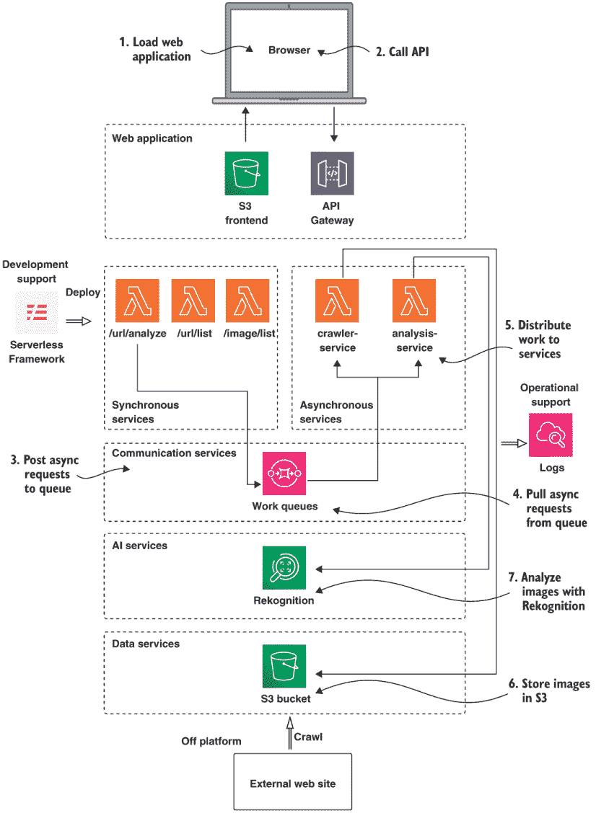

图 2.2 系统架构。系统由使用 AWS Lambda 和 API Gateway 构建的自定义服务组成。SQS 用于消息通信。这里使用的管理服务是 S3 和 Rekognition。

系统架构显示了系统的层级：

+   从前端开始，由 S3（简单存储服务）提供，通过 API 网关调用 API。

+   异步 Lambda 函数由 SQS（简单队列服务）消息触发。

+   同步 Lambda 函数由来自 API 网关的事件触发。

+   AWS Rekognition 是一个完全管理的 AI 图像分析服务。

### 2.2.1 网络应用程序

系统的前端是一个单页应用程序，由 HTML、CSS 和一些简单的 JavaScript 组成，用于渲染 UI，如图 2.3 所示。您将在本章中多次看到此图，因为我们将介绍我们系统的基础构建块。

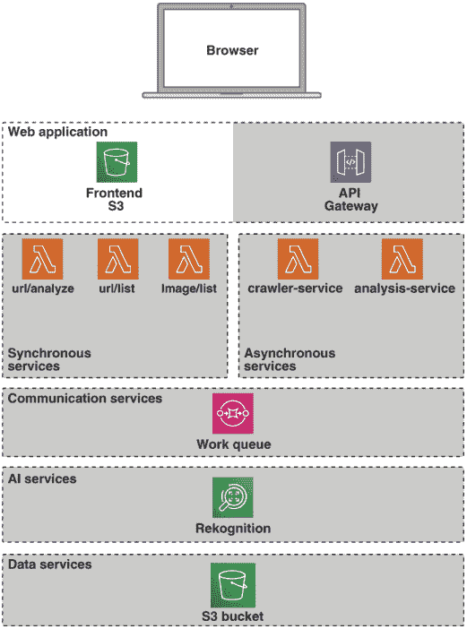

图 2.3 网络应用程序

前端部署到一个 S3 存储桶中。在这个层级中，我们使用 API 网关提供进入同步服务的路由，这些同步服务为前端提供渲染数据。

### 2.2.2 同步服务

有三个同步服务作为 Lambda 函数实现，如图 2.4 所示。

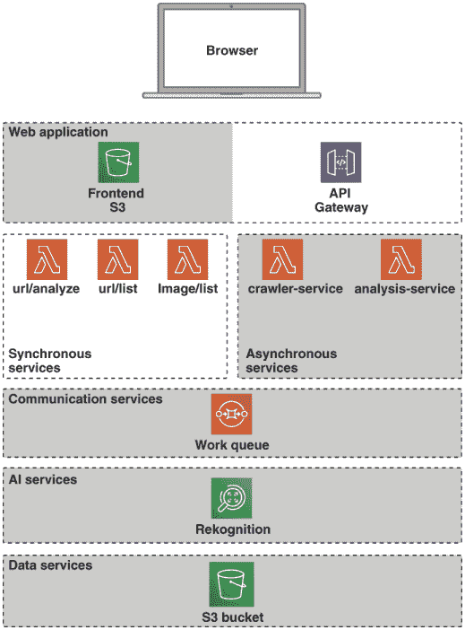

图 2.4 同步服务

这些服务作为通过 API 网关访问的 RESTful 端点提供：

+   `POST /url/analyze`--此端点接收一个包含 URL 的请求体，并将其提交到 SQS 队列以进行分析。

+   `GET /url/list`--由前端使用，以获取系统已处理的 URL 列表。

+   `GET /image/list`--返回给定 URL 已处理的图像和分析结果集。

要触发分析，我们的系统用户在 UI 顶部的输入字段中输入一个 URL，然后点击分析按钮。这将向`/url/analyze`发送一个 POST 请求，这将导致一个 JSON 消息被发送到一个形式为 SQS 队列的消息：

```
{body: {action: "download", msg: {url: "http://ai-as-a-service.s3-website-eu-west-1.amazonaws.com"}}}
```

### 2.2.3 异步服务

异步服务构成了系统的主处理引擎。有两个主要服务，如图 2.5 所示。

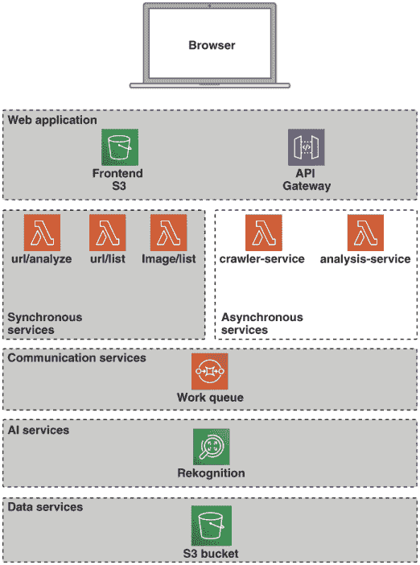

图 2.5 异步服务

爬虫服务从 HTML 页面中提取图像。分析服务提供了一个 AWS Rekognition 的接口，提交图像进行分析并汇总结果。

在收到“下载”消息后，爬虫服务将从提供的 URL 中获取 HTML。爬虫将解析此 HTML，并提取页面中每个内联图像标签的源属性。然后，爬虫将下载每个图像并将其存储在 S3 存储桶中。一旦所有图像都下载完毕，爬虫将向分析 SQS 队列发送一个分析消息：

```
{body: {action: "analyze", msg: {domain: "ai-as-a-service.s3-website-eu-west-1.amazonaws.com"}}}
```

此消息将被分析服务获取，该服务将为每个下载的图像调用图像识别 AI，收集结果，并将它们写入存储桶以供前端稍后显示。

### 2.2.4 通信服务

内部，系统使用简单队列服务（SQS）作为消息管道，如图 2.6 所示。

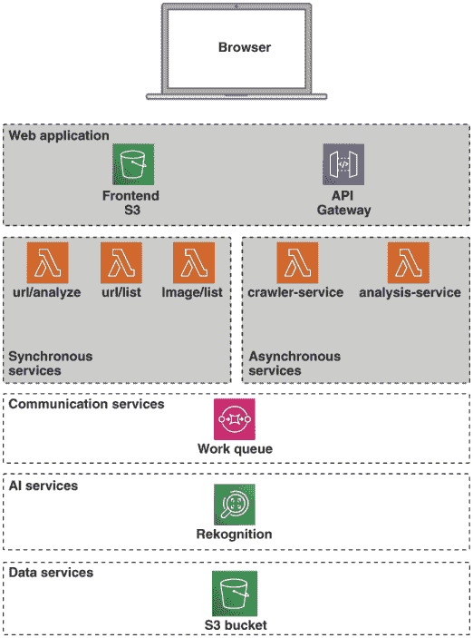

图 2.6 通信和数据服务

正如我们将在整本书中看到的那样，这种消息传递方法是一种强大的模式，它允许我们在几乎不影响整个系统的情况下向系统中添加服务或从系统中移除服务。它还迫使我们保持服务解耦，并为单独扩展服务提供了一个清晰的模型。

对于这个系统，我们使用 SQS 作为我们的主要通信机制，但我们使用术语 *通信服务* 来涵盖任何可以用来促进消费者和服务之间通信的基础设施技术。通常这需要某种形式的服务发现和一个或多个通信协议。图 2.7 描述了我们系统通信服务的隔离视图。

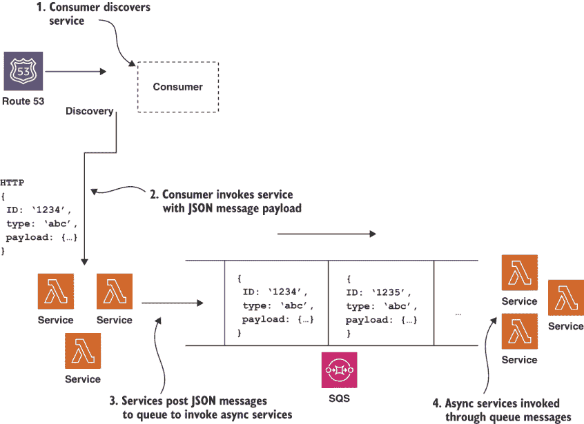

图 2.7 通信服务

所示的通信服务包括用于服务发现的 Route 53 DNS（域名系统）以及 HTTP 和 SQS 作为通信协议。通常，我们将使用 JSON 数据格式来编码双方之间的消息。这与底层通信协议无关。

消息传递技术

消息传递系统、队列和相关技术是一个大主题，我们不会在本书中详细讨论。然而，如果你还没有意识到这些概念，你应该了解它们。简而言之，消息传递系统通常支持两种模型之一--点对点或发布/订阅：

+   点对点--在这个模型下，放入队列的消息仅被发送给一个消费者，仅此一个消费者。

+   发布/订阅--在这个模型下，所有已注册对某种消息类型感兴趣的所有消费者都将接收到该消息。

队列系统在通知消费者新消息的方式上也存在差异。总的来说，这可以通过以下三种方式之一发生：

+   推送--队列系统将消息推送到消费者（们）。

+   轮询--消费者将轮询队列以获取消息。

+   长轮询--消费者将进行一段较长时间的轮询。

在本章中，SQS 将将消息推送到我们的消费 Lambda 函数。

对于这个主题的入门，我们推荐 Gregor Hohpe 和 Bobby Woolf 的《企业集成模式》（Addison-Wesley Professional，2003 年）。

### 2.2.5 人工智能服务

这个系统只使用一个人工智能服务，即 Amazon Rekognition。这个人工智能服务提供多种不同的图像识别模式，包括对象和场景检测、面部识别、面部分析、名人识别以及图像中的文本检测。对于这个第一个系统，我们使用默认的对象和场景检测 API。

### 2.2.6 数据服务

在数据服务层，我们只使用简单存储服务（S3）。这对于我们在这个初始平台的需求来说是足够的；我们将在后续章节中探索其他数据服务。

### 2.2.7 开发支持和运营支持

我们使用无服务器框架作为我们的主要开发支持系统。所有日志数据都使用 CloudWatch 收集。我们将在接下来的章节中更详细地讨论这些内容。

## 2.3 准备工作

现在我们已经看到了最终目标，让我们深入其中，将系统组合起来。您需要一个活跃的 AWS 账户。如果您还没有 AWS 账户，您需要创建一个。如果您是 AWS 的新手，请参阅附录 A，其中包含了帮助您设置的说明。

对于熟悉 AWS 的各位，我们建议您创建一个独立的子账户，以保持本书中的示例不受您可能正在运行的任何其他系统的影响。

附录 A 还包含了创建 API 密钥和配置命令行及 API 访问的说明，因此我们建议即使是经验丰富的 AWS 开发者也应该回顾这些材料，以确保正确的开发环境。

小贴士：所有示例代码已在`eu-west-1`区域进行了测试；我们建议您在代码部署时也使用此区域。

警告：使用 AWS 需要付费！请确保您完成使用后，任何云基础设施都被销毁。我们已在每章末尾提供了帮助资源移除的脚本。

### 2.3.1 DNS 域名和 SSL/TLS 证书

本章的示例以及本书其他部分的示例都需要一个 DNS 域名及其相关证书。这些可以在 AWS 上轻松设置，如何在附录 D 中提供了完整的说明。在尝试运行示例之前，请确保您已根据附录 D 中提供的说明设置了您的 AWS 环境。

#### Node.js

我们在本书中使用 Node.js 作为主要开发平台。如果您还没有安装它，您需要安装。

为什么选择 Node.js？

我们选择 Node.js 作为本书的开发平台，因为 JavaScript 的普遍性，它不仅可在每个主要网络浏览器中使用，还可以在 Node.js 平台上作为服务器端使用。此外，JavaScript 还是所有主要 FaaS（无服务器功能即服务）提供的实现语言，所有这些都使其成为自然的选择。

如果您之前没有使用过 Node.js，请不要担心。如果您甚至只了解一点 JavaScript，您也会做得很好。如果您想复习 Node（甚至 JavaScript），我们强烈推荐 Node School 的教程系列。前往[`nodeschool.io/`](https://nodeschool.io/)开始学习。

在撰写本文时，当前的长期支持（LTS）版本的 Node.js 是 10.x 和 12.x。可以从[`nodejs.org/`](https://nodejs.org/)下载二进制安装程序，为您的开发机器安装适当的二进制文件。

注意：我们将构建此系统的 AWS 上支持的最新 Node.js 版本是 12.x。为了保持一致性，最好在您的本地开发环境中选择最新的 12.x LTS 版本。

安装程序运行后，请打开控制台窗口并使用以下命令检查一切是否正常：

```
$ node -v
$ npm -v
```

NPM

NPM 是 Node.js 的包管理系统。对于我们的每个示例系统，我们将使用 NPM 来管理称为 *node 模块* 的依赖软件单元。如果您不熟悉 NPM，我们可以在 Node School 的 NPM 教程中推荐您：[`nodeschool.io/#workshopper-list`](https://nodeschool.io/#workshopper-list)。

#### Serverless Framework

接下来，我们需要安装 Serverless Framework。这个框架在基础 AWS API 之上提供了一层抽象和配置，帮助我们更轻松地创建和消费云服务。在这本书中，我们将广泛使用 Serverless Framework，因此它应该变得熟悉。我们使用 NPM 安装 Serverless。打开控制台窗口并运行

```
$ npm install -g serverless
```

NPM 全局安装

使用 `-g` 标志运行 `npm install` 告诉 NPM 全局安装一个模块。这使得模块可在路径上可用，因此可以作为系统命令执行。

通过运行以下命令来检查 Serverless 是否成功安装

```
$ serverless -v
```

Serverless Framework

有几个框架可用于帮助支持无服务器开发。在撰写本文时，领先的框架是 Serverless Framework，它由 Node.js 实现。在底层，该框架使用 Node.js AWS API 来完成其工作，并且对于 AWS，它大量依赖于 CloudFormation。在本章中，我们将仅使用该框架，而不会详细介绍其工作原理。目前，我们需要理解的关键点是，该框架允许我们将基础设施和 Lambda 函数定义为代码，这意味着我们可以以类似管理系统其他源代码的方式管理我们的操作资源。

注意 如果您想了解更多关于 Serverless 的信息，我们已在附录 E 中提供了框架操作的深入了解。

提示 第六章涵盖了某些高级无服务器主题，并为您的项目提供了生产级别的模板。

### 2.3.2 设置清单

在我们继续编写代码之前，请查看此清单以确保一切就绪：

+   附录 A

    +   AWS 账户已创建

    +   AWS 命令行已安装

    +   AWS 访问密钥已创建

    +   开发外壳配置了访问密钥并已验证

+   附录 D

    +   Route 53 域已注册

    +   SSL/TLS 证书已创建

+   本章

    +   Node.js 已安装

    +   Serverless Framework 已安装

如果所有这些都已经就绪，我们就可以开始了！

警告 请确保完成此清单中的所有项目；否则，在尝试运行示例代码时可能会遇到问题。特别是，请确保已设置环境变量 `AWS_REGION` 和 `AWS_DEFAULT_REGION`，并且它们指向附录 A 中描述的同一 AWS 区域。

### 2.3.3 获取代码

现在我们已经完成了基本设置，我们可以继续获取系统的代码。本章的源代码存储在本仓库的`chapter2-3`子目录中：[`github.com/fourTheorem/ai-as-a-service`](https://github.com/fourTheorem/ai-as-a-service)。要开始，请先克隆此仓库：

```
$ git clone https://github.com/fourTheorem/ai-as-a-service.git
```

代码映射到您可能预期的架构。每个定义的服务都有一个顶级目录，如下所示。

列表 2.1 仓库结构

```
???  analysis-service
???  crawler-service
???  frontend-service
???  resources
???  ui-service
```

### 2.3.4 设置云资源

除了我们的服务文件夹外，我们还有一个名为*resources*的顶级目录。我们的系统依赖于许多云资源，在我们能够部署任何服务元素之前，我们需要这些资源已经就绪。对于我们的简单系统，我们需要一个 SQS 队列用于异步通信和一个 S3 存储桶来存储下载的图像。我们将使用专门的 Serverless Framework 配置文件来部署这些资源。让我们看看这是如何完成的。进入`chapter2-3/resources`资源目录，查看下一个列表中的`serverless.yml`文件。

列表 2.2 资源的服务器无配置

```
service: resources                                             ❶
 frameworkVersion: ">=1.30.0"
custom:                                                        ❷
   bucket: ${env:CHAPTER2_BUCKET}
  crawlerqueue: Chap2CrawlerQueue
  analysisqueue: Chap2AnalysisQueue
  region: ${env:AWS_DEFAULT_REGION, 'eu-west-1'}
  accountid: ${env:AWS_ACCOUNT_ID}

provider:                                                      ❸
   name: aws
  runtime: nodejs12.x
  stage: dev
  region: ${env:AWS_DEFAULT_REGION, 'eu-west-1'}

resources:
  Resources:
    WebAppS3Bucket:                                            ❹
       Type: AWS::S3::Bucket
      Properties:
        BucketName: ${self:custom.bucket}
        AccessControl: PublicRead
        WebsiteConfiguration:
          IndexDocument: index.html
          ErrorDocument: index.html
    WebAppS3BucketPolicy:                                      ❺
       Type: AWS::S3::BucketPolicy
      Properties:
        Bucket:
          Ref: WebAppS3Bucket
        PolicyDocument:
          Statement:
            - Sid: PublicReadGetObject
              Effect: Allow
              Principal: "*"
              Action:
                - s3:GetObject
              Resource: arn:aws:s3:::${self:custom.bucket}/*
    Chap2CrawlerQueue:                                         ❻
       Type: "AWS::SQS::Queue"
      Properties:
        QueueName: "${self:custom.crawlerqueue}"
    Chap2AnalysisQueue:
      Type: "AWS::SQS::Queue"
      Properties:
        QueueName: "${self:custom.analysisqueue}"
```

❶ 服务名称

❷ 自定义定义

❸ 特定提供者

❹ 存储桶定义

❺ 存储桶策略

❻ 队列定义

提示：Serverless 使用*YAML*文件格式进行配置。YAML 代表*YAML Ain’t Markup Language*；您可以在本网站上找到有关 YAML 的更多信息：[`yaml.org/`](http://yaml.org/)。

如果一开始看起来令人不知所措，请不要担心。我们将在这本书中一直使用 Serverless Framework，因此这些配置文件将变得非常熟悉。让我们看看这个文件的总体结构。

提示：Serverless Framework 及其配置的完整文档可以在项目的主要网站上找到：[`serverless.com/framework/docs/`](https://serverless.com/framework/docs/)。

服务器无配置被分解为几个顶级部分。其中关键的部分是

+   `custom`--定义在配置中其他地方使用的属性。

+   `provider`--定义框架中特定提供者的配置。在本例中，我们使用 AWS 作为提供者；然而，该框架支持多个云平台

+   `functions`--定义服务实现的功能端点。在本例中，我们没有要定义的功能，因此本例中不存在此部分。

+   `resources`--定义云平台上的支持资源。在本例中，我们定义了两个 SQS 队列和一个 S3 存储桶。当我们部署此配置时，Serverless Framework 将为我们创建队列和存储桶。

注意：还有许多其他工具可以用来部署云资源，例如 AWS CloudFormation 或 Hashicorp 的 Terraform，这两者都是管理基础设施代码的出色工具。如果你有一个基础设施密集型项目，我们建议调查这些工具。对于这本书，我们将几乎完全使用无服务器框架。我们还注意到，无服务器框架在 AWS 底层使用 CloudFormation；我们将在附录 E 中更详细地介绍这一点。

在我们继续部署资源之前，我们需要确定一个存储桶名称。AWS 存储桶名称空间是全球性的，因此你应该选择一个可用的名称，并在你的 shell 中添加一个额外的环境变量`CHAPTER2_BUCKET`，就像我们设置 AWS 环境变量一样：

```
export CHAPTER2_BUCKET=<YOUR BUCKET NAME>
```

将`<YOUR BUCKET NAME>`替换为你选择的唯一名称。现在我们已经准备好了，让我们继续部署资源。在`chapter2-3/resources`目录的命令行中运行

```
$ serverless deploy
```

无服务器将自动部署我们的资源，你应该会看到类似以下列表的输出。

列表 2.3 无服务器部署输出

```
Serverless: Packaging service...
Serverless: Creating Stack...
Serverless: Checking Stack create progress...
.....
Serverless: Stack create finished...
Serverless: Uploading CloudFormation file to S3...
Serverless: Uploading artifacts...
Serverless: Validating template...
Serverless: Updating Stack...
Serverless: Checking Stack update progress...
..............
Serverless: Stack update finished...
Service Information
service: resources
stage: dev
region: eu-west-1
stack: resources-dev
api keys:
  None
endpoints:
  None
functions:
  None
```

无服务器已经为我们创建了一个 S3 存储桶和一个 SQS 队列。现在我们已经有了支持的基础设施，我们可以继续进行实际实现了！

## 2.4 实现异步服务

在完成基本设置后，我们可以继续编写我们的第一个服务。在本节中，我们将组合爬虫和分析异步服务，并在隔离状态下测试它们。

### 2.4.1 爬虫服务

首先，让我们看看`crawler-service`的代码。图 2.8 展示了该服务内部的流程。

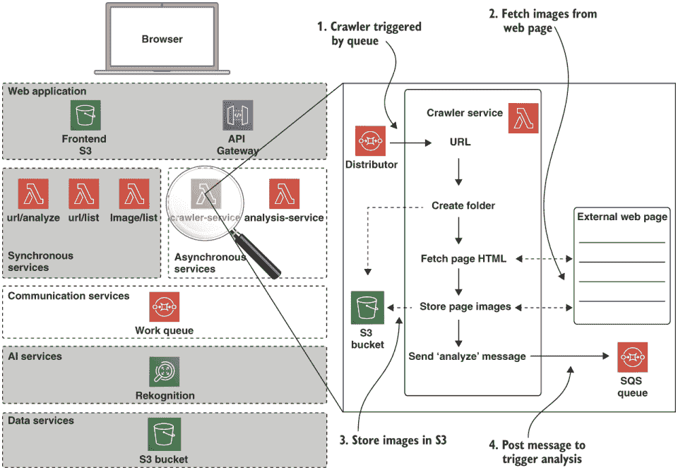

图 2.8 爬虫服务

当消息被放置在`crawler`队列中时，会调用`crawler-service`。消息包含服务要爬取的目标 URL。一旦被调用，爬虫会抓取指定 URL 的 HTML 页面，并解析出图像标签。然后，对于每个图像依次，它会将图像下载到 S3 文件夹中。最后，一旦所有图像都下载完毕，它会向`analysis`队列发送一个`analyze`消息，包括分析 URL 的域名以进行进一步处理。

爬虫服务的代码位于`chapter2-3/crawler-service`。进入这个目录，你应该会看到以下列出的文件：

```
handler.js
images.js
package.json
serverless.yml
```

为了了解此服务使用的资源及其整体结构，我们首先应该查看文件`serverless.yml`，其中包含下一列表中显示的配置。

列表 2.4 爬虫服务的`serverless.yml`

```
service: crawler-service
frameworkVersion: ">=1.30.0"
custom:
  bucket: ${env:CHAPTER2_BUCKET}                              ❶
  crawlerqueue: Chap2CrawlerQueue                             ❷
  analysisqueue: Chap2AnalysisQueue
  region: ${env:AWS_DEFAULT_REGION, 'eu-west-1'}
  accountid: ${env:AWS_ACCOUNT_ID}                            ❸

provider:
  name: aws
  runtime: nodejs12.x
  stage: dev
  region: ${env:AWS_DEFAULT_REGION, 'eu-west-1'}
  iamRoleStatements:
    - Effect: Allow                                           ❹
      Action:
        - s3:PutObject
      Resource: "arn:aws:s3:::${self:custom.bucket}/*"
    - Effect: Allow
      Action:
        - sqs:ListQueues
      Resource: "arn:aws:sqs:${self:provider.region}:*:*"
    - Effect: Allow                                           ❺
      Action:
        - sqs:ReceiveMessage
        - sqs:DeleteMessage
        - sqs:GetQueueUrl
      Resource: "arn:aws:sqs:*:*:${self:custom.crawlerqueue}"
    - Effect: Allow                                           ❻
      Action:
        - sqs:SendMessage
        - sqs:DeleteMessage
        - sqs:GetQueueUrl
      Resource: "arn:aws:sqs:*:*:${self:custom.analysisqueue}"

functions:
  crawlImages:                                                ❼
    handler: handler.crawlImages
    environment:
      BUCKET: ${self:custom.bucket}
      ANALYSIS_QUEUE: ${self:custom.analysisqueue}
      REGION: ${self:custom.region}
      ACCOUNTID: ${self:custom.accountid}
    events:
      - sqs:                                                  ❽
          arn: "arn:aws:sqs:${self:provider.region}:${env:AWS_ACCOUNT_ID} \
          :${self:custom.crawlerqueue}"
```

❶ S3 存储桶名称

❷ SQS 队列名称

❸ 本地环境中的账户 ID

❹ S3 权限

❺ 允许从爬虫队列接收

❻ 允许向分析队列发送

❼ 定义处理函数的入口点

❽ 由爬虫队列触发的函数

此配置的效果是定义并部署我们的爬虫服务函数到 AWS，并允许它通过资源配置中部署的爬虫 SQS 队列触发。关键部分如下

+   `custom`--定义在配置中其他地方使用的属性。

+   `provider`--在此配置中的提供者部分设置 AWS 权限，允许服务访问 SQS 队列，并授予它写入我们 S3 存储桶的权限。

+   `functions`--此部分定义了服务 Lambda。处理器设置引用了实现，我们将在稍后查看。事件条目将函数连接到我们之前部署的 SQS 爬虫队列。最后，环境块定义了将可用于我们的函数的环境变量。

注意：`iamRoleStatements`块中定义的权限直接映射到 AWS 身份和访问管理（IAM）模型。关于这方面的完整文档可以在 AWS 上找到，网址为[`aws.amazon.com/iam`](https://aws.amazon.com/iam)。

与我们资源之前的`serverless.yml`文件不同，此文件没有定义任何资源。这是因为我们选择在服务范围之外定义我们的资源。一般来说，一个很好的经验法则是，全局或共享资源应该部署在公共资源堆栈中；用于单个服务的资源应该与该特定服务一起部署。

在无服务器 YAML 文件中的“资源”部分定义了在部署时将创建的资源。依赖于此资源的其他服务必须在资源创建后部署。我们发现将全局资源放在单独的配置中是最好的做法。

让我们现在看看爬虫的主要实现文件`handler.js`。在文件顶部，我们包含了一些模块，如下所示。

列表 2.5 爬虫 handler.js 所需模块

```
const request = require('request') 1((CO3-1))          ❶
const urlParser = require('url')                       ❷
const AWS = require('aws-sdk')                         ❸
const s3 = new AWS.S3()
const sqs = new AWS.SQS({region: process.env.REGION})
const images = require('./images')()                   ❹
```

❶ request 是一个实现功能齐全的 HTTP 客户端的 node 模块。

❷ url 是一个核心 node 模块，它理解如何解析 URL。

❸ 包含 AWS SDK 节点模块。在这种情况下，我们实例化了 S3 和 SQS 对象，以便分别与我们的 S3 存储桶和队列进行接口。

❹ ./images 指的是文件 images.js 中的我们自己的模块。

进入此服务的主要入口点是`crawlImages`。此函数接受三个参数：`event`、`context`和`cb`。下面的代码展示了这一部分。

列表 2.6 爬虫服务入口点

```
module.exports.crawlImages = function (event, context, cb) {
  asnc.eachSeries(event.Records, (record, asnCb) => {           ❶
    let { body } = record

    try {
      body = JSON.parse(body)
    } catch (exp) {
      return asnCb('message parse error: ' + record)
    }

    if (body.action === 'download' && body.msg && body.msg.url) {
      const udomain = createUniqueDomain(body.msg.url)
      crawl(udomain, body.msg.url, context).then(result => {    ❷
        queueAnalysis(udomain, body.msg.url, context).
        then(result => {                                        ❸
          asnCb(null, result)
        })
      })
    } else {
      asnCb('malformed message')
    }
  }, (err) => {
    if (err) { console.log(err) }
    cb()
  })
}
```

❶ 遍历消息

❷ 爬取图像的 URL。

❸ 向 SQS 发送消息以触发分析

函数接受以下三个参数：

1.  `event`--提供有关正在处理的当前事件的详细信息。在这种情况下，事件对象包含从 SQS 队列中取出的记录数组。

1.  `context`--由 AWS 用于提供调用上下文信息，例如可用内存量、执行时间和客户端调用上下文。

1.  `cb`--回调函数。处理完成后，应由处理程序调用此函数并传递结果。

回调和异步 I/O

回调函数是 JavaScript 的一个基本组成部分，允许代码异步执行并通过执行传入的回调参数返回结果。回调对于异步 I/O（与同步 I/O 相比）是一个自然的语法匹配，这也是 Node.js 平台成功的原因之一。如果你需要复习 JavaScript 函数和回调，我们可以推荐 Node School 的“Javascripting”教程，该教程可在 [`nodeschool.io/`](https://nodeschool.io/) 找到。

最后，对于捕获服务，让我们简要看看下一个列表中所示的 `package.json` 文件。此文件提供了一组 Node 模块依赖项。

列表 2.7 捕获服务 `package.json`

```
{
  "name": "crawler-service",
  "version": "1.0.0",              ❶
  "description": "",
  "main": "handler.js",
  "scripts": {
    "test": "echo \"Error: no test specified\" && exit 1"
  },
  "author": "",
  "license": "ISC",
  "dependencies": {
    "async": "³.2.0",
    "aws-sdk": "².286.2",        ❷
    "htmlparser2": "³.9.2",
    "request": "².87.0",
    "shortid": "².2.15",
    "uuid": "³.3.2"
  }
} 
```

❶ 设置模块版本号

❷ 设置 aws-sdk 模块版本

package.json

虽然 `package.json` 文件的格式相对简单，但也有一些细微差别，例如语义版本支持脚本。在这里描述全部细节超出了本书的范围。关于这个主题的深入覆盖可以在 NPM 的 [`docs.npmjs.com/files/package.json`](https://docs.npmjs.com/files/package.json) 找到。

这个入口函数相当简单。它只是调用 `crawl` 函数从事件对象中提供的 URL 下载图像，一旦捕获完成，它将一条消息排队到 SQS，表明下载的图像已准备好进行分析。

主 `crawl` 函数在下面的列表中展示。

列表 2.8 `crawl` 函数

```
function crawl (url, context) {
  const domain = urlParser.parse(url).hostname                         ❶

  return new Promise(resolve => {
    request(url, (err, response, body) => {                            ❷
      if (err || response.statusCode !== 200) {
        return resolve({statusCode: 500, body: err})
      }
      images.parseImageUrls(body, url).then(urls => {                  ❸
        images.fetchImages(urls, domain).then(results =>               ❹
          writeStatus(url, domain, results).then(result => {           ❺
            resolve({statusCode: 200, body: JSON.stringify(result)})
          })
        })
      })
    })
  })
}
```

❶ 从请求的 URL 中提取域名部分。

❷ 使用请求模块获取给定 URL 的 HTML。

❸ 解析的 HTML 内容被传递给 `parseImageUrls` 函数，该函数返回一个用于下载的图像列表。

❹ 将图像列表传递给 `fetchImages` 函数，该函数将每个图像下载到指定的存储桶。

❺ 最后，该函数将状态文件写入存储桶，以便下游服务在解析承诺之前消费。

Promises 和箭头函数

如果你稍微有些 JavaScript 实践不足，你可能想知道构造 `.then(result => `{...` 的含义。箭头函数操作符是 `function` 关键字的替代（略有变化）。出于实用目的，你可以将以下内容视为等价：

```
result => { console.log(result) }
function (result) { console.log(result) }
```

`.then` 构造定义了一个在承诺解析时被调用的处理函数。承诺为异步 I/O 提供了替代回调的机制。许多人更喜欢使用承诺而不是回调，因为它有助于使代码更干净，并避免俗称的“回调地狱”。如果你不熟悉承诺，可以在 [`www.promisejs.org/`](https://www.promisejs.org/) 找到全部细节。

下一个列表中显示的`queueAnalysis`函数使用 AWS SQS 接口向分析队列发送消息，该消息稍后将被分析服务获取。

列表 2.9 `queueAnalysis`函数

```
function queueAnalysis (url, context) {
  let domain = urlParser.parse(url).hostname
  let accountId = process.env.ACCOUNTID
  if (!accountId) {
    accountId = context.invokedFunctionArn.split(':')[4]
  }
  let queueUrl = `https://sqs.${process.env.REGION}.amazonaws.com/
    ${accountId}/
    ${process.env.ANALYSIS_QUEUE}`                 ❶

  let params = {                                   ❷
    MessageBody: JSON.stringify({action: 'analyze', msg: {domain: domain}}),
    QueueUrl: queueUrl
  }

  return new Promise(resolve => {
    sqs.sendMessage(params, (err, data) => {       ❸
    ...
    })
  })
}
```

❶ 构建 SQS 端点 URL。

❷ 构建消息正文。

❸ 将消息发布到 SQS。

现在我们已经理解了爬虫的代码，让我们部署这个服务。首先我们需要安装支持节点模块。为此，`cd`到`crawler-service`目录并运行

```
$ npm install
```

我们现在可以通过运行 Serverless Framework 的`deploy`命令来部署我们的服务：

```
$ serverless deploy
```

一旦此命令完成，我们可以通过检查 AWS Lambda 控制台来确认一切正常，它应该类似于图 2.9。

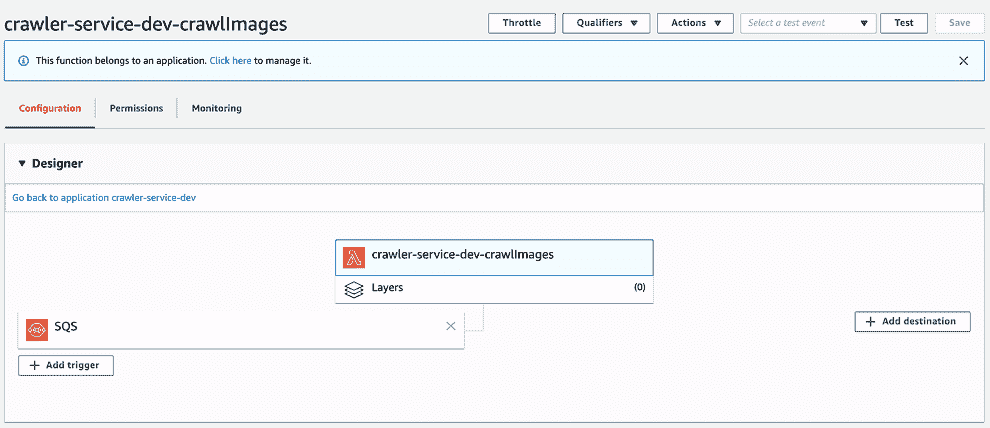

图 2.9 爬虫服务 Lambda

在我们继续分析函数之前，让我们通过向 SQS 发送消息来测试爬虫。打开 AWS 控制台，转到 SQS 服务页面，并在相应区域中选择`Chap2CrawlerQueue`。然后从队列操作下拉菜单中选择发送消息。

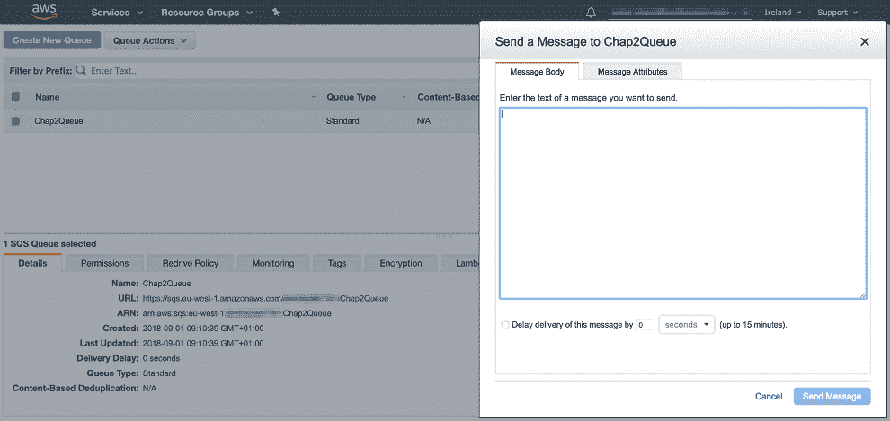

图 2.10 发送 SQS 消息

将此处显示的 JSON 粘贴到消息窗口中，然后点击发送消息：

```
{
  "action": "download",
  "msg": {
    "url": "http://ai-as-a-service.s3-website-eu-west-1.amazonaws.com"
  }
}
```

*注意* 我们为了测试目的创建了一个简单的静态网站，使用 S3，并在测试消息中的 URL 上放置了一些示例图片，但如果你更喜欢，可以使用不同的 URL--例如，谷歌图片搜索的结果。

消息将被附加到 SQS 队列，并由爬虫服务获取。我们可以查看爬虫日志以确认这一点。打开 AWS 控制台，然后打开 CloudWatch。点击左侧的日志菜单项，然后选择爬虫服务，列出的为`crawler-service -dev-crawlimages`，以检查日志。你应该会看到类似于图 2.11 的输出。

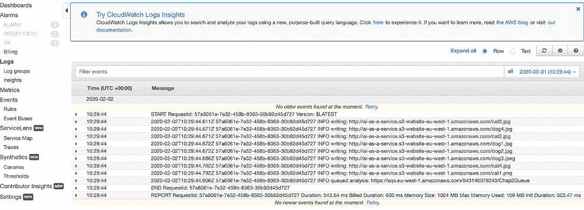

图 2.11 爬虫的 CloudWatch 日志

最后让我们检查我们的图片是否正确下载。打开 AWS 控制台，转到 S3 服务。选择您的存储桶。您应该看到一个名为`ai-as-a-service.s3-website-eu-west-1.amazonaws.com`的文件夹。点击进入以查看下载的图片，如图 2.12 所示。

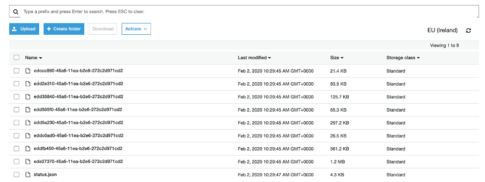

图 2.12 下载的图片

在下一章中，我们将把注意力转向分析服务，并完成异步服务的部署，然后再部署系统的其余部分。现在，好好休息一下，并祝贺自己到目前为止的辛勤工作！

## 摘要

+   AWS 提供了一系列不断增长的云原生服务，我们可以利用。在本章中，我们使用了 S3、Route53、Lambda 和 SQS。

+   AWS 提供了一个基于 Web 的控制台，我们可以使用它来设置账户并配置 API 访问密钥

+   无服务器框架用于部署云基础设施，包括 S3 存储桶、SQS 队列和 Route53 DNS 记录。一个`serverless.yml`文件允许我们以可预测和逻辑的方式定义和部署我们的基础设施。

+   一个 SQS 队列连接到一个爬虫 Lambda 函数。

+   爬虫服务是一个 Lambda 函数，它下载图片并将它们放置在 S3 存储桶中。

*警告* 第三章将继续构建这个系统，并在第三章末尾提供如何删除已部署资源的说明。如果你在一段时间内不打算处理第三章，请确保你完全删除本章中部署的所有云资源，以避免额外费用！
