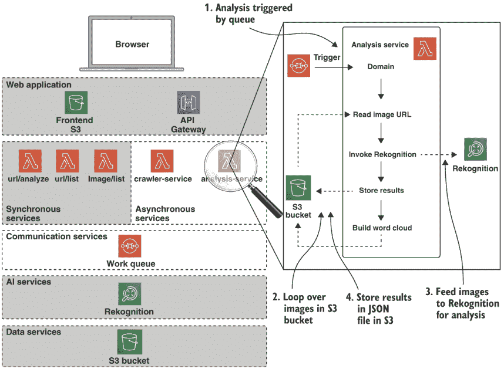
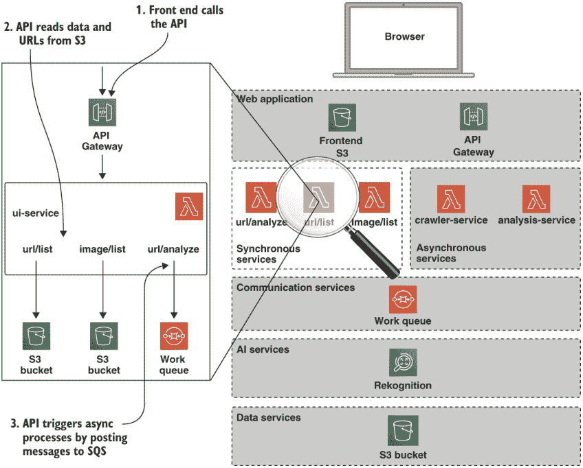
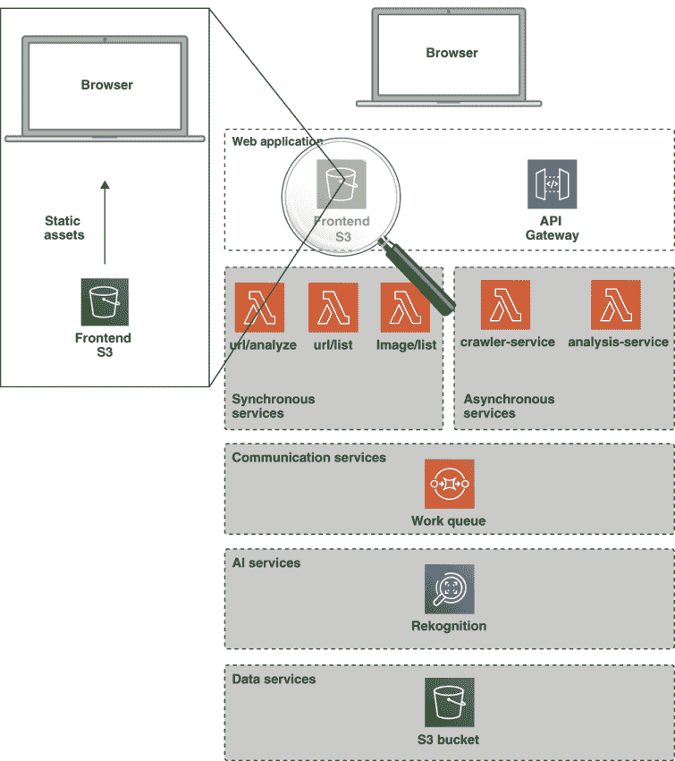
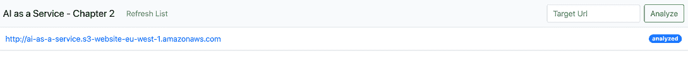
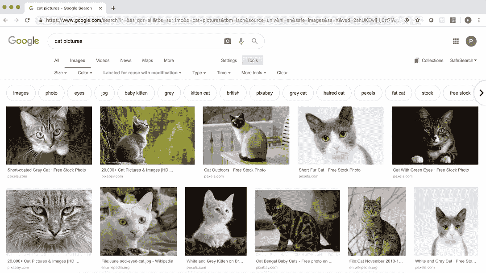
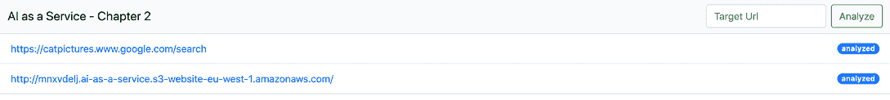
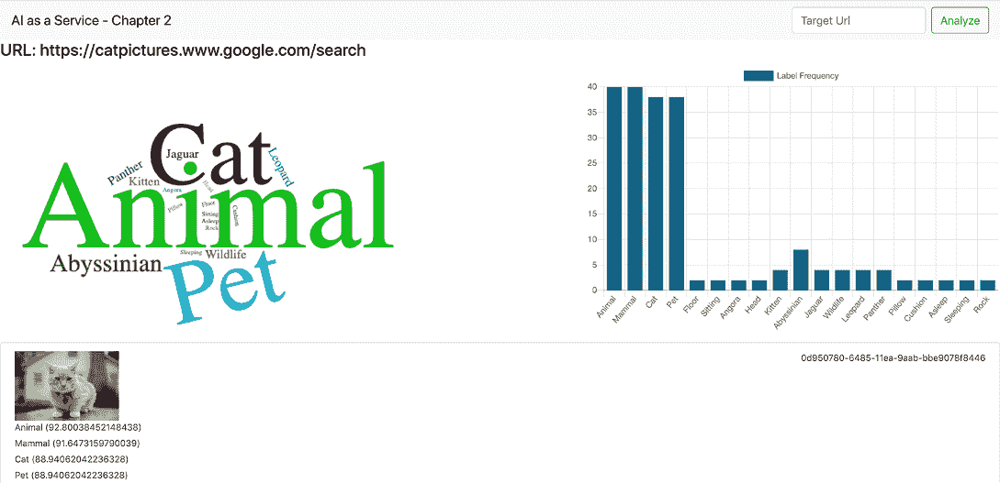
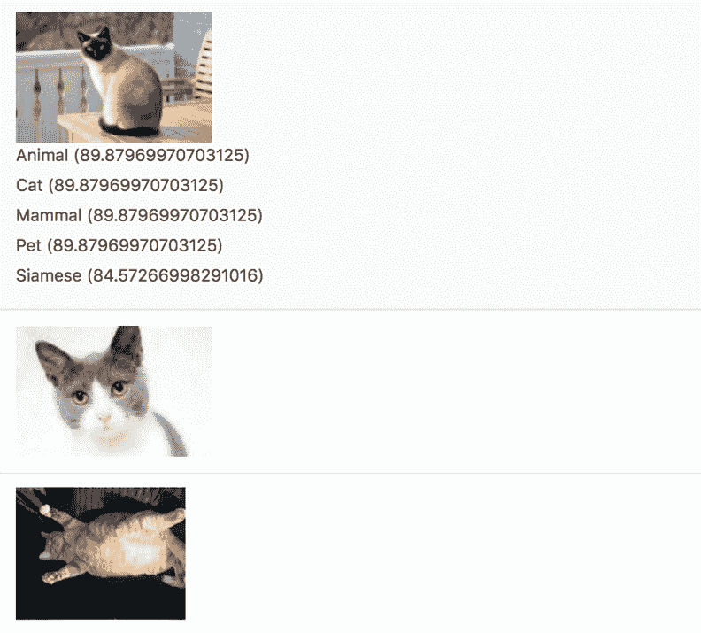

# 3 构建无服务器图像识别系统，第二部分

本章涵盖了

+   构建简单的 AI as a Service 系统

+   消费人工智能图像识别服务

+   实现同步和异步服务

+   部署用户界面

+   部署到云端

在本章中，我们将继续构建我们在第二章开始的服务器端无服务器图像识别系统。我们将添加我们的图像识别服务，该服务将调用 AWS Rekognition 来为我们完成繁重的工作。一旦完成，我们将为我们的系统构建一个简单的前端，以便我们可以测试我们的图像识别能力。

如果你还没有完成第二章的内容，你应该在继续本章之前返回并完成它，因为我们将直接基于那里开始的工作进行构建。如果你对第二章的内容感到满意，我们可以直接从我们离开的地方继续，并部署分析服务。

## 3.1 部署异步服务

在第二章中，我们设置了我们的开发环境并部署了爬虫服务。在本章中，我们将继续部署系统的其余部分，从分析服务开始。

### 3.1.1 分析服务

让我们来看看 `analysis-service`。与 `crawler-service` 类似，当我们的 S3 存储桶中有可供分析图像时，该服务会由 Analysis SQS 队列的消息触发。该服务的逻辑概述如图 3.1 所示。



图 3.1 分析服务

从本质上讲，`analysis-service` 在下载的图像和亚马逊 Rekognition 服务之间形成了一座桥梁。`crawler-service` 下载的每一张图像都会输入到 Rekognition 中，并返回一组标签。每个标签都是一个描述图像中由模型识别的对象的词，以及一个置信度水平（一个介于 0 和 100 之间的数字，其中 100 表示对图像标签的完全置信）。

在此分析之后，该服务处理返回的数据以创建一组词频，这些词频可以输入到词云生成器中。背后的想法是尝试在给定 URL 上可用的图像之间视觉上确定一个共同的主题。

让我们来看看 `analysis-service` 中的代码，从 `serverless.yml` 配置开始，看看这是如何实现的。这将在下一列表中展示。

图 3.1 分析服务 `serverless.yml`

```
service: analysis-service
custom:
  bucket: ${env:CHAPTER2_BUCKET}
  ...

provider:
  ...
  iamRoleStatements:
    - Effect: "Allow"               ❶
      Action:
        - "rekognition:*"
      Resource: "*"
  ...

functions:
  analyzeImages:                    ❷
    handler: handler.analyzeImages
    ...
```

❶ 允许访问 Rekognition API。

❷ 定义主入口点

我们应该注意，这个服务的 `serverless.yml` 配置文件与之前的非常相似。主要区别在于它允许 Lambda 函数访问 Rekognition API。让我们看看这个接口是如何工作的。`analysis-service` 代码中的 `handler.js` 文件实现了这个接口。

以下列表显示了 `analysis-service` 的 `require` 语句。

图 3.2 分析服务 require

```
const AWS = require('aws-sdk')       ❶
const s3 = new AWS.S3()              ❷
const rek = new AWS.Rekognition()    ❸
```

❶ AWS SDK 模块已加载。

❷ S3 接口是为了处理存储桶及其对象而创建的。

❸ 创建 Rekognition 接口。

下一个列表显示了如何在`analyzeImageLabels`函数中使用 Rekognition 对象。

图 3.3 使用 Rekognition API

```
function analyzeImageLabels (imageBucketKey) {
  const params = {                                ❶
    Image: {
      S3Object: {
        Bucket: process.env.BUCKET,
        Name: imageBucketKey
      }
    },
    MaxLabels: 10,
    MinConfidence: 80
  }
  return new Promise((resolve, reject) => {
    rek.detectLabels(params, (err, data) => {    ❷
      if (err) {
        return resolve({image: imageBucketKey, labels: [], err: err})
      }
      return resolve({image: imageBucketKey,
        labels: data.Labels})                    ❸
    })
  })
}
```

❶ 创建 Rekognition 调用参数。

❷ 调用 Rekognition 的 detectLabel API。

❸ 承诺解析为结果。

这个简单的函数实现了很多功能！它触发了一个图像识别 AI 服务对存储在 S3 存储桶中的图像文件进行运行，然后返回一组结果以供进一步处理。所有这些都在相当少的代码中完成！

应该注意的是，我们可以用 Rekognition 做很多事情；然而，出于这个代码的目的，我们只是使用了默认设置。我们将在后面的章节中更详细地探讨这一点。

小贴士：Rekognition 不仅适用于视频，也适用于静态图像，并且可以用于检测图像中的各种特征，如微笑或皱眉的脸，图像中的文本，以及知名人士。你能想到哪些对你的最终用户有益的应用？例如，我们最近用它来检测图像中的地址和邮政编码。

`analysis-service`的最终列表显示了`wordCloudList`函数。该函数计算所有检测到的标签中单词出现的次数。

图 3.4 `wordCloudList`计算

```
function wordCloudList (labels) {            ❶
  let counts = {}
  let wcList = []

  labels.forEach(set => {                    ❷
    set.labels.forEach(lab => {
      if (!counts[lab.Name]) {
        counts[lab.Name] = 1
      } else {
        counts[lab.Name] = counts[lab.Name] + 1
      }
    })
  })

  Object.keys(counts).forEach(key => {       ❸
    wcList.push([key, counts[key]])
  })
  return wcList
}
```

❶ 函数接受一个标签对象的数组。

❷ 遍历每个标签对象中设置的标签集以计算标签出现次数。

❸ 将计数映射转换为表示为两个元素数组的单词-计数对的数组。

让我们继续使用 Serverless Framework 部署分析服务：

```
$ cd analysis-service
$ npm install
$ serverless deploy
```

一旦部署成功完成，我们可以通过 AWS 控制台将一个测试消息排队到 SQS 中，重新运行我们的系统。请继续这样做，发送与之前相同的 JSON 消息：

```
{
  "action": "download",
  "msg": {
    "url": "http://ai-as-a-service.s3-website-eu-west-1.amazonaws.com"
  }
}
```

这将导致爬虫服务运行。一旦完成，爬虫将向分析 SQS 队列发送一条消息，请求对下载的图像进行分析，这将触发分析服务。最终结果将是一组标签添加到 S3 中的`status.json`文件中。如果你打开这个文件，你应该会看到以下类似的列表。

图 3.5 `wordCloudList`计算结果

```
{
  "url": "http://ai-as-a-service.s3-website-eu-west-1.amazonaws.com",
  "stat": "analyzed",
  "downloadResults": [         ❶
    {
      "url": "http://ai-as-a-service.s3-website-eu-west-1.amazonaws.com/cat1.png",
      "stat": "ok"
    },
    ...
  ],
  "analysisResults": [         ❷
    {
      "image": "ai-as-a-service.s3-website-eu-west-1.amazonaws.com/cat1.png",
      "labels": [
        {
          "Name": "Cat",
          "Confidence": 99.03962707519531
        }
      ]
      ...
  ],
  "wordCloudList": [           ❸
    [ "Cat", 3 ],
    [ "Dog", 3 ],
    ....
  ]
}
```

❶ 图像下载结果

❷ 图像分析结果

❸ 单词云计算

对于一个更完整的系统，我们可能会考虑将此信息存储在数据库或键/值存储中；然而，对于这个第一个演示，S3 就足够好了。此状态文件用于驱动前端和 UI 服务，我们现在将关注这些服务。

## 3.2 实现同步服务

在这个系统中，同步服务由 UI 服务和前端组成。前端在浏览器中渲染和执行，而 UI 服务作为三个 Lambda 函数执行。

### 3.2.1 UI 服务

图 3.2 概述了 UI 服务的操作。

如上图所示，UI 服务公开了三个端点：

+   `url/list` 列出已提交进行分析的所有 URL。

+   `image/list` 列出针对特定 URL 已分析的所有图像。

+   `url/analyze` 提交 URL 以进行分析。

Serverless 框架允许我们在单个配置文件中定义多个 Lambda 函数，我们已经在 UI 服务的配置中使用了这一点。让我们看一下 UI 服务的 `serverless.yml` 文件，它将在下一个列表中展示。



图 3.2 UI 服务

图 3.6 UI 服务 `serverless.yml`

```
service: ui-service
frameworkVersion: ">=1.30.0"
plugins:
  - serverless-domain-manager                        ❶
custom:
  bucket: ${env:CHAPTER2_BUCKET}
  queue: Chap2Queue
  region: ${env:AWS_DEFAULT_REGION, 'eu-west-1'}
  domain: ${env:CHAPTER2_DOMAIN}
  accountid: ${env:AWS_ACCOUNT_ID}
  customDomain:                                      ❷
    domainName: 'chapter2api.${self:custom.domain}'
    stage: dev
    basePath: api
    certificateName: '*.${self:custom.domain}'
    createRoute53Record: true
    endpointType: regional

provider:
  name: aws
  runtime: nodejs12.x
  region: ${env:AWS_DEFAULT_REGION, 'eu-west-1'}
  iamRoleStatements:                                 ❸
  ...

functions:
  analyzeUrl:                                        ❹
    handler: handler.analyzeUrl
    environment:
     ...
    events:
      - http:
          path: url/analyze
          method: post
  listUrls:                                          ❺
    handler: handler.listUrls
    ...
  listImages:                                        ❻
     handler: handler.listImages
    ....
```

❶ 域插件

❷ 自定义域名设置

❸ 角色权限

❹ 分析 URL Lambda HTTP POST

❺ 列出 URL Lambda

❻ 列出图像 Lambda

此配置在之前的配置文件之上引入了一些新元素。首先，我们使用了一个自定义插件--`serverless-domain-manager`。我们使用它来帮助我们为我们的服务设置一个自定义域名。如果您还记得，在第二章的开始，我们在 Route53 中设置了一个域名并创建了一个通配符证书。一会儿，我们将使用此域名来为我们的 UI 服务。

在此阶段，配置中的权限部分应该看起来很熟悉。函数部分略有不同，因为它有三个条目。请注意，每个条目都是相似的，因为它与一个 `HTTP` 事件相关联。这告诉 Serverless 将函数绑定到 API Gateway，并通过给定的路由使函数可用。自定义域名条目用于为服务创建 DNS 条目，并将其连接到 API Gateway。我们将在一会儿部署此服务，但首先让我们看看实现，它在 `handler.js` 文件中。

在现在应该已经熟悉的模式中，我们引入 AWS SDK 并创建服务所需的对象，在这种情况下是 S3 和 SQS。这将在以下列表中展示。

图 3.7 UI 服务 `require`

```
const urlParser = require('url')    ❶
const AWS = require('aws-sdk')      ❷
const s3 = new AWS.S3()
const sqs = new AWS.SQS({region: process.env.REGION})
```

❶ 加载 url 节点模块以进行 URL 解析。

❷ 加载 AWS SDK 并实例化 S3 和 SQS 接口。

该服务定义了三个入口点，它们将被部署为三个单独的 Lambda 函数。`listUrl` 函数将在下一个列表中提供。

图 3.8 `listUrls` 函数

```
module.exports.listUrls = (event, context, cb) => {     ❶
  const params = {
    Bucket: process.env.BUCKET,
    Delimiter: '/',
    MaxKeys: 1000
  }

  s3.listObjectsV2(params, (err, data) => {             ❷
    let promises = []
    if (err) { return respond(500, {stat: 'error', details: err}, cb) }

    data.CommonPrefixes.forEach(prefix => {
      promises.push(readStatus(prefix.Prefix))
    })
    Promise.all(promises).then(values => {
      let result = []
      values.forEach(value => {
        result.push({url: value.url, stat: value.stat})
      })
      respond(200,
        {stat: 'ok', details: result}, cb)              ❸
    })
  })
}
```

❶ 入口点

❷ 列出 S3 对象

❸ 返回 URL 列表

注意，此函数的入口点与我们的所有其他服务完全相同，尽管在这种情况下，该函数将通过 API Gateway 作为 HTTP GET 请求执行。该函数相当简单，它只是列出我们 S3 存储桶顶层的一组文件夹，并将列表作为 JSON 数组返回。

我们的 `listImages` 函数更加简单，因为它从 S3 读取 `status.json` 文件并返回用于显示的内容，所以我们在这里不会详细说明它。相反，让我们看一下以下代码中的 `analyzeUrl` 函数。

图 3.9 `analyzeUrl`

```
module.exports.analyzeUrl = (event, context, cb) => {
  let accountId = process.env.ACCOUNTID
  if (!accountId) {
    accountId = context.invokedFunctionArn.split(':')[4]
  }
  const queueUrl = `https://sqs.${process.env.REGION}.amazonaws.com/
    ${accountId}/
    ${process.env.QUEUE}`                    ❶

  const body = JSON.parse(event.body)

  const params = {
    MessageBody: JSON.stringify({action: 'download', msg: body}),
    QueueUrl: queueUrl
  }

  sqs.sendMessage(params, (err, data) => {   ❷
     if (err) { return respond(500, {stat: 'error', details: err}, cb) }
    respond(200,
      {stat: 'ok', details: {queue: queueUrl, msgId: data.MessageId}}, cb)
  })
}
```

❶ 构建队列 URL

❷ 发送 SQS 消息

再次，这个函数相当直接。它将 URL 作为事件体，并将此 URL 作为消息有效负载的一部分发布到我们的 SQS 队列，由爬虫服务处理。

单一职责原则

*单一职责原则*或*SRP*是一个强大的理念，它帮助我们保持代码的解耦和良好的维护。希望你能看到，到目前为止的所有代码都遵循了 SRP。我们喜欢将 SRP 视为适用于多个层面的东西：

+   在架构层面，每个服务应该有一个单一的目的。

+   在实现层面，每个函数应该有一个单一的目的。

+   在“代码行”级别，每一行只应该做一件事。

我们所说的“代码行”级别是什么意思呢？嗯，以下代码在一行中做了多件事，因为它获取了`bar`的值并对其与`foo`进行了测试：

```
if (foo !== (bar = getBarValue())) {
```

一个更清晰的实现是将代码拆分为两行，这样每行只做一件事：

```
bar = getBarValue()
if (foo !== bar) {
```

现在我们已经了解了 UI 服务代码，让我们继续部署它。首先，我们需要创建自定义域名条目。`serverless.yml`文件使用环境变量`CHAPTER2_DOMAIN`作为`ui-service`部署的基础域名。如果你还没有设置此变量，你应该现在设置它，通过将以下列表的内容添加到你的 shell 启动脚本中。

图 3.10 设置基础域的环境变量

```
export CHAPTER2_DOMAIN=<MY CUSTOM DOMAIN>
```

将`<MY CUSTOM DOMAIN>`替换为章节开头创建的域名。

接下来我们需要安装支持节点模块。为此，请使用`cd`命令进入`ui-service`目录，并安装以下依赖项：

```
$ npm install
```

这将在本地安装`package.json`中的所有依赖项，包括`serverless-domain-manager`。要创建我们的自定义域名，请运行

```
$ serverless create_domain
```

此命令将导致域名管理器插件在`Route53`中创建域名。例如，如果你的自定义域名是`example.com`，那么这将创建一个指向`chapter2api.example.com`的`A`记录，如`serverless.yml`中的`customDomain`部分所述。此部分将在下一列表中展示。

图 3.11 `serverless.yml`中`ui-service`的定制部分

```
custom:
  bucket: ${env:CHAPTER2_BUCKET}
  queue: Chap2Queue
  region: ${env:AWS_DEFAULT_REGION, 'eu-west-1'}
  domain: ${env:CHAPTER2_DOMAIN}                      ❶
  accountid: ${env:AWS_ACCOUNT_ID}
  customDomain:
    domainName: 'chapter2api.${self:custom.domain}'   ❷
    stage: dev
    basePath: api
    certificateName: '*.${self:custom.domain}'        ❸
    createRoute53Record: true
    endpointType: regional
```

❶ 自定义域环境变量

❷ 完整域名

❸ 证书引用

注意，你需要`APIGatewayAdministrator`权限才能成功执行此操作。如果你创建了一个新的 AWS 账户，那么这应该默认启用。最后，我们还需要以通常的方式部署服务：

```
$ serverless deploy
```

这将部署我们的 UI 端点作为 Lambda 函数，配置 API Gateway 以调用这些函数，并将我们的自定义域名绑定到 API Gateway。最终结果是，我们的函数现在可以通过 HTTP 进行调用，地址为[`chapter2api.<YOUR CUSTOM DOMAIN>/api/url/list`](https://chapter2api.<YOUR%20CUSTOM%20DOMAIN%3E/api/url/list)。要测试这一点，请打开网页浏览器并将它指向该 URL。你应该会看到以下输出：

```
{"stat":"ok","details":[{"url":"http://ai-as-a-service.s3-website-eu-west-1.amazonaws.com","stat":"analyzed"}]}
```

这是因为我们迄今为止只提交了一个用于下载和分析的单个 URL，并且 UI 服务正在返回一个元素列表。

### 3.2.2 前端服务

我们系统的最后一部分是前端服务。它与系统其他部分的不同之处在于，它纯粹是一个前端组件，并在用户的浏览器中完全执行。图 3.3 概述了前端服务的结构。



图 3.3 前端

我们将把这个服务作为一组静态文件部署到 S3。首先让我们看看代码。`cd`到`frontend-service`目录。您应该会看到下一列表中显示的结构。

列表 3.12 前端结构

```
???  app
???  code.js
???  index.html
???  templates.js
???  wordcloud2.js
```

在这种情况下，我们不需要 serverless.yml 配置，因为我们只是将前端部署到 S3 存储桶。前端代码包含在`app`目录中，该目录包含我们应用的 HTML 和 JavaScript。在这个例子中，我们的应用是一个所谓的*单页应用（SPA）*的例子。有许多框架可以帮助构建大规模 SPA 应用，如 Angular、React 或 Vue。对于我们的简单应用，我们只是使用了 jQuery，因为它提供了一个简单的最低共同点，并且我们的应用足够简单，不需要前端框架的支持。

单页应用

单页应用架构的特点是动态地将内容重写为单页，而不是重新加载网页以渲染新内容。这种方法越来越受欢迎，并被广泛应用于大多数现代网络应用中。实际上，正是这种应用模式的兴起，部分推动了您可能遇到的前端 JavaScript 框架（如 Angular、React、Vue 等）的发展。

如果您不熟悉这种方法，我们建议您阅读这本电子书来提高对这个主题的了解：[`github.com/mixu/singlepageappbook`](https://github.com/mixu/singlepageappbook)。

注意：对于这个示例系统，我们将直接使用 S3 来提供我们的应用。为了实现规模化的操作，通常的做法是将 S3 存储桶作为 Amazon CloudFront CDN（内容分发网络）的源。

实现前端代码相对简单，仅由一个 HTML 页面和一些 JavaScript 组成。让我们快速查看以下列表中的索引页面。

图 3.13 前端`index.html`

```
<html>
<head>
  <link rel="stylesheet" href="https://stackpath.bootstrapcdn.com/
bootstrap/4.1.3/css/bootstrap.min.css">                                ❶
  <script src="https://code.jquery.com/jquery-3.3.1.min.js"></script>
  <script src="https://stackpath.bootstrapcdn.com/bootstrap/4.1.3/js/
bootstrap.min.js"></script>
  <script src="/templates.js"></script>                                ❷
  <script src="/code.js"></script>
  <script src="/wordcloud2.js"></script>
</head>
<body>
                                                                       ❸
<div class="navbar navbar-expand-lg navbar-light bg-light">
  ...
</div>

<div id="content"></div>                                               ❹

</body>
</html>
```

❶ CDN 库

❷ 应用代码

❸ 定义导航栏

❹ 主要内容区域

在页面的 `head` 部分中，我们加载了一些标准库，如 jQuery 和 Bootstrap，来自共享 CDN。这只是方便一下。对于生产级 Web 应用程序，我们通常会自己重新分发这些库以确保它们的完整性。该页面的主要标记定义了一个简单的导航栏，然后声明一个内容区域，该区域将由应用程序代码填充，其中大部分代码在 `code.js` 文件中。

jQuery、Bootstrap 和 CDN

如果你对前端 JavaScript 开发不熟悉，你可能想知道 HTML 文件中 Bootstrap 和 jQuery 的链接。为了方便用户，这两个项目都提供了它们库的主要版本的主机、压缩版本，并在快速内容分发网络上提供，以便外部应用程序使用。

为了清晰起见，我们从下一列表中的代码中删除了一些细节。完整的代码可在 Git 仓库中找到。

图 3.14 前端应用程序的主要 JavaScript

```
const BUCKET_ROOT = '<YOUR BUCKET URL>'                            ❶
const API_ROOT = 'https://chapter2api.<YOUR CUSTOM DOMAIN>/api/'   ❷

function renderUrlList () {
  $.getJSON(API_ROOT + 'url/list', function (body) {
    ...                                                            ❸
  })
}

function renderUrlDetail (url) {
  let list = ''
  let output = ''
  let wclist = []

  $.getJSON(API_ROOT + 'image/list?url=' + url, function (data) {
    ...                                                            ❹
  })
}

$(function () {
  renderUrlList()

  $('#submit-url-button').on('click', function (e) {
    e.preventDefault()
    $.ajax({url: API_ROOT + 'url/analyze',                         ❺
      type: 'post',
      data: JSON.stringify({url: $('#target-url').val()}),
      dataType: 'json',
      contentType: 'application/json',
      success: (data, stat) => {
      }
    })
  })
})
```

❶ 定义存储桶 URL 根。

❷ 定义 UI API 根。

❸ 获取并渲染 URL。

❹ 获取并渲染图像。

❺ 发送一个 URL 进行分析。

代码使用标准的 jQuery 函数向刚刚部署的 UI 服务发送 AJAX 请求。它在页面加载时渲染已分析的 URL 列表，以及针对特定 URL 分析的图像列表。最后，它允许用户提交新的 URL 进行分析。在我们部署前端之前，你应该编辑 `code.js` 文件并替换以下行：

+   `const` `BUCKET_ROOT` `=` `'<YOUR` `BUCKET` `URL>'` 应替换为你的特定存储桶的 URL；例如，[`s3-eu-west-1.amazonaws.com /mybucket`](https://s3-eu-west-1.amazonaws.com/mybucket)。

+   `const` `API_ROOT` `=` `'https://chapter2api.<YOUR` `CUSTOM` `DOMAIN>/api/'` 应替换为你的特定自定义域名。

现在已经完成了，我们可以继续部署前端。为此，我们将使用本章开头设置的 AWS 命令行。运行以下命令：

```
$ cd frontend-service
$ aws s3 sync app/ s3://$CHAPTER2_BUCKET
```

注意：对于这个例子，我们将前端部署到与我们的抓取数据相同的存储桶中。我们不建议你在生产系统中这样做！

我们现在已经构建并部署了一个完整的无服务器 AI 系统；在下一节中，我们将对其进行测试！

## 3.3 运行系统

现在我们已经完全部署了我们的系统，是时候尝试一下了。为此，打开一个网页浏览器并将其指向 [`<YOURBUCKETNAME>.s3.amazonaws.com/index.html`](https://<YOURBUCKETNAME%3E.s3.amazonaws.com/index.html)。索引页面应该加载并显示在测试部署期间分析的单个 URL，如图 3.4 所示。



图 3.4 带有一个 URL 的默认着陆页

让我们看看我们的图像分析系统在其他图像上的表现。鉴于互联网上充斥着猫图片，请将你的浏览器指向 Google 并搜索“猫图片”——然后点击“图片”标签。它应该看起来像图 3.5。



图 3.5 Google Images 上的猫图片

从地址栏复制 URL，回到着陆页，将其粘贴到目标 URL 字段中。然后点击分析按钮。几秒钟后，刷新页面：你应该在列表中看到一个状态为已分析的`www.google.com`条目，如图 3.6 所示。



图 3.6 带有 Google Images 分析的着陆页

点击新分析数据集的链接，系统将显示由 Rekognition 分析过的图像列表，以及我们在前端生成的词云。这如图 3.7 所示。



图 3.7 带有 Google Images 分析的着陆页

该系统在识别我们的猫图像方面相当成功；然而，在某些情况下，它完全失败了。每个成功处理的图像都将有一个相关的标签列表。每个标签有两个组成部分：一个单词和一个 100 分中的分数。这个数字是置信度，是 AI 认为单词与图像匹配准确性的度量。看看无法识别的图像很有趣；例如，图 3.8 中的图像。对于猫背部的图像无法做出准确判断可能并不令人惊讶！




恭喜！你现在已经部署并运行了你的第一个无服务器 AI 系统！

在本章中，我们从零开始，构建了一个完全工作的无服务器 AI 系统，该系统能够从任意网页中识别图像。虽然这只是一场旋风般的游览，但我们希望这能说明，复杂的 AI 功能现在对没有专业知识的人来说也是可用的。

请记住，我们只是触及了 Rekognition 和图像识别技术所能做到的一小部分。希望你现在正在思考如何在你的工作中使用这项功能。我们遇到的一些用例包括

+   从图像中提取姓名和邮政编码信息

+   验证上传的个人信息照片是否为有效的人类面部

+   通过描述当前视野中的物体来帮助盲人或视力受损的人

+   Google 反向图像搜索，允许人们搜索视觉上相似的图像

+   通过拍摄瓶子上标签的图片来识别酒的类型、价格和价值

可能性是无限的，我们肯定会在这一技术周围看到新的商业出现。

希望你能同意，我们能够用相对较少的代码实现了很多功能，让云基础设施为我们承担重担。我们还应该指出，这个图像识别系统可以不使用神经网络或深度学习的专业知识来构建。我们将在本书的其余部分扩展这一 AI 工程方法。

## 3.4 移除系统

一旦你完成对系统的测试，它应该被完全移除，以避免产生额外费用。这可以通过使用 Serverless 的`remove`命令非常简单地实现。在`chapter2-3`代码目录中有一个名为`remove.sh`的脚本，它会为你完成移除工作。这将从 S3 中移除前端，并拆除所有相关资源。要使用它，请运行

```
$ cd chapter2-3
$ bash remove.sh
```

如果你希望在任何时候重新部署系统，同一文件夹中有一个名为`deploy.sh`的关联脚本。这将通过自动化我们在本章中工作的步骤为你重新部署整个系统。

## 摘要

+   一个分析服务消费一个图像识别 AI 服务。我们使用 AWS Rekognition 的`detectLabels` API 来检测每张图像中的标记对象。

+   创建了一个简单的 API 来与我们的分析系统交互。我们使用 API 网关为无服务器服务提供外部端点。

+   前端单页应用程序可以作为无服务器应用程序的一部分进行部署。我们的单页应用程序被复制到公开可访问的 S3 存储桶中。

+   该系统的所有基础设施都定义为代码；我们从未需要使用 AWS 网页控制台来部署我们的应用程序。

+   部署和移除可以通过触发 Serverless 框架的脚本实现完全自动化。

警告 请确保你完全移除本章中部署的所有云资源，以避免产生额外费用！
