# 4 以无服务器方式构建和保障 Web 应用程序

本章涵盖

+   创建无服务器待办事项列表

+   使用 DynamoDB，一个无服务器数据库

+   以无服务器方式实现登录

在本章中，我们将基于第二章和第三章的教训，构建我们的第二个、更强大的无服务器 AI 系统。大多数编程教材都使用标准的待办事项列表应用作为教学示例。在这方面，本书也不例外。然而，这绝对不是你祖父母的待办事项列表：这是强化版的待办事项列表！在本章中，我们将构建的待办事项列表应用将从一个足够简单的 CRUD（创建、读取、更新、删除）类型的应用程序开始，利用云原生数据库。在通过登录和注销屏幕保护应用程序后，我们将添加自然语言语音接口来记录和转录文本，并让系统从我们的待办事项列表中告诉我们日常日程。最后，我们将向系统中添加对话接口，使我们能够完全通过自然语音而不是键盘进行交互。

在本章中，我们将构建无服务器待办事项列表。我们将在第五章中添加 AI 功能，正如我们将看到的，这些功能可以通过利用云 AI 服务来完成快速构建。

## 4.1 待办事项列表

我们下一代待办事项列表将消耗多个 AI 服务。与之前一样，这将遵循我们在第一章中开发的、在第二章和第三章中使用的标准无服务器 AI 系统架构模式。最终产品如图 4.1 所示。

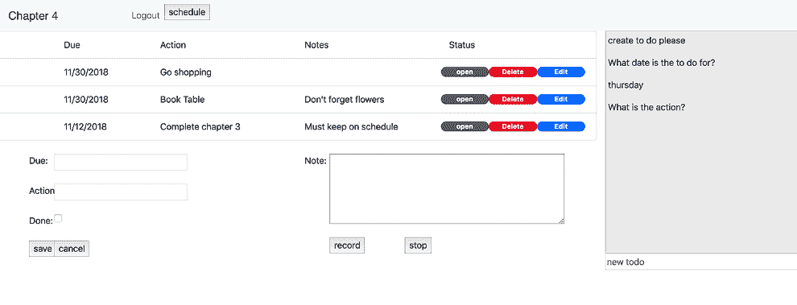

图 4.1 最终目标

在这张图中，用户正在通过与我们待办事项聊天机器人的对话创建一个新的待办事项，正处于中途。

## 4.2 架构

在我们开始组装系统之前，让我们看看架构，并花点时间理解它如何映射回我们在第一章中开发的标准无服务器 AI 架构。图 4.2 描述了系统的整体结构。

系统架构显示了服务之间的清晰分离。每个服务都有一个单一的责任和定义良好的接口：

+   *Web 应用程序* --客户端应用程序的静态内容从 S3 存储桶中提供。API 网关提供了一个 API，该 API 触发我们的同步和异步服务中的事件处理器。我们的 Web 应用程序客户端使用 AWS Amplify 客户端 SDK 来处理认证的复杂性。

+   *同步和异步服务* --这些自定义服务是 AWS Lambda 函数，它们处理我们的 API 请求并执行应用程序的主要业务逻辑。

    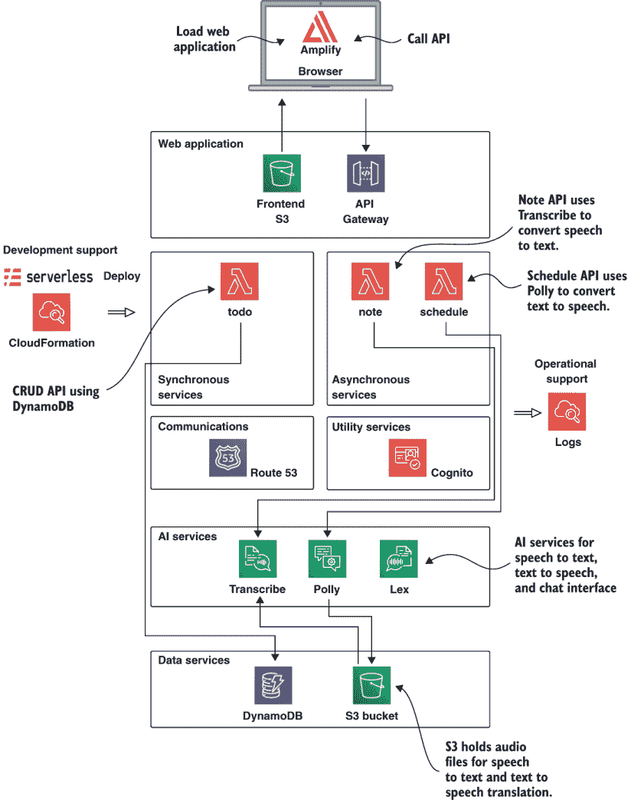

    图 4.2 系统架构。系统由自定义服务和托管服务组成。使用 AWS 提供的许多托管服务，我们可以快速构建和部署可扩展的生产级应用程序。

+   *通信架构* --AWS Route53 用于 DNS 配置，因此我们的服务可以通过自定义域名访问。

+   *实用服务* --AWS Cognito 用于身份验证和授权。

+   *AI 服务* --我们使用三个托管的 AWS AI 服务：Transcribe、Polly 和 Lex。

+   *数据服务* --使用 DynamoDB 作为强大且可扩展的数据库。S3 用于文件存储。

在我们处理系统时，我们将更详细地描述每个部分，并解释它是如何构建和部署的。

### 4.2.1 网络应用

应用程序的结构如图 4.3 所示，其中突出显示了*网络应用*部分。

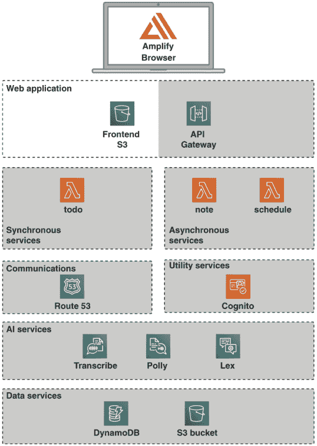

图 4.3 网络应用

所示的结构与我们第二章和第三章中的系统相似。系统的前端是一个单页应用程序，由 HTML、CSS 和 JavaScript 组成，用于渲染 UI，部署到 S3 存储桶中。我们将在本章中重复使用此图像，在构建完整应用程序时突出相关部分。与之前一样，我们使用 API Gateway 提供对服务的路由。

对于我们的待办事项应用程序，我们在前端使用了一个额外的库；AWS Amplify。Amplify 是一个 JavaScript 客户端库，它提供了对指定 AWS 服务的安全访问。在我们的案例中，我们使用它来提供 Cognito 的客户端接口以进行登录和注销，并且还可以访问存储在 S3 中的语音转文本数据。

### 4.2.2 同步服务

图 4.4 再次显示了我们的应用程序架构，这次突出显示了*同步服务*部分。

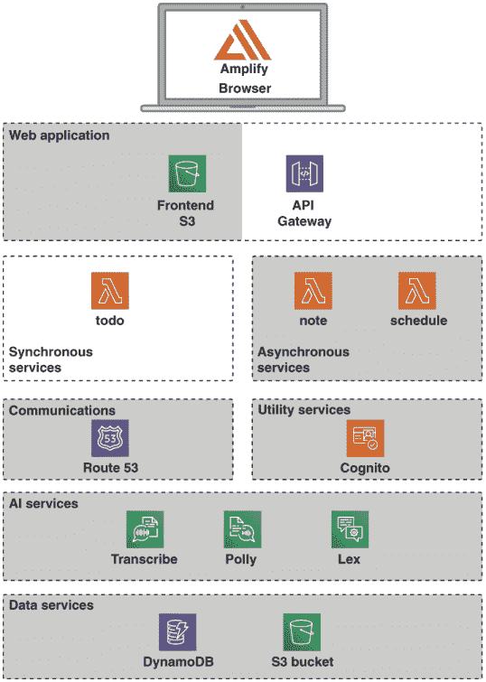

图 4.4 同步服务

展示了一个主要同步服务。这是`to-do`服务，它提供了以下简单的 CRUD 接口：

+   `POST /todo/`--创建一个新的项目。

+   `GET /todo/{id}`--读取一个特定的项目。

+   `PUT /todo/{id}`--更新项目。

+   `DELETE /todo/{id}`--删除一个项目。

+   `GET /todo`--列出所有项目。

### 4.2.3 异步服务

我们应用程序架构的异步服务部分在图 4.5 中突出显示。

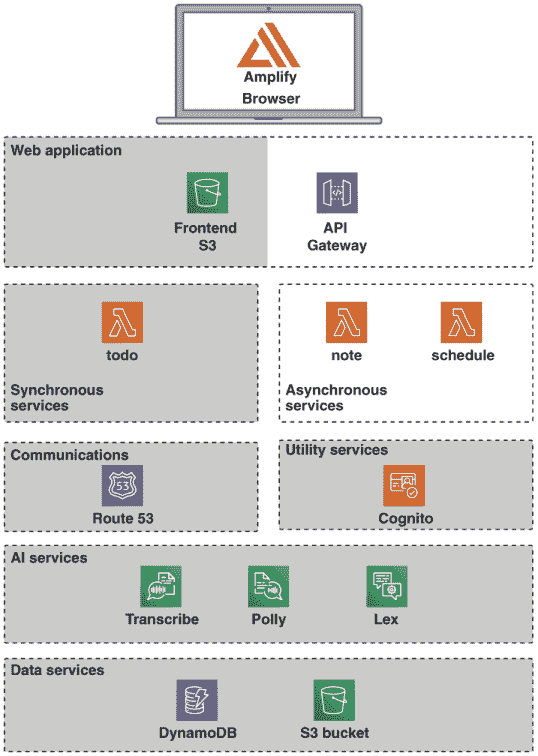

图 4.5 异步服务

有两种异步服务，分别涉及语音转文本和文本转语音翻译。这些服务如下。

#### 注意服务

提供了一个将录音笔记转换为文本的接口：

+   `POST /note`--启动一个新的异步笔记转录作业。

+   `GET /note/{id}`--轮询获取有关异步转录的信息。

#### 调度服务

提供了一个创建计划并将其转换为语音录音的接口：

+   `POST /schedule`--启动一个新的异步调度作业。

+   `GET /schedule/{id}`--轮询获取有关计划的信息。

### 4.2.4 通信架构

我们选择使用基于轮询的机制来构建待办事项列表以保持简单，并且选择不使用任何队列。我们主要使用 HTTP 和 DNS 作为我们的通信架构技术。

### 4.2.5 实用服务

我们使用 Amazon Cognito 作为用户登录和身份验证的机制。用户管理是一个“已解决的问题”，我们不想为每个我们开发的平台都自己构建。对于这个系统，我们使用 Cognito 来为我们做繁重的工作。

### 4.2.6 AI 服务

我们架构中下一个突出的部分，如图 4.6 所示，涵盖了我们在本系统中使用的 AI 和数据存储服务。

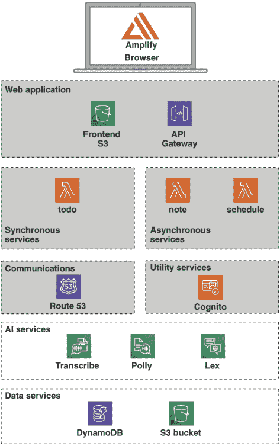

图 4.6 AI 和数据服务

此图显示我们正在使用几个 AI 服务：

+   *Transcribe* 用于提供语音到文本转换，并从 S3 读取其输入。

+   *Polly* 将文本转换为语音，并将其输出音频文件写入 S3。

+   *Lex* 用于创建交互式聊天机器人。我们将使用 Lex Web UI 系统直接集成到我们的前端应用中。

### 4.2.7 数据服务

在数据服务层，我们使用简单存储服务（S3）和 DynamoDB。DynamoDB 是一个高度可扩展的云原生 NoSQL 数据库，我们使用它来存储我们的待办事项。

### 4.2.8 开发支持和运营支持

与之前一样，我们使用 Serverless Framework 作为我们的主要开发支持系统。所有日志数据都使用 CloudWatch 收集。

## 4.3 准备工作

现在我们已经看到了最终目标，让我们深入其中，将系统组合起来。作为本章的先决条件，您需要具备以下条件：

+   AWS 账户

+   AWS 命令行已安装并配置

+   Node.js 已安装

+   Serverless Framework 已安装

如何设置 Node.js 和 Serverless Framework 的说明在第 2 和第三章中提供。AWS 的设置说明在附录 A 中提供。如果您尚未这样做，您需要在继续本章的代码之前遵循这些说明。

警告：使用 AWS 需要付费！请确保您完成使用后，任何云基础设施都被销毁。我们将在每个章节的末尾提供拆解说明，以帮助您完成这项工作。

### 4.3.1 获取代码

本章的源代码可在[`github.com/fourTheorem/ai-as-a-service`](https://github.com/fourTheorem/ai-as-a-service)仓库的`code/chapter4`目录中找到。如果您尚未这样做，您可以继续克隆该仓库：

```
$ git clone https://github.com/fourTheorem/ai-as-a-service.git
```

该系统的代码被分解为多个简单步骤，因为我们将会逐步构建系统。在本章中，我们构建基本应用，然后在第五章中添加 AI 功能。如果您查看`chapter4`和`chapter5`目录，您将找到以下分解：

+   `chapter4/step-1-basic-todo`

+   `chapter4/step-2-cognito-login`

+   `chapter5/step-3-note-service`

+   `chapter5/step-4-schedule-service`

+   `chapter5/step-5-chat-interface`

我们将按顺序处理这些目录。每个逻辑步骤都将为我们的待办事项应用添加额外的功能。让我们从第一步开始，我们的基本待办事项应用。

## 4.4 步骤 1：基本应用

我们的基本待办事项应用程序对大多数程序员来说应该相当熟悉，他们可能在某个时候遇到过标准的待办事项应用程序。图 4.7 展示了部署后的应用程序运行情况。

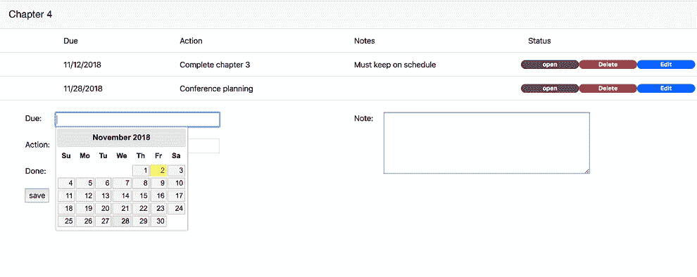

图 4.7 基本待办事项列表

完整的应用程序显示了一个待办事项列表，以及一个用于添加新待办事项的表单。

为什么还需要另一个待办事项应用程序？

在整理本书的内容时，我们确实质疑过世界是否还需要另一个待办事项应用程序。然而，经过反思，我们决定以下原因将是有价值的：

+   待办事项应用程序需要涵盖所有基本的 CRUD 操作。

+   这对大多数程序员来说是一个熟悉的起点。

+   大多数待办事项应用程序都停留在 CRUD 部分；我们的目标是探索如何通过 AI 服务来保护和扩展应用程序。

在这个起点，系统由一组小的组件组成，如图 4.8 所示。

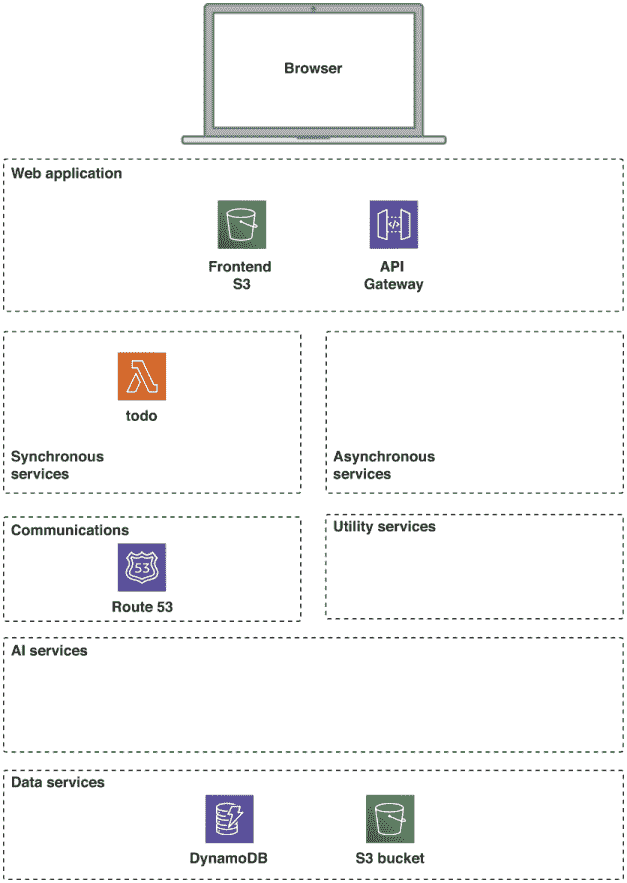

图 4.8 步骤 1 架构

如您所见，我们的系统目前相当简单。它使用单个 API Gateway 部署、一些简单的 Lambda 函数、一个 DynamoDB 表，以及从 S3 提供的前端代码。这个第一步的源代码在 `chapter4/step-1-basic-todo` 目录中，下一列表中只列出了关键文件，以保持清晰。

列表 4.1 代码结构

```
???  frontend
?    ???   package.json
?    ???   serverless.yml
?    ???   webpack.config.js
???  resources
?    ???   package.json
?    ???   serverless.yml
???  todo-service
     ???   dynamodb.yml
     ???   handler.js
     ???   package.json
     ???   serverless.yml
```

让我们逐一查看这些组件。

### 4.4.1 资源

与我们之前的应用程序一样，我们在 `resources` 目录中定义了一组全局云资源。需要注意的是，我们在这里只配置全局资源。针对特定服务的云资源配置应与该服务一起保留。例如，待办事项服务“拥有”待办事项 DynamoDB 表；因此，此资源被配置为 `to-do` 服务定义的一部分。

小贴士：作为一般规则，将特定服务的资源定义与服务代码一起保留。只有全局访问的资源才应在服务目录之外进行配置。

我们为资源定义的 `serverless.yml` 文件定义了一个用于前端的前端 S3 存储桶，设置了权限，并启用了 CORS。在完成第二章和第三章的学习后，这个 `serverless.yml` 的格式和结构应该非常熟悉，所以我们在这里不会详细说明，只是指出，在这个配置中我们使用了一个新的插件：`serverless-dotenv-plugin`。这个插件从 `.env` 文件中读取环境变量，该文件包含系统特定的变量，如我们的存储桶名称。我们将在本节稍后部署系统时编辑此文件。

CORS

*CORS*代表*跨源资源共享*。这是一种安全机制，允许网页从与原始网页加载的域不同的域请求资源。使用 CORS，Web 服务器可以选择性地允许或拒绝来自不同源域的请求。有关 CORS 的完整解释，请参阅此处：[`en.wikipedia.org/wiki/Cross-origin_resource_sharing`](https://en.wikipedia.org/wiki/Cross-origin_resource_sharing)。

在我们的系统中，唯一的共享资源是数据存储桶。这将在后续部分的服务中使用。

### 4.4.2 待办服务

对于第一步，我们只实现了基本的待办 CRUD 服务和最小的前端。待办服务使用 DynamoDB，亚马逊的云原生 NoSQL 数据库。图 4.9 说明了构成待办服务的各个路由，每个路由都执行相应的读取或写入操作。

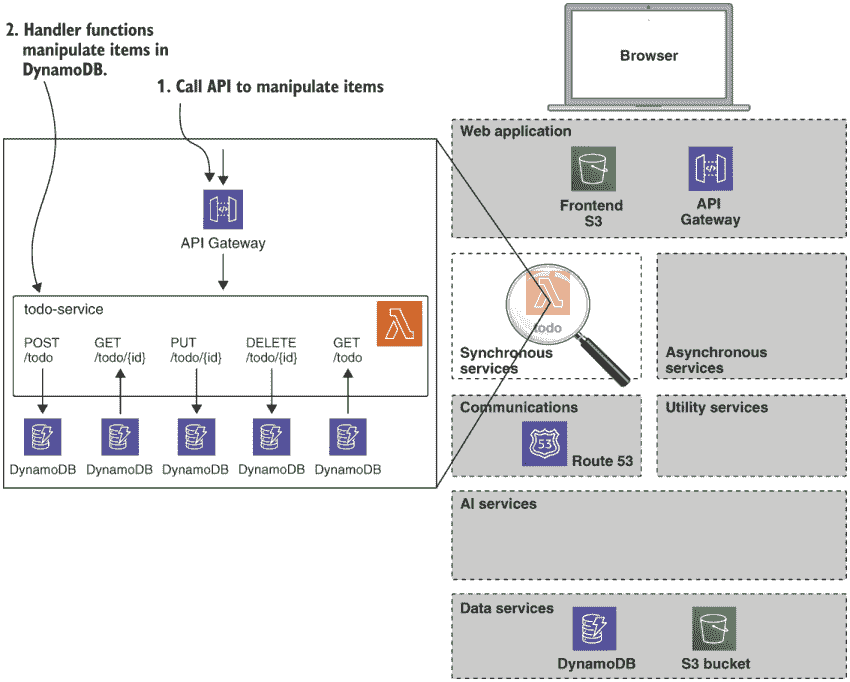

图 4.9 待办服务

图像的展开部分显示了添加、更新和删除待办记录的 POST、PUT 和 DELETE 路由。显示了两个 GET 路由：一个用于检索所有待办事项，另一个用于使用其 ID 检索单个待办事项。

CRUD

如果你对这个术语不熟悉，*CRUD*代表*创建、读取、更新、删除*。有时你会听到“基于 CRUD 的应用程序”这个术语。这个术语只是意味着一个在某个数据存储上执行这些标准操作的应用程序。通常，CRUD 应用程序使用 RESTful HTTP 接口实现。这意味着以下 HTTP 动词和路由被使用：

+   `POST /widget`--发布数据以创建和存储新的小部件。

+   `GET /widget/{id}`--读取具有提供 ID 的小部件的数据。

+   `PUT /widget/{id}`--更新具有提供 ID 的小部件。

+   `DELETE /widget/{id}`--删除具有提供 ID 的小部件。

+   `GET /widget`--获取所有小部件的列表。

如下所示，`serverless.yml`文件的主要部分配置了 AWS 提供者并定义了 API 网关路由及其相关的 Lambda 函数事件处理程序。

列表 4.2 为待办服务配置的`serverless.yml`

```
provider:
  name: aws
  runtime: nodejs12.x
  stage: ${opt:stage, 'dev'}
  region: ${env:AWS_DEFAULT_REGION, 'eu-west-1'}
  environment:                                            ❶
    TODO_TABLE: '${self:service}-${self:provider.stage}'
  iamRoleStatements:                                      ❷
    - Effect: Allow
      Action:
        - dynamodb:DescribeTable
        - dynamodb:Query
        - dynamodb:Scan
        - dynamodb:GetItem
        - dynamodb:PutItem
        - dynamodb:UpdateItem
        - dynamodb:DeleteItem
      Resource: "arn:aws:dynamodb:${self:custom.region}:${self:custom.accountid}:*"

functions:                                                ❸
  create:
    handler: handler.create
    events:
      - http:
          method: POST
          path: todo
          cors: true
  ...

resources:
  - ${file(./dynamodb.yml)}                               ❹
```

❶ 为 DynamoDB 定义环境变量

❷ 为 Lambda 函数访问 DynamoDB 的 IAM 访问角色

❸ CRUD 路由和处理程序

❹ 包含资源

尽管这个配置文件比我们之前的示例要大一些，但其结构与第二章和第三章中的`ui-service`非常相似，即我们

+   为我们的处理程序函数配置对 DynamoDB 的访问

+   定义路由和处理程序函数

我们在提供者部分使用环境定义来为我们的处理程序代码提供 DynamoDB 表名：

```
environment:
  TODO_TABLE: '${self:service}-${self:provider.stage}'
```

这很重要，因为我们不希望将表名硬编码到我们的处理程序函数中，因为这会违反 DRY 原则。

提示 *DRY* 代表“不要重复自己”。在软件系统的上下文中，这意味着我们应该努力只为系统中的每条信息保留一个定义或真相来源。

为了使无服务器定义更易于管理，我们选择将我们的 DynamoDB 表定义放在单独的文件中，并将其包含在我们的主 `serverless.yml` 文件中：

```
resources:
  - ${file(./dynamodb.yml)}
```

这可以帮助我们使配置更短、更易读。我们将在剩余的章节中一直使用这种模式。我们包含的文件，如下一列表所示，为系统配置了 DynamoDB 资源。

列表 4.3 无服务器 DynamoDB 配置

```
Resources:
  TodosDynamoDbTable:
    Type: 'AWS::DynamoDB::Table'
    DeletionPolicy: Retain         ❶
    Properties:
      AttributeDefinitions:        ❷
        - AttributeName: id
          AttributeType: S
      KeySchema:
        - AttributeName: id
          KeyType: HASH
      ProvisionedThroughput:       ❸
        ReadCapacityUnits: 1
        WriteCapacityUnits: 1
      TableName: '${self:service}-${self:provider.stage}'
```

❶ 我们指定，当删除 CloudFormation 堆栈时，不应删除表格。这有助于避免意外数据丢失。CloudFormation 堆栈是我们运行无服务器部署时创建或更新的资源集。

❷ 对于这个表格，我们指定了一个键属性，一个类型为 S（字符串）的 ID。这个属性是一个分区键，因此值必须是唯一的。

❸ 设置吞吐量的容量单位为最低可能值。这将限制可以发生的读取和写入次数，但对于这个应用程序，将确保成本保持在最低。

这是一个非常简单的配置，在 DynamoDB 表上定义了一个单一的 `id` 键。

如果我们现在查看 `to-do` 服务的处理程序代码，应该会清楚系统是如何使用 DynamoDB 存储数据的。代码在文件 `handler.js` 中，如下所示列表。

列表 4.4 需求和创建待办服务处理程序

```
const uuid = require('uuid')
const AWS = require('aws-sdk')                       ❶
const dynamoDb = new AWS.DynamoDB.DocumentClient()   ❷
const TABLE_NAME = {
  TableName: process.env.TODO_TABLE                  ❸
}

function respond (err, body, cb) {                   ❹
  ...
}

module.exports.create = (event, context, cb) => {    ❺
  const data = JSON.parse(event.body)
  removeEmpty(data)

  data.id = uuid.v1()
  data.modifiedTime = new Date().getTime()

  const params = { ...TABLE_NAME, Item: data }
  dynamoDb.put(params, (err, data) => {              ❻
    respond(err, {data: data}, cb)
  })
}
```

❶ 需求 AWS SDK

❷ 创建 DynamoDB 客户端

❸ 使用表名环境变量

❹ 响应样板

❺ 创建处理程序

❻ 在数据库中创建待办事项

如果你在第二章和第三章中工作过，处理程序的实现应该也很熟悉。这里的模式是包含 AWS SDK 并创建一个接口，以便访问我们想要访问的特定服务，在这种情况下是 DynamoDB。其余的代码然后使用这个资源对服务执行操作，并将结果返回给服务的调用者。在列表 4.4 中，我们展示了 `create` 端点。这映射到我们的 `POST /to-do` 路由。此代码的客户端将在 `POST` 请求中包含待办信息，格式为 JSON 数据。在这种情况下，使用的 JSON 格式如以下列表所示。

列表 4.5 待办 `POST` 的示例 JSON 内容

```
{
  dueDate: '2018/11/20',
  action: 'Shopping',
  stat: 'open',
  note: 'Do not forget cookies'
}
```

`create` 方法在将待办事项写入数据库之前添加了一个 `timestamp` 字段和一个 `id` 字段。`handler.js` 中的其他方法实现了对数据库的其他 CRUD 操作。

### 4.4.3 前端

我们这个第一步的前端应用程序也很简单，如图 4.10 所示。

前端应用程序在 S3 上构建和存储。当浏览器加载 `index.html` 页面时，代码和其他资源，如样式表和图像，也会被加载。内部前端应用程序使用 JQuery 构建。由于这个应用程序将比第二章和第三章中的示例做得更多，我们在代码中引入了一些结构，如图 4.10 所示，稍后将进行描述。

代码位于 `frontend` 目录中，结构如下所示列表。

列表 4.6 前端目录结构

```
???    assets
???    src
?      ???    index.html
?      ???    index.js
?      ???    templates.js
?      ???    todo-view.js
?      ???    todo.js
???    webpack.config.js
???    package.json
???    serverless.ym
```

应用程序的根页面是 `src/index.html`，如下所示列表。这提供了一些初始的 DOM（文档对象模型）结构和加载主要应用程序代码。

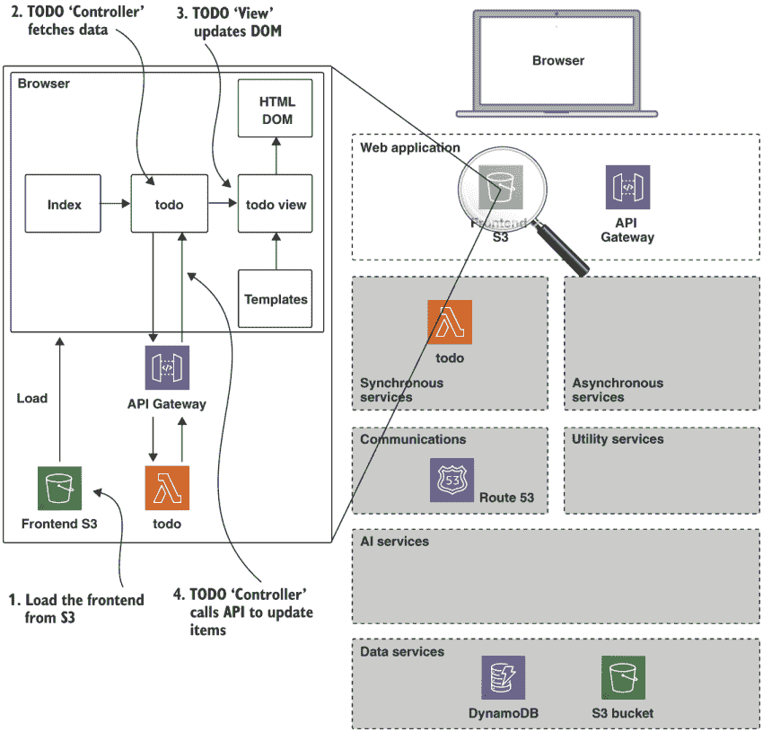

图 4.10 前端

列表 4.7 `index.html`

```
<html>
<head>
  <title>Chapter 4</title>
</head>
<body>
  <script src='main.js'></script>      ❶

    <nav class="navbar navbar-expand-lg navbar-light bg-light">
  .
  .                                    ❷
  .
    </nav>

    <div id="content">                 ❸
    </div>

    <div id="footer">
        <div id="error"></div>
    </div>

</body>
</html>
```

❶ 加载应用程序代码

❷ 导航栏代码省略

❸ 主要应用程序内容区域

应用程序的主要代码位于 `src` 目录中。它由以下内容组成：

+   index.js--应用程序入口点

+   todo.js--待办事项“模型”和“控制器”代码

+   todo-view.js--待办事项 DOM 操作

+   templates.js--通用渲染模板

如下所示列表的 `index.js` 文件，简单地加载了所需资源。

列表 4.8 `index.js`

```
import $ from 'jquery'                          ❶
import 'bootstrap/dist/css/bootstrap.min.css'
import 'webpack-jquery-ui/css'
import {todo} from './todo'                     ❷

$(function () {
  todo.activate()                               ❸
})
```

❶ 加载 jQuery 和样式

❷ 加载待办事项代码

❸ 页面加载后激活待办事项

主要工作在我们下面的待办事项模块中完成。

列表 4.9 `todo.js`

```
import $ from 'jquery'
import {view} from './todo-view'     ❶

const todo = {activate}              ❷
export {todo}

const API_ROOT = `https://chapter4api.${process.env.CHAPTER4_DOMAIN}/api/todo/`

function create (cb) {               ❸
  $.ajax(API_ROOT, {
  ...
  })
}

function list (cb)                   ❹
  $.get(API_ROOT, function (body) {
  ...
  })
}

function activate () {
  list(() => {                       ❺
    bindList()
    bindEdit()
  })
  $('#content').bind('DOMSubtreeModified', () => {
    bindList()
    bindEdit()
  })
}
```

❶ 导入待办事项视图

❷ 导出激活函数

❸ 创建待办事项

❹ 列出待办事项

❺ 加载时调用列表

为了清晰起见，我们省略了列表 4.9 中的一些代码。大多数读者都会熟悉模型视图控制器（MVC）模式。我们的待办事项模块可以被视为在前端应用程序中充当待办事项的模型和控制器，而视图功能由 `todo-view.js` 处理。

我们正在使用环境变量构建待办事项 API 的 URL：

```
API_ROOT = `https://chapter4api.${process.env.CHAPTER4_DOMAIN}/api/todo/`
```

我们将在本节稍后部署前端时设置 `CHAPTER4_DOMAIN` 变量。

为什么没有使用框架？

熟悉前端开发的读者可能会想知道为什么我们不使用某种前端框架，如 React、Vue 或 Angular。答案是，尽管我们了解有许多流行的框架可用，但它们需要时间来学习。本书的目标是教授 AI 即服务而不是前端框架，因此我们选择使用 JQuery 结合 Webpack 的最低共同分母方法。这样我们希望减少认知学习负担。

我们的处理功能由 `todo-view.js` 和 `templates.js` 处理。我们将其留作练习，让读者查看这些文件，这些文件本质上执行了一些非常简单的 DOM 操作来渲染待办事项列表。

在我们的 `frontend` 目录根目录中，我们有三个控制文件：`package.json`、`webpack.config.js` 和 `serverless.yml`。这些文件允许我们安装和管理 JavaScript 依赖项，构建用于部署的前端版本，并创建用于部署构建的 S3 存储桶。

前端 `serverless.yml` 与我们资源目录中的类似，所以我们在这里不会详细说明。它只是定义了一个具有适当权限的 S3 存储桶，以公开提供我们的前端。

我们在第二章和第三章中介绍了 `package.json` 的结构，所以这部分应该是熟悉的。我们应该注意，`webpack` 本身在 `package.json` 中被管理为一个开发依赖项。我们还在脚本块下定义了一个构建任务，该任务运行 `webpack` 以构建用于部署的应用程序。

Webpack

Webpack 是现代 JavaScript 应用程序的静态模块打包器。Webpack 处理 JavaScript、CSS 以及其他源文件，以创建一个紧凑的输出 JavaScript 文件，该文件可以包含在 Web 应用程序中。Webpack 通过构建依赖图而不是逐文件工作来实现这一点。这有几个好处：

+   依赖图意味着只有我们需要的资源被包含在输出中。

+   结果输出更加高效，因为网络应用程序只下载一个压缩后的 JavaScript 文件。

+   我们的流程现在干净且高效，因为我们可以使用 `npm` 模块系统进行依赖管理。

+   Webpack 还会管理其他静态资源，如 CSS、图像等，作为依赖图的一部分。

Webpack 的完整文档可在此处查看：[`webpack.js.org/`](https://webpack.js.org/).

我们的 `webpack` 配置如下所示。

列表 4.10 `webpack.config.js`

```
const Dotenv = require('dotenv-webpack')
const path = require('path')

module.exports = {
  entry: {
    main: './src/index.js'       ❶
   },
  devtool: 'eval-source-map',    ❷
   devServer: {
    contentBase: './dist',
    port: 9080
  },
  output: {                      ❸
     filename: '[name].js',
    path: path.resolve(__dirname, 'dist'),
    publicPath: 'dist/'
  },
  mode: 'development',           ❹
   module:                       ❺
     rules: [{
    ...
    }]
  },
  plugins: [                     ❻
     new Dotenv({
      path: path.resolve(__dirname, '..', '.env'),
      systemvars: false,
      silent: false
    })
  ]
}
```

❶ 定义依赖图入口点

❷ 启用源映射以进行调试

❸ 定义输出映射

❹ 开发模式

❺ CSS 和图像模块

❻ .env 文件插件

我们的 webpack 配置将把 `src/index.js` 中的所有依赖项构建到 `dist` 文件夹中。这包括我们所有的源代码和相关模块，包括 JQuery。然后我们可以简单地部署 `dist` 目录到 S3，以拥有一个功能性的应用程序。

与 `serverless-dotenv-plugin` 类似，我们在这里使用 `dotenv-webpack` 插件。这允许我们在所有代码区域使用单个环境配置文件，有助于保持我们的系统 DRY（Don't Repeat Yourself）。

### 4.4.4 部署步骤 1

现在我们已经了解了待办事项系统，让我们继续将其部署到 AWS。如果您还没有设置账户，您需要查看附录 A 来进行设置。

#### 设置环境变量

你可能还记得，在审查代码时，前端项目创建了一个 S3 存储桶来存放我们的 Web 应用程序，并且它使用了一个环境变量`CHAPTER4_BUCKET`。你需要为你的存储桶选择一个全局唯一的名称。记住，我们通过环境变量`CHAPTER4_DOMAIN`使用了一个自定义域名来为待办事项 API。

在附录 A 的设置之后，你应该在你的 shell 中定义以下环境变量：

+   `AWS_ACCOUNT_ID`

+   `AWS_DEFAULT_REGION`

+   `AWS_ACCESS_KEY_ID`

+   `AWS_SECRET_ACCESS_KEY`

这些是全局变量，你应该在系统的一个地方保持它们。为了部署我们的待办应用程序，我们需要提供系统特定的变量。为此，我们将使用一个`.env`文件。使用任何文本编辑器创建一个名为`.env`的文件，并将其放置在`chapter4/step1-basic-todo`目录中。该文件应包含以下列表中的内容。

列表 4.11 步骤 1 的环境变量

```
# environment definiton for Chapter 4
TARGET_REGION=eu-west-1                          ❶
CHAPTER4_BUCKET=<your bucket name>               ❷
CHAPTER4_DATA_BUCKET=<your data bucket name>
CHAPTER4_DOMAIN=<your development domain>        ❸
```

❶ 我们指定所有示例的区域为 eu-west-1。

❷ 指定你选择的全球唯一存储桶名称。

❸ `CHAPTER4_DOMAIN`的值可以与第二章和第三章部署中使用的值完全相同，并且应引用使用 AWS Route53 创建的域名。

用你选择的名称替换`CHAPTER4_BUCKET`、`CHAPTER4_DATA_BUCKET`和`CHAPTER4_DOMAIN`。请参考第二章和第三章，以获取设置域的完整说明。

#### 部署资源

首先，我们将部署我们的资源项目。为此，进入`resources`目录并运行：

```
$ npm install
$ serverless deploy
```

这将创建我们的 S3 数据存储桶，供以后使用。我们可以通过使用 AWS Web 控制台来确认存储桶的创建。

#### 部署待办服务

接下来，我们将部署待办服务。进入`todo-service`目录，通过运行以下命令安装依赖项：

```
$ npm install
```

在部署之前，我们需要为我们的应用程序创建一个自定义域名。在`serverless.yml`中的配置如下所示。

列表 4.12 `serverless.yml`中的自定义域名配置

```
custom:
  region: ${env:AWS_DEFAULT_REGION, 'eu-west-1'}
  accountid: ${env:AWS_ACCOUNT_ID}
  domain: ${env:CHAPTER4_DOMAIN}                       ❶
  customDomain:
    domainName: 'chapter4api.${self:custom.domain}'    ❷
    stage: ${self:provider.stage}
    basePath: api
    certificateName: '*.${self:custom.domain}'         ❸
    createRoute53Record: true
    endpointType: regional
  serverless-offline:
    port: 3000
```

❶ 这定义了父域名。

❷ 子域名由前缀 chapter4api 和父域名组成。

❸ 指定了一个通配符证书。

我们这个部分的域名将由`CHAPTER4_DOMAIN`的设置和一个子域名`chapter4api`组成。也就是说，如果我们使用`example.com`作为变量`CHAPTER4_DOMAIN`的值，那么这一章的完整自定义域名将是`chapter4api.example.com`。

让我们继续创建这个域名

```
$ serverless create_domain
```

我们现在可以通过运行以下命令来部署我们的待办事项 API：

```
$ serverless deploy
```

#### 部署前端

最后，在这一节中，我们需要部署我们的前端。首先，为了安装依赖项，进入`frontend`目录并运行：

```
$ npm install
```

接下来，我们需要通过运行以下命令创建我们的应用程序的存储桶：

```
$ serverless deploy
```

我们现在可以通过我们的`npm`脚本部分使用 Webpack 构建前端：

```
$ source ../.env
$ npm run build
```

这将在我们的`dist`目录中创建一个名为`main.js`的文件，以及一个包含一些额外图像的`assets`目录。为了部署前端，我们将使用 AWS 命令行，就像我们在第二章和第三章中所做的那样：

```
$ cd frontend
$ source ../.env
$ aws s3 sync dist/ s3://$CHAPTER4_BUCKET
```

这会将`dist`目录的内容推送到我们刚刚创建的第四章存储桶。请注意，我们需要将环境文件的内容`source`到 shell 中，以提供`CHAPTER4_BUCKET`环境变量。

#### 测试它

如果所有前面的步骤都进行顺利，我们现在应该已经将一个完全功能性的系统部署到了 AWS。为了测试这一点，请在浏览器中打开此 URL

```
https://<CHAPTER4_BUCKET>.s3-eu-west-1.amazonaws.com/index.html
```

将`<CHAPTER4_BUCKET>`替换为你的特定存储桶名称。你应该能够通过浏览器中的前端创建和更新待办事项。

为什么从存储桶提供服务？

一些读者可能会想知道为什么我们要直接从 S3 存储桶提供内容。我们为什么不使用像 CloudFront 这样的 CDN？答案是，对于这样一个教学系统，CloudFront 是过度的。我们同意，对于一个完整的生产系统，S3 存储桶应该用作 CDN 的源服务器；然而，在开发模式下，CDN 缓存和更新只会碍手碍脚。

我们现在有一个工作的待办事项系统。只有一个小问题。系统是公开可访问的，这意味着任何互联网上的随机人员都可以读取和修改我的待办事项列表。这显然不是我们系统所期望的特性，所以我们最好迅速解决这个问题。幸运的是，我们可以使用一个云原生服务来为我们处理这项工作。在下一节中，我们将使用 Cognito 来保护我们的待办事项列表。

## 4.5 步骤 2：使用 Cognito 进行安全保护

用户管理是那些看似简单的问题之一，因为它看起来应该很容易，但通常结果却非常困难！许多程序员在天真地认为“这不可能那么难”的假设下，长时间熬夜自己编写用户身份验证和管理系统。

幸运的是，用户登录和管理是一个已解决的问题，所以我们再也不需要编写这类代码了。我们可以直接使用云原生服务来为我们完成这项工作。有几种选项可供选择，但对我们这个系统来说，我们将使用 AWS Cognito。Cognito 为我们提供了一个完整的身份验证服务，包括

+   密码复杂性策略

+   与 Web 和移动应用程序的集成

+   多种登录策略

+   用户管理

+   密码复杂性规则

+   单点登录

+   通过 Facebook、Google、Amazon 等社交登录

+   安全最佳实践和针对最新已知安全漏洞的防御

这对于一个小型的开发工作来说功能非常强大。所以，让我们将 Cognito 应用到我们的待办事项系统中，并保护它免受坏人的侵害！

图 4.11 展示了添加了 Cognito 身份验证的系统。

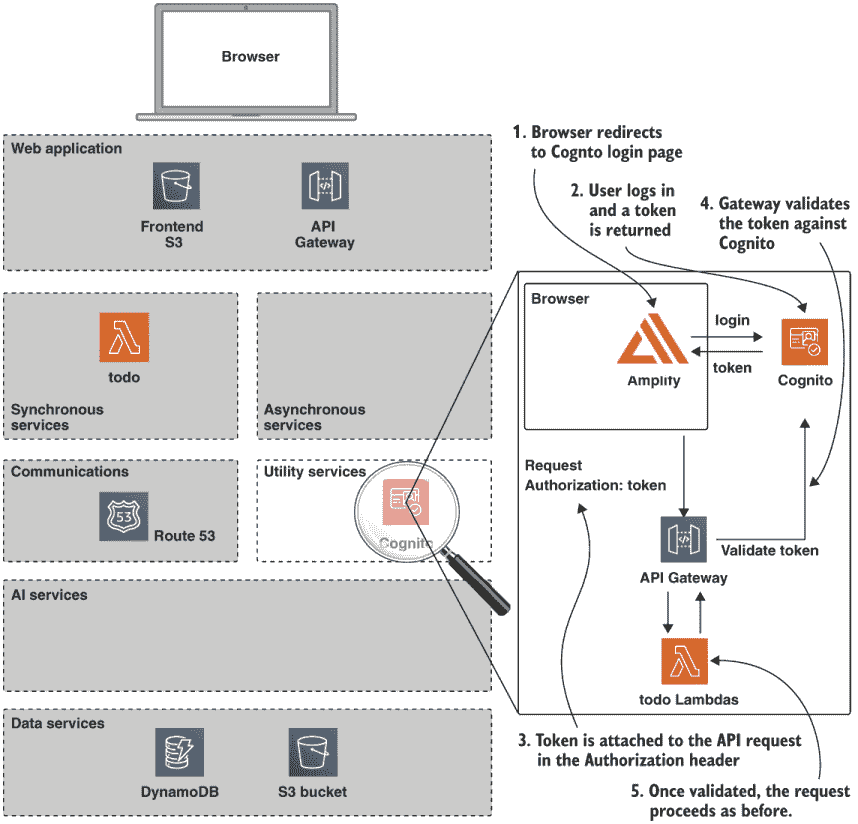

图 4.11 步骤 2 架构

我们已经将 AWS Amplify 库添加到前端。Amplify 是一个提供对各种 AWS 服务进行认证访问的 JavaScript 库。目前，我们只会用它来进行认证和访问控制。在成功登录后提供的令牌将被传递到 API Gateway 的 API 调用中，这些调用反过来由 AWS Lambda 处理函数处理。

AWS Amplify

Amplify 最初是一个提供客户端访问 AWS API 的 JavaScript 库。该库支持桌面浏览器，以及 iOS 和 Android 设备。库的最新增补是 Amplify CLI，旨在提供类似于我们一直在使用的 Serverless Framework 的工具链。在撰写本文时，Amplify 工具链不如 Serverless Framework 成熟，并且缺乏插件生态系统支持。然而，这绝对是一个值得关注的项目。

Amplify 的完整文档可以在以下链接找到：[`aws-amplify.github.io/docs/js/start`](https://aws-amplify.github.io/docs/js/start)。

如图 4.11 所示，我们将登录任务委托给 Cognito。一旦用户认证成功，就会分配一个会话令牌，由 Amplify 库管理。然后我们在 API Gateway 设置中添加一个认证步骤，要求用户在请求继续之前提供有效的 JSON Web Token (JWT)。任何没有有效网络令牌的请求都会在这一层被拒绝。

JSON Web Tokens

JSON Web Token (JWT) 是一个定义了安全传输声明的方法的 (RFC 7519) 标准，它将声明作为 JSON 对象进行传输。JWT 由三个部分组成：

```
<header>.<payload>.<signature>
```

+   header--标识令牌使用的哈希算法。

+   payload--包含一组声明。一个典型的声明可能是用户 ID。

+   signature--是 header、payload 和一个秘密使用 header 中定义的算法进行单向哈希的结果。

通常，JWT 会在登录时由认证服务器颁发，然后由客户端用于安全地访问资源。JWT 通常具有较短的生存期，并在预定义的时间后过期，迫使客户端定期重新认证以生成新的令牌。

关于 JWT 的详细信息可以在以下链接找到：[`en.wikipedia.org/wiki/JSON_Web_Token`](https://en.wikipedia.org/wiki/JSON_Web_Token)。

### 4.5.1 获取代码

这个步骤的代码在目录 `chapter4/step-2-cognito-login` 中，包含了步骤 1 的代码以及 Cognito 的更新。我们将依次介绍这些更新，然后部署更改以保护我们的系统。

### 4.5.2 用户服务

首先，有一个新的服务目录，`user-service`。这个文件夹只包含 Cognito 的无服务器配置。这里有三个文件：

+   identity-pool.yml

+   user-pool.yml

+   serverless.yml

我们的`serverless.yml`很短，此时你应该熟悉大多数模板条目。它导入其他两个文件，这些文件包含 Cognito 资源。下一个列表中的`user-pool.yml`配置了我们的 Cognito 用户池。用户池正是其名称所暗示的，即用户池。

列表 4.13 Cognito 用户池配置

```
Resources:
  CognitoUserPool:                             ❶
    Type: AWS::Cognito::UserPool
    Properties:
      UserPoolName: ${self:service}${self:provider.stage}userpool
      UsernameAttributes:
        - email
      AutoVerifiedAttributes:
        - email
      EmailVerificationSubject: 'Your verification code'
      EmailVerificationMessage: 'Your verification code is {####}.'
      Schema:
        - Name: email
          AttributeDataType: String
          Mutable: true
          Required: true
      AdminCreateUserConfig:
        InviteMessageTemplate:
          EmailMessage: 'Your username is {username} and\
temporary password is {####}.'
          EmailSubject: 'Your temporary password'
        UnusedAccountValidityDays: 2
        AllowAdminCreateUserOnly: true
  CognitoUserPoolClient:                      ❷
    Type: AWS::Cognito::UserPoolClient
    Properties:
      ClientName: ${self:service}${self:provider.stage}userpoolclient
      GenerateSecret: false
      UserPoolId:
        Ref: CognitoUserPool
```

❶ 用户池

❷ 客户端集成

Cognito 提供了大量的选项。我们将保持简单，仅为其配置电子邮件和密码登录。列表 4.13 中的代码创建了一个用户池和一个用户池客户端。用户池客户端提供了一个用户池和外部应用程序之间的集成桥梁。Cognito 支持单个用户池针对多个用户池客户端。

要使用 Cognito 授权访问 AWS 资源，我们还需要一个身份池。这已在`identity-pool.yml`中配置，如下所示。

列表 4.14 Cognito 身份池配置

```
Resources:
  CognitoIdentityPool:                                  ❶
    Type: AWS::Cognito::IdentityPool
    Properties:
      IdentityPoolName: ${self:service}${self:provider.stage}identitypool
      AllowUnauthenticatedIdentities: false
      CognitoIdentityProviders:
        - ClientId:
            Ref: CognitoUserPoolClient                  ❷
          ProviderName:
            Fn::GetAtt: [ "CognitoUserPool", "ProviderName" ]

  CognitoIdentityPoolRoles:                             ❸
    Type: AWS::Cognito::IdentityPoolRoleAttachment
    Properties:
      IdentityPoolId:
        Ref: CognitoIdentityPool
      Roles:
        authenticated:
          Fn::GetAtt: [CognitoAuthRole, Arn]
```

❶ 定义身份池

❷ 连接到用户池

❸ 将策略附加到身份池

在列表 4.14 中，我们将身份池连接到了我们的用户池，还连接到了一个角色，`CognitoAuthRole`。该角色也在`identity-pool.yml`中定义。关于这个角色的关键部分包含在下一个列表中的策略声明中。

列表 4.15 身份池策略声明

```
Statement:
    - Effect: 'Allow'
      Action:                    ❶
        - 'cognito-sync:*'
        - 'cognito-identity:*'
        - 'S3:*'
        - 'transcribe:*'
        - 'polly:*'
        - 'lex:*'
      Resource: '*'
    - Effect: 'Allow'
      Action:                    ❷
        - 'execute-api:Invoke'
      Resource:
```

❶ 策略授予 Cognito、S3、Transcribe、Polly 和 Lex 的所有操作。

❷ 策略授予调用我们的 API 网关路由的访问权限。

此策略将与所有经过身份验证的用户相关联，并表示具有此角色的用户可以

+   访问 S3

+   调用 Transcribe 服务

+   调用 Polly 服务

+   使用 Lex 服务

+   执行 API 网关功能

对于此角色，将拒绝访问任何其他服务。

#### 超时！

好的，如果你觉得所有关于用户池和身份池的讨论有点令人困惑，我们同意！一开始可能会感到有些压倒性，所以让我们花点时间来解释。要理解的关键概念是身份验证和授权之间的区别。

*身份验证*是“谁”。换句话说，我能证明我就是我所说的那个人吗？通常这是通过证明我知道一个秘密信息片段——密码来完成的。用户池处理身份验证。

*授权*是“什么”。鉴于我已经证明了我的身份，我允许访问哪些资源？通常这通过某种类型的权限模型来实现。例如，在文件系统中，有用户和组级别的访问控制，实现了基本的权限模型。我们刚刚创建的 AWS 策略是我们登录用户的权限模型。身份池处理授权。

身份池也被称为*联合身份*。这是因为身份池可以有多个身份来源。这如图 4.12 所示。

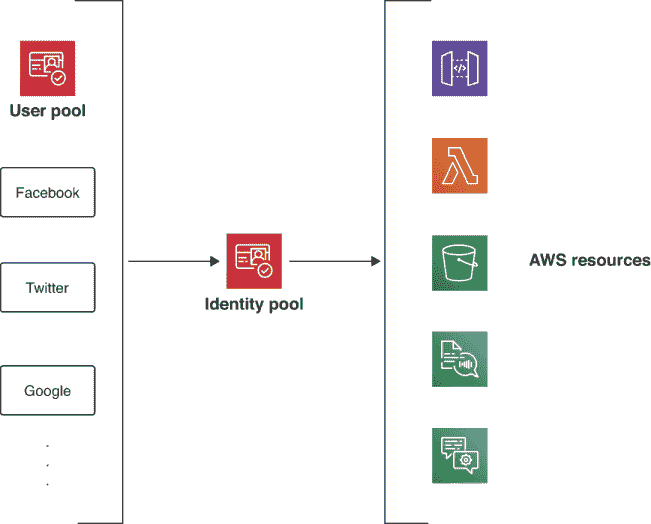

图 4.12 用户和身份池

如上图所示，用户池可以被视为一个验证身份的来源。其他来源包括 Facebook、Google、Twitter 等。可以配置身份池以使用多个身份来源。对于每个验证过的身份，身份池允许我们为授权访问我们的 AWS 资源配置策略。

对于这个系统，我们将仅使用 Cognito 用户池作为我们的认证用户来源；我们不会启用社交登录。

### 4.5.3 To-do 服务

现在我们有了认证用户的来源，我们需要更新我们的服务以确保我们已将其锁定以防止未经授权的访问。这很容易实现，并且需要对我们的 to-do 服务 `serverless.yml` 进行少量更新，如下列表所示。

列表 4.16 对 `serverless.yml` 的更改

```
custom:
  poolArn: ${env:CHAPTER4_POOL_ARN}         ❶

functions:
  create:
    handler: handler.create
    events:
      - http:
          method: POST
          path: todo
          cors: true
          authorizer:
            arn: '${self:custom.poolArn}'   ❷
  list:
    handler: handler.list
    events:
      - http:
          method: GET
          path: todo
          cors: true
          authorizer:
            arn: '${self:custom.poolArn}'   ❷
```

❶ 包含用户池 ARN

❷ 声明授权者

我们只需为希望保护的每个端点声明一个授权者。我们还需要更新我们的环境以包括用户池标识符 `CHAPTER4_POOL_ARN`。

### 4.5.4 前端服务

我们对前端所做的最后一系列更改提供了登录、注销和令牌管理功能。我们已将 AWS Amplify 添加到前端 `package.json` 中作为依赖项。Amplify 需要我们提供一些配置参数。这通过 `index.js` 完成，如下列表所示。

列表 4.17 `index.js` 中的 Amplify 配置

```
const oauth = {                                  ❶
  domain: process.env.CHAPTER4_COGNITO_DOMAIN,
  scope: ['email'],
  redirectSignIn: `https://s3-${process.env.TARGET_REGION}.amazonaws.com/${process.env.CHAPTER4_BUCKET}/index.html`,
  redirectSignOut: `https://s3-${process.env.TARGET_REGION}.amazonaws.com/${process.env.CHAPTER4_BUCKET}/index.html`,
  responseType: 'token'
}

Amplify.configure({                              ❷
  Auth: {
    region: process.env.TARGET_REGION,
    userPoolId: process.env.CHAPTER4_POOL_ID,
    userPoolWebClientId: process.env.CHAPTER4_POOL_CLIENT_ID,
    identityPoolId: process.env.CHAPTER4_IDPOOL,
    mandatorySignIn: false,
    oauth: oauth
  }
})
```

❶ 配置 OAuth 流程。

❷ 配置 Amplify。

我们的配置分为两个独立的部分。首先，我们通过提供域名和重定向 URL 来配置 OAuth。这些必须与我们的 Cognito 配置匹配，我们将在部署这些更改时设置。其次，我们使用我们的池标识符配置 Amplify；我们将在部署期间获取这些 ID，并在下一节中相应地调整我们的环境文件。

登录实现由 `auth.js` 和 `auth-view.js` 处理。以下列表显示了 `auth.js` 的代码。

列表 4.18 `auth.js`

```
...
function bindLinks () {
  ...
  $('#login').on('click', e => {
    const config = Auth.configure()
    const { domain, redirectSignIn, responseType } = config.oauth
    const clientId = config.userPoolWebClientId
    const url = 'https://' + domain                ❶
      + '/login?redirect_uri='
      + redirectSignIn
      + '&response_type='
      + responseType
      + '&client_id='
      + clientId
    window.location.assign(url)
  })
}

function activate () {
  return new Promise((resolve, reject) => {
    Auth.currentAuthenticatedUser()               ❷
       .then(user => {
        view.renderLink(true)                     ❸
        bindLinks()
        resolve(user)
      })
      .catch(() => {
        view.renderLink(false)                    ❹
        bindLinks()
        resolve(null)
      })
  })
}
```

❶ 重定向到 Cognito 登录页面

❷ 检查是否已登录

❸ 渲染注销链接

❹ 否则渲染登录链接

`auth.js` 将大部分工作委托给 Amplify。在 `activate` 函数中，它检查用户是否已经登录，然后调用视图来渲染登录或注销链接。它还提供了一个登录处理程序，该处理程序将重定向到 Cognito 登录页面。

最后，在前端，我们需要更新我们对 to-do API 的调用，包括我们的授权令牌；否则，我们将被拒绝访问。这显示在列表 4.19 中。

列表 4.19 更新的 `create` 方法

```
function create (cb) {
  auth.session().then(session => {                  ❶
    $.ajax(API_ROOT, {
      data: JSON.stringify(gather()),
      contentType: 'application/json',
      type: 'POST',
      headers: {
        Authorization: session.idToken.jwtToken     ❷
      },
      success: function (body) {
      ...
      }
    })
  }).catch(err => view.renderError(err))
}
```

❶ 获取会话。

❷ 通过授权头提供 JWT

我们已更新 `to-do.js` 中的每个函数，以包含一个 `Authorization` 头，该头用于将 Cognito 获取的 JWT 传递到我们的 API。

### 4.5.5 部署步骤 2

现在我们已经了解了 Cognito，让我们部署更改并确保我们的应用程序安全。

#### 部署 Cognito 池

首先，进入 `step-2-cognito-login/user-service` 目录，通过运行以下命令部署池：

```
$ serverless deploy
```

这将创建一个用户和身份池。我们还需要通过 AWS 控制台提供一些额外的配置。打开浏览器，登录到 AWS 控制台，并转到 Cognito 部分。选择管理用户池选项，并选择池 `chapter4usersdevuserpool`。我们需要为我们用户提供一个域名。从应用集成部分选择域名选项，并提供一个新域名，如图 4.13 所示。

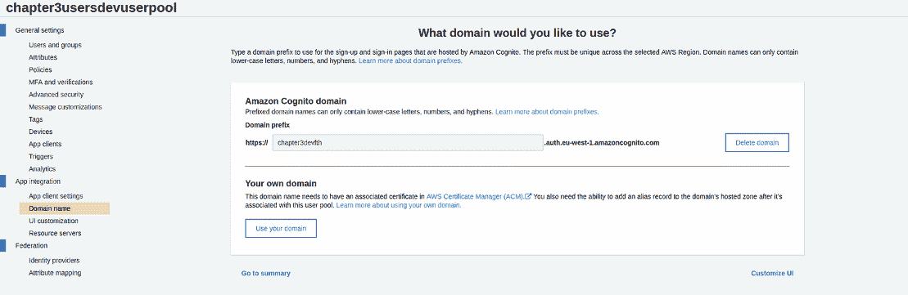

图 4.13 用户和身份池

对于我们的用户池，我们使用了域名 `chapter4devfth`。您可以使用任何可用的唯一域名。

接下来，我们需要配置我们的 OAuth 流。选择应用客户端设置选项，并按图 4.14 所示提供设置。

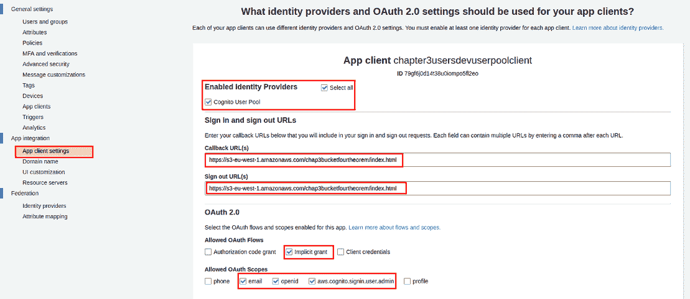

图 4.14 OAuth 流配置

对于登录和注销回调 URL，您应该使用我们在步骤 1 中创建的定制域名提供您的前端存储桶的 URL。这些应该以以下形式提供：[`s3-eu-west-1.amazonaws.com/<YOUR BUCKET NAME>/index.html`](https://s3-eu-west-1.amazonaws.com/<YOUR%20BUCKET%20NAME%3E/index.html)。

OAuth

OAuth 是一种广泛实施的认证和授权标准协议。对 OAuth 2.0 协议的全面讨论需要一本完整的书籍。实际上，我们会将对此感兴趣的读者推荐到曼宁出版社出版的由 Justin Richer 和 Antonio Sanso 编写的 *OAuth 2 in Action* 一书（[`www.manning.com/books/oauth-2-in-action`](https://www.manning.com/books/oauth-2-in-action)）。

关于 OAuth 2.0 协议的更多详细信息，请参阅此处：[`oauth.net/2/`](https://oauth.net/2/)。

最后，对于用户池，我们需要创建一个账户来登录。为此，选择用户和组，然后点击创建用户按钮。在这里，您可以使用您的电子邮件地址作为用户名，并选择一个临时密码。在电子邮件字段中也输入您的电子邮件地址。不需要输入电话号码，因此取消选中“标记电话号码为已验证”。所有其他字段的默认选择可以保持不变。

#### 更新环境变量

现在我们已经配置了我们的池，我们需要更新我们的 `.env` 文件。进入 `chapter4/step-2-cognito-login` 目录并编辑文件 `.env` 以匹配以下列表。

列表 4.20 更新的 `.env` 文件

```
# environment definition for Chapter 4
TARGET_REGION=eu-west-1                                      ❶
CHAPTER4_BUCKET=<your bucket name>
CHAPTER4_DATA_BUCKET=<Your data bucket name>
CHAPTER4_DOMAIN=<your development domain>
CHAPTER4_COGNITO_BASE_DOMAIN=<your cognito domain>
CHAPTER4_COGNITO_DOMAIN=<your cognito domain>.auth.eu-west-1.amazoncognito.com                                     ❷
CHAPTER4_POOL_ARN=<your user pool ARN>
CHAPTER4_POOL_ID=<your user pool ID>
CHAPTER4_POOL_CLIENT_ID=<your app integration client ID>
CHAPTER4_IDPOOL=<your identity pool ID>
```

❶ 环境变量的第一块保留自列表 4.11。

❷ 新的环境变量引用了我们创建的 AWS Cognito 资源。

您可以在 AWS 管理控制台的 Cognito 部分找到这些 ID。用户池 ID 位于用户池视图中，如图 4.15 所示。

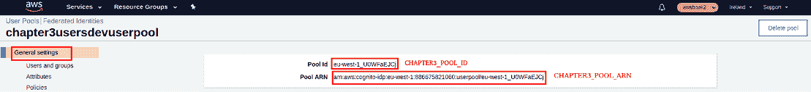

图 4.15 用户池 ID 和 ARN

客户端 ID 可以在 Cognito 用户池视图的 *应用客户端设置* 部分找到。这如图 4.16 所示。

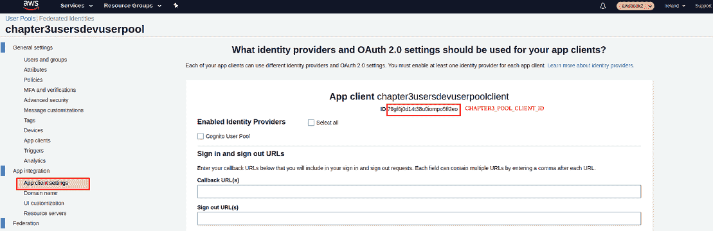

图 4.16 池客户端 ID

身份池 ID 可以在“联合身份”视图中找到。只需选择已创建的身份池，然后在右上角选择编辑身份池。编辑视图如图 4.17 所示。从这里，您可以查看并复制身份池 ID。

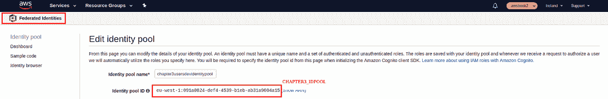

图 4.17 身份池 ID

注意，您可能会看到一个警告，表明没有指定未认证的角色。这可以忽略，因为所有用户都必须对我们的应用程序进行认证。

一旦您在 AWS 控制台中找到了所需值，请使用相关值填充`.env`文件。

#### 更新待办事项 API

现在我们已经更新了我们的环境，我们可以将更改部署到我们的待办事项服务。请进入`step-2-cognito-login/todo-service`目录并运行

```
$ npm install
$ serverless deploy
```

这将推送 API 的新版本，其中包括我们的 Cognito 授权器。

#### 更新前端

现在我们已经安全地保护了我们的 API，我们需要更新我们的前端以允许访问。为此，请进入`step-2-cognito-login/frontend`目录并运行

```
$ source ../.env
$ npm install
$ npm run build
$ aws s3 sync dist/ s3://$CHAPTER4_BUCKET
```

这将构建我们应用程序的新版本，包括认证代码，并将其部署到我们的存储桶。如果您将浏览器指向我们的应用程序，您应该看到一个空白页面和页面顶部的登录链接。点击此链接将弹出 Cognito 登录对话框。一旦登录，应用程序应该像以前一样运行。

虽然设置 Cognito 需要一点努力，但带来的好处远远超过了成本。让我们回顾一下您使用此服务可以获得的内容：

+   用户注册

+   安全 JWT 登录

+   集成到 AWS IAM 安全模型中

+   密码重置

+   联邦身份，包括企业和社交（如 Facebook、Google、Twitter...）

+   密码策略控制

那些之前必须处理这些问题的用户将欣赏到实现这些功能所带来的大量开销，即使使用第三方库也是如此。使用 Cognito 的关键原因是将保持用户账户安全的大部分工作责任转移到这个服务上。当然，我们仍然必须注意我们应用程序的安全性；然而，知道 Cognito 服务正在为我们积极管理和更新，这让人感到安慰。

为了使我们的安全无服务器应用程序上线，我们覆盖了很多内容。关于这一点，重要的是我们能够以非常少的努力快速以安全的方式部署我们的应用程序。在下一章中，我们将向我们的待办事项列表添加一些 AI 服务。

## 摘要

+   从客户端到数据库的端到端无服务器平台可以在代码中定义并使用 Serverless Framework 进行部署。

+   可以在`serverless.yml`文件的资源部分创建 DynamoDB 表。

+   在我们的 Lambda 函数中使用 AWS SDK 将数据从事件传递到我们的数据库读/写调用。

+   认证和授权使用 AWS Cognito 进行配置。我们配置了一个用户池、身份池和自定义域名，以及一个策略来保护特定资源。

+   AWS Amplify 与 Cognito 结合使用，以创建一个带有 Cognito 的登录界面。Amplify 是 AWS 提供的一个易于使用的客户端 SDK，它集成了 Cognito 以启用强大的安全功能。

+   可以创建 API Gateway CRUD 路由来触发 Lambda 函数。API Gateway 路由是通过我们在 `serverless.yml` 中定义的事件创建的，与相关的 Lambda 函数或 *handler* 相关联。

警告：第五章将继续构建此系统，并在第五章末尾提供如何移除已部署资源的说明。如果您暂时不打算处理第五章，请确保您完全移除本章中部署的所有云资源，以避免产生额外费用！
