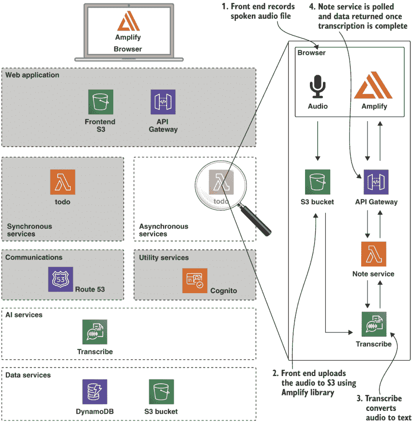
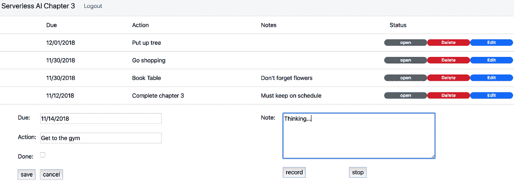
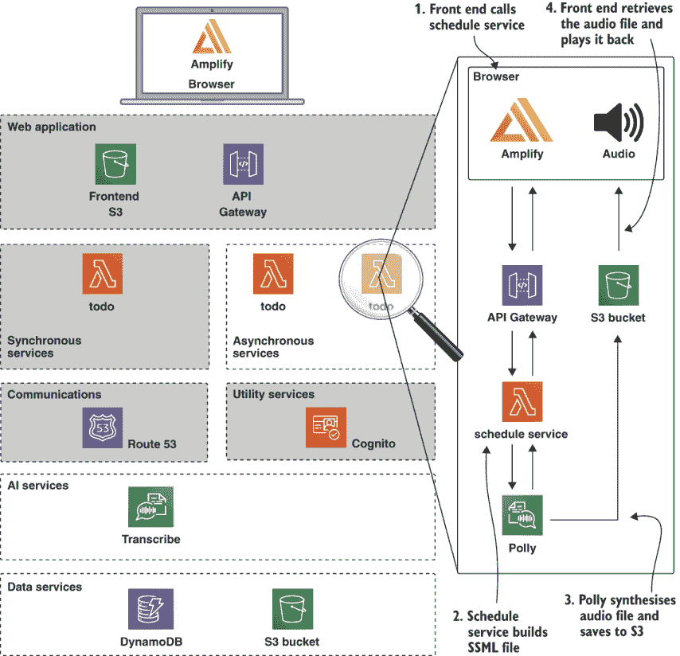
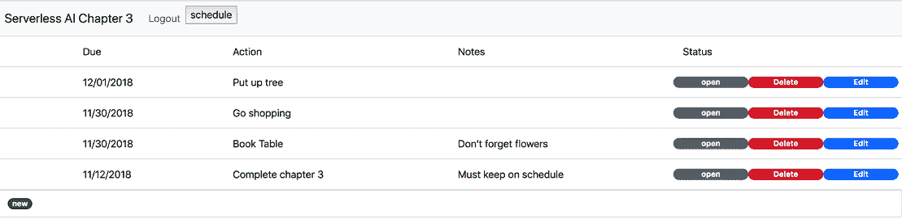
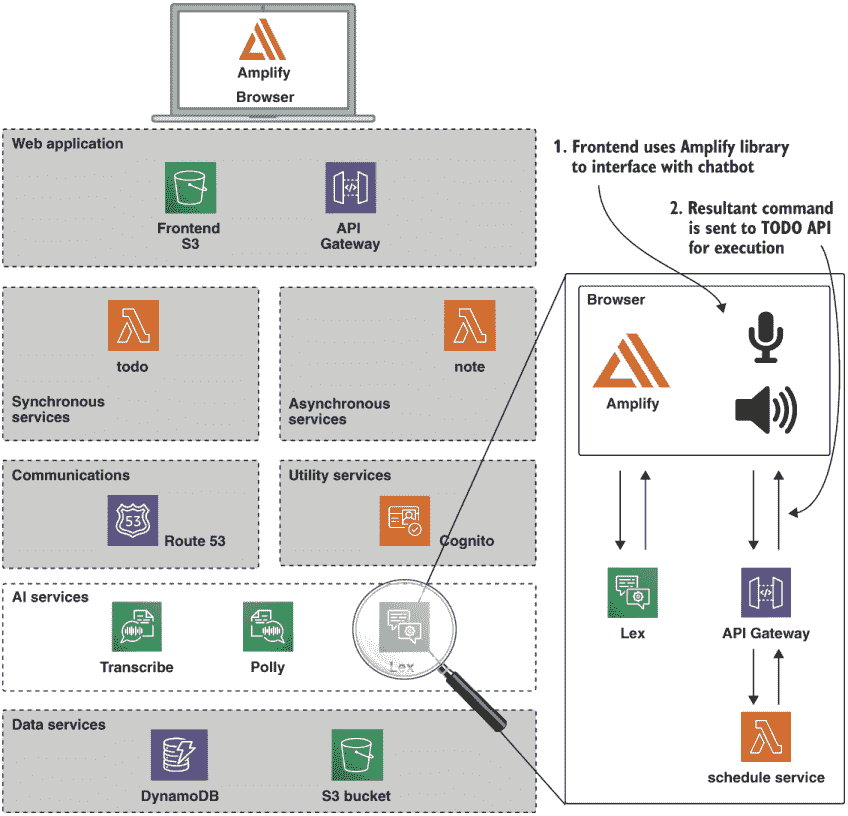
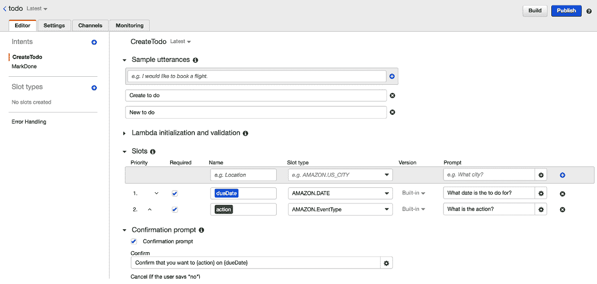
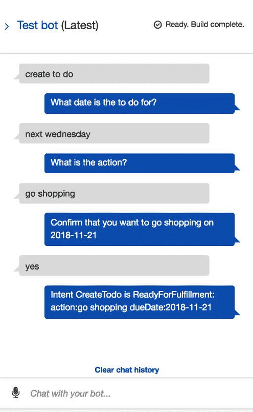
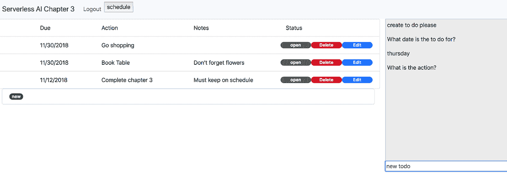

# 5 将人工智能界面添加到 Web 应用程序

本章涵盖

+   使用 Transcribe 说话音符

+   使用 Polly 回读日程

+   使用 Lex 添加聊天机器人界面

在本章中，我们将基于第四章的待办事项应用程序进行构建，向系统中添加现成的 AI 功能。我们将添加自然语言语音接口来记录和转录文本，并让系统从我们的待办事项列表中告诉我们日常日程。最后，我们将向系统中添加一个对话界面，使我们能够完全通过自然语言界面进行交互。正如我们将看到的，这可以通过利用云 AI 服务来完成，从而快速构建。

如果您还没有完成第四章的内容，您应该在继续本章之前返回并完成它，因为我们将直接基于该章末尾部署的待办事项应用程序进行构建。如果您对第四章的内容感到满意，我们可以直接进入并添加我们的笔记服务。我们将从我们上次离开的地方开始，从步骤 3 开始。

## 5.1 步骤 3：添加语音到文本界面

现在我们已经部署并安全了一个基本的无服务器应用程序，是时候添加一些人工智能功能了。在本节中，我们将添加一个语音到文本界面，使我们能够将笔记口述到系统中而不是键入。我们将使用 AWS Transcribe 来实现这一点。正如我们将看到的，添加语音到文本实际上对于这样一个高级功能来说并不太难。

图 5.1 显示了该功能的实现方式。



图 5.1 步骤 3 架构。AWS Transcribe 服务从笔记服务中调用。前端应用程序使用 Amplify 将 Transcribe 处理后的文件上传到 S3。

系统将使用浏览器捕获语音音频并将其保存到 S3，使用 Amplify 库。一旦音频文件上传，就会调用笔记服务。这将启动一个 Transcribe 任务将音频转换为文本。客户端将定期轮询笔记服务以确定转换何时完成。最后，前端将使用转换后的文本填充笔记字段。

### 5.1.1 获取代码

此步骤的代码位于 `chapter5/step-3-note-service` 目录中。此目录包含步骤 2 的所有代码，以及我们的音频转录更改。与之前一样，我们将依次介绍更新，然后部署更改。

### 5.1.2 笔记服务

我们的笔记服务遵循现在应该已经熟悉的模式：代码位于 `note-service` 目录中，包含一个 `serverless.yml` 配置文件和实现。大部分都是样板代码：主要区别在于我们配置服务以访问 S3 数据桶和访问 Transcribe 服务。这位于我们的配置中的 `iamRoleStatements` 部分，如下所示。

列表 5.1 笔记服务角色声明

```
provider:
  ...
  iamRoleStatements:
    - Effect: Allow
      Action:              ❶
        - s3:PutObject
        - s3:GetObject
      Resource: "arn:aws:s3:::${self:custom.dataBucket}/*"
    - Effect: Allow
      Action:              ❷
        - transcribe:*
      Resource: "*"
```

❶ 音频文件数据桶

❷ 允许此服务访问转录。

笔记服务定义了两个路由：`POST` `/note` 和 `GET` `/note/{id}`，分别用于创建和获取笔记。与待办事项 CRUD 路由一样，我们使用我们的 Cognito 池来锁定对笔记 API 的访问，并且我们使用相同的自定义域名结构，只是基础路径为 `noteapi`。我们的处理器代码使用 AWS SDK 创建转录任务，如下所示。

列表 5.2 笔记服务处理器

```
const AWS = require('aws-sdk')
var trans = new AWS.TranscribeService()                   ❶

module.exports.transcribe = (event, context, cb) => {
  const body = JSON.parse(event.body)

  const params = {
    LanguageCode: body.noteLang,
    Media: { MediaFileUri: body.noteUri },
    MediaFormat: body.noteFormat,
    TranscriptionJobName: body.noteName,
    MediaSampleRateHertz: body.noteSampleRate,
    Settings: {
      ChannelIdentification: false,
      MaxSpeakerLabels: 4,
      ShowSpeakerLabels: true
    }
  }

  trans.startTranscriptionJob(params, (err, data) => {   ❷
    respond(err, data, cb)
  })
}
```

❶ 创建转录服务对象。

❷ 开始异步转录任务。

如列表所示，代码相当简单，因为它只是调用单个 API 来启动任务，传递我们音频文件的链接。代码向客户端返回一个转录作业 ID，该 ID 在 `poll` 函数中使用。详细检查代码以查看 `poll` 的实现，它使用 `getTranscriptionJob` API 检查我们正在运行的作业的状态。

### 5.1.3 前端更新

为了提供转录功能，我们对前端进行了一些更新。首先，我们在 `index.js` 中添加了一些对 Amplify 库的配置。如下所示。

列表 5.3 更新的 Amplify 配置

```
Amplify.configure({
  Auth: {
    region: process.env.TARGET_REGION,
    userPoolId: process.env.CHAPTER4_POOL_ID,
    userPoolWebClientId: process.env.CHAPTER4_POOL_CLIENT_ID,
    identityPoolId: process.env.CHAPTER4_IDPOOL,
    mandatorySignIn: false,
    oauth: oauth
  },
  Storage: {                                     ❶
    bucket: process.env.CHAPTER4_DATA_BUCKET,
    region: process.env.TARGET_REGION,
    identityPoolId: process.env.CHAPTER4_IDPOOL,
    level: 'public'
  }
})
```

❶ 配置 Amplify 存储接口使用的 S3 桶。

此配置告诉 Amplify 使用我们在步骤 1 中设置的我们的数据桶。因为我们已经使用我们的 Cognito 设置配置了 Amplify，所以一旦登录，我们就可以从客户端访问此桶。

我们在 `frontend/src/audio` 目录中添加了一些音频处理代码。它使用浏览器媒体流录制 API 将音频录制到缓冲区。为了本书的目的，我们将此代码视为黑盒。

注意 更多关于媒体流录制 API 的信息可以在此处找到：[`mng.bz/X0AE`](http://mng.bz/X0AE)。

主要的笔记处理代码位于 `note.js` 和 `note-view.js` 文件中。视图代码向用户界面添加了两个按钮：一个用于开始录音，另一个用于停止录音。这些按钮分别对应 `note.js` 中的 `startRecord` 和 `stopRecord` 函数。`stopRecord` 函数的代码如下所示。

列表 5.4 `stopRecord` 函数

```
import {Storage} from 'aws-amplify'
...
function stopRecord () {
  const noteId = uuid()

  view.renderNote('Thinking')
  ac.stopRecording()
  ac.exportWAV((blob, recordedSampleRate) => {    ❶
    Storage.put(noteId + '.wav', blob)            ❷
      .then(result => {
        submitNote(noteId, recordedSampleRate)    ❸
      })
      .catch(err => {
        console.log(err)
      })
    ac.close()
  })
}
```

❶ 将录制缓冲区导出为 WAV 格式

❷ 使用 Amplify 将 WAV 文件保存到 S3。

❸ 提交 WAV 文件进行处理。

`stopRecord` 函数使用 Amplify 的 `Storage` 对象将 WAV（波形音频文件格式）文件直接写入 S3。然后调用 `submitNote` 函数，该函数调用我们的笔记服务 API `/noteapi/note` 来启动转录任务。`submitNote` 函数的代码如下所示。

列表 5.5 `submitNote` 函数

```
const API_ROOT = `https://chapter4api.${process.env.CHAPTER4_DOMAIN}
/noteapi/note/`
...
function submitNote (noteId, recordedSampleRate) {
  const body = {
    noteLang: 'en-US',
    noteUri: DATA_BUCKET_ROOT + noteId + '.wav',
    noteFormat: 'wav',
    noteName: noteId,
    noteSampleRate: recordedSampleRate
  }

  auth.session().then(session => {
    $.ajax(API_ROOT, {                    ❶
      data: JSON.stringify(body),
      contentType: 'application/json',
      type: 'POST',
      headers: {
        Authorization: session.idToken.jwtToken
      },
      success: function (body) {
        if (body.stat === 'ok') {
          pollNote(noteId)                ❷
        } else {
          $('#error').html(body.err)
        }
      }
    })
  }).catch(err => view.renderError(err))
}
```

❶ 调用笔记服务。

❷ 进入轮询状态

我们的轮询函数在后台调用笔记服务以检查转录任务的进度。轮询函数的代码如下所示。

列表 5.6 `note.js pollNote` 函数

```
function pollNote (noteId) {
  let count = 0
  itv = setInterval(() => {
    auth.session().then(session => {                                  ❶
      $.ajax(API_ROOT + noteId, {                                     ❷
        type: 'GET',
        headers: {
          Authorization: session.idToken.jwtToken
        },
        success: function (body) {
          if (body.transcribeStatus === 'COMPLETED') {
            clearInterval(itv)
            view.renderNote(body.results.transcripts[0].transcript)   ❸
          } else if (body.transcribeStatus === 'FAILED') {
            clearInterval(itv)
            view.renderNote('FAILED')
          } else {
            count++
            ...
          }
        }
      })
    }).catch(err => view.renderError(err))
  }, 3000)
}
```

❶ 使用 Cognito 获取认证会话。

❷ 调用 API 检查笔记状态。

❸ 如果转录完成，渲染转录的笔记。

作业完成后，生成的文本将被渲染到页面上的笔记输入字段中。

投票

轮询通常不是处理事件的有效方式，并且肯定不适合扩展。我们在这里使用轮询确实暴露了 AWS Lambda 的一个缺点，即函数通常预期在短时间内执行。这使得它们不适合可能需要长期连接的应用程序。当作业完成时，建立 WebSocket 连接并向下推送更新是一个更好的接收更新方式。这更有效率，并且可以很好地扩展。

在这里，有几个更好的选项可以用来代替轮询，例如

+   使用 AWS API Gateway 和 WebSockets——[`mng.bz/yr2e`](http://mng.bz/yr2e)。

+   使用第三方服务，如 Fanout——[`fanout.io/`](https://fanout.io/)。

当然，最佳方法将取决于具体的系统。这些方法的描述超出了本书的范围，这就是为什么我们为笔记服务使用了简单的基于轮询的方法。

### 5.1.4 部署步骤 3

让我们部署笔记功能。首先，我们需要设置我们的环境。为此，只需将`step-2-cognito-login`中的`.env`文件复制到`step-3-note-service`。

接下来，我们将部署我们的新笔记服务。在`step-3-note-service/note-service`目录下使用`cd`命令，然后运行

```
$ npm install
$ serverless deploy
```

这将在 API Gateway 中创建我们的笔记服务端点并安装我们的两个 Lambda 函数。接下来，部署前端更新。在`step-3-note-service/frontend`目录下使用`cd`命令并运行

```
$ source ../.env
$ npm install
$ npm run build
$ aws s3 sync dist/ s3://$CHAPTER4_BUCKET
```

### 5.1.5 测试步骤 3

让我们尝试一下我们新的语音转文字功能。在浏览器中打开待办事项应用并像之前一样登录。点击创建新待办事项的按钮，并输入一个动作和一个日期。你应该会看到如图 5.2 所示的额外两个按钮：一个录音按钮和一个停止按钮。



图 5.2 录音笔记

点击录音按钮开始说话！说完后，点击停止按钮。几秒钟后，你应该会看到你刚才口述的笔记被渲染成文本，出现在笔记字段中，这样你就可以继续保存新的待办事项，包括转录的笔记。

将音频转录成文本的时间是可变的，这取决于当前正在进行的全球转录作业数量。在最坏的情况下，转录完成可能需要 20 到 30 秒。虽然待办事项上的笔记是展示 AWS Transcribe 的一种方式，但请注意，我们使用的 API 是针对批量处理优化的，并且可以转录包含多个说话者的大型音频文件——例如，董事会会议或采访。我们将在本章后面的步骤 5 中介绍一个更快的对话界面。然而，我们应该指出，在最近的服务更新中，AWS Transcribe 现在也支持实时处理以及批量模式。

## 5.2 步骤 4：添加文本到语音

我们将要添加到待办事项列表中的下一个 AI 功能是笔记服务的逆过程。我们的调度服务将从我们的待办事项列表中构建每日日程，然后将其读给我们听。我们将使用 AWS Polly 来实现这一点。Polly 是 AWS 语音到文本服务。我们可以通过 API 的方式将其连接到我们的系统，类似于我们的笔记服务。图 5.3 描述了调度服务的架构结构。



图 5.3 记录笔记

当我们的系统用户请求日程时，会调用我们的调度服务，该服务创建文本形式的日程并将其提交给 Amazon Polly。Polly 解释文本并将其转换为音频。音频文件被写入我们的 S3 数据存储桶，一旦可用，我们就将其播放给我们的用户。再次强调，这对于一个高级功能来说工作量很小！

### 5.2.1 获取代码

此步骤的代码位于`chapter5/step-4-schedule-service`目录中。此目录包含步骤 3 的所有代码以及我们的调度服务。与之前一样，我们将依次介绍更新，然后部署更改。

### 5.2.2 调度服务

我们的调度服务与笔记服务类似，因为它使用与之前相同的域管理器结构提供两个 API 端点：

`/schedule/day`--为今天创建日程并提交文本到语音任务给 Polly

`/schedule/poll`--检查作业状态，一旦完成返回音频文件的引用

这种结构反映在`serverless.yml`配置中，在这个阶段应该非常熟悉。这两个端点`day`和`poll`的实现位于`handler.js`中。首先，让我们看看`day`处理程序使用的`buildSchedule`函数。如下列表所示。

列表 5.7 调度服务`day`处理程序中的`buildSchedule`函数

```
const dynamoDb = new AWS.DynamoDB.DocumentClient()
const polly = new AWS.Polly()                                ❶
const s3 = new AWS.S3()
const TABLE_NAME = { TableName: process.env.TODO_TABLE }     ❷
...
function buildSchedule (date, speakDate, cb) {               ❸
  let speech = '<s>Your schedule for ' + speakDate + '</s>'
  let added = false
  const params = TABLE_NAME

  dynamoDb.scan(params, (err, data) => {                     ❹
    data.Items.forEach((item) => {
      if (item.dueDate === date) {
        added = true
        speech += '<s>' + item.action + '</s>'
        speech += '<s>' + item.note + '</s>'
      }
    })
    if (!added) {
      speech += '<s>You have no scheduled actions</s>'
    }
    const ssml = `<speak><p>${speech}</p></speak>`
    cb(err, {ssml: ssml})
  })
}
```

❶ 创建 SDK Polly 对象。

❷ 从环境中获取待办事项表。

❸ 定义构建 SSML 日程的函数。

❹ 从 DynamoDB 读取日程事项并创建到期事项的 SSML。

我们已经看到`buildSchedule`函数如何读取给定日期的待办事项并创建 SSML。这被调度服务中的`day`处理程序使用。下一列表显示了此处理程序的代码。

列表 5.8 调度服务`day`处理程序

```
module.exports.day = (event, context, cb) => {
  let date = moment().format('MM/DD/YYYY')
  let speakDate = moment().format('dddd, MMMM Do YYYY')
  buildSchedule(date, speakDate, (err, schedule) => {
    if (err) { return respond(err, null, cb) }

    const params = {                                          ❶
      OutputFormat: 'mp3',
      SampleRate: '8000',
      Text: schedule.ssml,
      LanguageCode: 'en-GB',
      TextType: 'ssml',
      VoiceId: 'Joanna',
      OutputS3BucketName: process.env.CHAPTER4_DATA_BUCKET,
      OutputS3KeyPrefix: 'schedule'
    }

    polly.startSpeechSynthesisTask(params, (err, data) => {   ❷
      ...
      respond(err, result, cb)
    })
  })
}
```

❶ 配置 Polly 的语音和输出存储桶参数。

❷ 启动 Polly 语音合成任务。

`buildSchedule`函数创建了一个 SSML 块，传递给 Polly，Polly 将将其转换为输出`mp3`文件。我们的`day`函数设置了一个参数块，指定输出格式，以及 Polly 应将输出放置的 S3 存储桶。下一列表中的代码显示了`poll`处理程序。

列表 5.9 调度服务的`poll`处理程序

```
module.exports.poll = (event, context, cb) => {
  polly.getSpeechSynthesisTask({TaskId: event.pathParameters.id}, (err, data) => {  ❶
    // Create result object from data
    ...
    respond(err, result, cb)                                        ❷
  })
}
```

❶ 检查任务状态。

❷ 向 API 调用者提供任务状态。

检查处理器代码显示了 Lambda 函数调用 Polly 服务以检索语音合成任务。这包含在 API 响应中。

SSML

*语音合成标记语言 (SSML)* 是一种用于文本到语音任务的 XML 方言。虽然 Polly 可以处理纯文本，但 SSML 可以用于为语音合成任务提供额外的上下文。例如，以下 SSML 使用了耳语效果：

```
<speak>
  I want to tell you a secret.
  <amazon:effect name="whispered">I am not a real human.</amazon:effect>.
  Can you believe it?
</speak>
```

更多关于 SSML 的信息可以在这里找到：[`mng.bz/MoW8`](http://mng.bz/MoW8)。

一旦我们的语音到文本任务启动，我们使用 `poll` 处理器来检查状态。这调用 `polly.getSpeechSynthesisTask` 来确定任务的状态。一旦我们的任务完成，我们使用 `s3.getSignedUrl` 生成一个临时 URL 来访问生成的 `mp3` 文件。

### 5.2.3 前端更新

要访问我们的调度服务，我们在应用程序的导航栏中放置一个“调度”按钮，如图 5.4 所示。



图 5.4 更新后的用户界面

这与文件 `frontend/src/schedule.js` 中的前端处理器相连，如下所示。

列表 5.10 `schedule.js`

```
import $ from 'jquery'
import {view} from './schedule-view'
...
const API_ROOT = `https://chapter4api.${process.env.CHAPTER4_DOMAIN}
/schedule/day/`
let itv
let auth

function playSchedule (url) {                    ❶
  let audio = document.createElement('audio')
  audio.src = url
  audio.play()
}

function pollSchedule (taskId) {                 ❷
  itv = setInterval(() => {
    ...
    $.ajax(API_ROOT + taskId, {                  ❷
      ...
      playSchedule(body.signedUrl)               ❸
      ...
  }, 3000)
}

function buildSchedule (date) {
  const body = { date: date }

  auth.session().then(session => {
    $.ajax(API_ROOT, {                           ❹
      ...
      pollSchedule(body.taskId)
      ...
    })
  }).catch(err => view.renderError(err))
}
```

❶ 播放调度文件。

❷ 检查调度状态。

❸ 将签名 URL 传递给播放器。

❹ 启动调度任务。

使用来自 S3 的临时签名 URL 允许前端代码使用标准的音频元素播放调度，而不会损害我们数据桶的安全性。

### 5.2.4 部署步骤 4

到现在为止，这一步骤的部署应该非常熟悉。首先，我们需要从上一个步骤复制我们的环境。将文件 `step-3-note-service/.env` 复制到 `step-4-schedule-service`。

接下来，通过执行以下命令部署调度服务：

```
$ cd step-4-schedule-service/schedule-service
$ npm install
$ serverless deploy
```

最后，像之前一样部署前端更新：

```
$ cd step-4-schedule-service/frontend
$ source ../.env
$ npm install
$ npm run build
$ aws s3 sync dist/ s3://$CHAPTER4_BUCKET
```

### 5.2.5 测试步骤 4

让我们现在让我们的待办事项列表读出我们当天的日程。在浏览器中打开应用程序，登录，并为今天的日期创建一些待办事项。一旦你输入了一到两个条目，点击调度按钮。这将触发调度服务构建并发送我们的日程到 Polly。几秒钟后，应用程序将为我们读出我们的日程！

我们现在有一个可以与之交谈的待办事项系统，并且它可以对我们说话。我们的待办事项存储在数据库中，系统通过用户名和密码进行安全保护。所有这些都不需要启动服务器或深入了解文本/语音转换的细节！

在我们对待办事项系统的最终更新中，将通过构建聊天机器人来为系统添加一个更会话式的界面。

## 5.3 步骤 5：添加会话式聊天机器人界面

在我们对待办事项应用程序的最终更新中，我们将实现一个聊天机器人。聊天机器人将允许我们通过基于文本的界面或通过语音与系统交互。我们将使用 Amazon Lex 来构建我们的机器人。Lex 使用与 Amazon Alexa 相同的 AI 技术。这意味着我们可以使用 Lex 为我们的系统创建一个更自然的人机界面。例如，我们可以要求我们的应用程序为“明天”或“下周三”安排待办事项。虽然这对人类来说是一种表达日期的自然方式，但实际上对计算机来说理解这些模糊的命令非常复杂。当然，通过使用 Lex，我们可以免费获得所有这些功能。图 5.5 展示了我们的聊天机器人如何集成到我们的系统中。



图 5.5 更新后的用户界面

用户可以通过聊天窗口或通过说话来提供命令。这些命令被发送到由 Lex 托管的我们的聊天机器人，并返回一个响应。在对话结束时，机器人将收集创建或更新待办事项所需的所有信息。然后前端将此信息发布到待办事项 API，就像之前一样。

在这一点上需要注意的是，我们不需要更改我们底层的待办事项 API，以便向其添加对话界面。这可以在现有代码的最小干扰上叠加。

### 5.3.1 获取代码

此步骤的代码位于 `chapter5/step-5-chat-bot` 目录中。此目录包含步骤 4 的所有代码以及与我们的聊天机器人交互的代码。

### 5.3.2 创建机器人

我们已经创建了一个用于创建我们的 `todo` 机器人的命令行脚本。此代码位于 `chapter5/step-5-chat-bot/bot` 目录中。文件 `create.sh` 使用 AWS 命令行设置机器人，如下所示。

列表 5.11 创建聊天机器人的脚本

```
#!/bin/bash
ROLE_EXISTS=`aws iam get-role \
--role-name AWSServiceRoleForLexBots \
| jq '.Role.RoleName == "AWSServiceRoleForLexBots"'`

if [ ! $ROLE_EXISTS ]                             ❶
then
  aws iam create-service-linked-role --aws-service-name lex.amazonaws.com
fi

aws lex-models put-intent \                       ❷
--name=CreateTodo \
--cli-input-json=file://create-todo-intent.json

aws lex-models put-intent \                       ❸
--name=MarkDone \
--cli-input-json=file://mark-done-intent.json

aws lex-models create-intent-version --name=CreateTodo
aws lex-models create-intent-version --name=MarkDone

aws lex-models put-bot --name=todo \              ❹
--locale=en-US --no-child-directed \
--cli-input-json=file://todo-bot.json
```

❶ 如有必要，创建服务角色

❷ 定义创建待办事项的意图。

❸ 定义标记完成的意图。

❹ 定义机器人。

注意：`create.sh` 脚本使用 `jq` 命令，这是一个用于处理 JSON 数据的命令行工具。如果您的开发环境中没有安装它，您需要使用系统包管理器进行安装。

此脚本使用一些 JSON 文件来定义我们聊天机器人的特性。请运行 `create.sh` 脚本。创建我们的机器人可能需要几秒钟的时间；我们可以通过运行以下命令来检查进度：

```
$ aws lex-models get-bot --name=todo --version-or-alias="\$LATEST"
```

一旦此命令的输出包含 `"status": "READY"`，我们的机器人就可以使用了。在网页浏览器中打开 AWS 控制台，并从服务列表中选择 Lex。点击 `todo` 机器人的链接。

注意：您在首次创建机器人时可能会看到错误消息，例如：“无法找到名为 `AWSServiceRoleForLexBots` 的角色”。这是因为 Lex 在账户中首次创建机器人时创建此服务角色。



图 5.6 更新后的用户界面

您的控制台应该看起来像图 5.6 所示。一开始这可能看起来有点复杂，但一旦我们理解了三个关键概念：意图、话语和插槽，配置实际上非常简单。

#### 意图

一个**意图**是我们想要实现的目标；例如，“订购披萨”或“预约”。将意图视为机器人的整体任务，它将需要收集额外数据以完成任务。一个机器人可以有多个意图，但通常这些都与某个中心概念相关。例如，一个订购披萨的机器人可能有“订购披萨”、“检查配送时间”、“取消订单”、“更新订单”等意图。

在`todo`机器人的情况下，我们有两个意图：`CreateTodo`和`MarkDone`。

#### 话语

一个**话语**是用来识别意图的短语。对于我们的`CreateTodo`意图，我们定义了`创建待办事项`和`新待办事项`这两个话语。重要的是要理解，话语不是一组必须精确提供的关键词。Lex 使用多种 AI 技术来匹配话语和意图。例如，我们的创建意图可以通过以下任何一种方式被识别：

+   “初始化待办事项”

+   “获取待办事项”

+   “我想要一个新的待办事项，请”

+   “为我创建待办事项”

话语为 Lex 提供示例语言，而不是需要精确匹配的关键词。

#### 插槽

一个**插槽**可以被视为 Lex 对话的输出变量。Lex 将使用对话来获取插槽信息。对于我们的`CreateTodo`意图，我们定义了两个插槽：`dueDate`和`action`。我们为这些插槽使用了内置的插槽类型`AMAZON.DATE`和`AMAZON.EventType`。在大多数情况下，内置的插槽类型提供了足够的信息；然而，根据机器人的需求，可以定义自定义的插槽类型。

Lex 将使用插槽类型作为帮助理解响应的手段。例如，当 Lex 提示我们输入日期时，它可以处理大多数合理的响应，例如

+   明天

+   星期四

+   下周三

+   圣诞节

+   2019 劳动节

+   从今天起一个月

这允许通过文本或语音实现灵活的对话界面

#### 尝试一下

让我们测试一下我们的机器人！点击右上角的构建按钮，等待构建完成。然后选择测试聊天机器人链接，在右侧弹出一个消息面板，并尝试创建一些待办事项。图 5.7 展示了一个示例会话。



图 5.7 更新后的用户界面

除了向机器人输入命令外，您还可以使用麦克风按钮对机器人说出语音命令，并让它以音频形式回复。需要注意的是，Lex 已从松散结构的对话中提取了结构化信息。然后我们可以将这些提取的结构化数据用于我们的代码中。

### 5.3.3 前端更新

现在我们已经有一个工作的机器人，是时候将其集成到我们的应用程序中了。更新前端的代码位于 `chapter5/step-5-chat-bot/frontend` 目录中。主要的机器人集成在 `src/bot.js` 中。首先，让我们看看以下列表中所示的 `activate` 函数。

列表 5.12 `bot.js` activate 函数

```
import $ from 'jquery'
import * as LexRuntime from 'aws-sdk/clients/lexruntime'             ❶
import moment from 'moment'
import view from 'bot-view'

const bot = {activate}
export {bot}

let ac
let auth
let todo
let lexruntime
let lexUserId = 'chatbot-demo' + Date.now()
let sessionAttributes = {}
let recording = false

...

function activate (authObj, todoObj) {
  auth = authObj
  todo = todoObj
  auth.credentials().then(creds => {
    lexruntime = new LexRuntime({region: process.env.TARGET_REGION,
      credentials: creds})                                          ❷
    $('#chat-input').keypress(function (e) {                        ❸
      if (e.which === 13) {
        pushChat()                                                  ❹
        e.preventDefault()
        return false
      }
    })
    bindRecord()
  })
}
```

❶ 导入 Lex API

❷ 配置 Lex 的区域和凭证

❸ 获取输入的文本。

❹ 使用输入的文本调用 pushChat。

`LexRuntime` 是 AWS SDK 服务的接口，用于处理 Lex 聊天机器人服务。它有两个方法用于将用户输入发送到 Lex。一个方法 `postContent` 支持音频和文本流。更简单的方法 `postText` 仅支持发送文本形式的用户输入。在这个应用程序中，我们将使用 `postText`。下一个列表显示了将前端捕获的输入文本传递给 Lex 的代码。

列表 5.13 `bot.js` pushChat 函数

```
function pushChat () {
  var chatInput = document.getElementById('chat-input')

  if (chatInput && chatInput.value && chatInput.value.trim().length > 0) {
    var input = chatInput.value.trim()
    chatInput.value = '...'
    chatInput.locked = true

    var params = {                                         ❶
      botAlias: '$LATEST',
      botName: 'todo',
      inputText: input,
      userId: lexUserId,
      sessionAttributes: sessionAttributes
    }

    view.showRequest(input)
    lexruntime.postText(params, function (err, data) {     ❷
      if (err) {
        console.log(err, err.stack)
        view.showError('Error:  ' + err.message + ' (see console for details)')
      }
      if (data) {
        sessionAttributes = data.sessionAttributes
        if (data.dialogState === 'ReadyForFulfillment') {
          todo.createTodo({                                ❸
            id: '',
            note: '',
            dueDate: moment(data.slots.dueDate).format('MM/DD/YYYY'),
            action: data.slots.action,
            stat: 'open'
          }, function () {})
        }
        view.showResponse(data)
      }
      chatInput.value = ''
      chatInput.locked = false
    })
  }
  return false
}
```

❶ 配置参数

❷ 向机器人发送文本

❸ 创建新的待办事项

`bot.js`，以及 `bot-view.js` 中的某些显示函数，通过 `postText` API 实现了一个简单的文本消息接口到我们的机器人。这会将用户的文本输入发送到 Lex 并引发响应。一旦我们的两个槽位 `dueDate` 和 `action` 被填充，Lex 将将响应数据 `dialogState` 设置为 `ReadyForFulfillment`。此时，我们可以从 Lex 响应中读取槽位数据，为我们的 `to-do` 项创建一个 JSON 结构，并将其发布到我们的待办事项 API。

我们还有一个 `pushVoice` 函数，我们已经将其连接到浏览器音频系统。这个函数与 `pushChat` 函数类似，但它会将音频推送到机器人。如果我们向机器人推送音频（即语音命令），它将像以前一样以文本形式响应，但还会在附加到响应数据对象的 `audioStream` 字段中包含音频响应。`playResponse` 函数接受这个音频流并简单地播放它，这样我们就可以与机器人进行语音激活的对话。

### 5.3.4 部署步骤 5

由于我们已经部署了我们的机器人，我们只需要更新前端。像以前一样，将步骤 4 中的 `.env` 文件复制到步骤 5 目录中，并运行以下列表中的命令以部署新版本。

列表 5.14 将部署命令更新前端

```
$ cd step-5-chat-bot/frontend
$ source ../.env
$ npm install                                 ❶
$ npm run build )                             ❷
$ aws s3 sync dist/ s3://$CHAPTER4_BUCKET     ❸
```

❶ 安装依赖项

❷ 创建前端静态资源的生产构建。

❸ 将静态网站复制到 S3 桶中。

更新后的前端现在已经部署完成。

### 5.3.5 测试步骤 5

打开浏览器并加载最新更改。登录后，你应该能在页面右侧看到聊天机器人界面，如图 5.8 所示。



图 5.8 更新后的 UI

你现在应该能够在与待办事项应用程序的上下文中与机器人交互。一旦对话完成，待办事项列表中将会创建一个新的待办事项！

虽然我们编写了大量代码来实现这一点，但代码实现起来相当简单。大多数时候我们只是在调用外部 API，这是大多数在职程序员熟悉的工作。通过调用这些 API，我们能够在待办事项列表中添加高级人工智能功能，而无需了解任何自然语言处理或语音到文本翻译的科学。

语音和聊天机器人界面变得越来越普遍，尤其是在移动应用程序中。我们最近遇到的一些很好的用例包括

+   集成在网页中的第一行客户支持和销售咨询

+   用于安排会议的个人助理

+   旅行助手，帮助预订航班和酒店

+   电子商务网站的个人购物助手

+   医疗保健和激励型机器人，以促进生活方式的改变

希望这一章能激发你将这项技术应用到自己的工作中！

## 5.4 移除系统

一旦您完成对系统的测试，应完全移除，以避免产生额外费用。这可以通过使用 `serverless remove` 命令手动完成。我们还在 `chapter5/step-5-chat-bot` 目录中提供了一个脚本，用于删除第四章和第五章中部署的所有资源。在 `bot` 子目录中还有一个单独的 `remove.sh` 脚本。要使用这些脚本，请执行以下命令：

```
$ cd chapter5/step-5-chat-bot
$ bash ./remove.sh
$ cd bot
$ bash ./remove.sh
```

如果您想在任何时候重新部署系统，同一文件夹中有一个名为 `deploy.sh` 的相关脚本。这将通过自动化第四章和本章中我们已执行的步骤为您重新部署整个系统。

## 摘要

+   AWS Transcribe 用于将语音转换为文本。Transcribe 允许我们指定一个文件、文件格式和语言参数，并启动转录作业。

+   使用 AWS Amplify 将数据上传到 S3 桶。我们可以通过使用 Amplify 的 `Storage` 接口将浏览器捕获的音频保存为 WAV 文件。

+   语音合成标记语言 (SSML) 用于定义对话式语音。

+   AWS Polly 用于将文本转换为语音。

+   AWS Lex 用于创建强大的聊天机器人。

+   Lex 的语句、意图和槽位是构建 Lex 聊天机器人的组件。

警告 请确保您完全移除本章中部署的所有云资源，以避免产生额外费用！
