# 6 如何有效地使用 AI 即服务

本章涵盖

+   为快速和有效开发构建无服务器项目结构

+   构建无服务器持续交付管道

+   通过集中式、结构化日志实现可观察性

+   监控生产中的无服务器项目指标

+   通过分布式跟踪理解应用程序行为

到目前为止，我们已经构建了一些非常吸引人的基于 AI 的无服务器应用程序。这些系统具有非凡的功能，代码量却很少。然而，你可能已经注意到，我们的无服务器 AI 应用程序有很多组成部分。我们坚持单一职责原则，确保每个应用程序由许多小型单元组成，每个单元都有其特定的目的。本章是关于*有效*的 AI 即服务。这意味着我们不仅超越了简单的应用原型，还开发出了能够为真实用户服务的生产级应用程序。为此，我们需要考虑的不仅仅是如何让基础知识工作，还要考虑何时可能会出现问题。

我们已经清楚地阐述了小型代码单元和现成、托管服务的优势。让我们退一步，从建筑师和开发人员从更传统的软件开发方式转变的角度来思考这种方法的优缺点。

我们将概述主要挑战如何与结构化、监控和部署应用程序相关，以确保您在保证质量和可靠性的同时继续快速交付。这包括拥有清晰的项目布局、一个有效的持续交付管道，以及在出现问题时能够快速了解应用程序行为的能力。

本章将提供克服每个挑战的实际解决方案，并帮助您建立有效的无服务器开发实践。

## 6.1 应对无服务器的全新挑战

由于本书中我们已经成功部署了出色的无服务器 AI 应用程序，很容易被误导，认为一切都会一帆风顺！就像任何软件开发方式一样，都有其缺点和需要注意的陷阱。通常，这些问题只有在构建并将系统投入生产后才会遇到。为了帮助您预见潜在问题并在问题出现之前解决它们，我们将列出无服务器开发的优缺点。然后，我们将展示一个模板项目，您可以用它作为自己私有项目的起点。目的是节省您在这些问题出现时可能花费的时间和挫折。

### 6.1.1 无服务器的优势和挑战

表 6.1 列出了使用托管 AI 服务开发无服务器应用程序的主要优势和挑战。

表 6.1 无服务器应用程序的优势和挑战

| 优势 | 挑战 |
| --- | --- |
| 按需计算允许你快速开始并扩展，无需管理任何基础设施。 | 你依赖于云服务提供商的环境来准确运行你的代码。 |
| 较小的部署单元允许你遵守单一责任原则。这些单元开发速度快，维护相对容易，因为它们有明确的目的和接口。维护这些组件的团队不需要考虑整个系统的微妙细节。 | 要真正实现无服务器，有一个显著的学习曲线。理解有效的无服务器架构、学习可用的管理服务以及建立有效的项目结构都需要时间。 |
| 管理计算、通信、存储和机器学习的服务，只需最小的设计和编程努力，就能大幅提升你的能力。同时，你将不再需要承担如果要在自己的组织中构建这种能力所必须承担的维护和基础设施负担。 | 无服务器-微服务架构的分布式和碎片化特性使得整体系统行为的可视化和推理变得更加困难。 |
| 在无服务器系统中，你只需为所使用的部分付费，消除了浪费，并允许你根据业务成功进行扩展。 | 虽然无服务器减少了你需要考虑的安全责任中的系统数量，但它与传统方法相当不同。例如，一个恶意攻击者通过使用过权限的 IAM 策略访问 AWS Lambda 执行环境，可能会允许攻击者访问你的资源和数据，以及消耗可能无限的 AWS 资源，如更多的 Lambda 执行、EC2 实例或数据库。这可能会从你的云服务提供商那里产生一笔巨额账单。 |
| 无服务器方法允许你选择多个管理数据库服务，确保任何工作都有合适的工具。这种“多语言持久性”与过去尝试为大多数情况选择一个数据库的经验截然不同，这导致了沉重的维护负担，并且不适合某些数据访问需求。 | 当你的团队需要具备正确使用它们的技能和理解时，处理多个数据库可能是一个挑战。虽然像 DynamoDB 这样的服务容易上手，但管理变更和确保最佳性能是一项必须通过学习和经验获得的新技能。 |
| 无服务器项目创建成本低廉，因此可以针对不同的环境多次重建。 | 动态创建的云资源通常会被赋予生成的名称。允许服务被其他组件发现是确保松散耦合、服务可用性和部署便捷性之间平衡必须解决的问题。 |

这些挑战和好处被提出，以提供一个清晰和诚实的无服务器软件在生产中的现实情况。现在，你已经意识到了陷阱以及潜在的收益，我们准备讨论如何避免陷阱并最大化你项目的效果。我们将借助一个包含许多现成解决方案的参考项目来完成这项工作。

### 6.1.2 一个生产级无服务器模板

本书作者在构建无服务器应用程序和体验所有好处与挑战方面投入了大量的时间。因此，我们建立了一套最佳实践。我们决定将这些实践整合到一个模板中，以便我们可以用它来快速启动新的无服务器项目。我们还决定开源这个项目，使其对任何构建生产级无服务器应用程序的人开放。它旨在作为一个学习资源，并允许我们从更广泛的社区中收集想法和反馈。

这个名为 *SLIC Starter* 的项目免费使用，并欢迎贡献。SLIC 代表无服务器、精益、智能和持续。你可以在 GitHub 上找到它：[`github.com/fourTheorem/slic-starter`](https://github.com/fourTheorem/slic-starter)。从头开始创建生产级无服务器应用程序可能会令人望而却步。有许多选择和决策需要做出。SLIC Starter 的目的是回答 80% 的这些问题，以便我们能够尽可能快地开始构建有意义的业务功能。需要做出决策的领域在图 6.1 中显示。

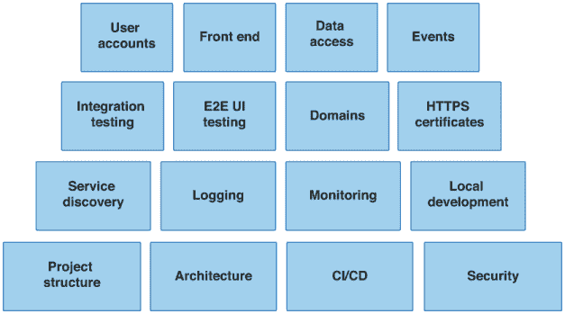

图 6.1 需要做出决策的无服务器项目方面。SLIC Starter 旨在为这些主题中的每一个提供模板，以便采用者能够更快地进入生产阶段。

SLIC Starter 是一个模板，可以应用于任何行业中的任何应用程序。它附带一个用于管理清单的示例应用程序。这个名为 *SLIC Lists* 的应用程序故意设计得简单，但具有足够的需求，使我们能够应用许多无服务器最佳实践。一旦你熟悉了 SLIC Starter，你可以用你自己的应用程序功能替换 SLIC Lists 应用程序。示例 SLIC Lists 应用程序具有以下功能：

+   用户可以注册和登录。

+   用户可以创建、编辑和删除清单。

+   用户可以在清单中创建条目并将它们标记为已完成。

+   任何清单都可以通过提供他们的电子邮件地址与其他用户共享。收件人必须接受邀请并登录或创建账户以查看和编辑列表。

+   当用户创建清单时，他们会收到一封“欢迎邮件”，通知他们已创建该列表。

我们系统的组件在图 6.2 中展示。显示的主要组件或 *服务* 如下：

+   *清单服务* 负责存储和检索列表及其条目。它由数据库支持，并为授权用户提供公共 API。

    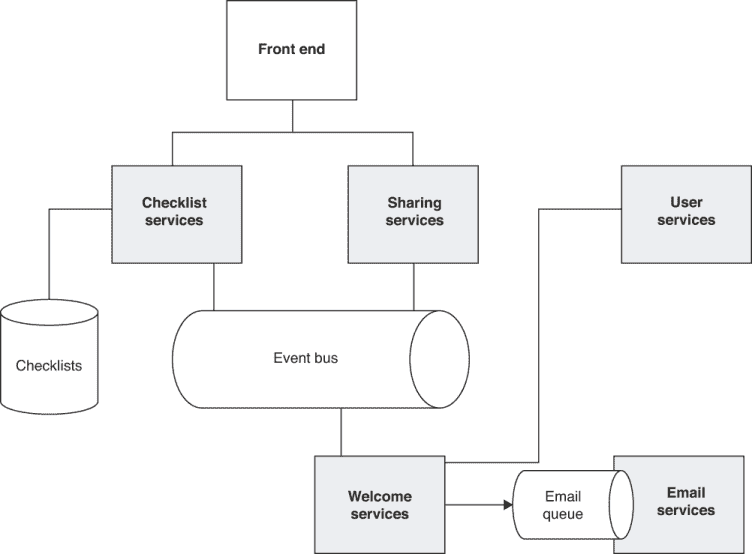

    图 6.2 SLIC 列表应用的 SLIC 启动服务。该应用由五个后端服务组成。还有一个前端组件，以及处理证书和域的附加服务。

+   *邮件服务* 负责发送邮件。邮件通过入站队列传递到这项服务。

+   *用户服务* 管理用户和账户。它还提供了一个内部 API，用于访问用户数据。

+   *欢迎服务* 在用户创建清单时向用户发送欢迎通知消息。

+   *共享服务* 处理向新合作者发送共享列表的邀请。

+   *前端* 负责前端 Web 应用的构建、部署和分发。它通过配置与公共、后端服务相连。

此外，我们还提供支持证书部署和创建面向公众的 API 域的服务。

这个应用所做的事情可能与你自己的应用不太相关，但*如何*构建这个应用应该非常相关。图 6.1 已经展示了你在构建成熟、生产级软件应用时最终需要考虑的基础性考虑因素。清单应用为每个这些考虑因素提供了一个模板，并作为学习资源，帮助你应对挑战，而无需花费太多时间停下来研究所有可能的解决方案。我们首先考虑的是如何结构化项目代码库和仓库。

## 6.2 建立项目结构

在项目快速扩展之前，建立清晰的项目和源代码库结构是一个好主意。如果你不这样做，团队成员在做出更改和添加新功能时可能会感到困惑，尤其是在新成员加入项目时。这里有许多选择，但我们希望优化在许多开发者共同构建、部署和运行新功能和修改的协作环境中的快速、高效开发。

### 6.2.1 源代码库--单代码库或多代码库

你如何组织团队的代码似乎是一个微不足道的话题。但正如我们在许多项目后发现的那样，关于如何进行简单决策会对你能够多快地做出更改并发布它们，以及开发者如何进行沟通和协作产生重大影响。这部分原因在于你是否选择多仓库或单仓库。*多仓库*是指在一个应用程序中，每个服务、组件或模块使用多个源代码控制仓库。在一个具有多个前端（如网页、移动端等）的微服务项目中，这可能导致数百或数千个仓库。*单仓库*是指所有服务和前端代码库都保存在单个仓库中。

谷歌、Facebook 和推特因在极其大规模上使用单仓库而闻名。当然，仅仅因为谷歌/Facebook/推特这么说就采取某种方法从来不是一个好主意。相反，就像其他所有事情一样，衡量这种方法对你产生的影响，并做出对你的组织有利的决策。图 6.3 展示了两种方法之间的差异。

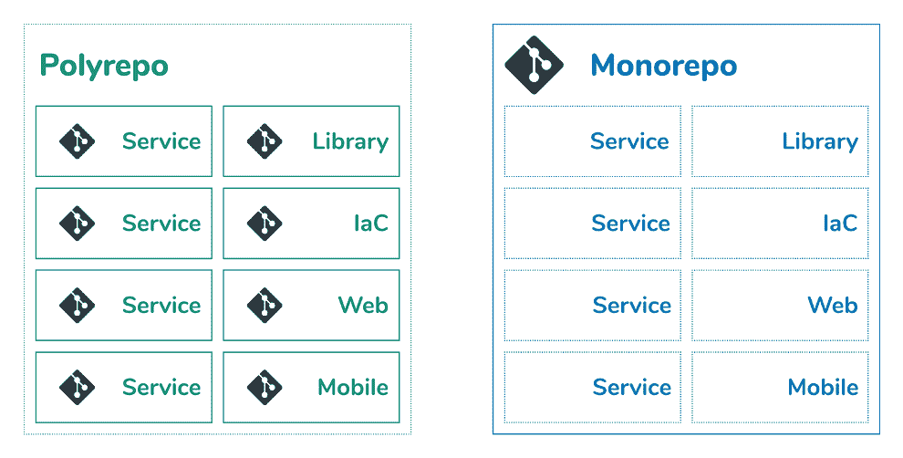

图 6.3 单仓库与多仓库对比。单仓库包含多个服务、支持库和基础设施即代码（IaC）在一个仓库中。多仓库倾向于为每个单独的组件使用单独的仓库。

多仓库（polyrepo）方法有一定的优势。例如，每个模块可以单独版本控制，并且可以拥有细粒度的访问控制。然而，根据我们的经验，在多个仓库之间进行协调管理会花费太多时间。随着更多服务、库和依赖项的增加，开销会迅速失控。通常，需要使用定制工具来管理跨仓库的依赖项。新开发者应该能够尽快开始为你的产品工作。避免不必要的仪式和任何仅适用于你团队或公司的独特学习曲线。

在单仓库（monorepo）模式下，当修复错误或添加功能影响多个模块/微服务时，所有更改都在同一个仓库中进行。单个仓库只有一个分支。不再需要在多个仓库之间进行跟踪。每个功能都有一个单独的拉取请求（pull request）。不会存在功能部分合并的风险。

通过坚持使用单个仓库，你的外部测试（端到端或 API 测试）也属于测试代码的一部分。同样适用于基础设施即代码（Infrastructure as Code）。任何需要更改的基础设施都会与应用程序代码一起捕获。如果你有被微服务使用的通用代码、实用工具和库，将它们保存在同一个仓库中可以非常容易地进行共享。

### 6.2.2 项目文件夹结构

SLIC Starter 仓库遵循单仓库（monorepo）方法。应用程序的布局与我们在这本书中已经描述的许多应用程序类似。每个服务都有自己的文件夹，包含一个 `serverless.yml` 文件。SLIC Starter 单仓库仓库中的项目结构在下一列表中展示。

列表 6.1 SLIC Starter 项目结构

```
???  certs/                Hosted zone and HTTPS Certificates (ACM)
???  api-service/          API Gateway custom domain
???  checklist-service/    API Gateway for checklists, DynamoDB
???  welcome-service/      Event handler to send emails on checklist creation
???  sharing-service/      API Gateway list sharing invitations
???  email-service/        SQS, SES for email sending
???  user-service/         Internal API Gateway and Cognito for user accounts
???  frontend/             S3, CloudFront, ACM for front-end distribution
???  cicd/                 Dynamic pipelines and cross account roles
???  e2e-tests/            End-to-end tests using TestCafe
???  integration-tests/    API tests
```

### 6.2.3 获取代码

为了探索这个具有项目结构和为本章剩余部分做准备，请从 SLIC Starter GitHub 仓库获取代码。如果你想在章节的后面自动构建和部署应用程序，你需要将此代码放在你控制的仓库中。为了实现这一点，在克隆之前先对 SLIC Starter 仓库进行分支（[`github.com/fourTheorem/slic-starter`](https://github.com/fourTheorem/slic-starter)）：

```
$ git clone https://github.com/<your_user_or_organization>/slic-starter.git
```

你现在应该对有效项目结构的意义有了稳固的理解。你也有权访问一个体现这种结构的模板项目。我们接下来的考虑是关于自动化部署项目组件。

## 6.3 持续部署

到目前为止，我们所有的无服务器应用程序都是手动部署的。我们依赖 Serverless Framework 的 `serverless` `deploy` 命令将每个服务部署到特定的目标环境中。这对于早期开发和原型设计来说是可以的，特别是当我们的应用程序规模较小时。但是，当真实用户依赖于我们的应用程序，并且预期功能开发将频繁且快速时，手动部署就太慢且容易出错。

当你的应用程序由数百个独立可部署的组件组成时，你能想象手动部署应用程序的场景吗？现实世界的无服务器应用程序本质上都是复杂的分布式系统。你不能，也不应该依赖对它们如何组合在一起有一个清晰的思维模型。相反，你应该依靠自动化部署和测试的力量。

有效的无服务器应用程序需要持续部署。*持续部署*意味着我们的源代码仓库中的更改会自动传递到目标生产环境中。当触发持续部署时，受代码更改影响的任何组件都会被构建和测试。还有一个系统用于集成测试我们更改的组件，作为整个系统的一部分。一个合适的持续部署解决方案让我们有信心快速做出更改。持续部署的原则同样适用于数据集和机器学习模型的部署。

让我们从高层次的角度来看一个无服务器持续部署系统的设计。

### 6.3.1 持续部署设计

我们已经讨论了我们的服务器端应用程序方法如何倾向于存储在单仓库中的源代码。这影响了持续部署过程的触发方式。如果每个模块或服务都存储在其自己的独立仓库中，该仓库的更改可能会触发该服务的构建。那么挑战就变成了如何在多个仓库之间协调构建。对于单仓库方法，我们希望避免在只有少数提交影响一到两个模块时构建一切。请查看图 6.4 中展示的高级持续部署流程。

部署管道的阶段如下：

1.  一个变更检测作业确定哪些模块受到源代码提交的影响。

1.  管道随后触发每个模块的并行构建。这些构建作业也将为相关模块运行单元测试。

    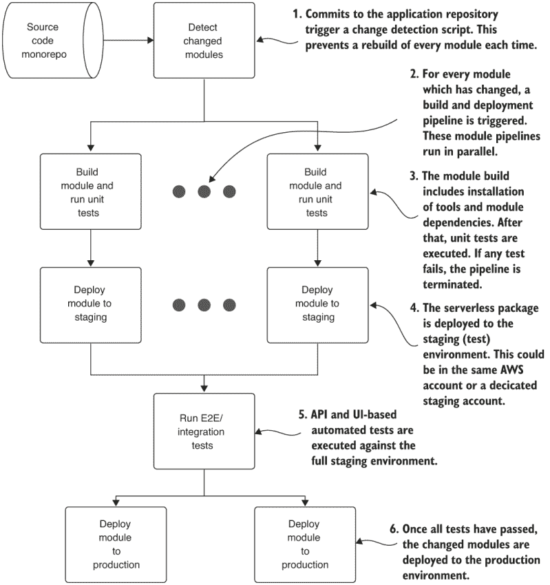

    图 6.4 我们的单仓库方法要求我们在触发每个受影响模块的并行构建和单元测试作业之前，检测哪些模块已更改。一旦成功，模块将被部署到预发布环境，在那里可以运行集成测试。成功的测试执行将触发向生产环境的部署。

1.  当所有构建都成功时，模块将被部署到预发布环境。预发布环境是生产环境的副本，不对真实用户公开。

1.  我们运行一系列自动化、端到端的测试，这让我们有信心在可预测的测试条件下，新的更改不会破坏系统中的基本功能。当然，在不可预测的生产条件下出现破坏性更改始终是可能的，你应该为此做好准备。

1.  如果所有测试都成功，新模块将被部署到生产环境。

在我们的管道中，我们假设有两个目标环境——一个用于在上线前测试新更改的预发布环境，以及一个用于最终用户的生产环境。预发布环境完全是可选的。实际上，尽快将更改投入生产并采取有效措施来减轻风险是理想的。这些措施包括快速回滚的能力、蓝/绿或金丝雀部署模式 1，以及良好的可观察性实践。可观察性将在本章后面讨论。

现在我们已经了解了持续部署流程，让我们来看看我们如何使用自身也是无服务器的托管云构建服务来实现它！

### 6.3.2 使用 AWS 服务实现持续部署

对于托管您的持续构建和部署环境，有许多优秀的选项。这些包括从不朽的 Jenkins 到 SaaS 服务，如 CircleCI ([`circleci.com`](https://circleci.com)) 和 GitHub Actions ([`github.com/features/actions`](https://github.com/features/actions))。选择取决于对你和你的团队来说什么最有效。对于本章，我们将使用 AWS 构建服务，以保持选择云托管服务的主题。这种方法的优点是，我们将使用与应用程序本身相同的 Infrastructure-as-Code 方法。持续部署管道将使用 CloudFormation 构建，并驻留在 SLIC Starter 中的其他服务相同的单仓库中。

#### 多账户和单账户部署

SLIC Starter 支持开箱即用的多账户部署。这允许我们为我们的预发布和生产环境使用单独的 AWS 账户，从而提供更高的隔离性和安全性。我们还可以使用一个单独的“工具”账户，其中将驻留持续部署管道和工件。这种方法需要时间来设置，并且对于许多用户来说，创建多个账户可能不可行。因此，单账户部署也是可能的。这是我们将在本章中介绍的选择。

#### 构建持续部署管道

我们将为管道使用的 AWS 服务是 AWS CodeBuild 和 AWS CodePipeline。CodeBuild 允许我们执行构建步骤，如安装、编译和测试。通常会产生一个构建工件作为其输出。CodePipeline 允许我们将多个操作组合成阶段。操作可以包括源获取、CodeBuild 执行、部署和人工批准步骤。操作可以按顺序或并行运行。

在我们的仓库的`master`分支上每次提交或合并时，我们将并行构建和部署受影响的模块。为了实现这一点，我们将为每个模块创建一个单独的管道。这些管道将由一个单一的、整体的*协调管道*执行和监控。所有这些都可以在图 6.5 中看到。

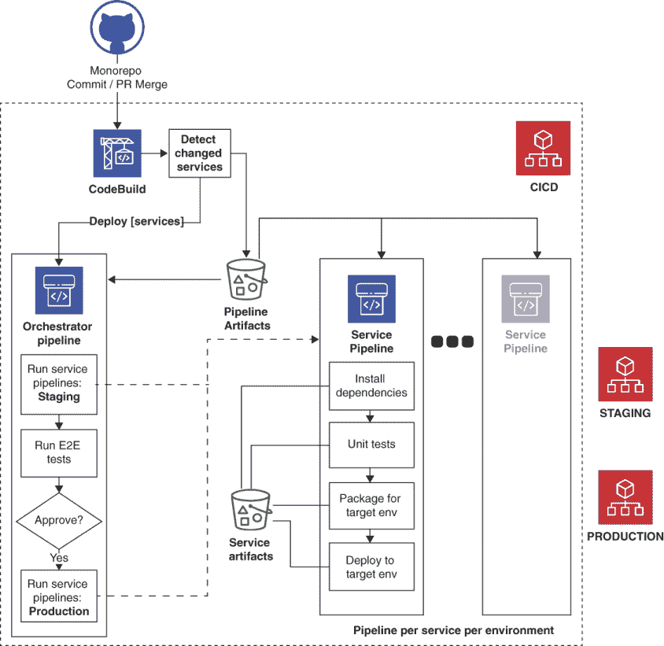

图 6.5 SLIC Starter 的典型无服务器 CI/CD 架构是其一部分。它使用每个模块的 CodePipeline 管道。这些管道的并行执行由协调管道协调。构建、部署和测试阶段作为 CodeBuild 项目实现。

由于我们正在使用 AWS 服务构建管道，因此我们将使用 CloudFormation 堆栈进行部署，就像我们的无服务器应用程序一样。到目前为止，我们已经使用 Serverless Framework 构建了这些堆栈。对于部署堆栈，我们将使用 AWS Cloud Development Kit (CDK)代替。

CDK 提供了一种程序化的方式来构建 CloudFormation 模板。使用标准编程语言进行基础设施即代码（IaC）有其优缺点。我们更喜欢这种方式，因为它与我们构建应用程序的方式相似，但对于许多人来说，使用 JSON 或 YAML 之类的配置语言来定义基础设施可能更好。在这种情况下，它允许我们动态创建项目和管道，而不是依赖于静态配置。随着我们向应用程序添加新的模块，CDK 将自动生成新的资源。CDK 支持 JavaScript、Python、Java 和 TypeScript。我们正在使用 TypeScript，它是 JavaScript 的超集，为我们提供了类型安全。类型安全在创建具有复杂配置语法的资源时是一种强大的辅助工具。它允许我们利用自动完成功能并获得即时的文档提示。CDK 和 TypeScript 的详细覆盖超出了本书的范围。如果您对探索如何构建管道感兴趣，请探索`cicd`文件夹中的 CDK TypeScript 代码。我们将直接进入并部署我们的 CI/CD 管道！

部署和运行 CI/CD 管道的最新文档位于 SLIC Starter 存储库中的`QUICK_START.md`文档中。一旦您运行了所有步骤，您的管道就准备好了。对存储库的每次提交都将触发源 CodeBuild 项目，并导致编排管道的执行。图 6.6 显示了在 AWS CodePipeline 控制台中该管道的外观。

在这里，我们可以清楚地看到已经运行的管道步骤。当前的执行处于“审批”阶段。这是一个特殊的阶段，需要用户进行审查并点击“批准”才能推进管道。这给了我们检查和取消任何生产部署的机会。显示的执行已成功部署到预发布环境，并且我们的测试作业已成功完成。在 SLIC Starter 中，针对公共 API 和前端，并行运行自动化的 API 集成测试和用户界面端到端（E2E）测试。

一旦我们的系统已部署到生产环境，我们需要了解那里发生了什么。当事情出错时，我们需要能够进行故障排除并回答有关应用程序状态的许多问题。这让我们想到了*可观察性*，这可能是有效生产无服务器部署中最重要的一部分！

## 6.4 可观察性和监控

在本章的开头，我们描述的挑战之一是无服务器系统的碎片化特性。这是由许多小部分组成的分布式系统的常见问题。它可能导致对系统运行行为的理解不足，使得解决问题和进行更改变得困难。随着微服务架构的更广泛采用，这个问题已经得到了更好的理解。利用第三方托管服务的无服务器应用程序，这个问题尤其普遍。这些托管服务在某种程度上是黑盒。

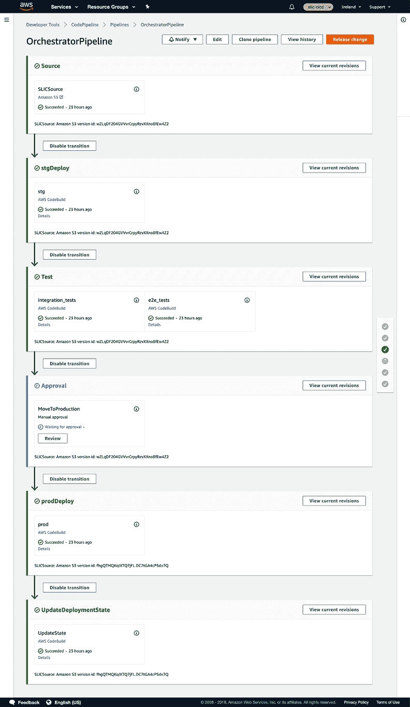

图 6.6 典型的无服务器 CI/CD 架构是 SLIC Starter 的一部分。它为每个模块使用一个 CodePipeline 管道。这些管道的并行执行由一个编排管道协调。构建、部署和测试阶段作为 CodeBuild 项目实现。

我们能理解多少取决于这些服务提供报告其状态的接口。系统报告其状态的程度被称为*可观察性*。这个术语越来越多地被用来代替传统的*监控*术语。

监控与可观察性

*监控*通常指的是使用工具来检查系统的已知指标。监控应允许你检测问题何时发生，并推断出关于系统的*某些*知识。如果一个系统没有发出正确的输出，监控的效果将受到限制。

*可观察性*，2，是控制理论中的一个术语，它是指系统的一个属性，允许你通过查看其输出了解其内部情况。可观察性的目标是能够通过检查输出理解任何给定的问题。例如，如果我们必须更改系统并重新部署以了解正在发生的事情，那么该系统缺乏可观察性。

考虑这两个术语之间的区别的一种方式是，监控允许你检测已知问题何时发生，而可观察性旨在在未知问题发生时提供理解。

例如，假设你的应用程序有一个经过良好测试、正常工作的注册功能。有一天，用户抱怨他们无法完成注册。通过查看系统的视觉图，你确定注册模块中的错误是由于发送注册确认电子邮件失败造成的。通过进一步调查电子邮件服务中的错误，你注意到已经达到了电子邮件发送限制，这阻止了电子邮件的发送。模块之间的依赖关系和错误的视觉图引导你到电子邮件服务日志，其中提供了根本原因的详细信息。这些可观察性功能帮助解决了意外问题。

实现可观察性的方法有很多。对于我们这个清单应用程序，我们将探讨我们想要观察的内容以及如何使用 AWS 管理服务来实现这一点。我们将探讨可观察性的四个实际领域：

+   结构化、集中的*日志记录*

+   服务和应用程序*指标*

+   当出现异常或错误条件时，会发出*警报*来提醒我们

+   *跟踪*以让我们能够看到整个系统中消息的流动

## 6.5 日志

可以从许多 AWS 服务中收集日志。使用 AWS CloudTrail，甚至可以收集通过 AWS SDK 或管理控制台进行的资源更改相关的日志。在这里，我们将关注我们的应用程序日志，即由我们的 Lambda 函数创建的日志。我们的目标是创建应用程序中有意义事件的日志条目，包括信息日志、警告和错误。当前趋势使我们倾向于采用*结构化日志*方法，这是有充分理由的。非结构化的纯文本日志难以搜索。它们也难以被日志分析工具解析。基于结构的、基于 JSON 的日志可以轻松解析、过滤和搜索。结构化日志可以被视为应用程序的*操作数据*。

在传统的、非无服务器环境中，日志通常收集在文件中或使用日志代理。使用 Lambda，这些选项实际上并不适用，因此方法变得更加简单。我们 Lambda 函数的任何控制台输出（无论是输出到*标准输出*还是*标准错误*）都会显示为日志输出。AWS Lambda 自动收集这些输出并将它们存储在 CloudWatch 日志中。这些日志存储在以 Lambda 函数名称命名的日志组中。例如，如果我们的 Lambda 函数名为`checklist-service-dev-get`，其日志将被收集在名为`/aws/lambda/checklist-service-dev-get`的 CloudWatch 日志组中。

CloudWatch 日志概念

CloudWatch 日志组织成*日志组*。日志组是一组相关的日志，通常与特定服务相关。在每一个日志组中有一组*日志流*。流是从同一来源的一组日志。对于 Lambda 函数，每个配置的*容器*只有一个日志流。日志流由一系列*日志事件*组成。日志事件只是记录到流中并关联时间戳的记录。

可以使用 API 或 AWS 管理控制台将日志存储在 CloudWatch 日志中以供检查。可以配置日志组以*保留期*来控制它们保留的时间。默认情况下，日志会永久保留。这通常不是最佳选择，因为与存档或删除日志相比，CloudWatch 中的日志存储要昂贵得多。

可以使用*订阅过滤器*将日志转发到其他服务。每个日志组可以设置一个订阅过滤器，允许设置一个过滤器模式和目的地。过滤器模式可以用来可选地提取仅与字符串匹配的消息。目的地可以是以下任何一种：

+   一个 Lambda 函数。

+   一个 Kinesis 数据流。

+   一个 Kinesis Data Firehose 交付流。交付流可以用来收集存储在 S3、Elasticsearch 或 Splunk 中的日志。

存储集中日志的第三方选项有很多，包括流行的 Elasticsearch、Logstash 和 Kibana 组合，通常称为*ELK 栈*。ELK 解决方案经过测试，非常强大，能够执行复杂的查询并生成日志数据的可视化。为了简单起见，也因为它是许多应用程序的充分解决方案，我们将保留日志在 CloudWatch 中，并使用 CloudWatch 日志洞察来查看和查询它们。设置它比基于 Elasticsearch 的解决方案要少得多工作。首先，让我们处理我们如何生成结构化日志。

### 6.5.1 编写结构化日志

在选择如何编写日志时，目标应该是尽可能让开发者容易操作，并最小化对应用程序性能的影响。在 Node.js 应用程序中，Pino 日志记录器([`getpino.io`](https://getpino.io))完美地符合这一要求。其他选项包括 Bunyan([`www.npmjs.com/package/bunyan`](https://www.npmjs.com/package/bunyan))和 Winston([`www.npmjs.com/package/winston`](https://www.npmjs.com/package/winston))。我们使用 Pino，因为它专门为高性能和最小开销而设计。要在你的无服务器模块中安装它，请按照以下方式将其添加为依赖项：

```
npm install pino --save
```

还值得安装`pino-pretty`，这是一个辅助模块，它从 Pino 接收结构化日志输出并将其转换为人类可读的格式。这在通过命令行查看日志时非常理想：

```
npm install pino-pretty -g
```

要在我们的代码中生成结构化日志，我们创建一个新的 Pino 日志记录器并调用一个用于所需日志级别的日志函数--可以是`trace`、`debug`、`info`、`warning`、`error`或`fatal`中的任何一个。以下列表演示了如何使用 Pino 日志记录器生成结构化日志。

列表 6.2 带有上下文、结构化数据的 Pino 日志消息。

```
const pino = require('pino')
const log = pino({ name: 'pino-logging-example' })    ❶

log.info({ a: 1, b: 2 }, 'Hello world')               ❷
const err = new Error('Something failed')
log.error({ err })                                    ❸
```

❶ 创建一个具有特定名称的日志记录器，以标识日志的来源。

❷ 信息消息与一些数据一起记录。数据作为第一个参数以对象的形式传递。

❸ 使用属性 err 记录错误。这是一个特殊的属性，它会导致错误被序列化为对象。该对象包括错误类型和字符串形式的堆栈跟踪。

第一条日志记录的 JSON 日志看起来像这样：

```
{"level":30,"time":1575753091452,"pid":88157,"hostname":"eoinmac","name":"pino-logging-example","a":1,"b":2,"msg":"Hello world","v":1}
```

错误日志作为 JSON 难以阅读。如果我们将其输出通过`pino-pretty`管道，结果将更容易理解。这将在下一个列表中展示。

列表 6.3 使用`pino-pretty`使结构化 JSON 日志可读。

```
[1575753551571] INFO  (pino-logging-example/90677 on eoinmac): Hello world
    a: 1
    b: 2
[1575753551572] ERROR (pino-logging-example/90677 on eoinmac):
    err: {
      "type": "Error",
      "message": "Something failed",
      "stack":
          Error: Something failed
              at Object.<anonymous> (/Users/eoin/code/chapter5/           pino-logging-example/index.js:9:13)
              at Module._compile (internal/modules/cjs/loader.js:689:30)
              at Object.Module._extensions..js (internal/modules/cjs/           loader.js:700:10)
              at Module.load (internal/modules/cjs/loader.js:599:32)
              at tryModuleLoad (internal/modules/cjs/loader.js:538:12)
              at Function.Module._load (internal/modules/cjs/loader.js:530:3)
              at Function.Module.runMain (internal/modules/cjs/           loader.js:742:12)
              at startup (internal/bootstrap/node.js:283:19)
              at bootstrapNodeJSCore (internal/bootstrap/node.js:743:3)
    }
```

### 6.5.2 检查日志输出

我们可以通过使用 SLIC 启动器应用程序来触发一些日志输出。访问已部署的 SLIC 列表前端 URL。如果你遵循了 SLIC 启动器的快速入门指南，你应该已经有了这个。在这个例子中，我们将使用持续部署的开源存储库的测试环境，[`stg.sliclists.com`](https://stg.sliclists.com)。

您需要注册并创建账户。从那里，您可以登录并创建一个清单。您首先会看到一个登录屏幕，如图 6.7 所示。遵循该屏幕上的链接注册并创建您的账户，然后再登录。

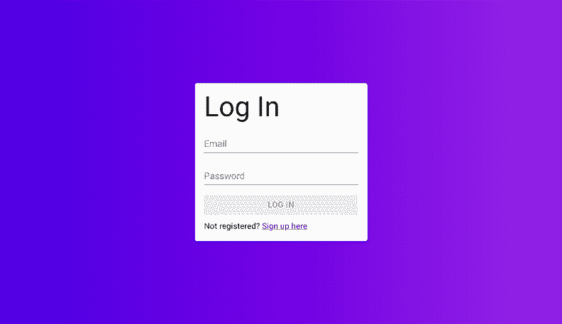

图 6.7 当您首次启动 SLIC 列表时，您可以注册创建账户并登录。

一旦您登录，您就可以创建一个列表，如图 6.8 所示。

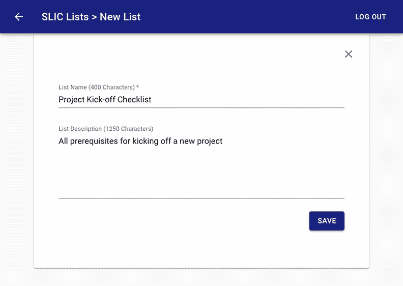

图 6.8 SLIC 列表允许您创建和管理清单。在这里，我们通过输入标题和可选的描述来创建一个清单。在无服务器后端，这会在 DynamoDB 中创建一个项。它还会触发一个事件驱动的流程，结果是通过电子邮件发送欢迎信息给列表创建者。

最后，您可以为清单添加一些条目。这如图 6.9 所示。

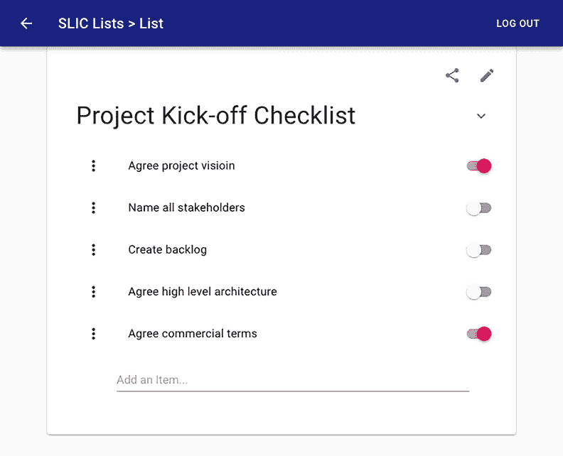

图 6.9 在这里，我们向清单中添加了一些项目。这一步将条目添加到我们刚刚创建的清单项中。如果您对如何使用 DynamoDB 数据建模实现这一点感兴趣，请查看 `checklist-service` 文件夹中的 `services/checklists/entries/entries.js`。

一旦创建了清单记录，您就可以检查日志。请注意，SLIC Starter 生成的日志比您在类似系统中通常预期的要多。特别是，以 `INFO` 级别记录的信息，您合理地期望在 `DEBUG` 级别日志中看到。CloudWatch 日志的成本在这里是一个真正的考虑因素。在真实的生产系统中，您应该考虑减少日志输出，删除任何可识别的个人用户信息，并为调试日志实施采样 3。

我们检查 CloudWatch 日志的第一种方法是使用 Serverless Framework CLI。在这里，我们将使用 `serverless` `logs` 来查看 `create` 函数的最新日志。输出再次通过 `pino-pretty` 进行管道传输以提高可读性：

```
cd checklist-service
serverless logs -f create --stage <STAGE> | pino-pretty
  # STAGE is one of dev, stg or prod
```

下一个列表显示了显示 `INFO` 级别日志的日志输出。

列表 6.4 `serverless` `logs` 获取日志事件并将它们打印到控制台

```
[1576318523847] INFO  (checklist-service/7 on 169.254.50.213): Result received
    result: {
      "entId": "4dc54f8e-e28b-4de2-9456-f30caef781e4",
      "title": "Entry 2"
    }
END RequestId: fa02f8b1-2a42-46a8-83b4-a8834483fa0a
REPORT RequestId: fa02f8b1-2a42-46a8-83b4-a8834483fa0a  Duration: 74.44 ms
      Billed Duration: 100 ms Memory Size: 1024 MB
    Max Memory Used: 160 MB

START RequestId: 0e56603b-50f1-4581-b208-18139e85d597 Version: $LATEST
[1576318524826] INFO
  (checklist-service/7 on 169.254.50.213): Result received
    result: {
      "entId": "279f106f-469d-4e2d-9443-6896bc70a2d5",
      "title": "Entry 4"
    }
END RequestId: 0e56603b-50f1-4581-b208-18139e85d597
REPORT RequestId: 0e56603b-50f1-4581-b208-18139e85d597  Duration: 25.08 ms
      Billed Duration: 100 ms Memory Size: 1024 MB
    Max Memory Used: 160 MB
```

除了结构化的 JSON 日志，这些日志由 `pino-pretty` 格式化以供阅读外，我们还可以看到 Lambda 容器本身生成的日志条目。这些包括 `START`、`END` 和 `REPORT` 记录。`REPORT` 记录打印有关使用的内存和函数持续时间的有用记录。这两者在优化内存配置以实现性能和成本方面都至关重要。

选择最佳的 Lambda 内存配置 Lambda 函数按请求和每 GB-秒计费。与许多服务一样，有一个免费层——在撰写本文时，每月有 100 万次请求和 40 万 GB-秒。这意味着在您开始收费之前，您可以进行相当多的计算。一旦在生产应用程序中用完了免费层，选择每个函数的正确大小在成本和性能方面都至关重要。

当你配置 Lambda 函数时，你可以选择为其分配多少内存。内存加倍将使每秒执行成本加倍。然而，分配更多内存也会线性增加函数的 vCPU 分配。

假设你有一个函数，在 960MB 内存的 Lambda 函数中执行需要 212ms，但在 1024MB 内存的函数中执行只需要 190ms。更高内存配置的 GB-秒定价将大约高 6%，但由于执行是按 100ms 单位计费，较低内存配置将使用 50%更多的单位（3 个而不是 2 个）。出人意料的是，更高内存配置将显著更便宜，并带来更好的性能。

类似地，如果你有一个通常在 10ms 内执行完成的函数，且延迟不是那么关键，你可能更倾向于使用较低的内存配置，减少 CPU 分配，并让它执行时间接近 100ms。

### 6.5.3 使用 CloudWatch 日志洞察搜索日志

我们已经看到了如何在命令行中检查单个函数的日志。同样，你还可以在 AWS 管理控制台中查看单个日志流。这在开发期间很有用，但在你部署了许多函数且在生产系统中频繁执行时，作用就较小了。为此，你需要能够搜索 TB 级日志数据的大规模、集中式日志记录。CloudWatch 日志洞察是一个方便的服务，且无需预先设置。它可以在 AWS 管理控制台的 CloudWatch 服务下的洞察部分找到。图 6.10 显示了有关标题中包含“启动”短语清单的日志查询。

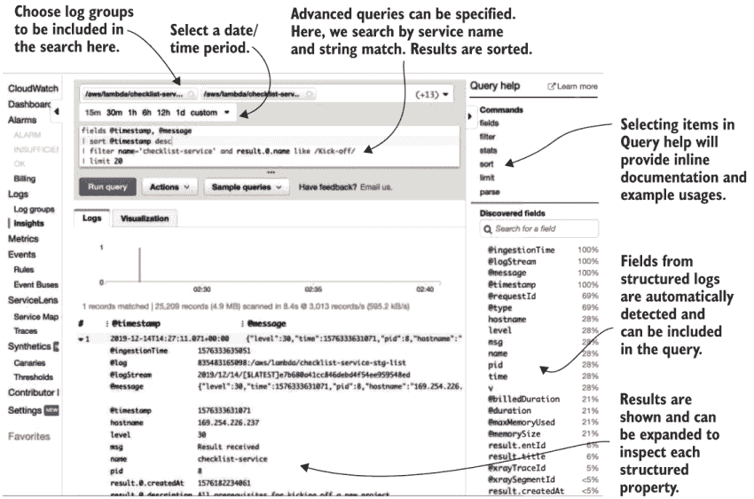

图 6.10 CloudWatch 日志洞察允许你在多个日志组中运行复杂的查询。

这里显示的查询是一个简单的示例。查询语法支持许多函数和操作。你可以执行算术和统计运算，以及提取字段、排序和过滤。图 6.11 展示了我们如何通过从每个执行的`REPORT`日志中提取数据来使用统计函数分析 Lambda 的内存使用量和持续时间。

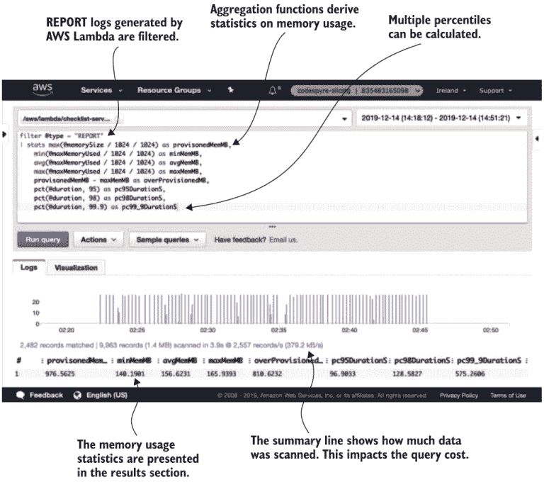

图 6.11 使用 Lambda `REPORT`日志进行统计和算术运算，可以分析函数是否配置了最优的内存量以实现成本和性能。在此，我们展示了内存使用情况，并将最大内存使用量与配置的内存容量进行比较。我们还展示了函数持续时间的 95%，98%和 99.9 百分位数，以获得性能的直观感受。

在示例中，我们分配了比所需更多的内存。这可能意味着可以将容器的内存大小减少到 256MB。由于正在分析的功能仅调用 DynamoDB 写入操作，它比 CPU 密集型更偏向 I/O 密集型。因此，减少其内存和 CPU 分配不太可能对执行持续时间产生重大影响。

您现在应该已经很好地理解了如何通过集中式、结构化的日志以及 CloudWatch 日志洞察来为您的应用程序添加可观察性。接下来，我们将探讨您可以观察和创建的指标，以进一步了解应用程序的行为。

## 6.6 监控服务和应用指标

作为实现可观察性目标的一部分，我们希望能够创建和查看指标。指标可以是特定于服务的，例如并发执行的 Lambda 函数的数量。它们也可以是特定于应用的，例如清单中的条目数量。AWS 提供了一个名为 CloudWatch 指标的指标存储库。此服务收集单个指标并允许您查看它们的聚合。请注意，一旦收集了单个指标数据点，就无法查看。相反，您可以请求给定时间段内的统计数据，例如每分钟计数指标的求和。

CloudWatch 指标的默认最小周期为 1 分钟。可以添加具有 1 秒分辨率的自定义高分辨率指标。保留 3 小时后，高分辨率指标将聚合到 1 分钟间隔。

### 6.6.1 服务指标

许多 AWS 服务默认为大多数服务发布指标。无论您是使用 CloudWatch 指标还是其他指标解决方案，了解发布的指标以及您应该监控哪些指标都至关重要。表 6.2 列出了 AWS 服务样本的一些指标。我们选择了与第 2-5 章中构建的 AI 应用特别相关的示例。

表 6.2 AWS 服务发布 CloudWatch 指标，可以监控以深入了解系统行为。理解和观察与您使用的服务相关的指标非常重要。

| 服务 | 示例指标 |
| --- | --- |
| Lex4 | `未接收到的话语数量`, `Polly 运行时错误` |
| Textract5 | `用户错误数量`, `响应时间` |
| Rekognition6 | `检测到的面孔数量`, `检测到的标签数量` |
| Polly7 | `请求字符数`, `响应延迟` |
| DynamoDB8 | `返回字节`, `消耗的写入容量单元` |
| Lambda9 | `调用次数`, `错误`, `迭代器年龄`, `并发执行数` |

对我们所使用的所有服务的所有指标的彻底覆盖超出了本书的范围。我们建议您在阅读本书时，探索您迄今为止构建的应用程序的 AWS 管理控制台中的 CloudWatch Metrics 部分。有关服务和它们的指标的综合列表可以在 AWS 文档中找到。10

### 6.6.2 应用指标

除了 AWS 服务发布的内置指标外，CloudWatch Metrics 还可以用作自定义应用指标的存储库。在本节中，我们将探讨添加指标需要哪些步骤。让我们回顾一下 SLIC Starter 项目中的清单应用程序。我们可能想要收集一些特定于应用程序的指标，这些指标可以告诉我们产品是如何进一步开发的。假设我们正在考虑为应用程序开发一个 Alexa 技能。一个 *Alexa 技能* 是一个 AWS 中的无服务器应用程序，允许用户通过智能扬声器设备与一项服务进行交互。这将与第五章中 Lex 驱动的待办事项聊天机器人非常相似！为了设计这个技能，我们的用户体验部门想要收集有关用户当前如何使用 *SLIC 列表* 的统计数据。具体来说，我们想要了解以下内容：

+   用户在清单中添加了多少条目？

+   一个典型的清单条目中有多少个单词？

使用 CloudWatch Metrics，我们可以有两种方法来添加这些指标：

+   使用 AWS SDK 并调用 `putMetricData` API11

+   使用根据 *嵌入式指标格式* 特别格式化的日志

使用 `putMetricData` API 有一个缺点。进行此类 SDK 调用将导致底层 HTTP 请求。这会给我们的代码添加不必要的延迟。我们将改用嵌入式指标格式日志。这种方法要求我们创建一个特别格式化的日志消息，其中包含我们想要生成的指标的所有详细信息。由于我们使用 CloudWatch 日志，CloudWatch 将自动检测、解析并将此日志消息转换为 CloudWatch 指标。编写此日志消息的开销将对代码的性能产生微乎其微的影响。此外，原始指标将在我们保留日志的时间内可用。

让我们看看我们是如何生成这些指标日志以及结果看起来像什么。日志消息格式的概述如下所示。

列表 6.5 嵌入式指标格式日志的结构

```
{
  "_aws": {                            ❶
    "Timestamp": 1576354561802,
    "CloudWatchMetrics": [
      {
        "Namespace": "namespace"       ❷
        "Dimensions": [["stagej"]]     ❸
        "Metrics": [
          {
            "Name": "Duration",        ❹
            "Unit": "Milliseconds"12
          }
        ],
        ...
      }
    ]
  },
  "stage": "prod",                     ❺
  "Duration": 1                        ❻
}
```

❶ `_aws` 属性定义了我们指标的元数据。

❷ 指标的命名空间是此指标所属的分组。

❸ 每个指标可以指定多达十个维度。维度是一个将指标分类的名称-值对。

❹ 在这里定义了一个单一指标，给它一个名称和单位。AWS 文档中定义了一个支持的指标单位列表。5

❺ 在元数据中命名的维度的值在这里给出。

❻ 在元数据中命名的指标的值在这里提供。

这些符合 JSON 结构的日志消息会自动被 CloudWatch 识别，并导致创建 CloudWatch 指标，同时最小化性能开销。我们可以在 Lambda 函数代码中使用`console.log`创建此 JSON 结构并将其记录到 CloudWatch 日志中。另一种方法是使用`aws-embedded-metrics` Node.js 模块。13 此模块为我们提供了一系列用于记录指标的函数。在这种情况下，我们将使用`createMetricsLogger`函数。我们将在`checklist-service/services/checklists/entries/entries.js`中添加指标记录代码。请参阅以下列表，以获取`addEntry`函数的相关摘录。

列表 6.6 符合嵌入式指标格式的结构化日志

```
const metrics = createMetricsLogger()                                      ❶
metrics.putMetric('NumEntries', Object.keys(entries).length, Unit.Count)   ❷
metrics.putMetric('EntryWords', title.trim().split(/s/).length, Unit.Count)❸
await metrics.flush()                                                      ❹
```

❶ `createMetricsLogger`创建了一个我们可以显式调用的记录器。`aws-embedded-metrics`模块还提供了一个包装器或“装饰器”函数，以避免显式调用刷新。

❷ 将清单中的条目数量记录为计数指标。

❸ 记录清单条目中的单词数量。

❹ 我们刷新指标以确保它们被写入控制台输出。

要生成一些指标，我们需要用不同的输入调用此函数。SLIC Starter 端到端集成测试包括一个创建具有条目计数和单词计数的清单的测试，这些计数根据现实分布。我们可以多次运行此测试以在 CloudWatch 中获得一些合理的指标。

SLIC Starter 的集成测试中有一些设置步骤。查看`integration-tests`文件夹中的`README.md`文件。一旦您已准备好测试并验证可以运行一次，我们就可以运行一批集成测试来模拟一些负载：

```
cd integration-tests
./load.sh
```

`load.sh`脚本并行运行随机数量的集成测试执行，并重复此过程，直到完成 100 次。现在，我们可以进入 AWS 管理控制台的 CloudWatch 指标部分，以可视化清单条目的统计数据。

当您在控制台中选择 CloudWatch 指标时，视图应该类似于图 6.12。

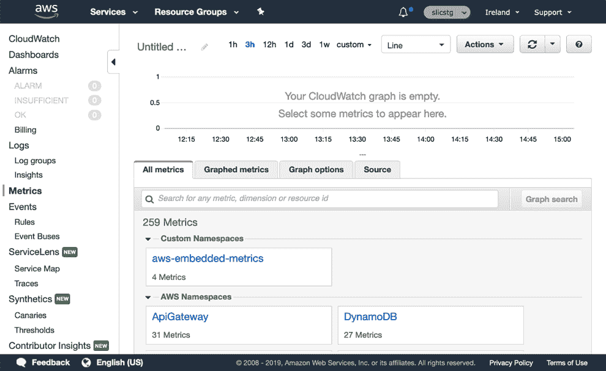

图 6.12 在 AWS 管理控制台中浏览到 CloudWatch 指标视图，允许您从自定义命名空间和 AWS 服务的命名空间中选择。

从这里，选择`aws-embedded-metrics`命名空间。这会带您到一个表格，您可以在其中看到所选命名空间内的维度集。如图 6.13 所示。

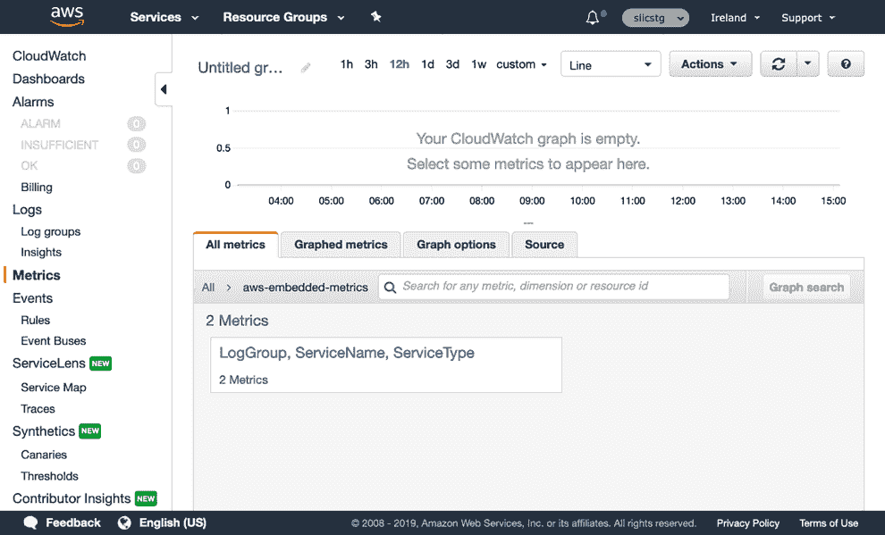

图 6.13 一旦选择了命名空间，下一步就是选择维度集。

通过唯一选项进行点击以显示可查看的指标。从`addEntry`函数中选择两个指标，如图 6.14 所示。

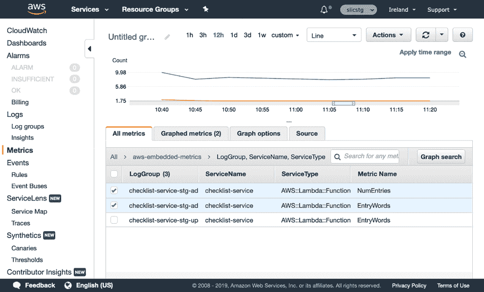

图 6.14 CloudWatch 指标控制台呈现所选命名空间和维度内的所有指标。点击每个旁边的复选框将指标添加到显示的图表中。

我们现在想自定义这些指标的展示方式。首先，让我们添加到默认的平均统计信息。这可以通过切换到“图形指标”选项卡来完成。在每个指标旁边选择复制图标。对于 NumEntries 和 EntryWords 指标，都这样做两次。这将创建平均指标的副本。将每个副本中的一个更改为使用最大值和 p95 统计信息。最后，将图表类型从折线图更改为数字图。最终视图应该看起来像图 6.15。

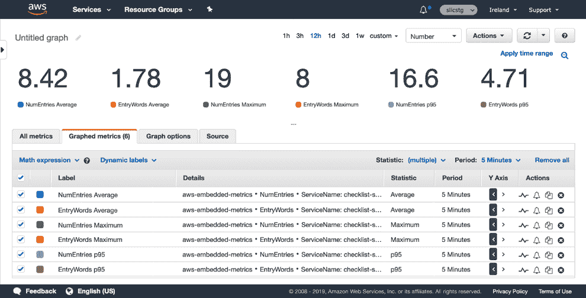

图 6.15 切换到“图形指标”选项卡允许您自定义和复制指标。在这里，我们为相同的两个指标选择了新的统计信息。将图表从折线图切换到数字图也为我们提供了所需统计信息的简单直观视图。

在这种情况下，使用数字可视化而不是折线图更有用，因为随着时间的推移在折线图上查看的值的变化对这些指标来说并不有趣。我们最终得到了一些简单的数字，可以帮助我们的用户体验团队设计 Alexa 技能！我们知道大多数条目少于五个单词，平均为两个单词。平均列表大约有 8 个条目，95%的条目少于 16.6。

### 6.6.3 使用指标创建警报

在这个阶段，你已经看到了理解和监控 AWS 服务指标以及自定义应用指标的价值。当你遇到无法解释的系统行为时，这些知识应该能帮助你开始揭示一些未知因素。然而，等到出现问题才开始寻找答案并不是一个好主意。最好是思考正常系统行为是什么，并为系统行为偏离这一正常状态时创建警报。*警报*是在达到指定条件时对系统操作员的通知。通常，我们会为以下偏差设置警报：

1.  一个计数 AWS 服务内错误数量的指标，当值大于给定数字时触发。例如，我们可能希望在五分钟内所有函数的 Lambda 调用次数超过 10 次时收到警报。

1.  我们对最终用户的服务水平已经达到了不可接受的程度。一个例子是，对于关键 API 端点的 API 网关延迟指标的 99 百分位数超过 500ms。

1.  商业指标对于创建警报来说非常有价值。从终端用户的角度来看，通常更容易创建与交互相关的阈值。例如，在我们的 SLIC Starter 应用程序中，我们可能知道每小时通常会有 50 到 60 个清单被创建。如果这个数字远远低于这个阈值，我们就可以收到警报并调查。这可能是活动中的偶然变化，也可能是我们可能没有检测到的潜在技术问题。

在 AWS 的背景下，像这样的警报可以通过 CloudWatch Alarms 实现。警报始终基于 CloudWatch 指标。可以定义使用的周期和统计量（例如，*5 分钟*内的*平均*延迟）。警报的阈值可以是基于数值，也可以是基于标准差带进行异常检测。CloudWatch Alarms 的警报机制是通过 SNS 主题实现的。*SNS*（或*简单通知服务*）是一种用于发送事件的发布/订阅服务。SNS 允许通过电子邮件、短信或 webhook 将警报发送到另一个服务，包括 SQS 和 Lambda。

创建警报的全面示例超出了本章的范围。使用 AWS 管理控制台进行实验和创建一些警报是值得的。一旦你熟悉了 CloudWatch Alarms 的配置选项，你就可以在`serverless.yml`文件中将它们作为资源创建。以下资源还可以让我们以更少的配置创建警报：

+   *Serverless 应用程序仓库*提供了可以包含在您自己的应用程序中的托管 CloudFormation 堆栈。其他组织已经发布了简化创建合理警报集的堆栈。一个例子是*SAR-cloudwatch-alarms-macro*应用程序。14 它为 AWS Lambda、API Gateway、AWS Step Functions 和 SQS 中的常见错误创建警报。

+   适用于 Serverless Framework 的插件，如 AWS Alerts Plugin ([`mng.bz/jVre`](http://mng.bz/jVre))，使创建警报的过程更加简单。

## 6.7 使用跟踪来理解分布式应用程序

在本章的开头，我们提到，无服务器开发中的一个挑战是系统的分布式和碎片化特性。这一方面使得可视化或推理整个系统的行为变得更加困难。集中式日志、指标和警报的实践可以帮助解决这个问题。分布式追踪是另一个工具，它使得理解无服务器系统中数据流变得可能。在 AWS 生态系统中，分布式追踪由 X-Ray 和 CloudWatch ServiceLens 提供。X-Ray 是底层追踪服务，ServiceLens 是 CloudWatch 控制台中提供与日志和指标集成的追踪可视化的区域。还有商业替代方案，如 Datadog、Lumigo 和 Epsagon。尽管这些方案确实值得探索，但我们将使用托管 AWS 服务，因为它们足以演示和学习可观察性和追踪的概念。

### 6.7.1 启用 X-Ray 追踪

分布式追踪的目的是监控和评估请求在系统中通过多个服务时的性能。最好的说明方式是使用一个视觉示例。考虑在 SLIC Starter 应用程序中创建清单的场景。从用户在前端点击保存按钮的那一刻起，图 6.16 中所示的序列发生。

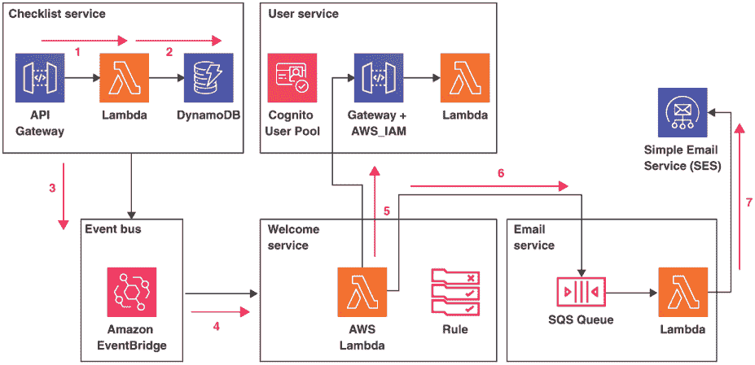

图 6.16 服务器无服务器系统的一次典型请求会在多个服务之间产生多条消息。

1.  请求通过 API Gateway 到达清单服务中的 Lambda。

1.  这个 Lambda 调用 DynamoDB。

1.  Lambda 将“列表创建”事件发布到 Amazon EventBridge。

1.  事件被欢迎服务捕获。

1.  欢迎服务调用用户服务 API 来查找清单所有者的电子邮件地址。

1.  欢迎服务将 SQS 消息放入电子邮件服务的队列中。

1.  电子邮件服务接受传入的 SQS 消息，并使用简单电子邮件服务（SES）发送电子邮件。

这是一个相对简单的分布式工作流，但已经可以看出，这种事件链式反应对于开发者来说理解起来有多困难。想象一下在拥有数百或数千个服务的系统中的情况！通过捕获整个流程的轨迹，我们可以在 ServiceLens 中查看序列和时序。其中一部分序列在图 6.17 中显示。

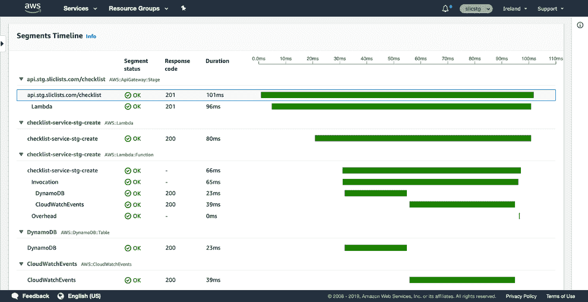

图 6.17 CloudWatch ServiceLens 显示了每个段的时序的单独轨迹。

图中的轨迹显示了分布式请求的段，包括它们的时序。请注意，这张图片与单个请求相关。使用 X-Ray，轨迹被采样。默认情况下，每秒采样一个请求，之后每 5% 的请求进行采样。这可以通过 X-Ray 控制台中的规则进行配置。

X-Ray 通过生成跟踪 ID 并将这些 ID 在请求得到满足时从一个服务传播到另一个服务来工作。为了启用此行为，开发者可以使用 AWS X-Ray SDK 来添加 AWS SDK 调用的自动跟踪仪器。这样做的影响是，包含跟踪和分段标识符的跟踪头被添加到请求中。请求数据，包括时间信息，也由 X-Ray SDK 发送到收集跟踪样本的守护进程。以下代码显示了我们在 Node.js Lambda 函数代码中初始化 X-Ray SDK 的方式：

```
const awsXray = require('aws-xray-sdk')
const AWS = awsXray.captureAWS(require('aws-sdk'))
```

此代码片段来自 SLIC Starter 中的`slic-tools/aws.js`，在加载标准 AWS SDK 之前加载 X-Ray SDK。X-Ray SDK 的`captureAWS`函数被调用以拦截所有 SDK 请求并在跟踪中创建新的分段。15 要启用 X-Ray 跟踪，还需要在 API Gateway 和 Lambda 配置中将其打开。当使用 Serverless Framework 时，这涉及到对`serverless.ymlprovider`部分的添加，如下面的代码所示：

```
tracing:
    apiGateway: true
    lambda: true
```

这是在 SLIC Starter 中的所有服务中完成的，所以您已经拥有了查看分布式跟踪结果所需的一切。

### 6.7.2 探索跟踪和映射

除了我们之前看到的单个跟踪时间线之外，X-Ray 控制台和较新的 CloudWatch ServiceLens 控制台都有显示您服务完整映射的能力。这是一个极其强大的可视化工具。图 6.18 展示了 SLIC Starter 服务映射的一个示例。

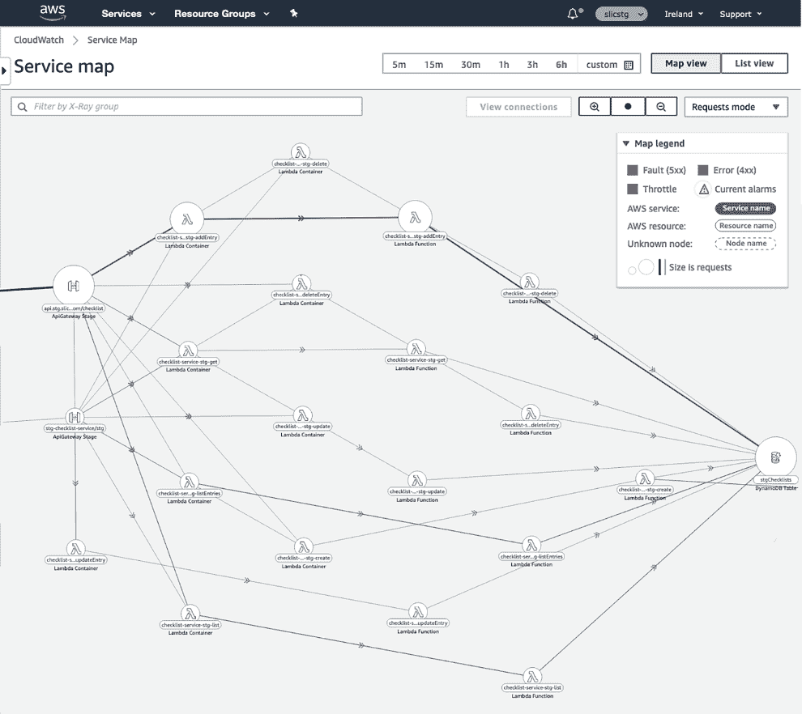

图 6.18 在 CloudWatch ServiceLens 中可以显示服务之间请求传播的映射。尽管这个图表显示了如此多的服务以至于难以阅读，但您在使用 AWS 控制台时可以选择放大和过滤。

所有可视化，包括映射和跟踪，都会显示捕获到的任何错误。映射视图显示了每个节点的错误百分比。选择映射中的任何节点将显示请求速率、延迟和错误数量。图 6.19 显示了清单服务中`deleteEntry`函数的服务映射选择，错误率为 50%。

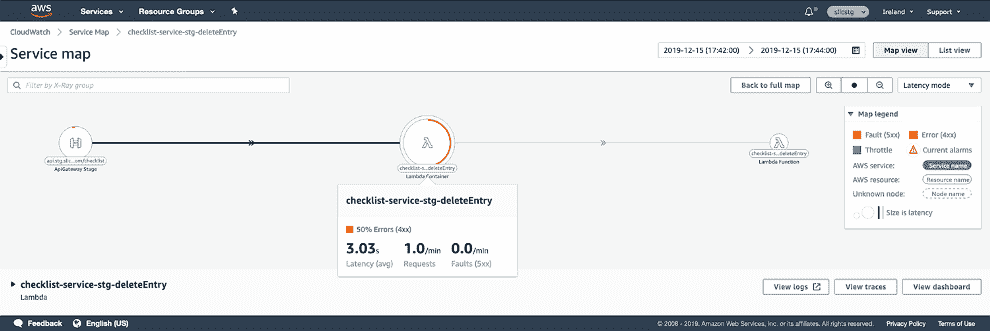

在服务映射中选择任何节点以选择“查看连接”将过滤视图以仅显示连接的服务。在这里，我们可以看到可以通过在 CloudWatch 日志中使用相关请求 ID 进一步调查的错误事件。

我们可以选择选择“查看跟踪”或“查看日志”来进一步诊断。选择“查看日志”将带我们进入 CloudWatch 日志洞察来查看此请求和时间的日志。

### 6.7.3 使用注释和自定义指标的高级跟踪

我们无法涵盖 X-Ray 和 ServiceLens 的所有用例。然而，有一些特性值得提及，因为它们在尝试寻找大规模真实生产场景的答案时特别有用：

+   *注释* 是您可以使用 X-Ray SDK 分配到跟踪段的索引键值对。这些由 X-Ray 索引，因此您可以在 X-Ray 控制台中根据它们进行筛选。16 还可以向跟踪段添加自定义元数据。这些不是索引的，但可以在控制台中查看。

+   X-Ray 分析控制台和 AWS SDK 支持创建由过滤器表达式定义的 *组*。过滤器表达式可以包括使用 X-Ray SDK 在您的代码中创建的自定义注释。

+   当定义组时，X-Ray 将创建自定义指标并将它们发布到 CloudWatch 指标。这些包括延迟、错误和节流速率。

我们建议您花些时间通过 AWS 管理控制台实验 X-Ray 的功能。这将帮助您为您的无服务器应用程序创建正确的注释、元数据和组。

## 摘要

+   可以使用 CodePipeline 和 CodeBuild 创建无服务器持续部署管道。

+   单一仓库方法是一种有效的策略，用于构建可扩展的无服务器应用程序。

+   使用可观测性最佳实践可以解决分布式无服务器应用程序架构中的挑战。

+   可以使用结构化 JSON 日志和 AWS CloudWatch 日志实现集中式日志记录。

+   使用 CloudWatch 日志洞察查看并深入日志。

+   可以使用 CloudWatch 查看服务指标。

+   可以创建特定于应用程序的自定义指标。

+   使用 X-Ray 和 ServiceLens 进行分布式跟踪使我们能够理解高度分布式的无服务器系统。

在下一章中，我们将继续探讨现实世界的 AI 即服务，重点关注将其集成到基于截然不同技术的现有系统中。

警告 请确保您完全删除本章中部署的所有云资源，以避免额外收费！

* * *

1.有关这些和其他部署策略的更多信息，请参阅 Etienne Tremel 的文章“应用程序部署的六种策略”，2017 年 11 月 21 日，thenewstack.io，[`thenewstack.io/deployment-strategies/`](https://thenewstack.io/deployment-strategies/)。

2.[可观测性简介，honeycomb.io，http://mng.bz/aw4X.](http://mng.bz/aw4X)

3.“您需要在生产中采样调试日志，” 焉桂，2018 年 4 月 28 日，[`hackernoon.com/you-need-to-sample-debug-logs-in-production-171d44087749`](https://hackernoon.com/you-need-to-sample-debug-logs-in-production-171d44087749)。

4.参见 *使用 Amazon CloudWatch 监控 Amazon Lex*[, http://mng.bz/emRq.](http://mng.bz/emRq)

5.参见 *Amazon Textract 的 CloudWatch 指标*[, http://mng.bz/pzEw.](http://mng.bz/pzEw)

6.参见 *Amazon Rekognition 的 CloudWatch 指标*[, http://mng.bz/OvAa.](http://mng.bz/OvAa)

7.参见 *将 CloudWatch 与 Amazon Polly 集成*[, http://mng.bz/YxOa.](http://mng.bz/YxOa)

8.参见 *DynamoDB 指标和维度*[, http://mng.bz/Gd2J.](http://mng.bz/Gd2J)

9.查看 *AWS Lambda 指标*，[`mng.bz/zrgA`](http://mng.bz/zrgA).

10.发布云监控指标的 AWS 服务，[`mng.bz/0Z5v`](http://mng.bz/0Z5v).

11.AWS JavaScript SDK 的 `putMetricData` 方法，[`docs.aws.amazon.com/AWSJavaScriptSDK/latest/AWS/CloudWatch.html#putMetricData-property`](https://docs.aws.amazon.com/AWSJavaScriptSDK/latest/AWS/CloudWatch.html#putMetricData-property).

12.云监控指标支持的单位在 MetricDatum 中介绍，[`mng.bz/9Azr`](http://mng.bz/9Azr).

13.`aws-embedded-metrics` 在 GitHub 上，[`github.com/awslabs/aws-embedded-metrics-node`](https://github.com/awslabs/aws-embedded-metrics-node).

14.Lumigo 的 SAR-cloudwatch-alarms-macro，[`mng.bz/WqeW`](http://mng.bz/WqeW).

15.使用 Node.js 的 X-Ray SDK 查看 AWS SDK 调用的跟踪，[`mng.bz/8GyD`](http://mng.bz/8GyD).

16.使用 Node.js 的 X-Ray SDK 为段添加注释和元数据，[`mng.bz/EEeR`](http://mng.bz/EEeR).
